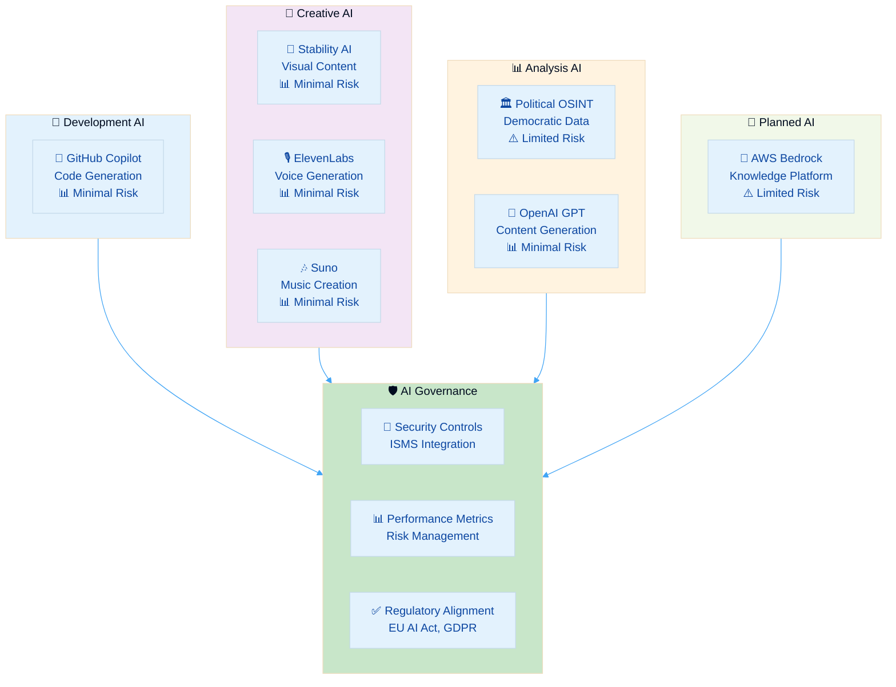
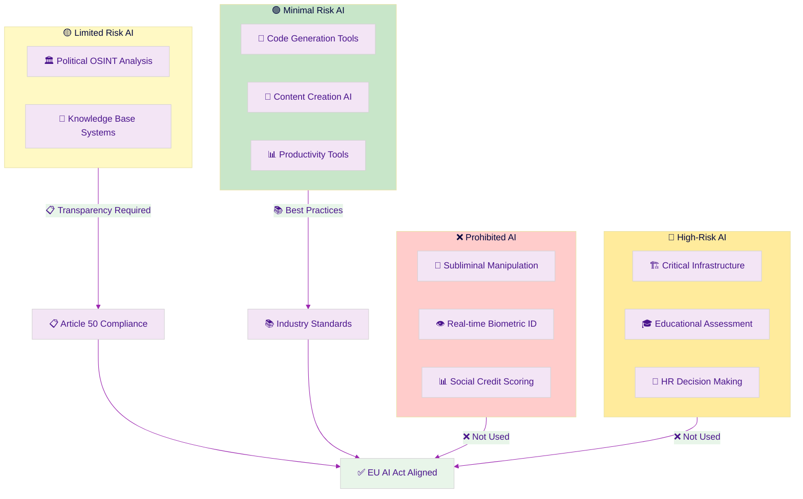
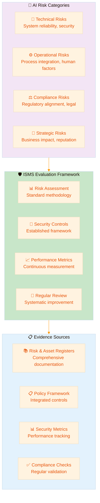
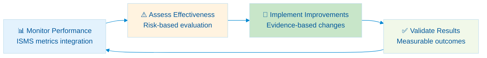

  

<h1 align="center">🤖 Hack23 AB — AI Governance Policy</h1>

  <strong>🛡️ Systematic AI Risk Management Through Transparent Governance</strong> 
  <em>🎯 Enterprise-Grade AI Security Demonstrating Cybersecurity Excellence</em>

  
  
  
  

  
  
  

**📋 Document Owner:** CEO | **📄 Version:** 1.0 | **📅 Last Updated:** 2025-09-16 (UTC)  
**🔄 Review Cycle:** Quarterly | **⏰ Next Review:** 2025-12-16

---

## 🎯 **Purpose Statement**

**🏢 Hack23 AB's** AI governance policy demonstrates how **🔧 systematic AI risk management directly enables both innovation excellence and regulatory alignment.** Our comprehensive AI framework serves as both operational necessity and client demonstration of our cybersecurity consulting methodologies applied to emerging AI technologies.

This policy establishes mandatory standards for all AI usage within Hack23 AB, ensuring responsible deployment of AI technologies while maintaining alignment with [🇪🇺 EU AI Act](https://eur-lex.europa.eu/legal-content/EN/TXT/?uri=celex%3A32024R1689) requirements and demonstrating thought leadership in AI security governance.

**🔗 ISMS Integration Framework:**
- **🛡️ Security Foundation:** Extends [🔐 Information Security Policy](./Information_Security_Policy.md)
- **📊 Risk Management:** Applies [📊 Risk Assessment Methodology](./Risk_Assessment_Methodology.md)
- **💻 Asset Tracking:** Integrates with [💻 Asset Register](./Asset_Register.md)
- **🤝 Vendor Management:** References [🤝 Third Party Management](./Third_Party_Management.md)

*— 👨‍💼 James Pether Sörling, CEO/Founder*

---

## 🔍 **Purpose & Scope**

### 🎯 **Policy Purpose**

This policy establishes comprehensive governance for artificial intelligence systems at Hack23 AB, ensuring:

| **🔐 Security Objective** | **📋 Implementation** | **🎯 Business Outcome** |
|---------------------------|----------------------|------------------------|
| **Responsible AI Deployment** | Risk-based classification and controls |  |
| **Regulatory Alignment** | EU AI Act, GDPR, ISO 42001 compliance |  |
| **Innovation Excellence** | Transparent governance enabling technology adoption |  |

### 🌐 **Policy Scope**

This policy governs all AI-related activities:
- All AI tools and platforms documented in [💻 Asset Register](./Asset_Register.md)
- AI-generated content and intellectual property outputs
- Data processed through AI systems per [🏷️ Data Classification Policy](./Data_Classification_Policy.md)
- AI vendor relationships managed via [🤝 Third Party Management](./Third_Party_Management.md)

---

## 🏗️ **AI Ecosystem Overview**

### 📊 **Current AI Tool Classification**

Based on [🏷️ Classification Framework](https://github.com/Hack23/ISMS-PUBLIC/blob/main/CLASSIFICATION.md):

### 🎯 **AI Classification Matrix**

| AI Category | Business Criticality | EU AI Act Risk | Security Controls | Evidence Location |
|-------------|---------------------|----------------|------------------|-------------------|
| **🔧 Development AI** |  |  | Code review, human oversight | [💻 Asset Register](./Asset_Register.md) |
| **🎨 Creative AI** |  |  | IP verification, content review | [🤝 Third Party Management](./Third_Party_Management.md) |
| **📊 Analysis AI** |  |  | Transparency, bias monitoring | [CIA Platform](https://cia.hack23.org/) |
| **🧠 Knowledge AI** |  |  | Full governance, monitoring | Planned deployment |

---

## ⚖️ **EU AI Act Compliance Framework**

### 🇪🇺 **Risk Classification & Requirements**

### 📋 **Compliance Implementation Status**

| EU AI Act Requirement | Implementation | Status | Evidence |
|----------------------|----------------|--------|----------|
| **🏷️ System Classification** | Risk-based per EU AI Act categories |  | This policy + [Asset Register](./Asset_Register.md) |
| **📋 Transparency (Article 50)** | Public disclosure for Political OSINT |  | [CIA Platform](https://cia.hack23.org/) |
| **🔍 Human Oversight** | Mandatory review for all AI outputs |  | Development procedures |
| **📚 Documentation** | Technical documentation and risk assessments |  | Complete ISMS framework |

---

## 📊 **AI Risk Management Integration**

### ⚠️ **ISMS Risk Framework Application**

AI risks are evaluated using the comprehensive [📊 Risk Assessment Methodology](./Risk_Assessment_Methodology.md) and documented in [📉 Risk Register](./Risk_Register.md):

### 🎯 **Risk Control Principles**

| Risk Domain | Control Approach | ISMS Integration | Performance Measure |
|-------------|-----------------|------------------|-------------------|
| **🔧 Technical Risks** | Standard security controls applied to AI systems | [🔐 Information Security Policy](./Information_Security_Policy.md) + [🔍 Vulnerability Management](./Vulnerability_Management.md) | Zero uncontrolled technical incidents |
| **⚙️ Operational Risks** | Human oversight and process integration | [🔑 Access Control Policy](./Access_Control_Policy.md) + [📝 Change Management](./Change_Management.md) | 100% human validation compliance |
| **⚖️ Compliance Risks** | Regulatory alignment monitoring | Legal review + policy compliance | Full regulatory compliance |
| **🎯 Strategic Risks** | Business impact assessment and mitigation | [📉 Risk Register](./Risk_Register.md) + [🔄 Business Continuity Plan](./Business_Continuity_Plan.md) | Business objective achievement |

---

## 🛡️ **Security Controls Framework**

### 🔒 **ISMS Control Application**

AI security leverages the complete ISMS control framework rather than AI-specific controls:

| Security Domain | Control Source | AI Application | Performance Target |
|-----------------|---------------|----------------|-------------------|
| **🔑 Access Management** | [Access Control Policy](./Access_Control_Policy.md) | AI tool access and authentication | 100% MFA compliance |
| **🏷️ Data Protection** | [Data Classification Policy](./Data_Classification_Policy.md) | AI data handling and privacy | Zero classification violations |
| **🌐 Network Security** | [Network Security Policy](./Network_Security_Policy.md) | AI system communications | Full network protection |
| **🔒 Cryptography** | [Cryptography Policy](./Cryptography_Policy.md) | AI data encryption standards | Strong encryption compliance |
| **📊 Monitoring** | [Security Metrics](./Security_Metrics.md) | AI usage tracking | Real-time visibility |

### 🤝 **Vendor Management Approach**

AI vendors are evaluated using the standard [🤝 Third Party Management](./Third_Party_Management.md) framework:

- **Risk Assessment:** Standard supplier risk methodology applied to AI vendors
- **Due Diligence:** Comprehensive evaluation per third-party management procedures
- **Contract Management:** Standard security requirements and monitoring
- **Performance Monitoring:** Regular supplier assessment and review cycles

Detailed vendor evaluations, risk assessments, and security requirements are managed through the established third-party management process.

---

## 📊 **Performance Measurement Framework**

### 📈 **ISMS Metrics Integration**

AI governance performance is measured through [📊 Security Metrics](./Security_Metrics.md):

| Performance Category | ISMS Metric | AI Application | Target Performance |
|---------------------|-------------|----------------|-------------------|
| **🛡️ Security Effectiveness** | Security incident rate | AI-related incidents | Zero incidents |
| **✅ Compliance Status** | Regulatory compliance | EU AI Act alignment | 100% compliance |
| **🎯 Operational Excellence** | Process efficiency | AI integration success | Target achievement |
| **💰 Business Value** | ROI measurement | AI business contribution | Positive return |

### 🔄 **Continuous Improvement**

#### **Review and Enhancement Process**

#### **Improvement Framework**

| Review Area | ISMS Integration | Assessment Method | Improvement Action |
|-------------|-----------------|------------------|-------------------|
| **Policy Effectiveness** | Policy review cycle | Quarterly assessment | Policy refinement |
| **Control Performance** | Security metrics | KPI analysis | Control enhancement |
| **Risk Management** | Risk register updates | Risk assessment | Treatment adjustment |
| **Compliance Status** | Regulatory monitoring | Compliance review | Compliance improvement |

---

## 🌐 **External Standards Integration**

### 📋 **Regulatory and Framework Alignment**

   
   
   
  

### 🎯 **Framework Integration Benefits**

| External Framework | ISMS Integration | AI Application | Business Value |
|-------------------|-----------------|----------------|----------------|
| **EU AI Act** | Regulatory monitoring integration | Regulatory alignment | Market access |
| **ISO/IEC 42001** | Management system alignment | AI governance structure | Industry recognition |
| **NIST AI RMF** | Risk management enhancement | AI risk methodology | Best practice adoption |
| **Professional Standards** | External stakeholder engagement | Competency validation | Credibility enhancement |

---

## 📚 **Related ISMS Documents**

### 🔗 **Core Integration**
- **[🔐 Information Security Policy](./Information_Security_Policy.md)** — Overall governance framework
- **[📊 Risk Assessment Methodology](./Risk_Assessment_Methodology.md)** — Risk evaluation approach
- **[💻 Asset Register](./Asset_Register.md)** — AI tool inventory and classification
- **[🤝 Third Party Management](./Third_Party_Management.md)** — Vendor risk assessment

### 🛡️ **Supporting Policies**
- **[🔑 Access Control Policy](./Access_Control_Policy.md)** — AI system access and authentication
- **[🏷️ Data Classification Policy](./Data_Classification_Policy.md)** — AI data handling and protection
- **[📊 Security Metrics](./Security_Metrics.md)** — Performance measurement and KPIs
- **[🚨 Incident Response Plan](./Incident_Response_Plan.md)** — Incident response procedures
- **[🔍 Vulnerability Management](./Vulnerability_Management.md)** — Vulnerability assessment and testing
- **[🤝 External Stakeholder Registry](./External_Stakeholder_Registry.md)** — Professional networks and authority contacts

### 🔄 **Process Integration**
- **[📝 Change Management](./Change_Management.md)** — AI system change control
- **[🌐 Network Security Policy](./Network_Security_Policy.md)** — AI system network protection
- **[🔒 Cryptography Policy](./Cryptography_Policy.md)** — AI data encryption standards
- **[🔄 Business Continuity Plan](./Business_Continuity_Plan.md)** — AI service continuity
- **[🌐 ISMS Transparency Plan](./ISMS_Transparency_Plan.md)** — Public disclosure strategy

---

**📋 Document Control:**  
**✅ Approved by:** James Pether Sörling, CEO  
**📤 Distribution:** Public  
**🏷️ Classification:**   
**📅 Effective Date:** 2025-09-16  
**⏰ Next Review:** 2025-12-16   
**🎯 Framework Compliance:**   

  
  
  

