  

<h1 align="center">🤖 Hack23 AB — AI Governance Policy</h1>

  <strong>🛡️ Systematic AI Risk Management Through Transparent Governance</strong> 
  <em>🎯 Enterprise-Grade AI Security Demonstrating Cybersecurity Excellence</em>

  
  
  
  

  
  
  

**📋 Document Owner:** CEO | **📄 Version:** 2.0 | **📅 Last Updated:** 2025-11-27 (UTC)  
**🔄 Review Cycle:** Quarterly | **⏰ Next Review:** 2026-02-26

---

## 🎯 **Purpose Statement**

**🏢 Hack23 AB's** AI governance policy demonstrates how **🔧 systematic AI risk management directly enables both innovation excellence and regulatory alignment.** Our comprehensive AI framework serves as both operational necessity and client demonstration of our cybersecurity consulting methodologies applied to emerging AI technologies.

This policy establishes mandatory standards for all AI usage within Hack23 AB, ensuring responsible deployment of AI technologies while maintaining alignment with [🇪🇺 EU AI Act](https://eur-lex.europa.eu/legal-content/EN/TXT/?uri=celex%3A32024R1689) requirements and demonstrating thought leadership in AI security governance.

**🔗 ISMS Integration Framework:**
- **🛡️ Security Foundation:** Extends [🔐 Information Security Policy](./Information_Security_Policy.md)
- **📊 Risk Management:** Applies [📊 Risk Assessment Methodology](./Risk_Assessment_Methodology.md)
- **💻 Asset Tracking:** Integrates with [💻 Asset Register](./Asset_Register.md)
- **🤝 Vendor Management:** References [🤝 Third Party Management](./Third_Party_Management.md)

*— 👨‍💼 James Pether Sörling, CEO/Founder*

---

## 🔍 **Purpose & Scope**

### 🎯 **Policy Purpose**

This policy establishes comprehensive governance for artificial intelligence systems at Hack23 AB, ensuring:

| **🔐 Security Objective** | **📋 Implementation** | **🎯 Business Outcome** |
|---------------------------|----------------------|------------------------|
| **Responsible AI Deployment** | Risk-based classification and controls |  |
| **Regulatory Alignment** | EU AI Act, GDPR, ISO 42001 compliance |  |
| **Innovation Excellence** | Transparent governance enabling technology adoption |  |

### 🌐 **Policy Scope**

This policy governs all AI-related activities:
- All AI tools and platforms documented in [💻 Asset Register](./Asset_Register.md)
- AI-generated content and intellectual property outputs
- Data processed through AI systems per [🏷️ Data Classification Policy](./Data_Classification_Policy.md)
- AI vendor relationships managed via [🤝 Third Party Management](./Third_Party_Management.md)

---

## 🏗️ **AI Ecosystem Overview**

### 📊 **Current AI Tool Classification**

Based on [🏷️ Classification Framework](https://github.com/Hack23/ISMS-PUBLIC/blob/main/CLASSIFICATION.md):

```mermaid
%%{
  init: {
    'theme': 'base',
    'themeVariables': {
      'primaryColor': '#1565C0',
      'primaryTextColor': '#0d47a1',
      'lineColor': '#1565C0',
      'secondaryColor': '#4CAF50',
      'tertiaryColor': '#FF9800'
    }
  }
}%%
graph TD
    subgraph DEVELOPMENT["🔧 Development AI"]
        COPILOT[🔧 GitHub Copilot<br/>Code Generation<br/>📊 Minimal Risk]
    end
    
    subgraph CREATIVE["🎨 Creative AI"]
        STABILITY[🎨 Stability AI<br/>Visual Content<br/>📊 Minimal Risk]
        VOICE[🎙️ ElevenLabs<br/>Voice Generation<br/>📊 Minimal Risk]
        MUSIC[🎶 Suno<br/>Music Creation<br/>📊 Minimal Risk]
    end
    
    subgraph ANALYSIS["📊 Analysis AI"]
        OSINT[🏛️ Political OSINT<br/>Democratic Data<br/>⚠️ Limited Risk]
        CHATGPT[💬 OpenAI GPT<br/>Content Generation<br/>📊 Minimal Risk]
    end
    
    subgraph PLANNED["🧠 Planned AI"]
        BEDROCK[🧠 AWS Bedrock<br/>Knowledge Platform<br/>⚠️ Limited Risk]
    end
    
    subgraph GOVERNANCE["🛡️ AI Governance"]
        CONTROLS[🔐 Security Controls<br/>ISMS Integration]
        MONITORING[📊 Performance Metrics<br/>Risk Management]
        COMPLIANCE[✅ Regulatory Alignment<br/>EU AI Act, GDPR]
    end
    
    DEVELOPMENT --> GOVERNANCE
    CREATIVE --> GOVERNANCE
    ANALYSIS --> GOVERNANCE
    PLANNED --> GOVERNANCE
    
    style DEVELOPMENT fill:#1565C0
    style CREATIVE fill:#7B1FA2
    style ANALYSIS fill:#FF9800
    style PLANNED fill:#4CAF50
    style GOVERNANCE fill:#4CAF50
```

### 🎯 **AI Classification Matrix**

| AI Category | Business Criticality | EU AI Act Risk | Security Controls | Evidence Location |
|-------------|---------------------|----------------|------------------|-------------------|
| **🔧 Development AI** |  |  | Code review, human oversight | [💻 Asset Register](./Asset_Register.md) |
| **🨠Creative AI** |  |  | IP verification, content review | [🤠Third Party Management](./Third_Party_Management.md) |
| **📊 Analysis AI** |  |  | Transparency, bias monitoring | [CIA Platform](https://cia.hack23.org/) |
| **🧠 Knowledge AI** |  |  | Full governance, monitoring | Planned deployment |

---

## ⚖️ **EU AI Act Compliance Framework**

### 🇪🇺 **Risk Classification & Requirements**

```mermaid
%%{
  init: {
    'theme': 'base',
    'themeVariables': {
      'primaryColor': '#7B1FA2',
      'primaryTextColor': '#4a148c',
      'lineColor': '#7B1FA2',
      'secondaryColor': '#4CAF50',
      'tertiaryColor': '#FFC107'
    }
  }
}%%
flowchart TD
    subgraph PROHIBITED["❌ Prohibited AI"]
        MANIPULATION["🧠 Subliminal Manipulation"]
        REALTIME_ID["👁️ Real-time Biometric ID"]
        SOCIAL_SCORING["📊 Social Credit Scoring"]
    end
    
    subgraph HIGH_RISK["🔴 High-Risk AI"]
        CRITICAL_INFRA["🏗️ Critical Infrastructure"]
        EDUCATION["🎓 Educational Assessment"]
        EMPLOYMENT["💼 HR Decision Making"]
    end
    
    subgraph LIMITED_RISK["🟡 Limited Risk AI"]
        POLITICAL["🏛️ Political OSINT Analysis"]
        BEDROCK["🧠 Knowledge Base Systems"]
    end
    
    subgraph MINIMAL_RISK["🟢 Minimal Risk AI"]
        COPILOT["🔧 Code Generation Tools"]
        CREATIVE["🎨 Content Creation AI"]
        PRODUCTIVITY["📊 Productivity Tools"]
    end
    
    PROHIBITED --> |"❌ Not Used"| ALIGNED["✅ EU AI Act Aligned"]
    HIGH_RISK --> |"❌ Not Used"| ALIGNED
    LIMITED_RISK --> |"📋 Transparency Required"| TRANSPARENCY["📋 Article 50 Compliance"]
    MINIMAL_RISK --> |"📚 Best Practices"| BEST_PRACTICES["📚 Industry Standards"]
    
    TRANSPARENCY --> ALIGNED
    BEST_PRACTICES --> ALIGNED
    
    style PROHIBITED fill:#D32F2F
    style HIGH_RISK fill:#FFC107
    style LIMITED_RISK fill:#FFC107
    style MINIMAL_RISK fill:#4CAF50
    style ALIGNED fill:#4CAF50
```

### 📋 **Compliance Implementation Status**

| EU AI Act Requirement | Implementation | Status | Evidence |
|----------------------|----------------|--------|----------|
| **🏷️ System Classification** | Risk-based per EU AI Act categories |  | This policy + [Asset Register](./Asset_Register.md) |
| **📋 Transparency (Article 50)** | Public disclosure for Political OSINT |  | [CIA Platform](https://cia.hack23.org/) |
| **🔠Human Oversight** | Mandatory review for all AI outputs |  | Development procedures |
| **📚 Documentation** | Technical documentation and risk assessments |  | Complete ISMS framework |

---

## 📊 **AI Risk Management Integration**

### ⚠️ **ISMS Risk Framework Application**

AI risks are evaluated using the comprehensive [📊 Risk Assessment Methodology](./Risk_Assessment_Methodology.md) and documented in [📉 Risk Register](./Risk_Register.md):

```mermaid
%%{
  init: {
    'theme': 'base',
    'themeVariables': {
      'primaryColor': '#FF9800',
      'primaryTextColor': '#F57C00',
      'lineColor': '#ff9800',
      'secondaryColor': '#4CAF50',
      'tertiaryColor': '#1565C0'
    }
  }
}%%
graph TD
    subgraph AI_RISKS["🤖 AI Risk Categories"]
        TECHNICAL[🔧 Technical Risks<br/>System reliability, security]
        OPERATIONAL[⚙️ Operational Risks<br/>Process integration, human factors]
        COMPLIANCE[⚖️ Compliance Risks<br/>Regulatory alignment, legal]
        STRATEGIC[🎯 Strategic Risks<br/>Business impact, reputation]
    end
    
    subgraph ISMS_EVALUATION["🛡️ ISMS Evaluation Framework"]
        RISK_ASSESS[📊 Risk Assessment<br/>Standard methodology]
        CONTROLS[🔐 Security Controls<br/>Established framework]
        MONITORING[📈 Performance Metrics<br/>Continuous measurement]
        REVIEW[🔄 Regular Review<br/>Systematic improvement]
    end
    
    subgraph EVIDENCE["📋 Evidence Sources"]
        REGISTERS[📚 Risk & Asset Registers<br/>Comprehensive documentation]
        POLICIES[📋 Policy Framework<br/>Integrated controls]
        METRICS[📊 Security Metrics<br/>Performance tracking]
        AUDITS[✅ Compliance Checks<br/>Regular validation]
    end
    
    AI_RISKS --> ISMS_EVALUATION
    ISMS_EVALUATION --> EVIDENCE
    
    style AI_RISKS fill:#7B1FA2
    style ISMS_EVALUATION fill:#4CAF50
    style EVIDENCE fill:#1565C0
```

### 🎯 **Risk Control Principles**

| Risk Domain | Control Approach | ISMS Integration | Performance Measure |
|-------------|-----------------|------------------|-------------------|
| **🔧 Technical Risks** | Standard security controls applied to AI systems | [🔐 Information Security Policy](./Information_Security_Policy.md) + [🔍 Vulnerability Management](./Vulnerability_Management.md) | Zero uncontrolled technical incidents |
| **⚙️ Operational Risks** | Human oversight and process integration | [🔑 Access Control Policy](./Access_Control_Policy.md) + [📝 Change Management](./Change_Management.md) | 100% human validation compliance |
| **⚖️ Compliance Risks** | Regulatory alignment monitoring | Legal review + policy compliance | Full regulatory compliance |
| **🎯 Strategic Risks** | Business impact assessment and mitigation | [📉 Risk Register](./Risk_Register.md) + [🔄 Business Continuity Plan](./Business_Continuity_Plan.md) | Business objective achievement |

---

## 🤖 **AI Agent Ecosystem & Curator Governance**

### 🎯 **Agent Architecture & Governance Model**

Hack23 AB implements a curated ecosystem of GitHub Copilot custom agents with explicit governance and oversight mechanisms:

```mermaid
graph TB
    subgraph "🎯 Governance Layer"
        CEO[👔 CEO<br/>Ultimate Authority]:::ceo
        SEC[🛡️ Security Owner<br/>Delegated Review]:::security
    end
    
    subgraph "🔧 Meta-Agent Layer"
        CURATOR[🔧 Curator-Agent<br/>Configuration Manager]:::curator
    end
    
    subgraph "📋 Agent Fleet"
        TASK[📋 Task Agents<br/>Analysis & Issues]:::task
        SPEC[👷 Specialist Agents<br/>Implementation]:::specialist
    end
    
    subgraph "⚙️ Configuration"
        PROFILES[🤖 Agent Profiles<br/>.github/agents/*.md]:::config
        MCP[🔌 MCP Config<br/>copilot-mcp.json]:::config
        WORKFLOW[⚙️ Workflows<br/>copilot-setup-steps.yml]:::config
    end
    
    subgraph "🔒 Enforcement"
        PR[🔀 Pull Request<br/>Required]:::control
        CI[✅ CI/CD Gates<br/>Automated Checks]:::control
        REVIEW[👀 Human Review<br/>Final Approval]:::control
    end
    
    CEO -->|Approves| CURATOR
    SEC -->|Reviews| CURATOR
    
    CURATOR -->|Modifies| PROFILES
    CURATOR -->|Modifies| MCP
    CURATOR -->|Modifies| WORKFLOW
    
    PROFILES -->|Defines| TASK
    PROFILES -->|Defines| SPEC
    MCP -->|Configures| TASK
    MCP -->|Configures| SPEC
    
    CURATOR -->|Must Use| PR
    TASK -->|Must Use| PR
    SPEC -->|Must Use| PR
    
    PR -->|Triggers| CI
    CI -->|Passes to| REVIEW
    REVIEW -->|Approval by| CEO
    
    TASK -.->|❌ Cannot Modify| PROFILES
    SPEC -.->|❌ Cannot Modify| MCP
    
    classDef ceo fill:#2E7D32,stroke:#1B5E20,stroke-width:4px,color:#fff,font-weight:bold
    classDef security fill:#1565C0,stroke:#0D47A1,stroke-width:3px,color:#fff,font-weight:bold
    classDef curator fill:#7B1FA2,stroke:#4A148C,stroke-width:3px,color:#fff,font-weight:bold
    classDef task fill:#FFC107,stroke:#F57C00,stroke-width:2px,color:#000,font-weight:bold
    classDef specialist fill:#2196F3,stroke:#1565C0,stroke-width:2px,color:#fff
    classDef config fill:#FF9800,stroke:#E65100,stroke-width:2px,color:#fff
    classDef control fill:#4CAF50,stroke:#2E7D32,stroke-width:2px,color:#fff
```

#### **🔐 Curator-Agent Role (Meta-Agent)**

The **curator-agent** is the only agent authorized to systematically create or modify other agents' configurations and prompts:

- **Authorized Modifications:**
  - `.github/agents/*.md` — Custom agent profile definitions
  - `.github/copilot-mcp*.json` — MCP server configurations
  - `.github/workflows/copilot-setup-steps.yml` — Agent bootstrap workflows

- **Required Controls:**
  - ✅ All curator-agent changes MUST be made via pull requests (PRs)
  - ✅ All PRs require CEO or designated security/ISMS owner review and approval
  - ✅ Changes MUST be mapped to risk assessment and documented in [Risk Register](./Risk_Register.md) when relevant
  - ✅ Changes MUST follow [Change Management](./Change_Management.md) procedures

- **Prohibited Actions (Core Restrictions Only):**
  - ❌ No agent may bypass CEO approval on pull requests
  - ❌ No agent may modify its own permissions or MCP configuration (curator-agent must perform such changes with CEO approval)

```mermaid
graph LR
    subgraph "✅ Allowed Actions with Automation"
        A1[🔧 Curator-Agent:<br/>Modify agent configs<br/>with CEO approval]:::allowed
        A2[📋 Task Agents:<br/>Create & auto-assign<br/>ISMS-aligned issues]:::allowed
        A3[👷 Specialist Agents:<br/>Implement changes<br/>via PR workflow]:::allowed
        A4[🤖 All Agents:<br/>Generate proposals<br/>for CEO review]:::allowed
        A5[📋 Task Agents:<br/>Coordinate specialist<br/>agent assignments]:::allowed
    end
    
    subgraph "❌ Prohibited Actions"
        P1[❌ Bypass CEO<br/>PR approval]:::prohibited
        P2[❌ Self-modify<br/>permissions/MCP]:::prohibited
    end
    
    A1 -.->|Never| P2
    A2 -.->|Never| P1
    A3 -.->|Never| P1
    A4 -.->|Never| P1
    A5 -.->|Never| P2
    
    classDef allowed fill:#4CAF50,stroke:#2E7D32,stroke-width:3px,color:#fff,font-weight:bold
    classDef prohibited fill:#F44336,stroke:#C62828,stroke-width:3px,color:#fff,font-weight:bold
```

#### **👥 Task & Specialist Agent Automation**

Task and specialist agents operate with increased automation under CEO oversight:

- **Task Agents:** 
  - Analyze systems and create ISMS-aligned improvement issues
  - **Automatically assign issues to appropriate specialist agents** based on domain expertise
  - Coordinate multi-agent workflows for complex improvements
  - CEO sets strategic direction; task agents execute analysis and coordination

- **Specialist Agents:** 
  - Implement specific changes following curated prompts and least-privilege tool access
  - Receive assignments from task agents automatically
  - Submit all work via PR workflow for CEO approval

- **All Agent Work:**
  - Generated as proposals requiring CEO approval via PR workflow
  - Workflows and agent configurations require CEO approval
  - CI/CD pipelines enforce security gates
  - ISMS-PUBLIC loaded as mandatory context
  - Secure Development Policy compliance enforced

#### **🛡️ CEO Oversight & Strategic Control**

The CEO maintains ultimate authority and approval over all agent activities:

- **Strategic Direction:**
  - CEO sets objectives and priorities for task agent analysis
  - CEO directs which repositories and systems to analyze
  - CEO defines improvement focus areas and compliance targets

- **Approval Authority:**
  - **All pull requests created by agents require CEO approval** before merge
  - **All workflow changes require CEO approval** (`.github/workflows/*.yml`)
  - **All agent configuration changes require CEO approval** (curator-agent modifications)
  - Delegated approvals possible for routine changes with CEO oversight

- **Automation with Oversight:**
  - Task agents automatically assign specialist agents (approved automation pattern)
  - Agents generate proposals and coordinate work (CEO retains final approval)
  - CI security gates provide technical validation (CEO review remains mandatory)
  - Responsibility for all production changes remains with CEO, not agents

### 📊 **Agent Risk Management**

Agent-specific risks documented in [Risk Register](./Risk_Register.md):

| Risk | Description | Controls |
|------|-------------|----------|
| **R-AGENT-001** | Misconfigured curator-agent widens agent permissions or bypasses checks | • CEO approval on curator changes • Automated validation of agent YAML • CI checks forbid certain patterns |
| **R-AGENT-002** | Agents generate policies or configurations contradicting ISMS | • ISMS documents authoritative, agents draft only • CEO review required for policy files • Explicit versioning and approval workflows |

### 🔄 **Agent Lifecycle Management**

Per [Change Management](./Change_Management.md), agent configuration files are treated as configuration items requiring change control:

- **Agent Profile Changes:** Normal change requiring CEO approval
- **MCP Configuration Changes:** Normal change with security impact assessment
- **Capability Expansion:** Requires risk evaluation and CEO approval
- **New Agent Creation:** Requires business justification and security review

```mermaid
flowchart TD
    Start([🆕 Agent Change Request]):::start
    
    Type{Change Type?}:::decision
    
    Profile[📝 Agent Profile<br/>Modification]:::change
    MCP[🔌 MCP Config<br/>Change]:::change
    Capability[⚡ Capability<br/>Expansion]:::change
    NewAgent[🤖 New Agent<br/>Creation]:::change
    
    Review1[👀 Security<br/>Impact Assessment]:::review
    Review2[📊 Risk<br/>Evaluation]:::review
    Review3[💼 Business<br/>Justification]:::review
    
    PR[🔀 Create Pull Request]:::process
    CI[✅ CI/CD Validation<br/>• YAML syntax check<br/>• Security patterns<br/>• Tool constraints]:::process
    
    CEOReview{👔 CEO<br/>Approval?}:::ceo
    
    Approved[✅ Merge & Deploy]:::success
    Rejected[❌ Rejected<br/>Document Rationale]:::failure
    
    Feedback[💬 Revise & Resubmit]:::feedback
    
    Start --> Type
    
    Type -->|Profile| Profile
    Type -->|MCP| MCP
    Type -->|Capability| Capability
    Type -->|New Agent| NewAgent
    
    Profile --> PR
    MCP --> Review1
    Capability --> Review2
    NewAgent --> Review3
    
    Review1 --> PR
    Review2 --> PR
    Review3 --> PR
    
    PR --> CI
    CI --> CEOReview
    
    CEOReview -->|Approved| Approved
    CEOReview -->|Changes Requested| Feedback
    CEOReview -->|Rejected| Rejected
    
    Feedback --> Type
    
    classDef start fill:#9E9E9E,stroke:#616161,stroke-width:3px,color:#fff,font-weight:bold
    classDef decision fill:#FFC107,stroke:#F57C00,stroke-width:3px,color:#000,font-weight:bold
    classDef change fill:#2196F3,stroke:#1565C0,stroke-width:2px,color:#fff
    classDef review fill:#FF9800,stroke:#E65100,stroke-width:2px,color:#fff
    classDef process fill:#00BCD4,stroke:#00838F,stroke-width:2px,color:#fff
    classDef ceo fill:#7B1FA2,stroke:#4A148C,stroke-width:3px,color:#fff,font-weight:bold
    classDef success fill:#4CAF50,stroke:#2E7D32,stroke-width:3px,color:#fff,font-weight:bold
    classDef failure fill:#F44336,stroke:#C62828,stroke-width:3px,color:#fff,font-weight:bold
    classDef feedback fill:#FF5722,stroke:#D84315,stroke-width:2px,color:#fff
```

---

## 🛡️ **Security Controls Framework**

### 🔒 **ISMS Control Application**

AI security leverages the complete ISMS control framework rather than AI-specific controls:

| Security Domain | Control Source | AI Application | Performance Target |
|-----------------|---------------|----------------|-------------------|
| **🔑 Access Management** | [Access Control Policy](./Access_Control_Policy.md) | AI tool access and authentication | 100% MFA compliance |
| **🏷️ Data Protection** | [Data Classification Policy](./Data_Classification_Policy.md) | AI data handling and privacy | Zero classification violations |
| **🌐 Network Security** | [Network Security Policy](./Network_Security_Policy.md) | AI system communications | Full network protection |
| **🔒 Cryptography** | [Cryptography Policy](./Cryptography_Policy.md) | AI data encryption standards | Strong encryption compliance |
| **📊 Monitoring** | [Security Metrics](./Security_Metrics.md) | AI usage tracking | Real-time visibility |

### 🤝 **Vendor Management Approach**

AI vendors are evaluated using the standard [🤝 Third Party Management](./Third_Party_Management.md) framework:

- **Risk Assessment:** Standard supplier risk methodology applied to AI vendors
- **Due Diligence:** Comprehensive evaluation per third-party management procedures
- **Contract Management:** Standard security requirements and monitoring
- **Performance Monitoring:** Regular supplier assessment and review cycles

Detailed vendor evaluations, risk assessments, and security requirements are managed through the established third-party management process.

---

## 📊 **Performance Measurement Framework**

### 📈 **ISMS Metrics Integration**

AI governance performance is measured through [📊 Security Metrics](./Security_Metrics.md):

| Performance Category | ISMS Metric | AI Application | Target Performance |
|---------------------|-------------|----------------|-------------------|
| **🛡️ Security Effectiveness** | Security incident rate | AI-related incidents | Zero incidents |
| **✅ Compliance Status** | Regulatory compliance | EU AI Act alignment | 100% compliance |
| **🎯 Operational Excellence** | Process efficiency | AI integration success | Target achievement |
| **💰 Business Value** | ROI measurement | AI business contribution | Positive return |

### 🔄 **Continuous Improvement**

#### **Review and Enhancement Process**

```mermaid
%%{
  init: {
    'theme': 'base',
    'themeVariables': {
      'primaryColor': '#1565C0',
      'primaryTextColor': '#1565C0',
      'lineColor': '#1565C0',
      'secondaryColor': '#4CAF50',
      'tertiaryColor': '#FFC107'
    }
  }
}%%
flowchart LR
    MONITOR[📊 Monitor Performance<br/>ISMS metrics integration] --> ASSESS[⚠️ Assess Effectiveness<br/>Risk-based evaluation]
    ASSESS --> IMPROVE[🔧 Implement Improvements<br/>Evidence-based changes]
    IMPROVE --> VALIDATE[✅ Validate Results<br/>Measurable outcomes]
    VALIDATE --> MONITOR
    
    style MONITOR fill:#1565C0
    style ASSESS fill:#FF9800
    style IMPROVE fill:#4CAF50
    style VALIDATE fill:#4CAF50
```

#### **Improvement Framework**

| Review Area | ISMS Integration | Assessment Method | Improvement Action |
|-------------|-----------------|------------------|-------------------|
| **Policy Effectiveness** | Policy review cycle | Quarterly assessment | Policy refinement |
| **Control Performance** | Security metrics | KPI analysis | Control enhancement |
| **Risk Management** | Risk register updates | Risk assessment | Treatment adjustment |
| **Compliance Status** | Regulatory monitoring | Compliance review | Compliance improvement |

---

## 🌐 **External Standards Integration**

### 📋 **Regulatory and Framework Alignment**

   
   
   
  

### 🎯 **Framework Integration Benefits**

| External Framework | ISMS Integration | AI Application | Business Value |
|-------------------|-----------------|----------------|----------------|
| **EU AI Act** | Regulatory monitoring integration | Regulatory alignment | Market access |
| **ISO/IEC 42001** | Management system alignment | AI governance structure | Industry recognition |
| **NIST AI RMF** | Risk management enhancement | AI risk methodology | Best practice adoption |
| **Professional Standards** | External stakeholder engagement | Competency validation | Credibility enhancement |

---

## 📚 Related Documents

### 🔗 **Core Integration**
- **[🔐 Information Security Policy](./Information_Security_Policy.md)** — Overall governance framework
- **[📊 Risk Assessment Methodology](./Risk_Assessment_Methodology.md)** — Risk evaluation approach
- **[💻 Asset Register](./Asset_Register.md)** — AI tool inventory and classification
- **[🤝 Third Party Management](./Third_Party_Management.md)** — Vendor risk assessment

### 🛡️ **Supporting Policies**
- **[🛡️ OWASP LLM Security Policy](./OWASP_LLM_Security_Policy.md)** — LLM-specific security controls and OWASP Top 10 alignment
- **[🔑 Access Control Policy](./Access_Control_Policy.md)** — AI system access and authentication
- **[🏷️ Data Classification Policy](./Data_Classification_Policy.md)** — AI data handling and protection
- **[🔐 Privacy Policy](./Privacy_Policy.md)** — GDPR compliance for AI processing personal data
- **[📊 Security Metrics](./Security_Metrics.md)** — Performance measurement and KPIs
- **[🚨 Incident Response Plan](./Incident_Response_Plan.md)** — Incident response procedures
- **[🔍 Vulnerability Management](./Vulnerability_Management.md)** — Vulnerability assessment and testing
- **[🤝 External Stakeholder Registry](./External_Stakeholder_Registry.md)** — Professional networks and authority contacts

### 🔄 **Process Integration**
- **[📝 Change Management](./Change_Management.md)** — AI system change control
- **[🌐 Network Security Policy](./Network_Security_Policy.md)** — AI system network protection
- **[🔒 Cryptography Policy](./Cryptography_Policy.md)** — AI data encryption standards
- **[🔄 Business Continuity Plan](./Business_Continuity_Plan.md)** — AI service continuity
- **[🌐 ISMS Transparency Plan](./ISMS_Transparency_Plan.md)** — Public disclosure strategy

---

**📋 Document Control:**  
**✅ Approved by:** James Pether Sörling, CEO  
**📤 Distribution:** Public  
**🏷️ Classification:**   
**📅 Effective Date:** 2025-11-27  
**⏰ Next Review:** 2026-02-26   
**🯠Framework Compliance:**   

  
  
  

