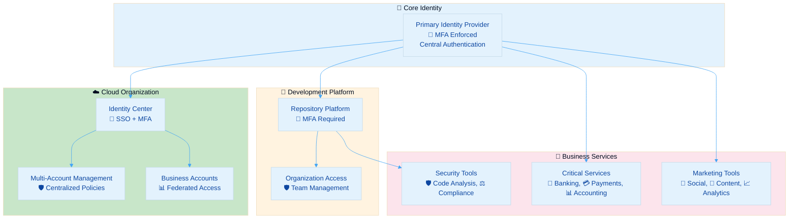
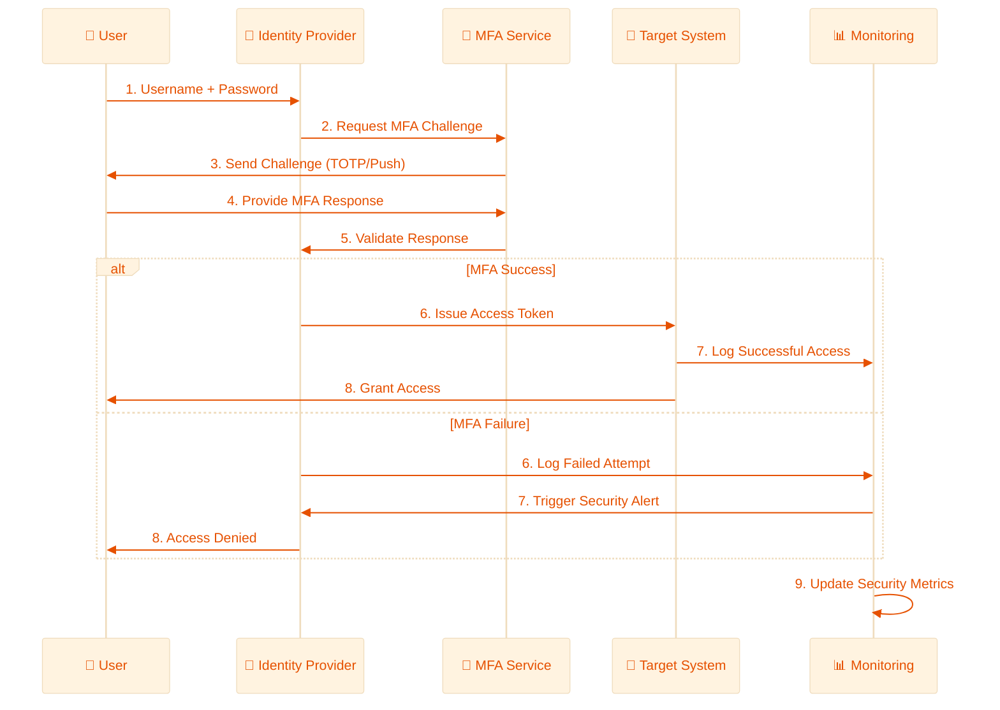
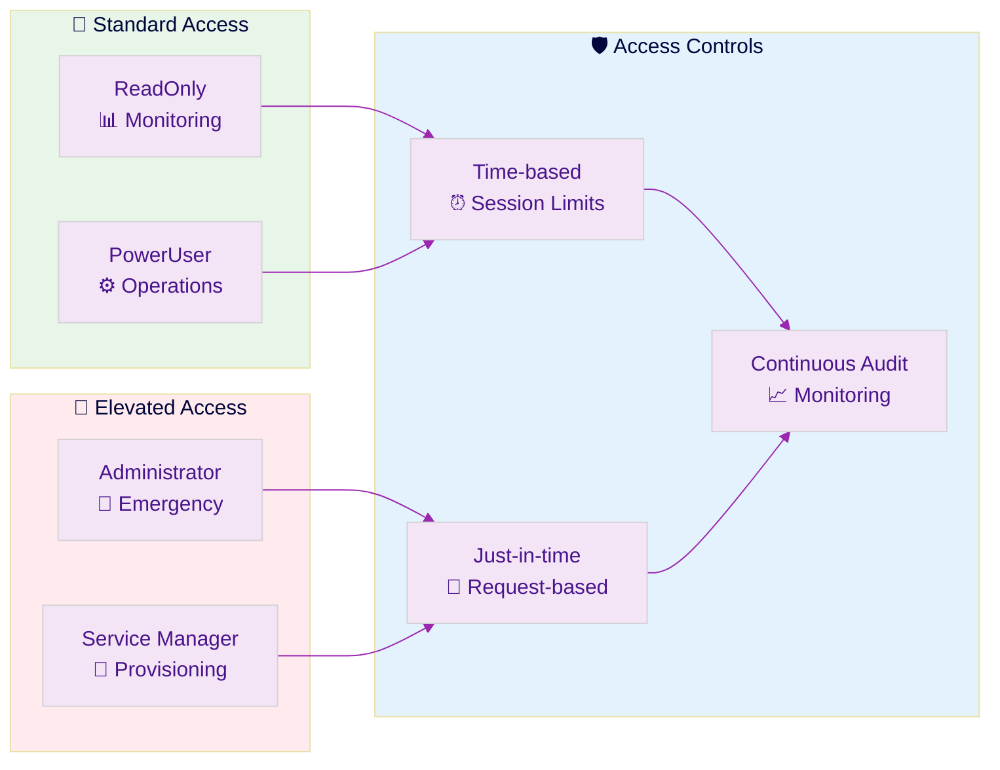
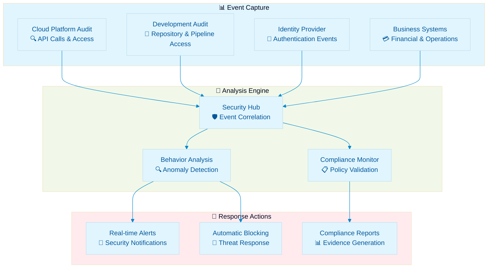

  

<h1 align="center">🔑 Hack23 AB — Access Control Policy</h1>

  <strong>🛡️ Zero Trust Access Through Identity-Centric Security</strong> 
  <em>🎯 Enterprise-Grade Access Control Demonstrating Cybersecurity Excellence</em>

  
  
  
  

**📋 Document Owner:** CEO | **📄 Version:** 2.3 | **📅 Last Updated:** 2025-11-17 (UTC)  
**🔄 Review Cycle:** Semi-Annual | **⏰ Next Review:** 2026-05-18

---

## 🎯 **Purpose Statement**

**🏢 Hack23 AB's** access control policy demonstrates how **🔧 systematic identity management directly enables both security excellence and operational transparency.** Our 📊 zero-trust access approach serves as both operational necessity and 👥 client demonstration of our cybersecurity consulting methodologies.

This policy establishes mandatory access controls based on our [🏷️ Classification Framework](https://github.com/Hack23/ISMS-PUBLIC/blob/main/CLASSIFICATION.md) and integrates with all systems documented in the [💻 Asset Register](./Asset_Register.md).

*— 👨‍💼 James Pether Sörling, CEO/Founder*

---

## 🔐 **Access Control Architecture**

### 🎯 Identity-Centric Design

### 📊 Access Control Matrix

Integration with [Classification Framework](https://github.com/Hack23/ISMS-PUBLIC/blob/main/CLASSIFICATION.md):

| 🎯 Asset Category | 🏷️ Classification | 🔐 Access Method | 🛡️ MFA Requirement | ⏰ Session Timeout | 📊 Review Frequency |
|-------------------|------------------|------------------|-------------------|-------------------|-------------------|
| **☁️ Cloud Core Infrastructure** |  | Identity Center SSO | Hardware + Software | 4 hours | Monthly |
| **💰 Financial Systems** |  | Provider MFA + IdP | Hardware + SMS | 1 hour | Monthly |
| **📝 Development Pipeline** |  | Platform MFA | TOTP + SSH Keys | 8 hours | Quarterly |
| **📊 Business Intelligence** |  | SSO Integration | TOTP | 24 hours | Semi-Annual |
| **📢 Marketing Platforms** |  | Platform Native | Platform MFA | 7 days | Annual |

---

## 🛡️ **Multi-Factor Authentication Strategy**

### 🎯 MFA Implementation Matrix

| 🔗 Service Category | 🔐 Primary MFA | 🛡️ Backup MFA | 📱 Methods Supported | ✅ Status |
|-------------------|---------------|---------------|-------------------|----------|
| **Identity Provider** | Hardware Security Key | TOTP + SMS | FIDO2, WebAuthn, Authenticator | ✅ Active |
| **Cloud Platform** | Enforced via IdP | Hardware Token | FIDO2, WebAuthn, SMS | ✅ Active |
| **Development Platform** | TOTP | SSH Certificate | Platform Mobile, TOTP | ✅ Active |
| **Banking Services** | Provider-issued Token | Mobile App | Proprietary Hardware | ✅ Active |
| **Payment Processing** | TOTP | Email Verification | Authenticator App | ✅ Active |
| **Social Platforms** | Platform TOTP | Email Recovery | Native Apps | ✅ Active |

### 🔄 MFA Validation Flow

---

## 🎯 **Role-Based Access Control**

### 📊 Generic Permission Framework

Integration with cloud organization structure:

| 🛡️ Permission Level | 📍 Scope | 🎯 Use Case | 🔐 Access Pattern | 📊 Usage Frequency |
|-------------------|-----------------|-------------|-------------------|-------------------|
| **Administrator** | Critical Systems | Emergency operations, infrastructure | Break-glass only | Monthly |
| **PowerUser** | Core Systems | Development, testing | Regular operations | Daily |
| **ReadOnly** | All systems | Monitoring, compliance | Continuous access | Daily |
| **ServiceManager** | Specific Services | Service provisioning | Project deployment | Weekly |
| **ServiceUser** | Managed Services | Resource consumption | Standard usage | Weekly |

### 🔄 Dynamic Access Pattern

---

## 📊 **Access Monitoring & Compliance**

### 🔍 Continuous Monitoring Dashboard

Based on business impact and security metrics:

| 🎯 Metric | 📊 Target | 🔍 Measurement | 🚨 Alert Threshold | 📈 Review Frequency |
|----------|----------|---------------|-------------------|-------------------|
| **MFA Coverage** | 100% | Active MFA methods | <100% | Real-time |
| **Access Anomalies** | <5/month | Unusual patterns | >10/month | Daily |
| **Failed Login Rate** | <1% | Failed vs successful | >5% | Hourly |
| **Dormant Accounts** | 0 | Unused >90 days | >0 | Weekly |
| **Privilege Escalation** | 0 unauthorized | Admin access grants | >0 | Real-time |
| **Session Compliance** | 100% | Timeout adherence | <95% | Daily |

### 📈 Access Audit Trail

---

## 🔧 **Access Control Implementation**

### 💰 Financial Systems Access

**Process Classification:** 

**Business Impact Justification:**
- High financial impact potential (daily revenue at risk)
- Regulatory compliance requirements (audit trails, segregation of duties)
- Operational dependency (cash flow, vendor payments, payroll)

**Access Requirements:**
| System Type | MFA Requirement | Session Timeout | Review Frequency | Backup Access |
|-------------|-----------------|-----------------|------------------|---------------|
| **Banking Platform** | Hardware token + SMS | 1 hour | Monthly | Mobile app backup |
| **Accounting System** | SSO + TOTP | 8 hours | Quarterly | Export procedures |
| **Payment Gateway** | Platform MFA | 4 hours | Monthly | Manual processing |

### 🔧 Operations & Development Access

**Process Classification:** 

**Business Impact Justification:**
- Service delivery continuity requirements
- Development pipeline integrity
- Code and infrastructure security

**Access Requirements:**
| System Type | MFA Requirement | Session Timeout | Review Frequency | Emergency Access |
|-------------|-----------------|-----------------|------------------|------------------|
| **Development Platform** | TOTP + SSH keys | 8 hours | Quarterly | Local environment |
| **Cloud Infrastructure** | SSO + hardware token | 4 hours | Monthly | Break-glass procedures |
| **CI/CD Pipeline** | Platform MFA | 24 hours | Monthly | Manual deployment |

### 📢 Marketing & Communications Access

**Process Classification:** 

**Business Impact Justification:**
- Brand reputation management
- Customer communication continuity
- Content and campaign integrity

**Access Requirements:**
| System Type | MFA Requirement | Session Timeout | Review Frequency | Content Backup |
|-------------|-----------------|-----------------|------------------|----------------|
| **Social Media Platforms** | Platform MFA | 7 days | Semi-annual | Content archives |
| **Content Generation Tools** | Platform authentication | 30 days | Annual | Alternative services |
| **Analytics Platforms** | SSO integration | 24 hours | Quarterly | Export procedures |

---

## 📚 **Related Documents**

- [🔐 Information Security Policy](./Information_Security_Policy.md) - Overall security framework
- [💻 Asset Register](./Asset_Register.md) - Complete identity and system inventory
- [🏷️ Classification Framework](https://github.com/Hack23/ISMS-PUBLIC/blob/main/CLASSIFICATION.md) - Access control classifications
- [📊 Security Metrics](./Security_Metrics.md) - Access monitoring and KPIs
- [🚨 Incident Response Plan](./Incident_Response_Plan.md) - Access-related incident procedures
- [🔒 Cryptography Policy](./Cryptography_Policy.md) - Encryption and key management
- [🛠️ Secure Development Policy](./Secure_Development_Policy.md) - Development access controls
- [🤝 Third Party Management](./Third_Party_Management.md) - Supplier access management
- [🔄 Business Continuity Plan](./Business_Continuity_Plan.md) - Access continuity procedures

---

**📋 Document Control:**  
**✅ Approved by:** James Pether Sörling, CEO  
**📤 Distribution:** Public  
**🏷️ Classification:**   
**📅 Effective Date:** 2025-11-17  
**⏰ Next Review:** 2026-05-18  
**🎯 Framework Compliance:**   
