<p align="center">
  
</p>

<h1 align="center">🔑 Hack23 AB — Access Control Policy</h1>

<p align="center">
  <strong>🛡️ Zero Trust Access Through Identity-Centric Security</strong><br>
  <em>🎯 Enterprise-Grade Access Control Demonstrating Cybersecurity Excellence</em>
</p>

<p align="center">
  <a href="#"></a>
  <a href="#"></a>
  <a href="#"></a>
  <a href="#"></a>
</p>

**📋 Document Owner:** CEO | **📄 Version:** 2.6 | **📅 Last Updated:** 2026-01-25 (UTC)  
**🔄 Review Cycle:** Semi-Annual | **⏰ Next Review:** 2026-07-25

---

## 🎯 **Purpose Statement**

**🏢 Hack23 AB's** access control policy demonstrates how **🔧 systematic identity management directly enables both security excellence and operational transparency.** Our 📊 zero-trust access approach serves as both operational necessity and 👥 client demonstration of our cybersecurity consulting methodologies.

This policy establishes mandatory access controls based on our [🏷️ Classification Framework](./CLASSIFICATION.md) and integrates with all systems documented in the [💻 Asset Register](./Asset_Register.md).

*— 👨‍💼 James Pether Sörling, CEO/Founder*

---

## 🔐 **Access Control Architecture**

### 🎯 Identity-Centric Design

```mermaid
%%{
  init: {
    'theme': 'base',
    'themeVariables': {
      'primaryColor': '#1565C0',
      'primaryTextColor': '#0d47a1',
      'lineColor': '#1565C0',
      'secondaryColor': '#4CAF50',
      'tertiaryColor': '#FF9800'
    }
  }
}%%
flowchart TD
    subgraph Core["🔐 Core Identity"]
        PRIMARY[Primary Identity Provider<br/>🔐 MFA Enforced<br/>Central Authentication]
    end
    
    subgraph CloudOrg["☁️ Cloud Organization"]
        IDC[Identity Center<br/>🔐 SSO + MFA]
        MGMT[Multi-Account Management<br/>🛡️ Centralized Policies]
        ACCTS[Business Accounts<br/>📊 Federated Access]
    end
    
    subgraph DevOps["📝 Development Platform"]
        REPO[Repository Platform<br/>🔐 MFA Required]
        ORG[Organization Access<br/>🛡️ Team Management]
    end
    
    subgraph Business["🔗 Business Services"]
        CRITICAL[Critical Services<br/>🏦 Banking, 💳 Payments, 📊 Accounting]
        MARKETING[Marketing Tools<br/>📱 Social, 🎵 Content, 📈 Analytics]
        SECURITY[Security Tools<br/>🛡️ Code Analysis, ⚖️ Compliance]
    end
    
    PRIMARY --> IDC
    PRIMARY --> REPO
    PRIMARY --> CRITICAL
    PRIMARY --> MARKETING
    
    IDC --> MGMT
    IDC --> ACCTS
    REPO --> ORG
    REPO --> SECURITY
    
    style Core fill:#1565C0
    style CloudOrg fill:#4CAF50
    style DevOps fill:#FF9800
    style Business fill:#D32F2F
```



### 📊 Access Control Matrix

Integration with [Classification Framework](./CLASSIFICATION.md):

| 🎯 Asset Category | 🏷️ Classification | 🔐 Access Method | 🛡️ MFA Requirement | ⏰ Session Timeout | 📊 Review Frequency |
|-------------------|------------------|------------------|-------------------|-------------------|-------------------|
| **☁️ Cloud Core Infrastructure** | [](./CLASSIFICATION.md) | Identity Center SSO | Hardware + Software | 4 hours | Monthly |
| **💰 Financial Systems** | [](./CLASSIFICATION.md) | Provider MFA + IdP | Hardware + SMS | 1 hour | Monthly |
| **📠Development Pipeline** | [](./CLASSIFICATION.md) | Platform MFA | TOTP + SSH Keys | 8 hours | Quarterly |
| **📊 Business Intelligence** | [](./CLASSIFICATION.md) | SSO Integration | TOTP | 24 hours | Semi-Annual |
| **📢 Marketing Platforms** | [](./CLASSIFICATION.md) | Platform Native | Platform MFA | 7 days | Annual |

---

## 🛡️ **Multi-Factor Authentication Strategy**

### 🎯 MFA Implementation Matrix

| 🔗 Service Category | 🔐 Primary MFA | 🛡️ Backup MFA | 📱 Methods Supported | ✅ Status |
|-------------------|---------------|---------------|-------------------|----------|
| **Identity Provider** | Hardware Security Key | TOTP + SMS | FIDO2, WebAuthn, Authenticator | ✅ Active |
| **Cloud Platform** | Enforced via IdP | Hardware Token | FIDO2, WebAuthn, SMS | ✅ Active |
| **Development Platform** | TOTP | SSH Certificate | Platform Mobile, TOTP | ✅ Active |
| **Banking Services** | Provider-issued Token | Mobile App | Proprietary Hardware | ✅ Active |
| **Payment Processing** | TOTP | Email Verification | Authenticator App | ✅ Active |
| **Social Platforms** | Platform TOTP | Email Recovery | Native Apps | ✅ Active |

### 🔄 MFA Validation Flow

```mermaid
%%{
  init: {
    'theme': 'base',
    'themeVariables': {
      'primaryColor': '#FF9800',
      'primaryTextColor': '#F57C00',
      'lineColor': '#ff9800',
      'secondaryColor': '#4CAF50',
      'tertiaryColor': '#1565C0'
    }
  }
}%%
sequenceDiagram
    participant User as 👤 User
    participant IdP as 🔐 Identity Provider
    participant MFA as 📱 MFA Service
    participant Target as 🎯 Target System
    participant Monitor as 📊 Monitoring
    
    User->>IdP: 1. Username + Password
    IdP->>MFA: 2. Request MFA Challenge
    MFA->>User: 3. Send Challenge (TOTP/Push)
    User->>MFA: 4. Provide MFA Response
    MFA->>IdP: 5. Validate Response
    
    alt MFA Success
        IdP->>Target: 6. Issue Access Token
        Target->>Monitor: 7. Log Successful Access
        Target->>User: 8. Grant Access
    else MFA Failure
        IdP->>Monitor: 6. Log Failed Attempt
        Monitor->>IdP: 7. Trigger Security Alert
        IdP->>User: 8. Access Denied
    end
    
    Monitor->>Monitor: 9. Update Security Metrics
```



---

## 🎯 **Role-Based Access Control**

### 📊 Generic Permission Framework

Integration with cloud organization structure:

| 🛡️ Permission Level | 📍 Scope | 🎯 Use Case | 🔐 Access Pattern | 📊 Usage Frequency |
|-------------------|-----------------|-------------|-------------------|-------------------|
| **Administrator** | Critical Systems | Emergency operations, infrastructure | Break-glass only | Monthly |
| **PowerUser** | Core Systems | Development, testing | Regular operations | Daily |
| **ReadOnly** | All systems | Monitoring, compliance | Continuous access | Daily |
| **ServiceManager** | Specific Services | Service provisioning | Project deployment | Weekly |
| **ServiceUser** | Managed Services | Resource consumption | Standard usage | Weekly |

### 🔄 Dynamic Access Pattern

```mermaid
%%{
  init: {
    'theme': 'base',
    'themeVariables': {
      'primaryColor': '#7B1FA2',
      'primaryTextColor': '#4a148c',
      'lineColor': '#7B1FA2',
      'secondaryColor': '#4CAF50',
      'tertiaryColor': '#FFC107'
    }
  }
}%%
flowchart LR
    subgraph Standard["📅 Standard Access"]
        READ[ReadOnly<br/>📊 Monitoring]
        POWER[PowerUser<br/>⚙️ Operations]
    end
    
    subgraph Elevated["🔴 Elevated Access"]
        ADMIN[Administrator<br/>🚨 Emergency]
        CATALOG[Service Manager<br/>🚀 Provisioning]
    end
    
    subgraph Controls["🛡️ Access Controls"]
        TIME[Time-based<br/>⏰ Session Limits]
        JUST[Just-in-time<br/>🎯 Request-based]
        AUDIT[Continuous Audit<br/>📈 Monitoring]
    end
    
    READ --> TIME
    POWER --> TIME
    ADMIN --> JUST
    CATALOG --> JUST
    
    TIME --> AUDIT
    JUST --> AUDIT
    
    style Standard fill:#4CAF50
    style Elevated fill:#D32F2F
    style Controls fill:#1565C0
```



### 🚫 Segregation of Duties

Role-based access control supports segregation of duties principles by enforcing separation between incompatible functions. See [🚫 Segregation of Duties Policy](./Segregation_of_Duties_Policy.md) for:
- Incompatible role pairs requiring separation
- Single-person organization compensating controls
- Temporal and tool-based separation mechanisms
- Audit trail and external validation requirements

Key access control aspects supporting SoD:
- **Least Privilege**: Default to minimum permissions required for role
- **Time-Limited Elevation**: Administrator access granted just-in-time with automatic expiration
- **Audit Trail**: All permission changes and elevated access logged in CloudTrail
- **Quarterly Review**: Access permissions reviewed against principle of least privilege

---

## 📊 **Access Monitoring & Compliance**

### 🔍 Continuous Monitoring Dashboard

Based on business impact and security metrics:

| 🎯 Metric | 📊 Target | 🔍 Measurement | 🚨 Alert Threshold | 📈 Review Frequency |
|----------|----------|---------------|-------------------|-------------------|
| **MFA Coverage** | 100% | Active MFA methods | <100% | Real-time |
| **Access Anomalies** | <5/month | Unusual patterns | >10/month | Daily |
| **Failed Login Rate** | <1% | Failed vs successful | >5% | Hourly |
| **Dormant Accounts** | 0 | Unused >90 days | >0 | Weekly |
| **Privilege Escalation** | 0 unauthorized | Admin access grants | >0 | Real-time |
| **Session Compliance** | 100% | Timeout adherence | <95% | Daily |

### 📈 Access Audit Trail

```mermaid
%%{
  init: {
    'theme': 'base',
    'themeVariables': {
      'primaryColor': '#1565C0',
      'primaryTextColor': '#1565C0',
      'lineColor': '#1565C0',
      'secondaryColor': '#4CAF50',
      'tertiaryColor': '#FFC107'
    }
  }
}%%
graph TD
    subgraph Capture["📊 Event Capture"]
        CLOUD_AUDIT[Cloud Platform Audit<br/>🔍 API Calls & Access]
        DEV_AUDIT[Development Audit<br/>📝 Repository & Pipeline Access]
        IDENTITY_LOG[Identity Provider<br/>📧 Authentication Events]
        BUSINESS_LOG[Business Systems<br/>💳 Financial & Operations]
    end
    
    subgraph Analysis["🧪 Analysis Engine"]
        SIEM[Security Hub<br/>🛡️ Event Correlation]
        DETECT[Behavior Analysis<br/>🔍 Anomaly Detection]
        COMPLIANCE[Compliance Monitor<br/>📋 Policy Validation]
    end
    
    subgraph Response["🚨 Response Actions"]
        ALERT[Real-time Alerts<br/>📱 Security Notifications]
        BLOCK[Automatic Blocking<br/>🚫 Threat Response]
        REPORT[Compliance Reports<br/>📊 Evidence Generation]
    end
    
    CLOUD_AUDIT --> SIEM
    DEV_AUDIT --> SIEM
    IDENTITY_LOG --> SIEM
    BUSINESS_LOG --> SIEM
    
    SIEM --> DETECT
    SIEM --> COMPLIANCE
    
    DETECT --> ALERT
    DETECT --> BLOCK
    COMPLIANCE --> REPORT
    
    style Capture fill:#1565C0
    style Analysis fill:#4CAF50
    style Response fill:#D32F2F
```



---

## 🔧 **Access Control Implementation**

### 💰 Financial Systems Access

**Process Classification:** [](./CLASSIFICATION.md#business-process-types)

**Business Impact Justification:**
- High financial impact potential (daily revenue at risk)
- Regulatory compliance requirements (audit trails, segregation of duties)
- Operational dependency (cash flow, vendor payments, payroll)

**Access Requirements:**
| System Type | MFA Requirement | Session Timeout | Review Frequency | Backup Access |
|-------------|-----------------|-----------------|------------------|---------------|
| **Banking Platform** | Hardware token + SMS | 1 hour | Monthly | Mobile app backup |
| **Accounting System** | SSO + TOTP | 8 hours | Quarterly | Export procedures |
| **Payment Gateway** | Platform MFA | 4 hours | Monthly | Manual processing |

### 🔧 Operations & Development Access

**Process Classification:** [](./CLASSIFICATION.md#business-process-types)

**Business Impact Justification:**
- Service delivery continuity requirements
- Development pipeline integrity
- Code and infrastructure security

**Access Requirements:**
| System Type | MFA Requirement | Session Timeout | Review Frequency | Emergency Access |
|-------------|-----------------|-----------------|------------------|------------------|
| **Development Platform** | TOTP + SSH keys | 8 hours | Quarterly | Local environment |
| **Cloud Infrastructure** | SSO + hardware token | 4 hours | Monthly | Break-glass procedures |
| **CI/CD Pipeline** | Platform MFA | 24 hours | Monthly | Manual deployment |

### 📢 Marketing & Communications Access

**Process Classification:** [](./CLASSIFICATION.md#business-process-types)

**Business Impact Justification:**
- Brand reputation management
- Customer communication continuity
- Content and campaign integrity

**Access Requirements:**
| System Type | MFA Requirement | Session Timeout | Review Frequency | Content Backup |
|-------------|-----------------|-----------------|------------------|----------------|
| **Social Media Platforms** | Platform MFA | 7 days | Semi-annual | Content archives |
| **Content Generation Tools** | Platform authentication | 30 days | Annual | Alternative services |
| **Analytics Platforms** | SSO integration | 24 hours | Quarterly | Export procedures |

---

## 🏢 **Single-Person Company Adaptation**

### **Traditional Multi-Person Requirement**

Industry best practice and NIST 800-53 guidance recommend **separation of duties for access control administration**:
- **Access Provisioner**: Administrator who grants/revokes access rights
- **Access Reviewer**: Independent security team member who validates access appropriateness
- **Audit Function**: Separate audit team reviewing access control compliance

Traditional separation provides:
- Independent validation of access decisions
- Detection of unauthorized access grants
- Prevention of insider threats through collusion resistance
- Compliance with segregation of duties requirements

**Typical Process:**
1. User requests access (or access change)
2. Manager/provisioner approves and grants access
3. **Separate security team** conducts quarterly access review
4. Independent auditor validates access control effectiveness annually

### **Hack23 AB Single-Person Adaptation**

As CEO/Founder is the sole employee and performs all roles (access provisioner, reviewer, and user), traditional multi-person access review is not possible. **Instead, Hack23 AB implements automated tool validation + external audit model:**

#### **🎯 CEO As Access Administrator**

**Roles Consolidated**:
- Access Provisioner (grants/revokes all access)
- Access Reviewer (validates access appropriateness)
- Primary User (uses all systems for business operations)

**Limitations of Single-Person Model**:
- No independent human review of access decisions
- Self-review cannot detect own errors or excessive permissions
- Risk of "privilege creep" without external validation

#### **🎯 Automated Access Analysis**

**AWS IAM Access Analyzer** (Primary Compensating Control):
| Feature | Capability | Business Value | Validation Frequency |
|---------|------------|----------------|---------------------|
| **Unused Access Detection** | Identifies credentials and permissions not used in 90+ days | Reduces attack surface, enforces least privilege | Real-time continuous |
| **External Access Analysis** | Detects resources shared outside AWS organization | Prevents unauthorized external access | Real-time continuous |
| **Policy Validation** | Validates IAM policies against AWS security best practices | Ensures secure policy configuration | On policy change |
| **Access Preview** | Simulates policy changes before implementation | Prevents unintended access grants | Pre-deployment |

**GitHub Security Features** (Development Platform):
- **Organization Audit Log**: Complete history of all access changes, permission grants
- **Security Alerts**: Notifications for suspicious access patterns or unauthorized changes
- **Required Reviewers**: Branch protection requires PR approval (self-review documented as accepted risk)
- **Dependency Review**: Automated analysis of third-party access via dependencies

#### **🎯 External Validation Model**

**Annual External Auditor Review**:
| Validation Activity | Auditor Scope | Frequency | Deliverable |
|---------------------|---------------|-----------|-------------|
| **Access Control Effectiveness** | Review access grants, permissions, MFA compliance | Annual | Audit report with findings and recommendations |
| **Least Privilege Validation** | Verify users have minimum necessary permissions | Annual | Excessive permission identification |
| **Segregation of Duties Assessment** | Evaluate compensating controls for SoD violations | Annual | Control adequacy assessment |
| **Compliance Verification** | Validate ISO 27001/NIST CSF alignment | Annual | Compliance attestation |

### **Compensating Controls**

| Control Type | Implementation | ISO 27001 Alignment | Effectiveness |
|--------------|----------------|---------------------|---------------|
| **🤖 AWS IAM Access Analyzer** | Continuous automated analysis of access permissions, unused access detection | A.5.18 - Access Rights Management | Provides independent (machine) validation superior to manual review |
| **📊 Quarterly CEO Self-Review** | CEO reviews all access grants, permissions, MFA status using IAM Access Analyzer findings | A.9.2.5 - Review of User Access Rights | Systematic review process with automated tool assistance |
| **🔍 External Annual Audit** | Independent auditor validates access control effectiveness and least privilege compliance | A.5.18 - Access Rights Management | Independent human validation catches systematic issues |
| **📋 Complete Audit Trail** | AWS CloudTrail + GitHub Audit Log provide tamper-evident access change history | A.8.15 - Logging | Enables retrospective review and forensic investigation |
| **⏱️ Automated Alerts** | Real-time notifications for suspicious access patterns, policy changes, external sharing | A.8.16 - Monitoring Activities | Immediate detection of access anomalies |

### **ISO 27001:2022 Compliance**

This adaptation maintains control objectives of **A.5.18 (Access Rights Management)** and **A.9.2.5 (Review of User Access Rights)** by ensuring:

✅ **Access Rights Allocation**: CEO manages all access with documented procedures  
✅ **Regular Reviews**: Quarterly CEO review + AWS IAM Access Analyzer continuous monitoring  
✅ **Least Privilege**: Automated unused access detection enforces minimum permissions  
✅ **Access Right Removal**: Systematic removal of unused credentials and permissions  
✅ **Independent Validation**: External auditor provides independent human review annually

**Alignment with ISO 27001:2022 Guidance**: Annex A.9.2.5 requires "regular reviews" of access rights but does not mandate separate reviewer. The standard allows for "automated tools" to support access reviews. Single-person operations achieve control objectives through **automated analysis tools** (IAM Access Analyzer) providing **machine-based independence** + **external auditor validation** rather than **dedicated security team review**.

**Superiority of Automated Approach**: AWS IAM Access Analyzer provides **continuous real-time monitoring** superior to quarterly human review. Machine analysis detects unused access, excessive permissions, and policy violations more consistently and comprehensively than manual review.

### **Risk Acceptance**

**Risk Description**: Single-person access administration increases risk of **self-review bias and excessive permissions** compared to independent security team review. CEO may not detect own errors in access grants or recognize privilege creep.

See [📉 Risk Register](./Risk_Register.md) for current risk assessment, likelihood/impact scoring, and treatment status.

**Compensating Controls Summary**:
- **Automated superiority**: AWS IAM Access Analyzer continuous monitoring exceeds quarterly human review effectiveness
- **Machine independence**: Automated tool provides independent validation without human bias
- **Limited scope**: Single-user environment (CEO) has minimal access control complexity
- **External validation**: Annual auditor review provides independent human oversight
- **Complete audit trail**: CloudTrail + GitHub logs enable retrospective forensic review

**Monitoring & Review**:
- **Real-Time**: AWS IAM Access Analyzer findings reviewed immediately when triggered
- **Quarterly**: CEO comprehensive access review using IAM Access Analyzer findings dashboard
- **Annual**: External auditor validates access control effectiveness and compensating controls

---

## 🚨 **Break-Glass Emergency Access Procedure**

### 📋 Emergency Access Protocol

When normal access methods fail during critical incidents, the break-glass procedure provides documented emergency access:


### 🔐 Break-Glass Credentials Storage

| Credential Type | Storage Location | Access Method | Recovery Time |
|-----------------|------------------|---------------|---------------|
| **AWS Root Account Recovery** | CEO personal email (MFA-protected) | Email + phone recovery | <15 minutes |
| **AWS Root MFA Backup Codes** | Encrypted USB (fireproof safe) | Physical access required | <30 minutes |
| **GitHub Personal Access Token** | AWS Secrets Manager (backup: encrypted local) | CLI recovery | <10 minutes |
| **Identity Provider Recovery** | Backup email + SMS | Multi-channel recovery | <15 minutes |
| **Banking Recovery Codes** | Physical secure storage (bank safe deposit) | In-person retrieval | 4-24 hours |

### 📊 Break-Glass Usage Requirements

1. **Pre-Activation Checklist:**
   - [ ] Confirm normal access methods exhausted
   - [ ] Document business justification for emergency access
   - [ ] Assess incident severity (Critical/High/Medium)
   - [ ] Notify relevant stakeholders if time permits

2. **During Emergency Access:**
   - [ ] Log all actions taken with timestamps
   - [ ] Use minimum necessary permissions
   - [ ] Complete only essential tasks for incident resolution
   - [ ] Maintain communication with any affected parties

3. **Post-Emergency Requirements:**
   - [ ] Revoke emergency credentials within 1 hour of resolution
   - [ ] Rotate all credentials accessed during emergency
   - [ ] Complete incident documentation within 24 hours
   - [ ] Conduct root cause analysis for access failure
   - [ ] Update procedures if systemic issue identified

---

## 🔄 **Account Lifecycle Management**

### 📋 Account Provisioning Procedure

**ISO 27001:2022 Controls:** A.5.16 (Identity Management), A.5.17 (Authentication Information)

| Phase | Activities | Responsible | Timeline | Evidence |
|-------|-----------|-------------|----------|----------|
| **Request** | Document access need, business justification | Requester (CEO) | Day 0 | Access request log |
| **Approval** | Verify business need, least privilege assessment | Approver (CEO) | Day 0 | Approval record |
| **Provisioning** | Create account, configure MFA, assign permissions | Administrator (CEO) | Day 0-1 | Account creation log |
| **Validation** | Verify access works correctly, confirm MFA active | User (CEO) | Day 1 | MFA enrollment confirmation |
| **Documentation** | Update Asset Register, access matrix | Administrator (CEO) | Day 1 | Asset Register entry |
| **Review** | Quarterly access appropriateness review | Administrator (CEO) | Quarterly | Review completion record |
| **Termination** | Remove access when no longer needed | Administrator (CEO) | As needed | Deprovisioning log |

### 🔑 Access Request Log Template

For each new account or permission change:

```
Access Request Record
=====================
Request Date: YYYY-MM-DD
Request ID: AR-YYYY-NNN

Requester: [Name/Role]
System/Service: [Target system]
Access Level Requested: [Permission level]
Business Justification: [Why access is needed]

Approval Decision: [ ] Approved / [ ] Denied
Approved By: [CEO signature/date]
Provisioning Date: YYYY-MM-DD
MFA Configured: [ ] Yes / [ ] N/A

Next Review Date: YYYY-MM-DD
```

### 📊 Account Status Categories

| Status | Definition | Action Required | Review Frequency |
|--------|------------|-----------------|------------------|
| **Active** | Account in regular use, MFA enabled | Standard monitoring | Quarterly |
| **Dormant** | No activity in 60+ days | Verify continued need | Within 30 days |
| **Suspended** | Temporarily disabled pending review | Investigate and resolve | Within 7 days |
| **Terminated** | Permanently deactivated | Archive audit logs | N/A |
| **Service** | Non-human automated account | Monitor for abuse | Monthly |

---

## 🤖 **Service Account Management**

### 📋 Service Account Inventory

**ISO 27001:2022 Control:** A.5.18 (Access Rights)

| Service Account Type | Purpose | Permission Scope | Key Rotation | Monitoring |
|---------------------|---------|------------------|--------------|------------|
| **GitHub Actions** | CI/CD pipeline automation | Repository secrets, deployments | 90 days (via AWS OIDC) | Workflow run logs |
| **AWS IAM Roles** | Service-to-service authentication | Least privilege per service | Automatic (STS) | CloudTrail |
| **Maven Central** | Artifact publishing | Publish to group ID | 365 days (GPG key) | Release logs |
| **External API Keys** | Third-party integrations | API-specific scope | 90-180 days | API usage logs |

### 🔐 Service Account Security Requirements

1. **No Long-Lived Credentials:** Prefer OIDC federation, IAM roles, or short-lived tokens
2. **Least Privilege:** Grant minimum permissions for specific automation task
3. **No Shared Secrets:** Each service/workflow gets unique credentials
4. **Rotation Schedule:** Maximum 90 days for API keys, automatic for IAM roles
5. **Audit Logging:** All service account actions logged to CloudTrail/audit system
6. **Alerting:** Unusual activity triggers immediate notification

### 🔄 Service Account Lifecycle


---

## 🔐 **Privileged Access Management (PAM)**

### 📋 Privileged Account Categories

**ISO 27001:2022 Control:** A.8.2 (Privileged Access Rights)

| Privilege Level | Access Scope | Use Cases | Session Controls | Monitoring Level |
|-----------------|--------------|-----------|------------------|------------------|
| **Root/Super Admin** | Full system control | Break-glass only | 1 hour max, full logging | Real-time + alerts |
| **Organization Admin** | AWS Organization management | Account creation, SCPs | 4 hours max, CloudTrail | Real-time |
| **Account Admin** | Individual AWS account admin | Resource management | 4 hours max, CloudTrail | Continuous |
| **Power User** | Elevated development access | Testing, deployment | 8 hours max, standard logs | Daily review |
| **Standard User** | Normal operational access | Daily operations | 24 hours max, standard logs | Weekly review |

### 🔒 Just-In-Time (JIT) Privileged Access

For elevated access beyond standard permissions:

1. **Request Phase:**
   - Document specific task requiring elevated access
   - Define minimum permissions needed
   - Specify time window (maximum 4 hours)

2. **Activation Phase:**
   - Enable temporary IAM role or permission set
   - Start session recording (CloudTrail enhanced)
   - Set automatic expiration timer

3. **Execution Phase:**
   - Perform only documented activities
   - Log all actions taken
   - Complete task within time window

4. **Deactivation Phase:**
   - Revoke elevated permissions (automatic or manual)
   - Review session logs for anomalies
   - Document completion and any issues

### 📊 Privileged Access Metrics

| Metric | Target | Alert Threshold | Response |
|--------|--------|-----------------|----------|
| **Root Account Usage** | 0 per month (except break-glass) | >1 per month | Immediate investigation |
| **Admin Session Duration** | <2 hours average | >4 hours | Review session purpose |
| **Elevated Access Requests** | <10 per month | >20 per month | Review access model |
| **Failed Privileged Logins** | 0 | >0 | Immediate investigation |

---

## 📋 **Access Termination Checklist**

### 🗑️ Account Deprovisioning Procedure

**Trigger Events:**
- Employee departure (N/A for single-person, but documented for future scaling)
- Role change requiring access modification
- System/service retirement
- Security incident requiring immediate access revocation
- Contract termination (for any future contractors)

### ✅ Access Termination Checklist

**Immediate Actions (Within 1 Hour of Trigger):**
- [ ] Disable primary identity provider account
- [ ] Revoke active sessions across all SSO-integrated systems
- [ ] Disable AWS IAM Identity Center access
- [ ] Revoke GitHub organization access
- [ ] Change shared credentials (if any exist)

**Same-Day Actions (Within 24 Hours):**
- [ ] Remove from email distribution lists
- [ ] Revoke access to financial systems (banking, accounting)
- [ ] Disable marketing platform access
- [ ] Revoke API keys and access tokens
- [ ] Remove from any collaboration tools

**Follow-Up Actions (Within 7 Days):**
- [ ] Audit all access logs for terminated account
- [ ] Verify no residual access permissions remain
- [ ] Transfer ownership of any shared resources
- [ ] Archive account audit history
- [ ] Update Asset Register to reflect deprovisioning
- [ ] Document termination in access control log

### 📊 Termination Verification

After access termination, verify complete removal:

| Verification Check | Method | Timeline | Evidence |
|-------------------|--------|----------|----------|
| **No Active Sessions** | Session management console | Immediate | Screenshot/log |
| **No IAM Permissions** | AWS IAM Access Analyzer | Within 24 hours | Analyzer report |
| **No GitHub Access** | Organization audit log | Within 24 hours | Audit export |
| **No API Access** | Attempt authentication | Within 48 hours | Failure confirmation |
| **Access Log Review** | CloudTrail/audit analysis | Within 7 days | Analysis report |

---

### **Access Control Performance Metrics**

**Single-Person Access Administration Effectiveness**:
| Metric | Target | Current Performance | Status |
|--------|--------|---------------------|--------|
| **MFA Coverage** | 100% | 100% (all critical systems) | ✅ Exceeds |
| **Unused Access** | 0 credentials unused >90 days | 0 (IAM Analyzer monitoring) | ✅ On target |
| **External Access** | 0 unauthorized external shares | 0 (IAM Analyzer alerts) | ✅ On target |
| **Excessive Permissions** | <5 findings per quarter | N/A (monitored continuously) | ✅ Monitored |
| **Access Review Completion** | 100% quarterly | 100% (systematic process) | ✅ Compliant |
| **Annual Audit Pass Rate** | 100% (no major findings) | Planned Q2 2026 | ⏳ Scheduled |

**Business Value Demonstration**: Single-person access control with automated tool validation demonstrates:
- 🏆 **Competitive Advantage**: Modern cloud-native access management showcasing automation expertise
- 🤝 **Customer Trust**: Automated continuous monitoring provides superior assurance vs manual quarterly review
- 💰 **Cost Efficiency**: IAM Access Analyzer + external audit = €2K/year vs dedicated security team €80K+/year
- 🔄 **Operational Excellence**: Real-time automated validation vs delayed quarterly human review
- 💡 **Innovation Enablement**: Streamlined access management enables rapid experimentation
- 🛡️ **Risk Reduction**: Continuous machine monitoring detects issues faster than periodic human review

---

## 📚 **Related Documents**

### 🎯 Strategic & Governance
- [🎯 Information Security Strategy](./Information_Security_Strategy.md) - Strategic direction, AI-first operations, and access control strategy
- [🔐 Information Security Policy](./Information_Security_Policy.md) - Overall security framework and AI-First Operations Governance
- [🏷️ Classification Framework](./CLASSIFICATION.md) - Access control classifications
- [🤖 AI Policy](./AI_Policy.md) - AI agent access governance and least-privilege requirements

### 🔑 Access & Identity Policies
- [🚫 Segregation of Duties Policy](./Segregation_of_Duties_Policy.md) - Role separation and compensating controls
- [🔒 Cryptography Policy](./Cryptography_Policy.md) - Encryption and key management
- [🔐 Privacy Policy](./Privacy_Policy.md) - Personal data access governance

### 💻 Asset & Operations
- [💻 Asset Register](./Asset_Register.md) - Complete identity and system inventory
- [📊 Security Metrics](./Security_Metrics.md) - Access monitoring and KPIs
- [🛠️ Secure Development Policy](./Secure_Development_Policy.md) - Development access controls

### 🔄 Continuity & Response
- [🚨 Incident Response Plan](./Incident_Response_Plan.md) - Access-related incident procedures
- [🔄 Business Continuity Plan](./Business_Continuity_Plan.md) - Access continuity procedures
- [🤝 Third Party Management](./Third_Party_Management.md) - Supplier access management

---

**📋 Document Control:**  
**✅ Approved by:** James Pether Sörling, CEO  
**📤 Distribution:** Public  
**🏷️ Classification:** [](./CLASSIFICATION.md#confidentiality-levels)  
**📅 Effective Date:** 2026-01-25  
**⏰ Next Review:** 2026-07-25  
**🯠Framework Compliance:** [](./CLASSIFICATION.md) [](./CLASSIFICATION.md) [](./CLASSIFICATION.md)