  

<h1 align="center">🔑 Hack23 AB — Access Control Policy</h1>

  <strong>Zero-Trust Identity Excellence Through Systematic Implementation</strong> 
  <em>Demonstrating Access Control Mastery for Cybersecurity Consulting</em>

  
  
  
  

**Document Owner:** CEO | **Version:** 2.1 | **Last Updated:** 2025-08-25 (UTC)  
**Review Cycle:** Annual | **Next Review:** 2026-08-25

---

## 🎯 **Purpose Statement**

**Hack23 AB's** access control framework demonstrates how **systematic identity and access management directly enables business agility rather than creating operational friction.** Our zero-trust access control implementation serves as both operational necessity and client demonstration of our cybersecurity consulting excellence.

As a cybersecurity consulting company, our approach to access control becomes a showcase of modern identity governance, demonstrating to potential clients how proper IAM foundations enable secure business growth while maintaining operational efficiency.

*— James Pether Sörling, CEO/Founder*

---

## 🔍 **Purpose & Scope**

This policy establishes systematic access control requirements for all Hack23 AB information systems, ensuring appropriate access governance while supporting business objectives and demonstrating cybersecurity consulting expertise.

**Scope:** All systems documented in [Asset Register](./Asset_Register.md), including cloud infrastructure, development platforms, SaaS integrations, and business applications.

**Framework Alignment:**
- **ISO 27001:2022** - Controls A.9 (Access Control), A.8 (Asset Management)
- **NIST CSF 2.0** - PR.AC (Identity Management), PR.AT (Awareness and Training) 
- **CIS Controls v8** - Control 5 (Account Management), Control 6 (Access Control Management)

---

## 🏗️ **Zero-Trust Access Architecture**

### 🔐 Identity-Centric Security Model

  

Our access control architecture implements zero-trust principles with three primary identity providers:

### 🎯 Core Access Control Principles

- **🔐 Least Privilege (CIS Control 5.1):** Users receive minimum access rights necessary for business functions
- **🛡️ Defense in Depth (ISO 27001 A.9.1):** Multiple authentication factors and access controls
- **📊 Continuous Monitoring (NIST CSF 2.0 PR.AC-7):** Real-time access monitoring and anomaly detection

---

## 👤 **Identity Management Framework**

### 🆔 Identity Classification

 

Per [Asset Register](./Asset_Register.md), Hack23 AB operates with systematic identity governance:

#### **Primary Identity (CEO)**
- **👤 Identity:** CEO (Primary Corporate Identity)
- **🔠Authentication:** 
- **🛡️ Authorization:** 
- **📊 Risk Classification:** 

#### **Service Identities**
- **☁️ Cloud Systems:** AWS IAM roles with least privilege
- **🤖 Automated Systems:** GitHub Actions, Lambda functions with scoped permissions
- **🔗 Integration Accounts:** SaaS service accounts with limited scope

### 🔐 Multi-Factor Authentication Requirements

 

**100% MFA Coverage Required:**
- **🔴 Critical Systems:** TOTP Authenticator + Platform MFA (Google/Microsoft Authenticator)
- **🟠 High-Risk Systems:** TOTP/SMS + Push notifications (Platform-native MFA)
- **🟡 Standard Systems:** Platform MFA minimum (SSO integration where available)

---

## 🏢 **Role-Based Access Control (RBAC)**

### 🎯 Role Definition Framework

 

| Role Category | Scope | Permissions | Review Cycle |
|---------------|-------|-------------|--------------|
| **CEO-Administrator** | All systems and data | Full administrative access |  |
| **AWS-Service-Accounts** | Specific services and resources | Least privilege for automation |  |
| **SaaS-Integration** | Limited integration functions | Read-only or specific API access |  |

### 📊 Permission Matrix

Reference [Classification Framework](./CLASSIFICATION.md) for detailed system categorization.

| Resource Category | CEO Access | Service Access | Integration Access |
|-------------------|------------|----------------|-------------------|
| **🏗️ Infrastructure** |  |  |  |
| **💾 Data Storage** |  |  |  |
| **🔠Security Tools** |  |  |  |
| **💰 Financial Systems** |  |  |  |

---

## 🌐 **Network Access Controls**

Network-level access controls are comprehensively covered in [Network Security Policy](./Network_Security_Policy.md), including:

- **🛡️ Network Segmentation Strategy:** VPC architecture and security groups
- **🔒 Remote Access Security:** Zero-trust remote access implementation
- **📊 Network Monitoring:** Continuous network traffic analysis

 

**Key Integration Points:**
- AWS VPC security groups enforce application-level access controls
- Identity Center integration provides network-aware authentication
- CloudTrail logs capture all network access events

---

## 📊 **Privileged Access Management (PAM)**

### 🔑 Administrative Access Tiers

 

| Tier Level | Access Scope | **Security Requirements** | Monitoring Level |
|------------|--------------|--------------------------|------------------|
| **🔴 Tier 0** | Root + Domain Admin |  |  |
| **🟠 Tier 1** | System Administration |  |  |
| **🟡 Tier 2** | Application Management |  |  |

### 🚨 Break-Glass Procedures

Emergency access procedures are detailed in [Incident Response Plan](./Incident_Response_Plan.md). Key activation criteria:

- 🚨 **Critical System Outage:** 
- 🔠**Security Incident:** 
- ⚡ **Emergency Response:** 

---

## 📋 **Access Review and Governance**

### 🔍 Access Certification Process

 

| Review Type | Frequency | **Framework Alignment** |
|-------------|-----------|------------------------|
| **🯠Administrative Access** | Quarterly |  |
| **🔠Service Account Audit** | Quarterly |  |
| **🤠Third-Party Access** | Quarterly |  |
| **📊 Access Pattern Analysis** | Monthly |  |

### 📊 Key Performance Indicators

| Metric | Target | Current Status |
|--------|--------|---------------|
| **🔠MFA Coverage** | 100% |  |
| **🯠Privileged Account Ratio** | <5% |  |
| **📋 Policy Compliance** | 100% |  |
| **⚡ Incident Response** | <15 min critical |  |

---

## 🔧 **Technical Implementation**

### ☁️ AWS Identity Center Configuration

**Permission Set Architecture:**
- **AWSAdministratorAccess:** Full administrative access (8-hour session, MFA required)
- **AWSPowerUserAccess:** Development and deployment access (4-hour session, MFA required)  
- **AWSReadOnlyAccess:** Monitoring and audit access (12-hour session, MFA required)

**Account Assignment:** Per [Asset Register](./Asset_Register.md) AWS organization structure with appropriate role assignments across accounts.

### 🌐 SaaS Integration Security

Detailed in [Asset Register](./Asset_Register.md) with platform-specific authentication methods:

| SaaS Platform Category | Access Method | Data Classification |
|------------------------|---------------|-------------------|
| **💰 Finance Systems** |  |  |
| **🛡️ Security Tools** |  |  |
| **📊 Compliance Platforms** |  |  |
| **🨠Frontend Apps** |  |  |

---

## 📊 **Monitoring and Compliance**

### 🔍 Access Monitoring Integration

Access monitoring is integrated with [Security Metrics](./Security_Metrics.md) framework, providing:

- **📊 Real-time Dashboards:** AWS Security Hub aggregation
- **🔍 Behavioral Analysis:** GuardDuty anomaly detection  
- **⚡ Automated Alerts:** Immediate CEO notification for critical events

### 📋 Compliance Reporting

Quarterly access control reports align with [Compliance Checklist](./Compliance_Checklist.md) requirements, documenting:
- Account inventory and status updates
- Permission changes with business justifications
- Security finding remediation progress
- Framework compliance attestation

---

## 🚨 **Incident Response Integration**

Access-related incident handling procedures are comprehensively covered in [Incident Response Plan](./Incident_Response_Plan.md), including:

- **🔴 Unauthorized Access:** Immediate response with account suspension
- **🟠 Credential Compromise:** 1-hour response with credential rotation
- **🟡 Access Policy Violation:** 4-hour response with access review
- **🟢 Failed Authentication:** 24-hour response with pattern analysis

---

## 📚 **Training and Awareness**

### 🎓 Security Training Framework

**CEO Security Awareness:**
- **📅 Quarterly:** 
- **🔠Monthly:** 
- **📊 Weekly:** 

**Stakeholder Education:**
- **🤝 Client Demonstrations:** Access control showcases for consulting engagements
- **🏢 Supplier Communications:** Security requirement validation per [Third Party Management](./Third_Party_Management.md)
- **📋 Auditor Support:** Evidence provision for compliance assessments

---

## 📋 **Policy Compliance and Exceptions**

### ✅ Mandatory Requirements (No Exceptions)

- **🔠Multi-Factor Authentication:** 
- **📋 Audit Logging:** 
- **🯠Least Privilege:** 
- **🔠Quarterly Reviews:** 

### ⚖️ Risk-Accepted Exceptions

Risk-accepted temporary exceptions documented in [Risk Register](./Risk_Register.md):

- **🔧 Service Accounts:** 
- **🤠Integration Access:** 
- **📱 Mobile Access:** 

---

## 🔐 **Mandatory Access Control Requirements**

### ✅ **MUST HAVE - Identity Provider Configuration**

 

**Organizations implementing this policy MUST:**

```mermaid
flowchart TD
    subgraph "🎯 Identity Provider Requirements"
        PRIMARY[Primary IdP<br/>✅ MUST: MFA Enabled]
        SECONDARY[Secondary IdP<br/>✅ MUST: OAuth/SAML]
        TERTIARY[Service IdP<br/>✅ MUST: Role-Based]
    end
    
    subgraph "📊 Access Control Gates"
        AUTH[Authentication Gate<br/>✅ MUST: Multi-Factor]
        AUTHZ[Authorization Gate<br/>✅ MUST: Least Privilege]
        AUDIT[Audit Gate<br/>✅ MUST: Complete Logging]
    end
    
    PRIMARY --> AUTH
    SECONDARY --> AUTH
    TERTIARY --> AUTHZ
    
    AUTH --> AUTHZ
    AUTHZ --> AUDIT
    
    style PRIMARY fill:#c8e6c9
    style AUTH fill:#ffeb9c
    style AUDIT fill:#ffcccb
```

**Identity Provider Requirements:**
- ✅ **MUST** implement multi-factor authentication for all administrative accounts
- ✅ **MUST** enforce session timeout policies (maximum 8 hours for admin, 4 hours for standard)
- ✅ **MUST** maintain centralized identity management with SSO integration
- ✅ **MUST** implement automated account provisioning and deprovisioning procedures

### ✅ **MUST HAVE - Role-Based Access Control**

**Access control implementation MUST:**

```mermaid
graph TD
    subgraph "🏢 Role Definition Requirements"
        ADMIN[Administrative Roles<br/>✅ MUST: Quarterly Review]
        SERVICE[Service Roles<br/>✅ MUST: Monthly Review]
        INTEGRATION[Integration Roles<br/>✅ MUST: Quarterly Audit]
    end
    
    subgraph "📊 Permission Matrix Requirements"
        INFRA[Infrastructure Access<br/>✅ MUST: Least Privilege]
        DATA[Data Access<br/>✅ MUST: Classification-Based]
        SECURITY[Security Tools<br/>✅ MUST: Need-to-Know]
    end
    
    ADMIN --> INFRA
    SERVICE --> DATA
    INTEGRATION --> SECURITY
    
    style ADMIN fill:#ffcccb
    style SERVICE fill:#fff9c4
    style INTEGRATION fill:#c8e6c9
```

**Role Management Requirements:**
- ✅ **MUST** implement role-based access control with clear role definitions
- ✅ **MUST** conduct regular access reviews (quarterly for admin, monthly for service accounts)
- ✅ **MUST** maintain separation of duties for critical business functions
- ✅ **MUST** document all role assignments with business justification

### ✅ **MUST HAVE - Monitoring and Compliance**

**Access monitoring implementation MUST:**

```mermaid
flowchart LR
    subgraph "🔍 Detection Requirements"
        FAILED[Failed Authentication<br/>✅ MUST: <5 attempts/hour]
        ANOMALY[Unusual Patterns<br/>✅ MUST: Geographic checks]
        PRIVILEGE[Privileged Access<br/>✅ MUST: Real-time alerts]
    end
    
    subgraph "🚨 Response Requirements"
        IMMEDIATE[Immediate Response<br/>✅ MUST: <15 minutes]
        ESCALATION[Escalation Path<br/>✅ MUST: Defined procedures]
        DOCUMENTATION[Documentation<br/>✅ MUST: Complete records]
    end
    
    FAILED --> IMMEDIATE
    ANOMALY --> ESCALATION
    PRIVILEGE --> DOCUMENTATION
    
    style FAILED fill:#ffcccb
    style IMMEDIATE fill:#c8e6c9
    style DOCUMENTATION fill:#bbdefb
```

**Monitoring Requirements:**
- ✅ **MUST** implement real-time monitoring for all privileged access
- ✅ **MUST** maintain complete audit trails for all access events
- ✅ **MUST** establish automated alerting for suspicious access patterns
- ✅ **MUST** define incident response procedures for access violations

---

## 📊 **Access Control Metrics and KPIs**

### 🎯 **Performance Indicators**

| Metric Category | KPI | Target | Current Status | **Framework Badge** |
|-----------------|-----|--------|---------------|-------------------|
| **🔠Authentication** | MFA Adoption Rate | 100% |  |  |
| **🯠Authorization** | Excessive Privilege Rate | <5% |  |  |
| **📋 Compliance** | Policy Adherence | 100% |  |  |
| **🔠Monitoring** | Anomaly Detection | <1% false positive |  |  |
| **⚡ Response** | Incident Response Time | <15 min critical |  |  |

### 📈 **Continuous Improvement Process**

```mermaid
flowchart LR
    MEASURE[📊 Measure Performance] --> ANALYZE[🔍 Analyze Results]
    ANALYZE --> IMPROVE[🔧 Implement Improvements]
    IMPROVE --> VALIDATE[✅ Validate Changes]
    VALIDATE --> MEASURE
    
    MEASURE --> BENCHMARK[📈 Industry Benchmarking]
    BENCHMARK --> ROADMAP[🗺️ Security Roadmap]
    ROADMAP --> IMPROVE
    
    style MEASURE fill:#e3f2fd
    style ANALYZE fill:#e8f5e9
    style IMPROVE fill:#fff3e0
    style VALIDATE fill:#f3e5f5
```

**Business Value Dashboard:**

   

---

## 📚 **Related Documents**

### **🔐 Core Security Governance**
- [🔐 Information Security Policy](./Information_Security_Policy.md) - Overall security governance and business value framework
- [🏷️ Data Classification Policy](./Data_Classification_Policy.md) - Access controls aligned with data sensitivity levels
- [🌐 ISMS Transparency Plan](./ISMS_Transparency_Plan.md) - Public disclosure strategy and stakeholder communication
- [🏷️ Classification Framework](./CLASSIFICATION.md) - Impact analysis and classification methodology

### **🛡️ Security Control Implementation**
- [🔒 Cryptography Policy](./Cryptography_Policy.md) - Cryptographic access controls and key management
- [🌐 Network Security Policy](./Network_Security_Policy.md) - Network-level access controls and segmentation
- [🛠️ Secure Development Policy](./Secure_Development_Policy.md) - Development environment access management
- [🔍 Vulnerability Management](./Vulnerability_Management.md) - Security testing access and remediation

### **⚙️ Operational Excellence Framework**
- [📝 Change Management](./Change_Management.md) - Access control change procedures
- [🤝 Third Party Management](./Third_Party_Management.md) - Supplier access control requirements
- [🔓 Open Source Policy](./Open_Source_Policy.md) - Open source governance and contribution access

### **📊 Risk and Performance Management**
- [📉 Risk Register](./Risk_Register.md) - Access control risk identification and treatment
- [💻 Asset Register](./Asset_Register.md) - System inventory and access mapping
- [📊 Security Metrics](./Security_Metrics.md) - Access control performance measurement
- [📊 Risk Assessment Methodology](./Risk_Assessment_Methodology.md) - Systematic risk evaluation framework

### **🚨 Incident Response and Recovery**
- [🚨 Incident Response Plan](./Incident_Response_Plan.md) - Access-related incident handling procedures
- [🔄 Business Continuity Plan](./Business_Continuity_Plan.md) - Access control during business disruption
- [🆘 Disaster Recovery Plan](./Disaster_Recovery_Plan.md) - Access control restoration procedures
- [💾 Backup Recovery Policy](./Backup_Recovery_Policy.md) - Data protection access controls

### **✅ Compliance and Governance**
- [✅ Compliance Checklist](./Compliance_Checklist.md) - Regulatory compliance validation

---

**Document Control:**  
**Approved by:** James Pether Sörling, CEO  
**Distribution:** Public  
**Classification:**   
**Effective Date:** 2025-08-25  
**Next Review:** 2026-08-25  
**Framework Compliance:**   
