  

<h1 align="center">💻 Hack23 AB — Asset Register</h1>

  <strong>Comprehensive Asset Management Through Systematic Documentation</strong> 
  <em>Enterprise-grade Asset Inventory Demonstrating Cybersecurity Excellence</em>

  <h3>⚠️ REDACTED PUBLIC VERSION</h3>
  
<strong>This is a redacted version for public transparency.</strong> 
  Specific account details, identifiers, and sensitive configurations have been removed. 
  The framework and methodology remain intact to demonstrate our security practices.

  
  
  
  

**Document Owner:** CEO | **Version:** 1.4 | **Last Updated:** 2025-11-05 (UTC)  
**Review Cycle:** Annual | **Next Review:** 2026-11-05

---

## 🎯 **Purpose Statement**

**Hack23 AB's** asset register demonstrates how **comprehensive asset management directly enables both security excellence and business transparency.** Our systematic asset documentation serves as both operational necessity and client demonstration of our cybersecurity consulting methodologies.

Scope: Company identities, SaaS/platform accounts, cloud accounts, domains, and intellectual property. Supplier posture and SLAs are authoritative in [SUPPLIER.md](./SUPPLIER.md). Open source transparency governance in [Open Source Policy](./Open_Source_Policy.md).

  <a href="#-asset-landscape-overview">Overview</a> •
  <a href="#1-identities-and-accounts">Identities</a> •
  <a href="#2-saas-and-platforms-summary">SaaS</a> •
  <a href="#3-aws-organization-control-tower">AWS</a> •
  <a href="#4-domains">Domains</a> •
  <a href="#5-intellectual-property">IP</a> •
  <a href="#6-asset-risk-and-controls-high-level">Risk</a> •
  <a href="#7-change-log">Changelog</a>

## 🧭 Icon Legend
- 👤 Identity • 🔐 MFA • 🛠️ Platforms • 📝 Notes
- 🧩 Service • 🏢 Account/Org • 📦 Plan • ✅ Status
- ☁️ Cloud • 🐙 GitHub • 🏦 Banking • 🧾 Accounting • 💳 Payments
- 🔎 Search/SEO • ▶️ YouTube • 🦄 Product Hunt • 🎵 TikTok • ✖️ X
- 🌐 Domain • ©️ Intellectual Property • 💼 LinkedIn

---

## 🗺️ Asset Landscape (Overview)

## 1) Identities and Accounts

### 1.1 Human identities
| Category | Platforms | Security | Notes | Types |
|----------|-----------|----------|-------|--------|
| Executive Identity | Identity Provider • Development Platform • Cloud SSO | MFA Enabled | Centralized identity management |  |

### 1.2 Linked services (via Identity Provider)
| Service Category | Integration Type | Status | Security | Types |
|-----------------|------------------|---------|----------|--------|
| Accounting Platform | SSO Integration | Active ✅ | IdP Protected |   |
| Payment Processing | SSO Integration | Active ✅ | IdP Protected |   |
| Search Analytics | Platform MFA | Active ✅ | MFA Required |   |
| Marketing Channels | SSO/Platform | Active ✅ | Various |   |
| Professional Network | Platform Auth | Active ✅ | MFA Available |   |

### 1.3 Development platform account and integrations
| Category | Security | Integrations | Notes | Types |
|----------|----------|--------------|-------|--------|
| Development Platform | MFA Required | Multiple | Version control and CI/CD |   |
| Security Scanning | OAuth Integration | Active | SAST analysis |   |
| Compliance Scanning | OAuth Integration | Active | License and vulnerability scanning |   |

---

## 2) SaaS and Platforms (summary)
See SUPPLIER.md for detailed posture (costs, SLAs, risks).

| Service Category | Type | Security | Purpose | Classification |
|-----------------|------|----------|---------|----------------|
| Cloud Infrastructure | IaaS/PaaS | MFA + SSO | Mission critical infrastructure |   |
| Development Platform | SaaS | MFA Required | Version control, CI/CD |   |
| Banking Services | Financial | Bank MFA | Corporate banking |   |
| Accounting Platform | SaaS | IdP (SSO) | Financial management |   |
| Content Creation | SaaS | Platform Auth | Marketing content generation |   |
| AI Services | API/SaaS | API Keys + MFA | Development assistance |   |
| Payment Processing | SaaS | Platform MFA | Transaction processing |   |
| Search Analytics | Free Tier | IdP MFA | SEO and analytics |   |
| Marketing Channels | Free/Paid | Various | Social media presence |   |
| Security Tools | Free Tier | OAuth | Code analysis and compliance |   |

---

## 3) Cloud Organization

Cloud Provider: Enterprise multi-account organization with governance framework and SSO.

### 3.1 Account Structure
| Account Type | Purpose | Security Controls | Types |
|--------------|---------|-------------------|--------|
| Audit Account | Security and compliance logging | Immutable logs, restricted access |   |
| Log Archive | Centralized log storage | Write-only, retention policies |   |
| Production Account | Primary workloads | Full security stack |   |

### 3.2 Permission Management
| Permission Level | Scope | Controls |
|-----------------|-------|----------|
| Administrator Access | Limited accounts | MFA required, monitored |
| Power User Access | Development tasks | MFA required, audited |
| Read Only Access | Monitoring and review | MFA required |
| Service Catalog Admin | Service management | Restricted scope |
| Service Catalog User | Service consumption | Limited permissions |

### 3.3 Visual: Cloud Organization Structure

### 3.4 DNS and Domain Security
- DNS provider: Enterprise DNS service with hosted zones
- DNSSEC: Enabled for all domains
- Security: Registrar locks, monitoring alerts configured

| Domain Category | Security | Status |
|----------------|----------|---------|
| Primary Domain | DNSSEC Enabled | Active ✅ |
| Product Domain | DNSSEC Enabled | Active ✅ |

### 3.5 Cloud Services Portfolio (27 Active Services)

#### Security & Compliance Services (8 Services)
| Service Type | Purpose | Classification | Status |
|-------------|---------|----------------|---------|
| Web Application Firewall | Application protection |  | ✅ Active |
| Security Posture Management | Centralized findings |  | ✅ Active |
| Threat Investigation | Security analysis |  | ✅ Active |
| Vulnerability Assessment | Security scanning |  | ✅ Active |
| Threat Detection | Continuous monitoring |  | ✅ Active |
| Compliance Monitoring | Policy enforcement |  | ✅ Active |
| Data Discovery | Sensitive data scanning |  | ✅ Active |
| Audit Logging | Complete API tracking |  | ✅ Active |

#### Core Infrastructure Services (11 Services)
| Service Type | Purpose | Classification | Status |
|-------------|---------|----------------|---------|
| Relational Database | Application data |  | ✅ Active |
| DNS Management | Domain services |  | ✅ Active |
| Corporate Email | Business communication |  | ✅ Active |
| Key Management | Encryption services |  | ✅ Active |
| Object Storage | Data and backups |  | ✅ Active |
| Network Isolation | Security boundaries |  | ✅ Active |
| Archive Storage | Long-term retention |  | ✅ Active |
| Content Delivery | Global distribution |  | ✅ Active |
| Serverless Compute | API functions |  | ✅ Active |
| Governance Framework | Multi-account management |  | ✅ Active |
| Identity Management | SSO and permissions |  | ✅ Active |

#### Monitoring & Analytics Services (4 Services)
| Service Type | Purpose | Classification | Status |
|-------------|---------|----------------|---------|
| Cost Management | Financial analysis |  | ✅ Active |
| Event Monitoring | Automation triggers |  | ✅ Active |
| Log Monitoring | Metrics and alerts |  | ✅ Active |
| Data Transfer | Network usage | N/A | ✅ Active |

#### Resilience & DR Services (4 Services)
| Service Type | Purpose | Classification | Status |
|-------------|---------|-----------------|--------|
| Resilience Management | Application resilience |  | ✅ Active |
| Fault Injection | Recovery testing |  | ✅ Active |
| Backup Management | Centralized backups |  | ✅ Active |
| Backup Compliance | Backup reporting |  | ✅ Active |

#### Planned Services (Q2-Q3 2025)
| Service Type | Purpose | Classification | Timeline |
|--------------|---------|----------------|----------|
| API Management | API development |  | Q2 2025 |
| NoSQL Database | User data storage |  | Q2 2025 |
| User Authentication | Product access |  | Q3 2025 |
| Container Service | Microservices hosting |  | Q3 2025 |

### 3.6 Security Architecture

```mermaid
graph TB
    subgraph Detection["🔍 Detection Layer"]
        GD[Threat Detection]
        DT[Investigation]
        MC[Data Discovery]
    end
    
    subgraph Protection["🛡️ Protection Layer"]
        WAF[Web Protection]
        IN[Vulnerability Scan]
        KMS[Encryption]
    end
    
    subgraph Compliance["📋 Compliance Layer"]
        SH[Posture Management]
        CFG[Compliance Rules]
        CT[Audit Logs]
    end
    
    subgraph Infrastructure["🏗️ Infrastructure"]
        CT_ORG[Governance]
        IDC[SSO]
        VPC[Network Isolation]
    end
    
    GD --> SH
    DT --> SH
    MC --> SH
    IN --> SH
    CFG --> SH
    CT --> S3[Log Storage]
    CT --> GL[Archive]
    
    style Detection fill:#e8f5e9
    style Protection fill:#e3f2fd
    style Compliance fill:#fff3e0
    style Infrastructure fill:#fce4ec
```

---

## 4) Domains

| Domain Type | Owner | Status | Security | Types |
|------------|-------|---------|----------|--------|
| Primary Corporate | Company | Active ✅ | DNS Security Extensions |    |
| Product Domain | Company | Active ✅ | DNS Security Extensions |    |

---

## 5) Intellectual Property

Statement: All copyrights remain with the CEO and sole owner.

| Project Category | Type | Status | Project Classification | Process Types |
|-----------------|------|---------|------------------------|---------------|
| 🎮 Game Product | Open Source | Active |  |   |
| 🛡️ Compliance Manager | Open Source | Active |  |   |
| 🏛️ Analytics Platform | Open Source | Active |  |  |
| ☁️ Infrastructure Code | Open Source | Active |  |  |
| 🔍 Security Tools | Open Source | Active |  |  |

---

## 5.1) Intellectual Property Rights (IPR) Handling

### 📋 IPR Framework

All intellectual property created by or for Hack23 AB is managed systematically to ensure legal protection, proper licensing, and secure disposal when necessary.

| IPR Category | Handling Requirements | Protection Measures | Disposal Method |
|--------------|----------------------|---------------------|-----------------|
| **Source Code** | Apache-2.0 license, copyright notices | GitHub private/public repos, code review, commit signing | Secure repository deletion with backup retention |
| **Documentation** | Creative Commons BY-SA 4.0 for public docs | Version control, review process | Standard file deletion after retention period |
| **Trademarks** | Brand guidelines, usage restrictions | Registered where applicable, monitoring | Transfer or abandonment per legal counsel |
| **Trade Secrets** | Need-to-know access, NDA requirements | Encryption, access controls, audit logging | Secure deletion per [Data Classification Policy](./Data_Classification_Policy.md) |
| **Patents** | Prior art documentation, invention disclosures | Legal filing if commercially valuable | Abandonment after evaluation |

### 🔒 IPR Protection Controls

- **Copyright Notices:** All source files include SPDX headers with copyright attribution
- **License Compliance:** FOSSA scanning ensures dependency license compatibility (see [Open Source Policy](./Open_Source_Policy.md))
- **Access Control:** IPR classified per [Classification Framework](https://github.com/Hack23/ISMS-PUBLIC/blob/main/CLASSIFICATION.md) with appropriate access restrictions
- **Secure Disposal:** High/Very High confidentiality IPR requires secure deletion with verification

### 📜 Third-Party IPR Management

| Third-Party IPR | Usage Rights | Compliance Verification | Review Frequency |
|----------------|--------------|------------------------|------------------|
| Open Source Dependencies | Per dependency license | FOSSA automated scanning | Every commit |
| Cloud Service IP | AWS Customer Agreement terms | Terms review during renewals | Annual |
| SaaS Platform Tools | Per service agreement | Terms acceptance documented | Semi-Annual |
| Stock Media | Royalty-free or licensed | License verification in Asset Register | Annual |

---

## 5.2) Asset Return and Termination Procedures

### 🎯 Purpose

This section implements ISO 27001 A.5.11 (Return of assets) and A.6.5 (Responsibilities after termination), ensuring systematic asset recovery and access revocation.

### 📋 Termination Checklist

#### **Immediate Actions (Within 24 Hours)**

| Asset Category | Return/Revocation Actions | Verification | Responsibility |
|----------------|--------------------------|--------------|----------------|
| **Physical Devices** | Mobile devices, laptops returned to CEO | Physical receipt + device wipe log | Departing individual + CEO |
| **Cloud Access** | AWS Identity Center access revoked | IAM logs reviewed | CEO |
| **Repository Access** | GitHub organization membership removed | Audit log confirmation | CEO |
| **Email Access** | WorkMail account disabled | Email forwarding configured if needed | CEO |
| **SaaS Access** | Google Workspace suspension | Admin console log | CEO |

#### **Within 7 Days**

| Asset Category | Return/Revocation Actions | Verification | Responsibility |
|----------------|--------------------------|--------------|----------------|
| **Credentials** | All passwords reset, MFA devices deregistered | Authentication logs reviewed | CEO |
| **VPN/Network** | VPN certificates revoked, firewall rules updated | Connection logs verified empty | CEO |
| **Documentation** | Company confidential documents returned/deleted | Confirmation statement signed | Departing individual |
| **IP/Trade Secrets** | Reminder of confidentiality obligations | Acknowledgment signed | Departing individual |

#### **Within 30 Days**

| Action | Completion Criteria | Documentation |
|--------|-------------------|---------------|
| Final backup verification | Confirm departing individual data archived per retention policy | Backup log entry |
| Security review | Review access logs for anomalous activity | Security review memo |
| NDA reminder | Send reminder of ongoing confidentiality obligations | Certified email |
| Exit interview | Document knowledge transfer and lessons learned | Exit interview notes |

### 🔐 Asset Classification and Return Priority

Based on [Classification Framework](https://github.com/Hack23/ISMS-PUBLIC/blob/main/CLASSIFICATION.md):

| Asset Classification | Return Priority | Access Revocation SLA | Verification Method |
|---------------------|-----------------|----------------------|---------------------|
|  | 🔴 Critical - Immediate | 4 hours | Manual verification + automated scanning |
|  | 🟠 High - Same day | 24 hours | Automated log review |
|  | 🟡 Medium - Within 3 days | 72 hours | Automated log review |
|  | 🟢 Standard - Within 7 days | 7 days | Quarterly access review |

### 📝 Termination Documentation

The following documentation is maintained for each termination:

- **Asset Return Receipt:** Physical confirmation of device returns
- **Access Revocation Log:** Timestamped log of all access removals
- **Data Archival Certificate:** Confirmation of data retention compliance
- **Confidentiality Reminder:** Acknowledgment of ongoing obligations
- **Final Security Review:** Post-termination security assessment

### 🔄 Integration with Other Policies

- **Access Control:** Immediate implementation of [Access Control Policy](./Access_Control_Policy.md) § Access Revocation procedures
- **Data Classification:** Secure handling per [Data Classification Policy](./Data_Classification_Policy.md) retention requirements
- **Mobile Devices:** Device wipe per [Mobile Device Management Policy](./Mobile_Device_Management_Policy.md) § Device Lifecycle

---

## 6) Asset Risk and Controls (high level)

### 6.1 Controls Overview (Mindmap)

### 6.2 SWOT — Comprehensive Asset Management

### 6.3 Asset Coverage Matrix

### 6.4 Risk-Based Control Priorities

### 6.5 Comprehensive Security Posture

---

**Document Control:**  
**Approved by:** James Pether Sörling, CEO  
**Distribution:** Public  
**Classification:**   
**Effective Date:** 2025-11-05  
**Next Review:** 2026-11-05   
**Framework Compliance:**   

