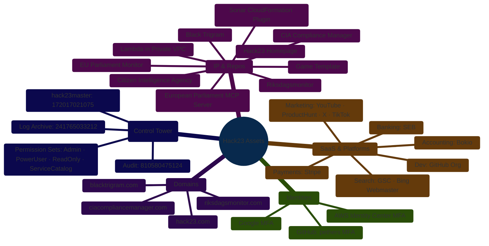
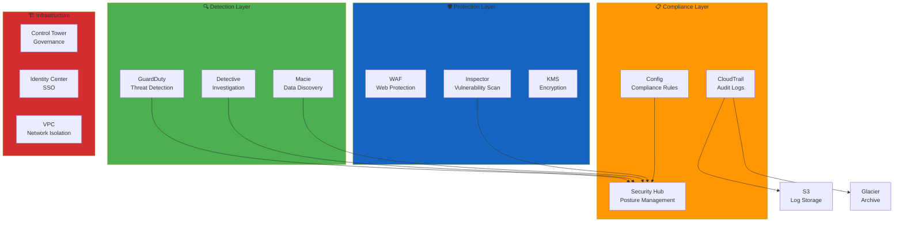
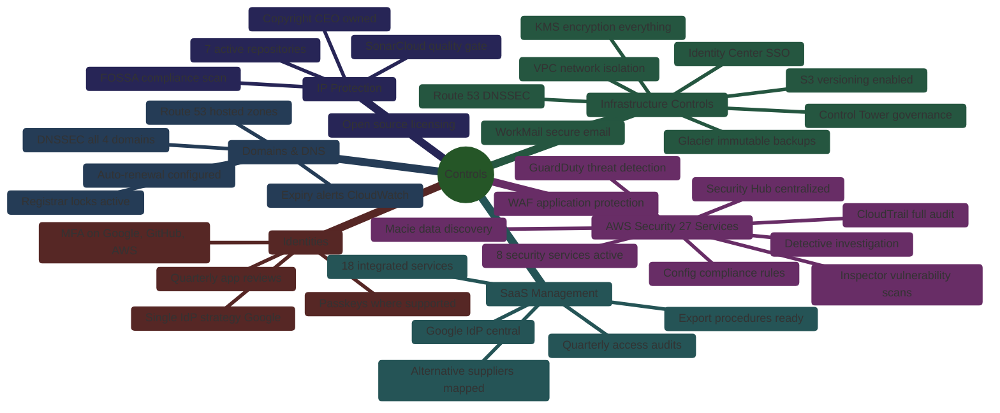
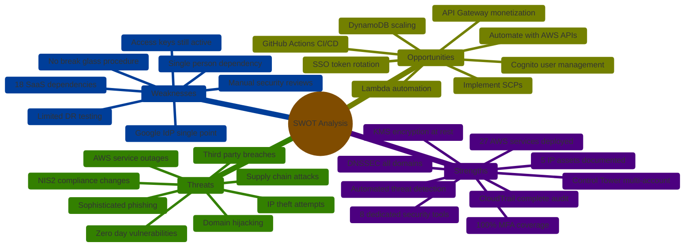
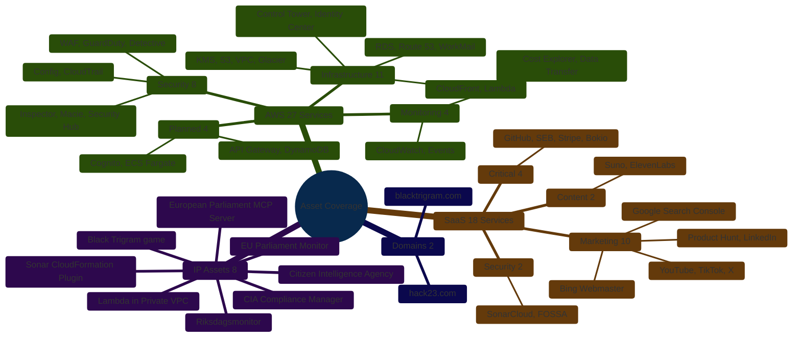
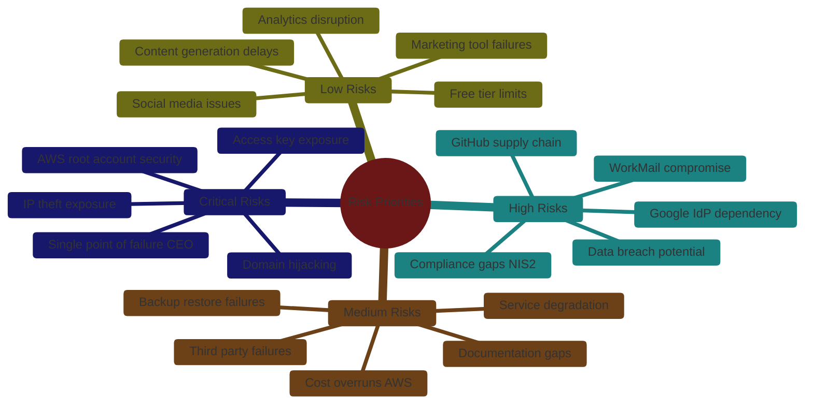
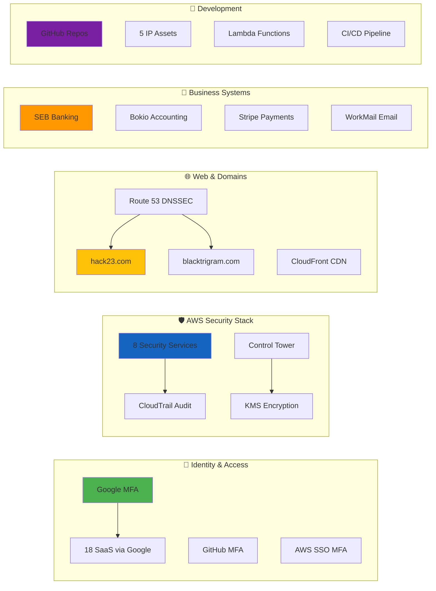

  

<h1 align="center">💻 Hack23 AB — Asset Register</h1>

  <strong>🛡️ Comprehensive Asset Management Through Systematic Documentation</strong> 
  <em>🎯 Enterprise-grade Asset Inventory Demonstrating Cybersecurity Excellence</em>

  
  
  
  

**📋 Document Owner:** CEO | **📄 Version:** 2.2 | **📅 Last Updated:** 2026-02-26 (UTC)  
**🔄 Review Cycle:** Annual | **⏰ Next Review:** 2027-02-26

---

## 🎯 **Purpose Statement**

**Hack23 AB's** asset register demonstrates how **comprehensive asset management directly enables both security excellence and business transparency.** Our systematic asset documentation serves as both operational necessity and client demonstration of our cybersecurity consulting methodologies.

Scope: Company identities, SaaS/platform accounts, cloud accounts, domains, and intellectual property. Supplier posture and SLAs are authoritative in [SUPPLIER.md](./SUPPLIER.md). Open source transparency governance in [Open Source Policy](./Open_Source_Policy.md).

  <a href="#-asset-landscape-overview">Overview</a> •
  <a href="#1-identities-and-accounts">Identities</a> •
  <a href="#2-saas-and-platforms-summary">SaaS</a> •
  <a href="#3-aws-organization-control-tower">AWS</a> •
  <a href="#4-domains">Domains</a> •
  <a href="#5-intellectual-property">IP</a> •
  <a href="#6-asset-risk-and-controls-high-level">Risk</a> •
  <a href="#7-change-log">Changelog</a>

## 🧭 Icon Legend
- 👤 Identity • 🔐 MFA • 🛠️ Platforms • 📝 Notes
- 🧩 Service • 🏢 Account/Org • 📦 Plan • ✅ Status
- ☁️ Cloud • 🐙 GitHub • 🏦 Banking • 🧾 Accounting • 💳 Payments
- 🔎 Search/SEO • ▶️ YouTube • 🦄 Product Hunt • 🎵 TikTok • ✖️ X
- 🌐 Domain • ©️ Intellectual Property • 💼 LinkedIn

---

## 🗺️ Asset Landscape (Overview)

```mermaid
%%{
  init: { 'theme': 'base', 'themeVariables': { 'primaryColor': '#1565C0', 'lineColor': '#1565C0' } }
}%%
mindmap
  root((Hack23 Assets))
    Identities
      Google MFA
      GitHub: pethers MFA
      AWS Identity Center MFA
    SaaS & Platforms
      Accounting: Bokio
      Banking: SEB
      Dev: GitHub Org
      Payments: Stripe
      Marketing: YouTube · ProductHunt · X · TikTok
      Search: GSC · Bing Webmaster
    AWS Org (Control Tower)
      Audit: 810580475124
      Log Archive: 241765033212
      hack23master: 172017021075
      Permission Sets: Admin · PowerUser · ReadOnly · ServiceCatalog
    Domains
      hack23.com
      blacktrigram.com
      ciacompliancemanager.com
      riksdagsmonitor.com
    IP & Repos
      Black Trigram
      CIA Compliance Manager
      Citizen Intelligence Agency
      European Parliament MCP Server
      EU Parliament Monitor
      Game Template
      Hack23 Homepage
      Lambda in Private VPC
      Riksdagsmonitor
      Sonar CloudFormation Plugin
```

## 1) Identities and Accounts

### 1.1 Human identities
| #️⃣ ID | 👤 Person | ✉️ Email | 🛠️ Platforms | 🔐 MFA | 📝 Notes | 🏷️ Types |
|-------|-----------|----------|---------------|--------|----------|----------|
| U-001 | James Pether Sörling | pether.sorling@gmail.com | 🔎 Google • 🐙 GitHub (pethers) • ☁️ AWS SSO | Enabled | Google account is the hub for SaaS sign-ins listed below |  |

### 1.2 Linked services (via Google account)
| #️⃣ ID | 🧩 Service | 👤 Account/Handle | ✅ Status | 🔐 MFA/2FA | 📝 Notes | 🏷️ Types |
|-------|------------|-------------------|-----------|------------|----------|----------|
| G-001 | 🧾 Bokio | Google login | Active ✅ | N/A (IdP) | Connected via Google |   |
| G-002 | 💳 Stripe | Google login | Active ✅ | N/A (IdP) | Connected via Google |   |
| G-003 | 🔎 Google Search Console | pether.sorling@gmail.com | Active ✅ | Google MFA | Site verification |   |
| G-004 | 🔎 Bing Webmaster Tools | pether.sorling@gmail.com | Active ✅ | Google MFA | Site verification |   |
| G-005 | ▶️ YouTube | @ via Google | Active ✅ | Google MFA | Connected |   |
| G-006 | 🦄 Product Hunt | Google login | Active ✅ | N/A (IdP) | Connected |   |
| G-007 | 🎵 TikTok | Google login | Active ✅ | N/A (IdP) | Connected |   |
| G-008 | ✖️ X (Twitter) | Google login | Active ✅ | N/A (IdP) | Connected |   |
| G-009 | 💼 LinkedIn (CEO) | https://www.linkedin.com/in/jamessorling/ | Active ✅ | Platform MFA | Professional profile |   |
| G-010 | 💼 LinkedIn (Company) | https://www.linkedin.com/company/hack23/ | Active ✅ | Platform MFA | Company page |   |

### 1.3 GitHub account and integrations
| #️⃣ ID | 🐙 Account | 🔐 MFA | 🔌 Connected Apps | 📝 Notes | 🏷️ Types |
|-------|------------|--------|-------------------|----------|----------|
| GH-001 | pethers | Enabled | — | Used across Hack23 org projects |   |
| GH-INT-001 | Integration: SonarSource (SonarCloud) | N/A | — | SAST (static analysis) |   |
| GH-INT-002 | Integration: FOSSA | N/A | — | Open source compliance (license/security) |   |

---

## 2) SaaS and Platforms (summary)
See SUPPLIER.md for detailed posture (costs, SLAs, risks).
<!-- Note: Includes free providers authenticated via Google/GitHub; some used only for public repos. -->

| #️⃣ ID | ☁️ Service | 🏢 Account/Org | 📦 Plan/Status | 👤 Owner | 🔐 MFA | 📝 Notes | 🏷️ Classification |
|-------|------------|----------------|----------------|----------|--------|----------|--------------------|
| S-001 | ☁️ AWS | Hack23 (Control Tower) | Active ✅ | CEO | Enforced via AWS Identity Center | Mission critical |    |
| S-002 | 🐙 GitHub | hack23 (org) | Active ✅ | CEO | Required | Version control, CI/CD |    |
| S-003 | 🏦 SEB | Corporate Banking | Active ✅ | CEO | Bank MFA | Payments/payroll |    |
| S-004 | 🧾 Bokio | Company workspace | Active ✅ | CEO | IdP (Google) | Accounting |    |
| S-005 | 🎶 Suno | Subscription | Active ✅ | CEO | Platform MFA | Marketing content |    |
| S-006 | 🎙️ ElevenLabs | Subscription | Active ✅ | CEO | Platform MFA | Audio/voice |    |
| S-007 | 🤖 OpenAI | API | Active ✅ | CEO | API / Account MFA | AI services |    |
| S-008 | 💳 Stripe | Platform | Active ✅ | CEO | Platform MFA | Payments |    |
| S-009 | 🔎 Google Search Console | pether.sorling@gmail.com | Active (Free) ✅ | CEO | Google MFA | SEO verification & metrics |    |
| S-010 | 🔎 Bing Webmaster Tools | pether.sorling@gmail.com | Active (Free) ✅ | CEO | Google MFA | SEO coverage for Bing |    |
| S-011 | ▶️ YouTube | Channel via Google | Active (Free) ✅ | CEO | Google MFA | Marketing channel |    |
| S-012 | 🦄 Product Hunt | hack23 | Active (Free) ✅ | CEO | IdP (Google) | Launch listings |    |
| S-013 | 🎵 TikTok | hack23 | Active (Free) ✅ | CEO | IdP (Google) | Social marketing |    |
| S-014 | ✖️ X (Twitter) | hack23 | Active (Free) ✅ | CEO | IdP (Google) | Social updates |    |
| S-015 | 💼 LinkedIn (CEO) | jamessorling | Active (Free) ✅ | CEO | Platform MFA | Executive profile |    |
| S-016 | 💼 LinkedIn (Company) | Hack23 AB | Active (Free) ✅ | CEO | Platform MFA | Company page |    |
| S-017 | 🛡️ SonarSource (SonarCloud) | GitHub org integration | Active (Free/public) ✅ | CEO | GitHub OAuth | SAST for public repos only |    |
| S-018 | ⚖️ FOSSA | GitHub org integration | Active (Free/public) ✅ | CEO | GitHub OAuth | OSS license/security for public repos |    |

---

## 3) AWS Organization (Control Tower)

Supplier: AWS (accounts via AWS Organizations). Control Tower is used for governance/security and SSO; IAM Identity Center with MFA enforced.  
Note: AWS WorkMail uses MFA through Identity Center.

### 3.1 Accounts
| #️⃣ ID | 🏷️ Account Name | 🆔 Account ID | ✉️ Root Email | 🎯 Purpose | 🏷️ Types |
|-------|------------------|---------------|---------------|-----------|----------|
| AWS-001 | Audit | 810580475124 | audit@hack23.com | Security/audit (CT Log/Audit pattern) |   |
| AWS-002 | Log archive | 241765033212 | log-archive@hack23.com | Central immutable logs |   |
| AWS-003 | hack23master | 172017021075 | pether.sorling@gmail.com | Primary workload/management |   |

### 3.2 Permission sets / access
| #️⃣ ID | 🛡️ Permission Set | 📍 Scope | 🔑 Keys |
|-------|--------------------|---------|---------|
| PS-001 | AWSAdministratorAccess | Audit, hack23master | Access keys in use (as provided) |
| PS-002 | AWSPowerUserAccess | Audit, hack23master | Access keys in use (as provided) |
| PS-003 | AWSReadOnlyAccess | Audit, hack23master | Access keys in use (as provided) |
| PS-004 | AWSServiceCatalogAdminFullAccess | hack23master | Access keys in use (as provided) |
| PS-005 | AWSServiceCatalogEndUserAccess | hack23master | Access keys in use (as provided) |

### 3.3 Visual: AWS Organization Diagram

```mermaid
flowchart LR
  A["Control Tower Org"]
  AU["Audit\n810580475124\naudit&#64;hack23.com"]
  LA["Log Archive\n241765033212\nlog-archive&#64;hack23.com"]
  HM["hack23master\n172017021075\npether.sorling&#64;gmail.com"]

  A --> AU
  A --> LA
  A --> HM

  subgraph "Permission Sets"
    PS1["AWSAdministratorAccess"]
    PS2["AWSPowerUserAccess"]
    PS3["AWSReadOnlyAccess"]
    PS4["AWSServiceCatalogAdminFullAccess"]
    PS5["AWSServiceCatalogEndUserAccess"]
  end

  AU --- PS1
  AU --- PS2
  AU --- PS3
  HM --- PS1
  HM --- PS2
  HM --- PS3
  HM --- PS4
  HM --- PS5

  classDef ct fill:#FFC107,stroke:#ffa000,stroke-width:2px,color:#333;
  classDef acct fill:#1565C0,stroke:#1565C0,color:#0d47a1;

  class A ct;
  class AU,LA,HM acct;
```

### 3.4 DNS (Route 53) and Domain Security
- DNS provider: Amazon Route 53 (hosted zones in AWS)
- DNSSEC: Enabled for all domains (DS records published at registrar)

| Domain | Hosted Zone | DNSSEC | Evidence Links | Notes |
|--------|-------------|--------|----------------|-------|
| hack23.com | Route 53 | Enabled | [DNSViz](https://dnsviz.net/d/hack23.com/dnssec/) • [Internet.nl](https://internet.nl/site/hack23.com/) • [MXToolbox](https://mxtoolbox.com/SuperTool.aspx?action=mx%3ahack23.com) | Registrar lock on; alerts configured |
| blacktrigram.com | Route 53 | Enabled | [DNSViz](https://dnsviz.net/d/blacktrigram.com/dnssec/) • [Internet.nl](https://internet.nl/site/blacktrigram.com/) • [MXToolbox](https://mxtoolbox.com/SuperTool.aspx?action=mx%3ablacktrigram.com) | Registrar lock on; alerts configured |
| ciacompliancemanager.com | Route 53 | Enabled | [DNSViz](https://dnsviz.net/d/ciacompliancemanager.com/dnssec/) • [Internet.nl](https://internet.nl/site/ciacompliancemanager.com/) • [SSL Labs](https://www.ssllabs.com/ssltest/analyze.html?d=ciacompliancemanager.com) | Product domain; alerts configured |
| riksdagsmonitor.com | Route 53 | Enabled | [DNSViz](https://dnsviz.net/d/riksdagsmonitor.com/dnssec/) • [Internet.nl](https://internet.nl/site/riksdagsmonitor.com/) • [SSL Labs](https://www.ssllabs.com/ssltest/analyze.html?d=riksdagsmonitor.com) | Political transparency domain; alerts configured |

#### 🔐 Domain Security Evidence Summary

| Security Check | Tool | hack23.com | blacktrigram.com | ciacompliancemanager.com | riksdagsmonitor.com |
|----------------|------|------------|------------------|--------------------------|---------------------|
| **DNSSEC** | DNSViz | ✅ Signed | ✅ Signed | ✅ Signed | ✅ Signed |
| **SPF** | MXToolbox | ✅ Valid | ✅ Valid | ✅ Valid | ✅ Valid |
| **DKIM** | MXToolbox | ✅ Valid | ✅ Valid | N/A | N/A |
| **DMARC** | MXToolbox | ✅ Valid | ✅ Valid | ✅ Valid | ✅ Valid |
| **CAA** | DNS Lookup | ✅ Set | ✅ Set | ✅ Set | ✅ Set |
| **HTTPS** | SSL Labs | ✅ A+ | ✅ A+ | ✅ A+ | ✅ A+ |

### 3.5 AWS Services in Use (27 Active Services)

#### Security & Compliance Services (8 Services)
| Service | Purpose | Data Classification | Status |
|---------|---------|-------------------|---------|
| WAF | Web application firewall for hack23.com/blacktrigram.com |  | ✅ Active |
| Security Hub | Centralized security findings and compliance |  | ✅ Active |
| Detective | Security investigation and threat hunting |  | ✅ Active |
| Inspector | Vulnerability assessment for EC2/Lambda/containers |  | ✅ Active |
| GuardDuty | Threat detection across accounts |  | ✅ Active |
| Config | Compliance rules and resource tracking |  | ✅ Active |
| Macie | Sensitive data discovery in S3 |  | ✅ Active |
| CloudTrail | API audit logging across all accounts |  | ✅ Active |

#### Core Infrastructure Services (11 Services)
| Service | Purpose | Data Classification | Status |
|---------|---------|-------------------|---------|
| RDS | PostgreSQL for CIA application |  | ✅ Active |
| Route 53 | DNS management with DNSSEC |  | ✅ Active |
| WorkMail | Corporate email (james@hack23.com) |  | ✅ Active |
| KMS | Encryption key management |  | ✅ Active |
| S3 | Static website hosting, backups, logs |  | ✅ Active |
| VPC | Network isolation for Lambda/RDS |  | ✅ Active |
| Glacier | Long-term backup storage |  | ✅ Active |
| CloudFront | CDN for hack23.com and blacktrigram.com |  | ✅ Active |
| Lambda | Serverless functions for APIs |  | ✅ Active |
| Control Tower | Multi-account governance |  | ✅ Active |
| Identity Center | SSO and permission management |  | ✅ Active |

#### Monitoring & Analytics Services (4 Services)
| Service | Purpose | Data Classification | Status |
|---------|---------|-------------------|---------|
| Cost Explorer | Cost analysis and optimization |  | ✅ Active |
| CloudWatch Events | Event-driven automation |  | ✅ Active |
| CloudWatch | Metrics, logs, and alarms |  | ✅ Active |
| Data Transfer | Cross-region and internet transfer | N/A | ✅ Active |

#### Resilience & DR Services (4 Services)
| Service | Purpose | Data Classification | Status |
|---------|---------|---------------------|--------|
| Resilience Hub | Application resilience assessment and policy gating |  | ✅ Active |
| Fault Injection Service | Chaos experiments to validate failover/recovery |  | ✅ Active |
| AWS Backup | Centralized backup plans, cross-region copies, immutable vaults |  | ✅ Active |
| Backup Audit Manager | Backup compliance controls and reporting |  | ✅ Active |

#### Planned Services (Q2-Q3 2025)
| Service | Purpose | Data Classification | Timeline |
|---------|---------|-------------------|----------|
| API Gateway | REST/GraphQL APIs for Black Trigram |  | Q2 2025 |
| DynamoDB | NoSQL for game state and user data |  | Q2 2025 |
| Cognito | User authentication for products |  | Q3 2025 |
| ECS/Fargate | Container hosting for microservices |  | Q3 2025 |

### 3.6 Security Architecture

```mermaid
graph TB
    subgraph Detection["🔍 Detection Layer"]
        GD[GuardDuty<br/>Threat Detection]
        DT[Detective<br/>Investigation]
        MC[Macie<br/>Data Discovery]
    end
    
    subgraph Protection["🛡️ Protection Layer"]
        WAF[WAF<br/>Web Protection]
        IN[Inspector<br/>Vulnerability Scan]
        KMS[KMS<br/>Encryption]
    end
    
    subgraph Compliance["📋 Compliance Layer"]
        SH[Security Hub<br/>Posture Management]
        CFG[Config<br/>Compliance Rules]
        CT[CloudTrail<br/>Audit Logs]
    end
    
    subgraph Infrastructure["🏗️ Infrastructure"]
        CT_ORG[Control Tower<br/>Governance]
        IDC[Identity Center<br/>SSO]
        VPC[VPC<br/>Network Isolation]
    end
    
    GD --> SH
    DT --> SH
    MC --> SH
    IN --> SH
    CFG --> SH
    CT --> S3[S3<br/>Log Storage]
    CT --> GL[Glacier<br/>Archive]
    
    style Detection fill:#4CAF50
    style Protection fill:#1565C0
    style Compliance fill:#FF9800
    style Infrastructure fill:#D32F2F
```

---

## 4) Domains

| #️⃣ ID | 🌐 Domain | 🏢 Owner | ✅ Status | 📝 Notes | 🏷️ Types | 🔐 Evidence |
|-------|----------|----------|-----------|----------|----------|----------|
| D-001 | hack23.com | Hack23 AB | Active ✅ | DNS: Route 53 • DNSSEC: ON |    | [DNSSEC](https://dnsviz.net/d/hack23.com/dnssec/) • [Email](https://mxtoolbox.com/SuperTool.aspx?action=mx%3ahack23.com) • [SSL](https://www.ssllabs.com/ssltest/analyze.html?d=hack23.com) |
| D-002 | blacktrigram.com | Hack23 AB | Active ✅ | DNS: Route 53 • DNSSEC: ON |    | [DNSSEC](https://dnsviz.net/d/blacktrigram.com/dnssec/) • [Email](https://mxtoolbox.com/SuperTool.aspx?action=mx%3ablacktrigram.com) • [SSL](https://www.ssllabs.com/ssltest/analyze.html?d=blacktrigram.com) |
| D-003 | ciacompliancemanager.com | Hack23 AB | Active ✅ | DNS: Route 53 • DNSSEC: ON |    | [DNSSEC](https://dnsviz.net/d/ciacompliancemanager.com/dnssec/) • [SSL](https://www.ssllabs.com/ssltest/analyze.html?d=ciacompliancemanager.com) |
| D-004 | riksdagsmonitor.com | Hack23 AB | Active ✅ | DNS: Route 53 • DNSSEC: ON |    | [DNSSEC](https://dnsviz.net/d/riksdagsmonitor.com/dnssec/) • [SSL](https://www.ssllabs.com/ssltest/analyze.html?d=riksdagsmonitor.com) |

---

## 5) Intellectual Property

Statement: All copyrights remain with the CEO and sole owner of Hack23.com.

| Project | Repository | Website | 🏗️ Project Type | 🏢 Process Types |
|--------|------------|---------|------------------|------------------|
| 🎮 Black Trigram | https://github.com/Hack23/blacktrigram | https://blacktrigram.com |  |   |
| 🛡️ CIA Compliance Manager | https://github.com/Hack23/cia-compliance-manager | https://ciacompliancemanager.com/ |  |   |
| 🏛️ Citizen Intelligence Agency | https://github.com/Hack23/cia | https://hack23.com/cia-features.html |  |  |
| 🇪🇺 European Parliament MCP Server | https://github.com/Hack23/European-Parliament-MCP-Server | https://hack23.github.io/European-Parliament-MCP-Server/ |  |  |
| 🇪🇺 EU Parliament Monitor | https://github.com/Hack23/euparliamentmonitor | - |  |   |
| 🎮 Game Template | https://github.com/Hack23/game | - |  |  |
| 🌐 Hack23 Homepage | https://github.com/Hack23/homepage | https://hack23.com |  |  |
| ☁️ Lambda in Private VPC | https://github.com/Hack23/lambda-in-private-vpc | - |  |  |
| 🗳️ Riksdagsmonitor | https://github.com/Hack23/riksdagsmonitor | https://riksdagsmonitor.com |  |   |
| 🔍 Sonar CloudFormation Plugin ⚠️ | https://github.com/Hack23/sonar-cloudformation-plugin | - |   |  |

### 🔐 Repository Security Evidence

Live security posture badges for all Hack23 intellectual property assets:

| Project | OpenSSF Scorecard | License | CI Status | Additional Evidence |
|---------|-------------------|---------|-----------|---------------------|
| **Black Trigram** |  |  |  |  |
| **CIA Compliance Manager** |  |  |  |  |
| **Citizen Intelligence Agency** |  |  |  |  |
| **European Parliament MCP Server** |  |  |  |  |
| **EU Parliament Monitor** |  |  |  |  |
| **Game Template** |  |  |  | Template repo |
| **Hack23 Homepage** |  |  |  | Corporate website |
| **Lambda in Private VPC** |  |  |  | AWS Reference Architecture |
| **Riksdagsmonitor** |  |  |  |  |
| **Sonar CloudFormation Plugin** ⚠️ |  |  |  |  |

---

## 5.1) Intellectual Property Rights (IPR) Handling

### 📋 IPR Framework

All intellectual property created by or for Hack23 AB is managed systematically to ensure legal protection, proper licensing, and secure disposal when necessary.

| IPR Category | Handling Requirements | Protection Measures | Disposal Method |
|--------------|----------------------|---------------------|-----------------|
| **Source Code** | Apache-2.0 license, copyright notices | GitHub private/public repos, code review, commit signing | Secure repository deletion with backup retention |
| **Documentation** | Creative Commons BY-SA 4.0 for public docs | Version control, review process | Standard file deletion after retention period |
| **Trademarks** | Brand guidelines, usage restrictions | Registered where applicable, monitoring | Transfer or abandonment per legal counsel |
| **Trade Secrets** | Need-to-know access, NDA requirements | Encryption, access controls, audit logging | Secure deletion per [Data Classification Policy](./Data_Classification_Policy.md) |
| **Patents** | Prior art documentation, invention disclosures | Legal filing if commercially valuable | Abandonment after evaluation |

### 🔒 IPR Protection Controls

- **Copyright Notices:** All source files include SPDX headers with copyright attribution
- **License Compliance:** FOSSA scanning ensures dependency license compatibility (see [Open Source Policy](./Open_Source_Policy.md))
- **Access Control:** IPR classified per [Classification Framework](./CLASSIFICATION.md) with appropriate access restrictions
- **Secure Disposal:** High/Very High confidentiality IPR requires secure deletion with verification

### 📜 Third-Party IPR Management

| Third-Party IPR | Usage Rights | Compliance Verification | Review Frequency |
|----------------|--------------|------------------------|------------------|
| Open Source Dependencies | Per dependency license | FOSSA automated scanning | Every commit |
| Cloud Service IP | AWS Customer Agreement terms | Terms review during renewals | Annual |
| SaaS Platform Tools | Per service agreement | Terms acceptance documented | Semi-Annual |
| Stock Media | Royalty-free or licensed | License verification in Asset Register | Annual |

---

## 5.2) Asset Return and Termination Procedures

### 🎯 Purpose

This section implements ISO 27001 A.5.11 (Return of assets) and A.6.5 (Responsibilities after termination), ensuring systematic asset recovery and access revocation.

### 📋 Termination Checklist

#### **Immediate Actions (Within 24 Hours)**

| Asset Category | Return/Revocation Actions | Verification | Responsibility |
|----------------|--------------------------|--------------|----------------|
| **Physical Devices** | Mobile devices, laptops returned to CEO | Physical receipt + device wipe log | Departing individual + CEO |
| **Cloud Access** | AWS Identity Center access revoked | IAM logs reviewed | CEO |
| **Repository Access** | GitHub organization membership removed | Audit log confirmation | CEO |
| **Email Access** | WorkMail account disabled | Email forwarding configured if needed | CEO |
| **SaaS Access** | Google Workspace suspension | Admin console log | CEO |

#### **Within 7 Days**

| Asset Category | Return/Revocation Actions | Verification | Responsibility |
|----------------|--------------------------|--------------|----------------|
| **Credentials** | All passwords reset, MFA devices deregistered | Authentication logs reviewed | CEO |
| **VPN/Network** | VPN certificates revoked, firewall rules updated | Connection logs verified empty | CEO |
| **Documentation** | Company confidential documents returned/deleted | Confirmation statement signed | Departing individual |
| **IP/Trade Secrets** | Reminder of confidentiality obligations | Acknowledgment signed | Departing individual |

#### **Within 30 Days**

| Action | Completion Criteria | Documentation |
|--------|-------------------|---------------|
| Final backup verification | Confirm departing individual data archived per retention policy | Backup log entry |
| Security review | Review access logs for anomalous activity | Security review memo |
| NDA reminder | Send reminder of ongoing confidentiality obligations | Certified email |
| Exit interview | Document knowledge transfer and lessons learned | Exit interview notes |

### 🔐 Asset Classification and Return Priority

Based on [Classification Framework](./CLASSIFICATION.md):

| Asset Classification | Return Priority | Access Revocation SLA | Verification Method |
|---------------------|-----------------|----------------------|---------------------|
|  | 🔴 Critical - Immediate | 4 hours | Manual verification + automated scanning |
|  | 🟠 High - Same day | 24 hours | Automated log review |
|  | 🟡 Medium - Within 3 days | 72 hours | Automated log review |
|  | 🟢 Standard - Within 7 days | 7 days | Quarterly access review |

### 📝 Termination Documentation

The following documentation is maintained for each termination:

- **Asset Return Receipt:** Physical confirmation of device returns
- **Access Revocation Log:** Timestamped log of all access removals
- **Data Archival Certificate:** Confirmation of data retention compliance
- **Confidentiality Reminder:** Acknowledgment of ongoing obligations
- **Final Security Review:** Post-termination security assessment

### 🔄 Integration with Other Policies

- **Access Control:** Immediate implementation of [Access Control Policy](./Access_Control_Policy.md) § Access Revocation procedures
- **Data Classification:** Secure handling per [Data Classification Policy](./Data_Classification_Policy.md) retention requirements
- **Mobile Devices:** Device wipe per [Mobile Device Management Policy](./Mobile_Device_Management_Policy.md) § Device Lifecycle

---

## 6) Asset Risk and Controls (high level)

### 6.1 Controls Overview (Mindmap)

```mermaid
%%{
  init: { 'theme': 'base', 'themeVariables': { 'primaryColor': '#4CAF50', 'lineColor': '#4CAF50' } }
}%%
mindmap
  root((Controls))
    Identities
      MFA on Google, GitHub, AWS
      Quarterly app reviews
      Passkeys where supported
      Single IdP strategy Google
    AWS Security 27 Services
      8 security services active
      GuardDuty threat detection
      Security Hub centralized
      Macie data discovery
      WAF application protection
      Inspector vulnerability scans
      Detective investigation
      Config compliance rules
      CloudTrail full audit
    Infrastructure Controls
      Control Tower governance
      Identity Center SSO
      KMS encryption everything
      VPC network isolation
      Route 53 DNSSEC
      S3 versioning enabled
      Glacier immutable backups
      WorkMail secure email
    SaaS Management
      Google IdP central
      18 integrated services
      Quarterly access audits
      Export procedures ready
      Alternative suppliers mapped
    Domains & DNS
      Route 53 hosted zones
      DNSSEC all 4 domains
      Registrar locks active
      Auto-renewal configured
      Expiry alerts CloudWatch
    IP Protection
      7 active repositories
      Open source licensing
      Copyright CEO owned
      FOSSA compliance scan
      SonarCloud quality gate
```

### 6.2 SWOT — Comprehensive Asset Management

```mermaid
%%{
  init: { 'theme': 'base', 'themeVariables': { 'primaryColor': '#FF9800', 'lineColor': '#FF9800' } }
}%%
mindmap
  root((SWOT Analysis))
    Strengths
      27 AWS services deployed
      8 dedicated security tools
      Control Tower multi-account
      100% MFA coverage
      DNSSEC all domains
      CloudTrail complete audit
      KMS encryption at rest
      Automated threat detection
      5 IP assets documented
    Weaknesses
      Single person dependency
      Access keys still active
      No break glass procedure
      Limited DR testing
      Manual security reviews
      18 SaaS dependencies
      Google IdP single point
    Opportunities
      Automate with AWS APIs
      Implement SCPs
      SSO token rotation
      Lambda automation
      GitHub Actions CI/CD
      API Gateway monetization
      DynamoDB scaling
      Cognito user management
    Threats
      Supply chain attacks
      Zero day vulnerabilities
      AWS service outages
      Sophisticated phishing
      NIS2 compliance changes
      Third party breaches
      Domain hijacking
      IP theft attempts
```

### 6.3 Asset Coverage Matrix

```mermaid
%%{
  init: { 'theme': 'base', 'themeVariables': { 'primaryColor': '#1565C0', 'lineColor': '#1565C0' } }
}%%
mindmap
  root((Asset Coverage))
    AWS 27 Services
      Security 8
        WAF, GuardDuty, Detective
        Inspector, Macie, Security Hub
        Config, CloudTrail
      Infrastructure 11
        RDS, Route 53, WorkMail
        KMS, S3, VPC, Glacier
        CloudFront, Lambda
        Control Tower, Identity Center
      Monitoring 4
        CloudWatch, Events
        Cost Explorer, Data Transfer
      Planned 4
        API Gateway, DynamoDB
        Cognito, ECS Fargate
    SaaS 18 Services
      Critical 4
        GitHub, SEB, Stripe, Bokio
      Marketing 10
        YouTube, TikTok, X
        Product Hunt, LinkedIn
        Google Search Console
        Bing Webmaster
      Content 2
        Suno, ElevenLabs
      Security 2
        SonarCloud, FOSSA
    Domains 2
      hack23.com
      blacktrigram.com
    IP Assets 8
      Black Trigram game
      CIA Compliance Manager
      Citizen Intelligence Agency
      European Parliament MCP Server
      EU Parliament Monitor
      Lambda in Private VPC
      Riksdagsmonitor
      Sonar CloudFormation Plugin
```

### 6.4 Risk-Based Control Priorities

```mermaid
%%{
  init: { 'theme': 'base', 'themeVariables': { 'primaryColor': '#D32F2F', 'lineColor': '#D32F2F' } }
}%%
mindmap
  root((Risk Priorities))
    Critical Risks
      Single point of failure CEO
      AWS root account security
      Access key exposure
      Domain hijacking
      IP theft exposure
    High Risks  
      GitHub supply chain
      Google IdP dependency
      Data breach potential
      Compliance gaps NIS2
      WorkMail compromise
    Medium Risks
      Cost overruns AWS
      Service degradation
      Third party failures
      Documentation gaps
      Backup restore failures
    Low Risks
      Content generation delays
      Social media issues
      Free tier limits
      Marketing tool failures
      Analytics disruption
```

### 6.5 Comprehensive Security Posture

```mermaid
graph LR
    subgraph "🔐 Identity & Access"
        ID1[Google MFA]
        ID2[GitHub MFA]
        ID3[AWS SSO MFA]
        ID4[18 SaaS via Google]
    end
    
    subgraph "🛡️ AWS Security Stack"
        SEC1[8 Security Services]
        SEC2[CloudTrail Audit]
        SEC3[Control Tower]
        SEC4[KMS Encryption]
    end
    
    subgraph "🌐 Web & Domains"
        WEB1[hack23.com]
        WEB2[blacktrigram.com]
        WEB3[Route 53 DNSSEC]
        WEB4[CloudFront CDN]
    end
    
    subgraph "💼 Business Systems"
        BUS1[SEB Banking]
        BUS2[Bokio Accounting]
        BUS3[Stripe Payments]
        BUS4[WorkMail Email]
    end
    
    subgraph "🚀 Development"
        DEV1[GitHub Repos]
        DEV2[5 IP Assets]
        DEV3[Lambda Functions]
        DEV4[CI/CD Pipeline]
    end
    
    ID1 --> ID4
    SEC1 --> SEC2
    SEC3 --> SEC4
    WEB3 --> WEB1
    WEB3 --> WEB2
    
    style ID1 fill:#4CAF50
    style SEC1 fill:#1565C0
    style WEB1 fill:#FFC107
    style BUS1 fill:#FF9800
    style DEV1 fill:#7B1FA2
```

---

## 7) Change Log
| Date (UTC) | Change |
|------------|--------|
| 2026-02-26 | **v2.2:** Added European Parliament MCP Server, EU Parliament Monitor (euparliamentmonitor), and Riksdagsmonitor to IP assets; Updated mindmaps and security evidence tables; Total 10 IP assets registered |
| 2026-01-25 | **v2.0:** Added domains D-003 (ciacompliancemanager.com) and D-004 (riksdagsmonitor.com); Added Game Template to IP; Added comprehensive domain security evidence links (DNSSEC, SPF/DKIM/DMARC, SSL); Marked Sonar CloudFormation Plugin as archived; Updated for ISMS-PUBLIC publication |
| 2025-11-05 | Added § 5.1 IPR Handling and § 5.2 Asset Return/Termination procedures (ISO 27001 A.5.11, A.5.32, A.6.5) |
| 2025-08-14 | Stripe status confirmed active (removed 'planned'); Insurance (Trygg Hansa) planned start 2025-09-01 |
| 2025-08-12 | Initial complete register created from provided inputs |

---

## 8) Compliance & Audit Trail
| Date | Finding | Action | Status |
|------|---------|--------|--------|
| 2025-08-14 | 27 AWS services documented | Complete service inventory | ✅ Completed |
| 2025-08-14 | 8 security services active | Enterprise-grade security posture | ✅ Active |
| 2025-08-14 | 18 SaaS services integrated | Documented dependencies | ✅ Completed |
| 2026-02-26 | 10 IP assets registered | Added European Parliament MCP Server, EU Parliament Monitor, Riksdagsmonitor | ✅ Active |
| 2026-01-25 | 7 IP assets registered | Added Game Template; Copyright protection confirmed (see Open Source Policy) | ✅ Active |
| 2025-08-14 | 2 domains with DNSSEC | Enhanced DNS security | ✅ Completed |
| 2026-01-25 | 4 domains with DNSSEC | Added ciacompliancemanager.com and riksdagsmonitor.com | ✅ Completed |
| 2025-08-14 | Access keys in use | Plan migration to SSO tokens | ⏳ In Progress |
| 2025-08-14 | No SCPs configured | Implement organizational policies | 🔴 Not Started |
| 2025-08-14 | No break-glass procedure | Document emergency access | 🔴 Not Started |

---

## 📚 Related Documents

### 🎯 Strategic & Governance
- [🎯 Information Security Strategy](./Information_Security_Strategy.md) - Strategic direction, AI-first operations, and asset protection strategy
- [🔐 Information Security Policy](./Information_Security_Policy.md) - Overall security governance, AI-First Operations Governance, and asset protection framework
- [🏷️ Classification Framework](./CLASSIFICATION.md) - Asset classification and business impact methodology
- [🤖 AI Policy](./AI_Policy.md) - AI agent governance and automation of asset management

### 🔐 Core Security Policies
- [🔑 Access Control Policy](./Access_Control_Policy.md) - Asset access management and authentication requirements
- [🏷️ Data Classification Policy](./Data_Classification_Policy.md) - Data asset handling and protection
- [🔒 Cryptography Policy](./Cryptography_Policy.md) - Encryption standards for asset protection (KMS, TLS)

### 🛡️ Risk & Vulnerability Management
- [📉 Risk Register](./Risk_Register.md) - Asset-related risk identification and treatment
- [📊 Risk Assessment Methodology](./Risk_Assessment_Methodology.md) - Asset risk quantification
- [🔍 Vulnerability Management](./Vulnerability_Management.md) - Asset vulnerability scanning and remediation
- [🎯 Threat Modeling](./Threat_Modeling.md) - Asset threat analysis and mitigation

### 🔗 Third-Party & Supply Chain
- [🔗 Supplier Security Posture](./SUPPLIER.md) - Third-party assets and service dependencies
- [🤝 Third Party Management](./Third_Party_Management.md) - Supplier risk assessment and monitoring
- [🔓 Open Source Policy](./Open_Source_Policy.md) - Intellectual property asset management

### 🔄 Continuity & Recovery
- [💾 Backup Recovery Policy](./Backup_Recovery_Policy.md) - Asset backup and recovery procedures
- [🏢 Business Continuity Plan](./Business_Continuity_Plan.md) - Asset continuity during disruptions
- [🔥 Disaster Recovery Plan](./Disaster_Recovery_Plan.md) - Asset recovery from major incidents
- [🚨 Incident Response Plan](./Incident_Response_Plan.md) - Asset incident handling procedures

### 🏗️ Architecture & Operations
- [🏗️ Security Architecture](./SECURITY_ARCHITECTURE.md) - Technical asset architecture and controls
- [🌐 Network Security Policy](./Network_Security_Policy.md) - Network asset protection (VPC, WAF)
- [📱 Mobile Device Management](./Mobile_Device_Management_Policy.md) - Mobile asset security
- [🔄 Change Management](./Change_Management.md) - Asset change control procedures
- [📊 Security Metrics](./Security_Metrics.md) - Asset security measurement and KPIs

---

**📋 Document Control:**  
**✅ Approved by:** James Pether Sörling, CEO  
**📤 Distribution:** CEO, Insurance Company, Legal Counsel    
**🏷️ Classification:**   
**📅 Effective Date:** 2026-01-25  
**⏰ Next Review:** 2027-01-25  
**🎯 Framework Compliance:**    