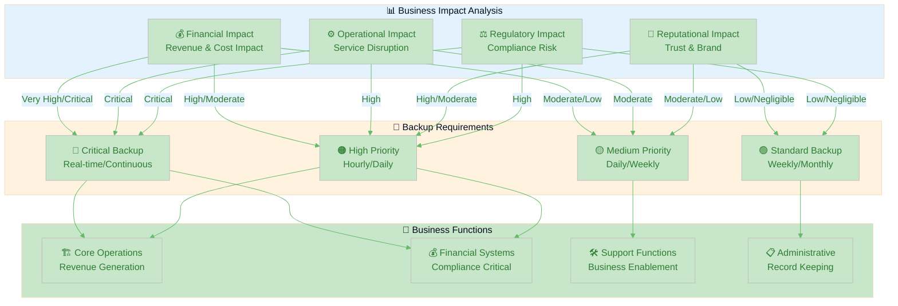

  

<h1 align="center">💾 Hack23 AB — Backup & Recovery Policy</h1>

  <strong>📊 Business Impact-Driven Data Protection Framework</strong> 
  <em>🎯 Systematic Backup Strategy Aligned with Business Continuity Requirements</em>

  
  
  
  

**📋 Document Owner:** CEO | **📄 Version:** 1.1 | **📅 Last Updated:** 2025-11-17 (UTC)  
**🔄 Review Cycle:** Semi-Annual | **⏰ Next Review:** 2026-05-18

---

## 🎯 **Purpose Statement**

**🏢 Hack23 AB's** backup and recovery policy demonstrates how **🔧 systematic data protection directly enables both operational resilience and competitive advantage.** Our 📊 business impact-driven backup strategy serves as both operational necessity and 👥 client demonstration of our cybersecurity consulting methodologies.

This policy establishes mandatory backup requirements based on [🏷️ Classification Framework](https://github.com/Hack23/ISMS-PUBLIC/blob/main/CLASSIFICATION.md) business impact analysis, ensuring data protection aligns with business value and continuity objectives.

*— 👨‍💼 James Pether Sörling, CEO/Founder*

---

## 📊 **Business Impact-Driven Backup Framework**

### 🎯 Business Impact Analysis Integration

Our backup strategy is directly driven by business impact assessment from the [🏷️ Classification Framework](https://github.com/Hack23/ISMS-PUBLIC/blob/main/CLASSIFICATION.md), ensuring resource allocation matches business value and regulatory requirements:

### 📈 Business Impact-Based Backup Matrix

| Business Function | 💰 Financial Impact | ⚙️ Operational Impact | 🤝 Reputational Impact | ⚖️ Regulatory Impact | 💾 Backup Priority | ⏰ RTO Target | 🔄 RPO Target |
|-------------------|-------------------|----------------------|----------------------|--------------------|------------------|------------|------------|
| **🏗️ Core Operations** |  |  |  |  | 🔴 Critical | < 1 hour | < 15 minutes |
| **💰 Financial Systems** |  |  |  |  | 🔴 Critical | < 1 hour | < 15 minutes |
| **🔧 Support Functions** |  |  |  |  | 🟠 High | 1-4 hours | 1-4 hours |
| **📋 Administrative** |  |  |  |  | 🟡 Medium | 4-24 hours | 4-24 hours |
| **📢 Marketing** |  |  |  |  | 🟢 Standard | > 24 hours | > 24 hours |

---

## 🎯 **Backup Requirements by Business Function**

### 🔴 Critical Business Functions

**Business Impact Criteria:**
Critical functions require immediate backup and recovery capabilities due to:
- [-darkred?style=flat-square&logo=dollar-sign&logoColor=white)](https://github.com/Hack23/ISMS-PUBLIC/blob/main/CLASSIFICATION.md#financial-impact-levels) Daily revenue loss potential
- [-red?style=flat-square&logo=exclamation-triangle&logoColor=white)](https://github.com/Hack23/ISMS-PUBLIC/blob/main/CLASSIFICATION.md#operational-impact-levels) Complete service disruption
- [-red?style=flat-square&logo=gavel&logoColor=white)](https://github.com/Hack23/ISMS-PUBLIC/blob/main/CLASSIFICATION.md#regulatory-impact-levels) Compliance violations

**Mandatory Requirements:**
- **Backup Frequency**: Continuous replication or maximum 15-minute intervals
- **Recovery Time**: [-orange?style=flat-square&logo=clock&logoColor=white)](https://github.com/Hack23/ISMS-PUBLIC/blob/main/CLASSIFICATION.md#rto-classifications)
- **Data Loss**: [-orange?style=flat-square&logo=database&logoColor=white)](https://github.com/Hack23/ISMS-PUBLIC/blob/main/CLASSIFICATION.md#rto-classifications)
- **Storage**: Multi-region with immutable backup capabilities
- **Validation**: Real-time integrity verification
- **Testing**: Monthly full recovery validation

### 🟠 High Priority Business Functions

**Business Impact Criteria:**
High-priority functions require robust backup due to:
- [-orange?style=flat-square&logo=dollar-sign&logoColor=white)](https://github.com/Hack23/ISMS-PUBLIC/blob/main/CLASSIFICATION.md#financial-impact-levels) Significant daily revenue impact
- [-orange?style=flat-square&logo=trending-down&logoColor=white)](https://github.com/Hack23/ISMS-PUBLIC/blob/main/CLASSIFICATION.md#operational-impact-levels) Major service degradation
- [-orange?style=flat-square&logo=gavel&logoColor=white)](https://github.com/Hack23/ISMS-PUBLIC/blob/main/CLASSIFICATION.md#regulatory-impact-levels) Significant regulatory penalties

**Standard Requirements:**
- **Backup Frequency**: Hourly or maximum 4-hour intervals
- **Recovery Time**: [-yellow?style=flat-square&logo=clock&logoColor=white)](https://github.com/Hack23/ISMS-PUBLIC/blob/main/CLASSIFICATION.md#rto-classifications)
- **Data Loss**: [-lightgreen?style=flat-square&logo=database&logoColor=white)](https://github.com/Hack23/ISMS-PUBLIC/blob/main/CLASSIFICATION.md#rto-classifications)
- **Storage**: Cross-region with encryption
- **Validation**: Daily automated testing
- **Testing**: Quarterly recovery drills

### 🟡 Medium Priority Business Functions

**Business Impact Criteria:**
Medium-priority functions have moderate backup requirements:
- [-yellow?style=flat-square&logo=dollar-sign&logoColor=black)](https://github.com/Hack23/ISMS-PUBLIC/blob/main/CLASSIFICATION.md#financial-impact-levels) Moderate financial impact
- [-yellow?style=flat-square&logo=trending-down&logoColor=black)](https://github.com/Hack23/ISMS-PUBLIC/blob/main/CLASSIFICATION.md#operational-impact-levels) Partial operational impact
- [-yellow?style=flat-square&logo=gavel&logoColor=black)](https://github.com/Hack23/ISMS-PUBLIC/blob/main/CLASSIFICATION.md#regulatory-impact-levels) Minor regulatory implications

**Standard Requirements:**
- **Backup Frequency**: Daily backups
- **Recovery Time**: [-lightgreen?style=flat-square&logo=clock&logoColor=white)](https://github.com/Hack23/ISMS-PUBLIC/blob/main/CLASSIFICATION.md#rto-classifications)
- **Data Loss**: [-lightblue?style=flat-square&logo=database&logoColor=white)](https://github.com/Hack23/ISMS-PUBLIC/blob/main/CLASSIFICATION.md#rto-classifications)
- **Storage**: Single region with versioning
- **Validation**: Weekly integrity verification
- **Testing**: Semi-annual recovery validation

### 🟢 Standard Business Functions

**Business Impact Criteria:**
Standard functions have basic backup needs:
- [-lightgreen?style=flat-square&logo=dollar-sign&logoColor=white)](https://github.com/Hack23/ISMS-PUBLIC/blob/main/CLASSIFICATION.md#financial-impact-levels) Minimal financial impact
- [-lightgreen?style=flat-square&logo=trending-down&logoColor=white)](https://github.com/Hack23/ISMS-PUBLIC/blob/main/CLASSIFICATION.md#operational-impact-levels) Minor operational disruption
-  Minimal regulatory risk

**Minimum Requirements:**
- **Backup Frequency**: Weekly or as operationally needed
- **Recovery Time**: [-lightgrey?style=flat-square&logo=clock&logoColor=black)](https://github.com/Hack23/ISMS-PUBLIC/blob/main/CLASSIFICATION.md#rto-classifications)
- **Data Loss**: [-lightgrey?style=flat-square&logo=database&logoColor=black)](https://github.com/Hack23/ISMS-PUBLIC/blob/main/CLASSIFICATION.md#rto-classifications)
- **Storage**: Standard backup with basic retention
- **Validation**: Monthly spot verification
- **Testing**: Annual recovery validation

---

## 🔧 **Technical Implementation Requirements**

### 💰 Financial Systems Implementation

**Process Classification:** 

**Technical Requirements:**
Reference [SUPPLIER.md](./SUPPLIER.md) for detailed supplier backup capabilities and SLA requirements.

| System Category | Technical Implementation | Recovery Method | Compliance Notes |
|-------------|-----------------|---------------|------------------|
| **Banking Platform** | Provider real-time backup + immutable storage | Provider managed failover + manual procedures | PCI DSS, audit trail requirements |
| **Accounting System** | Daily automated export + provider backup | Data import + manual reconciliation | Tax authority, audit requirements |
| **Payment Gateway** | Provider managed + transaction logging | Provider PCI compliance procedures | PCI DSS Level 1 requirements |

### 🔧 Operations & Technology Implementation  

**Process Classification:** 

**Technical Requirements:**
Reference [Asset Register](./Asset_Register.md) for complete infrastructure inventory and dependencies.

| System Category | Technical Implementation | Recovery Method | Documentation |
|-------------|-----------------|------------------|---------------|
| **Cloud Infrastructure** | Multi-region snapshots + automated backups | Infrastructure as Code restoration | [Business Continuity Plan](./Business_Continuity_Plan.md) |
| **Development Platform** | Git repositories + local mirrors | Git restore + CI/CD rebuild | [Secure Development Policy](./Secure_Development_Policy.md) |
| **CI/CD Pipeline** | Configuration as code + artifact storage | Automated deployment restoration | Pipeline documentation |

### 📢 Marketing & Communications Implementation

**Process Classification:** 

**Technical Requirements:**
Reference [SUPPLIER.md](./SUPPLIER.md) for marketing platform backup capabilities and data export procedures.

| System Category | Technical Implementation | Recovery Method | Alternative Options |
|-------------|-----------------|------------------|-------------------|
| **Content Assets** | Weekly platform export + version control | Manual import + reconstruction | Multiple platform strategy |
| **Social Media Platforms** | Platform-native backup + screenshot archive | Manual account recreation | Alternative platforms available |
| **Marketing Tools** | Configuration export + process documentation | Manual setup + alternative tools | Vendor diversity approach |

---

## 📊 **Backup Performance and Monitoring**

### 🎯 Key Performance Indicators

| Metric Category | KPI | Target | Measurement Method | Escalation Threshold |
|-----------------|-----|--------|-------------------|---------------------|
| **Backup Success** | Completion Rate | 99.9% | Automated monitoring | <99% for 2 consecutive days |
| **Recovery Time** | RTO Achievement | 95% within target | Test results tracking | <90% achievement rate |
| **Data Integrity** | Verification Success | 100% | Automated validation | Any integrity failure |
| **Storage Efficiency** | Deduplication Ratio | >70% | Storage analytics | <60% efficiency |

### 🚨 Monitoring and Alerting

**Real-time Monitoring Requirements:**
- Backup job completion status
- Storage capacity utilization  
- Data integrity verification results
- Recovery test performance
- Cross-region replication status

**Alert Escalation Matrix:**
| Severity | Response Time | Notification Method | Responsible Party |
|----------|---------------|-------------------|-------------------|
| **Critical** | Immediate | SMS + Email + Slack | CEO |
| **High** | 15 minutes | Email + Slack | CEO |
| **Medium** | 1 hour | Email | CEO |
| **Low** | 4 hours | Email digest | CEO |

---

## 🧪 **Testing and Validation Framework**

### 📅 Recovery Testing Schedule

Based on business impact classification from [Classification Framework](https://github.com/Hack23/ISMS-PUBLIC/blob/main/CLASSIFICATION.md):

| Business Impact Level | Test Frequency | Test Scope | Success Criteria | Documentation Required |
|----------------------|----------------|------------|-----------------|----------------------|
| **🔴 Critical** | Monthly | Full system recovery | 100% RTO/RPO compliance | Complete test report |
| **🟠 High** | Quarterly | Component recovery | 95% RTO/RPO compliance | Test summary |
| **🟡 Medium** | Semi-annual | Data integrity validation | 90% data verification | Test checklist |
| **🟢 Standard** | Annual | Spot check recovery | 80% successful restoration | Basic test log |

### 📊 Testing Methodology

**Test Types and Procedures:**
1. **Restore Testing**: Full data restoration verification
2. **Recovery Time Testing**: RTO/RPO measurement validation  
3. **Integrity Testing**: Data corruption detection and correction
4. **Failover Testing**: Backup system activation procedures
5. **Process Testing**: Manual procedure verification

---

## 🔄 **Integration with Business Continuity**

### 📋 BCP Integration Points

This policy directly supports [Business Continuity Plan](./Business_Continuity_Plan.md) recovery objectives:

| Business Function | BCP Priority | Backup Strategy | Success Metrics | Integration Points |
|-------------------|--------------|----------------|-----------------|-------------------|
| **🏗️ Core Operations** | Critical | Real-time replication | 99.9% RTO achievement | Automatic failover procedures |
| **💰 Financial Systems** | Critical | Immutable + cross-region | 100% regulatory compliance | Manual failover procedures |
| **🔧 Support Functions** | High | Daily + validation | 95% RTO achievement | Standard recovery procedures |
| **📋 Administrative** | Medium | Weekly + verification | 90% RTO achievement | Best-effort recovery |

### 🚨 Escalation Integration

Reference [Business Continuity Plan](./Business_Continuity_Plan.md) for complete escalation procedures and [Risk Register](./Risk_Register.md) for risk treatment alignment.

**Backup Failure Escalation Matrix:**
- **Critical Systems**: Immediate BCP activation
- **High Priority**: Urgent response procedures
- **Standard Systems**: Normal incident response

---

## 📚 **Related Documents**

- [🏷️ Classification Framework](https://github.com/Hack23/ISMS-PUBLIC/blob/main/CLASSIFICATION.md) - Business impact definitions, RTO/RPO classifications, and impact assessment methodology
- [🔄 Business Continuity Plan](./Business_Continuity_Plan.md) - Business recovery procedures, escalation matrices, and continuity strategies
- [💻 Asset Register](./Asset_Register.md) - Asset inventory, business impact classifications, and dependency documentation
- [🚨 Incident Response Plan](./Incident_Response_Plan.md) - Backup failure incident procedures and escalation workflows  
- [📊 Security Metrics](./Security_Metrics.md) - Backup performance measurement framework and KPI tracking
- [🤝 Third Party Management](./Third_Party_Management.md) - Supplier backup obligations, SLA management, and governance procedures
- [🔗 SUPPLIER.md](./SUPPLIER.md) - Detailed supplier assessments, backup capabilities, and recovery SLAs
- [🔐 Information Security Policy](./Information_Security_Policy.md) - Security framework integration and policy alignment
- [🔒 Cryptography Policy](./Cryptography_Policy.md) - Backup encryption requirements and key management procedures

---

**📋 Document Control:**  
**✅ Approved by:** James Pether Sörling, CEO  
**📤 Distribution:** Public  
**🏷️ Classification:**   
**📅 Effective Date:** 2025-11-17  
**⏰ Next Review:** 2026-05-18   
**🎯 Framework Compliance:**   
