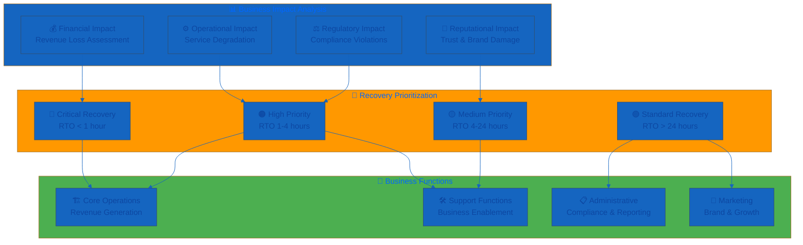
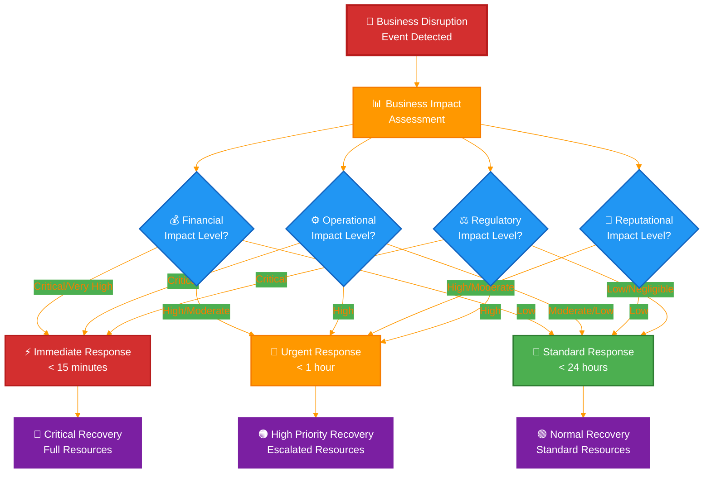

<p align="center">
  
</p>

<h1 align="center">🔄 Hack23 AB — Business Continuity Plan</h1>

<p align="center">
  <strong>🛡️ Classification-Driven Business Resilience Framework</strong><br>
  <em>🎯 Systematic Recovery Planning Through Enterprise-Grade Business Continuity</em>
</p>

<p align="center">
  <a href="#"></a>
  <a href="#"></a>
  <a href="#"></a>
  <a href="#"></a>
</p>

**📋 Document Owner:** CEO | **📄 Version:** 1.3 | **📅 Last Updated:** 2026-01-25 (UTC)  
**🔄 Review Cycle:** Semi-Annual | **⏰ Next Review:** 2026-07-25

---

## 🎯 **Purpose Statement**

**🏢 Hack23 AB's** business continuity framework demonstrates how **🔧 systematic recovery planning directly enables both operational resilience and competitive advantage.** Our 📊 classification-driven continuity approach serves as both operational necessity and 👥 client demonstration of our cybersecurity consulting methodologies.

This plan ensures 🏢 business operations can continue during and after disruptive events, based on our [🏷️ Classification Framework](./CLASSIFICATION.md) impact analysis and recovery requirements. Our 🌟 transparent continuity planning showcases how methodical preparation creates business value through 📉 reduced downtime and 📈 enhanced service reliability.

*— 👨‍💼 James Pether Sörling, CEO/Founder*

---

## 📊 **Business Impact-Driven Recovery Framework**

### 🎯 Business Impact Analysis Integration

Our business continuity planning is directly driven by the [🏷️ Classification Framework](./CLASSIFICATION.md) business impact analysis matrix, ensuring systematic recovery prioritization:



### 📈 Business Impact Thresholds

Based on [Classification Framework](./CLASSIFICATION.md) impact levels:

| Business Function | 💰 Financial Impact | ⚙️ Operational Impact | 🤝 Reputational Impact | ⚖️ Regulatory Impact | 🎯 Recovery Priority |
|-------------------|-------------------|----------------------|----------------------|--------------------|--------------------|
| **🏗️ Core Operations** | [](./CLASSIFICATION.md#financial-impact-levels) | [](./CLASSIFICATION.md#operational-impact-levels) | [](./CLASSIFICATION.md#reputational-impact-levels) | [](./CLASSIFICATION.md#regulatory-impact-levels) | 🔴 Critical |
| **💰 Financial Systems** | [](./CLASSIFICATION.md#financial-impact-levels) | [](./CLASSIFICATION.md#operational-impact-levels) | [](./CLASSIFICATION.md#reputational-impact-levels) | [](./CLASSIFICATION.md#regulatory-impact-levels) | 🔴 Critical |
| **🔧 Development Operations** | [](./CLASSIFICATION.md#financial-impact-levels) | [](./CLASSIFICATION.md#operational-impact-levels) | [](./CLASSIFICATION.md#reputational-impact-levels) | [](./CLASSIFICATION.md#regulatory-impact-levels) | 🟡 Medium |
| **📢 Marketing & Communications** | [](./CLASSIFICATION.md#financial-impact-levels) | [](./CLASSIFICATION.md#operational-impact-levels) | [](./CLASSIFICATION.md#reputational-impact-levels) | [](./CLASSIFICATION.md#regulatory-impact-levels) | 🟢 Standard |

---

## 📊 Business Impact-Driven Decision Matrix



---

## 🏗️ **Generic Product Recovery Plans**

Based on generic project classifications suitable for public documentation:

### 🏠 Corporate Website Recovery Plan

[](./CLASSIFICATION.md#project-type-classifications) [](./CLASSIFICATION.md#project-type-classifications)

**🎯 Recovery Objectives:**
- [-lightgrey?style=flat-square&logo=clock&logoColor=black)](./CLASSIFICATION.md#rto-classifications) [-lightgrey?style=flat-square&logo=database&logoColor=black)](./CLASSIFICATION.md#rto-classifications)

**🔗 Dependencies & Recovery:**
Based on [Asset Register](./Asset_Register.md) infrastructure classification:

| 🔗 Dependency | 🏢 Supplier Category | 🔄 Fallback | ⏰ Recovery Time |
|------------|----------|----------|---------------|
| **☁️ Cloud Storage/CDN** | Cloud Infrastructure Provider | 🌐 Multi-region backup | 4 hours |
| **📝 Version Control Platform** | Development Platform | 📦 Direct hosting | 2 hours |
| **🌐 DNS Service** | Cloud Infrastructure Provider | 🔄 Secondary DNS | 24 hours |

**🔧 Recovery Procedure:**
1. **🔍 Detect**: Monitoring alarms → Notification system → [Asset Register](./Asset_Register.md) incident tracking
2. **📊 Assess**: Check supplier status per [SUPPLIER.md](./SUPPLIER.md)
3. **🚀 Activate**: Switch to backup hosting per [Classification Framework](./CLASSIFICATION.md)
4. **📢 Communicate**: Status page update, social media notification
5. **🔄 Restore**: Primary service restoration, traffic switchback

### 🎮 Gaming Application Recovery Plan

[](./CLASSIFICATION.md#project-type-classifications) [](./CLASSIFICATION.md#project-type-classifications)

**🎯 Recovery Objectives:**
- [-lightgreen?style=flat-square&logo=clock&logoColor=white)](./CLASSIFICATION.md#rto-classifications) [-lightblue?style=flat-square&logo=database&logoColor=white)](./CLASSIFICATION.md#rto-classifications)

**🔗 Dependencies & Recovery:**
Reference [SUPPLIER.md](./SUPPLIER.md) for detailed supplier assessments:

| 🔗 Dependency | 🏢 Supplier Category | 🔄 Fallback | ⏰ Recovery Time |
|------------|----------|----------|---------------|
| **⚡ Serverless Functions** | Cloud Infrastructure Provider | 🌍 Secondary region | 1 hour |
| **💾 Database Service** | Cloud Infrastructure Provider | 🔄 Cross-region replication | 30 minutes |
| **💳 Payment Processor** | Financial Services Provider | 📋 Manual processing | 4 hours |
| **🌐 Content Delivery** | CDN Provider | 📦 Direct access | 2 hours |

### 🛡️ Compliance Platform Recovery Plan

[](./CLASSIFICATION.md#project-type-classifications) [](./CLASSIFICATION.md#project-type-classifications)

**🎯 Recovery Objectives:**
- [-yellow?style=flat-square&logo=clock&logoColor=white)](./CLASSIFICATION.md#rto-classifications) [-lightgreen?style=flat-square&logo=database&logoColor=white)](./CLASSIFICATION.md#rto-classifications)

**🔗 Dependencies & Recovery:**
| 🔗 Dependency | 🏢 Supplier Category | 🔄 Fallback | ⏰ Recovery Time |
|------------|----------|----------|---------------|
| **📝 Static Hosting Platform** | Development Platform | ☁️ Cloud hosting alternative | 30 minutes |
| **📚 Documentation Platform** | Development Platform | 💾 Local backup | 2 hours |
| **🔒 Certificate Authority** | Security Services Provider | ☁️ Alternative CA | 1 hour |

### 🏛️ Data Analytics Platform Recovery Plan

[](./CLASSIFICATION.md#project-type-classifications) [](./CLASSIFICATION.md#project-type-classifications)

**🎯 Recovery Objectives:**
- [-yellow?style=flat-square&logo=clock&logoColor=white)](./CLASSIFICATION.md#rto-classifications) [-lightgreen?style=flat-square&logo=database&logoColor=white)](./CLASSIFICATION.md#rto-classifications)

**🔗 Dependencies & Recovery:**
Based on [Asset Register](./Asset_Register.md) database classifications:

| 🔗 Dependency | 🏢 Supplier Category | 🔄 Fallback | ⏰ Recovery Time |
|------------|----------|----------|---------------|
| **💾 Database Service** | Cloud Infrastructure Provider | 🔄 Automated backup restore | 1 hour |
| **🖥️ Compute Instances** | Cloud Infrastructure Provider | 📈 Auto Scaling + Images | 20 minutes |
| **⚖️ Load Balancer** | Cloud Infrastructure Provider | 🔍 Health check failover | 2 minutes |
| **📊 External Data Sources** | Data Providers | 💾 Cached datasets | 4 hours |

---

## 🚨 **Generic Supplier Recovery Matrix**

Based on supplier risk categories from [SUPPLIER.md](./SUPPLIER.md) assessments:

### 🥇 Tier 1: Mission Critical Suppliers

#### 🔴 Cloud Infrastructure Provider (Critical Dependency)
- **📊 Impact**: Complete service outage affecting all products per [Asset Register](./Asset_Register.md)
- **⏰ RTO**: < 5 minutes (🌍 multi-region failover)
- **🔄 RPO**: < 1 minute (⚡ real-time replication)
- **🔄 Recovery**: 🤖 Automatic DNS failover to secondary region
- **📞 Escalation**: ☁️ Enterprise Support (15-minute response) per [SUPPLIER.md](./SUPPLIER.md)

#### 🟠 Development Platform Provider (High Dependency)
- **📊 Impact**: 🔧 Development and deployment delays per [Classification Framework](./CLASSIFICATION.md)
- **⏰ RTO**: 1 hour (💾 local backup activation)
- **🔄 RPO**: 15 minutes (💾 local mirrors)
- **🔄 Recovery**: 💻 Local development, alternative CI/CD
- **📞 Escalation**: 📝 Enterprise Support per supplier contracts

### 🥈 Tier 2: Business Essential Suppliers

#### 🟠 Financial Services Provider
- **📊 Impact**: 💳 Payment processing delays, 💰 cash flow impact per [Classification Framework](./CLASSIFICATION.md#financial-impact-levels)
- **⏰ RTO**: 4 hours (📋 manual processing)
- **🔄 RPO**: 1 hour (📋 transaction logging)
- **🔄 Recovery**: 📱 Mobile banking alternatives, 📋 manual procedures
- **📞 Escalation**: 👨‍💼 Account manager per [SUPPLIER.md](./SUPPLIER.md)

#### 🟡 Accounting Services Provider
- **📊 Impact**: 📊 Financial reporting delays, ⚖️ compliance risk
- **⏰ RTO**: 24 hours (📊 manual processes)
- **🔄 RPO**: 4 hours (📄 export backup)
- **🔄 Recovery**: 📊 Spreadsheet templates, 📄 manual tracking
- **📞 Escalation**: 📞 Customer support, 💾 local backup procedures

### 🥉 Tier 3: Standard Support Suppliers

#### 🟡 Payment Processing Provider
- **📊 Impact**: 💳 Transaction processing delays, revenue impact
- **⏰ RTO**: 2 hours (📋 manual payment capture)
- **🔄 RPO**: 1 hour (📋 transaction logging)
- **🔄 Recovery**: 📋 Manual payment processing, reconciliation procedures
- **📞 Escalation**: 📞 Support portal, account management

#### 🟢 Content Generation Tools
- **📊 Impact**: 📢 Marketing content delays, minimal business impact
- **⏰ RTO**: 24+ hours (📋 alternative tools)
- **🔄 RPO**: 24+ hours (💾 local backups)
- **🔄 Recovery**: 🔄 Alternative platforms, manual content creation
- **📞 Escalation**: 📧 Standard support channels

---

## 📋 **Recovery Team Structure**

### 🎯 Business Continuity Team

**👨‍💼 CEO (James Pether Sörling) - Overall Commander**
- **🔑 Authority**: Full decision-making power for business continuity
- **🎯 Responsibilities**: Strategic decisions, 📢 external communication, 💰 resource allocation
- **📞 Contact**: Primary mobile, backup email, 💬 Slack emergency channel

**🔧 Technical Recovery (CEO as Technical Lead)**
- **🎯 Responsibilities**: ☁️ AWS infrastructure, 📝 GitHub systems, 🛠️ development tools
- **🛠️ Tools**: ☁️ AWS Console, 📝 GitHub CLI, 💬 Slack, 📱 mobile monitoring apps
- **📞 Escalation Paths**: ☁️ AWS Enterprise Support, 📝 GitHub Enterprise Support

**🏢 Business Operations Recovery (CEO as Operations Lead)**
- **🎯 Responsibilities**: 💰 Financial systems, 🤝 supplier coordination, 👥 customer communication
- **🛠️ Tools**: 📱 SEB mobile app, 📄 Bokio exports, 💳 Stripe dashboard
- **📞 Escalation Paths**: 🏦 Bank account manager, 📊 Bokio support, 💳 Stripe support

### 📞 Generic Emergency Contact Matrix

| 👤 Role | 📞 Primary Contact | 🔄 Backup Method | ⏰ Response Time |
|------|----------------|---------------|---------------|
| **👨‍💼 CEO/Commander** | 📱 Primary contact method | 📧 Email + messaging platform | < 15 minutes |
| **☁️ Cloud Provider Support** | 🌐 Enterprise Portal | 📞 Phone support | < 15 minutes |
| **📝 Development Platform Support** | 🌐 Enterprise Portal | 📧 Email | < 1 hour |
| **🏦 Financial Services Manager** | 📞 Direct phone | 🏦 Banking hotline | < 4 hours |
| **💳 Payment Processor Support** | 🌐 Support Portal | 📞 Phone support | < 2 hours |
| **🛡️ Insurance Provider** | 📞 Direct phone | 📧 Email | < 4 hours |
| **👥 Stakeholder Notification** | 📧 Email notification | 🌐 Website banner | < 1 hour |

---

## 📋 Generic Emergency Contact Quick Reference

**👨‍💼 CEO Emergency Contact**: [Contact details available per internal procedures]  
**☁️ Cloud Provider Support**: [Available via provider console per [SUPPLIER.md](./SUPPLIER.md)]  
**📝 Development Platform Support**: [Available via provider portal]  
**🏦 Financial Services Manager**: [Contact details per [Asset Register](./Asset_Register.md)]  
**💳 Payment Processor Support**: [Available via provider portal per [SUPPLIER.md](./SUPPLIER.md)]  
**🛡️ Insurance Provider**: [Contact details available internally]  
**👥 Stakeholder Notification**: [🌐 Website banner + 📧 email list + 📱 social media per communication matrix]

---

## 🚨 **Emergency Activation**

### 📞 Immediate Actions (First 15 Minutes)

1. **📊 Assess Situation**: Determine scope and impact using classification matrix
2. **🚀 Activate Team**: CEO notification via 📱 mobile/💬 messaging emergency channel
3. **📢 Notify Stakeholders**: 👥 Customer communication via predetermined channels
4. **🔧 Initiate Recovery**: Activate appropriate recovery procedures
5. **📚 Document Actions**: Begin incident log for post-event analysis

### 👨‍💼 Founder Unavailability Emergency Scenario

**Trigger:** Founder sudden illness, family emergency, or other incapacitation preventing business operations

**Emergency Knowledge Transfer Activation:**

For detailed emergency procedures, strategic partners should immediately reference:
- **[📚 Founder Knowledge Transfer Template](./templates/Founder_Knowledge_Transfer_Template.md)** - Section 8: Immediate Actions
- **[🚨 Partnership Emergency Activation Runbook](./templates/Partnership_Emergency_Activation_Runbook.md)** - Complete 4-hour RTO activation procedures
- **First 24 Hours Checklist** - Emergency access, client communication, business continuity setup
- **Critical System Access** - 1Password Emergency Kit procedures per Section 6

**Strategic Partner Emergency Response (0-4 Hours):**

**Phase-Based Activation** per [Partnership_Emergency_Activation_Runbook.md](./templates/Partnership_Emergency_Activation_Runbook.md):

1. **Phase 1 (0-30 min)**: Emergency Detection & Notification
   - Emergency contact assesses situation severity
   - GO/NO-GO decision for partnership activation
   - Primary strategic partner contacted

2. **Phase 2 (30-60 min)**: Partner Selection & Contact
   - Partner directory accessed (Partner_Directory.md or 1Password)
   - Partner availability confirmed or backup escalated

3. **Phase 3 (60-120 min)**: Access Delegation & Handoff
   - 1Password Emergency Kit provided to partner
   - Critical system access validated (GitHub, AWS, Email, Bokio)
   - Active project documentation transferred

4. **Phase 4 (120-180 min)**: Client Notification
   - Transparency messages sent to all active clients
   - Partner introduction completed
   - Service continuity assured

5. **Phase 5 (180-240 min)**: Business Continuity Activation
   - Project handoff verified
   - Systems operational confirmation
   - Initial client satisfaction check

**RTO Target:** 4 hours (240 minutes) from emergency detection to business continuity activation

**Risk Mitigation:** This procedure addresses R-FOUNDER-001 (Single-Person Dependency, Risk Score: 480) documented in [Risk_Register.md](./Risk_Register.md)

### 📋 Generic Emergency Contact Quick Reference

**👨‍💼 CEO Emergency Contact**: [Contact details available per internal procedures]  
**☁️ Cloud Provider Support**: [Available via provider console per [SUPPLIER.md](./SUPPLIER.md)]  
**📝 Development Platform Support**: [Available via provider portal]  
**🏦 Financial Services Manager**: [Contact details per [Asset Register](./Asset_Register.md)]  
**💳 Payment Processor Support**: [Available via provider portal per [SUPPLIER.md](./SUPPLIER.md)]  
**🛡️ Insurance Provider**: [Contact details available internally]  
**👥 Stakeholder Notification**: [🌐 Website banner + 📧 email list + 📱 social media per communication matrix]

---

## 📋 **Business Continuity Scope and Objectives**

### 🎯 Continuity Objectives

This plan ensures business operations continue during and after disruptive events, with recovery priorities based on our [🏷️ Classification Framework](./CLASSIFICATION.md) business impact analysis.

**Primary Objectives:**
1. **Life Safety**: Ensure personnel safety during any incident
2. **Critical Operations**: Maintain revenue-generating activities
3. **Regulatory Compliance**: Meet all legal and regulatory obligations  
4. **Stakeholder Communication**: Maintain transparent communication
5. **Reputation Protection**: Minimize brand and trust impact

**Recovery Priorities:**
Based on business impact classification and aligned with [Backup Recovery Policy](./Backup_Recovery_Policy.md):

| Priority Level | Recovery Target | Business Impact | Examples |
|----------------|-----------------|-----------------|----------|
| **🔴 Critical** | < 1 hour | Revenue/compliance loss | Core infrastructure, financial systems |
| **🟠 High** | 1-4 hours | Significant operational impact | Customer systems, development tools |
| **🟡 Medium** | 4-24 hours | Moderate business disruption | Support systems, administrative tools |
| **🟢 Standard** | > 24 hours | Minimal impact | Marketing tools, documentation |

---

## 🚨 **Incident Response and Activation**

### 📞 Activation Triggers

**Automatic Activation:**
- Complete service outage lasting > 15 minutes
- Security incident with [](./CLASSIFICATION.md) classification
- Natural disaster affecting operations
- Key supplier failure (Tier 1 suppliers per [SUPPLIER.md](./SUPPLIER.md))

**Manual Activation Decision Criteria:**
- Financial impact > [](./CLASSIFICATION.md#financial-impact-levels)
- Regulatory compliance at risk
- Extended service degradation (>4 hours)
- Multiple system failures

### 🚨 Emergency Response Procedures

#### Phase 1: Immediate Response (0-15 minutes)

**Assessment and Safety:**
1. **🛡️ Safety First**: Ensure personal safety and security
2. **📊 Impact Assessment**: Determine scope using [Classification Framework](./CLASSIFICATION.md)
3. **🚨 Alert**: Activate emergency communication procedures
4. **📋 Documentation**: Begin incident logging per [Incident Response Plan](./Incident_Response_Plan.md)

**Initial Actions:**
- Access backup systems per [Backup Recovery Policy](./Backup_Recovery_Policy.md)
- Notify key stakeholders per communication matrix
- Secure alternative workspace if needed
- Initiate damage assessment

#### Phase 2: Short-term Response (15 minutes - 4 hours)

**Operational Continuity:**
1. **🔄 System Recovery**: Implement technical recovery per service-specific plans
2. **📢 Communication**: Update stakeholders on status and expected resolution
3. **🤝 Supplier Coordination**: Engage suppliers per [SUPPLIER.md](./SUPPLIER.md) escalation procedures
4. **📋 Resource Allocation**: Deploy resources based on recovery priorities

**Critical System Procedures:**
- Financial systems: Manual procedures activation
- Customer systems: Failover to backup infrastructure  
- Communication: Alternative channels activation
- Data: Recovery per backup procedures

#### Phase 3: Extended Response (4 hours - 72 hours)

**Sustained Operations:**
1. **⚙️ Alternative Operations**: Full manual procedures if needed
2. **🔄 Recovery Monitoring**: Track recovery progress against RTO/RPO targets
3. **📈 Stakeholder Updates**: Regular communication per schedule
4. **📊 Impact Tracking**: Monitor financial and operational impacts

#### Phase 4: Recovery and Normalization (72+ hours)

**Return to Normal Operations:**
1. **✅ System Restoration**: Gradual return to normal operations
2. **📋 Validation**: Confirm all systems operational per testing procedures
3. **📊 Impact Assessment**: Final damage and cost assessment
4. **📚 Lessons Learned**: Document improvements per [Change Management](./Change_Management.md)

---

## 📞 **Emergency Communication Procedures**

### 🎯 Communication Objectives

**Primary Goals:**
- Ensure stakeholder safety and awareness
- Maintain transparency and trust
- Coordinate recovery activities
- Meet regulatory notification requirements
- Minimize reputational damage

### 📋 Stakeholder Communication Matrix

| Stakeholder Group | Notification Method | Timeframe | Information Level | Responsible |
|-------------------|-------------------|-----------|------------------|-------------|
| **👨‍💼 CEO (Internal)** | Direct assessment | Immediate | Complete details | Self |
| **🏦 Financial Services Provider** | Phone + portal | < 30 min | Financial impact | CEO |
| **☁️ Cloud Infrastructure Provider** | Support portal | < 15 min | Technical details | CEO |
| **📝 Development Platform Provider** | Support portal | < 1 hour | Service impact | CEO |
| **🤝 Active Customers** | Email + website | < 1 hour | Service status | CEO |
| **⚖️ Regulatory Bodies** | As required | Per regulation | Compliance details | CEO |
| **🛡️ Insurance Provider** | Phone call | < 4 hours | Incident details | CEO |
| **💳 Payment Processing Provider** | Portal notification | < 2 hours | Transaction impact | CEO |

### 📢 Communication Templates

**Internal Status Update Template:**
```
INCIDENT STATUS UPDATE - [SEVERITY]
Time: [TIMESTAMP]
Status: [INVESTIGATING/RESPONDING/RECOVERING]
Impact: [SCOPE AND SEVERITY]
Expected Resolution: [TIMEFRAME]
Next Update: [SCHEDULE]
Actions Taken: [SUMMARY]
Contact: [EMERGENCY CONTACT]
```

**Customer Communication Template:**
```
Service Status Update - Hack23 Systems
We are currently experiencing [BRIEF DESCRIPTION]
Affected Services: [LIST]
Current Status: [STATUS]
Expected Resolution: [TIMEFRAME]
Alternative Access: [IF AVAILABLE]
We will provide updates every [FREQUENCY]
Contact: support@hack23.com
```

**Regulatory Notification Template:**
```
INCIDENT NOTIFICATION - [COMPANY NAME]
Incident Type: [CLASSIFICATION]
Occurrence Time: [TIMESTAMP]
Detection Time: [TIMESTAMP]
Affected Systems: [SCOPE]
Potential Impact: [ASSESSMENT]
Response Actions: [SUMMARY]
Contact Information: [DETAILS]
```

---

## 🏢 **Alternative Operations Procedures**

### 💰 Financial Operations Continuity

**Manual Procedures Activation:**
When banking or accounting systems are unavailable:

1. **📋 Transaction Logging**: Manual recording of all financial activities
2. **📞 Financial Institution Contact**: Direct communication with account manager
3. **💾 Backup Records**: Access to exported financial data per [Backup Recovery Policy](./Backup_Recovery_Policy.md)
4. **🧾 Manual Invoicing**: Paper-based invoicing if electronic systems fail
5. **💳 Payment Alternatives**: Manual payment processing procedures

**Recovery Procedures:**
- System restoration per supplier SLAs ([SUPPLIER.md](./SUPPLIER.md))
- Data reconciliation with manual records
- Audit trail reconstruction
- Compliance reporting catch-up

### 🔧 Technical Operations Continuity

**Development Operations:**
When version control or cloud services are impacted:

1. **💻 Local Development**: Switch to local repositories and development environments
2. **🔄 Manual Deployment**: Direct server deployment procedures  
3. **📊 Alternative Monitoring**: Secondary monitoring tools activation
4. **🛡️ Security Controls**: Manual security validation procedures

**Customer Service Operations:**
When customer-facing systems fail:

1. **📧 Email Communication**: Direct email communication with customers
2. **📱 Social Media**: Status updates via social media channels
3. **📞 Phone Support**: Direct phone contact for critical issues
4. **🌐 Static Status Page**: Minimal service status communication

### 📢 Marketing and Communication Continuity

**Alternative Communication Channels:**
When primary marketing platforms are unavailable:

1. **📧 Direct Email**: Customer communication via direct email lists
2. **📱 Multiple Platforms**: Diversified social media presence
3. **🌐 Alternative Hosting**: Backup website hosting arrangements
4. **📞 Direct Outreach**: Personal communication for critical stakeholders

---

## 🧪 **Business Continuity Testing**

### 📋 Testing Framework

**Test Types and Objectives:**
Integration with [Backup Recovery Policy](./Backup_Recovery_Policy.md) testing schedule:

| Test Type | Frequency | Duration | Participants | Success Criteria |
|-----------|-----------|----------|-------------|-----------------|
| **🔥 Fire Drill (Tabletop)** | Quarterly | 2 hours | CEO + key suppliers | < 2 hours activation |
| **🔧 Technical Recovery** | Monthly | 4 hours | CEO + external suppliers | Meet RTO/RPO targets |
| **📞 Communication Test** | Monthly | 1 hour | All stakeholders | 100% contact success |
| **🤝 Supplier Coordination** | Bi-annually | 1 day | Key suppliers | SLA compliance |

### 📊 Testing Schedule and Results

**2025 Testing Calendar:**
- Q1: Communication systems test with generic suppliers
- Q2: Technical recovery drill using generic procedures
- Q3: Full business continuity exercise with supplier categories
- Q4: Supplier coordination test with standardized protocols

**Test Results Tracking:**
- RTO/RPO achievement rates by supplier category
- Communication effectiveness across provider types
- Procedure accuracy using generic workflows
- Improvement opportunities for supplier independence

---

## 📋 **Reference Implementation: Project Business Continuity Plans**

### **🎯 Comprehensive BCP Portfolio**

All Hack23 AB projects maintain detailed business continuity documentation demonstrating **resilience planning excellence** and **operational transparency**:

#### **🏛️ Citizen Intelligence Agency**

[](https://github.com/Hack23/cia/blob/master/BCPPlan.md)
[](https://github.com/Hack23/cia/blob/master/End-of-Life-Strategy.md)
[](https://github.com/Hack23/cia/blob/master/FinancialSecurityPlan.md)

- **[📋 BCPPlan.md](https://github.com/Hack23/cia/blob/master/BCPPlan.md)** - Political transparency platform continuity strategy with RTO/RPO alignment
- **[📅 End-of-Life-Strategy.md](https://github.com/Hack23/cia/blob/master/End-of-Life-Strategy.md)** - Java/PostgreSQL technology lifecycle management and migration planning
- **[💰 FinancialSecurityPlan.md](https://github.com/Hack23/cia/blob/master/FinancialSecurityPlan.md)** - AWS deployment cost analysis and security investment ROI

**Key BCP Features:**
- Multi-AZ PostgreSQL deployment for high availability
- Automated backup with point-in-time recovery
- Business impact analysis matrix with financial/operational/reputational impacts
- Technology lifecycle planning for Java 21-25 LTS versions
- AWS cost optimization and security investment analysis

#### **🎮 Black Trigram**

[](https://github.com/Hack23/blacktrigram/blob/main/BCPPlan.md)
[](https://github.com/Hack23/blacktrigram/blob/main/End-of-Life-Strategy.md)

- **[📋 BCPPlan.md](https://github.com/Hack23/blacktrigram/blob/main/BCPPlan.md)** - Gaming platform resilience strategy with player experience continuity
- **[📅 End-of-Life-Strategy.md](https://github.com/Hack23/blacktrigram/blob/main/End-of-Life-Strategy.md)** - Unity/TypeScript lifecycle planning and framework migration roadmap

**Key BCP Features:**
- GitHub Pages deployment with global CDN distribution
- Automated build and deployment pipeline
- Gaming-specific recovery priorities (player progress, game assets, multiplayer state)
- Cultural heritage asset preservation strategy
- Cross-platform compatibility lifecycle management

#### **📊 CIA Compliance Manager**

[](https://github.com/Hack23/cia-compliance-manager/blob/main/docs/architecture/BCPPlan.md)
[](https://github.com/Hack23/cia-compliance-manager/blob/main/docs/End-of-Life-Strategy.md)
[](https://github.com/Hack23/cia-compliance-manager/blob/main/docs/FinancialSecurityPlan.md)

- **[📋 BCPPlan.md](https://github.com/Hack23/cia-compliance-manager/blob/main/docs/architecture/BCPPlan.md)** - Compliance platform continuity with regulatory alignment
- **[📅 End-of-Life-Strategy.md](https://github.com/Hack23/cia-compliance-manager/blob/main/docs/End-of-Life-Strategy.md)** - React/TypeScript lifecycle management and framework evolution
- **[💰 FinancialSecurityPlan.md](https://github.com/Hack23/cia-compliance-manager/blob/main/docs/FinancialSecurityPlan.md)** - GitHub Pages deployment cost analysis and optimization

**Key BCP Features:**
- Static site deployment with high availability
- Browser-based compliance assessment with no backend dependencies
- Compliance data export and import capabilities
- Framework lifecycle management for React and TypeScript
- Zero-cost deployment with GitHub Pages infrastructure

### **📊 BCP Documentation Maturity Matrix**

| Project | BCP Plan | Lifecycle Strategy | Financial Analysis | RTO/RPO Defined | Technology Roadmap |
|---------|----------|-------------------|-------------------|-----------------|-------------------|
| **🏛️ CIA** | [](https://github.com/Hack23/cia/blob/master/BCPPlan.md) | [](https://github.com/Hack23/cia/blob/master/End-of-Life-Strategy.md) | [](https://github.com/Hack23/cia/blob/master/FinancialSecurityPlan.md) | ✅ High Priority | ✅ Java 21-25 LTS |
| **🎮 Black Trigram** | [](https://github.com/Hack23/blacktrigram/blob/main/BCPPlan.md) | [](https://github.com/Hack23/blacktrigram/blob/main/End-of-Life-Strategy.md) | N/A (Zero Cost) | ✅ Standard | ✅ Unity/TypeScript |
| **📊 CIA Compliance** | [](https://github.com/Hack23/cia-compliance-manager/blob/main/docs/architecture/BCPPlan.md) | [](https://github.com/Hack23/cia-compliance-manager/blob/main/docs/End-of-Life-Strategy.md) | [](https://github.com/Hack23/cia-compliance-manager/blob/main/docs/FinancialSecurityPlan.md) | ✅ High Priority | ✅ React/TypeScript |
| **🇪🇺 EP MCP Server** | ⏳ Planned | ⏳ Planned | N/A (Zero Cost) | ✅ Standard | ✅ TypeScript/Node.js |
| **🇪🇺 EU Parliament Monitor** | ⏳ Planned | ⏳ Planned | N/A (Zero Cost) | ✅ Standard | ✅ TypeScript |
| **🗳️ Riksdagsmonitor** | ⏳ Planned | ⏳ Planned | N/A (Zero Cost) | ✅ Standard | ✅ TypeScript |

---

## 🏢 **Single-Person Company Adaptation**

### **Traditional Multi-Person Requirement**

Industry best practice and ISO 22301 guidance recommend establishing a **Business Continuity Steering Committee** composed of senior management and functional leads:
- **Business Continuity Manager**: Overall BCP coordination and maintenance
- **IT/Technical Lead**: Infrastructure recovery and technical continuity
- **Operations Manager**: Business process continuity and workaround procedures
- **Communications Manager**: Stakeholder communication and public relations
- **Finance Manager**: Financial continuity and resource allocation
- **Legal/Compliance**: Regulatory compliance and contractual obligations

Traditional steering committee provides:
- Cross-functional perspective on business impact
- Shared accountability for continuity planning
- Diverse expertise for recovery decision-making
- 24/7 coverage through management rotation

### **Hack23 AB Single-Person Adaptation**

As CEO/Founder is the sole employee, traditional business continuity steering committee is not possible. **Instead, Hack23 AB implements a CEO + external validation + strategic partner model:**

#### **🎯 CEO As Business Continuity Coordinator**

**Roles Consolidated**:
- Business Continuity Manager (BCP maintenance and testing)
- IT/Technical Lead (infrastructure recovery and technical operations)
- Operations Manager (business process continuity)
- Communications Manager (stakeholder notifications)
- Finance Manager (financial continuity and cash flow)

**Capabilities**:
- **Comprehensive Business Knowledge**: Complete understanding of all Hack23 operations, systems, and processes
- **Technical Expertise**: CISM/CISSP certified, 15+ years experience in cybersecurity and infrastructure
- **Process Documentation**: All procedures documented in ISMS for continuity
- **Automated Systems**: Cloud-native infrastructure enables rapid recovery
- **Supplier Relationships**: Pre-arranged escalation paths with all critical suppliers

#### **🎯 External Validation Model**

**Annual External Consultant Review**:
| Validation Activity | Consultant Type | Frequency | Deliverable |
|---------------------|----------------|-----------|-------------|
| **BCP Adequacy Assessment** | Business Continuity Consultant | Annual | Gap analysis report + recommendations |
| **Technical Recovery Testing** | AWS Solutions Architect | Annual | Infrastructure resilience validation |
| **Financial Continuity Review** | Accounting/Finance Advisor | Annual | Cash flow and insurance assessment |
| **Legal/Regulatory Compliance** | Legal Counsel | As needed | Regulatory notification procedures |

#### **🎯 Strategic Partner Emergency Activation**

**Founder Unavailability Scenario** (illness, incapacitation, emergency):
- **Partnership Framework**: Pre-arranged strategic partners per [Partnership_Framework.md](./Partnership_Framework.md)
- **Knowledge Transfer**: Founder knowledge documented in [Founder_Knowledge_Transfer_Template.md](./templates/Founder_Knowledge_Transfer_Template.md)
- **Emergency Activation**: 4-hour RTO partner activation per [Partnership_Emergency_Activation_Runbook.md](./templates/Partnership_Emergency_Activation_Runbook.md)
- **Partner Tier System**: Tier 1 partners receive quarterly knowledge transfer validation
- **Access Delegation**: 1Password Emergency Kit enables partner system access
- **Risk Mitigation**: Addresses R-FOUNDER-001 (Single-Person Dependency, Risk Score: 480)

### **Compensating Controls**

| Control Type | Implementation | ISO 22301 Alignment | Effectiveness |
|--------------|----------------|---------------------|---------------|
| **📚 Comprehensive Documentation** | Complete ISMS documentation of all procedures, systems, and processes | Clause 8.4 - Business Continuity Procedures | Enables partner takeover if founder unavailable |
| **🤝 Strategic Partner Network** | Pre-arranged partnerships with knowledge transfer and emergency activation procedures | Clause 8.3 - Leadership Commitment | Provides external expertise and emergency coverage |
| **🔄 Quarterly Review & Testing** | CEO conducts quarterly BCP review; external consultant validates annually | Clause 9.1 - Monitoring and Measurement | Ensures BCP remains current and effective |
| **⏱️ Automated Recovery Systems** | Cloud-native infrastructure with automated backups, multi-AZ deployment, failover | Clause 8.4 - Business Continuity Procedures | Reduces manual recovery effort, enables rapid restoration |
| **💰 Financial Reserves & Insurance** | Cash reserves + business interruption insurance evaluation | Clause 8.2 - Business Impact Analysis | Provides financial continuity during disruption |

### **ISO 22301 / ISO 27001:2022 Compliance**

This adaptation maintains control objectives of **ISO 22301 (Business Continuity)** and **ISO 27001:2022 A.5.29-A.5.30** by ensuring:

✅ **Business Impact Analysis**: Complete CIA classification per [Classification Framework](./CLASSIFICATION.md)  
✅ **Recovery Strategies**: Documented per supplier tier, asset type, and business function  
✅ **Business Continuity Procedures**: All procedures documented in ISMS with clear recovery steps  
✅ **Testing and Exercise**: Quarterly CEO review + annual external validation + semi-annual partner activation drill  
✅ **Leadership Commitment**: CEO authority + strategic partner backup provides continuity capability

**Alignment with Standards**: ISO 22301 requires business continuity "appropriate to the size and nature of the organization." ISO 27001 A.5.29 requires "planned and documented" continuity. Single-person operations achieve these objectives through **comprehensive documentation**, **external validation**, and **strategic partnerships** rather than **dedicated continuity teams**.

### **Risk Acceptance**

**Risk ID**: R-FOUNDER-001 (already documented in [Risk_Register.md](./Risk_Register.md))

**Risk Description**: Single-person dependency creates **catastrophic business continuity risk** if founder becomes unavailable. No immediate internal backup for critical business functions.

**Risk Assessment (Current State)**:
- **Likelihood**: Likely (4/5) - Single person carrying all responsibilities
- **Impact**: Catastrophic (6/5) - Complete business failure
- **Risk Score**: 480 (Critical Risk)

**Risk Treatment Strategy** (reduces to High Risk):
- **Priority 1**: Complete Founder Knowledge Transfer document (quarterly updates)
- **Priority 2**: Onboard 2-3 Tier 1 strategic partners with knowledge transfer validation
- **Priority 3**: Business continuation insurance implementation
- **Priority 4**: Semi-annual knowledge transfer testing + emergency activation drills

**Target State (With Compensating Controls)**:
- **Likelihood**: Possible (3/5) - Founder still critical but partners trained
- **Impact**: Critical (5/5) - Significant disruption but business can continue
- **Risk Score**: 360 (High Risk, 25% reduction)

**Monitoring & Review**:
- **Quarterly**: Founder Knowledge Transfer full review + monthly critical updates
- **Semi-Annual**: Strategic partner knowledge transfer validation + tabletop exercise
- **Annual**: External consultant BCP assessment + business interruption insurance review
- **Continuous**: Weekly workload assessment, monthly health check protocols

### **Business Continuity Performance Metrics**

**Single-Person BCP Effectiveness Tracking**:
| Metric | Target | Current Status | Trend |
|--------|--------|----------------|-------|
| **RTO Achievement** | 100% of targets met | N/A (no incidents YTD) | ✅ Ready |
| **RPO Achievement** | 100% of targets met | 99.8% backup success | ✅ On track |
| **External Validation** | Annual consultant review | Scheduled 2026 | ✅ Planned |
| **Partner Readiness** | 2-3 Tier 1 partners | In development | 🟡 In progress |
| **Founder Knowledge Transfer** | Quarterly updates | Current (2026-01) | ✅ Up to date |
| **BCP Testing** | Quarterly + annual | Quarterly completed | ✅ Compliant |

**Business Value Demonstration**: Single-person BCP with strategic partner model demonstrates:
- 🏆 **Competitive Advantage**: Pragmatic continuity planning showcasing operational maturity
- 🤝 **Customer Trust**: Transparent documentation of continuity capabilities builds confidence
- 💰 **Cost Efficiency**: Avoids overhead of dedicated BCP team while maintaining capability
- 🔄 **Operational Excellence**: Documented procedures + partner network = effective continuity
- 💡 **Innovation Enablement**: Streamlined procedures enable rapid adaptation without bureaucracy
- 🛡️ **Risk Reduction**: Clear partner activation procedures mitigate single-person dependency

---

## 📚 **Related Documents**

### 🔐 Strategic & Governance
- [🔐 Information Security Strategy](./Information_Security_Strategy.md) — AI-first operations, strategic resilience, and Pentagon framework for business continuity
- [🔐 Information Security Policy](./Information_Security_Policy.md) — Overall security governance and AI-First Operations Governance
- [🤖 AI Policy](./AI_Policy.md) — AI agent governance for continuity automation and response coordination
- [🏷️ Classification Framework](./CLASSIFICATION.md) — Business impact analysis and recovery classifications
- [🚨 Incident Response Plan](./Incident_Response_Plan.md) — Security incident procedures and escalation matrix

### 💾 Recovery and Resilience  
- [💾 Backup Recovery Policy](./Backup_Recovery_Policy.md) - Technical backup and recovery procedures aligned with BCP priorities
- [🆘 Disaster Recovery Plan](./Disaster_Recovery_Plan.md) - Technical system recovery procedures and infrastructure restoration
- [🔧 Change Management](./Change_Management.md) - Change control procedures and emergency change processes

### 🏢 Business Operations
- [💻 Asset Register](./Asset_Register.md) - Complete asset inventory with business impact classifications and recovery priorities  
- [🤝 Third Party Management](./Third_Party_Management.md) - Supplier recovery coordination procedures and SLA management
- [🔗 SUPPLIER.md](./SUPPLIER.md) - Detailed supplier assessments, escalation procedures, and recovery SLAs

### 📊 Measurement and Improvement
- [📊 Security Metrics](./Security_Metrics.md) - Business continuity KPIs and performance measurement framework
- [📉 Risk Register](./Risk_Register.md) - Business continuity risks and treatment effectiveness tracking  
- [🔍 Risk Assessment Methodology](./Risk_Assessment_Methodology.md) - Business impact assessment procedures

---

**📋 Document Control:**  
**✅ Approved by:** James Pether Sörling, CEO  
**📤 Distribution:** Public  
**🏷️ Classification:** [](./CLASSIFICATION.md#confidentiality-levels)  
**📅 Effective Date:** 2026-01-25  
**⏰ Next Review:** 2026-07-25  
**🎯 Framework Compliance:** [](./CLASSIFICATION.md) [](./CLASSIFICATION.md) [](./CLASSIFICATION.md)
