<p align="center">
  
</p>

<h1 align="center">🔄 Hack23 AB — Business Continuity Plan</h1>

<p align="center">
  <strong>🛡️ Classification-Driven Business Resilience Framework</strong><br>
  <em>🎯 Systematic Recovery Planning Through Enterprise-Grade Business Continuity</em>
</p>

<p align="center">
  <a href="#"></a>
  <a href="#"></a>
  <a href="#"></a>
  <a href="#"></a>
</p>

**📋 Document Owner:** CEO | **📄 Version:** 1.1 | **📅 Last Updated:** 2025-11-17 (UTC)  
**🔄 Review Cycle:** Semi-Annual | **⏰ Next Review:** 2026-05-17

---

## 🎯 **Purpose Statement**

**🏢 Hack23 AB's** business continuity framework demonstrates how **🔧 systematic recovery planning directly enables both operational resilience and competitive advantage.** Our 📊 classification-driven continuity approach serves as both operational necessity and 👥 client demonstration of our cybersecurity consulting methodologies.

This plan ensures 🏢 business operations can continue during and after disruptive events, based on our [🏷️ Classification Framework](https://github.com/Hack23/ISMS-PUBLIC/blob/main/CLASSIFICATION.md) impact analysis and recovery requirements. Our 🌟 transparent continuity planning showcases how methodical preparation creates business value through 📉 reduced downtime and 📈 enhanced service reliability.

*— 👨‍💼 James Pether Sörling, CEO/Founder*

---

## 📊 **Business Impact-Driven Recovery Framework**

### 🎯 Business Impact Analysis Integration

Our business continuity planning is directly driven by the [🏷️ Classification Framework](https://github.com/Hack23/ISMS-PUBLIC/blob/main/CLASSIFICATION.md) business impact analysis matrix, ensuring systematic recovery prioritization:

```mermaid
%%{
  init: {
    'theme': 'base',
    'themeVariables': {
      'primaryColor': '#e3f2fd',
      'primaryTextColor': '#0d47a1',
      'lineColor': '#42a5f5',
      'secondaryColor': '#c8e6c9',
      'tertiaryColor': '#fff3e0'
    }
  }
}%%
graph TB
    subgraph BIA["📊 Business Impact Analysis"]
        FINANCIAL[💰 Financial Impact<br/>Revenue Loss Assessment]
        OPERATIONAL[⚙️ Operational Impact<br/>Service Degradation]
        REPUTATIONAL[🤝 Reputational Impact<br/>Trust & Brand Damage]
        REGULATORY[⚖️ Regulatory Impact<br/>Compliance Violations]
    end
    
    subgraph RECOVERY["🔄 Recovery Prioritization"]
        CRITICAL[🔴 Critical Recovery<br/>RTO < 1 hour]
        HIGH[🟠 High Priority<br/>RTO 1-4 hours]
        MEDIUM[🟡 Medium Priority<br/>RTO 4-24 hours]
        STANDARD[🟢 Standard Recovery<br/>RTO > 24 hours]
    end
    
    subgraph BUSINESS["🏢 Business Functions"]
        CORE[🏗️ Core Operations<br/>Revenue Generation]
        SUPPORT[🛠️ Support Functions<br/>Business Enablement]
        ADMIN[📋 Administrative<br/>Compliance & Reporting]
        MARKETING[📢 Marketing<br/>Brand & Growth]
    end
    
    FINANCIAL --> CRITICAL
    OPERATIONAL --> HIGH
    REPUTATIONAL --> MEDIUM
    REGULATORY --> HIGH
    
    CRITICAL --> CORE
    HIGH --> CORE
    HIGH --> SUPPORT
    MEDIUM --> SUPPORT
    STANDARD --> ADMIN
    STANDARD --> MARKETING
    
    style BIA fill:#e3f2fd
    style RECOVERY fill:#fff3e0
    style BUSINESS fill:#c8e6c9
```



### 📈 Business Impact Thresholds

Based on [Classification Framework](https://github.com/Hack23/ISMS-PUBLIC/blob/main/CLASSIFICATION.md) impact levels:

| Business Function | 💰 Financial Impact | ⚙️ Operational Impact | 🤝 Reputational Impact | ⚖️ Regulatory Impact | 🎯 Recovery Priority |
|-------------------|-------------------|----------------------|----------------------|--------------------|--------------------|
| **🏗️ Core Operations** | [](https://github.com/Hack23/ISMS-PUBLIC/blob/main/CLASSIFICATION.md#financial-impact-levels) | [](https://github.com/Hack23/ISMS-PUBLIC/blob/main/CLASSIFICATION.md#operational-impact-levels) | [](https://github.com/Hack23/ISMS-PUBLIC/blob/main/CLASSIFICATION.md#reputational-impact-levels) | [](https://github.com/Hack23/ISMS-PUBLIC/blob/main/CLASSIFICATION.md#regulatory-impact-levels) | 🔴 Critical |
| **💰 Financial Systems** | [](https://github.com/Hack23/ISMS-PUBLIC/blob/main/CLASSIFICATION.md#financial-impact-levels) | [](https://github.com/Hack23/ISMS-PUBLIC/blob/main/CLASSIFICATION.md#operational-impact-levels) | [](https://github.com/Hack23/ISMS-PUBLIC/blob/main/CLASSIFICATION.md#reputational-impact-levels) | [](https://github.com/Hack23/ISMS-PUBLIC/blob/main/CLASSIFICATION.md#regulatory-impact-levels) | 🔴 Critical |
| **🔧 Development Operations** | [](https://github.com/Hack23/ISMS-PUBLIC/blob/main/CLASSIFICATION.md#financial-impact-levels) | [](https://github.com/Hack23/ISMS-PUBLIC/blob/main/CLASSIFICATION.md#operational-impact-levels) | [](https://github.com/Hack23/ISMS-PUBLIC/blob/main/CLASSIFICATION.md#reputational-impact-levels) | [](https://github.com/Hack23/ISMS-PUBLIC/blob/main/CLASSIFICATION.md#regulatory-impact-levels) | 🟡 Medium |
| **📢 Marketing & Communications** | [](https://github.com/Hack23/ISMS-PUBLIC/blob/main/CLASSIFICATION.md#financial-impact-levels) | [](https://github.com/Hack23/ISMS-PUBLIC/blob/main/CLASSIFICATION.md#operational-impact-levels) | [](https://github.com/Hack23/ISMS-PUBLIC/blob/main/CLASSIFICATION.md#reputational-impact-levels) | [](https://github.com/Hack23/ISMS-PUBLIC/blob/main/CLASSIFICATION.md#regulatory-impact-levels) | 🟢 Standard |

---

## 📊 Business Impact-Driven Decision Matrix

```mermaid
%%{
  init: {
    'theme': 'base',
    'themeVariables': {
      'primaryColor': '#fff3e0',
      'primaryTextColor': '#e65100',
      'lineColor': '#ff9800',
      'secondaryColor': '#e8f5e9',
      'tertiaryColor': '#e3f2fd'
    }
  }
}%%
flowchart TD
    INCIDENT[🚨 Business Disruption<br/>Event Detected] --> ASSESS[📊 Business Impact<br/>Assessment]
    
    ASSESS --> FINANCIAL{💰 Financial<br/>Impact Level?}
    ASSESS --> OPERATIONAL{⚙️ Operational<br/>Impact Level?}
    ASSESS --> REPUTATION{🤝 Reputational<br/>Impact Level?}
    ASSESS --> REGULATORY{⚖️ Regulatory<br/>Impact Level?}
    
    FINANCIAL -->|Critical/Very High| IMMEDIATE[⚡ Immediate Response<br/>< 15 minutes]
    OPERATIONAL -->|Critical| IMMEDIATE
    REGULATORY -->|Critical| IMMEDIATE
    
    FINANCIAL -->|High/Moderate| URGENT[🔄 Urgent Response<br/>< 1 hour]
    OPERATIONAL -->|High| URGENT
    REPUTATION -->|High/Moderate| URGENT
    REGULATORY -->|High| URGENT
    
    FINANCIAL -->|Low| STANDARD[📅 Standard Response<br/>< 24 hours]
    OPERATIONAL -->|Moderate/Low| STANDARD
    REPUTATION -->|Low| STANDARD
    REGULATORY -->|Low/Negligible| STANDARD
    
    IMMEDIATE --> CRITICAL_RECOVERY[🔴 Critical Recovery<br/>Full Resources]
    URGENT --> HIGH_RECOVERY[🟠 High Priority Recovery<br/>Escalated Resources]
    STANDARD --> NORMAL_RECOVERY[🟢 Normal Recovery<br/>Standard Resources]
    
    classDef incident fill:#D32F2F,stroke:#B71C1C,stroke-width:3px,color:#ffffff
    classDef assessment fill:#FF9800,stroke:#F57C00,stroke-width:2px,color:#ffffff
    classDef decision fill:#2196F3,stroke:#1565C0,stroke-width:2px,color:#ffffff
    classDef immediate fill:#D32F2F,stroke:#B71C1C,stroke-width:2px,color:#ffffff
    classDef urgent fill:#FF9800,stroke:#F57C00,stroke-width:2px,color:#ffffff
    classDef standard fill:#4CAF50,stroke:#2E7D32,stroke-width:2px,color:#ffffff
    classDef recovery fill:#9C27B0,stroke:#7B1FA2,stroke-width:2px,color:#ffffff
    
    class INCIDENT incident
    class ASSESS assessment
    class FINANCIAL,OPERATIONAL,REPUTATION,REGULATORY decision
    class IMMEDIATE immediate
    class URGENT urgent
    class STANDARD standard
    class CRITICAL_RECOVERY,HIGH_RECOVERY,NORMAL_RECOVERY recovery
```



---

## 🏗️ **Generic Product Recovery Plans**

Based on generic project classifications suitable for public documentation:

### 🏠 Corporate Website Recovery Plan

[](https://github.com/Hack23/ISMS-PUBLIC/blob/main/CLASSIFICATION.md#project-type-classifications) [](https://github.com/Hack23/ISMS-PUBLIC/blob/main/CLASSIFICATION.md#project-type-classifications)

**🎯 Recovery Objectives:**
- [-lightgrey?style=flat-square&logo=clock&logoColor=black)](https://github.com/Hack23/ISMS-PUBLIC/blob/main/CLASSIFICATION.md#rto-classifications) [-lightgrey?style=flat-square&logo=database&logoColor=black)](https://github.com/Hack23/ISMS-PUBLIC/blob/main/CLASSIFICATION.md#rto-classifications)

**🔗 Dependencies & Recovery:**
Based on [Asset Register](./Asset_Register.md) infrastructure classification:

| 🔗 Dependency | 🏢 Supplier Category | 🔄 Fallback | ⏰ Recovery Time |
|------------|----------|----------|---------------|
| **☁️ Cloud Storage/CDN** | Cloud Infrastructure Provider | 🌐 Multi-region backup | 4 hours |
| **📝 Version Control Platform** | Development Platform | 📦 Direct hosting | 2 hours |
| **🌐 DNS Service** | Cloud Infrastructure Provider | 🔄 Secondary DNS | 24 hours |

**🔧 Recovery Procedure:**
1. **🔍 Detect**: Monitoring alarms → Notification system → [Asset Register](./Asset_Register.md) incident tracking
2. **📊 Assess**: Check supplier status per [SUPPLIER.md](./SUPPLIER.md)
3. **🚀 Activate**: Switch to backup hosting per [Classification Framework](https://github.com/Hack23/ISMS-PUBLIC/blob/main/CLASSIFICATION.md)
4. **📢 Communicate**: Status page update, social media notification
5. **🔄 Restore**: Primary service restoration, traffic switchback

### 🎮 Gaming Application Recovery Plan

[](https://github.com/Hack23/ISMS-PUBLIC/blob/main/CLASSIFICATION.md#project-type-classifications) [](https://github.com/Hack23/ISMS-PUBLIC/blob/main/CLASSIFICATION.md#project-type-classifications)

**🎯 Recovery Objectives:**
- [-lightgreen?style=flat-square&logo=clock&logoColor=white)](https://github.com/Hack23/ISMS-PUBLIC/blob/main/CLASSIFICATION.md#rto-classifications) [-lightblue?style=flat-square&logo=database&logoColor=white)](https://github.com/Hack23/ISMS-PUBLIC/blob/main/CLASSIFICATION.md#rto-classifications)

**🔗 Dependencies & Recovery:**
Reference [SUPPLIER.md](./SUPPLIER.md) for detailed supplier assessments:

| 🔗 Dependency | 🏢 Supplier Category | 🔄 Fallback | ⏰ Recovery Time |
|------------|----------|----------|---------------|
| **⚡ Serverless Functions** | Cloud Infrastructure Provider | 🌍 Secondary region | 1 hour |
| **💾 Database Service** | Cloud Infrastructure Provider | 🔄 Cross-region replication | 30 minutes |
| **💳 Payment Processor** | Financial Services Provider | 📋 Manual processing | 4 hours |
| **🌐 Content Delivery** | CDN Provider | 📦 Direct access | 2 hours |

### 🛡️ Compliance Platform Recovery Plan

[](https://github.com/Hack23/ISMS-PUBLIC/blob/main/CLASSIFICATION.md#project-type-classifications) [](https://github.com/Hack23/ISMS-PUBLIC/blob/main/CLASSIFICATION.md#project-type-classifications)

**🎯 Recovery Objectives:**
- [-yellow?style=flat-square&logo=clock&logoColor=white)](https://github.com/Hack23/ISMS-PUBLIC/blob/main/CLASSIFICATION.md#rto-classifications) [-lightgreen?style=flat-square&logo=database&logoColor=white)](https://github.com/Hack23/ISMS-PUBLIC/blob/main/CLASSIFICATION.md#rto-classifications)

**🔗 Dependencies & Recovery:**
| 🔗 Dependency | 🏢 Supplier Category | 🔄 Fallback | ⏰ Recovery Time |
|------------|----------|----------|---------------|
| **📝 Static Hosting Platform** | Development Platform | ☁️ Cloud hosting alternative | 30 minutes |
| **📚 Documentation Platform** | Development Platform | 💾 Local backup | 2 hours |
| **🔒 Certificate Authority** | Security Services Provider | ☁️ Alternative CA | 1 hour |

### 🏛️ Data Analytics Platform Recovery Plan

[](https://github.com/Hack23/ISMS-PUBLIC/blob/main/CLASSIFICATION.md#project-type-classifications) [](https://github.com/Hack23/ISMS-PUBLIC/blob/main/CLASSIFICATION.md#project-type-classifications)

**🎯 Recovery Objectives:**
- [-yellow?style=flat-square&logo=clock&logoColor=white)](https://github.com/Hack23/ISMS-PUBLIC/blob/main/CLASSIFICATION.md#rto-classifications) [-lightgreen?style=flat-square&logo=database&logoColor=white)](https://github.com/Hack23/ISMS-PUBLIC/blob/main/CLASSIFICATION.md#rto-classifications)

**🔗 Dependencies & Recovery:**
Based on [Asset Register](./Asset_Register.md) database classifications:

| 🔗 Dependency | 🏢 Supplier Category | 🔄 Fallback | ⏰ Recovery Time |
|------------|----------|----------|---------------|
| **💾 Database Service** | Cloud Infrastructure Provider | 🔄 Automated backup restore | 1 hour |
| **🖥️ Compute Instances** | Cloud Infrastructure Provider | 📈 Auto Scaling + Images | 20 minutes |
| **⚖️ Load Balancer** | Cloud Infrastructure Provider | 🔍 Health check failover | 2 minutes |
| **📊 External Data Sources** | Data Providers | 💾 Cached datasets | 4 hours |

---

## 🚨 **Generic Supplier Recovery Matrix**

Based on supplier risk categories from [SUPPLIER.md](./SUPPLIER.md) assessments:

### 🥇 Tier 1: Mission Critical Suppliers

#### 🔴 Cloud Infrastructure Provider (Critical Dependency)
- **📊 Impact**: Complete service outage affecting all products per [Asset Register](./Asset_Register.md)
- **⏰ RTO**: < 5 minutes (🌍 multi-region failover)
- **🔄 RPO**: < 1 minute (⚡ real-time replication)
- **🔄 Recovery**: 🤖 Automatic DNS failover to secondary region
- **📞 Escalation**: ☁️ Enterprise Support (15-minute response) per [SUPPLIER.md](./SUPPLIER.md)

#### 🟠 Development Platform Provider (High Dependency)
- **📊 Impact**: 🔧 Development and deployment delays per [Classification Framework](https://github.com/Hack23/ISMS-PUBLIC/blob/main/CLASSIFICATION.md)
- **⏰ RTO**: 1 hour (💾 local backup activation)
- **🔄 RPO**: 15 minutes (💾 local mirrors)
- **🔄 Recovery**: 💻 Local development, alternative CI/CD
- **📞 Escalation**: 📝 Enterprise Support per supplier contracts

### 🥈 Tier 2: Business Essential Suppliers

#### 🟠 Financial Services Provider
- **📊 Impact**: 💳 Payment processing delays, 💰 cash flow impact per [Classification Framework](https://github.com/Hack23/ISMS-PUBLIC/blob/main/CLASSIFICATION.md#financial-impact-levels)
- **⏰ RTO**: 4 hours (📋 manual processing)
- **🔄 RPO**: 1 hour (📋 transaction logging)
- **🔄 Recovery**: 📱 Mobile banking alternatives, 📋 manual procedures
- **📞 Escalation**: 👨‍💼 Account manager per [SUPPLIER.md](./SUPPLIER.md)

#### 🟡 Accounting Services Provider
- **📊 Impact**: 📊 Financial reporting delays, ⚖️ compliance risk
- **⏰ RTO**: 24 hours (📊 manual processes)
- **🔄 RPO**: 4 hours (📄 export backup)
- **🔄 Recovery**: 📊 Spreadsheet templates, 📄 manual tracking
- **📞 Escalation**: 📞 Customer support, 💾 local backup procedures

### 🥉 Tier 3: Standard Support Suppliers

#### 🟡 Payment Processing Provider
- **📊 Impact**: 💳 Transaction processing delays, revenue impact
- **⏰ RTO**: 2 hours (📋 manual payment capture)
- **🔄 RPO**: 1 hour (📋 transaction logging)
- **🔄 Recovery**: 📋 Manual payment processing, reconciliation procedures
- **📞 Escalation**: 📞 Support portal, account management

#### 🟢 Content Generation Tools
- **📊 Impact**: 📢 Marketing content delays, minimal business impact
- **⏰ RTO**: 24+ hours (📋 alternative tools)
- **🔄 RPO**: 24+ hours (💾 local backups)
- **🔄 Recovery**: 🔄 Alternative platforms, manual content creation
- **📞 Escalation**: 📧 Standard support channels

---

## 📋 **Recovery Team Structure**

### 🎯 Business Continuity Team

**👨‍💼 CEO (James Pether Sörling) - Overall Commander**
- **🔑 Authority**: Full decision-making power for business continuity
- **🎯 Responsibilities**: Strategic decisions, 📢 external communication, 💰 resource allocation
- **📞 Contact**: Primary mobile, backup email, 💬 Slack emergency channel

**🔧 Technical Recovery (CEO as Technical Lead)**
- **🎯 Responsibilities**: ☁️ AWS infrastructure, 📝 GitHub systems, 🛠️ development tools
- **🛠️ Tools**: ☁️ AWS Console, 📝 GitHub CLI, 💬 Slack, 📱 mobile monitoring apps
- **📞 Escalation Paths**: ☁️ AWS Enterprise Support, 📝 GitHub Enterprise Support

**🏢 Business Operations Recovery (CEO as Operations Lead)**
- **🎯 Responsibilities**: 💰 Financial systems, 🤝 supplier coordination, 👥 customer communication
- **🛠️ Tools**: 📱 SEB mobile app, 📄 Bokio exports, 💳 Stripe dashboard
- **📞 Escalation Paths**: 🏦 Bank account manager, 📊 Bokio support, 💳 Stripe support

### 📞 Generic Emergency Contact Matrix

| 👤 Role | 📞 Primary Contact | 🔄 Backup Method | ⏰ Response Time |
|------|----------------|---------------|---------------|
| **👨‍💼 CEO/Commander** | 📱 Primary contact method | 📧 Email + messaging platform | < 15 minutes |
| **☁️ Cloud Provider Support** | 🌐 Enterprise Portal | 📞 Phone support | < 15 minutes |
| **📝 Development Platform Support** | 🌐 Enterprise Portal | 📧 Email | < 1 hour |
| **🏦 Financial Services Manager** | 📞 Direct phone | 🏦 Banking hotline | < 4 hours |
| **💳 Payment Processor Support** | 🌐 Support Portal | 📞 Phone support | < 2 hours |
| **🛡️ Insurance Provider** | 📞 Direct phone | 📧 Email | < 4 hours |
| **👥 Stakeholder Notification** | 📧 Email notification | 🌐 Website banner | < 1 hour |

---

## 📋 Generic Emergency Contact Quick Reference

**👨‍💼 CEO Emergency Contact**: [Contact details available per internal procedures]  
**☁️ Cloud Provider Support**: [Available via provider console per [SUPPLIER.md](./SUPPLIER.md)]  
**📝 Development Platform Support**: [Available via provider portal]  
**🏦 Financial Services Manager**: [Contact details per [Asset Register](./Asset_Register.md)]  
**💳 Payment Processor Support**: [Available via provider portal per [SUPPLIER.md](./SUPPLIER.md)]  
**🛡️ Insurance Provider**: [Contact details available internally]  
**👥 Stakeholder Notification**: [🌐 Website banner + 📧 email list + 📱 social media per communication matrix]

---

## 🚨 **Emergency Activation**

### 📞 Immediate Actions (First 15 Minutes)

1. **📊 Assess Situation**: Determine scope and impact using classification matrix
2. **🚀 Activate Team**: CEO notification via 📱 mobile/💬 messaging emergency channel
3. **📢 Notify Stakeholders**: 👥 Customer communication via predetermined channels
4. **🔧 Initiate Recovery**: Activate appropriate recovery procedures
5. **📚 Document Actions**: Begin incident log for post-event analysis

### 📋 Generic Emergency Contact Quick Reference

**👨‍💼 CEO Emergency Contact**: [Contact details available per internal procedures]  
**☁️ Cloud Provider Support**: [Available via provider console per [SUPPLIER.md](./SUPPLIER.md)]  
**📝 Development Platform Support**: [Available via provider portal]  
**🏦 Financial Services Manager**: [Contact details per [Asset Register](./Asset_Register.md)]  
**💳 Payment Processor Support**: [Available via provider portal per [SUPPLIER.md](./SUPPLIER.md)]  
**🛡️ Insurance Provider**: [Contact details available internally]  
**👥 Stakeholder Notification**: [🌐 Website banner + 📧 email list + 📱 social media per communication matrix]

---

## 📋 **Business Continuity Scope and Objectives**

### 🎯 Continuity Objectives

This plan ensures business operations continue during and after disruptive events, with recovery priorities based on our [🏷️ Classification Framework](https://github.com/Hack23/ISMS-PUBLIC/blob/main/CLASSIFICATION.md) business impact analysis.

**Primary Objectives:**
1. **Life Safety**: Ensure personnel safety during any incident
2. **Critical Operations**: Maintain revenue-generating activities
3. **Regulatory Compliance**: Meet all legal and regulatory obligations  
4. **Stakeholder Communication**: Maintain transparent communication
5. **Reputation Protection**: Minimize brand and trust impact

**Recovery Priorities:**
Based on business impact classification and aligned with [Backup Recovery Policy](./Backup_Recovery_Policy.md):

| Priority Level | Recovery Target | Business Impact | Examples |
|----------------|-----------------|-----------------|----------|
| **🔴 Critical** | < 1 hour | Revenue/compliance loss | Core infrastructure, financial systems |
| **🟠 High** | 1-4 hours | Significant operational impact | Customer systems, development tools |
| **🟡 Medium** | 4-24 hours | Moderate business disruption | Support systems, administrative tools |
| **🟢 Standard** | > 24 hours | Minimal impact | Marketing tools, documentation |

---

## 🚨 **Incident Response and Activation**

### 📞 Activation Triggers

**Automatic Activation:**
- Complete service outage lasting > 15 minutes
- Security incident with [](https://github.com/Hack23/ISMS-PUBLIC/blob/main/CLASSIFICATION.md) classification
- Natural disaster affecting operations
- Key supplier failure (Tier 1 suppliers per [SUPPLIER.md](./SUPPLIER.md))

**Manual Activation Decision Criteria:**
- Financial impact > [](https://github.com/Hack23/ISMS-PUBLIC/blob/main/CLASSIFICATION.md#financial-impact-levels)
- Regulatory compliance at risk
- Extended service degradation (>4 hours)
- Multiple system failures

### 🚨 Emergency Response Procedures

#### Phase 1: Immediate Response (0-15 minutes)

**Assessment and Safety:**
1. **🛡️ Safety First**: Ensure personal safety and security
2. **📊 Impact Assessment**: Determine scope using [Classification Framework](https://github.com/Hack23/ISMS-PUBLIC/blob/main/CLASSIFICATION.md)
3. **🚨 Alert**: Activate emergency communication procedures
4. **📋 Documentation**: Begin incident logging per [Incident Response Plan](./Incident_Response_Plan.md)

**Initial Actions:**
- Access backup systems per [Backup Recovery Policy](./Backup_Recovery_Policy.md)
- Notify key stakeholders per communication matrix
- Secure alternative workspace if needed
- Initiate damage assessment

#### Phase 2: Short-term Response (15 minutes - 4 hours)

**Operational Continuity:**
1. **🔄 System Recovery**: Implement technical recovery per service-specific plans
2. **📢 Communication**: Update stakeholders on status and expected resolution
3. **🤝 Supplier Coordination**: Engage suppliers per [SUPPLIER.md](./SUPPLIER.md) escalation procedures
4. **📋 Resource Allocation**: Deploy resources based on recovery priorities

**Critical System Procedures:**
- Financial systems: Manual procedures activation
- Customer systems: Failover to backup infrastructure  
- Communication: Alternative channels activation
- Data: Recovery per backup procedures

#### Phase 3: Extended Response (4 hours - 72 hours)

**Sustained Operations:**
1. **⚙️ Alternative Operations**: Full manual procedures if needed
2. **🔄 Recovery Monitoring**: Track recovery progress against RTO/RPO targets
3. **📈 Stakeholder Updates**: Regular communication per schedule
4. **📊 Impact Tracking**: Monitor financial and operational impacts

#### Phase 4: Recovery and Normalization (72+ hours)

**Return to Normal Operations:**
1. **✅ System Restoration**: Gradual return to normal operations
2. **📋 Validation**: Confirm all systems operational per testing procedures
3. **📊 Impact Assessment**: Final damage and cost assessment
4. **📚 Lessons Learned**: Document improvements per [Change Management](./Change_Management.md)

---

## 📞 **Emergency Communication Procedures**

### 🎯 Communication Objectives

**Primary Goals:**
- Ensure stakeholder safety and awareness
- Maintain transparency and trust
- Coordinate recovery activities
- Meet regulatory notification requirements
- Minimize reputational damage

### 📋 Stakeholder Communication Matrix

| Stakeholder Group | Notification Method | Timeframe | Information Level | Responsible |
|-------------------|-------------------|-----------|------------------|-------------|
| **👨‍💼 CEO (Internal)** | Direct assessment | Immediate | Complete details | Self |
| **🏦 Financial Services Provider** | Phone + portal | < 30 min | Financial impact | CEO |
| **☁️ Cloud Infrastructure Provider** | Support portal | < 15 min | Technical details | CEO |
| **📝 Development Platform Provider** | Support portal | < 1 hour | Service impact | CEO |
| **🤝 Active Customers** | Email + website | < 1 hour | Service status | CEO |
| **⚖️ Regulatory Bodies** | As required | Per regulation | Compliance details | CEO |
| **🛡️ Insurance Provider** | Phone call | < 4 hours | Incident details | CEO |
| **💳 Payment Processing Provider** | Portal notification | < 2 hours | Transaction impact | CEO |

### 📢 Communication Templates

**Internal Status Update Template:**
```
INCIDENT STATUS UPDATE - [SEVERITY]
Time: [TIMESTAMP]
Status: [INVESTIGATING/RESPONDING/RECOVERING]
Impact: [SCOPE AND SEVERITY]
Expected Resolution: [TIMEFRAME]
Next Update: [SCHEDULE]
Actions Taken: [SUMMARY]
Contact: [EMERGENCY CONTACT]
```

**Customer Communication Template:**
```
Service Status Update - Hack23 Systems
We are currently experiencing [BRIEF DESCRIPTION]
Affected Services: [LIST]
Current Status: [STATUS]
Expected Resolution: [TIMEFRAME]
Alternative Access: [IF AVAILABLE]
We will provide updates every [FREQUENCY]
Contact: support@hack23.com
```

**Regulatory Notification Template:**
```
INCIDENT NOTIFICATION - [COMPANY NAME]
Incident Type: [CLASSIFICATION]
Occurrence Time: [TIMESTAMP]
Detection Time: [TIMESTAMP]
Affected Systems: [SCOPE]
Potential Impact: [ASSESSMENT]
Response Actions: [SUMMARY]
Contact Information: [DETAILS]
```

---

## 🏢 **Alternative Operations Procedures**

### 💰 Financial Operations Continuity

**Manual Procedures Activation:**
When banking or accounting systems are unavailable:

1. **📋 Transaction Logging**: Manual recording of all financial activities
2. **📞 Financial Institution Contact**: Direct communication with account manager
3. **💾 Backup Records**: Access to exported financial data per [Backup Recovery Policy](./Backup_Recovery_Policy.md)
4. **🧾 Manual Invoicing**: Paper-based invoicing if electronic systems fail
5. **💳 Payment Alternatives**: Manual payment processing procedures

**Recovery Procedures:**
- System restoration per supplier SLAs ([SUPPLIER.md](./SUPPLIER.md))
- Data reconciliation with manual records
- Audit trail reconstruction
- Compliance reporting catch-up

### 🔧 Technical Operations Continuity

**Development Operations:**
When version control or cloud services are impacted:

1. **💻 Local Development**: Switch to local repositories and development environments
2. **🔄 Manual Deployment**: Direct server deployment procedures  
3. **📊 Alternative Monitoring**: Secondary monitoring tools activation
4. **🛡️ Security Controls**: Manual security validation procedures

**Customer Service Operations:**
When customer-facing systems fail:

1. **📧 Email Communication**: Direct email communication with customers
2. **📱 Social Media**: Status updates via social media channels
3. **📞 Phone Support**: Direct phone contact for critical issues
4. **🌐 Static Status Page**: Minimal service status communication

### 📢 Marketing and Communication Continuity

**Alternative Communication Channels:**
When primary marketing platforms are unavailable:

1. **📧 Direct Email**: Customer communication via direct email lists
2. **📱 Multiple Platforms**: Diversified social media presence
3. **🌐 Alternative Hosting**: Backup website hosting arrangements
4. **📞 Direct Outreach**: Personal communication for critical stakeholders

---

## 🧪 **Business Continuity Testing**

### 📋 Testing Framework

**Test Types and Objectives:**
Integration with [Backup Recovery Policy](./Backup_Recovery_Policy.md) testing schedule:

| Test Type | Frequency | Duration | Participants | Success Criteria |
|-----------|-----------|----------|-------------|-----------------|
| **🔥 Fire Drill (Tabletop)** | Quarterly | 2 hours | CEO + key suppliers | < 2 hours activation |
| **🔧 Technical Recovery** | Monthly | 4 hours | CEO + technical teams | Meet RTO/RPO targets |
| **📞 Communication Test** | Monthly | 1 hour | All stakeholders | 100% contact success |
| **🤝 Supplier Coordination** | Bi-annually | 1 day | Key suppliers | SLA compliance |

### 📊 Testing Schedule and Results

**2025 Testing Calendar:**
- Q1: Communication systems test with generic suppliers
- Q2: Technical recovery drill using generic procedures
- Q3: Full business continuity exercise with supplier categories
- Q4: Supplier coordination test with standardized protocols

**Test Results Tracking:**
- RTO/RPO achievement rates by supplier category
- Communication effectiveness across provider types
- Procedure accuracy using generic workflows
- Improvement opportunities for supplier independence

---

## 📋 **Reference Implementation: Project Business Continuity Plans**

### **🎯 Comprehensive BCP Portfolio**

All Hack23 AB projects maintain detailed business continuity documentation demonstrating **resilience planning excellence** and **operational transparency**:

#### **🏛️ Citizen Intelligence Agency**

[](https://github.com/Hack23/cia/blob/master/BCPPlan.md)
[](https://github.com/Hack23/cia/blob/master/End-of-Life-Strategy.md)
[](https://github.com/Hack23/cia/blob/master/FinancialSecurityPlan.md)

- **[📋 BCPPlan.md](https://github.com/Hack23/cia/blob/master/BCPPlan.md)** - Political transparency platform continuity strategy with RTO/RPO alignment
- **[📅 End-of-Life-Strategy.md](https://github.com/Hack23/cia/blob/master/End-of-Life-Strategy.md)** - Java/PostgreSQL technology lifecycle management and migration planning
- **[💰 FinancialSecurityPlan.md](https://github.com/Hack23/cia/blob/master/FinancialSecurityPlan.md)** - AWS deployment cost analysis and security investment ROI

**Key BCP Features:**
- Multi-AZ PostgreSQL deployment for high availability
- Automated backup with point-in-time recovery
- Business impact analysis matrix with financial/operational/reputational impacts
- Technology lifecycle planning for Java 21-25 LTS versions
- AWS cost optimization and security investment analysis

#### **🎮 Black Trigram**

[](https://github.com/Hack23/blacktrigram/blob/main/BCPPlan.md)
[](https://github.com/Hack23/blacktrigram/blob/main/End-of-Life-Strategy.md)

- **[📋 BCPPlan.md](https://github.com/Hack23/blacktrigram/blob/main/BCPPlan.md)** - Gaming platform resilience strategy with player experience continuity
- **[📅 End-of-Life-Strategy.md](https://github.com/Hack23/blacktrigram/blob/main/End-of-Life-Strategy.md)** - Unity/TypeScript lifecycle planning and framework migration roadmap

**Key BCP Features:**
- GitHub Pages deployment with global CDN distribution
- Automated build and deployment pipeline
- Gaming-specific recovery priorities (player progress, game assets, multiplayer state)
- Cultural heritage asset preservation strategy
- Cross-platform compatibility lifecycle management

#### **📊 CIA Compliance Manager**

[](https://github.com/Hack23/cia-compliance-manager/blob/main/docs/architecture/BCPPlan.md)
[](https://github.com/Hack23/cia-compliance-manager/blob/main/docs/End-of-Life-Strategy.md)
[](https://github.com/Hack23/cia-compliance-manager/blob/main/docs/FinancialSecurityPlan.md)

- **[📋 BCPPlan.md](https://github.com/Hack23/cia-compliance-manager/blob/main/docs/architecture/BCPPlan.md)** - Compliance platform continuity with regulatory alignment
- **[📅 End-of-Life-Strategy.md](https://github.com/Hack23/cia-compliance-manager/blob/main/docs/End-of-Life-Strategy.md)** - React/TypeScript lifecycle management and framework evolution
- **[💰 FinancialSecurityPlan.md](https://github.com/Hack23/cia-compliance-manager/blob/main/docs/FinancialSecurityPlan.md)** - GitHub Pages deployment cost analysis and optimization

**Key BCP Features:**
- Static site deployment with high availability
- Browser-based compliance assessment with no backend dependencies
- Compliance data export and import capabilities
- Framework lifecycle management for React and TypeScript
- Zero-cost deployment with GitHub Pages infrastructure

### **📊 BCP Documentation Maturity Matrix**

| Project | BCP Plan | Lifecycle Strategy | Financial Analysis | RTO/RPO Defined | Technology Roadmap |
|---------|----------|-------------------|-------------------|-----------------|-------------------|
| **🏛️ CIA** | [](https://github.com/Hack23/cia/blob/master/BCPPlan.md) | [](https://github.com/Hack23/cia/blob/master/End-of-Life-Strategy.md) | [](https://github.com/Hack23/cia/blob/master/FinancialSecurityPlan.md) | ✅ High Priority | ✅ Java 21-25 LTS |
| **🮠Black Trigram** | [](https://github.com/Hack23/blacktrigram/blob/main/BCPPlan.md) | [](https://github.com/Hack23/blacktrigram/blob/main/End-of-Life-Strategy.md) | N/A (Zero Cost) | ✅ Standard | ✅ Unity/TypeScript |
| **📊 CIA Compliance** | [](https://github.com/Hack23/cia-compliance-manager/blob/main/docs/architecture/BCPPlan.md) | [](https://github.com/Hack23/cia-compliance-manager/blob/main/docs/End-of-Life-Strategy.md) | [](https://github.com/Hack23/cia-compliance-manager/blob/main/docs/FinancialSecurityPlan.md) | ✅ High Priority | ✅ React/TypeScript |

---

## 📚 **Related Documents**

### 🔐 Core ISMS Framework
- [🏷️ Classification Framework](https://github.com/Hack23/ISMS-PUBLIC/blob/main/CLASSIFICATION.md) - Business impact analysis and recovery classifications
- [🔐 Information Security Policy](./Information_Security_Policy.md) - Overall security framework and incident coordination
- [🚨 Incident Response Plan](./Incident_Response_Plan.md) - Security incident procedures and escalation matrix

### 💾 Recovery and Resilience  
- [💾 Backup Recovery Policy](./Backup_Recovery_Policy.md) - Technical backup and recovery procedures aligned with BCP priorities
- [🆘 Disaster Recovery Plan](./Disaster_Recovery_Plan.md) - Technical system recovery procedures and infrastructure restoration
- [🔧 Change Management](./Change_Management.md) - Change control procedures and emergency change processes

### 🏢 Business Operations
- [💻 Asset Register](./Asset_Register.md) - Complete asset inventory with business impact classifications and recovery priorities  
- [🤝 Third Party Management](./Third_Party_Management.md) - Supplier recovery coordination procedures and SLA management
- [🔗 SUPPLIER.md](./SUPPLIER.md) - Detailed supplier assessments, escalation procedures, and recovery SLAs

### 📊 Measurement and Improvement
- [📊 Security Metrics](./Security_Metrics.md) - Business continuity KPIs and performance measurement framework
- [📉 Risk Register](./Risk_Register.md) - Business continuity risks and treatment effectiveness tracking  
- [🔍 Risk Assessment Methodology](./Risk_Assessment_Methodology.md) - Business impact assessment procedures

---

**📋 Document Control:**  
**✅ Approved by:** James Pether Sörling, CEO  
**📤 Distribution:** Public  
**🏷️ Classification:** [](https://github.com/Hack23/ISMS-PUBLIC/blob/main/CLASSIFICATION.md#confidentiality-levels)  
**📅 Effective Date:** 2025-11-17  
**⏰ Next Review:** 2026-05-17   
**🯠Framework Compliance:** [](https://github.com/Hack23/ISMS-PUBLIC/blob/main/CLASSIFICATION.md) [](https://github.com/Hack23/ISMS-PUBLIC/blob/main/CLASSIFICATION.md) [](https://github.com/Hack23/ISMS-PUBLIC/blob/main/CLASSIFICATION.md)
