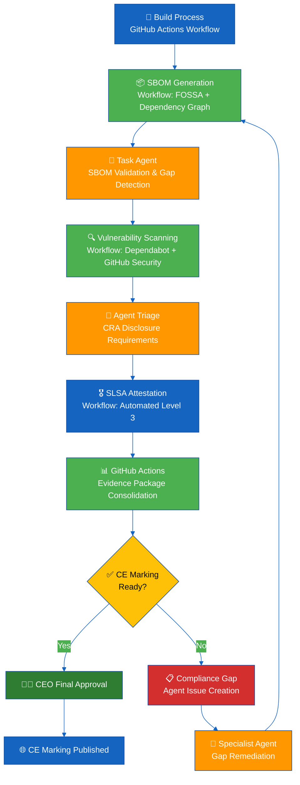
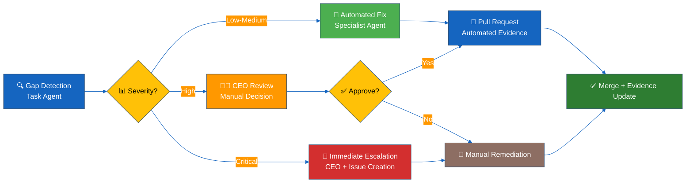
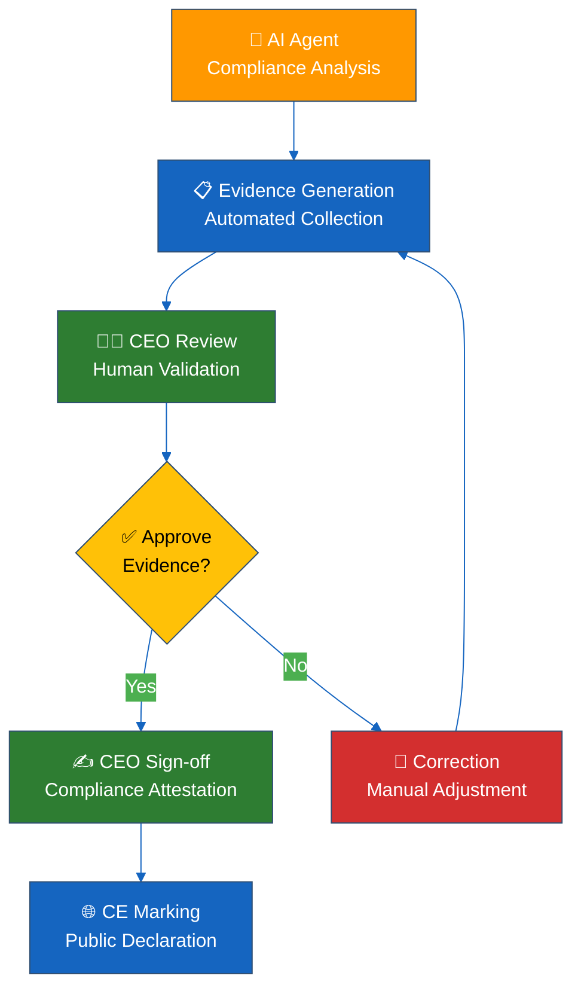

<!-- Replaced verbose prior version with concise ISMS‑style template -->

<p align="center">
  
</p>

<h1 align="center">🛡️ Hack23 AB — CRA Conformity Assessment Process</h1>

<p align="center">
  <strong>Evidence-Driven Conformity Through Systematic Assessment</strong><br>
  <em>Demonstrating CRA Compliance Excellence for Cybersecurity Consulting</em>
</p>

<p align="center">
  <a href="#"></a>
  <a href="#"></a>
  <a href="#"></a>
  <a href="#"></a>
  <a href="#"></a>
</p>

**📋 Document Owner:** CEO | **📄 Version:** 1.4 | **📅 Last Updated:** 2026-03-27 (UTC)  
**🔄 Review Cycle:** Quarterly | **⏰ Next Review:** 2026-06-27

---

## 🎯 **Purpose Statement**

**Hack23 AB's** CRA conformity assessment process demonstrates how **systematic regulatory compliance directly enables business growth rather than creating operational burden.** Our comprehensive assessment framework serves as both operational tool and client demonstration of our cybersecurity consulting methodologies.

As a cybersecurity consulting company, our approach to CRA compliance becomes a showcase of professional implementation, demonstrating to potential clients how systematic regulatory adherence creates competitive advantages through robust security foundations while enabling EU market access.

Our commitment to transparency means our conformity assessment practices become a reference implementation, showing how comprehensive regulatory compliance enables business expansion while protecting organizational interests and maintaining stakeholder trust.

*— James Pether Sörling, CEO/Founder*

---

## 🔍 **Purpose & Scope**

This process provides a concise, repeatable CRA Conformity Assessment format (pre‑market & ongoing) for all six Hack23 AB products (CIA, Black Trigram, CIA Compliance Manager, European Parliament MCP Server, EU Parliament Monitor, Riksdagsmonitor). Aligns with CRA Annex I & V, Hack23 classification, secure development, and transparency policies.

**Scope:** All products within [Asset Register](./Asset_Register.md) requiring EU market placement.

---

## 📋 **Quick Use Instructions**

Copy this entire template into `CRA-ASSESSMENT.md` in your project root. Replace all `{{PLACEHOLDERS}}`, remove unused badge options, tick checkboxes, and commit with project changes when security posture materially changes.

**Evidence Integration:** All evidence (SBOM, provenance, test reports) stored in GitHub release artifacts and repository documentation. Assessment references current project state and links to immutable evidence.

**CRA Regulation Alignment:** This template supports CRA Annex V technical documentation requirements and Annex I essential requirements for cybersecurity through systematic self-assessment.

### 📚 **Reference Implementations**

The following Hack23 AB projects demonstrate completed CRA assessments using this template:

| 🚀 **Project** | 📦 **Product Type** | 🏷️ **CRA Classification** | 📋 **Assessment Status** | 🔗 **Reference Link** |
|---------------|-------------------|------------------------|------------------------|---------------------|
| **🕵️ CIA (Citizen Intelligence Agency)** | Political transparency platform | Standard (Non-commercial OSS) | ✅ Complete | [📄 CRA Assessment](https://github.com/Hack23/cia/blob/master/CRA-ASSESSMENT.md) |
| **⚫ Black Trigram** | Korean martial arts game | Standard (Non-commercial OSS) | ✅ Complete | [📄 CRA Assessment](https://github.com/Hack23/blacktrigram/blob/main/CRA-ASSESSMENT.md) |
| **🛡️ CIA Compliance Manager** | Compliance automation tool | Standard (Non-commercial OSS) | ✅ Complete | [📄 CRA Assessment](https://github.com/Hack23/cia-compliance-manager/blob/main/CRA-ASSESSMENT.md) |
| **🇪🇺 European Parliament MCP Server** | Political intelligence MCP server | Standard (Non-commercial OSS) | ✅ Complete | [📄 CRA Assessment](https://github.com/Hack23/European-Parliament-MCP-Server/blob/main/CRA-ASSESSMENT.md) |
| **🇪🇺 EU Parliament Monitor** | Automated news generation platform | Standard (Non-commercial OSS) | ✅ Complete | [📄 CRA Assessment](https://github.com/Hack23/euparliamentmonitor/blob/main/CRA-ASSESSMENT.md) |
| **🗳️ Riksdagsmonitor** | Swedish parliament intelligence platform | Standard (Non-commercial OSS) | ✅ Complete | [📄 CRA Assessment](https://github.com/Hack23/riksdagsmonitor/blob/main/CRA-ASSESSMENT.md) |

### 🎯 **Implementation Examples**

**📝 Common Template Usage Patterns:**
- **🔍 Classification:** Each reference shows different market categories and CIA classification levels
- **🛡️ Security Controls:** Demonstrates technical documentation across various product types
- **📊 Evidence Links:** Examples of GitHub release attestations and ISMS policy integration
- **⚖️ Risk Assessment:** Different risk profiles for transparency, security, and compliance tools

**🔗 Evidence Repository Structure:**
All reference implementations follow the standardized evidence pattern:
- **📦 GitHub Releases:** SBOM, SLSA attestations, and provenance documentation
- **🛡️ Security Policies:** Direct links to ISMS framework policies and procedures  
- **📊 Compliance Badges:** OpenSSF Scorecard, CII Best Practices, and FOSSA license compliance
- **🚨 Vulnerability Disclosure:** Standardized `SECURITY.md` and coordinated disclosure processes

**💡 Usage Tips:**
1. **Start with Classification:** Use reference implementations with similar CIA levels as templates
2. **Evidence Alignment:** Follow the GitHub attestations pattern from existing assessments
3. **Risk Context:** Adapt risk assessments based on similar product complexity
4. **ISMS Integration:** Reference implementations show policy linkage patterns for different product types
---

## 1️⃣ **Project Identification**

*Supports CRA Annex V § 1 - Product Description Requirements*

| Field | Value |
|-------|-------|
| 📦 Product | {{PROJECT_NAME}} |
| 🏷️ Version Tag | {{CURRENT_VERSION}} (reflects current project state) |
| 🔗 Repository | {{REPO_URL}} |
| 📧 Security Contact | security@hack23.org |
| 🎯 Purpose (1–2 lines) | {{INTENT}} |
| 🏪 Market | **Select one:** |

### 🏪 Market Category (Select One):
[](./CLASSIFICATION.md#project-type-classifications) [](./CLASSIFICATION.md#project-type-classifications) [](./CLASSIFICATION.md#project-type-classifications)

### 🛡️ Confidentiality Level (Select One):
[](./CLASSIFICATION.md#confidentiality-levels) [](./CLASSIFICATION.md#confidentiality-levels) [](./CLASSIFICATION.md#confidentiality-levels) [](./CLASSIFICATION.md#confidentiality-levels) [](./CLASSIFICATION.md#confidentiality-levels) [](./CLASSIFICATION.md#confidentiality-levels)

### ✅ Integrity Level (Select One):
[](./CLASSIFICATION.md#integrity-levels) [](./CLASSIFICATION.md#integrity-levels) [](./CLASSIFICATION.md#integrity-levels) [](./CLASSIFICATION.md#integrity-levels) [](./CLASSIFICATION.md#integrity-levels)

### ⏱️ Availability Level (Select One):
[](./CLASSIFICATION.md#availability-levels) [](./CLASSIFICATION.md#availability-levels) [](./CLASSIFICATION.md#availability-levels) [](./CLASSIFICATION.md#availability-levels) [](./CLASSIFICATION.md#availability-levels)

### 🕐 Recovery Time Objective (Select One):
[-red?style=flat-square)](./CLASSIFICATION.md#rto-classifications) [-orange?style=flat-square)](./CLASSIFICATION.md#rto-classifications) [-yellow?style=flat-square)](./CLASSIFICATION.md#rto-classifications) [-lightgreen?style=flat-square)](./CLASSIFICATION.md#rto-classifications) [-lightblue?style=flat-square)](./CLASSIFICATION.md#rto-classifications) [-lightgrey?style=flat-square)](./CLASSIFICATION.md#rto-classifications)

### 🔄 Recovery Point Objective (Select One):
[-red?style=flat-square)](./CLASSIFICATION.md#rpo-classifications) [-orange?style=flat-square)](./CLASSIFICATION.md#rpo-classifications) [-yellow?style=flat-square)](./CLASSIFICATION.md#rpo-classifications) [-lightgreen?style=flat-square)](./CLASSIFICATION.md#rpo-classifications) [-lightblue?style=flat-square)](./CLASSIFICATION.md#rpo-classifications) [-lightgrey?style=flat-square)](./CLASSIFICATION.md#rpo-classifications)

---

## 2️⃣ **CRA Scope & Classification**

*Supports CRA Article 6 - Scope and Article 7 - Product Classification Assessment*

### 🏢 CRA Applicability (Select One):
[](./CLASSIFICATION.md#project-type-classifications) [](./CLASSIFICATION.md#project-type-classifications)

### 🌐 Distribution Method (Select One):
[](./CLASSIFICATION.md#project-type-classifications) [](./CLASSIFICATION.md#project-type-classifications) [](./CLASSIFICATION.md#project-type-classifications)

### 📋 CRA Classification (Select One):
[](./CLASSIFICATION.md#project-type-classifications) [](./CLASSIFICATION.md#project-type-classifications) [](./CLASSIFICATION.md#project-type-classifications)

**📝 CRA Scope Justification:** {{JUSTIFICATION}}

**🔍 Classification Impact:**
- **Standard:** Self-assessment approach (this template supports documentation)
- **Class I/II:** Notified body assessment required + additional documentation

---

## 3️⃣ **Technical Documentation**

*Supports CRA Annex V § 2 - Technical Documentation Requirements*

| 🏗️ CRA Technical Area | 📝 Implementation Summary | 📋 Evidence Location |
|----------------------|-------------------------|---------------------|
| 🎨 **Product Architecture** *(Annex V § 2.1)* | High-level data & trust boundaries | Repository `/docs/architecture/` or README |
| 📦 **SBOM & Components** *(Annex I § 1.1)* | Complete dependency enumeration | GitHub Release includes signed SBOM |
| 🔐 **Cybersecurity Controls** *(Annex I § 1.2)* | Authentication, authorization, encryption | [🔑 Access Control Policy](./Access_Control_Policy.md) + [🔒 Cryptography Policy](./Cryptography_Policy.md) |
| 🛡️ **Supply Chain Security** *(Annex I § 1.3)* | Signed builds + provenance attestation | GitHub Release includes attestations |
| 🔄 **Update Mechanism** *(Annex I § 1.4)* | Secure software updates with rollback | [📝 Change Management](./Change_Management.md) |
| 📊 **Security Monitoring** *(Annex I § 1.5)* | Logging, audit trails, incident detection | [🚨 Incident Response Plan](./Incident_Response_Plan.md) |
| 🏷️ **Data Protection** *(Annex I § 2.1)* | Classification and protection controls | [🏷️ Data Classification Policy](./Data_Classification_Policy.md) |
| 📚 **User Guidance** *(Annex I § 2.2)* | Security configuration documentation | Repository: `USER_SECURITY_GUIDE.md` |
| 🔍 **Vulnerability Disclosure** *(Annex I § 2.3)* | Coordinated vulnerability disclosure | Repository: `SECURITY.md` + [⚠️ Vulnerability Management](./Vulnerability_Management.md) |

**📋 ISMS Policy Integration:**
- **🏗️ Architecture & Design:** Implementation aligned with [🔐 Information Security Policy](./Information_Security_Policy.md)
- **📦 Asset Management:** All components documented in [💻 Asset Register](./Asset_Register.md)
- **🔒 Encryption Standards:** Cryptographic requirements per [🔒 Cryptography Policy](./Cryptography_Policy.md)
- **🌐 Network Security:** Infrastructure controls via [🌐 Network Security Policy](./Network_Security_Policy.md)

---

## 4️⃣ **Risk Assessment**

*Supports CRA Annex V § 3 - Risk Assessment Documentation*

Reference: [📊 Risk Assessment Methodology](./Risk_Assessment_Methodology.md) and [⚠️ Risk Register](./Risk_Register.md)

| 🚨 **CRA Risk Category** | 🎯 Asset | 📊 Likelihood | 💥 Impact (C/I/A) | 🛡️ CRA Control Implementation | ⚖️ Residual | 📋 Evidence |
|--------------------------|----------|---------------|------------------|------------------------------|-------------|-------------|
| **Supply Chain Attack** *(Art. 11)* | Build pipeline | M | H/H/M | SBOM + SLSA provenance + dependency pinning | L | GitHub attestations |
| **Unauthorized Access** *(Art. 11)* | Authentication | M | H/H/H | MFA + secret scanning + short-lived tokens | L | Access control logs |
| **Data Breach** *(Art. 11)* | Data storage | L | H/H/H | Encryption + IAM + least privilege | L | KMS configuration |
| **Component Vulnerability** *(Art. 11)* | Dependencies | M | M/H/M | SCA scanning + patch management | L | Vulnerability reports |
| **Service Disruption** *(Art. 11)* | Public services | M | L/M/H | WAF + DDoS protection + scaling | M | Infrastructure config |

**⚖️ CRA Risk Statement:** {{LOW / MODERATE / HIGH}} - Assessment supports CRA essential cybersecurity requirements evaluation  
**✅ Risk Acceptance:** {{OWNER_NAME}} - {{DATE}}

**📋 Risk Management Framework:**
- **📊 Methodology:** Risk assessment per [📊 Risk Assessment Methodology](./Risk_Assessment_Methodology.md)
- **⚠️ Risk Tracking:** All risks documented in [⚠️ Risk Register](./Risk_Register.md)
- **🔄 Business Impact:** Continuity planning via [🔄 Business Continuity Plan](./Business_Continuity_Plan.md)
- **🆘 Recovery Planning:** Technical recovery per [🆘 Disaster Recovery Plan](./Disaster_Recovery_Plan.md)

---

## 5️⃣ **Essential Cybersecurity Requirements**

*Supports CRA Annex I - Essential Requirements Self-Assessment*

| 📋 **CRA Annex I Requirement** | ✅ Status | 📋 Implementation Evidence |
|--------------------------------|-----------|---------------------------|
| **🛡️ § 1.1 - Secure by Design** | [ ] | Minimal attack surface via `SECURITY_ARCHITECTURE.md` |
| **🔒 § 1.2 - Secure by Default** | [ ] | Hardened default configurations documented |
| **🏷️ § 2.1 - Personal Data Protection** | [ ] | GDPR compliance via [🏷️ Data Classification Policy](./Data_Classification_Policy.md) |
| **🔍 § 2.2 - Vulnerability Disclosure** | [ ] | Public VDP via Repository `SECURITY.md` + [⚠️ Vulnerability Management](./Vulnerability_Management.md) |
| **📦 § 2.3 - Software Bill of Materials** | [ ] | Automated SBOM generation: GitHub Release includes signed SBOM |
| **🔐 § 2.4 - Secure Updates** | [ ] | Signed updates: GitHub Release includes attestations |
| **📊 § 2.5 - Security Monitoring** | [ ] | Comprehensive logging via [🚨 Incident Response Plan](./Incident_Response_Plan.md) |
| **📚 § 2.6 - Security Documentation** | [ ] | User security guidance: `USER_SECURITY_GUIDE.md` |

**🎯 CRA Self-Assessment Status:** {{REQUIREMENTS_DOCUMENTED / IN_PROGRESS / EVIDENCE_GATHERED}}

**🔍 Standard Security Reporting Process:**
Each project includes standardized security reporting via `SECURITY.md` following coordinated vulnerability disclosure:

- **📧 Private Reporting:** GitHub Security Advisories for confidential disclosure
- **⏱️ Response Timeline:** 48h acknowledgment, 7d validation, 30d resolution
- **🏆 Recognition Program:** Public acknowledgment unless anonymity requested
- **🔄 Continuous Support:** Latest version maintained with security updates
- **📋 Vulnerability Scope:** Authentication bypass, injection attacks, remote code execution, data exposure

**ISMS Integration:** All vulnerability reports processed through [⚠️ Vulnerability Management](./Vulnerability_Management.md) procedures

---

## 6️⃣ **Conformity Assessment Evidence**

*Supports CRA Article 19 - Conformity Assessment Documentation*

### 📊 **Quality & Security Automation Status:**

Reference: [🛠️ Secure Development Policy](./Secure_Development_Policy.md)

| 🧪 Control | 🎯 Requirement | ✅ Implementation | 📋 Evidence |
|-------------|---------------|------------------|-------------|
| 🧪 Unit Testing | ≥80% line coverage, ≥70% branch | {{STATUS}} | Coverage reports + test plans |
| 🌐 E2E Testing | Critical user journeys validated | {{STATUS}} | E2E test reports + mochawesome |
| 🔍 SAST Scanning | Zero critical/high vulnerabilities | {{STATUS}} | Static analysis reports |
| 📦 SCA Scanning | Zero critical unresolved dependencies | {{STATUS}} | Dependency vulnerability reports |
| 🔒 Secret Scanning | Zero exposed secrets/credentials | {{STATUS}} | Secret scan validation |
| 🕷️ DAST Scanning | Zero exploitable high+ findings | {{STATUS}} | Dynamic application security testing |
| 📦 SBOM Generation | SPDX + CycloneDX per release | {{STATUS}} | Software bill of materials |
| 🛡️ Provenance | SLSA Level 3 attestation | {{STATUS}} | Supply chain attestations |
| 📊 Quality Gates | SonarCloud quality gate passing | {{STATUS}} | Code quality metrics |

### 🎖️ **Security & Compliance Badges:**

**🔍 Supply Chain Security:**
[](https://github.com/Hack23/{{REPO_NAME}}/attestations/)
[](https://scorecard.dev/viewer/?uri=github.com/Hack23/{{REPO_NAME}})

**🏆 Best Practices & Quality:**
[](https://bestpractices.coreinfrastructure.org/projects/{{PROJECT_ID}})
[](https://sonarcloud.io/summary/new_code?id={{SONAR_PROJECT}})

**⚖️ License & Compliance:**
[](https://app.fossa.io/projects/git%2Bgithub.com%2FHack23%2F{{REPO_NAME}}?ref=badge_shield)

**🔗 Release Evidence:**
GitHub Attestations: `https://github.com/Hack23/{{REPO_NAME}}/attestations`

### 📦 Release Evidence Pattern (Following Hack23 Standard):

**🎯 Release Assets Structure:**
```
{{PROJECT_NAME}}-{{VERSION}}.zip               # Main application bundle
{{PROJECT_NAME}}-{{VERSION}}.zip.intoto.jsonl  # SLSA provenance attestation
{{PROJECT_NAME}}-{{VERSION}}.spdx.json         # SPDX SBOM
{{PROJECT_NAME}}-{{VERSION}}.spdx.json.intoto.jsonl  # SBOM attestation
```

**📋 Release Notes Format:**
```markdown
# Highlights

## 🏗️ Infrastructure & Performance
- build(deps): automated dependency updates via Dependabot
- ci: enhanced security scanning and compliance checks
- perf: performance optimizations and monitoring improvements

## 📦 Dependencies  
- Complete list of dependency updates with version tracking
- Security vulnerability remediation
- License compliance verification

## 🔒 Security Compliance
[](https://github.com/Hack23/{{REPO_NAME}}/attestations/)
[](https://bestpractices.coreinfrastructure.org/projects/{{PROJECT_ID}})
[](https://scorecard.dev/viewer/?uri=github.com/Hack23/{{REPO_NAME}})
[](https://app.fossa.io/projects/git%2Bgithub.com%2FHack23%2F{{REPO_NAME}}?ref=badge_shield)

## Contributors
Thanks to @dependabot[bot] for automated security updates!

**Full Changelog**: https://github.com/Hack23/{{REPO_NAME}}/compare/{{PREV_VERSION}}...{{CURRENT_VERSION}}
```

**🔍 Evidence Validation Commands:**
```bash
# Verify SBOM in GitHub release
gh release view --repo Hack23/{{REPO_NAME}} --json assets

# Check SLSA attestations
gh attestation list --repo Hack23/{{REPO_NAME}}

# Validate security scorecard
curl -s https://api.securityscorecards.dev/projects/github.com/Hack23/{{REPO_NAME}} | jq '.score'

# Verify FOSSA compliance
curl -s https://app.fossa.io/api/projects/git%2Bgithub.com%2FHack23%2F{{REPO_NAME}}/issues | jq '.issues | length'
```

---

## 7️⃣ **Post-Market Surveillance**

*Supports CRA Article 23 - Obligations of Economic Operators*

Reference: [🌐 ISMS Transparency Plan](./ISMS_Transparency_Plan.md) and [📊 Security Metrics](./Security_Metrics.md)

| 📡 **CRA Monitoring Obligation** | 🔧 Implementation | ⏱️ Frequency | 🎯 Action Trigger | 📋 Evidence |
|----------------------------------|-------------------|-------------|------------------|-------------|
| **🔍 Vulnerability Monitoring** *(Art. 23.1)* | CVE feeds + GitHub advisories | Continuous | Auto-create security issues | SCA reports |
| **🚨 Incident Reporting** *(Art. 23.2)* | Security event detection | Real-time | ENISA 24h notification prep | Monitoring dashboards |
| **📊 Security Posture Tracking** *(Art. 23.3)* | OpenSSF Scorecard monitoring | Weekly | Score decline investigation | Security metrics |
| **🔄 Update Distribution** *(Art. 23.4)* | Automated security updates | As needed | Critical vulnerability patches | Release management |

**📋 CRA Reporting Readiness:** Documentation and procedures prepared for ENISA incident reporting per [🚨 Incident Response Plan](./Incident_Response_Plan.md)

**🔗 ISMS Monitoring Integration:**
- **📊 Continuous Monitoring:** Security posture tracking per [📊 Security Metrics](./Security_Metrics.md)
- **🌐 Transparency Framework:** Public disclosure strategy via [🌐 ISMS Transparency Plan](./ISMS_Transparency_Plan.md)
- **🤝 Third-Party Monitoring:** Supplier surveillance per [🤝 Third Party Management](./Third_Party_Management.md)
- **✅ Compliance Tracking:** Regulatory adherence via [✅ Compliance Checklist](./Compliance_Checklist.md)
- **💾 Data Protection:** Backup and recovery per [💾 Backup Recovery Policy](./Backup_Recovery_Policy.md)

---

## 🤖 **AI Agent-Driven CRA Compliance**

*Supports CRA Article 16 - Quality Management System through Automated Evidence Generation*

### 📋 **Automated Compliance Workflow**

Hack23 AB's curated agent ecosystem (per [🔐 Information Security Strategy](./Information_Security_Strategy.md)) **monitors and validates** CRA evidence generated by automated workflows:



### 🎯 **Agent Responsibilities Matrix**

| Agent Type | CRA Compliance Responsibilities | Escalation Criteria | Evidence Generation |
|------------|--------------------------------|---------------------|---------------------|
| **🔧 Curator-Agent** | CRA tool configuration (FOSSA, SLSA)<br/>MCP server management<br/>Agent profile maintenance | Tool configuration changes require CEO approval | Agent configuration documentation |
| **📋 Task Agents** | Compliance gap identification<br/>**SBOM validation** (generated by workflows)<br/>Evidence collection automation<br/>Issue creation with ISMS mapping | Critical compliance violations:<br/>- Missing SBOM<br/>- Undisclosed vulnerabilities<br/>- Essential requirements gaps | Automated compliance issues<br/>Gap analysis reports |
| **👷 Security Specialist** | Vulnerability remediation<br/>Security attestation generation<br/>SLSA provenance validation<br/>CRA security controls implementation | Breaking changes<br/>Architectural modifications<br/>Security control failures | Security scan reports<br/>Remediation tracking |
| **📝 Documentation Specialist** | CE marking documentation<br/>CRA disclosure updates<br/>Technical file maintenance<br/>Annex V documentation | Policy conflicts<br/>Regulatory interpretation needs<br/>Documentation completeness gaps | Technical documentation<br/>Compliance evidence packages |
| **👨‍💼 CEO (Human)** | Final CE marking approval<br/>Regulatory sign-off<br/>Legal decisions<br/>Strategic compliance direction | All CE marking publications<br/>Regulatory submissions<br/>Material compliance decisions | Formal approvals<br/>Regulatory submissions |

### 📊 **Automated Compliance Evidence Generation**

**GitHub Actions CRA Evidence Packages:**

| Evidence Type | Automation Level | Generation Method | Agent Role |
|--------------|------------------|-------------------|------------|
| **📦 SBOM Generation** | 100% Automated | **Workflows**: FOSSA + GitHub Dependency Graph | Task agent **validation** & gap detection |
| **🔍 Vulnerability Status** | 100% Automated | **Workflows**: Dependabot + GitHub Security | Automated triage + specialist remediation |
| **🎖️ Security Attestations** | 100% Automated | **Workflows**: SLSA Level 3 build provenance | Automated signature verification |
| **📋 CE Marking Documentation** | 80% Automated | Compliance checklist with automated evidence links | Human review + CEO approval |
| **🌐 Public Disclosure** | 90% Automated | **Workflows**: GitHub Security advisory generation | Coordinated disclosure review |

**🔗 Evidence Integration:**
- **Workflow Generation:** GitHub Actions workflows generate SBOM, attestations, and vulnerability scans per [🛠️ Secure Development Policy](./Secure_Development_Policy.md)
- **Agent Monitoring:** Task agents continuously monitor workflow outputs for CRA compliance indicators
- **Gap Detection:** Agents automatically create issues for missing evidence or requirements
- **Evidence Linking:** GitHub Actions consolidates workflow-generated evidence into release packages
- **Audit Trail:** All workflow runs and agent actions logged in GitHub with immutable provenance

### 🔄 **Agent-Enhanced Conformity Assessment Workflow**

**Integration with Section 2-7 Assessment Process:**

1. **📋 Section 2 (CRA Classification):** Task agent validates classification based on product features
2. **🏗️ Section 3 (Technical Documentation):** Documentation specialist maintains Annex V compliance
3. **⚠️ Section 4 (Risk Assessment):** Security specialist updates risk register with CRA risks
4. **✅ Section 5 (Essential Requirements):** Task agent tracks requirement completion status
5. **📊 Section 6 (Conformity Evidence):** Automated badge and attestation generation
6. **📡 Section 7 (Post-Market Surveillance):** Continuous monitoring via agent ecosystem

**Agent Escalation Workflow:**



---

## 🇪🇺 **EU AI Act Integration**

*Supports EU AI Act (2024/1689) Transparency and Human Oversight Requirements*

### 📋 **AI System Transparency Requirements**

Hack23 AB's AI agent ecosystem must comply with EU AI Act transparency obligations (per [🤖 AI Policy](./AI_Policy.md)):

**Minimal Risk AI Systems (GitHub Copilot, OpenAI):**

| AI System | Risk Classification | Transparency Obligations | Human Oversight |
|-----------|-------------------|-------------------------|-----------------|
| **🤖 GitHub Copilot** | Minimal Risk | AI-generated code clearly marked in commits | All code reviewed by CEO before merge |
| **💬 OpenAI GPT** | Minimal Risk | AI-generated content documented in issues | Human validation of all outputs |

**🔐 Transparency Implementation:**
- **Clear Attribution:** All AI-generated content includes agent attribution in commits/issues
- **Audit Trail:** Complete provenance chain for all agent actions via GitHub
- **Documentation:** AI usage documented in agent profiles (`.github/agents/*.md`)
- **Version Control:** All AI-generated changes subject to Git history and review

### 🤖 **Agent-Assisted CRA Compliance Framework**

**Human Oversight Framework (Aligned with EU AI Act Best Practices):**



**🎯 Key Principles:**
- **🤖 Agents Assist:** AI generates evidence and identifies gaps, but does NOT make compliance decisions
- **👨‍💼 Human Decides:** CEO maintains final authority for all CE marking and regulatory decisions
- **✅ Validation Required:** All agent recommendations subject to human validation before action
- **📋 Explicit Approval:** Compliance sign-off requires explicit CEO approval signature

### 📊 **EU AI Act Compliance Evidence**

**Transparency Documentation:**

| Requirement | Implementation | Evidence Location |
|-------------|----------------|-------------------|
| **AI System Documentation** | Agent profiles and MCP configurations | `.github/agents/*.md`, `.github/copilot-mcp.json` |
| **Human Oversight Procedures** | CEO approval workflow for all PRs | GitHub PR review history |
| **Risk Assessment** | AI risk classification per AI Policy | [🤖 AI Policy](./AI_Policy.md) Section 4 |
| **Transparency Obligations** | Clear AI attribution in all outputs | Git commit messages, issue descriptions |
| **Accountability Framework** | CEO ultimate responsibility documented | This policy + [🔐 Information Security Strategy](./Information_Security_Strategy.md) |

**🔗 Cross-Reference:** See [🤖 AI Policy](./AI_Policy.md) for complete EU AI Act compliance framework including:
- Article 50: Transparency obligations for limited risk/general-purpose AI systems
- Article 14: Human oversight requirements (high-risk AI systems framework, applied as best practice)
- Article 53: AI system documentation and record-keeping
- Annex IV: Technical documentation requirements

---

## 8️⃣ **EU Declaration of Conformity**

*Supports CRA Article 28 - EU Declaration of Conformity*

> **📝 Complete when placing product on EU market**

**🏢 Manufacturer:** Hack23 AB, Stockholm, Sweden  
**📦 Product:** {{PROJECT_NAME}} {{CURRENT_VERSION}}  
**📋 CRA Compliance:** Self-assessment documentation supporting CRA essential cybersecurity requirements evaluation  
**🔍 Assessment:** {{Self-assessment documentation per Article 24 / Notified body per Article 25}}  
**📊 Standards:** {{ETSI EN 303 645 / ISO/IEC 27001 / OWASP ASVS / NIST SSDF}}

**📅 Date & Signature:** {{CURRENT_DATE}} - {{RESPONSIBLE_PERSON}}, {{TITLE}}

**📂 Technical Documentation:** This assessment + evidence bundle supports CRA Annex V technical documentation requirements

---

## 9️⃣ **Assessment Completion & Approval**

*Supports CRA Article 16 - Quality Management System Documentation*

### 📊 **CRA Self-Assessment Summary**

**Overall CRA Documentation Status:** {{DOCUMENTATION_COMPLETE / IN_PROGRESS / INITIAL_DRAFT}}

**Key CRA Documentation Areas:**
- ✅ Annex I essential requirements documented and assessed
- ✅ Annex V technical documentation structured  
- ✅ Article 11 security measures documented
- ✅ Article 23 post-market surveillance procedures documented

**Outstanding Documentation:**
```
{{CRA_GAP_ID}}: {{DESCRIPTION}} → Target: {{DATE}} (Owner: {{OWNER}})
```

### ✅ **Formal Approval**

| 👤 **Role** | 📝 **Name** | 📅 **Date** | ✍️ **Assessment Attestation** |
|------------|-------------|-------------|-------------------------------|
| 🔒 **CRA Security Assessment** | {{CEO}} | {{DATE}} | Essential requirements documented and assessed |
| 🎯 **Product Responsibility** | {{CEO}} | {{DATE}} | Technical documentation complete and structured |
| ⚖️ **Legal Compliance Review** | {{CEO}} | {{DATE}} | EU regulatory documentation requirements addressed |

**📊 CRA Assessment Status:** {{SELF_ASSESSMENT_DOCUMENTED / IN_PROGRESS / DRAFT_STAGE}}

---

## 🎨 **CRA Assessment Maintenance**

### **📋 Update Triggers** 
*Per CRA Article 15 - Substantial Modification*

CRA assessment updated only when changes constitute "substantial modification" under CRA:

1. **🏗️ Security Architecture Changes:** New authentication methods, trust boundaries, or encryption
2. **🛡️ Essential Requirement Impact:** Changes affecting Annex I compliance
3. **📦 Critical Dependencies:** New supply chain components with security implications  
4. **🔍 Risk Profile Changes:** New threats or vulnerability classes
5. **⚖️ Regulatory Updates:** CRA implementing acts or guidance changes

**🎯 Maintenance Principle:** Assessment stability preferred - avoid routine updates that don't impact CRA compliance

### **🔗 CRA Evidence Integration**
```markdown
## Current CRA Self-Assessment Evidence

**🏷️ Product Version:** {{CURRENT_VERSION}}
**📦 CRA Technical Documentation:** This assessment + [Latest Release](https://github.com/Hack23/{{REPO_NAME}}/releases/latest)
**🛡️ Security Attestations:** [GitHub Attestations](https://github.com/Hack23/{{REPO_NAME}}/attestations)
**📊 Assessment Status:** 
```

---

## 📚 Related Documents

### 🎯 Strategic & Governance
- [🎯 Information Security Strategy](./Information_Security_Strategy.md) - AI-first operations, Pentagon framework, and strategic CRA direction
- [🔐 Information Security Policy](./Information_Security_Policy.md) - Overall security governance framework with AI-First Operations Governance
- [🤖 AI Policy](./AI_Policy.md) - EU AI Act compliance and transparency obligations for AI systems
- [✅ Compliance Checklist](./Compliance_Checklist.md) - Multi-framework regulatory compliance tracking
- [🏷️ Classification Framework](./CLASSIFICATION.md) - Data and asset classification methodology
- [📊 Risk Assessment Methodology](./Risk_Assessment_Methodology.md) - Risk evaluation framework for CRA assessments

### 🔐 Security Policies & Controls
- [🛠️ Secure Development Policy](./Secure_Development_Policy.md) - Security architecture and SDLC requirements for CRA compliance
- [🔍 Vulnerability Management](./Vulnerability_Management.md) - Security testing and remediation procedures
- [🎯 Threat Modeling](./Threat_Modeling.md) - STRIDE analysis and threat assessment methodology
- [🔓 Open Source Policy](./Open_Source_Policy.md) - OSS governance and SBOM requirements

---

## 📚 **CRA Regulatory Alignment**

### **🔐 CRA Article Cross-References**
- **Article 6:** Scope determination → Section 2 (CRA Classification)
- **Article 11:** Essential cybersecurity requirements → Section 5 (Requirements Assessment)  
- **Article 19:** Conformity assessment → Section 6 (Evidence Documentation)
- **Article 23:** Post-market obligations → Section 7 (Surveillance Documentation)
- **Article 28:** Declaration of conformity → Section 8 (DoC Template)
- **Annex I:** Technical requirements → Section 5 (Requirements self-assessment mapping)
- **Annex V:** Technical documentation → Complete template structure

### **🌐 ISMS Integration Benefits**
- **🔄 Operational Continuity:** CRA self-assessment integrated with existing security operations
- **📊 Evidence Reuse:** Security metrics and monitoring serve dual ISMS/CRA documentation purposes
- **🎯 Business Value:** CRA readiness demonstrates cybersecurity consulting expertise through systematic documentation
- **🤝 Client Confidence:** Transparent self-assessment approach showcases professional implementation methodology

### **📋 Complete ISMS Policy Framework**

#### **🔐 Core Security Governance**
- **[🔐 Information Security Policy](./Information_Security_Policy.md)** — Overall security governance and business value framework
- **[🏷️ Classification Framework](./CLASSIFICATION.md)** — Data and asset classification methodology with business impact analysis
- **[🌐 ISMS Transparency Plan](./ISMS_Transparency_Plan.md)** — Public disclosure strategy and stakeholder communication

#### **🛡️ Security Control Implementation**
- **[🔒 Cryptography Policy](./Cryptography_Policy.md)** — Encryption standards, key management, and post-quantum readiness
- **[🔑 Access Control Policy](./Access_Control_Policy.md)** — Identity management, MFA requirements, and privilege management
- **[🌐 Network Security Policy](./Network_Security_Policy.md)** — Network segmentation, firewall rules, and perimeter security
- **[🏷️ Data Classification Policy](./Data_Classification_Policy.md)** — Information handling, protection levels, and retention requirements

#### **⚙️ Operational Excellence Framework**
- **[🛠️ Secure Development Policy](./Secure_Development_Policy.md)** — SDLC security, testing requirements, and automation gates
- **[📝 Change Management](./Change_Management.md)** — Controlled modification procedures and release management
- **[🔍 Vulnerability Management](./Vulnerability_Management.md)** — Security testing, coordinated disclosure, and remediation
- **[🤝 Third Party Management](./Third_Party_Management.md)** — Supplier risk assessment and ongoing monitoring
- **[🔓 Open Source Policy](./Open_Source_Policy.md)** — OSS governance, license compliance, and contribution management

#### **🚨 Incident Response & Recovery**
- **[🚨 Incident Response Plan](./Incident_Response_Plan.md)** — Security event handling, communication, and forensics
- **[🔄 Business Continuity Plan](./Business_Continuity_Plan.md)** — Business resilience, recovery objectives, and continuity strategies
- **[🆘 Disaster Recovery Plan](./Disaster_Recovery_Plan.md)** — Technical recovery procedures and system restoration
- **[💾 Backup Recovery Policy](./Backup_Recovery_Policy.md)** — Data protection, backup validation, and restore procedures

#### **📊 Performance Management & Compliance**
- **[📊 Security Metrics](./Security_Metrics.md)** — KPI tracking, performance measurement, and continuous improvement
- **[💻 Asset Register](./Asset_Register.md)** — Comprehensive asset inventory with risk classifications
- **[📉 Risk Register](./Risk_Register.md)** — Risk identification, assessment, treatment, and monitoring
- **[📊 Risk Assessment Methodology](./Risk_Assessment_Methodology.md)** — Systematic risk evaluation framework
- **[✅ Compliance Checklist](./Compliance_Checklist.md)** — Regulatory requirement tracking and attestation

**🎯 Framework Benefits for CRA Compliance:**
- **🔄 Process Maturity:** Established ISMS demonstrates systematic security management capabilities
- **📋 Evidence Repository:** Comprehensive documentation supports CRA technical file requirements
- **🛡️ Control Effectiveness:** Implemented security measures provide concrete evidence of essential requirements
- **📊 Continuous Improvement:** Metrics and review cycles demonstrate ongoing security posture management
- **🤝 Stakeholder Confidence:** Transparent practices showcase professional cybersecurity consulting expertise

---

---

**📋 Document Control:**  
**✅ Approved by:** James Pether Sörling, CEO  
**📤 Distribution:** Public  
**🏷️ Classification:** [](./CLASSIFICATION.md#confidentiality-levels)  
**📅 Effective Date:** 2026-03-27  
**⏰ Next Review:** 2026-06-27  
**🎯 Framework Compliance:** [](./CLASSIFICATION.md) [](./CLASSIFICATION.md) [](./CLASSIFICATION.md)
