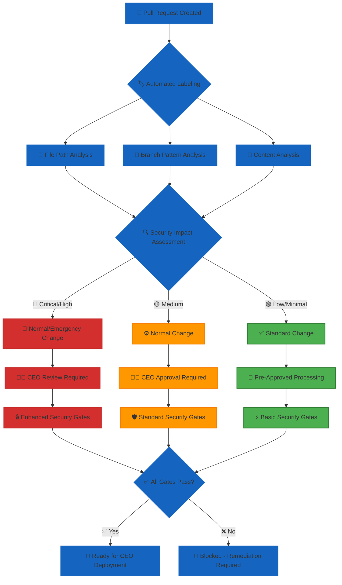
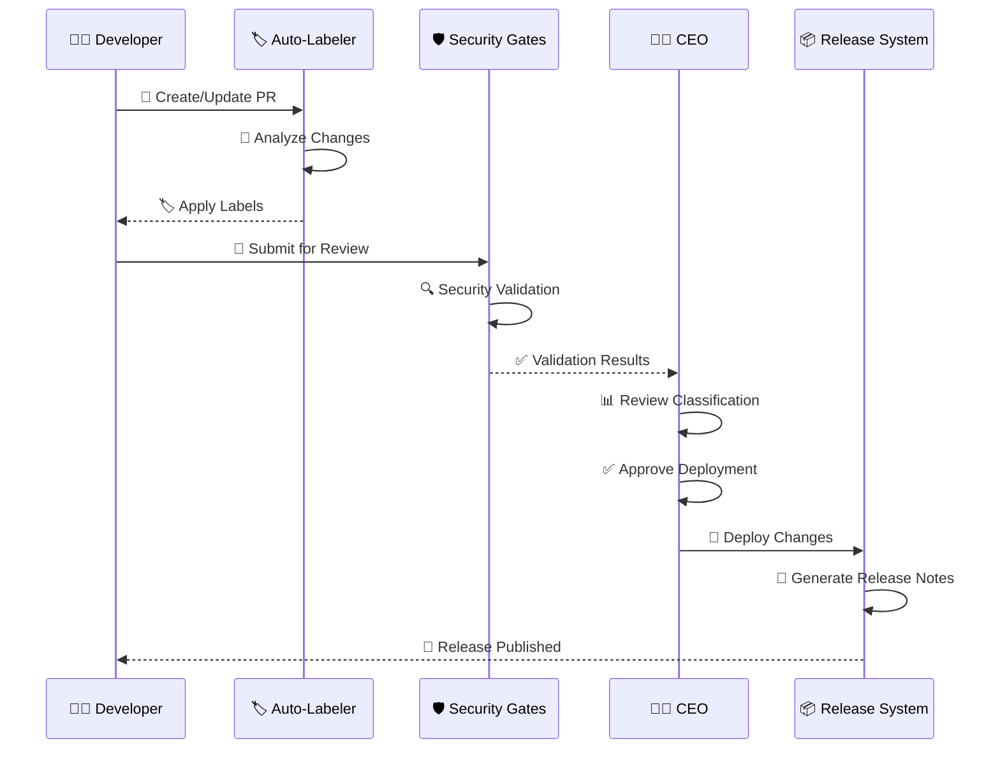

<p align="center">
  
</p>

<h1 align="center">📝 Hack23 AB — Change Management Policy</h1>

<p align="center">
  <strong>Safe, Documented, and Reversible Changes</strong><br>
  <em>Security-by-Design Through Automated Controls and CEO-Managed Implementation</em>
</p>

<p align="center">
  <a href="#"></a>
  <a href="#"></a>
  <a href="#"></a>
  <a href="#"></a>
</p>

**📋 Document Owner:** CEO | **📄 Version:** 3.0 | **📅 Last Updated:** 2025-11-27 (UTC)  
**🔄 Review Cycle:** Annual | **⏰ Next Review:** 2026-11-27

---

## 🎯 **Purpose Statement**

**Hack23 AB's** change management policy demonstrates how **🔐 security-by-design principles** create **🏆 competitive advantages** through systematic change control implementation. Our change management practices serve as both operational excellence and client demonstration of our cybersecurity consulting expertise.

This policy embodies our **🌟 transparency principle** - making change processes auditable and verifiable while showcasing **🤝 customer trust** via demonstrable security controls and **💼 partnership value** through proven change governance.

**Scope:** All changes to information systems, applications, infrastructure, and security controls within Hack23 AB's asset inventory.

---

## 🔐 **Core Security Principles Integration**

### **🔐 Security by Design Implementation**
- **🛡️ Automated Security Gates:** All changes must pass security validation checks before CEO deployment
- **📊 Risk-Based Classification:** Changes categorized and controlled based on **📊 decision quality** frameworks  
- **🔍 Audit Trail Maintenance:** Complete change history supporting **📋 compliance posture**

### **🌟 Transparency Through Documentation**
- **🌐 Change Visibility:** All changes documented with clear rationale and impact assessment
- **🎖️ Automated Evidence Collection:** Security validation results demonstrate **🤝 trust enhancement**
- **📚 Living Documentation:** Change procedures documented and maintained systematically

### **🔄 Continuous Improvement Integration**
- **📈 Automated Validation:** Security gates drive **⚙️ operational efficiency**
- **🚨 Failure Analysis:** Post-change reviews enable **🔄 operational excellence**
- **💰 Cost-Benefit Optimization:** Streamlined processes support **💰 cost efficiency** objectives

---

## 🔄 **Change Categories & Control Framework**

### **🟢 Standard Changes (Pre-Approved)**
**Definition:** Low-risk, routine changes with documented procedures and automated security validation.

| Change Category | Examples | Security Requirements | Deployment Process |
|----------------|----------|----------------------|-------------------|
| **📚 Documentation Updates** | Policies, procedures, user documentation | • Content review<br>• No sensitive information exposure<br>• Link validation | CEO deploys after automated checks pass |
| **🧪 Testing Improvements** | Test cases, quality assurance enhancements | • Test validation<br>• Security scanning<br>• Coverage maintenance | CEO deploys after validation success |
| **🎨 Interface Enhancements** | User experience improvements, visual updates | • Security header compliance<br>• Input validation maintained<br>• Accessibility standards | CEO deploys after security validation |
| **🔧 Configuration Updates** | System tuning, performance optimization | • Configuration validation<br>• Security policy compliance<br>• Change impact assessment | CEO deploys after approval gates |

**Pre-Approval Criteria:**
- ✅ All automated security checks pass
- ✅ No critical system components affected  
- ✅ Rollback procedures documented
- ✅ Security posture maintained or improved

---

### **🟡 Normal Changes (CEO Review & Approval)**

**Definition:** Medium-risk changes requiring CEO review and explicit approval before implementation.

| Change Category | Examples | Security Requirements | Approval Process |
|----------------|----------|----------------------|------------------|
| **🏗️ Infrastructure Modifications** | Cloud resources, network configurations | • Security impact assessment<br>• Compliance validation<br>• Cost-benefit analysis<br>• Architecture review | CEO review → Approval → Deployment |
| **⚙️ Application Features** | New functionality, business logic changes | • Threat modeling assessment<br>• Access control validation<br>• Data handling compliance<br>• Performance impact review | CEO review → Approval → Deployment |
| **🔑 Security Control Changes** | Access policies, encryption settings, monitoring | • Control effectiveness analysis<br>• Regulatory impact assessment<br>• Risk evaluation<br>• Documentation updates | CEO review → Security analysis → Approval |
| **🔌 Integration Updates** | Third-party services, API connections | • Vendor security validation<br>• Data flow analysis<br>• Privacy compliance review<br>• Contract alignment | CEO review → Vendor assessment → Approval |
| **🤖 Agent Configuration Changes** | `.github/agents/*.md`, `.github/copilot-mcp*.json`, `.github/workflows/copilot-setup-steps.yml` | • Security capability assessment<br>• Tool permission validation<br>• ISMS alignment verification<br>• Risk evaluation for capability expansion | CEO review → Security analysis → Approval |

**CEO Approval Requirements:**
- ✅ All Standard Change requirements met
- ✅ Business justification documented
- ✅ Risk assessment completed
- ✅ Implementation plan reviewed
- ✅ Success criteria defined

**Segregation of Duties:** The change management approval process enforces separation between change requester, approver, and implementer roles. For single-person operations, see [🚫 Segregation of Duties Policy](./Segregation_of_Duties_Policy.md) for compensating controls including temporal separation, automated gates, and audit trail requirements.

---

### **🔴 Emergency Changes (Immediate Implementation)**

**Definition:** Critical changes required to restore service availability or address active security incidents.

| Emergency Trigger | Examples | Security Requirements | Authorization Process |
|-------------------|----------|----------------------|----------------------|
| **🚨 Active Security Incidents** | Breach response, vulnerability exploitation | • Incident scope containment<br>• Evidence preservation<br>• Minimal change scope<br>• Security validation post-fix | CEO implements → Document within 4h |
| **⏰ Critical Service Outages** | System unavailability, data integrity issues | • Service restoration priority<br>• Root cause correlation<br>• Change scope documentation<br>• Recovery verification | CEO implements → Document within 4h |
| **🛡️ Critical Vulnerabilities** | Zero-day exploits, high-risk CVEs | • Vulnerability assessment<br>• Patch validation<br>• Exploit mitigation verification<br>• System stability confirmation | CEO implements → Document within 4h |

**Emergency Authorization:**
- ✅ CEO has sole authority for emergency changes
- ✅ All actions logged with timestamps
- ✅ Complete documentation within 4 hours
- ✅ Post-implementation review within 24 hours
- ✅ Lessons learned integration

---

## 🤖 **AI Agent Configuration Governance**

### **📋 Agent Configuration as Configuration Items**

All AI agent configuration files are treated as configuration items requiring change control:

| Configuration File Type | Purpose | Change Category | Approval Authority |
|------------------------|---------|-----------------|-------------------|
| **`.github/agents/*.md`** | Custom agent profiles and prompts | 🟡 Normal Change | CEO or Security Owner |
| **`.github/copilot-mcp*.json`** | MCP server configurations and permissions | 🟡 Normal Change | CEO or Security Owner |
| **`.github/workflows/copilot-setup-steps.yml`** | Agent bootstrap and environment setup | 🟡 Normal Change | CEO or Security Owner |

### **🔐 Agent Configuration Change Requirements**

#### **Curator-Agent Changes**
- **Change Record Required:** All curator-agent modifications MUST be documented with rationale
- **PR-Based Workflow:** Changes made via pull requests with explicit approval
- **Risk Assessment:** Required for:
  - New agent creation
  - Tool/permission expansion
  - New MCP integration
  - Environment configuration changes affecting security posture

#### **Security Review Triggers**
CEO or designated security owner approval REQUIRED for changes that:
- ✅ Broaden agent capabilities or permissions
- ✅ Add new MCP servers or external integrations
- ✅ Modify security-related environment variables
- ✅ Change agent access to sensitive repositories or data
- ✅ Impact evidence generation or compliance monitoring

#### **Automated Validation**
- **CI Checks:** Automated validation of agent YAML syntax and structure
- **Security Scanning:** Detection of overly permissive tool configurations (e.g., `tools: ["*"]` forbidden except in approved cases)
- **Policy Compliance:** Verification that agent profiles load ISMS-PUBLIC context
- **Documentation Requirements:** Agent README updates for significant changes

### **📊 Agent Change Tracking**

Per [AI Policy](./AI_Policy.md) governance requirements:
- **Change Log:** All agent configuration changes tracked in version control with descriptive commit messages
- **Review Cadence:** Agent ecosystem reviewed quarterly per `.github/agents/README.md` maintenance schedule
- **Performance Metrics:** Agent effectiveness tracked as part of [Security Metrics](./Security_Metrics.md)
- **Risk Register Integration:** Agent-specific risks documented in [Risk Register](./Risk_Register.md) (R-AGENT-001, R-AGENT-002)

---

## 🏗️ **Release & Deployment Management**

### **📦 Product Release Process**

**Hack23 AB** separates release preparation from deployment execution for enhanced security and control:

#### **🎯 Release Attestation Phase**
1. **🔍 Security Validation:** All security gates must pass before release candidacy
2. **📋 Quality Assurance:** Comprehensive testing and validation completion
3. **📊 Risk Assessment:** Security impact and business risk evaluation
4. **✅ Release Approval:** CEO attestation that release meets all criteria
5. **📦 Release Packaging:** Signed and versioned release artifacts created

#### **🚀 Deployment Execution Phase**
1. **⏱️ Timing Decision:** CEO determines optimal deployment timing
2. **🏗️ Environment Preparation:** Target environment validation and readiness
3. **📊 Monitoring Setup:** Enhanced observability and alerting activation
4. **🔄 Deployment Execution:** CEO-controlled deployment with rollback capability
5. **✅ Post-Deployment Validation:** Success criteria verification and monitoring

### **🔐 Solution vs Product Deployment**

#### **🏢 Solution Deployments (Client-Specific)**
- **🎯 Client Environment:** Deployment to customer infrastructure or dedicated environments
- **📋 Custom Configuration:** Client-specific settings and integration requirements
- **🔒 Security Adaptation:** Client security requirements and compliance needs
- **📊 Acceptance Criteria:** Client-defined success metrics and validation procedures
- **🤝 Stakeholder Coordination:** Client communication and change coordination

#### **🌐 Product Deployments (Shared/SaaS)**
- **☁️ Hack23 Infrastructure:** Deployment to company-controlled environments
- **⚖️ Standard Configuration:** Consistent product configuration and features
- **🛡️ Unified Security:** Company-wide security standards and monitoring
- **📈 Performance Metrics:** Standard KPIs and monitoring dashboards
- **🔄 Automated Rollback:** Predefined rollback triggers and procedures

---


## 🤖 **Automated Change Classification & Release Management**

### **🏷️ Project-Specific Automated Labeling**

All projects implement automated pull request labeling based on file paths and branch patterns to ensure consistent change classification and release note generation. Each project maintains domain-specific labeling configurations while adhering to universal security categories.

#### **📋 Universal Security-First Categories**
| Label Category | Security Impact | Change Classification | CEO Involvement |
|---------------|-----------------|----------------------|-----------------|
| **🔒 security** | Critical | Normal/Emergency | Review + Deploy |
| **🏗️ infrastructure** | High | Normal | Review + Deploy |
| **🐛 bug** | Variable | Standard/Normal | Deploy Authorization |
| **📦 dependencies** | Variable | Standard/Normal | Deploy Authorization |
| **🧪 testing** | Low | Standard | Deploy Authorization |
| **📝 documentation** | Minimal | Standard | Deploy Authorization |
| **🔄 refactor** | Low | Standard | Deploy Authorization |
| **⚙️ build** | Medium | Normal | Review + Deploy |

#### **🎯 Domain-Specific Label Examples**
Different projects implement specialized labeling reflecting their business domain:

**🏛️ CIA Project (Democratic Transparency):**
- **political-analysis** — Parliamentary data and political trend analysis
- **party-data** — Political party information and performance tracking  
- **committee** — Government committee decisions and tracking
- **government** — Ministry and minister activity monitoring
- **analytics** — Citizen engagement and transparency metrics
- **visualization** — Political data presentation and dashboard improvements

**🎮 Gaming Projects:**
- **game-logic** — Core gameplay mechanics and rule systems
- **graphics** — Visual rendering, assets, and user interface
- **audio** — Sound effects, music, and audio processing
- **performance** — Optimization and system resource management

**☁️ Infrastructure Projects:**
- **aws-infrastructure** — Cloud resource provisioning and configuration
- **monitoring** — System observability and alerting capabilities
- **networking** — Security groups, VPCs, and connectivity patterns

### **🔄 Automated Change Classification Pipeline**



**Automated Classification Benefits:**
- **🔄 Operational Excellence:** Consistent change categorization reduces manual effort and human error
- **🛡️ Risk Reduction:** Automated security impact assessment ensures appropriate controls
- **📊 Decision Quality:** Clear classification supports informed CEO deployment decisions
- **🤝 Trust Enhancement:** Transparent, auditable classification demonstrates control maturity

### **📦 Automated Release Note Generation**

#### **🔒 Security-First Release Structure**
Release notes automatically organize changes by security impact and business value, supporting our **🏆 competitive advantage** through demonstrated security maturity:

**🔴 High Priority Sections:**
- **🔒 Security & Compliance Updates** — Critical security improvements and regulatory alignment
- **🏗️ Infrastructure & Performance** — System reliability and operational improvements  
- **🐛 Critical Bug Fixes** — Important stability and functionality corrections

**🟡 Feature & Enhancement Sections:**
- **🚀 New Features & Capabilities** — Business value delivery and competitive differentiation
- **🎨 User Experience Improvements** — Interface and usability enhancements
- **📊 Analytics & Insights** — Data-driven capabilities and reporting improvements

**🟢 Maintenance & Quality Sections:**
- **🔄 Code Quality & Testing** — Technical debt reduction and reliability improvements
- **📦 Dependencies & Build System** — Supply chain security and development efficiency
- **📝 Documentation & Help** — Knowledge sharing and user guidance updates

#### **📋 Release Note Integration with Business Value**
Each release section demonstrates alignment with **Information Security Principles**:

```markdown
## 🎯 Release v2.1.0 - Enhanced Security & Business Value

### 🔒 Security & Compliance Updates
*Supporting **💰 cost avoidance** through proactive security measures*
- Enhanced authentication systems improving **🤝 customer trust**
- Updated compliance frameworks ensuring **📋 compliance posture**
- Infrastructure hardening delivering **🛡️ risk reduction**

### 🚀 New Features & Capabilities  
*Enabling **💡 innovation** while maintaining security excellence*
- Advanced analytics capabilities supporting **📊 decision quality**
- Performance optimizations ensuring **🔄 operational excellence**
- Integration enhancements creating **💼 partnership value**

### 🏗️ Infrastructure & Performance
*Driving **⚙️ operational efficiency** through systematic improvements*
- Cloud optimization reducing costs while improving **🏆 service reliability**
- Monitoring enhancements supporting **🔄 operational excellence**
- Backup improvements ensuring **💰 revenue protection**
```

### **🎯 Release Management Integration**

#### **🚀 Automated Release Pipeline**


**Release Process Benefits:**
- **🔐 Security by Design:** All releases validated through comprehensive security gates
- **🌟 Transparency:** Automated documentation provides complete change visibility  
- **🔄 Continuous Improvement:** Metrics-driven optimization of release processes
- **⚖️ Business Value Focus:** Release notes emphasize business impact and competitive advantages

### **📊 Change Management Performance Integration**

#### **🎯 Automated Metrics Collection**
Release and change management metrics automatically support **📊 Security Metrics** reporting:

**🔄 Process Efficiency Metrics:**
- **⏱️ Label Accuracy Rate:** Percentage of correctly classified changes
- **🛡️ Security Gate Effectiveness:** Vulnerabilities and issues prevented before deployment
- **📈 Release Frequency:** Regular deployment cadence supporting innovation velocity
- **✅ Change Success Rate:** Deployments completed without rollback or incident

**🛡️ Security Performance Indicators:**
- **🔍 Vulnerability Prevention:** Security issues blocked by automated classification and gates
- **📋 Compliance Adherence:** Changes meeting all regulatory and policy requirements  
- **🚨 Emergency Change Ratio:** Planned vs. unplanned change balance
- **⏱️ Mean Resolution Time:** Speed of security issue identification to remediation

**💰 Business Value Demonstration:**
- **💰 Risk Avoidance:** Potential incidents prevented through systematic change controls
- **🏆 Service Reliability:** Uptime maintenance during change activities
- **📈 Innovation Enablement:** Speed of delivering new capabilities while maintaining security
- **🤝 Customer Impact:** Service quality preservation during change windows

#### **📈 Quarterly Assessment Integration**
Automated change classification and release management performance feeds into comprehensive **Change Management Assessment**:

- **📊 Classification Accuracy:** Review and optimization of labeling rules and security impact assessment
- **🛡️ Security Gate Performance:** Analysis of vulnerability detection rates and false positive optimization
- **🔄 Process Maturation:** Evolution of change management practices based on metrics and outcomes  
- **🏆 Business Value Alignment:** Demonstration of change management contribution to competitive advantages

This automated approach ensures our **🌟 transparency principle** through consistent, auditable change classification while supporting **🏆 competitive advantages** through efficient, secure release processes that demonstrate cybersecurity consulting expertise across all project domains and client engagements.

---


## 🤖 **Automated Security Validation Framework**

### **🛡️ Security Gate Requirements**

All changes must pass comprehensive automated security validation before CEO deployment authorization:

#### **📋 Core Security Checks**
- **🔍 Vulnerability Scanning:** Known security issues identification and remediation
- **🔐 Secret Detection:** No exposed credentials, API keys, or sensitive data
- **📊 Dependency Analysis:** Third-party component security assessment
- **🏗️ Configuration Validation:** Security policy compliance verification
- **🧪 Quality Gates:** Code quality, testing, and coverage thresholds

#### **🏗️ Infrastructure Security Validation**
- **☁️ Cloud Configuration:** Security best practices and policy compliance
- **🌐 Network Security:** Access controls and segmentation validation
- **🔒 Encryption Standards:** Data protection and key management compliance
- **📋 Compliance Checks:** Regulatory requirement adherence validation

### **🎖️ Public Security Evidence**

All products maintain transparent security posture through automated evidence collection:

- **📊 Security Ratings:** Continuous security assessment and scoring
- **🔍 Vulnerability Status:** Real-time security finding tracking and resolution
- **📋 Compliance Badges:** Regulatory and standard compliance demonstration
- **🏆 Best Practice Adherence:** Industry security framework alignment

---

## 🚨 **Emergency Response Procedures**

### **🆘 Incident-Driven Changes**

When critical incidents require immediate system modifications:

#### **⚡ Immediate Response Authority**
- **👨‍💻 CEO Decision Authority:** Sole authority to implement emergency changes
- **🚨 Incident Correlation:** Changes directly linked to active incident response
- **📊 Scope Minimization:** Smallest possible change to resolve critical issue
- **🔍 Evidence Preservation:** Maintain forensic integrity during emergency response

#### **📋 Emergency Documentation Requirements**
- **⏱️ Timeline Documentation:** Complete chronology of actions and decisions
- **🎯 Change Justification:** Clear rationale linking change to incident resolution
- **📊 Impact Assessment:** Security, operational, and business impact evaluation
- **✅ Validation Results:** Post-change testing and success confirmation

### **🔄 Post-Emergency Review Process**

#### **📅 4-Hour Documentation Window**
- **📝 Complete Change Record:** Full documentation of what, why, when, and how
- **🔍 Security Impact Analysis:** Assessment of security posture changes
- **📊 Effectiveness Evaluation:** Did the change resolve the incident successfully?
- **🎯 Improvement Opportunities:** Process and technical enhancement identification

#### **📅 24-Hour Review & Approval**
- **✅ CEO Formal Approval:** Retrospective authorization and lessons learned
- **📋 Policy Compliance Review:** Adherence to emergency change procedures
- **🔄 Process Improvement:** Updates to procedures based on experience
- **📚 Knowledge Integration:** Best practices and pitfall documentation

---

## 📊 **Change Management Metrics & Performance**

### **🎯 Success Metrics Framework**

Aligned with **📊 Security Metrics** and business value objectives:

#### **⚙️ Operational Excellence Metrics**
- **⏱️ Change Success Rate:** Percentage of changes deployed without issues or rollback
- **🔄 Deployment Frequency:** Regular, planned change cadence vs. emergency frequency
- **📈 Process Efficiency:** Time from change request to successful deployment
- **🛡️ Security Gate Effectiveness:** Issues caught and resolved before deployment

#### **🛡️ Security Performance Metrics**
- **🔍 Vulnerability Prevention:** Security issues blocked by automated gates
- **📋 Policy Compliance:** Changes meeting all security and regulatory requirements
- **🚨 Incident Correlation:** Changes contributing to vs. resolving security incidents
- **⏱️ Recovery Performance:** Mean time to recovery from failed changes

#### **💰 Business Value Metrics**
- **💰 Risk Avoidance:** Potential incidents prevented through change controls
- **🏆 Service Reliability:** Uptime and performance impact from change activities
- **📈 Innovation Velocity:** Speed of delivering new capabilities to market
- **🤝 Customer Impact:** Service quality maintenance during change windows

### **📈 Quarterly Performance Review**

- **📊 Trend Analysis:** Change volume, success rates, and security findings over time
- **🎯 Goal Achievement:** Progress against operational and security objectives
- **🔄 Process Optimization:** Identification and implementation of improvements
- **🏆 Best Practice Evolution:** Industry benchmark comparison and adoption

---

## 🔄 **Continuous Improvement & Learning**

### **📋 Post-Change Review Requirements**

All Normal and Emergency changes require structured post-implementation assessment:

#### **✅ Standard Review Criteria**
- **🎯 Objective Achievement:** Successful completion of intended change outcomes
- **🛡️ Security Posture Impact:** Maintenance or improvement of security controls
- **📊 Performance & Availability:** Service quality and user experience impact
- **💰 Resource Utilization:** Actual vs. projected costs and resource consumption
- **📚 Documentation Accuracy:** Completeness and quality of change records

#### **🔄 Learning Integration Process**
- **📈 Process Enhancement:** Procedure updates based on experience and outcomes
- **🤖 Automation Opportunities:** Manual steps suitable for automated implementation
- **🎓 Knowledge Capture:** Best practices, common issues, and solution documentation
- **🔧 Tool Improvement:** Enhancement of validation, monitoring, and deployment capabilities

### **📅 Annual Change Management Assessment**

**Comprehensive Review Focus:**
- **📊 Performance Against Objectives:** KPI achievement and trend analysis
- **🛡️ Security Effectiveness:** Vulnerability prevention and incident reduction
- **⚙️ Process Maturity:** Comparison with industry standards and best practices
- **💡 Strategic Alignment:** Change management support for business objectives and growth

---

## 🏢 **Single-Person Company Adaptation**

### **Traditional Multi-Person Requirement**

Industry best practice recommends a **Change Advisory Board (CAB)** composed of representatives from IT, security, operations, and business units to review and approve all high-risk changes before implementation. This provides:
- Multiple perspectives on change impact
- Independent review of technical decisions
- Segregation of duties between change requester and approver
- Collective accountability for change decisions

### **Hack23 AB Single-Person Adaptation**

As CEO/Founder (CISM/CISSP certified) performs all roles (developer, security officer, operator, business leader), traditional CAB is not possible. **Instead, Hack23 AB implements risk-proportional controls:**

#### **🎯 For Standard Changes (Pre-Approved)**
- **Automated Security Gates**: All changes pass comprehensive security validation (SAST, SCA, DAST, secret scanning)
- **CI/CD Pipeline**: Automated testing prevents untested code deployment
- **Immediate Implementation**: CEO deploys after automated checks pass
- **No Additional Review**: Pre-approval criteria met through automation

#### **🎯 For Normal Changes (CEO Review & Approval)**
- **CEO Risk Assessment**: Comprehensive evaluation using standardized template covering:
  - Security impact analysis
  - Business justification
  - Compliance validation
  - Cost-benefit analysis
  - Rollback planning
- **48-Hour Reflection Period**: Mandatory temporal separation for high-risk changes
  - Prevents impulsive decisions
  - Allows time for second thoughts
  - Can be documented and overridden for justified urgency
- **Enhanced Documentation**: Detailed change rationale enables future audit/review
- **Break-Glass Procedure**: Immediate change allowed for emergencies with enhanced logging and post-action review

#### **🎯 For Emergency Changes (Immediate Implementation)**
- **CEO Sole Authority**: Full decision-making power during active incidents
- **Complete Logging**: All actions timestamped with explicit rationale
- **4-Hour Documentation Window**: Full change record within 4 hours
- **24-Hour Post-Review**: Retrospective approval and lessons learned
- **Quarterly Retrospective**: Analysis of all emergency changes for patterns

### **Compensating Controls**

| Control Type | Implementation | ISO 27001 Alignment | Effectiveness |
|--------------|----------------|---------------------|---------------|
| **⏱️ Temporal Separation** | 48-hour minimum between risk assessment and implementation for high-risk changes | A.8.32 - Change Management | Prevents impulsive decisions, provides reflection time |
| **📊 Documentation Quality** | Detailed change rationale, risk analysis, and rollback plan required | A.5.37 - Documented Operating Procedures | Enables retrospective review and audit trail |
| **🤖 Automation Gates** | CI/CD testing, security scanning, compliance validation before deployment | A.8.32 - Change Management | Reduces human error, enforces security standards |
| **🔄 Quarterly Retrospective** | CEO reviews all changes for patterns, errors, or improvements | A.8.32 - Change Management | Continuous improvement, pattern detection |
| **📋 External Audit** | Annual validation of change management controls by external auditor | A.5.36 - Compliance Monitoring | Independent verification of control effectiveness |

### **ISO 27001:2022 Compliance**

This adaptation maintains the **control objectives** of **A.8.32 Change Management** by ensuring:

✅ **Authorized Changes Only**: CEO is the authorized approver with documented authority  
✅ **Risk-Assessed Changes**: All changes include documented risk analysis  
✅ **Tested Changes**: Automated testing gates prevent untested code deployment  
✅ **Documented Changes**: Git history + change log provide complete audit trail  
✅ **Controlled Implementation**: Temporal separation + rollback planning ensure control

**Alignment with ISO 27001:2022 Guidance**: Annex A.8.32 requires "planned and documented" change management with "appropriate controls." The standard explicitly allows controls to be tailored to organizational size and complexity. Single-person operations can achieve control objectives through **temporal separation**, **automation**, and **enhanced documentation** rather than **personnel separation**.

### **Risk Acceptance**

**Risk ID**: R-PROCESS-001 (documented in [Risk_Register.md](./Risk_Register.md))

**Risk Description**: Simplified change management process increases risk of **self-approval bias** compared to multi-person approval workflows. CEO may approve changes without sufficient critical analysis.

**Risk Assessment**:
- **Likelihood**: Low (CEO has deep technical expertise - 15+ years cybersecurity experience including CISM/CISSP certifications)
- **Impact**: Moderate (potential for undetected errors in change decisions)
- **Risk Score**: 120 (Medium Risk per Risk Assessment Methodology)

**Risk Acceptance Rationale**:
- CEO technical expertise and certifications provide strong foundation for decision-making
- Temporal separation (48-hour reflection) provides opportunity for second thoughts
- Automated testing catches technical errors before deployment
- Quarterly retrospective enables pattern detection across changes
- Business velocity benefit outweighs marginal risk increase
- Heavy multi-person processes would be **operationally unsustainable** and create compliance theater

**Monitoring & Review**:
- **Quarterly Retrospective**: Comprehensive review of all Normal and Emergency changes for decision quality patterns
- **External Audit**: Annual validation by external auditor of change management control effectiveness
- **Metrics Tracking**: Change success rate, rollback frequency, security incidents correlated to changes
- **Continuous Improvement**: Process updates based on lessons learned from change outcomes

### **Business Value Demonstration**

This single-person adaptation demonstrates **cybersecurity consulting expertise** through:

🏆 **Competitive Advantage**: Risk-proportional controls showcase practical security engineering  
🤝 **Customer Trust**: Transparent documentation of single-person adaptations builds credibility  
💰 **Cost Efficiency**: Automated gates reduce manual review overhead while maintaining security  
🔄 **Operational Excellence**: Streamlined processes enable rapid deployment without sacrificing control  
💡 **Innovation Enablement**: Temporal separation allows thoughtful experimentation without bureaucracy  
🛡️ **Risk Reduction**: Automated security gates provide consistent validation exceeding manual review

---

## 📚 Related Documents

### **🔐 Core ISMS Integration**
- **[🔐 Information Security Policy](./Information_Security_Policy.md)** — Overall security governance and business value framework
- **[🛡️ Secure Development Policy](./Secure_Development_Policy.md)** — Development security requirements and validation gates
- **[🌐 ISMS Transparency Plan](./ISMS_Transparency_Plan.md)** — Documentation standards and evidence requirements

### **🛡️ Security Control Framework**
- **[🔒 Cryptography Policy](./Cryptography_Policy.md)** — Encryption and key management change requirements
- **[🔑 Access Control Policy](./Access_Control_Policy.md)** — Identity and authorization modification procedures
- **[🌐 Network Security Policy](./Network_Security_Policy.md)** — Network configuration and perimeter change controls
- **[🏷️ Data Classification Policy](./Data_Classification_Policy.md)** — Information handling and protection change requirements

### **⚙️ Operational Excellence Integration**
- **[🔍 Vulnerability Management](./Vulnerability_Management.md)** — Security remediation and patch management procedures
- **[🚨 Incident Response Plan](./Incident_Response_Plan.md)** — Emergency change authorization and incident correlation
- **[💾 Backup Recovery Policy](./Backup_Recovery_Policy.md)** — Data protection and recovery capability changes
- **[🤝 Third Party Management](./Third_Party_Management.md)** — Supplier integration and dependency change controls

### **📊 Performance & Risk Management**
- **[📊 Security Metrics](./Security_Metrics.md)** — Change management performance measurement and reporting
- **[💻 Asset Register](./Asset_Register.md)** — Asset change tracking and inventory maintenance
- **[📉 Risk Register](./Risk_Register.md)** — Change risk assessment, treatment, and monitoring
- **[✅ Compliance Checklist](./Compliance_Checklist.md)** — Regulatory requirement change impact tracking

### **🔄 Business Resilience Alignment**
- **[🔄 Business Continuity Plan](./Business_Continuity_Plan.md)** — Change impact on business resilience and recovery
- **[🆘 Disaster Recovery Plan](./Disaster_Recovery_Plan.md)** — Recovery capability modification and testing procedures
- **[🔓 Open Source Policy](./Open_Source_Policy.md)** — Open source governance and contribution change management

---

**📋 Document Control:**  
**✅ Approved by:** James Pether Sörling, CEO  
**📤 Distribution:** Public  
**🏷️ Classification:** [](https://github.com/Hack23/ISMS-PUBLIC/blob/main/CLASSIFICATION.md#confidentiality-levels)  
**📅 Effective Date:** 2025-11-27  
**⏰ Next Review:** 2026-11-27  
**🎯 Framework Compliance:** [](https://github.com/Hack23/ISMS-PUBLIC/blob/main/CLASSIFICATION.md) [](https://github.com/Hack23/ISMS-PUBLIC/blob/main/CLASSIFICATION.md) [](https://github.com/Hack23/ISMS-PUBLIC/blob/main/CLASSIFICATION.md)    
