  

<h1 align="center">✅ Hack23 AB — ISMS Compliance Checklist</h1>

  <strong>Unified Compliance Through Systematic Framework Alignment</strong> 
  <em>Demonstrating Regulatory Adherence for Cybersecurity Consulting</em>

  
  
  
  

**📋 Document Owner:** CEO | **📄 Version:** 1.3 | **📅 Last Updated:** 2025-09-10 (UTC)  
**🔄 Review Cycle:** Quarterly | **⏰ Next Review:** 2025-12-10

---

## 🎯 **Purpose Statement**

**Hack23 AB's** ISMS Compliance Checklist demonstrates how **systematic framework alignment directly enables both regulatory adherence and business transparency.** This checklist serves as a centralized tool to verify and showcase our compliance with leading cybersecurity standards.

This document provides a consolidated, evidence-based checklist mapping Hack23 AB's security controls against ISO 27001:2022, NIST CSF 2.0, and CIS Controls v8.1. It links each control requirement to the specific ISMS policy or procedure that implements it, providing a clear and auditable compliance trail.

Our commitment to transparency means this checklist becomes a reference for clients and stakeholders, demonstrating how a robust ISMS creates competitive advantages through proven security and compliance excellence.

*— James Pether Sörling, CEO/Founder*

---

## 🗺️ **Compliance Framework Overview**

This checklist is structured around the ISO 27001:2022 Annex A control set, with direct mappings to NIST CSF 2.0 Functions and CIS Controls v8.1.

```mermaid
mindmap
  root((✅ ISMS Compliance))
    ISO 27001:2022
      A.5 Organizational
      A.6 People
      A.7 Physical
      A.8 Technological
    NIST CSF 2.0
      Govern
      Identify
      Protect
      Detect
      Respond
      Recover
    CIS Controls v8.1
      IG1 (Basic Cyber Hygiene)
      IG2 (Advanced Controls)
      IG3 (Enterprise-Grade)
```

**Status Legend:**
- 
- 
- 
- 

---

## 🇪🇺 **ISO/IEC 27001:2022 Information security management system**

### 🏢 **A.5 Organizational Controls**

| ISO 27001 Control | Control Summary | Hack23 Policy/Evidence / Planned Action | Status | NIST CSF 2.0 Mapping | CIS v8.1 Mapping |
|-------------------|-----------------|-----------------------------------------|--------|----------------------|------------------|
| **A.5.1** | Policies for information security | [🔐 Information Security Policy](./Information_Security_Policy.md) |  |   GV.PO-01: Cybersecurity policy is established, approved, communicated, and updated. |   CIS 14.1: Awareness program establishes & disseminates security policy expectations. |
| **A.5.2** | Roles & responsibilities | [🔐 Information Security Policy § Roles](./Information_Security_Policy.md#-roles-and-responsibilities) |  |   GV.RR-02: Roles, responsibilities, and authorities are established and enforced. |   CIS 14.3: Document and communicate workforce security responsibilities. |
| **A.5.3** | Segregation of duties | Add matrix to Information Security Policy |  |   PR.AC-03: Privileged access is managed. |   CIS 6.1: Formal access granting workflow enforcing least privilege & SoD. |
| **A.5.4** | Management responsibilities | Expand management commitment section |  |   GV.OV-01: Leadership supports cybersecurity risk management. |   CIS 17.1: Designate personnel and leadership for incident handling. |
| **A.5.5** | Contact with authorities | [🤝 External Stakeholder Registry](./External_Stakeholder_Registry.md) |  |  RS.CO-01: Response coordination with stakeholders. |  CIS 17.2: Maintain external authority / regulator contact details. |
| **A.5.6** | Contact with special interest groups | [🤝 External Stakeholder Registry](./External_Stakeholder_Registry.md) |  |  GV.OV-02: External/internal context is understood.|  CIS 17.3: Communication plan for coordination & information sharing. |
| **A.5.7** | Threat intelligence | [📉 Risk Register](./Risk_Register.md) |  |   ID.RA-04: Threat intelligence informs risk. |   CIS 7.1: Establish vulnerability / threat intake & triage process. |
| **A.5.8** | Security in project/product mgmt | [🛠️ Secure Development Policy](./Secure_Development_Policy.md) • [📝 Change Management](./Change_Management.md) |  |   PR.IP-01: Processes for system development/maintenance are established. |   CIS 16.1: Maintain secure application development (governed SDLC). |
| **A.5.9** | Asset inventory | [💻 Asset Register](./Asset_Register.md) |  |   ID.AM-01: Physical/virtual assets are inventoried. |   CIS 1.1: Detailed enterprise asset inventory. |
| **A.5.10** | Acceptable use of assets | Add Acceptable Use section |  |   PR.AC-01: Identities are managed. |   CIS 14.1: Establish security awareness program incl. acceptable use. |
| **A.5.11** | Return of assets | Add termination checklist to Asset Register |  |   PR.AC-04: Access revocation & review. |   CIS 5.6: Remove/disable accounts immediately on role change or exit. |
| **A.5.12** | Information classification | [🏷️ Data Classification Policy](./Data_Classification_Policy.md) |  |   ID.AM-03: Data assets are inventoried (incl. classification). |   CIS 3.4: Implement and maintain a data classification scheme. |
| **A.5.13** | Labelling of information | [🏷️ Data Classification Policy § Labeling](./Data_Classification_Policy.md#-labeling-and-handling) |  |   ID.AM-03: Data classification / attributes recorded. |   CIS 3.4: Apply labels aligned to classification scheme. |
| **A.5.14** | Information transfer protection | [🌐 Network Security Policy](./Network_Security_Policy.md) • [🔒 Cryptography Policy](./Cryptography_Policy.md) |  |   PR.DS-02: Data-in-transit is protected. |   CIS 3.7: Encrypt sensitive data in transit. |
| **A.5.15** | Access control (policy) | [🔑 Access Control Policy](./Access_Control_Policy.md) |  |   PR.AC-01: Identity lifecycle managed. |   CIS 6.1: Formal access request / approval process. |
| **A.5.16** | Identity management | [🔑 Access Control Policy § Identity](./Access_Control_Policy.md#-identity-management-framework) |  |   PR.AC-01: Identity lifecycle managed. |   CIS 5.1: Establish and maintain account inventory. |
| **A.5.17** | Authentication info protection | [🔑 Access Control Policy § MFA](./Access_Control_Policy.md#-multi-factor-authentication-requirements) • [🔒 Cryptography Policy](./Cryptography_Policy.md) |  |   PR.AC-01: Strong identity proofing / auth. |   CIS 6.3: MFA for administrative access. |
| **A.5.18** | Access rights lifecycle | [🔑 Access Control Policy § Reviews](./Access_Control_Policy.md#-access-review-and-governance) • [📝 Change Management](./Change_Management.md) |  |   PR.AC-04: Access review & revocation. |   CIS 5.4: Disable dormant accounts. |
| **A.5.19** | Supplier relationships | [🤝 Third Party Management](./Third_Party_Management.md) |  |   GV.SC-01: Supply chain risks identified. |   CIS 15.2: Maintain service provider inventory & ownership. |
| **A.5.20** | Supplier security in agreements | Add security clauses template (Third Party Mgmt) |  |   GV.SC-02: Cyber requirements for suppliers. |   CIS 15.4: Define security & compliance requirements in contracts. |
| **A.5.21** | ICT supply chain mgmt | [🤝 Third Party Management](./Third_Party_Management.md) • [🔗 SUPPLIER](./SUPPLIER.md) |  |   GV.SC-01: Supply chain risks identified. |   CIS 15.5: Assess service providers for security risk. |
| **A.5.22** | Supplier monitoring & change | [🔗 Supplier Posture § Classification](./SUPPLIER.md#-supplier-classification-matrix) |  |   GV.SC-04: Supplier performance monitored. |   CIS 15.6: Ongoing performance & security monitoring. |
| **A.5.23** | Cloud services security | [🤝 Third Party Management](./Third_Party_Management.md) |  |   GV.SC-04: Supplier performance monitored. |   CIS 15.3: Classify service providers by criticality/risk. |
| **A.5.24** | Incident mgmt planning | [🚨 Incident Response Plan](./Incident_Response_Plan.md) |  |   RS.RP-01: Response plan executed. |   CIS 17.4: Maintain incident response process & runbooks. |
| **A.5.25** | Event assessment & decision | [🚨 IR Plan § Classification](./Incident_Response_Plan.md#-incident-classification) |  |   RS.AN-01: Incidents analyzed. |   CIS 17.5: Define incident categories, criteria & severity model. |
| **A.5.26** | Incident response | [🚨 IR Plan § Response Process](./Incident_Response_Plan.md#-incident-response-process) |  |   RS.MI-01: Response actions performed. |   CIS 17.6: Execute documented incident response procedures. |
| **A.5.27** | Lessons learned | [🚨 IR Plan § Lessons Learned](./Incident_Response_Plan.md#-lessons-learned) |  |   RS.IM-01: Improvements incorporated. |   CIS 17.7: Post-incident reviews & improvement tracking. |
| **A.5.28** | Evidence collection | [🚨 IR Plan § Evidence](./Incident_Response_Plan.md#7-evidence-collection--forensics) |  |   RS.AN-02: Forensic data collected. |   CIS 17.8: Preserve evidence (logs, artifacts) for investigation. |
| **A.5.29** | Security during disruption | [🔄 BCP](./Business_Continuity_Plan.md) • [🆘 DRP](./Disaster_Recovery_Plan.md) |  |   RC.RP-01: Recovery plan executed. |   CIS 11.3: Protect recovery data (integrity & availability). |
| **A.5.30** | ICT readiness (BC) | [🔄 Business Continuity Plan](./Business_Continuity_Plan.md) |  |   RC.RP-01: Recovery plan executed. |   CIS 11.4: Test restoration & recovery procedures. |
| **A.5.31** | Legal & regulatory identification | [✅ This Checklist](./Compliance_Checklist.md) • [📉 Risk Register](./Risk_Register.md) |  |   GV.PO-03: Legal & regulatory requirements addressed. |   CIS 17.3: Communication plan includes regulatory contacts. |
| **A.5.32** | Intellectual property rights | Add IPR handling section |  |   GV.PO-03: Legal & regulatory requirements addressed. |   CIS 3.9: Secure disposal / protection of sensitive information assets. |
| **A.5.33** | Protection of records | Add records retention matrix |  |   PR.DS-04: Data (incl. records) is managed and retained per policy. |   CIS 3.8: Define & implement data retention and disposal schedule. |
| **A.5.34** | Privacy & PII protection | [🏷️ Data Classification Policy § Privacy](./Data_Classification_Policy.md#-privacy--gdpr) • [🔐 Information Security Policy](./Information_Security_Policy.md) |  |   PR.DS-01: Data-at-rest (incl. PII) is protected. |   CIS 3.6: Restrict access to sensitive data (need-to-know / PII). |
| **A.5.35** | Independent ISMS review | Schedule annual external review |  |   GV.IM-01: Independent cybersecurity reviews performed. |   CIS 17.7: Post-incident / program reviews drive improvement. |
| **A.5.36** | Policy / standard compliance | Add compliance monitoring metrics section |  |   GV.IM-02: Compliance with cybersecurity requirements is monitored. |   CIS 5.5: Periodic review of accounts/privileges (supports compliance verification). |
| **A.5.37** | Operating procedures | Add operational runbooks index |  |   PR.IP-01: Processes documented & maintained. |   CIS 4.1: Maintain secure configuration / procedural baseline. |

### 👤 **A.6 People Controls**

| ISO 27001 Control | Control Summary | Hack23 Policy/Evidence / Planned Action | Status | NIST CSF 2.0 Mapping | CIS v8.1 Mapping |
|-------------------|-----------------|-----------------------------------------|--------|----------------------|------------------|
| **A.6.1** | Screening | Add pre-employment screening checklist |  |   PR.AT-01: Workforce is trained. |   CIS 14.2: Role-based training prerequisites (onboarding screening support). |
| **A.6.2** | Terms & conditions | Add security clauses to employment templates |  |   PR.AT-01: Workforce is trained. |   CIS 14.3: Document workforce security responsibilities. |
| **A.6.3** | Awareness & training | [🔑 Access Control Policy](./Access_Control_Policy.md) |  |   PR.AT-01: Workforce is trained. |   CIS 14.1: Establish & maintain security awareness program. |
| **A.6.4** | Disciplinary process | Define process (People Security Addendum) |  |   GV.PO-02: Policy exceptions & enforcement defined. |   CIS 14.6: Reinforce policies through training & accountability. |
| **A.6.5** | Responsibilities after termination | Add offboarding obligations summary |  |   PR.AC-04: Timely access revocation. |   CIS 5.6: Remove/disable accounts immediately on role change or exit. |
| **A.6.6** | Confidentiality / NDA | Add NDA reference register |  |   PR.AT-01: Workforce is trained. |   CIS 14.5: Train workforce on data handling & confidentiality obligations. |
| **A.6.7** | Remote working | Add remote work security guidelines |  |   PR.PT-03: Remote work security managed. |   CIS 12.4: Implement and manage network segmentation / secure remote architecture. |
| **A.6.8** | Event reporting by personnel | Add quick-report channel summary |  |   DE.CM-01: Monitoring for anomalies. |   CIS 17: Incident Reporting & mgmt. |

### 🔒 **A.7 Physical Controls**

| ISO 27001 Control | Control Summary | Hack23 Policy/Evidence / Planned Action | Status | NIST CSF 2.0 Mapping | CIS v8.1 Mapping |
|-------------------|-----------------|-----------------------------------------|--------|----------------------|------------------|
| **A.7.1** | Physical security perimeters | Cloud infrastructure only (AWS responsibility) |  |   PR.PS-01: Physical protections defined (via CSP). |   CIS 13: Network / boundary context (facility via CSP). |
| **A.7.2** | Physical entry controls | Covered by AWS data center controls (SOC2 / ISO attestations) |  |  |  |
| **A.7.3** | Securing offices, rooms, facilities | No owned secure facilities; home office logical controls only |  |  |  |
| **A.7.4** | Physical security monitoring | Relies on CSP monitoring (AWS) – reviewed via supplier due diligence |  |  |  |
| **A.7.5** | Protection against physical & environmental threats | Inherited from AWS shared responsibility model |  |  |  |
| **A.7.6** | Working in secure areas | Not applicable (no owned secure areas) |  |  |  |
| **A.7.7** | Clear desk & clear screen | Add remote/desk policy snippet (planned) |  |  |  |
| **A.7.8** | Equipment siting & protection | Minimal local equipment; logical hardening only |  |  |  |
| **A.7.9** | Security of assets off-premises | Add checklist for travel/off‑premises device handling |  |  |  |
| **A.7.10** | Storage media | Media minimization (cloud-native); add explicit disposal note |  |  |  |
| **A.7.11** | Supporting utilities | Inherited (AWS data center utility redundancy) |  |  |  |
| **A.7.12** | Cabling security | Covered by AWS physical controls |  |  |  |
| **A.7.13** | Equipment maintenance | CSP responsibility (no owned server hardware) |  |  |  |
| **A.7.14** | Secure disposal / re-use of equipment | Minimal local devices; add wipe checklist |  |  |  |

### 💻 **A.8 Technological Controls**

| ISO 27001 Control | Control Summary | Hack23 Policy/Evidence / Planned Action | Status | NIST CSF 2.0 Mapping | CIS v8.1 Mapping |
|-------------------|-----------------|-----------------------------------------|--------|----------------------|------------------|
| **A.8.1** | User endpoint devices | Add endpoint standard (hardening/EDR) |  |   PR.PT-01: Endpoint protection deployed. |   CIS 10.1: Deploy and maintain anti‑malware on endpoints. |
| **A.8.2** | Privileged access rights | [🔑 Access Control Policy](./Access_Control_Policy.md) |  |   PR.AC-03: Privileged access managed. |   CIS 5.4: Disable inactive and unnecessary accounts. |
| **A.8.3** | Information access restriction | [🔑 Access Control Policy](./Access_Control_Policy.md) |  |   PR.AC-02: Access permissions enforced. |   CIS 6.1: Enforce standardized access granting workflow. |
| **A.8.4** | Access to source code | [🛠️ Secure Development Policy](./Secure_Development_Policy.md#-secure-development-lifecycle-sdlc) |  |   PR.AC-04: Access review & revocation. |   CIS 16: Application Software Security. |
| **A.8.5** | Secure authentication | [🔑 Access Control Policy](./Access_Control_Policy.md) |  |   PR.AC-01: Identity lifecycle managed. |   CIS 6.3: MFA for administrative access. |
| **A.8.6** | Capacity management | Add capacity monitoring section |  |   PR.IP-01: Operational processes defined. |   CIS 12.1: Maintain up‑to‑date network infrastructure (scalability & capacity). |
| **A.8.7** | Protection against malware | Add malware / EDR baseline |  |   PR.PT-01: Endpoint protection deployed. |   CIS 10.2: Configure anti‑malware scanning & actions. |
| **A.8.8** | Technical vulnerability mgmt | [🔍 Vulnerability Management](./Vulnerability_Management.md) |  |   PR.MA-02: Remote maintenance authorized/monitored. |   CIS 7.2: Establish remediation & patch prioritization process. |
| **A.8.9** | Configuration management | Add baseline config matrix |  |   PR.IP-01: Config processes defined. |   CIS 4.2: Maintain secure configuration baselines. |
| **A.8.10** | Information deletion | Add secure deletion procedure |  |   PR.DS-05: Data deletion & retention. |   CIS 3.9: Secure disposal of sensitive data. |
| **A.8.11** | Data masking | Add masking/tokenization rules |  |   PR.DS-06: Data leakage prevention. |   CIS 3.7: Encrypt data in transit (supports masking strategy). |
| **A.8.12** | Data leakage prevention | [🏷️ Data Classification Policy](./Data_Classification_Policy.md) |  |   PR.DS-06: Data leakage prevention. |   CIS 3.6: Restrict access to sensitive data. |
| **A.8.13** | Information backup | [💾 Backup Recovery Policy](./Backup_Recovery_Policy.md) |  |   PR.DS-05: Data backup & retention. |   CIS 11.2: Perform automated backups. |
| **A.8.14** | Redundancy | Add redundancy / HA statement |  |   RC.RP-01: Recovery plan executed. |   CIS 11.3: Protect recovery data (resilience architecture). |
| **A.8.15** | Logging | Add centralized logging scope doc |  |   DE.CM-01: Continuous monitoring. |   CIS 8.2: Collect audit logs for defined events. |
| **A.8.16** | Monitoring activities | [📊 Security Metrics](./Security_Metrics.md) |  |   DE.CM-01: Continuous monitoring. |   CIS 8.6: Review and analyze collected logs. |
| **A.8.17** | Clock synchronization | Add time sync (NTP) control |  |   DE.CM-01: Monitoring (time integrity). |   CIS 8.4: Standardize time sources across logging systems. |
| **A.8.18** | Privileged utilities use | Add privileged tools approval list |  |   PR.AC-03: Privileged access managed. |   CIS 5.5: Review accounts & privileges periodically. |
| **A.8.19** | Software installation controls | Add approved software list |  |   PR.PT-01: Endpoint protection policies. |   CIS 2.3: Enforce approved software allowlisting. |
| **A.8.20** | Network security | [🌐 Network Security Policy](./Network_Security_Policy.md) |  |   PR.AC-04: Access revocation & review. |   CIS 12.3: Secure network infrastructure. |
| **A.8.21** | Security of network services | Add provider assurance review template |  |   GV.SC-04: Supplier performance monitored. |   CIS 15.6: Continuous provider monitoring. |
| **A.8.22** | Segregation of networks | Add segmentation design & VLAN / security group matrix |  |   PR.PT-02: Network segmentation implemented. |   CIS 12.8: Implement & manage network segmentation. |
| **A.8.23** | Web filtering | [🌐 Network Security Policy](./Network_Security_Policy.md) |  |   PR.PS-01: Platform security policies enforced. |   CIS 9.4: Browser / web protections. |
| **A.8.24** | Use of cryptography | [🔒 Cryptography Policy](./Cryptography_Policy.md) |  |   PR.DS-02: Protect data in transit. |   CIS 3.10: Encrypt sensitive data at rest. |
| **A.8.25** | Secure development life cycle | [🛠️ Secure Development Policy](./Secure_Development_Policy.md) |  |   PR.DS-07: Dev processes address security. |  |
| **A.8.26** | Application security requirements | [🛠️ Secure Development Policy](./Secure_Development_Policy.md#-secure-development-lifecycle-sdlc) |  |  |  |
| **A.8.27** | Secure system architecture & engineering principles | [🛠️ Secure Development Policy](./Secure_Development_Policy.md#-secure-development-lifecycle-sdlc) • Architecture docs |  |  |  |
| **A.8.28** | Secure coding | [🛠️ Secure Development Policy](./Secure_Development_Policy.md) |  |  |  |
| **A.8.29** | Security testing in development & acceptance | Add formal security testing schedule |  |  |  |
| **A.8.30** | Outsourced development | Not currently outsourced; add due diligence template |  |   GV.SC-04: Supplier performance monitored. |   CIS 15.6: Ongoing supplier monitoring. |
| **A.8.31** | Separation of development, test & production | [🛠️ Secure Development Policy § Pipelines](./Secure_Development_Policy.md#-secure-development-lifecycle-sdlc) |  |  |  |
| **A.8.32** | Change management | [📝 Change Management](./Change_Management.md) |  |  |  |
| **A.8.33** | Test information | Add dedicated test data handling SOP |  |  |  |
| **A.8.34** | Protection of information systems during audit testing | Add audit test isolation / hardening note |  |   DE.CM-01: Monitoring safeguards during testing. |   CIS 18.1: Pen test controls (system protection). |

---

## 🇪🇺 **General Data Protection Regulation (GDPR)**

| GDPR Article | Requirement Summary | Hack23 Policy/Evidence | Status |
|--------------|---------------------|------------------------|--------|
| **Art. 5** | Principles relating to processing of personal data | [🏷️ Data Classification Policy](./Data_Classification_Policy.md) |  |
| **Art. 25** | Data protection by design and by default | [🛠️ Secure Development Policy](./Secure_Development_Policy.md) |  |
| **Art. 30** | Records of processing activities (RoPA) | [💻 Asset Register](./Asset_Register.md) |  |
| **Art. 32** | Security of processing | [🔒 Cryptography Policy](./Cryptography_Policy.md) & [🔑 Access Control Policy](./Access_Control_Policy.md) |  |
| **Art. 33/34** | Notification of a personal data breach | [🚨 Incident Response Plan](./Incident_Response_Plan.md) |  |

---

## 🇪🇺 **EU Cyber Resilience Act (CRA)**

### **Essential Cybersecurity Requirements (Annex I)**

| CRA Annex I Requirement | Requirement Summary | Hack23 Policy/Evidence | Status |
|-------------------------|---------------------|------------------------|--------|
| **§ 1.1** | Secure by Design & Default | [🛠️ Secure Development Policy](./Secure_Development_Policy.md) |  |
| **§ 1.3** | Confidentiality, Integrity, Availability | [🔒 Cryptography Policy](./Cryptography_Policy.md) & [🔑 Access Control Policy](./Access_Control_Policy.md) |  |
| **§ 1.8** | Vulnerability Handling | [🔍 Vulnerability Management](./Vulnerability_Management.md) |  |
| **§ 1.9** | Coordinated Vulnerability Disclosure | `SECURITY.md` in each repo & [🔍 Vulnerability Management](./Vulnerability_Management.md) |  |
| **§ 1.10** | Software Bill of Materials (SBOM) | [Open Source Policy](./Open_Source_Policy.md) & Release Artifacts |  |
| **§ 1.11** | Secure Updates | [📝 Change Management](./Change_Management.md) & SLSA Attestations |  |
| **§ 1.12** | Security Monitoring & Logging | [📊 Security Metrics](./Security_Metrics.md) & [🚨 Incident Response Plan](./Incident_Response_Plan.md) |  |

### **Product Conformity Assessments**

The following products have completed CRA conformity assessments, demonstrating compliance with essential requirements.

| 🚀 **Project** | 📦 **Product Type** | 🏷️ **CRA Classification** | 📋 **Assessment Status** | 🔗 **Reference Link** |
|---------------|-------------------|------------------------|------------------------|---------------------|
| **🕵️ CIA (Citizen Intelligence Agency)** | Political transparency platform | Standard (Non-commercial OSS) |  | [📄 CRA Assessment](https://github.com/Hack23/cia/blob/master/CRA-ASSESSMENT.md) |
| **⚫ Black Trigram** | Korean martial arts game | Standard (Non-commercial OSS) |  | [📄 CRA Assessment](https://github.com/Hack23/blacktrigram/blob/main/CRA-ASSESSMENT.md) |
| **🛡️ CIA Compliance Manager** | Compliance automation tool | Standard (Non-commercial OSS) |  | [📄 CRA Assessment](https://github.com/Hack23/cia-compliance-manager/blob/main/CRA-ASSESSMENT.md) |

---

## 🇸🇪 **Swedish Legal & Regulatory Requirements**

### **Bookkeeping Act (Bokföringslagen)**

| Requirement | Hack23 Policy/Evidence | Status | Notes |
|-------------|------------------------|--------|-------|
| **7-year retention** | [💾 Backup Recovery Policy](./Backup_Recovery_Policy.md) |  | Financial data retained in Bokio, with backups. |
| **Swedish GAAP** | [💻 Asset Register](./Asset_Register.md) (Bokio) |  | Bokio is used for accounting, adhering to Swedish standards. |
| **Audit trail** | [💻 Asset Register](./Asset_Register.md) (Bokio) |  | All financial transactions are logged in Bokio. |
| **VAT reporting** | [💻 Asset Register](./Asset_Register.md) (Bokio) |  | VAT is managed and reported via Bokio. |
| **Annual report** | Financial Records |  | First annual report for FY2025 due in 2026. |

### **Companies Act (Aktiebolagslagen)**

| Requirement | Hack23 Policy/Evidence | Status | Notes |
|-------------|------------------------|--------|-------|
| **Share register** | `Aktiebok.md` (Internal) |  | Maintained and stored securely. |
| **Board meetings** | Meeting Minutes (Internal) |  | Informal as a single-shareholder company, but key decisions are documented. |
| **Articles of Association** | Company Registration Docs |  | Standard template filed with Bolagsverket. |
| **Capital requirements** | Bank Statements (SEB) |  | 25,000 SEK share capital deposited and maintained. |

### **Data Protection Act (Dataskyddslagen - Complementing GDPR)**

| Requirement | Hack23 Policy/Evidence | Status | Notes |
|-------------|------------------------|--------|-------|
| **IMY Registration** | N/A |  | Not required for company size and processing activities. |
| **Swedish language docs** | ISMS Documentation |  | Key legal documents are in Swedish; ISMS is in English for international transparency. |
| **Local representative** | [💻 Asset Register](./Asset_Register.md) |  | CEO is resident in Sweden. |

---

## 📚 **Related Documents**

- [🔐 Information Security Policy](./Information_Security_Policy.md)
- [🔑 Access Control Policy](./Access_Control_Policy.md)
- [🌐 Network Security Policy](./Network_Security_Policy.md)
- [🔒 Cryptography Policy](./Cryptography_Policy.md)
- [🏷️ Data Classification Policy](./Data_Classification_Policy.md)
- [🏷️ Classification Framework](https://github.com/Hack23/ISMS-PUBLIC/blob/main/CLASSIFICATION.md)
- [💻 Asset Register](./Asset_Register.md)
- [📉 Risk Register](./Risk_Register.md)
- [🤝 Third Party Management](./Third_Party_Management.md)
- [🔗 Supplier Security Posture](./SUPPLIER.md)
- [📝 Change Management](./Change_Management.md)
- [💾 Backup Recovery Policy](./Backup_Recovery_Policy.md)
- [🆘 Disaster Recovery Plan](./Disaster_Recovery_Plan.md)
- [🔄 Business Continuity Plan](./Business_Continuity_Plan.md)
- [🔍 Vulnerability Management](./Vulnerability_Management.md)
- [🛠️ Secure Development Policy](./Secure_Development_Policy.md)
- [🔓 Open Source Policy](./Open_Source_Policy.md)
- [📊 Security Metrics](./Security_Metrics.md)
- [🌐 ISMS Transparency Plan](./ISMS_Transparency_Plan.md)

---

**📋 Document Control:**  
**✅ Approved by:** James Pether Sörling, CEO  
**📤 Distribution:** Public  
**🏷️ Classification:**   
**📅 Effective Date:** 2025-09-10  
**⏰ Next Review:** 2025-12-10     
**🎯 Framework Compliance:**       
