  

<h1 align="center">✅ Hack23 AB — ISMS Compliance Checklist</h1>

  <strong>Unified Compliance Through Systematic Framework Alignment</strong> 
  <em>Demonstrating Regulatory Adherence for Cybersecurity Consulting</em>

  
  
  
  

**📋 Document Owner:** CEO | **📄 Version:** 2.1 | **📅 Last Updated:** 2025-11-17 (UTC)
**🔄 Review Cycle:** Quarterly | **⏰ Next Review:** 2026-02-17

---

## 🎯 **Purpose Statement**

Hack23 AB’s ISMS Compliance Checklist provides a **single, evidence-based view of how our security and compliance controls align with multiple international frameworks and regulatory requirements.** It is designed to be both an **internal assurance tool** and an **external transparency artifact** for clients, partners, and regulators.

This document consolidates mappings between Hack23 AB’s implemented controls and the following frameworks and regulations:

- **ISO/IEC 27001:2022 Annex A** (organizational, people, physical, technological controls)
- **NIST Cybersecurity Framework 2.0**
- **CIS Controls v8.1**
- **EU NIS2 Directive (EU 2022/2555)**
- **EU Cyber Resilience Act (CRA)** — Annex I essential requirements and Annex II critical product considerations
- **General Data Protection Regulation (GDPR) & Swedish Dataskyddslagen**
- **Swedish corporate and bookkeeping law** (Bokföringslagen, Aktiebolagslagen)
- **SOC 2 Type II Trust Services Criteria**
- **PCI DSS v4.0** (with SAQ A focus and Stripe/AWS outsourcing model)
- **HIPAA Security Rule** (consulting readiness, no PHI currently processed)

Each requirement is linked to the **specific ISMS policy, procedure, register, or technical control** that implements it, forming a **clear, auditable compliance trail** across security, privacy, resilience, and governance domains.

By publishing this checklist, Hack23 AB demonstrates that:

- Our **ISMS is architected for multi-framework alignment**, not one-off certifications  
- We have **traceable evidence** for control design and operational effectiveness  
- We are **consulting-ready** for clients who must comply with ISO 27001, NIS2, CRA, PCI DSS, SOC 2, HIPAA, and related regulatory ecosystems  

This transparency is intentional: it shows how a robust, open ISMS becomes a **competitive advantage**, enabling faster due diligence, smoother audits, and higher trust.

*— James Pether Sörling, CEO/Founder*

---

## 🗺️ **Compliance Framework Overview**

This checklist is **organized primarily around ISO/IEC 27001:2022 Annex A controls** and extends those mappings across a broader regulatory landscape.

At a high level:

- **ISO/IEC 27001:2022 Annex A** provides the **control backbone** (A.5–A.8) for organizational, people, physical, and technological controls.
- **NIST CSF 2.0** and **CIS Controls v8.1** are mapped to each ISO control to show **risk-based and operational alignment**.
- **NIS2 Directive** requirements (Articles 20, 21, 23) are mapped to governance, risk management, incident handling, business continuity, and supply chain controls.
- **EU Cyber Resilience Act (CRA)** mappings cover:
  - Annex I essential cybersecurity requirements  
  - Annex II critical product classifications and enhanced obligations (Art. 6, 11, 14, 15, 20, 54)  
- **GDPR and Swedish Dataskyddslagen** mappings demonstrate privacy, data protection by design/default, breach handling, and local regulatory considerations.
- **Swedish legal obligations** (Bookkeeping Act and Companies Act) are integrated into records retention, financial controls, and governance.
- **SOC 2 Type II Trust Services Criteria** are mapped to demonstrate **operational effectiveness** of controls over time.
- **PCI DSS v4.0** is covered with a **SAQ A–centric implementation**, reflecting a fully outsourced cardholder data processing model (Stripe + AWS).
- **HIPAA Security Rule** mappings illustrate **consulting readiness** for healthcare and PHI-related environments, even though Hack23 AB does not currently handle PHI.

This multi-framework structure ensures that **a single set of ISMS controls** can be:

- Traced to **multiple standards and regulations**
- Used as **evidence** in audits, due diligence processes, and client assessments
- Reused as a **consulting reference model** for clients adopting similar architectures and regulatory obligations.

```mermaid
mindmap
  root((✅ ISMS Compliance))
    ISO_27001_2022(("🔵 ISO 27001:2022"))
      A5_Organizational(("🟢 A.5 Organizational – strong coverage"))
      A6_People(("🟡 A.6 People – some controls planned"))
      A7_Physical(("🟢 A.7 Physical – home office and AWS inherited"))
      A8_Technological(("🟢 A.8 Technological – strong technical controls"))
    NIST_CSF_2_0(("🔵 NIST CSF 2.0"))
      NIST_Govern(("🟢 Govern – ISMS governance and metrics"))
      NIST_Identify(("🟢 Identify – assets risks legal mapped"))
      NIST_Protect(("🟢 Protect – access crypto SDLC BCP"))
      NIST_Detect(("🟢 Detect – logging monitoring vulnerability mgmt"))
      NIST_Respond(("🟢 Respond – IR and reporting flows"))
      NIST_Recover(("🟢 Recover – backup and recovery ready"))
    CIS_Controls_v8_1(("🔵 CIS Controls v8.1"))
      CIS_IG1(("🟢 IG1 – basic cyber hygiene implemented"))
      CIS_IG2(("🟢 IG2 – advanced controls largely covered"))
      CIS_IG3(("🟡 IG3 – enterprise grade concepts mapped"))
    NIS2(("🔵 NIS2 Directive"))
      NIS2_Art20(("🟢 Art 20 – governance implemented"))
      NIS2_Art21(("🟢 Art 21 – risk management measures implemented"))
      NIS2_Art23(("🟢 Art 23 – incident reporting ready"))
    EU_CRA(("🔵 EU Cyber Resilience Act"))
      CRA_Annex1(("🟢 Annex I – essential requirements covered"))
      CRA_Annex2(("🟣 Annex II – critical products consulting focus"))
      CRA_Art6_11(("🟡 Art 6 and 11 – strong docs certification later"))
    GDPR(("🔵 GDPR"))
      GDPR_Core(("🟢 Core articles – mapped to ISMS controls"))
      GDPR_SWE(("🟡 Swedish DPA – localisation in progress"))
    SOC2_TypeII(("🔵 SOC 2 Type II"))
      SOC2_CC(("🟢 CC1 to CC9 – 100 percent mapped"))
      SOC2_TSC(("🟢 TSC – security availability PI confidentiality privacy"))
    PCI_DSS_v4_0(("🔵 PCI DSS v4.0"))
      PCI_SAQ_A(("🟢 SAQ A – Stripe outsourced card processing"))
      PCI_Reqs(("🟡 12 requirements – most implemented"))
    HIPAA(("🔵 HIPAA"))
      HIPAA_Safeguards(("🟢 Safeguards – 60 of 60 mapped to ISMS"))
      HIPAA_Readiness(("🟣 Consulting readiness – no PHI processed"))
```

**Status Legend:**
- 
- 
- 
- 

---

## 🇪🇺 **ISO/IEC 27001:2022 Information security management system**

### 🏢 **A.5 Organizational Controls**

| ISO 27001 Control | Control Summary | Hack23 Policy/Evidence / Planned Action | Status | NIST CSF 2.0 Mapping | CIS v8.1 Mapping |
|-------------------|-----------------|-----------------------------------------|--------|----------------------|------------------|
| **A.5.1** | Policies for information security | [🔐 Information Security Policy](./Information_Security_Policy.md) |  |   GV.PO-01: Cybersecurity policy is established, approved, communicated, and updated. |   CIS 14.1: Awareness program establishes & disseminates security policy expectations. |
| **A.5.2** | Roles & responsibilities | [🔐 Information Security Policy § Roles](./Information_Security_Policy.md#-roles-and-responsibilities) |  |   GV.RR-02: Roles, responsibilities, and authorities are established and enforced. |   CIS 14.3: Document and communicate workforce security responsibilities. |
| **A.5.3** | Segregation of duties | Add matrix to Information Security Policy |  |   PR.AC-03: Privileged access is managed. |   CIS 6.1: Formal access granting workflow enforcing least privilege & SoD. |
| **A.5.4** | Management responsibilities | [🔐 Information Security Policy § Management Commitment](./Information_Security_Policy.md#-management-commitment-and-responsibilities) |  |   GV.OV-01: Leadership supports cybersecurity risk management. |   CIS 17.1: Designate personnel and leadership for incident handling. |
| **A.5.5** | Contact with authorities | [🤝 External Stakeholder Registry](./External_Stakeholder_Registry.md) |  |  RS.CO-01: Response coordination with stakeholders. |  CIS 17.2: Maintain external authority / regulator contact details. |
| **A.5.6** | Contact with special interest groups | [🤝 External Stakeholder Registry](./External_Stakeholder_Registry.md) |  |  GV.OV-02: External/internal context is understood.|  CIS 17.3: Communication plan for coordination & information sharing. |
| **A.5.7** | Threat intelligence | [📉 Risk Register](./Risk_Register.md) • [🎯 Threat Modeling Policy](./Threat_Modeling.md) |  |   ID.RA-04: Threat intelligence informs risk. |   CIS 7.1: Establish vulnerability / threat intake & triage process. |
| **A.5.8** | Security in project/product mgmt | [🛠️ Secure Development Policy](./Secure_Development_Policy.md) • [📝 Change Management](./Change_Management.md) |  |   PR.IP-01: Processes for system development/maintenance are established. |   CIS 16.1: Maintain secure application development (governed SDLC). |
| **A.5.9** | Asset inventory | [💻 Asset Register](./Asset_Register.md) |  |   ID.AM-01: Physical/virtual assets are inventoried. |   CIS 1.1: Detailed enterprise asset inventory. |
| **A.5.10** | Acceptable use of assets | [✅ Acceptable Use Policy](./Acceptable_Use_Policy.md) |  |   PR.AC-01: Identities are managed. |   CIS 14.1: Establish security awareness program incl. acceptable use. |
| **A.5.11** | Return of assets | [💻 Asset Register § Asset Return & Termination](./Asset_Register.md#52-asset-return-and-termination-procedures) |  |   PR.AC-04: Access revocation & review. |   CIS 5.6: Remove/disable accounts immediately on role change or exit. |
| **A.5.12** | Information classification | [🏷️ Data Classification Policy](./Data_Classification_Policy.md) |  |   ID.AM-03: Data assets are inventoried (incl. classification). |   CIS 3.4: Implement and maintain a data classification scheme. |
| **A.5.13** | Labelling of information | [🏷️ Data Classification Policy § Labeling](./Data_Classification_Policy.md#-labeling-and-handling) |  |   ID.AM-03: Data classification / attributes recorded. |   CIS 3.4: Apply labels aligned to classification scheme. |
| **A.5.14** | Information transfer protection | [🌐 Network Security Policy](./Network_Security_Policy.md) • [🔒 Cryptography Policy](./Cryptography_Policy.md) |  |   PR.DS-02: Data-in-transit protected. Comprehensive email auth (SPF/DKIM/DMARC/MTA-STS) + TLS 1.2+ |   CIS 3.7: Email authentication standards fully implemented with MTA-STS enforcement. |
| **A.5.14.1** | **Email Authentication Standards** | [🌐 Network Security Policy § Email Security](./Network_Security_Policy.md#-email-security-architecture) |  |   PR.DS-02: SPF strict (-all), DKIM 2048-bit, DMARC reject policy, MTA-STS enforce mode |   CIS 9.2: Enterprise-grade email security with transport security (TLS-RPT) |
| **A.5.15** | Access control (policy) | [🔑 Access Control Policy](./Access_Control_Policy.md) |  |   PR.AC-01: Identity lifecycle managed. |   CIS 6.1: Formal access request / approval process. |
| **A.5.16** | Identity management | [🔑 Access Control Policy](./Access_Control_Policy.md) |  |   PR.AC-01: Identity lifecycle managed. |   CIS 5.1: Establish and maintain account inventory. |
| **A.5.17** | Authentication info protection | [🔑 Access Control Policy § MFA](./Access_Control_Policy.md#️-multi-factor-authentication-strategy) • [🔒 Cryptography Policy](./Cryptography_Policy.md) |  |   PR.AC-01: Strong identity proofing / auth. |   CIS 6.3: MFA for administrative access. |
| **A.5.18** | Access rights lifecycle | [🔑 Access Control Policy § Monitoring & Compliance](./Access_Control_Policy.md#-access-monitoring--compliance) • [📝 Change Management](./Change_Management.md) |  |   PR.AC-04: Access review & revocation. |   CIS 5.4: Disable dormant accounts. |
| **A.5.19** | Supplier relationships | [🤝 Third Party Management](./Third_Party_Management.md) |  |   GV.SC-01: Supply chain risks identified. |   CIS 15.2: Maintain service provider inventory & ownership. |
| **A.5.20** | Supplier security in agreements | [🤝 Third Party Management](./Third_Party_Management.md) |  |   GV.SC-02: Cyber requirements for suppliers. |   CIS 15.4: Define security & compliance requirements in contracts. |
| **A.5.21** | ICT supply chain mgmt | [🤝 Third Party Management](./Third_Party_Management.md) • [🔗 SUPPLIER](./SUPPLIER.md) |  |   GV.SC-01: Supply chain risks identified. |   CIS 15.5: Assess service providers for security risk. |
| **A.5.22** | Supplier monitoring & change | [🔗 Supplier Posture § Classification](./SUPPLIER.md#-supplier-classification-matrix) |  |   GV.SC-04: Supplier performance monitored. |   CIS 15.6: Ongoing performance & security monitoring. |
| **A.5.23** | Cloud services security | [🤝 Third Party Management](./Third_Party_Management.md) |  |   GV.SC-04: Supplier performance monitored. |   CIS 15.3: Classify service providers by criticality/risk. |
| **A.5.24** | Incident mgmt planning | [🚨 Incident Response Plan](./Incident_Response_Plan.md) |  |   RS.RP-01: Response plan executed. |   CIS 17.4: Maintain incident response process & runbooks. |
| **A.5.25** | Event assessment & decision | [🚨 IR Plan § Classification](./Incident_Response_Plan.md#-incident-classification) |  |   RS.AN-01: Incidents analyzed. |   CIS 17.5: Define incident categories, criteria & severity model. |
| **A.5.26** | Incident response | [🚨 IR Plan § Response Process](./Incident_Response_Plan.md#-incident-response-process) |  |   RS.MI-01: Response actions performed. |   CIS 17.6: Execute documented incident response procedures. |
| **A.5.27** | Lessons learned | [🚨 IR Plan § Lessons Learned](./Incident_Response_Plan.md#-lessons-learned) |  |   RS.IM-01: Improvements incorporated. |   CIS 17.7: Post-incident reviews & improvement tracking. |
| **A.5.28** | Evidence collection | [🚨 IR Plan § Evidence](./Incident_Response_Plan.md#7-evidence-collection--forensics) |  |   RS.AN-02: Forensic data collected. |   CIS 17.8: Preserve evidence (logs, artifacts) for investigation. |
| **A.5.29** | Security during disruption | [🔄 BCP](./Business_Continuity_Plan.md) • [🆘 DRP](./Disaster_Recovery_Plan.md) |  |   RC.RP-01: Recovery plan executed. |   CIS 11.3: Protect recovery data (integrity & availability). |
| **A.5.30** | ICT readiness (BC) | [🔄 Business Continuity Plan](./Business_Continuity_Plan.md) |  |   RC.RP-01: Recovery plan executed. |   CIS 11.4: Test restoration & recovery procedures. |
| **A.5.31** | Legal & regulatory identification | [✅ This Checklist](./Compliance_Checklist.md) • [📉 Risk Register](./Risk_Register.md) • [🤝 External Stakeholder Registry](./External_Stakeholder_Registry.md) |  |   GV.PO-03: Legal & regulatory requirements addressed. |   CIS 17.3: Communication plan includes regulatory contacts. |
| **A.5.32** | Intellectual property rights | [💻 Asset Register § IPR Handling](./Asset_Register.md#51-intellectual-property-rights-ipr-handling) |  |   GV.PO-03: Legal & regulatory requirements addressed. |   CIS 3.9: Secure disposal / protection of sensitive information assets. |
| **A.5.33** | Protection of records | [🏷️ Data Classification Policy § Records Retention Matrix](./Data_Classification_Policy.md#-comprehensive-records-retention-matrix) |  |   PR.DS-04: Data (incl. records) is managed and retained per policy. |   CIS 3.8: Define & implement data retention and disposal schedule. |
| **A.5.34** | Privacy & PII protection | [🏷️ Data Classification Policy § Privacy](./Data_Classification_Policy.md#-privacy--gdpr-compliance) • [🏷️ Classification Framework § Privacy](https://github.com/Hack23/ISMS-PUBLIC/blob/main/CLASSIFICATION.md#privacy-levels) • [🔐 Privacy Policy](./Privacy_Policy.md) • [🔐 Information Security Policy](./Information_Security_Policy.md) |  |   PR.DS-01: Data-at-rest (incl. PII) is protected. |   CIS 3.6: Restrict access to sensitive data (need-to-know / PII). |
| **A.5.35** | Independent ISMS review | Schedule annual external review |  |   GV.IM-01: Independent cybersecurity reviews performed. |   CIS 17.7: Post-incident / program reviews drive improvement. |
| **A.5.36** | Policy / standard compliance | [📊 Security Metrics § Compliance Monitoring](./Security_Metrics.md#-compliance-monitoring-metrics) |  |   GV.IM-02: Compliance with cybersecurity requirements is monitored. |   CIS 5.5: Periodic review of accounts/privileges (supports compliance verification). |
| **A.5.37** | Operating procedures | Add operational runbooks index |  |   PR.IP-01: Processes documented & maintained. |   CIS 4.1: Maintain secure configuration / procedural baseline. |

---

### 🤖 **A.5.AI - AI Governance Controls (EU AI Act Alignment)**

| AI Governance Control | Control Summary | Hack23 Policy/Evidence | Status | EU AI Act Requirement | NIST AI RMF Mapping |
|----------------------|-----------------|------------------------|--------|----------------------|---------------------|
| **A.5.AI.1** | AI system classification | [🤖 AI Governance Policy § Classification](./AI_Policy.md#-ai-ecosystem-overview) |  |   Risk-based AI system classification |   AI governance policies established |
| **A.5.AI.2** | AI risk assessment | [🤖 AI Policy § Risk Management](./AI_Policy.md#-ai-risk-management-integration) • [📉 Risk Register](./Risk_Register.md) |  |   Risk management system |   AI system risks mapped |
| **A.5.AI.3** | AI transparency & disclosure | [🤖 AI Policy § EU AI Act Compliance](./AI_Policy.md#%EF%B8%8F-eu-ai-act-compliance-framework) • [🌐 ISMS Transparency Plan](./ISMS_Transparency_Plan.md) |  |   Transparency obligations |   Organizational AI risk tolerance communicated |
| **A.5.AI.4** | AI human oversight | [🤖 AI Policy § Security Controls](./AI_Policy.md#%EF%B8%8F-security-controls-framework) |  |   Human oversight requirements |   AI design incorporates human oversight |
| **A.5.AI.5** | AI incident reporting | [🤝 External Stakeholder Registry § AI Authorities](./External_Stakeholder_Registry.md) • [🚨 Incident Response Plan](./Incident_Response_Plan.md) |  |   Serious incident reporting |   AI incident response capabilities |
| **A.5.AI.6** | AI data governance | [🏷️ Data Classification Policy](./Data_Classification_Policy.md) • [🤖 AI Policy](./AI_Policy.md) |  |   Data and data governance |   AI training/test data characterized |
| **A.5.AI.7** | LLM-specific security controls | [🛡️ OWASP LLM Security Policy](./OWASP_LLM_Security_Policy.md) |  |   AI system robustness & cybersecurity |   AI system security risks identified & documented: OWASP LLM Top 10 2025 coverage with 54% implementation (foundation complete, LLM-specific controls Q1-Q3 2026) |

### 👤 **A.6 People Controls**

| ISO 27001 Control | Control Summary | Hack23 Policy/Evidence / Planned Action | Status | NIST CSF 2.0 Mapping | CIS v8.1 Mapping |
|-------------------|-----------------|-----------------------------------------|--------|----------------------|------------------|
| **A.6.1** | Screening | Add pre-employment screening checklist |  |   PR.AT-01: Workforce is trained. |   CIS 14.2: Role-based training prerequisites (onboarding screening support). |
| **A.6.2** | Terms & conditions | Add security clauses to employment templates |  |   PR.AT-01: Workforce is trained. |   CIS 14.3: Document workforce security responsibilities. |
| **A.6.3** | Awareness & training | [🔑 Access Control Policy](./Access_Control_Policy.md) |  |   PR.AT-01: Workforce is trained. |   CIS 14.1: Establish & maintain security awareness program. |
| **A.6.4** | Disciplinary process | Define process (People Security Addendum) |  |   GV.PO-02: Policy exceptions & enforcement defined. |   CIS 14.6: Reinforce policies through training & accountability. |
| **A.6.5** | Responsibilities after termination | [💻 Asset Register § Asset Return & Termination](./Asset_Register.md#52-asset-return-and-termination-procedures) |  |   PR.AC-04: Timely access revocation. |   CIS 5.6: Remove/disable accounts immediately on role change or exit. |
| **A.6.6** | Confidentiality / NDA | Add NDA reference register |  |   PR.AT-01: Workforce is trained. |   CIS 14.5: Train workforce on data handling & confidentiality obligations. |
| **A.6.7** | Remote working | Add remote work security guidelines |  |   PR.PT-03: Remote work security managed. |   CIS 12.4: Implement and manage network segmentation / secure remote architecture. |
| **A.6.8** | Event reporting by personnel | Add quick-report channel summary |  |   DE.CM-01: Monitoring for anomalies. |   CIS 17: Incident Reporting & mgmt. |

### 🔒 **A.7 Physical Controls**

| ISO 27001 Control | Control Summary | Hack23 Policy/Evidence / Planned Action | Status | NIST CSF 2.0 Mapping | CIS v8.1 Mapping |
|-------------------|-----------------|-----------------------------------------|--------|----------------------|------------------|
| **A.7.1** | Physical security perimeters | Cloud infrastructure only (AWS responsibility) |  |   PR.PS-01: Physical protections defined (via CSP). |   CIS 13: Network / boundary context (facility via CSP). |
| **A.7.2** | Physical entry controls | Covered by AWS data center controls (SOC2 / ISO attestations) |  |  |  |
| **A.7.3** | Securing offices, rooms, facilities | [🏠 Physical Security Policy § Home Office Security](./Physical_Security_Policy.md#-home-office-physical-security) |  |  |  |
| **A.7.4** | Physical security monitoring | Relies on CSP monitoring (AWS) – reviewed via supplier due diligence |  |  |  |
| **A.7.5** | Protection against physical & environmental threats | Inherited from AWS shared responsibility model |  |  |  |
| **A.7.6** | Working in secure areas | Not applicable (no owned secure areas) |  |  |  |
| **A.7.7** | Clear desk & clear screen | [🏠 Physical Security Policy § Clean Desk Requirements](./Physical_Security_Policy.md#-home-office-physical-security) |  |  |  |
| **A.7.8** | Equipment siting & protection | Minimal local equipment; logical hardening only |  |  |  |
| **A.7.9** | Security of assets off-premises | [📱 Mobile Device Management Policy](./Mobile_Device_Management_Policy.md) - Device encryption, MDM enrollment, remote wipe |  |   PR.PS-03: Off-premises data protection via device encryption & remote wipe |   CIS 1.1: Mobile device inventory in Asset Register |
| **A.7.10** | Storage media | [🏠 Physical Security Policy § Backup Media and Storage](./Physical_Security_Policy.md#-home-office-physical-security) |  |  |  |
| **A.7.11** | Supporting utilities | Inherited (AWS data center utility redundancy) |  |  |  |
| **A.7.12** | Cabling security | Covered by AWS physical controls |  |  |  |
| **A.7.13** | Equipment maintenance | CSP responsibility (no owned server hardware) |  |  |  |
| **A.7.14** | Secure disposal / re-use of equipment | [📱 Mobile Device Management Policy § Device Lifecycle](./Mobile_Device_Management_Policy.md#-device-lifecycle-management) |  |   PR.DS-05: Device wipe procedures and secure disposal |   CIS 3.9: Secure data deletion before disposal |

### 💻 **A.8 Technological Controls**

| ISO 27001 Control | Control Summary | Hack23 Policy/Evidence / Planned Action | Status | NIST CSF 2.0 Mapping | CIS v8.1 Mapping |
|-------------------|-----------------|-----------------------------------------|--------|----------------------|------------------|
| **A.8.1** | User endpoint devices | [📱 Mobile Device Management Policy](./Mobile_Device_Management_Policy.md) - AWS WorkMail MDM + Ubuntu LUKS encryption |  |   PR.PT-01: Endpoint protection via MDM policy enforcement and encryption |   CIS 10.1: Endpoint security baseline (mobile + workstation) |
| **A.8.2** | Privileged access rights | [🔑 Access Control Policy](./Access_Control_Policy.md) |  |   PR.AC-03: Privileged access managed. |   CIS 5.4: Disable inactive and unnecessary accounts. |
| **A.8.3** | Information access restriction | [🔑 Access Control Policy](./Access_Control_Policy.md) |  |   PR.AC-02: Access permissions enforced. |   CIS 6.1: Enforce standardized access granting workflow. |
| **A.8.4** | Access to source code | [🛠️ Secure Development Policy](./Secure_Development_Policy.md#-secure-development-lifecycle-sdlc) |  |   PR.AC-04: Access review & revocation. |   CIS 16: Application Software Security. |
| **A.8.5** | Secure authentication | [🔑 Access Control Policy](./Access_Control_Policy.md) |  |   PR.AC-01: Identity lifecycle managed. |   CIS 6.3: MFA for administrative access. |
| **A.8.6** | Capacity management | Add capacity monitoring section |  |   PR.IP-01: Operational processes defined. |   CIS 12.1: Maintain up‑to‑date network infrastructure (scalability & capacity). |
| **A.8.7** | Protection against malware | [📱 Mobile Device Management Policy § Policy Enforcement](./Mobile_Device_Management_Policy.md#2️⃣-policy-enforcement) - OS-native protection + ClamAV |  |   PR.PT-01: Malware protection on mobile (OS-native) and workstations (ClamAV) |   CIS 10.2: Configure anti‑malware scanning on endpoints |
| **A.8.8** | Technical vulnerability mgmt | [🔍 Vulnerability Management](./Vulnerability_Management.md) |  |   PR.MA-02: Remote maintenance authorized/monitored. |   CIS 7.2: Establish remediation & patch prioritization process. |
| **A.8.9** | Configuration management | Add baseline config matrix |  |   PR.IP-01: Config processes defined. |   CIS 4.2: Maintain secure configuration baselines. |
| **A.8.10** | Information deletion | [🏷️ Data Classification Policy § Retention & Disposal](./Data_Classification_Policy.md#%EF%B8%8F-data-retention-and-disposal) |  |   PR.DS-05: Data deletion & retention. |   CIS 3.9: Secure disposal of sensitive data. |
| **A.8.11** | Data masking | [🏷️ Data Classification Policy § Data Masking & Tokenization](./Data_Classification_Policy.md#-data-masking-and-tokenization) |  |   PR.DS-06: Data leakage prevention. |   CIS 3.7: Encrypt data in transit (supports masking strategy). |
| **A.8.12** | Data leakage prevention | [🏷️ Data Classification Policy](./Data_Classification_Policy.md) |  |   PR.DS-06: Data leakage prevention. |   CIS 3.6: Restrict access to sensitive data. |
| **A.8.13** | Information backup | [💾 Backup Recovery Policy](./Backup_Recovery_Policy.md) |  |   PR.DS-05: Data backup & retention. |   CIS 11.2: Perform automated backups. |
| **A.8.14** | Redundancy | Add redundancy / HA statement |  |   RC.RP-01: Recovery plan executed. |   CIS 11.3: Protect recovery data (resilience architecture). |
| **A.8.15** | Logging | [💻 Asset Register § AWS Security](./Asset_Register.md#aws-services-in-use-27-active-services) |  |   DE.CM-01: Continuous monitoring. |   CIS 8.2: Collect audit logs for defined events. |
| **A.8.16** | Monitoring activities | [📊 Security Metrics](./Security_Metrics.md) • [💻 Asset Register § Monitoring](./Asset_Register.md#monitoring--analytics-services-4-services) |  |   DE.CM-01: Continuous monitoring. |   CIS 8.6: Review and analyze collected logs. |
| **A.8.17** | Clock synchronization | [🌐 Network Security Policy § Clock Synchronization](./Network_Security_Policy.md#%EF%B8%8F-clock-synchronization-and-time-integrity) |  |   DE.CM-01: Monitoring (time integrity). |   CIS 8.4: Standardize time sources across logging systems. |
| **A.8.18** | Privileged utilities use | Add privileged tools approval list |  |   PR.AC-03: Privileged access managed. |   CIS 5.5: Review accounts & privileges periodically. |
| **A.8.19** | Software installation controls | Add approved software list |  |   PR.PT-01: Endpoint protection policies. |   CIS 2.3: Enforce approved software allowlisting. |
| **A.8.20** | Network security | [🌐 Network Security Policy](./Network_Security_Policy.md) |  |   PR.AC-04: Zero-trust architecture with comprehensive segmentation & monitoring |   CIS 12: Complete network infrastructure management (12.1-12.8 covered) |
| **A.8.20.1** | **DNS Security Extensions (DNSSEC)** | [🌐 Network Security Policy § Email Security](./Network_Security_Policy.md#-dns-and-domain-security) |  |   PR.PT-04: DNS integrity protection with DNSSEC + DNS Firewall |   CIS 12.3: DNS filtering + CIS 12.8: Network documentation via Route 53 |
| **A.8.21** | Security of network services | [🤝 Third Party Management](./Third_Party_Management.md) • [🔗 SUPPLIER](./SUPPLIER.md) |  |   GV.SC-04: Network service providers monitored via supplier classification |   CIS 15.6: Continuous network service provider monitoring |
| **A.8.22** | Segregation of networks | [🌐 Network Security Policy § Zero-Trust Architecture](./Network_Security_Policy.md#%EF%B8%8F-zero-trust-network-architecture) |  |   PR.PT-02: Multi-tier network segmentation (DMZ/App/Data/Management) |   CIS 12.8: Network segmentation via VPC architecture & security groups |
| **A.8.23** | Web filtering | [🌐 Network Security Policy § DNS Firewall](./Network_Security_Policy.md#%EF%B8%8F-dns-firewall--threat-protection) |  |   PR.PS-01: Route 53 DNS Firewall blocks malware/phishing/botnet |   CIS 9.4: DNS-level web filtering with threat intelligence integration |
| **A.8.24** | Use of cryptography | [🔒 Cryptography Policy](./Cryptography_Policy.md) • [🌐 Network Security Policy § TLS](./Network_Security_Policy.md#-transport-layer-security-implementation) |  |   PR.DS-01: Comprehensive crypto (AES-256, TLS 1.3, AWS KMS integration) |   CIS 3.5: Data encryption standards with network transport security |
| **A.8.25** | Secure development life cycle | [🛠️ Secure Development Policy](./Secure_Development_Policy.md) |  |   PR.DS-07: Dev processes address security. |  |
| **A.8.26** | Application security requirements | [🛠️ Secure Development Policy](./Secure_Development_Policy.md#-secure-development-lifecycle-sdlc) |  |  |  |
| **A.8.27** | Secure system architecture & engineering principles | [🛠️ Secure Development Policy](./Secure_Development_Policy.md#-secure-development-lifecycle-sdlc) • Architecture docs |  |  |  |
| **A.8.28** | Secure coding | [🛠️ Secure Development Policy](./Secure_Development_Policy.md) |  |  |  |
| **A.8.29** | Security testing in development & acceptance | Add formal security testing schedule |  |  |  |
| **A.8.30** | Outsourced development | Not currently outsourced; add due diligence template |  |   GV.SC-04: Supplier performance monitored. |   CIS 15.6: Ongoing supplier monitoring. |
| **A.8.31** | Separation of development, test & production | [🛠️ Secure Development Policy § Pipelines](./Secure_Development_Policy.md#-secure-development-lifecycle-sdlc) |  |  |  |
| **A.8.32** | Change management | [📝 Change Management](./Change_Management.md) |  |  |  |
| **A.8.33** | Test information | [🛠️ Secure Development Policy § Protection of Test Data](./Secure_Development_Policy.md#-protection-of-test-data) • [🏷️ Data Classification Policy § Test Data Generation](./Data_Classification_Policy.md#test-data-generation-standards) |  |  |  |
| **A.8.34** | Protection of information systems during audit testing | Add audit test isolation / hardening note |  |   DE.CM-01: Monitoring safeguards during testing. |   CIS 18.1: Pen test controls (system protection). |

---

## 🇪🇺 **General Data Protection Regulation (GDPR)**

| GDPR Article | Requirement Summary | Hack23 Policy/Evidence | Status |
|--------------|---------------------|------------------------|--------|
| **Art. 5** | Principles relating to processing of personal data | [🏷️ Data Classification Policy](./Data_Classification_Policy.md) |  |
| **Art. 25** | Data protection by design and by default | [🛠️ Secure Development Policy](./Secure_Development_Policy.md) |  |
| **Art. 30** | Records of processing activities (RoPA) | [💻 Asset Register](./Asset_Register.md) |  |
| **Art. 32** | Security of processing | [🔒 Cryptography Policy](./Cryptography_Policy.md) & [🔑 Access Control Policy](./Access_Control_Policy.md) |  |
| **Art. 33/34** | Notification of a personal data breach | [🚨 Incident Response Plan](./Incident_Response_Plan.md) |  |

---

## 🇪🇺 **EU Cyber Resilience Act (CRA)**

### **Essential Cybersecurity Requirements (Annex I)**

| CRA Annex I Requirement | Requirement Summary | Hack23 Policy/Evidence | Status |
|-------------------------|---------------------|------------------------|--------|
| **§ 1.1** | Secure by Design & Default | [🛠️ Secure Development Policy](./Secure_Development_Policy.md) |  |
| **§ 1.3** | Confidentiality, Integrity, Availability | [🔒 Cryptography Policy](./Cryptography_Policy.md) & [🔑 Access Control Policy](./Access_Control_Policy.md) |  |
| **§ 1.8** | Vulnerability Handling | [🔍 Vulnerability Management](./Vulnerability_Management.md) |  |
| **§ 1.9** | Coordinated Vulnerability Disclosure | `SECURITY.md` in each repo & [🔍 Vulnerability Management](./Vulnerability_Management.md) |  |
| **§ 1.10** | Software Bill of Materials (SBOM) | [Open Source Policy](./Open_Source_Policy.md) & Release Artifacts |  |
| **§ 1.11** | Secure Updates | [📝 Change Management](./Change_Management.md) & SLSA Attestations |  |
| **§ 1.12** | Security Monitoring & Logging | [📊 Security Metrics](./Security_Metrics.md) & [🚨 Incident Response Plan](./Incident_Response_Plan.md) |  |

### **Annex II: Critical Products with Digital Elements (Article 6)**

The EU Cyber Resilience Act defines specific product categories as "critical" or "important" under Annex II, subjecting them to enhanced cybersecurity requirements and mandatory third-party conformity assessment. While Hack23 AB's current products (CIA, Black Trigram, CIA Compliance Manager) are classified as "Standard (Non-commercial OSS)", this section demonstrates our capability to support clients developing critical products and our readiness for potential commercial expansion into critical infrastructure sectors.

#### **Critical Product Classifications (Annex II, Class I & II)**

The CRA defines 11 categories of critical products with digital elements. The following table assesses Hack23 AB's current applicability and potential consulting scenarios.

| Annex II Category | Product Examples | Hack23 Current Applicability | Consulting Opportunities | Relevant ISMS Policies |
|------------------|------------------|------------------------------|-------------------------|----------------------|
| **Class I(a)** Identity & Access Management | Enterprise IAM systems, SSO platforms, directory services | 🟡 Low: Current products use IAM but are not IAM-focused | 🟢 High: Consulting for IAM vendors, enterprise identity platforms | [🔑 Access Control Policy](./Access_Control_Policy.md) |
| **Class I(b)** Endpoint Security Tools | Browsers, password managers, VPNs, endpoint protection | 🟡 Low: Not current product focus | 🟠 Medium: Consulting for security tool vendors, browser extensions | [🛠️ Secure Development Policy](./Secure_Development_Policy.md) |
| **Class I(c)** Network Management Systems | Firewalls, routers, switches, IDS/IPS, network monitoring | 🟠 Medium: Network security policy expertise | 🟢 High: Consulting for network equipment vendors, SDN platforms | [🌐 Network Security Policy](./Network_Security_Policy.md) |
| **Class I(d)** Operating Systems | Server OS, desktop OS, mobile OS, embedded OS | 🟡 Low: Applications built on top of OS | 🟠 Medium: Consulting for OS vendors, enterprise deployment security | [🛠️ Secure Development Policy](./Secure_Development_Policy.md) |
| **Class I(e)** Virtualization & Containers | Hypervisors, container runtimes, orchestration platforms | 🟠 Medium: Container deployment experience (Docker, Kubernetes) | 🟢 High: Consulting for cloud platform providers, container security | [🛠️ Secure Development Policy](./Secure_Development_Policy.md) |
| **Class I(f)** Microprocessors with Security Functions | Secure elements, TPMs, secure enclaves, HSM processors | 🔴 Minimal: Hardware not in scope | 🟡 Low: Limited consulting applicability | [🔒 Cryptography Policy](./Cryptography_Policy.md) |
| **Class I(g)** Smart Cards & Authentication Devices | Smart cards, card readers, USB security tokens, secure elements | 🔴 Minimal: Hardware not in scope | 🟡 Low: Limited consulting applicability | [🔑 Access Control Policy](./Access_Control_Policy.md) |
| **Class I(h)** Hardware Security Modules (HSMs) | Dedicated HSMs, cloud HSMs, key management appliances | 🟡 Low: HSM consumers, not providers | 🟠 Medium: Consulting for key management system integration | [🔒 Cryptography Policy](./Cryptography_Policy.md) |
| **Class II(a)** Industrial Automation & Control | SCADA systems, PLCs, DCS, industrial IoT gateways | 🔴 Minimal: Not current domain | 🟠 Medium: Consulting for industrial security, ICS/SCADA vendors | [🔐 Information Security Policy](./Information_Security_Policy.md) |
| **Class II(b)** Distributed Ledger Technologies | Blockchain platforms, cryptocurrency wallets (with security functions) | 🔴 Minimal: Not current domain | 🟡 Low: Emerging consulting opportunity | [🔒 Cryptography Policy](./Cryptography_Policy.md) |
| **Class II(c)** Remote Access & Support Tools | Remote desktop software, remote administration tools, support platforms | 🟠 Medium: Remote work security policies | 🟢 High: Consulting for remote access vendors, enterprise tools | [🔑 Access Control Policy](./Access_Control_Policy.md) • [🌐 Network Security Policy](./Network_Security_Policy.md) |

**Legend:**

- 🟢 High: Strong applicability or consulting opportunity
- 🟠 Medium: Moderate relevance or potential
- 🟡 Low: Limited applicability
- 🔴 Minimal: Not relevant to current operations

#### **Enhanced Requirements for Critical Products**

Critical products face significantly stricter requirements beyond Annex I essential cybersecurity requirements. The following table maps these enhanced obligations to Hack23 AB's readiness state and supporting policies.

| CRA Article & Requirement | Requirement Summary | Hack23 Readiness Assessment | Supporting ISMS Policies | Implementation Status |
|--------------------------|---------------------|----------------------------|-------------------------|---------------------|
| **Art. 6(2) + Annex I § 1.8** Enhanced Vulnerability Handling | 24-hour notification for actively exploited critical vulnerabilities; coordinated disclosure with CERT-EU | 🟢 Ready: [Vulnerability Management](./Vulnerability_Management.md) defines incident response timelines; SECURITY.md in all repos | [🔍 Vulnerability Management](./Vulnerability_Management.md) • [🚨 Incident Response Plan](./Incident_Response_Plan.md) |  |
| **Art. 6(3) + Annex I § 1.10** Comprehensive SBOM Requirements | Machine-readable SBOM (SPDX/CycloneDX); full dependency tree; supply chain transparency; vulnerability status | 🟢 Ready: SBOM generation in CI/CD pipelines; SLSA provenance attestations | [🔓 Open Source Policy](./Open_Source_Policy.md) • [🛠️ Secure Development Policy](./Secure_Development_Policy.md) |  |
| **Art. 6(4)** EU Cybersecurity Certification | Mandatory certification under EUCC (European Common Criteria) or equivalent scheme recognized by ENISA | 🟡 Planned: External certification process; not required for current non-commercial OSS products | [🛡️ CRA Conformity Assessment Process](./CRA_Conformity_Assessment_Process.md) |  |
| **Art. 6(5)** Third-Party Conformity Assessment | Class I products require notified body assessment; Class II self-assessment with enhanced documentation | 🟡 N/A: Current products are Standard classification; consulting readiness for client support | [🛡️ CRA Conformity Assessment Process](./CRA_Conformity_Assessment_Process.md) • [🤝 Third Party Management](./Third_Party_Management.md) |  |
| **Art. 11(1)** Technical Documentation (Annex V) | Comprehensive technical file: architecture, risk assessments, test reports, conformity evidence | 🟢 Ready: SECURITY_ARCHITECTURE.md, THREAT_MODEL.md in all product repos | [🛠️ Secure Development Policy](./Secure_Development_Policy.md) • [🎯 Threat Modeling](./Threat_Modeling.md) |  |
| **Art. 11(2)** Vulnerability Handling Documentation | Process documentation; disclosure timelines; incident response procedures; remediation SLAs | 🟢 Ready: Comprehensive vulnerability management framework with defined SLAs | [🔍 Vulnerability Management](./Vulnerability_Management.md) • [🚨 Incident Response Plan](./Incident_Response_Plan.md) |  |
| **Art. 11(6)** Instructions for Secure Use | User documentation; secure configuration guidance; hardening recommendations; security best practices | 🟢 Ready: README.md security sections; deployment guides; configuration documentation in repos | [🛠️ Secure Development Policy](./Secure_Development_Policy.md) • [✅ Acceptable Use Policy](./Acceptable_Use_Policy.md) |  |
| **Art. 14** Support Period Declaration | Minimum 5-year security update support for critical products; end-of-support transparency | 🟠 Partial: Long-term OSS maintenance commitment; no formal 5-year declaration yet | [📝 Change Management](./Change_Management.md) • [💾 Backup Recovery Policy](./Backup_Recovery_Policy.md) |  |
| **Art. 15** Continuous Monitoring & Updates | Proactive vulnerability monitoring; timely security updates; automated update mechanisms where feasible | 🟢 Ready: GitHub Dependabot; automated security scanning; CI/CD security gates | [📊 Security Metrics](./Security_Metrics.md) • [🔍 Vulnerability Management](./Vulnerability_Management.md) |  |
| **Art. 20** Market Surveillance Cooperation | Enhanced cooperation with national market surveillance authorities; incident reporting; compliance audits | 🟢 Ready: External stakeholder registry includes regulatory authorities; transparency commitment | [🤝 External Stakeholder Registry](./External_Stakeholder_Registry.md) • [🚨 Incident Response Plan](./Incident_Response_Plan.md) |  |
| **Art. 54** Cybersecurity Incident Reporting | Report significant incidents to CSIRT/ENISA within 24 hours; provide detailed incident analysis | 🟢 Ready: Incident response plan with escalation procedures and external notification processes | [🚨 Incident Response Plan](./Incident_Response_Plan.md) • [🤝 External Stakeholder Registry](./External_Stakeholder_Registry.md) |  |

**Readiness Legend:**

- 🟢 Ready: Policies and processes in place, evidence available
- 🟠 Partial: Framework exists, additional work needed for full compliance
- 🟡 Planned: Requirement acknowledged, implementation planned
- 🔴 Not Ready: Significant gap requiring implementation

#### **EU Cybersecurity Certification Schemes**

Critical products under CRA Article 6(4) must obtain certification under EU cybersecurity certification schemes. The following schemes are recognized under the EU Cybersecurity Act (CSA):

| Certification Scheme | Scope | Assurance Levels | Applicability to Hack23 Consulting | Status |
|---------------------|-------|------------------|-----------------------------------|--------|
| **EUCC (European Common Criteria)** | ICT products, processes, services | Basic, Substantial, High | Primary scheme for critical infrastructure products; applicable to identity systems, network equipment, OS |  |
| **EUCS (EU Cloud Services)** | Cloud service providers | Basic, Substantial, High | Applicable for cloud-based critical products; relevant for SaaS security consulting |  |
| **Sectoral Schemes** | Domain-specific (e.g., 5G, IoT) | Varies by sector | Emerging schemes for industrial IoT, telecommunications, smart grids |  |

**Hack23 AB Certification Readiness:**

- **Current Status**: No EU certification required for non-commercial OSS products
- **Consulting Capability**: Framework understanding enables client guidance through certification processes
- **Future Preparation**: ISMS policies align with EUCC Basic/Substantial assurance level requirements
- **Reference**: [🛡️ CRA Conformity Assessment Process](./CRA_Conformity_Assessment_Process.md) provides systematic assessment methodology adaptable to certification requirements

#### **Consulting Service Positioning**

Hack23 AB's comprehensive CRA Annex II readiness enables consulting services for clients developing critical products:

**🎯 Target Client Scenarios:**

1. **Identity & Access Management Vendors**: Supporting IAM platform providers in achieving CRA Class I(a) compliance
2. **Network Equipment Manufacturers**: Assisting firewall, IDS/IPS vendors with Class I(c) security documentation
3. **Cloud Platform Providers**: Guiding hypervisor and container platform security for Class I(e) compliance
4. **Remote Access Tool Vendors**: Supporting enterprise remote desktop and support tool compliance (Class II(c))
5. **Industrial Security**: Consulting for SCADA/ICS vendors entering EU markets (Class II(a))

**💼 Service Offerings:**

- CRA gap analysis and conformity roadmaps
- Technical documentation preparation (Annex V)
- SBOM generation and supply chain transparency implementation
- Vulnerability management process establishment
- EU cybersecurity certification scheme guidance (EUCC)
- Notified body assessment preparation support

**🔗 Evidence of Expertise:**

- 3 completed CRA conformity assessments (Standard classification)
- Comprehensive ISMS framework aligned with ISO 27001, NIST CSF 2.0, CIS Controls v8.1
- Public transparency: All security documentation available for client review
- Technical implementation: SLSA 3, SBOM generation, security scanning in CI/CD

### **Product Conformity Assessments**

The following products have completed CRA conformity assessments, demonstrating compliance with essential requirements.

| 🚀 **Project** | 📦 **Product Type** | 🏷️ **CRA Classification** | 📋 **Assessment Status** | 🔗 **Reference Link** |
|---------------|-------------------|------------------------|------------------------|---------------------|
| **🕵️ CIA (Citizen Intelligence Agency)** | Political transparency platform | Standard (Non-commercial OSS) |  | [📄 CRA Assessment](https://github.com/Hack23/cia/blob/master/CRA-ASSESSMENT.md) |
| **⚫ Black Trigram** | Korean martial arts game | Standard (Non-commercial OSS) |  | [📄 CRA Assessment](https://github.com/Hack23/blacktrigram/blob/main/CRA-ASSESSMENT.md) |
| **🛡️ CIA Compliance Manager** | Compliance automation tool | Standard (Non-commercial OSS) |  | [📄 CRA Assessment](https://github.com/Hack23/cia-compliance-manager/blob/main/CRA-ASSESSMENT.md) |

---

## 🇸🇪 **Swedish Legal & Regulatory Requirements**

### **Bookkeeping Act (Bokföringslagen)**

| Requirement | Hack23 Policy/Evidence | Status | Notes |
|-------------|------------------------|--------|-------|
| **7-year retention** | [💾 Backup Recovery Policy](./Backup_Recovery_Policy.md) |  | Financial data retained in Bokio, with backups. |
| **Swedish GAAP** | [💻 Asset Register](./Asset_Register.md) (Bokio) |  | Bokio is used for accounting, adhering to Swedish standards. |
| **Audit trail** | [💻 Asset Register](./Asset_Register.md) (Bokio) |  | All financial transactions are logged in Bokio. |
| **VAT reporting** | [💻 Asset Register](./Asset_Register.md) (Bokio) |  | VAT is managed and reported via Bokio. |
| **Annual report** | Financial Records |  | First annual report for FY2025 due in 2026. |

### **Companies Act (Aktiebolagslagen)**

| Requirement | Hack23 Policy/Evidence | Status | Notes |
|-------------|------------------------|--------|-------|
| **Share register** | `Aktiebok.md` (Internal) |  | Maintained and stored securely. |
| **Board meetings** | Meeting Minutes (Internal) |  | Informal as a single-shareholder company, but key decisions are documented. |
| **Articles of Association** | Company Registration Docs |  | Standard template filed with Bolagsverket. |
| **Capital requirements** | Bank Statements (SEB) |  | 25,000 SEK share capital deposited and maintained. |

### **Data Protection Act (Dataskyddslagen - Complementing GDPR)**

| Requirement | Hack23 Policy/Evidence | Status | Notes |
|-------------|------------------------|--------|-------|
| **IMY Registration** | N/A |  | Not required for company size and processing activities. |
| **Swedish language docs** | ISMS Documentation |  | Key legal documents are in Swedish; ISMS is in English for international transparency. |
| **Local representative** | [💻 Asset Register](./Asset_Register.md) |  | CEO is resident in Sweden. |

---

## 🛡️ **SOC 2 Type II Trust Services Criteria**

### Overview

SOC 2 Type II certification demonstrates operational effectiveness of security, availability, processing integrity, confidentiality, and privacy controls over time. This mapping shows how Hack23 AB's ISMS controls align with the **2017 Trust Services Criteria** established by the American Institute of Certified Public Accountants (AICPA).

**SOC 2 Applicability:**
- **CIA (Citizen Intelligence Agency)** - Political transparency SaaS platform
- **Black Trigram** - Educational gaming SaaS
- **CIA Compliance Manager** - Compliance assessment SaaS
- **Cloud Consulting Services** - AWS-based security consulting

**Operational Effectiveness Evidence:**
All control implementations include frequency of execution, monitoring mechanisms, and historical effectiveness data demonstrating controls operate consistently over time (Type II requirement).

```mermaid
mindmap
  root((🛡️ SOC 2 TSC))
    (🔐 Common Criteria)
      CC1 COSO Principles
      CC2 Communication
      CC3 Risk Assessment
      CC4 Monitoring
      CC5 Control Activities
      CC6 Logical Access
      CC7 System Operations
      CC8 Change Management
      CC9 Risk Mitigation
    (⚡ Availability)
      A1.1 Availability Commitments
      A1.2 System Monitoring
      A1.3 Incident Management
    (📊 Processing Integrity)
      PI1.1 Processing Commitments
      PI1.2 Quality Monitoring
      PI1.3 Data Processing Controls
    (🔒 Confidentiality)
      C1.1 Confidentiality Commitments
      C1.2 Confidentiality Controls
    (🔐 Privacy)
      P1.0 Notice
      P2.0 Choice & Consent
      P3.0 Collection
      P4.0 Use & Retention
      P5.0 Access
      P6.0 Disclosure
      P7.0 Quality
      P8.0 Monitoring
```

---

### 🔐 **CC1-CC5: Common Criteria - COSO Internal Control Principles**

| SOC 2 TSC Ref | Trust Services Criterion | Hack23 Policy/Evidence | Operational Effectiveness | Status | ISO 27001 | NIST CSF 2.0 |
|---------------|-------------------------|------------------------|---------------------------|--------|-----------|--------------|
| **CC1.1** | COSO Principle 1 - Integrity & Ethical Values | [🔐 Information Security Policy](./Information_Security_Policy.md) | CEO commitment reviewed annually; demonstrated through transparent ISMS publication |  | A.5.1 | GV.OV-01 |
| **CC1.2** | COSO Principle 2 - Board Independence | [🔐 Information Security Policy § Management Commitment](./Information_Security_Policy.md#-management-commitment-and-responsibilities) • [🤝 External Stakeholder Registry](./External_Stakeholder_Registry.md) | Quarterly stakeholder engagement; annual external consultation documented |  | A.5.4 | GV.OV-01 |
| **CC1.3** | COSO Principle 3 - Organizational Structure & Authority | [🔐 Information Security Policy § Roles](./Information_Security_Policy.md#-roles-and-responsibilities) | CEO maintains comprehensive role documentation; reviewed annually |  | A.5.2 | GV.RR-02 |
| **CC1.4** | COSO Principle 4 - Competence & Development | Professional certifications maintained; continuous learning via AWS/security training | Training hours tracked quarterly; certifications renewed per schedule |  | A.6.3 | PR.AT-01 |
| **CC1.5** | COSO Principle 5 - Accountability | [🔐 Information Security Policy § Management Commitment](./Information_Security_Policy.md#-management-commitment-and-responsibilities) • [📉 Risk Register](./Risk_Register.md) | Risk ownership reviewed quarterly; mitigation actions tracked monthly |  | A.5.4 | GV.RR-02 |
| **CC2.1** | COSO Principle 13 - Relevant Information | [📊 Security Metrics](./Security_Metrics.md) provide continuous security posture visibility | Metrics collected daily; dashboards reviewed weekly; trends analyzed monthly |  | A.8.16 | DE.CM-01 |
| **CC2.2** | COSO Principle 14 - Internal Communication | Security communications via ISMS documentation and [🚨 Incident Response Plan](./Incident_Response_Plan.md) | Policy updates communicated immediately; quarterly ISMS reviews |  | A.5.24 | GV.PO-01 |
| **CC2.3** | COSO Principle 15 - External Communication | [🤝 External Stakeholder Registry](./External_Stakeholder_Registry.md) + public ISMS transparency | Stakeholder communications tracked; regulatory contacts maintained; quarterly engagement |  | A.5.5 | RS.CO-01 |
| **CC3.1** | COSO Principle 6 - Objectives & Risk | [📉 Risk Register](./Risk_Register.md) aligns risks to business objectives | Risk register updated monthly; business impact assessed quarterly |  | A.5.31 | ID.RA-01 |
| **CC3.2** | COSO Principle 7 - Risk Identification & Analysis | [📉 Risk Assessment Methodology](./Risk_Assessment_Methodology.md) | Risk assessments conducted quarterly; threat intelligence reviewed weekly |  | A.5.7 | ID.RA-04 |
| **CC3.3** | COSO Principle 8 - Fraud Risk | Fraud risks documented in [📉 Risk Register](./Risk_Register.md); financial controls via Bokio | Financial reconciliation monthly; fraud indicators monitored continuously |  | A.5.31 | ID.RA-03 |
| **CC3.4** | COSO Principle 9 - Change Risk | [📝 Change Management](./Change_Management.md) assesses change-related risks | Change risk assessed for every change; impacts evaluated pre-implementation |  | A.8.32 | PR.MA-01 |
| **CC4.1** | COSO Principle 16 - Ongoing & Separate Evaluations | [📊 Security Metrics § Compliance Monitoring](./Security_Metrics.md#-compliance-monitoring-metrics) | Automated monitoring continuous; manual reviews quarterly; external audits planned |  | A.5.36 | GV.IM-02 |
| **CC4.2** | COSO Principle 17 - Deficiency Evaluation & Communication | [🚨 Incident Response Plan](./Incident_Response_Plan.md) | Control deficiencies tracked; remediation plans created within 48hrs; reviewed monthly |  | A.5.27 | RS.IM-01 |
| **CC5.1** | COSO Principle 10 - Control Activities | Comprehensive control catalog across [🔐 Information Security Policy](./Information_Security_Policy.md) | Controls executed per policy schedules; effectiveness reviewed quarterly |  | A.5.37 | PR.IP-01 |
| **CC5.2** | COSO Principle 11 - Technology Controls | [🌐 Network Security Policy](./Network_Security_Policy.md) + [🛠️ Secure Development Policy](./Secure_Development_Policy.md) | Technology controls automated where possible; manual controls executed per schedule |  | A.8.20 | PR.PT-04 |
| **CC5.3** | COSO Principle 12 - Policies & Procedures | All ISMS policies per [STYLE_GUIDE.md](./STYLE_GUIDE.md) standards | Policies reviewed annually; procedures updated as needed; changes tracked in git |  | A.5.1 | GV.PO-01 |

---

### 🔐 **CC6: Common Criteria - Logical and Physical Access Controls**

| SOC 2 TSC Ref | Trust Services Criterion | Hack23 Policy/Evidence | Operational Effectiveness | Status | ISO 27001 | NIST CSF 2.0 |
|---------------|-------------------------|------------------------|---------------------------|--------|-----------|--------------|
| **CC6.1** | Logical & physical access controls restrict access to authorized users | [🔑 Access Control Policy](./Access_Control_Policy.md) | Access reviews conducted quarterly; MFA enforced on all accounts; authentication logs monitored daily |  | A.5.15 | PR.AC-01 |
| **CC6.2** | New access provisioned & authorized | [🔑 Access Control Policy](./Access_Control_Policy.md) | Access requests documented; approval required pre-provisioning; provisioning logs retained |  | A.5.16 | PR.AC-02 |
| **CC6.3** | Access modifications & deactivations processed | [🔑 Access Control Policy](./Access_Control_Policy.md) | Access changes logged; deactivation within 24hrs of role change; quarterly access reviews |  | A.5.18 | PR.AC-04 |
| **CC6.4** | Physical access restricted to authorized personnel | [🏠 Physical Security Policy § Home Office](./Physical_Security_Policy.md#-home-office-physical-security) | Home office security controls documented; cloud infrastructure via AWS SOC 2 certified datacenters |  | A.7.3 | PR.PS-01 |
| **CC6.5** | Physical access points removed timely | [💻 Asset Register § Asset Return](./Asset_Register.md#52-asset-return-and-termination-procedures) | Device access removed upon termination; physical media securely disposed per procedures |  | A.6.5 | PR.AC-04 |
| **CC6.6** | Logical access removed timely | [🔑 Access Control Policy](./Access_Control_Policy.md) | Access revocation within 24hrs; automated alerts for dormant accounts; quarterly cleanup |  | A.5.11 | PR.AC-04 |
| **CC6.7** | Logical & physical access restricted to authorized credentials | [🔑 Access Control Policy](./Access_Control_Policy.md) | MFA enforced 100%; password policies automated; credential rotation monitored |  | A.5.17 | PR.AC-01 |
| **CC6.8** | Segregation of duties & authorization workflows | [🔐 Information Security Policy § Roles](./Information_Security_Policy.md#-roles-and-responsibilities) | Role separation documented; critical actions require CEO approval; audit trails maintained |  | A.5.3 | PR.AC-03 |

---

### 🔐 **CC7: Common Criteria - System Operations (Monitoring, Change Mgmt, Risk Mitigation)**

| SOC 2 TSC Ref | Trust Services Criterion | Hack23 Policy/Evidence | Operational Effectiveness | Status | ISO 27001 | NIST CSF 2.0 |
|---------------|-------------------------|------------------------|---------------------------|--------|-----------|--------------|
| **CC7.1** | Threats & vulnerabilities detected & mitigated | [🔍 Vulnerability Management](./Vulnerability_Management.md) | SAST/SCA/DAST scans on every commit; vulnerabilities remediated per SLA (Critical: 24hrs) |  | A.8.8 | DE.CM-08 |
| **CC7.2** | Security incidents identified, reported, investigated | [🚨 Incident Response Plan](./Incident_Response_Plan.md) | GuardDuty + Security Hub monitored 24/7; incidents classified per severity; response per runbooks |  | A.5.24 | RS.AN-01 |
| **CC7.3** | System activities monitored for anomalies | [📊 Security Metrics](./Security_Metrics.md) + AWS CloudWatch | CloudWatch alarms configured; anomaly detection via GuardDuty; logs analyzed continuously |  | A.8.16 | DE.CM-01 |
| **CC7.4** | Environmental threats & disasters planned for | [🔄 Business Continuity Plan](./Business_Continuity_Plan.md) + [🆘 Disaster Recovery Plan](./Disaster_Recovery_Plan.md) | BC/DR plans tested annually; RTO/RPO targets defined; multi-AZ AWS deployment |  | A.5.29 | RC.RP-01 |
| **CC7.5** | Capacity monitored & managed | [💻 Asset Register § AWS Monitoring](./Asset_Register.md#monitoring--analytics-services-4-services) | AWS CloudWatch monitors capacity; autoscaling configured; capacity reviews quarterly |  | A.8.6 | PR.IP-01 |

---

### 🔐 **CC8: Common Criteria - Change Management**

| SOC 2 TSC Ref | Trust Services Criterion | Hack23 Policy/Evidence | Operational Effectiveness | Status | ISO 27001 | NIST CSF 2.0 |
|---------------|-------------------------|------------------------|---------------------------|--------|-----------|--------------|
| **CC8.1** | Changes authorized, tested, documented, deployed | [📝 Change Management](./Change_Management.md) | All changes via pull requests; peer review required; automated testing; deployment logs retained |  | A.8.32 | PR.MA-01 |

---

### 🔐 **CC9: Common Criteria - Risk Mitigation**

| SOC 2 TSC Ref | Trust Services Criterion | Hack23 Policy/Evidence | Operational Effectiveness | Status | ISO 27001 | NIST CSF 2.0 |
|---------------|-------------------------|------------------------|---------------------------|--------|-----------|--------------|
| **CC9.1** | Risk mitigation activities designed & deployed | [📉 Risk Register](./Risk_Register.md) + Risk Treatment Plans | Risk treatments implemented per priority; mitigation effectiveness reviewed quarterly; residual risk tracked |  | A.8.9 | ID.RA-05 |
| **CC9.2** | Vendors & business partners evaluated for risks | [🤝 Third Party Management](./Third_Party_Management.md) + [🔗 SUPPLIER](./SUPPLIER.md) | Suppliers classified by criticality; security assessments conducted; performance monitored quarterly |  | A.5.19 | GV.SC-01 |

---

### ⚡ **A1: Availability**

| SOC 2 TSC Ref | Trust Services Criterion | Hack23 Policy/Evidence | Operational Effectiveness | Status | ISO 27001 | NIST CSF 2.0 |
|---------------|-------------------------|------------------------|---------------------------|--------|-----------|--------------|
| **A1.1** | Availability commitments in SLAs & system design | [🔄 Business Continuity Plan](./Business_Continuity_Plan.md) | RTO ≤4hrs, RPO ≤1hr for critical systems; multi-AZ deployment; availability monitored 24/7 |  | A.5.30 | RC.RP-01 |
| **A1.2** | System capacity & performance monitored | [💻 Asset Register § Monitoring Services](./Asset_Register.md#monitoring--analytics-services-4-services) | CloudWatch dashboards; performance metrics collected every 1min; alerts for threshold breaches |  | A.8.6 | DE.CM-01 |
| **A1.3** | System incidents impact availability assessed & addressed | [🚨 Incident Response Plan § Classification & Response Framework](./Incident_Response_Plan.md#-incident-classification--response-framework) | Availability impact classified (Critical/High/Medium/Low); response per severity; post-incident reviews |  | A.5.25 | RS.AN-01 |
| **A1.4** | System components critical to availability backed up | [💾 Backup Recovery Policy](./Backup_Recovery_Policy.md) | Automated daily backups; cross-region replication; immutable backup vaults; restoration tested quarterly |  | A.8.13 | PR.DS-05 |
| **A1.5** | Environmental protections for system availability | AWS datacenter environmental controls (inherited) + [🆘 Disaster Recovery Plan](./Disaster_Recovery_Plan.md) | AWS SOC 2 certified facilities; DRP tested annually; multi-region failover capability |  | A.7.5 | RC.RP-01 |

---

### 📊 **PI1: Processing Integrity**

| SOC 2 TSC Ref | Trust Services Criterion | Hack23 Policy/Evidence | Operational Effectiveness | Status | ISO 27001 | NIST CSF 2.0 |
|---------------|-------------------------|------------------------|---------------------------|--------|-----------|--------------|
| **PI1.1** | Processing commitments in agreements | Service agreements specify processing requirements; [🛠️ Secure Development Policy](./Secure_Development_Policy.md) ensures data integrity | Processing requirements documented; accuracy validated per test plans; monitoring continuous |  | A.5.8 | PR.IP-01 |
| **PI1.2** | Processing inputs authorized & complete | [🛠️ Secure Development Policy](./Secure_Development_Policy.md) | Input validation on all endpoints; schema validation enforced; rejected inputs logged |  | A.8.26 | PR.DS-07 |
| **PI1.3** | Processing complete, accurate, timely | Application audit logging via Javers; data quality monitored; processing errors tracked | Processing completeness verified; error rates monitored; data quality dashboards reviewed weekly |  | A.8.26 | PR.IP-01 |
| **PI1.4** | Processing outputs complete, accurate, timely | Unit test coverage ≥80%; E2E testing validates outputs; [🛠️ Secure Development Policy](./Secure_Development_Policy.md) | Test results published; coverage tracked per commit; output validation automated |  | A.8.29 | PR.DS-07 |
| **PI1.5** | Processing errors detected, corrected, reported | Error handling per [🚨 Incident Response Plan](./Incident_Response_Plan.md); application error logs monitored | Application errors logged; alerts for error rate thresholds; root cause analysis for recurring errors |  | A.5.25 | DE.CM-01 |

---

### 🔒 **C1: Confidentiality**

| SOC 2 TSC Ref | Trust Services Criterion | Hack23 Policy/Evidence | Operational Effectiveness | Status | ISO 27001 | NIST CSF 2.0 |
|---------------|-------------------------|------------------------|---------------------------|--------|-----------|--------------|
| **C1.1** | Confidentiality commitments in agreements | [🏷️ Data Classification Policy](./Data_Classification_Policy.md) + NDAs with customers/partners | Data classifications defined; handling requirements per class; NDA registry maintained |  | A.5.12 | PR.DS-01 |
| **C1.2** | Confidential information protected at rest & in transit | [🔒 Cryptography Policy](./Cryptography_Policy.md) + [🌐 Network Security Policy](./Network_Security_Policy.md) | AES-256 encryption at rest; TLS 1.3 in transit; key rotation automated; encryption verified continuously |  | A.8.24 | PR.DS-01 |
| **C1.3** | Confidential information disposed securely | [🏷️ Data Classification § Retention & Disposal](./Data_Classification_Policy.md#%EF%B8%8F-data-retention-and-disposal) | Secure deletion procedures; disposal logs maintained; media sanitization per NIST 800-88 |  | A.8.10 | PR.DS-05 |
| **C1.4** | Confidential information access restricted | [🔑 Access Control Policy](./Access_Control_Policy.md) + [🏷️ Data Classification Policy](./Data_Classification_Policy.md) | Access control per data classification; need-to-know enforced; access logs reviewed monthly |  | A.8.3 | PR.AC-02 |
| **C1.5** | Confidentiality breaches detected & addressed | [🚨 Incident Response Plan](./Incident_Response_Plan.md) | DLP monitoring continuous; breach detection automated; notification per GDPR (72hrs); post-breach reviews |  | A.5.26 | RS.MI-01 |

---

### 🔐 **P1-P8: Privacy**

| SOC 2 TSC Ref | Trust Services Criterion | Hack23 Policy/Evidence | Operational Effectiveness | Status | ISO 27001 | NIST CSF 2.0 |
|---------------|-------------------------|------------------------|---------------------------|--------|-----------|--------------|
| **P1.0** | Notice: Privacy notice provided to data subjects | [🔐 Privacy Policy](./Privacy_Policy.md) + privacy notices on all services | Privacy policies published; updated when processing changes; notice acknowledgment tracked |  | A.5.34 | PR.DS-01 |
| **P2.0** | Choice & Consent: Explicit consent obtained for data processing | [🔐 Privacy Policy § Your Rights Under GDPR](./Privacy_Policy.md#-your-rights-under-gdpr) + consent management in applications | Consent captured per GDPR Article 7; consent withdrawal supported; audit trail maintained |  | A.5.34 | PR.DS-01 |
| **P3.0** | Collection: Personal data collected per privacy notice | [🏷️ Data Classification Policy § Privacy](./Data_Classification_Policy.md#-privacy--gdpr-compliance) | Data minimization enforced; collection logged; purpose limitation documented |  | A.5.34 | PR.DS-01 |
| **P3.1** | Sensitive personal data identified & protected | [🏷️ Data Classification Policy § Privacy Levels](./Data_Classification_Policy.md#-privacy--gdpr-compliance) | GDPR Article 9 special categories identified; enhanced protections applied; access restricted |  | A.5.34 | PR.DS-01 |
| **P3.2** | Personal data collected from third parties documented | [💻 Asset Register](./Asset_Register.md) | Third-party data sources documented; DPAs in place; data provenance tracked |  | A.5.34 | GV.SC-02 |
| **P4.0** | Use, Retention, Disposal: Personal data used, retained, disposed per notice | [🏷️ Data Classification Policy § Records Retention](./Data_Classification_Policy.md#-comprehensive-records-retention-matrix) | Retention periods enforced; automated deletion configured; disposal logs maintained |  | A.5.33 | PR.DS-04 |
| **P4.1** | Personal data retained per legal requirements | [🏷️ Data Classification Policy § Retention Matrix](./Data_Classification_Policy.md#-comprehensive-records-retention-matrix) | GDPR Article 17 compliance; legal hold processes; retention justified per basis |  | A.5.33 | PR.DS-04 |
| **P4.2** | Personal data disposed securely per retention schedule | [🏷️ Data Classification § Disposal](./Data_Classification_Policy.md#%EF%B8%8F-data-retention-and-disposal) | Automated disposal workflows; cryptographic erasure for encrypted data; disposal verified |  | A.8.10 | PR.DS-05 |
| **P5.0** | Access: Data subjects can access their personal data | [🔐 Privacy Policy § Your Rights Under GDPR](./Privacy_Policy.md#-your-rights-under-gdpr) | GDPR Article 15 access requests processed within 30 days; identity verification required; access logs maintained |  | A.5.34 | PR.DS-01 |
| **P5.1** | Data subjects can correct inaccurate personal data | [🔐 Privacy Policy § Your Rights Under GDPR](./Privacy_Policy.md#-your-rights-under-gdpr) | GDPR Article 16 rectification requests processed; corrections logged; notifications to third parties |  | A.5.34 | PR.DS-01 |
| **P6.0** | Disclosure: Personal data disclosed to third parties per notice | [🤝 Third Party Management](./Third_Party_Management.md) | DPAs with all processors; sub-processor register maintained; disclosure logged |  | A.5.20 | GV.SC-02 |
| **P6.1** | Personal data transferred internationally with adequate protection | [🏷️ Data Classification Policy](./Data_Classification_Policy.md) + AWS region selection | EU/EEA data processing; SCCs with non-EEA processors; transfer impact assessments |  | A.5.14 | PR.DS-02 |
| **P7.0** | Quality: Personal data maintained accurate & complete | [🏷️ Data Classification Policy](./Data_Classification_Policy.md) | Data quality validation; correction mechanisms; quality metrics monitored |  | A.5.34 | PR.DS-01 |
| **P8.0** | Monitoring: Privacy program compliance monitored | [📊 Security Metrics](./Security_Metrics.md) + GDPR compliance audits | Privacy controls reviewed quarterly; data breach monitoring continuous; DPO consultation planned |  | A.5.36 | GV.IM-02 |

---

### 📊 **SOC 2 Compliance Summary**

| Trust Services Category | Criteria Mapped | Implementation Status | Operational Effectiveness | Audit Readiness |
|------------------------|-----------------|----------------------|---------------------------|-----------------|
| **CC1-CC5: COSO Principles** | 17 criteria |  | Continuous monitoring + quarterly reviews | Ready for Type II audit |
| **CC6: Logical & Physical Access** | 8 criteria |  | MFA enforced + quarterly access reviews | Ready for Type II audit |
| **CC7: System Operations** | 5 criteria |  | 24/7 monitoring + automated scanning | Ready for Type II audit |
| **CC8: Change Management** | 1 criterion |  | All changes via PR + automated testing | Ready for Type II audit |
| **CC9: Risk Mitigation** | 2 criteria |  | Quarterly risk reviews + supplier assessments | Ready for Type II audit |
| **A1: Availability** | 5 criteria |  | Multi-AZ deployment + quarterly DR testing | Ready for Type II audit |
| **PI1: Processing Integrity** | 5 criteria |  | 80%+ test coverage + continuous validation | Ready for Type II audit |
| **C1: Confidentiality** | 5 criteria |  | AES-256 + TLS 1.3 + access controls | Ready for Type II audit |
| **P1-P8: Privacy** | 14 criteria |  | GDPR compliant + 30-day response SLA | Ready for Type II audit |
| **TOTAL** | **62 criteria** | **100% Implemented** | **Type II evidence documented** | **Audit-ready** |

**Type II Readiness Notes:**

- **Observation Period:** 6-12 months of control operation required for Type II
- **Evidence Collection:** Automated monitoring + quarterly manual reviews provide continuous evidence
- **Exception Handling:** All exceptions documented in [🚨 Incident Response Plan](./Incident_Response_Plan.md)
- **Audit Artifacts:** Logs retained per [🏷️ Data Classification § Retention](./Data_Classification_Policy.md#-comprehensive-records-retention-matrix)
  (minimum 1 year)
- **Management Representations:** CEO provides quarterly attestations to control effectiveness

---

## 💳 **Payment Card Industry Data Security Standard (PCI DSS) v4.0**

### **Overview**

The Payment Card Industry Data Security Standard (PCI DSS) v4.0 establishes comprehensive security requirements for organizations that store, process, or transmit cardholder data. While Hack23 AB uses **Stripe** for payment processing with minimal cardholder data exposure, this mapping demonstrates:

- **Consulting Readiness**: Comprehensive payment security understanding for fintech/payment sector clients
- **Future E-commerce Expansion**: Preparedness for CIA, Black Trigram, or Compliance Manager subscriptions
- **Enterprise Security Posture**: Demonstrates systematic approach to sensitive data protection
- **Supply Chain Security**: Aligns with broader supplier security assessment frameworks

**Current Applicability:**
- **SAQ Type:** SAQ A (Card-not-present, fully outsourced)
- **Merchant Level:** Level 4 (<20,000 e-commerce transactions annually)
- **Cardholder Data Environment (CDE):** Stripe handles all card data; Hack23 AB does NOT store, process, or transmit cardholder data
- **PCI DSS Scope:** Minimal - primarily Requirement 12 (organizational security policies) applies

**PCI DSS v4.0 Key Changes (Effective March 2024):**
- Customized implementation framework for flexible security controls
- Enhanced multi-factor authentication requirements (Req 8.3.1, 8.4.2, 8.5.1)
- Expanded logging and monitoring (Req 10.2, 10.3, 10.4)
- Phishing-resistant authentication methods introduced
- Targeted risk analysis requirements (Req 12.3.1-12.3.4)

```mermaid
mindmap
  root((💳 PCI DSS v4.0))
    🔒 Build & Maintain Secure Network
      Req 1: Firewalls
      Req 2: Secure Configuration
    🛡️ Protect Cardholder Data
      Req 3: Stored Data
      Req 4: Data in Transit
    🔍 Vulnerability Management
      Req 5: Malware Protection
      Req 6: Secure Software
    🔐 Access Control
      Req 7: Need-to-Know
      Req 8: Authentication
      Req 9: Physical Access
    📊 Monitoring & Testing
      Req 10: Logging
      Req 11: Security Testing
    📋 Information Security Policy
      Req 12: Policy Framework
```

**Compliance Status:**
- 
- 
- 
- [-lightgrey?style=flat-square)]()
- 

---

### **Requirement 1: Install and Maintain Network Security Controls**

*Build and maintain a secure network and systems.*

| PCI DSS Ref | Requirement Summary | Hack23 Policy/Evidence | Status | Applicability | ISO 27001 | NIST CSF 2.0 | CIS v8.1 |
|-------------|---------------------|------------------------|--------|---------------|-----------|--------------|----------|
| **Req 1.1.1** | Network security controls (firewalls/routers) documented and implemented | [🌐 Network Security Policy § Zero-Trust Architecture](./Network_Security_Policy.md#%EF%B8%8F-zero-trust-network-architecture) |  | AWS WAF, Security Groups, NACLs documented | A.8.20 | PR.PT-04 | CIS 12.1 |
| **Req 1.2.1** | Network diagram showing cardholder data flows | [💻 Asset Register § AWS Services](./Asset_Register.md#aws-services-in-use-27-active-services) |  | N/A: Stripe handles all cardholder data | A.13.1.1 | ID.AM-03 | CIS 12.8 |
| **Req 1.2.7** | Review firewall/router configurations at least every 6 months | [🌐 Network Security Policy § Review Cycle](./Network_Security_Policy.md) |  | Annual policy review + AWS Config continuous monitoring | A.8.20 | PR.IP-01 | CIS 12.4 |
| **Req 1.3.1** | Restrict inbound traffic to only necessary services | [🌐 Network Security Policy § Network Segmentation](./Network_Security_Policy.md#%EF%B8%8F-zero-trust-network-architecture) |  | Security Groups implement least privilege; private subnets for data tier | A.8.22 | PR.PT-04 | CIS 12.2 |
| **Req 1.4.1** | Restrict outbound traffic from CDE to only necessary services | [🌐 Network Security Policy](./Network_Security_Policy.md) |  | N/A: No CDE at Hack23 AB (Stripe hosted) | A.8.22 | PR.PT-04 | CIS 12.3 |
| **Req 1.5.1** | Security groups/NACLs properly configured | [🌐 Network Security Policy § Segmentation](./Network_Security_Policy.md#%EF%B8%8F-zero-trust-network-architecture) |  | Multi-tier architecture (DMZ/App/Data/Mgmt) with AWS Security Groups | A.8.22 | PR.AC-05 | CIS 12.2 |

---

### **Requirement 2: Apply Secure Configurations to All System Components**

*Do not use vendor-supplied defaults for system passwords and other security parameters.*

| PCI DSS Ref | Requirement Summary | Hack23 Policy/Evidence | Status | Applicability | ISO 27001 | NIST CSF 2.0 | CIS v8.1 |
|-------------|---------------------|------------------------|--------|---------------|-----------|--------------|----------|
| **Req 2.1.1** | Change vendor default credentials before system deployment | [🔑 Access Control Policy](./Access_Control_Policy.md) |  | All AWS services use unique IAM credentials; no default passwords | A.8.3 | PR.IP-01 | CIS 4.1 |
| **Req 2.2.1** | Configuration standards for system components developed and implemented | [💻 Asset Register](./Asset_Register.md) |  | AWS Well-Architected Framework + service-specific baselines | A.8.9 | PR.IP-01 | CIS 4.2 |
| **Req 2.2.2** | Enable only necessary services, protocols, daemons | [🌐 Network Security Policy](./Network_Security_Policy.md) |  | Serverless architecture (Lambda) - minimal attack surface | A.8.9 | PR.PT-03 | CIS 4.8 |
| **Req 2.2.7** | All security features for systems enabled/configured | [🌐 Network Security Policy](./Network_Security_Policy.md) • [🔒 Cryptography Policy](./Cryptography_Policy.md) |  | GuardDuty, Security Hub, Config, CloudTrail all enabled | A.8.9 | PR.PT-01 | CIS 4.1 |
| **Req 2.3.1** | Wireless environments: Change default encryption keys at installation | N/A |  | N/A: Cloud-native infrastructure; no on-premises wireless | A.8.23 | PR.AC-05 | CIS 12.6 |
| **Req 2.4.1** | Maintain inventory of system components | [💻 Asset Register](./Asset_Register.md) |  | Comprehensive AWS service inventory with owners and classification | A.5.9 | ID.AM-01 | CIS 1.1 |

---

### **Requirement 3: Protect Stored Account Data**

*Protect stored cardholder data.*

| PCI DSS Ref | Requirement Summary | Hack23 Policy/Evidence | Status | Applicability | ISO 27001 | NIST CSF 2.0 | CIS v8.1 |
|-------------|---------------------|------------------------|--------|---------------|-----------|--------------|----------|
| **Req 3.1.1** | Processes defined to limit data retention to business/legal requirements | [🏷️ Data Classification § Retention Matrix](./Data_Classification_Policy.md#-comprehensive-records-retention-matrix) |  | Stripe payment data retention: 90 days (Stripe manages) | A.8.10 | PR.DS-03 | CIS 3.3 |
| **Req 3.2.1** | Do not store sensitive authentication data after authorization | [🤝 Third Party Management § Stripe](./Third_Party_Management.md) |  | N/A: Stripe handles all card authentication; Hack23 AB never sees CVV/PIN | A.8.10 | PR.DS-01 | CIS 3.1 |
| **Req 3.3.1** | PAN (Primary Account Number) masked when displayed | [🤝 Third Party Management § Stripe](./Third_Party_Management.md) |  | N/A: Stripe provides masked card data in receipts; no PAN at Hack23 | A.8.11 | PR.DS-05 | CIS 3.13 |
| **Req 3.5.1** | Cryptographic keys securely stored | [🔒 Cryptography Policy § Key Management](./Cryptography_Policy.md) |  | AWS KMS for encryption keys; Secrets Manager for credentials | A.8.24 | PR.DS-01 | CIS 3.11 |
| **Req 3.6.1** | Encryption key management processes/procedures documented | [🔒 Cryptography Policy § Key Management](./Cryptography_Policy.md#-must-have---key-management-framework) |  | AWS KMS automatic key rotation; documented key lifecycle | A.8.24 | PR.DS-01 | CIS 3.11 |

---

### **Requirement 4: Protect Cardholder Data with Strong Cryptography During Transmission**

*Encrypt transmission of cardholder data across open, public networks.*

| PCI DSS Ref | Requirement Summary | Hack23 Policy/Evidence | Status | Applicability | ISO 27001 | NIST CSF 2.0 | CIS v8.1 |
|-------------|---------------------|------------------------|--------|---------------|-----------|--------------|----------|
| **Req 4.1.1** | Processes to identify cardholder data transmitted/received | [🤝 Third Party Management § Stripe Integration](./Third_Party_Management.md) |  | Stripe.js tokenization; payment data never traverses Hack23 network | A.5.14 | ID.AM-03 | CIS 3.10 |
| **Req 4.2.1** | Strong cryptography and security protocols for transmitting cardholder data | [🔒 Cryptography Policy § TLS](./Cryptography_Policy.md#-transport-layer-security-implementation) • [🌐 Network Security Policy](./Network_Security_Policy.md) |  | TLS 1.3 enforced; TLS 1.2 minimum fallback with strong cipher suites | A.8.24 | PR.DS-02 | CIS 3.10 |
| **Req 4.2.1.1** | Industry best practices used for strong cryptography | [🔒 Cryptography Policy](./Cryptography_Policy.md) |  | AES-256, RSA 2048+, ECDSA P-256; NIST/FIPS aligned | A.8.24 | PR.DS-01 | CIS 3.11 |
| **Req 4.2.2** | PAN not sent via end-user messaging (email, SMS, chat) | [✅ Acceptable Use Policy](./Acceptable_Use_Policy.md) |  | Security awareness training prohibits PAN transmission | A.5.10 | PR.AT-01 | CIS 14.5 |

---

### **Requirement 5: Protect All Systems and Networks from Malicious Software**

*Protect all systems against malware and regularly update anti-virus software or programs.*

| PCI DSS Ref | Requirement Summary | Hack23 Policy/Evidence | Status | Applicability | ISO 27001 | NIST CSF 2.0 | CIS v8.1 |
|-------------|---------------------|------------------------|--------|---------------|-----------|--------------|----------|
| **Req 5.2.1** | Anti-malware software deployed on all systems commonly affected by malware | [📱 Mobile Device Management § Policy Enforcement](./Mobile_Device_Management_Policy.md#2️⃣-policy-enforcement) |  | ClamAV on workstations; AWS GuardDuty malware detection on cloud | A.8.7 | PR.PT-01 | CIS 10.2 |
| **Req 5.2.2** | Anti-malware definitions kept current | [🔍 Vulnerability Management](./Vulnerability_Management.md) |  | ClamAV updates daily; GuardDuty threat intelligence continuously updated | A.8.7 | PR.PT-01 | CIS 10.2 |
| **Req 5.2.3** | Anti-malware mechanisms actively running and cannot be disabled | [📱 Mobile Device Management Policy](./Mobile_Device_Management_Policy.md) |  | OS-native protection enforced on mobile; ClamAV protected on workstations | A.8.7 | PR.PT-01 | CIS 10.5 |
| **Req 5.3.1** | Anti-malware performs periodic scans | [📱 Mobile Device Management Policy](./Mobile_Device_Management_Policy.md) |  | Daily full scans; real-time protection active | A.8.7 | DE.CM-04 | CIS 10.2 |
| **Req 5.4.1** | Phishing attacks monitored and personnel trained | [✅ Acceptable Use Policy](./Acceptable_Use_Policy.md) |  | Security awareness training includes phishing; AWS WorkMail spam filtering | A.6.3 | PR.AT-01 | CIS 14.2 |

---

### **Requirement 6: Develop and Maintain Secure Systems and Software**

*Develop and maintain secure systems and applications.*

| PCI DSS Ref | Requirement Summary | Hack23 Policy/Evidence | Status | Applicability | ISO 27001 | NIST CSF 2.0 | CIS v8.1 |
|-------------|---------------------|------------------------|--------|---------------|-----------|--------------|----------|
| **Req 6.2.1** | Bespoke/custom software developed securely per SDLC | [🛠️ Secure Development Policy](./Secure_Development_Policy.md) |  | Comprehensive SDLC with security gates at each phase | A.8.25 | PR.DS-07 | CIS 16.1 |
| **Req 6.2.2** | Software developers trained in secure coding at least annually | [🛠️ Secure Development Policy](./Secure_Development_Policy.md) |  | CEO maintains security certifications; formal training program planned | A.8.28 | PR.DS-07 | CIS 16.10 |
| **Req 6.3.1** | Security vulnerabilities identified and addressed | [🔍 Vulnerability Management](./Vulnerability_Management.md) |  | SAST (SonarCloud), SCA (Dependabot), DAST (ZAP) in CI/CD | A.8.8 | DE.CM-04 | CIS 7.1 |
| **Req 6.3.2** | Inventory of bespoke/custom software maintained | [💻 Asset Register § GitHub account and integrations](./Asset_Register.md#github-account-and-integrations) |  | GitHub repositories tracked; SBOM generated per release | A.5.9 | ID.AM-02 | CIS 2.1 |
| **Req 6.3.3** | Code changes reviewed before deployment | [🛠️ Secure Development Policy](./Secure_Development_Policy.md) |  | All changes via PR; automated + manual review | A.8.32 | PR.DS-07 | CIS 16.7 |
| **Req 6.4.1** | Public-facing web applications protected against attacks | [🌐 Network Security Policy](./Network_Security_Policy.md) |  | AWS WAF with OWASP Core Rule Set; CloudFront DDoS protection | A.8.26 | PR.PT-01 | CIS 18.11 |
| **Req 6.4.2** | Payment page scripts managed to prevent unauthorized modification | [🔗 Supplier Management § Stripe](./SUPPLIER.md) |  | Stripe.js loaded directly from Stripe CDN; Subresource Integrity (SRI) hashes | A.8.28 | PR.DS-07 | CIS 16.11 |
| **Req 6.5.1** | Change control procedures for all system components | [📝 Change Management](./Change_Management.md) |  | Formal change approval process; automated testing gates | A.8.32 | PR.IP-01 | CIS 16.7 |

---

### **Requirement 7: Restrict Access to System Components and Cardholder Data by Business Need to Know**

*Restrict access to cardholder data by business need to know.*

| PCI DSS Ref | Requirement Summary | Hack23 Policy/Evidence | Status | Applicability | ISO 27001 | NIST CSF 2.0 | CIS v8.1 |
|-------------|---------------------|------------------------|--------|---------------|-----------|--------------|----------|
| **Req 7.1.1** | Access control systems configured to enforce privileges assigned to individuals | [🔑 Access Control Policy](./Access_Control_Policy.md) |  | AWS IAM Identity Center with RBAC; least privilege principle | A.5.15 | PR.AC-04 | CIS 6.1 |
| **Req 7.1.2** | Access control systems set to "deny all" by default | [🔑 Access Control Policy](./Access_Control_Policy.md) |  | AWS IAM explicit deny-by-default; Security Groups implicit deny | A.5.15 | PR.AC-03 | CIS 6.1 |
| **Req 7.2.1** | Access control policies documented and include roles/access | [🔑 Access Control Policy § Architecture](./Access_Control_Policy.md#-access-control-architecture) |  | Comprehensive RBAC matrix documented in policy | A.5.15 | GV.RR-02 | CIS 6.1 |
| **Req 7.2.2** | Privileges assigned to individuals based on job function | [🔑 Access Control Policy § Monitoring](./Access_Control_Policy.md#-access-monitoring--compliance) |  | Quarterly access reviews verify role alignment | A.5.18 | PR.AC-04 | CIS 5.4 |
| **Req 7.3.1** | All access to system components and cardholder data logged | [💻 Asset Register § CloudTrail](./Asset_Register.md) |  | AWS CloudTrail logs all API calls; immutable audit logs | A.8.15 | DE.CM-01 | CIS 8.2 |

---

### **Requirement 8: Identify Users and Authenticate Access to System Components**

*Identify and authenticate access to system components.*

| PCI DSS Ref | Requirement Summary | Hack23 Policy/Evidence | Status | Applicability | ISO 27001 | NIST CSF 2.0 | CIS v8.1 |
|-------------|---------------------|------------------------|--------|---------------|-----------|--------------|----------|
| **Req 8.2.1** | Unique user IDs assigned to each person with computer access | [🔑 Access Control Policy § Identity Management](./Access_Control_Policy.md) |  | AWS IAM Identity Center; no shared accounts | A.5.16 | PR.AC-01 | CIS 5.1 |
| **Req 8.2.2** | Group, shared, or generic accounts prohibited | [🔑 Access Control Policy](./Access_Control_Policy.md) |  | All access via individual IAM users/roles; shared accounts prohibited | A.5.16 | PR.AC-01 | CIS 5.1 |
| **Req 8.3.1** | Multi-factor authentication (MFA) for all non-console administrative access | [🔑 Access Control Policy § MFA Strategy](./Access_Control_Policy.md#️-multi-factor-authentication-strategy) |  | MFA enforced for all AWS administrative access; hardware tokens required | A.5.17 | PR.AC-01 | CIS 6.3 |
| **Req 8.3.2** | MFA for all access into CDE | [🔑 Access Control Policy § MFA Strategy](./Access_Control_Policy.md#️-multi-factor-authentication-strategy) |  | N/A: No CDE at Hack23 AB (Stripe hosted) | A.5.17 | PR.AC-01 | CIS 6.3 |
| **Req 8.3.9** | MFA systems protected against replay attacks | [🔑 Access Control Policy § MFA Strategy](./Access_Control_Policy.md#️-multi-factor-authentication-strategy) |  | AWS IAM uses time-based OTP (TOTP); WebAuthn for phishing-resistant auth | A.5.17 | PR.AC-01 | CIS 6.3 |
| **Req 8.4.2** | MFA for all remote network access from outside entity's network | [🔑 Access Control Policy § MFA Strategy](./Access_Control_Policy.md#️-multi-factor-authentication-strategy) |  | All remote access via AWS SSM with MFA; no VPN required | A.5.17 | PR.AC-07 | CIS 6.3 |
| **Req 8.5.1** | MFA systems configured to prevent misuse | [🔑 Access Control Policy § MFA Strategy](./Access_Control_Policy.md#️-multi-factor-authentication-strategy) |  | Hardware MFA tokens; biometric authentication on mobile devices | A.5.17 | PR.AC-01 | CIS 6.3 |
| **Req 8.6.1** | Technical controls prevent reuse of passwords for 90 days | [🔑 Access Control Policy](./Access_Control_Policy.md) |  | AWS IAM password policy enforces password history | A.5.17 | PR.AC-01 | CIS 5.2 |
| **Req 8.6.2** | Passwords minimum length of 12 characters (or 8 if complex) | [🔑 Access Control Policy](./Access_Control_Policy.md) |  | AWS IAM: 14 character minimum; complexity required | A.5.17 | PR.AC-01 | CIS 5.2 |

---

### **Requirement 9: Restrict Physical Access to Cardholder Data**

*Restrict physical access to cardholder data.*

| PCI DSS Ref | Requirement Summary | Hack23 Policy/Evidence | Status | Applicability | ISO 27001 | NIST CSF 2.0 | CIS v8.1 |
|-------------|---------------------|------------------------|--------|---------------|-----------|--------------|----------|
| **Req 9.1.1** | Physical access controls limit access to cardholder data areas | [🏠 Physical Security Policy](./Physical_Security_Policy.md) |  | Home office security documented; AWS datacenter controls inherited | A.7.2 | PR.AC-02 | CIS 13.1 |
| **Req 9.2.1** | Media backup procedures include secure storage | [💾 Backup Recovery Policy](./Backup_Recovery_Policy.md) |  | AWS Backup with cross-region replication; immutable vaults | A.8.13 | PR.DS-01 | CIS 11.3 |
| **Req 9.4.1** | Media with cardholder data physically secured | [🏠 Physical Security Policy](./Physical_Security_Policy.md) |  | N/A: No physical media with cardholder data (cloud-only) | A.7.10 | PR.DS-03 | CIS 3.2 |
| **Req 9.8.1** | POI (point-of-interaction) devices protected from tampering | N/A |  | N/A: No physical POI devices; online payments via Stripe only | A.7.14 | PR.AC-02 | CIS 13.1 |

---

### **Requirement 10: Log and Monitor All Access to System Components and Cardholder Data**

*Track and monitor all access to network resources and cardholder data.*

| PCI DSS Ref | Requirement Summary | Hack23 Policy/Evidence | Status | Applicability | ISO 27001 | NIST CSF 2.0 | CIS v8.1 |
|-------------|---------------------|------------------------|--------|---------------|-----------|--------------|----------|
| **Req 10.2.1** | Audit logs capture all individual user access | [💻 Asset Register § CloudTrail](./Asset_Register.md) |  | CloudTrail logs all AWS API calls with user identity | A.8.15 | DE.CM-01 | CIS 8.2 |
| **Req 10.2.2** | Audit logs capture all actions taken by privileged users | [💻 Asset Register § CloudTrail](./Asset_Register.md) |  | CloudTrail captures root/admin actions; GuardDuty monitors privilege escalation | A.8.15 | DE.CM-01 | CIS 8.2 |
| **Req 10.3.1-10.3.4** | Audit log entries include required details (user, type, date/time, source, outcome) | [💻 Asset Register § CloudTrail](./Asset_Register.md) |  | CloudTrail provides comprehensive event details per PCI DSS requirements | A.8.15 | DE.CM-01 | CIS 8.3 |
| **Req 10.4.1** | Audit logs reviewed at least daily | [📊 Security Metrics § Log Monitoring](./Security_Metrics.md) |  | Automated CloudWatch alarms + Security Hub findings reviewed daily | A.8.16 | DE.CM-01 | CIS 8.6 |
| **Req 10.5.1** | Audit logs retained for at least 12 months | [🏷️ Data Classification § Retention](./Data_Classification_Policy.md#-comprehensive-records-retention-matrix) |  | CloudTrail logs retained 5 years (exceeds PCI DSS requirement) | A.8.15 | PR.DS-04 | CIS 8.3 |
| **Req 10.6.1** | Time synchronization technology used | [🌐 Network Security Policy § Clock Synchronization](./Network_Security_Policy.md#%EF%B8%8F-clock-synchronization-and-time-integrity) |  | AWS time synchronization via NTP; EC2 instances use Amazon Time Sync Service | A.8.17 | DE.CM-01 | CIS 8.4 |
| **Req 10.7.1** | Audit log failures handled (alerting, escalation) | [🚨 Incident Response Plan](./Incident_Response_Plan.md) |  | CloudWatch alarms trigger incident response for logging failures | A.8.15 | DE.CM-01 | CIS 8.2 |

---

### **Requirement 11: Test Security of Systems and Networks Regularly**

*Regularly test security systems and processes.*

| PCI DSS Ref | Requirement Summary | Hack23 Policy/Evidence | Status | Applicability | ISO 27001 | NIST CSF 2.0 | CIS v8.1 |
|-------------|---------------------|------------------------|--------|---------------|-----------|--------------|----------|
| **Req 11.3.1** | External penetration testing performed at least annually | [🔍 Vulnerability Management § Testing](./Vulnerability_Management.md) |  | DAST scanning via OWASP ZAP; external pen test planned annually | A.8.29 | DE.CM-04 | CIS 18.2 |
| **Req 11.3.2** | Internal penetration testing performed at least annually | [🔍 Vulnerability Management § Testing](./Vulnerability_Management.md) |  | AWS Inspector continuous vulnerability scanning; quarterly reviews | A.8.29 | DE.CM-04 | CIS 18.2 |
| **Req 11.4.1** | Intrusion detection/prevention techniques used to monitor traffic | [🌐 Network Security Policy § Monitoring](./Network_Security_Policy.md) |  | AWS GuardDuty IDS/IPS; VPC Flow Logs; WAF monitoring | A.8.16 | DE.CM-01 | CIS 13.2 |
| **Req 11.5.1** | File integrity monitoring (FIM) deployed | [💻 Asset Register § AWS Config](./Asset_Register.md) |  | AWS Config tracks configuration changes; immutable infrastructure via IaC | A.8.32 | DE.CM-03 | CIS 3.14 |
| **Req 11.6.1** | Unauthorized wireless access points detected and remediated | N/A |  | N/A: Cloud-native infrastructure; no on-premises wireless networks | A.8.21 | DE.CM-01 | CIS 12.6 |

---

### **Requirement 12: Support Information Security with Organizational Policies and Programs**

*Maintain a policy that addresses information security for all personnel.*

| PCI DSS Ref | Requirement Summary | Hack23 Policy/Evidence | Status | Applicability | ISO 27001 | NIST CSF 2.0 | CIS v8.1 |
|-------------|---------------------|------------------------|--------|---------------|-----------|--------------|----------|
| **Req 12.1.1** | Information security policy established, published, maintained, disseminated | [🔐 Information Security Policy](./Information_Security_Policy.md) |  | Comprehensive ISMS publicly available on GitHub; annual review cycle | A.5.1 | GV.PO-01 | CIS 14.1 |
| **Req 12.2.1** | Acceptable use policies for end-user technologies documented | [✅ Acceptable Use Policy](./Acceptable_Use_Policy.md) |  | Comprehensive acceptable use policy covers all technology usage | A.5.10 | PR.AT-01 | CIS 14.1 |
| **Req 12.3.1** | Targeted risk analysis performed at least annually | [📉 Risk Register](./Risk_Register.md) • [🎯 Risk Assessment Methodology](./Risk_Assessment_Methodology.md) |  | Quarterly risk reviews with 23+ risks documented | A.8.2 | ID.RA-01 | CIS 18.1 |
| **Req 12.4.1** | Executive management establishes responsibility for protection of cardholder data | [🔐 Information Security Policy § Management Commitment](./Information_Security_Policy.md#-management-commitment-and-responsibilities) |  | CEO designated as Information Security Officer with direct responsibility | A.5.2, A.5.4 | GV.RR-02, GV.OV-01 | CIS 14.3, 17.1 |
| **Req 12.5.1** | Inventory of system components maintained | [💻 Asset Register](./Asset_Register.md) |  | Comprehensive asset register with 27+ AWS services documented | A.5.9 | ID.AM-01 | CIS 1.1 |
| **Req 12.6.1** | Security awareness program established and personnel trained | [✅ Acceptable Use Policy § Training](./Acceptable_Use_Policy.md) |  | Security awareness training documented; CEO maintains certifications | A.6.3 | PR.AT-01 | CIS 14.1 |
| **Req 12.8.1** | Service providers list maintained with security responsibilities documented | [🤝 Third Party Management](./Third_Party_Management.md) • [🔗 SUPPLIER](./SUPPLIER.md) |  | Comprehensive supplier register with security posture tracking | A.5.19 | GV.SC-01 | CIS 15.2 |
| **Req 12.9.1** | Third-party service providers acknowledge responsibility for cardholder data security | [🤝 Third Party Management](./Third_Party_Management.md) |  | Stripe PCI DSS Level 1 certified; AWS PCI DSS Level 1 compliant | A.5.20 | GV.SC-02 | CIS 15.4 |
| **Req 12.10.1** | Incident response plan created, tested, maintained | [🚨 Incident Response Plan](./Incident_Response_Plan.md) |  | Comprehensive IRP with classification, escalation, communication procedures | A.5.24 | RS.RP-01 | CIS 17.4 |

---

### **PCI DSS v4.0 Compliance Summary**

| PCI DSS Requirement Category | Sub-Requirements Mapped | Implementation Status | Applicability Notes | Readiness Level |
|------------------------------|------------------------|----------------------|---------------------|-----------------|
| **Req 1: Network Security Controls** | 5 requirements |   | AWS WAF, Security Groups, VPC architecture; CDE requirements N/A | ✅ Compliant |
| **Req 2: Secure Configurations** | 6 requirements |   | AWS Well-Architected; wireless N/A (cloud-native) | ✅ Compliant |
| **Req 3: Protect Stored Data** | 5 requirements |   | Stripe handles all cardholder data storage | ✅ SAQ A Compliant |
| **Req 4: Protect Data in Transit** | 4 requirements |  | TLS 1.3 enforced; strong cryptography | ✅ Compliant |
| **Req 5: Protect Against Malware** | 5 requirements |  | ClamAV + GuardDuty malware protection | ✅ Compliant |
| **Req 6: Secure Systems & Software** | 8 requirements |   | DevSecOps pipeline; formal developer training planned | 🟡 Mostly Compliant |
| **Req 7: Restrict Access** | 5 requirements |  | AWS IAM RBAC; least privilege enforced | ✅ Compliant |
| **Req 8: Identify & Authenticate** | 9 requirements |   | MFA enforced; hardware tokens; CDE access N/A | ✅ Compliant |
| **Req 9: Physical Access** | 4 requirements |   | Cloud-native; AWS datacenter controls inherited | ✅ SAQ A Compliant |
| **Req 10: Logging & Monitoring** | 7 requirements |  | CloudTrail immutable logs; 5-year retention | ✅ Compliant |
| **Req 11: Security Testing** | 5 requirements |   | DAST/SAST/SCA in CI/CD; wireless N/A | ✅ Compliant |
| **Req 12: Security Policies** | 10 requirements |  | Comprehensive ISMS with 35+ policies | ✅ Compliant |
| **TOTAL** | **73 sub-requirements** | **63 Implemented, 9 N/A, 1 Partial** | **SAQ A applicable** | **✅ PCI DSS Ready** |

**Self-Assessment Questionnaire (SAQ) Applicability:**

- **Recommended SAQ:** SAQ A (Card-not-present, fully outsourced)
- **SAQ A Criteria Met:**
  - ✅ All payment processing outsourced to Stripe (PCI DSS Level 1 Service Provider)
  - ✅ No electronic storage, processing, or transmission of cardholder data
  - ✅ Payment page uses Stripe.js tokenization (no card data touches Hack23 AB servers)
  - ✅ All Hack23 AB systems isolated from Stripe payment systems
  - ✅ E-commerce only (no point-of-sale devices)

**SAQ A Requirements:** 22 requirements (subset of full PCI DSS)
- **Applicable to Hack23:** Primarily Req 12 (organizational policies) + Req 2.2 (configuration standards) + Req 8 (authentication)
- **Implementation Status:** 

**Key Strengths:**

- ✅ **Strong Cryptography**: TLS 1.3, AES-256, AWS KMS integration
- ✅ **Comprehensive Logging**: 5-year CloudTrail retention (exceeds 12-month requirement)
- ✅ **MFA Enforcement**: Hardware tokens + biometric authentication
- ✅ **DevSecOps Pipeline**: SAST/SCA/DAST integrated in CI/CD
- ✅ **Supplier Security**: Stripe (Level 1) + AWS (Level 1) certified
- ✅ **Transparent ISMS**: Public documentation demonstrates security maturity

**Enhancement Opportunities:**

- 🟡 **Req 6.2.2**: Formal annual secure coding training program for developers
- 📅 **Req 11.3.1**: Annual external penetration testing engagement
- 📊 **Quarterly**: Attestation of Compliance (AOC) if processing volume increases

**Consulting Value:**

This comprehensive PCI DSS mapping demonstrates Hack23 AB's capability to:
- Support clients with payment card processing requirements
- Perform PCI DSS gap assessments and remediation roadmaps
- Implement secure payment integration patterns (Stripe.js, tokenization)
- Navigate SAQ selection and validation processes
- Design cloud-native PCI DSS compliant architectures

---

## 🇪🇺 **NIS2 Directive (EU 2022/2555)**

### **Overview**

The **Network and Information Security Directive 2 (NIS2)** establishes cybersecurity requirements for essential and
important entities across EU member states. While Hack23 AB may not be directly classified as a NIS2 entity,
demonstrating NIS2 alignment provides significant value for:

- **Client Services**: Many consulting clients ARE NIS2 entities requiring compliance support
- **Supply Chain Position**: Potential classification as a "service provider" to NIS2 entities
- **Market Differentiation**: Proactive compliance demonstrates security maturity
- **Swedish Market**: MSB (Myndigheten för samhällsskydd och beredskap) transposition expected Q1 2025

**Key NIS2 Timelines:**

- **Directive Effective:** October 17, 2024
- **Member State Transposition Deadline:** October 17, 2024
- **Full Enforcement:** October 17, 2025
- **Swedish Implementation:** MSB regulations expected Q1 2025

---

### **Article 20: Governance Requirements**

NIS2 Article 20 establishes management body responsibilities for cybersecurity risk management.

| NIS2 Requirement | Requirement Summary | Hack23 Policy/Evidence | Status | Notes |
|------------------|---------------------|------------------------|--------|-------|
| **Art. 20(1)** | Management body approves cybersecurity risk-management measures | [🔐 Information Security Policy § Management Commitment](./Information_Security_Policy.md#-management-commitment-and-responsibilities) |  | CEO (management body) reviews and approves all security policies quarterly |
| **Art. 20(2)(a)** | Oversight of cybersecurity risk management | [🔐 Information Security Policy § Management Commitment](./Information_Security_Policy.md#-management-commitment-and-responsibilities) • [📊 Security Metrics](./Security_Metrics.md) • [📉 Risk Register](./Risk_Register.md) |  | Quarterly risk reviews with CEO attestations |
| **Art. 20(2)(b)** | Training for management members | [✅ Acceptable Use Policy § Training](./Acceptable_Use_Policy.md) |  | CEO maintains current security certifications and training |
| **Art. 20(2)(c)** | Members participate in security training | [✅ Acceptable Use Policy § Training](./Acceptable_Use_Policy.md) |  | All personnel complete security awareness training |
| **Art. 20(2)(d)** | Management evaluates effectiveness | [🔐 Information Security Policy § Management Commitment](./Information_Security_Policy.md#-management-commitment-and-responsibilities) • [📊 Security Metrics](./Security_Metrics.md) |  | Quarterly security metrics review and effectiveness assessment |

**ISO 27001 Mapping:** A.5.1, A.5.2, A.5.4  
**NIST CSF 2.0 Mapping:** GV.OV-01, GV.PO-01, GV.RR-02  
**CIS Controls Mapping:** CIS 14.1, CIS 17.1

---

### **Article 21: Cybersecurity Risk Management Measures**

NIS2 Article 21(2) establishes 10 core cybersecurity risk management measures that entities must implement.

#### **Art. 21(2)(a): Risk Analysis and Information System Security Policies**

| NIS2 Requirement | Requirement Summary | Hack23 Policy/Evidence | Status | Cross-Reference |
|------------------|---------------------|------------------------|--------|-----------------|
| **Art. 21(2)(a) - Risk Analysis** | Policies on risk analysis | [📉 Risk Register](./Risk_Register.md) • [🎯 Risk Assessment Methodology](./Risk_Assessment_Methodology.md) |  | **ISO 27001:** A.5.7, A.8.2   **NIST CSF:** ID.RA-01 to ID.RA-06   **CIS:** 7.1 |
| **Art. 21(2)(a) - Threat Modeling** | Threat intelligence integration | [🎯 Threat Modeling](./Threat_Modeling.md) |  | STRIDE methodology, MITRE ATT&CK mapping |
| **Art. 21(2)(a) - Security Policies** | Information system security policies | [🔐 Information Security Policy](./Information_Security_Policy.md) • [🌐 Network Security Policy](./Network_Security_Policy.md) |  | **ISO 27001:** A.5.1, A.8.1   **NIST CSF:** GV.PO-01   **CIS:** 14.1 |

#### **Art. 21(2)(b): Incident Handling**

| NIS2 Requirement | Requirement Summary | Hack23 Policy/Evidence | Status | Cross-Reference |
|------------------|---------------------|------------------------|--------|-----------------|
| **Art. 21(2)(b) - Incident Response** | Policies on incident handling | [🚨 Incident Response Plan](./Incident_Response_Plan.md) |  | **ISO 27001:** A.5.24, A.5.25, A.5.26   **NIST CSF:** RS.AN-01 to RS.CO-05   **CIS:** 17.1-17.9 |
| **Art. 21(2)(b) - Detection** | Security event detection and logging | [📊 Security Metrics § Monitoring](./Security_Metrics.md) |  | CloudWatch, GuardDuty, Security Hub integration |
| **Art. 21(2)(b) - CSIRT Contact** | Contact with CSIRT-SE | [🤝 External Stakeholder Registry](./External_Stakeholder_Registry.md) |  | CSIRT-SE, PTS, MSB contacts established |

#### **Art. 21(2)(c): Business Continuity, Crisis Management, and Disaster Recovery**

| NIS2 Requirement | Requirement Summary | Hack23 Policy/Evidence | Status | Cross-Reference |
|------------------|---------------------|------------------------|--------|-----------------|
| **Art. 21(2)(c) - Business Continuity** | Business continuity planning | [🔄 Business Continuity Plan](./Business_Continuity_Plan.md) |  | **ISO 27001:** A.5.29, A.5.30   **NIST CSF:** RC.RP-01   **CIS:** N/A |
| **Art. 21(2)(c) - Disaster Recovery** | Disaster recovery procedures | [🆘 Disaster Recovery Plan](./Disaster_Recovery_Plan.md) |  | **ISO 27001:** A.8.13, A.8.14   **NIST CSF:** RC.CO-03   **CIS:** 11.1-11.5 |
| **Art. 21(2)(c) - Crisis Management** | Crisis communication and management | [🚨 Incident Response Plan § Communication](./Incident_Response_Plan.md) |  | Escalation procedures, stakeholder communication |
| **Art. 21(2)(c) - RTO/RPO** | Recovery objectives defined | [🏷️ Classification Framework](./CLASSIFICATION.md) |  | RTO/RPO mapped to asset criticality levels |

#### **Art. 21(2)(d): Supply Chain Security**

| NIS2 Requirement | Requirement Summary | Hack23 Policy/Evidence | Status | Cross-Reference |
|------------------|---------------------|------------------------|--------|-----------------|
| **Art. 21(2)(d) - Supplier Security** | Supply chain security measures | [🤝 Third Party Management](./Third_Party_Management.md) |  | **ISO 27001:** A.5.19, A.5.20, A.5.21   **NIST CSF:** GV.SC-01 to GV.SC-10   **CIS:** 15.1-15.7 |
| **Art. 21(2)(d) - Supplier Risk** | Third-party risk assessment | [🔗 SUPPLIER](./SUPPLIER.md) |  | Supplier classification and security posture tracking |
| **Art. 21(2)(d) - Contracts** | Security requirements in contracts | [🤝 Third Party Management § Contracts](./Third_Party_Management.md) |  | Security clauses, SLA requirements, audit rights |

#### **Art. 21(2)(e): Security in Acquisition, Development, and Maintenance**

| NIS2 Requirement | Requirement Summary | Hack23 Policy/Evidence | Status | Cross-Reference |
|------------------|---------------------|------------------------|--------|-----------------|
| **Art. 21(2)(e) - Secure Development** | Security in system development | [🛠️ Secure Development Policy](./Secure_Development_Policy.md) |  | **ISO 27001:** A.5.8, A.8.25-A.8.29   **NIST CSF:** PR.IP-01, PR.PS-01   **CIS:** 16.1-16.14 |
| **Art. 21(2)(e) - SDLC** | Secure SDLC implementation | [🛠️ Secure Development Policy § SDLC](./Secure_Development_Policy.md) |  | DevSecOps, security testing, code review |
| **Art. 21(2)(e) - Acquisition** | Security in procurement | [🤝 Third Party Management](./Third_Party_Management.md) |  | Vendor security assessments |
| **Art. 21(2)(e) - Vulnerability Testing** | Security testing requirements | [🔍 Vulnerability Management](./Vulnerability_Management.md) |  | SAST, SCA, DAST, penetration testing |

#### **Art. 21(2)(f): Assessment and Testing of Risk Management Effectiveness**

| NIS2 Requirement | Requirement Summary | Hack23 Policy/Evidence | Status | Cross-Reference |
|------------------|---------------------|------------------------|--------|-----------------|
| **Art. 21(2)(f) - Effectiveness** | Evaluate risk management effectiveness | [📊 Security Metrics](./Security_Metrics.md) |  | **ISO 27001:** A.5.1, A.8.8   **NIST CSF:** GV.OV-03   **CIS:** 18.1-18.5 |
| **Art. 21(2)(f) - Testing** | Regular security testing and audits | [🔍 Vulnerability Management § Testing](./Vulnerability_Management.md) |  | Continuous scanning, quarterly penetration testing |
| **Art. 21(2)(f) - Metrics** | Security performance measurement | [📊 Security Metrics § KPIs](./Security_Metrics.md) |  | 15+ security KPIs tracked and reported |

#### **Art. 21(2)(g): Cryptography and Encryption**

| NIS2 Requirement | Requirement Summary | Hack23 Policy/Evidence | Status | Cross-Reference |
|------------------|---------------------|------------------------|--------|-----------------|
| **Art. 21(2)(g) - Cryptography** | Cryptographic policies and procedures | [🔒 Cryptography Policy](./Cryptography_Policy.md) |  | **ISO 27001:** A.8.24   **NIST CSF:** PR.DS-01, PR.DS-02, PR.DS-05   **CIS:** 3.6, 3.11 |
| **Art. 21(2)(g) - Data at Rest** | Encryption for data at rest | [🔒 Cryptography Policy § Storage](./Cryptography_Policy.md) |  | AES-256 encryption required |
| **Art. 21(2)(g) - Data in Transit** | Encryption for data in transit | [🌐 Network Security Policy § TLS](./Network_Security_Policy.md) |  | TLS 1.3 preferred, TLS 1.2 minimum |
| **Art. 21(2)(g) - Key Management** | Cryptographic key management | [🔒 Cryptography Policy § Key Mgmt](./Cryptography_Policy.md) |  | AWS KMS integration, key rotation |

#### **Art. 21(2)(h): Human Resources Security, Access Control, and Asset Management**

| NIS2 Requirement | Requirement Summary | Hack23 Policy/Evidence | Status | Cross-Reference |
|------------------|---------------------|------------------------|--------|-----------------|
| **Art. 21(2)(h) - HR Security** | Personnel security policies | [✅ Acceptable Use Policy](./Acceptable_Use_Policy.md) |  | **ISO 27001:** A.6.1-A.6.8   **NIST CSF:** PR.AC-01   **CIS:** 14.1-14.9 |
| **Art. 21(2)(h) - Access Control** | Access control policies | [🔑 Access Control Policy](./Access_Control_Policy.md) |  | **ISO 27001:** A.5.15-A.5.18, A.8.2-A.8.5   **NIST CSF:** PR.AC-01 to PR.AC-07   **CIS:** 5.1-5.6, 6.1-6.8 |
| **Art. 21(2)(h) - Asset Management** | Asset inventory and management | [💻 Asset Register](./Asset_Register.md) |  | **ISO 27001:** A.5.9, A.5.10   **NIST CSF:** ID.AM-01 to ID.AM-06   **CIS:** 1.1-1.5, 2.1-2.8 |
| **Art. 21(2)(h) - Privileged Access** | Privileged access management | [🔑 Access Control Policy § PAM](./Access_Control_Policy.md) |  | MFA enforced, quarterly access reviews |

#### **Art. 21(2)(i): Multi-Factor Authentication and Secure Communications**

| NIS2 Requirement | Requirement Summary | Hack23 Policy/Evidence | Status | Cross-Reference |
|------------------|---------------------|------------------------|--------|-----------------|
| **Art. 21(2)(i) - MFA** | Multi-factor authentication policies | [🔑 Access Control Policy § MFA](./Access_Control_Policy.md) |  | **ISO 27001:** A.5.17, A.5.18   **NIST CSF:** PR.AC-01   **CIS:** 6.3, 6.5 |
| **Art. 21(2)(i) - Secure Comms** | Secure voice, video, text communications | [🌐 Network Security Policy § Communications](./Network_Security_Policy.md) |  | **ISO 27001:** A.5.14   **NIST CSF:** PR.DS-02   **CIS:** 3.10 |
| **Art. 21(2)(i) - Email Security** | Secure electronic communication systems | [🌐 Network Security Policy § Email](./Network_Security_Policy.md) |  | SPF, DKIM, DMARC, MTA-STS enforced |

#### **Art. 21(2)(j): Emergency Procedures**

| NIS2 Requirement | Requirement Summary | Hack23 Policy/Evidence | Status | Cross-Reference |
|------------------|---------------------|------------------------|--------|-----------------|
| **Art. 21(2)(j) - Emergency Procedures** | Secured emergency communication systems | [🚨 Incident Response Plan § Emergency](./Incident_Response_Plan.md) |  | **ISO 27001:** A.5.24, A.5.29   **NIST CSF:** RS.CO-02, RS.CO-04   **CIS:** 17.7 |
| **Art. 21(2)(j) - Out-of-Band** | Alternative communication channels | [🤝 External Stakeholder Registry](./External_Stakeholder_Registry.md) |  | Mobile, email, emergency contact lists |
| **Art. 21(2)(j) - Crisis Comms** | Crisis communication procedures | [🚨 Incident Response Plan § Communication](./Incident_Response_Plan.md) |  | Escalation matrix, stakeholder notification |

---

### **Article 23: Incident Reporting Obligations**

NIS2 Article 23 establishes mandatory incident notification timelines for significant cybersecurity incidents.

#### **Reporting Timelines**

| NIS2 Requirement | Timeline | Requirement Summary | Hack23 Policy/Evidence | Status |
|------------------|----------|---------------------|------------------------|--------|
| **Art. 23(4) - Early Warning** | **≤ 24 hours** | Initial notification of significant incident | [🚨 Incident Response Plan § Notification](./Incident_Response_Plan.md) |  |
| **Art. 23(5) - Incident Notification** | **≤ 72 hours** | Detailed incident report with initial assessment | [🚨 Incident Response Plan § Reporting](./Incident_Response_Plan.md) |  |
| **Art. 23(6) - Final Report** | **≤ 1 month** | Final report with root cause and remediation | [🚨 Incident Response Plan § Post-Incident](./Incident_Response_Plan.md) |  |
| **Art. 23(7) - Progress Updates** | **As requested** | Intermediate updates on request from authorities | [🚨 Incident Response Plan](./Incident_Response_Plan.md) |  |

**Swedish Implementation (MSB):**

- **National Authority:** MSB (Myndigheten för samhällsskydd och beredskap)
- **CSIRT Contact:** CERT-SE / CSIRT-SE
- **Telecom Incidents:** PTS (Post & Telecom Authority)
- **Reporting Platform:** Expected Q1 2025 with MSB transposition
- **Reference:** [🤝 External Stakeholder Registry](./External_Stakeholder_Registry.md) maintains up-to-date
  authority contacts

#### **Incident Significance Criteria**

Incidents requiring reporting under NIS2 Art. 23(3) include those that:

| Criterion | Description | Hack23 Assessment Process |
|-----------|-------------|---------------------------|
| **Service Disruption** | Caused or capable of causing severe operational disruption or financial losses | [🚨 Incident Response Plan § Classification](./Incident_Response_Plan.md) - Severity matrix includes service impact assessment |
| **Users Affected** | Affected or capable of affecting other natural or legal persons | Impact assessment includes customer/stakeholder analysis |
| **Material Damage** | Caused or capable of causing considerable material or immaterial damage | Business impact analysis per [🏷️ Classification Framework](./CLASSIFICATION.md) |

**ISO 27001 Mapping:** A.5.24, A.5.25, A.5.26, A.5.28  
**NIST CSF 2.0 Mapping:** RS.AN-01 to RS.AN-05, RS.CO-01 to RS.CO-05  
**CIS Controls Mapping:** CIS 17.1-17.9

---

### **NIS2 Compliance Summary**

| NIS2 Article | Requirements Mapped | Implementation Status | Swedish Transposition Status | Readiness Level |
|--------------|--------------------|-----------------------|------------------------------|-----------------|
| **Article 20: Governance** | 5 requirements |  | MSB guidance expected Q1 2025 | ✅ Compliant |
| **Article 21(2)(a): Risk Analysis** | 3 requirements |  | Aligned with Swedish national risk assessment | ✅ Compliant |
| **Article 21(2)(b): Incident Handling** | 3 requirements |  | CSIRT-SE integration ready | ✅ Compliant |
| **Article 21(2)(c): Business Continuity** | 4 requirements |  | MSB crisis management alignment | ✅ Compliant |
| **Article 21(2)(d): Supply Chain** | 3 requirements |  | Third-party risk management active | ✅ Compliant |
| **Article 21(2)(e): Secure Development** | 4 requirements |  | DevSecOps implementation | ✅ Compliant |
| **Article 21(2)(f): Effectiveness Testing** | 3 requirements |  | Continuous security validation | ✅ Compliant |
| **Article 21(2)(g): Cryptography** | 4 requirements |  | Modern cryptography standards | ✅ Compliant |
| **Article 21(2)(h): Access Control** | 4 requirements |  | MFA enforced, access governance | ✅ Compliant |
| **Article 21(2)(i): MFA & Comms** | 3 requirements |  | Secure communications infrastructure | ✅ Compliant |
| **Article 21(2)(j): Emergency** | 3 requirements |  | Crisis communication ready | ✅ Compliant |
| **Article 23: Incident Reporting** | 4 reporting timelines |  | 24h/72h/1-month procedures defined | ✅ Compliant |
| **TOTAL** | **43 requirements** | **100% Implemented** | **Ready for MSB transposition** | **✅ NIS2 Ready** |

**Key Strengths:**

- ✅ **Comprehensive Coverage**: All Article 21 measures fully documented and implemented
- ✅ **Authority Integration**: CSIRT-SE, MSB, PTS contacts established in
  [🤝 External Stakeholder Registry](./External_Stakeholder_Registry.md)
- ✅ **Incident Response**: 24h/72h/1-month reporting procedures operational
- ✅ **Framework Alignment**: Full mapping to ISO 27001:2022, NIST CSF 2.0, CIS Controls v8.1
- ✅ **Swedish Context**: Proactive monitoring of MSB transposition and national requirements
- ✅ **Client Value**: Demonstrates NIS2 compliance capabilities for consulting services

**Swedish Regulatory Context:**

- **MSB (Myndigheten för samhällsskydd och beredskap):** Primary national authority for NIS2 implementation
- **CERT-SE / CSIRT-SE:** National Computer Security Incident Response Team for coordination
- **PTS (Post- och telestyrelsen):** Sector-specific authority for telecom/digital infrastructure
- **Expected MSB Actions:** National transposition regulations, reporting platform, guidance documents (Q1 2025)
- **Hack23 Monitoring:** Active monitoring of MSB consultations, draft regulations, and implementation guidance

---

## 🏥 **Health Insurance Portability and Accountability Act (HIPAA)**

### **Overview**

The Health Insurance Portability and Accountability Act (HIPAA) establishes U.S. national standards for protecting sensitive patient health information. While Hack23 AB is a Swedish company primarily governed by GDPR and Swedish law, this section demonstrates our capability to support healthcare sector clients and consulting engagements requiring HIPAA compliance understanding.

**Current Applicability:** Hack23 AB does not currently process Protected Health Information (PHI) requiring HIPAA compliance. This mapping demonstrates consulting readiness and framework alignment for potential healthcare sector client engagements.

**Framework Coverage:**
- **Administrative Safeguards (45 CFR §164.308)** - Policies, procedures, and processes to manage PHI security
- **Physical Safeguards (45 CFR §164.310)** - Physical measures to protect electronic information systems
- **Technical Safeguards (45 CFR §164.312)** - Technology-based controls to protect PHI
- **Organizational Requirements (45 CFR §164.314)** - Business Associate Agreements and related contracts
- **Policies and Procedures (45 CFR §164.316)** - Documentation and compliance requirements

### **Administrative Safeguards (45 CFR §164.308)**

| HIPAA Requirement | Requirement Summary | Hack23 Policy/Evidence | Status | ISO 27001 Mapping | NIST CSF 2.0 Mapping | CIS Controls v8.1 |
|-------------------|---------------------|------------------------|--------|-------------------|----------------------|-------------------|
| **§164.308(a)(1)(i)** | Security Management Process | [🔐 Information Security Policy](./Information_Security_Policy.md) |  | A.5.1, A.5.2 |  |  |
| **§164.308(a)(1)(ii)(A)** | Risk Analysis | [📊 Risk Assessment Methodology](./Risk_Assessment_Methodology.md) • [📉 Risk Register](./Risk_Register.md) |  | A.8.2 |  |  |
| **§164.308(a)(1)(ii)(B)** | Risk Management | [📉 Risk Register](./Risk_Register.md) • [🔍 Vulnerability Management](./Vulnerability_Management.md) |  | A.8.2 |  |  |
| **§164.308(a)(1)(ii)(C)** | Sanction Policy | [✅ Acceptable Use Policy](./Acceptable_Use_Policy.md) |  | A.6.4 |  |  |
| **§164.308(a)(1)(ii)(D)** | Information System Activity Review | [📊 Security Metrics](./Security_Metrics.md) • [💻 Asset Register](./Asset_Register.md) |  | A.8.16 |  |  |
| **§164.308(a)(2)** | Assigned Security Responsibility | [🔐 Information Security Policy § Management Commitment](./Information_Security_Policy.md#-management-commitment-and-responsibilities) |  | A.5.2, A.5.4 |   |   |
| **§164.308(a)(3)(i)** | Workforce Security | [🔑 Access Control Policy](./Access_Control_Policy.md) |  | A.6.1, A.6.2 |  |  |
| **§164.308(a)(3)(ii)(A)** | Authorization and/or Supervision | [🔑 Access Control Policy § Monitoring & Compliance](./Access_Control_Policy.md#-access-monitoring--compliance) |  | A.5.18 |  |  |
| **§164.308(a)(3)(ii)(B)** | Workforce Clearance Procedure | [🔑 Access Control Policy](./Access_Control_Policy.md) |  | A.5.16 |  |  |
| **§164.308(a)(3)(ii)(C)** | Termination Procedures | [💻 Asset Register § Asset Return](./Asset_Register.md#52-asset-return-and-termination-procedures) |  | A.5.11 |  |  |
| **§164.308(a)(4)(i)** | Information Access Management | [🔑 Access Control Policy](./Access_Control_Policy.md) |  | A.5.15 |  |  |
| **§164.308(a)(4)(ii)(B)** | Access Authorization | [🔑 Access Control Policy § Monitoring & Compliance](./Access_Control_Policy.md#-access-monitoring--compliance) |  | A.5.18 |  |  |
| **§164.308(a)(4)(ii)(C)** | Access Establishment and Modification | [🔑 Access Control Policy](./Access_Control_Policy.md) |  | A.5.16 |  |  |
| **§164.308(a)(5)(i)** | Security Awareness and Training | [✅ Acceptable Use Policy](./Acceptable_Use_Policy.md) |  | A.6.3 |  |  |
| **§164.308(a)(5)(ii)(A)** | Security Reminders | [✅ Acceptable Use Policy](./Acceptable_Use_Policy.md) |  | A.6.3 |  |  |
| **§164.308(a)(5)(ii)(B)** | Protection from Malicious Software | [🔍 Vulnerability Management](./Vulnerability_Management.md) |  | A.8.7 |  |  |
| **§164.308(a)(5)(ii)(C)** | Log-in Monitoring | [📊 Security Metrics](./Security_Metrics.md) |  | A.8.15 |  |  |
| **§164.308(a)(5)(ii)(D)** | Password Management | [🔑 Access Control Policy § MFA](./Access_Control_Policy.md#️-multi-factor-authentication-strategy) |  | A.5.17 |  |  |
| **§164.308(a)(6)(i)** | Security Incident Procedures | [🚨 Incident Response Plan](./Incident_Response_Plan.md) |  | A.5.24, A.5.25, A.5.26 |  |  |
| **§164.308(a)(6)(ii)** | Response and Reporting | [🚨 Incident Response Plan](./Incident_Response_Plan.md) |  | A.5.26 |  |  |
| **§164.308(a)(7)(i)** | Contingency Plan | [🔄 Business Continuity Plan](./Business_Continuity_Plan.md) |  | A.5.29, A.5.30 |  |  |
| **§164.308(a)(7)(ii)(A)** | Data Backup Plan | [💾 Backup Recovery Policy](./Backup_Recovery_Policy.md) |  | A.8.13 |  |  |
| **§164.308(a)(7)(ii)(B)** | Disaster Recovery Plan | [🌪️ Disaster Recovery Plan](./Disaster_Recovery_Plan.md) |  | A.5.30 |  |  |
| **§164.308(a)(7)(ii)(C)** | Emergency Mode Operation Plan | [🔄 Business Continuity Plan](./Business_Continuity_Plan.md) |  | A.5.29 |  |  |
| **§164.308(a)(7)(ii)(D)** | Testing and Revision Procedures | [🌪️ Disaster Recovery Plan](./Disaster_Recovery_Plan.md) |  | A.5.30 |  |  |
| **§164.308(a)(7)(ii)(E)** | Applications and Data Criticality Analysis | [🏷️ Data Classification Policy](./Data_Classification_Policy.md) |  | A.5.12 |  |  |
| **§164.308(a)(8)** | Evaluation | [📊 Security Metrics](./Security_Metrics.md) |  | A.5.37 |  |  |
| **§164.308(b)(1)** | Business Associate Contracts | [🤝 Third Party Management](./Third_Party_Management.md) |  | A.5.19, A.5.20 |  |  |

### **Physical Safeguards (45 CFR §164.310)**

| HIPAA Requirement | Requirement Summary | Hack23 Policy/Evidence | Status | ISO 27001 Mapping | NIST CSF 2.0 Mapping | CIS Controls v8.1 |
|-------------------|---------------------|------------------------|--------|-------------------|----------------------|-------------------|
| **§164.310(a)(1)** | Facility Access Controls | [🏢 Physical Security Policy](./Physical_Security_Policy.md) |  | A.7.1, A.7.2 |  |  |
| **§164.310(a)(2)(i)** | Contingency Operations | [🔄 Business Continuity Plan](./Business_Continuity_Plan.md) |  | A.7.13 |  |  |
| **§164.310(a)(2)(ii)** | Facility Security Plan | [🏢 Physical Security Policy](./Physical_Security_Policy.md) |  | A.7.2 |  |  |
| **§164.310(a)(2)(iii)** | Access Control and Validation Procedures | [🏢 Physical Security Policy](./Physical_Security_Policy.md) |  | A.7.2 |  |  |
| **§164.310(a)(2)(iv)** | Maintenance Records | [💻 Asset Register](./Asset_Register.md) |  | A.7.14 |  |  |
| **§164.310(b)** | Workstation Use | [✅ Acceptable Use Policy](./Acceptable_Use_Policy.md) • [📱 Mobile Device Management Policy](./Mobile_Device_Management_Policy.md) |  | A.7.7 |  |  |
| **§164.310(c)** | Workstation Security | [📱 Mobile Device Management Policy](./Mobile_Device_Management_Policy.md) |  | A.7.7, A.7.8 |  |  |
| **§164.310(d)(1)** | Device and Media Controls | [💻 Asset Register](./Asset_Register.md) |  | A.7.11, A.7.14 |  |  |
| **§164.310(d)(2)(i)** | Disposal | [🏷️ Data Classification Policy](./Data_Classification_Policy.md) |  | A.7.10, A.7.14 |  |  |
| **§164.310(d)(2)(ii)** | Media Re-use | [💻 Asset Register](./Asset_Register.md) |  | A.7.14 |  |  |
| **§164.310(d)(2)(iii)** | Accountability | [💻 Asset Register](./Asset_Register.md) |  | A.5.9 |  |  |
| **§164.310(d)(2)(iv)** | Data Backup and Storage | [💾 Backup Recovery Policy](./Backup_Recovery_Policy.md) |  | A.8.13 |  |  |

### **Technical Safeguards (45 CFR §164.312)**

| HIPAA Requirement | Requirement Summary | Hack23 Policy/Evidence | Status | ISO 27001 Mapping | NIST CSF 2.0 Mapping | CIS Controls v8.1 |
|-------------------|---------------------|------------------------|--------|-------------------|----------------------|-------------------|
| **§164.312(a)(1)** | Access Control | [🔑 Access Control Policy](./Access_Control_Policy.md) |  | A.5.15, A.5.16 |  |  |
| **§164.312(a)(2)(i)** | Unique User Identification | [🔑 Access Control Policy § Architecture](./Access_Control_Policy.md#-access-control-architecture) |  | A.5.16 |  |  |
| **§164.312(a)(2)(ii)** | Emergency Access Procedure | [🔄 Business Continuity Plan](./Business_Continuity_Plan.md) |  | A.5.29 |  |  |
| **§164.312(a)(2)(iii)** | Automatic Logoff | [🔑 Access Control Policy](./Access_Control_Policy.md) |  | A.8.5 |  |  |
| **§164.312(a)(2)(iv)** | Encryption and Decryption | [🔒 Cryptography Policy](./Cryptography_Policy.md) |  | A.8.24 |  |  |
| **§164.312(b)** | Audit Controls | [📊 Security Metrics](./Security_Metrics.md) • [💻 Asset Register](./Asset_Register.md) |  | A.8.15 |  |  |
| **§164.312(c)(1)** | Integrity | [🔒 Cryptography Policy](./Cryptography_Policy.md) |  | A.8.24 |  |  |
| **§164.312(c)(2)** | Mechanism to Authenticate ePHI | [🔒 Cryptography Policy](./Cryptography_Policy.md) |  | A.8.24 |  |  |
| **§164.312(d)** | Person or Entity Authentication | [🔑 Access Control Policy § MFA](./Access_Control_Policy.md#️-multi-factor-authentication-strategy) |  | A.5.17 |  |  |
| **§164.312(e)(1)** | Transmission Security | [🌐 Network Security Policy](./Network_Security_Policy.md) • [🔒 Cryptography Policy](./Cryptography_Policy.md) |  | A.5.14, A.8.24 |  |  |
| **§164.312(e)(2)(i)** | Integrity Controls | [🔒 Cryptography Policy](./Cryptography_Policy.md) |  | A.8.24 |  |  |
| **§164.312(e)(2)(ii)** | Encryption | [🔒 Cryptography Policy](./Cryptography_Policy.md) |  | A.8.24 |  |  |

### **Organizational Requirements (45 CFR §164.314)**

| HIPAA Requirement | Requirement Summary | Hack23 Policy/Evidence | Status | ISO 27001 Mapping | NIST CSF 2.0 Mapping | CIS Controls v8.1 |
|-------------------|---------------------|------------------------|--------|-------------------|----------------------|-------------------|
| **§164.314(a)(1)** | Business Associate Contracts or Other Arrangements | [🤝 Third Party Management](./Third_Party_Management.md) • [🔗 SUPPLIER](./SUPPLIER.md) |  | A.5.19, A.5.20 |  |  |
| **§164.314(a)(2)(i)** | Business Associate Contracts | [🤝 Third Party Management](./Third_Party_Management.md) |  | A.5.20 |  |  |
| **§164.314(a)(2)(ii)** | Other Arrangements | [🤝 Third Party Management](./Third_Party_Management.md) |  | A.5.21 |  |  |

### **Policies and Procedures and Documentation Requirements (45 CFR §164.316)**

| HIPAA Requirement | Requirement Summary | Hack23 Policy/Evidence | Status | ISO 27001 Mapping | NIST CSF 2.0 Mapping | CIS Controls v8.1 |
|-------------------|---------------------|------------------------|--------|-------------------|----------------------|-------------------|
| **§164.316(a)** | Policies and Procedures | [🔐 Information Security Policy](./Information_Security_Policy.md) • [All ISMS Policies](./README.md) |  | A.5.1 |  |  |
| **§164.316(b)(1)** | Documentation | [All ISMS Policies](./README.md) |  | A.5.1 |  |  |
| **§164.316(b)(1)(i)** | Time Limit | [🏷️ Data Classification Policy § Retention](./Data_Classification_Policy.md#-comprehensive-records-retention-matrix) |  | A.5.33 |  |  |
| **§164.316(b)(1)(ii)** | Availability | [All ISMS Policies](./README.md) |  | A.5.1 |  |  |
| **§164.316(b)(2)(i)** | Updates | [All ISMS Policies § Review Cycles](./README.md) |  | A.5.1 |  |  |

### **HIPAA Compliance Summary**

**Coverage:** 60 HIPAA Security Rule requirements mapped to existing Hack23 ISMS policies

**Implementation Status:**
- ✅ **Implemented:** 60 requirements (100%)
- 🟡 **Partial:** 0 requirements (0%)
- ❌ **Not Implemented:** 0 requirements (0%)

**Consulting Readiness:** Hack23 AB's comprehensive ISMS framework aligns with all HIPAA Security Rule requirements, demonstrating consulting readiness for healthcare sector clients requiring:
- **Covered Entity Support:** Healthcare providers, health plans, healthcare clearinghouses
- **Business Associate Guidance:** Technology vendors, consultants, contractors handling PHI
- **HIPAA Gap Assessments:** Security Risk Analysis (§164.308(a)(1)(ii)(A)) and compliance evaluation
- **Security Control Implementation:** Technical safeguards, access controls, encryption, audit logging
- **Incident Response for PHI Breaches:** Breach notification alignment (§164.408) with existing incident response framework

**Related Documentation:**
- [🔐 Privacy Policy](./Privacy_Policy.md) - GDPR compliance provides similar privacy protections as HIPAA Privacy Rule
- [🏷️ Data Classification Policy](./Data_Classification_Policy.md) - Framework adaptable to PHI classification requirements
- [🔒 Cryptography Policy](./Cryptography_Policy.md) - Encryption standards exceeding HIPAA addressable specifications

---

## 📚 **Related Documents**

- [🔐 Information Security Policy](./Information_Security_Policy.md)
- [🤖 AI Governance Policy](./AI_Policy.md)
- [🛡️ OWASP LLM Security Policy](./OWASP_LLM_Security_Policy.md)
- [🔑 Access Control Policy](./Access_Control_Policy.md)
- [🌐 Network Security Policy](./Network_Security_Policy.md)
- [🔒 Cryptography Policy](./Cryptography_Policy.md)
- [🏷️ Data Classification Policy](./Data_Classification_Policy.md)
- [🏷️ Classification Framework](https://github.com/Hack23/ISMS-PUBLIC/blob/main/CLASSIFICATION.md)
- [💻 Asset Register](./Asset_Register.md)
- [📉 Risk Register](./Risk_Register.md)
- [🤝 Third Party Management](./Third_Party_Management.md)
- [🔗 Supplier Security Posture](./SUPPLIER.md)
- [📝 Change Management](./Change_Management.md)
- [💾 Backup Recovery Policy](./Backup_Recovery_Policy.md)
- [🆘 Disaster Recovery Plan](./Disaster_Recovery_Plan.md)
- [🔄 Business Continuity Plan](./Business_Continuity_Plan.md)
- [🔍 Vulnerability Management](./Vulnerability_Management.md)
- [🛠️ Secure Development Policy](./Secure_Development_Policy.md)
- [🔓 Open Source Policy](./Open_Source_Policy.md)
- [📊 Security Metrics](./Security_Metrics.md)
- [🌐 ISMS Transparency Plan](./ISMS_Transparency_Plan.md)

---

**📋 Document Control:**  
**✅ Approved by:** James Pether Sörling, CEO
**📤 Distribution:** Public
**🏷️ Classification:** 
**📅 Effective Date:** 2025-11-17
**⏰ Next Review:** 2026-02-17
**🎯 Framework Compliance:** 

