<p align="center">
  
</p>

<h1 align="center">🔒 Hack23 AB — Cryptography Policy</h1>

<p align="center">
  <strong>Encryption Excellence Through Systematic Implementation</strong><br>
  <em>Demonstrating Cryptographic Expertise for Security Consulting</em>
</p>

<p align="center">
  <a href="#"></a>
  <a href="#"></a>
  <a href="#"></a>
  <a href="#"></a>
</p>

**📋 Document Owner:** CEO | **📄 Version:** 1.1 | **📅 Last Updated:** 2025-11-17 (UTC)  
**🔄 Review Cycle:** Annual | **⏰ Next Review:** 2026-11-17

---

## 🎯 **Purpose Statement**

**Hack23 AB's** cryptographic implementation demonstrates how **systematic encryption practices directly enable both security excellence and business innovation.** Our cryptography policy serves as both operational framework and client demonstration of our cybersecurity consulting expertise.

As a cybersecurity consulting company, our approach to cryptography becomes a showcase of professional cryptographic standards, demonstrating to potential clients how proper encryption implementations enable business security without hindering functionality.

Our commitment to transparency means our cryptographic practices become a reference implementation, showing how systematic encryption approaches create competitive advantages through robust security foundations.

*— James Pether Sörling, CEO/Founder*

---

## 🔍 **Purpose & Scope**

This policy establishes cryptographic standards and procedures for Hack23 AB, ensuring appropriate encryption of data at rest, in transit, and in processing across all systems and applications.

**Scope:** All systems in [Asset Register](./Asset_Register.md), data per [Data Classification Policy](./Data_Classification_Policy.md), and supplier services per [SUPPLIER.md](./SUPPLIER.md).

---

## 🔒 **Mandatory Cryptographic Requirements**

### ✅ **MUST HAVE - Encryption at Rest**

[](https://github.com/Hack23/ISMS-PUBLIC/blob/main/CLASSIFICATION.md) [](https://github.com/Hack23/ISMS-PUBLIC/blob/main/CLASSIFICATION.md)

**Organizations implementing this policy MUST:**

```mermaid
flowchart TD
    subgraph "🔐 Encryption at Rest Requirements"
        EXTREME[Extreme Data<br/>✅ MUST: HSM Encryption]
        HIGH[High Data<br/>✅ MUST: AES-256 CMK]
        STANDARD[Standard Data<br/>✅ MUST: AES-256 Service]
    end
    
    subgraph "🔑 Key Management Requirements"
        KMS[Key Management Service<br/>✅ MUST: Centralized KMS]
        ROTATION[Key Rotation<br/>✅ MUST: Annual minimum]
        BACKUP[Key Backup<br/>✅ MUST: Cross-region]
    end
    
    subgraph "📋 Compliance Gates"
        AUDIT[Audit Logging<br/>✅ MUST: All key operations]
        ACCESS[Access Control<br/>✅ MUST: Least privilege]
        MONITORING[Monitoring<br/>✅ MUST: Real-time alerts]
    end
    
    EXTREME --> KMS
    HIGH --> KMS
    STANDARD --> KMS
    
    KMS --> AUDIT
    ROTATION --> ACCESS
    BACKUP --> MONITORING
    
    style EXTREME fill:#ffcccb
    style HIGH fill:#ffeb9c
    style STANDARD fill:#c8e6c9
```



**Encryption at Rest Requirements:**
- ✅ **MUST** implement AES-256 encryption for all data storage systems
- ✅ **MUST** use centralized key management service (AWS KMS or equivalent)
- ✅ **MUST** enforce customer-managed keys (CMK) for high-classification data
- ✅ **MUST** implement automated key rotation (annual minimum, quarterly preferred)

### ✅ **MUST HAVE - Encryption in Transit**

[](https://github.com/Hack23/ISMS-PUBLIC/blob/main/CLASSIFICATION.md)

**Data transmission security implementation MUST:**

```mermaid
graph LR
    subgraph "🌐 Transport Layer Requirements"
        TLS13[TLS 1.3 Preferred<br/>✅ MUST: Modern protocols]
        TLS12[TLS 1.2 Minimum<br/>✅ MUST: Legacy support]
        CIPHERS[Strong Ciphers<br/>✅ MUST: AEAD suites only]
    end
    
    subgraph "🔒 Protocol Implementation"
        HTTPS[HTTPS Everywhere<br/>✅ MUST: All web traffic]
        API[API Security<br/>✅ MUST: TLS + signatures]
        EMAIL[Email Encryption<br/>✅ MUST: TLS + S/MIME]
    end
    
    subgraph "📊 Validation Requirements"
        TESTING[Protocol Testing<br/>✅ MUST: Automated validation]
        GRADING[Security Grading<br/>✅ MUST: SSL Labs A+]
        MONITORING[Traffic Monitoring<br/>✅ MUST: Weak cipher detection]
    end
    
    TLS13 --> HTTPS
    TLS12 --> API
    CIPHERS --> EMAIL
    
    HTTPS --> TESTING
    API --> GRADING
    EMAIL --> MONITORING
    
    style TLS13 fill:#c8e6c9
    style HTTPS fill:#bbdefb
    style TESTING fill:#fff9c4
```



**Transport Security Requirements:**
- ✅ **MUST** implement TLS 1.3 for all new implementations
- ✅ **MUST** support TLS 1.2 minimum for legacy compatibility
- ✅ **MUST** use only modern cipher suites with forward secrecy
- ✅ **MUST** achieve SSL Labs A+ rating for all public endpoints

### ✅ **MUST HAVE - Key Management Framework**

[](https://github.com/Hack23/ISMS-PUBLIC/blob/main/CLASSIFICATION.md)

**Cryptographic key management MUST:**

```mermaid
sequenceDiagram
    participant GEN as 🔑 Key Generation
    participant STORE as 🏦 Secure Storage
    participant USE as 🔐 Key Usage
    participant ROTATE as 🔄 Key Rotation
    participant DELETE as 🗑️ Secure Deletion
    
    GEN->>STORE: ✅ MUST: HSM generation
    STORE->>USE: ✅ MUST: Least privilege access
    USE->>ROTATE: ✅ MUST: Annual rotation
    ROTATE->>DELETE: ✅ MUST: Secure key destruction
    DELETE->>GEN: ✅ MUST: Audit trail maintained
```



**Key Management Requirements:**
- ✅ **MUST** generate all cryptographic keys using hardware security modules
- ✅ **MUST** implement centralized key management with AWS KMS or equivalent
- ✅ **MUST** enforce role-based access control for all key operations
- ✅ **MUST** maintain complete audit trails for key lifecycle events

---

## 🔒 **Cryptographic Standards Framework**

### 🛡️ **Approved Encryption Algorithms**

[](https://github.com/Hack23/ISMS-PUBLIC/blob/main/CLASSIFICATION.md) [](https://github.com/Hack23/ISMS-PUBLIC/blob/main/CLASSIFICATION.md)

| Algorithm Type | **Algorithm** | **Key Size** | **Implementation** | **Status** |
|----------------|---------------|--------------|-------------------|-----------|
| **🔐 Symmetric** | AES | 256-bit | [](https://github.com/Hack23/ISMS-PUBLIC/blob/main/CLASSIFICATION.md) | [](https://github.com/Hack23/ISMS-PUBLIC/blob/main/CLASSIFICATION.md) |
| **🔑 Asymmetric** | RSA | 4096-bit | [](https://github.com/Hack23/ISMS-PUBLIC/blob/main/CLASSIFICATION.md) | [](https://github.com/Hack23/ISMS-PUBLIC/blob/main/CLASSIFICATION.md) |
| **🔑 Asymmetric** | Ed25519 | 256-bit | [](https://github.com/Hack23/ISMS-PUBLIC/blob/main/CLASSIFICATION.md) | [](https://github.com/Hack23/ISMS-PUBLIC/blob/main/CLASSIFICATION.md) |
| **🔍 Hashing** | SHA-256 | 256-bit | [](https://github.com/Hack23/ISMS-PUBLIC/blob/main/CLASSIFICATION.md) | [](https://github.com/Hack23/ISMS-PUBLIC/blob/main/CLASSIFICATION.md) |
| **🔍 Hashing** | SHA-3 | 256-bit | [](https://github.com/Hack23/ISMS-PUBLIC/blob/main/CLASSIFICATION.md) | [](https://github.com/Hack23/ISMS-PUBLIC/blob/main/CLASSIFICATION.md) |

### ❌ **Prohibited Algorithms**

[](https://github.com/Hack23/ISMS-PUBLIC/blob/main/CLASSIFICATION.md)

| **Deprecated Algorithm** | **Security Issue** | **Replacement** | **Deadline** |
|-------------------------|-------------------|----------------|-------------|
| **MD5** | [](https://github.com/Hack23/ISMS-PUBLIC/blob/main/CLASSIFICATION.md) | SHA-256 | [](https://github.com/Hack23/ISMS-PUBLIC/blob/main/CLASSIFICATION.md) |
| **SHA-1** | [](https://github.com/Hack23/ISMS-PUBLIC/blob/main/CLASSIFICATION.md) | SHA-256 | [](https://github.com/Hack23/ISMS-PUBLIC/blob/main/CLASSIFICATION.md) |
| **DES/3DES** | [](https://github.com/Hack23/ISMS-PUBLIC/blob/main/CLASSIFICATION.md) | AES-256 | [](https://github.com/Hack23/ISMS-PUBLIC/blob/main/CLASSIFICATION.md) |
| **RC4** | [](https://github.com/Hack23/ISMS-PUBLIC/blob/main/CLASSIFICATION.md) | AES-GCM | [](https://github.com/Hack23/ISMS-PUBLIC/blob/main/CLASSIFICATION.md) |

---

## 🏗️ **Implementation Architecture**

### 📊 **Encryption by Data Classification**

[](https://github.com/Hack23/ISMS-PUBLIC/blob/main/CLASSIFICATION.md)

**Implementation follows [Data Classification Policy](./Data_Classification_Policy.md) requirements:**

| **Classification Level** | **Encryption Requirement** | **Key Management** | **Implementation** |
|-------------------------|----------------------------|-------------------|-------------------|
| [](https://github.com/Hack23/ISMS-PUBLIC/blob/main/CLASSIFICATION.md#confidentiality-levels) | HSM-based AES-256 | [](https://github.com/Hack23/ISMS-PUBLIC/blob/main/CLASSIFICATION.md) | Hardware Security Module |
| [](https://github.com/Hack23/ISMS-PUBLIC/blob/main/CLASSIFICATION.md#confidentiality-levels) | AES-256 + CMK | [](https://github.com/Hack23/ISMS-PUBLIC/blob/main/CLASSIFICATION.md) | Customer Managed Keys |
| [](https://github.com/Hack23/ISMS-PUBLIC/blob/main/CLASSIFICATION.md#confidentiality-levels) | AES-256 encryption | [](https://github.com/Hack23/ISMS-PUBLIC/blob/main/CLASSIFICATION.md) | Service Managed Keys |
| [](https://github.com/Hack23/ISMS-PUBLIC/blob/main/CLASSIFICATION.md#confidentiality-levels) | Standard encryption | [](https://github.com/Hack23/ISMS-PUBLIC/blob/main/CLASSIFICATION.md) | Service Default |
| [](https://github.com/Hack23/ISMS-PUBLIC/blob/main/CLASSIFICATION.md#confidentiality-levels) | Basic protection | [](https://github.com/Hack23/ISMS-PUBLIC/blob/main/CLASSIFICATION.md) | Platform Standard |

### 🌐 **Transport Layer Security Implementation**

```mermaid
flowchart TB
    subgraph "🌐 Public Internet"
        USERS[Users/Clients<br/>TLS 1.3 Preferred]
        CDN[CloudFront CDN<br/>TLS Termination]
        WAF[AWS WAF<br/>Cipher Suite Filtering]
    end
    
    subgraph "🔒 Application Layer"
        ALB[Application Load Balancer<br/>TLS 1.2+ Only]
        API[API Gateway<br/>Modern Ciphers]
        LAMBDA[Lambda Functions<br/>HTTPS Everywhere]
    end
    
    subgraph "💾 Data Layer"
        RDS[RDS PostgreSQL<br/>Force SSL]
        S3[S3 Buckets<br/>HTTPS Required]
        KMS[KMS Operations<br/>TLS 1.3]
    end
    
    USERS --> CDN
    CDN --> WAF
    WAF --> ALB
    
    ALB --> API
    API --> LAMBDA
    
    LAMBDA --> RDS
    LAMBDA --> S3
    LAMBDA --> KMS
    
    style USERS fill:#e3f2fd
    style CDN fill:#c8e6c9
    style ALB fill:#fff3e0
    style RDS fill:#f3e5f5
```



### 🔑 **AWS KMS Integration Architecture**

[](https://github.com/Hack23/ISMS-PUBLIC/blob/main/CLASSIFICATION.md)

**Comprehensive key management per [Asset Register](./Asset_Register.md) AWS services:**

| **AWS Service** | **Encryption Method** | **Key Type** | **Status** |
|----------------|----------------------|-------------|----------|
| **S3 Buckets** | [](https://github.com/Hack23/ISMS-PUBLIC/blob/main/CLASSIFICATION.md) | Customer Managed | [](https://github.com/Hack23/ISMS-PUBLIC/blob/main/CLASSIFICATION.md) |
| **RDS PostgreSQL** | [](https://github.com/Hack23/ISMS-PUBLIC/blob/main/CLASSIFICATION.md) | Customer Managed | [](https://github.com/Hack23/ISMS-PUBLIC/blob/main/CLASSIFICATION.md) |
| **Lambda Functions** | [](https://github.com/Hack23/ISMS-PUBLIC/blob/main/CLASSIFICATION.md) | Function-specific CMK | [](https://github.com/Hack23/ISMS-PUBLIC/blob/main/CLASSIFICATION.md) |
| **CloudTrail Logs** | [](https://github.com/Hack23/ISMS-PUBLIC/blob/main/CLASSIFICATION.md) | Service Managed | [](https://github.com/Hack23/ISMS-PUBLIC/blob/main/CLASSIFICATION.md) |
| **WorkMail** | [](https://github.com/Hack23/ISMS-PUBLIC/blob/main/CLASSIFICATION.md) | Service Managed | [](https://github.com/Hack23/ISMS-PUBLIC/blob/main/CLASSIFICATION.md) |

---

## 🛡️ **Security Control Framework**

### 🔍 **Certificate Management**

[](https://github.com/Hack23/ISMS-PUBLIC/blob/main/CLASSIFICATION.md)

**Domain certificate management aligned with [Network Security Policy](./Network_Security_Policy.md):**

| **Domain** | **Certificate Type** | **Issuer** | **Security Features** |
|-----------|-------------------|-----------|---------------------|
| **hack23.com** | [](https://github.com/Hack23/ISMS-PUBLIC/blob/main/CLASSIFICATION.md) | [](https://github.com/Hack23/ISMS-PUBLIC/blob/main/CLASSIFICATION.md) | [](https://github.com/Hack23/ISMS-PUBLIC/blob/main/CLASSIFICATION.md) |
| **blacktrigram.com** | [](https://github.com/Hack23/ISMS-PUBLIC/blob/main/CLASSIFICATION.md) | [](https://github.com/Hack23/ISMS-PUBLIC/blob/main/CLASSIFICATION.md) | [](https://github.com/Hack23/ISMS-PUBLIC/blob/main/CLASSIFICATION.md) |

### 🔒 **Modern Cipher Suite Requirements**

[](https://github.com/Hack23/ISMS-PUBLIC/blob/main/CLASSIFICATION.md)

**Approved cipher suites for TLS 1.3:**

```yaml
TLS_1_3_Ciphers:
  - TLS_AES_256_GCM_SHA384          # ✅ AEAD with perfect forward secrecy
  - TLS_CHACHA20_POLY1305_SHA256    # ✅ AEAD optimized for mobile
  - TLS_AES_128_GCM_SHA256          # ✅ AEAD acceptable for performance

TLS_1_2_Ciphers:
  - ECDHE-RSA-AES256-GCM-SHA384     # ✅ Forward secrecy + AEAD
  - ECDHE-RSA-AES128-GCM-SHA256     # ✅ Forward secrecy + AEAD
  - ECDHE-RSA-CHACHA20-POLY1305     # ✅ Forward secrecy + AEAD

Prohibited_Ciphers:
  - All non-AEAD ciphers             # ❌ No authentication
  - RC4 family                       # ❌ Stream cipher weakness
  - DES/3DES family                  # ❌ Inadequate key strength
```

---

## 📊 **Cryptographic Performance Metrics**

### 🎯 **Security Posture KPIs**

[](https://github.com/Hack23/ISMS-PUBLIC/blob/main/CLASSIFICATION.md)

| **Metric Category** | **KPI** | **Target** | **Current Status** | **Framework Badge** |
|-------------------|---------|-----------|------------------|-------------------|
| **🔐 Encryption Coverage** | Data at Rest | 100% | [](https://github.com/Hack23/ISMS-PUBLIC/blob/main/CLASSIFICATION.md) | [](https://github.com/Hack23/ISMS-PUBLIC/blob/main/CLASSIFICATION.md) |
| **🌐 Transport Security** | TLS Implementation | 100% | [](https://github.com/Hack23/ISMS-PUBLIC/blob/main/CLASSIFICATION.md) | [](https://github.com/Hack23/ISMS-PUBLIC/blob/main/CLASSIFICATION.md) |
| **🔑 Key Management** | KMS Integration | 100% | [](https://github.com/Hack23/ISMS-PUBLIC/blob/main/CLASSIFICATION.md) | [](https://github.com/Hack23/ISMS-PUBLIC/blob/main/CLASSIFICATION.md) |
| **📋 Algorithm Compliance** | Approved Algorithms | 100% | [](https://github.com/Hack23/ISMS-PUBLIC/blob/main/CLASSIFICATION.md) | [](https://github.com/Hack23/ISMS-PUBLIC/blob/main/CLASSIFICATION.md) |
| **🔄 Key Rotation** | Automated Rotation | Annual minimum | [](https://github.com/Hack23/ISMS-PUBLIC/blob/main/CLASSIFICATION.md) | [](https://github.com/Hack23/ISMS-PUBLIC/blob/main/CLASSIFICATION.md) |

### 🔄 **Continuous Security Improvement**

```mermaid
flowchart LR
    ASSESS[🔍 Crypto Assessment] --> IMPLEMENT[🔒 Algorithm Updates]
    IMPLEMENT --> VALIDATE[✅ Security Validation]
    VALIDATE --> MONITOR[📊 Performance Monitoring]
    MONITOR --> ASSESS
    
    ASSESS --> THREAT[🚨 Threat Intelligence]
    THREAT --> QUANTUM[🔮 Post-Quantum Prep]
    QUANTUM --> IMPLEMENT
    
    style ASSESS fill:#e3f2fd
    style IMPLEMENT fill:#c8e6c9
    style VALIDATE fill:#fff3e0
    style MONITOR fill:#f3e5f5
```



**Business Value Demonstration:**

[](https://github.com/Hack23/ISMS-PUBLIC/blob/main/CLASSIFICATION.md) [](https://github.com/Hack23/ISMS-PUBLIC/blob/main/CLASSIFICATION.md) [](https://github.com/Hack23/ISMS-PUBLIC/blob/main/CLASSIFICATION.md) [](https://github.com/Hack23/ISMS-PUBLIC/blob/main/CLASSIFICATION.md)

---

## 📚 Related Documents

- [🔐 Information Security Policy](./Information_Security_Policy.md) - Overall security governance framework
- [🏷️ Data Classification Policy](./Data_Classification_Policy.md) - Data handling and protection requirements
- [🌐 Network Security Policy](./Network_Security_Policy.md) - Network encryption and TLS standards
- [🔑 Access Control Policy](./Access_Control_Policy.md) - Key management and authentication controls
- [💻 Asset Register](./Asset_Register.md) - Cryptographic asset inventory
- [🛠️ Secure Development Policy](./Secure_Development_Policy.md) - Application encryption requirements
- [🤝 Third Party Management](./Third_Party_Management.md) - Supplier cryptographic assessments
- [🏷️ Classification Framework](https://github.com/Hack23/ISMS-PUBLIC/blob/main/CLASSIFICATION.md) - Encryption level requirements by data classification

---

**📋 Document Control:**  
**✅ Approved by:** James Pether Sörling, CEO  
**📤 Distribution:** Public  
**🏷️ Classification:** [](https://github.com/Hack23/ISMS-PUBLIC/blob/main/CLASSIFICATION.md#confidentiality-levels)  
**📅 Effective Date:** 2025-11-17  
**⏰ Next Review:** 2026-11-17  
**🎯 Framework Compliance:** [](https://github.com/Hack23/ISMS-PUBLIC/blob/main/CLASSIFICATION.md) [](https://github.com/Hack23/ISMS-PUBLIC/blob/main/CLASSIFICATION.md) [](https://github.com/Hack23/ISMS-PUBLIC/blob/main/CLASSIFICATION.md)
