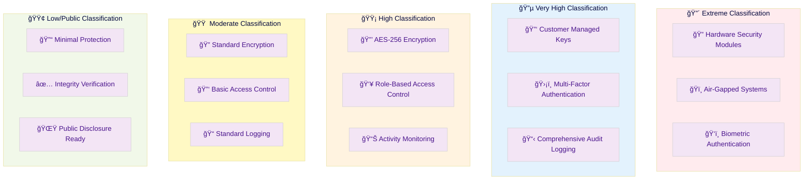
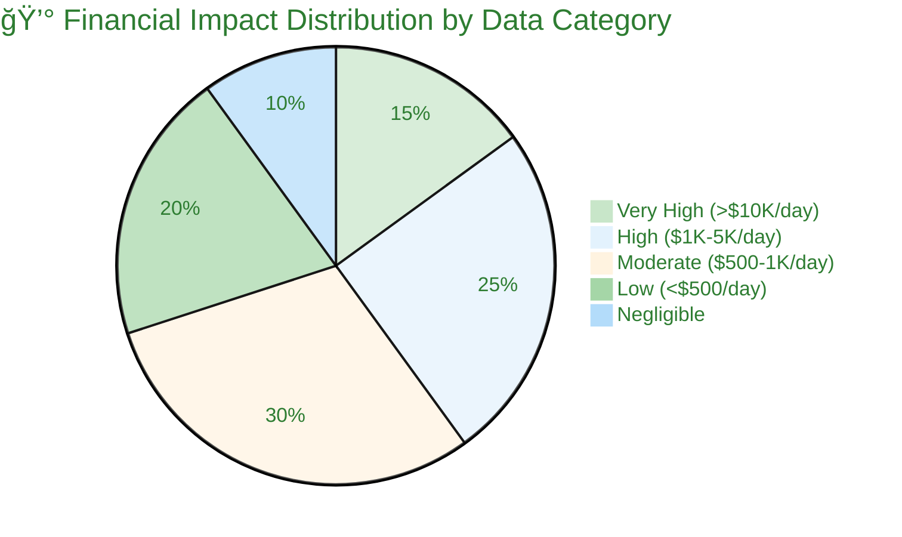
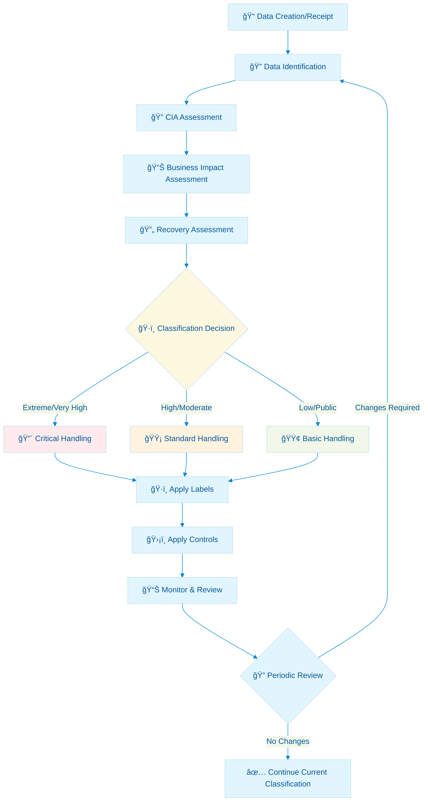
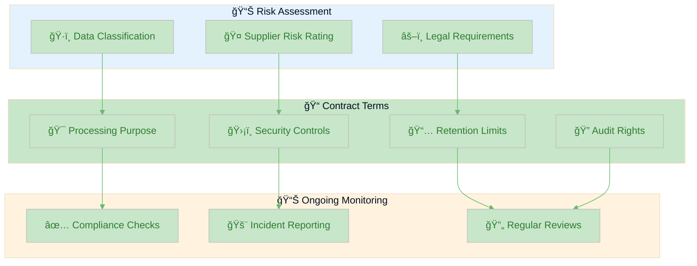

<p align="center">
  
</p>

<h1 align="center">🏷️ Hack23 AB — Data Classification Policy</h1>

<p align="center">
  <strong>🛡️ Systematic Information Handling Through Classification-Driven Protection</strong><br>
  <em>🎯 Enterprise-Grade Data Security Demonstrating Cybersecurity Excellence</em>
</p>

<p align="center">
  <a href="#"></a>
  <a href="#"></a>
  <a href="#"></a>
  <a href="#"></a>
</p>

**📋 Document Owner:** CEO | **📄 Version:** 2.2 | **📅 Last Updated:** 2025-11-05 (UTC)  
**🔄 Review Cycle:** Annual | **⏰ Next Review:** 2026-11-05

---

## 🎯 **Purpose Statement**

**🏢 Hack23 AB's** data classification policy demonstrates how **🔧 systematic information handling directly enables both security excellence and operational transparency.** Our 📊 classification-driven data protection serves as both operational necessity and 👥 client demonstration of our cybersecurity consulting methodologies.

This policy establishes comprehensive data classification and handling requirements based on our [🏷️ Classification Framework](https://github.com/Hack23/ISMS-PUBLIC/blob/main/CLASSIFICATION.md), ensuring information protection aligns with business value, regulatory obligations, and security objectives. Our 🌟 transparent approach to data classification showcases how methodical information management creates **🏆 competitive advantage** through protected innovations and **🤝 customer trust** via demonstrable privacy controls.

*— 👨‍💼 James Pether Sörling, CEO/Founder*

---

## 🔍 **Purpose & Scope**

### Purpose
This policy establishes the framework for classifying, labeling, handling, and protecting all information assets at Hack23 AB, ensuring appropriate security controls are applied based on business impact, regulatory requirements, and organizational risk appetite.

### Scope
This policy applies to:
- All information in any format (digital, physical, verbal)
- All systems documented in [💻 Asset Register](./Asset_Register.md)
- All data processed by applications and services
- All information shared with third parties per [🤝 Third Party Management](./Third_Party_Management.md)
- All employees, contractors, and authorized users

### Framework Integration
This policy implements the comprehensive classification methodology defined in [🏷️ Classification Framework](https://github.com/Hack23/ISMS-PUBLIC/blob/main/CLASSIFICATION.md), covering:
- **CIA Triad Assessment:** Confidentiality, Integrity, and Availability requirements
- **Business Impact Analysis:** Financial, operational, reputational, and regulatory impact
- **RTO/RPO Classifications:** Recovery time and recovery point objectives
- **Risk Classifications:** Systematic risk level determination

---

## 🏗️ **Data Classification Framework Architecture**

### 📊 **Classification Methodology Integration**

Our data classification directly implements the [🏷️ Classification Framework](https://github.com/Hack23/ISMS-PUBLIC/blob/main/CLASSIFICATION.md) methodology:



### 🎯 **Data Classification Levels**

Based on [🏷️ Classification Framework](https://github.com/Hack23/ISMS-PUBLIC/blob/main/CLASSIFICATION.md) confidentiality levels:

| Classification Level | Business Justification | Example Data Types | Handling Requirements |
|---------------------|------------------------|-------------------|----------------------|
| [](https://github.com/Hack23/ISMS-PUBLIC/blob/main/CLASSIFICATION.md#confidentiality-levels) | Catastrophic damage if disclosed | HSM keys, critical authentication tokens | Hardware security modules, air-gapped systems |
| [](https://github.com/Hack23/ISMS-PUBLIC/blob/main/CLASSIFICATION.md#confidentiality-levels) | Severe business impact | Financial data, customer PII, security configurations | AES-256 + CMK, strict access control, audit logging |
| [](https://github.com/Hack23/ISMS-PUBLIC/blob/main/CLASSIFICATION.md#confidentiality-levels) | Significant business impact | Source code, business plans, internal communications | AES-256 encryption, role-based access, monitoring |
| [](https://github.com/Hack23/ISMS-PUBLIC/blob/main/CLASSIFICATION.md#confidentiality-levels) | Moderate business impact | System logs, operational metrics, vendor agreements | Standard encryption, basic access control |
| [](https://github.com/Hack23/ISMS-PUBLIC/blob/main/CLASSIFICATION.md#confidentiality-levels) | Minor business impact | Public documentation drafts, general communications | Basic protection, standard access |
| [](https://github.com/Hack23/ISMS-PUBLIC/blob/main/CLASSIFICATION.md#confidentiality-levels) | No confidentiality requirement | Marketing materials, public policies, open source code | Public disclosure appropriate, integrity protection |

---

## 🔐 **CIA Triad Implementation**

### 🔒 **Confidentiality Requirements**

Implementation of confidentiality controls per [🏷️ Classification Framework](https://github.com/Hack23/ISMS-PUBLIC/blob/main/CLASSIFICATION.md):



#### **Confidentiality Control Matrix**

| Classification | Access Control | Encryption | Authentication | Monitoring | Retention |
|---------------|---------------|------------|----------------|------------|-----------|
| **Extreme** | Need-to-know only, hardware tokens | HSM-based, quantum-resistant prep | Hardware MFA + biometrics | Real-time alerts, tamper detection | Secure destruction, legal hold |
| **Very High** | Strict RBAC, manager approval | AES-256 + CMK, key rotation | Hardware MFA required | Comprehensive logging, SIEM alerts | Encrypted archives, compliance retention |
| **High** | Role-based, documented justification | AES-256, managed keys | MFA required | Activity monitoring, periodic review | Standard retention, secure deletion |
| **Moderate** | Group-based, supervisor approval | Standard encryption | Platform authentication | Basic monitoring, log retention | Business retention, standard deletion |
| **Low** | General access, self-service | Minimal encryption | Standard authentication | Minimal monitoring | Standard retention |
| **Public** | Open access appropriate | Integrity protection only | No authentication required | Optional logging |

### ✅ **Integrity Requirements**

Data integrity controls aligned with [🏷️ Classification Framework](https://github.com/Hack23/ISMS-PUBLIC/blob/main/CLASSIFICATION.md):

#### **Integrity Level Matrix**

| Integrity Level | Control Requirements | Implementation | Validation Frequency |
|-----------------|---------------------|----------------|---------------------|
| [](https://github.com/Hack23/ISMS-PUBLIC/blob/main/CLASSIFICATION.md) | Immutable storage, digital signatures, real-time validation | Blockchain/tamper-evident systems | Continuous |
| [](https://github.com/Hack23/ISMS-PUBLIC/blob/main/CLASSIFICATION.md) | Checksums, version control, audit trails | Database constraints, change logging | Daily |
| [](https://github.com/Hack23/ISMS-PUBLIC/blob/main/CLASSIFICATION.md) | Basic validation, backup verification | File integrity monitoring | Weekly |
| [](https://github.com/Hack23/ISMS-PUBLIC/blob/main/CLASSIFICATION.md) | Standard backup, basic validation | Standard file systems | Monthly |

### ⚡ **Availability Requirements**

Availability controls per [🏷️ Classification Framework](https://github.com/Hack23/ISMS-PUBLIC/blob/main/CLASSIFICATION.md):

#### **Availability Level Implementation**

| Availability Level | Uptime Target | Architecture | Backup Strategy | Recovery Testing |
|-------------------|---------------|--------------|----------------|------------------|
| [](https://github.com/Hack23/ISMS-PUBLIC/blob/main/CLASSIFICATION.md) | 99.99%+ | Multi-region, active-active | Real-time replication | Monthly |
| [](https://github.com/Hack23/ISMS-PUBLIC/blob/main/CLASSIFICATION.md) | 99.9% | Multi-AZ, load balanced | Hourly backups | Quarterly |
| [](https://github.com/Hack23/ISMS-PUBLIC/blob/main/CLASSIFICATION.md) | 99.5% | Standard redundancy | Daily backups | Semi-annual |
| [](https://github.com/Hack23/ISMS-PUBLIC/blob/main/CLASSIFICATION.md) | 99% | Basic deployment | Weekly backups | Annual |
| [](https://github.com/Hack23/ISMS-PUBLIC/blob/main/CLASSIFICATION.md) | Best effort | Single instance | Manual backups | As needed |

---

## 📊 **Business Impact-Driven Classification**

### 💰 **Financial Impact Classifications**

Based on [🏷️ Classification Framework](https://github.com/Hack23/ISMS-PUBLIC/blob/main/CLASSIFICATION.md#financial-impact-levels):



#### **Financial Impact Control Requirements**

| Impact Level | Example Data Types | Protection Requirements | Incident Response |
|-------------|-------------------|------------------------|-------------------|
| [-darkred?style=flat-square)](https://github.com/Hack23/ISMS-PUBLIC/blob/main/CLASSIFICATION.md#financial-impact-levels) | Banking credentials, payment processing data | HSM encryption, real-time monitoring | Immediate escalation, executive notification |
| [-orange?style=flat-square)](https://github.com/Hack23/ISMS-PUBLIC/blob/main/CLASSIFICATION.md#financial-impact-levels) | Customer financial data, accounting records | Strong encryption, audit logging | <15 min response, stakeholder notification |
| [-yellow?style=flat-square)](https://github.com/Hack23/ISMS-PUBLIC/blob/main/CLASSIFICATION.md#financial-impact-levels) | Vendor contracts, pricing information | Standard encryption, access control | <1 hour response, management notification |
| [-lightgreen?style=flat-square)](https://github.com/Hack23/ISMS-PUBLIC/blob/main/CLASSIFICATION.md#financial-impact-levels) | General business correspondence | Basic protection | <4 hour response |
| [](https://github.com/Hack23/ISMS-PUBLIC/blob/main/CLASSIFICATION.md#financial-impact-levels) | Public information, marketing materials | Integrity protection only | Standard process |

### ⚙️ **Operational Impact Classifications**

Implementation per [🏷️ Classification Framework](https://github.com/Hack23/ISMS-PUBLIC/blob/main/CLASSIFICATION.md#operational-impact-levels):

#### **Operational Impact Control Matrix**

| Impact Level | Service Disruption | Data Requirements | Recovery Priority |
|-------------|-------------------|-------------------|-------------------|
| [-red?style=flat-square)](https://github.com/Hack23/ISMS-PUBLIC/blob/main/CLASSIFICATION.md#operational-impact-levels) | Complete service failure | Mission-critical systems data | Immediate recovery, all resources |
| [-orange?style=flat-square)](https://github.com/Hack23/ISMS-PUBLIC/blob/main/CLASSIFICATION.md#operational-impact-levels) | Significant functionality loss | Core business process data | High priority, dedicated resources |
| [-yellow?style=flat-square)](https://github.com/Hack23/ISMS-PUBLIC/blob/main/CLASSIFICATION.md#operational-impact-levels) | Limited functionality impact | Supporting system data | Standard priority, available resources |
| [-lightgreen?style=flat-square)](https://github.com/Hack23/ISMS-PUBLIC/blob/main/CLASSIFICATION.md#operational-impact-levels) | Minor inconvenience | Non-essential system data | Low priority, scheduled recovery |
| [](https://github.com/Hack23/ISMS-PUBLIC/blob/main/CLASSIFICATION.md#operational-impact-levels) | No operational effect | Archive/reference data | Best effort recovery |

### 🤝 **Reputational Impact Classifications**

Reputational protection per [🏷️ Classification Framework](https://github.com/Hack23/ISMS-PUBLIC/blob/main/CLASSIFICATION.md#reputational-impact-levels):

#### **Reputational Impact Response Matrix**

| Impact Level | Exposure Risk | Communication Requirements | Media Response |
|-------------|---------------|---------------------------|----------------|
| [-red?style=flat-square)](https://github.com/Hack23/ISMS-PUBLIC/blob/main/CLASSIFICATION.md#reputational-impact-levels) | Global media attention | Executive spokesperson, PR firm | Proactive media strategy |
| [-orange?style=flat-square)](https://github.com/Hack23/ISMS-PUBLIC/blob/main/CLASSIFICATION.md#reputational-impact-levels) | National news coverage | Official statement, customer notification | Reactive media response |
| [-yellow?style=flat-square)](https://github.com/Hack23/ISMS-PUBLIC/blob/main/CLASSIFICATION.md#reputational-impact-levels) | Industry publication coverage | Stakeholder communication | Industry engagement |
| [-lightgreen?style=flat-square)](https://github.com/Hack23/ISMS-PUBLIC/blob/main/CLASSIFICATION.md#reputational-impact-levels) | Limited public awareness | Internal communication | Monitor discussion |
| [](https://github.com/Hack23/ISMS-PUBLIC/blob/main/CLASSIFICATION.md#reputational-impact-levels) | No reputational risk | Standard processes | No special action |

### ⚖️ **Regulatory Impact Classifications**

Compliance requirements per [🏷️ Classification Framework](https://github.com/Hack23/ISMS-PUBLIC/blob/main/CLASSIFICATION.md#regulatory-impact-levels):

#### **Regulatory Impact Compliance Matrix**

| Impact Level | Legal Consequences | Compliance Actions | Reporting Requirements |
|-------------|-------------------|-------------------|----------------------|
| [-red?style=flat-square)](https://github.com/Hack23/ISMS-PUBLIC/blob/main/CLASSIFICATION.md#regulatory-impact-levels) | Criminal prosecution risk | Legal counsel, immediate remediation | Mandatory breach notification, regulatory reporting |
| [-orange?style=flat-square)](https://github.com/Hack23/ISMS-PUBLIC/blob/main/CLASSIFICATION.md#regulatory-impact-levels) | Significant financial penalties | Compliance review, process improvement | Formal reporting, corrective action plans |
| [-yellow?style=flat-square)](https://github.com/Hack23/ISMS-PUBLIC/blob/main/CLASSIFICATION.md#regulatory-impact-levels) | Administrative penalties | Policy review, staff training | Standard reporting, documentation |
| [-lightgreen?style=flat-square)](https://github.com/Hack23/ISMS-PUBLIC/blob/main/CLASSIFICATION.md#regulatory-impact-levels) | Warning notices | Process documentation | Routine compliance checks |
| [](https://github.com/Hack23/ISMS-PUBLIC/blob/main/CLASSIFICATION.md#regulatory-impact-levels) | No regulatory implications | Standard processes | No special requirements |

---

## 🔄 **Recovery Time and Point Objectives**

### ⏰ **RTO Classifications Implementation**

Based on [🏷️ Classification Framework](https://github.com/Hack23/ISMS-PUBLIC/blob/main/CLASSIFICATION.md#rto-classifications):


#### **RTO Implementation Requirements**

| RTO Classification | Technical Architecture | Staffing | Testing Frequency |
|-------------------|------------------------|----------|-------------------|
| [](https://github.com/Hack23/ISMS-PUBLIC/blob/main/CLASSIFICATION.md#rto-classifications) | Active-active, automatic failover | 24/7 on-call | Weekly |
| [](https://github.com/Hack23/ISMS-PUBLIC/blob/main/CLASSIFICATION.md#rto-classifications) | Hot standby, rapid activation | On-call response | Monthly |
| [](https://github.com/Hack23/ISMS-PUBLIC/blob/main/CLASSIFICATION.md#rto-classifications) | Warm standby, documented procedures | Business hours response | Quarterly |
| [](https://github.com/Hack23/ISMS-PUBLIC/blob/main/CLASSIFICATION.md#rto-classifications) | Cold backup, standard recovery | Standard business processes | Semi-annual |
| [](https://github.com/Hack23/ISMS-PUBLIC/blob/main/CLASSIFICATION.md#rto-classifications) | Backup restoration, planned recovery | Scheduled maintenance | Annual |
| [](https://github.com/Hack23/ISMS-PUBLIC/blob/main/CLASSIFICATION.md#rto-classifications) | Best effort recovery | As resources available | As needed |

### 💾 **RPO Classifications Implementation**

Based on [🏷️ Classification Framework](https://github.com/Hack23/ISMS-PUBLIC/blob/main/CLASSIFICATION.md#rpo-classifications):

#### **RPO Data Protection Matrix**

| RPO Classification | Backup Frequency | Replication Method | Validation |
|-------------------|-----------------|-------------------|------------|
| [](https://github.com/Hack23/ISMS-PUBLIC/blob/main/CLASSIFICATION.md#rpo-classifications) | Synchronous replication | Real-time mirroring | Continuous |
| [](https://github.com/Hack23/ISMS-PUBLIC/blob/main/CLASSIFICATION.md#rpo-classifications) | Every 15 minutes | Asynchronous replication | Real-time monitoring |
| [](https://github.com/Hack23/ISMS-PUBLIC/blob/main/CLASSIFICATION.md#rpo-classifications) | Every hour | Log shipping | Hourly validation |
| [](https://github.com/Hack23/ISMS-PUBLIC/blob/main/CLASSIFICATION.md#rpo-classifications) | Daily snapshots | Scheduled backups | Daily verification |
| [](https://github.com/Hack23/ISMS-PUBLIC/blob/main/CLASSIFICATION.md#rpo-classifications) | Weekly/monthly | Archive backups | Periodic testing |

---

## 🛡️ **Data Handling Procedures**

### 📋 **Classification Process Workflow**



### 🏷️ **Labeling Standards**

#### **Digital Data Labeling**
All digital files and databases must include classification metadata:

```yaml
Classification_Metadata:
  confidentiality: "Very High"
  integrity: "High" 
  availability: "Mission Critical"
  financial_impact: "High"
  operational_impact: "Critical"
  reputational_impact: "Moderate"
  regulatory_impact: "High"
  rto: "Critical"
  rpo: "Near Real-time"
  owner: "James Pether Sörling"
  classification_date: "2025-08-31"
  review_date: "2026-08-31"
  retention_period: "7 years"
  legal_hold: false
```

#### **Physical Document Labeling**
Physical documents require clear classification markings:

| Classification | Header/Footer Marking | Color Code | Handling Instructions |
|---------------|----------------------|------------|----------------------|
| **Extreme** | `EXTREME - HSM ONLY` | Black | Hardware security required |
| **Very High** | `VERY HIGH CONFIDENTIAL` | Dark Blue | Restricted access, MFA required |
| **High** | `HIGH CONFIDENTIAL` | Blue | Controlled access, authorization required |
| **Moderate** | `MODERATE CONFIDENTIAL` | Orange | Standard business controls |
| **Low** | `LOW CONFIDENTIAL` | Yellow | Basic protection required |
| **Public** | `PUBLIC` or no marking | Green | Public disclosure appropriate |

### 📦 **Data Storage Requirements**

#### **Storage Controls by Classification**

| Classification | Storage Location | Encryption | Access Control | Backup Requirements |
|---------------|-----------------|------------|---------------|-------------------|
| **Extreme** | Air-gapped systems, HSM | Hardware encryption | Biometric + token | Real-time mirroring |
| **Very High** | Encrypted cloud storage | AES-256 + CMK | MFA + approval | Cross-region replication |
| **High** | Secure cloud storage | AES-256 | MFA required | Daily encrypted backups |
| **Moderate** | Standard cloud storage | Service encryption | RBAC | Standard backups |
| **Low** | Standard storage | Basic encryption | Group access | Weekly backups |
| **Public** | Public repositories | Integrity protection | Open access | Version control |

### 🔄 **Data Transmission Security**

#### **Transmission Controls Matrix**

| Classification | Transport Method | Encryption | Authentication | Logging |
|---------------|-----------------|------------|----------------|---------|
| **Extreme** | Secure courier, air-gapped transfer | Physical security | Chain of custody | Complete audit trail |
| **Very High** | TLS 1.3, secure channels | End-to-end encryption | Certificate + MFA | Comprehensive logging |
| **High** | TLS 1.2+, VPN | Transport encryption | Certificate authentication | Standard logging |
| **Moderate** | TLS, secure protocols | Standard encryption | Platform authentication | Basic logging |
| **Low** | Standard protocols | Basic encryption | Standard authentication | Minimal logging |
| **Public** | Any method | Integrity protection | No authentication required | Optional logging |

### 🗑️ **Data Retention and Disposal**

#### **Retention Schedule by Data Type**

| Data Category | Legal Requirement | Business Need | Total Retention | Disposal Method |
|---------------|------------------|---------------|----------------|----------------|
| **Financial Records** | 7 years (Swedish law) | 7 years | 7 years | Secure deletion, certificate |
| **Customer Data** | GDPR retention limits | Business relationship + 2 years | Per GDPR | GDPR-compliant deletion |
| **Employee Records** | 3 years post-employment | 5 years | 5 years | Secure deletion |
| **Contracts** | Contract term + 7 years | Contract term + 7 years | Statute of limitations | Secure archiving |
| **Security Logs** | 1 year minimum | 3 years | 3 years | Automated purging |
| **Operational Data** | No requirement | 2 years | 2 years | Standard deletion |
| **Public Information** | No requirement | Indefinite | Indefinite | No special disposal |

#### **Secure Disposal Procedures**

```mermaid
%%{
  init: {
    'theme': 'base',
    'themeVariables': {
      'primaryColor': '#f3e5f5',
      'primaryTextColor': '#4a148c',
      'lineColor': '#9c27b0',
      'secondaryColor': '#e8f5e9',
      'tertiaryColor': '#fff9c4'
    }
  }
}%%
flowchart LR
    subgraph DIGITAL["💾 Digital Data Disposal"]
        CRYPTO[🔒 Cryptographic Erasure]
        OVERWRITE[📠Multi-Pass Overwrite]
        PHYSICAL[🔨 Physical Destruction]
    end
    
    subgraph PHYSICAL_DOC["📄 Physical Document Disposal"]
        SHRED[ğŸ—ƒï¸ Cross-Cut Shredding]
        INCINERATE[🔥 Incineration]
        PULP[â™»ï¸ Pulping]
    end
    
    subgraph VERIFICATION["✅ Disposal Verification"]
        CERTIFICATE[📜 Disposal Certificate]
        AUDIT[📋 Audit Trail]
        COMPLIANCE[âš–ï¸ Compliance Check]
    end
    
    CRYPTO --> CERTIFICATE
    OVERWRITE --> CERTIFICATE
    PHYSICAL --> CERTIFICATE
    SHRED --> AUDIT
    INCINERATE --> AUDIT
    PULP --> AUDIT
    
    CERTIFICATE --> COMPLIANCE
    AUDIT --> COMPLIANCE
    
    style DIGITAL fill:#e3f2fd
    style PHYSICAL_DOC fill:#f1f8e9
    style VERIFICATION fill:#fff3e0
```



### 📋 **Comprehensive Records Retention Matrix**

Implementation of ISO 27001 A.5.33 (Protection of records) with systematic retention management:

#### **Business Records Retention Schedule**

| Record Type | Category | Legal Basis | Business Retention | Total Retention | Storage Location | Disposal Method |
|-------------|----------|-------------|-------------------|-----------------|------------------|----------------|
| **📊 Financial Statements** | Financial | Swedish Bookkeeping Act | 7 years | 7 years | Bokio + AWS Backup | Secure deletion + certificate |
| **💰 Invoices & Receipts** | Financial | Swedish Bookkeeping Act | 7 years | 7 years | Bokio + AWS Backup | Secure deletion + certificate |
| **🏦 Bank Statements** | Financial | Swedish Bookkeeping Act | 7 years | 7 years | SEB + AWS Backup | Secure deletion |
| **📜 Tax Returns** | Tax | Swedish Tax Agency requirements | 7 years | 10 years | Bokio + AWS Backup | Secure deletion + certificate |
| **💳 Payment Records** | Financial | PCI DSS + Swedish law | 7 years | 7 years | Stripe + AWS Backup | Secure deletion |
| **📑 Contracts** | Legal | Contract terms + Swedish law | Term + 7 years | As specified | AWS S3 encrypted | Secure deletion |
| **👥 Employee Records** | HR | Swedish labor law | 3 years post-employment | 5 years | Internal systems | Secure deletion |
| **🔐 Access Logs** | Security | ISO 27001 + NIS2 | 1 year minimum | 3 years | AWS CloudTrail | Automated purging |
| **🚨 Incident Reports** | Security | ISO 27001 + NIS2 | 3 years | 5 years | Incident response system | Secure archiving |
| **📧 Email (Business)** | Communication | GDPR + business need | 2 years | 3 years | AWS WorkMail | Standard deletion |
| **📧 Email (Legal)** | Legal | Statute of limitations | 7 years | 7 years | AWS WorkMail archive | Secure deletion |
| **🔑 Credentials/Secrets** | Security | Immediate rotation policy | 90 days | 1 year (audit) | AWS Secrets Manager | Cryptographic erasure |
| **📝 Meeting Minutes** | Governance | Companies Act | Permanent | Permanent | Internal systems | N/A - permanent record |
| **🎫 Support Tickets** | Operations | Business need | 3 years | 3 years | Support system | Standard deletion |
| **📊 Compliance Evidence** | Compliance | ISO 27001 + regulatory | 3 years | 7 years | Compliance management system | Secure archiving |
| **🏗️ Architecture Docs** | Technical | Business need | Active + 2 years | 5 years | GitHub + AWS S3 | Standard deletion |
| **📚 Public Documentation** | Public | No requirement | Indefinite | Indefinite | GitHub Pages | Version control only |

#### **Privacy & GDPR-Specific Retention**

| Data Subject Category | Data Types | Legal Basis | Retention Period | Review Trigger | Disposal Action |
|----------------------|------------|-------------|------------------|---------------|----------------|
| [](https://github.com/Hack23/ISMS-PUBLIC/blob/main/CLASSIFICATION.md#privacy-levels) | Contact info, usage data | Art. 6(1)(f) Legitimate Interest | 12-24 months after last activity | Inactivity + annual review | Standard secure deletion |
| [](https://github.com/Hack23/ISMS-PUBLIC/blob/main/CLASSIFICATION.md#privacy-levels) | Employee personal data | Art. 6(1)(b) Contract | 3 years post-employment | Termination + period end | GDPR-compliant deletion + certificate |
| [](https://github.com/Hack23/ISMS-PUBLIC/blob/main/CLASSIFICATION.md#privacy-levels) | Financial data with PII | Art. 6(1)(c) Legal Obligation | 7 years (Swedish law) | Legal retention expiry | Secure deletion + audit trail |
| [](https://github.com/Hack23/ISMS-PUBLIC/blob/main/CLASSIFICATION.md#privacy-levels) | Publicly shared info | Art. 6(1)(a) Consent | Until consent withdrawn | Withdrawal request | Standard deletion |

#### **Retention Implementation Procedures**

**Automated Retention Management:**
- **AWS Backup Lifecycle Policies:** Automatic transition to cold storage and deletion
- **S3 Lifecycle Rules:** Automated expiration of temporary data
- **CloudWatch Logs Retention:** Configured per log group based on retention matrix
- **Database Backups:** Automated expiration per AWS Backup vault policies

**Manual Review Triggers:**
- **Annual Review:** Q1 review of all retention policies against legal changes
- **Regulatory Updates:** Ad-hoc review when laws change (GDPR, NIS2, CRA)
- **Incident-Driven:** Review after data breaches or audit findings
- **Business Changes:** Review when asset ownership or classification changes

**Disposal Verification:**
- **Deletion Certificates:** Generated for High+ classified data disposal
- **Audit Trail:** CloudTrail logs retain disposal actions for 3 years
- **Compliance Review:** Quarterly verification of disposal procedures

---

### 🎭 **Data Masking and Tokenization**

Implementation of ISO 27001 A.8.11 (Data masking) for production data protection in non-production environments:

#### **Data Masking Strategy**

```mermaid
%%{
  init: {
    'theme': 'base',
    'themeVariables': {
      'primaryColor': '#e8eaf6',
      'primaryTextColor': '#283593',
      'lineColor': '#5c6bc0',
      'secondaryColor': '#f1f8e9',
      'tertiaryColor': '#fff8e1'
    }
  }
}%%
flowchart TD
    PROD[🔒 Production Data<br/>Sensitive Information]
    
    subgraph MASKING["🎭 Masking Techniques"]
        STATIC[📝 Static Masking<br/>Permanent replacement]
        DYNAMIC[⚡ Dynamic Masking<br/>Runtime obfuscation]
        TOKENIZE[🔑 Tokenization<br/>Reversible substitution]
    end
    
    subgraph ENVIRONMENTS["🧪 Target Environments"]
        DEV[💻 Development<br/>Fully masked]
        TEST[🧪 Testing<br/>Format-preserved]
        STAGE[📊 Staging<br/>Realistic but fake]
        ANALYTICS[📈 Analytics<br/>Anonymized]
    end
    
    PROD --> STATIC
    PROD --> DYNAMIC
    PROD --> TOKENIZE
    
    STATIC --> DEV
    DYNAMIC --> TEST
    TOKENIZE --> STAGE
    STATIC --> ANALYTICS
    
    style PROD fill:#ffcdd2
    style MASKING fill:#e8eaf6
    style ENVIRONMENTS fill:#c8e6c9
```



#### **Masking Rules by Data Type**

| Data Type | Masking Method | Format Preservation | Example Transformation | Use Case |
|-----------|---------------|--------------------|-----------------------|----------|
| **Email Addresses** | Static + Format | Yes | user@example.com → test123@example.com | Development/Testing |
| **Names** | Dictionary Replacement | No | "John Smith" → "Jane Wilson" | Realistic test data |
| **Phone Numbers** | Randomization + Format | Yes | +46701234567 → +46709876543 | Format validation testing |
| **Credit Cards** | Tokenization | Yes (Luhn-valid) | 4532-1234-5678-9010 → 4532-****-****-TEST | Payment testing |
| **Swedish Personal Numbers** | Format-preserved random | Yes | 19850315-1234 → 19900101-0000 | Identity validation |
| **IP Addresses** | Subnet preservation | Partial | 192.168.1.100 → 192.168.255.XXX | Network testing |
| **Financial Amounts** | Range-preserved random | Yes | 12,345.67 SEK → Random 1,000-99,999 | Financial calculations |
| **Addresses** | Dictionary replacement | No | Real address → Fake but valid address | Shipping logic testing |
| **Passwords/Secrets** | Never copied | N/A | Excluded from non-prod | Security compliance |

#### **Data Masking Implementation Matrix**

| Environment | Classification Allowed | Masking Required | Tokenization Allowed | Real Data Prohibition |
|-------------|----------------------|------------------|---------------------|----------------------|
| **🔒 Production** | All levels | No (real data) | Yes (for PCI DSS) | N/A - real data |
| **📊 Staging** | Up to Moderate | Yes for High+ | Yes | Prohibited: Very High, Extreme |
| **🧪 Testing** | Up to Low | Yes for Moderate+ | No | Prohibited: High, Very High, Extreme |
| **💻 Development** | Public only | Yes for all | No | Prohibited: All classified data |
| **📈 Analytics** | Anonymized only | Yes (irreversible) | No | Prohibited: All PII |

#### **Masking Techniques Standards**

**🔐 Static Data Masking (SDM):**
- **Purpose:** Create realistic but non-sensitive test datasets
- **Implementation:** Pre-processing before environment deployment
- **Tools:** Custom masking scripts + AWS Data Pipeline
- **Verification:** Automated scanning for PII patterns post-masking
- **Use Cases:** Development environments, training databases

**⚡ Dynamic Data Masking (DDM):**
- **Purpose:** Real-time data obfuscation based on user role
- **Implementation:** Database view-layer masking
- **Tools:** RDS row-level security + application middleware
- **Verification:** Access control testing + role validation
- **Use Cases:** Production data access for non-privileged users

**🔑 Tokenization:**
- **Purpose:** Reversible data protection for operational needs
- **Implementation:** AWS Secrets Manager for token vault
- **Tools:** Custom tokenization service + audit logging
- **Verification:** Token-to-data mapping validation
- **Use Cases:** Payment processing, temporary data sharing

#### **Test Data Generation Standards**

Per ISO 27001 A.8.33 (Test information), production data MUST NOT be used in non-production environments:

| Test Data Type | Generation Method | Characteristics | Compliance |
|----------------|------------------|----------------|------------|
| **Synthetic Data** | Algorithmically generated | Statistically similar, no real PII | ✅ Preferred |
| **Anonymized Data** | Irreversible PII removal | Real patterns, no identifiable info | ✅ Acceptable |
| **Masked Data** | Substitution with fake values | Format-preserved, fake content | ✅ Acceptable |
| **Scrambled Data** | Randomized real data | Real patterns, shuffled relationships | ⚠️ Risk assessment required |
| **Production Copy** | Direct copy of real data | Real PII and sensitive data | ❌ Prohibited |

#### **Data Masking Governance**

**Review and Approval:**
- **Masking Rule Changes:** Security team approval required
- **New Data Types:** Classification assessment before masking rules created
- **Tokenization Keys:** CEO approval for token vault access
- **Test Data Refresh:** Quarterly review of test dataset currency

**Monitoring and Compliance:**
- **PII Scanning:** Weekly automated scans of non-production environments
- **Access Auditing:** Quarterly review of data access patterns
- **Breach Detection:** Real-time alerts for unmasked PII in non-production
- **Training:** Annual data masking training for developers

**Integration with Other Controls:**
- **Secure Development Policy:** Test data handling requirements (§ Protection of Test Data)
- **Access Control Policy:** Role-based data access including masked views
- **Change Management:** Masking rule changes via standard change process
- **Incident Response:** Unmasked PII in non-production triggers security incident

---

## 🔍 **Data Loss Prevention (DLP)**

### 🛡️ **DLP Strategy Implementation**

#### **Content Discovery and Classification**
Automated tools and processes for identifying and classifying sensitive data:

| Detection Method | Scope | Classification Trigger | Response |
|-----------------|-------|----------------------|----------|
| **Pattern Matching** | Email, documents, databases | PII, financial data, credentials | Auto-classification, alert |
| **ML Classification** | Unstructured content | Sensitive context | Risk scoring, review |
| **Database Scanning** | Structured data | Column patterns, data types | Schema classification |
| **Network Monitoring** | Data in transit | Transmission patterns | Real-time blocking |

#### **DLP Control Matrix**

| Data Type | Detection Method | Prevention Action | Notification |
|-----------|-----------------|-------------------|--------------|
| **Credit Cards** | Luhn algorithm + patterns | Block transmission | Immediate alert |
| **Personal Data** | PII patterns + context | Encrypt/quarantine | Compliance team |
| **Financial Data** | Account patterns + context | Access control | Security team |
| **Source Code** | Syntax detection | Repository control | Development team |
| **Credentials** | Secret scanning | Immediate revocation | Security incident |

### 📊 **DLP Monitoring and Metrics**

#### **Key Performance Indicators**

| Metric | Target | Measurement | Review Frequency |
|--------|--------|-------------|------------------|
| **False Positive Rate** | <5% | DLP alerts vs. confirmed incidents | Weekly |
| **Detection Coverage** | 95% | Sensitive data identified | Monthly |
| **Response Time** | <15 minutes | Alert to action | Daily |
| **Policy Compliance** | 98% | Successful policy enforcement | Monthly |
| **User Training Effectiveness** | <2% repeat violations | Incident recurrence rate | Quarterly |

---

## 🤝 **Third-Party Data Sharing**

### 📋 **Data Sharing Framework**

Based on [🤝 Third Party Management](./Third_Party_Management.md) classifications:

#### **Supplier Data Sharing Matrix**

| Supplier Risk Tier | Data Classification Allowed | Contract Requirements | Monitoring Level |
|--------------------|---------------------------|----------------------|------------------|
| **🔴 Critical Suppliers** | Up to Very High | Comprehensive DPA, audit rights | Real-time monitoring |
| **🟠 High Risk Suppliers** | Up to High | Standard DPA, compliance verification | Daily monitoring |
| **🟡 Medium Risk Suppliers** | Up to Moderate | Basic agreement, attestation | Weekly monitoring |
| **🟢 Low Risk Suppliers** | Public + Low only | Standard terms | Monthly review |

#### **Data Processing Agreement (DPA) Requirements**



### 🌍 **Cross-Border Data Transfers**

#### **International Transfer Framework**

| Destination | Legal Basis | Additional Safeguards | Approval Required |
|-------------|-------------|---------------------|-------------------|
| **🇪🇺 EU/EEA** | Adequacy decision | Standard contractual clauses | Standard process |
| **🇺🇸 USA** | Adequacy framework | Data Privacy Framework compliance | Enhanced due diligence |
| **🇨🇦 Canada** | Adequacy decision | Standard contractual clauses | Standard process |
| **Other Countries** | Standard contractual clauses | Additional security measures | Executive approval |

---

## 🏷️ **Privacy & GDPR Compliance**

### 🔒 **Privacy Data Classification**

All personal data is classified using the comprehensive [🏷️ Privacy Levels](https://github.com/Hack23/ISMS-PUBLIC/blob/main/CLASSIFICATION.md#privacy-levels) framework, ensuring appropriate protection measures and GDPR compliance.

```mermaid
%%{
  init: {
    'theme': 'base',
    'themeVariables': {
      'primaryColor': '#ffebee',
      'primaryTextColor': '#c62828',
      'lineColor': '#ef5350',
      'secondaryColor': '#e8f5e9',
      'tertiaryColor': '#fff3e0'
    }
  }
}%%
flowchart TD
    START[📊 Data Received/Created] --> IDENTIFY[🔍 Identify Data Type]
    
    IDENTIFY --> GDPR_CHECK{🇪🇺 Contains Personal Data?}
    
    GDPR_CHECK -->|❌ No| NON_PERSONAL[🟢 Non-Personal Data<br/>Privacy: NA]
    GDPR_CHECK -->|✅ Yes| PERSONAL_CHECK{👤 Type of Personal Data?}
    
    PERSONAL_CHECK --> SPECIAL{🚨 Art. 9 Special Category?}
    PERSONAL_CHECK --> IDENTIFIER{🆔 Direct Identifier?}
    PERSONAL_CHECK --> BEHAVIORAL{📊 Behavioral/Preference?}
    
    SPECIAL -->|✅ Yes| SPECIAL_CAT[🔴 Special Category Data<br/>Health, Biometric, etc.]
    IDENTIFIER -->|✅ Yes| PERS_ID[🔴 Personal Identifier<br/>Name, Email, SSN, IP]
    BEHAVIORAL -->|✅ Yes| PERSONAL[🟠 Personal Data<br/>Activity, Preferences]
    
    SPECIAL_CAT --> PROTECT_SPECIAL[🛡️ Highest Protection<br/>Explicit Consent + Legal Basis]
    PERS_ID --> PROTECT_HIGH[🛡️ High Protection<br/>Encryption, Access Control]
    PERSONAL --> PROTECT_STANDARD[🛡️ Standard Protection<br/>GDPR Compliance]
    
    IDENTIFY --> PSEUDO_CHECK{🎭 Can Pseudonymize?}
    PSEUDO_CHECK -->|✅ Yes| PSEUDO[🟡 Pseudonymized Data<br/>Key Separation]
    PSEUDO_CHECK -->|❌ Keep Anonymous| ANON[🟢 Anonymized Data<br/>Aggregated/Statistical]
    
    classDef startStyle fill:#1565C0,stroke:#0D47A1,color:#fff
    classDef decisionStyle fill:#FF9800,stroke:#F57C00,color:#fff
    classDef criticalStyle fill:#D32F2F,stroke:#B71C1C,color:#fff
    classDef highStyle fill:#FF5722,stroke:#D84315,color:#fff
    classDef standardStyle fill:#FF9800,stroke:#F57C00,color:#fff
    classDef lowStyle fill:#FFC107,stroke:#FFA000,color:#000
    classDef safeStyle fill:#4CAF50,stroke:#388E3C,color:#fff
    
    class START startStyle
    class GDPR_CHECK,PERSONAL_CHECK,SPECIAL,IDENTIFIER,BEHAVIORAL,PSEUDO_CHECK decisionStyle
    class SPECIAL_CAT criticalStyle
    class PERS_ID highStyle
    class PERSONAL standardStyle
    class PSEUDO lowStyle
    class ANON,NON_PERSONAL safeStyle
```



### 📋 **Privacy Classification Matrix**

| Privacy Level | GDPR Article | Data Examples | Protection Requirements | Data Subject Rights |
|---------------|-------------|---------------|------------------------|-------------------|
| [](https://github.com/Hack23/ISMS-PUBLIC/blob/main/CLASSIFICATION.md#privacy-levels) | Art. 9 | Health data, biometric, genetic, racial origin, political opinions, religious beliefs | Explicit consent + Art. 9(2) legal basis, enhanced encryption, audit all access | Full rights + special protections |
| [](https://github.com/Hack23/ISMS-PUBLIC/blob/main/CLASSIFICATION.md#privacy-levels) | Art. 4(1) | Name, email, SSN, IP address, device ID, biometric identifiers | AES-256 encryption, MFA access, comprehensive audit logging | Full GDPR rights (Art. 15-22) |
| [](https://github.com/Hack23/ISMS-PUBLIC/blob/main/CLASSIFICATION.md#privacy-levels) | Art. 4(1) | User preferences, activity logs, location history, contacts | Standard encryption, RBAC, access logging | Full GDPR rights (Art. 15-22) |
| [](https://github.com/Hack23/ISMS-PUBLIC/blob/main/CLASSIFICATION.md#privacy-levels) | Art. 4(5) | Hashed user IDs, tokenized data with key separation | Key isolation, standard encryption | Limited rights (re-identification possible) |
| [](https://github.com/Hack23/ISMS-PUBLIC/blob/main/CLASSIFICATION.md#privacy-levels) | Outside GDPR | Aggregated statistics, anonymized analytics | Integrity protection, access control | No GDPR rights (not personal data) |
| [](https://github.com/Hack23/ISMS-PUBLIC/blob/main/CLASSIFICATION.md#privacy-levels) | N/A | Public information, system configuration, non-personal metadata | Standard information security controls | No GDPR rights (not personal data) |

### 🇪🇺 **GDPR Principles Integration**

Implementation of GDPR Article 5 principles through data classification:

| GDPR Principle (Art. 5) | Classification Implementation | Validation Method |
|------------------------|------------------------------|------------------|
| **Lawfulness, Fairness, Transparency** | Legal basis documented in [🔐 Privacy Policy](./Privacy_Policy.md) | Privacy notices, consent records |
| **Purpose Limitation** | Processing purposes defined per classification | Purpose-to-classification mapping |
| **Data Minimization** | Only collect data matching classification requirements | Regular data audits |
| **Accuracy** | Rectification procedures per privacy level | Data quality metrics |
| **Storage Limitation** | Retention periods per classification level (see below) | Automated deletion workflows |
| **Integrity & Confidentiality** | Security controls per privacy classification | Security assessments, penetration testing |
| **Accountability** | Classification audit trail, DPIA for High+ | Compliance audits, documentation reviews |

### ⏱️ **Privacy-Based Retention Schedule**

| Privacy Level | Retention Period | Legal Basis | Deletion Method |
|---------------|-----------------|-------------|-----------------|
| [](https://github.com/Hack23/ISMS-PUBLIC/blob/main/CLASSIFICATION.md#privacy-levels) | Purpose limited + 0 days | Art. 9(2) specific basis | Cryptographic erasure + secure wipe |
| [](https://github.com/Hack23/ISMS-PUBLIC/blob/main/CLASSIFICATION.md#privacy-levels) | Contract + 2 years OR Legal obligation (7 years for financial) | Art. 6(1)(b) or 6(1)(c) | Cryptographic erasure + backup purge |
| [](https://github.com/Hack23/ISMS-PUBLIC/blob/main/CLASSIFICATION.md#privacy-levels) | 12-24 months after last activity | Art. 6(1)(f) Legitimate Interest | Standard secure deletion |
| [](https://github.com/Hack23/ISMS-PUBLIC/blob/main/CLASSIFICATION.md#privacy-levels) | 12-14 months (analytics) | Art. 6(1)(f) Legitimate Interest | Key deletion + data retention |
| [](https://github.com/Hack23/ISMS-PUBLIC/blob/main/CLASSIFICATION.md#privacy-levels) | Indefinite (no longer personal data) | N/A (outside GDPR) | Standard deletion when no longer needed |

### 🛡️ **Data Subject Rights Implementation**

Rights enforcement procedures per privacy classification:

```mermaid
%%{
  init: {
    'theme': 'base',
    'themeVariables': {
      'primaryColor': '#e3f2fd',
      'primaryTextColor': '#01579b',
      'lineColor': '#0288d1'
    }
  }
}%%
flowchart LR
    REQUEST[📧 Data Subject Request] --> VERIFY[🔍 Identity Verification]
    
    VERIFY --> CLASSIFY{🏷️ Data Classification?}
    
    CLASSIFY -->|🔴 Special/Identifier| PRIORITY[⚡ High Priority<br/>15 day target]
    CLASSIFY -->|🟠 Personal| STANDARD[📅 Standard Process<br/>30 day target]
    CLASSIFY -->|🟡 Pseudonymized| COMPLEX[🔍 Re-identification Check<br/>30-60 day target]
    
    PRIORITY --> FULFILL[✅ Fulfill Request]
    STANDARD --> FULFILL
    COMPLEX --> FULFILL
    
    FULFILL --> ACCESS{📋 Request Type?}
    
    ACCESS -->|📥 Access| EXPORT[📦 Data Export]
    ACCESS -->|✏️ Rectification| UPDATE[🔄 Data Update]
    ACCESS -->|🗑️ Erasure| DELETE[❌ Data Deletion]
    ACCESS -->|⏸️ Restriction| RESTRICT[🔒 Processing Restriction]
    ACCESS -->|📤 Portability| PORT[📊 Machine-Readable Export]
    ACCESS -->|❌ Object| STOP[🛑 Stop Processing]
    
    EXPORT --> RESPOND[📧 Response to Data Subject]
    UPDATE --> RESPOND
    DELETE --> RESPOND
    RESTRICT --> RESPOND
    PORT --> RESPOND
    STOP --> RESPOND
    
    classDef requestStyle fill:#1565C0,stroke:#0D47A1,color:#fff
    classDef verifyStyle fill:#FF9800,stroke:#F57C00,color:#fff
    classDef priorityStyle fill:#D32F2F,stroke:#B71C1C,color:#fff
    classDef standardStyle fill:#FFC107,stroke:#FFA000,color:#000
    classDef actionStyle fill:#4CAF50,stroke:#388E3C,color:#fff
    classDef respondStyle fill:#2196F3,stroke:#1976D2,color:#fff
    
    class REQUEST requestStyle
    class VERIFY,CLASSIFY,ACCESS verifyStyle
    class PRIORITY priorityStyle
    class STANDARD,COMPLEX standardStyle
    class FULFILL actionStyle
    class EXPORT,UPDATE,DELETE,RESTRICT,PORT,STOP,RESPOND respondStyle
```



| GDPR Right | Privacy Levels Applicable | Response Time | Implementation |
|-----------|-------------------------|---------------|----------------|
| **Right to Access (Art. 15)** | All (except NA) | 30 days | Automated data export, manual compilation for complex requests |
| **Right to Rectification (Art. 16)** | Personal Identifier, Personal | 30 days | Self-service updates + admin verification for identifiers |
| **Right to Erasure (Art. 17)** | All (except legal obligation) | 30 days | Cryptographic erasure, cascade deletion, backup purge |
| **Right to Restriction (Art. 18)** | All | 30 days | Processing flag, access restriction, retention-only mode |
| **Right to Data Portability (Art. 20)** | Personal Identifier, Personal | 30 days | JSON/CSV export, structured format, machine-readable |
| **Right to Object (Art. 21)** | Legitimate Interest basis | Immediate for marketing | Opt-out mechanism, processing cessation |

### 🔍 **Data Protection Impact Assessment (DPIA)**

DPIA required per GDPR Article 35 for:

| Trigger Condition | Privacy Classification | When Required | Review Frequency |
|------------------|----------------------|---------------|------------------|
| **High risk to rights and freedoms** | Special Category data processing | Before deployment | Annual |
| **Large-scale systematic monitoring** | Personal Identifier tracking at scale | New feature/service | Annual |
| **Automated decision-making with legal effect** | Any with automated profiling | Before implementation | Per change |
| **Sensitive data processing** | Special Category + Personal Identifier combined | New processing activity | Annual |
| **Cross-border data transfers outside EU** | Personal+ outside adequate countries | Before transfer | Per transfer assessment |

**DPIA Process:**
1. 📋 Identify necessity and proportionality
2. 🔍 Assess risks to data subjects
3. 🛡️ Identify mitigation measures
4. 📊 Document findings and decisions
5. ✅ DPO review and approval
6. 📅 Ongoing monitoring and review

### 📊 **Privacy Classification Examples from Hack23 Projects**

Based on the SQL comment classification system used in CIA project:

| Data Element | Classification | SQL Comment Example | Rationale |
|--------------|----------------|---------------------|-----------|
| **Public parliamentary data** | [](https://github.com/Hack23/ISMS-PUBLIC/blob/main/CLASSIFICATION.md#privacy-levels) | `COMMENT ON COLUMN document_data.title IS 'DATA.Public GDPR.NA'` | Public government information, not personal data |
| **Politician assignments** | [](https://github.com/Hack23/ISMS-PUBLIC/blob/main/CLASSIFICATION.md#privacy-levels) | `COMMENT ON COLUMN assignment_data.intressent_id IS 'DATA.Public GDPR.Personal_Identifier'` | Public official information, identifiable natural person |
| **User session data** | [](https://github.com/Hack23/ISMS-PUBLIC/blob/main/CLASSIFICATION.md#privacy-levels) | `COMMENT ON COLUMN application_session.ip_information IS 'DATA.Sensitive GDPR.Personal'` | User activity tracking, identifiable |
| **Application user ID** | [](https://github.com/Hack23/ISMS-PUBLIC/blob/main/CLASSIFICATION.md#privacy-levels) | `COMMENT ON COLUMN application_action_event.user_id IS 'DATA.Sensitive GDPR.Personal_Identifier'` | Direct user identifier |
| **System configuration** | [](https://github.com/Hack23/ISMS-PUBLIC/blob/main/CLASSIFICATION.md#privacy-levels) | `COMMENT ON COLUMN application_configuration.property_value IS 'DATA.Sensitive GDPR.NA'` | System metadata, not personal |

**Column Comment Format Standard:**
```sql
COMMENT ON COLUMN schema.table.column IS 'DATA.[Confidentiality] GDPR.[Privacy_Level]';

-- Examples:
-- 'DATA.Public GDPR.NA' - Public, non-personal
-- 'DATA.Sensitive GDPR.Personal' - Sensitive, personal data
-- 'DATA.Sensitive GDPR.Personal_Identifier' - Sensitive, direct identifier
```

---

## ✅ **Compliance Integration**

### ⚖️ **Regulatory Framework Alignment**

Integration with [✅ Compliance Checklist](./Compliance_Checklist.md):

#### **GDPR Compliance Matrix**

| GDPR Article | Data Classification Impact | Implementation | Validation |
|-------------|---------------------------|----------------|------------|
| **Article 5 (Principles)** | All classifications | Data minimization, purpose limitation | Quarterly review |
| **Article 25 (Data Protection by Design)** | High+ classifications | Technical/organizational measures | Architecture review |
| **Article 32 (Security)** | All classifications | Appropriate technical measures | Security assessment |
| **Article 33 (Breach Notification)** | Moderate+ classifications | 72-hour notification | Incident procedures |
| **Article 35 (DPIA)** | High risk processing | Impact assessment | Legal review |

#### **NIS2 Alignment**

| NIS2 Requirement | Data Category | Classification Threshold | Implementation |
|------------------|---------------|------------------------|----------------|
| **Risk Management** | Operational data | Moderate+ | Risk register integration |
| **Incident Reporting** | Security events | High+ | Incident response procedures |
| **Business Continuity** | Critical systems | Mission Critical availability | BCP integration |
| **Supply Chain Security** | Supplier data | Supplier risk assessment | Third-party management |

### 📋 **Audit and Evidence Management**

#### **Classification Audit Trail**

| Audit Event | Data Captured | Retention Period | Review Frequency |
|-------------|---------------|----------------|------------------|
| **Classification Assignment** | Data type, rationale, approver | 7 years | Annual |
| **Access Events** | User, timestamp, data accessed | 3 years | Monthly |
| **Reclassification** | Old/new classification, justification | 7 years | Quarterly |
| **Disposal Actions** | Date, method, verification | Permanent | Annual |
| **Incident Events** | Classification impact, response | 7 years | Per incident |

---

## 📚 **Related Documents**

- [🏷️ Classification Framework](https://github.com/Hack23/ISMS-PUBLIC/blob/main/CLASSIFICATION.md) — Comprehensive classification methodology and business impact analysis
- [🔐 Privacy Policy](./Privacy_Policy.md) — User-facing privacy notices and GDPR compliance for products
- [🔐 Information Security Policy](./Information_Security_Policy.md) — Overall security governance and data protection framework
- [🔒 Cryptography Policy](./Cryptography_Policy.md) — Encryption standards and key management for classified data
- [🔑 Access Control Policy](./Access_Control_Policy.md) — Identity management and authorization controls for data access
- [💾 Backup Recovery Policy](./Backup_Recovery_Policy.md) — Data protection and recovery procedures based on classification
- [🤝 Third Party Management](./Third_Party_Management.md) — Supplier risk management and data sharing governance
- [💻 Asset Register](./Asset_Register.md) — Information asset inventory with classification assignments
- [📉 Risk Register](./Risk_Register.md) — Data-related risk identification and treatment tracking
- [🚨 Incident Response Plan](./Incident_Response_Plan.md) — Data breach and security incident response procedures
- [✅ Compliance Checklist](./Compliance_Checklist.md) — Regulatory compliance tracking including data protection laws
- [🔄 Business Continuity Plan](./Business_Continuity_Plan.md) — Business resilience with classification-based recovery priorities
- [🛠️ Secure Development Policy](./Secure_Development_Policy.md) — Application security with data protection requirements

---

**📋 Document Control:**  
**✅ Approved by:** James Pether Sörling, CEO  
**📤 Distribution:** Public  
**🏷️ Classification:** [](https://github.com/Hack23/ISMS-PUBLIC/blob/main/CLASSIFICATION.md#confidentiality-levels)  
**📅 Effective Date:** 2025-11-05  
**⏰ Next Review:** 2026-11-05   
**🯠Framework Compliance:** [](https://github.com/Hack23/ISMS-PUBLIC/blob/main/CLASSIFICATION.md) [](https://github.com/Hack23/ISMS-PUBLIC/blob/main/CLASSIFICATION.md) [](https://github.com/Hack23/ISMS-PUBLIC/blob/main/CLASSIFICATION.md)
