<p align="center">
  
</p>

<h1 align="center">🆘 Hack23 AB — Disaster Recovery Plan</h1>

<p align="center">
  <strong>🔧 AWS-Native Technical Resilience Through Evidence-Based Recovery</strong><br>
  <em>🎯 Systematic Disaster Recovery Leveraging AWS Resilience Hub, Backup, and Fault Injection Service</em>
</p>

<p align="center">
  <a href="#"></a>
  <a href="#"></a>
  <a href="#"></a>
  <a href="#"></a>
</p>

**📋 Document Owner:** CEO | **📄 Version:** 2.1 | **📅 Last Updated:** 2025-08-31 (UTC)  
**🔄 Review Cycle:** Semi-Annual | **⏰ Next Review:** 2026-02-28

---

## 🎯 **Purpose Statement**

**🏢 Hack23 AB's** disaster recovery capabilities demonstrate how **🔧 AWS-native technical resilience directly enables both operational continuity and competitive advantage.** Our 📊 systematic disaster recovery implementation leverages AWS Resilience Hub, AWS Backup, and Fault Injection Service to provide auditable proof of recovery capabilities while serving as 👥 client demonstration of our cybersecurity consulting technical expertise.

As a cybersecurity consulting company, our technical disaster recovery implementation becomes a real-world showcase of AWS-native resilient architecture, automated chaos engineering, and evidence-based recovery validation. Our ability to demonstrate measurable recovery capabilities through continuous chaos experiments provides competitive differentiation while ensuring operational resilience.

Our commitment to transparency means our disaster recovery metrics and chaos engineering results become reference implementations, showing how proper AWS tooling enables rapid recovery with auditable evidence per our [💾 Backup Recovery Policy](./Backup_Recovery_Policy.md).

*— 👨‍💼 James Pether Sörling, CEO/Founder*

---

## 🏗️ **AWS-Native Technical Recovery Architecture**

### 🎯 AWS Resilience Hub Integration

Our disaster recovery strategy is built on AWS Resilience Hub policies that enforce measurable resilience requirements:

```mermaid
%%{
  init: {
    'theme': 'base',
    'themeVariables': {
      'primaryColor': '#ff6f00',
      'primaryTextColor': '#ffffff',
      'lineColor': '#ff8f00',
      'secondaryColor': '#e8f5e9',
      'tertiaryColor': '#e3f2fd'
    }
  }
}%%
graph TD
    subgraph RESILIENCE["🔰 AWS Resilience Hub Policy Engine"]
        POLICY[Resilience Policies<br/>📊 RTO/RPO Requirements]
        ASSESS[Application Assessment<br/>🔍 Resilience Analysis]
        GATE[Deployment Gating<br/>🚦 Compliance Validation]
        EVIDENCE[Evidence Collection<br/>📋 Audit Documentation]
    end
    
    subgraph CHAOS["🧪 AWS Fault Injection Service"]
        EXPERIMENT[Experiment Templates<br/>⚡ Chaos Scenarios]
        EXECUTE[Execution Engine<br/>🎯 Controlled Failures]
        MONITOR[Real-time Monitoring<br/>📈 Impact Assessment]
        VALIDATE[Recovery Validation<br/>✅ RTO/RPO Verification]
    end
    
    subgraph BACKUP["💾 AWS Backup Orchestration"]
        PLAN[Central Backup Plans<br/>🗓️ Schedule Management]
        VAULT[Immutable Vaults<br/>🔒 Cross-region Storage]
        RESTORE[Point-in-Time Recovery<br/>🔄 Automated Restoration]
        AUDIT[Backup Audit Manager<br/>📊 Compliance Reporting]
    end
    
    subgraph APPLICATIONS["🏗️ Application Portfolio"]
        CRITICAL[Critical Systems<br/>🔴 < 5min RTO]
        HIGH[High Priority<br/>🟠 < 1hr RTO]
        STANDARD[Standard Systems<br/>🟡 < 24hr RTO]
    end
    
    POLICY --> ASSESS
    ASSESS --> GATE
    GATE --> EVIDENCE
    
    EXPERIMENT --> EXECUTE
    EXECUTE --> MONITOR
    MONITOR --> VALIDATE
    
    PLAN --> VAULT
    VAULT --> RESTORE
    RESTORE --> AUDIT
    
    EVIDENCE --> CRITICAL
    VALIDATE --> HIGH
    AUDIT --> STANDARD
    
    style RESILIENCE fill:#ff6f00,color:#fff
    style CHAOS fill:#7c4dff,color:#fff
    style BACKUP fill:#00acc1,color:#fff
    style APPLICATIONS fill:#4caf50,color:#fff
```



### 📊 AWS Resilience Hub Policy Framework

**Policy Tiers Mapped to [Classification Framework](https://github.com/Hack23/ISMS-PUBLIC/blob/main/CLASSIFICATION.md):**

| Resilience Tier | RTO Requirement | RPO Requirement | Application Coverage | Gating Requirement | Evidence Retention |
|-----------------|-----------------|-----------------|---------------------|-------------------|-------------------|
| **🔴 Mission Critical** | [-orange?style=flat-square)](https://github.com/Hack23/ISMS-PUBLIC/blob/main/CLASSIFICATION.md#rto-classifications) | [-orange?style=flat-square)](https://github.com/Hack23/ISMS-PUBLIC/blob/main/CLASSIFICATION.md#rto-classifications) | API Gateway, Lambda, DynamoDB | 100% compliance required | 3 years |
| **🟠 High Priority** | [-yellow?style=flat-square)](https://github.com/Hack23/ISMS-PUBLIC/blob/main/CLASSIFICATION.md#rto-classifications) | [-lightgreen?style=flat-square)](https://github.com/Hack23/ISMS-PUBLIC/blob/main/CLASSIFICATION.md#rto-classifications) | RDS, S3, CloudFront | 95% compliance required | 2 years |
| **🟡 Standard** | [-lightgreen?style=flat-square)](https://github.com/Hack23/ISMS-PUBLIC/blob/main/CLASSIFICATION.md#rto-classifications) | [-lightblue?style=flat-square)](https://github.com/Hack23/ISMS-PUBLIC/blob/main/CLASSIFICATION.md#rto-classifications) | DNS, monitoring, alarms | 90% compliance required | 1 year |

**Deployment Gating Process:**
- Production releases require Resilience Hub assessment "GREEN" status
- Failed assessments automatically block deployments
- Assessment reports retained as audit evidence
- Remediation tracking integrated with [Change Management](./Change_Management.md)

---

## 🧪 **Chaos Engineering with AWS Fault Injection Service**

### 🎯 Systematic Chaos Engineering Program

**FIS Experiment Categories with SSM Automation:**

#### 🔴 Critical System Experiments (Monthly Execution)
| Experiment Template | Target Service | Failure Scenario | SSM Document | Success Criteria | Evidence Artifact |
|-------------------|----------------|-------------------|--------------|------------------|-------------------|
| **Regional Impairment** | Route 53, CloudFront | DNS resolution failure | `AWSResilienceHub-ChangeDNSWeightedRoutingPolicy_2020-07-01` | Auto-failover to backup region | Route 53 health check logs |
| **API Unavailability** | Lambda, API Gateway | 100% error rate injection | Custom SSM + IAM policy injection | Circuit breaker activation | CloudWatch metrics + FIS logs |
| **Database Disaster** | RDS, DynamoDB | Primary instance termination | `AWSConfigRemediation-DeleteDynamoDbTable` + restore | Failover to read replica | RDS event logs + restore evidence |
| **Network Partition** | VPC, subnets | Network connectivity loss | `AWSResilienceHub-SimulateNetworkConnectivitySOP_2020-04-01` | Cross-AZ redundancy | VPC Flow Logs |

#### 🟠 High Priority Experiments (Quarterly Execution)
| Experiment Template | Target Service | Failure Scenario | SSM Document | Success Criteria | Evidence Artifact |
|-------------------|----------------|-------------------|--------------|------------------|-------------------|
| **Storage Outage** | S3, EBS | Volume unavailability | `AWSResilienceHub-RestoreS3BucketFromBackupSOP_2020-04-01` | Backup volume mount | S3 access logs |
| **Compute Failure** | EC2, Lambda | Instance termination | `AWSResilienceHub-ChangeLambdaMemorySizeSOP_2020-10-26` | Auto Scaling replacement | Auto Scaling events |
| **CDN Degradation** | CloudFront | Cache invalidation | Custom CloudFront invalidation SSM | Origin server direct | CloudFront logs |
| **Monitoring Blind** | CloudWatch | Metric collection failure | `AWSResilienceHub-CreateCloudWatchAlarmSOP_2020-04-01` | Secondary alerting | SNS delivery logs |

### 🧪 FIS Experiment Execution Framework with SSM Integration

**CloudFormation Template Structure:**
```yaml
# FIS Experiment with SSM Automation Integration
FisDenyApigatewayLambdaTemplate:
  Type: AWS::FIS::ExperimentTemplate
  Properties: 
    Actions:
      InjectAccessDenied:  
        ActionId: aws:ssm:start-automation-execution
        Description: Action to deny api gateway lambda access
        Parameters:
          documentArn: !Sub 'arn:aws:ssm:${AWS::Region}:${AWS::AccountId}:document/FISAPI-IamAttachDetach'
          documentParameters: !Sub |
            {
              "TargetResourceDenyPolicyArn":"${AwsFisApiPolicyDenyApiRoleLambda}", 
              "Duration": "${FaultInjectionExperimentDuration}", 
              "TargetApplicationRoleName":"${ApiRole}", 
              "AutomationAssumeRole":"arn:aws:iam::${AWS::AccountId}:role/FISAPI-SSM-Automation-Role"
            }
          maxDuration: "PT8M"
    Description: Deny Access to lambda on API Gateway via SSM automation
    RoleArn: !Sub 'arn:aws:iam::${AWS::AccountId}:role/FISAPI-FIS-Injection-ExperimentRole'
    StopConditions:
      - Source: none
    Tags: 
      Name: DENY-API-LAMBDA
    Targets: {}
```

**SSM Automation Document for IAM Policy Injection:**
```yaml
SsmAutomationIamAttachDetachDocument:
  Type: AWS::SSM::Document
  Properties:
    Name: FISAPI-IamAttachDetach
    DocumentType: Automation
    Content:
      description: "SSM Document for Injecting Access Denied Faults by attaching Deny Policies"
      schemaVersion: '0.3'
      assumeRole: '{{ AutomationAssumeRole }}'
      parameters:
        TargetResourceDenyPolicyArn:
          type: String
          description: ARN of Deny IAM Policy for AWS Resource
        Duration:
          type: String
          description: The Duration in ISO-8601 format of the Injection
        TargetApplicationRoleName:
          type: String
          description: The name of the Target Role
        AutomationAssumeRole:
          type: String
          description: The ARN of the SSM Automation Role
      mainSteps:
        - name: AttachDenyPolicy
          action: 'aws:executeAwsApi'
          inputs:
            Service: iam
            Api: AttachRolePolicy
            RoleName: '{{TargetApplicationRoleName}}'
            PolicyArn: '{{TargetResourceDenyPolicyArn}}'
          description: Attach Deny Policy for Experiment Target
          timeoutSeconds: 10
        - name: ExperimentDurationSleep
          action: 'aws:sleep'
          inputs:
            Duration: '{{Duration}}'
          description: Maintain fault injection for specified duration
          onFailure: 'step:RollbackDetachPolicy'
          onCancel: 'step:RollbackDetachPolicy'
          nextStep: RollbackDetachPolicy
        - name: RollbackDetachPolicy
          action: 'aws:executeAwsApi'
          inputs:
            Service: iam
            Api: DetachRolePolicy
            RoleName: '{{TargetApplicationRoleName}}'
            PolicyArn: '{{TargetResourceDenyPolicyArn}}'
          description: End Experiment by Detaching Deny Policy
          timeoutSeconds: 10
          isEnd: true
```

### 📊 Chaos Engineering KPIs and Success Metrics

**FIS + SSM Integration Success Tracking:**

| Metric Category | KPI | Target | SSM Document | Evidence Collection |
|-----------------|-----|--------|--------------|-------------------|
| **Recovery Time Achievement** | RTO Compliance Rate | >95% within target | Health check validation SSM | FIS experiment logs + CloudWatch |
| **Data Loss Prevention** | RPO Compliance Rate | 100% within target | PITR/Backup restore validation | DynamoDB backup completion logs |
| **Experiment Coverage** | System Testing Rate | 100% quarterly | FIS template execution tracking | SSM execution history |
| **Evidence Completeness** | Documentation Rate | 100% retention | Automated evidence collection SSM | S3 immutable storage validation |
| **Failure Detection** | MTTR (Mean Time to Recognize) | <1 minute | CloudWatch alarm integration | SNS notification delivery logs |

---

## 💾 **AWS Backup Orchestration and Evidence**

### 🔄 Central Backup Plan Architecture with SSM Integration

**AWS Systems Manager Integration for Backup Operations:**

```yaml
# SSM Document for DynamoDB Point-in-Time Recovery
FisRecoverDynamodbTablePITRTemplate:
  Type: AWS::FIS::ExperimentTemplate
  Properties: 
    Actions:
      RecoverDynamodbTablePITR:  
        ActionId: aws:ssm:start-automation-execution
        Description: Action to recover DynamoDB table from PITR
        Parameters:
          documentArn: !Sub 'arn:aws:ssm:${AWS::Region}::document/AWSResilienceHub-RestoreDynamoDBTableToPointInTimeSOP_2020-04-01'
          documentParameters: !Sub |
            {
              "DynamoDBTableSourceName":"global-table",
              "DynamoDBTableTargetName":"global-table-pitr",
              "RecoveryPointDateTime":"${RecoveryPointDateTime}",
              "CopyAllProperties": true,
              "AutomationAssumeRole":"arn:aws:iam::${AWS::AccountId}:role/AWSResilienceHub-RestoreDDBTblFromPointInTimeSOPAssumeRole"
            }
          maxDuration: "PT30M"
    Description: Recover DynamoDB from PITR using SSM automation
    RoleArn: !Sub 'arn:aws:iam::${AWS::AccountId}:role/FISAPI-FIS-Injection-ExperimentRole'
    StopConditions:
      - Source: none
    Tags: 
      Name: RECOVER_DYNAMODB_TABLE_PITR

# SSM Document for Backup Recovery
FisRecoverDynamodbTableBackupTemplate:
  Type: AWS::FIS::ExperimentTemplate
  Properties: 
    Actions:
      RecoverDynamodbBackup:  
        ActionId: aws:ssm:start-automation-execution
        Description: Action to recover DynamoDB table from backup
        Parameters:
          documentArn: !Sub 'arn:aws:ssm:${AWS::Region}::document/AWSResilienceHub-RestoreDynamoDBTableFromBackupSOP_2020-04-01'
          documentParameters: !Sub |
            {
              "DynamoDBTableSourceName":"global-table",
              "DynamoDBSourceTableBackupArn":"${DynamoDBSourceTableBackupArn}",
              "DynamoDBTableTargetName":"global-table-backup",
              "CopyAllProperties":true,
              "AutomationAssumeRole":"arn:aws:iam::${AWS::AccountId}:role/AWSResilienceHub-RestoreDDBTblFromPointInTimeSOPAssumeRole"
            }
          maxDuration: "PT8M"
    Description: Recover DynamoDB from backup using SSM automation
    RoleArn: !Sub 'arn:aws:iam::${AWS::AccountId}:role/FISAPI-FIS-Injection-ExperimentRole'
```

### 💾 Point-in-Time Recovery (PITR) Validation with SSM

**SSM-Based Restore Testing Framework:**

| Recovery Type | SSM Document | Parameters | Evidence Collection | Success Criteria |
|---------------|--------------|------------|-------------------|------------------|
| **DynamoDB PITR** | `AWSResilienceHub-RestoreDynamoDBTableToPointInTimeSOP_2020-04-01` | Table name, recovery point, target | SSM execution logs + table validation | 100% data integrity |
| **RDS PITR** | `AWSResilienceHub-RestoreRDSInstanceFromPointInTimeSOP_2020-04-01` | Instance ID, recovery time | RDS event logs + connection validation | Database connectivity restored |
| **S3 Versioning** | `AWSResilienceHub-RestoreS3BucketFromVersioningSOP_2020-04-01` | Bucket name, version ID | S3 access logs + object validation | Object integrity verified |

**Automated Evidence Collection via CloudFormation:**

```yaml
# Health Check for API Validation
HealthCheckApi: 
  Type: 'AWS::Route53::HealthCheck'
  Properties: 
    HealthCheckConfig: 
      Port: 443
      Type: HTTPS
      EnableSNI: True
      ResourcePath: "v1/healthcheck"
      FullyQualifiedDomainName: "api.hack23.com"
      RequestInterval: 10
      FailureThreshold: 2

# Route53 Weighted Routing for Multi-Region
DeliveryApiRoute53RecordSetGroup:
  Type: AWS::Route53::RecordSetGroup
  Properties:
    HostedZoneName: "hack23.com."
    RecordSets:
      - Name: "api.hack23.com."
        Type: A
        SetIdentifier: apizone1a
        HealthCheckId: !Ref HealthCheckId
        Weight: '50'
        AliasTarget:
          HostedZoneId: !Ref RestApiDomainNameRegionalHostedZoneId
          DNSName: !Ref RestApiDomainNameRegionalDomainName
```

---

## 🔧 **Recovery Procedures with SSM Automation**

### 🔴 Critical System Recovery (AWS-Native SSM Automation)

**Multi-Step SSM Automation Document for Critical Recovery:**

```yaml
# SSM Document for Lambda Function Recovery
AWSResilienceHubSwitchLambdaVersionInAliasSOPAssumeRole:
  Type: AWS::IAM::Role
  Properties:
    AssumeRolePolicyDocument:
      Version: '2012-10-17'
      Statement:
        - Effect: Allow
          Principal:
            Service: ssm.amazonaws.com
          Action: sts:AssumeRole
    Policies:
      - PolicyName: LambdaVersionManagement
        PolicyDocument:
          Version: '2012-10-17'
          Statement:
            - Effect: Allow
              Resource: '*'
              Action:
                - lambda:GetFunction
                - lambda:UpdateFunctionConfiguration
                - lambda:UpdateAlias
                - lambda:PutProvisionedConcurrencyConfig
                - lambda:GetProvisionedConcurrencyConfig

# SSM Document for Database Recovery
AWSResilienceHubRestoreDDBTblFromPointInTimeSOPAssumeRole:
  Type: AWS::IAM::Role
  Properties:
    AssumeRolePolicyDocument:
      Version: '2012-10-17'
      Statement:
        - Effect: Allow
          Principal:
            Service: ssm.amazonaws.com
          Action: sts:AssumeRole
    Policies:
      - PolicyName: DynamoDBRecoveryManagement
        PolicyDocument:
          Version: '2012-10-17'
          Statement:
            - Effect: Allow
              Resource: '*'
              Action:
                - dynamodb:RestoreTableToPointInTime
                - dynamodb:DescribeTable
                - dynamodb:CreateTable
                - dynamodb:UpdateTable
                - dynamodb:DescribeContinuousBackups
                - dynamodb:UpdateContinuousBackups
```

### 🟠 High Priority System Recovery

**Semi-Automated Recovery with SSM Integration:**

| Recovery Component | SSM Document | Purpose | Integration Point |
|-------------------|--------------|---------|------------------|
| **Lambda Memory Optimization** | `AWSResilienceHub-ChangeLambdaMemorySizeSOP_2020-10-26` | Performance recovery | [Backup Recovery Policy](./Backup_Recovery_Policy.md) |
| **Lambda Concurrency Management** | `AWSResilienceHub-ChangeLambdaConcurrencyLimitSOP_2020-10-26` | Scale management | Process automation |
| **Lambda Execution Time Tuning** | `AWSResilienceHub-ChangeLambdaExecutionTimeLimitSOP_2020-10-26` | Timeout optimization | [Security Metrics](./Security_Metrics.md) |
| **Provisioned Concurrency** | `AWSResilienceHub-ChangeLambdaProvisionedConcurrencySOP_2020-10-26` | Cold start elimination | Performance baseline |

---

## 📊 **AWS Resilience Hub Policy Framework**

### 🎯 Mission Critical Policy Implementation

**CloudFormation Integration with Resilience Hub:**

```yaml
# Resilience Hub Application Definition
Application:
  Type: AWS::ResilienceHub::App
  Properties:
    AppAssessmentSchedule: Daily
    AppTemplateBody: |
      {
        "resources": [
          {
            "logicalResourceId": {
              "identifier": "Lambda",
              "logicalStackName": "StackIreland"
            },
            "type": "AWS::Lambda::Function",
            "name": "healthcheckfunction"
          },
          {
            "logicalResourceId": {
              "identifier": "GlobalTable",
              "logicalStackName": "StackIreland"
            },
            "type": "AWS::DynamoDB::GlobalTable",
            "name": "dynamodbglobaltable"
          }
        ],
        "appComponents": [
          {
            "id": "ComputeAppComponent-LambdaFunction",
            "name": "LambdaFunction-Healthcheck",
            "type": "AWS::ResilienceHub::ComputeAppComponent",
            "resourceNames": ["healthcheckfunction"]
          },
          {
            "id": "DatabaseAppComponent-DynamoDBTable",
            "name": "DatabaseAppComponent-DynamoDBTable",
            "type": "AWS::ResilienceHub::DatabaseAppComponent",
            "resourceNames": ["dynamodbglobaltable"]
          }
        ]
      }
    Description: Hack23 Multi-Region Lambda Architecture
    Name: hack23-lambda-vpc
    ResiliencyPolicyArn: !Ref AppPolicy
    ResourceMappings:
      - LogicalStackName: 'StackIreland'
        MappingType: CfnStack
        PhysicalResourceId:
          Identifier: !Ref 'StackIreland'
          Type: Arn
          AwsRegion: eu-west-1
          AwsAccountId: !Ref "AWS::AccountId"
      - LogicalStackName: 'StackFrankfurt'
        MappingType: CfnStack
        PhysicalResourceId:
          Identifier: !Ref 'StackFrankfurt'
          Type: Arn
          AwsRegion: eu-central-1
          AwsAccountId: !Ref "AWS::AccountId"

# Mission Critical Resilience Policy
AppPolicy:
  Type: AWS::ResilienceHub::ResiliencyPolicy
  Properties:
    DataLocationConstraint: AnyLocation
    Policy:
      Software:
        RpoInSecs: 300
        RtoInSecs: 5400
      Hardware:
        RpoInSecs: 1
        RtoInSecs: 1
      AZ:
        RpoInSecs: 1
        RtoInSecs: 1
      Region:
        RpoInSecs: 5
        RtoInSecs: 3600
    PolicyDescription: "Mission Critical Policy for Hack23"
    PolicyName: Hack23MissionCritical
    Tier: MissionCritical
```

---

## 🧪 **Testing and Validation Integration**

### 📅 SSM-Driven Testing Schedule

Integration with [Business Continuity Plan](./Business_Continuity_Plan.md) and [Backup Recovery Policy](./Backup_Recovery_Policy.md):

| Test Type | Frequency | SSM Document | Evidence Collection | Success Criteria |
|-----------|-----------|--------------|-------------------|------------------|
| **🧪 FIS Chaos Experiments** | Monthly | Custom FIS + SSM integration | FIS execution logs + SSM outputs | All RTO/RPO targets met |
| **🔰 Resilience Hub Assessment** | Per deployment | Automatic via CloudFormation | Assessment reports in S3 | 100% policy compliance |
| **💾 Backup Validation** | Monthly | AWS Backup native + SSM validation | Backup completion logs + restore tests | 100% restore success |
| **🔄 Cross-Region Failover** | Quarterly | Route 53 + health check SSM | CloudTrail + Route 53 logs | <5 min failover time |
| **📊 End-to-End Recovery** | Semi-annually | Complete SSM automation orchestration | Full execution evidence | Complete stack recovery |

### 🎯 Evidence-Based Success Validation

**Automated Evidence Collection Pipeline with CloudFormation:**

```yaml
# Evidence Collection Role
EvidenceCollectionRole:
  Type: AWS::IAM::Role
  Properties:
    AssumeRolePolicyDocument:
      Version: '2012-10-17'
      Statement:
        - Effect: Allow
          Principal:
            Service: lambda.amazonaws.com
          Action: sts:AssumeRole
    Policies:
      - PolicyName: EvidenceCollection
        PolicyDocument:
          Version: '2012-10-17'
          Statement:
            - Effect: Allow
              Resource: '*'
              Action:
                - fis:ListExperiments
                - fis:GetExperiment
                - ssm:ListAutomationExecutions
                - ssm:GetAutomationExecution
                - backup:ListRecoveryJobs
                - backup:DescribeRecoveryJob
                - s3:PutObject
                - s3:PutObjectAcl

# Evidence Collection Lambda
EvidenceCollectionFunction:
  Type: AWS::Lambda::Function
  Properties:
    FunctionName: DisasterRecoveryEvidenceCollector
    Runtime: python3.9
    Handler: index.lambda_handler
    Role: !GetAtt EvidenceCollectionRole.Arn
    Code:
      ZipFile: |
        import json
        import boto3
        from datetime import datetime, timedelta
        
        def lambda_handler(event, context):
            fis = boto3.client('fis')
            ssm = boto3.client('ssm')
            backup = boto3.client('backup')
            s3 = boto3.client('s3')
            
            evidence = {
                'collection_date': datetime.utcnow().isoformat(),
                'fis_experiments': collect_fis_experiments(fis),
                'ssm_executions': collect_ssm_executions(ssm),
                'backup_jobs': collect_backup_jobs(backup),
                'compliance_status': validate_compliance()
            }
            
            # Store evidence in immutable storage
            s3.put_object(
                Bucket='hack23-audit-evidence',
                Key=f'dr-evidence/{datetime.now().strftime("%Y-%m")}.json',
                Body=json.dumps(evidence, indent=2),
                StorageClass='GLACIER_IR'
            )
            
            return {'statusCode': 200, 'body': evidence}
        
        def collect_fis_experiments(fis_client):
            end_time = datetime.utcnow()
            start_time = end_time - timedelta(days=30)
            
            experiments = fis_client.list_experiments()['experiments']
            return [exp for exp in experiments 
                    if exp['creationTime'] >= start_time]
        
        def collect_ssm_executions(ssm_client):
            executions = ssm_client.list_automation_executions(
                Filters=[
                    {
                        'Key': 'ExecutionStartTime',
                        'Values': [(datetime.utcnow() - timedelta(days=30)).isoformat()]
                    }
                ]
            )['AutomationExecutions']
            return executions
            
        def collect_backup_jobs(backup_client):
            jobs = backup_client.list_recovery_jobs()['RecoveryJobs']
            return [job for job in jobs 
                    if job['CreationTime'] >= (datetime.utcnow() - timedelta(days=30))]
        
        def validate_compliance():
            return {
                'rto_compliance': True,  # Implement actual validation
                'rpo_compliance': True,
                'backup_compliance': True,
                'chaos_compliance': True,
                'timestamp': datetime.utcnow().isoformat()
            }
```

---

**📋 Document Control:**  
**✅ Approved by:** James Pether Sörling, CEO  
**📤 Distribution:** Public  
**🏷️ Classification:** [](https://github.com/Hack23/ISMS-PUBLIC/blob/main/CLASSIFICATION.md#confidentiality-levels)  
**📅 Effective Date:** 2025-08-31  
**⏰ Next Review:** 2026-02-31   
**🯠Framework Compliance:** [](https://github.com/Hack23/ISMS-PUBLIC/blob/main/CLASSIFICATION.md) [](https://github.com/Hack23/ISMS-PUBLIC/blob/main/CLASSIFICATION.md) [](https://github.com/Hack23/ISMS-PUBLIC/blob/main/CLASSIFICATION.md) [](https://github.com/Hack23/ISMS-PUBLIC/blob/main/CLASSIFICATION.md) [](https://github.com/Hack23/ISMS-PUBLIC/blob/main/CLASSIFICATION.md)
