<p align="center">
  
</p>

<h1 align="center">🆘 Hack23 AB — Disaster Recovery Plan</h1>

<p align="center">
  <strong>🔧 AWS-Native Technical Resilience Through Evidence-Based Recovery</strong><br>
  <em>🎯 Systematic Disaster Recovery Leveraging AWS Resilience Hub, Backup, and Fault Injection Service</em>
</p>

<p align="center">
  <a href="#"></a>
  <a href="#"></a>
  <a href="#"></a>
  <a href="#"></a>
</p>

**📋 Document Owner:** CEO | **📄 Version:** 2.0 | **📅 Last Updated:** 2025-08-31 (UTC)  
**🔄 Review Cycle:** Semi-Annual | **⏰ Next Review:** 2026-02-28

---

## 🎯 **Purpose Statement**

**🏢 Hack23 AB's** disaster recovery capabilities demonstrate how **🔧 AWS-native technical resilience directly enables both operational continuity and competitive advantage.** Our 📊 systematic disaster recovery implementation leverages AWS Resilience Hub, AWS Backup, and Fault Injection Service to provide auditable proof of recovery capabilities while serving as 👥 client demonstration of our cybersecurity consulting technical expertise.

As a cybersecurity consulting company, our technical disaster recovery implementation becomes a real-world showcase of AWS-native resilient architecture, automated chaos engineering, and evidence-based recovery validation. Our ability to demonstrate measurable recovery capabilities through continuous chaos experiments provides competitive differentiation while ensuring operational resilience.

Our commitment to transparency means our disaster recovery metrics and chaos engineering results become reference implementations, showing how proper AWS tooling enables rapid recovery with auditable evidence per our [💾 Backup Recovery Policy](./Backup_Recovery_Policy.md).

*— 👨‍💼 James Pether Sörling, CEO/Founder*

---

## 🏗️ **AWS-Native Technical Recovery Architecture**

### 🎯 AWS Resilience Hub Integration

Our disaster recovery strategy is built on AWS Resilience Hub policies that enforce measurable resilience requirements:

```mermaid
%%{
  init: {
    'theme': 'base',
    'themeVariables': {
      'primaryColor': '#ff6f00',
      'primaryTextColor': '#ffffff',
      'lineColor': '#ff8f00',
      'secondaryColor': '#e8f5e9',
      'tertiaryColor': '#e3f2fd'
    }
  }
}%%
graph TD
    subgraph RESILIENCE["🔰 AWS Resilience Hub Policy Engine"]
        POLICY[Resilience Policies<br/>📊 RTO/RPO Requirements]
        ASSESS[Application Assessment<br/>🔍 Resilience Analysis]
        GATE[Deployment Gating<br/>🚦 Compliance Validation]
        EVIDENCE[Evidence Collection<br/>📋 Audit Documentation]
    end
    
    subgraph CHAOS["🧪 AWS Fault Injection Service"]
        EXPERIMENT[Experiment Templates<br/>⚡ Chaos Scenarios]
        EXECUTE[Execution Engine<br/>🎯 Controlled Failures]
        MONITOR[Real-time Monitoring<br/>📈 Impact Assessment]
        VALIDATE[Recovery Validation<br/>✅ RTO/RPO Verification]
    end
    
    subgraph BACKUP["💾 AWS Backup Orchestration"]
        PLAN[Central Backup Plans<br/>🗓️ Schedule Management]
        VAULT[Immutable Vaults<br/>🔒 Cross-region Storage]
        RESTORE[Point-in-Time Recovery<br/>🔄 Automated Restoration]
        AUDIT[Backup Audit Manager<br/>📊 Compliance Reporting]
    end
    
    subgraph APPLICATIONS["🏗️ Application Portfolio"]
        CRITICAL[Critical Systems<br/>🔴 < 5min RTO]
        HIGH[High Priority<br/>🟠 < 1hr RTO]
        STANDARD[Standard Systems<br/>🟡 < 24hr RTO]
    end
    
    POLICY --> ASSESS
    ASSESS --> GATE
    GATE --> EVIDENCE
    
    EXPERIMENT --> EXECUTE
    EXECUTE --> MONITOR
    MONITOR --> VALIDATE
    
    PLAN --> VAULT
    VAULT --> RESTORE
    RESTORE --> AUDIT
    
    EVIDENCE --> CRITICAL
    VALIDATE --> HIGH
    AUDIT --> STANDARD
    
    style RESILIENCE fill:#ff6f00,color:#fff
    style CHAOS fill:#7c4dff,color:#fff
    style BACKUP fill:#00acc1,color:#fff
    style APPLICATIONS fill:#4caf50,color:#fff
```



### 📊 AWS Resilience Hub Policy Framework

**Policy Tiers Mapped to [Classification Framework](https://github.com/Hack23/ISMS-PUBLIC/blob/main/CLASSIFICATION.md):**

| Resilience Tier | RTO Requirement | RPO Requirement | Application Coverage | Gating Requirement | Evidence Retention |
|-----------------|-----------------|-----------------|---------------------|-------------------|-------------------|
| **🔴 Mission Critical** | [-orange?style=flat-square)](https://github.com/Hack23/ISMS-PUBLIC/blob/main/CLASSIFICATION.md#rto-classifications) | [-orange?style=flat-square)](https://github.com/Hack23/ISMS-PUBLIC/blob/main/CLASSIFICATION.md#rto-classifications) | API Gateway, Lambda, DynamoDB | 100% compliance required | 3 years |
| **🟠 High Priority** | [-yellow?style=flat-square)](https://github.com/Hack23/ISMS-PUBLIC/blob/main/CLASSIFICATION.md#rto-classifications) | [-lightgreen?style=flat-square)](https://github.com/Hack23/ISMS-PUBLIC/blob/main/CLASSIFICATION.md#rto-classifications) | RDS, S3, CloudFront | 95% compliance required | 2 years |
| **🟡 Standard** | [-lightgreen?style=flat-square)](https://github.com/Hack23/ISMS-PUBLIC/blob/main/CLASSIFICATION.md#rto-classifications) | [-lightblue?style=flat-square)](https://github.com/Hack23/ISMS-PUBLIC/blob/main/CLASSIFICATION.md#rto-classifications) | DNS, monitoring, alarms | 90% compliance required | 1 year |

**Deployment Gating Process:**
- Production releases require Resilience Hub assessment "GREEN" status
- Failed assessments automatically block deployments
- Assessment reports retained as audit evidence
- Remediation tracking integrated with [Change Management](./Change_Management.md)

---

## 🧪 **Chaos Engineering with AWS Fault Injection Service**

### 🎯 Systematic Chaos Engineering Program

**FIS Experiment Categories:**

#### 🔴 Critical System Experiments (Monthly Execution)
| Experiment Template | Target Service | Failure Scenario | Expected Recovery | Success Criteria | Evidence Artifact |
|-------------------|----------------|-------------------|-------------------|------------------|-------------------|
| **Regional Impairment** | Route 53, CloudFront | DNS resolution failure | Auto-failover to backup region | < 5 min recovery | Route 53 health check logs |
| **API Unavailability** | Lambda, API Gateway | 100% error rate injection | Circuit breaker activation | < 1 min detection | CloudWatch metrics |
| **Database Disaster** | RDS, DynamoDB | Primary instance termination | Failover to read replica | < 2 min switchover | RDS event logs |
| **Network Partition** | VPC, subnets | Network connectivity loss | Cross-AZ redundancy | < 30 sec rerouting | VPC Flow Logs |

#### 🟠 High Priority Experiments (Quarterly Execution)
| Experiment Template | Target Service | Failure Scenario | Expected Recovery | Success Criteria | Evidence Artifact |
|-------------------|----------------|-------------------|-------------------|------------------|-------------------|
| **Storage Outage** | S3, EBS | Volume unavailability | Backup volume mount | < 5 min recovery | S3 access logs |
| **Compute Failure** | EC2, Lambda | Instance termination | Auto Scaling replacement | < 3 min replacement | Auto Scaling events |
| **CDN Degradation** | CloudFront | Cache invalidation | Origin server direct | < 10 sec fallback | CloudFront logs |
| **Monitoring Blind** | CloudWatch | Metric collection failure | Secondary alerting | < 1 min detection | SNS delivery logs |

### 📊 FIS Experiment Evidence Framework

**Automated Evidence Collection Process:**

| Evidence Type | Collection Method | Storage Location | Retention Period | Compliance Use |
|---------------|------------------|------------------|------------------|----------------|
| **Experiment Execution Logs** | FIS native logging | S3 immutable bucket | 36 months | Audit trail |
| **Recovery Time Metrics** | CloudWatch custom metrics | CloudWatch Logs | 24 months | RTO validation |
| **System Health Status** | Application monitoring | Lambda functions | 12 months | RPO validation |
| **Failover Success Rate** | Route 53 health checks | CloudWatch dashboards | 24 months | SLA compliance |

---

## 💾 **AWS Backup Orchestration and Evidence**

### 🔄 Central Backup Plan Architecture

**AWS Backup Implementation with Audit Evidence:**


### 💾 Point-in-Time Recovery (PITR) Validation

**Automated Restore Testing Framework:**
```bash
#!/bin/bash
# pitr-validation.sh
# Monthly automated PITR testing with evidence collection

# DynamoDB PITR Test
aws dynamodb restore-table-from-backup \
  --target-table-name "test-restore-$(date +%Y%m%d)" \
  --backup-arn $(aws dynamodb list-backups \
    --table-name production-table \
    --query 'BackupSummaries[0].BackupArn' --output text)

# RDS PITR Test  
aws rds restore-db-instance-from-db-snapshot \
  --db-instance-identifier "test-restore-$(date +%Y%m%d)" \
  --db-snapshot-identifier $(aws rds describe-db-snapshots \
    --db-instance-identifier production-db \
    --query 'DBSnapshots[0].DBSnapshotIdentifier' --output text)

# Evidence Collection
aws backup list-recovery-points \
  --backup-vault-name Hack23-Critical-Vault \
  --query 'RecoveryPoints[?CreationDate >= `2024-01-01`]' \
  > monthly-recovery-points-$(date +%Y%m%d).json

# Validate restore success and generate metrics
python3 validate-restore-success.py \
  --test-date $(date +%Y%m%d) \
  --evidence-output restore-validation-$(date +%Y%m%d).json

# Archive evidence with immutable storage
aws s3 cp restore-validation-$(date +%Y%m%d).json \
  s3://hack23-audit-evidence/backup-validation/ \
  --storage-class GLACIER_IR
```

---

## 🔧 **Recovery Procedures with Auditable Evidence**

### 🔴 Critical System Recovery (AWS-Native Automation)

**Automated Recovery with Evidence Collection:**
```yaml
# CloudFormation Template: Critical System Recovery
AWSTemplateFormatVersion: '2010-09-09'
Description: 'Automated disaster recovery with evidence collection'

Resources:
  RecoveryOrchestrator:
    Type: AWS::StepFunctions::StateMachine
    Properties:
      DefinitionString: |
        {
          "Comment": "DR Recovery with Evidence Collection",
          "StartAt": "AssessImpact",
          "States": {
            "AssessImpact": {
              "Type": "Task",
              "Resource": "arn:aws:states:::lambda:invoke",
              "Parameters": {
                "FunctionName": "DR-Impact-Assessment",
                "Payload": {
                  "incident": "$.incident",
                  "timestamp": "$.timestamp"
                }
              },
              "Next": "DetermineRecoveryPath"
            },
            "DetermineRecoveryPath": {
              "Type": "Choice",
              "Choices": [
                {
                  "Variable": "$.severity",
                  "StringEquals": "CRITICAL",
                  "Next": "ExecuteFailover"
                },
                {
                  "Variable": "$.severity", 
                  "StringEquals": "HIGH",
                  "Next": "RestoreFromBackup"
                }
              ],
              "Default": "StandardRecovery"
            },
            "ExecuteFailover": {
              "Type": "Parallel",
              "Branches": [
                {
                  "StartAt": "DNSFailover",
                  "States": {
                    "DNSFailover": {
                      "Type": "Task",
                      "Resource": "arn:aws:states:::aws-sdk:route53:changeResourceRecordSets",
                      "Parameters": {
                        "HostedZoneId": "Z123456789",
                        "ChangeBatch": {
                          "Changes": [{
                            "Action": "UPSERT",
                            "ResourceRecordSet": {
                              "Name": "api.hack23.com",
                              "Type": "CNAME", 
                              "TTL": 60,
                              "ResourceRecords": [{"Value": "backup-api.hack23.com"}]
                            }
                          }]
                        }
                      },
                      "End": true
                    }
                  }
                },
                {
                  "StartAt": "DatabaseFailover", 
                  "States": {
                    "DatabaseFailover": {
                      "Type": "Task",
                      "Resource": "arn:aws:states:::aws-sdk:rds:failoverDBCluster",
                      "Parameters": {
                        "DBClusterIdentifier": "production-cluster",
                        "TargetDBInstanceIdentifier": "replica-instance"
                      },
                      "End": true
                    }
                  }
                }
              ],
              "Next": "ValidateRecovery"
            },
            "ValidateRecovery": {
              "Type": "Task",
              "Resource": "arn:aws:states:::lambda:invoke",
              "Parameters": {
                "FunctionName": "DR-Recovery-Validator",
                "Payload": {
                  "recoveryType": "$.recoveryType",
                  "startTime": "$.startTime"
                }
              },
              "Next": "GenerateEvidence"
            },
            "GenerateEvidence": {
              "Type": "Task", 
              "Resource": "arn:aws:states:::lambda:invoke",
              "Parameters": {
                "FunctionName": "DR-Evidence-Generator",
                "Payload": {
                  "executionId": "$$.Execution.Name",
                  "recoveryMetrics": "$.recoveryMetrics"
                }
              },
              "End": true
            }
          }
        }
      RoleArn: !GetAtt StepFunctionsRole.Arn

  EvidenceCollector:
    Type: AWS::Lambda::Function
    Properties:
      FunctionName: DR-Evidence-Generator
      Runtime: python3.9
      Code:
        ZipFile: |
          import json
          import boto3
          from datetime import datetime
          
          def lambda_handler(event, context):
              # Collect recovery metrics
              cloudwatch = boto3.client('cloudwatch')
              s3 = boto3.client('s3')
              
              # Generate evidence report
              evidence = {
                  'executionId': event['executionId'],
                  'timestamp': datetime.utcnow().isoformat(),
                  'recoveryMetrics': event['recoveryMetrics'],
                  'compliance': validate_rto_rpo(event['recoveryMetrics'])
              }
              
              # Store evidence in immutable storage
              s3.put_object(
                  Bucket='hack23-audit-evidence',
                  Key=f"dr-recovery/{event['executionId']}.json",
                  Body=json.dumps(evidence),
                  StorageClass='GLACIER_IR'
              )
              
              return {'statusCode': 200, 'body': evidence}
              
          def validate_rto_rpo(metrics):
              # Validate against RTO/RPO requirements
              return {
                  'rto_compliance': metrics.get('recoveryTime', 0) < 300,  # 5 minutes
                  'rpo_compliance': metrics.get('dataLoss', 0) == 0,
                  'timestamp': datetime.utcnow().isoformat()
              }
```

### 🟠 High Priority System Recovery

**Semi-Automated Recovery with Evidence Validation:**
- **Backup Restoration**: AWS Backup automated restore with validation
- **Configuration Recovery**: Infrastructure as Code deployment verification  
- **Data Integrity**: Automated checksums and validation tests
- **Performance Baseline**: CloudWatch metrics comparison with pre-incident baselines

---

## 📊 **Integrated Performance Metrics and Evidence Dashboard**

### 🎯 Recovery KPIs with Audit Trail

**Real-time Recovery Dashboard Integration:**

```mermaid
%%{
  init: {
    'theme': 'base',
    'themeVariables': {
      'primaryColor': '#4caf50',
      'primaryTextColor': '#ffffff',
      'lineColor': '#66bb6a',
      'secondaryColor': '#e8f5e9',
      'tertiaryColor': '#c8e6c9'
    }
  }
}%%
graph LR
    REACTIVE[🔥 Reactive<br/>Manual Recovery] --> PROACTIVE[⚡ Proactive<br/>Automated Backup]
    PROACTIVE --> PREDICTIVE[🔮 Predictive<br/>Chaos Testing]
    PREDICTIVE --> ADAPTIVE[🤖 Adaptive<br/>Self-Healing]
    ADAPTIVE --> ANTIFRAGILE[🛡️ Antifragile<br/>Chaos-Native]
    
    REACTIVE -.-> R1[Manual procedures<br/>Long recovery times]
    PROACTIVE -.-> R2[AWS Backup<br/>Scheduled restoration]
    PREDICTIVE -.-> R3[FIS experiments<br/>Evidence-based validation]
    ADAPTIVE -.-> R4[Resilience Hub gating<br/>Automated remediation]
    ANTIFRAGILE -.-> R5[Continuous chaos<br/>Self-improving systems]
    
    style PREDICTIVE fill:#ff9800,color:#fff
    style ADAPTIVE fill:#2196f3,color:#fff
    style ANTIFRAGILE fill:#9c27b0,color:#fff
```



**Current Maturity Level: Predictive (Target: Adaptive by Q4 2025)**

---

## 📚 **Related Documents**

### 🔄 Recovery and Continuity Framework
- [🔄 Business Continuity Plan](./Business_Continuity_Plan.md) - Business recovery procedures, stakeholder communication, and operational continuity
- [💾 Backup Recovery Policy](./Backup_Recovery_Policy.md) - Data protection requirements aligned with AWS Backup orchestration
- [🚨 Incident Response Plan](./Incident_Response_Plan.md) - Security incident coordination with DR activation triggers

### 🏢 Business Operations and Risk Management  
- [💻 Asset Register](./Asset_Register.md) - AWS service inventory (27 services) and resilience classifications
- [📉 Risk Register](./Risk_Register.md) - Disaster risk scenarios validated through FIS chaos experiments
- [🏷️ Classification Framework](https://github.com/Hack23/ISMS-PUBLIC/blob/main/CLASSIFICATION.md) - RTO/RPO classifications driving Resilience Hub policies

### 🔐 Security and Governance
- [🔐 Information Security Policy](./Information_Security_Policy.md) - Security framework integration with AWS-native DR controls
- [🤝 Third Party Management](./Third_Party_Management.md) - AWS supplier relationship and enterprise support escalation
- [📊 Security Metrics](./Security_Metrics.md) - DR performance measurement integrated with chaos engineering KPIs

### 📊 Performance and Improvement
- [📝 Change Management](./Change_Management.md) - Resilience Hub deployment gating and DR plan updates
- [🔍 Risk Assessment Methodology](./Risk_Assessment_Methodology.md) - Disaster risk assessment methodology with FIS validation
- [✅ Compliance Checklist](./Compliance_Checklist.md) - DR compliance validation through AWS Backup Audit Manager

---

**📋 Document Control:**  
**✅ Approved by:** James Pether Sörling, CEO  
**📤 Distribution:** Public  
**🏷️ Classification:** [](https://github.com/Hack23/ISMS-PUBLIC/blob/main/CLASSIFICATION.md#confidentiality-levels)  
**📅 Effective Date:** 2025-08-31  
**⏰ Next Review:** 2026-02-31   
**🯠Framework Compliance:** [](https://github.com/Hack23/ISMS-PUBLIC/blob/main/CLASSIFICATION.md) [](https://github.com/Hack23/ISMS-PUBLIC/blob/main/CLASSIFICATION.md) [](https://github.com/Hack23/ISMS-PUBLIC/blob/main/CLASSIFICATION.md) [](https://github.com/Hack23/ISMS-PUBLIC/blob/main/CLASSIFICATION.md)
