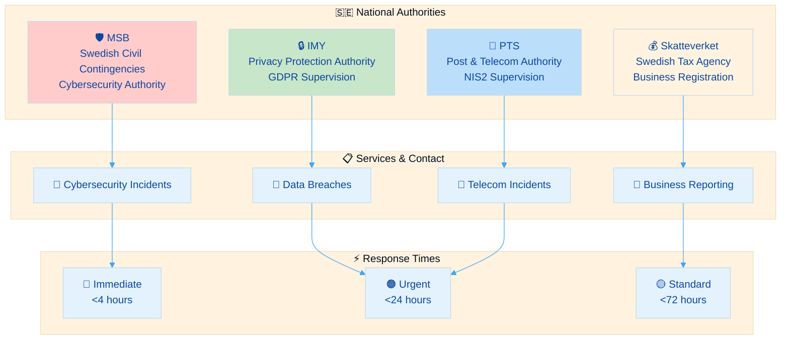
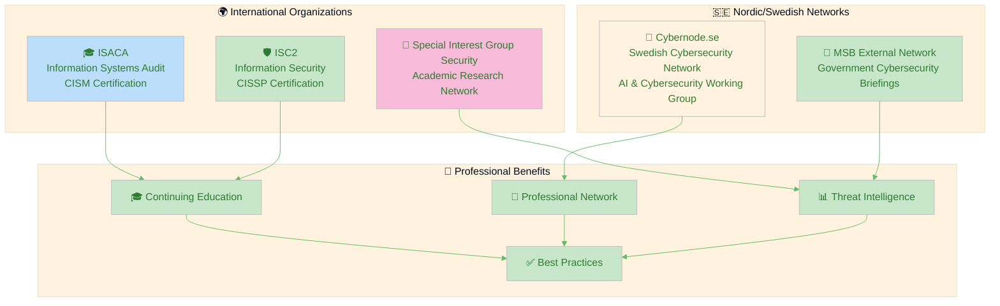
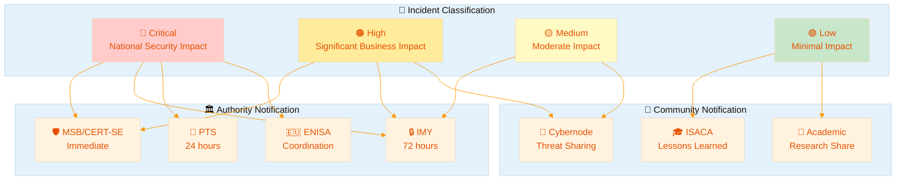
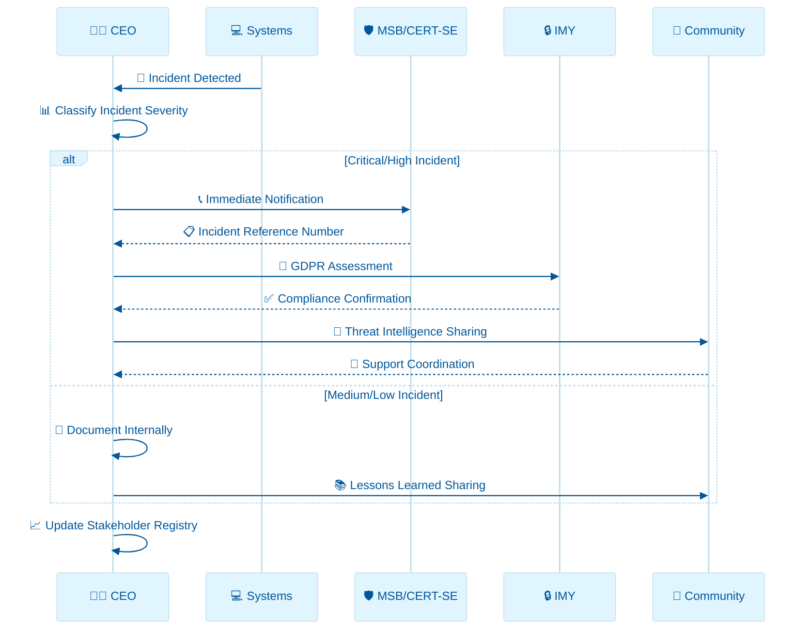

  

<h1 align="center">🤝 Hack23 AB — External Stakeholder Registry</h1>

  <strong>🛡️ Strategic Authority and Community Engagement Framework</strong> 
  <em>🎯 Professional Network Management for Cybersecurity Excellence</em>

  
  
  
  

**📋 Document Owner:** CEO | **📄 Version:** 1.0 | **📅 Last Updated:** 2025-09-09 (UTC)  
**🔄 Review Cycle:** Semi-Annual | **⏰ Next Review:** 2026-03-09

---

## 🎯 **Purpose Statement**

**🏢 Hack23 AB's** external stakeholder registry demonstrates how **🔧 systematic relationship management directly enables both regulatory compliance and business innovation.** Our 📊 comprehensive stakeholder framework serves as evidence of our commitment to transparent cybersecurity leadership while ensuring rapid response capabilities during security incidents and business disruptions.

This registry establishes mandatory contact procedures with authorities and professional communities based on our [🏷️ Classification Framework](https://github.com/Hack23/ISMS-PUBLIC/blob/main/CLASSIFICATION.md) and integrates with our [🚨 Incident Response Plan](./Incident_Response_Plan.md) for coordinated crisis communication.

Our commitment to transparency means this stakeholder engagement becomes a competitive differentiator, demonstrating to potential clients how proper external relationship management enables rather than constrains cybersecurity consulting excellence.

*— 👨‍💼 James Pether Sörling, CEO/Founder*

---

## 🔍 **Purpose & Scope**

### Purpose
This registry establishes the framework for maintaining relationships with external authorities, regulatory bodies, and professional communities to ensure compliance, incident response coordination, and strategic business development.

### Scope
This registry covers:
- All regulatory authorities per [✅ Compliance Checklist](./Compliance_Checklist.md)
- All professional cybersecurity communities and memberships
- All incident response coordination channels per [🚨 Incident Response Plan](./Incident_Response_Plan.md)
- All strategic business partnership networks

### Framework Compliance
- **ISO 27001:2022** - A.5.5 (Contact with authorities), A.5.6 (Contact with special interest groups)
- **NIST CSF 2.0** - RS.CO-01 (Response coordination with stakeholders), GV.OV-02 (External/internal context)
- **CIS Controls v8.1** - 17.2 (External authority contacts), 17.3 (Communication coordination)

---

## 🏛️ **Regulatory Authority Contacts**

### 🇸🇪 **Swedish National Authorities**

#### **🛡️ Myndigheten för samhällsskydd och beredskap (MSB)**
**Primary Role:** National cybersecurity authority and incident coordination

| Contact Type | Details | Usage Context | Response Time |
|-------------|---------|---------------|---------------|
| **🚨 Incident Reporting** | [CERT-SE](https://cert.se/) via secure portal | Critical cybersecurity incidents |  |
| **📧 General Contact** | cert@cert.se | Non-urgent cybersecurity matters |  |
| **📞 Emergency Hotline** | Available via CERT-SE portal | Active ongoing incidents |  |
| **🤝 Cybernode Network** | cybernode@ri.se | MSB cybersecurity briefings (bi-weekly Fridays 08:30-08:50) |  |

**Reporting Obligations:**
- **NIS2 Directive Implementation:** Significant cybersecurity incidents affecting essential services
- **National Cybersecurity Strategy:** Threat intelligence sharing and coordination
- **Cybernode Participation:** Regular attendance at MSB digital briefings for external cybersecurity network

#### **🔒 Integritetsskyddsmyndigheten (IMY)**
**Primary Role:** GDPR supervision and data protection authority

| Contact Type | Details | Usage Context | Response Time |
|-------------|---------|---------------|---------------|
| **📋 Data Breach Notification** | [IMY Portal](https://www.imy.se/) | Personal data breaches (Art. 33 GDPR) |  |
| **📧 General Inquiries** | imy@imy.se | GDPR compliance questions |  |
| **📞 Phone Support** | +46 8 657 61 00 | Urgent data protection matters |  |

**Reporting Obligations:**
- **72-hour breach notification** for personal data incidents per [🚨 Incident Response Plan](./Incident_Response_Plan.md)
- **Annual data protection impact assessments** for high-risk processing activities

#### **📡 Post- och telestyrelsen (PTS)**
**Primary Role:** NIS2 supervision for digital infrastructure providers

| Contact Type | Details | Usage Context | Response Time |
|-------------|---------|---------------|---------------|
| **🌐 NIS2 Reporting** | [PTS Portal](https://www.pts.se/) | Significant network/information system incidents |  |
| **📧 General Contact** | pts@pts.se | Telecom and digital service matters |  |

**Reporting Obligations:**
- **NIS2 incident reporting** for essential and important entities (when applicable)
- **Risk management measures** documentation and compliance verification

#### **💰 Skatteverket (Swedish Tax Agency)**
**Primary Role:** Business registration, VAT, and tax compliance

| Contact Type | Details | Usage Context | Response Time |
|-------------|---------|---------------|---------------|
| **💼 Business Portal** | [Skatteverket.se](https://www.skatteverket.se/) | VAT reporting, business registration |  |
| **📞 Business Hotline** | 0771-567 567 | Tax and business compliance questions |  |

**Reporting Obligations:**
- **Monthly VAT reporting** via digital portal
- **Annual corporate tax returns** and business activity reporting

### 🇪🇺 **European Union Authorities**

#### **🏛️ European Union Agency for Cybersecurity (ENISA)**
**Primary Role:** EU-wide cybersecurity coordination and guidance

| Contact Type | Details | Usage Context | Response Time |
|-------------|---------|---------------|---------------|
| **📧 General Contact** | info@enisa.europa.eu | EU cybersecurity initiatives and guidance |  |
| **🌐 Threat Landscape** | [ENISA Threat Landscape Reports](https://www.enisa.europa.eu/) | Strategic threat intelligence |  |

**Engagement Areas:**
- **EU Cybersecurity Strategy** implementation and best practices
- **NIS2 Directive** guidance and harmonization across member states

### 🌍 **International Authorities**

#### **🇺🇸 Cybersecurity and Infrastructure Security Agency (CISA)**
**Primary Role:** International cybersecurity coordination and threat intelligence

| Contact Type | Details | Usage Context | Response Time |
|-------------|---------|---------------|---------------|
| **🚨 Incident Reporting** | [CISA Incident Reporting](https://www.cisa.gov/report) | Significant international incidents |  |
| **📊 Threat Intelligence** | [CISA Advisories](https://www.cisa.gov/advisories) | Proactive threat monitoring |  |

**Engagement Areas:**
- **International cybersecurity cooperation** and threat sharing
- **Cloud security best practices** for AWS-based infrastructure

---

## 🤝 **Professional Communities & Special Interest Groups**

### 🛡️ **Cybersecurity Professional Organizations**

#### **🎓 ISACA (Information Systems Audit and Control Association)**
**Membership Status:** Active - James Pether Sörling (CISM Certified)

| Engagement Type | Details | Business Value | Frequency |
|-----------------|---------|----------------|-----------|
| **🏆 CISM Certification** | Certified Information Security Manager | Executive-level security management expertise |  |
| **📚 Professional Development** | ISACA conferences, webinars, research | Latest security governance practices |  |
| **🤝 Local Chapter** | Nordic/Stockholm ISACA chapter | Regional networking and compliance insights |  |

**Business Impact:**
- **🏆 Competitive Advantage:** CISM certification demonstrates enterprise-grade security management expertise
- **📋 Compliance Posture:** Access to latest governance frameworks and audit methodologies
- **🤝 Trust Enhancement:** Professional credibility with enterprise clients and partners

#### **🛡️ (ISC)² - International Information System Security Certification Consortium**
**Membership Status:** Active - James Pether Sörling (CISSP Certified)

| Engagement Type | Details | Business Value | Frequency |
|-----------------|---------|----------------|-----------|
| **🎖️ CISSP Certification** | Certified Information Systems Security Professional | Technical security expertise across all domains |  |
| **📊 Research & Resources** | (ISC)² research papers, threat reports | Evidence-based security practices |  |
| **🌍 Global Community** | International cybersecurity professional network | Global threat intelligence and best practices |  |

**Business Impact:**
- **💡 Innovation Enablement:** Access to cutting-edge security research and methodologies
- **🛡️ Risk Reduction:** Proven security expertise across all technical domains
- **💼 Partnership Value:** Global recognition and credibility in cybersecurity consulting

#### **🔐 Special Interest Group Security (sigsecurity.org)**
**Membership Status:** Active 

| Engagement Type | Details | Business Value | Frequency |
|-----------------|---------|----------------|-----------|
| **🎓 Academic Research** | Security research publications and collaboration | Thought leadership and innovation insights |  |
| **📝 Research Contributions** | Security research papers and methodologies | Demonstrable expertise and thought leadership |  |
| **🤝 Academic Network** | University researchers and security academics | Cutting-edge security research and innovation |  |

**Business Impact:**
- **💡 Innovation Enablement:** Early access to emerging security research and trends
- **🏆 Competitive Advantage:** Thought leadership through academic collaboration
- **📊 Decision Quality:** Research-based approach to security consulting methodologies

### 🇸🇪 **Swedish Cybersecurity Networks**

#### **🤝 Cybernode.se - Swedish Cybersecurity Network**
**Membership Status:** Active Member - [Listed on Members Page](https://cybernode.se/medlemmar/)

| Engagement Type | Details | Business Value | Frequency |
|-----------------|---------|----------------|-----------|
| **🤖 AI & Cybersecurity Working Group** | Temagruppen AI och cybersäkerhet | AI security expertise and innovation |  |
| **🏢 Swedish Industry Network** | National cybersecurity professional community | Local market intelligence and partnerships |  |
| **📡 MSB Coordination** | Access to MSB digital briefings via Cybernode | Government threat intelligence and policy updates |  |
| **🌐 Industry Collaboration** | Cross-sector cybersecurity initiatives | Best practice sharing and joint initiatives |  |

**Business Impact:**
- **🤝 Partnership Value:** Direct access to Swedish cybersecurity market and potential clients
- **📊 Decision Quality:** Local threat intelligence and regulatory updates
- **💡 Innovation Enablement:** AI and cybersecurity integration expertise
- **🛡️ Risk Reduction:** Government-coordinated threat awareness and response

**MSB Briefing Schedule:**
- **📅 Schedule:** Every other Friday, even weeks, 08:30-08:50
- **📧 Access:** Contact cybernode@ri.se for meeting invitations
- **📋 Content:** MSB cybersecurity situational awareness, two-week threat landscape summary
- **📝 Follow-up:** Summary distribution post-meeting to all participants

---

## 🚨 **Incident Response Coordination**

### 📋 **Authority Notification Matrix**

Based on [🚨 Incident Response Plan](./Incident_Response_Plan.md) incident classification:

#### **Critical Incident Notification (🔴)**
**Timeframe:** Immediate (≤4 hours)

| Authority | Notification Method | Information Required | Follow-up Actions |
|-----------|-------------------|---------------------|------------------|
| **🛡️ MSB/CERT-SE** | Secure portal + phone | Full incident details, impact assessment | Technical coordination, threat intelligence sharing |
| **🔒 IMY** | GDPR portal + email | Personal data breach scope, affected individuals | Formal breach notification, corrective measures |
| **📡 PTS** | NIS2 portal | Network/system impact, service disruption | Regulatory compliance verification |
| **🇪🇺 ENISA** | Via MSB coordination | Cross-border implications | EU-wide threat coordination |

#### **High Incident Notification (🟠)**
**Timeframe:** Urgent (≤24 hours)

| Authority | Notification Method | Information Required | Follow-up Actions |
|-----------|-------------------|---------------------|------------------|
| **🛡️ MSB/CERT-SE** | Secure portal | Incident summary, potential national impact | Threat assessment, guidance |
| **🔒 IMY** | GDPR portal | Data protection impact assessment | Compliance monitoring |
| **🤝 Cybernode** | Network alert | Threat indicators, protection measures | Community threat sharing |

### 🔄 **Communication Escalation Process**

---

## 📊 **Stakeholder Engagement Matrix**

### 🎯 **Strategic Relationship Management**

Based on [🏷️ Classification Framework](https://github.com/Hack23/ISMS-PUBLIC/blob/main/CLASSIFICATION.md) stakeholder analysis:

| Stakeholder Category | Influence Level | Engagement Frequency | Communication Channel | Business Impact |
|---------------------|----------------|---------------------|----------------------|-----------------|
| **🏛️ Regulatory Authorities** |  | Incident-driven + Quarterly | Official portals, secure email |  |
| **🤝 Professional Organizations** |  | Monthly engagement | Member portals, events |  |
| **🇸🇪 National Networks** |  | Bi-weekly + Monthly | Network communications |  |
| **🔐 Research Community** |  | Continuous access | Academic platforms |  |
| **🌍 International Bodies** |  | Quarterly monitoring | Public resources |  |

### 📅 **Annual Engagement Calendar**

| Quarter | Primary Activities | Key Deliverables | Success Metrics |
|---------|-------------------|------------------|-----------------|
| **Q3 2025** | MSB briefing participation, ISACA chapter engagement | Cybernode active membership visibility |  |
| **Q3 2025** | Professional certification maintenance, IMY compliance review | CPE requirements completion |  |
| **Q4 2025** | AI & Cybersecurity working group leadership | Thought leadership contributions |  |
| **Q4 2025** | Annual compliance reporting, stakeholder review | Registry updates, relationship assessment |  |

---

## 🔄 **Registry Maintenance & Updates**

### 📋 **Update Procedures**

#### **Quarterly Review Process**
1. **📊 Contact Verification:** Verify all authority contact details remain current
2. **🤝 Relationship Assessment:** Evaluate engagement effectiveness and business value
3. **📈 Performance Metrics:** Review response times and coordination effectiveness
4. **🎯 Strategic Alignment:** Ensure stakeholder relationships support business objectives

#### **Immediate Update Triggers**
- **🚨 Incident Response Events:** Update based on actual incident coordination experience
- **📝 Regulatory Changes:** New authorities, changed reporting requirements
- **🤝 Network Changes:** New memberships, organizational restructuring
- **🔄 Business Strategy Evolution:** Changing business focus or market expansion

### 📊 **Key Performance Indicators**

| Metric Category | KPI | Target | Measurement Method | Review Frequency |
|-----------------|-----|--------|-------------------|------------------|
| **🚨 Incident Response** | Authority notification time | <4 hours critical | Incident response logs | Per incident |
| **🤝 Professional Engagement** | CPE requirements compliance | 100% on time | Certification tracking | Annual |
| **🇸🇪 Network Participation** | MSB briefing attendance | >80% sessions | Meeting logs | Quarterly |
| **📊 Stakeholder Satisfaction** | Relationship effectiveness | High value rating | Annual survey | Annual |
| **🔄 Registry Currency** | Contact accuracy | 100% verified | Quarterly validation | Quarterly |

### 📈 **Business Value Tracking**

#### **Competitive Advantage Metrics**
- **🏆 Certification Maintenance:** CISM/CISSP currency demonstrates expertise
- **🤝 Network Influence:** Active participation in national cybersecurity initiatives
- **💡 Innovation Leadership:** AI & cybersecurity working group contributions
- **📋 Compliance Excellence:** Proactive regulatory relationship management

#### **Risk Reduction Metrics**
- **⚡ Response Coordination:** Effective incident authority coordination
- **📊 Threat Intelligence:** Early warning through professional networks
- **🛡️ Regulatory Compliance:** Maintained good standing with all authorities
- **🔄 Business Continuity:** Stakeholder support during crisis events

---

## 📚 **Related Documents**

- [🔐 Information Security Policy](./Information_Security_Policy.md) — Overall governance framework and stakeholder management principles
- [🚨 Incident Response Plan](./Incident_Response_Plan.md) — Detailed incident coordination procedures and authority notification requirements
- [✅ Compliance Checklist](./Compliance_Checklist.md) — Regulatory compliance tracking and authority relationship requirements
- [🏷️ Classification Framework](https://github.com/Hack23/ISMS-PUBLIC/blob/main/CLASSIFICATION.md) — Business impact analysis and stakeholder influence assessment
- [📉 Risk Register](./Risk_Register.md) — Risk identification including regulatory and stakeholder relationship risks
- [🤝 Third Party Management](./Third_Party_Management.md) — Supplier and partner relationship management procedures
- [💻 Asset Register](./Asset_Register.md) — Complete asset inventory including stakeholder-dependent systems
- [📊 Security Metrics](./Security_Metrics.md) — Performance measurement including stakeholder relationship KPIs
- [🔄 Business Continuity Plan](./Business_Continuity_Plan.md) — Crisis communication and stakeholder coordination during disruptions
- [🌐 ISMS Transparency Plan](./ISMS_Transparency_Plan.md) — Public disclosure strategy and stakeholder communication

---

**📋 Document Control:**  
**✅ Approved by:** James Pether Sörling, CEO  
**📤 Distribution:** Public  
**🏷️ Classification:**   
**📅 Effective Date:** 2025-09-09  
**⏰ Next Review:** 2026-03-09   
**🎯 Framework Compliance:**   
