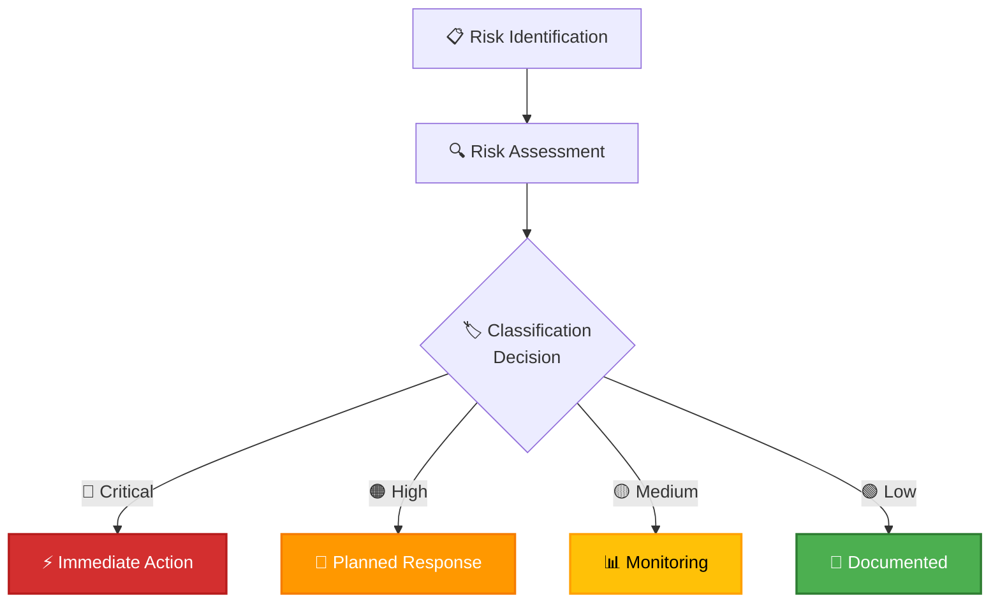
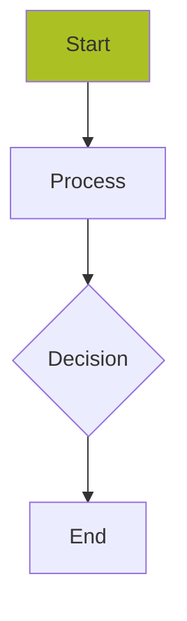

<p align="center">
  
</p>

<h1 align="center">📋 Hack23 AB — ISMS Document Quality Assurance Checklist</h1>

<p align="center">
  <strong>Systematic Quality Excellence Through Consistent Standards</strong><br>
  <em>Ensuring Professional and Compliant ISMS Documentation</em>
</p>

<p align="center">
  <a href="#"></a>
  <a href="#"></a>
  <a href="#"></a>
  <a href="#"></a>
</p>

**📋 Document Owner:** CEO | **📄 Version:** 1.1 | **📅 Last Updated:** 2026-01-25 (UTC)  
**🔄 Review Cycle:** Quarterly | **⏰ Next Review:** 2026-04-25

---

## 🎯 **Purpose Statement**

This Quality Assurance Checklist ensures **systematic consistency and professional excellence** across all ISMS policy documents at Hack23 AB. Our ISMS documentation serves dual purposes - operational security framework and client demonstration platform - making quality assurance critical to both our security posture and business credibility.

As CEO, I've observed that **manual verification without standardized checklists leads to inconsistent quality** across document updates. This checklist transforms subjective "looks good" judgments into objective quality verification, ensuring every document update maintains the enterprise-grade standards our clients expect.

Quality assurance is not bureaucracy - it's the systematic approach that enables us to maintain professional documentation at scale while allowing rapid updates when security requirements evolve.

_— James Pether Sörling, CEO/Founder_

---

## 📖 **How to Use This Checklist**

### When to Use

- ✅ **Before document updates:** Pre-review verification
- ✅ **During document creation:** Section-by-section validation
- ✅ **After document updates:** Final quality check before commit
- ✅ **During scheduled reviews:** Comprehensive quality audit
- ✅ **Before external sharing:** Client-ready verification

### Workflow Integration

1. **Pre-Update:** Review current document version, identify changes needed
2. **During Update:** Check each section against relevant checklist items
3. **Post-Update:** Run through complete checklist before commit
4. **Final Verification:** Execute `./update_dates.sh` and test all links
5. **Commit:** Use descriptive commit message following git workflow standards

### Checklist Interpretation

- ✅ **Must-Have:** Required for all documents (ISO 27001 compliance)
- 🔶 **Should-Have:** Strongly recommended for consistency
- 💡 **Best Practice:** Enhances quality but may not apply to all documents

---

## ✅ **Pre-Update Verification**

### Document Context Review

- [ ] 📄 **Current document version reviewed** - Understand existing content and structure
- [ ] 🔍 **Change scope identified** - Know what sections require updates
- [ ] 📚 **Related documents identified** - Check cross-references for consistency updates
- [ ] ⚖️ **Compliance requirements confirmed** - Verify ISO 27001, GDPR, NIS2 alignment
- [ ] 📅 **Review cycle verified** - Confirm appropriate review frequency (Monthly/Quarterly/Semi-Annual/Annual)
- [ ] 🏷️ **Classification level appropriate** - Verify confidentiality/integrity/availability ratings match content
- [ ] 👥 **Stakeholder impact assessed** - Identify who needs to be informed of changes

### Repository Status Check

- [ ] 🔄 **Git repository clean** - No uncommitted changes that might be lost
- [ ] 🌿 **Correct branch** - Working in appropriate feature/update branch
- [ ] 📥 **Latest changes pulled** - Repository synchronized with remote
- [ ] 🔗 **Cross-references checked** - Related documents reviewed for consistency

---

## 🎨 **Header Section Quality** (MUST-HAVE ✅)

### Logo and Title

- [ ] 📷 **Centered logo present** - `<p align="center"></p>`
- [ ] 🔍 **Logo dimensions correct** - Exactly 192x192 pixels
- [ ] 📝 **H1 title with emoji** - `<h1 align="center">[ICON] Hack23 AB — [Document Title]</h1>`
- [ ] 🎯 **Title follows pattern** - "Hack23 AB — [Document Name]" format
- [ ] ✅ **Emoji matches document type** - 🔐 Policy, 📋 Plan, ⚙️ Procedure, 📊 Register, 🏷️ Framework
- [ ] 📏 **Title centered** - Uses `<h1 align="center">` HTML tag

### Tagline and Sub-tagline

- [ ] 💪 **Strong tagline present** - Bold text with relevant emoji
- [ ] 🎯 **Sub-tagline present** - Italic text emphasizing security/transparency
- [ ] 📐 **Paragraph centered** - Uses `<p align="center">` wrapper
- [ ] 🎨 **Emojis appropriate** - Match document purpose (🛡️ security, 🎯 goals, etc.)
- [ ] ✍️ **Compelling messaging** - Clear value proposition for document purpose

### Badge Row (4 Required Badges)

- [ ] 🎖️ **Owner badge present** - `Owner-CEO-0A66C2` in blue
- [ ] 📄 **Version badge present** - `Version-X.Y-555` in grey
- [ ] 📅 **Effective date badge present** - `Effective-YYYY--MM--DD-success` in green (note double dash)
- [ ] 🔄 **Review cycle badge present** - `Review-[Cycle]-orange` in orange
- [ ] 📏 **Badges centered** - Inside `<p align="center">` wrapper
- [ ] 🔗 **Badges linked** - Each wrapped in `<a href="#">` tag (placeholder link acceptable)
- [ ] 🎨 **Badge style consistent** - All use `style=for-the-badge` parameter

### Metadata Line

- [ ] 📋 **Document Owner specified** - `**📋 Document Owner:** CEO`
- [ ] 📄 **Version matches badge** - Same X.Y version as badge above
- [ ] 📅 **Last Updated date present** - `**📅 Last Updated:** YYYY-MM-DD (UTC)`
- [ ] 🌍 **Timezone specified** - Always includes "(UTC)" suffix
- [ ] 🔄 **Review Cycle specified** - `**🔄 Review Cycle:** Monthly | Quarterly | Semi-Annual | Annual`
- [ ] ⏰ **Next Review date present** - `**⏰ Next Review:** YYYY-MM-DD`
- [ ] ✅ **Icons consistent** - 📋 Owner, 📄 Version, 📅 Updated, 🔄 Review, ⏰ Next
- [ ] 🧮 **Next Review calculated correctly** - Annual (+1 year), Quarterly (+3 months), Monthly (+1 month), Semi-Annual (+6 months)

### Horizontal Separator

- [ ] ➖ **Separator after metadata** - Three dashes `---` on dedicated line

---

## 📝 **Content Quality Standards**

### Purpose Statement Section

- [ ] 🎯 **Section titled "Purpose Statement"** - With emoji (🎯 or similar)
- [ ] 💬 **CEO quote present** - Connects document to Hack23 transparency principles
- [ ] 🔗 **Links to business value** - Explains how document supports business model
- [ ] 🎨 **Compelling narrative** - Demonstrates thought leadership and expertise
- [ ] ✍️ **Signature present** - "_— James Pether Sörling, CEO/Founder_" in italics
- [ ] ➖ **Separator after statement** - Three dashes `---` on dedicated line

### Section Structure

- [ ] 📑 **Clear hierarchical headers** - H2 (##), H3 (###), H4 (####) properly nested
- [ ] 🎨 **Headers include emojis** - Consistent icon usage matching STYLE_GUIDE.md
- [ ] 📏 **Consistent spacing** - Blank lines before/after headers and sections
- [ ] 🔢 **Logical ordering** - Sections flow logically from context to implementation
- [ ] 🎯 **Section purpose clear** - Each section has obvious reason for existence
- [ ] 📊 **Appropriate content length** - Sections neither too dense nor too sparse

### Tables and Lists

- [ ] 📊 **Tables properly formatted** - Pipe-delimited with header separators
- [ ] ✅ **Table headers bold** - Use `**Header**` syntax
- [ ] 📏 **Column alignment consistent** - Visual consistency in pipe positions
- [ ] 🔢 **Lists use proper markdown** - `-` for unordered, `1.` for ordered
- [ ] 🎯 **List indentation correct** - 2 spaces for nested lists
- [ ] ✅ **Checkbox lists formatted** - `- [ ]` for unchecked, `- [x]` for checked

### Writing Quality

- [ ] ✍️ **No spelling errors** - Run spellcheck
- [ ] 📖 **No grammar errors** - Professional writing standards
- [ ] 🎯 **Active voice used** - "Configure the firewall" not "The firewall should be configured"
- [ ] 📏 **Concise sentences** - Avoid unnecessarily complex phrasing
- [ ] 🔤 **Consistent terminology** - Same terms used throughout document and across ISMS
- [ ] 🎨 **Professional tone** - Balance technical accuracy with accessibility

### Technical Accuracy

- [ ] ✅ **Facts verified** - Technical claims are accurate
- [ ] 🔗 **Links functional** - All hyperlinks tested and working
- [ ] 📊 **Data current** - Statistics and metrics reflect current state
- [ ] 🏷️ **Classifications appropriate** - Security levels match actual controls
- [ ] ⚖️ **Compliance references accurate** - ISO 27001, NIST CSF, CIS Controls citations correct

---

## 📚 **Related Documents Section** (MUST-HAVE ✅)

### Section Header

- [ ] 📚 **Section titled exactly** - `## 📚 Related Documents` (or `## 📚 **Related Documents**` with bold)
- [ ] 📋 **Emoji consistent** - Uses 📚 book/library icon
- [ ] ✅ **Hierarchical level correct** - Always H2 (##) level header

### Link Format

- [ ] 🔗 **Relative links used** - `./Document_Name.md` format, not full URLs
- [ ] 🎨 **Each link has icon** - Consistent icon from STYLE_GUIDE.md icon reference
- [ ] 📝 **Link text is filename** - Matches actual file name exactly
- [ ] ✅ **Optional descriptors added** - Brief clarification after filename where helpful
- [ ] 🚫 **No self-references** - Document doesn't link to itself

### Icon Consistency

- [ ] 🔐 **Policies use** - 🔐 (InfoSec), 🔑 (Access), 🌐 (Network), 🔒 (Crypto), 🏷️ (Data)
- [ ] 📋 **Plans use** - 📋 (generic), 🔄 (BCP), 🆘 (DRP), 🚨 (IRP)
- [ ] ⚙️ **Procedures use** - ⚙️ (operations), 📝 (change), 🔍 (vulnerability)
- [ ] 📊 **Registers use** - 💻 (Asset), 📉 (Risk), 🤝 (Stakeholder), 🏢 (Supplier)
- [ ] 🏷️ **Frameworks use** - 🏷️ (Classification), 📊 (Metrics), 📋 (Compliance)

### Link Validation

- [ ] ✅ **All links tested** - Every link opens correct document
- [ ] 📂 **File paths correct** - Relative paths work from document location
- [ ] 🔗 **External links complete** - Full URLs for ISMS-PUBLIC repo references
- [ ] 🔍 **Anchor links work** - Section references include correct `#heading-id`

### Completeness

- [ ] 📋 **All relevant docs linked** - No obvious omissions
- [ ] 🔗 **Bidirectional links** - If A references B, B should reference A where appropriate
- [ ] 🎯 **Focus on relationships** - Only link truly related documents, not everything
- [ ] ✅ **Canonical list consulted** - Reference STYLE_GUIDE.md Related Documents section

---

## 📋 **Document Control Footer** (MUST-HAVE ✅)

### Separator

- [ ] ➖ **Separator before footer** - Three dashes `---` on dedicated line above footer

### Footer Content

- [ ] ✅ **Approved by line** - `**✅ Approved by:** James Pether Sörling, CEO`
- [ ] 📤 **Distribution specified** - `**📤 Distribution:** [All Personnel/Key Suppliers/Public/etc.]`
- [ ] 🏷️ **Classification badge present** - Links to CLASSIFICATION.md with correct level
- [ ] 📅 **Effective Date present** - `**📅 Effective Date:** YYYY-MM-DD`
- [ ] ⏰ **Next Review present** - `**⏰ Next Review:** YYYY-MM-DD`
- [ ] 🎯 **Framework Compliance badges** - ISO 27001, NIST CSF, CIS Controls, AWS Well-Architected
- [ ] ✅ **"Document Control:" label** - Line starts with `**📋 Document Control:**` in bold

### Classification Badge Verification

- [ ] 🏷️ **Badge matches content** - Confidentiality level appropriate for sensitivity
- [ ] 🔗 **Badge links to CLASSIFICATION.md** - Full GitHub URL with anchor
- [ ] 🎨 **Badge color matches level** - Extreme (black), Very High (darkblue), High (blue), Moderate (orange), Low (yellow), Public (lightgrey)
- [ ] 📊 **Badge uses flat-square style** - `style=flat-square` parameter
- [ ] ✅ **Badge format correct** - `[](doc-url#anchor)`

### Framework Compliance Badges

- [ ] 🌐 **ISO 27001 badge present** - Blue badge with ISO logo
- [ ] 📊 **NIST CSF badge present** - Green badge with NIST logo
- [ ] 🎯 **CIS Controls badge present** - Orange badge with CIS logo
- [ ] ☁️ **AWS Well-Architected badge (if applicable)** - Orange badge with AWS logo
- [ ] 🔗 **All badges link to CLASSIFICATION.md** - Consistent linking approach
- [ ] 🎨 **Badge style consistent** - All use `style=flat-square&logo=X&logoColor=white`

### Date Consistency

- [ ] 📅 **Effective Date matches badge** - Footer date matches header badge (with/without double dash)
- [ ] ⏰ **Next Review matches metadata line** - Footer matches header metadata
- [ ] 🧮 **Next Review calculated correctly** - Follows review cycle (+1 year, +3 months, etc.)
- [ ] ✅ **Dates in YYYY-MM-DD format** - ISO 8601 date format throughout

---

## 🎨 **Mermaid Diagram Quality**

### Color Scheme Compliance

- [ ] 🎨 **Classification colors used** - Critical (#D32F2F), High (#FF9800), Medium (#FFC107), Low (#4CAF50), Public (#9E9E9E)
- [ ] 🏢 **Process colors used** - Finance (#1565C0), Operations (#8D6E63), Legal (#C62828), Sales (#2E7D32), Marketing (#7B1FA2), Security (#D32F2F), Technical (#455A64)
- [ ] ✅ **Status colors used** - Success (#4CAF50), Warning (#FF9800), Error (#D32F2F), Info (#2196F3), Disabled (#9E9E9E)
- [ ] 📋 **Colors from STYLE_GUIDE.md** - No custom colors used without documentation

### Diagram Structure

- [ ] 🎯 **Diagram type appropriate** - Flowchart, Graph, Sequence, Gantt, Mindmap, Pie, Quadrant matches use case
- [ ] 🎨 **Emojis in labels** - Consistent emoji usage in node labels
- [ ] 📏 **Layout clear** - Information hierarchy obvious
- [ ] ✅ **Node labels concise** - Text short enough to fit in nodes
- [ ] 🔤 **Consistent terminology** - Same terms as rest of document

### Accessibility

- [ ] 🎨 **Sufficient contrast** - Text readable on background colors
- [ ] 🔍 **Text size appropriate** - Not too small when rendered
- [ ] 📱 **Mobile responsive** - Readable on smaller screens (test preview)
- [ ] 🎯 **Alt text considered** - Diagram purpose clear from context/caption

### Technical Quality

- [ ] ✅ **Syntax validated** - Diagram renders without errors
- [ ] 🎨 **Theme specified** - Uses `%%{init: {"theme": "X"}}%%` where appropriate
- [ ] 📊 **ClassDefs used** - Custom node styles defined consistently
- [ ] 🔗 **No broken references** - All node IDs referenced correctly

### Documentation

- [ ] 📝 **Diagram purpose explained** - Context provided before/after diagram
- [ ] 🎯 **Legend included (if needed)** - Complex color schemes explained
- [ ] 📊 **Data sources cited** - If diagram represents data/metrics
- [ ] ✅ **Matches STYLE_GUIDE examples** - Follows established patterns

---

## 🔧 **Git Workflow Compliance**

### Pre-Commit Verification

- [ ] 📅 **Dates updated via script** - Run `./update_dates.sh --date YYYY-MM-DD` if dates changed
- [ ] 🔍 **Script output reviewed** - Check for any warnings or errors
- [ ] ✅ **Changes reviewed** - `git diff` checked before staging
- [ ] 🗑️ **No temporary files** - No `.bak` or temp files staged
- [ ] 📁 **Only relevant files staged** - No accidental inclusions

### Commit Message Quality

- [ ] ✍️ **Descriptive commit message** - Clear summary of changes
- [ ] 🎯 **Imperative mood used** - "Add feature" not "Added feature"
- [ ] 📏 **First line under 72 chars** - Summary line concise
- [ ] 📝 **Body explains why (if needed)** - Multi-line message for complex changes
- [ ] 🔗 **References issues (if applicable)** - Links to GitHub issues

### Branch Management

- [ ] 🌿 **Appropriate branch used** - Not committing directly to main
- [ ] 📛 **Branch name descriptive** - Follows naming convention
- [ ] 🔄 **Branch up to date** - Merged latest changes from main if needed

---

## ⚠️ **Common Quality Issues - Quick Reference**

### ❌ Frequently Missed Items

#### Header Issues

| Issue | Why It Matters | How to Fix |
|-------|---------------|------------|
| Date badge uses single dash (`2025-11-14`) | Badge won't render with color | Change to double dash: `2025--11--14` |
| Logo not centered | Unprofessional appearance | Wrap in `<p align="center">` tags |
| Badges not in `for-the-badge` style | Inconsistent with other documents | Add `style=for-the-badge` parameter |
| Missing emoji in H1 title | Less scannable in document list | Add appropriate icon from STYLE_GUIDE.md |

#### Content Issues

| Issue | Why It Matters | How to Fix |
|-------|---------------|------------|
| Self-reference in Related Documents | Circular link, user confusion | Remove link to current document |
| Broken relative links | Navigation failure | Test all `./Document.md` links |
| Inconsistent emoji usage | Unprofessional appearance | Reference STYLE_GUIDE.md icon guide |
| Missing horizontal separators | Poor visual structure | Add `---` between major sections |

#### Footer Issues

| Issue | Why It Matters | How to Fix |
|-------|---------------|------------|
| Classification badge wrong color | Misleading security level | Match color to level: Extreme=black, VeryHigh=darkblue, High=blue, Moderate=orange, Low=yellow, Public=lightgrey |
| Next Review date wrong | Compliance tracking failure | Recalculate: Annual (+1yr), Semi-Annual (+6mo), Quarterly (+3mo), Monthly (+1mo) |
| Framework badges missing logos | Less professional | Add `&logo=iso`, `&logo=nist`, `&logo=cisecurity` |
| Effective date doesn't match badge | Date inconsistency | Ensure footer YYYY-MM-DD matches header YYYY--MM--DD |

#### Mermaid Diagram Issues

| Issue | Why It Matters | How to Fix |
|-------|---------------|------------|
| Custom colors not in STYLE_GUIDE | Inconsistent appearance | Use only documented color palette |
| Diagram doesn't render | Broken visualization | Validate syntax at mermaid.live |
| Missing emojis in labels | Less engaging | Add relevant emojis from STYLE_GUIDE.md |
| Text too small/long | Poor readability | Shorten labels or increase font size |

---

## 📊 **Examples: Correct vs. Incorrect Formatting**

### ✅ Correct Header Format

```markdown
<p align="center">
  
</p>

<h1 align="center">🔐 Hack23 AB — Information Security Policy</h1>

<p align="center">
  <strong>Security Through Transparency and Excellence</strong><br>
  <em>Enterprise-grade Security for Innovation-driven Consulting</em>
</p>

<p align="center">
  <a href="#"></a>
  <a href="#"></a>
  <a href="#"></a>
  <a href="#"></a>
</p>

**📋 Document Owner:** CEO | **📄 Version:** 1.0 | **📅 Last Updated:** 2025-11-14 (UTC)  
**🔄 Review Cycle:** Annual | **⏰ Next Review:** 2026-11-14
```

### ❌ Incorrect Header Format

```markdown
# Information Security Policy

Owner: CEO
Version: 1.0
Last Updated: November 14, 2025
Review: Annually

<!-- Missing: Logo, centered alignment, emojis, badges, proper date format -->
```

---

### ✅ Correct Related Documents Section

```markdown
## 📚 Related Documents

- [🔐 Information Security Policy](./Information_Security_Policy.md)
- [🔑 Access Control Policy](./Access_Control_Policy.md)
- [🌐 Network Security Policy](./Network_Security_Policy.md)
- [🏷️ Data Classification Policy](./Data_Classification_Policy.md)
- [💻 Asset Register](./Asset_Register.md) - Complete inventory of information assets
- [📉 Risk Register](./Risk_Register.md) - Identified risks and treatments
```

### ❌ Incorrect Related Documents Section

```markdown
## Related Documents

- Information Security Policy
- [Access Control Policy](./Access_Control_Policy.md)
- Network Security Policy (see separate document)
- [Current Document](./Access_Control_Policy.md)

<!-- Missing: Section emoji, icons per link, relative ./ paths, self-reference included -->
```

---

### ✅ Correct Document Control Footer

```markdown
---

**📋 Document Control:**  
**✅ Approved by:** James Pether Sörling, CEO  
**📤 Distribution:** All Personnel  
**🏷️ Classification:** [](./CLASSIFICATION.md#confidentiality-levels)  
**📅 Effective Date:** 2025-11-14  
**⏰ Next Review:** 2026-11-14  
**🎯 Framework Compliance:** [](./CLASSIFICATION.md) [](./CLASSIFICATION.md) [](./CLASSIFICATION.md)
```

### ❌ Incorrect Document Control Footer

```markdown
Approved by: CEO
Effective: 2025-11-14
Classification: Confidential

<!-- Missing: Emojis, "Document Control:" label, distribution, next review, framework badges, classification badge link -->
```

---

### ✅ Correct Mermaid Diagram



### ❌ Incorrect Mermaid Diagram


<!-- Missing: Emojis, STYLE_GUIDE colors, descriptive labels, proper classDefs -->

---

## 🧪 **Testing the Checklist**

### Self-Test: Apply to Sample Documents

To validate this checklist's completeness, test it against existing documents:

1. **High-complexity document:** [Information Security Policy](./Information_Security_Policy.md)
   - Tests: All section types, multiple related docs, complex footer

2. **Technical document:** [Network Security Policy](./Network_Security_Policy.md)
   - Tests: Technical accuracy, Mermaid diagrams, specific controls

3. **Register document:** [Asset Register](./Asset_Register.md)
   - Tests: Tables, data accuracy, classification consistency

### Validation Criteria

- ✅ Checklist identifies all known quality issues in sample documents
- ✅ Checklist doesn't flag false positives (correct items marked as issues)
- ✅ Checklist completes in reasonable time (15-20 min per document)
- ✅ Checklist items are clear and actionable
- ✅ Examples help clarify ambiguous requirements

---

## 📈 **Continuous Improvement**

### Checklist Evolution

This QA checklist should evolve based on:

- **New quality issues discovered** - Add checklist items when patterns emerge
- **STYLE_GUIDE.md updates** - Synchronize when standards change
- **User feedback** - Incorporate suggestions for clarity/completeness
- **Automation opportunities** - Identify items that could be scripted

### Feedback Loop

- 📝 **Document issues found** - Track what checklist catches vs. misses
- 🎯 **Measure false positives** - Items flagged incorrectly
- ⏱️ **Track time to complete** - Optimize checklist length vs. thoroughness
- 🔄 **Update quarterly** - Align with checklist review cycle

### Automation Potential

Future enhancements could automate:

- ✅ **Link validation** - Script to test all relative/absolute links
- 🎨 **Badge verification** - Check badge URLs and parameters
- 📅 **Date calculation** - Verify Next Review matches Review Cycle
- 🎨 **Mermaid syntax** - Validate diagrams render correctly
- 📊 **Related docs bidirectional** - Verify cross-references are mutual

---

## 📚 **Related Documents**

### 🎯 Strategic & Governance
- [🎯 Information Security Strategy](./Information_Security_Strategy.md) - AI-first operations, Pentagon framework, and strategic QA direction
- [🔐 Information Security Policy](./Information_Security_Policy.md) - Example of high-quality policy document with AI-First Operations Governance
- [🤖 AI Policy](./AI_Policy.md) - AI-assisted document quality validation and automation
- [📐 STYLE_GUIDE.md](./STYLE_GUIDE.md) - Master style guide for all ISMS documentation
- [🏷️ CLASSIFICATION.md](./CLASSIFICATION.md) - Classification framework and impact levels

### 🔐 Security Policies & Controls
- [🌐 Network Security Policy](./Network_Security_Policy.md) - Example with Mermaid diagrams

### ⚙️ Operational Integration
- [📖 README.md](./README.md) - ISMS documentation status and overview
- [💻 Asset Register](./Asset_Register.md) - Example register document with tables

---

**📋 Document Control:**  
**✅ Approved by:** James Pether Sörling, CEO  
**📤 Distribution:** All Personnel  
**🏷️ Classification:** [](./CLASSIFICATION.md#confidentiality-levels)  
**📅 Effective Date:** 2026-01-25  
**⏰ Next Review:** 2026-04-25  
**🎯 Framework Compliance:** [](./CLASSIFICATION.md) [](./CLASSIFICATION.md) [](./CLASSIFICATION.md)
