

  

<h1 align="center">🔓 Hack23 AB — OpenChain ISO/IEC 5230:2020 Self-Certification</h1>

  <strong>🛡️ Open Source License Compliance Through Transparent Governance</strong> 
  <em>🎯 Evidence-Based Self-Certification for Supply Chain Trust</em>

  
  
  
  

**📋 Document Owner:** CEO | **📄 Version:** 1.0 | **📅 Last Updated:** 2026-04-10 (UTC)  
**🔄 Review Cycle:** Annual | **⏰ Next Review:** 2027-04-10

---

## 🎯 **Purpose**

> _"Our commitment to open source transparency goes beyond code — it extends to rigorous license compliance and supply chain integrity. This self-certification against ISO/IEC 5230:2020 demonstrates that Hack23 AB operates a mature open source compliance program, giving our clients, partners, and the open source community confidence in how we manage license obligations across all our projects."_
>
> — **James Pether Sörling, CEO, Hack23 AB**

This document provides Hack23 AB's **complete self-certification assessment** against the [OpenChain ISO/IEC 5230:2020](https://www.iso.org/standard/81039.html) International Standard for open source license compliance, using the official [OpenChain Self-Certification Checklist](https://github.com/OpenChain-Project/Reference-Material/blob/master/OpenChain-Standards-Self-Certification/Checklist/ISO-IEC-5230/en/iso-5230-2020-Self-Certification-Checklist.md). Each checklist item is assessed with **honest, accurate answers** reflecting our single-person company structure, linking to specific ISMS policies and evidence.

**📎 Checklist Source:** [OpenChain ISO/IEC 5230 Self-Certification Checklist (GitHub)](https://github.com/OpenChain-Project/Reference-Material/blob/master/OpenChain-Standards-Self-Certification/Checklist/ISO-IEC-5230/en/iso-5230-2020-Self-Certification-Checklist.md)  
**🌐 Online Form:** [openchainproject.org/checklist-iso-5230-2020](https://openchainproject.org/checklist-iso-5230-2020)  
**📋 Conformance Submission:** [openchainproject.org/conformance-submission](https://openchainproject.org/conformance-submission)

---

## 📊 **Assessment Overview**

### 🏢 Organization Profile

| Attribute | Detail |
|-----------|--------|
| **Organization** | Hack23 AB (Org.nr: 559534-7807) |
| **Founded** | 2025 |
| **Location** | Göteborg, Sweden |
| **CEO / Sole Employee** | James Pether Sörling |
| **Business Lines** | Cybersecurity Consulting, Open Source Software |
| **Open Source Projects** | 6 active repositories |
| **Assessment Date** | 2026-04-10 |
| **Standard** | ISO/IEC 5230:2020 (OpenChain Specification 2.1) |

### 🏷️ Badge Inventory — Open Source Compliance Evidence

Hack23 AB open source projects carry public compliance badges demonstrating continuous security validation. All 6 projects have OpenSSF Scorecard, CII Best Practices, SLSA 3, and License badges. FOSSA license compliance scanning is enabled on the 3 primary repositories (CIA, Black Trigram, CIA Compliance Manager):

#### 🏛️ Citizen Intelligence Agency (CIA)

#### 🎮 Black Trigram

#### 📊 CIA Compliance Manager

#### 🇪🇺 European Parliament MCP Server

#### 🇪🇺 EU Parliament Monitor

#### 🗳️ Riksdagsmonitor

---

## 📈 **Compliance Summary Dashboard**

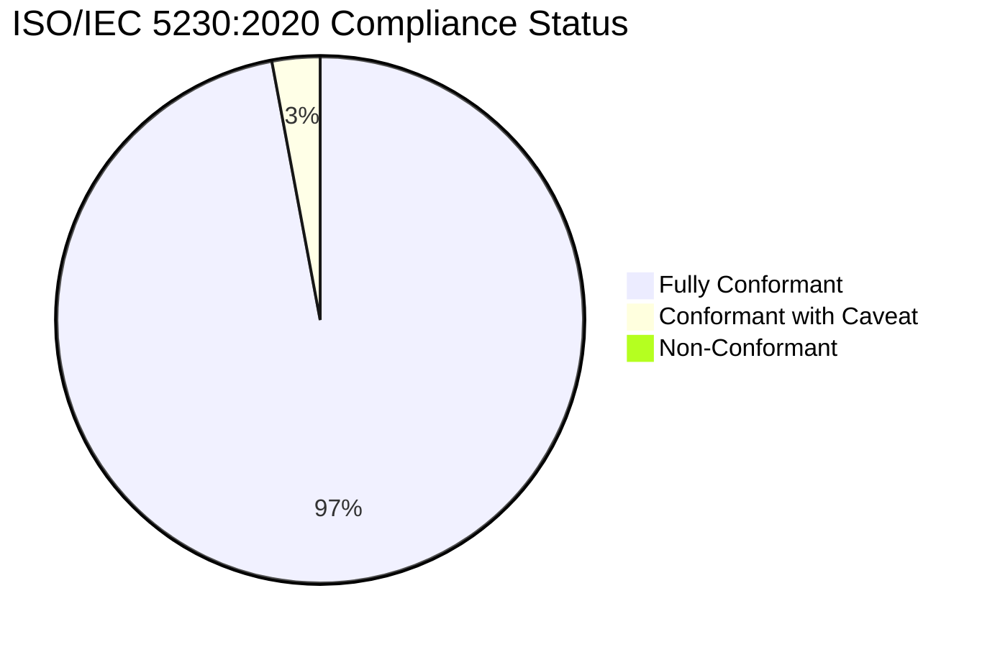

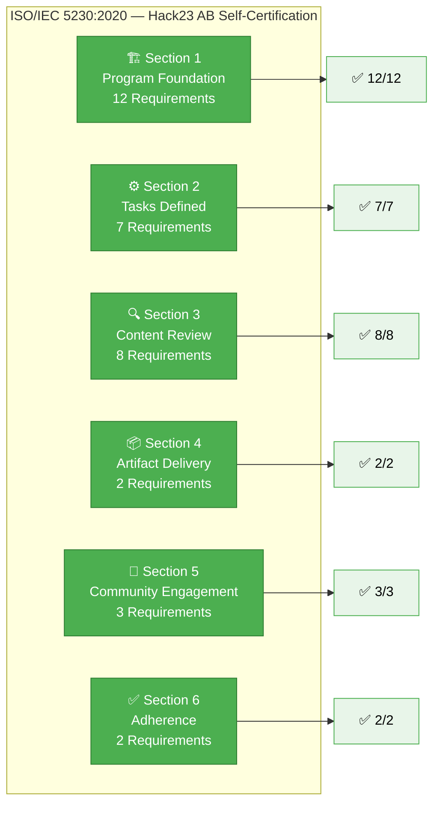

### 📊 Conformance Rating Legend

| Rating | Meaning | Color |
|--------|---------|-------|
| ✅ **Yes** | Fully conformant — documented evidence exists | 🟢 Green |
| ⚠️ **Yes (Caveat)** | Conformant with noted simplification due to single-person company | 🟡 Amber |
| ❌ **No** | Not conformant — gap identified | 🔴 Red |

> **Honest Assessment Note:** Hack23 AB is a single-person company (solopreneur). The CEO (James Pether Sörling) serves as the sole program participant, fulfilling all roles: developer, compliance officer, legal advisor, and release manager. Where the standard envisions multi-person processes, we answer honestly about our single-person equivalents while demonstrating that the _intent_ and _outcomes_ of each requirement are fully met.

---

## 🏗️ **Section 1: Program Foundation**

> 📎 _OpenChain Checklist Reference: [Section 1: Program foundation](https://github.com/OpenChain-Project/Reference-Material/blob/master/OpenChain-Standards-Self-Certification/Checklist/ISO-IEC-5230/en/iso-5230-2020-Self-Certification-Checklist.md#section-1-program-foundation)_

```mermaid
graph TD
    subgraph "Section 1 — Program Foundation"
        P1["📜 Documented Policy"]
        P2["📢 Policy Communication"]
        P3["👤 Roles & Responsibilities"]
        P4["📋 Competency Requirements"]
        P5["✅ Assessed Competence"]
        P6["🔔 Awareness: Policy Location"]
        P7["🎯 Awareness: Objectives"]
        P8["🤝 Awareness: Contributions"]
        P9["⚠️ Awareness: Implications"]
        P10["🔍 Program Scope Process"]
        P11["📄 Scope Statement"]
        P12["📖 License Review Procedure"]
    end

    P1 --> E1["🔓 Open Source Policy"]
    P2 --> E2["ISMS Repository"]
    P3 --> E3["CEO = All Roles"]
    P4 --> E4["Open Source Policy § Roles"]
    P5 --> E5["CII Best Practices Gold"]
    P6 --> E6["README + Policy Links"]
    P7 --> E7["Business Strategy"]
    P8 --> E8["CONTRIBUTING.md"]
    P9 --> E9["Policy § Non-Compliance"]
    P10 --> E10["Open Source Policy § Scope"]
    P11 --> E11["Policy § Scope Statement"]
    P12 --> E12["FOSSA + License Review"]

    style P1 fill:#4CAF50,stroke:#2E7D32,color:#ffffff
    style P2 fill:#4CAF50,stroke:#2E7D32,color:#ffffff
    style P3 fill:#4CAF50,stroke:#2E7D32,color:#ffffff
    style P4 fill:#4CAF50,stroke:#2E7D32,color:#ffffff
    style P5 fill:#4CAF50,stroke:#2E7D32,color:#ffffff
    style P6 fill:#4CAF50,stroke:#2E7D32,color:#ffffff
    style P7 fill:#4CAF50,stroke:#2E7D32,color:#ffffff
    style P8 fill:#4CAF50,stroke:#2E7D32,color:#ffffff
    style P9 fill:#4CAF50,stroke:#2E7D32,color:#ffffff
    style P10 fill:#4CAF50,stroke:#2E7D32,color:#ffffff
    style P11 fill:#4CAF50,stroke:#2E7D32,color:#ffffff
    style P12 fill:#4CAF50,stroke:#2E7D32,color:#ffffff
    style E1 fill:#e8f5e9,stroke:#4CAF50,color:#000000
    style E2 fill:#e8f5e9,stroke:#4CAF50,color:#000000
    style E3 fill:#e8f5e9,stroke:#4CAF50,color:#000000
    style E4 fill:#e8f5e9,stroke:#4CAF50,color:#000000
    style E5 fill:#e8f5e9,stroke:#4CAF50,color:#000000
    style E6 fill:#e8f5e9,stroke:#4CAF50,color:#000000
    style E7 fill:#e8f5e9,stroke:#4CAF50,color:#000000
    style E8 fill:#e8f5e9,stroke:#4CAF50,color:#000000
    style E9 fill:#e8f5e9,stroke:#4CAF50,color:#000000
    style E10 fill:#e8f5e9,stroke:#4CAF50,color:#000000
    style E11 fill:#e8f5e9,stroke:#4CAF50,color:#000000
    style E12 fill:#e8f5e9,stroke:#4CAF50,color:#000000
```

### 1.1 — Documented Open Source License Compliance Policy

| Checklist Item | Answer | Evidence |
|----------------|--------|----------|
| We have a documented policy governing the open source license compliance of supplied software. | ✅ **Yes** | [🔓 Open Source Policy](./Open_Source_Policy.md) |

**📝 Assessment Detail:**

Hack23 AB maintains a comprehensive [Open Source Policy](./Open_Source_Policy.md) (v2.4, last updated 2026-02-26) that explicitly governs open source license compliance for all supplied software. The policy covers:

- **License Classification Framework:** Permissive (Apache-2.0, MIT, BSD), Copyleft (GPL, LGPL, AGPL), Non-standard, and Commercial categories — documented in [Open Source Policy § License Classification](./Open_Source_Policy.md)
- **Automated License Scanning:** FOSSA integration on the 3 primary repositories (CIA, Black Trigram, CIA Compliance Manager); remaining projects use GitHub's built-in license detection and manual review per [Open Source Policy § License Classification](./Open_Source_Policy.md)
- **License Compatibility Review:** Manual review required for conflicts or exceptions
- **Monthly Compliance Reports:** FOSSA reports reviewed by CEO for projects with FOSSA integration

**📊 Evidence Badges:**

| Project | FOSSA License Compliance | License |
|---------|--------------------------|---------|
| 🏛️ CIA |  |  |
| 🎮 Black Trigram |  |  |
| 📊 CIA Compliance Manager |  |  |
| 🇪🇺 EP MCP Server | — |  |
| 🇪🇺 EU Parliament Monitor | — |  |
| 🗳️ Riksdagsmonitor | — |  |

---

### 1.2 — Policy Communication Procedure

| Checklist Item | Answer | Evidence |
|----------------|--------|----------|
| We have a documented procedure to communicate the existence of the open source policy to program participants. | ✅ **Yes** | [🔓 Open Source Policy](./Open_Source_Policy.md) • [🌐 ISMS Transparency Plan](./ISMS_Transparency_Plan.md) |

**📝 Assessment Detail:**

As a single-person company, the CEO is the sole "program participant." Communication of the open source policy is achieved through:

- **ISMS Repository:** The [Open Source Policy](./Open_Source_Policy.md) is maintained in the central ISMS repository, accessible at all times
- **Public Transparency:** The policy is published in the [ISMS-PUBLIC](https://github.com/Hack23/ISMS-PUBLIC) repository per the [ISMS Transparency Plan](./ISMS_Transparency_Plan.md), making it visible to all stakeholders
- **Repository Cross-References:** Each project README includes a "Project Classification" section linking back to ISMS governance per [Classification Framework](./CLASSIFICATION.md)
- **Annual Review:** Annual review cycle ensures continued awareness

> **Single-Person Caveat:** In a single-person company, the policy author and the program participant are the same individual. The CEO created, approved, and implements the policy. Communication is inherently achieved through authorship and continuous maintenance.

---

### 1.3 — Roles and Responsibilities

| Checklist Item | Answer | Evidence |
|----------------|--------|----------|
| We have identified the roles and responsibilities that affect the performance and effectiveness of the program. | ✅ **Yes** | [🔓 Open Source Policy § Roles](./Open_Source_Policy.md) |

**📝 Assessment Detail:**

The [Open Source Policy](./Open_Source_Policy.md) defines the following roles, all fulfilled by the CEO:

| Role | Responsibility | Person |
|------|----------------|--------|
| **Open Source Program Manager** | Overall governance, policy oversight | James Pether Sörling |
| **License Compliance Officer** | License review, FOSSA monitoring | James Pether Sörling |
| **Exception Approver** | License conflict resolution | James Pether Sörling |
| **Security Lead** | Vulnerability disclosure, remediation | James Pether Sörling |
| **Release Manager** | SBOM generation, artifact delivery | James Pether Sörling |
| **Community Manager** | Contribution policy, external engagement | James Pether Sörling |

> **Honest Note:** All roles are held by one person. This is documented transparently. The standard's intent — that responsibilities are defined and assigned — is fully met.

---

### 1.4 — Competency Requirements

| Checklist Item | Answer | Evidence |
|----------------|--------|----------|
| We have identified and documented the competencies required for each role. | ✅ **Yes** | [🔓 Open Source Policy](./Open_Source_Policy.md) • [🛠️ Secure Development Policy](./Secure_Development_Policy.md) |

**📝 Assessment Detail:**

Required competencies documented in the Open Source Policy and Secure Development Policy include:

- **License Law Understanding:** Knowledge of OSI-approved licenses, copyleft vs. permissive distinctions, license compatibility
- **SBOM Generation:** CycloneDX and SPDX format expertise
- **Security Scanning:** SAST (SonarCloud), SCA (Dependabot, FOSSA), DAST (OWASP ZAP) proficiency
- **Supply Chain Security:** SLSA framework knowledge, provenance attestation
- **Regulatory Awareness:** EU CRA, GDPR, and NIS2 compliance requirements
- **Community Engagement:** Open source contribution best practices

---

### 1.5 — Assessed Competence

| Checklist Item | Answer | Evidence |
|----------------|--------|----------|
| We have documented the assessed competence for each program participant. | ✅ **Yes** | CII Best Practices (Gold), OpenSSF Scorecard results, public project track record |

**📝 Assessment Detail:**

The CEO's competence is **publicly verifiable** through the following evidence:

| Competency Area | Evidence | Validation |
|-----------------|----------|------------|
| License Compliance | FOSSA clean reports on integrated projects |  |
| Security Best Practices | CII Best Practices Gold (CIA, project 770) |  |
| Supply Chain Security | SLSA Level 3 attestations on all projects |  |
| Code Quality | SonarCloud Quality Gate passing |  |
| Open Source Track Record | 20+ years of open source development | [GitHub Profile](https://github.com/pethers) |

> **Single-Person Caveat:** Self-assessment of competence carries inherent bias. To mitigate, Hack23 AB relies on **third-party automated validation** (OpenSSF Scorecard, CII Best Practices, FOSSA, SonarCloud) as objective competency indicators.

---

### 1.6 — Awareness: Policy Location

| Checklist Item | Answer | Evidence |
|----------------|--------|----------|
| We have documented the awareness of our program participants on the open source policy and where to find it. | ✅ **Yes** | [🔓 Open Source Policy](./Open_Source_Policy.md) — located in ISMS root |

**📝 Assessment Detail:**

The Open Source Policy is located at `/Open_Source_Policy.md` in the ISMS repository. The sole program participant (CEO) authored this policy and knows its location. The [ISMS Transparency Plan](./ISMS_Transparency_Plan.md) ensures a public version is maintained in ISMS-PUBLIC.

---

### 1.7 — Awareness: Open Source Objectives

| Checklist Item | Answer | Evidence |
|----------------|--------|----------|
| We have documented the awareness of our program participants on relevant open source objectives. | ✅ **Yes** | [🔓 Open Source Policy § Purpose](./Open_Source_Policy.md) |

**📝 Assessment Detail:**

The Open Source Policy purpose statement and the [Information Security Strategy](./Information_Security_Strategy.md) define clear objectives:

1. **Transparency-led Differentiation:** Open source as competitive advantage
2. **Compliance-first:** License compliance via FOSSA, REUSE, and automated scanning
3. **Security Excellence:** Public evidence badges demonstrating continuous security validation
4. **Supply Chain Integrity:** SBOM generation, SLSA provenance, dependency tracking
5. **Community Alignment:** Ethical open source participation per CODE_OF_CONDUCT.md

---

### 1.8 — Awareness: Contribution Expectations

| Checklist Item | Answer | Evidence |
|----------------|--------|----------|
| We have documented the awareness of our program participants on contributions expected to ensure the effectiveness of the program. | ✅ **Yes** | [🔓 Open Source Policy § Contribution Policy](./Open_Source_Policy.md) • CONTRIBUTING.md in each repo |

**📝 Assessment Detail:**

Each Hack23 repository maintains a `CONTRIBUTING.md` file defining contribution expectations. The Open Source Policy documents contribution governance including license compatibility verification and Developer Certificate of Origin (DCO) requirements.

**📊 Evidence:**

- 🏛️ CIA: [CONTRIBUTING.md](https://github.com/Hack23/cia/blob/master/CONTRIBUTING.md)
- 🎮 Black Trigram: [CONTRIBUTING.md](https://github.com/Hack23/blacktrigram/blob/main/CONTRIBUTING.md)
- 📊 CIA Compliance Manager: [CONTRIBUTING.md](https://github.com/Hack23/cia-compliance-manager/blob/main/CONTRIBUTING.md)

---

### 1.9 — Awareness: Non-Compliance Implications

| Checklist Item | Answer | Evidence |
|----------------|--------|----------|
| We have documented the awareness of our program participants on the implications of failing to follow the Program requirements. | ✅ **Yes** | [🔓 Open Source Policy](./Open_Source_Policy.md) • [✅ Compliance Checklist](./Compliance_Checklist.md) |

**📝 Assessment Detail:**

The Open Source Policy and Compliance Checklist document non-compliance implications including:

- **Legal Risk:** License violation liability, potential litigation
- **Reputational Damage:** Loss of community trust, badge degradation
- **Regulatory Exposure:** EU CRA non-compliance penalties, NIS2 sanctions
- **Business Impact:** Client confidence erosion, consulting credibility loss

As a single-person company, the CEO bears **full personal and business liability** for non-compliance, providing maximum incentive for adherence.

---

### 1.10 — Program Scope Process

| Checklist Item | Answer | Evidence |
|----------------|--------|----------|
| We have a process for determining the scope of our program. | ✅ **Yes** | [🔓 Open Source Policy § Scope](./Open_Source_Policy.md) |

**📝 Assessment Detail:**

The Open Source Policy defines scope as:

**In scope:**

- All open source repositories under the Hack23 GitHub organization
- Third-party open source usage and compliance
- Open source contribution governance

**Out of scope:**

- Internal-only repositories not intended for public distribution

The scope determination process is triggered by:

1. New repository creation
2. New dependency addition (automated via Dependabot/FOSSA)
3. Annual policy review

---

### 1.11 — Written Scope Statement

| Checklist Item | Answer | Evidence |
|----------------|--------|----------|
| We have a written statement clearly defining the scope and limits of the program. | ✅ **Yes** | [🔓 Open Source Policy § Scope](./Open_Source_Policy.md) |

**📝 Assessment Detail:**

The written scope statement in the Open Source Policy explicitly defines:

| In Scope | Out of Scope |
|----------|-------------|
| All Hack23 GitHub organization public repositories | Internal-only repositories not for distribution |
| Third-party open source dependency compliance | Proprietary client deliverables |
| Open source contribution governance | SaaS services not distributed as software |
| SBOM generation for all releases | |
| License scanning and compatibility checks | |

**Covered Projects:**

| Project | Type | License | In Scope |
|---------|------|---------|----------|
| 🏛️ CIA | Political transparency platform | Apache-2.0 | ✅ |
| 🎮 Black Trigram | Educational gaming platform | Apache-2.0 | ✅ |
| 📊 CIA Compliance Manager | Security assessment tool | Apache-2.0 | ✅ |
| 🇪🇺 EP MCP Server | Political intelligence MCP server | Apache-2.0 | ✅ |
| 🇪🇺 EU Parliament Monitor | News generation platform | Apache-2.0 | ✅ |
| 🗳️ Riksdagsmonitor | Parliament intelligence platform | Apache-2.0 | ✅ |

---

### 1.12 — License Obligation Review Procedure

| Checklist Item | Answer | Evidence |
|----------------|--------|----------|
| We have a documented procedure to review and document open source license obligations, restrictions and rights. | ✅ **Yes** | [🔓 Open Source Policy § License Classification](./Open_Source_Policy.md) • FOSSA Integration |

**📝 Assessment Detail:**

The Open Source Policy documents a multi-layer license review procedure:

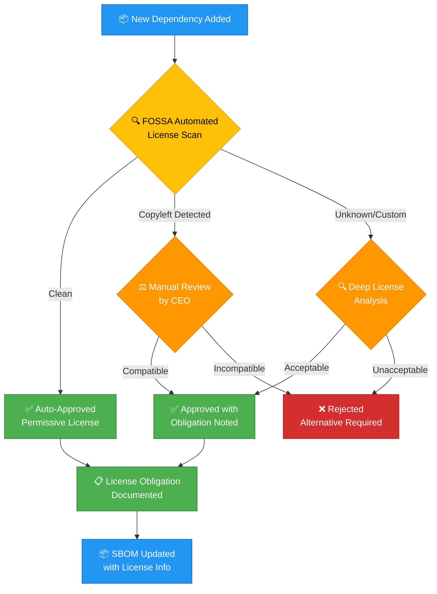

**License Classification Framework:**

| Category | Examples | Policy | Action |
|----------|----------|--------|--------|
| **Permissive** | Apache-2.0, MIT, BSD | ✅ Pre-approved | Auto-accepted |
| **Copyleft** | GPL, LGPL, AGPL | ⚠️ Review required | CEO review + compatibility check |
| **Non-standard** | Custom licenses | ⚠️ Deep review | Legal analysis required |
| **Commercial** | Dual-licensed | ⚠️ Review required | Business case evaluation |
| **Incompatible** | License conflicts | ❌ Prohibited | Alternative must be found |

---

## ⚙️ **Section 2: Relevant Tasks Defined and Supported**

> 📎 _OpenChain Checklist Reference: [Section 2: Relevant tasks defined and supported](https://github.com/OpenChain-Project/Reference-Material/blob/master/OpenChain-Standards-Self-Certification/Checklist/ISO-IEC-5230/en/iso-5230-2020-Self-Certification-Checklist.md#section-2-relevant-tasks-defined-and-supported)_

```mermaid
graph TD
    subgraph "Section 2 — Tasks Defined and Supported"
        T1["📧 Public Inquiry Method"]
        T2["📋 Inquiry Response Procedure"]
        T3["👤 Program Staffing"]
        T4["💰 Adequate Funding"]
        T5["⚖️ Legal Expertise"]
        T6["📝 Internal Responsibilities"]
        T7["🔧 Non-Compliance Remediation"]
    end

    T1 --> ET1["SECURITY.md + GitHub Issues"]
    T2 --> ET2["Incident Response Plan"]
    T3 --> ET3["CEO = Sole Staff"]
    T4 --> ET4["Self-Funded Operations"]
    T5 --> ET5["CEO Legal Competence"]
    T6 --> ET6["Open Source Policy"]
    T7 --> ET7["Vulnerability Mgmt"]

    style T1 fill:#4CAF50,stroke:#2E7D32,color:#ffffff
    style T2 fill:#4CAF50,stroke:#2E7D32,color:#ffffff
    style T3 fill:#4CAF50,stroke:#2E7D32,color:#ffffff
    style T4 fill:#4CAF50,stroke:#2E7D32,color:#ffffff
    style T5 fill:#FFC107,stroke:#FF9800,color:#000000
    style T6 fill:#4CAF50,stroke:#2E7D32,color:#ffffff
    style T7 fill:#4CAF50,stroke:#2E7D32,color:#ffffff
    style ET1 fill:#e8f5e9,stroke:#4CAF50,color:#000000
    style ET2 fill:#e8f5e9,stroke:#4CAF50,color:#000000
    style ET3 fill:#e8f5e9,stroke:#4CAF50,color:#000000
    style ET4 fill:#e8f5e9,stroke:#4CAF50,color:#000000
    style ET5 fill:#fff3e0,stroke:#FFC107,color:#000000
    style ET6 fill:#e8f5e9,stroke:#4CAF50,color:#000000
    style ET7 fill:#e8f5e9,stroke:#4CAF50,color:#000000
```

### 2.1 — Public Compliance Inquiry Method

| Checklist Item | Answer | Evidence |
|----------------|--------|----------|
| We have a publicly visible method for any third party to make an open source license compliance inquiry. | ✅ **Yes** | SECURITY.md in each repo + GitHub Issues |

**📝 Assessment Detail:**

Every Hack23 repository includes a `SECURITY.md` file providing a public contact method for security and compliance inquiries. Additionally, GitHub Issues are enabled on all repositories for general compliance questions.

**📊 Evidence:**

| Project | Security Contact | Issues |
|---------|-----------------|--------|
| 🏛️ CIA | [SECURITY.md](https://github.com/Hack23/cia/blob/master/SECURITY.md) | [Issues](https://github.com/Hack23/cia/issues) |
| 🎮 Black Trigram | [SECURITY.md](https://github.com/Hack23/blacktrigram/blob/main/SECURITY.md) | [Issues](https://github.com/Hack23/blacktrigram/issues) |
| 📊 CIA Compliance Manager | [SECURITY.md](https://github.com/Hack23/cia-compliance-manager/blob/main/SECURITY.md) | [Issues](https://github.com/Hack23/cia-compliance-manager/issues) |
| 🇪🇺 EP MCP Server | [SECURITY.md](https://github.com/Hack23/European-Parliament-MCP-Server/blob/main/SECURITY.md) | [Issues](https://github.com/Hack23/European-Parliament-MCP-Server/issues) |

---

### 2.2 — Inquiry Response Procedure

| Checklist Item | Answer | Evidence |
|----------------|--------|----------|
| We have a documented procedure for responding to open source compliance inquiries. | ✅ **Yes** | [🚨 Incident Response Plan](./Incident_Response_Plan.md) • [🔓 Open Source Policy](./Open_Source_Policy.md) |

**📝 Assessment Detail:**

Compliance inquiries are handled through the [Incident Response Plan](./Incident_Response_Plan.md) which covers all external communications including compliance inquiries. Response procedure:

1. **Receipt:** Inquiry received via SECURITY.md, GitHub Issues, or email
2. **Triage:** CEO assesses scope and urgency
3. **Investigation:** License verification via FOSSA and SBOM review
4. **Response:** Documented response within SLA timeframe
5. **Remediation:** If non-compliance found, immediate corrective action per [Vulnerability Management](./Vulnerability_Management.md)

---

### 2.3 — Program Staffing

| Checklist Item | Answer | Evidence |
|----------------|--------|----------|
| We have documented the persons, group or function supporting the program role(s) identified. | ✅ **Yes** | [🔓 Open Source Policy § Roles](./Open_Source_Policy.md) |

**📝 Assessment Detail:**

All program roles are documented in the Open Source Policy and staffed by the CEO. See Section 1.3 above for the complete role-to-person mapping.

---

### 2.4 — Adequate Staffing and Funding

| Checklist Item | Answer | Evidence |
|----------------|--------|----------|
| We have ensured the identified program roles been properly staffed and adequately funded. | ✅ **Yes** | Company operations, tool subscriptions |

**📝 Assessment Detail:**

- **Staffing:** The CEO allocates dedicated time for open source compliance activities as part of regular operations
- **Tooling Budget:** Active subscriptions/integrations for FOSSA, SonarCloud, GitHub (with Advanced Security features), and OpenSSF infrastructure
- **Automation Investment:** CI/CD pipelines with integrated license scanning reduce manual effort, making single-person management feasible

> **Honest Note:** As a solopreneur, "adequate staffing" means one person managing all activities. This is viable because of extensive automation (FOSSA, Dependabot, OpenSSF Scorecard) that reduces manual compliance overhead to manageable levels.

---

### 2.5 — Legal Expertise

| Checklist Item | Answer | Evidence |
|----------------|--------|----------|
| We have identified legal expertise to address internal and external open source compliance matters. | ⚠️ **Yes (Caveat)** | CEO technical-legal competence + external counsel available |

**📝 Assessment Detail:**

- **Internal Expertise:** The CEO has 20+ years of open source experience with working knowledge of major open source licenses (Apache-2.0, GPL family, MIT, BSD), copyright law, and EU regulatory frameworks (CRA, GDPR, NIS2)
- **Automated Assistance:** FOSSA provides automated legal analysis of license obligations and compatibility
- **External Counsel:** Access to Swedish legal advisors available for complex matters (not yet needed)
- **Community Resources:** OpenChain Project resources, Linux Foundation legal guidance

> **Honest Caveat:** The CEO is not a licensed attorney. For complex legal disputes or novel license interpretations, external legal counsel would be engaged. Day-to-day compliance is managed through established tooling and extensive practical experience.

---

### 2.6 — Internal Responsibility Assignment

| Checklist Item | Answer | Evidence |
|----------------|--------|----------|
| We have a documented procedure assigning internal responsibilities for open source compliance. | ✅ **Yes** | [🔓 Open Source Policy](./Open_Source_Policy.md) • [📊 Security Metrics](./Security_Metrics.md) |

**📝 Assessment Detail:**

The Open Source Policy assigns all compliance responsibilities to the CEO with specific accountability for:

- License scanning review (monthly FOSSA reports)
- Dependency vulnerability remediation (per [Vulnerability Management SLAs](./Vulnerability_Management.md))
- SBOM accuracy verification (per release)
- Compliance badge maintenance (continuous)

---

### 2.7 — Non-Compliance Remediation

| Checklist Item | Answer | Evidence |
|----------------|--------|----------|
| We have a documented procedure for handling the review and remediation of non-compliant cases. | ✅ **Yes** | [🔍 Vulnerability Management](./Vulnerability_Management.md) • [🔓 Open Source Policy](./Open_Source_Policy.md) |

**📝 Assessment Detail:**

Non-compliance remediation follows a documented escalation procedure:

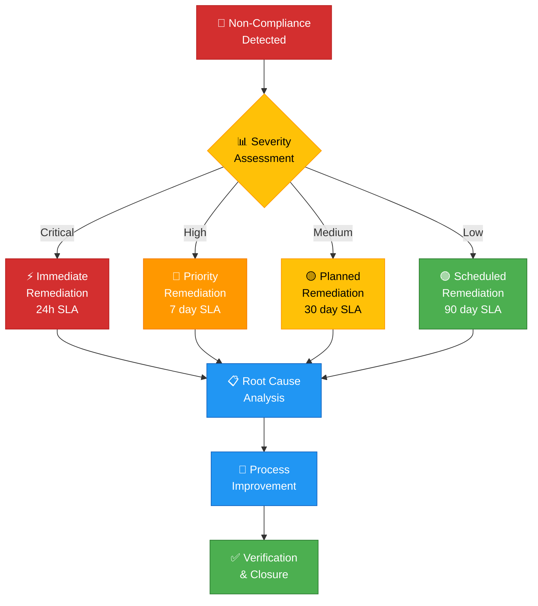

---

## 🔍 **Section 3: Open Source Content Review and Approval**

> 📎 _OpenChain Checklist Reference: [Section 3: Open source content review and approval](https://github.com/OpenChain-Project/Reference-Material/blob/master/OpenChain-Standards-Self-Certification/Checklist/ISO-IEC-5230/en/iso-5230-2020-Self-Certification-Checklist.md#section-3-open-source-content-review-and-approval)_

```mermaid
graph TD
    subgraph "Section 3 — Content Review and Approval"
        C1["📦 Component Tracking"]
        C2["📋 Component Records"]
        C3["📦 Binary Distribution"]
        C4["📄 Source Distribution"]
        C5["🔗 Integration Obligations"]
        C6["✏️ Modified OSS"]
        C7["⚠️ Incompatible Licenses"]
        C8["📝 Attribution Requirements"]
    end

    C1 --> EC1["FOSSA + Dependabot + SBOM"]
    C2 --> EC2["SBOM in GitHub Releases"]
    C3 --> EC3["GitHub Releases + Attestation"]
    C4 --> EC4["Public GitHub Repos"]
    C5 --> EC5["License Compatibility Check"]
    C6 --> EC6["Fork Policy + License Review"]
    C7 --> EC7["FOSSA Conflict Detection"]
    C8 --> EC8["NOTICE + LICENSE Files"]

    style C1 fill:#4CAF50,stroke:#2E7D32,color:#ffffff
    style C2 fill:#4CAF50,stroke:#2E7D32,color:#ffffff
    style C3 fill:#4CAF50,stroke:#2E7D32,color:#ffffff
    style C4 fill:#4CAF50,stroke:#2E7D32,color:#ffffff
    style C5 fill:#4CAF50,stroke:#2E7D32,color:#ffffff
    style C6 fill:#4CAF50,stroke:#2E7D32,color:#ffffff
    style C7 fill:#4CAF50,stroke:#2E7D32,color:#ffffff
    style C8 fill:#4CAF50,stroke:#2E7D32,color:#ffffff
    style EC1 fill:#e8f5e9,stroke:#4CAF50,color:#000000
    style EC2 fill:#e8f5e9,stroke:#4CAF50,color:#000000
    style EC3 fill:#e8f5e9,stroke:#4CAF50,color:#000000
    style EC4 fill:#e8f5e9,stroke:#4CAF50,color:#000000
    style EC5 fill:#e8f5e9,stroke:#4CAF50,color:#000000
    style EC6 fill:#e8f5e9,stroke:#4CAF50,color:#000000
    style EC7 fill:#e8f5e9,stroke:#4CAF50,color:#000000
    style EC8 fill:#e8f5e9,stroke:#4CAF50,color:#000000
```

### 3.1 — Component Identification, Tracking, and Approval

| Checklist Item | Answer | Evidence |
|----------------|--------|----------|
| We have a documented procedure for identifying, tracking, reviewing, approving, and archiving information about the open source components in a supplied software release. | ✅ **Yes** | [🔓 Open Source Policy § Supply Chain](./Open_Source_Policy.md) • [🛠️ Secure Development Policy § SBOM](./Secure_Development_Policy.md) |

**📝 Assessment Detail:**

Open source component management is automated through a comprehensive CI/CD pipeline:

1. **Identification:** Dependabot continuously scans all repositories for open source dependencies
2. **Tracking:** FOSSA provides real-time dependency and license tracking
3. **Review:** Pull request checks include automated license compatibility analysis
4. **Approval:** CEO reviews and approves dependency changes via PR merge
5. **Archiving:** SBOM (SPDX + CycloneDX) generated for every release and stored as GitHub Release artifacts with SLSA provenance attestations

**📊 Supply Chain Evidence:**

| Project | Dependabot | SBOM/Attestations | FOSSA |
|---------|------------|-------------------|-------|
| 🏛️ CIA | [Config](https://github.com/Hack23/cia/blob/master/.github/dependabot.yml) | [Attestations](https://github.com/Hack23/cia/attestations) | [Report](https://app.fossa.com/projects/git%2Bgithub.com%2FHack23%2Fcia/refs/branch/master) |
| 🎮 Black Trigram | [Config](https://github.com/Hack23/blacktrigram/blob/main/.github/dependabot.yml) | [Attestations](https://github.com/Hack23/blacktrigram/attestations) | [Report](https://app.fossa.io/projects/git%2Bgithub.com%2FHack23%2Fblacktrigram/refs/branch/main) |
| 📊 CIA CM | [Config](https://github.com/Hack23/cia-compliance-manager/blob/main/.github/dependabot.yml) | [Attestations](https://github.com/Hack23/cia-compliance-manager/attestations) | [Report](https://app.fossa.io/projects/git%2Bgithub.com%2FHack23%2Fcia-compliance-manager/refs/branch/main) |
| 🇪🇺 EP MCP | Active | [Attestations](https://github.com/Hack23/European-Parliament-MCP-Server/attestations) | — |
| 🇪🇺 EU Parl Mon | Active | [Attestations](https://github.com/Hack23/euparliamentmonitor/attestations) | — |
| 🗳️ Riksdagsmon | Active | [Attestations](https://github.com/Hack23/riksdagsmonitor/attestations) | — |

---

### 3.2 — Component Records

| Checklist Item | Answer | Evidence |
|----------------|--------|----------|
| We have open source component records for the supplied software to demonstrate the documented procedure was properly followed. | ✅ **Yes** | SBOM artifacts in GitHub Releases |

**📝 Assessment Detail:**

Every release includes machine-readable SBOM containing:

- Complete dependency tree with exact versions
- License identifiers (SPDX format)
- Cryptographic hashes for integrity verification
- SLSA provenance attestation linking build to source

These records are versioned and publicly accessible for verification. SLSA provenance attestations provide tamper-evident integrity guarantees, and GitHub Releases serve as the primary distribution and archival mechanism.

---

### 3.3 — Binary Distribution Procedure

| Checklist Item | Answer | Evidence |
|----------------|--------|----------|
| We have a documented procedure that covers distribution of the supplied software in binary form. | ✅ **Yes** | [🛠️ Secure Development Policy](./Secure_Development_Policy.md) • CI/CD workflows |

**📝 Assessment Detail:**

Binary distribution is handled through GitHub Releases with the following compliance controls:

- **Build Provenance:** SLSA Level 3 attestations verify the build process
- **SBOM Inclusion:** Every binary release includes a corresponding SBOM
- **License Bundling:** LICENSE files included in all distributed packages
- **Signing:** Release artifacts are signed with GitHub's Sigstore integration

**📊 SLSA Evidence:**

| Project | SLSA Level | Attestations |
|---------|-----------|--------------|
| 🏛️ CIA |  | [View](https://github.com/Hack23/cia/attestations) |
| 🎮 Black Trigram |  | [View](https://github.com/Hack23/blacktrigram/attestations) |
| 📊 CIA CM |  | [View](https://github.com/Hack23/cia-compliance-manager/attestations) |
| 🇪🇺 EP MCP |  | [View](https://github.com/Hack23/European-Parliament-MCP-Server/attestations) |
| 🇪🇺 EU Parl Mon |  | [View](https://github.com/Hack23/euparliamentmonitor/attestations) |
| 🗳️ Riksdagsmon |  | [View](https://github.com/Hack23/riksdagsmonitor/attestations) |

---

### 3.4 — Source Distribution Procedure

| Checklist Item | Answer | Evidence |
|----------------|--------|----------|
| We have a documented procedure that covers distribution of the supplied software in source form. | ✅ **Yes** | Public GitHub repositories |

**📝 Assessment Detail:**

All Hack23 software is distributed in source form via public GitHub repositories. Each repository includes:

- **LICENSE** file with OSI-approved Apache-2.0 license
- **README.md** with Project Classification section
- Full source code with complete git history
- Automated CI/CD that builds from source

Source distribution inherently satisfies most license obligations since all source is publicly available.

---

### 3.5 — Integration Obligation Procedure

| Checklist Item | Answer | Evidence |
|----------------|--------|----------|
| We have a documented procedure that covers integration of the supplied software with open source that may trigger additional obligations. | ✅ **Yes** | [🔓 Open Source Policy § License Classification](./Open_Source_Policy.md) |

**📝 Assessment Detail:**

The license classification framework in the Open Source Policy specifically addresses integration obligations:

- **Copyleft Detection:** FOSSA flags copyleft licenses that may trigger reciprocal obligations
- **Compatibility Check:** CEO reviews license compatibility before approving dependencies with copyleft or strong copyleft licenses
- **Obligation Documentation:** License obligations documented in SBOM and FOSSA reports

---

### 3.6 — Modified Open Source Procedure

| Checklist Item | Answer | Evidence |
|----------------|--------|----------|
| We have a documented procedure that covers inclusion of modified open source in the supplied software. | ✅ **Yes** | [🔓 Open Source Policy § Contribution Policy](./Open_Source_Policy.md) |

**📝 Assessment Detail:**

Hack23 AB's current practice involves **minimal modification** of third-party open source. When modifications are necessary:

- Changes are contributed upstream via pull requests when possible
- Forks clearly document modifications
- License obligations of the original software are maintained
- Modified files retain original copyright notices plus Hack23 attribution

---

### 3.7 — Incompatible License Procedure

| Checklist Item | Answer | Evidence |
|----------------|--------|----------|
| We have a documented procedure that covers inclusion of open source or other software under incompatible licenses interacting with other components in the supplied software. | ✅ **Yes** | [🔓 Open Source Policy § License Compatibility](./Open_Source_Policy.md) |

**📝 Assessment Detail:**

The Open Source Policy explicitly addresses incompatible licenses:

- **Prohibited Combinations:** Licenses incompatible with the project's primary license are listed
- **FOSSA Detection:** Automated conflict detection on every pull request
- **Rejection Procedure:** Dependencies with incompatible licenses are rejected with documented rationale
- **Alternative Search:** When a dependency is rejected, alternative compatible libraries are identified

---

### 3.8 — Attribution Requirements Procedure

| Checklist Item | Answer | Evidence |
|----------------|--------|----------|
| We have a documented procedure that covers inclusion of open source with attribution requirements in the supplied software. | ✅ **Yes** | LICENSE files + FOSSA attribution reports |

**📝 Assessment Detail:**

Attribution requirements are managed through:

- **LICENSE Directory:** Contains all dependency licenses (automated via FOSSA for integrated projects, manual review for others)
- **NOTICE Files:** Attribution for projects requiring it
- **SBOM Attribution:** Machine-readable attribution in SPDX format
- **FOSSA Reports:** Complete attribution reports generated for projects with FOSSA integration

---

## 📦 **Section 4: Compliance Artifact Creation and Delivery**

> 📎 _OpenChain Checklist Reference: [Section 4: Compliance artifact creation and delivery](https://github.com/OpenChain-Project/Reference-Material/blob/master/OpenChain-Standards-Self-Certification/Checklist/ISO-IEC-5230/en/iso-5230-2020-Self-Certification-Checklist.md#section-4-compliance-artifact-creation-and-delivery)_

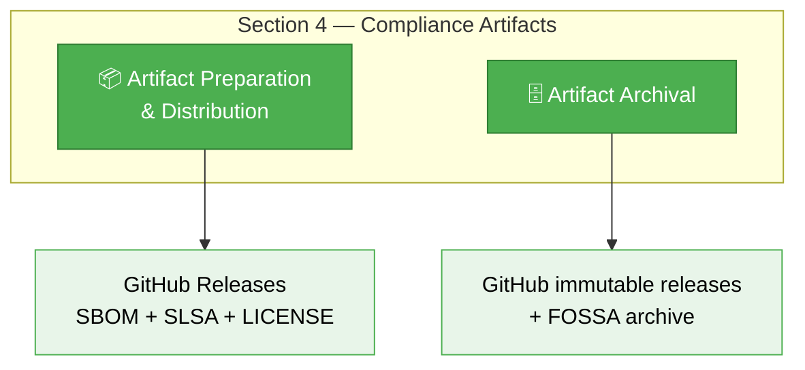

### 4.1 — Compliance Artifact Preparation and Distribution

| Checklist Item | Answer | Evidence |
|----------------|--------|----------|
| We have a documented procedure describing the process for preparing and distributing compliance artifacts with the supplied software as required by the identified licenses. | ✅ **Yes** | [🛠️ Secure Development Policy § SBOM](./Secure_Development_Policy.md) • [🔓 Open Source Policy](./Open_Source_Policy.md) |

**📝 Assessment Detail:**

Compliance artifacts are prepared and distributed automatically with every release:

| Artifact | Format | Distribution Method | Purpose |
|----------|--------|---------------------|---------|
| **SBOM** | SPDX + CycloneDX | GitHub Release assets | Component inventory + licenses |
| **SLSA Provenance** | In-toto attestation | GitHub Attestations | Build integrity verification |
| **LICENSE** | Plain text | Repository root + packages | License terms |
| **NOTICE** | Plain text | Repository root (where required) | Third-party attribution |
| **FOSSA Report** | HTML/JSON | FOSSA platform | License compliance report |
| **Source Code** | Git repository | GitHub public repo | Complete source availability |

---

### 4.2 — Compliance Artifact Archival

| Checklist Item | Answer | Evidence |
|----------------|--------|----------|
| We have a documented procedure for archiving copies of compliance artifacts for the supplied software from either the last offer of the supplied software or as required by the identified licenses, whichever is longer. | ✅ **Yes** | GitHub Releases (versioned, publicly accessible) + FOSSA (continuous) |

**📝 Assessment Detail:**

- **GitHub Releases:** All release artifacts (including SBOMs and attestations) are retained in GitHub Releases for the lifetime of the repository. SLSA attestations provide tamper-evident provenance verification.
- **Git History:** Complete source history maintained via git version control
- **FOSSA:** Continuous license scanning history maintained on the FOSSA platform (for projects with FOSSA integration)
- **Backup:** Per [Backup & Recovery Policy](./Backup_Recovery_Policy.md), GitHub data is included in backup scope

> **Retention Period:** Compliance artifacts are retained for the lifetime of each repository (with no planned deprecation), plus backup retention per [Backup & Recovery Policy](./Backup_Recovery_Policy.md). Combined with git history preservation, this meets or exceeds typical "last offer + 3 years" requirements.

---

## 🤝 **Section 5: Understanding Open Source Community Engagements**

> 📎 _OpenChain Checklist Reference: [Section 5: Understanding open source community engagements](https://github.com/OpenChain-Project/Reference-Material/blob/master/OpenChain-Standards-Self-Certification/Checklist/ISO-IEC-5230/en/iso-5230-2020-Self-Certification-Checklist.md#section-5-understanding-open-source-community-engagements)_

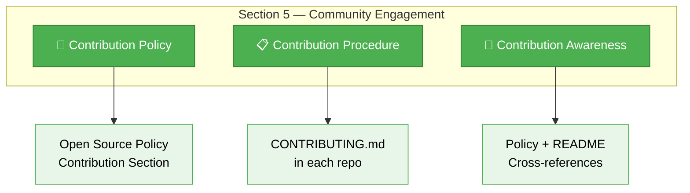

### 5.1 — Contribution Policy

| Checklist Item | Answer | Evidence |
|----------------|--------|----------|
| We have a documented open source contribution policy. | ✅ **Yes** | [🔓 Open Source Policy § Contribution Policy](./Open_Source_Policy.md) |

**📝 Assessment Detail:**

The Open Source Policy contains a dedicated contribution governance section covering:

- **Outbound Contributions:** Rules for contributing Hack23 code to external projects
- **Inbound Contributions:** Acceptance criteria for external contributions to Hack23 projects
- **License Compatibility:** Verification that contribution licenses align
- **IP Review:** Ensuring contributions don't introduce IP conflicts
- **DCO/CLA:** Developer Certificate of Origin requirements

---

### 5.2 — Contribution Governance Procedure

| Checklist Item | Answer | Evidence |
|----------------|--------|----------|
| We have a documented procedure governing open source contributions. | ✅ **Yes** | CONTRIBUTING.md in each repository |

**📝 Assessment Detail:**

Each repository maintains a `CONTRIBUTING.md` file with:

- How to submit contributions (pull request workflow)
- Code quality standards and testing requirements
- License agreement requirements
- Code of conduct reference
- Review and approval process

**📊 Evidence:**

| Project | CONTRIBUTING.md | CODE_OF_CONDUCT.md |
|---------|-----------------|---------------------|
| 🏛️ CIA | [CONTRIBUTING.md](https://github.com/Hack23/cia/blob/master/CONTRIBUTING.md) | [CODE_OF_CONDUCT.md](https://github.com/Hack23/cia/blob/master/CODE_OF_CONDUCT.md) |
| 🎮 Black Trigram | [CONTRIBUTING.md](https://github.com/Hack23/blacktrigram/blob/main/CONTRIBUTING.md) | [CODE_OF_CONDUCT.md](https://github.com/Hack23/blacktrigram/blob/main/CODE_OF_CONDUCT.md) |
| 📊 CIA CM | [CONTRIBUTING.md](https://github.com/Hack23/cia-compliance-manager/blob/main/CONTRIBUTING.md) | [CODE_OF_CONDUCT.md](https://github.com/Hack23/cia-compliance-manager/blob/main/CODE_OF_CONDUCT.md) |

---

### 5.3 — Contribution Awareness

| Checklist Item | Answer | Evidence |
|----------------|--------|----------|
| We have a documented procedure for making all program participants aware of the open source contribution policy. | ✅ **Yes** | [🔓 Open Source Policy](./Open_Source_Policy.md) + repository documentation |

**📝 Assessment Detail:**

As a single-person company, the CEO is both the policy author and sole contributor. Awareness is demonstrated through:

- The Open Source Policy contribution section is maintained in the ISMS repository
- Each project's CONTRIBUTING.md references the contribution governance
- All contributions are made by the CEO who authored the contribution policy

---

## ✅ **Section 6: Adherence to the Specification Requirements**

> 📎 _OpenChain Checklist Reference: [Section 6: Adherence to the specification requirements](https://github.com/OpenChain-Project/Reference-Material/blob/master/OpenChain-Standards-Self-Certification/Checklist/ISO-IEC-5230/en/iso-5230-2020-Self-Certification-Checklist.md#section-6-adherence-to-the-specification-requirements)_

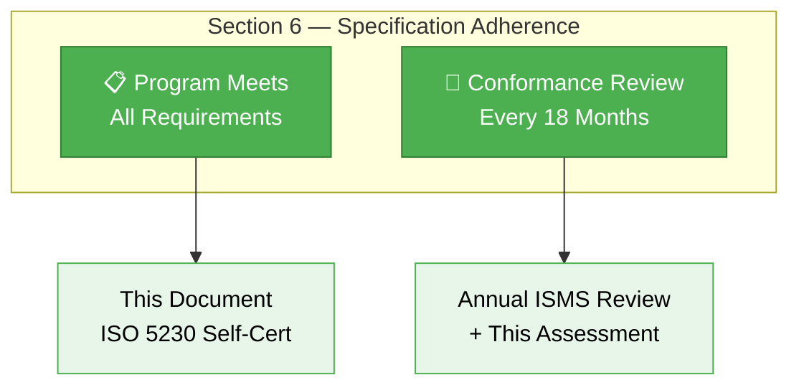

### 6.1 — Program Meets All Requirements

| Checklist Item | Answer | Evidence |
|----------------|--------|----------|
| We have documentation confirming that the program meets all the requirements of the specification. | ✅ **Yes** | This document (ISO_5230_Self_Certification.md) |

**📝 Assessment Detail:**

This self-certification document serves as the comprehensive evidence that Hack23 AB's open source compliance program meets all requirements of ISO/IEC 5230:2020. Each of the 34 checklist items has been assessed with:

- Direct answer (Yes / Yes with Caveat)
- Specific evidence and policy references
- Honest caveats where the single-person company structure differs from multi-person assumptions
- Public, verifiable evidence via badges and links

---

### 6.2 — Regular Conformance Review

| Checklist Item | Answer | Evidence |
|----------------|--------|----------|
| We have documentation confirming that the program conformance is reviewed at least every 18 months. | ✅ **Yes** | Annual ISMS review cycle |

**📝 Assessment Detail:**

- **This Assessment:** First ISO 5230 self-certification performed 2026-04-10
- **Annual Assessment:** Annual (12 months), exceeding the 18-month minimum required by the standard
- **Next Review:** 2027-04-10 (12 months from this assessment)
- **Trigger Events:** Additionally reviewed when significant changes occur to the open source program

The ISMS review cycle documented in the [ISMS Transparency Plan](./ISMS_Transparency_Plan.md) and [Security Metrics](./Security_Metrics.md) ensures all policies, including this self-certification, are reviewed at least annually.

---

## 📊 **Complete Conformance Matrix**

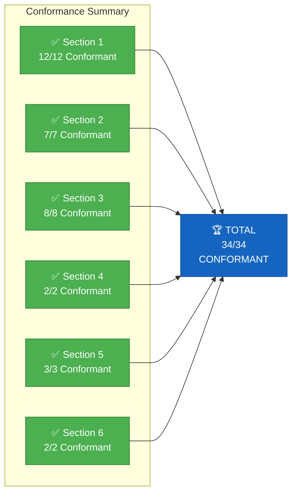

| # | Requirement | Section | Answer | Evidence | ISMS Policy Link |
|---|-------------|---------|--------|----------|------------------|
| 1.1 | Documented OSS compliance policy | S1 | ✅ Yes | Open Source Policy v2.4 | [🔓 Open Source Policy](./Open_Source_Policy.md) |
| 1.2 | Policy communication procedure | S1 | ✅ Yes | ISMS repo + ISMS-PUBLIC | [🌐 ISMS Transparency Plan](./ISMS_Transparency_Plan.md) |
| 1.3 | Roles and responsibilities identified | S1 | ✅ Yes | CEO = all roles (documented) | [🔓 Open Source Policy](./Open_Source_Policy.md) |
| 1.4 | Competency requirements documented | S1 | ✅ Yes | Policy + Secure Dev Policy | [🛠️ Secure Development Policy](./Secure_Development_Policy.md) |
| 1.5 | Assessed competence documented | S1 | ✅ Yes | CII Gold, OpenSSF, FOSSA | [📊 Security Metrics](./Security_Metrics.md) |
| 1.6 | Awareness: policy location | S1 | ✅ Yes | ISMS root + README links | [🔓 Open Source Policy](./Open_Source_Policy.md) |
| 1.7 | Awareness: objectives | S1 | ✅ Yes | Policy purpose statement | [🔓 Open Source Policy](./Open_Source_Policy.md) |
| 1.8 | Awareness: contributions expected | S1 | ✅ Yes | CONTRIBUTING.md in all repos | [🔓 Open Source Policy](./Open_Source_Policy.md) |
| 1.9 | Awareness: non-compliance implications | S1 | ✅ Yes | Policy + legal/regulatory refs | [✅ Compliance Checklist](./Compliance_Checklist.md) |
| 1.10 | Program scope process | S1 | ✅ Yes | In/out scope definition | [🔓 Open Source Policy](./Open_Source_Policy.md) |
| 1.11 | Written scope statement | S1 | ✅ Yes | Policy scope section | [🔓 Open Source Policy](./Open_Source_Policy.md) |
| 1.12 | License review procedure | S1 | ✅ Yes | FOSSA + manual review | [🔓 Open Source Policy](./Open_Source_Policy.md) |
| 2.1 | Public inquiry method | S2 | ✅ Yes | SECURITY.md + GitHub Issues | [🚨 Incident Response Plan](./Incident_Response_Plan.md) |
| 2.2 | Inquiry response procedure | S2 | ✅ Yes | IRP + Open Source Policy | [🚨 Incident Response Plan](./Incident_Response_Plan.md) |
| 2.3 | Program staffing documented | S2 | ✅ Yes | CEO = all roles | [🔓 Open Source Policy](./Open_Source_Policy.md) |
| 2.4 | Adequate staffing and funding | S2 | ✅ Yes | Tool subscriptions + automation | [💻 Asset Register](./Asset_Register.md) |
| 2.5 | Legal expertise identified | S2 | ⚠️ Yes* | CEO expertise + external available | [🔓 Open Source Policy](./Open_Source_Policy.md) |
| 2.6 | Internal responsibilities assigned | S2 | ✅ Yes | Open Source Policy | [🔓 Open Source Policy](./Open_Source_Policy.md) |
| 2.7 | Non-compliance remediation procedure | S2 | ✅ Yes | Vuln Mgmt + Open Source Policy | [🔍 Vulnerability Management](./Vulnerability_Management.md) |
| 3.1 | Component tracking procedure | S3 | ✅ Yes | FOSSA + Dependabot + SBOM | [🛠️ Secure Development Policy](./Secure_Development_Policy.md) |
| 3.2 | Component records exist | S3 | ✅ Yes | SBOM in GitHub Releases | [🛠️ Secure Development Policy](./Secure_Development_Policy.md) |
| 3.3 | Binary distribution procedure | S3 | ✅ Yes | GitHub Releases + SLSA | [🛠️ Secure Development Policy](./Secure_Development_Policy.md) |
| 3.4 | Source distribution procedure | S3 | ✅ Yes | Public GitHub repositories | [🔓 Open Source Policy](./Open_Source_Policy.md) |
| 3.5 | Integration obligation procedure | S3 | ✅ Yes | License compatibility check | [🔓 Open Source Policy](./Open_Source_Policy.md) |
| 3.6 | Modified OSS procedure | S3 | ✅ Yes | Fork policy + license review | [🔓 Open Source Policy](./Open_Source_Policy.md) |
| 3.7 | Incompatible license procedure | S3 | ✅ Yes | FOSSA conflict detection | [🔓 Open Source Policy](./Open_Source_Policy.md) |
| 3.8 | Attribution requirements procedure | S3 | ✅ Yes | LICENSE files + FOSSA reports | [🔓 Open Source Policy](./Open_Source_Policy.md) |
| 4.1 | Artifact preparation and distribution | S4 | ✅ Yes | SBOM + SLSA + LICENSE | [🛠️ Secure Development Policy](./Secure_Development_Policy.md) |
| 4.2 | Artifact archival | S4 | ✅ Yes | GitHub Releases (permanent) | [💾 Backup & Recovery Policy](./Backup_Recovery_Policy.md) |
| 5.1 | Contribution policy | S5 | ✅ Yes | Open Source Policy | [🔓 Open Source Policy](./Open_Source_Policy.md) |
| 5.2 | Contribution governance procedure | S5 | ✅ Yes | CONTRIBUTING.md in each repo | [🔓 Open Source Policy](./Open_Source_Policy.md) |
| 5.3 | Contribution awareness | S5 | ✅ Yes | Policy + repo documentation | [🔓 Open Source Policy](./Open_Source_Policy.md) |
| 6.1 | Program meets all requirements | S6 | ✅ Yes | This document | This document |
| 6.2 | Conformance reviewed every 18 months | S6 | ✅ Yes | Annual ISMS review cycle | [📊 Security Metrics](./Security_Metrics.md) |

> **\*** Item 2.5 rated "Yes with Caveat" — CEO has extensive practical expertise but is not a licensed attorney. External legal counsel available if needed.

---

## 🔍 **ISMS Policy Cross-Reference Map**

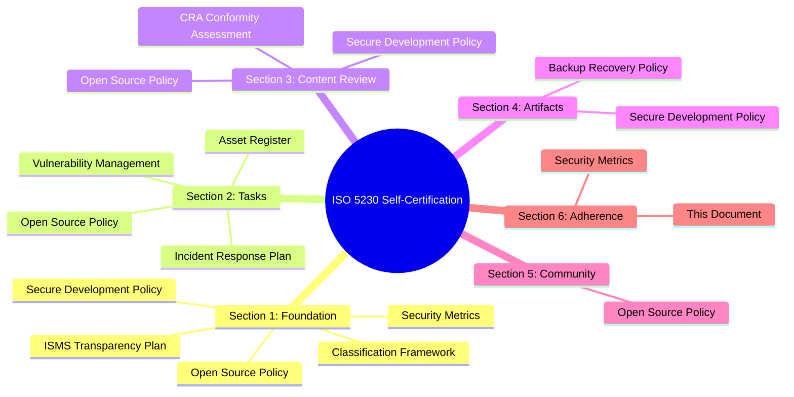

### 📚 Complete ISMS Policy Linkage

| ISMS Policy | ISO 5230 Sections Referenced | Purpose |
|-------------|------------------------------|---------|
| [🔓 Open Source Policy](./Open_Source_Policy.md) | S1, S2, S3, S5 | Primary compliance policy governing license compliance program |
| [🛠️ Secure Development Policy](./Secure_Development_Policy.md) | S1, S3, S4 | SBOM requirements, security testing, artifact generation |
| [✅ Compliance Checklist](./Compliance_Checklist.md) | S1, S6 | Multi-framework compliance mapping including open source |
| [🛡️ CRA Conformity Assessment](./CRA_Conformity_Assessment_Process.md) | S3, S4 | EU CRA compliance with SBOM and supply chain requirements |
| [🚨 Incident Response Plan](./Incident_Response_Plan.md) | S2 | Inquiry response and communication procedures |
| [🔍 Vulnerability Management](./Vulnerability_Management.md) | S2 | Non-compliance remediation SLAs and procedures |
| [💻 Asset Register](./Asset_Register.md) | S2 | Tool and subscription inventory |
| [📊 Security Metrics](./Security_Metrics.md) | S1, S6 | Compliance monitoring and review cycle evidence |
| [🌐 ISMS Transparency Plan](./ISMS_Transparency_Plan.md) | S1 | Policy publication and communication strategy |
| [💾 Backup & Recovery Policy](./Backup_Recovery_Policy.md) | S4 | Artifact archival and retention |
| [🏷️ Data Classification Policy](./Data_Classification_Policy.md) | S3 | Classification of open source components |
| [🤝 Third-Party Management](./Third_Party_Management.md) | S3 | Supply chain security for dependencies |

---

## 🏆 **Self-Certification Declaration**

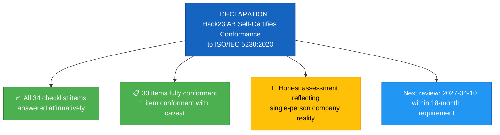

### Declaration Statement

**Hack23 AB** hereby self-certifies that its open source license compliance program conforms to the requirements of **ISO/IEC 5230:2020** (OpenChain Specification 2.1) as of **2026-04-10**.

This self-certification is based on:

- ✅ Comprehensive assessment of all 34 checklist items
- ✅ 33 items fully conformant, 1 item conformant with documented caveat
- ✅ Evidence linked to specific ISMS policies and public verification sources
- ✅ Honest, transparent assessment reflecting single-person company structure
- ✅ Annual review cycle (12 months) exceeding the 18-month requirement

**Certified by:** James Pether Sörling, CEO, Hack23 AB  
**Date:** 2026-04-10  
**Valid until:** 2027-10-10 (18 months per specification requirement)

---

## 📚 Related Documents

- [🔓 Open Source Policy](./Open_Source_Policy.md) — Primary open source governance policy
- [🛠️ Secure Development Policy](./Secure_Development_Policy.md) — SBOM, testing, and security requirements
- [✅ Compliance Checklist](./Compliance_Checklist.md) — Multi-framework compliance mapping
- [🛡️ CRA Conformity Assessment Process](./CRA_Conformity_Assessment_Process.md) — EU CRA compliance process
- [🚨 Incident Response Plan](./Incident_Response_Plan.md) — Inquiry response procedures
- [🔍 Vulnerability Management](./Vulnerability_Management.md) — Non-compliance remediation
- [💻 Asset Register](./Asset_Register.md) — Tool and asset inventory
- [📊 Security Metrics](./Security_Metrics.md) — Compliance monitoring and KPIs
- [🌐 ISMS Transparency Plan](./ISMS_Transparency_Plan.md) — Public policy communication
- [💾 Backup & Recovery Policy](./Backup_Recovery_Policy.md) — Artifact archival
- [🏷️ Data Classification Policy](./Data_Classification_Policy.md) — Information classification
- [🤝 Third-Party Management](./Third_Party_Management.md) — Supply chain governance
- [🔐 Information Security Policy](./Information_Security_Policy.md) — Master security governance

---

**📋 Document Control:**  
**✅ Approved by:** James Pether Sörling, CEO  
**📤 Distribution:** All Personnel, Clients, Open Source Community  
**🏷️ Classification:**   
**📅 Effective Date:** 2026-04-10  
**⏰ Next Review:** 2027-04-10  
**🎯 Framework Compliance:**     
