<p align="center">
  
</p>

<h1 align="center">🚨 Hack23 AB — Incident Response Plan</h1>

<p align="center">
  <strong>🛡️ Rapid Response Through Systematic Security Incident Management</strong><br>
  <em>🎯 Classification-Driven Response • Automated Escalation • Transparent Communication</em>
</p>

<p align="center">
  <a href="#"></a>
  <a href="#"></a>
  <a href="#"></a>
  <a href="#"></a>
</p>


**📋 Document Owner:** CEO | **📄 Version:** 1.5 | **📅 Last Updated:** 2026-01-25 (UTC)  
**🔄 Review Cycle:** Quarterly | **⏰ Next Review:** 2026-04-25

---

## 🎯 **Purpose Statement**

**Hack23 AB's** incident response framework demonstrates how **systematic security incident management directly enables business resilience and stakeholder confidence.** Our approach serves as both operational necessity and client demonstration of professional cybersecurity incident handling capabilities.

This plan establishes comprehensive procedures for detecting, analyzing, containing, eradicating, and recovering from security incidents using our [🏷️ Classification Framework](./CLASSIFICATION.md) for impact assessment and response prioritization. All incidents are managed through transparent communication and measurable response times aligned with our business continuity requirements.

Our incident response capabilities showcase systematic security operations and rapid response coordination, demonstrating the very incident management excellence we deliver to our consulting clients.

*— James Pether Sörling, CEO/Founder*

---

## 🤖 **AI Agent-Assisted Incident Response**

Hack23 AB leverages its curated AI agent ecosystem to enhance incident detection, triage, containment, and documentation, reducing Mean Time to Detect (MTTD) and Mean Time to Respond (MTTR) while maintaining human-in-the-loop governance aligned with [🤖 AI Policy](./AI_Policy.md) and [🔐 Information Security Strategy](./Information_Security_Strategy.md).

### **🎯 Agent Roles in Incident Response**

| Phase | Agent Type | Responsibilities | Human Oversight |
|-------|-----------|------------------|-----------------|
| **🔍 Detection** | Curator-Agent | Monitor agent profiles, MCP configs, tool permissions for security anomalies | CEO review of anomalies |
| **🏷️ Triage** | Task Agent (ISMS) | Automated severity classification, impact assessment, stakeholder identification | CEO approval of severity |
| **🔬 Analysis** | Security Specialist | Root cause analysis, attack vector identification, similar incident patterns | CEO validation |
| **🛡️ Containment** | Security Specialist | Generate containment procedures, isolation steps, rollback plans | CEO execution approval |
| **🔧 Remediation** | Security/Dev Specialists | Automated patch generation, configuration fixes, test validation | CEO deployment approval |
| **📝 Documentation** | ISMS Documentation Agent ("ISMS Ninja") | Generate incident reports, lessons learned, policy update recommendations | CEO final review |
| **📢 Communication** | Business Specialist | Draft stakeholder notifications, customer communications, regulatory reports | CEO authorization |

**🛡️ Human-in-the-Loop Enforcement:**
- All AI agent incident response actions require explicit CEO review and approval
- No automated execution of containment or remediation without human confirmation
- Agent recommendations are advisory; CEO makes final incident response decisions
- Post-incident AI agent performance review to improve future recommendations
- AI agents operate within permissions defined in [🤖 AI Policy](./AI_Policy.md)

**🔗 Integration with ISMS Framework:**
- **Automated Detection:** Curator-agent monitors `.github/agents/*.md` changes, MCP configurations, and tool permissions per [🔐 Information Security Strategy](./Information_Security_Strategy.md#-ai-agent-governance--strategic-automation)
- **Risk Assessment:** Agent recommendations evaluated using [📊 Risk Assessment Methodology](./Risk_Assessment_Methodology.md)
- **Evidence Collection:** Agent-generated documentation maintained in [💻 Asset Register](./Asset_Register.md) and incident tracking system
- **Continuous Learning:** Agent performance metrics tracked in [📊 Security Metrics](./Security_Metrics.md)

> **Note:** "ISMS Ninja" is a colloquial label for the ISMS documentation AI agent. Formal agent profiles are maintained in the `.github/agents/` directory.

---

## 🔍 **Purpose & Scope**

This plan establishes the framework for systematically responding to all security incidents affecting Hack23 AB information assets, services, and operations.

**Scope:** All security incidents affecting assets documented in [💻 Asset Register](./Asset_Register.md), including:
- **🚨 Security Breaches:** Unauthorized access, data exposure, system compromise
- **🔍 Vulnerability Incidents:** Critical vulnerability exploitation, zero-day attacks  
- **☁️ Service Disruptions:** AWS outages, supplier failures, system unavailability
- **📦 Supply Chain Incidents:** Supplier security breaches, dependency compromises
- **🔐 Data Incidents:** Data loss, corruption, unauthorized disclosure

**Policy Integration:**
- **🔍 Vulnerability Management:** Aligned with [🔍 Vulnerability Management](./Vulnerability_Management.md) response procedures
- **🤝 Third Party Management:** Integrated with [🤝 Third Party Management](./Third_Party_Management.md) supplier coordination
- **🔐 Information Security:** Supporting [🔐 Information Security Policy](./Information_Security_Policy.md) governance framework

---

## 📊 **Incident Classification & Response Framework**

### **🎯 Impact-Based Classification Matrix**

Using [🏷️ Classification Framework](./CLASSIFICATION.md) business impact analysis:

```mermaid
%%{
  init: {
    'theme': 'base',
    'themeVariables': {
      'primaryColor': '#1565C0',
      'primaryTextColor': '#0d47a1',
      'lineColor': '#1565C0',
      'secondaryColor': '#D32F2F',
      'tertiaryColor': '#FF9800'
    }
  }
}%%
flowchart TD
    INCIDENT[🚨 Security Incident Detected] --> ASSESS[📊 Business Impact Assessment]
    
    ASSESS --> CRITICAL{🔴 Critical Impact?<br/>€10K+ daily loss<br/>Complete outage<br/>Criminal liability}
    ASSESS --> HIGH{🟠 High Impact?<br/>€5-10K daily loss<br/>Major degradation<br/>Significant fines}
    ASSESS --> MEDIUM{🟡 Medium Impact?<br/>€1-5K daily loss<br/>Partial impact<br/>Minor penalties}
    ASSESS --> LOW{🟢 Low Impact?<br/><€1K daily loss<br/>Minor inconvenience<br/>No implications}
    
    CRITICAL -->|YES| C_RESPONSE[🔴 Critical Response<br/>< 30 min response<br/>< 4 hr resolution<br/>All stakeholders]
    HIGH -->|YES| H_RESPONSE[🟠 High Response<br/>< 1 hr response<br/>< 24 hr resolution<br/>Key stakeholders]
    MEDIUM -->|YES| M_RESPONSE[🟡 Medium Response<br/>< 4 hr response<br/>< 72 hr resolution<br/>Internal only]
    LOW -->|YES| L_RESPONSE[🟢 Low Response<br/>< 24 hr response<br/>< 1 week resolution<br/>Documentation]
    
    style INCIDENT fill:#F57C00,color:#fff
    style ASSESS fill:#2196f3,color:#fff
    style CRITICAL fill:#d32f2f,color:#fff
    style HIGH fill:#ff9800,color:#fff
    style MEDIUM fill:#ffc107,color:#000
    style LOW fill:#4caf50,color:#fff
    style C_RESPONSE fill:#D32F2F,stroke:#d32f2f,stroke-width:3px
    style H_RESPONSE fill:#FF9800,stroke:#ff9800,stroke-width:2px
    style M_RESPONSE fill:#FFC107,stroke:#ffc107,stroke-width:2px
    style L_RESPONSE fill:#4CAF50,stroke:#4caf50,stroke-width:2px
```

#### **📋 Incident Response SLA Matrix**

| Incident Level | Detection Target | Response Time | Resolution Target | Escalation | Communication |
|----------------|------------------|---------------|-------------------|------------|---------------|
| **🔴 Critical** | [](./CLASSIFICATION.md) | **<30 minutes** | **<4 hours** | Immediate CEO | All stakeholders |
| **🟠 High** | [](./CLASSIFICATION.md) | **<1 hour** | **<24 hours** | <1 hour CEO | Key stakeholders |
| **🟡 Medium** | [](./CLASSIFICATION.md) | **<4 hours** | **<72 hours** | <4 hours | Internal only |
| **🟢 Low** | [](./CLASSIFICATION.md) | **<24 hours** | **<1 week** | Daily report | Documentation |

---

## 🚨 **Incident Response Flowchart**

Hack23's comprehensive incident response process with severity-based escalation paths, RTO timelines, and regulatory notification requirements.

```mermaid
flowchart TD
    DETECT[🔍 Incident Detected<br/>Monitoring/Alert/Report/Discovery] --> CLASSIFY{🏷️ Classify Severity<br/>Business Impact Assessment}
    
    CLASSIFY -->|🔴 Critical<br/>S1: >€10K daily loss| IMMEDIATE[⚡ Immediate Response<br/>RTO: 30 min<br/>CEO + External Consultant<br/>All Stakeholders Alert]
    CLASSIFY -->|🟠 High<br/>S2: €5-10K daily loss| URGENT[🔴 Urgent Response<br/>RTO: 1 hour<br/>CEO + Insurance Provider<br/>Key Stakeholders]
    CLASSIFY -->|🟡 Medium<br/>S3: €1-5K daily loss| STANDARD[🟡 Standard Response<br/>RTO: 4 hours<br/>CEO Investigation<br/>Internal Only]
    CLASSIFY -->|🟢 Low<br/>S4: <€1K daily loss| ROUTINE[🟢 Routine Response<br/>RTO: 24 hours<br/>CEO Scheduled Review<br/>Documentation]
    
    IMMEDIATE --> CONTAIN[🛡️ Containment<br/>Isolate Affected Systems<br/>Preserve Evidence<br/>AWS Detective Analysis]
    URGENT --> CONTAIN
    STANDARD --> CONTAIN
    ROUTINE --> CONTAIN
    
    CONTAIN --> INVESTIGATE[🔬 Investigation<br/>Root Cause Analysis<br/>Timeline Construction<br/>Impact Assessment]
    
    INVESTIGATE --> REMEDIATE[🔧 Remediation<br/>Fix Vulnerability<br/>Remove Threat<br/>Restore Security]
    
    REMEDIATE --> VALIDATE[✅ Validation<br/>Verify Resolution<br/>Security Testing<br/>Control Effectiveness]
    
    VALIDATE --> DOCUMENT[📝 Incident Report<br/>Timeline Documentation<br/>Lessons Learned<br/>Control Updates]
    
    DOCUMENT --> IMPROVE[📈 Process Improvement<br/>Update Runbooks<br/>Control Enhancement<br/>Training Update]
    
    IMPROVE --> EXTERNAL_NOTIFY{📢 External<br/>Notification<br/>Required?}
    
    EXTERNAL_NOTIFY -->|Yes<br/>GDPR/NIS2/Breach| NOTIFY[📢 Notify Authorities<br/>GDPR: 72-hour deadline<br/>NIS2: 24-hour initial<br/>Customer Communication]
    EXTERNAL_NOTIFY -->|No<br/>Internal Only| CLOSE[✅ Close Incident<br/>Update Risk Register<br/>Archive Evidence<br/>Quarterly Review]
    
    NOTIFY --> CLOSE
    
    CLOSE --> MONITOR[🔄 Continuous Monitoring<br/>Detect Recurrence<br/>Control Validation<br/>Metrics Tracking]
    
    style DETECT fill:#2196F3,stroke:#1565C0,stroke-width:3px,color:#fff
    style CLASSIFY fill:#FF9800,stroke:#F57C00,stroke-width:3px,color:#fff
    style IMMEDIATE fill:#D32F2F,stroke:#B71C1C,stroke-width:3px,color:#fff
    style URGENT fill:#FF5722,stroke:#D84315,stroke-width:2px,color:#fff
    style STANDARD fill:#FFC107,stroke:#F9A825,stroke-width:2px,color:#000
    style ROUTINE fill:#4CAF50,stroke:#2E7D32,stroke-width:2px,color:#fff
    style CONTAIN fill:#7B1FA2,stroke:#4A148C,stroke-width:2px,color:#fff
    style INVESTIGATE fill:#1565C0,stroke:#0D47A1,stroke-width:2px,color:#fff
    style REMEDIATE fill:#FF9800,stroke:#F57C00,stroke-width:2px,color:#fff
    style VALIDATE fill:#4CAF50,stroke:#2E7D32,stroke-width:2px,color:#fff
    style DOCUMENT fill:#1565C0,stroke:#0D47A1,stroke-width:2px,color:#fff
    style IMPROVE fill:#7B1FA2,stroke:#4A148C,stroke-width:2px,color:#fff
    style EXTERNAL_NOTIFY fill:#FF9800,stroke:#F57C00,stroke-width:2px,color:#fff
    style NOTIFY fill:#D32F2F,stroke:#B71C1C,stroke-width:2px,color:#fff
    style CLOSE fill:#4CAF50,stroke:#2E7D32,stroke-width:3px,color:#fff
    style MONITOR fill:#2196F3,stroke:#1565C0,stroke-width:2px,color:#fff
```

**Key Takeaways:**
- **🏷️ Severity-Based Classification:** Four levels (S1 Critical, S2 High, S3 Medium, S4 Low) based on business impact assessment using [Classification Framework](./CLASSIFICATION.md)
- **⏰ RTO Targets:** Critical 30 min, High 1 hour, Medium 4 hours, Low 24 hours - demonstrates rapid response capability
- **🤝 Escalation Paths:** Critical/High incidents involve external consultants and insurance providers; Medium/Low handled internally
- **🔬 Investigation Process:** Systematic root cause analysis using AWS Detective for automated ML-powered investigation
- **📢 Regulatory Notification:** GDPR 72-hour and NIS2 24-hour notification deadlines integrated into workflow
- **🔄 Continuous Improvement:** Lessons learned and control updates ensure security posture strengthens after each incident

**Related Documents:**
- [🏷️ Classification Framework](./CLASSIFICATION.md) — Business impact definitions for severity classification
- [📉 Risk Register](./Risk_Register.md) — Risk event correlation and treatment tracking
- [🔄 Business Continuity Plan](./Business_Continuity_Plan.md) — Service restoration procedures
- [🆘 Disaster Recovery Plan](./Disaster_Recovery_Plan.md) — Technical recovery procedures
- [🤝 Third Party Management](./Third_Party_Management.md) — Supplier incident coordination
- [📊 Security Metrics](./Security_Metrics.md) — Incident response KPIs and performance tracking

---

## 🔄 **Incident Response Process**

### **Phase 1: Detection & Initial Assessment (0-30 minutes)**

#### **🚨 Detection Sources & Integration**

**Traditional Detection Methods:**
- **☁️ AWS Native Monitoring:** Security Hub, GuardDuty, Config, CloudWatch
- **🔍 Vulnerability Scanners:** SonarCloud, FOSSA, Dependabot alerts
- **👥 User Reports:** Help desk tickets, community feedback
- **📋 Routine Audits:** Security reviews, compliance assessments

**🤖 AI Agent-Enhanced Detection (New)**

**Curator-Agent Security Monitoring:**
- **Agent Profile Monitoring:** Automated scanning of `.github/agents/*.md` changes for security implications
- **MCP Configuration Review:** Detection of insecure MCP server configurations or credential exposure
- **Tool Permission Auditing:** Weekly automated review of agent tool permissions for least-privilege violations
- **Agent Activity Anomalies:** Detection of unusual agent behavior patterns (excessive API calls, tool usage spikes)

```mermaid
flowchart TD
    CURATOR[🤖 Curator-Agent<br/>Continuous Monitoring] --> ANOMALY{Security<br/>Anomaly<br/>Detected?}
    ANOMALY -->|Yes| CLASSIFY[🤖 Task Agent<br/>Severity Classification]
    ANOMALY -->|No| CURATOR
    
    CLASSIFY --> CRITICAL{Severity<br/>Level}
    CRITICAL -->|🔴 Critical/High| ALERT_CEO[⚡ Immediate CEO Alert<br/>SMS + Email]
    CRITICAL -->|🟡 Medium| QUEUE_REVIEW[📋 Queue for Daily Review]
    CRITICAL -->|🟢 Low| LOG[📝 Log for Weekly Review]
    
    ALERT_CEO --> CEO_REVIEW[👨‍💼 CEO Manual Review]
    QUEUE_REVIEW --> CEO_REVIEW
    LOG --> CEO_REVIEW
    
    CEO_REVIEW --> INCIDENT{Confirm<br/>Incident?}
    INCIDENT -->|Yes| IR_ACTIVATION[🚨 Activate IR Procedure]
    INCIDENT -->|No| FALSE_POS[❌ False Positive<br/>Tune Agent]
    
    classDef agent fill:#7B1FA2,stroke:#4A148C,stroke-width:2px,color:#fff
    classDef critical fill:#D32F2F,stroke:#B71C1C,stroke-width:3px,color:#fff
    classDef human fill:#2E7D32,stroke:#1B5E20,stroke-width:3px,color:#fff
    
    class CURATOR,CLASSIFY agent
    class ALERT_CEO critical
    class CEO_REVIEW,IR_ACTIVATION human
```

**🎯 Target MTTD (AI-Enhanced):**
- **Critical Incidents:** <5 minutes (vs previous 15 minutes average)
- **High Severity:** <15 minutes (vs previous 30 minutes)
- **Medium Severity:** <1 hour (vs previous 2 hours)
- **Low Severity:** <24 hours (unchanged)

**📊 AI Agent Detection Performance Tracking:**
- **True Positive Rate:** Agent-detected incidents confirmed as genuine threats
- **False Positive Rate:** Target <10% (with quarterly tuning per [📊 Security Metrics](./Security_Metrics.md))
- **Detection Speed:** Time from anomaly occurrence to CEO alert
- **Coverage Expansion:** New detection patterns identified by AI agent learning

```mermaid
%%{
  init: {
    'theme': 'base',
    'themeVariables': {
      'primaryColor': '#1565C0',
      'primaryTextColor': '#1565C0',
      'lineColor': '#03a9f4'
    }
  }
}%%
flowchart TD
    DETECT[🔍 Incident Detection] --> DETECTIVE[🕵️ AWS Detective Integration]
    
    DETECT --> AWS_NATIVE[☁️ AWS Native Detection]
    DETECT --> EXTERNAL[🌐 External Detection]
    DETECT --> MANUAL[👤 Manual Discovery]
    DETECT --> AI_AGENTS[🤖 AI Agent Detection]
    
    AWS_NATIVE --> SECURITY_HUB[🛡️ Security Hub<br/>Centralized Findings]
    AWS_NATIVE --> GUARDDUTY[🔍 GuardDuty<br/>Threat Detection]
    AWS_NATIVE --> CONFIG[📊 Config<br/>Compliance Monitoring]
    AWS_NATIVE --> CLOUDWATCH[📈 CloudWatch<br/>Performance Alerts]
    
    EXTERNAL --> GITHUB[🐙 GitHub Security<br/>Code Vulnerabilities]
    EXTERNAL --> SONAR[📊 SonarCloud<br/>Quality Gates]
    EXTERNAL --> SUPPLIER[🤝 Supplier Notifications<br/>Third-party Alerts]
    
    MANUAL --> USER_REPORT[👥 User Reports]
    MANUAL --> EXTERNAL_INTEL[🌍 External Intelligence]
    
    AI_AGENTS --> CURATOR_MON[🤖 Curator Monitoring<br/>Agent Profile Changes]
    AI_AGENTS --> MCP_AUDIT[🔐 MCP Config Review<br/>Security Validation]
    AI_AGENTS --> PERM_CHECK[🛡️ Permission Auditing<br/>Least Privilege]
    
    SECURITY_HUB --> DETECTIVE
    GUARDDUTY --> DETECTIVE
    CONFIG --> DETECTIVE
    CLOUDWATCH --> DETECTIVE
    CURATOR_MON --> DETECTIVE
    MCP_AUDIT --> DETECTIVE
    PERM_CHECK --> DETECTIVE
    
    DETECTIVE --> ANALYSIS[🔍 Automated Analysis<br/>ML-Powered Investigation]
    
    style DETECTIVE fill:#F57C00,color:#fff
    style ANALYSIS fill:#4caf50,color:#fff
    style AI_AGENTS fill:#7B1FA2,color:#fff
```

#### **📊 Initial Response Actions (First 15 Minutes)**

| Action | Responsibility | Tools | Success Criteria |
|--------|---------------|-------|------------------|
| **🔍 Incident Confirmation** | CEO | AWS Detective, Security Hub | Incident validated and classified |
| **📊 Impact Assessment** | CEO | Classification Framework | Business impact determined |
| **🚨 Stakeholder Notification** | CEO | Communication matrix | Key stakeholders alerted |
| **📋 Evidence Preservation** | Automated + CEO | AWS native logging | Evidence secured for analysis |

### **Phase 2: Investigation & Analysis (30 minutes - 4 hours)**

#### **🕵️ AWS Detective-Powered Investigation**

```mermaid
%%{
  init: {
    'theme': 'base',
    'themeVariables': {
      'primaryColor': '#FFC107',
      'primaryTextColor': '#f57f17',
      'lineColor': '#ffb300'
    }
  }
}%%
flowchart TD
    ALERT[🚨 Security Alert] --> DETECTIVE[🕵️ AWS Detective Analysis]
    
    DETECTIVE --> ENTITIES[👤 Entity Analysis]
    DETECTIVE --> TIMELINE[⏰ Timeline Construction]
    DETECTIVE --> RELATIONSHIPS[🔗 Relationship Mapping]
    DETECTIVE --> EVIDENCE[📋 Evidence Collection]
    
    ENTITIES --> E1[User Activity<br/>IP Addresses<br/>AWS Resources<br/>API Calls]
    
    TIMELINE --> T1[Event Sequence<br/>Attack Progression<br/>Impact Timeline<br/>Response Windows]
    
    RELATIONSHIPS --> R1[Service Interactions<br/>Network Connections<br/>Data Flow<br/>Access Patterns]
    
    EVIDENCE --> EV1[CloudTrail Events<br/>VPC Flow Logs<br/>DNS Logs<br/>GuardDuty Findings]
    
    E1 --> ASSESSMENT[📊 Impact Assessment]
    T1 --> ASSESSMENT
    R1 --> ASSESSMENT
    EV1 --> ASSESSMENT
    
    ASSESSMENT --> RESPONSE[🚀 Response Strategy]
    
    style DETECTIVE fill:#F57C00,color:#fff
    style ASSESSMENT fill:#4CAF50
    style RESPONSE fill:#4caf50,color:#fff
```

#### **🔍 AWS Detective Investigation Features**

| Investigation Capability | AWS Detective Feature | Business Value | Integration |
|-------------------------|----------------------|----------------|-------------|
| **🯠Automated Root Cause** | ML-powered analysis of security findings | [](./CLASSIFICATION.md) | Security Hub findings |
| **📈 Behavioral Analytics** | Baseline comparison and anomaly detection | [](./CLASSIFICATION.md) | GuardDuty insights |
| **🕸️ Relationship Mapping** | Visual entity relationship graphs | [](./CLASSIFICATION.md) | Cross-service analysis |
| **⏰ Timeline Reconstruction** | Chronological event sequencing | [](./CLASSIFICATION.md) | CloudTrail integration |
| **📊 Impact Visualization** | Interactive security dashboards | [](./CLASSIFICATION.md) | Stakeholder reporting |

#### **📋 Investigation Checklist**

**🔍 AWS Detective Analysis:**
- [ ] **Entity Overview** - Affected users, roles, and resources identified
- [ ] **Timeline Reconstruction** - Complete event sequence with time correlation
- [ ] **Relationship Mapping** - Service interactions and dependencies visualized
- [ ] **Behavioral Analysis** - Comparison with historical baseline patterns
- [ ] **Evidence Collection** - CloudTrail, VPC Flow Logs, DNS logs aggregated

**🌐 External Investigation:**
- [ ] **GitHub Analysis** - Audit logs and security scanning results
- [ ] **Supplier Coordination** - Third-party incident reports and status
- [ ] **Threat Intelligence** - External feeds and IOC correlation

**🤖 AI Agent-Assisted Investigation (New):**
- [ ] **Similar Incident Analysis** - Security Specialist agent searches historical patterns
- [ ] **Attack Vector Identification** - Automated MITRE ATT&CK framework mapping
- [ ] **Impact Scope Assessment** - Task Agent cross-references Asset Register and Classification Framework
- [ ] **Remediation Options Generation** - Security Specialist provides ranked containment strategies
- [ ] **Automated Timeline Documentation** - ISMS Ninja drafts investigation timeline for CEO review

#### **🔬 AI-Assisted Incident Triage**

**Automated Severity Classification:**

When an incident is detected, the Task Agent (ISMS) performs automated initial triage, requiring CEO validation before proceeding:

**1. Impact Assessment:**
- Affected assets identified from [💻 Asset Register](./Asset_Register.md)
- CIA classification retrieved from [🏷️ Classification Framework](./CLASSIFICATION.md)
- Business impact calculated using [📊 Risk Assessment Methodology](./Risk_Assessment_Methodology.md) scoring
- RTO/RPO implications evaluated against continuity requirements

**2. Stakeholder Identification:**
- **Primary contact:** CEO (always)
- **Secondary contacts:** Insurance provider, legal counsel (for high/critical)
- **Regulatory authorities:** GDPR, NIS2 (if applicable based on incident type)
- **Customers:** Identified from affected asset registry and service dependencies

**3. Initial Containment Recommendations:**
- Security Specialist agent generates containment options ranked by effectiveness
- Options evaluated against business impact and operational continuity
- Rollback procedures identified from [📝 Change Management](./Change_Management.md) history
- Resource requirements and timeline estimates provided

**4. Incident Report Generation:**
- ISMS Ninja agent drafts initial incident report with:
  - Executive summary and impact assessment
  - Detailed timeline of detection and initial response
  - Affected systems and data classification
  - Recommended immediate actions and escalation path
- CEO reviews and approves before formal incident declaration

**🤖 AI Triage Workflow:**

```mermaid
%%{
  init: {
    'theme': 'base',
    'themeVariables': {
      'primaryColor': '#FF9800',
      'primaryTextColor': '#f57f17',
      'lineColor': '#ffb300'
    }
  }
}%%
flowchart TD
    INCIDENT_DETECTED[🚨 Incident Detected] --> TASK_AGENT[🤖 Task Agent<br/>Automated Triage]
    
    TASK_AGENT --> ASSESS_IMPACT[📊 Impact Assessment<br/>Asset + CIA + Risk Scoring]
    TASK_AGENT --> ID_STAKEHOLDERS[👥 Stakeholder ID<br/>Auto-generate contact list]
    TASK_AGENT --> GEN_OPTIONS[🛡️ Containment Options<br/>Security Specialist ranking]
    
    ASSESS_IMPACT --> SEVERITY[🏷️ Severity Classification<br/>Critical/High/Medium/Low]
    ID_STAKEHOLDERS --> COMMS_PLAN[📢 Communications Plan<br/>Business Specialist draft]
    GEN_OPTIONS --> REMEDIATION[🔧 Remediation Steps<br/>Prioritized action list]
    
    SEVERITY --> ISMS_NINJA[📝 ISMS Ninja<br/>Draft Incident Report]
    COMMS_PLAN --> ISMS_NINJA
    REMEDIATION --> ISMS_NINJA
    
    ISMS_NINJA --> CEO_REVIEW[👨‍💼 CEO Review & Approval]
    
    CEO_REVIEW --> ACCEPT{Accept AI<br/>Triage?}
    ACCEPT -->|✅ Accept| EXECUTE[🚀 Execute Response Plan]
    ACCEPT -->|🔄 Adjust| MODIFY[✏️ Modify Classification/Actions]
    ACCEPT -->|❌ Reject| MANUAL[👤 Manual Triage Override]
    
    MODIFY --> EXECUTE
    MANUAL --> EXECUTE
    
    style TASK_AGENT fill:#7B1FA2,stroke:#4A148C,stroke-width:2px,color:#fff
    style ISMS_NINJA fill:#7B1FA2,stroke:#4A148C,stroke-width:2px,color:#fff
    style CEO_REVIEW fill:#2E7D32,stroke:#1B5E20,stroke-width:3px,color:#fff
    style EXECUTE fill:#4CAF50,stroke:#2E7D32,stroke-width:2px,color:#fff
```

**🛡️ Human Validation Requirements:**

All AI-generated triage outputs are presented to CEO for validation. CEO may:
- **✅ Accept:** Proceed with AI-recommended severity and containment plan
- **🔄 Adjust:** Modify severity classification or containment approach based on business context
- **❌ Reject:** Override AI recommendations with manual assessment
- **📊 Escalate:** Request additional specialist agent analysis for complex scenarios

**⏱️ CEO Review SLA:**
- **Critical/High Incidents:** CEO review within 15 minutes of AI triage completion (escalation via SMS/call if needed)
- **Medium Incidents:** CEO review within 2 hours during business hours, next business day for after-hours
- **Low Incidents:** CEO review within 24 hours
- **After-Hours Critical:** Automated escalation to pre-designated backup decision authority if CEO unavailable after 30 minutes

**📊 Triage Performance Tracking:**

| Metric | Target | Measurement | Business Value |
|--------|--------|-------------|----------------|
| **Mean Time to Triage (MTTT)** | <5 minutes | From detection to CEO review ready | [](./CLASSIFICATION.md) |
| **Triage Accuracy** | >90% CEO acceptance | AI severity matches final classification | [](./CLASSIFICATION.md) |
| **False Escalation Rate** | <10% | Over-classified incidents | [](./CLASSIFICATION.md) |
| **Documentation Completeness** | >95% | ISMS Ninja report quality score | [](./CLASSIFICATION.md) |

### **Phase 3: Containment & Eradication (1-8 hours)**

#### **🛡️ Containment Strategy by Asset Type**

| Asset Type | Containment Action | Implementation | Validation | AI Agent Assistance |
|------------|-------------------|----------------|------------|---------------------|
| **☁️ AWS Infrastructure** | Isolate affected resources | Security group modifications, VPC isolation | Service health checks | Security Specialist generates isolation procedures |
| **🐙 GitHub Repositories** | Revoke access tokens, reset secrets | Token revocation, secret rotation | Access validation | Security Specialist automates secret rotation workflow |
| **🤝 Supplier Services** | Coordinate response, isolate connections | API disconnection, credential rotation | Service isolation | Business Specialist drafts supplier communications |
| **📦 Dependencies** | Version rollback, patch application | Automated deployment rollback | Dependency validation | Dev Specialist identifies safe rollback versions |
| **💻 Endpoint Systems** | Network isolation, service shutdown | Remote isolation commands | Connectivity testing | Security Specialist provides isolation scripts |

**🤖 AI Agent Containment Assistance:**

```mermaid
%%{
  init: {
    'theme': 'base',
    'themeVariables': {
      'primaryColor': '#7B1FA2',
      'primaryTextColor': '#7b1fa2',
      'lineColor': '#7B1FA2'
    }
  }
}%%
flowchart TD
    INCIDENT[🚨 Incident Confirmed] --> SEC_SPEC[🤖 Security Specialist<br/>Containment Analysis]
    
    SEC_SPEC --> GEN_OPTIONS[📋 Generate Containment Options]
    GEN_OPTIONS --> OPT1[🔒 Isolation<br/>Network/System isolation]
    GEN_OPTIONS --> OPT2[🛡️ Access Revocation<br/>Credential rotation]
    GEN_OPTIONS --> OPT3[🔄 Rollback<br/>Version/config revert]
    GEN_OPTIONS --> OPT4[⏸️ Service Pause<br/>Controlled shutdown for forensic preservation]
    
    OPT1 --> RANK[📊 Risk-Ranked Options<br/>Business Impact Analysis]
    OPT2 --> RANK
    OPT3 --> RANK
    OPT4 --> RANK
    
    RANK --> CEO_REVIEW[👨‍💼 CEO Review & Selection]
    CEO_REVIEW --> APPROVE{Approve<br/>Containment?}
    
    APPROVE -->|Yes| DEV_SPEC[🤖 Dev Specialist<br/>Generate Scripts]
    APPROVE -->|Modify| CUSTOM[✏️ Custom Procedure]
    
    DEV_SPEC --> SCRIPTS[📝 Containment Scripts<br/>Automated + Manual]
    CUSTOM --> SCRIPTS
    
    SCRIPTS --> CEO_EXEC[👨‍💼 CEO Execute<br/>Manual Confirmation]
    CEO_EXEC --> VALIDATE[✅ Validation Check]
    
    style SEC_SPEC fill:#7B1FA2,stroke:#4A148C,stroke-width:2px,color:#fff
    style DEV_SPEC fill:#7B1FA2,stroke:#4A148C,stroke-width:2px,color:#fff
    style CEO_REVIEW fill:#2E7D32,stroke:#1B5E20,stroke-width:3px,color:#fff
    style CEO_EXEC fill:#2E7D32,stroke:#1B5E20,stroke-width:3px,color:#fff
```

**🔐 Human-in-the-Loop Containment Enforcement:**
- Security Specialist generates containment procedures, but **CEO must manually execute**
- No automated containment actions without explicit CEO authorization
- Agent-generated scripts reviewed for safety and business impact before execution
- CEO maintains override capability for all automated recommendations

#### **🔧 Detective-Informed Eradication**

```mermaid
%%{
  init: {
    'theme': 'base',
    'themeVariables': {
      'primaryColor': '#7B1FA2',
      'primaryTextColor': '#7b1fa2',
      'lineColor': '#7B1FA2'
    }
  }
}%%
flowchart LR
    DETECTIVE[🕵️ Detective Analysis] --> SCOPE[📏 Determine Scope]
    SCOPE --> ISOLATE[🔒 Isolate Affected Resources]
    ISOLATE --> AI_REMEDIATE[🤖 AI-Assisted Remediation]
    AI_REMEDIATE --> VALIDATE[✅ Validate Cleanup]
    
    DETECTIVE --> D1[Affected Entities<br/>Attack Vectors<br/>Lateral Movement<br/>Data Impact]
    
    SCOPE --> S1[Resource Inventory<br/>Network Segments<br/>Account Boundaries<br/>Service Dependencies]
    
    ISOLATE --> I1[Security Group Updates<br/>IAM Policy Changes<br/>Network ACL Rules<br/>Service Isolation]
    
    AI_REMEDIATE --> R1[🤖 Security Specialist:<br/>Malware Removal Scripts<br/>Credential Rotation<br/>Configuration Reset<br/>Patch Application]
    
    VALIDATE --> V1[Detective Re-analysis<br/>Security Scanning<br/>Compliance Verification<br/>Monitoring Setup]
    
    style DETECTIVE fill:#F57C00,color:#fff
    style AI_REMEDIATE fill:#7B1FA2,color:#fff
    style VALIDATE fill:#4CAF50
```

**🤖 AI-Assisted Remediation Workflow:**

1. **Security Specialist Analysis:**
   - Automated patch identification from vulnerability databases
   - Configuration reset procedures generated from baseline comparisons
   - Test validation scripts created for post-remediation verification

2. **Dev Specialist Code Fixes:**
   - Automated code vulnerability remediation (when applicable)
   - Dependency updates with compatibility checking
   - Security configuration improvements

3. **CEO Review & Approval:**
   - Review all AI-generated remediation procedures
   - Approve deployment timeline and rollback plan
   - Manual execution of critical remediation steps

4. **Post-Remediation Validation:**
   - ISMS Ninja generates validation checklist
   - Automated security scanning confirms vulnerability closure
   - CEO signs off on successful remediation

### **Phase 4: Recovery & Restoration (4-24+ hours)**

#### **📈 Service Recovery Process**

| Recovery Stage | Activities | Validation | Integration | AI Agent Assistance |
|----------------|------------|------------|-------------|---------------------|
| **🔄 System Restoration** | Gradual service recovery, monitoring enhancement | Performance testing, functionality validation | [🆘 Disaster Recovery Plan](./Disaster_Recovery_Plan.md) | Dev Specialist generates restoration scripts and test cases |
| **📊 Baseline Updates** | Security baselines, monitoring thresholds | Alert validation, detection capability | [📊 Security Metrics](./Security_Metrics.md) | Security Specialist recommends threshold adjustments |
| **📚 Process Improvement** | Procedure updates, lessons learned | Documentation completion, training delivery | [📝 Change Management](./Change_Management.md) | ISMS Ninja drafts process improvement recommendations |
| **🤝 Stakeholder Closure** | Final communications, satisfaction surveys | Stakeholder feedback, relationship maintenance | Communication matrix | Business Specialist drafts closure communications |

**🤖 AI-Assisted Post-Incident Activities:**

```mermaid
%%{
  init: {
    'theme': 'base',
    'themeVariables': {
      'primaryColor': '#4CAF50',
      'primaryTextColor': '#2e7d32',
      'lineColor': '#4CAF50'
    }
  }
}%%
flowchart TD
    RECOVERY_START[🔄 Recovery Phase] --> ISMS_NINJA[🤖 ISMS Ninja<br/>Documentation Generation]
    
    ISMS_NINJA --> INCIDENT_REPORT[📝 Incident Report<br/>Complete timeline & analysis]
    ISMS_NINJA --> LESSONS[📚 Lessons Learned<br/>Root cause analysis]
    ISMS_NINJA --> POLICY_UPDATES[📋 Policy Recommendations<br/>Process improvements]
    
    INCIDENT_REPORT --> SEC_SPEC[🤖 Security Specialist<br/>Technical Analysis]
    SEC_SPEC --> ROOT_CAUSE[🔍 Root Cause Identification<br/>MITRE ATT&CK mapping]
    SEC_SPEC --> SIMILAR[📊 Similar Incident Patterns<br/>Historical analysis]
    
    LESSONS --> BIZ_SPEC[🤖 Business Specialist<br/>Stakeholder Communications]
    BIZ_SPEC --> CLOSURE[📢 Closure Notifications<br/>Customer/partner updates]
    BIZ_SPEC --> SATISFACTION[📋 Satisfaction Survey<br/>Feedback collection]
    
    POLICY_UPDATES --> CEO_REVIEW[👨‍💼 CEO Final Review & Approval]
    ROOT_CAUSE --> CEO_REVIEW
    SIMILAR --> CEO_REVIEW
    CLOSURE --> CEO_REVIEW
    
    CEO_REVIEW --> IMPLEMENT[🚀 Implement Improvements]
    IMPLEMENT --> RISK_REG[📊 Update Risk Register]
    IMPLEMENT --> PROCEDURES[📝 Update Procedures]
    IMPLEMENT --> TRAINING[🎓 Update Training Materials]
    
    style ISMS_NINJA fill:#7B1FA2,stroke:#4A148C,stroke-width:2px,color:#fff
    style SEC_SPEC fill:#7B1FA2,stroke:#4A148C,stroke-width:2px,color:#fff
    style BIZ_SPEC fill:#7B1FA2,stroke:#4A148C,stroke-width:2px,color:#fff
    style CEO_REVIEW fill:#2E7D32,stroke:#1B5E20,stroke-width:3px,color:#fff
```

#### **📝 AI-Generated Incident Documentation**

**Automated Incident Report Components:**

1. **Executive Summary (ISMS Ninja):**
   - Incident overview and business impact
   - Response effectiveness and timeline
   - Key decisions and outcomes
   - Stakeholder communication summary

2. **Technical Analysis (Security Specialist):**
   - Detailed root cause analysis
   - Attack vector and progression timeline
   - MITRE ATT&CK framework mapping
   - Technical evidence and forensics summary

3. **Lessons Learned (ISMS Ninja):**
   - What worked well in the response
   - Areas for improvement identified
   - Process gaps and control weaknesses
   - Training and awareness needs

4. **Improvement Recommendations (Security Specialist):**
   - Technical control enhancements
   - Process and procedure updates
   - Policy modification suggestions
   - Risk register updates required

**📊 Post-Incident Review Workflow:**

| Activity | Responsibility | AI Agent Support | Timeline | Deliverable |
|----------|---------------|------------------|----------|-------------|
| **Incident Report Draft** | ISMS Ninja | Auto-generated from timeline and evidence | <24 hours | Complete incident report |
| **Root Cause Analysis** | Security Specialist | Automated pattern matching and MITRE mapping | <48 hours | Technical analysis document |
| **Lessons Learned Review** | CEO + ISMS Ninja | Agent-drafted lessons, CEO validation | Within 1 week | Lessons learned document |
| **Policy Updates** | ISMS Ninja | Recommended changes based on gaps | Within 2 weeks | Updated policy documents |
| **Risk Register Update** | CEO | Agent recommendations on risk treatment | Within 2 weeks | Updated [📉 Risk Register](./Risk_Register.md) |
| **Stakeholder Closure** | Business Specialist | Draft closure communications | Within 1 week | Final stakeholder notifications |

**🛡️ Human Oversight Requirements:**

- CEO reviews all AI-generated documentation for accuracy and completeness
- Technical findings validated against actual incident evidence
- Lessons learned prioritized based on business impact and feasibility
- Policy updates approved by CEO before implementation
- Risk register changes require CEO risk acceptance signature

---

## 📢 **Communication & Stakeholder Management**

### **🎯 Stakeholder Communication Framework**

#### **📋 Communication Matrix by Incident Level**

Aligned with [🤝 Third Party Management](./Third_Party_Management.md) supplier communication requirements:

```mermaid
%%{
  init: {
    'theme': 'base',
    'themeVariables': {
      'primaryColor': '#1565C0',
      'primaryTextColor': '#1565C0',
      'lineColor': '#1565C0'
    }
  }
}%%
graph TD
    INCIDENT[🚨 Security Incident] --> ASSESS{📊 Impact Level}
    
    ASSESS -->|Critical| CRIT_COMM[🔴 Critical Communication]
    ASSESS -->|High| HIGH_COMM[🟠 High Communication]  
    ASSESS -->|Medium| MED_COMM[🟡 Medium Communication]
    ASSESS -->|Low| LOW_COMM[🟢 Low Communication]
    
    CRIT_COMM --> CEO[👨‍💼 CEO: Immediate]
    CRIT_COMM --> INSURANCE[🛡️ Insurance: <1hr]
    CRIT_COMM --> LEGAL[⚖️ Legal: <1hr]
    CRIT_COMM --> CLIENTS[🤝 Clients: <2hrs]
    CRIT_COMM --> PUBLIC[🌐 Public: <1hr]
    
    HIGH_COMM --> CEO2[👨‍💼 CEO: <1hr]
    HIGH_COMM --> INSURANCE2[🛡️ Insurance: <4hrs]
    HIGH_COMM --> CLIENTS2[🤝 Clients: <4hrs]
    
    MED_COMM --> CEO3[👨‍💼 CEO: <4hrs]
    MED_COMM --> INTERNAL[🏢 Internal: <24hrs]
    
    LOW_COMM --> REPORT[📋 Daily Report]
    
    style CRIT_COMM fill:#D32F2F
    style HIGH_COMM fill:#FF9800
    style MED_COMM fill:#FFC107
    style LOW_COMM fill:#4CAF50
```

#### **📞 Emergency Contact Directory**

| Stakeholder Type | Contact Method | Response Time | Information Level |
|------------------|---------------|---------------|-------------------|
| **👨‍💼 CEO (Self)** | Self-assessment | Immediate | Complete situational awareness |
| **☁️ AWS Support** | Enterprise Portal + Phone | <15 minutes | Technical incident details |
| **📝 GitHub Support** | Enterprise Portal | <1 hour | Repository and security issues |
| **🏦 Financial Institution** | Account Manager + Hotline | <4 hours | Financial impact and transactions |
| **🛡️ Insurance Provider** | Direct Phone + Email | <4 hours | Incident details and claim requirements |
| **⚖️ Legal Counsel** | Secure Email + Phone | <8 hours | Regulatory and compliance implications |
| **🤝 Active Clients** | Email + Status Page | <2 hours | Service impact and timeline |
| **🌐 Public Community** | Website + Social Media | <1 hour | Transparent status updates |

### **📧 Communication Templates & Procedures**

#### **🚨 Critical Incident Notification Template**

**Subject:** URGENT - Security Incident [INCIDENT-ID] - [BRIEF-DESCRIPTION]

**Recipients:** All stakeholders per communication matrix

```
🚨 CRITICAL SECURITY INCIDENT

Incident ID: [INCIDENT-ID]
Detection Time: [TIMESTAMP] CET
Current Status: [INVESTIGATING/CONTAINED/RESOLVED]

IMPACT ASSESSMENT:
- Financial Impact: [LEVEL + ESTIMATED COST]
- Operational Impact: [SERVICE STATUS]
- Data Impact: [DATA EXPOSURE STATUS]
- Regulatory Impact: [COMPLIANCE IMPLICATIONS]

IMMEDIATE ACTIONS TAKEN:
- [CONTAINMENT ACTIONS]
- [STAKEHOLDER NOTIFICATIONS]
- [SUPPLIER COORDINATION]

NEXT UPDATE: [TIMESTAMP] or significant change

Contact: James Pether Sörling, CEO
Direct: [CONTACT-INFO]
```

**🤖 AI Agent Communication Assistance:**

Business Specialist agent can draft initial notification templates based on:
- Incident severity and classification
- Affected stakeholder identification
- Regulatory notification requirements (GDPR 72-hour, NIS2 24-hour)
- Recommended communication frequency and channels

**CEO reviews and approves all communications before sending.**

#### **📊 Incident Closure Report Template**

**Subject:** Incident [INCIDENT-ID] - Final Report and Lessons Learned

```
📋 INCIDENT SUMMARY REPORT

Incident Overview:
- ID: [INCIDENT-ID]
- Classification: [LEVEL]
- Duration: [START] to [END]
- Total Impact: [SUMMARY]

Root Cause Analysis:
- Primary Cause: [DESCRIPTION]
- Contributing Factors: [LIST]
- Timeline: [KEY EVENTS]

Response Effectiveness:
- Detection Time: [ACTUAL vs TARGET]
- Response Time: [ACTUAL vs TARGET] 
- Resolution Time: [ACTUAL vs TARGET]
- Communication Effectiveness: [ASSESSMENT]

Lessons Learned:
- What Worked Well: [LIST]
- Areas for Improvement: [LIST]
- Process Updates: [CHANGES MADE]

Preventive Measures:
- Technical Improvements: [LIST]
- Process Enhancements: [LIST]
- Training Requirements: [LIST]
```

**🤖 AI Agent Documentation Assistance:**

ISMS Ninja agent can auto-generate closure reports including:
- **Incident Timeline:** Automated chronological event sequence from detection logs
- **Root Cause Analysis:** Security Specialist analysis with MITRE ATT&CK mapping
- **Response Metrics:** Actual vs target times for MTTD, MTTR, communication delays
- **Lessons Learned:** Pattern-matched improvements from similar historical incidents
- **Policy Recommendations:** Specific policy sections requiring updates based on gaps

**CEO reviews, validates, and approves final report before distribution.**

#### **🔄 Communication Workflow**

```mermaid
%%{
  init: {
    'theme': 'base',
    'themeVariables': {
      'primaryColor': '#1565C0',
      'primaryTextColor': '#1565C0',
      'lineColor': '#1565C0'
    }
  }
}%%
flowchart LR
    INCIDENT[🚨 Incident Detected] --> ASSESS[📊 Impact Assessment]
    
    ASSESS --> IMMEDIATE[⚡ Immediate Notifications]
    ASSESS --> PLANNED[📅 Planned Communications]
    ASSESS --> ONGOING[🔄 Ongoing Updates]
    
    IMMEDIATE --> I1[👨‍💼 CEO Self-Assessment<br/>☁️ Critical Suppliers<br/>🛡️ Insurance Provider]
    
    PLANNED --> P1[🤝 Client Notifications<br/>⚖️ Legal Consultation<br/>🌐 Public Updates]
    
    ONGOING --> O1[📊 Status Updates<br/>📈 Progress Reports<br/>📋 Final Summary]
    
    I1 --> TRACK[📝 Communication Tracking]
    P1 --> TRACK
    O1 --> TRACK
    
    TRACK --> FEEDBACK[🤝 Stakeholder Feedback]
    FEEDBACK --> IMPROVE[📈 Process Improvement]
    
    style IMMEDIATE fill:#D32F2F
    style PLANNED fill:#FF9800
    style ONGOING fill:#4CAF50
```

---

## 🔧 **Technical Response Procedures**

### **☁️ AWS-Integrated Security Response**

#### **🛡️ AWS Detective Investigation Workflow**

| Investigation Stage | Detective Capability | Evidence Sources | Response Actions |
|-------------------|---------------------|------------------|------------------|
| **🎯 Initial Analysis** | Finding aggregation from Security Hub | GuardDuty, Config, Inspector, Macie | Automated alert triage |
| **🔍 Deep Investigation** | ML-powered behavioral analysis | CloudTrail, VPC Flow Logs, DNS logs | Threat actor profiling |
| **🕸️ Relationship Mapping** | Entity relationship visualization | Cross-service API calls | Lateral movement tracking |
| **⏰ Timeline Construction** | Chronological event sequencing | Multi-source log correlation | Attack progression analysis |
| **📊 Impact Assessment** | Affected resource identification | Asset inventory cross-reference | Scope determination |
| **🎯 Remediation Planning** | Evidence-based response recommendations | Automated playbook suggestions | Targeted containment |

#### **🚨 AWS-Specific Response Actions**

| Incident Type | Detective Analysis | Immediate Actions | Investigation Focus |
|---------------|-------------------|-------------------|-------------------|
| **🔓 Unauthorized Access** | User behavior analysis, API call patterns | Disable credentials, MFA enforcement | Authentication anomalies, privilege escalation |
| **💾 Data Exposure** | Resource access patterns, data flow analysis | S3 bucket isolation, encryption validation | Data exfiltration paths, access violations |
| **🌐 Network Compromise** | Network flow analysis, connection mapping | VPC isolation, security group updates | Lateral movement, external communications |
| **⚡ Service Disruption** | Service dependency mapping, resource utilization | Auto Scaling activation, load balancing | Resource exhaustion, DDoS patterns |
| **🔧 Configuration Drift** | Configuration change timeline, impact analysis | Config remediation, baseline restoration | Change authorization, compliance violations |

### **🐙 GitHub Security Response**

#### **📦 GitHub-Specific Incident Types**

| Incident Type | Immediate Actions | Investigation Tools | Recovery Steps |
|---------------|-------------------|-------------------|----------------|
| **🔑 Compromised Credentials** | Revoke personal access tokens, reset secrets | Audit log review, dependency alerts | Secret rotation, access review |
| **📄 Code Exposure** | Make repository private, remove sensitive data | Commit history analysis, secret scanning | History cleaning, access controls |
| **🔧 Supply Chain Attack** | Review dependencies, block compromised packages | Dependency graph, security advisories | Dependency updates, signature verification |
| **👥 Account Takeover** | Remove user access, review recent activity | Organization audit log, user activity | Access recertification, MFA enforcement |

### **🤝 Supplier Incident Coordination**

#### **📞 Supplier Response Matrix**

| Supplier Tier | Response Time | Coordination Method | Escalation Path | Documentation |
|---------------|---------------|-------------------|------------------|---------------|
| **🔴 Critical (AWS, GitHub)** | <15 minutes | Phone + Ticket | Direct account manager | Full incident report |
| **🟠 High (SEB, Stripe)** | <1 hour | Support channel | Business support | Impact assessment |
| **🟡 Medium (Others)** | <4 hours | Standard support | Escalation queue | Basic documentation |

---

## 📊 **Performance Measurement & Improvement**

### **🎯 Incident Response KPIs**

Aligned with [📊 Security Metrics](./Security_Metrics.md) framework:

| KPI Category | Metric | Target | Measurement | Business Value |
|--------------|--------|--------|-------------|----------------|
| **⚡ Response Efficiency** | Mean Time to Detection (MTTD) | <5 minutes (AI-enhanced) | Automated monitoring + curator-agent | [](./CLASSIFICATION.md) |
| **🚀 Resolution Speed** | Mean Time to Resolution (MTTR) | <1 hour (AI-assisted Phase 2) | Incident tracking | [](./CLASSIFICATION.md) |
| **🔬 Triage Efficiency** | Mean Time to Triage (MTTT) | <5 minutes (AI-automated) | Task Agent processing time | [](./CLASSIFICATION.md) |
| **📢 Communication** | Stakeholder Notification Time | <30 minutes | Communication logs | [](./CLASSIFICATION.md) |
| **🔄 Recovery Quality** | Incident Recurrence Rate | <5% | Follow-up monitoring | [](./CLASSIFICATION.md) |
| **📈 Process Improvement** | Lessons Learned Implementation | 100% | Process updates | [](./CLASSIFICATION.md) |
| **📠Documentation Speed** | Incident Report Completion | <30 minutes (AI-assisted) | ISMS Ninja automation | [](./CLASSIFICATION.md) |

### **🤖 AI Agent Performance Metrics**

**Phase 1 Baseline (Q4 2025) vs Phase 2 Target (2026):**

| Metric | Baseline (Q2 2025) | Phase 1 (Q4 2025) | Phase 2 Target (2026) | Phase 1 Improvement |
|--------|-------------------|-------------------|---------------------|---------------------|
| **Mean Time to Detect (MTTD)** | 15 minutes | 8 minutes (AI monitoring) | <5 minutes | 47% reduction (67% target) |
| **Mean Time to Triage (MTTT)** | 30 minutes | 10 minutes (AI-assisted) | <5 minutes | 67% reduction (83% target) |
| **Mean Time to Respond (MTTR)** | 4 hours | 2 hours (AI procedures) | <1 hour | 50% reduction (75% target) |
| **Incident Documentation Time** | 4 hours manual | 1 hour (AI-assisted) | <30 minutes | 75% reduction (87.5% target) |
| **False Positive Rate** | 25% | 15% (curator-agent learning) | <10% | 40% reduction (60% target) |
| **Triage Accuracy** | N/A (manual) | 85% CEO acceptance | >90% | Continuous improvement |

### **🧩 AI Agent Unavailability Fallback Procedure**

When AI agents are unavailable or degraded (API outage, system failure, security disablement), incident response immediately switches to manual mode:

**Trigger & Declaration:**
- Detect AI degradation via monitoring alerts, repeated agent errors, or manual identification
- Incident Manager declares **"AI Degraded Mode"** and logs start time

**Manual Fallback Process:**
1. **Detection:** Rely on traditional monitoring (CloudWatch, GuardDuty, Security Hub, manual log review)
2. **Triage:** Manual severity classification using standard incident classification criteria, CEO approval required for Critical/High
3. **Analysis:** Manual investigation using AWS Detective, CloudTrail, and documented runbooks
4. **Containment:** Execute non-AI playbooks for containment and isolation
5. **Documentation:** Manual incident reports and timeline documentation in incident tracking system
6. **Communication:** Manual stakeholder notifications per communication matrix

**Restoration:**
- When AI capabilities restore, Incident Manager logs end time and transitions back to AI-assisted mode
- Post-incident review includes analysis of AI unavailability impact on response times

### **📊 AI Agent Contribution Tracking**

**Per Incident Metrics:**
- **🎯 Detection Source:** Curator-agent vs traditional monitoring (% breakdown)
- **🏷️ Triage Accuracy:** AI severity classification vs final CEO decision alignment
- **🛡️ Containment Effectiveness:** Security Specialist recommendations vs actual outcomes
- **📝 Documentation Quality:** ISMS Ninja report completeness and accuracy score (CEO rating)
- **📢 Communication Timeliness:** Business Specialist draft vs final stakeholder notification time

**Quarterly Review Metrics:**
- **🤖 Curator-Agent Tuning:** False positive patterns identified and agent refinements implemented
- **🎓 Specialist Agent Quality:** Recommendation accuracy and CEO acceptance rates per agent type
- **👨‍💼 Human-in-the-Loop Frequency:** CEO intervention rate and override patterns
- **📈 Continuous Improvement:** Quarter-over-quarter MTTD/MTTR trend analysis
- **💰 Time Savings:** Automation value calculation (hours saved × CEO opportunity cost)

**AI Agent False Positive Handling:**

```mermaid
%%{
  init: {
    'theme': 'base',
    'themeVariables': {
      'primaryColor': '#FF9800',
      'primaryTextColor': '#f57f17',
      'lineColor': '#ffb300'
    }
  }
}%%
flowchart TD
    FALSE_POS[❌ False Positive Identified] --> CATEGORIZE[📊 Categorize Type<br/>Detection/Triage/Classification]
    
    CATEGORIZE --> DETECTION{Detection<br/>False Positive?}
    CATEGORIZE --> TRIAGE{Triage<br/>False Positive?}
    CATEGORIZE --> SEVERITY{Severity<br/>Misclassification?}
    
    DETECTION -->|Yes| TUNE_CURATOR[🔧 Tune Curator-Agent<br/>Adjust monitoring rules]
    TRIAGE -->|Yes| TUNE_TASK[🔧 Tune Task Agent<br/>Improve impact assessment]
    SEVERITY -->|Yes| TUNE_SECURITY[🔧 Tune Security Specialist<br/>Refine severity criteria]
    
    TUNE_CURATOR --> DOCUMENT[📝 Document Learning]
    TUNE_TASK --> DOCUMENT
    TUNE_SECURITY --> DOCUMENT
    
    DOCUMENT --> TEST[🧪 Test Tuning<br/>Simulated scenarios]
    TEST --> MONITOR[📊 Monitor Improvement<br/>Next quarter review]
    
    MONITOR --> EFFECTIVE{Tuning<br/>Effective?}
    EFFECTIVE -->|Yes| MAINTAIN[✅ Maintain Configuration]
    EFFECTIVE -->|No| ESCALATE[⚠️ Escalate to Advanced Tuning]
    
    style FALSE_POS fill:#D32F2F,stroke:#B71C1C,stroke-width:2px,color:#fff
    style TUNE_CURATOR fill:#7B1FA2,stroke:#4A148C,stroke-width:2px,color:#fff
    style TUNE_TASK fill:#7B1FA2,stroke:#4A148C,stroke-width:2px,color:#fff
    style TUNE_SECURITY fill:#7B1FA2,stroke:#4A148C,stroke-width:2px,color:#fff
    style MAINTAIN fill:#4CAF50,stroke:#2E7D32,stroke-width:2px,color:#fff
```

**False Positive Reduction Strategy:**
1. **📊 Pattern Analysis:** Quarterly review of all false positives to identify common patterns
2. **🔧 Agent Tuning:** Systematic refinement of detection rules and classification criteria
3. **🧪 Testing:** Simulated scenarios to validate tuning effectiveness before production
4. **📈 Continuous Monitoring:** Track false positive rate trends per [📊 Security Metrics](./Security_Metrics.md)
5. **🎓 Learning Loop:** Feed false positive learnings back into agent training and configuration

### **📈 Monthly Performance Review**

```mermaid
%%{
  init: {
    'theme': 'base',
    'themeVariables': {
      'primaryColor': '#4CAF50',
      'primaryTextColor': '#2e7d32',
      'lineColor': '#4CAF50'
    }
  }
}%%
graph LR
    COLLECT[📊 Data Collection] --> ANALYZE[🔍 Analysis]
    ANALYZE --> TRENDS[📈 Trend Analysis]
    TRENDS --> REPORT[📋 Monthly Report]
    
    COLLECT --> C1[Incident Count<br/>Response Times<br/>Impact Assessment<br/>Resolution Quality]
    
    ANALYZE --> A1[Root Cause Patterns<br/>Response Effectiveness<br/>Communication Success<br/>Process Gaps]
    
    TRENDS --> T1[Incident Trends<br/>Performance Trends<br/>Risk Patterns<br/>Improvement Opportunities]
    
    REPORT --> R1[Executive Summary<br/>KPI Dashboard<br/>Lessons Learned<br/>Action Items]
    
    style COLLECT fill:#FF9800
    style REPORT fill:#4CAF50
```

### **🧪 Testing & Validation Program**

#### **📅 Testing Schedule**

| Test Type | Frequency | Detective Usage | AI Agent Integration | Success Criteria |
|-----------|-----------|-----------------|---------------------|------------------|
| **🔍 Detection Testing** | Monthly | Automated finding correlation | Curator-agent anomaly detection validation | <5 min Detective + agent analysis initiation |
| **🏷️ Triage Testing** | Monthly | Full ML analysis workflow | Task Agent severity classification accuracy | >90% CEO acceptance of AI triage |
| **🕵️ Investigation Testing** | Quarterly | Complete timeline reconstruction | Security Specialist root cause analysis | Complete timeline in <30 min with agent assistance |
| **📢 Communication Testing** | Quarterly | Detective report integration | Business Specialist notification drafts | Stakeholder reports with evidence within SLA |
| **🔄 Recovery Testing** | Semi-annual | Post-incident baseline validation | ISMS Ninja documentation quality | Detective confirms clean state + complete reports |
| **🎭 Full Simulation** | Annual | End-to-end with Detective analysis | All AI agents + human oversight | All capabilities validated, <10% false positives |

#### **🎪 Tabletop Exercise Scenarios**

**Scenario 1: AWS Account Compromise with AI-Assisted Response**
- **Trigger:** GuardDuty detects cryptocurrency mining activity
- **Curator-Agent:** Detects anomalous AWS API activity patterns, alerts CEO within 3 minutes
- **Detective Analysis:** User behavior timeline, resource utilization spikes, network connections
- **Task Agent Triage:** Automated severity classification (Critical), impact assessment, stakeholder identification
- **Security Specialist:** Generates containment options (account isolation, credential rotation, resource termination)
- **ISMS Ninja:** Drafts incident report with timeline, evidence, and recommendations
- **Success Metrics:** <5 min total detection, <15 min scope determination, <30 min containment, >90% agent triage accuracy

**Scenario 2: Data Exfiltration with AI Investigation**
- **Trigger:** Unusual S3 access patterns detected by GuardDuty
- **Curator-Agent:** Monitors for data classification violations, escalates within 5 minutes
- **Detective Analysis:** Data flow mapping, access pattern analysis, entity relationships
- **Security Specialist:** Root cause analysis with MITRE ATT&CK mapping (T1530 Data from Cloud Storage)
- **Task Agent:** Identifies affected assets from Asset Register, calculates GDPR notification requirements
- **Business Specialist:** Drafts regulatory notifications (GDPR 72-hour, NIS2 24-hour)
- **Response:** Detective-informed data protection, access review, communication plan
- **Success Metrics:** <10 min Detective + agent timeline, <20 min impact assessment, <1 hr stakeholder notification, GDPR/NIS2 deadline compliance

**Scenario 3: Multi-Service Attack with AI Coordination**
- **Trigger:** Security Hub aggregates findings across multiple services
- **Curator-Agent:** Correlates multiple low-severity alerts into high-severity incident pattern
- **Detective Analysis:** Cross-service attack progression, lateral movement patterns
- **Security Specialist Team:** Coordinated containment procedures across AWS, GitHub, supplier services
- **Task Agent:** Tracks response progress, identifies dependencies, escalation needs
- **ISMS Ninja:** Real-time incident documentation with multi-agent input aggregation
- **Response:** Detective-guided comprehensive response, coordinated containment
- **Success Metrics:** <15 min comprehensive AI analysis, <30 min coordinated response, <2 hr resolution, complete documentation

**🤖 AI Agent Testing Objectives:**

| Test Objective | AI Agent Tested | Validation Method | Pass Criteria |
|----------------|----------------|-------------------|---------------|
| **Detection Accuracy** | Curator-Agent | False positive rate measurement | <15% false positives (Phase 1), <10% (Phase 2) |
| **Triage Alignment** | Task Agent | CEO acceptance vs AI classification | >85% alignment (Phase 1), >90% (Phase 2) |
| **Root Cause Quality** | Security Specialist | Technical accuracy review vs CEO-validated baseline (maintained in [📊 Security Metrics](./Security_Metrics.md) MITRE ATT&CK baseline section, reviewed quarterly) | ≥90% MITRE ATT&CK mapping agreement with CEO-validated baseline |
| **Containment Effectiveness** | Security Specialist | Actual vs recommended actions | >80% recommendation adoption |
| **Documentation Completeness** | ISMS Ninja | CEO quality rating | >4.0/5.0 average score |
| **Communication Timeliness** | Business Specialist | Notification speed vs SLA | 100% within stakeholder SLA |

**📋 CEO-Validated Baseline Governance:**

The CEO reviews and validates the MITRE ATT&CK baseline (maintained in [📊 Security Metrics](./Security_Metrics.md)) as part of the quarterly review cycle and on an ad-hoc basis when new attack patterns or significant technique changes are identified. When AI agent output conflicts with the current baseline, the Security Specialist documents the deviation, proposes required mapping updates, and submits them to the CEO for approval. Approved changes are versioned, communicated to relevant stakeholders, and the updated baseline becomes the new reference for subsequent testing and incident analysis.

**📊 Quarterly Testing Review:**
- Analyze agent performance across all tabletop exercises
- Identify patterns in agent recommendations (accepted vs rejected)
- Tune agent configurations based on CEO feedback
- Update testing scenarios to reflect emerging threats
- Document improvements in [📊 Security Metrics](./Security_Metrics.md)

---

## 🏢 **Single-Person Company Adaptation**

### **Traditional Multi-Person Requirement**

Industry best practice and NIST CSF guidance recommend establishing an **Incident Response Team (IRT)** composed of dedicated personnel from multiple disciplines:
- **Incident Commander**: Overall incident coordination and stakeholder communication
- **Technical Lead**: System analysis, forensics, and technical remediation
- **Security Analyst**: Threat intelligence, malware analysis, and security tooling
- **Communications Lead**: Internal and external stakeholder notifications
- **Legal/Compliance**: Regulatory notification and legal risk assessment

Traditional IRT structure provides:
- 24/7 coverage through team rotation
- Specialized expertise for complex incidents
- Segregation of duties between analysis and remediation
- Multiple perspectives on incident severity and response

### **Hack23 AB Single-Person Adaptation**

As CEO/Founder (CISM/CISSP certified) is the sole employee, traditional incident response team structure is not possible. **Instead, Hack23 AB implements a hybrid CEO + AI agents + external consultant model:**

#### **🎯 CEO As First Responder with AI Agent Assistance**

**Roles Consolidated**:
- Incident Commander (overall coordination with AI agent support)
- Technical Lead (AWS Detective analysis, system remediation, agent-assisted)
- Security Analyst (threat assessment using automated tools + Security Specialist agent)
- Communications Lead (stakeholder notifications per matrix, Business Specialist drafts)

**Capabilities**:
- **Deep Technical Expertise**: 15+ years cybersecurity experience, CISM/CISSP certified
- **System Knowledge**: Complete understanding of all Hack23 infrastructure and applications
- **Tool Proficiency**: AWS Detective, Security Hub, GuardDuty, CloudTrail analysis
- **🤖 AI Agent Ecosystem**: Curator + specialist agent pool (see full agent catalog in [🤖 AI Policy](./AI_Policy.md))
- **Documented Runbooks**: Pre-written response procedures for common incident types + agent-generated procedures
- **Automated Detection**: AWS GuardDuty + Security Hub + Curator-agent provide 24/7 monitoring

#### **🤖 AI Agent Force Multiplier Model**

**How AI Agents Compensate for Single-Person Limitation:**

| Traditional IRT Role | Single-Person Challenge | AI Agent Compensation | Effectiveness |
|---------------------|------------------------|---------------------|---------------|
| **24/7 Monitoring** | CEO cannot monitor continuously | Curator-agent continuous security monitoring | ✅ Continuous monitoring advantage (24/7, no fatigue) |
| **Rapid Triage** | CEO time required for classification | Task Agent automated severity assessment | ✅ <5 min vs 30 min manual |
| **Root Cause Analysis** | Time-intensive investigation | Security Specialist automated pattern matching | ✅ Detective + AI <30 min vs hours |
| **Containment Options** | Single perspective limitations | Security Specialist generates multiple options | ✅ Comprehensive risk-ranked alternatives |
| **Documentation** | Significant time burden | ISMS Ninja automated report generation | ✅ 30 min vs 4 hours manual |
| **Stakeholder Communications** | Communication overhead | Business Specialist draft notifications | ✅ Timely, consistent messaging |

**🛡️ Human-in-the-Loop Governance:**
- All AI agent recommendations require CEO review and approval
- CEO maintains final authority on incident classification and response actions
- Agent outputs treated as expert recommendations, not automated execution
- Post-incident review includes AI agent performance evaluation and tuning

#### **🎯 External Consultant Escalation Model**

**Trigger Criteria for External Consultant Engagement**:
- **Incident Duration**: If incident requires >4 hours continuous response time
- **AI Agent Confidence**: When AI outputs meet any of the following:
  - Security Specialist confidence score below 70% on documented assessment scale (defined in [🤖 AI Policy](./AI_Policy.md) Agent Performance Metrics section)
  - Conflicting or divergent recommendations from multiple AI agents for same incident
  - AI recommendations overruled by CEO more than twice during same incident
  - Agent indicates insufficient data or novel attack pattern outside training scope
- **Specialized Expertise Needed**: Malware reverse engineering, advanced forensics, legal counsel
- **CEO Unavailability**: If CEO is unable to respond (illness, travel, emergency)
- **High-Complexity Incidents**: Multi-vector attacks, supply chain compromises, nation-state threats
- **Regulatory Expertise**: GDPR breach notifications, NIS2 reporting, insurance claims

**Pre-Arranged Consulting Relationships**:
| Consultant Type | Engagement Model | Response Time SLA | Use Case |
|-----------------|------------------|-------------------|----------|
| **🛡️ AWS Enterprise Support** | Included with account | <15 minutes (critical cases) | Infrastructure incidents, service outages |
| **🔒 Security Incident Response Firm** | Retainer or pay-per-incident | <4 hours | Complex breaches, forensics, advanced threats |
| **⚖️ Legal Counsel** | Retainer basis | <8 hours | Regulatory notifications, liability assessment |
| **💼 Insurance Provider** | Cyber insurance policy | <4 hours | Claims support, breach cost coverage |

### **Compensating Controls**

| Control Type | Implementation | ISO 27001 Alignment | Effectiveness |
|--------------|----------------|---------------------|---------------|
| **🤖 AI Agent Ecosystem** | Curator + Security Specialist and Dev Specialist agents (see [🤖 AI Policy](./AI_Policy.md)) provide 24/7 monitoring, automated triage, root cause analysis, and documentation | A.5.24 - Incident Management Planning | Exceeds traditional team capabilities in speed and consistency |
| **🔍 Curator-Agent Monitoring** | Continuous security monitoring of agent profiles, MCP configs, tool permissions with <5 min CEO alerts | A.5.24 - Incident Management Planning | Faster than human monitoring, no fatigue limitations |
| **🏷️ Task Agent Triage** | Automated severity classification, impact assessment, stakeholder identification within <5 minutes | A.5.25 - Security Incident Assessment | 83% faster than manual triage (30 min → 5 min) |
| **🔬 Security Specialist Analysis** | Automated root cause analysis, MITRE ATT&CK mapping, containment option generation | A.5.26 - Response to Incidents | Comprehensive analysis without single-person blind spots |
| **📝 ISMS Ninja Documentation** | Automated incident report generation, lessons learned drafting, policy recommendations | A.5.27 - Learning from Incidents | 87.5% time reduction (4 hr → 30 min) |
| **🤖 Automated Detection** | AWS GuardDuty + Security Hub + Curator-agent provide 24/7 threat detection | A.5.24 - Incident Management Planning | Continuous monitoring without human intervention |
| **🕵️ ML-Powered Investigation** | AWS Detective automates timeline reconstruction and root cause analysis | A.5.25 - Security Incident Assessment | Accelerates single-person investigation significantly |
| **📋 Pre-Written Runbooks** | Documented response procedures for common incident types (AWS compromise, GitHub breach, supplier failure) | A.5.26 - Response to Incidents | Enables rapid response without team consultation |
| **🔗 External Expert Network** | Pre-arranged relationships with incident response consultants and legal counsel | A.5.24 - Incident Management Planning | Provides specialized expertise on-demand |
| **⏱️ Clear Escalation Criteria** | Documented triggers for when to engage external consultants (>4hr duration, specialized needs, low AI confidence) | A.5.27 - Learning from Incidents | Ensures timely escalation decisions |

### **ISO 27001:2022 Compliance**

This adaptation maintains the **control objectives** of **A.5.24 - A.5.28 (Incident Management)** by ensuring:

✅ **Incident Management Planning**: Pre-written runbooks and external consultant relationships provide documented response capability  
✅ **Security Incident Assessment**: AWS Detective + GuardDuty enable rapid impact assessment and root cause analysis  
✅ **Response to Incidents**: CEO technical expertise + automated tools + external consultants provide effective response  
✅ **Learning from Incidents**: Post-incident reviews and quarterly retrospectives capture lessons learned  
✅ **Evidence Collection**: AWS CloudTrail + VPC Flow Logs provide tamper-evident forensic evidence

**Alignment with ISO 27001:2022 Guidance**: Annex A.5.24 requires "incident response capability" but does not mandate a dedicated team. The standard explicitly states controls should be "appropriate to the size and needs of the organization." Single-person operations can achieve incident response objectives through **automation**, **external expertise**, and **documented procedures** rather than **dedicated personnel**.

### **Risk Acceptance**

**Risk ID**: R-INCIDENT-001 (to be added to [Risk_Register.md](./Risk_Register.md))

**Risk Description**: Single-person incident response increases risk of **delayed response or inadequate expertise** compared to dedicated incident response team. CEO may be unavailable, overwhelmed, or lack specialized skills for complex incidents.

**Risk Assessment**:
- **Likelihood**: Low-Moderate (CEO highly available, but single point of failure for critical incidents)
- **Impact**: Moderate (potential for extended incident duration or incomplete remediation)
- **Risk Score**: 180 (Medium Risk per Risk Assessment Methodology)

**Risk Acceptance Rationale**:
- CEO cybersecurity expertise (CISM/CISSP) provides strong foundation for most incident types
- AWS automated tools (GuardDuty, Detective, Security Hub) compensate for single-person limitations
- External consultant relationships provide specialized expertise when needed
- Pre-written runbooks accelerate response without requiring team consultation
- Incident complexity for Hack23 scope (no customers, limited infrastructure) is manageable
- Cost of maintaining dedicated security team would be **disproportionate** to current risk exposure

**Monitoring & Review**:
- **Monthly KPI Review**: Mean Time to Detection (MTTD), Mean Time to Resolution (MTTR), external consultant engagement frequency
- **Quarterly Incident Analysis**: Review all incidents for response effectiveness and lessons learned
- **Annual Tabletop Exercise**: Test incident response procedures including external consultant engagement
- **Continuous Improvement**: Update runbooks and escalation criteria based on actual incident patterns

### **Incident Response Performance Metrics**

**Single-Person Response with AI Agent Effectiveness Tracking**:
| Metric | Target | Current Performance | Status | AI Agent Impact |
|--------|--------|---------------------|--------|----------------|
| **MTTD (Mean Time to Detection)** | <5 minutes (AI-enhanced) | <8 min (Phase 1, curator-agent) | 🟡 In progress | Curator-agent reduces detection 47% (15→8 min) |
| **MTTT (Mean Time to Triage)** | <5 minutes (AI-automated) | 10 min (Phase 1, Task Agent) | 🟡 In progress | Task Agent reduces triage 67% (30→10 min) |
| **MTTR (Mean Time to Resolution)** | <1 hour (Phase 2 target) | 2 hr (Phase 1, agent procedures) | 🟡 In progress | AI procedures reduce resolution 50% (4→2 hr) |
| **Documentation Time** | <30 minutes (ISMS Ninja) | 1 hr (Phase 1, AI-assisted) | 🟡 In progress | ISMS Ninja reduces documentation 75% (4→1 hr) |
| **False Positive Rate** | <10% (Phase 2 target) | 15% (Phase 1, learning phase) | 🟡 Improving | Curator tuning reducing FP quarterly |
| **Triage Accuracy** | >90% (Phase 2 target) | 85% (Phase 1, Task Agent) | 🟡 Improving | Task Agent learning curve ongoing |
| **External Consultant Engagement** | <5% of incidents | 0% (no incidents YTD) | ✅ Self-sufficient | AI agents enable CEO self-sufficiency |
| **Incident Recurrence Rate** | <5% | 0% (no incidents YTD) | ✅ No recurrence | Lessons learned automation |
| **Lessons Learned Implementation** | 100% | N/A (no incidents YTD) | ✅ Process ready | ISMS Ninja automates capture |

**Business Value Demonstration**: Single-person incident response with AI agent ecosystem demonstrates:
- 🏆 **Competitive Advantage**: Pragmatic security operations showcasing real-world capabilities enhanced by AI
- 🤝 **Customer Trust**: Transparent documentation of AI-assisted response capabilities builds credibility
- 💰 **Cost Efficiency**: Avoids overhead of dedicated security team while achieving superior response times
- 🔄 **Operational Excellence**: Automated tools + expert CEO + AI agents + external network = effective response
- 💡 **Innovation Enablement**: AI-accelerated response procedures enable fast iteration without bureaucracy
- 🛡️ **Risk Reduction**: Clear escalation criteria ensure complex incidents get appropriate expertise
- 📊 **Measurable Performance**: AI metrics demonstrate continuous improvement and learning

---

## 📚 **Related Documents**

### **🛠️ Core Security Framework Integration**
- [🤖 AI Policy](./AI_Policy.md) — AI governance framework and agent permissions
- [🔐 Information Security Strategy](./Information_Security_Strategy.md) — AI agent governance and curated automation
- [🔍 Vulnerability Management](./Vulnerability_Management.md) — Vulnerability-specific incident procedures
- [🛠️ Secure Development Policy](./Secure_Development_Policy.md) — Development-related incident response
- [🔐 Information Security Policy](./Information_Security_Policy.md) — Overall security governance framework
- [🏷️ Classification Framework](./CLASSIFICATION.md) — Impact assessment methodology
- [🔐 Privacy Policy](./Privacy_Policy.md) — GDPR data breach notification requirements (Art. 33/34)
- [🤝 External Stakeholder Registry](./External_Stakeholder_Registry.md) — Authority and community contact management

### **🔄 Operational Process Integration**
- [📊 Security Metrics](./Security_Metrics.md) — Incident response performance tracking
- [📝 Change Management](./Change_Management.md) — Change-related incident procedures
- [💻 Asset Register](./Asset_Register.md) — Asset impact assessment and recovery priorities
- [🤝 Third Party Management](./Third_Party_Management.md) — Supplier incident coordination

### **📋 Business Continuity Framework**
- [🔄 Business Continuity Plan](./Business_Continuity_Plan.md) — Business recovery procedures
- [🆘 Disaster Recovery Plan](./Disaster_Recovery_Plan.md) — Technical recovery procedures
- [💾 Backup Recovery Policy](./Backup_Recovery_Policy.md) — Data recovery procedures
- [🌐 ISMS Transparency Plan](./ISMS_Transparency_Plan.md) — Transparent incident communication

### **🛡️ Security Policy Alignment**
- [🏷️ Data Classification Policy](./Data_Classification_Policy.md) — Data incident handling procedures
- [🔑 Access Control Policy](./Access_Control_Policy.md) — Access-related incident response
- [🔒 Cryptography Policy](./Cryptography_Policy.md) — Cryptographic incident procedures
- [🌐 Network Security Policy](./Network_Security_Policy.md) — Network incident response

---

**📋 Document Control:**  
**✅ Approved by:** James Pether Sörling, CEO  
**📤 Distribution:** Public  
**🏷️ Classification:** [](./CLASSIFICATION.md#confidentiality-levels)  
**📅 Effective Date:** 2026-01-25  
**⏰ Next Review:** 2026-04-25  
**🯠Framework Compliance:** [](./CLASSIFICATION.md) [](./CLASSIFICATION.md) [](./CLASSIFICATION.md)
