<p align="center">
  
</p>

<h1 align="center">🔐 Hack23 AB — Information Security Policy</h1>

<p align="center">
  <strong>🛡️ Security Through Transparency and Excellence</strong><br>
  <em>🎯 Enterprise-grade Security for Innovation-driven Consulting</em>
</p>

<p align="center">
  <a href="#"></a>
  <a href="#"></a>
  <a href="#"></a>
  <a href="#"></a>
</p>

**📋 Document Owner:** CEO | **📄 Version:** 2.0 | **📅 Last Updated:** 2026-01-25 (UTC)  
**🔄 Review Cycle:** Annual | **⏰ Next Review:** 2027-01-25

---

## 🎯 **Purpose Statement**

**Hack23 AB** represents a new paradigm in technology companies - where enterprise-grade security expertise directly enables innovation rather than constraining it. This Information Security Policy embodies our fundamental principle: **our ISMS is not separate from our business - it IS our business model.**

As a cybersecurity consulting company, our own security posture serves as both our operational foundation and our marketing demonstration. Every security control we implement, every process we document, and every risk we mitigate showcases our expertise to potential clients while protecting our own valuable assets.

Our commitment to transparency extends to this policy itself - demonstrating that true security comes from robust processes, continuous improvement, and a culture where security considerations are integral to every business decision.

*— James Pether Sörling, CEO/Founder*

---

## 🔍 **Purpose & Scope**

### Purpose
This policy establishes the information security framework for Hack23 AB, ensuring the confidentiality, integrity, and availability of all information assets while supporting our dual mission of secure product development and cybersecurity consulting excellence.

### Scope
This policy applies to:
- All information systems documented in [Asset Register](./Asset_Register.md)
- All business processes and data classifications per [Classification Framework](./CLASSIFICATION.md)
- All third-party suppliers per [Supplier Management](./SUPPLIER.md)
- All employees, contractors, and business partners

---

## 🏢 **Organizational Context**

Hack23 AB is a Swedish innovation hub with **four strategic business lines**:
- **🔐 Cybersecurity Consulting:** Enterprise-grade security advisory and implementation services
- **📋 CIA Compliance Manager:** Automated compliance tracking and ISMS management platform
- **🏛️ Citizen Intelligence Agency:** Open-source political transparency and democratic accountability tools
- **🎮 Black Trigram:** Immersive Korean martial arts educational gaming experience

Our security approach reflects our business model: demonstrating security excellence through transparent implementation.

---

## 🔒 **Information Security Principles**

### Core Principles

1. **🔐 Security by Design:** Security considerations integrated from conception, delivering **🏆 competitive advantage** through protected innovations and **🤝 customer trust** via demonstrable privacy controls

2. **🌟 Transparency:** Open documentation enhances security posture while demonstrating expertise, creating **💼 partnership value** through reputation as a secure business partner and enabling **💡 innovation enablement** for new digital initiatives

3. **🔄 Continuous Improvement:** Regular assessment and enhancement of controls drives **⚙️ operational efficiency** and **🔄 operational excellence**, ensuring near-continuous operations that maintain revenue streams

4. **⚖️ Business Value Focus:** Security measures proportional to business impact, maximizing **💰 cost efficiency** through reduced data errors, **💰 cost avoidance** via breach prevention, and **💰 revenue protection** through minimal service interruptions

5. **🤝 Stakeholder Engagement:** Security as a business enabler creating **🤝 trust enhancement** with customers and partners, **📊 decision quality** through trustworthy data, and **📋 compliance posture** supporting regulatory requirements

6. **🛡️ Risk Reduction:** Comprehensive risk management reducing likelihood of business disruptions while maintaining **🏆 service reliability** for superior uptime and **🤝 trust maintenance** through consistent delivery

---

## 👥 **Roles and Responsibilities**

### CEO/Founder (James Pether Sörling)
As the sole employee and decision-maker, the CEO maintains comprehensive responsibility for all aspects of information security:

#### 🔐 **Information Security Leadership**
- **ISMS Owner:** Overall responsibility for ISMS design, implementation, and effectiveness
- **Risk Owner:** Accountable for all identified risks in the [Risk Register](./Risk_Register.md)
- **Policy Authority:** Approve all security policies and procedures
- **Incident Commander:** Lead response to all security incidents per [Incident Response Plan](./Incident_Response_Plan.md)

#### 🛡️ **Technical Security Management**
- **Security Architecture:** Design and maintain security controls across all systems
- **Access Control:** Manage all user accounts and permissions per [Access Control Policy](./Access_Control_Policy.md)
- **Vulnerability Management:** Execute scanning, assessment, and remediation per [Vulnerability Management](./Vulnerability_Management.md)
- **Cryptography Management:** Implement encryption standards per [Cryptography Policy](./Cryptography_Policy.md)

#### 📋 **Compliance and Governance**
- **Regulatory Compliance:** Ensure adherence to GDPR, NIS2, EU CRA, and other regulations per [Compliance Checklist](./Compliance_Checklist.md)
- **Asset Management:** Maintain accurate inventory in [Asset Register](./Asset_Register.md)
- **Supplier Management:** Assess and monitor third parties per [Third Party Management](./Third_Party_Management.md) and [Supplier Security Posture](./SUPPLIER.md)
- **Stakeholder Engagement:** Maintain regulatory and professional relationships per [External Stakeholder Registry](./External_Stakeholder_Registry.md)
- **Data Classification:** Apply appropriate protections per [Data Classification Policy](./Data_Classification_Policy.md)

#### 🔄 **Business Continuity**
- **BCP Management:** Maintain and test plans per [Business Continuity Plan](./Business_Continuity_Plan.md)
- **Disaster Recovery:** Ensure system recovery capabilities per [Disaster Recovery Plan](./Disaster_Recovery_Plan.md)
- **Backup Management:** Verify data protection per [Backup Recovery Policy](./Backup_Recovery_Policy.md)

#### 🚀 **Development Security**
- **Secure SDLC:** Implement security throughout development per [Secure Development Policy](./Secure_Development_Policy.md)
- **Open Source Strategy:** Execute open source business model and governance per [Open Source Policy](./Open_Source_Policy.md)
- **Network Security:** Configure and monitor per [Network Security Policy](./Network_Security_Policy.md)
- **Change Management:** Control system changes per [Change Management](./Change_Management.md)
- **AI Governance:** Implement responsible AI practices per [AI Governance Policy](./AI_Policy.md)
- **Threat Modeling:** Execute systematic threat analysis per [Threat Modeling Policy](./Threat_Modeling.md)

#### 📊 **Monitoring and Measurement**
- **Security Metrics:** Track KPIs and performance per [Security Metrics](./Security_Metrics.md)
- **Transparency Management:** Maintain public documentation per [ISMS Transparency Plan](./ISMS_Transparency_Plan.md)
- **Classification Framework:** Apply consistent impact analysis per [Classification Framework](./CLASSIFICATION.md)

### External Responsibilities
While Hack23 AB operates as a single-person company, certain specialized responsibilities may be delegated to external parties:

#### Legal Counsel
- Review and advise on compliance requirements
- Support contract negotiations with critical suppliers
- Provide guidance on regulatory changes

#### Insurance Provider
- Assess cyber liability coverage adequacy
- Support incident response when claims are involved
- Provide risk management guidance

#### External Auditors (When Required)
- Conduct independent ISMS assessments
- Validate compliance with ISO 27001 requirements
- Provide recommendations for improvement

---

## 🤖 **AI-First Operations Governance**

Hack23 AB operates an AI-first operating model where GitHub Copilot custom agents are core strategic enablers for enterprise-grade delivery. This section establishes governance requirements; detailed architecture and workflows are documented in [Information Security Strategy](./Information_Security_Strategy.md#-ai-first-operations-strategy).

### Governance Principles

**Human Oversight:** CEO maintains ultimate authority over all agent activities. All agent-created pull requests require CEO approval before merge.

**ISMS Integration:** All agents load ISMS-PUBLIC policies as mandatory context, ensuring compliance with [AI Policy](./AI_Policy.md), [Secure Development Policy](./Secure_Development_Policy.md), and [Open Source Policy](./Open_Source_Policy.md).

**Least Privilege:** Agents operate with minimal tool sets and permissions required for their designated functions.

**Audit Trail:** All agent activities are logged through GitHub's audit mechanisms, enabling complete traceability.

### Agent Tiers

1. **Curator-Agent** — Maintains agent fleet configuration (profiles, MCP configs, workflows)
2. **Task Agents** — Product-specific analysis and issue creation with ISMS policy mappings
3. **Specialist Agents** — Domain-specific implementation (security, development, testing, documentation)

### CEO Control Points

- Sets strategic direction for agent analysis priorities
- Approves all agent-created pull requests
- Approves all workflow and configuration changes
- Retains responsibility for production changes and policy evolution

---

## 🚫 **Segregation of Duties**

**ISO 27001:2022 Control A.5.3** requires segregation of duties to reduce opportunities for unauthorized or unintentional modification or misuse of organizational assets. As a single-person organization, Hack23 AB implements comprehensive compensating controls documented in the dedicated [🚫 Segregation of Duties Policy](./Segregation_of_Duties_Policy.md).

The policy defines:
- **15 Incompatible Role Pairs**: System Admin/Auditor, Developer/Deployer, Financial Approver/Processor, and 12 additional critical separations
- **Compensating Controls**: Temporal separation, tool-based enforcement, audit trails, external validation, automated anomaly detection
- **Risk-Based Workflow**: Differentiated approval processes for high/medium/low risk changes
- **Monitoring Framework**: Continuous, quarterly, and annual audit procedures
- **Break-Glass Procedures**: Emergency response protocols with enhanced logging

See [🚫 Segregation of Duties Policy](./Segregation_of_Duties_Policy.md) for complete matrix, workflows, and control details.

---

## 👔 **Management Commitment and Responsibilities**

### 🎯 CEO/Founder Accountability

As a single-person company, **James Pether Sörling (CEO/Founder)** holds direct responsibility for all ISMS activities:

- Approves and follows all information security policies defined in this ISMS
- Allocates time and resources for security implementation and maintenance
- Reviews ISMS effectiveness quarterly through documented self-assessments
- Manages all risks documented in the [Risk Register](./Risk_Register.md)
- Ensures compliance with ISO 27001:2022, NIST CSF 2.0, and CIS Controls v8.1
- Continuously improves security processes based on lessons learned and industry best practices

### 💰 Resource Management

The CEO/Founder commits resources appropriate for a single-person operation:

- **Budget**: Security tools, cloud services (AWS), and external auditors as needed
- **Time**: Quarterly ISMS reviews and ongoing security maintenance activities
- **Expertise**: Leverages cybersecurity consulting background and engages external specialists when required

### 📋 Policy Approval and Maintenance

As the sole decision-maker:

- The CEO/Founder approves all ISMS policies and major security changes
- Policy reviews occur at least annually, with updates as needed
- All approvals are documented through version control and dated signatures in policy documents
- No delegation is required in a single-person organization

### 📊 Performance Monitoring

The CEO/Founder monitors ISMS effectiveness through:

- **Quarterly Reviews**: Assessment of security metrics, incidents, risks, and compliance status
- **Key Metrics**: OpenSSF Scorecard scores, vulnerability remediation times, backup success rates
- **Documentation**: Review findings documented in quarterly management review records

Detailed metrics are maintained in [Security Metrics Dashboard](./Security_Metrics.md).

### ⚖️ Risk Management

The CEO/Founder manages all information security risks:

- Reviews and updates the [Risk Register](./Risk_Register.md) quarterly
- Evaluates treatment options and accepts residual risks with documented rationale
- High and critical risks require explicit acceptance documentation
- All risk decisions are recorded in the Risk Register

### 🚨 Incident Management

The CEO/Founder handles all security incidents:

- Follows procedures defined in the [Incident Response Plan](./Incident_Response_Plan.md)
- Responds to all incidents according to severity (immediate action for high/critical incidents)
- Documents incidents and lessons learned
- Implements corrective actions to prevent recurrence

### ✅ Compliance and Audits

The CEO/Founder maintains compliance through:

- Quarterly self-assessment against [Compliance Checklist](./Compliance_Checklist.md)
- Annual external audits when pursuing ISO 27001 certification
- Prompt review and remediation of any audit findings
- Documentation of compliance status and improvement actions

### 🔄 Continuous Improvement

The CEO/Founder continuously improves the ISMS through:

- **Plan**: Set security objectives, identify improvements (quarterly planning)
- **Do**: Implement security controls and procedures as defined in ISMS policies
- **Check**: Review effectiveness through quarterly assessments and metrics
- **Act**: Update policies and controls based on lessons learned and audit findings

Improvement objectives include increasing OpenSSF Scorecard scores, reducing incident response times, and advancing ISO 27001 certification readiness.

### 📅 Quarterly Management Review

The CEO/Founder conducts a quarterly ISMS self-assessment covering:

1. **Incidents**: Review any security incidents and lessons learned
2. **Metrics**: Check security metrics (OpenSSF scores, vulnerabilities, backups)
3. **Risks**: Update [Risk Register](./Risk_Register.md) with new or changed risks
4. **Compliance**: Review [Compliance Checklist](./Compliance_Checklist.md) status
5. **Improvements**: Identify and document improvement opportunities

**Documentation**: Each review is documented with date, findings, decisions, and action items. Reviews are scheduled quarterly (March, June, September, December) with ad-hoc reviews as needed for major incidents or changes.

#### **Simple Review Template**

```markdown
# Quarterly ISMS Review - Q[X] [YYYY]

**Date**: [YYYY-MM-DD]
**Reviewer**: James Pether Sörling, CEO

## Review Areas

1. **Incidents**: [Any incidents? Lessons learned?]
2. **Metrics**: [OpenSSF scores, vulnerabilities, backup status]
3. **Risks**: [New/changed risks? Updates to Risk Register?]
4. **Compliance**: [Compliance Checklist status, any gaps?]
5. **Improvements**: [What can be improved? Action items?]

## Decisions & Actions

- **Risk Decisions**: [Any risks accepted/mitigated?]
- **Policy Updates**: [Any policies need updating?]
- **Action Items**: 
  - [ ] [Action 1] - Due: [Date]
  - [ ] [Action 2] - Due: [Date]

## Next Review

**Date**: [YYYY-MM-DD] (Q[X] [YYYY])

---
**Completed by**: James Pether Sörling, CEO | **Date**: [YYYY-MM-DD]
```

This lightweight template provides the essential documentation required for ISO 27001:2022 Clause 9.3 compliance.

### 🏗️ Management Governance (Single-Person Organization)

In a single-person company, the CEO/Founder handles all management responsibilities:

```mermaid
flowchart LR
    CEO["👤 CEO/Founder<br/>James Pether Sörling"]
    
    CEO --> Approve["📋 Approves<br/>Policies & Changes"]
    CEO --> Follow["✅ Follows<br/>ISMS Procedures"]
    CEO --> Review["🔄 Reviews<br/>Quarterly"]
    CEO --> Improve["🚀 Improves<br/>Continuously"]
    
    Auditors["👨‍💼 External Auditors"] -.->|Validate| CEO
    
    style CEO fill:#2E7D32,stroke:#1B5E20,stroke-width:3px,color:#fff
    style Approve fill:#1565C0,stroke:#0D47A1,stroke-width:2px,color:#fff
    style Follow fill:#1565C0,stroke:#0D47A1,stroke-width:2px,color:#fff
    style Review fill:#FF9800,stroke:#E65100,stroke-width:2px,color:#fff
    style Improve fill:#FF9800,stroke:#E65100,stroke-width:2px,color:#fff
    style Auditors fill:#7B1FA2,stroke:#4A148C,stroke-width:2px,color:#fff
```



The CEO/Founder maintains accountability through documented decisions, quarterly self-assessments, and external validation when needed.

---

### 📊 Document Integration Matrix

| Security Domain | Primary Policy | Supporting Documents | Registers | Procedures |
|-----------------|---------------|---------------------|-----------|------------|
| **🔑 Identity & Access** | [🔑 Access Control Policy](./Access_Control_Policy.md) | [✅ Acceptable Use Policy](./Acceptable_Use_Policy.md), [📱 Mobile Device Management Policy](./Mobile_Device_Management_Policy.md), [💻 Asset Register](./Asset_Register.md), [📉 Risk Register](./Risk_Register.md) | [💻 Asset Register](./Asset_Register.md) | [🚨 Incident Response Plan](./Incident_Response_Plan.md) |
| **🏠 Physical Security** | [🏠 Physical Security Policy](./Physical_Security_Policy.md) | [✅ Acceptable Use Policy](./Acceptable_Use_Policy.md), [📱 Mobile Device Management Policy](./Mobile_Device_Management_Policy.md), [💻 Asset Register](./Asset_Register.md) | [💻 Asset Register](./Asset_Register.md) | [🚨 Incident Response Plan](./Incident_Response_Plan.md) |
| **📱 Endpoint Security** | [📱 Mobile Device Management Policy](./Mobile_Device_Management_Policy.md) | [🏠 Physical Security Policy](./Physical_Security_Policy.md), [🔑 Access Control Policy](./Access_Control_Policy.md), [🔒 Cryptography Policy](./Cryptography_Policy.md) | [💻 Asset Register](./Asset_Register.md) | [🚨 Incident Response Plan](./Incident_Response_Plan.md) |
| **🏷️ Data Protection** | [🏷️ Data Classification Policy](./Data_Classification_Policy.md) | [🔒 Cryptography Policy](./Cryptography_Policy.md), [💾 Backup Recovery Policy](./Backup_Recovery_Policy.md) | [💻 Asset Register](./Asset_Register.md) | [🚨 Incident Response Plan](./Incident_Response_Plan.md) |
| **🌐 Network Security** | [🌐 Network Security Policy](./Network_Security_Policy.md) | [🔑 Access Control Policy](./Access_Control_Policy.md) | [💻 Asset Register](./Asset_Register.md) | [📝 Change Management](./Change_Management.md) |
| **🤝 Third-Party Risk** | [🤝 Third Party Management](./Third_Party_Management.md) | [🔗 Supplier Security Posture](./SUPPLIER.md) | [💻 Asset Register](./Asset_Register.md), [📉 Risk Register](./Risk_Register.md) | [🚨 Incident Response Plan](./Incident_Response_Plan.md) |
| **🔄 Business Continuity** | [🔄 Business Continuity Plan](./Business_Continuity_Plan.md) | [🆘 Disaster Recovery Plan](./Disaster_Recovery_Plan.md), [💾 Backup Recovery Policy](./Backup_Recovery_Policy.md) | [💻 Asset Register](./Asset_Register.md) | [🚨 Incident Response Plan](./Incident_Response_Plan.md) |
| **🛠️ Development Security** | [🛠️ Secure Development Policy](./Secure_Development_Policy.md) | [🔓 Open Source Policy](./Open_Source_Policy.md), [📝 Change Management](./Change_Management.md), [🎯 Threat Modeling](./Threat_Modeling.md) | [💻 Asset Register](./Asset_Register.md) | [🔍 Vulnerability Management](./Vulnerability_Management.md) |
| **🤖 AI Governance** | [🤖 AI Governance Policy](./AI_Policy.md) | [🔐 Information Security Policy](./Information_Security_Policy.md), [📊 Risk Assessment Methodology](./Risk_Assessment_Methodology.md) | [💻 Asset Register](./Asset_Register.md), [📉 Risk Register](./Risk_Register.md) | [🤝 Third Party Management](./Third_Party_Management.md) |
| **✅ Compliance** | [✅ Compliance Checklist](./Compliance_Checklist.md) | All policies | [📉 Risk Register](./Risk_Register.md) | [🚨 Incident Response Plan](./Incident_Response_Plan.md) |

---

## 📚 Related Documents

This Information Security Policy integrates with and references the complete ISMS documentation suite:

### 🏛️ Primary ISMS Framework

- [📈 Information Security Strategy](./Information_Security_Strategy.md) - Strategic direction, AI-first operations, and roadmap
- [🏷️ Classification Framework](./CLASSIFICATION.md) - Business impact and classification methodology
- [🏗️ Security Architecture](./SECURITY_ARCHITECTURE.md) - Technical security implementation patterns
- [🌐 ISMS Transparency Plan](./ISMS_Transparency_Plan.md) - Public disclosure strategy
- [📝 Style Guide](./STYLE_GUIDE.md) - Documentation standards
- [📊 Security Metrics](./Security_Metrics.md) - Performance measurement framework
- [📈 ISMS Metrics Dashboard](./ISMS_METRICS_DASHBOARD.md) - Operational KPI tracking

### 🔐 **Core Security Policies**

- [🔑 Access Control Policy](./Access_Control_Policy.md) - Zero-trust identity and access management
- [🚫 Segregation of Duties Policy](./Segregation_of_Duties_Policy.md) - Role separation and compensating controls for single-person operations
- [✅ Acceptable Use Policy](./Acceptable_Use_Policy.md) - Behavioral expectations and professional technology usage standards
- [🏠 Physical Security Policy](./Physical_Security_Policy.md) - Home office security and physical asset protection
- [📱 Mobile Device Management Policy](./Mobile_Device_Management_Policy.md) - Personal device security and endpoint protection
- [🔒 Cryptography Policy](./Cryptography_Policy.md) - Enterprise encryption standards and key management
- [🏷️ Data Classification Policy](./Data_Classification_Policy.md) - Systematic information handling and protection
- [🔐 Privacy Policy](./Privacy_Policy.md) - GDPR-compliant privacy framework for user-facing applications
- [🌐 Network Security Policy](./Network_Security_Policy.md) - Cloud-native network protection and segmentation
- [🛠️ Secure Development Policy](./Secure_Development_Policy.md) - Security-integrated SDLC practices
- [🔓 Open Source Policy](./Open_Source_Policy.md) - Open source business strategy and IP governance
- [🤖 AI Governance Policy](./AI_Policy.md) - Comprehensive AI risk management and EU AI Act compliance
- [🛡️ OWASP LLM Security Policy](./OWASP_LLM_Security_Policy.md) - LLM-specific security controls and OWASP Top 10 2025 alignment
- [🎯 Threat Modeling Policy](./Threat_Modeling.md) - Systematic threat analysis using STRIDE and MITRE ATT&CK frameworks

### 🚨 Operational Plans and Procedures

- [🚨 Incident Response Plan](./Incident_Response_Plan.md) - Comprehensive security incident management
- [🔄 Business Continuity Plan](./Business_Continuity_Plan.md) - Business resilience and operational continuity
- [🆘 Disaster Recovery Plan](./Disaster_Recovery_Plan.md) - Technical system recovery and restoration
- [💾 Backup Recovery Policy](./Backup_Recovery_Policy.md) - Data protection and recovery procedures
- [📝 Change Management](./Change_Management.md) - Risk-controlled change processes
- [🔍 Vulnerability Management](./Vulnerability_Management.md) - Systematic security testing and remediation

### 📊 Asset and Risk Management

- [💻 Asset Register](./Asset_Register.md) - Comprehensive information asset inventory and management
- [📉 Risk Register](./Risk_Register.md) - Enterprise risk identification, assessment, and treatment
- [📊 Risk Assessment Methodology](./Risk_Assessment_Methodology.md) - Quantified risk analysis framework
- [🌐 External Stakeholder Registry](./External_Stakeholder_Registry.md) - Regulatory and professional relationships

### 🤝 Third Party & Supply Chain

- [🤝 Third Party Management](./Third_Party_Management.md) - Systematic supplier risk management and governance
- [🔗 Supplier Security Posture](./SUPPLIER.md) - Detailed third-party security assessments and monitoring
- [🤝 Partnership Framework](./Partnership_Framework.md) - Strategic partnership governance

### ✅ Compliance and Governance

- [✅ Compliance Checklist](./Compliance_Checklist.md) - Multi-framework regulatory compliance tracking and management
- [📋 CRA Conformity Assessment](./CRA_Conformity_Assessment_Process.md) - EU Cyber Resilience Act compliance
- [🇪🇺 NIS2 Compliance Service](./NIS2_Compliance_Service.md) - NIS2 directive alignment


**📋 Document Control:**  
**✅ Approved by:** James Pether Sörling, CEO  
**📤 Distribution:** Public  
**🏷️ Classification:** [](./CLASSIFICATION.md#confidentiality-levels)  
**📅 Effective Date:** 2026-01-25  
**⏰ Next Review:** 2027-01-25  
**🯠Framework Compliance:** [](./CLASSIFICATION.md) [](./CLASSIFICATION.md) [](./CLASSIFICATION.md)

