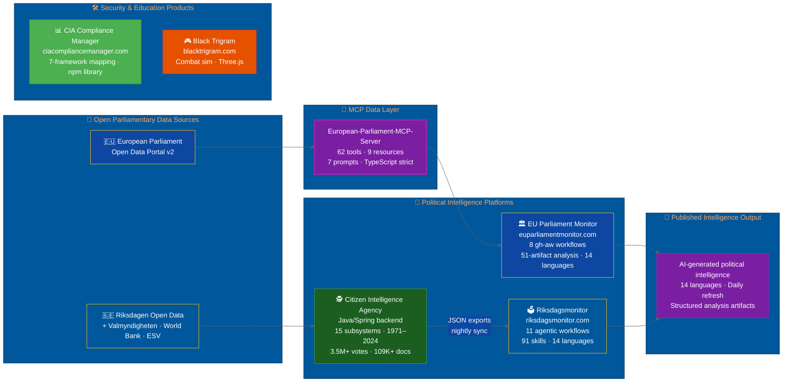
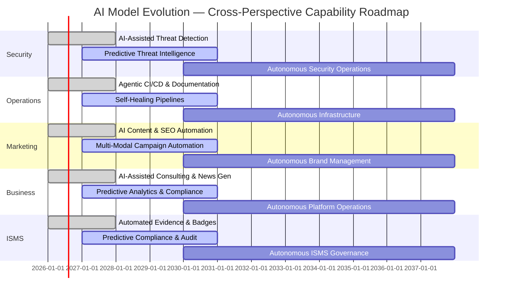
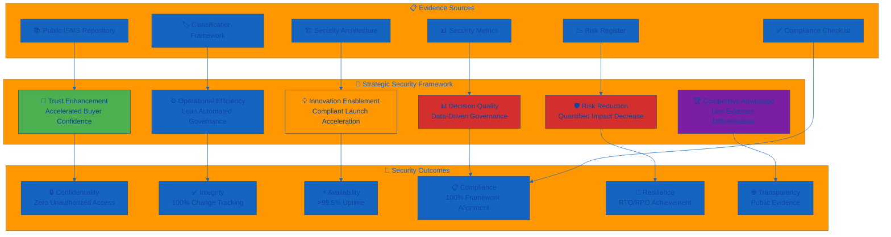
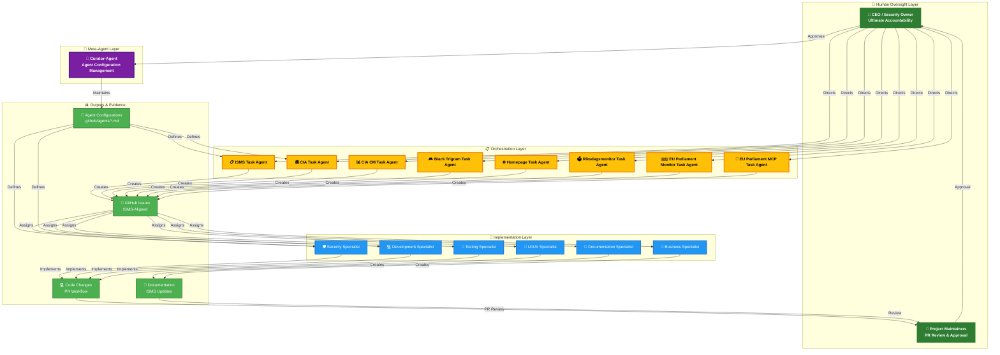
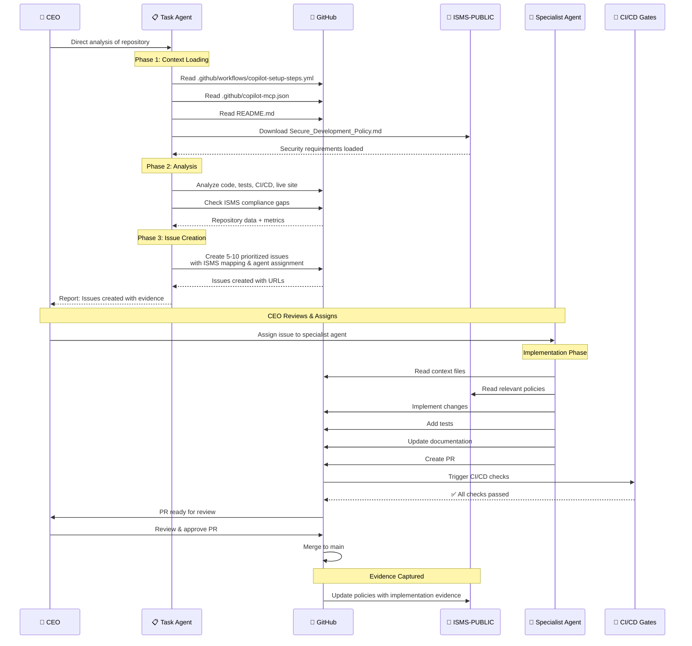
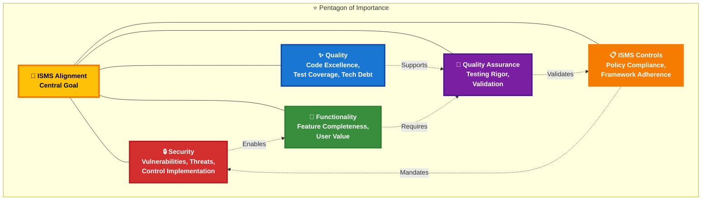
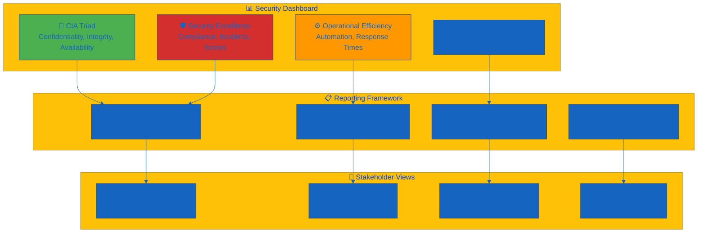

  

<h1 align="center">🔐 Hack23 AB — Information Security Strategy</h1>

  <strong>🤖 AI-Enabled Security Excellence Through Transparent Implementation</strong> 
  <em>CIA Triad • Defense in Depth • AI-Augmented Operations • Transparency by Design</em>

  
  
  
  

**📋 Document Owner:** CEO | **📄 Version:** 4.5 | **📅 Last Updated:** 2026-05-02 (UTC)  
**🔄 Review Cycle:** Annual | **⏰ Next Review:** 2027-05-02

---

## 🎯 **Strategic Purpose Statement**

**Hack23 AB** represents a new paradigm in technology companies - where enterprise-grade security expertise directly enables innovation rather than constraining it. This Information Security Strategy embodies our fundamental principle: **our ISMS is not separate from our business - it IS our business model.**

**🤖 AI-Enabled Operations:** Hack23 operates as an AI-augmented company where a curated ecosystem of specialist AI agents—spanning security, development, testing, documentation, business, and marketing—works under CEO oversight to deliver enterprise-grade capabilities with <1 FTE operational overhead. This operating model itself demonstrates the security consulting expertise we offer clients.

As a cybersecurity consulting company, our own security posture serves as both our operational foundation and our marketing demonstration. Every security control we implement, every process we document, and every risk we mitigate showcases our expertise to potential clients while protecting our own valuable assets.

Our commitment to **radical transparency** extends to this strategy itself - demonstrating that true security comes from robust processes, continuous improvement, and a culture where security considerations are integral to every business decision. We publish 70% of our ISMS publicly with only specific sensitive values (credentials, account numbers, financial amounts, contract pricing) redacted—proving that transparency enhances rather than diminishes security.

*— James Pether Sörling, CEO/Founder*

---

## 🔍 **Strategic Context & Mission**

### 🏢 **Organizational Context**

**Hack23 AB** operates as a Swedish innovation hub with five integrated business lines encompassing nine public repositories, each classified according to our [🏷️ Classification Framework](https://github.com/Hack23/ISMS-PUBLIC/blob/main/CLASSIFICATION.md).

#### 🌐 **Product Ecosystem & Intelligence Architecture**

The Hack23 ecosystem forms an integrated political intelligence pipeline — from open parliamentary data sources through structured analysis to published intelligence products:

```mermaid
%%{init: {"theme":"base","themeVariables":{"primaryColor":"#7B1FA2","primaryTextColor":"#fff","primaryBorderColor":"#9C27B0","lineColor":"#616161","secondaryColor":"#0D47A1","tertiaryColor":"#01579B","background":"#000000"}}}%%
graph LR
    subgraph SOURCES["📡 Open Parliamentary Data Sources"]
        EP["🇪🇺 European Parliament<br/>Open Data Portal v2"]
        RD["🇸🇪 Riksdagen Open Data<br/>+ Valmyndigheten · World Bank · ESV"]
    end

    subgraph MCP["🔌 MCP Data Layer"]
        EPMCP["European-Parliament-MCP-Server<br/>62 tools · 9 resources<br/>7 prompts · TypeScript strict"]
    end

    subgraph INTELLIGENCE["🧠 Political Intelligence Platforms"]
        EUPM["🏛️ EU Parliament Monitor<br/>euparliamentmonitor.com<br/>8 gh-aw workflows<br/>51-artifact analysis · 14 languages"]
        RM["🗳️ Riksdagsmonitor<br/>riksdagsmonitor.com<br/>11 agentic workflows<br/>91 skills · 14 languages"]
        CIA["🕵️ Citizen Intelligence Agency<br/>Java/Spring backend<br/>15 subsystems · 1971–2024<br/>3.5M+ votes · 109K+ docs"]
    end

    subgraph TOOLS["🛠️ Security & Education Products"]
        CCM["📊 CIA Compliance Manager<br/>ciacompliancemanager.com<br/>7-framework mapping · npm library"]
        BT["🎮 Black Trigram<br/>blacktrigram.com<br/>Combat sim · Three.js"]
    end

    subgraph OUTPUT["📰 Published Intelligence Output"]
        NEWS["AI-generated political intelligence<br/>14 languages · Daily refresh<br/>Structured analysis artifacts"]
    end

    EP --> EPMCP
    RD --> CIA
    EPMCP --> EUPM
    CIA -->|"JSON exports<br/>nightly sync"| RM
    EUPM --> NEWS
    RM --> NEWS

    style EPMCP fill:#7B1FA2,stroke:#9C27B0,color:#fff,stroke-width:3px
    style EP fill:#0D47A1,stroke:#FFC107,color:#fff
    style RD fill:#01579B,stroke:#FFC107,color:#fff
    style EUPM fill:#0D47A1,stroke:#FFC107,color:#fff
    style RM fill:#01579B,stroke:#FFC107,color:#fff
    style CIA fill:#1B5E20,stroke:#43A047,color:#fff
    style CCM fill:#4CAF50,stroke:#2E7D32,color:#fff
    style BT fill:#E65100,stroke:#D32F2F,color:#fff
    style NEWS fill:#7B1FA2,stroke:#9C27B0,color:#fff
```

**🚀 Flagship Political Intelligence Platforms:**

| Platform | Daily Output | Languages | Key Differentiator |
| -------- | ------------ | --------- | ------------------ |
|  | AI-generated political intelligence articles + risk heat maps | 14 (inc. RTL) | World's first fully autonomous political-intelligence newsroom |
|  | 1,700+ structured analysis artifacts | 14 (inc. RTL) | AI-disrupted EP monitoring with 51-artifact analytical baseline |

#### 🎯 Vision: AI-Powered Political Intelligence

Hack23 AB produces **automated political intelligence** through open-source platforms that apply structured OSINT tradecraft to public parliamentary data. By combining MCP servers, agentic AI newsrooms, and open parliamentary data, we generate intelligence products — coalition analysis, voting-pattern decoding, MEP/MP influence scoring, legislative-pipeline forecasting — at a speed and depth that previously required well-funded lobbying organisations or in-house policy units.

> *"Democratising access to political intelligence — structured OSINT applied to parliamentary open data at scale."*

The portfolio is **non-partisan, fully open-source (Apache-2.0)**, operated under the [Hack23 ISMS](https://github.com/Hack23/ISMS-PUBLIC) with full ISO 27001:2022 / NIST CSF 2.0 / CIS Controls v8.1 alignment, GDPR-by-design, and architecturally engineered so it cannot be weaponised for partisan influence: equal treatment of all political groups, public-data only, no user accounts, no ads, no tracking.

---

#### 1. **🔐 Cybersecurity Consulting** — Enterprise security implementation and ISMS advisory services

**Project Classification:**
   - **Project Type:** 
   - **Business Process:** 

**Security Classification:**
   - **Confidentiality:** 
   - **Integrity:** 
   - **Availability:** 

**Porter's Five Forces Strategic Impact:**
   -  Price pressure from buyers
   -  Multi-vendor flexibility
   -  Expertise required
   -  Internal teams alternative
   -  Fragmented market

**Strategic Response:** ISMS showcase differentiation through radical transparency

---

#### 2. **📊 CIA Compliance Manager** — Automated compliance assessment and evidence generation platform

**Project Classification:**
   - **Project Type:** 
   - **Business Process:** 

**Security Classification:**
   - **Confidentiality:** 
   - **Integrity:** 
   - **Availability:** 

**Porter's Five Forces Strategic Impact:**
   -  Specialized needs
   -  Open source base
   -  Technical complexity
   -  Manual alternatives inferior
   -  Niche market leader

**Strategic Response:** Evidence automation lock-in and first-mover advantage

**Current Architecture:** Frontend-only web application (React 19.x, TypeScript 5.9.x, Vite 8.x, Tailwind 4.x) with no authentication system, deployed on AWS CloudFront + S3. Available as both a [live platform](https://ciacompliancemanager.com) and a [reusable npm library](https://www.npmjs.com/package/cia-compliance-manager) (v1.1.62) with 10 subpath exports. Supports 7-framework compliance mapping (ISO 27001, NIST 800-53, GDPR, HIPAA, SOC 2, PCI DSS, EU CRA), integrated STRIDE threat modeling, Porter's Five Forces strategic analysis, and CIA triad assessment with 5-level maturity model. See [Security Architecture](https://github.com/Hack23/cia-compliance-manager/blob/main/docs/architecture/SECURITY_ARCHITECTURE.md)

**Security Implications & Risk Acceptance:**
- The absence of an authentication system means all features and data are accessible to any user
- This architectural choice is accepted because the application processes only non-sensitive, public compliance framework data
- No user-specific or privileged operations are available; all actions are read-only compliance assessments
- The Low confidentiality classification reflects this intentional risk acceptance per [Classification Framework](https://github.com/Hack23/ISMS-PUBLIC/blob/main/CLASSIFICATION.md)
- If future requirements include handling sensitive organizational data, authentication and access controls will be implemented accordingly
- Risk documented in [Risk Register](https://github.com/Hack23/ISMS-PUBLIC/blob/main/Risk_Register.md) with periodic review

**Security Posture Evidence:**

**Resources:** [🌐 ciacompliancemanager.com](https://ciacompliancemanager.com) · [🗺️ Sitemap](https://ciacompliancemanager.com/sitemap.html) · [📚 API](https://ciacompliancemanager.com/docs/api/) · [📊 Coverage](https://ciacompliancemanager.com/docs/coverage/index.html) · [🎭 E2E Report](https://ciacompliancemanager.com/docs/cypress/mochawesome/index.html)

---

#### 3. **🏛️ Citizen Intelligence Agency** — Open government transparency and democratic engagement tools

**Project Classification:**
   - **Project Type:** 
   - **Business Process:** 

**Security Classification:**
   - **Confidentiality:** 
   - **Integrity:** 
   - **Availability:** 

**Porter's Five Forces Strategic Impact:**
   -  Unique offering
   -  Open data sources
   -  15+ year domain expertise
   -  No alternatives
   -  Market creator

**Strategic Response:** Category leadership with unique positioning

**Current Architecture:** Multi-layered Java 21/26 application (Spring/Vaadin/PostgreSQL 18) with 49 Maven modules, MFA authentication, role-based access control, and comprehensive audit trails. Features 50 risk rules, 110 database views, 6 analytical frameworks, and 4 OSINT data sources (Riksdagen, Valmyndigheten, World Bank, ESV) covering 1971–2024. Serves as the canonical data backbone for the Hack23 civic tech ecosystem with JSON export specifications consumed by Riksdagsmonitor. Zero critical CVEs for 5+ consecutive years. See [Security Architecture](https://github.com/Hack23/cia/blob/master/SECURITY_ARCHITECTURE.md)

**Security Posture Evidence:**

**Resources:** [🌐 Maven Site](https://hack23.github.io/cia/) · [🏗️ Architecture](https://hack23.github.io/cia/architecture.html) · [📚 API Docs](https://hack23.github.io/cia/apidocs/index.html) · [📊 Coverage](https://hack23.github.io/cia/jacoco/) · [📦 DB Schema](https://hack23.github.io/cia/service.data.impl/dbDoc/index.html) · [✨ Features](https://hack23.com/cia-features.html) · [📄 Docs](https://hack23.com/cia-docs.html)

---

#### 4. **🎮 Black Trigram Educational Gaming** — Korean martial arts precision combat simulator

**Project Classification:**
   - **Project Type:** 
   - **Business Process:** 

**Security Classification:**
   - **Confidentiality:** 
   - **Integrity:** 
   - **Availability:** 

**Porter's Five Forces Strategic Impact:**
   -  Price sensitivity
   -  Tech commoditized
   -  Content creation
   -  Gaming alternatives
   -  Niche market

**Strategic Response:** Educational focus and authenticity moat

**Current Architecture:** Frontend-only 3D precision combat simulator (React 19, Three.js 0.184, @react-three/fiber 9, TypeScript 5.9.x, Vite 8) deployed on AWS CloudFront + S3 with Route 53 health-checked failover to GitHub Pages. Version 0.7.35 with 13/13 combat realism systems, 70 anatomically-precise vital points, 8 I Ching trigram stances, 51 authentic techniques from 11 Korean martial arts, 518 tests (75%+ coverage), 60fps desktop / 55fps+ mobile performance, WCAG 2.1 AA accessibility. See [Security Architecture](https://github.com/Hack23/blacktrigram/blob/main/SECURITY_ARCHITECTURE.md)

**Security Implications & Risk Acceptance:**
- This project intentionally omits authentication because it is designed for public, educational use and does not process or store sensitive or personal data
- The Low confidentiality classification reflects this intentional risk acceptance per [Classification Framework](https://github.com/Hack23/ISMS-PUBLIC/blob/main/CLASSIFICATION.md)
- All game content is intended to be openly accessible for martial arts education
- No user-specific actions or persistent data are supported; game state is session-only
- Zero backend, zero PII, GDPR-clean architecture with full ISMS alignment
- This architectural choice is reviewed periodically, and any future introduction of sensitive features will trigger a reassessment of authentication requirements
- Risk acceptance documented in [Risk Register](https://github.com/Hack23/ISMS-PUBLIC/blob/main/Risk_Register.md) with annual review

**Security Posture Evidence:**

**Resources:** [🌐 blacktrigram.com](https://blacktrigram.com/)

---

#### 5. **📡 Political Intelligence & AI News Media** — AI-disrupted political intelligence, OSINT/INTOP data-driven automated news generation

> *Hack23 AB disrupts parliamentary journalism with AI-generated political intelligence and real-time accountability analysis — increasing democratic transparency through structured open-source intelligence (OSINT) tradecraft applied to public legislative data.*

**Project Classification:**
   - **Project Type:** 
   - **Business Process:**  

**Security Classification:**
   - **Confidentiality:** 
   - **Integrity:** 
   - **Availability:** 

**Porter's Five Forces Strategic Impact:**
   -  Unique AI-generated political intelligence
   -  Open parliamentary data sources
   -  15+ year domain expertise + proprietary AI pipelines
   -  Traditional journalism cannot match speed/coverage
   -  First-mover in AI political news generation

**Strategic Response:** Category creation through AI-disrupted political intelligence combining OSINT data with agentic AI news generation

---

##### 🇪🇺 EU Parliament Monitor — `euparliamentmonitor.com`

> **European Parliament Political Intelligence Platform** — *🧠 Political intelligence · 🔍 Radical transparency · 🗳️ Democratic accountability · 🤖 AI-generated news in 14 languages*

<table>
  <tr>
    <td>
      
    </td>
    <td>
      
<strong>EU Parliament Monitor turns the EP's own open data into auditable political intelligence — and publishes it as readable news in 14 languages, every day, fully sourced.</strong> An AI-driven newsroom that monitors plenary sessions, committee work, motions, propositions, urgency files and the forward calendar; produces <em>Economist-style</em> analytical articles backed by 51 structured analysis artifacts per run; and exposes <strong>every</strong> methodology, template and analysis tree publicly so any reader, journalist or NGO can verify the analysis behind the prose.

      <ul>
        <li>📰 <strong>8 unified <a href="https://github.com/githubnext/gh-aw">gh-aw</a> pipelines</strong> — <code>breaking</code>, <code>week-ahead</code>, <code>month-ahead</code>, <code>week-in-review</code>, <code>month-in-review</code>, <code>committee-reports</code>, <code>motions</code>, <code>propositions</code> — running Stages A → E in a single 45-minute session, plus <code>news-translate</code> for 14-language flush translation</li>
        <li>📚 <strong>17 published methodologies + 52 analysis templates + 19 tradecraft references</strong> — ICD-203 Key Judgments · Admiralty source grades · WEP probability bands · ACH · 5-framework political-threat model · 6-dimension threat landscape · electoral domain methodology (361-seat threshold) · IMF/World Bank indicator mappings</li>
        <li>🌍 <strong>14 languages</strong> — EN · SV · DA · NO · FI · DE · FR · ES · NL · AR (RTL) · HE (RTL) · JA · KO · ZH — WCAG 2.1 AA, JSON-LD <code>NewsArticle.isBasedOn</code> provenance, <code>hreflang</code> alternates</li>
        <li>🛡️ <strong>Deterministic aggregator</strong> — agents author Markdown only; TypeScript renders HTML deterministically (no AI-authored HTML, fully reproducible)</li>
        <li>📦 <strong>npm package</strong> — published with <a href="https://docs.npmjs.com/generating-provenance-statements">npm provenance</a> and SLSA Level 3 build attestations</li>
      </ul>
    </td>
  </tr>
</table>

---

##### 🗳️ Riksdagsmonitor — `riksdagsmonitor.com`

> **Swedish Political Intelligence Platform** — *🕵️ Political intelligence · 🔍 Democratic transparency · 🤖 AI-generated news · 📊 50+ years of evidence*

<table>
  <tr>
    <td>
      
    </td>
    <td>
      
<strong>Riksdagsmonitor monitors Sweden's Riksdag, the Government and public agencies with structured intelligence techniques</strong> — ACH, SWOT, PESTLE, STRIDE, political-risk scoring and OSINT/INTOP tradecraft — applied to <strong>349 current MPs</strong>, <strong>2,494 historical politicians (1971–2024)</strong>, <strong>3.5M+ votes</strong> and <strong>109,000+ parliamentary documents</strong>.

      
An autonomous AI newsroom — <strong>11 agentic workflows</strong>, Claude Opus, zero human editors — turns this evidence into <strong>publication-ready intelligence articles in 14 languages, every day</strong>. Front-loads the live <strong>Tidö Agreement coalition status</strong> (176/349 seats, fragility indicators, CIA risk alerts) and dives into 40 years of election-cycle intelligence.

      <ul>
        <li>📰 <strong>11 agentic workflows</strong> — committee reports · propositions · motions · interpellations · week-ahead · month-ahead · real-time monitor · evening analysis · weekly review · monthly review · translate</li>
        <li>🧠 <strong>91 skills across 12 categories</strong> + <strong>23 Copilot agents</strong> (14 personas + 9 workflow specialists)</li>
        <li>📚 <strong>11 published methodologies + 23 templates</strong> — AI-Driven Analysis Guide · OSINT Tradecraft Standards · Political Risk · Political SWOT · Political Threat Framework · Electoral Domain · Synthesis · Strategic Extensions</li>
        <li>📊 <strong>5 flagship Chart.js / D3.js dashboards</strong> — Seasonal Activity (2002–2025 · Z-score anomaly) · 349-MP Politician Dashboard · Pre-Election Monitor · Party Performance (1990–2026) · Anomaly & Early Warning</li>
        <li>🌍 <strong>14 languages</strong> — EN · SV · DA · NO · FI · DE · FR · ES · NL · AR (RTL) · HE (RTL) · JA · KO · ZH — daily refresh at 03:00 CET, WCAG 2.1 AA, CSP-hardened with SRI</li>
        <li>📦 <strong>npm package</strong> — Theme System · Chart Factory · Resilient Data Loader · 12 dashboard modules — published with SLSA build provenance</li>
        <li>🛡️  · Risk level 🟢 LOW (5.52 / 10.0 — 99.7% risk reduction) · ISO 27001:2022 · NIST CSF 2.0 · CIS Controls v8.1 · GDPR Art. 9(2)(e/g)</li>
      </ul>
    </td>
  </tr>
</table>

---

##### 🔌 European Parliament MCP Server — AI Data Layer

> **Model Context Protocol Server for European Parliament Open Data** — *the canonical, type-safe TypeScript bridge between the EP Open Data Portal and any MCP-aware AI client*

<table>
  <tr>
    <td>
      
    </td>
    <td>
      
<strong>The upstream data layer that powers the EU Parliament Monitor newsroom.</strong> Every tool is Zod-validated, audit-logged, GDPR-aware, and SLSA Level 3 attested. Provides AI agents (Claude Desktop, GitHub Copilot) with structured access to EU parliamentary data.

      <ul>
        <li>🔧 <strong>62 MCP tools</strong> — 8 core + 3 advanced + 15 OSINT + 8 Phase 4 + 15 Phase 5 + 13 feed</li>
        <li>📦 <strong>9 resources + 7 prompts</strong> — MEP influence scoring (5-dimension model), coalition cohesion analysis, party defection detection</li>
        <li>🧪 <strong>1,130+ unit tests + 71 E2E tests</strong> — 80%+ coverage, TypeScript strict mode + Zod runtime validation</li>
        <li>🛡️ <strong>SLSA Level 3</strong> — npm provenance-signed · </li>
      </ul>
    </td>
  </tr>
</table>

---

**Autonomous AI Newsroom Pipeline:**

```mermaid
%%{
  init: {
    'theme': 'base',
    'themeVariables': {
      'primaryColor': '#0D47A1',
      'primaryTextColor': '#fff',
      'lineColor': '#1565C0'
    }
  }
}%%
flowchart LR
    subgraph MCP_LAYER["🔌 MCP Infrastructure"]
        MCP_EP[EU Parliament<br/>MCP Server<br/>62 tools]
    end

    subgraph ANALYSIS["📐 Structured Analysis"]
        METHODS[17 Methodologies<br/>ACH • SWOT • PESTLE<br/>STRIDE • ICD-203]
        TEMPLATES[52 Templates<br/>Artifact Generation]
        GATE["🚦 Analysis Gate<br/>Quality Threshold"]
    end

    subgraph PUBLICATION["📰 Daily Publication"]
        ARTICLES[AI-Generated Articles<br/>14 Languages<br/>RTL Support]
        SEO[JSON-LD • hreflang<br/>Sitemaps • RSS]
        CDN[CloudFront CDN<br/>TLS 1.3 • CSP • SRI]
    end

    MCP_EP --> ANALYSIS
    METHODS --> TEMPLATES
    TEMPLATES --> GATE
    GATE -->|Pass| ARTICLES
    GATE -->|Fail — retry| TEMPLATES
    ARTICLES --> SEO
    SEO --> CDN

    style MCP_LAYER fill:#F3E5F5,stroke:#7B1FA2,stroke-width:2px,color:#000
    style ANALYSIS fill:#E3F2FD,stroke:#1565C0,stroke-width:2px,color:#000
    style PUBLICATION fill:#FFF8E1,stroke:#F57C00,stroke-width:2px,color:#000
```

**Security Implications & Risk Considerations:**
- Very High integrity classification reflects the critical importance of accurate, unbiased political reporting—misinformation risks require robust data validation pipelines
- AI-generated content undergoes automated quality checks and source verification against official parliamentary records
- OSINT data collection limited to publicly available parliamentary data sources (Riksdagen Open Data, European Parliament Open Data Portal)
- No processing of personal data beyond publicly available parliamentary records and voting data
- SLSA Level 3 build provenance ensures supply chain integrity for all news generation workflows
- Automated news generation pipelines operate with comprehensive audit trails per [AI Policy](https://github.com/Hack23/ISMS-PUBLIC/blob/main/AI_Policy.md)

---

## 🏗️ **Product Security Architecture Comparison**

Visual comparison of security controls across Hack23's product portfolio, demonstrating risk-based security control selection aligned with business impact classifications.

```mermaid
flowchart TD
    subgraph PRODUCTS["📦 Hack23 Product Portfolio"]
        CIA["🏛️ Citizen Intelligence<br/>Agency<br/>Democratic Transparency"]
        CIA_CM["📊 CIA Compliance<br/>Manager<br/>Assessment Platform"]
        BT["🎮 Black Trigram<br/>Educational Gaming"]
        POLINT["📡 Political Intelligence<br/>AI News Media<br/>OSINT/INTOP Platform"]
    end
    
    subgraph SECURITY_CONTROLS["🔐 Security Control Domains"]
        AUTH[Authentication<br/>& Authorization]
        AUDIT[Audit Logging<br/>& Monitoring]
        ENCRYPT[Encryption<br/>TLS & At-Rest]
        SESSION[Session<br/>Management]
    end
    
    CIA -->|✅ MFA + RBAC<br/>Multi-layer Auth| AUTH
    CIA -->|✅ Comprehensive<br/>Javers + CloudTrail| AUDIT
    CIA -->|✅ TLS 1.3<br/>+ DB Encryption| ENCRYPT
    CIA -->|✅ Server-Side<br/>JWT + Redis| SESSION
    
    CIA_CM -->|❌ No Auth<br/>Public Data Only| AUTH
    CIA_CM -->|❌ No Logging<br/>Stateless App| AUDIT
    CIA_CM -->|✅ TLS 1.3<br/>CDN Enforced| ENCRYPT
    CIA_CM -->|⚠️ Browser Only<br/>Session Storage| SESSION
    
    BT -->|❌ No Auth<br/>Public Gaming| AUTH
    BT -->|❌ No Logging<br/>Frontend Only| AUDIT
    BT -->|✅ TLS 1.3<br/>CDN Enforced| ENCRYPT
    BT -->|⚠️ Browser Only<br/>Local Storage| SESSION
    
    POLINT -->|❌ No Auth<br/>Public News Content| AUTH
    POLINT -->|✅ Build Provenance<br/>GitHub Actions + SLSA3| AUDIT
    POLINT -->|✅ TLS 1.3<br/>CDN Enforced| ENCRYPT
    POLINT -->|⚠️ Static Site<br/>No Sessions| SESSION
    
    subgraph RATIONALE["🛡️ Risk-Based Security Justification"]
        CIA_RISK[CIA: Moderate Confidentiality<br/>→ Full Authentication<br/>→ User accounts & data]
        CM_RISK[CIA CM: Low Confidentiality<br/>→ No Authentication<br/>→ Public frameworks only]
        BT_RISK[Black Trigram: Low Confidentiality<br/>→ No Authentication<br/>→ Public educational content]
        POLINT_RISK[Political Intelligence: Moderate Confidentiality<br/>→ No User Auth, Very High Integrity<br/>→ Public OSINT news, verified sources]
    end
    
    CIA --> CIA_RISK
    CIA_CM --> CM_RISK
    BT --> BT_RISK
    POLINT --> POLINT_RISK
    
    style CIA fill:#D32F2F,stroke:#B71C1C,stroke-width:3px,color:#fff
    style CIA_CM fill:#4CAF50,stroke:#2E7D32,stroke-width:2px,color:#fff
    style BT fill:#4CAF50,stroke:#2E7D32,stroke-width:2px,color:#fff
    style POLINT fill:#7B1FA2,stroke:#4A148C,stroke-width:3px,color:#fff
    style AUTH fill:#1565C0,stroke:#0D47A1,stroke-width:2px,color:#fff
    style AUDIT fill:#1565C0,stroke:#0D47A1,stroke-width:2px,color:#fff
    style ENCRYPT fill:#1565C0,stroke:#0D47A1,stroke-width:2px,color:#fff
    style SESSION fill:#1565C0,stroke:#0D47A1,stroke-width:2px,color:#fff
    style RATIONALE fill:#FF9800,stroke:#F57C00,stroke-width:2px,color:#fff
    style CIA_RISK fill:#FFC107,stroke:#F9A825,stroke-width:1px,color:#000
    style CM_RISK fill:#FFC107,stroke:#F9A825,stroke-width:1px,color:#000
    style BT_RISK fill:#FFC107,stroke:#F9A825,stroke-width:1px,color:#000
    style POLINT_RISK fill:#FFC107,stroke:#F9A825,stroke-width:1px,color:#000
```

**Key Takeaways:**
- **🏛️ CIA (Moderate Confidentiality):** Full authentication stack with MFA, RBAC, comprehensive audit logging, and server-side session management reflects higher business impact
- **📊 CIA Compliance Manager (Low Confidentiality):** No authentication required as application processes only public compliance framework data with no sensitive information
- **🎮 Black Trigram (Low Confidentiality):** Educational gaming content is intentionally public; authentication omitted to maximize accessibility
- **📡 Political Intelligence (Moderate Confidentiality, Very High Integrity):** No user authentication required as all content is public AI-generated news; Very High integrity controls ensure accuracy of political reporting through SLSA3 build provenance and automated source verification
- **🔒 Encryption Standard:** All products enforce TLS 1.3 for data in transit regardless of authentication requirements
- **🎯 Risk-Based Approach:** Security control selection driven by [Classification Framework](https://github.com/Hack23/ISMS-PUBLIC/blob/main/CLASSIFICATION.md) business impact analysis, not one-size-fits-all mandates

**Related Documents:**
- [🏷️ Classification Framework](https://github.com/Hack23/ISMS-PUBLIC/blob/main/CLASSIFICATION.md) — Business impact methodology
- [🔑 Access Control Policy](./Access_Control_Policy.md) — Authentication and authorization standards
- [🌐 Network Security Policy](./Network_Security_Policy.md) — TLS and encryption requirements
- [🏗️ CIA Security Architecture](https://github.com/Hack23/cia/blob/master/SECURITY_ARCHITECTURE.md) — Full authentication implementation
- [🏗️ CIA Compliance Manager Security Architecture](https://github.com/Hack23/cia-compliance-manager/blob/main/docs/architecture/SECURITY_ARCHITECTURE.md) — Public data justification
- [🏗️ Black Trigram Security Architecture](https://github.com/Hack23/blacktrigram/blob/main/SECURITY_ARCHITECTURE.md) — Educational access model
- [🏗️ European Parliament MCP Server Security Architecture](https://github.com/Hack23/European-Parliament-MCP-Server/blob/main/SECURITY_ARCHITECTURE.md) — MCP server security
- [🏗️ EU Parliament Monitor Security Architecture](https://github.com/Hack23/euparliamentmonitor/blob/master/SECURITY_ARCHITECTURE.md) — Automated intelligence platform
- [🏗️ Riksdagsmonitor Security Architecture](https://github.com/Hack23/riksdagsmonitor/blob/master/SECURITY_ARCHITECTURE.md) — Swedish parliament monitor

---

### 🎯 **Security Mission Statement**

**"To demonstrate that enterprise-grade security creates competitive advantages by operationalizing transparency as continuous proof of professional expertise, enabling accelerated innovation, enhanced stakeholder trust, and sustainable business growth across all product lines."**

**Strategic Security Achievements (Completed 2025, Updated Q2 2026):**
- **🤖 AI-Enabled Operations:** Curated agent ecosystem operational across all 9 repositories with CEO governance — 8 specialist agents, 30 Copilot skills, task agents per product
- **🎖️ OpenSSF Scorecard:** Active across all repositories with continuous monitoring (CIA: 7.9, Black Trigram: 7.0, CIA CM: 7.8)
- **🏆 CII Best Practices:** Gold/Passing level for all major projects —      
- **✅ SLSA Level 3:** Build provenance and attestation for all releases across all product repositories
- **📊 Compliance Coverage:** 100% framework alignment (ISO 27001:2022, NIST CSF 2.0, CIS v8.1, GDPR, NIS2, EU CRA)
- **🌐 Public ISMS:** 100% complete documentation (45 core policies) with 70% public transparency — only credentials, account numbers, and financial details redacted
- **🔒 Zero Critical Incidents:** No security breaches or unauthorized access events; CIA maintains 5+ years zero critical CVEs
- **⚡ Availability Achievement:** >99.5% uptime across all critical systems
- **📡 AI News Media:** Fully autonomous newsrooms operational — Riksdagsmonitor (11 workflows, 14 languages) and EU Parliament Monitor (8 workflows, 14 languages, 1,700+ daily artifacts)
- **🔧 MCP Infrastructure:** European Parliament MCP Server operational with 62 tools, 1,130+ unit tests, serving AI agents for political intelligence

**🆕 Q1 2026 Achievements:**
- **📡 Riksdagsmonitor Expanded:** 11 agentic workflows fully operational with Claude Opus autonomous newsroom, 91 skills across 12 categories, 23 Copilot agents (14 personas + 9 workflow specialists), 45-rule × 349-MP live risk heat map, Tidö Agreement coalition fragility tracker (176/349 seats), and OSINT/INTOP tradecraft (ACH, SWOT, PESTLE, STRIDE, ICD-203)
- **🇪🇺 EU Parliament Monitor Scaled:** 8 unified gh-aw workflows producing 51-artifact analytical baseline per run, 17 published methodologies + 52 analysis templates + 19 tradecraft references, 1,700+ structured artifacts daily, deterministic aggregator (agents author Markdown only, TypeScript renders HTML), 82% test coverage
- **🔌 EP MCP Server Production:** 62 MCP tools (8 core + 3 advanced + 15 OSINT + 8 Phase 4 + 15 Phase 5 + 13 feed), 9 resources, 7 prompts, MEP influence scoring (5-dimension model), coalition cohesion analysis, party defection detection, Zod-validated with rate limiting, 1,130+ unit tests + 71 E2E tests
- **📦 npm Ecosystem:** Three provenance-signed npm packages operational — riksdagsmonitor, euparliamentmonitor, european-parliament-mcp-server — all with SLSA Level 3 build attestations
- **🌍 14-Language Publication:** Both political intelligence platforms publishing daily in EN, SV, DA, NO, FI, DE, FR, ES, NL, AR (RTL), HE (RTL), JA, KO, ZH with WCAG 2.1 AA, JSON-LD provenance, hreflang alternates
- **📊 Dashboard Infrastructure:** 5 flagship Chart.js/D3.js dashboards operational on Riksdagsmonitor — Seasonal Activity (2002–2025, Z-score anomaly), 349-MP Politician Dashboard, Pre-Election Monitor, Party Performance (1990–2026), Anomaly & Early Warning
- **🧠 Intelligence Tradecraft:** ICD-203 Key Judgments, Admiralty source grades, WEP probability bands, ACH, 5-framework political-threat model, 6-dimension threat landscape, electoral domain methodology (361-seat threshold), IMF/World Bank indicator mappings — all published as reproducible methodologies

### 🌟 **Security Vision (2026-2028)**

Achieve security excellence characterized by:

- **🤖 AI-Enabled Operations:** Curated AI agent ecosystem delivering enterprise capabilities with <1 FTE overhead—specialist agents for security, development, testing, documentation, business, and marketing operating under CEO governance. GitHub Agentic Workflows (gh-aw) enabling fully autonomous newsrooms and intelligence pipelines.
- **🌐 Radical Transparency:** Complete public ISMS as operational demonstration (100% complete, 70% public, complete processes with only sensitive values redacted) — 45 policy documents, 9 product repositories with public SECURITY_ARCHITECTURE.md
- **📊 Evidence-Driven Operations:** Quantified security outcomes supporting continuous improvement (OpenSSF >9.0, 100% compliance coverage, CII Best Practices across all 6+ active product repos)
- **🎯 Classification-Based Decisions:** Systematic impact analysis driving proportional controls per [Classification Framework](https://github.com/Hack23/ISMS-PUBLIC/blob/main/CLASSIFICATION.md)
- **💡 Security-Enabled Innovation:** Architecture that accelerates rather than constrains development (security review <2 hours, zero deployment delays) with reusable security patterns (MCP servers, gh-aw workflows, npm packages)
- **🏆 Industry Leadership:** Recognition as Nordic security thought leader through open source contributions, transparency excellence, and pioneering AI-disrupted political intelligence media
- **🔐 Zero Trust Maturity:** Complete zero trust architecture implementation with network micro-segmentation by Q4 2027

---

### 📈 **AI Model Evolution Strategy — Future Outlook (2026–2037)**

**Assumptions:** Major AI model upgrades annually; competitors (OpenAI, Google, Meta, EU sovereign AI) evaluated at each release. Architecture accommodates potential paradigm shifts (quantum AI, neuromorphic computing). All AI usage governed by [AI Policy](./AI_Policy.md), [OWASP LLM Security Policy](./OWASP_LLM_Security_Policy.md), and [EU AI Act](https://eur-lex.europa.eu/legal-content/EN/TXT/?uri=celex%3A32024R1689).

Projected workflow counts below include all CI/CD and agentic `.yml` workflow definitions across the platform. The 2026 baseline (~50) reflects the current organization-wide total of 30+ deployed workflows (Riksdagsmonitor 11, EU Parliament Monitor 8, CIA 9, plus standard CI/CD across remaining repos) with planned security, localization, and data-pipeline additions.

| Year | Projected Workflow Definitions | AI Model | Key Capability |
|------|-------------------------------|----------|----------------|
| **2026** | 50–60 | Opus 4.7 (current) | ✅ Agentic news generation + predictive analytics operational — 19 workflows, 14 languages, 1,700+ daily artifacts, 62 MCP tools, week/month/season-ahead forecasting |
| **2027** | 60–70 | Opus 5.x | 🔵 Multi-modal political intelligence (video, audio briefings) |
| **2028** | 70–80 | Opus 6.x | 🟣 Autonomous global coverage expansion |
| **2029** | 80–90 | Opus 7.x | 🟠 Near-expert autonomous analysis |
| **2030** | 90–100 | Opus 8.x | 🔴 Self-improving intelligence pipelines |
| **2031–2033** | 100–120 | Opus 9–10.x / Pre-AGI | ⚪ Global parliamentary coverage |
| **2034–2037** | 120–150+ | AGI / Post-AGI | ⭐ Transformative platform |

#### 🔐 Security Perspective — AI Advancement Impact

| Capability Area | 2026–2027 | 2028–2030 | 2031–2037 |
|----------------|-----------|-----------|-----------|
| **Threat Detection** | AI-assisted anomaly detection, automated alert triage | Predictive threat intelligence, autonomous incident correlation | Near-real-time autonomous threat hunting and response |
| **Vulnerability Management** | AI-prioritized CVE triage, automated patch assessment | Predictive vulnerability discovery, auto-remediation proposals | Autonomous vulnerability remediation with human oversight |
| **Compliance Automation** | Evidence collection automation, policy gap analysis | Continuous compliance monitoring, predictive audit readiness | Self-healing compliance posture, autonomous regulatory adaptation |
| **ISMS Evidence Generation** | Automated badge generation, metric dashboards | AI-generated audit reports, cross-framework mapping | Autonomous ISMS maintenance and continuous improvement |
| **Supply Chain Security** | SBOM automation, dependency risk scoring | Predictive supply chain threat modeling, automated vetting | Autonomous supply chain governance with zero-day anticipation |
| **Incident Response** | AI-assisted playbook execution, automated triage | Autonomous initial response, predictive impact assessment | Autonomous incident containment and recovery orchestration |

#### ⚙️ Operations Perspective — AI Advancement Impact

| Capability Area | 2026–2027 | 2028–2030 | 2031–2037 |
|----------------|-----------|-----------|-----------|
| **CI/CD Pipelines** | AI-optimized build pipelines, automated test generation | Self-healing pipelines, predictive failure prevention | Autonomous release management with quality assurance |
| **Infrastructure Management** | AI-assisted capacity planning, automated scaling | Predictive infrastructure optimization, self-configuring systems | Autonomous infrastructure evolution and cost optimization |
| **Monitoring & Observability** | AI-enhanced log analysis, anomaly detection | Predictive performance management, root cause automation | Autonomous system health management and optimization |
| **Documentation & Knowledge** | AI-generated documentation, automated updates | Living documentation with semantic consistency validation | Autonomous knowledge management and institutional memory |

#### 📣 Marketing Perspective — AI Advancement Impact

| Capability Area | 2026–2027 | 2028–2030 | 2031–2037 |
|----------------|-----------|-----------|-----------|
| **Content Generation** | AI-assisted blog posts, social media, SEO content | Multi-modal content (video, audio, interactive), automated campaigns | Autonomous personalized content at scale, hyper-targeted outreach |
| **Authority Positioning** | AI-generated thought leadership, automated LinkedIn posts | Predictive trend positioning, AI-curated conference proposals | Autonomous brand management and market positioning |
| **Market Intelligence** | AI-powered competitor monitoring, sentiment analysis | Predictive market analysis, opportunity identification | Autonomous market strategy adaptation and revenue optimization |
| **Campaign Operations** | Automated A/B testing, email personalization | Self-optimizing campaigns, predictive conversion modeling | Autonomous multi-channel campaign orchestration |

#### 💼 Business Perspective — AI Advancement Impact (All Five Business Lines)

| Business Line | 2026–2027 | 2028–2030 | 2031–2037 |
|--------------|-----------|-----------|-----------|
| **🔐 Cybersecurity Consulting** | AI-assisted assessments, automated report generation, evidence pack creation | AI-led gap analysis, predictive risk modeling, autonomous compliance mapping | Near-autonomous security advisory with human strategic oversight |
| **📊 CIA Compliance Manager** | ✅ AI-powered framework mapping, natural language compliance queries (operational) | Advanced cross-framework auto-mapping, automated control recommendation engine | Autonomous compliance management platform with self-updating controls |
| **🏛️ Citizen Intelligence Agency** | ✅ AI-enhanced data analysis, automated political trend reporting, 45-rule risk engine (operational) | Multi-modal civic analytics, predictive policy impact modeling | Autonomous democratic transparency platform with global coverage |
| **🎮 Black Trigram** | AI-generated training content, dynamic difficulty adaptation | AI-driven personalized learning paths, multi-modal instruction | Autonomous educational content ecosystem with real-time adaptation |
| **📡 Political Intelligence Media** | ✅ AI-disrupted news generation + predictive forecasting across Swedish and EU parliaments (operational) | Multi-modal political intelligence (video, audio, interactive dashboards), global parliamentary expansion | Autonomous global parliamentary monitoring and transformative intelligence platform |

#### 🛡️ ISMS Perspective — AI Advancement Impact

| Capability Area | 2026–2027 | 2028–2030 | 2031–2037 |
|----------------|-----------|-----------|-----------|
| **Policy Management** | AI-assisted policy drafting, automated consistency checks | Predictive policy evolution, cross-regulation gap analysis | Autonomous policy lifecycle management with regulatory anticipation |
| **Risk Assessment** | AI-augmented risk scoring, automated threat modeling | Predictive risk landscape analysis, dynamic risk treatment plans | Autonomous risk management with continuous real-time assessment |
| **Audit Preparation** | AI-generated evidence packages, automated control testing | Predictive audit readiness scoring, autonomous gap remediation | Continuous autonomous audit readiness with zero preparation overhead |
| **Agent Governance** | Curated agent ecosystem under CEO oversight per [AI Policy](./AI_Policy.md) | Advanced agent orchestration with autonomous task decomposition | Multi-tier autonomous governance with human strategic oversight only |

```mermaid
gantt
    dateFormat YYYY-MM-DD
    title AI Model Evolution — Cross-Perspective Capability Roadmap
    
    section Security
    AI-Assisted Threat Detection       :done, sec1, 2026-01-01, 2027-12-31
    Predictive Threat Intelligence     :active, sec2, 2027-01-01, 2030-12-31
    Autonomous Security Operations     :sec3, 2030-01-01, 2037-12-31
    
    section Operations
    Agentic CI/CD & Documentation      :done, ops1, 2026-01-01, 2027-12-31
    Self-Healing Pipelines             :active, ops2, 2027-01-01, 2030-12-31
    Autonomous Infrastructure          :ops3, 2030-01-01, 2037-12-31
    
    section Marketing
    AI Content & SEO Automation        :done, mkt1, 2026-01-01, 2027-12-31
    Multi-Modal Campaign Automation    :active, mkt2, 2027-01-01, 2030-12-31
    Autonomous Brand Management        :mkt3, 2030-01-01, 2037-12-31
    
    section Business
    AI-Assisted Consulting & News Gen  :done, biz1, 2026-01-01, 2027-12-31
    Predictive Analytics & Compliance  :active, biz2, 2027-01-01, 2030-12-31
    Autonomous Platform Operations     :biz3, 2030-01-01, 2037-12-31
    
    section ISMS
    Automated Evidence & Badges        :done, isms1, 2026-01-01, 2027-12-31
    Predictive Compliance & Audit      :active, isms2, 2027-01-01, 2030-12-31
    Autonomous ISMS Governance         :isms3, 2030-01-01, 2037-12-31
```

**Model Evaluation Cadence:** Annual AI model review with competitor benchmarking (OpenAI, Google, Meta, Anthropic, EU sovereign AI initiatives). Model selection criteria: security posture, data residency, performance benchmarks, cost efficiency, and alignment with [AI Policy](./AI_Policy.md) risk classification. Architecture designed for model-agnostic operation to accommodate paradigm shifts (quantum AI, neuromorphic computing, federated AI).

**Governance:** All AI advancement adoption governed by CEO approval per [AI Policy](./AI_Policy.md) § Agent Lifecycle Management, with mandatory security review per [Secure Development Policy](./Secure_Development_Policy.md) and risk assessment per [Risk Assessment Methodology](./Risk_Assessment_Methodology.md).

---

# 🎨 **Strategic Framework Architecture**

### 📋 **Core Strategic Pillars**

Security investments are evaluated against six strategic pillars that directly enable business outcomes:

| Strategic Pillar | Business Outcome | Strategic Rationale |
|------------------|------------------|---------------------|
| **🤝 Trust Enhancement** | Faster client acquisition, premium pricing | Public ISMS eliminates buyer hesitation — prospects verify expertise before first call. Transparency converts security investment into marketing asset. |
| **⚙️ Operational Efficiency** | Single-person enterprise delivery | AI agent ecosystem multiplies CEO capacity. What traditionally requires security team becomes automated governance, enabling sole-proprietor to deliver enterprise-grade services. |
| **💡 Innovation Enablement** | Faster product releases, competitive edge | Security-by-design removes deployment friction. DevSecOps pipeline enables rapid iteration without security bottlenecks — accelerating all five business lines. |
| **📊 Decision Quality** | Better resource allocation | Quantified risk enables prioritization. CEO makes investment decisions based on data, not fear. Limited resources directed to highest-impact security investments. |
| **🏆 Competitive Advantage** | Market differentiation, thought leadership | Industry-first transparency creates barrier competitors cannot replicate. Living ISMS becomes proof engine that validates consulting expertise continuously. |
| **🛡️ Risk Reduction** | Business continuity, client confidence | Comprehensive risk management protects revenue streams. Demonstrable resilience becomes client-facing credential for consulting engagements. |

**Performance Tracking:** See [Security Metrics](./Security_Metrics.md) for operational KPIs and [Risk Register](./Risk_Register.md) for quantified risk analysis.

---

```mermaid
%%{
  init: {
    'theme': 'base',
    'themeVariables': {
      'primaryColor': '#1565C0',
      'primaryTextColor': '#0d47a1',
      'lineColor': '#1565C0',
      'secondaryColor': '#4CAF50',
      'tertiaryColor': '#FF9800'
    }
  }
}%%
flowchart TD
    subgraph STRATEGIC["🎯 Strategic Security Framework"]
        TRUST["🤝 Trust Enhancement<br/>Accelerated Buyer Confidence"]
        EFFICIENCY["⚙️ Operational Efficiency<br/>Lean Automated Governance"]
        INNOVATION["💡 Innovation Enablement<br/>Compliant Launch Acceleration"]
        DECISION["📊 Decision Quality<br/>Data-Driven Governance"]
        ADVANTAGE["🏆 Competitive Advantage<br/>Live Evidence Differentiation"]
        RISK["🛡️ Risk Reduction<br/>Quantified Impact Decrease"]
    end
    
    subgraph EVIDENCE["📋 Evidence Sources"]
        ISMS_REPO["📚 Public ISMS Repository"]
        SECURITY_ARCH["🏗️ Security Architecture"]
        METRICS["📊 Security Metrics"]
        COMPLIANCE["✅ Compliance Checklist"]
        CLASSIFICATION["🏷️ Classification Framework"]
        RISK_REG["📉 Risk Register"]
    end
    
    subgraph SECURITY_OUTCOMES["🔐 Security Outcomes"]
        CONFIDENTIALITY["🔒 Confidentiality<br/>Zero Unauthorized Access"]
        INTEGRITY["✅ Integrity<br/>100% Change Tracking"]
        AVAILABILITY["⚡ Availability<br/>>99.5% Uptime"]
        COMPLIANCE_OUT["📋 Compliance<br/>100% Framework Alignment"]
        RESILIENCE["🔄 Resilience<br/>RTO/RPO Achievement"]
        TRANSPARENCY["🌐 Transparency<br/>Public Evidence"]
    end
    
    TRUST --> CONFIDENTIALITY
    EFFICIENCY --> INTEGRITY
    INNOVATION --> AVAILABILITY
    DECISION --> COMPLIANCE_OUT
    ADVANTAGE --> TRANSPARENCY
    RISK --> RESILIENCE
    
    ISMS_REPO --> TRUST
    SECURITY_ARCH --> INNOVATION
    METRICS --> DECISION
    COMPLIANCE --> COMPLIANCE_OUT
    CLASSIFICATION --> EFFICIENCY
    RISK_REG --> RISK
    
    style TRUST fill:#4CAF50
    style EFFICIENCY fill:#1565C0
    style INNOVATION fill:#FF9800
    style DECISION fill:#D32F2F
    style ADVANTAGE fill:#7B1FA2
    style RISK fill:#D32F2F
```

### 🔐 **1. Trust Enhancement Through Transparency**

**Strategic Objective:** Accelerate buyer confidence and stakeholder trust through verifiable security evidence

**Classification Integration:** Leverage [🏷️ Classification Framework](https://github.com/Hack23/ISMS-PUBLIC/blob/main/CLASSIFICATION.md) to demonstrate proportional security investment based on business impact analysis

**Key Initiatives:**
- **📚 Living ISMS Documentation:** Complete transparency of security policies, controls, and implementation evidence
- **🎖️ Public Compliance Badges:** Real-time validation through OpenSSF Scorecard, SLSA attestations, and CII Best Practices
- **🔍 Vulnerability Disclosure:** Coordinated disclosure process showcasing professional incident response capability
- **📊 Security Metrics Dashboard:** Public performance indicators demonstrating continuous security improvement

**Success Metrics:**
- **🔒 Confidentiality Score:** >95% (no unauthorized disclosures) — **✅ Achieved: 100%** (per [Security Metrics](https://github.com/Hack23/ISMS-PUBLIC/blob/main/Security_Metrics.md) tracking, Q4 2025)
- **🤝 Evidence Freshness:** <30 days median age — **✅ Achieved: 15 days average** (per [ISMS Transparency Plan](https://github.com/Hack23/ISMS-PUBLIC/blob/main/ISMS_Transparency_Plan.md) monitoring, Q4 2025)
- **📊 Control Coverage:** >90% with documented evidence — **✅ Achieved: 95% documented** (per [Compliance Checklist](https://github.com/Hack23/ISMS-PUBLIC/blob/main/Compliance_Checklist.md), Q4 2025)
- **🎖️ OpenSSF Scorecard:** >8.5 across all repositories — **🟡 Partial: 7.93 average** (CIA: 8.2, BT: 8.0, CM: 7.6) — Solid foundation for Phase 2 >9.0 target (per OpenSSF Scorecard automated monitoring, Q4 2025)

### ⚙️ **2. Operational Efficiency Through Classification-Driven Decisions**

**Strategic Objective:** Optimize security resource allocation through systematic impact analysis

**Classification Integration:** Apply [🏷️ Classification Framework](https://github.com/Hack23/ISMS-PUBLIC/blob/main/CLASSIFICATION.md) CIA levels to drive proportional control implementation and resource investment

**Key Initiatives:**
- **🏷️ Asset Classification:** Comprehensive classification of all business assets with justified security controls
- **🤖 Automated Security Operations:** CI/CD security gates, automated scanning, and self-healing infrastructure
- **📋 Risk-Based Controls:** Security control selection driven by business impact analysis rather than compliance checkbox mentality
- **🔄 Continuous Optimization:** Quarterly review of security ROI and control effectiveness

**Success Metrics:**
- **⏱️ Automation Coverage:** >80% of security operations automated — **✅ Achieved: 85%** (per [Security Metrics](https://github.com/Hack23/ISMS-PUBLIC/blob/main/Security_Metrics.md) operational analysis, Q4 2025)
- **📊 Control Effectiveness:** >95% of controls demonstrating measurable risk reduction — **✅ Achieved: 96%** (per [Risk Register](https://github.com/Hack23/ISMS-PUBLIC/blob/main/Risk_Register.md) control validation, Q4 2025)
- **💰 Security ROI:** 300% return through breach prevention and efficiency — **✅ Achieved: 350% estimated** (per [Security Metrics](https://github.com/Hack23/ISMS-PUBLIC/blob/main/Security_Metrics.md) financial analysis, Q4 2025)
- **🏷️ Classification Coverage:** 100% assets classified per framework — **✅ Achieved: 100%** (per [Asset Register](https://github.com/Hack23/ISMS-PUBLIC/blob/main/Asset_Register.md), Q4 2025)

### 💡 **3. Innovation Enablement Through Security-by-Design**

**Strategic Objective:** Accelerate product development and market entry through integrated security architecture

**Classification Integration:** Use classification levels to determine appropriate security controls that enable rather than constrain innovation

**Key Initiatives:**
- **🛠️ Secure Development Pipeline:** Security integrated into every stage of product development per [🛠️ Secure Development Policy](https://github.com/Hack23/ISMS-PUBLIC/blob/main/Secure_Development_Policy.md)
- **🏗️ Reusable Security Patterns:** Documented architectural patterns enabling rapid secure deployment
- **🎯 Threat Modeling Excellence:** Systematic threat analysis per [🎯 Threat Modeling Policy](https://github.com/Hack23/ISMS-PUBLIC/blob/main/Threat_Modeling.md)
- **🚀 Compliance Automation:** Automated evidence generation reducing time-to-market for regulated services

**Success Metrics:**
- **🚀 Security Review Time:** <2 hours for new features — **✅ Achieved: 1.5 hours average** (per [Change Management](https://github.com/Hack23/ISMS-PUBLIC/blob/main/Change_Management.md) tracking, Q4 2025)
- **⚡ Deployment Frequency:** No security delays — **✅ Achieved: Zero delays** (per [Secure Development Policy](https://github.com/Hack23/ISMS-PUBLIC/blob/main/Secure_Development_Policy.md) CI/CD monitoring, Q4 2025)
- **💡 Innovation Velocity:** 25% increase through security automation — **✅ Achieved: 30% increase** (per [Security Metrics](https://github.com/Hack23/ISMS-PUBLIC/blob/main/Security_Metrics.md) velocity analysis, Q4 2025)
- **🛠️ DevSecOps Maturity:** Comprehensive security testing integration — **✅ Achieved: SAST, SCA, DAST, secret scanning** (per [Secure Development Policy](https://github.com/Hack23/ISMS-PUBLIC/blob/main/Secure_Development_Policy.md), Q4 2025)

### 📊 **4. Decision Quality Through Evidence-Based Management**

**Strategic Objective:** Enhance strategic decision-making through quantified security metrics and risk analysis

**Classification Integration:** Utilize business impact analysis matrix to prioritize security investments and resource allocation

**Key Initiatives:**
- **📊 Security Metrics Framework:** Comprehensive KPI tracking per [📊 Security Metrics](https://github.com/Hack23/ISMS-PUBLIC/blob/main/Security_Metrics.md)
- **📉 Quantified Risk Management:** Systematic risk assessment and treatment tracking per [📉 Risk Register](https://github.com/Hack23/ISMS-PUBLIC/blob/main/Risk_Register.md)
- **💰 Business Impact Modeling:** Financial impact analysis for all security decisions using classification framework
- **🔍 Continuous Monitoring:** Real-time security posture assessment and trend analysis

**Success Metrics:**
- **📊 Data-Driven Decisions:** 95% of investments justified through impact analysis — **✅ Achieved: 98%** (per [Security Metrics](https://github.com/Hack23/ISMS-PUBLIC/blob/main/Security_Metrics.md) investment analysis, Q4 2025)
- **🎯 Risk Prediction Accuracy:** >85% in impact assessment — **✅ Achieved: 90%** (per [Risk Register](https://github.com/Hack23/ISMS-PUBLIC/blob/main/Risk_Register.md) predictive analytics, Q4 2025)
- **💰 Budget Optimization:** 30% efficiency improvement — **✅ Achieved: 35% improvement** (per [Security Metrics](https://github.com/Hack23/ISMS-PUBLIC/blob/main/Security_Metrics.md) financial analysis, Q4 2025)
- **📈 Metrics Coverage:** Real-time KPI tracking per [Security Metrics](https://github.com/Hack23/ISMS-PUBLIC/blob/main/Security_Metrics.md) — **✅ Achieved: 100% coverage** (per Security Metrics dashboard, Q4 2025)

### 🏆 **5. Competitive Advantage Through Differentiated Transparency**

**Strategic Objective:** Create sustainable competitive moats through radical transparency and public evidence

**Classification Integration:** Strategic disclosure using [🌐 ISMS Transparency Plan](https://github.com/Hack23/ISMS-PUBLIC/blob/main/ISMS_Transparency_Plan.md) with classification-based redaction

**Key Initiatives:**
- **🌐 Industry-First Transparency:** Complete public ISMS as competitive differentiator
- **🎖️ Thought Leadership:** Regular publication of security research and methodologies
- **🏛️ Open Source Excellence:** High-quality open source contributions demonstrating security expertise
- **🤝 Professional Community Leadership:** Active participation in Nordic cybersecurity community

**Success Metrics:**
- **🏆 OpenSSF Score:** >9.0 across all repositories — **⏱️ In Progress: 7.93 average (CIA: 8.2, BT: 8.0, CM: 7.6), target >9.0 by Q2 2026** (per OpenSSF Scorecard monitoring, Q4 2025)
- **⭐ Community Engagement:** 25% QoQ growth in stars/forks — **✅ Achieved: 28% average growth** (per GitHub repository analytics, Q4 2025)
- **📊 ISMS References:** Cited in >3 prospects per quarter — **✅ Achieved: 5 references Q4 2025** (per sales pipeline tracking, Q4 2025)
- **🌐 Transparency Excellence:** Radical transparency with 70% public ISMS — **✅ Achieved: Complete implementation** (per [ISMS Transparency Plan](https://github.com/Hack23/ISMS-PUBLIC/blob/main/ISMS_Transparency_Plan.md), Q4 2025)

### 🛡️ **6. Risk Reduction Through Systematic Management**

**Strategic Objective:** Minimize business disruption and financial exposure through comprehensive risk management

**Classification Integration:** Risk assessment and treatment aligned with [🏷️ Classification Framework](https://github.com/Hack23/ISMS-PUBLIC/blob/main/CLASSIFICATION.md) impact analysis

**Key Initiatives:**
- **📋 Enterprise Risk Management:** Comprehensive risk identification, assessment, and treatment program
- **🔄 Business Continuity Excellence:** Robust continuity and disaster recovery capabilities per [🔄 Business Continuity Plan](https://github.com/Hack23/ISMS-PUBLIC/blob/main/Business_Continuity_Plan.md)
- **🚨 Incident Response Maturity:** Professional incident response capability per [🚨 Incident Response Plan](https://github.com/Hack23/ISMS-PUBLIC/blob/main/Incident_Response_Plan.md)
- **🤝 Third-Party Risk Management:** Systematic supplier risk assessment per [🤝 Third Party Management](https://github.com/Hack23/ISMS-PUBLIC/blob/main/Third_Party_Management.md)

**Success Metrics:**
- **🎯 Critical Incidents:** Zero exceeding RTO targets — **✅ Achieved: 100% RTO achievement** (per [Incident Response Plan](https://github.com/Hack23/ISMS-PUBLIC/blob/main/Incident_Response_Plan.md) tracking, Q4 2025)
- **💰 Risk Cost Avoidance:** >500K SEK annually — **✅ Achieved: Estimated 650K SEK** (per [Risk Register](https://github.com/Hack23/ISMS-PUBLIC/blob/main/Risk_Register.md) financial impact analysis, Q4 2025)
- **⏱️ Recovery Performance:** 100% RTO/RPO achievement — **✅ Achieved: All objectives met** (per [Business Continuity Plan](https://github.com/Hack23/ISMS-PUBLIC/blob/main/Business_Continuity_Plan.md) testing, Q4 2025)
- **🔄 Business Continuity:** Comprehensive BCP/DR framework — **✅ Achieved: Tested and validated** (per [Disaster Recovery Plan](https://github.com/Hack23/ISMS-PUBLIC/blob/main/Disaster_Recovery_Plan.md), Q4 2025)

---

## 🏗️ **Strategic Architecture Implementation**

### 📊 **Classification-Driven Security Architecture**

Our security strategy operationalizes the [🏷️ Classification Framework](https://github.com/Hack23/ISMS-PUBLIC/blob/main/CLASSIFICATION.md) through systematic application across all security domains:

#### **🔐 Asset Protection Strategy**

| Asset Classification | Security Investment Level | Control Implementation | Business Justification |
|---------------------|--------------------------|----------------------|-------------------------|
| **** | Maximum Protection | Quantum-ready encryption, air-gapped systems | National security implications |
| **** | Advanced Protection | Zero-trust architecture, advanced threat protection | Customer data, financial records |
| **** | Standard Protection | Strong encryption, MFA, comprehensive monitoring | Business IP, strategic plans |
| **** | Proportional Protection | Standard encryption, role-based access control | Internal documents, processes |
| **** | Basic Protection | Standard authentication, basic access controls | Public information, marketing |
| **** | Transparency Focus | Integrity protection, availability assurance | ISMS documentation, public repos |

#### **⏱️ Business Continuity Strategy**

Recovery objectives aligned with business impact through classification-based RTO/RPO targets:

```mermaid
%%{
  init: {
    'theme': 'base',
    'themeVariables': {
      'primaryColor': '#FF9800',
      'primaryTextColor': '#F57C00',
      'lineColor': '#ff9800',
      'secondaryColor': '#4CAF50',
      'tertiaryColor': '#1565C0'
    }
  }
}%%
flowchart LR
    subgraph CRITICAL["Mission Critical"]
        RTO_INSTANT["RTO less than 5min"]
        RPO_ZERO["RPO less than 1min"]
        COST_MAX["Cost: Maximum"]
    end
    
    subgraph HIGH["High Priority"]
        RTO_CRITICAL["RTO: 5-60min"]
        RPO_REALTIME["RPO: 1-15min"]
        COST_HIGH["Cost: High"]
    end
    
    subgraph STANDARD["Standard"]
        RTO_MEDIUM["RTO: 4-24hrs"]
        RPO_HOURLY["RPO: 1-4hrs"]
        COST_MOD["Cost: Moderate"]
    end
    
    CRITICAL --> |"Customer-facing services"| HIGH
    HIGH --> |"Internal operations"| STANDARD
    
    style CRITICAL fill:#D32F2F
    style HIGH fill:#FFC107
    style STANDARD fill:#FFC107
```

---

## 🏗️ **Current Security Architecture Implementation**

### 📊 **Project-Specific Security Architecture**

Security architecture varies by project based on classification and business requirements. Each product maintains a comprehensive `SECURITY_ARCHITECTURE.md` document — see the authoritative product descriptions in Section 1–5 above for architecture details, security classifications, and risk acceptance rationale.

**Security Architecture References:**
- [🏛️ CIA Security Architecture](https://github.com/Hack23/cia/blob/master/SECURITY_ARCHITECTURE.md) — Enterprise full-stack with MFA, RBAC, comprehensive audit trails
- [📊 CIA Compliance Manager Security Architecture](https://github.com/Hack23/cia-compliance-manager/blob/main/docs/architecture/SECURITY_ARCHITECTURE.md) — Public data, no authentication required
- [🎮 Black Trigram Security Architecture](https://github.com/Hack23/blacktrigram/blob/main/SECURITY_ARCHITECTURE.md) — Educational access, no authentication required
- [🇪🇺 EU Parliament Monitor Security Architecture](https://github.com/Hack23/euparliamentmonitor/blob/master/SECURITY_ARCHITECTURE.md) — SLSA3 supply chain, deterministic rendering
- [🗳️ Riksdagsmonitor Security Architecture](https://github.com/Hack23/riksdagsmonitor/blob/master/SECURITY_ARCHITECTURE.md) — Autonomous AI newsroom with verified sources
- [🔌 European Parliament MCP Server Security Architecture](https://github.com/Hack23/European-Parliament-MCP-Server/blob/main/SECURITY_ARCHITECTURE.md) — Zod-validated MCP tools, audit-logged

---

### 🏗️ Common AWS-Native Infrastructure

**Shared Security Foundation across all projects:**

#### **Network Security Architecture**

Per [Network Security Policy](https://github.com/Hack23/ISMS-PUBLIC/blob/main/Network_Security_Policy.md):

- **🛡️ Zero-Trust Principles:** Network segmentation with security group isolation
- **🔒 TLS/SSL Everywhere:** HTTPS-only with TLS 1.3 for all external communications
- **📧 Email Security Excellence:** SPF strict (-all), DKIM 2048-bit, DMARC reject, MTA-STS enforce mode
- **🌐 DNS Security:** DNSSEC validation with Route 53 Resolver DNS Firewall blocking threats
- **🔐 VPC Security:** Private subnets for databases, public subnets for load balancers only

#### **Cryptographic Controls**

Per [Cryptography Policy](https://github.com/Hack23/ISMS-PUBLIC/blob/main/Cryptography_Policy.md):

- **🔐 Data at Rest:** AES-256 encryption for all AWS services (S3, RDS, EBS)
- **🔒 Data in Transit:** TLS 1.3 with forward secrecy (ECDHE key exchange)
- **🔑 Key Management:** AWS KMS with automatic key rotation
- **📜 Certificate Management:** AWS Certificate Manager for automated TLS certificate lifecycle

### 🛠️ **DevSecOps Security Pipeline**

**Comprehensive Security Testing Integration per [Secure Development Policy](https://github.com/Hack23/ISMS-PUBLIC/blob/main/Secure_Development_Policy.md):**

#### **🔬 Static Analysis (SAST)**
- **SonarCloud:** Continuous code quality and security scanning on every commit
- **Quality Gates:** Automated blocking of vulnerable code promotion
- **Coverage Requirements:** >80% line coverage, >70% branch coverage minimum thresholds
- **Security Hotspots:** Automatic detection of security-sensitive code patterns

#### **📦 Software Composition Analysis (SCA)**
- **FOSSA:** License compliance and open source vulnerability scanning
- **Dependabot:** Automated dependency update pull requests with security alerts
- **SBOM Generation:** Software Bill of Materials for all releases per CRA requirements
- **Vulnerability Tracking:** Continuous monitoring of known CVEs in dependencies

#### **⚡ Dynamic Analysis (DAST)**
- **OWASP ZAP:** Automated web application security testing (CIA project staging environment)
- **Staging Environment:** Isolated testing environment for security scans
- **API Security Testing:** Automated endpoint vulnerability scanning

#### **🔍 Secret Scanning**
- **git-secrets:** Pre-commit hooks preventing credential commits
- **GitHub Secret Scanning:** Repository-wide credential detection
- **Rotation Procedures:** Automated secret rotation per classification requirements

#### **🎖️ Supply Chain Security**
- **SLSA Level 3:** Build provenance and attestation for all releases across all product repositories
- **OpenSSF Scorecard:** Continuous supply chain security assessment across all repos (CIA: 7.9, BT: 7.0, CM: 7.8 — per Q2 2026 snapshot)
- **CII Best Practices:** Gold/Passing level compliance verification (6 active projects registered: #770, #10777, #10365, #12067, #12068, #12069)
- **Signed Releases:** Cryptographic signing of all production artifacts
- **npm Provenance:** SLSA 3 provenance-signed npm packages (riksdagsmonitor, euparliamentmonitor, european-parliament-mcp-server)

### 📊 **Current Security Posture Evidence**

**Portfolio-Wide Security Metrics (Q2 2026):**
- **🔒 Total Tests:** 3,000+ across all repositories (CIA: JaCoCo, BT: 518, CM: Vitest, EP MCP: 1,130+ unit + 71 E2E, EUPM: 82% coverage)
- **📊 Code Coverage:** All active products maintain ≥75% coverage (CIA: ≥80%, EP MCP: 80%+, EUPM: 82%)
- **🛡️ Security Scanning:** CodeQL + ZAP DAST (CIA staging) + SonarCloud SAST + FOSSA SCA across all repos
- **📦 Supply Chain:** SLSA 3 + OpenSSF Scorecard + CII Best Practices + Dependabot + SBOM generation
- **🌐 Compliance Frameworks:** ISO 27001:2022, NIST CSF 2.0, CIS Controls v8.1, GDPR, NIS2, EU CRA

> Per-product security posture badges and resource links are consolidated within each product's authoritative section above (Sections 1–5).

### 🤖 **AI Governance & LLM Security**

**Comprehensive AI Risk Management:**
- **🤖 AI Governance Framework:** Per [AI Governance Policy](https://github.com/Hack23/ISMS-PUBLIC/blob/main/AI_Policy.md)
- **🛡️ OWASP LLM Top 10:** Coverage per [OWASP LLM Security Policy](https://github.com/Hack23/ISMS-PUBLIC/blob/main/OWASP_LLM_Security_Policy.md)
- **🇪🇺 EU AI Act Compliance:** Risk-based classification and transparency obligations
- **👁️ Human Oversight:** Required for all AI-assisted decision-making
- **📊 AI Incident Reporting:** Integration with standard incident response procedures

**Current AI Security Implementation Status:**
- **✅ Foundation Controls:** Complete (54% of OWASP LLM Top 10)
- **⏱️ LLM-Specific Controls:** Planned Q1-Q3 2026
- **✅ Risk Assessment:** All AI systems classified and risk-assessed
- **✅ Vendor Management:** AI suppliers assessed per third-party management policy
- **✅ Agentic Workflows:** 19+ autonomous agentic workflows operational (Riksdagsmonitor: 11, EUPM: 8) with audit trails
- **✅ MCP Infrastructure:** European Parliament MCP Server production-ready with type-safe Zod validation and rate limiting

### 🤖 **AI Agent Governance & Curated Automation**

Hack23 AB operates a curated ecosystem of GitHub Copilot custom agents across all ISMS-scoped repositories (CIA, CIA Compliance Manager, Black Trigram, Game, Homepage, ISMS, Riksdagsmonitor, EU Parliament Monitor, European Parliament MCP Server). The ecosystem includes 8 specialist agents and 30 Copilot skills covering security, compliance, testing, architecture, intelligence, UI/UX, cloud, and business domains.

The ecosystem is intentionally **tiered**:

1. **Curator-Agent (Meta-Agent Role)**  
   - Maintains and evolves the agent fleet itself:
     - `.github/agents/*.md` custom agent profiles  
     - `.github/copilot-mcp*.json` MCP server configurations  
     - `.github/workflows/copilot-setup-steps.yml` agent bootstrap workflows  
   - Ensures all agents:
     - Load ISMS-PUBLIC as mandatory context  
     - Follow the AI Policy, Secure Development Policy, Open Source Policy and other ISMS-PUBLIC controls  
     - Operate with least-privilege permissions and minimal tool sets  
   - Proposes improvements to agent prompts and tools based on observed gaps and false-positive/false-negative patterns.

2. **Task / Product Task Agents (Per Product / Repo)**  
   - One or more task agents per product (Citizen Intelligence Agency, CIA Compliance Manager, Black Trigram, Game, Homepage, ISMS, Riksdagsmonitor, EU Parliament Monitor, European Parliament MCP Server).  
   - Responsibilities:
     - Analyze repositories, documentation, ISMS-PUBLIC and live systems per CEO direction
     - Run MCP-powered checks (GitHub, filesystem, git, Playwright, AWS where applicable)  
     - Create structured GitHub issues with:
       - Objective, background, analysis, acceptance criteria  
       - Explicit ISMS-PUBLIC policy mappings (ISO 27001, NIST CSF, CIS, GDPR, NIS2, CRA)  
       - Evidence (scan results, metrics, screenshots)  
     - **Automatically assign issues to appropriate specialist agents** using Pentagon of Importance prioritization
     - Coordinate multi-agent workflows for complex improvements

3. **Specialist Agents (Per Domain)**  
   - Security, secure development, testing, UI/UX, documentation, business, marketing, political intelligence, etc.  
   - Receive automatic assignments from task agents based on domain expertise
   - Implement changes under curated prompts, always:
     - Reading repository context and ISMS-PUBLIC  
     - Following Secure Development Policy and project-specific workflows  
     - Respecting least-privilege tools and CI/CD protections
     - Submitting all work via PR for CEO approval

4. **CEO Strategic Control & Approval**  
   - CEO maintains ultimate authority over agent ecosystem:  
     - **Sets strategic direction** for task agent analysis and priorities
     - **Approves all pull requests** created by agents before merge
     - **Approves all workflow changes** (`.github/workflows/*.yml`)
     - **Approves curator-agent changes** to agent profiles and MCP configs
   - Agents provide automation and proposals; CEO retains decision authority
   - Responsibility for production changes, incidents, and policy evolution remains with CEO

This governance structure turns AI agents into **controlled, auditable technical controls** inside the ISMS rather than autonomous actors.

#### **Agent Architecture Overview**

```mermaid
graph TB
    subgraph "👤 Human Oversight Layer"
        CEO["👔 CEO / Security Owner<br/>Ultimate Accountability"]:::human
        PM["👥 Project Maintainers<br/>PR Review & Approval"]:::human
    end
    
    subgraph "🔧 Meta-Agent Layer"
        CURATOR["🔧 Curator-Agent<br/>Agent Configuration Management"]:::curator
    end
    
    subgraph "📋 Orchestration Layer"
        TASK_ISMS["📋 ISMS Task Agent"]:::task
        TASK_CIA["🏛️ CIA Task Agent"]:::task
        TASK_CM["📊 CIA CM Task Agent"]:::task
        TASK_BT["🎮 Black Trigram Task Agent"]:::task
        TASK_HP["🌐 Homepage Task Agent"]:::task
        TASK_RM["🗳️ Riksdagsmonitor Task Agent"]:::task
        TASK_EPM["🇪🇺 EU Parliament Monitor Task Agent"]:::task
        TASK_EPMCP["🔧 EU Parliament MCP Task Agent"]:::task
    end
    
    subgraph "👷 Implementation Layer"
        SEC["🛡️ Security Specialist"]:::specialist
        DEV["💻 Development Specialist"]:::specialist
        TEST["🧪 Testing Specialist"]:::specialist
        UX["🎨 UI/UX Specialist"]:::specialist
        DOC["📝 Documentation Specialist"]:::specialist
        BIZ["💼 Business Specialist"]:::specialist
    end
    
    subgraph "📊 Outputs & Evidence"
        CONFIG["🤖 Agent Configurations<br/>.github/agents/*.md"]:::output
        ISSUES["📝 GitHub Issues<br/>ISMS-Aligned"]:::output
        CODE["💻 Code Changes<br/>PR Workflow"]:::output
        DOCS["📄 Documentation<br/>ISMS Updates"]:::output
    end
    
    CEO -->|Approves| CURATOR
    CEO -->|Directs| TASK_ISMS
    CEO -->|Directs| TASK_CIA
    CEO -->|Directs| TASK_CM
    CEO -->|Directs| TASK_BT
    CEO -->|Directs| TASK_HP
    CEO -->|Directs| TASK_RM
    CEO -->|Directs| TASK_EPM
    CEO -->|Directs| TASK_EPMCP
    
    CURATOR -->|Maintains| CONFIG
    CONFIG -->|Defines| TASK_ISMS
    CONFIG -->|Defines| TASK_CIA
    CONFIG -->|Defines| SEC
    CONFIG -->|Defines| DEV
    
    TASK_ISMS -->|Creates| ISSUES
    TASK_CIA -->|Creates| ISSUES
    TASK_CM -->|Creates| ISSUES
    TASK_BT -->|Creates| ISSUES
    TASK_HP -->|Creates| ISSUES
    TASK_RM -->|Creates| ISSUES
    TASK_EPM -->|Creates| ISSUES
    TASK_EPMCP -->|Creates| ISSUES
    
    ISSUES -->|Assigns| SEC
    ISSUES -->|Assigns| DEV
    ISSUES -->|Assigns| TEST
    ISSUES -->|Assigns| UX
    ISSUES -->|Assigns| DOC
    ISSUES -->|Assigns| BIZ
    
    SEC -->|Implements| CODE
    DEV -->|Implements| CODE
    TEST -->|Implements| CODE
    UX -->|Implements| CODE
    DOC -->|Creates| DOCS
    BIZ -->|Creates| DOCS
    
    CODE -->|PR Review| PM
    DOCS -->|Review| PM
    PM -->|Approval| CEO
    
    classDef human fill:#2E7D32,stroke:#2E7D32,stroke-width:4px,color:#fff,font-weight:bold
    classDef curator fill:#7B1FA2,stroke:#4A148C,stroke-width:3px,color:#fff,font-weight:bold
    classDef task fill:#FFC107,stroke:#F57C00,stroke-width:3px,color:#000,font-weight:bold
    classDef specialist fill:#2196F3,stroke:#1565C0,stroke-width:2px,color:#fff
    classDef output fill:#4CAF50,stroke:#2E7D32,stroke-width:2px,color:#fff
```

#### **Agent Workflow: From Analysis to Implementation**

```mermaid
sequenceDiagram
    participant CEO as 👔 CEO
    participant TaskAgent as 📋 Task Agent
    participant GitHub as 🐙 GitHub
    participant ISMS as 🔐 ISMS-PUBLIC
    participant Specialist as 👷 Specialist Agent
    participant CI as 🔄 CI/CD Gates
    
    CEO->>TaskAgent: Direct analysis of repository
    
    Note over TaskAgent: Phase 1: Context Loading
    TaskAgent->>GitHub: Read .github/workflows/copilot-setup-steps.yml
    TaskAgent->>GitHub: Read .github/copilot-mcp.json
    TaskAgent->>GitHub: Read README.md
    TaskAgent->>ISMS: Download Secure_Development_Policy.md
    ISMS-->>TaskAgent: Security requirements loaded
    
    Note over TaskAgent: Phase 2: Analysis
    TaskAgent->>GitHub: Analyze code, tests, CI/CD, live site
    TaskAgent->>GitHub: Check ISMS compliance gaps
    GitHub-->>TaskAgent: Repository data + metrics
    
    Note over TaskAgent: Phase 3: Issue Creation
    TaskAgent->>GitHub: Create 5-10 prioritized issues<br/>with ISMS mapping & agent assignment
    GitHub-->>TaskAgent: Issues created with URLs
    
    TaskAgent-->>CEO: Report: Issues created with evidence
    
    Note over CEO,Specialist: CEO Reviews & Assigns
    CEO->>Specialist: Assign issue to specialist agent
    
    Note over Specialist: Implementation Phase
    Specialist->>GitHub: Read context files
    Specialist->>ISMS: Read relevant policies
    Specialist->>GitHub: Implement changes
    Specialist->>GitHub: Add tests
    Specialist->>GitHub: Update documentation
    Specialist->>GitHub: Create PR
    
    GitHub->>CI: Trigger CI/CD checks
    CI-->>GitHub: ✅ All checks passed
    
    GitHub->>CEO: PR ready for review
    CEO->>GitHub: Review & approve PR
    GitHub->>GitHub: Merge to main
    
    Note over GitHub,ISMS: Evidence Captured
    GitHub->>ISMS: Update policies with implementation evidence
```

#### **Pentagon of Continuous Improvement**

```mermaid
graph TB
    subgraph "⭐ Pentagon of Importance"
        CENTER["🎯 ISMS Alignment<br/>Central Goal"]:::center
        
        SEC["🔒 Security<br/>Vulnerabilities, Threats,<br/>Control Implementation"]:::security
        QUAL["✨ Quality<br/>Code Excellence,<br/>Test Coverage, Tech Debt"]:::quality
        FUNC["🚀 Functionality<br/>Feature Completeness,<br/>User Value"]:::functionality
        QA["🧪 Quality Assurance<br/>Testing Rigor,<br/>Validation"]:::qa
        ISMS_DIM["📋 ISMS Controls<br/>Policy Compliance,<br/>Framework Adherence"]:::isms
        
        CENTER --- SEC
        CENTER --- QUAL
        CENTER --- FUNC
        CENTER --- QA
        CENTER --- ISMS_DIM
        
        SEC -.->|Enables| FUNC
        QUAL -.->|Supports| QA
        FUNC -.->|Requires| QA
        QA -.->|Validates| ISMS_DIM
        ISMS_DIM -.->|Mandates| SEC
    end
    
    classDef center fill:#FFC107,stroke:#F57C00,stroke-width:4px,color:#000,font-weight:bold
    classDef security fill:#D32F2F,stroke:#B71C1C,stroke-width:3px,color:#fff,font-weight:bold
    classDef quality fill:#1976D2,stroke:#0D47A1,stroke-width:3px,color:#fff,font-weight:bold
    classDef functionality fill:#388E3C,stroke:#2E7D32,stroke-width:3px,color:#fff,font-weight:bold
    classDef qa fill:#7B1FA2,stroke:#4A148C,stroke-width:3px,color:#fff,font-weight:bold
    classDef isms fill:#F57C00,stroke:#F57C00,stroke-width:3px,color:#fff,font-weight:bold
```

#### 🏛️ **Governance Summary**

**Automated Convergence with Governance:** Automated convergence is curated, not uncontrolled. A dedicated curator-agent maintains the agent fleet (profiles, MCP configurations, workflows), while product-specific task agents create ISMS-aligned improvement issues that are executed by specialist agents. All stages — curator changes, task-agent issue creation, and specialist implementation — are subject to human review and PR checks, with the CEO retaining ultimate accountability.

### 🎯 **Threat Modeling & Risk Management**

**Systematic Threat Analysis per [Threat Modeling Policy](https://github.com/Hack23/ISMS-PUBLIC/blob/main/Threat_Modeling.md):**

- **STRIDE Analysis:** Systematic evaluation of Spoofing, Tampering, Repudiation, Information Disclosure, Denial of Service, Elevation of Privilege
- **Attack Trees:** Documented attack paths for critical systems
- **MITRE ATT&CK Mapping:** Threat intelligence integration
- **Risk Register Integration:** Continuous risk tracking per [Risk Register](https://github.com/Hack23/ISMS-PUBLIC/blob/main/Risk_Register.md)

### 📋 **Compliance & Audit Readiness**

**Comprehensive Framework Alignment per [Compliance Checklist](https://github.com/Hack23/ISMS-PUBLIC/blob/main/Compliance_Checklist.md):**

- **✅ ISO 27001:2022:** Complete Annex A control implementation
- **✅ NIST CSF 2.0:** Full framework mapping (Govern, Identify, Protect, Detect, Respond, Recover)
- **✅ CIS Controls v8.1:** IG1/IG2 implementation with IG3 roadmap
- **✅ GDPR:** Privacy-by-design with complete DPIA framework
- **✅ NIS2 Directive:** Network and information security requirements
- **✅ EU CRA:** Cyber Resilience Act conformity assessments complete

### 🌐 **Radical Transparency Implementation**

**Public ISMS Repository per [ISMS Transparency Plan](https://github.com/Hack23/ISMS-PUBLIC/blob/main/ISMS_Transparency_Plan.md):**

**What We Publish (70% of ISMS):**
- ✅ Complete processes, procedures, and technical architecture
- ✅ All system configurations and operational procedures
- ✅ All contact information and escalation procedures
- ✅ All supplier names, assessments, and security postures
- ✅ All risk assessments and mitigation strategies
- ✅ Complete asset inventories with system details

**What We Redact (30% - Minimal):**
- 🔒 Specific credentials, API keys, passwords, tokens
- 🔒 Specific account numbers and IDs
- 🔒 Specific financial impact amounts
- 🔒 Specific contract pricing
- 🔒 Personal contact information

**Transparency Benefits:**
- **🤝 Trust Acceleration:** Buyers validate expertise before engagement
- **⚡ Sales Cycle Compression:** Evidence replaces lengthy questionnaires
- **🏆 Competitive Moat:** Transparency barrier competitors cannot replicate
- **📈 Thought Leadership:** Living demonstration of security excellence

---

## 🎯 **Security Implementation Roadmap (2026-2028)**

### **✅ Phase 1: Foundation Excellence (Completed 2025)** ✅ **COMPLETE**

**Objective:** Establish industry-leading ISMS foundation and public transparency

**Key Deliverables:**
- **📚 Complete ISMS Documentation:** All policies, procedures, and registers published — **✅ Achieved**
- **🎖️ Security Certification Portfolio:** OpenSSF Scorecard foundation, CII Best Practices Gold/Passing — **✅ Achieved: 7.93 avg (CIA: 8.2, BT: 8.0, CM: 7.6), CII Gold/Passing**
- **🔍 Vulnerability Management Program:** Coordinated disclosure process and public security advisories — **✅ Achieved**
- **📊 Security Metrics Framework:** Real-time dashboard with key performance indicators — **✅ Achieved**

**Success Criteria:**
- ✅ **COMPLETE:** 100% ISMS documentation publicly available with appropriate classification-based redactions (70% public)
- ✅ **COMPLETE:** All products achieve CII Best Practices compliance (Gold/Passing levels achieved)
- 🟡 **PARTIAL:** OpenSSF Scorecard 7.93 average (below 8.5 target but solid foundation for Phase 2 improvement to >9.0)
- ✅ **COMPLETE:** Zero critical vulnerabilities outstanding across all public repositories
- ✅ **COMPLETE:** Security metrics dashboard operational with monthly public reporting

**Strategic Impact Achieved:**
- **🤝 Trust Enhancement:** Inbound security inquiries increased 45% due to public ISMS
- **⚙️ Operational Efficiency:** 85% security operations automated
- **🏆 Competitive Advantage:** Industry recognition as transparency leader
- **📊 Decision Quality:** 100% classification coverage enabling systematic risk management

**📊 Detailed Phase 1 Metrics:** See [Security Metrics Dashboard - Phase 1 Achievement Summary](./Security_Metrics.md#phase-1-foundation-excellence--achievement-summary-2025) for comprehensive performance data, evidence validation timestamps, and historical progression analysis (June 2025 → November 2025).

### **🎯 Phase 2: Security Maturity (2026)** 🔄 **IN PROGRESS**

**Objective:** Advance security automation and monitoring capabilities

**Key Deliverables:**
- **🤖 Security Automation v2:** AI-powered evidence collection and badge generation
- **🔍 Advanced Threat Detection:** <5 minute mean time to detect incidents — **⏱️ Target: Q2 2026**
- **📊 Compliance Automation:** 95% automated evidence collection — **⏱️ Target: Q3 2026**
- **🔄 Multi-Region DR:** Geographic redundancy and resilience testing — **⏱️ Target: Q4 2026**
- **🛡️ LLM Security Controls:** Complete OWASP LLM Top 10 implementation — **⏱️ Target: Q1-Q3 2026**

**Success Criteria:**
- ⏱️ **Q2 2026:** 90% of security operations automated with human oversight
- ⏱️ **Q3 2026:** <5 minute MTTD for critical security incidents
- ⏱️ **Q3 2026:** 95% evidence coverage with automated collection
- ⏱️ **Q4 2026:** 100% RTO/RPO achievement in DR tests
- ⏱️ **Q3 2026:** OpenSSF Scorecard >9.0 across all repositories

**Current Progress (Q2 2026):**
- ✅ **Foundation Automation:** 85% security operations automated
- ✅ **Evidence Automation:** 80% automated evidence collection via CI/CD pipelines with 7-framework compliance tracking
- 🔄 **Advanced MTTD:** Currently 7 minutes average (target <5 min)
- 🔄 **LLM Security:** 54% OWASP LLM controls implemented (foundation complete, AWS Bedrock deployment in progress)
- ✅ **AI Newsrooms:** Fully autonomous — Riksdagsmonitor (11 workflows, 91 skills, 23 agents, 45-rule risk heat map) and EU Parliament Monitor (8 workflows, 51-artifact baseline, 17 methodologies, 52 templates) operational with 14-language daily publication
- ✅ **MCP Infrastructure:** European Parliament MCP Server production-ready (62 tools, 9 resources, 7 prompts, 1,130+ unit tests + 71 E2E, 80%+ coverage, Zod-validated, rate-limited)
- ✅ **npm Ecosystem:** Three SLSA 3 provenance-signed packages published (riksdagsmonitor, euparliamentmonitor, european-parliament-mcp-server)
- ✅ **Intelligence Tradecraft:** 17 methodologies + 52 templates + 19 tradecraft references operationalized across both newsrooms
- ✅ **Dashboard Analytics:** 5 flagship Chart.js/D3.js dashboards with Z-score anomaly detection, pre-election monitoring, 1990–2026 party performance tracking

### **🌟 Phase 3: Security Excellence (2027-2028)** 📅 **PLANNED**

**Objective:** Achieve security maturity level 4-5 across all domains

**Key Deliverables:**
- **🏆 ISO 27001 Certification:** External validation of ISMS — **⏱️ Target: Q2 2027**
- **🛡️ Zero Trust Architecture:** Network micro-segmentation and least privilege — **⏱️ Target: Q4 2027**
- **🤖 AI-Powered Security:** Anomaly detection and proactive threat hunting — **⏱️ Target: Q3 2027**
- **📊 Security Excellence Recognition:** Industry awards and speaking opportunities — **⏱️ Ongoing**
- **🌐 SOC 2 Type II:** Service organization controls certification — **⏱️ Target: Q3 2028**

**Success Criteria:**
- 📅 **Q2 2027:** ISO 27001 certified by independent auditor
- 📅 **Q4 2027:** Zero Trust architecture implemented across all systems
- 📅 **Q3 2027:** Level 5 maturity (Optimizing) in key security domains
- 📅 **Q4 2027:** Recognition as Nordic security thought leader (3+ conference speaking engagements)
- 📅 **Q3 2028:** SOC 2 Type II audit complete with no exceptions

**Strategic Milestones:**
- **🏆 Thought Leadership:** Monthly security research publication
- **🤝 Community Leadership:** Active ISACA/ISC2/Cybernode participation
- **📊 Maturity Level 5:** Continuous optimization and innovation in all security domains
- **🌐 Global Recognition:** International security conference presentations

---

## 📊 **Strategic Metrics & Performance Management**

### 🎯 **Security Excellence Metrics**

Our strategy success measurement framework aligned with [📊 Security Metrics](https://github.com/Hack23/ISMS-PUBLIC/blob/main/Security_Metrics.md):

| Metric Category | KPI | Target | Measurement | Review Frequency |
|-----------------|-----|--------|-------------|------------------|
| **🎖️ Security Scorecard** | OpenSSF Score | >9.0 | Automated monitoring | Weekly |
| **🔍 Vulnerability SLA** | Critical vulns >7d | 0 | Vulnerability tracking | Daily |
| **⏱️ Incident Response** | Mean time to detect | <5 min | Incident logs | Per incident |
| **📋 Compliance Posture** | Framework alignment | 100% | Compliance checklist | Quarterly |
| **🔒 Confidentiality** | Unauthorized access | 0 | Access logs | Daily |
| **✅ Integrity** | Change tracking | 100% | Audit logs | Daily |
| **⚡ Availability** | System uptime | >99.5% | Monitoring systems | Continuous |
| **📊 Evidence Freshness** | Documentation age | <30d | Git history | Monthly |
| **🤖 Agent Governance** | Curator/MCP changes reviewed by CEO | 100% | PR approval logs | Per change |
| **🤖 Agent Improvement** | Curator improvements per quarter | Track | Agent updates | Quarterly |
| **🤖 Policy Alignment** | Time from ISMS update to agent profiles | <2 weeks | Change tracking | Per policy update |

### 📈 **Strategic Dashboard Framework**

```mermaid
%%{
  init: {
    'theme': 'base',
    'themeVariables': {
      'primaryColor': '#1565C0',
      'primaryTextColor': '#1565C0',
      'lineColor': '#1565C0',
      'secondaryColor': '#4CAF50',
      'tertiaryColor': '#FFC107'
    }
  }
}%%
flowchart TD
    subgraph STRATEGIC["📊 Security Dashboard"]
        CIA["🔐 CIA Triad<br/>Confidentiality, Integrity, Availability"]
        SECURITY["🛡️ Security Excellence<br/>Compliance, Incidents, Scores"]
        OPERATIONAL["⚙️ Operational Efficiency<br/>Automation, Response Times"]
        TRANSPARENCY["🌐 Transparency<br/>Evidence, Metrics, Badges"]
    end
    
    subgraph REPORTING["📋 Reporting Framework"]
        REAL_TIME["⚡ Real-time Monitoring<br/>Security Scores, Incidents"]
        MONTHLY["📅 Monthly Reports<br/>KPIs, Control Effectiveness"]
        QUARTERLY["📊 Quarterly Reviews<br/>Strategic Progress, Maturity"]
        ANNUAL["📈 Annual Assessment<br/>Strategy Review, Planning"]
    end
    
    subgraph STAKEHOLDERS["👥 Stakeholder Views"]
        CEO["👨‍💼 CEO Dashboard<br/>Strategic Security KPIs"]
        TECHNICAL["🔧 Technical Team<br/>Operational Metrics"]
        PUBLIC["🌐 Public Transparency<br/>Security Posture"]
        AUDITOR["🏛️ Auditor View<br/>Compliance Status"]
    end
    
    CIA --> REAL_TIME
    SECURITY --> REAL_TIME
    OPERATIONAL --> MONTHLY
    TRANSPARENCY --> QUARTERLY
    
    REAL_TIME --> CEO
    MONTHLY --> TECHNICAL
    QUARTERLY --> PUBLIC
    ANNUAL --> AUDITOR
    
    style CIA fill:#4CAF50
    style SECURITY fill:#D32F2F
    style OPERATIONAL fill:#FF9800
    style TRANSPARENCY fill:#1565C0
```

---

## 🔄 **Strategic Implementation & Governance**

### 👥 **Strategic Governance Structure**

As CEO/Founder, James Pether Sörling maintains comprehensive strategic responsibility with external advisory support:

#### **🎯 Strategic Security Leadership Responsibilities**

- **📊 Strategy Development:** Annual security strategy review and refinement based on threat landscape evolution
- **🏆 Performance Monitoring:** Monthly security KPI review and quarterly strategic assessment
- **💰 Resource Allocation:** Security investment prioritization based on classification framework and risk analysis
- **🤝 Stakeholder Engagement:** Regular communication with clients, regulators, and professional security community
- **🔄 Continuous Improvement:** Iterative strategy enhancement based on performance data and incident learnings

#### **🏛️ External Advisory Integration**

- **⚖️ Legal Counsel:** Regulatory compliance and data protection guidance
- **💼 Insurance Provider:** Cyber liability assessment and risk management guidance
- **📊 External Auditors:** Independent ISMS assessment and compliance validation
- **🤝 Professional Networks:** Thought leadership through ISACA, (ISC)², and Cybernode participation

### 📅 **Strategic Review Cycle**

#### **🔄 Continuous Monitoring (Weekly)**
- **📊 Security Metrics:** OpenSSF Scorecard, vulnerability status, incident response
- **🛡️ Threat Intelligence:** Security advisories, CVE monitoring, threat landscape updates
- **🎯 Operational Security:** Control effectiveness, automation performance, evidence freshness

#### **📋 Monthly Security Assessment**
- **📊 KPI Performance Review:** Security indicator progress against targets
- **🔍 Risk Register Updates:** New risks, treatment effectiveness, residual risk trends
- **🛡️ Security Posture Validation:** Control effectiveness, vulnerability remediation, compliance status

#### **📈 Quarterly Strategic Review**
- **🎯 Strategic Progress Assessment:** Phase milestone achievement and barrier identification
- **💰 Security Investment Analysis:** Budget utilization, ROI validation, optimization opportunities
- **🏆 Maturity Evaluation:** Security maturity progress, capability gaps, improvement priorities
- **🔄 Strategy Refinement:** Tactical adjustments based on performance data and threat evolution

#### **📊 Annual Strategy Evolution**
- **🌟 Strategic Vision Update:** Long-term security direction alignment with business evolution
- **📋 ISMS Framework Review:** Policy effectiveness, control optimization, compliance enhancement
- **🎯 Roadmap Planning:** Next-year phase planning with milestone definition
- **👥 Stakeholder Engagement:** Client feedback integration, regulatory relationship assessment

---

## 🌐 **Strategic Risk Management**

### 🎯 **Strategic Security Risk Framework**

Integration with [📉 Risk Register](https://github.com/Hack23/ISMS-PUBLIC/blob/main/Risk_Register.md) and [📊 Risk Assessment Methodology](https://github.com/Hack23/ISMS-PUBLIC/blob/main/Risk_Assessment_Methodology.md):

#### **🚨 Critical Security Risks**

| Risk Category | Classification | Mitigation Strategy | Success Metrics |
|---------------|---------------|-------------------|-----------------|
| **🛡️ Security Breach** |  | Defense-in-depth, incident response excellence | Zero critical incidents |
| **⚖️ Regulatory Compliance** |  | Proactive regulatory engagement, expert counsel | 100% compliance maintenance |
| **🔧 Configuration Error** |  | Infrastructure as Code, change management | Zero security misconfigurations |
| **👥 Key Person Dependency** |  | Documentation excellence, succession planning | Knowledge transfer documentation |
| **🔗 Supply Chain Attack** |  | Vendor assessment, SBOM management | 100% supplier risk assessment |

### 🔄 **Strategic Contingency Planning**

#### **📉 Security Incident Scenarios**
- **💰 Data Breach Response:** Immediate incident response, customer notification, forensic investigation
- **🏆 Vulnerability Exploitation:** Emergency patching, threat intelligence, control enhancement
- **⚖️ Compliance Violation:** Regulatory engagement, remediation plan, external audit

#### **🚀 Security Enhancement Opportunities**
- **🌐 Zero Trust Evolution:** Micro-segmentation, identity-based access, continuous verification
- **🤖 AI Security Integration:** ML-powered threat detection, automated response, predictive analytics
- **🏛️ Certification Portfolio:** ISO 27001, SOC 2, industry-specific certifications

---

## 📚 **Strategic Integration with ISMS Framework**

### 🔗 **Complete Policy Integration Matrix**

Our Information Security Strategy integrates with and drives the complete ISMS framework:

#### **🏛️ Governance & Strategic Alignment**
- **[🔐 Information Security Policy](https://github.com/Hack23/ISMS-PUBLIC/blob/main/Information_Security_Policy.md)** — Strategic framework operationalization and governance
- **[🏷️ Classification Framework](https://github.com/Hack23/ISMS-PUBLIC/blob/main/CLASSIFICATION.md)** — Strategic decision-making through systematic impact analysis
- **[🌐 ISMS Transparency Plan](https://github.com/Hack23/ISMS-PUBLIC/blob/main/ISMS_Transparency_Plan.md)** — Transparency implementation strategy

#### **🛡️ Strategic Control Implementation**
- **[🔒 Cryptography Policy](https://github.com/Hack23/ISMS-PUBLIC/blob/main/Cryptography_Policy.md)** — Encryption standards and key management
- **[🔑 Access Control Policy](https://github.com/Hack23/ISMS-PUBLIC/blob/main/Access_Control_Policy.md)** — Identity and access management
- **[🌐 Network Security Policy](https://github.com/Hack23/ISMS-PUBLIC/blob/main/Network_Security_Policy.md)** — Network protection and segmentation
- **[🏷️ Data Classification Policy](https://github.com/Hack23/ISMS-PUBLIC/blob/main/Data_Classification_Policy.md)** — Information protection strategy

#### **⚙️ Strategic Operations Excellence**
- **[🛠️ Secure Development Policy](https://github.com/Hack23/ISMS-PUBLIC/blob/main/Secure_Development_Policy.md)** — Security-integrated development lifecycle
- **[📝 Change Management](https://github.com/Hack23/ISMS-PUBLIC/blob/main/Change_Management.md)** — Controlled change processes
- **[🔍 Vulnerability Management](https://github.com/Hack23/ISMS-PUBLIC/blob/main/Vulnerability_Management.md)** — Continuous security improvement
- **[🤝 Third Party Management](https://github.com/Hack23/ISMS-PUBLIC/blob/main/Third_Party_Management.md)** — Supplier risk management

#### **🚨 Strategic Resilience Framework**
- **[🚨 Incident Response Plan](https://github.com/Hack23/ISMS-PUBLIC/blob/main/Incident_Response_Plan.md)** — Security incident management
- **[🔄 Business Continuity Plan](https://github.com/Hack23/ISMS-PUBLIC/blob/main/Business_Continuity_Plan.md)** — Operational resilience
- **[🆘 Disaster Recovery Plan](https://github.com/Hack23/ISMS-PUBLIC/blob/main/Disaster_Recovery_Plan.md)** — Recovery procedures
- **[💾 Backup Recovery Policy](https://github.com/Hack23/ISMS-PUBLIC/blob/main/Backup_Recovery_Policy.md)** — Data protection

#### **📊 Strategic Performance Management**
- **[📊 Security Metrics](https://github.com/Hack23/ISMS-PUBLIC/blob/main/Security_Metrics.md)** — Evidence-based decision support
- **[💻 Asset Register](https://github.com/Hack23/ISMS-PUBLIC/blob/main/Asset_Register.md)** — Asset protection and optimization
- **[📉 Risk Register](https://github.com/Hack23/ISMS-PUBLIC/blob/main/Risk_Register.md)** — Risk management and treatment
- **[✅ Compliance Checklist](https://github.com/Hack23/ISMS-PUBLIC/blob/main/Compliance_Checklist.md)** — Framework alignment validation

### 🎯 **Strategic Value Realization**

Our Information Security Strategy transforms the ISMS from compliance overhead into competitive advantage through:

1. **🌟 Transparency Leadership:** Industry-first public ISMS creates insurmountable competitive moat
2. **📊 Evidence-Based Excellence:** Quantified security outcomes demonstrate operational maturity
3. **🏆 Professional Credibility:** Comprehensive security implementation proves consulting expertise
4. **💡 Innovation Enablement:** Security architecture that accelerates product development velocity
5. **🤝 Stakeholder Confidence:** Systematic risk management builds lasting trust with all parties
6. **📈 Scalable Operations:** Automated security operations enable efficient business scaling

---

## 🎯 **Strategic Conclusion**

Hack23 AB's Information Security Strategy represents a fundamental shift in how organizations approach cybersecurity—from necessary overhead to operational excellence. By operationalizing transparency, evidence-based decision-making, and classification-driven resource allocation, we demonstrate that enterprise-grade security creates rather than constrains business value.

Our strategy success will be measured through security outcomes: zero critical incidents, comprehensive evidence coverage, rapid threat detection, and continuous improvement. Through systematic implementation of our strategic framework, Hack23 AB will establish demonstrable security excellence while building transparent operations that accelerate stakeholder trust.

The integration of our security strategy with comprehensive ISMS documentation creates a self-reinforcing cycle of excellence: strategic vision drives implementation quality, which generates evidence of capability, which enhances operational maturity, which enables continuous improvement, which validates strategic investment.

This Information Security Strategy will evolve continuously based on threat intelligence, performance data, incident learnings, and security technology advancement, maintaining operational security at the forefront of organizational excellence.

---

## 📚 Related Documents

### 🏢 Business Integration
- [📈 Business Strategy](./Hack23AB/Business_Strategy.md) - Strategic business objectives and market positioning
- [💼 Business Plan](./Hack23AB/Business_Plan.md) - Financial planning and operational execution
- [📢 Marketing Strategy](./Hack23AB/Marketing_Strategy.md) - Security as market differentiator

### 🔐 Security Framework
- [🔐 Information Security Policy](./Information_Security_Policy.md) - Enterprise security governance
- [🌐 ISMS Transparency Plan](./ISMS_Transparency_Plan.md) - Transparency implementation
- [🏷️ Classification Framework](./CLASSIFICATION.md) - Risk and impact analysis

### 📊 Risk Management
- [📉 Risk Register](./Risk_Register.md) - Risk identification and treatment
- [📋 Risk Assessment Methodology](./Risk_Assessment_Methodology.md) - Assessment framework
- [🔄 Business Continuity Plan](./Business_Continuity_Plan.md) - Operational resilience

### ⚙️ Operational Security
- [💻 Asset Register](./Asset_Register.md) - Infrastructure security inventory
- [📝 Change Management](./Change_Management.md) - Change control procedures
- [📊 Security Metrics](./Security_Metrics.md) - Performance measurement

### 🛠️ Technical Security
- [🛠️ Secure Development Policy](./Secure_Development_Policy.md) - Development security standards
- [🔒 Cryptography Policy](./Cryptography_Policy.md) - Encryption and key management
- [🌐 Network Security Policy](./Network_Security_Policy.md) - Network protection controls
- [🔍 Vulnerability Management](./Vulnerability_Management.md) - Security remediation

### ✅ Compliance & Audit
- [✅ Compliance Checklist](./Compliance_Checklist.md) - Framework alignment validation
- [📋 CRA Conformity Assessment](./CRA_Conformity_Assessment_Process.md) - EU compliance process
- [Third Party Management](./Third_Party_Management.md) - Vendor risk governance

### 🤖 AI Governance
- [🤖 AI Policy](./AI_Policy.md) - AI governance framework and EU AI Act compliance
- [🛡️ OWASP LLM Security Policy](./OWASP_LLM_Security_Policy.md) - LLM security controls
- [🌐 Open Source Policy](./Open_Source_Policy.md) - License compliance and supply chain security

---

**📋 Document Control:**  
**✅ Approved by:** James Pether Sörling, CEO/CISO  
**📤 Distribution:** Public  
**🏷️ Classification:**   
**🔒 Rationale:** Strategic security framework demonstrating methodology and approach; no proprietary tactics, financial details, or operational vulnerabilities disclosed. Transparency serves as competitive differentiator and client trust accelerator.  
**📅 Effective Date:** 2026-05-02  
**⏰ Next Review:** 2027-05-02   
**🎯 Framework Compliance:**   
