  

<h1 align="center">🔐 Hack23 AB — Information Security Strategy</h1>

  <strong>🛡️ Security Excellence Through Transparent Implementation</strong> 
  <em>🎯 CIA Triad • Defense in Depth • Continuous Improvement • Transparency by Design</em>

  
  
  
  

**📋 Document Owner:** CEO | **📄 Version:** 4.1 | **📅 Last Updated:** 2026-01-25 (UTC)  
**🔄 Review Cycle:** Annual | **⏰ Next Review:** 2027-01-25

---

## 🎯 **Strategic Purpose Statement**

**Hack23 AB** represents a new paradigm in technology companies - where enterprise-grade security expertise directly enables innovation rather than constraining it. This Information Security Strategy embodies our fundamental principle: **our ISMS is not separate from our business - it IS our business model.**

As a cybersecurity consulting company, our own security posture serves as both our operational foundation and our marketing demonstration. Every security control we implement, every process we document, and every risk we mitigate showcases our expertise to potential clients while protecting our own valuable assets.

Our commitment to **radical transparency** extends to this strategy itself - demonstrating that true security comes from robust processes, continuous improvement, and a culture where security considerations are integral to every business decision. We publish the majority of our ISMS publicly with only specific sensitive values (credentials, account numbers, financial amounts, contract pricing) redacted—proving that transparency enhances rather than diminishes security.

*— James Pether Sörling, CEO/Founder*

---

##  **Strategic Context & Mission**

### 🏢 **Organizational Context**

**Hack23 AB** operates as a Swedish innovation hub with four integrated business lines, each classified according to our [🏷️ Classification Framework](./CLASSIFICATION.md):

**1. 🔐 Cybersecurity Consulting** — Enterprise security implementation and ISMS advisory services (Very High Confidentiality, High Integrity, High Availability). Strategic differentiation through ISMS showcase and radical transparency demonstrating consulting expertise.

**2. 📊 CIA Compliance Manager** — Open-source compliance assessment platform (Low Confidentiality, High Integrity, High Availability). Frontend-only architecture with no authentication (public compliance data only). Not used for ISMS evidence collection; evidence automation via GitHub Actions and OpenSSF Scorecard.

**3. 🏛️ Citizen Intelligence Agency** — Open government transparency platform (Moderate Confidentiality, High Integrity, Moderate Availability). Multi-layered authentication with MFA, RBAC, and comprehensive audit trails. Category leadership with 15+ years domain expertise.

**4. 🎮 Black Trigram** — Educational Korean martial arts gaming (Low Confidentiality, Moderate Integrity, Moderate Availability). Frontend-only architecture optimized for public educational accessibility without authentication requirements.

**Detailed Product Context:** See [Classification Framework](./CLASSIFICATION.md) for complete business impact analysis and Porter's Five Forces strategic positioning per product line.

---

### 🎯 **Security Mission & Vision**

> **Mission:** Transform security from compliance obligation into business acceleration engine — where our public ISMS becomes the proof that wins consulting clients, our AI-augmented operations enable premium positioning, and our transparent implementation creates an industry moat competitors cannot replicate.

> **Vision (2027):** Hack23 AB emerges as a **leading Nordic innovator in cybersecurity, information security governance, and transparency technology** — delivering enterprise-grade solutions across consulting services, compliance tooling, open government platforms, and educational gaming. This multi-product portfolio creates sustainable competitive advantage through trust acceleration (compressed sales cycles), transparency leadership (industry-first public ISMS), AI-augmented operations (single-person enterprise delivery), and security as business enabler (every investment supports innovation and client acquisition).

**Strategic Alignment:** This security strategy directly enables revenue objectives and positions security as a measurable value engine. Security investments are evaluated by their contribution to business outcomes, not compliance checkboxes.

---

## 🤖 **AI-First Operations Strategy**

AI agents are not an implementation detail — they are **the core strategic enabler** that allows a single-person company to deliver enterprise-grade security services. This AI-first operating model creates sustainable competitive advantage that scales without proportional headcount.

Hack23 AB operates a curated ecosystem of GitHub Copilot custom agents across all ISMS-scoped repositories (CIA, CIA Compliance Manager, Black Trigram, Game, Homepage, ISMS).

The ecosystem is intentionally **tiered**:

1. **Curator-Agent (Meta-Agent Role)**  
   - Maintains and evolves the agent fleet itself:
     - `.github/agents/*.md` custom agent profiles  
     - `.github/copilot-mcp*.json` MCP server configurations  
     - `.github/workflows/copilot-setup-steps.yml` agent bootstrap workflows  
   - Ensures all agents:
     - Load ISMS-PUBLIC as mandatory context  
     - Follow the AI Policy, Secure Development Policy, Open Source Policy and other ISMS-PUBLIC controls  
     - Operate with least-privilege permissions and minimal tool sets  
   - Proposes improvements to agent prompts and tools based on observed gaps and false-positive/false-negative patterns.

2. **Task / Product Task Agents (Per Product / Repo)**  
   - One or more task agents per product (Citizen Intelligence Agency, CIA Compliance Manager, Black Trigram, Game, Homepage, ISMS).  
   - Responsibilities:
     - Analyze repositories, documentation, ISMS-PUBLIC and live systems per CEO direction
     - Run MCP-powered checks (GitHub, filesystem, git, Playwright, AWS where applicable)  
     - Create structured GitHub issues with:
       - Objective, background, analysis, acceptance criteria  
       - Explicit ISMS-PUBLIC policy mappings (ISO 27001, NIST CSF, CIS, GDPR, NIS2, CRA)  
       - Evidence (scan results, metrics, screenshots)  
     - **Automatically assign issues to appropriate specialist agents** using Pentagon of Importance prioritization
     - Coordinate multi-agent workflows for complex improvements

3. **Specialist Agents (Per Domain)**  
   - Security, secure development, testing, UI/UX, documentation, business, marketing, political intelligence, etc.  
   - Receive automatic assignments from task agents based on domain expertise
   - Implement changes under curated prompts, always:
     - Reading repository context and ISMS-PUBLIC  
     - Following Secure Development Policy and project-specific workflows  
     - Respecting least-privilege tools and CI/CD protections
     - Submitting all work via PR for CEO approval

4. **CEO Strategic Control & Approval**  
   - CEO maintains ultimate authority over agent ecosystem:  
     - **Sets strategic direction** for task agent analysis and priorities
     - **Approves all pull requests** created by agents before merge
     - **Approves all workflow changes** (`.github/workflows/*.yml`)
     - **Approves curator-agent changes** to agent profiles and MCP configs
   - Agents provide automation and proposals; CEO retains decision authority
   - Responsibility for production changes, incidents, and policy evolution remains with CEO

This governance structure turns AI agents into **controlled, auditable technical controls** inside the ISMS rather than autonomous actors.

### 🏗️ **Agent Architecture Overview**

```mermaid
graph TB
    subgraph "👤 Human Oversight Layer"
        CEO[👔 CEO / Security Owner<br/>Ultimate Accountability]:::human
        PM[👥 Project Maintainers<br/>PR Review & Approval]:::human
    end
    
    subgraph "🔧 Meta-Agent Layer"
        CURATOR[🔧 Curator-Agent<br/>Agent Configuration Management]:::curator
    end
    
    subgraph "📋 Orchestration Layer"
        TASK_ISMS[📋 ISMS Task Agent]:::task
        TASK_CIA[🏛️ CIA Task Agent]:::task
        TASK_CM[📊 CIA CM Task Agent]:::task
        TASK_BT[🎮 Black Trigram Task Agent]:::task
        TASK_HP[🌐 Homepage Task Agent]:::task
    end
    
    subgraph "👷 Implementation Layer"
        SEC[🛡️ Security Specialist]:::specialist
        DEV[💻 Development Specialist]:::specialist
        TEST[🧪 Testing Specialist]:::specialist
        UX[🎨 UI/UX Specialist]:::specialist
        DOC[📝 Documentation Specialist]:::specialist
        BIZ[💼 Business Specialist]:::specialist
    end
    
    subgraph "📊 Outputs & Evidence"
        CONFIG[🤖 Agent Configurations<br/>.github/agents/*.md]:::output
        ISSUES[📝 GitHub Issues<br/>ISMS-Aligned]:::output
        CODE[💻 Code Changes<br/>PR Workflow]:::output
        DOCS[📄 Documentation<br/>ISMS Updates]:::output
    end
    
    CEO -->|Approves| CURATOR
    CEO -->|Directs| TASK_ISMS
    CEO -->|Directs| TASK_CIA
    CEO -->|Directs| TASK_CM
    CEO -->|Directs| TASK_BT
    CEO -->|Directs| TASK_HP
    
    CURATOR -->|Maintains| CONFIG
    CONFIG -->|Defines| TASK_ISMS
    CONFIG -->|Defines| TASK_CIA
    CONFIG -->|Defines| SEC
    CONFIG -->|Defines| DEV
    
    TASK_ISMS -->|Creates| ISSUES
    TASK_CIA -->|Creates| ISSUES
    TASK_CM -->|Creates| ISSUES
    TASK_BT -->|Creates| ISSUES
    TASK_HP -->|Creates| ISSUES
    
    ISSUES -->|Assigns| SEC
    ISSUES -->|Assigns| DEV
    ISSUES -->|Assigns| TEST
    ISSUES -->|Assigns| UX
    ISSUES -->|Assigns| DOC
    ISSUES -->|Assigns| BIZ
    
    SEC -->|Implements| CODE
    DEV -->|Implements| CODE
    TEST -->|Implements| CODE
    UX -->|Implements| CODE
    DOC -->|Creates| DOCS
    BIZ -->|Creates| DOCS
    
    CODE -->|PR Review| PM
    DOCS -->|Review| PM
    PM -->|Approval| CEO
    
    classDef human fill:#2E7D32,stroke:#1B5E20,stroke-width:4px,color:#fff,font-weight:bold
    classDef curator fill:#7B1FA2,stroke:#4A148C,stroke-width:3px,color:#fff,font-weight:bold
    classDef task fill:#FFC107,stroke:#F57C00,stroke-width:3px,color:#000,font-weight:bold
    classDef specialist fill:#2196F3,stroke:#1565C0,stroke-width:2px,color:#fff
    classDef output fill:#4CAF50,stroke:#2E7D32,stroke-width:2px,color:#fff
```

### 📋 **Agent Workflow: From Analysis to Implementation**

### ⭐ **Pentagon of Continuous Improvement**

```mermaid
graph TB
    subgraph "⭐ Pentagon of Importance"
        CENTER[🎯 ISMS Alignment<br/>Central Goal]:::center
        
        SEC[🔒 Security<br/>Vulnerabilities, Threats,<br/>Control Implementation]:::security
        QUAL[✨ Quality<br/>Code Excellence,<br/>Test Coverage, Tech Debt]:::quality
        FUNC[🚀 Functionality<br/>Feature Completeness,<br/>User Value]:::functionality
        QA[🧪 Quality Assurance<br/>Testing Rigor,<br/>Validation]:::qa
        ISMS_DIM[📋 ISMS Controls<br/>Policy Compliance,<br/>Framework Adherence]:::isms
        
        CENTER --- SEC
        CENTER --- QUAL
        CENTER --- FUNC
        CENTER --- QA
        CENTER --- ISMS_DIM
        
        SEC -.->|Enables| FUNC
        QUAL -.->|Supports| QA
        FUNC -.->|Requires| QA
        QA -.->|Validates| ISMS_DIM
        ISMS_DIM -.->|Mandates| SEC
    end
    
    classDef center fill:#FFD700,stroke:#F57F17,stroke-width:4px,color:#000,font-weight:bold
    classDef security fill:#D32F2F,stroke:#B71C1C,stroke-width:3px,color:#fff,font-weight:bold
    classDef quality fill:#1976D2,stroke:#0D47A1,stroke-width:3px,color:#fff,font-weight:bold
    classDef functionality fill:#388E3C,stroke:#1B5E20,stroke-width:3px,color:#fff,font-weight:bold
    classDef qa fill:#7B1FA2,stroke:#4A148C,stroke-width:3px,color:#fff,font-weight:bold
    classDef isms fill:#F57C00,stroke:#E65100,stroke-width:3px,color:#fff,font-weight:bold
```

### 🏛️ **Governance Summary**

**Automated Convergence with Governance:** Automated convergence is curated, not uncontrolled. A dedicated curator-agent maintains the agent fleet (profiles, MCP configurations, workflows), while product-specific task agents create ISMS-aligned improvement issues that are executed by specialist agents. All stages — curator changes, task-agent issue creation, and specialist implementation — are subject to human review and PR checks, with the CEO retaining ultimate accountability.

---

## 🎨 **Strategic Framework Architecture**

### 📋 **Core Strategic Pillars**

Security investments are evaluated against six strategic pillars that directly enable business outcomes:

| Strategic Pillar | Business Outcome | Strategic Rationale |
|------------------|------------------|---------------------|
| **🤝 Trust Enhancement** | Faster client acquisition, premium pricing | Public ISMS eliminates buyer hesitation — prospects verify expertise before first call. Transparency converts security investment into marketing asset. |
| **⚙️ Operational Efficiency** | Single-person enterprise delivery | AI agent ecosystem multiplies CEO capacity. What traditionally requires security team becomes automated governance, enabling sole-proprietor to deliver enterprise-grade services. |
| **💡 Innovation Enablement** | Faster product releases, competitive edge | Security-by-design removes deployment friction. DevSecOps pipeline enables rapid iteration without security bottlenecks — accelerating all four business lines. |
| **📊 Decision Quality** | Better resource allocation | Quantified risk enables prioritization. CEO makes investment decisions based on data, not fear. Limited resources directed to highest-impact security investments. |
| **🏆 Competitive Advantage** | Market differentiation, thought leadership | Industry-first transparency creates barrier competitors cannot replicate. Living ISMS becomes proof engine that validates consulting expertise continuously. |
| **🛡️ Risk Reduction** | Business continuity, client confidence | Comprehensive risk management protects revenue streams. Demonstrable resilience becomes client-facing credential for consulting engagements. |

**Performance Tracking:** See [Security Metrics](./Security_Metrics.md) for operational KPIs and [Risk Register](./Risk_Register.md) for quantified risk analysis.

### 📊 **Classification-Driven Security Architecture**

Our security strategy operationalizes the [Classification Framework](./CLASSIFICATION.md) through systematic application across all security domains:

**Asset Protection:** Security investment levels scale from Transparency Focus (Public) → Basic Protection (Low) → Proportional Protection (Moderate) → Standard Protection (High) → Advanced Protection (Very High) → Maximum Protection (Extreme) based on confidentiality classification and business impact.

**Business Continuity:** Recovery objectives aligned with availability classification from Mission Critical through Standard tiers. See [Classification Framework](./CLASSIFICATION.md) for specific RTO/RPO targets.

**Detailed Classification Framework:** See [Classification Framework](./CLASSIFICATION.md) for complete business impact analysis and RTO/RPO target definitions.

---

## 🏗️ **Current Security Architecture Implementation**

Our security architecture varies by project based on classification and business requirements. Each project maintains comprehensive SECURITY_ARCHITECTURE.md documentation with detailed technical implementation.

### 🏗️ **Project-Specific Security Implementations**

**🏛️ Citizen Intelligence Agency** — Enterprise security architecture with MFA, RBAC, comprehensive audit trails, session tracking, and AWS multi-AZ deployment. See [CIA Security Architecture](https://github.com/Hack23/cia/blob/master/SECURITY_ARCHITECTURE.md) for complete technical details.

**📊 CIA Compliance Manager** — Frontend-only application with no authentication system (public compliance data only). See [CIA CM Security Architecture](https://github.com/Hack23/cia-compliance-manager/blob/main/docs/architecture/SECURITY_ARCHITECTURE.md) for architectural justification.

**🎮 Black Trigram** — Client-side gaming architecture with no backend services (educational public content). See [Black Trigram Security Architecture](https://github.com/Hack23/blacktrigram/blob/main/SECURITY_ARCHITECTURE.md) for implementation details.

### 🌐 **Common AWS-Native Infrastructure**

All projects leverage shared AWS security foundation per [Network Security Policy](./Network_Security_Policy.md):

**Network Security:** Zero-trust segmentation, TLS 1.3, SPF/DKIM/DMARC/MTA-STS, DNSSEC, VPC security groups  
**Cryptography:** AES-256 at rest, TLS 1.3 in transit, AWS KMS key management per [Cryptography Policy](./Cryptography_Policy.md)  
**DevSecOps Pipeline:** SAST (SonarCloud), SCA (FOSSA/Dependabot), DAST (OWASP ZAP), secret scanning, SLSA Level 3 per [Secure Development Policy](./Secure_Development_Policy.md)

### 📊 **Current Security Posture Evidence**

**🏛️ Citizen Intelligence Agency**  
     

**🎮 Black Trigram**  
    

**📊 CIA Compliance Manager**  
    

### 🛡️ **Advanced Security Capabilities**

**AI & LLM Security:** Comprehensive governance per [AI Policy](./AI_Policy.md) and [OWASP LLM Security Policy](./OWASP_LLM_Security_Policy.md) with EU AI Act compliance and OWASP LLM Top 10 controls implementation in progress.

**Threat Modeling:** STRIDE analysis, attack trees, MITRE ATT&CK mapping per [Threat Modeling Policy](./Threat_Modeling.md) with continuous [Risk Register](./Risk_Register.md) integration.

**Compliance Framework:** Complete alignment per [Compliance Checklist](./Compliance_Checklist.md): ISO 27001:2022, NIST CSF 2.0, CIS Controls v8.1, GDPR, NIS2, EU CRA.

**Transparency Excellence:** Public ISMS per [ISMS Transparency Plan](./ISMS_Transparency_Plan.md) with classification-based redaction (credentials, account numbers, financial amounts, contract pricing only).

---

## 🎯 **Security Implementation Roadmap (2025-2027)**

### **🚀 Phase 1: Foundation Excellence (2025 Q3-Q4)** ✅ **COMPLETE**

**Strategic Achievement:** Established industry-leading ISMS foundation with complete documentation, CII Best Practices compliance, and OpenSSF Scorecard certification. Public transparency with classification-based redaction creates sustainable competitive advantage.

**Key Results:** See [Security Metrics](./Security_Metrics.md) for detailed performance data.

### **🎯 Phase 2: Security Maturity (2026)** 🔄 **ACTIVE**

**Strategic Objective:** Enable first revenue capture by converting security foundation into sales-ready credentials and client-facing proof assets.

**Key Milestones:**
- **Q1-Q2 2026:** First consulting client acquired using ISMS as sales acceleration
- **Q2 2026:** Advanced OpenSSF Scorecard certification across all repositories
- **Q2 2026:** Enhanced mean time to detect via advanced threat detection
- **Q3 2026:** Expanded automated evidence collection
- **Q3 2026:** Complete OWASP LLM Top 10 implementation
- **Q4 2026:** Multi-region disaster recovery with geographic redundancy

**Current Progress (Q1 2026):** Foundation and evidence automation operational. Revenue activation pipeline in progress. Insurance coverage active.

### **🌟 Phase 3: Security Excellence (2027)** 📅 **PLANNED**

**Strategic Objective:** Achieve Nordic market leadership position with formal certifications validating consulting expertise and enabling enterprise client acquisition.

**Key Milestones:**
- **Q2 2027:** ISO 27001 certification by independent auditor — enterprise client prerequisite
- **Q3 2027:** SOC 2 Type II audit complete — US market expansion enabler
- **Q4 2027:** Zero Trust architecture with network micro-segmentation
- **Ongoing:** Nordic security thought leader recognition (conference speaking, industry recognition)

---

## 📊 **Strategic Metrics & Performance Management**

### 🎯 **Business-Aligned Security Metrics**

Security metrics exist to answer one question: **Is our security posture enabling or blocking business objectives?**

**Leading Indicators (Client Acquisition Enablers):**
- OpenSSF Scorecard, CII Best Practices badges — Client-facing credibility proof
- Evidence freshness — Demonstrates active security management to prospects
- Compliance posture — Prerequisite for enterprise client contracts

**Lagging Indicators (Operational Excellence):**
- Vulnerability SLA adherence — Demonstrates operational discipline
- Incident response metrics — Evidence of detection/response capability
- CIA Triad performance — Foundation assurance for client trust

Detailed operational KPI tracking in [Security Metrics Dashboard](./Security_Metrics.md).

**Strategic Dashboard Framework:** Security metrics inform CEO decisions on resource allocation, client-facing credibility investments, and risk acceptance. Metrics are reviewed weekly (automation), monthly (trends), quarterly (strategic progress), and annually (roadmap adjustments).

---

## 🔄 **Strategic Implementation & Governance**

### 👥 **Strategic Governance Structure**

CEO/Founder maintains comprehensive strategic responsibility with external advisory support (legal counsel, insurance provider, external auditors, professional networks). Strategic review cycle: **Weekly** (security metrics, threat intelligence, operational security) → **Monthly** (KPI review, risk register updates) → **Quarterly** (strategic progress, investment analysis, maturity evaluation) → **Annual** (strategic vision update, ISMS framework review, roadmap planning, stakeholder engagement).

**Detailed Governance:** See [Information Security Policy](./Information_Security_Policy.md) for complete governance framework and decision-making authority.

---

## 🌐 **Strategic Risk Management**

Integration with [Risk Register](./Risk_Register.md) and [Risk Assessment Methodology](./Risk_Assessment_Methodology.md):

**Critical Risks & Mitigation:** Security breach (Defense-in-depth), Regulatory compliance (Proactive framework alignment), Configuration error (Infrastructure as Code), Key person dependency (Documentation excellence), Supply chain attack (Vendor assessment program).

**Contingency Planning:** Security incidents per [Incident Response Plan](./Incident_Response_Plan.md), Business continuity per [Business Continuity Plan](./Business_Continuity_Plan.md) and [Disaster Recovery Plan](./Disaster_Recovery_Plan.md), Enhancement opportunities (Zero Trust, AI security, ISO 27001/SOC 2 certification).

**Detailed Risk Analysis:** See [Risk Register](./Risk_Register.md) for active risks with quantified business impact analysis.

---

## 📚 **Strategic Integration with ISMS Framework**

Our Information Security Strategy integrates with the complete ISMS framework, transforming compliance into competitive advantage through:

**Governance:** [Information Security Policy](./Information_Security_Policy.md), [Classification Framework](./CLASSIFICATION.md), [ISMS Transparency Plan](./ISMS_Transparency_Plan.md)

**Controls:** [Cryptography Policy](./Cryptography_Policy.md), [Access Control Policy](./Access_Control_Policy.md), [Network Security Policy](./Network_Security_Policy.md), [Data Classification Policy](./Data_Classification_Policy.md)

**Operations:** [Secure Development Policy](./Secure_Development_Policy.md), [Change Management](./Change_Management.md), [Vulnerability Management](./Vulnerability_Management.md), [Third Party Management](./Third_Party_Management.md)

**Resilience:** [Incident Response Plan](./Incident_Response_Plan.md), [Business Continuity Plan](./Business_Continuity_Plan.md), [Disaster Recovery Plan](./Disaster_Recovery_Plan.md), [Backup Recovery Policy](./Backup_Recovery_Policy.md)

**Performance:** [Security Metrics](./Security_Metrics.md), [Asset Register](./Asset_Register.md), [Risk Register](./Risk_Register.md), [Compliance Checklist](./Compliance_Checklist.md)

**Strategic Value Realization:** Transparency leadership (industry-first public ISMS), Evidence-based excellence (quantified outcomes), Professional credibility (comprehensive implementation), Innovation enablement (accelerated development), Stakeholder confidence (systematic risk management), Scalable operations (automated security).

---

## 🎯 **Strategic Conclusion**

This Information Security Strategy exists to win clients, not just prevent breaches.

**Core Strategic Insight:** Hack23 AB transforms the traditional cost-center view of security into a revenue-generating differentiator. Our public ISMS, verifiable credentials, and transparent implementation become the primary sales accelerator — compressing due diligence cycles, justifying premium pricing, and creating competitive barriers.

**Strategic Success Criteria:**
- Security investments evaluated by contribution to revenue (client acquisition, pricing power)
- Transparency positioned as competitive moat, not vulnerability
- AI agent ecosystem enabling single-person enterprise service delivery
- Every security control simultaneously protects assets AND demonstrates expertise

This strategy positions security as a measurable value engine, ensuring security investments directly enable business outcomes.

---

## 📚 Related Documents

### 🔐 Security Framework

- [🔐 Information Security Policy](./Information_Security_Policy.md)
- [🌐 ISMS Transparency Plan](./ISMS_Transparency_Plan.md)
- [🏷️ Classification Framework](./CLASSIFICATION.md)
- [🏗️ Security Architecture](./SECURITY_ARCHITECTURE.md)

### 📉 Risk Management

- [📉 Risk Register](./Risk_Register.md)
- [📊 Risk Assessment Methodology](./Risk_Assessment_Methodology.md)
- [🔄 Business Continuity Plan](./Business_Continuity_Plan.md)
- [🆘 Disaster Recovery Plan](./Disaster_Recovery_Plan.md)

### ⚙️ Operational Security

- [💻 Asset Register](./Asset_Register.md)
- [📝 Change Management](./Change_Management.md)
- [📊 Security Metrics](./Security_Metrics.md)
- [📈 ISMS Metrics Dashboard](./ISMS_METRICS_DASHBOARD.md)
- [🚨 Incident Response Plan](./Incident_Response_Plan.md)

### 🛠️ Technical Security

- [🛠️ Secure Development Policy](./Secure_Development_Policy.md)
- [🔒 Cryptography Policy](./Cryptography_Policy.md)
- [🌐 Network Security Policy](./Network_Security_Policy.md)
- [🔍 Vulnerability Management](./Vulnerability_Management.md)
- [🎯 Threat Modeling](./Threat_Modeling.md)
- [📱 Mobile Device Management Policy](./Mobile_Device_Management_Policy.md)
- [🏢 Physical Security Policy](./Physical_Security_Policy.md)

### ✅ Compliance & Governance

- [✅ Compliance Checklist](./Compliance_Checklist.md)
- [📋 CRA Conformity Assessment](./CRA_Conformity_Assessment_Process.md)
- [🇪🇺 NIS2 Compliance Service](./NIS2_Compliance_Service.md)
- [🔐 Privacy Policy](./Privacy_Policy.md)
- [👥 Segregation of Duties Policy](./Segregation_of_Duties_Policy.md)

### 🤝 Third Party & Supply Chain

- [🤝 Third Party Management](./Third_Party_Management.md)
- [📦 Supplier Registry](./SUPPLIER.md)
- [🤝 Partnership Framework](./Partnership_Framework.md)
- [🌐 External Stakeholder Registry](./External_Stakeholder_Registry.md)

### 🤖 AI & Open Source

- [🤖 AI Policy](./AI_Policy.md)
- [🛡️ OWASP LLM Security Policy](./OWASP_LLM_Security_Policy.md)
- [📖 Open Source Policy](./Open_Source_Policy.md)

### 📋 User Policies

- [📋 Acceptable Use Policy](./Acceptable_Use_Policy.md)
- [🏷️ Data Classification Policy](./Data_Classification_Policy.md)

---

**📋 Document Control:**  
**✅ Approved by:** James Pether Sörling, CEO/CISO  
**📤 Distribution:** Public  
**🏷️ Classification:**   
**🔒 Rationale:** Strategic security framework demonstrating methodology and approach; no proprietary tactics, financial details, or operational vulnerabilities disclosed. Transparency serves as competitive differentiator and client trust accelerator.  
**📅 Effective Date:** 2026-01-25  
**⏰ Next Review:** 2027-01-25  
**🯠Framework Compliance:**   
