  

<h1 align="center">🔐 Hack23 AB — Information Security Strategy</h1>

  <strong>Security Excellence Through Transparent Implementation</strong> 
  <em>CIA Triad • Defense in Depth • Continuous Improvement • Transparency by Design</em>

  
  
  
  

**📋 Document Owner:** CEO | **📄 Version:** 4.0 | **📅 Last Updated:** 2025-11-27 (UTC)  
**🔄 Review Cycle:** Annual | **⏰ Next Review:** 2026-11-27

---

## 🎯 **Strategic Purpose Statement**

**Hack23 AB** represents a new paradigm in technology companies - where enterprise-grade security expertise directly enables innovation rather than constraining it. This Information Security Strategy embodies our fundamental principle: **our ISMS is not separate from our business - it IS our business model.**

As a cybersecurity consulting company, our own security posture serves as both our operational foundation and our marketing demonstration. Every security control we implement, every process we document, and every risk we mitigate showcases our expertise to potential clients while protecting our own valuable assets.

Our commitment to **radical transparency** extends to this strategy itself - demonstrating that true security comes from robust processes, continuous improvement, and a culture where security considerations are integral to every business decision. We publish 70% of our ISMS publicly with only specific sensitive values (credentials, account numbers, financial amounts, contract pricing) redacted—proving that transparency enhances rather than diminishes security.

*— James Pether Sörling, CEO/Founder*

---

## 🔍 **Strategic Context & Mission**

### 🏢 **Organizational Context**

**Hack23 AB** operates as a Swedish innovation hub with four integrated business lines, each classified according to our [🏷️ Classification Framework](https://github.com/Hack23/ISMS-PUBLIC/blob/main/CLASSIFICATION.md):

#### 1. **🔐 Cybersecurity Consulting** — Enterprise security implementation and ISMS advisory services

**Project Classification:**
   - **Project Type:** 
   - **Business Process:** 

**Security Classification:**
   - **Confidentiality:** 
   - **Integrity:** 
   - **Availability:** 

**Porter's Five Forces Strategic Impact:**
   -  Price pressure from buyers
   -  Multi-vendor flexibility
   -  Expertise required
   -  Internal teams alternative
   -  Fragmented market

**Strategic Response:** ISMS showcase differentiation through radical transparency

---

#### 2. **📊 CIA Compliance Manager** — Automated compliance assessment and evidence generation platform

**Project Classification:**
   - **Project Type:** 
   - **Business Process:** 

**Security Classification:**
   - **Confidentiality:** 
   - **Integrity:** 
   - **Availability:** 

**Porter's Five Forces Strategic Impact:**
   -  Specialized needs
   -  Open source base
   -  Technical complexity
   -  Manual alternatives inferior
   -  Niche market leader

**Strategic Response:** Evidence automation lock-in and first-mover advantage

**Current Architecture:** Frontend-only web application with no authentication system. See [Security Architecture](https://github.com/Hack23/cia-compliance-manager/blob/main/docs/architecture/SECURITY_ARCHITECTURE.md)

**Security Implications & Risk Acceptance:**
- The absence of an authentication system means all features and data are accessible to any user
- This architectural choice is accepted because the application processes only non-sensitive, public compliance framework data
- No user-specific or privileged operations are available; all actions are read-only compliance assessments
- The Low confidentiality classification reflects this intentional risk acceptance per [Classification Framework](https://github.com/Hack23/ISMS-PUBLIC/blob/main/CLASSIFICATION.md)
- If future requirements include handling sensitive organizational data, authentication and access controls will be implemented accordingly
- Risk documented in [Risk Register](https://github.com/Hack23/ISMS-PUBLIC/blob/main/Risk_Register.md) with periodic review

---

#### 3. **🏛️ Citizen Intelligence Agency** — Open government transparency and democratic engagement tools

**Project Classification:**
   - **Project Type:** 
   - **Business Process:** 

**Security Classification:**
   - **Confidentiality:** 
   - **Integrity:** 
   - **Availability:** 

**Porter's Five Forces Strategic Impact:**
   -  Unique offering
   -  Open data sources
   -  15+ year domain expertise
   -  No alternatives
   -  Market creator

**Strategic Response:** Category leadership with unique positioning

**Current Architecture:** Multi-layered authentication with MFA, role-based access control, and comprehensive audit trails. See [Security Architecture](https://github.com/Hack23/cia/blob/master/SECURITY_ARCHITECTURE.md)

---

#### 4. **🎮 Black Trigram Educational Gaming** — Immersive Korean martial arts learning platform

**Project Classification:**
   - **Project Type:** 
   - **Business Process:** 

**Security Classification:**
   - **Confidentiality:** 
   - **Integrity:** 
   - **Availability:** 

**Porter's Five Forces Strategic Impact:**
   -  Price sensitivity
   -  Tech commoditized
   -  Content creation
   -  Gaming alternatives
   -  Niche market

**Strategic Response:** Educational focus and authenticity moat

**Current Architecture:** Frontend-only web application with no authentication system. See [Security Architecture](https://github.com/Hack23/blacktrigram/blob/main/SECURITY_ARCHITECTURE.md)

**Security Implications & Risk Acceptance:**
- This project intentionally omits authentication because it is designed for public, educational use and does not process or store sensitive or personal data
- The Low confidentiality classification reflects this intentional risk acceptance per [Classification Framework](https://github.com/Hack23/ISMS-PUBLIC/blob/main/CLASSIFICATION.md)
- All game content is intended to be openly accessible for martial arts education
- No user-specific actions or persistent data are supported; game state is session-only
- This architectural choice is reviewed periodically, and any future introduction of sensitive features will trigger a reassessment of authentication requirements
- Risk acceptance documented in [Risk Register](https://github.com/Hack23/ISMS-PUBLIC/blob/main/Risk_Register.md) with annual review

---

## 🏗️ **Product Security Architecture Comparison**

Visual comparison of security controls across Hack23's product portfolio, demonstrating risk-based security control selection aligned with business impact classifications.

```mermaid
flowchart TD
    subgraph PRODUCTS["📦 Hack23 Product Portfolio"]
        CIA[🏛️ Citizen Intelligence<br/>Agency<br/>Democratic Transparency]
        CIA_CM[📊 CIA Compliance<br/>Manager<br/>Assessment Platform]
        BT[🎮 Black Trigram<br/>Educational Gaming]
    end
    
    subgraph SECURITY_CONTROLS["🔐 Security Control Domains"]
        AUTH[Authentication<br/>& Authorization]
        AUDIT[Audit Logging<br/>& Monitoring]
        ENCRYPT[Encryption<br/>TLS & At-Rest]
        SESSION[Session<br/>Management]
    end
    
    CIA -->|✅ MFA + RBAC<br/>Multi-layer Auth| AUTH
    CIA -->|✅ Comprehensive<br/>Javers + CloudTrail| AUDIT
    CIA -->|✅ TLS 1.3<br/>+ DB Encryption| ENCRYPT
    CIA -->|✅ Server-Side<br/>JWT + Redis| SESSION
    
    CIA_CM -->|❌ No Auth<br/>Public Data Only| AUTH
    CIA_CM -->|❌ No Logging<br/>Stateless App| AUDIT
    CIA_CM -->|✅ TLS 1.3<br/>CDN Enforced| ENCRYPT
    CIA_CM -->|⚠️ Browser Only<br/>Session Storage| SESSION
    
    BT -->|❌ No Auth<br/>Public Gaming| AUTH
    BT -->|❌ No Logging<br/>Frontend Only| AUDIT
    BT -->|✅ TLS 1.3<br/>CDN Enforced| ENCRYPT
    BT -->|⚠️ Browser Only<br/>Local Storage| SESSION
    
    subgraph RATIONALE["🛡️ Risk-Based Security Justification"]
        CIA_RISK[CIA: Moderate Confidentiality<br/>→ Full Authentication<br/>→ User accounts & data]
        CM_RISK[CIA CM: Low Confidentiality<br/>→ No Authentication<br/>→ Public frameworks only]
        BT_RISK[Black Trigram: Low Confidentiality<br/>→ No Authentication<br/>→ Public educational content]
    end
    
    CIA --> CIA_RISK
    CIA_CM --> CM_RISK
    BT --> BT_RISK
    
    style CIA fill:#D32F2F,stroke:#B71C1C,stroke-width:3px,color:#fff
    style CIA_CM fill:#4CAF50,stroke:#2E7D32,stroke-width:2px,color:#fff
    style BT fill:#4CAF50,stroke:#2E7D32,stroke-width:2px,color:#fff
    style AUTH fill:#1565C0,stroke:#0D47A1,stroke-width:2px,color:#fff
    style AUDIT fill:#1565C0,stroke:#0D47A1,stroke-width:2px,color:#fff
    style ENCRYPT fill:#1565C0,stroke:#0D47A1,stroke-width:2px,color:#fff
    style SESSION fill:#1565C0,stroke:#0D47A1,stroke-width:2px,color:#fff
    style RATIONALE fill:#FF9800,stroke:#F57C00,stroke-width:2px,color:#fff
    style CIA_RISK fill:#FFC107,stroke:#F9A825,stroke-width:1px,color:#000
    style CM_RISK fill:#FFC107,stroke:#F9A825,stroke-width:1px,color:#000
    style BT_RISK fill:#FFC107,stroke:#F9A825,stroke-width:1px,color:#000
```

**Key Takeaways:**
- **🏛️ CIA (Moderate Confidentiality):** Full authentication stack with MFA, RBAC, comprehensive audit logging, and server-side session management reflects higher business impact
- **📊 CIA Compliance Manager (Low Confidentiality):** No authentication required as application processes only public compliance framework data with no sensitive information
- **🎮 Black Trigram (Low Confidentiality):** Educational gaming content is intentionally public; authentication omitted to maximize accessibility
- **🔒 Encryption Standard:** All products enforce TLS 1.3 for data in transit regardless of authentication requirements
- **🎯 Risk-Based Approach:** Security control selection driven by [Classification Framework](https://github.com/Hack23/ISMS-PUBLIC/blob/main/CLASSIFICATION.md) business impact analysis, not one-size-fits-all mandates

**Related Documents:**
- [🏷️ Classification Framework](https://github.com/Hack23/ISMS-PUBLIC/blob/main/CLASSIFICATION.md) — Business impact methodology
- [🔑 Access Control Policy](./Access_Control_Policy.md) — Authentication and authorization standards
- [🌐 Network Security Policy](./Network_Security_Policy.md) — TLS and encryption requirements
- [🏗️ CIA Security Architecture](https://github.com/Hack23/cia/blob/master/SECURITY_ARCHITECTURE.md) — Full authentication implementation
- [🏗️ CIA Compliance Manager Security Architecture](https://github.com/Hack23/cia-compliance-manager/blob/main/docs/architecture/SECURITY_ARCHITECTURE.md) — Public data justification
- [🏗️ Black Trigram Security Architecture](https://github.com/Hack23/blacktrigram/blob/main/SECURITY_ARCHITECTURE.md) — Educational access model

---

### 🎯 **Security Mission Statement**

**"To demonstrate that enterprise-grade security creates competitive advantages by operationalizing transparency as continuous proof of professional expertise, enabling accelerated innovation, enhanced stakeholder trust, and sustainable business growth across all product lines."**

**Strategic Security Achievements (2025):**
- **🎖️ OpenSSF Scorecard:** >8.5 average across all repositories
- **🏆 CII Best Practices:** Gold/Passing level for all major projects
- **✅ SLSA Level 3:** Build provenance and attestation for all releases
- **📊 Compliance Coverage:** 100% framework alignment (ISO 27001, NIST CSF 2.0, CIS v8.1)
- **🌐 Public ISMS:** 70% complete documentation with radical transparency
- **🔒 Zero Critical Incidents:** No security breaches or unauthorized access events
- **⚡ Availability Achievement:** >99.5% uptime across all critical systems

### 🌟 **Security Vision (2025-2027)**

Achieve security excellence characterized by:

- **🌐 Radical Transparency:** Complete public ISMS as operational demonstration (70% public, complete processes with only sensitive values redacted)
- **📊 Evidence-Driven Operations:** Quantified security outcomes supporting continuous improvement (OpenSSF >9.0, 100% compliance coverage)
- **🎯 Classification-Based Decisions:** Systematic impact analysis driving proportional controls per [Classification Framework](https://github.com/Hack23/ISMS-PUBLIC/blob/main/CLASSIFICATION.md)
- **💡 Security-Enabled Innovation:** Architecture that accelerates rather than constrains development (security review <2 hours, zero deployment delays)
- **🏆 Industry Leadership:** Recognition as Nordic security thought leader through open source contributions and transparency excellence
- **🔐 Zero Trust Maturity:** Complete zero trust architecture implementation with network micro-segmentation by Q4 2027

---

## 🎨 **Strategic Framework Architecture**

### 📋 **Core Strategic Pillars**

Our security strategy operationalizes six core value pillars that directly support business objectives:

```mermaid
%%{
  init: {
    'theme': 'base',
    'themeVariables': {
      'primaryColor': '#1565C0',
      'primaryTextColor': '#0d47a1',
      'lineColor': '#1565C0',
      'secondaryColor': '#4CAF50',
      'tertiaryColor': '#FF9800'
    }
  }
}%%
flowchart TD
    subgraph STRATEGIC["🎯 Strategic Security Framework"]
        TRUST[🤝 Trust Enhancement<br/>Accelerated Buyer Confidence]
        EFFICIENCY[⚙️ Operational Efficiency<br/>Lean Automated Governance]
        INNOVATION[💡 Innovation Enablement<br/>Compliant Launch Acceleration]
        DECISION[📊 Decision Quality<br/>Data-Driven Governance]
        ADVANTAGE[🏆 Competitive Advantage<br/>Live Evidence Differentiation]
        RISK[🛡️ Risk Reduction<br/>Quantified Impact Decrease]
    end
    
    subgraph EVIDENCE["📋 Evidence Sources"]
        ISMS_REPO[📚 Public ISMS Repository]
        SECURITY_ARCH[🏗️ Security Architecture]
        METRICS[📊 Security Metrics]
        COMPLIANCE[✅ Compliance Checklist]
        CLASSIFICATION[🏷️ Classification Framework]
        RISK_REG[📉 Risk Register]
    end
    
    subgraph SECURITY_OUTCOMES["🔐 Security Outcomes"]
        CONFIDENTIALITY[🔒 Confidentiality<br/>Zero Unauthorized Access]
        INTEGRITY[✅ Integrity<br/>100% Change Tracking]
        AVAILABILITY[⚡ Availability<br/>>99.5% Uptime]
        COMPLIANCE_OUT[📋 Compliance<br/>100% Framework Alignment]
        RESILIENCE[🔄 Resilience<br/>RTO/RPO Achievement]
        TRANSPARENCY[🌐 Transparency<br/>Public Evidence]
    end
    
    TRUST --> CONFIDENTIALITY
    EFFICIENCY --> INTEGRITY
    INNOVATION --> AVAILABILITY
    DECISION --> COMPLIANCE_OUT
    ADVANTAGE --> TRANSPARENCY
    RISK --> RESILIENCE
    
    ISMS_REPO --> TRUST
    SECURITY_ARCH --> INNOVATION
    METRICS --> DECISION
    COMPLIANCE --> COMPLIANCE_OUT
    CLASSIFICATION --> EFFICIENCY
    RISK_REG --> RISK
    
    style TRUST fill:#4CAF50
    style EFFICIENCY fill:#1565C0
    style INNOVATION fill:#FF9800
    style DECISION fill:#D32F2F
    style ADVANTAGE fill:#7B1FA2
    style RISK fill:#D32F2F
```

### 🔐 **1. Trust Enhancement Through Transparency**

**Strategic Objective:** Accelerate buyer confidence and stakeholder trust through verifiable security evidence

**Classification Integration:** Leverage [🏷️ Classification Framework](https://github.com/Hack23/ISMS-PUBLIC/blob/main/CLASSIFICATION.md) to demonstrate proportional security investment based on business impact analysis

**Key Initiatives:**
- **📚 Living ISMS Documentation:** Complete transparency of security policies, controls, and implementation evidence
- **🎖️ Public Compliance Badges:** Real-time validation through OpenSSF Scorecard, SLSA attestations, and CII Best Practices
- **🔍 Vulnerability Disclosure:** Coordinated disclosure process showcasing professional incident response capability
- **📊 Security Metrics Dashboard:** Public performance indicators demonstrating continuous security improvement

**Success Metrics:**
- **🔒 Confidentiality Score:** >95% (no unauthorized disclosures) — **✅ Achieved: 100%** (per [Security Metrics](https://github.com/Hack23/ISMS-PUBLIC/blob/main/Security_Metrics.md) tracking, Q4 2025)
- **🤝 Evidence Freshness:** <30 days median age — **✅ Achieved: 15 days average** (per [ISMS Transparency Plan](https://github.com/Hack23/ISMS-PUBLIC/blob/main/ISMS_Transparency_Plan.md) monitoring, Q4 2025)
- **📊 Control Coverage:** >90% with documented evidence — **✅ Achieved: 95% documented** (per [Compliance Checklist](https://github.com/Hack23/ISMS-PUBLIC/blob/main/Compliance_Checklist.md), Q4 2025)
- **🎖️ OpenSSF Scorecard:** >8.5 across all repositories — **🟡 Partial: 7.93 average** (CIA: 8.2, BT: 8.0, CM: 7.6) — Solid foundation for Phase 2 >9.0 target (per OpenSSF Scorecard automated monitoring, Q4 2025)

### ⚙️ **2. Operational Efficiency Through Classification-Driven Decisions**

**Strategic Objective:** Optimize security resource allocation through systematic impact analysis

**Classification Integration:** Apply [🏷️ Classification Framework](https://github.com/Hack23/ISMS-PUBLIC/blob/main/CLASSIFICATION.md) CIA levels to drive proportional control implementation and resource investment

**Key Initiatives:**
- **🏷️ Asset Classification:** Comprehensive classification of all business assets with justified security controls
- **🤖 Automated Security Operations:** CI/CD security gates, automated scanning, and self-healing infrastructure
- **📋 Risk-Based Controls:** Security control selection driven by business impact analysis rather than compliance checkbox mentality
- **🔄 Continuous Optimization:** Quarterly review of security ROI and control effectiveness

**Success Metrics:**
- **⏱️ Automation Coverage:** >80% of security operations automated — **✅ Achieved: 85%** (per [Security Metrics](https://github.com/Hack23/ISMS-PUBLIC/blob/main/Security_Metrics.md) operational analysis, Q4 2025)
- **📊 Control Effectiveness:** >95% of controls demonstrating measurable risk reduction — **✅ Achieved: 96%** (per [Risk Register](https://github.com/Hack23/ISMS-PUBLIC/blob/main/Risk_Register.md) control validation, Q4 2025)
- **💰 Security ROI:** 300% return through breach prevention and efficiency — **✅ Achieved: 350% estimated** (per [Security Metrics](https://github.com/Hack23/ISMS-PUBLIC/blob/main/Security_Metrics.md) financial analysis, Q4 2025)
- **🏷️ Classification Coverage:** 100% assets classified per framework — **✅ Achieved: 100%** (per [Asset Register](https://github.com/Hack23/ISMS-PUBLIC/blob/main/Asset_Register.md), Q4 2025)

### 💡 **3. Innovation Enablement Through Security-by-Design**

**Strategic Objective:** Accelerate product development and market entry through integrated security architecture

**Classification Integration:** Use classification levels to determine appropriate security controls that enable rather than constrain innovation

**Key Initiatives:**
- **🛠️ Secure Development Pipeline:** Security integrated into every stage of product development per [🛠️ Secure Development Policy](https://github.com/Hack23/ISMS-PUBLIC/blob/main/Secure_Development_Policy.md)
- **🏗️ Reusable Security Patterns:** Documented architectural patterns enabling rapid secure deployment
- **🎯 Threat Modeling Excellence:** Systematic threat analysis per [🎯 Threat Modeling Policy](https://github.com/Hack23/ISMS-PUBLIC/blob/main/Threat_Modeling.md)
- **🚀 Compliance Automation:** Automated evidence generation reducing time-to-market for regulated services

**Success Metrics:**
- **🚀 Security Review Time:** <2 hours for new features — **✅ Achieved: 1.5 hours average** (per [Change Management](https://github.com/Hack23/ISMS-PUBLIC/blob/main/Change_Management.md) tracking, Q4 2025)
- **⚡ Deployment Frequency:** No security delays — **✅ Achieved: Zero delays** (per [Secure Development Policy](https://github.com/Hack23/ISMS-PUBLIC/blob/main/Secure_Development_Policy.md) CI/CD monitoring, Q4 2025)
- **💡 Innovation Velocity:** 25% increase through security automation — **✅ Achieved: 30% increase** (per [Security Metrics](https://github.com/Hack23/ISMS-PUBLIC/blob/main/Security_Metrics.md) velocity analysis, Q4 2025)
- **🛠️ DevSecOps Maturity:** Comprehensive security testing integration — **✅ Achieved: SAST, SCA, DAST, secret scanning** (per [Secure Development Policy](https://github.com/Hack23/ISMS-PUBLIC/blob/main/Secure_Development_Policy.md), Q4 2025)

### 📊 **4. Decision Quality Through Evidence-Based Management**

**Strategic Objective:** Enhance strategic decision-making through quantified security metrics and risk analysis

**Classification Integration:** Utilize business impact analysis matrix to prioritize security investments and resource allocation

**Key Initiatives:**
- **📊 Security Metrics Framework:** Comprehensive KPI tracking per [📊 Security Metrics](https://github.com/Hack23/ISMS-PUBLIC/blob/main/Security_Metrics.md)
- **📉 Quantified Risk Management:** Systematic risk assessment and treatment tracking per [📉 Risk Register](https://github.com/Hack23/ISMS-PUBLIC/blob/main/Risk_Register.md)
- **💰 Business Impact Modeling:** Financial impact analysis for all security decisions using classification framework
- **🔍 Continuous Monitoring:** Real-time security posture assessment and trend analysis

**Success Metrics:**
- **📊 Data-Driven Decisions:** 95% of investments justified through impact analysis — **✅ Achieved: 98%** (per [Security Metrics](https://github.com/Hack23/ISMS-PUBLIC/blob/main/Security_Metrics.md) investment analysis, Q4 2025)
- **🎯 Risk Prediction Accuracy:** >85% in impact assessment — **✅ Achieved: 90%** (per [Risk Register](https://github.com/Hack23/ISMS-PUBLIC/blob/main/Risk_Register.md) predictive analytics, Q4 2025)
- **💰 Budget Optimization:** 30% efficiency improvement — **✅ Achieved: 35% improvement** (per [Security Metrics](https://github.com/Hack23/ISMS-PUBLIC/blob/main/Security_Metrics.md) financial analysis, Q4 2025)
- **📈 Metrics Coverage:** Real-time KPI tracking per [Security Metrics](https://github.com/Hack23/ISMS-PUBLIC/blob/main/Security_Metrics.md) — **✅ Achieved: 100% coverage** (per Security Metrics dashboard, Q4 2025)

### 🏆 **5. Competitive Advantage Through Differentiated Transparency**

**Strategic Objective:** Create sustainable competitive moats through radical transparency and public evidence

**Classification Integration:** Strategic disclosure using [🌐 ISMS Transparency Plan](https://github.com/Hack23/ISMS-PUBLIC/blob/main/ISMS_Transparency_Plan.md) with classification-based redaction

**Key Initiatives:**
- **🌐 Industry-First Transparency:** Complete public ISMS as competitive differentiator
- **🎖️ Thought Leadership:** Regular publication of security research and methodologies
- **🏛️ Open Source Excellence:** High-quality open source contributions demonstrating security expertise
- **🤝 Professional Community Leadership:** Active participation in Nordic cybersecurity community

**Success Metrics:**
- **🏆 OpenSSF Score:** >9.0 across all repositories — **⏱️ In Progress: 7.93 average (CIA: 8.2, BT: 8.0, CM: 7.6), target >9.0 by Q2 2026** (per OpenSSF Scorecard monitoring, Q4 2025)
- **⭐ Community Engagement:** 25% QoQ growth in stars/forks — **✅ Achieved: 28% average growth** (per GitHub repository analytics, Q4 2025)
- **📊 ISMS References:** Cited in >3 prospects per quarter — **✅ Achieved: 5 references Q4 2025** (per sales pipeline tracking, Q4 2025)
- **🌐 Transparency Excellence:** Radical transparency with 70% public ISMS — **✅ Achieved: Complete implementation** (per [ISMS Transparency Plan](https://github.com/Hack23/ISMS-PUBLIC/blob/main/ISMS_Transparency_Plan.md), Q4 2025)

### 🛡️ **6. Risk Reduction Through Systematic Management**

**Strategic Objective:** Minimize business disruption and financial exposure through comprehensive risk management

**Classification Integration:** Risk assessment and treatment aligned with [🏷️ Classification Framework](https://github.com/Hack23/ISMS-PUBLIC/blob/main/CLASSIFICATION.md) impact analysis

**Key Initiatives:**
- **📋 Enterprise Risk Management:** Comprehensive risk identification, assessment, and treatment program
- **🔄 Business Continuity Excellence:** Robust continuity and disaster recovery capabilities per [🔄 Business Continuity Plan](https://github.com/Hack23/ISMS-PUBLIC/blob/main/Business_Continuity_Plan.md)
- **🚨 Incident Response Maturity:** Professional incident response capability per [🚨 Incident Response Plan](https://github.com/Hack23/ISMS-PUBLIC/blob/main/Incident_Response_Plan.md)
- **🤝 Third-Party Risk Management:** Systematic supplier risk assessment per [🤝 Third Party Management](https://github.com/Hack23/ISMS-PUBLIC/blob/main/Third_Party_Management.md)

**Success Metrics:**
- **🎯 Critical Incidents:** Zero exceeding RTO targets — **✅ Achieved: 100% RTO achievement** (per [Incident Response Plan](https://github.com/Hack23/ISMS-PUBLIC/blob/main/Incident_Response_Plan.md) tracking, Q4 2025)
- **💰 Risk Cost Avoidance:** >500K SEK annually — **✅ Achieved: Estimated 650K SEK** (per [Risk Register](https://github.com/Hack23/ISMS-PUBLIC/blob/main/Risk_Register.md) financial impact analysis, Q4 2025)
- **⏱️ Recovery Performance:** 100% RTO/RPO achievement — **✅ Achieved: All objectives met** (per [Business Continuity Plan](https://github.com/Hack23/ISMS-PUBLIC/blob/main/Business_Continuity_Plan.md) testing, Q4 2025)
- **🔄 Business Continuity:** Comprehensive BCP/DR framework — **✅ Achieved: Tested and validated** (per [Disaster Recovery Plan](https://github.com/Hack23/ISMS-PUBLIC/blob/main/Disaster_Recovery_Plan.md), Q4 2025)

---

## 🏗️ **Strategic Architecture Implementation**

### 📊 **Classification-Driven Security Architecture**

Our security strategy operationalizes the [🏷️ Classification Framework](https://github.com/Hack23/ISMS-PUBLIC/blob/main/CLASSIFICATION.md) through systematic application across all security domains:

#### **🔐 Asset Protection Strategy**

| Asset Classification | Security Investment Level | Control Implementation | Business Justification |
|---------------------|--------------------------|----------------------|-------------------------|
| **** | Maximum Protection | Quantum-ready encryption, air-gapped systems | National security implications |
| **** | Advanced Protection | Zero-trust architecture, advanced threat protection | Customer data, financial records |
| **** | Standard Protection | Strong encryption, MFA, comprehensive monitoring | Business IP, strategic plans |
| **** | Proportional Protection | Standard encryption, role-based access control | Internal documents, processes |
| **** | Basic Protection | Standard authentication, basic access controls | Public information, marketing |
| **** | Transparency Focus | Integrity protection, availability assurance | ISMS documentation, public repos |

#### **⏱️ Business Continuity Strategy**

Recovery objectives aligned with business impact through classification-based RTO/RPO targets:

```mermaid
%%{
  init: {
    'theme': 'base',
    'themeVariables': {
      'primaryColor': '#FF9800',
      'primaryTextColor': '#F57C00',
      'lineColor': '#ff9800',
      'secondaryColor': '#4CAF50',
      'tertiaryColor': '#1565C0'
    }
  }
}%%
flowchart LR
    subgraph CRITICAL["🔴 Mission Critical"]
        RTO_INSTANT[⚡ RTO: <5min]
        RPO_ZERO[📦 RPO: <1min]
        COST_MAX[💰 Cost: Maximum]
    end
    
    subgraph HIGH["🟠 High Priority"]
        RTO_CRITICAL[🕐 RTO: 5-60min]
        RPO_REALTIME[📦 RPO: 1-15min]
        COST_HIGH[💰 Cost: High]
    end
    
    subgraph STANDARD["🟡 Standard"]
        RTO_MEDIUM[🕐 RTO: 4-24hrs]
        RPO_HOURLY[📦 RPO: 1-4hrs]
        COST_MOD[💰 Cost: Moderate]
    end
    
    CRITICAL --> |"Customer-facing services"| HIGH
    HIGH --> |"Internal operations"| STANDARD
    
    style CRITICAL fill:#D32F2F
    style HIGH fill:#FFC107
    style STANDARD fill:#FFC107
```

---

## 🏗️ **Current Security Architecture Implementation**

### 📊 **Project-Specific Security Architecture**

Our security architecture varies by project based on classification and business requirements. Each project maintains its own comprehensive SECURITY_ARCHITECTURE.md document.

#### **🏛️ Citizen Intelligence Agency - Enterprise Security Architecture**

**Architecture Status:** ✅ Full-stack application with comprehensive security controls

**Key Security Features per [CIA Security Architecture](https://github.com/Hack23/cia/blob/master/SECURITY_ARCHITECTURE.md):**

- **🔐 Multi-Factor Authentication:** Google Authenticator OTP integration with session management
- **🚫 Brute Force Protection:** IP, session, and user-based blocking with configurable thresholds
- **👥 Role-Based Access Control:** Three security tiers (Anonymous, User, Admin) with method-level security annotations
- **📜 Comprehensive Audit Trails:** Full data integrity tracking with author/timestamp logging
- **📊 Session & Action Tracking:** Real-time monitoring of user actions and security events
- **🔍 Security Event Monitoring:** Integrated logging with security-focused event capture
- **💾 Data Protection:** Encryption at rest and in transit with PostgreSQL backend
- **☁️ AWS Infrastructure:** Multi-AZ deployment with VPC security, CloudWatch monitoring
- **🔰 AWS Security Best Practices:** GuardDuty, Security Hub, WAF, and comprehensive logging
- **🏗️ High Availability:** Auto-scaling, load balancing, and disaster recovery capabilities

**Security Investment:** Comprehensive enterprise-grade security demonstrating consulting expertise

---

#### **📊 CIA Compliance Manager - Client-Side Security Architecture**

**Architecture Status:** ⚠️ Frontend-only application with minimal backend security per [CIA Compliance Manager Security Architecture](https://github.com/Hack23/cia-compliance-manager/blob/main/docs/architecture/SECURITY_ARCHITECTURE.md)

**Current Implementation:**
- **🌐 No Authentication System:** Direct browser access without login requirements
- **💾 No Persistent Data Storage:** All application state stored in browser session only
- **🔄 No Backend Services:** Purely static content delivery via CDN
- **⚠️ No Access Controls:** All compliance content publicly accessible

**Security Advantages:**
- **✅ Reduced Attack Surface:** No user accounts or authentication mechanisms to compromise
- **✅ No Credential Storage:** No passwords or sensitive user authentication data
- **✅ Client-Side Privacy:** All processing occurs in user's browser

**Security Limitations:**
- **❌ No Session Protection:** Application state lost on browser refresh
- **❌ No User Privacy:** Cannot protect individual user-specific compliance data
- **❌ No Audit Trails:** No server-side logging or tracking capabilities

**Strategic Rationale:** Simplified architecture reduces operational overhead while maintaining transparency principles for compliance assessment tool

---

#### **🎮 Black Trigram - Client-Side Gaming Architecture**

**Architecture Status:** ⚠️ Frontend-only application with minimal backend security per [Black Trigram Security Architecture](https://github.com/Hack23/blacktrigram/blob/main/SECURITY_ARCHITECTURE.md)

**Current Implementation:**
- **🌐 No Authentication System:** Direct browser access for gaming without user accounts
- **💾 No Persistent Data Storage:** All game state stored in browser local storage only
- **🔄 No Backend Services:** Purely static content delivery optimized for gaming performance
- **⚠️ No Access Controls:** All game content publicly accessible

**Security Advantages:**
- **✅ Reduced Attack Surface:** No user accounts to compromise or credential theft risk
- **✅ No Personal Data:** No storage of personal information or sensitive player data
- **✅ Performance Optimized:** Client-side processing for responsive gameplay

**Security Limitations:**
- **❌ No Progress Persistence:** Game progress lost between sessions
- **❌ No User Profiles:** Cannot track individual player advancement
- **❌ No Anti-Cheat:** Client-side game logic vulnerable to manipulation

**Strategic Rationale:** Educational focus prioritizes accessibility and performance over user account management

---

### 🌐 **Common AWS-Native Infrastructure**

**Shared Security Foundation across all projects:**

#### **Network Security Architecture**

Per [Network Security Policy](https://github.com/Hack23/ISMS-PUBLIC/blob/main/Network_Security_Policy.md):

- **🛡️ Zero-Trust Principles:** Network segmentation with security group isolation
- **🔒 TLS/SSL Everywhere:** HTTPS-only with TLS 1.3 for all external communications
- **📧 Email Security Excellence:** SPF strict (-all), DKIM 2048-bit, DMARC reject, MTA-STS enforce mode
- **🌐 DNS Security:** DNSSEC validation with Route 53 Resolver DNS Firewall blocking threats
- **🔐 VPC Security:** Private subnets for databases, public subnets for load balancers only

#### **Cryptographic Controls**

Per [Cryptography Policy](https://github.com/Hack23/ISMS-PUBLIC/blob/main/Cryptography_Policy.md):

- **🔐 Data at Rest:** AES-256 encryption for all AWS services (S3, RDS, EBS)
- **🔒 Data in Transit:** TLS 1.3 with forward secrecy (ECDHE key exchange)
- **🔑 Key Management:** AWS KMS with automatic key rotation
- **📜 Certificate Management:** AWS Certificate Manager for automated TLS certificate lifecycle

### 🛠️ **DevSecOps Security Pipeline**

**Comprehensive Security Testing Integration per [Secure Development Policy](https://github.com/Hack23/ISMS-PUBLIC/blob/main/Secure_Development_Policy.md):**

#### **🔬 Static Analysis (SAST)**
- **SonarCloud:** Continuous code quality and security scanning on every commit
- **Quality Gates:** Automated blocking of vulnerable code promotion
- **Coverage Requirements:** >80% line coverage, >70% branch coverage minimum thresholds
- **Security Hotspots:** Automatic detection of security-sensitive code patterns

#### **📦 Software Composition Analysis (SCA)**
- **FOSSA:** License compliance and open source vulnerability scanning
- **Dependabot:** Automated dependency update pull requests with security alerts
- **SBOM Generation:** Software Bill of Materials for all releases per CRA requirements
- **Vulnerability Tracking:** Continuous monitoring of known CVEs in dependencies

#### **⚡ Dynamic Analysis (DAST)**
- **OWASP ZAP:** Automated web application security testing (CIA project only)
- **Staging Environment:** Isolated testing environment for security scans
- **API Security Testing:** Automated endpoint vulnerability scanning

#### **🔍 Secret Scanning**
- **git-secrets:** Pre-commit hooks preventing credential commits
- **GitHub Secret Scanning:** Repository-wide credential detection
- **Rotation Procedures:** Automated secret rotation per classification requirements

#### **🎖️ Supply Chain Security**
- **SLSA Level 3:** Build provenance and attestation for all releases
- **OpenSSF Scorecard:** Continuous supply chain security assessment (>8.5 average)
- **CII Best Practices:** Gold/Passing level compliance verification
- **Signed Releases:** Cryptographic signing of all production artifacts

### 📊 **Current Security Posture Evidence**

#### **🏛️ Citizen Intelligence Agency**

#### **🎮 Black Trigram**

#### **📊 CIA Compliance Manager**

### 🤖 **AI Governance & LLM Security**

**Comprehensive AI Risk Management:**
- **🤖 AI Governance Framework:** Per [AI Governance Policy](https://github.com/Hack23/ISMS-PUBLIC/blob/main/AI_Policy.md)
- **🛡️ OWASP LLM Top 10:** Coverage per [OWASP LLM Security Policy](https://github.com/Hack23/ISMS-PUBLIC/blob/main/OWASP_LLM_Security_Policy.md)
- **🇪🇺 EU AI Act Compliance:** Risk-based classification and transparency obligations
- **👁️ Human Oversight:** Required for all AI-assisted decision-making
- **📊 AI Incident Reporting:** Integration with standard incident response procedures

**Current AI Security Implementation Status:**
- **✅ Foundation Controls:** Complete (54% of OWASP LLM Top 10)
- **⏱️ LLM-Specific Controls:** Planned Q1-Q3 2026
- **✅ Risk Assessment:** All AI systems classified and risk-assessed
- **✅ Vendor Management:** AI suppliers assessed per third-party management policy

### 🤖 **AI Agent Governance & Curated Automation**

Hack23 AB operates a curated ecosystem of GitHub Copilot custom agents across all ISMS-scoped repositories (CIA, CIA Compliance Manager, Black Trigram, Game, Homepage, ISMS).

The ecosystem is intentionally **tiered**:

1. **Curator-Agent (Meta-Agent Role)**  
   - Maintains and evolves the agent fleet itself:
     - `.github/agents/*.md` custom agent profiles  
     - `.github/copilot-mcp*.json` MCP server configurations  
     - `.github/workflows/copilot-setup-steps.yml` agent bootstrap workflows  
   - Ensures all agents:
     - Load ISMS-PUBLIC as mandatory context  
     - Follow the AI Policy, Secure Development Policy, Open Source Policy and other ISMS-PUBLIC controls  
     - Operate with least-privilege permissions and minimal tool sets  
   - Proposes improvements to agent prompts and tools based on observed gaps and false-positive/false-negative patterns.

2. **Task / Product Task Agents (Per Product / Repo)**  
   - One or more task agents per product (Citizen Intelligence Agency, CIA Compliance Manager, Black Trigram, Game, Homepage, ISMS).  
   - Responsibilities:
     - Analyze repositories, documentation, ISMS-PUBLIC and live systems per CEO direction
     - Run MCP-powered checks (GitHub, filesystem, git, Playwright, AWS where applicable)  
     - Create structured GitHub issues with:
       - Objective, background, analysis, acceptance criteria  
       - Explicit ISMS-PUBLIC policy mappings (ISO 27001, NIST CSF, CIS, GDPR, NIS2, CRA)  
       - Evidence (scan results, metrics, screenshots)  
     - **Automatically assign issues to appropriate specialist agents** using Pentagon of Importance prioritization
     - Coordinate multi-agent workflows for complex improvements

3. **Specialist Agents (Per Domain)**  
   - Security, secure development, testing, UI/UX, documentation, business, marketing, political intelligence, etc.  
   - Receive automatic assignments from task agents based on domain expertise
   - Implement changes under curated prompts, always:
     - Reading repository context and ISMS-PUBLIC  
     - Following Secure Development Policy and project-specific workflows  
     - Respecting least-privilege tools and CI/CD protections
     - Submitting all work via PR for CEO approval

4. **CEO Strategic Control & Approval**  
   - CEO maintains ultimate authority over agent ecosystem:  
     - **Sets strategic direction** for task agent analysis and priorities
     - **Approves all pull requests** created by agents before merge
     - **Approves all workflow changes** (`.github/workflows/*.yml`)
     - **Approves curator-agent changes** to agent profiles and MCP configs
   - Agents provide automation and proposals; CEO retains decision authority
   - Responsibility for production changes, incidents, and policy evolution remains with CEO

This governance structure turns AI agents into **controlled, auditable technical controls** inside the ISMS rather than autonomous actors.

#### **Agent Architecture Overview**

```mermaid
graph TB
    subgraph "👤 Human Oversight Layer"
        CEO[👔 CEO / Security Owner<br/>Ultimate Accountability]:::human
        PM[👥 Project Maintainers<br/>PR Review & Approval]:::human
    end
    
    subgraph "🔧 Meta-Agent Layer"
        CURATOR[🔧 Curator-Agent<br/>Agent Configuration Management]:::curator
    end
    
    subgraph "📋 Orchestration Layer"
        TASK_ISMS[📋 ISMS Task Agent]:::task
        TASK_CIA[🏛️ CIA Task Agent]:::task
        TASK_CM[📊 CIA CM Task Agent]:::task
        TASK_BT[🎮 Black Trigram Task Agent]:::task
        TASK_HP[🌐 Homepage Task Agent]:::task
    end
    
    subgraph "👷 Implementation Layer"
        SEC[🛡️ Security Specialist]:::specialist
        DEV[💻 Development Specialist]:::specialist
        TEST[🧪 Testing Specialist]:::specialist
        UX[🎨 UI/UX Specialist]:::specialist
        DOC[📝 Documentation Specialist]:::specialist
        BIZ[💼 Business Specialist]:::specialist
    end
    
    subgraph "📊 Outputs & Evidence"
        CONFIG[🤖 Agent Configurations<br/>.github/agents/*.md]:::output
        ISSUES[📝 GitHub Issues<br/>ISMS-Aligned]:::output
        CODE[💻 Code Changes<br/>PR Workflow]:::output
        DOCS[📄 Documentation<br/>ISMS Updates]:::output
    end
    
    CEO -->|Approves| CURATOR
    CEO -->|Directs| TASK_ISMS
    CEO -->|Directs| TASK_CIA
    CEO -->|Directs| TASK_CM
    CEO -->|Directs| TASK_BT
    CEO -->|Directs| TASK_HP
    
    CURATOR -->|Maintains| CONFIG
    CONFIG -->|Defines| TASK_ISMS
    CONFIG -->|Defines| TASK_CIA
    CONFIG -->|Defines| SEC
    CONFIG -->|Defines| DEV
    
    TASK_ISMS -->|Creates| ISSUES
    TASK_CIA -->|Creates| ISSUES
    TASK_CM -->|Creates| ISSUES
    TASK_BT -->|Creates| ISSUES
    TASK_HP -->|Creates| ISSUES
    
    ISSUES -->|Assigns| SEC
    ISSUES -->|Assigns| DEV
    ISSUES -->|Assigns| TEST
    ISSUES -->|Assigns| UX
    ISSUES -->|Assigns| DOC
    ISSUES -->|Assigns| BIZ
    
    SEC -->|Implements| CODE
    DEV -->|Implements| CODE
    TEST -->|Implements| CODE
    UX -->|Implements| CODE
    DOC -->|Creates| DOCS
    BIZ -->|Creates| DOCS
    
    CODE -->|PR Review| PM
    DOCS -->|Review| PM
    PM -->|Approval| CEO
    
    classDef human fill:#2E7D32,stroke:#1B5E20,stroke-width:4px,color:#fff,font-weight:bold
    classDef curator fill:#7B1FA2,stroke:#4A148C,stroke-width:3px,color:#fff,font-weight:bold
    classDef task fill:#FFC107,stroke:#F57C00,stroke-width:3px,color:#000,font-weight:bold
    classDef specialist fill:#2196F3,stroke:#1565C0,stroke-width:2px,color:#fff
    classDef output fill:#4CAF50,stroke:#2E7D32,stroke-width:2px,color:#fff
```

#### **Agent Workflow: From Analysis to Implementation**

```mermaid
sequenceDiagram
    participant CEO as 👔 CEO
    participant TaskAgent as 📋 Task Agent
    participant GitHub as 🐙 GitHub
    participant ISMS as 🔐 ISMS-PUBLIC
    participant Specialist as 👷 Specialist Agent
    participant CI as 🔄 CI/CD Gates
    
    CEO->>TaskAgent: Direct analysis of repository
    
    Note over TaskAgent: Phase 1: Context Loading
    TaskAgent->>GitHub: Read .github/workflows/copilot-setup-steps.yml
    TaskAgent->>GitHub: Read .github/copilot-mcp.json
    TaskAgent->>GitHub: Read README.md
    TaskAgent->>ISMS: Download Secure_Development_Policy.md
    ISMS-->>TaskAgent: Security requirements loaded
    
    Note over TaskAgent: Phase 2: Analysis
    TaskAgent->>GitHub: Analyze code, tests, CI/CD, live site
    TaskAgent->>GitHub: Check ISMS compliance gaps
    GitHub-->>TaskAgent: Repository data + metrics
    
    Note over TaskAgent: Phase 3: Issue Creation
    TaskAgent->>GitHub: Create 5-10 prioritized issues<br/>with ISMS mapping & agent assignment
    GitHub-->>TaskAgent: Issues created with URLs
    
    TaskAgent-->>CEO: Report: Issues created with evidence
    
    Note over CEO,Specialist: CEO Reviews & Assigns
    CEO->>Specialist: Assign issue to specialist agent
    
    Note over Specialist: Implementation Phase
    Specialist->>GitHub: Read context files
    Specialist->>ISMS: Read relevant policies
    Specialist->>GitHub: Implement changes
    Specialist->>GitHub: Add tests
    Specialist->>GitHub: Update documentation
    Specialist->>GitHub: Create PR
    
    GitHub->>CI: Trigger CI/CD checks
    CI-->>GitHub: ✅ All checks passed
    
    GitHub->>CEO: PR ready for review
    CEO->>GitHub: Review & approve PR
    GitHub->>GitHub: Merge to main
    
    Note over GitHub,ISMS: Evidence Captured
    GitHub->>ISMS: Update policies with implementation evidence
```

#### **Pentagon of Continuous Improvement**

```mermaid
graph TB
    subgraph "⭐ Pentagon of Importance"
        CENTER[🎯 ISMS Alignment<br/>Central Goal]:::center
        
        SEC[🔒 Security<br/>Vulnerabilities, Threats,<br/>Control Implementation]:::security
        QUAL[✨ Quality<br/>Code Excellence,<br/>Test Coverage, Tech Debt]:::quality
        FUNC[🚀 Functionality<br/>Feature Completeness,<br/>User Value]:::functionality
        QA[🧪 Quality Assurance<br/>Testing Rigor,<br/>Validation]:::qa
        ISMS_DIM[📋 ISMS Controls<br/>Policy Compliance,<br/>Framework Adherence]:::isms
        
        CENTER --- SEC
        CENTER --- QUAL
        CENTER --- FUNC
        CENTER --- QA
        CENTER --- ISMS_DIM
        
        SEC -.->|Enables| FUNC
        QUAL -.->|Supports| QA
        FUNC -.->|Requires| QA
        QA -.->|Validates| ISMS_DIM
        ISMS_DIM -.->|Mandates| SEC
    end
    
    classDef center fill:#FFD700,stroke:#F57F17,stroke-width:4px,color:#000,font-weight:bold
    classDef security fill:#D32F2F,stroke:#B71C1C,stroke-width:3px,color:#fff,font-weight:bold
    classDef quality fill:#1976D2,stroke:#0D47A1,stroke-width:3px,color:#fff,font-weight:bold
    classDef functionality fill:#388E3C,stroke:#1B5E20,stroke-width:3px,color:#fff,font-weight:bold
    classDef qa fill:#7B1FA2,stroke:#4A148C,stroke-width:3px,color:#fff,font-weight:bold
    classDef isms fill:#F57C00,stroke:#E65100,stroke-width:3px,color:#fff,font-weight:bold
```

#### 🏛️ **Governance Summary**

**Automated Convergence with Governance:** Automated convergence is curated, not uncontrolled. A dedicated curator-agent maintains the agent fleet (profiles, MCP configurations, workflows), while product-specific task agents create ISMS-aligned improvement issues that are executed by specialist agents. All stages — curator changes, task-agent issue creation, and specialist implementation — are subject to human review and PR checks, with the CEO retaining ultimate accountability.

### 🎯 **Threat Modeling & Risk Management**

**Systematic Threat Analysis per [Threat Modeling Policy](https://github.com/Hack23/ISMS-PUBLIC/blob/main/Threat_Modeling.md):**

- **STRIDE Analysis:** Systematic evaluation of Spoofing, Tampering, Repudiation, Information Disclosure, Denial of Service, Elevation of Privilege
- **Attack Trees:** Documented attack paths for critical systems
- **MITRE ATT&CK Mapping:** Threat intelligence integration
- **Risk Register Integration:** Continuous risk tracking per [Risk Register](https://github.com/Hack23/ISMS-PUBLIC/blob/main/Risk_Register.md)

### 📋 **Compliance & Audit Readiness**

**Comprehensive Framework Alignment per [Compliance Checklist](https://github.com/Hack23/ISMS-PUBLIC/blob/main/Compliance_Checklist.md):**

- **✅ ISO 27001:2022:** Complete Annex A control implementation
- **✅ NIST CSF 2.0:** Full framework mapping (Govern, Identify, Protect, Detect, Respond, Recover)
- **✅ CIS Controls v8.1:** IG1/IG2 implementation with IG3 roadmap
- **✅ GDPR:** Privacy-by-design with complete DPIA framework
- **✅ NIS2 Directive:** Network and information security requirements
- **✅ EU CRA:** Cyber Resilience Act conformity assessments complete

### 🌐 **Radical Transparency Implementation**

**Public ISMS Repository per [ISMS Transparency Plan](https://github.com/Hack23/ISMS-PUBLIC/blob/main/ISMS_Transparency_Plan.md):**

**What We Publish (70% of ISMS):**
- ✅ Complete processes, procedures, and technical architecture
- ✅ All system configurations and operational procedures
- ✅ All contact information and escalation procedures
- ✅ All supplier names, assessments, and security postures
- ✅ All risk assessments and mitigation strategies
- ✅ Complete asset inventories with system details

**What We Redact (30% - Minimal):**
- 🔒 Specific credentials, API keys, passwords, tokens
- 🔒 Specific account numbers and IDs
- 🔒 Specific financial impact amounts
- 🔒 Specific contract pricing
- 🔒 Personal contact information

**Transparency Benefits:**
- **🤝 Trust Acceleration:** Buyers validate expertise before engagement
- **⚡ Sales Cycle Compression:** Evidence replaces lengthy questionnaires
- **🏆 Competitive Moat:** Transparency barrier competitors cannot replicate
- **📈 Thought Leadership:** Living demonstration of security excellence

---

## 🎯 **Security Implementation Roadmap (2025-2027)**

### **🚀 Phase 1: Foundation Excellence (2025 Q3 - 2025 Q4)** ✅ **COMPLETE**

**Objective:** Establish industry-leading ISMS foundation and public transparency

**Key Deliverables:**
- **📚 Complete ISMS Documentation:** All policies, procedures, and registers published — **✅ Achieved**
- **🎖️ Security Certification Portfolio:** OpenSSF Scorecard foundation, CII Best Practices Gold/Passing — **✅ Achieved: 7.93 avg (CIA: 8.2, BT: 8.0, CM: 7.6), CII Gold/Passing**
- **🔍 Vulnerability Management Program:** Coordinated disclosure process and public security advisories — **✅ Achieved**
- **📊 Security Metrics Framework:** Real-time dashboard with key performance indicators — **✅ Achieved**

**Success Criteria:**
- ✅ **COMPLETE:** 100% ISMS documentation publicly available with appropriate classification-based redactions (70% public)
- ✅ **COMPLETE:** All products achieve CII Best Practices compliance (Gold/Passing levels achieved)
- 🟡 **PARTIAL:** OpenSSF Scorecard 7.93 average (below 8.5 target but solid foundation for Phase 2 improvement to >9.0)
- ✅ **COMPLETE:** Zero critical vulnerabilities outstanding across all public repositories
- ✅ **COMPLETE:** Security metrics dashboard operational with monthly public reporting

**Strategic Impact Achieved:**
- **🤝 Trust Enhancement:** Inbound security inquiries increased 45% due to public ISMS
- **⚙️ Operational Efficiency:** 85% security operations automated
- **🏆 Competitive Advantage:** Industry recognition as transparency leader
- **📊 Decision Quality:** 100% classification coverage enabling systematic risk management

**📊 Detailed Phase 1 Metrics:** See [Security Metrics Dashboard - Phase 1 Achievement Summary](./Security_Metrics.md#phase-1-foundation-excellence--achievement-summary-2025) for comprehensive performance data, evidence validation timestamps, and historical progression analysis (June 2025 → November 2025).

### **🎯 Phase 2: Security Maturity (2026)** 🔄 **IN PROGRESS**

**Objective:** Advance security automation and monitoring capabilities

**Key Deliverables:**
- **🤖 Security Automation v2:** AI-powered evidence collection and badge generation
- **🔍 Advanced Threat Detection:** <5 minute mean time to detect incidents — **⏱️ Target: Q2 2026**
- **📊 Compliance Automation:** 95% automated evidence collection — **⏱️ Target: Q3 2026**
- **🔄 Multi-Region DR:** Geographic redundancy and resilience testing — **⏱️ Target: Q4 2026**
- **🛡️ LLM Security Controls:** Complete OWASP LLM Top 10 implementation — **⏱️ Target: Q1-Q3 2026**

**Success Criteria:**
- ⏱️ **Q2 2026:** 90% of security operations automated with human oversight
- ⏱️ **Q3 2026:** <5 minute MTTD for critical security incidents
- ⏱️ **Q3 2026:** 95% evidence coverage with automated collection
- ⏱️ **Q4 2026:** 100% RTO/RPO achievement in DR tests
- ⏱️ **Q3 2026:** OpenSSF Scorecard >9.0 across all repositories

**Current Progress (Q4 2025):**
- ✅ **Foundation Automation:** 85% security operations automated
- ✅ **Evidence Automation:** 75% automated evidence collection via CIA Compliance Manager
- ⏱️ **Advanced MTTD:** Currently 8 minutes average (target <5 min)
- ⏱️ **LLM Security:** 54% OWASP LLM controls implemented (foundation complete)

### **🌟 Phase 3: Security Excellence (2027)** 📅 **PLANNED**

**Objective:** Achieve security maturity level 4-5 across all domains

**Key Deliverables:**
- **🏆 ISO 27001 Certification:** External validation of ISMS — **⏱️ Target: Q2 2027**
- **🛡️ Zero Trust Architecture:** Network micro-segmentation and least privilege — **⏱️ Target: Q4 2027**
- **🤖 AI-Powered Security:** Anomaly detection and proactive threat hunting — **⏱️ Target: Q3 2027**
- **📊 Security Excellence Recognition:** Industry awards and speaking opportunities — **⏱️ Ongoing**
- **🌐 SOC 2 Type II:** Service organization controls certification — **⏱️ Target: Q3 2027**

**Success Criteria:**
- 📅 **Q2 2027:** ISO 27001 certified by independent auditor
- 📅 **Q4 2027:** Zero Trust architecture implemented across all systems
- 📅 **Q3 2027:** Level 5 maturity (Optimizing) in key security domains
- 📅 **Q4 2027:** Recognition as Nordic security thought leader (3+ conference speaking engagements)
- 📅 **Q3 2027:** SOC 2 Type II audit complete with no exceptions

**Strategic Milestones:**
- **🏆 Thought Leadership:** Monthly security research publication
- **🤝 Community Leadership:** Active ISACA/ISC2/Cybernode participation
- **📊 Maturity Level 5:** Continuous optimization and innovation in all security domains
- **🌐 Global Recognition:** International security conference presentations

---

## 📊 **Strategic Metrics & Performance Management**

### 🎯 **Security Excellence Metrics**

Our strategy success measurement framework aligned with [📊 Security Metrics](https://github.com/Hack23/ISMS-PUBLIC/blob/main/Security_Metrics.md):

| Metric Category | KPI | Target | Measurement | Review Frequency |
|-----------------|-----|--------|-------------|------------------|
| **🎖️ Security Scorecard** | OpenSSF Score | >9.0 | Automated monitoring | Weekly |
| ****|**|**|**|**|
| **🔍 Vulnerability SLA** | Critical vulns >7d | 0 | Vulnerability tracking | Daily |
| **⏱️ Incident Response** | Mean time to detect | <5 min | Incident logs | Per incident |
| **📋 Compliance Posture** | Framework alignment | 100% | Compliance checklist | Quarterly |
| **🔒 Confidentiality** | Unauthorized access | 0 | Access logs | Daily |
| **✅ Integrity** | Change tracking | 100% | Audit logs | Daily |
| **⚡ Availability** | System uptime | >99.5% | Monitoring systems | Continuous |
| **📊 Evidence Freshness** | Documentation age | <30d | Git history | Monthly |
| **🤖 Agent Governance** | Curator/MCP changes reviewed by CEO | 100% | PR approval logs | Per change |
| **🤖 Agent Improvement** | Curator improvements per quarter | Track | Agent updates | Quarterly |
| **🤖 Policy Alignment** | Time from ISMS update to agent profiles | <2 weeks | Change tracking | Per policy update |

### 📈 **Strategic Dashboard Framework**

```mermaid
%%{
  init: {
    'theme': 'base',
    'themeVariables': {
      'primaryColor': '#1565C0',
      'primaryTextColor': '#1565C0',
      'lineColor': '#1565C0',
      'secondaryColor': '#4CAF50',
      'tertiaryColor': '#FFC107'
    }
  }
}%%
flowchart TD
    subgraph STRATEGIC["📊 Security Dashboard"]
        CIA[🔐 CIA Triad<br/>Confidentiality, Integrity, Availability]
        SECURITY[🛡️ Security Excellence<br/>Compliance, Incidents, Scores]
        OPERATIONAL[⚙️ Operational Efficiency<br/>Automation, Response Times]
        TRANSPARENCY[🌐 Transparency<br/>Evidence, Metrics, Badges]
    end
    
    subgraph REPORTING["📋 Reporting Framework"]
        REAL_TIME[⚡ Real-time Monitoring<br/>Security Scores, Incidents]
        MONTHLY[📅 Monthly Reports<br/>KPIs, Control Effectiveness]
        QUARTERLY[📊 Quarterly Reviews<br/>Strategic Progress, Maturity]
        ANNUAL[📈 Annual Assessment<br/>Strategy Review, Planning]
    end
    
    subgraph STAKEHOLDERS["👥 Stakeholder Views"]
        CEO[👨‍💼 CEO Dashboard<br/>Strategic Security KPIs]
        TECHNICAL[🔧 Technical Team<br/>Operational Metrics]
        PUBLIC[🌐 Public Transparency<br/>Security Posture]
        AUDITOR[🏛️ Auditor View<br/>Compliance Status]
    end
    
    CIA --> REAL_TIME
    SECURITY --> REAL_TIME
    OPERATIONAL --> MONTHLY
    TRANSPARENCY --> QUARTERLY
    
    REAL_TIME --> CEO
    MONTHLY --> TECHNICAL
    QUARTERLY --> PUBLIC
    ANNUAL --> AUDITOR
    
    style CIA fill:#4CAF50
    style SECURITY fill:#D32F2F
    style OPERATIONAL fill:#FF9800
    style TRANSPARENCY fill:#1565C0
```

---

## 🔄 **Strategic Implementation & Governance**

### 👥 **Strategic Governance Structure**

As CEO/Founder, James Pether Sörling maintains comprehensive strategic responsibility with external advisory support:

#### **🎯 Strategic Security Leadership Responsibilities**

- **📊 Strategy Development:** Annual security strategy review and refinement based on threat landscape evolution
- **🏆 Performance Monitoring:** Monthly security KPI review and quarterly strategic assessment
- **💰 Resource Allocation:** Security investment prioritization based on classification framework and risk analysis
- **🤝 Stakeholder Engagement:** Regular communication with clients, regulators, and professional security community
- **🔄 Continuous Improvement:** Iterative strategy enhancement based on performance data and incident learnings

#### **🏛️ External Advisory Integration**

- **⚖️ Legal Counsel:** Regulatory compliance and data protection guidance
- **💼 Insurance Provider:** Cyber liability assessment and risk management guidance
- **📊 External Auditors:** Independent ISMS assessment and compliance validation
- **🤝 Professional Networks:** Thought leadership through ISACA, (ISC)², and Cybernode participation

### 📅 **Strategic Review Cycle**

#### **🔄 Continuous Monitoring (Weekly)**
- **📊 Security Metrics:** OpenSSF Scorecard, vulnerability status, incident response
- **🛡️ Threat Intelligence:** Security advisories, CVE monitoring, threat landscape updates
- **🎯 Operational Security:** Control effectiveness, automation performance, evidence freshness

#### **📋 Monthly Security Assessment**
- **📊 KPI Performance Review:** Security indicator progress against targets
- **🔍 Risk Register Updates:** New risks, treatment effectiveness, residual risk trends
- **🛡️ Security Posture Validation:** Control effectiveness, vulnerability remediation, compliance status

#### **📈 Quarterly Strategic Review**
- **🎯 Strategic Progress Assessment:** Phase milestone achievement and barrier identification
- **💰 Security Investment Analysis:** Budget utilization, ROI validation, optimization opportunities
- **🏆 Maturity Evaluation:** Security maturity progress, capability gaps, improvement priorities
- **🔄 Strategy Refinement:** Tactical adjustments based on performance data and threat evolution

#### **📊 Annual Strategy Evolution**
- **🌟 Strategic Vision Update:** Long-term security direction alignment with business evolution
- **📋 ISMS Framework Review:** Policy effectiveness, control optimization, compliance enhancement
- **🎯 Roadmap Planning:** Next-year phase planning with milestone definition
- **👥 Stakeholder Engagement:** Client feedback integration, regulatory relationship assessment

---

## 🌐 **Strategic Risk Management**

### 🎯 **Strategic Security Risk Framework**

Integration with [📉 Risk Register](https://github.com/Hack23/ISMS-PUBLIC/blob/main/Risk_Register.md) and [📊 Risk Assessment Methodology](https://github.com/Hack23/ISMS-PUBLIC/blob/main/Risk_Assessment_Methodology.md):

#### **🚨 Critical Security Risks**

| Risk Category | Classification | Mitigation Strategy | Success Metrics |
|---------------|---------------|-------------------|-----------------|
| **🛡️ Security Breach** |  | Defense-in-depth, incident response excellence | Zero critical incidents |
| **⚖️ Regulatory Compliance** |  | Proactive regulatory engagement, expert counsel | 100% compliance maintenance |
| **🔧 Configuration Error** |  | Infrastructure as Code, change management | Zero security misconfigurations |
| **👥 Key Person Dependency** |  | Documentation excellence, succession planning | Knowledge transfer documentation |
| **🔗 Supply Chain Attack** |  | Vendor assessment, SBOM management | 100% supplier risk assessment |

### 🔄 **Strategic Contingency Planning**

#### **📉 Security Incident Scenarios**
- **💰 Data Breach Response:** Immediate incident response, customer notification, forensic investigation
- **🏆 Vulnerability Exploitation:** Emergency patching, threat intelligence, control enhancement
- **⚖️ Compliance Violation:** Regulatory engagement, remediation plan, external audit

#### **🚀 Security Enhancement Opportunities**
- **🌐 Zero Trust Evolution:** Micro-segmentation, identity-based access, continuous verification
- **🤖 AI Security Integration:** ML-powered threat detection, automated response, predictive analytics
- **🏛️ Certification Portfolio:** ISO 27001, SOC 2, industry-specific certifications

---

## 📚 **Strategic Integration with ISMS Framework**

### 🔗 **Complete Policy Integration Matrix**

Our Information Security Strategy integrates with and drives the complete ISMS framework:

#### **🏛️ Governance & Strategic Alignment**
- **[🔐 Information Security Policy](https://github.com/Hack23/ISMS-PUBLIC/blob/main/Information_Security_Policy.md)** — Strategic framework operationalization and governance
- **[🏷️ Classification Framework](https://github.com/Hack23/ISMS-PUBLIC/blob/main/CLASSIFICATION.md)** — Strategic decision-making through systematic impact analysis
- **[🌐 ISMS Transparency Plan](https://github.com/Hack23/ISMS-PUBLIC/blob/main/ISMS_Transparency_Plan.md)** — Transparency implementation strategy

#### **🛡️ Strategic Control Implementation**
- **[🔒 Cryptography Policy](https://github.com/Hack23/ISMS-PUBLIC/blob/main/Cryptography_Policy.md)** — Encryption standards and key management
- **[🔑 Access Control Policy](https://github.com/Hack23/ISMS-PUBLIC/blob/main/Access_Control_Policy.md)** — Identity and access management
- **[🌐 Network Security Policy](https://github.com/Hack23/ISMS-PUBLIC/blob/main/Network_Security_Policy.md)** — Network protection and segmentation
- **[🏷️ Data Classification Policy](https://github.com/Hack23/ISMS-PUBLIC/blob/main/Data_Classification_Policy.md)** — Information protection strategy

#### **⚙️ Strategic Operations Excellence**
- **[🛠️ Secure Development Policy](https://github.com/Hack23/ISMS-PUBLIC/blob/main/Secure_Development_Policy.md)** — Security-integrated development lifecycle
- **[📝 Change Management](https://github.com/Hack23/ISMS-PUBLIC/blob/main/Change_Management.md)** — Controlled change processes
- **[🔍 Vulnerability Management](https://github.com/Hack23/ISMS-PUBLIC/blob/main/Vulnerability_Management.md)** — Continuous security improvement
- **[🤝 Third Party Management](https://github.com/Hack23/ISMS-PUBLIC/blob/main/Third_Party_Management.md)** — Supplier risk management

#### **🚨 Strategic Resilience Framework**
- **[🚨 Incident Response Plan](https://github.com/Hack23/ISMS-PUBLIC/blob/main/Incident_Response_Plan.md)** — Security incident management
- **[🔄 Business Continuity Plan](https://github.com/Hack23/ISMS-PUBLIC/blob/main/Business_Continuity_Plan.md)** — Operational resilience
- **[🆘 Disaster Recovery Plan](https://github.com/Hack23/ISMS-PUBLIC/blob/main/Disaster_Recovery_Plan.md)** — Recovery procedures
- **[💾 Backup Recovery Policy](https://github.com/Hack23/ISMS-PUBLIC/blob/main/Backup_Recovery_Policy.md)** — Data protection

#### **📊 Strategic Performance Management**
- **[📊 Security Metrics](https://github.com/Hack23/ISMS-PUBLIC/blob/main/Security_Metrics.md)** — Evidence-based decision support
- **[💻 Asset Register](https://github.com/Hack23/ISMS-PUBLIC/blob/main/Asset_Register.md)** — Asset protection and optimization
- **[📉 Risk Register](https://github.com/Hack23/ISMS-PUBLIC/blob/main/Risk_Register.md)** — Risk management and treatment
- **[✅ Compliance Checklist](https://github.com/Hack23/ISMS-PUBLIC/blob/main/Compliance_Checklist.md)** — Framework alignment validation

### 🎯 **Strategic Value Realization**

Our Information Security Strategy transforms the ISMS from compliance overhead into competitive advantage through:

1. **🌟 Transparency Leadership:** Industry-first public ISMS creates insurmountable competitive moat
2. **📊 Evidence-Based Excellence:** Quantified security outcomes demonstrate operational maturity
3. **🏆 Professional Credibility:** Comprehensive security implementation proves consulting expertise
4. **💡 Innovation Enablement:** Security architecture that accelerates product development velocity
5. **🤝 Stakeholder Confidence:** Systematic risk management builds lasting trust with all parties
6. **📈 Scalable Operations:** Automated security operations enable efficient business scaling

---

## 🎯 **Strategic Conclusion**

Hack23 AB's Information Security Strategy represents a fundamental shift in how organizations approach cybersecurity—from necessary overhead to operational excellence. By operationalizing transparency, evidence-based decision-making, and classification-driven resource allocation, we demonstrate that enterprise-grade security creates rather than constrains business value.

Our strategy success will be measured through security outcomes: zero critical incidents, comprehensive evidence coverage, rapid threat detection, and continuous improvement. Through systematic implementation of our strategic framework, Hack23 AB will establish demonstrable security excellence while building transparent operations that accelerate stakeholder trust.

The integration of our security strategy with comprehensive ISMS documentation creates a self-reinforcing cycle of excellence: strategic vision drives implementation quality, which generates evidence of capability, which enhances operational maturity, which enables continuous improvement, which validates strategic investment.

This Information Security Strategy will evolve continuously based on threat intelligence, performance data, incident learnings, and security technology advancement, maintaining operational security at the forefront of organizational excellence.

---

## 📚 Related Documents

### 🏢 Business Integration
- [📈 Business Strategy](./Hack23AB/Business_Strategy.md) - Strategic business objectives and market positioning
- [💼 Business Plan](./Hack23AB/Business_Plan.md) - Financial planning and operational execution
- [📢 Marketing Strategy](./Hack23AB/Marketing_Strategy.md) - Security as market differentiator

### 🔐 Security Framework
- [🔐 Information Security Policy](./Information_Security_Policy.md) - Enterprise security governance
- [🌐 ISMS Transparency Plan](./ISMS_Transparency_Plan.md) - Transparency implementation
- [🏷️ Classification Framework](./CLASSIFICATION.md) - Risk and impact analysis

### 📊 Risk Management
- [📉 Risk Register](./Risk_Register.md) - Risk identification and treatment
- [📋 Risk Assessment Methodology](./Risk_Assessment_Methodology.md) - Assessment framework
- [🔄 Business Continuity Plan](./Business_Continuity_Plan.md) - Operational resilience

### ⚙️ Operational Security
- [💻 Asset Register](./Asset_Register.md) - Infrastructure security inventory
- [📝 Change Management](./Change_Management.md) - Change control procedures
- [📊 Security Metrics](./Security_Metrics.md) - Performance measurement

### 🛠️ Technical Security
- [🛠️ Secure Development Policy](./Secure_Development_Policy.md) - Development security standards
- [🔒 Cryptography Policy](./Cryptography_Policy.md) - Encryption and key management
- [🌐 Network Security Policy](./Network_Security_Policy.md) - Network protection controls
- [🔍 Vulnerability Management](./Vulnerability_Management.md) - Security remediation

### ✅ Compliance & Audit
- [✅ Compliance Checklist](./Compliance_Checklist.md) - Framework alignment validation
- [📋 CRA Conformity Assessment](./CRA_Conformity_Assessment_Process.md) - EU compliance process
- [Third Party Management](./Third_Party_Management.md) - Vendor risk governance

---

**📋 Document Control:**  
**✅ Approved by:** James Pether Sörling, CEO/CISO  
**📤 Distribution:** Public  
**🏷️ Classification:**   
**🔒 Rationale:** Strategic security framework demonstrating methodology and approach; no proprietary tactics, financial details, or operational vulnerabilities disclosed. Transparency serves as competitive differentiator and client trust accelerator.  
**📅 Effective Date:** 2025-11-27  
**⏰ Next Review:** 2026-11-27   
**🎯 Framework Compliance:**   
