  

<h1 align="center">📱 Hack23 AB — Mobile Device Management Policy</h1>

  <strong>🛡️ Secure Mobile Access Through Pragmatic Device Controls</strong> 
  <em>🎯 Single-Person Founder MDM Strategy for Personal Device Security</em>

  
  
  
  

**📋 Document Owner:** CEO | **📄 Version:** 1.0 | **📅 Last Updated:** 2025-11-05 (UTC)  
**🔄 Review Cycle:** Semi-Annual | **⏰ Next Review:** 2026-05-05

---

## 🎯 **Purpose Statement**

**Hack23 AB's** Mobile Device Management Policy demonstrates that **enterprise-grade mobile security doesn't require enterprise infrastructure.** As a single-person founder operation, our approach proves that systematic mobile device controls can be pragmatic, effective, and aligned with both security best practices and the [Discordian philosophy of mobile security](https://www.hack23.com/discordian-mobile-device.html).

**BYOD means "Bring Your Own Disaster"** - but only if devices remain unmanaged. This policy establishes practical controls for personal mobile devices that access company email and data, implementing the five essential MDM controls: enrollment, policy enforcement, app management, remote wipe capability, and monitoring.

Our transparent approach serves dual purposes: protecting our own operations while demonstrating to clients that effective mobile security is achievable regardless of organization size.

*— James Pether Sörling, CEO/Founder*

---

## 🔍 **Scope**

### In Scope
This policy applies to:
- **📱 Personal Mobile Devices:** Smartphones and tablets owned by the CEO/Founder
- **💼 Corporate Data Access:** Devices accessing AWS WorkMail (hack23.com email)
- **🖥️ Development Workstations:** Ubuntu LTS laptops with encrypted storage
- **📧 Email Access:** All mobile email clients accessing corporate communications
- **☁️ Cloud Service Access:** Mobile access to AWS console, GitHub, and business platforms

### Out of Scope
- **👥 Employee Devices:** Not applicable (single-person operation)
- **🏢 Corporate-Owned Devices:** No separate corporate device fleet
- **🎮 Gaming Consoles:** Not used for business purposes
- **🏠 IoT Devices:** Smart home devices without business data access

---

## 📚 **Reference Documents**

This policy integrates with:
- [🔐 Information Security Policy](./Information_Security_Policy.md) - Master security framework
- [🔑 Access Control Policy](./Access_Control_Policy.md) - Identity and authentication requirements
- [💻 Asset Register](./Asset_Register.md) - Device inventory and classification
- [🏷️ Data Classification Policy](./Data_Classification_Policy.md) - Data handling requirements
- [🚨 Incident Response Plan](./Incident_Response_Plan.md) - Device loss/theft procedures
- [🌐 Network Security Policy](./Network_Security_Policy.md) - Network access controls
- [🔒 Cryptography Policy](./Cryptography_Policy.md) - Encryption standards

---

## 🍎 **The Discordian Philosophy: BYOD Reality**

> *"Nothing is true. Everything is permitted. Your phone bypasses the firewall."*

Mobile devices bypass perimeters. They roam networks. They install apps. They get lost. They get stolen. They access company email and then visit malicious websites.

**Our Approach:** Accept the reality of personal devices, implement pragmatic controls, and maintain the ability to protect corporate data when devices are compromised.

```mermaid
%%{
  init: {
    'theme': 'base',
    'themeVariables': {
      'primaryColor': '#FFC107',
      'primaryTextColor': '#000',
      'lineColor': '#FF9800',
      'secondaryColor': '#4CAF50',
      'tertiaryColor': '#D32F2F'
    }
  }
}%%
mindmap
  root((📱 Mobile Security))
    Reality
      Personal Devices
      BYOD is Mandatory
      Apps Everywhere
      Threats Mobile
    Controls
      AWS WorkMail MDM
      Ubuntu Encryption
      MFA Everywhere
      Remote Wipe Ready
    Protection
      Containerization
      Policy Enforcement
      Monitoring
      Incident Response
    Philosophy
      Transparency
      Pragmatism
      Risk Acceptance
      Continuous Improvement
```

---

## 🛡️ **The Five Essential MDM Controls**

Our implementation of industry-standard mobile device management controls, adapted for single-person founder operations:

### 1️⃣ **Device Enrollment & Inventory**

**Principle:** *Register before access. Know what's connecting.*

#### Current Implementation
- **📱 Mobile Devices:** iOS/Android devices enrolled in AWS WorkMail MDM before email access granted
- **🖥️ Workstations:** Ubuntu LTS laptops tracked in [Asset Register](./Asset_Register.md)
- **🔐 Authentication:** All devices require MFA via Google Authenticator or hardware tokens
- **📝 Inventory:** Devices documented in Asset Register with:
  - Device type and OS version
  - Purpose (email, development, testing)
  - Last known location/usage
  - Enrollment status and date

#### Enrollment Process

```mermaid
%%{
  init: {
    'theme': 'base',
    'themeVariables': {
      'primaryColor': '#4CAF50',
      'primaryTextColor': '#000',
      'lineColor': '#2E7D32',
      'secondaryColor': '#8BC34A'
    }
  }
}%%
flowchart LR
    A[New Device] --> B{Device Type?}
    B -->|Mobile| C[Install Email App]
    B -->|Workstation| D[Install Ubuntu LTS]
    C --> E[Configure AWS WorkMail]
    D --> F[Enable Full Disk Encryption]
    E --> G[Accept MDM Profile]
    F --> H[Configure Auto-Updates]
    G --> I[Verify Policy Compliance]
    H --> I
    I --> J[Add to Asset Register]
    J --> K[✅ Device Enrolled]
    
    style A fill:#FFC107
    style K fill:#4CAF50
```

### 2️⃣ **Policy Enforcement**

**Principle:** *Require passcodes, encryption, updates.*

#### Mobile Device Requirements (AWS WorkMail MDM)
- **🔒 Device Encryption:** Full device encryption mandatory
- **🔐 Screen Lock:** Passcode/biometric required, 5-minute timeout
- **🚫 Jailbreak Detection:** Jailbroken/rooted devices blocked from email access
- **📲 OS Updates:** Latest OS version required (grace period: 30 days after release)
- **📱 App Restrictions:** Corporate email data restricted to approved apps only

#### Workstation Requirements (Ubuntu LTS)
- **💾 Full Disk Encryption:** LUKS encryption mandatory on all storage devices
- **🔄 Automatic Updates:** Unattended security updates enabled
- **🔐 Screen Lock:** Automatic lock after 5 minutes idle
- **🔥 Firewall:** UFW (Uncomplicated Firewall) enabled with default deny
- **🛡️ Antivirus:** ClamAV or equivalent for malware scanning (when applicable)

#### Policy Enforcement Matrix

| 🎯 Control | 📱 Mobile (iOS/Android) | 🖥️ Workstation (Ubuntu) | 🏷️ Classification Impact |
|------------|------------------------|-------------------------|------------------------|
| **Encryption** | Device-level (enforced by MDM) | LUKS full disk (verified at boot) |  |
| **Screen Lock** | 5 min timeout, biometric/PIN | 5 min timeout, password required |  |
| **Updates** | Auto-update encouraged, 30-day max lag | Unattended security updates |  |
| **Malware Protection** | OS-native + app sandboxing | ClamAV scanning |  |
| **Remote Wipe** | AWS WorkMail remote wipe capability | Data backed up to AWS, manual wipe if lost |  |

### 3️⃣ **App Management & Containerization**

**Principle:** *Control what apps can access what data.*

#### Mobile App Strategy
- **📧 Email Containerization:** Corporate email accessed only through AWS WorkMail-approved apps
  - iOS: Native Mail app with MDM profile
  - Android: Approved email clients with WorkMail integration
- **🔐 Data Separation:** Corporate data containerized, personal data unaffected by wipe
- **🚫 Blacklisted Apps:** Known malicious apps blocked (via OS mechanisms and education)
- **✅ Approved Apps for Business Use:**
  - Email clients (Native Mail, WorkMail-approved clients)
  - Authenticator apps (Google Authenticator, Authy)
  - AWS Console mobile app (with MFA)
  - GitHub mobile app (with SSH keys)
  - Business communication (Signal for secure messaging)

#### Workstation App Management
- **📦 Package Management:** Official Ubuntu repositories + verified PPAs only
- **🔐 Development Tools:** IDE and tools from official sources (JetBrains, VS Code official repos)
- **🛡️ Security Tools:** Security scanning and monitoring tools from verified sources
- **📝 Installation Control:** All software installations documented in [Change Management](./Change_Management.md)

### 4️⃣ **Remote Wipe Capability**

**Principle:** *Lost device? Delete corporate data.*

#### Mobile Device Wipe Procedures

**Selective Wipe (Corporate Data Only):**
1. Access AWS WorkMail admin console
2. Select compromised device
3. Initiate selective wipe (removes email, contacts, calendar only)
4. Verify wipe completion
5. Document incident in [Incident Response Plan](./Incident_Response_Plan.md)
6. Update [Asset Register](./Asset_Register.md) status

**Full Device Wipe (Entire Device):**
- Available via AWS WorkMail for complete device reset
- Used when device theft suspected or higher-risk scenario
- Personal data loss acceptable in critical security scenarios

#### Workstation Wipe Procedures

**Remote Scenario (Device Accessible):**
1. Initiate remote connection (if available)
2. Verify backups are current in AWS S3
3. Execute secure deletion of critical data
4. Disable all authentication credentials
5. Document in incident log

**Lost/Stolen Scenario:**
1. Immediately disable all credentials (AWS, GitHub, Google)
2. Report to authorities if theft suspected
3. Verify LUKS encryption prevents data access
4. Monitor for unauthorized access attempts
5. Procure replacement device and restore from backups

#### Wipe Decision Matrix

| 🎯 Scenario | 📱 Mobile Action | 🖥️ Workstation Action | ⏱️ Response Time |
|------------|------------------|----------------------|-----------------|
| **Device Lost - Likely Recoverable** | Selective wipe + monitoring | Disable credentials + monitoring | ⚡ Immediate (1 hour) |
| **Device Stolen - High Risk** | Full device wipe | Credential disable + report theft | ⚡ Immediate (30 min) |
| **Suspected Compromise** | Full device wipe + forensics | Full credential rotation + analysis | ⚡ Critical (15 min) |
| **Device Retirement** | Factory reset (manual) | Secure wipe + physical destruction | 🟡 Planned (24 hours) |

### 5️⃣ **Monitoring & Compliance**

**Principle:** *Track compliance, detect anomalies.*

#### Mobile Device Monitoring
- **📊 MDM Console:** AWS WorkMail admin console reviewed monthly
- **✅ Compliance Checks:**
  - Device encryption status
  - OS version current within 30-day window
  - No jailbreak/root detection
  - Policy violations (screen lock disabled, etc.)
- **🚨 Alerts:** Email notifications for:
  - MDM policy violations
  - Failed login attempts
  - Device enrollment changes
  - Suspicious activity patterns

#### Workstation Monitoring
- **🔍 Security Logging:**
  - System logs reviewed weekly via journalctl
  - Failed authentication attempts monitored
  - Package installation/updates tracked
  - Network connection logs reviewed
- **📊 Compliance Verification:**
  - LUKS encryption status: Verified at every boot
  - Firewall status: Monthly UFW status check
  - Update status: Weekly package update review
  - Disk space: Automated monitoring for backup capacity

#### Monitoring Schedule

| 🎯 Activity | 📱 Mobile Devices | 🖥️ Workstations | 🔄 Frequency | 👤 Responsible |
|------------|------------------|-----------------|-------------|---------------|
| **MDM Compliance Review** | AWS WorkMail console check | N/A | Monthly | CEO |
| **Security Log Review** | N/A | journalctl analysis | Weekly | CEO |
| **OS Update Status** | Visual inspection + MDM report | `apt list --upgradable` | Weekly | CEO |
| **Encryption Verification** | MDM policy status | LUKS status check | Monthly | CEO |
| **Asset Register Update** | Document changes | Document changes | As needed | CEO |
| **Incident Review** | Check failed logins | Check auth logs | Weekly | CEO |

---

## 📱 **Device Inventory**

### Current Mobile Devices

| 🆔 Device ID | 📱 Device Type | 🔐 OS Version | 📧 MDM Status | 🏷️ Purpose | 📅 Enrolled | 🔒 Encryption |
|--------------|---------------|--------------|--------------|-----------|------------|--------------|
| MOB-001 | Personal Smartphone (Primary) | iOS/Android Latest | ✅ Enrolled | Corporate email, MFA, AWS Console | 2025-XX-XX | ✅ Enabled |

**Note:** Specific device details maintained in internal [Asset Register](./Asset_Register.md) for operational security.

### Current Workstations

| 🆔 Device ID | 🖥️ Device Type | 🐧 OS Version | 🔒 Encryption | 🏷️ Purpose | 📅 Deployed | 📊 Status |
|--------------|---------------|--------------|--------------|-----------|------------|----------|
| WKS-001 | Development Laptop (Primary) | Ubuntu LTS (Latest) | ✅ LUKS Full Disk | Development, operations, consulting | 2025-XX-XX | ✅ Active |

**Security Note:** Ubuntu LTS selected for:
- Long-term security update support (5 years)
- Strong community security auditing
- Native full-disk encryption (LUKS)
- Enterprise-grade stability
- Compatibility with development tools

---

## 🔄 **Device Lifecycle Management**

### Acquisition Phase
- **📋 Planning:** Assess business need and security requirements
- **🔍 Selection:** Choose devices meeting security baseline (encryption support, MDM compatibility)
- **💰 Procurement:** Personal device purchase (tax deductible business expense)
- **📝 Documentation:** Add to procurement tracking in Asset Register

### Setup Phase
- **🔐 Security First:** Encryption enabled before any business data access
- **📱 Enrollment:** MDM profile installed and verified
- **✅ Validation:** Security controls tested and documented
- **📊 Registration:** Asset Register updated with device details

### Operational Phase
- **📆 Regular Reviews:** Monthly MDM compliance checks
- **🔄 Updates:** Security patches applied within SLA windows
- **📊 Monitoring:** Continuous security event monitoring
- **🛠️ Maintenance:** Performance and security health checks

### Retirement Phase
- **💾 Backup Verification:** Ensure all data backed up to AWS S3
- **🔒 Data Removal:** Selective or full wipe based on risk assessment
- **🗑️ Disposal:** Physical destruction for high-sensitivity devices, secure resale for others
- **📝 Decommission:** Asset Register updated to reflect retirement

---

## 🚨 **Incident Response Procedures**

### Device Loss or Theft

**Immediate Actions (Within 30 Minutes):**
1. **🔐 Credential Lockdown:**
   - Change all passwords (AWS, GitHub, Google, banking)
   - Revoke active sessions across all platforms
   - Disable MFA tokens associated with device

2. **📱 Device Control:**
   - Initiate selective wipe via AWS WorkMail (corporate data only)
   - If theft suspected: Initiate full device wipe
   - Monitor for device connection attempts

3. **📋 Documentation:**
   - Log incident in [Incident Response Plan](./Incident_Response_Plan.md)
   - Document device ID, time of loss, circumstances
   - Record actions taken and their timestamps

**Follow-Up Actions (Within 24 Hours):**
1. **🔍 Investigation:**
   - Review recent access logs for suspicious activity
   - Check for unauthorized data access
   - Assess potential data exposure based on device data classification

2. **📊 Assessment:**
   - Determine if breach notification required (GDPR/client contracts)
   - Evaluate business impact and data loss
   - Update [Risk Register](./Risk_Register.md) if new risks identified

3. **🔄 Recovery:**
   - Procure replacement device if necessary
   - Restore from backups to new device
   - Re-enroll in MDM and verify security controls

### Device Compromise Detection

**Indicators of Compromise:**
- Jailbreak/root detection triggered by MDM
- Unusual network traffic patterns
- Failed MFA attempts from unknown locations
- Unexpected app installations
- Excessive failed login attempts

**Response Actions:**
1. **🔒 Immediate Isolation:**
   - Disconnect device from corporate email
   - Disable network access if possible
   - Revoke authentication tokens

2. **🔍 Forensic Review:**
   - Export logs from MDM console
   - Review device activity timeline
   - Identify potential data exposure

3. **🛡️ Remediation:**
   - Full device wipe mandatory
   - Factory reset and re-enrollment
   - Enhanced monitoring for re-enrolled device

### MDM Policy Violations

**Non-Critical Violations (Yellow Alert):**
- OS version outdated (within 30-60 day window)
- Screen lock timeout increased
- Non-approved app installation

**Actions:**
- Document violation in monitoring log
- Set remediation deadline (7 days)
- Re-verify compliance after deadline

**Critical Violations (Red Alert):**
- Device encryption disabled
- Jailbreak/root detected
- MDM profile removal attempt

**Actions:**
- Immediate email access suspension
- Mandatory device wipe and re-enrollment
- Incident documentation required

---

## ⚖️ **Compliance Mapping**

### ISO 27001:2022 Controls

| 📋 Control | 🎯 Requirement | ✅ Implementation | 📊 Evidence |
|-----------|---------------|------------------|-----------|
| **A.7.9** | Security of assets off-premises | Mobile device encryption, MDM enrollment, remote wipe | AWS WorkMail MDM console, Asset Register |
| **A.8.1** | User endpoint devices | Ubuntu LTS with LUKS encryption, security hardening | System configuration, encryption status checks |
| **A.8.7** | Protection against malware | ClamAV on workstations, OS-native protection on mobile | Security tool inventory, scan logs |
| **A.7.14** | Secure disposal/re-use | Wipe procedures, physical destruction for sensitive devices | Disposal logs in Asset Register |

### NIST CSF 2.0 Functions

| 🎯 Function | 🔐 Category | 📱 Mobile Implementation | 🖥️ Workstation Implementation |
|-----------|------------|-------------------------|----------------------------|
| **IDENTIFY** | ID.AM-01 (Asset Management) | Device inventory in Asset Register | Workstation tracking in Asset Register |
| **PROTECT** | PR.AC-01 (Access Control) | MDM enrollment + MFA required | Full disk encryption + password policy |
| **PROTECT** | PR.PT-01 (Endpoint Protection) | OS-native malware protection | ClamAV + automatic updates |
| **PROTECT** | PR.DS-01 (Data Security) | Device encryption + containerization | LUKS full disk encryption |
| **DETECT** | DE.CM-01 (Monitoring) | MDM compliance monitoring | System log review |
| **RESPOND** | RS.RP-01 (Response Planning) | Remote wipe capability | Credential revocation procedures |
| **RECOVER** | RC.RP-01 (Recovery Planning) | Data backup to AWS S3 | System restore from cloud backups |

### CIS Controls v8.1

| 🎯 CIS Control | 📱 Mobile Implementation | 🖥️ Workstation Implementation | 🏷️ IG Level |
|---------------|------------------------|-------------------------------|------------|
| **1.1** Asset Inventory | Device tracking in Asset Register | Complete hardware/software inventory | IG1 ✅ |
| **4.1** Secure Configuration | MDM policy enforcement | Ubuntu security hardening baseline | IG1 ✅ |
| **4.2** Configuration Baselines | AWS WorkMail MDM policies | Documented Ubuntu configuration | IG1 ✅ |
| **10.1** Anti-Malware | OS-native protection + sandboxing | ClamAV deployment | IG1 ✅ |
| **10.5** Mobile Device Management | AWS WorkMail MDM platform | N/A (workstation management) | IG2 ✅ |
| **3.5** Data Encryption | Full device encryption enforced | LUKS full disk encryption | IG1 ✅ |

---

## 📊 **Business Value & Risk Reduction**

### 🏆 Competitive Advantage
- **Client Demonstration:** Transparent MDM policy showcases practical security implementation
- **Consultant Credibility:** "Practice what we preach" approach validates expertise
- **Scalable Model:** Policy structure ready for future employee onboarding

### 🤝 Customer Trust
- **Data Protection:** Client communication protected with enterprise-grade MDM
- **Incident Response:** Documented procedures demonstrate preparedness
- **Compliance Posture:** ISO 27001/NIST CSF alignment supports client requirements

### 💰 Cost Efficiency
- **Personal Devices:** No corporate device procurement costs
- **AWS WorkMail MDM:** Included in email service, no additional licensing
- **Ubuntu LTS:** Zero licensing costs, 5-year security support

### 🛡️ Risk Reduction

| 🎯 Risk | ⚠️ Without MDM | ✅ With MDM | 📉 Risk Reduction |
|--------|---------------|------------|------------------|
| **Device Loss/Theft** |  Unencrypted data exposure |  Encrypted + remote wipe | 🔻 90% reduction |
| **Malware Infection** |  Corporate data compromise |  Containerization limits impact | 🔻 70% reduction |
| **Unauthorized Access** |  No device controls |  Passcode + MFA required | 🔻 80% reduction |
| **Data Leakage** |  Uncontrolled data sharing |  App restrictions + monitoring | 🔻 60% reduction |

---

## 🔄 **Policy Review & Updates**

### Review Schedule
- **📅 Regular Review:** Semi-annual (every 6 months)
- **🚨 Trigger-Based Review:** After security incidents or major technology changes
- **📊 Compliance Review:** Annual alignment verification with ISO 27001/NIST CSF

### Update Process
1. **📋 Review Trigger:** Scheduled date or incident
2. **🔍 Gap Analysis:** Compare current policy to emerging threats and technologies
3. **✏️ Draft Updates:** Revise policy based on lessons learned
4. **✅ Approval:** CEO approval (as sole decision-maker)
5. **📤 Distribution:** Update published to ISMS-PUBLIC repository
6. **🔄 Implementation:** Update device configurations and procedures

### Success Metrics
- **📊 Device Compliance Rate:** Target 100% (all devices MDM-enrolled)
- **⏱️ Incident Response Time:** Target <30 minutes for critical events
- **🔄 Update Lag:** Target <30 days for OS security updates
- **📝 Documentation Currency:** Asset Register updated within 48 hours of changes

---

## 📚 **Related Documents**

This Mobile Device Management Policy integrates with the complete ISMS framework:

### 🔐 Core Security Policies
- [🔐 Information Security Policy](./Information_Security_Policy.md) - Master security framework
- [🔑 Access Control Policy](./Access_Control_Policy.md) - Identity and authentication standards
- [🏷️ Data Classification Policy](./Data_Classification_Policy.md) - Information protection requirements
- [🔒 Cryptography Policy](./Cryptography_Policy.md) - Encryption standards and key management
- [🌐 Network Security Policy](./Network_Security_Policy.md) - Network access and protection

### 📊 Asset and Risk Management
- [💻 Asset Register](./Asset_Register.md) - Complete device and service inventory
- [📉 Risk Register](./Risk_Register.md) - Mobile device risk assessments
- [🤝 Third Party Management](./Third_Party_Management.md) - AWS WorkMail supplier management

### 🚨 Operational Procedures
- [🚨 Incident Response Plan](./Incident_Response_Plan.md) - Device loss/theft response procedures
- [📝 Change Management](./Change_Management.md) - Device configuration change control
- [💾 Backup Recovery Policy](./Backup_Recovery_Policy.md) - Device data backup and restoration

### ✅ Compliance & Governance
- [✅ Compliance Checklist](./Compliance_Checklist.md) - ISO 27001/NIST CSF control mapping
- [🏷️ Classification Framework](https://github.com/Hack23/ISMS-PUBLIC/blob/main/CLASSIFICATION.md) - Risk assessment methodology

---

## 🎯 **Conclusion: Pragmatic Mobile Security**

Mobile devices aren't going away. Personal device usage isn't optional for single-person founders. **The choice is simple: implement pragmatic MDM controls or accept that unmanaged devices are accessing critical business systems.**

Our approach proves that **enterprise-grade mobile security is achievable without enterprise infrastructure:**
- ✅ AWS WorkMail MDM provides containerization and remote wipe at no additional cost
- ✅ Ubuntu LTS with LUKS encryption provides workstation security with zero licensing fees
- ✅ Systematic documentation and monitoring enable effective security regardless of team size
- ✅ Transparent policy publication demonstrates cybersecurity consulting expertise

**All hail Eris! All hail Discordia!** *Think for yourself, schmuck! Question everything—especially that app you just installed that requests all permissions.*

---

**📋 Document Control:**  
**✅ Approved by:** James Pether Sörling, CEO  
**📤 Distribution:** Public  
**🏷️ Classification:**   
**📅 Effective Date:** 2025-11-05  
**⏰ Next Review:** 2026-05-05  
**🯠Framework Compliance:**    
