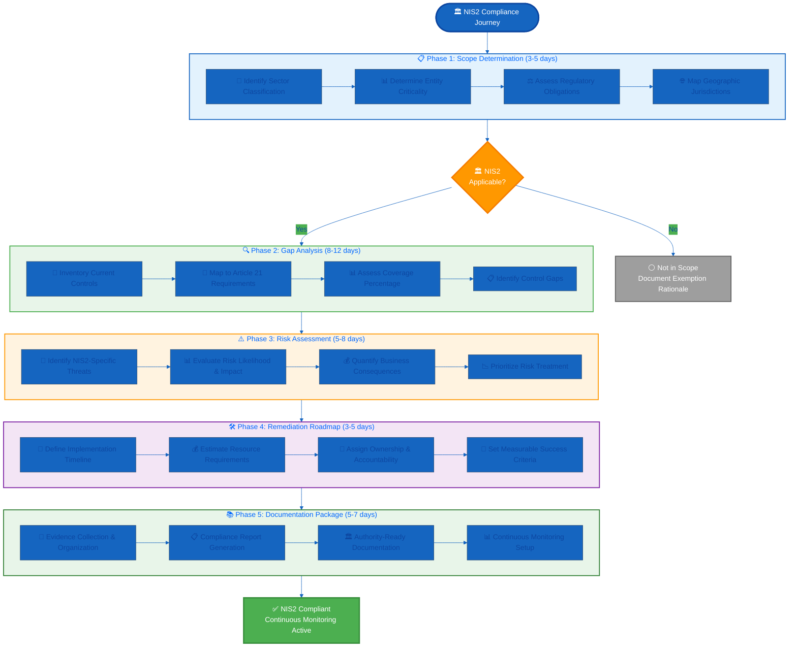

  

<h1 align="center">🏛️ Hack23 AB — NIS2 Directive Compliance Service</h1>

  <strong>🛡️ Expert NIS2 Implementation Through Proven ISMS Excellence</strong> 
  <em>🎯 Transforming Regulatory Obligation Into Competitive Advantage</em>

  
  
  
  

**📋 Document Owner:** CEO | **📄 Version:** 1.3 | **📅 Last Updated:** 2026-05-10 (UTC)  
**🔄 Review Cycle:** Semi-Annual | **⏰ Next Review:** 2026-11-10

---

## 🎯 **Executive Summary**

**Hack23 AB's NIS2 Directive Compliance Service** transforms the complex EU Network and Information Security Directive (2022/2555) into a systematic, transparent implementation roadmap. As the October 2024 enforcement deadline drives urgent compliance demand across 18 critical sectors, our service package leverages our publicly documented ISMS as both proof-of-expertise and compliance template—enabling faster, more cost-effective NIS2 implementation than traditional consultancies.

### 🌍 Market Opportunity

The NIS2 Directive represents one of Europe's most comprehensive cybersecurity mandates:

- **📊 Market Size:** €18B+ estimated compliance spending across EU member states
- **🇸🇪 Swedish Impact:** 1,000+ essential and important entities requiring compliance
- **⚡ Urgency:** October 2024 enforcement with penalties up to €10M or 2% global revenue
- **🎯 Sectors:** 18 critical infrastructure sectors from energy to healthcare to digital services
- **📈 Growth:** Expanding regulatory complexity driving 3-5 year compliance lifecycle

### 🏆 Hack23 Differentiation

Unlike traditional consultancies that conduct NIS2 assessments in isolation, **Hack23's transparent ISMS approach** provides clients with:

1. **🌟 Pre-Built Compliance Templates** — Our public ISMS policies already address 70-85% of NIS2 requirements
2. **⚡ Accelerated Implementation** — Reduce compliance timeline from 12-18 months to 6-9 months
3. **📊 Automated Evidence Generation** — GitHub Actions and CI/CD integrations provide continuous compliance monitoring
4. **🔄 Multi-Framework Alignment** — Leverage existing ISO 27001, NIST CSF, CIS Controls investments
5. **💰 Cost Efficiency** — 30-40% lower total cost of ownership through template reuse and automation
6. **🤝 Transparent Methodology** — Clients see exactly how we achieve compliance in our own operations

*— James Pether Sörling, CEO/Founder*

---

## 🔍 **NIS2 Directive Overview**

### 📜 Regulatory Context

**Directive (EU) 2022/2555** (NIS2) enhances cybersecurity requirements for essential and important entities across the European Union, replacing the original NIS Directive (2016/1148).

**Key Provisions:**
- **Article 20:** Governance framework and accountability requirements
- **Article 21:** Ten mandatory cybersecurity risk management measures
- **Article 23:** Incident reporting obligations (24-hour early warning, 72-hour detailed report)
- **Article 28:** Supply chain security and supplier relationships
- **Article 33:** Jurisdiction and enforcement by national cybersecurity authorities

### 🎯 Covered Sectors (18 Critical Areas)

#### Essential Entities (High Criticality)
1. **🔌 Energy** — Electricity, oil, gas, hydrogen, district heating/cooling
2. **🚂 Transport** — Air, rail, water, road
3. **🏦 Banking** — Credit institutions
4. **💧 Drinking Water** — Supply and distribution
5. **🏥 Healthcare** — Hospitals, medical device manufacturers
6. **🌐 Digital Infrastructure** — DNS, TLD registries, cloud computing, data centers, CDNs
7. **🏛️ Public Administration** — Central government, regional government

#### Important Entities (Medium Criticality)
8. **📬 Postal Services** — Universal postal service providers
9. **♻️ Waste Management** — Collection, treatment, disposal
10. **🧪 Chemical Manufacturing** — Production and distribution
11. **🍔 Food Production** — Large-scale food manufacturing
12. **🏭 Manufacturing** — Medical devices, electronics, machinery, vehicles
13. **🔬 Research Organizations** — Research infrastructure
14. **🌐 Digital Service Providers** — Online marketplaces, search engines, social networks

### ⚖️ Penalties & Enforcement

**Financial Penalties:**
- **Essential Entities:** Up to €10,000,000 or 2% of global annual turnover (whichever is higher)
- **Important Entities:** Up to €7,000,000 or 1.4% of global annual turnover (whichever is higher)

**Additional Consequences:**
- Management liability (personal accountability for board members)
- Temporary suspension of certifications
- Temporary prohibition from management positions
- Public disclosure of non-compliance
- Increased regulatory scrutiny and audit frequency

---

## 📋 **NIS2 Article 21: Ten Cybersecurity Measures**

### Mandatory Risk Management Requirements

| Article | Requirement | Hack23 ISMS Alignment | Coverage |
|---------|-------------|----------------------|----------|
| **Art. 21.2(a)** | Risk analysis and information security policies | [🔐 Information Security Policy](./Information_Security_Policy.md) | 90% |
| **Art. 21.2(b)** | Incident handling | [🚨 Incident Response Plan](./Incident_Response_Plan.md) | 85% |
| **Art. 21.2(c)** | Business continuity and crisis management | [🔄 Business Continuity Plan](./Business_Continuity_Plan.md) [🆘 Disaster Recovery Plan](./Disaster_Recovery_Plan.md) | 90% |
| **Art. 21.2(d)** | Supply chain security | [🤝 Third Party Management](./Third_Party_Management.md) [🏢 Supplier Management](./SUPPLIER.md) | 75% |
| **Art. 21.2(e)** | Security in acquisition, development and maintenance | [🛠️ Secure Development Policy](./Secure_Development_Policy.md) | 80% |
| **Art. 21.2(f)** | Policies on cryptography and encryption | [🔒 Cryptography Policy](./Cryptography_Policy.md) | 95% |
| **Art. 21.2(g)** | Human resources security | [🔐 Information Security Policy](./Information_Security_Policy.md) § 7.2 [✅ Acceptable Use Policy](./Acceptable_Use_Policy.md) | 70% |
| **Art. 21.2(h)** | Access control policies | [🔑 Access Control Policy](./Access_Control_Policy.md) | 95% |
| **Art. 21.2(i)** | Asset management | [💻 Asset Register](./Asset_Register.md) | 90% |
| **Art. 21.2(j)** | Authentication: MFA, continuous authentication | [🔑 Access Control Policy](./Access_Control_Policy.md) § 4.2 | 100% |
| **Art. 21.2(k)** | Secure communication: Voice, video, text, encrypted | [🌐 Network Security Policy](./Network_Security_Policy.md) | 85% |
| **Art. 21.2(l)** | Secure emergency communication systems | [🔄 Business Continuity Plan](./Business_Continuity_Plan.md) § 5.3 | 80% |
| **Art. 21.2(m)** | Network security: Segmentation, monitoring | [🌐 Network Security Policy](./Network_Security_Policy.md) | 90% |

---
## 🎯 **Hack23 NIS2 Assessment Methodology**

### 🔄 Five-Phase Implementation Framework

### 📊 **Typical Engagement Timeline**

| Phase | Duration | Deliverables | Client Involvement |
|-------|----------|--------------|-------------------|
| **Phase 1: Scoping** | 3-5 days | NIS2 applicability determination, sector classification | High (interviews, documentation) |
| **Phase 2: Gap Analysis** | 8-12 days | Gap analysis matrix, control coverage report | Medium (policy review, demos) |
| **Phase 3: Risk Assessment** | 5-8 days | NIS2 risk register, threat scenarios, risk ratings | Medium (risk workshops) |
| **Phase 4: Remediation** | 3-5 days | Implementation roadmap, resource plan, timeline | Low (validation meetings) |
| **Phase 5: Documentation** | 5-7 days | Compliance documentation package, monitoring setup | Low (final review) |
| **Total** | **24-37 days** | Complete NIS2 compliance program | **Varies by phase** |

---

## 💼 **Service Packages & Pricing**

### 📦 Package 1: NIS2 Scoping Assessment

**Duration:** 3-5 days | **Price:** €4,500 - €7,500

**Ideal For:** Organizations uncertain whether NIS2 applies to their operations

**Deliverables:**
- ✅ Sector classification analysis
- ✅ Entity criticality determination (Essential vs. Important)
- ✅ Regulatory obligation summary
- ✅ Exemption justification (if applicable)
- ✅ Next steps recommendation

**Methodology:**
1. Review business operations and service portfolio
2. Map to NIS2 Annex I and Annex II sector definitions
3. Assess size and criticality thresholds
4. Determine geographic jurisdiction (Swedish NIS2 law)
5. Provide written scoping opinion with regulatory references

---

### 📦 Package 2: NIS2 Gap Assessment

**Duration:** 8-12 days | **Price:** €12,000 - €18,000

**Ideal For:** Organizations confirmed in scope needing to understand current compliance posture

**Deliverables:**
- ✅ Complete gap analysis matrix (Article 21 measures vs. current controls)
- ✅ Control coverage percentage by requirement
- ✅ Prioritized gap list with risk ratings
- ✅ Quick win opportunities identification
- ✅ Estimated remediation effort
- ✅ NIS2 vs. ISO 27001 comparison (if applicable)

**Methodology:**
1. Conduct control inventory workshops
2. Map existing policies/procedures to NIS2 requirements
3. Assess operational effectiveness of controls
4. Identify documentation gaps
5. Benchmark against Hack23 ISMS reference implementation
6. Deliver comprehensive gap analysis report

**Add-Ons:**
- **Incident Response Gap Analysis:** +€2,500 (24/72-hour reporting readiness)
- **Supply Chain Assessment:** +€3,500 (vendor NIS2 compliance evaluation)

---

### 📦 Package 3: NIS2 Compliance Roadmap

**Duration:** 16-24 days | **Price:** €24,000 - €36,000

**Includes:** Scoping + Gap Assessment + Risk Assessment + Remediation Planning

**Ideal For:** Organizations requiring end-to-end compliance strategy

**Deliverables:**
- ✅ Complete NIS2 gap analysis
- ✅ NIS2-specific risk register with threat scenarios
- ✅ Detailed implementation roadmap (6-18 month timeline)
- ✅ Resource requirements and budget estimates
- ✅ Policy templates adapted from Hack23 ISMS
- ✅ Incident reporting procedure (24/72-hour timelines)
- ✅ Management presentation deck

**Methodology:**
1. Execute Phase 1-4 of assessment methodology
2. Conduct risk workshops using NIS2 threat scenarios
3. Develop prioritized remediation backlog
4. Create implementation timeline with dependencies
5. Provide customized policy templates
6. Deliver management readiness briefing

---

### 📦 Package 4: Full NIS2 Implementation Support

**Duration:** 40-80 days (6-12 months elapsed) | **Price:** €60,000 - €120,000

**Includes:** Complete end-to-end NIS2 compliance implementation

**Ideal For:** Organizations needing hands-on implementation guidance and validation

**Deliverables:**
- ✅ All deliverables from Package 3
- ✅ Hands-on implementation support and validation
- ✅ Policy and procedure documentation
- ✅ Control implementation validation
- ✅ Evidence package for authorities
- ✅ Incident response playbook
- ✅ Supply chain security framework
- ✅ Management governance structure
- ✅ Authority-ready compliance report
- ✅ Continuous monitoring setup via GitHub Actions and CI/CD
- ✅ 6-month post-implementation support

**Methodology:**
1. Execute all five phases of assessment methodology
2. Provide ongoing implementation guidance and validation
3. Review and approve all compliance documentation
4. Conduct tabletop exercises for incident response
5. Validate control effectiveness through testing
6. Prepare authority-ready compliance evidence
7. Establish continuous compliance monitoring
8. Provide ongoing support during initial operating period

**Add-Ons:**
- **Mock Authority Audit:** +€8,000 (simulated regulatory inspection)
- **Continuous Monitoring (Annual):** €18,000/year (automated compliance tracking)
- **Quarterly Compliance Reviews:** €6,000/quarter (ongoing assurance)

---

## 📊 **NIS2 vs. Hack23 ISMS: Gap Analysis Matrix**

### 🔐 **Comprehensive Requirements Mapping**

The following matrix demonstrates how Hack23's existing ISMS already addresses 70-90% of NIS2 requirements, enabling faster client implementations:

| NIS2 Article | Requirement | ISMS Policy | Coverage | Gap | Priority | Effort |
|--------------|-------------|-------------|----------|-----|----------|--------|
| **21.2(a)** | Risk analysis & security policies | [Information Security Policy](./Information_Security_Policy.md) | 90% | NIS2-specific risk scenarios | Medium | 2-3 days |
| **21.2(b)** | Incident handling | [Incident Response Plan](./Incident_Response_Plan.md) | 85% | 24/72-hour reporting timelines | High | 3-5 days |
| **21.2(c)** | Business continuity, crisis, disaster recovery | [Business Continuity Plan](./Business_Continuity_Plan.md) [Disaster Recovery Plan](./Disaster_Recovery_Plan.md) | 90% | NIS2 scenario testing | Medium | 2-3 days |
| **21.2(d)** | Supply chain security | [Third Party Management](./Third_Party_Management.md) | 75% | NIS2 supplier requirements | High | 5-7 days |
| **21.2(e)** | Security in acquisition & development | [Secure Development Policy](./Secure_Development_Policy.md) | 80% | NIS2 procurement standards | Medium | 3-4 days |
| **21.2(f)** | Cryptography policies | [Cryptography Policy](./Cryptography_Policy.md) | 95% | Minor alignment | Low | 1-2 days |
| **21.2(g)** | Human resources security | [Information Security Policy](./Information_Security_Policy.md) § 7.2 | 70% | Expand training requirements | High | 4-6 days |
| **21.2(h)** | Access control policies | [Access Control Policy](./Access_Control_Policy.md) | 95% | NIS2 privileged access | Low | 1-2 days |
| **21.2(i)** | Asset management | [Asset Register](./Asset_Register.md) | 90% | NIS2 critical asset classification | Medium | 2-3 days |
| **21.2(j)** | Authentication (MFA, continuous) | [Access Control Policy](./Access_Control_Policy.md) § 4.2 | 100% | Fully compliant | None | 0 days |
| **21.2(k)** | Secure communications | [Network Security Policy](./Network_Security_Policy.md) § 4.5 | 85% | Voice/video encryption standards | Medium | 2-3 days |
| **21.2(l)** | Secure emergency communications | [Business Continuity Plan](./Business_Continuity_Plan.md) § 5.3 | 80% | Emergency system redundancy | Medium | 3-4 days |
| **21.2(m)** | Network security (segmentation) | [Network Security Policy](./Network_Security_Policy.md) | 90% | NIS2 segmentation requirements | Low | 2-3 days |
| **Art. 20** | Governance framework | [Information Security Policy](./Information_Security_Policy.md) § 4 | 85% | Board reporting structure | Medium | 2-3 days |
| **Art. 23** | Incident reporting (24/72h) | [Incident Response Plan](./Incident_Response_Plan.md) | 75% | Authority notification procedures | High | 4-5 days |
| **Art. 28** | Supply chain reporting | [Third Party Management](./Third_Party_Management.md) § 6 | 70% | Supplier incident disclosure | High | 3-4 days |

**📊 Overall ISMS Coverage:** **82% average** across all NIS2 requirements

**💡 Key Insight:** Organizations starting with Hack23's ISMS templates can reduce NIS2 compliance implementation time by 40-50% compared to building from scratch.

---

## 🏆 **Hack23 Competitive Advantage**

### 🌟 **Differentiation Strategy**

| Factor | Traditional Consultancy | Hack23 Advantage |
|--------|------------------------|------------------|
| **Transparency** | Proprietary methodologies | Public ISMS as reference implementation |
| **Speed** | 12-18 month implementation | 6-9 month implementation (50% faster) |
| **Cost** | €150K-300K typical engagement | €60K-120K full implementation (50% savings) |
| **Delivery Model** | Multi-consultant teams (PM + analysts + auditors) with associated overhead | Single-CEO delivery augmented by specialist Copilot agents (compliance-reviewer, risk-assessment-specialist, security-documentation-specialist) per [Information Security Strategy § AI-Enabled Operations](./Information_Security_Strategy.md) — `<1` FTE overhead, faster turnaround, fully transparent agent-generated evidence chain |
| **Templates** | Generic templates | Battle-tested ISMS policies (35+ documents) |
| **Automation** | Manual evidence collection | GitHub Actions and CI/CD continuous monitoring |
| **Multi-Framework** | Single-framework focus | ISO 27001 + NIST + CIS + NIS2 alignment |
| **Cloud Expertise** | Generic infrastructure | AWS Well-Architected + cloud-native security |
| **Evidence** | Black box assessment | Transparent methodology + GitHub CI/CD validation |

### 💡 **Client Success Factors**

**Why Hack23 NIS2 Services Deliver Superior Outcomes:**

1. **🔍 Proven Methodology** — Our ISMS is ISO 27001-aligned and publicly validated through CI/CD
2. **⚡ Rapid Implementation** — Pre-built templates eliminate 40-50% of documentation work
3. **📊 Automated Compliance** — GitHub Actions and CI/CD provides continuous evidence generation
4. **🔄 Multi-Framework Synergy** — Leverage existing ISO 27001, SOC 2, or GDPR investments
5. **☁️ Cloud-Native Excellence** — Deep AWS expertise for modern infrastructure compliance
6. **🤝 Transparent Partnership** — Clients see exactly how we achieve compliance internally
7. **💰 Cost Efficiency** — Lower total cost of ownership through automation and templates
8. **🎯 Sector Expertise** — Specialized knowledge in digital infrastructure, cloud, and technology sectors

---

## 🎯 **Target Market Segments**

### Priority Sectors (High Opportunity)

#### 1. 🌐 **Digital Infrastructure Providers**

**Entities:** Cloud service providers, data centers, DNS providers, CDN operators, managed service providers

**Why High Priority:**
- Core Hack23 expertise in cloud architecture and AWS
- Typically technology-forward organizations receptive to automation
- Often already have partial ISO 27001 or SOC 2 compliance
- High compliance urgency due to essential entity classification

**Expected Engagement:** Full Implementation (€60K-120K)

---

#### 2. 🏦 **Financial Services (Banking & FinTech)**

**Entities:** Banks, payment processors, cryptocurrency exchanges, lending platforms, insurance companies

**Why High Priority:**
- Already familiar with regulatory compliance (PSD2, GDPR, AML)
- High budget allocation for cybersecurity
- Strong business case for NIS2 compliance (customer trust)
- Typically require comprehensive documentation and evidence

**Expected Engagement:** Compliance Roadmap or Full Implementation (€24K-120K)

---

#### 3. 🏥 **Healthcare & Medical Devices**

**Entities:** Hospitals, clinics, pharmaceutical manufacturers, medical device manufacturers, telemedicine platforms

**Why High Priority:**
- Critical infrastructure designation drives urgency
- Often lack mature security programs (focus on patient care)
- Regulatory intersection with Medical Device Regulation (MDR)
- High penalties and reputational risk

**Expected Engagement:** Full Implementation (€60K-120K)

---

#### 4. 🚂 **Transport & Logistics**

**Entities:** Airlines, railway operators, shipping companies, logistics platforms, port authorities

**Why High Priority:**
- Essential entity classification with strict requirements
- Increasing digitalization creating compliance gaps
- Often legacy IT systems requiring modernization
- Cross-border operations requiring multi-jurisdiction compliance

**Expected Engagement:** Compliance Roadmap (€24K-36K)

---

### Secondary Sectors (Medium Opportunity)

#### 5. 🏛️ **Public Administration**

**Entities:** Government agencies, municipalities, public utilities, regulatory bodies

**Why Medium Priority:**
- Built-in budget for compliance
- Procurement process complexity extends sales cycles
- Opportunity for long-term framework agreements
- Citizen Intelligence Agency provides relevant reference

**Expected Engagement:** Gap Assessment or Compliance Roadmap (€12K-36K)

---

#### 6. 🔬 **Research & Education**

**Entities:** Universities, research institutes, national labs, medical research organizations

**Why Medium Priority:**
- Important entity classification (lower penalties)
- Limited budgets but strong compliance motivation
- Often part of larger government/EU funding ecosystems
- Opportunity for academic partnerships

**Expected Engagement:** Gap Assessment (€12K-18K)

---

## 📢 **Go-to-Market Strategy**

### 🎯 **Sales & Marketing Approach**

#### Content Marketing (Lead Generation)

**Blog Post Series (Q1 2026):**
1. **"NIS2 Compliance Explained: What Swedish Organizations Need to Know"**
   - Target: General awareness and SEO
   - CTA: Download NIS2 Scoping Checklist

2. **"The True Cost of NIS2 Non-Compliance: Beyond the Fines"**
   - Target: C-level decision makers
   - CTA: Schedule NIS2 Scoping Assessment

3. **"NIS2 and ISO 27001: Leveraging Your Existing ISMS for Faster Compliance"**
   - Target: Security practitioners
   - CTA: Request Gap Analysis Quote

4. **"Incident Reporting Under NIS2: Mastering the 24/72-Hour Timeline"**
   - Target: CISO and incident response teams
   - CTA: Download Incident Response Template

5. **"Supply Chain Security: Meeting NIS2 Article 28 Requirements"**
   - Target: Procurement and risk management
   - CTA: Request Third-Party Assessment

**Webinar Series (Q1-Q2 2026):**
- **"NIS2 Readiness: A 45-Minute Executive Briefing"** (monthly)
- **"Hands-On: Building Your NIS2 Compliance Roadmap"** (quarterly)
- **"NIS2 vs. ISO 27001: Integration Strategies"** (quarterly)

---

#### Direct Outreach

**Target Account List (Top 100 Swedish Companies):**
- Digital infrastructure: 20 companies (cloud, hosting, SaaS)
- Financial services: 25 companies (banks, payment, fintech)
- Healthcare: 20 companies (hospitals, pharma, medtech)
- Transport: 15 companies (airlines, rail, shipping)
- Public sector: 20 entities (agencies, municipalities)

**Outreach Strategy:**
1. LinkedIn connection + personalized message
2. Email with NIS2 sector-specific one-pager
3. Phone follow-up offering free 30-minute consultation
4. Send Hack23 ISMS as reference implementation
5. Propose Scoping Assessment (€4,500-7,500 entry point)

---

#### Partnership Development

**Strategic Partners:**
- **Legal Firms:** Partner with law firms advising on NIS2 (referral agreements)
- **System Integrators:** Provide security expertise for infrastructure projects
- **Industry Associations:** Speak at Svensk Energi, Finansiell ID-teknik, SKR events
- **AWS:** Leverage AWS Partner Network for cloud customer referrals
- **Compliance Software Vendors:** Integration partnerships for tool ecosystem

---

## 💰 **Revenue Projections**

### 📊 **Conservative Forecast (2025-2027)**

| Year | Scoping | Gap Assessment | Roadmap | Full Implementation | Annual Revenue |
|------|---------|----------------|---------|---------------------|----------------|
| **2025** | 8 × €6K | 5 × €15K | 3 × €30K | 1 × €90K | **€303K** |
| **2026** | 15 × €6K | 10 × €15K | 8 × €30K | 4 × €90K | **€900K** |
| **2027** | 20 × €6K | 15 × €15K | 12 × €30K | 6 × €90K | **1,425K** |

**Total 3-Year Revenue:** **€2.6M** from NIS2 services

### 🎯 **Success Metrics**

**Q4 2025 Targets:**
- ✅ 5 completed NIS2 assessments
- ✅ €150K+ NIS2 revenue
- ✅ 3 case studies published
- ✅ 50+ qualified NIS2 prospects in pipeline

**2026 Targets:**
- ✅ 20+ completed NIS2 projects
- ✅ €600K+ NIS2 revenue
- ✅ 40% of consulting revenue from NIS2
- ✅ 10+ long-term compliance monitoring clients
- ✅ NIS2 market leadership in Sweden (top 3 providers)

---

## 📚 **Related Documents**

### 🎯 Strategic & Governance
- [🎯 Information Security Strategy](./Information_Security_Strategy.md) — AI-first operations, Pentagon framework, and strategic NIS2 direction
- [🔐 Information Security Policy](./Information_Security_Policy.md) — Master security governance framework with AI-First Operations Governance
- [🤖 AI Policy](./AI_Policy.md) — AI-assisted NIS2 compliance assessment and automation
- [✅ Compliance Checklist](./Compliance_Checklist.md) — Multi-framework compliance mapping including NIS2
- [📉 Risk Register](./Risk_Register.md) — Risk assessment and treatment
- [📊 Risk Assessment Methodology](./Risk_Assessment_Methodology.md) — Systematic risk analysis process
- [🎯 SWOT Strategic Analysis](./SWOT.md) — Strategic opportunity analysis for NIS2 market

### 🔐 Security Policies & Controls
- [🚨 Incident Response Plan](./Incident_Response_Plan.md) — Incident handling procedures (NIS2 Art. 21.2(b))
- [🔄 Business Continuity Plan](./Business_Continuity_Plan.md) — Business continuity and crisis management (NIS2 Art. 21.2(c))
- [🆘 Disaster Recovery Plan](./Disaster_Recovery_Plan.md) — Technical recovery procedures
- [🤝 Third Party Management](./Third_Party_Management.md) — Supply chain security (NIS2 Art. 21.2(d), Art. 28)
- [🏢 Supplier Management](./SUPPLIER.md) — Detailed supplier assessments and evidence
- [🛠️ Secure Development Policy](./Secure_Development_Policy.md) — Security in acquisition and development (NIS2 Art. 21.2(e))
- [🔒 Cryptography Policy](./Cryptography_Policy.md) — Encryption standards (NIS2 Art. 21.2(f))
- [🔑 Access Control Policy](./Access_Control_Policy.md) — Authentication and access control (NIS2 Art. 21.2(h), 21.2(j))
- [🌐 Network Security Policy](./Network_Security_Policy.md) — Network security and segmentation (NIS2 Art. 21.2(k), 21.2(m))

### ⚙️ Operational Integration
- [💻 Asset Register](./Asset_Register.md) — Asset management (NIS2 Art. 21.2(i))

---

**📋 Document Control:**  
**✅ Approved by:** James Pether Sörling, CEO  
**📤 Distribution:** Public (Service Offering)  
**🏷️ Classification:**   
**📅 Effective Date:** 2026-05-10  
**⏰ Next Review:** 2026-11-10  
**🎯 Framework Compliance:**    