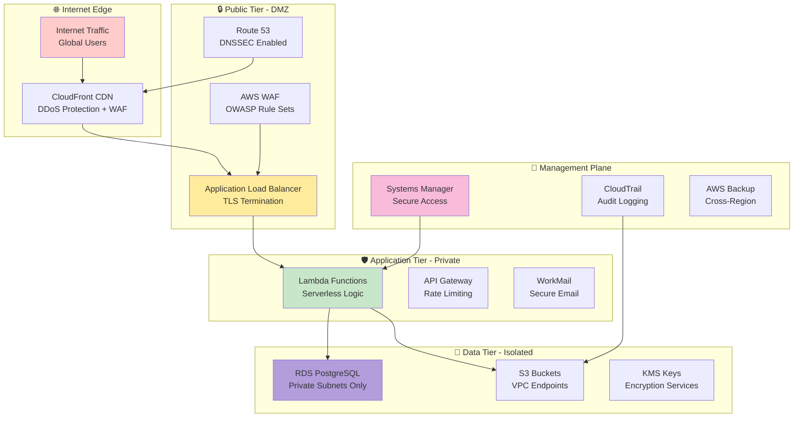
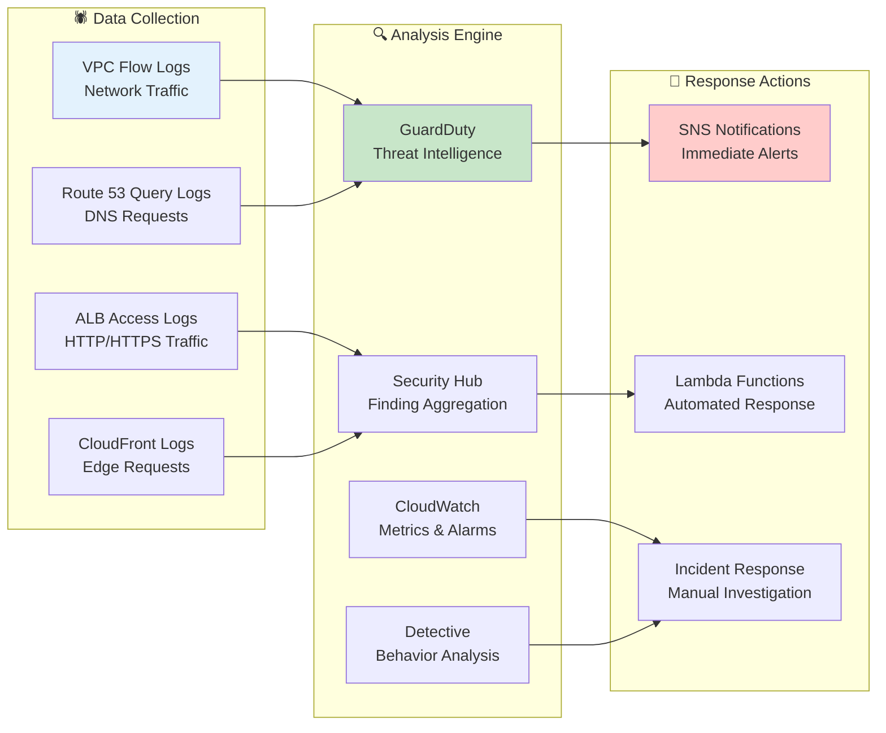
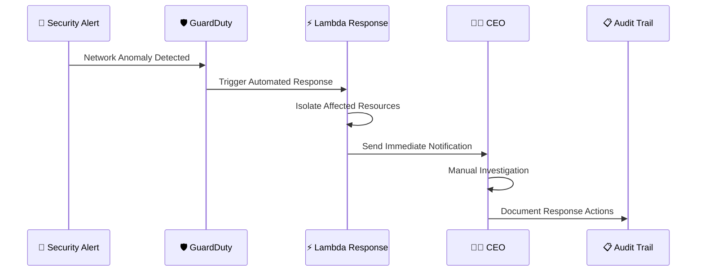
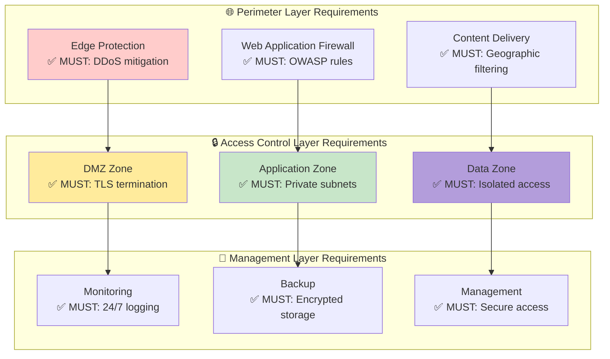
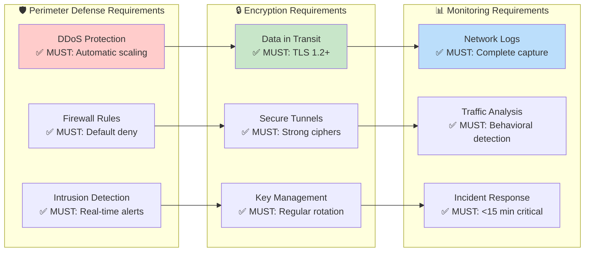
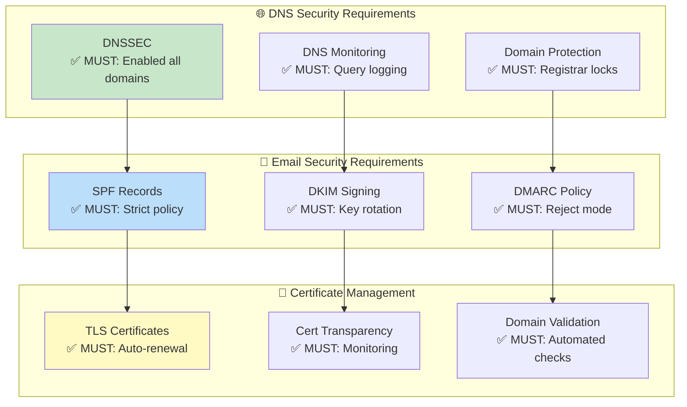
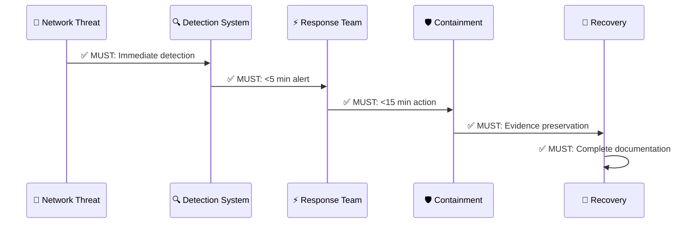

<p align="center">
  
</p>

<h1 align="center">🌐 Hack23 AB — Network Security Policy</h1>

<p align="center">
  <strong>Zero-Trust Network Architecture Through Cloud-Native Excellence</strong><br>
  <em>Demonstrating Network Security Mastery for Cybersecurity Consulting</em>
</p>

<p align="center">
  <a href="#"></a>
  <a href="#"></a>
  <a href="#"></a>
  <a href="#"></a>
</p>

**Document Owner:** CEO | **Version:** 2.0 | **Last Updated:** 2025-08-25 (UTC)  
**Review Cycle:** Annual | **Next Review:** 2026-08-25

---

## 🎯 **Purpose Statement**

**Hack23 AB's** network security framework demonstrates how **cloud-native zero-trust architecture directly enables business agility rather than constraining it.** Our comprehensive network protection serves as both operational necessity and client demonstration of our cybersecurity consulting expertise.

As a cybersecurity consulting company operating entirely in the cloud, our network security approach showcases modern security architecture principles while ensuring robust protection for our business operations. Our network controls demonstrate to potential clients how systematic network security creates competitive advantages through resilient, scalable infrastructure.

Our commitment to transparency means our network security implementation becomes a reference architecture, showing how comprehensive network protection enables rather than hinders innovation and business growth.

*— James Pether Sörling, CEO/Founder*

---

## 🔍 **Purpose & Scope**

This policy establishes comprehensive network security standards for all Hack23 AB network infrastructure, ensuring protection of data flows while supporting business objectives and demonstrating cybersecurity consulting excellence.

**Scope:** All network infrastructure, security controls, and communication channels documented in [Asset Register](./Asset_Register.md), including AWS VPC architecture, DNS services, CDN configuration, and email systems.

**Framework Alignment:**
- **ISO 27001:2022** - Controls A.13 (Communications Security), A.14 (System Acquisition)
- **NIST CSF 2.0** - PR.AC (Access Control), PR.DS (Data Security)
- **CIS Controls v8** - Control 12 (Network Infrastructure Management), Control 13 (Network Monitoring)

---

## 🏗️ **Zero-Trust Network Architecture**

### 🛡️ Network Segmentation Strategy

[](./CLASSIFICATION.md) [](./CLASSIFICATION.md)

Our cloud-native architecture implements defense-in-depth through systematic network segmentation:



### 🎯 Zero-Trust Principles Implementation

[](./CLASSIFICATION.md)

#### **🔐 Never Trust, Always Verify**
- **Identity Verification:** All connections authenticated through AWS Identity Center
- **Device Trust:** No implicit trust based on network location
- **Least Privilege:** Minimum necessary access for each connection

#### **🌐 Assume Breach**
- **Micro-Segmentation:** Granular security groups per service
- **Continuous Monitoring:** Real-time traffic analysis and threat detection
- **Incident Response:** Automated containment and manual escalation procedures

---

## 🔒 **Network Security Controls**

### 🛡️ Perimeter Defense

[](./CLASSIFICATION.md) [](./CLASSIFICATION.md)

#### **CloudFront CDN Protection**
- **DDoS Mitigation:** AWS Shield Standard with automatic scaling
- **Geographic Filtering:** Configurable geo-blocking for threat regions
- **Cache Security:** Signed URLs for sensitive content delivery
- **TLS Configuration:** Minimum TLS 1.2, modern cipher suites only

#### **AWS WAF Implementation**
```yaml
WAF_Rules:
  Core_Rule_Set:
    - OWASP_Top_10: Enabled
    - Known_Bad_Inputs: Enabled
    - SQL_Injection: Block
    - XSS_Prevention: Block
  
  Rate_Limiting:
    - General_Requests: 2000/5min per IP
    - API_Calls: 100/min per authenticated user
    - Login_Attempts: 5/min per IP
  
  Geographic_Rules:
    - Allow_List: EU, US, CA, AU
    - Block_List: Known threat countries
    - Monitoring: Log all geo-blocked attempts
```

### 🔐 VPC Security Architecture

[](./CLASSIFICATION.md)

#### **Network Access Control Lists (NACLs)**
| Network Tier | Inbound Rules | Outbound Rules | **Security Posture** |
|--------------|---------------|----------------|-------------------|
| **🌐 Public Subnets** | HTTP/HTTPS from 0.0.0.0/0 | HTTPS to private subnets | [](./CLASSIFICATION.md) |
| **🛡️ Private Subnets** | HTTPS from public subnets | HTTPS to RDS, S3 endpoints | [](./CLASSIFICATION.md) |
| **💾 Database Subnets** | PostgreSQL from app subnets | None (except updates) | [](./CLASSIFICATION.md) |

#### **Security Groups Configuration**
```yaml
Web_Tier_SG:
  Ingress:
    - Port: 443, Source: CloudFront IPs, Protocol: HTTPS
    - Port: 80, Source: CloudFront IPs, Protocol: HTTP (redirect only)
  Egress:
    - Port: 443, Destination: App_Tier_SG, Protocol: HTTPS

App_Tier_SG:
  Ingress:
    - Port: 443, Source: Web_Tier_SG, Protocol: HTTPS
  Egress:
    - Port: 5432, Destination: DB_Tier_SG, Protocol: PostgreSQL
    - Port: 443, Destination: 0.0.0.0/0, Protocol: HTTPS (APIs)

DB_Tier_SG:
  Ingress:
    - Port: 5432, Source: App_Tier_SG, Protocol: PostgreSQL
  Egress: [] # No outbound except AWS service endpoints
```

### 🔗 VPC Endpoints and Service Integration

[](./CLASSIFICATION.md)

#### **Gateway Endpoints**
- **S3 Gateway Endpoint:** Direct private connectivity to S3 buckets
- **DynamoDB Gateway Endpoint:** Private access to DynamoDB tables (future)

#### **Interface Endpoints**
- **KMS Endpoint:** Encryption key operations stay within VPC
- **SSM Endpoints:** Systems Manager access without internet gateway
- **CloudWatch Endpoint:** Metrics and logs via private connectivity

---

## 🌐 **DNS and Domain Security**

### 🔒 DNS Security Implementation

[](./CLASSIFICATION.md) [](./CLASSIFICATION.md)

#### **Route 53 Configuration**
| Domain | DNSSEC Status | **Security Features** | Monitoring |
|--------|---------------|---------------------|------------|
| **hack23.com** | [](./CLASSIFICATION.md) | [](./CLASSIFICATION.md) | [](./CLASSIFICATION.md) |
| **blacktrigram.com** | [](./CLASSIFICATION.md) | [](./CLASSIFICATION.md) | [](./CLASSIFICATION.md) |

#### **DNS Security Measures**
```yaml
DNS_Security:
  DNSSEC:
    - Key_Signing_Key: Rotated annually
    - Zone_Signing_Key: Rotated quarterly
    - DS_Records: Published at registrar
  
  Monitoring:
    - Certificate_Transparency: Monitored
    - DNS_Changes: Alerted via CloudWatch
    - Subdomain_Takeover: Checked monthly
  
  Protection:
    - Registrar_Lock: Enabled
    - Admin_Contacts: CEO only
    - Transfer_Lock: 60-day minimum
```

---

## 📧 **Email Security Architecture**

### 🔐 WorkMail Security Configuration

[](./CLASSIFICATION.md)

#### **Email Authentication Framework**
| Authentication Method | Configuration | **Security Level** | Monitoring |
|-----------------------|---------------|-------------------|------------|
| **SPF Record** | `v=spf1 include:amazonses.com -all` | [](./CLASSIFICATION.md) | [](./CLASSIFICATION.md) |
| **DKIM Signing** | AWS WorkMail managed keys | [](./CLASSIFICATION.md) | [](./CLASSIFICATION.md) |
| **DMARC Policy** | `v=DMARC1; p=reject; rua=mailto:dmarc@hack23.com` | [](./CLASSIFICATION.md) | [](./CLASSIFICATION.md) |

#### **WorkMail Security Controls**
- **Encryption in Transit:** TLS 1.2+ for all SMTP connections
- **Encryption at Rest:** AWS KMS managed encryption
- **Access Control:** MFA required via AWS Identity Center
- **Mobile Device Management:** Company device policies enforced

---

## 📊 **Network Monitoring and Detection**

### 🔍 Continuous Network Monitoring

[](./CLASSIFICATION.md) [](./CLASSIFICATION.md)

#### **Multi-Layer Detection Strategy**


#### **Network Security Metrics**

[](./CLASSIFICATION.md)

| Monitoring Category | **Detection Method** | Alert Threshold | Response Time |
|--------------------|---------------------|-----------------|---------------|
| **🔍 Anomalous Traffic** | [](./CLASSIFICATION.md) | Unusual port/protocol | [](./CLASSIFICATION.md) |
| **🌐 DNS Tunneling** | [](./CLASSIFICATION.md) | Suspicious query patterns | [](./CLASSIFICATION.md) |
| **🚨 DDoS Attacks** | [](./CLASSIFICATION.md) | Traffic volume spikes | [](./CLASSIFICATION.md) |
| **🔒 TLS Anomalies** | [](./CLASSIFICATION.md) | Cipher/protocol violations | [](./CLASSIFICATION.md) |

---

## 🚨 **Incident Response Integration**

### 🔒 Network Security Incidents

[](./CLASSIFICATION.md)

#### **Network Incident Classification**

| Incident Type | **Severity Level** | Containment Strategy | Evidence Preservation |
|---------------|-------------------|---------------------|----------------------|
| **🔴 DDoS Attack** | [](./CLASSIFICATION.md) | Automatic AWS Shield activation | [](./CLASSIFICATION.md) |
| **🟠 Network Intrusion** | [](./CLASSIFICATION.md) | Security group lockdown | [](./CLASSIFICATION.md) |
| **🟡 DNS Poisoning** | [](./CLASSIFICATION.md) | DNSSEC validation check | [](./CLASSIFICATION.md) |
| **🟢 Configuration Drift** | [](./CLASSIFICATION.md) | Config rule remediation | [](./CLASSIFICATION.md) |

#### **Automated Response Procedures**



---

## 🛡️ **Mandatory Network Security Requirements**

### ✅ **MUST HAVE - Network Segmentation**

[](./CLASSIFICATION.md) [](./CLASSIFICATION.md)

**Organizations implementing this policy MUST:**



**Network Segmentation Requirements:**
- ✅ **MUST** implement network segmentation with clearly defined security zones
- ✅ **MUST** enforce least privilege network access between segments
- ✅ **MUST** maintain network access control lists (NACLs) and security groups
- ✅ **MUST** implement monitoring and logging for all inter-segment traffic

### ✅ **MUST HAVE - Security Controls**

[](./CLASSIFICATION.md)

**Network security controls MUST:**



**Security Control Requirements:**
- ✅ **MUST** implement web application firewall with OWASP rule sets
- ✅ **MUST** enforce TLS 1.2 or higher for all data transmission
- ✅ **MUST** maintain comprehensive network traffic monitoring
- ✅ **MUST** establish automated threat detection and response capabilities

### ✅ **MUST HAVE - DNS and Domain Security**

[](./CLASSIFICATION.md)

**DNS security implementation MUST:**



**DNS and Domain Requirements:**
- ✅ **MUST** enable DNSSEC for all organizational domains
- ✅ **MUST** implement email authentication (SPF, DKIM, DMARC)
- ✅ **MUST** maintain domain registrar locks and transfer restrictions
- ✅ **MUST** monitor for unauthorized DNS changes and certificate issuance

### ✅ **MUST HAVE - Incident Response Integration**

[](./CLASSIFICATION.md)

**Network incident response MUST:**



**Incident Response Requirements:**
- ✅ **MUST** establish network security incident classification procedures
- ✅ **MUST** implement automated containment for critical threats (DDoS, intrusion)
- ✅ **MUST** maintain evidence preservation capabilities for forensic analysis
- ✅ **MUST** document all response actions within defined timeframes

---

## 📚 **Related Documents**

### **🔐 Core Security Framework**
- [🔐 Information Security Policy](./Information_Security_Policy.md) - Overall security governance and business value framework
- [🔑 Access Control Policy](./Access_Control_Policy.md) - Network access controls and identity management
- [🔒 Cryptography Policy](./Cryptography_Policy.md) - Network encryption standards and key management
- [🏷️ Data Classification Policy](./Data_Classification_Policy.md) - Network-based data protection requirements

### **⚙️ Operational Excellence Framework**
- [📝 Change Management](./Change_Management.md) - Network configuration change procedures
- [🔍 Vulnerability Management](./Vulnerability_Management.md) - Network security testing and remediation
- [🤝 Third Party Management](./Third_Party_Management.md) - Network supplier risk management

### **🚨 Incident Response and Recovery**
- [🚨 Incident Response Plan](./Incident_Response_Plan.md) - Network security incident handling procedures
- [🔄 Business Continuity Plan](./Business_Continuity_Plan.md) - Network resilience during business disruption
- [🆘 Disaster Recovery Plan](./Disaster_Recovery_Plan.md) - Network infrastructure recovery procedures
- [💾 Backup Recovery Policy](./Backup_Recovery_Policy.md) - Network configuration backup and restoration

### **📊 Risk and Performance Management**
- [💻 Asset Register](./Asset_Register.md) - Network infrastructure inventory and management
- [📉 Risk Register](./Risk_Register.md) - Network-related risk identification and treatment
- [📊 Security Metrics](./Security_Metrics.md) - Network security performance measurement
- [🏷️ Classification Framework](./CLASSIFICATION.md) - Network impact analysis and classification

---

**Document Control:**  
**Approved by:** James Pether Sörling, CEO  
**Distribution:** Public  
**Classification:** [](./CLASSIFICATION.md#confidentiality-levels)  
**Effective Date:** 2025-08-25  
**Next Review:** 2026-08-25  
**Framework Compliance:** [](./CLASSIFICATION.md) [](./CLASSIFICATION.md) [](./CLASSIFICATION.md)
