<p align="center">
  
</p>

<h1 align="center">🌐 Hack23 AB — Network Security Policy</h1>

<p align="center">
  <strong>🛡️ Zero-Trust Network Architecture Through Cloud-Native Excellence</strong><br>
  <em>🎯 Demonstrating Network Security Mastery for Cybersecurity Consulting</em>
</p>

<p align="center">
  <a href="#"></a>
  <a href="#"></a>
  <a href="#"></a>
  <a href="#"></a>
</p>

**📋 Document Owner:** CEO | **📄 Version:** 2.3 | **📅 Last Updated:** 2026-01-25 (UTC)  
**🔄 Review Cycle:** Annual | **⏰ Next Review:** 2027-01-25

---

## 🎯 **Purpose Statement**

**Hack23 AB's** network security framework demonstrates how **cloud-native zero-trust architecture directly enables business agility rather than constraining it.** Our comprehensive network protection serves as both operational necessity and client demonstration of our cybersecurity consulting expertise.

As a cybersecurity consulting company operating entirely in the cloud, our network security approach showcases modern security architecture principles while ensuring robust protection for our business operations. Our network controls demonstrate to potential clients how systematic network security creates competitive advantages through resilient, scalable infrastructure.

Our commitment to transparency means our network security implementation becomes a reference architecture, showing how comprehensive network protection enables rather than hinders innovation and business growth.

*— James Pether Sörling, CEO/Founder*

---

## 🔍 **Purpose & Scope**

This policy establishes comprehensive network security standards for all Hack23 AB network infrastructure, ensuring protection of data flows while supporting business objectives and demonstrating cybersecurity consulting excellence.

**Scope:** All network infrastructure, security controls, and communication channels documented in [💻 Asset Register](./Asset_Register.md), including AWS VPC architecture, DNS services, CDN configuration, and email systems.

---

## 🏗️ **Zero-Trust Network Architecture**

[](./CLASSIFICATION.md) [](./Asset_Register.md) [](./Disaster_Recovery_Plan.md)

[](./CLASSIFICATION.md) [](./CLASSIFICATION.md) [](./CLASSIFICATION.md) [](./CLASSIFICATION.md)

### 🛡️ **Defense-in-Depth Strategy**

[](./Asset_Register.md) [](./Asset_Register.md) [](./Asset_Register.md) [](./Asset_Register.md)

**Requirements:**
- **MUST** implement "never trust, always verify" authentication
- **MUST** enforce micro-segmentation with least privilege access
- **MUST** maintain continuous monitoring with automated threat response


### 🎯 Zero-Trust Principles Implementation

[]() []() []() []()

---

## 🔒 **Network Security Controls**

[](./Asset_Register.md) [](./Asset_Register.md) [](https://www.ssllabs.com/ssltest/analyze.html?d=hack23.com) [](./Asset_Register.md)

[](./CLASSIFICATION.md) [](./CLASSIFICATION.md) [](./CLASSIFICATION.md) [](./CLASSIFICATION.md)

**Network Segmentation Requirements:**
- ✅ **MUST** implement network segmentation with clearly defined security zones
- ✅ **MUST** enforce least privilege network access between segments
- ✅ **MUST** maintain network access control lists (NACLs) and security groups
- ✅ **MUST** implement monitoring and logging for all inter-segment traffic

### ✅ **MUST HAVE - Security Controls**

[](./CLASSIFICATION.md)

**Network security controls MUST:**

```mermaid
graph LR
    subgraph "🛡️ Perimeter Defense Requirements"
        DDOS[DDoS Protection<br/>✅ MUST: Automatic scaling]
        FIREWALL[Firewall Rules<br/>✅ MUST: Default deny]
        INTRUSION[Intrusion Detection<br/>✅ MUST: Real-time alerts]
    end
    
    subgraph "🔒 Encryption Requirements"
        TRANSIT[Data in Transit<br/>✅ MUST: TLS 1.2+]
        VPN[Secure Tunnels<br/>✅ MUST: Strong ciphers]
        KEYS[Key Management<br/>✅ MUST: Regular rotation]
    end
    
    subgraph "📊 Monitoring Requirements"
        LOGS[Network Logs<br/>✅ MUST: Complete capture]
        ANALYSIS[Traffic Analysis<br/>✅ MUST: Behavioral detection]
        RESPONSE[Incident Response<br/>✅ MUST: <15 min critical]
    end
    
    DDOS --> TRANSIT
    FIREWALL --> VPN
    INTRUSION --> KEYS
    
    TRANSIT --> LOGS
    VPN --> ANALYSIS
    KEYS --> RESPONSE
    
    style DDOS fill:#D32F2F
    style TRANSIT fill:#4CAF50
    style LOGS fill:#1565C0
```



**Security Control Requirements:**
- ✅ **MUST** implement web application firewall with OWASP rule sets
- ✅ **MUST** enforce TLS 1.2 or higher for all data transmission
- ✅ **MUST** maintain comprehensive network traffic monitoring
- ✅ **MUST** establish automated threat detection and response capabilities

### ✅ **MUST HAVE - DNS and Domain Security**

[](./CLASSIFICATION.md)

**DNS security implementation MUST:**

```mermaid
flowchart TD
    subgraph "🌐 DNS Security Requirements"
        DNSSEC[DNSSEC<br/>✅ MUST: Enabled all domains]
        MONITORING[DNS Monitoring<br/>✅ MUST: Query logging]
        PROTECTION[Domain Protection<br/>✅ MUST: Registrar locks]
    end
    
    subgraph "📧 Email Security Requirements"
        SPF[SPF Records<br/>✅ MUST: Strict policy]
        DKIM[DKIM Signing<br/>✅ MUST: Key rotation]
        DMARC[DMARC Policy<br/>✅ MUST: Reject mode]
    end
    
    subgraph "🔐 Certificate Management"
        TLS[TLS Certificates<br/>✅ MUST: Auto-renewal]
        TRANSPARENCY[Cert Transparency<br/>✅ MUST: Monitoring]
        VALIDATION[Domain Validation<br/>✅ MUST: Automated checks]
    end
    
    DNSSEC --> SPF
    MONITORING --> DKIM
    PROTECTION --> DMARC
    
    SPF --> TLS
    DKIM --> TRANSPARENCY
    DMARC --> VALIDATION
    
    style DNSSEC fill:#4CAF50
    style SPF fill:#1565C0
    style TLS fill:#FFC107
```



**DNS and Domain Requirements:**
- ✅ **MUST** enable DNSSEC for all organizational domains
- ✅ **MUST** implement email authentication (SPF, DKIM, DMARC)
- ✅ **MUST** maintain domain registrar locks and transfer restrictions
- ✅ **MUST** monitor for unauthorized DNS changes and certificate issuance

### ✅ **MUST HAVE - Incident Response Integration**

[](./CLASSIFICATION.md)

**Network incident response MUST:**

```mermaid
sequenceDiagram
    participant THREAT as 🚨 Network Threat
    participant DETECTION as 🔍 Detection System
    participant RESPONSE as ⚡ Response Team
    participant CONTAINMENT as 🛡️ Containment
    participant RECOVERY as 🔄 Recovery
    
    THREAT->>DETECTION: ✅ MUST: Immediate detection
    DETECTION->>RESPONSE: ✅ MUST: <5 min alert
    RESPONSE->>CONTAINMENT: ✅ MUST: <15 min action
    CONTAINMENT->>RECOVERY: ✅ MUST: Evidence preservation
    RECOVERY->>RECOVERY: ✅ MUST: Complete documentation
```



**Incident Response Requirements:**
- ✅ **MUST** establish network security incident classification procedures
- ✅ **MUST** implement automated containment for critical threats (DDoS, intrusion)
- ✅ **MUST** maintain evidence preservation capabilities for forensic analysis
- ✅ **MUST** document all response actions within defined timeframes

---


### 🛡️ **Implementation Evidence**

[](https://www.ssllabs.com/ssltest/analyze.html?d=hack23.com) [](./CLASSIFICATION.md) [](./CLASSIFICATION.md) [](./CLASSIFICATION.md)

---

## 🌐 **DNS and Domain Security**

[](https://dnssec-debugger.verisignlabs.com/hack23.com) [](./Asset_Register.md) [](./Security_Metrics.md) [](./CLASSIFICATION.md)

[](./CLASSIFICATION.md) [](./CLASSIFICATION.md) [](./CLASSIFICATION.md)

### 🔒 **DNS Security Controls**

[](https://dnssec-debugger.verisignlabs.com/hack23.com) [](https://dnssec-debugger.verisignlabs.com/blacktrigram.com) [](./Asset_Register.md)

**Requirements:**
- **MUST** enable DNSSEC with annual KSK and quarterly ZSK rotation
- **MUST** implement DNS firewall with malware/phishing protection
- **MUST** enable DNS query logging for security monitoring
- **MUST** maintain registrar domain locks and change notifications

### 🛡️ **DNS Firewall & Threat Protection**

[](./Asset_Register.md) [](./Security_Metrics.md) [](./Security_Metrics.md) [](./Security_Metrics.md)

**AWS Route 53 Resolver DNS Firewall:**
- **Malware Protection:** Block known malicious domains and IPs
- **Phishing Prevention:** Block newly registered suspicious domains  
- **Botnet Detection:** Block command & control communications
- **Custom Rules:** Organization-specific allow/block lists

### 📊 **DNS Monitoring & Logging**

[](./Security_Metrics.md) [](./Security_Metrics.md) [](./Security_Metrics.md)

**Route 53 Resolver Query Logs:**
- **Query Logging:** All DNS requests logged to CloudWatch
- **Anomaly Detection:** Unusual query patterns and volumes
- **Threat Intelligence:** Integration with security feeds
- **Compliance Reporting:** DNS security metrics and KPIs

---

## 📧 **Email Security Architecture**

[](https://mxtoolbox.com/spf.aspx?domain=hack23.com) [](https://mxtoolbox.com/dkim.aspx?domain=hack23.com) [](https://mxtoolbox.com/dmarc.aspx?domain=hack23.com) [](./Asset_Register.md)

[](./CLASSIFICATION.md) [](./CLASSIFICATION.md) [](./CLASSIFICATION.md)

### 🏗️ **Email Security Architecture Overview**

[](./Asset_Register.md) [](./Asset_Register.md) [](./Asset_Register.md) [](./Asset_Register.md)


### 📬 **Mandatory Email Security Controls**

#### 🔐 **SPF (Sender Policy Framework) Requirements**

[](https://mxtoolbox.com/spf.aspx?domain=hack23.com) [](./Asset_Register.md) [](https://mxtoolbox.com/spf.aspx?domain=hack23.com)

**✅ MUST implement strict SPF policy (-all) for all email-sending domains**  
**✅ MUST include only authorized mail servers in SPF records**  
**✅ MUST use `v=spf1 include:amazonses.com -all` format for AWS WorkMail integration**

#### 🔑 **DKIM (DomainKeys Identified Mail) Requirements**

[](https://mxtoolbox.com/dkim.aspx?domain=hack23.com) [](./Asset_Register.md) [](./Cryptography_Policy.md)

**✅ MUST enable DKIM signing for all outbound email**  
**✅ MUST use AWS WorkMail managed key rotation**  
**✅ MUST implement minimum 2048-bit RSA keys for DKIM signatures**

#### 🛡️ **DMARC (Domain-based Message Authentication) Requirements**

[](https://mxtoolbox.com/dmarc.aspx?domain=hack23.com) [](./Security_Metrics.md) [](./Asset_Register.md) [](./Asset_Register.md)

**✅ MUST implement DMARC policy with p=reject for production domains**  
**✅ MUST configure aggregate reporting (rua=) for compliance monitoring**  
**✅ MUST set strict DKIM alignment (adkim=s) and relaxed SPF alignment (aspf=r)**  
**✅ MUST apply policy to subdomains (sp=reject)**

### 🔒 **Advanced Email Security Standards**

#### 🌐 **MTA-STS (Mail Transfer Agent Strict Transport Security) Implementation**

[](https://mta-sts.hack23.com/.well-known/mta-sts.txt) [](./Asset_Register.md) [](./Asset_Register.md) [](https://mta-sts.hack23.com/.well-known/mta-sts.txt)

**✅ MUST implement MTA-STS policy for all domains sending business-critical email**  
**✅ MUST use enforce mode for production email domains**  
**✅ MUST host policy files at `https://mta-sts.hack23.com/.well-known/mta-sts.txt`**  
**✅ MUST configure appropriate TTL (86400 seconds minimum)**  
**✅ MUST configure reporting endpoint at admin@hack23.com for policy violations**

**MTA-STS Policy Configuration:**
- **Policy Mode:** `enforce` (mandatory for production domains)
- **Max Age:** `86400` seconds (24 hours minimum)
- **MX Records:** AWS WorkMail servers only
- **Policy Location:** `https://mta-sts.hack23.com/.well-known/mta-sts.txt`
- **Reporting Email:** `admin@hack23.com` for policy violation reports

#### 📊 **TLS-RPT (TLS Reporting) Configuration**

[](./Security_Metrics.md) [](./Asset_Register.md) [](./Security_Metrics.md)

**✅ MUST implement TLS-RPT for email delivery monitoring**  
**✅ MUST configure reporting URI: `v=TLSRPTv1; rua=mailto:admin@hack23.com`**  
**✅ MUST process TLS failure reports for security analysis**  
**✅ MUST integrate TLS-RPT data with security monitoring systems**

#### 🎨 **BIMI (Brand Indicators for Message Identification)**

[](./Asset_Register.md) [](./Asset_Register.md) [](./Asset_Register.md)

**🔄 MAY implement BIMI for brand recognition (requires Verified Mark Certificate)**  
**🔄 MAY be considered for domains with high-volume marketing communications**

### 🛡️ **WorkMail Security Configuration**

#### 🔐 **Transport Security Requirements**

[](./Cryptography_Policy.md) [](./Cryptography_Policy.md) [](./Asset_Register.md)

**🔐 Encryption in Transit: TLS 1.2+ mandatory for all SMTP connections**  
**🔐 Encryption at Rest: AWS KMS managed encryption for all stored messages**  
**🔐 Certificate Validation: Proper certificate chain verification required**

#### 👤 **Access Control Standards**

[](./Access_Control_Policy.md) [](./Access_Control_Policy.md) [](./Asset_Register.md)

**👤 Authentication: Multi-Factor Authentication (MFA) required via AWS Identity Center**  
**👤 Authorization: Role-based access control for email administration**  
**👤 Mobile Access: Company device management policies enforced for mobile email access**

### 📧 **Email Security Evidence & Validation**

#### 📊 **Current Email Authentication Status**

| **Domain** | **SPF Record** | **DKIM Status** | **DMARC Policy** | **Validation Links** |
|------------|----------------|-----------------|------------------|---------------------|
| **hack23.com** | [](https://mxtoolbox.com/spf.aspx?domain=hack23.com) | [](https://mxtoolbox.com/dkim.aspx?domain=hack23.com) | [](https://mxtoolbox.com/dmarc.aspx?domain=hack23.com) | [](https://mxtoolbox.com/SuperTool.aspx?action=mx%3ahack23.com) |
| **blacktrigram.com** | [](https://mxtoolbox.com/spf.aspx?domain=blacktrigram.com) | [](https://mxtoolbox.com/dkim.aspx?domain=blacktrigram.com) | [](https://mxtoolbox.com/dmarc.aspx?domain=blacktrigram.com) | [](https://mxtoolbox.com/SuperTool.aspx?action=mx%3ablacktrigram.com) |

#### 🔧 **Email Security Validation Commands**

[](./Asset_Register.md) [](./Asset_Register.md) [](./Asset_Register.md)

### 🔧 **Implementation Evidence**

[](https://mxtoolbox.com/SuperTool.aspx?action=mx%3ahack23.com) [](https://www.dmarcanalyzer.com/dmarc-checker/) [](https://www.mail-tester.com/) [](https://www.hardenize.com/)

---

## 🔗 **VPC Endpoints & Private Connectivity**

[](./Asset_Register.md) [](./Asset_Register.md) [](./Asset_Register.md) [](./Asset_Register.md)

[](./CLASSIFICATION.md) [](./CLASSIFICATION.md) [](./CLASSIFICATION.md)

**Private Service Access:**
- **MUST** implement VPC endpoints for all critical AWS services
- **MUST** configure endpoint policies for least privilege access
- **SHOULD** implement Interface endpoints for enhanced security

**CIS Control 12.6 - Wireless Access Management**: Cloud-native architecture eliminates traditional wireless infrastructure security concerns through serverless and managed services.

## 📊 **Network Monitoring and Detection**

### 🔍 Continuous Network Monitoring

[](./CLASSIFICATION.md) [](./CLASSIFICATION.md)

[](./CLASSIFICATION.md) [](./CLASSIFICATION.md) [](./CLASSIFICATION.md) [](./CLASSIFICATION.md)

#### **Multi-Layer Detection Strategy**


#### **Network Security Metrics**

[](./CLASSIFICATION.md)

| Monitoring Category | **Detection Method** | Alert Threshold | Response Time |
|--------------------|---------------------|-----------------|---------------|
| **🔠Anomalous Traffic** | [](./CLASSIFICATION.md) | Unusual port/protocol | [](./CLASSIFICATION.md) |
| **🌠DNS Tunneling** | [](./CLASSIFICATION.md) | Suspicious query patterns | [](./CLASSIFICATION.md) |
| **🚨 DDoS Attacks** | [](./CLASSIFICATION.md) | Traffic volume spikes | [](./CLASSIFICATION.md) |
| **🔒 TLS Anomalies** | [](./CLASSIFICATION.md) | Cipher/protocol violations | [](./CLASSIFICATION.md) |

---

## ⏰ **Clock Synchronization and Time Integrity**

Implementation of ISO 27001 A.8.17 (Clock synchronization) for accurate audit logging and security event correlation:

### 🎯 **Time Synchronization Framework**


### ⏱️ **Time Synchronization Requirements**

| System Type | Time Source | Protocol | Sync Frequency | Max Drift Allowed | Verification |
|-------------|-------------|----------|----------------|-------------------|--------------|
| **AWS Lambda** | AWS-managed | N/A (managed) | Continuous | N/A (AWS-managed) | Automatic |
| **AWS RDS** | AWS-managed | N/A (managed) | Continuous | N/A (AWS-managed) | Automatic |
| **AWS WorkMail** | AWS-managed | N/A (managed) | Continuous | N/A (AWS-managed) | Automatic |
| **CloudWatch Logs** | UTC internal | N/A (managed) | Continuous | N/A (AWS-managed) | Automatic |
| **EC2 Instances** (if deployed) | AWS NTP + backup | NTP/chrony | Every 60 seconds | ±1 second | CloudWatch metric |
| **Mobile Devices** | OS native time sync | NTP/HTTPS | Device-managed | ±5 seconds | MDM verification |
| **Developer Workstations** | OS native time sync | NTP | OS-managed | ±10 seconds | Manual verification |

### 🔒 **Time Security Controls**

#### **NTP Security Configuration**

For any EC2 instances or on-premise systems (when applicable):

**Primary Time Source:**
- AWS NTP: `169.254.169.123` (link-local VPC address)
- Priority: Highest (stratum 1 equivalent)
- Authentication: Not required (VPC-local)

**Backup Time Sources:**
- Public NTP Pool: `pool.ntp.org`
- Regional Pool: `se.pool.ntp.org` (Sweden)
- Authentication: NTP authentication keys where supported

**Security Measures:**
- **Firewall Rules:** Outbound UDP 123 only to trusted NTP servers
- **Access Control:** No inbound NTP queries accepted (clients only)
- **Monitoring:** Failed sync attempts trigger security alerts
- **Rate Limiting:** Maximum 10 NTP queries per minute per instance

#### **Logging Time Integrity**

All security-relevant logs use consistent time standards:

| Log Source | Timestamp Format | Time Zone | Resolution | Retention |
|------------|-----------------|-----------|------------|-----------|
| **CloudTrail** | ISO 8601 | UTC | Millisecond | 3 years |
| **VPC Flow Logs** | Unix epoch | UTC | Second | 90 days |
| **CloudWatch Logs** | ISO 8601 | UTC | Millisecond | Per log group (1-365 days) |
| **GuardDuty Findings** | ISO 8601 | UTC | Millisecond | 90 days in service, archived 3 years |
| **Application Logs** | ISO 8601 | UTC | Millisecond | 90 days |
| **Access Logs** | ISO 8601 | UTC | Second | 3 years |

**UTC Standardization:** All logs use UTC to ensure accurate cross-system correlation regardless of geographic location or daylight saving time changes.

### 📊 **Time Monitoring and Validation**

#### **CloudWatch Metrics for Time Drift**

For EC2 instances (when applicable):

| Metric Name | Namespace | Statistic | Alert Threshold | Response |
|-------------|-----------|-----------|-----------------|----------|
| `TimeOffset` | Custom/NTP | Average | >1 second | Warning alert |
| `TimeOffset` | Custom/NTP | Average | >5 seconds | Critical alert + auto-remediation |
| `NTPSyncFailures` | Custom/NTP | Sum | >3 failures/hour | Investigation required |
| `LastSuccessfulSync` | Custom/NTP | Age | >5 minutes | Service health check failure |

#### **Time Integrity Verification**

**Automated Checks:**
- **Daily:** CloudWatch scheduled Lambda validates EC2 time sync (if applicable)
- **Continuous:** AWS-managed services automatically maintain time accuracy
- **Post-Incident:** Time correlation verification during security incident analysis

**Manual Verification:**
- **Quarterly:** Manual time verification across all system types
- **Change Window:** Time validation before/after system maintenance
- **Audit:** Annual time integrity audit for compliance verification

### 🔗 **Integration with Security Operations**

#### **Incident Response Time Correlation**

Accurate time synchronization enables:

1. **Cross-System Event Correlation:** Linking events across CloudTrail, GuardDuty, VPC Flow Logs, application logs
2. **Attack Timeline Reconstruction:** Accurate sequencing of attacker actions
3. **Forensic Analysis:** Legal defensibility of log evidence
4. **Compliance Reporting:** Accurate incident timing for regulatory requirements (GDPR 72-hour breach notification)

**Implementation:** Per [Incident Response Plan](./Incident_Response_Plan.md) § Evidence Collection, time correlation is critical for forensic investigation.

#### **Compliance Requirements**

| Regulation/Standard | Time Synchronization Requirement | Hack23 Implementation |
|---------------------|--------------------------------|----------------------|
| **ISO 27001 A.8.17** | Synchronized clocks for logging systems | ✅ AWS NTP + UTC logging |
| **CIS Control 8.4** | Standardize time sources | ✅ AWS-managed + NTP pool |
| **NIST CSF DE.CM-01** | Time integrity for monitoring | ✅ Millisecond precision logs |
| **GDPR Art. 33** | Accurate breach timing | ✅ UTC timestamps for 72hr calculation |
| **NIS2 (upcoming)** | Incident timestamp accuracy | ✅ Comprehensive time logging |

### ⚙️ **Operational Procedures**

#### **Time Sync Troubleshooting**

**For EC2 Instances:**

1. **Check NTP Service Status:**
   ```bash
   # Amazon Linux 2023 (chrony)
   sudo systemctl status chronyd
   sudo chronyc tracking
   sudo chronyc sources
   ```

2. **Validate Time Offset:**
   ```bash
   timedatectl status
   ```

3. **Force Immediate Sync:**
   ```bash
   sudo chronyd -q 'server 169.254.169.123 iburst'
   ```

4. **Review NTP Logs:**
   ```bash
   sudo journalctl -u chronyd --since "1 hour ago"
   ```

**For AWS-Managed Services:**
- No troubleshooting required - AWS maintains time synchronization automatically
- Time accuracy is part of AWS shared responsibility model

#### **Time Change Management**

**Prohibited Actions:**
- Manual time changes on production systems (AWS-managed services prevent this)
- Disabling time synchronization services
- Using untrusted NTP sources

**Approved Changes:**
- Time zone configuration for display purposes only (logs always UTC)
- NTP server configuration updates via approved change management process
- Time sync monitoring threshold adjustments via [Change Management](./Change_Management.md)

### 📋 **Business Continuity Considerations**

**Time Source Redundancy:**
- **Primary:** AWS NTP service (highly available within VPC)
- **Secondary:** Public NTP pool (internet connectivity)
- **Tertiary:** Regional NTP pool (se.pool.ntp.org)

**Failure Scenarios:**
- **AWS NTP Unavailable:** Automatic fallback to public NTP pool
- **All External NTP Unavailable:** Systems maintain last known good time (hardware clock)
- **Time Drift Detected:** Automated alerts trigger investigation within 1 hour

**Recovery Procedures:** Per [Disaster Recovery Plan](./Disaster_Recovery_Plan.md), time synchronization is validated as part of system recovery verification.

---

## 🚨 **Incident Response Integration**

### 🔒 Network Security Incidents

[](./CLASSIFICATION.md)

#### **Network Incident Classification**

| Incident Type | **Severity Level** | Containment Strategy | Evidence Preservation |
|---------------|-------------------|---------------------|----------------------|
| **🔴 DDoS Attack** | [](./CLASSIFICATION.md) | Automatic AWS Shield activation | [](./CLASSIFICATION.md) |
| **🟠 Network Intrusion** | [](./CLASSIFICATION.md) | Security group lockdown | [](./CLASSIFICATION.md) |
| **🟡 DNS Poisoning** | [](./CLASSIFICATION.md) | DNSSEC validation check | [](./CLASSIFICATION.md) |
| **🟢 Configuration Drift** | [](./CLASSIFICATION.md) | Config rule remediation | [](./CLASSIFICATION.md) |

---

## 📊 **Network Monitoring & Incident Response**

[](./Security_Metrics.md) [](./Security_Metrics.md) [](./Security_Metrics.md) [](./Security_Metrics.md)

### 🚨 **Incident Response**

[](./Incident_Response_Plan.md) [](./Incident_Response_Plan.md) [](./Incident_Response_Plan.md) [](./Asset_Register.md)

### 🎯 **Core Requirements** 

[](./Risk_Register.md) [](./Risk_Register.md) [](./Asset_Register.md) [](./Asset_Register.md)

### 📋 **Compliance Framework**

[](./CLASSIFICATION.md) [](./CLASSIFICATION.md) [](./CLASSIFICATION.md)

[](./CLASSIFICATION.md) [](./CLASSIFICATION.md) [](./CLASSIFICATION.md)

**Framework Coverage Summary:**

#### 🛡️ **CIS Control 12 - Network Infrastructure Management**
- [](./Asset_Register.md) VPC architecture and Asset Register references
- [](./CLASSIFICATION.md) Zero-trust architecture with defense-in-depth
- [](./Asset_Register.md) Route 53 Resolver DNS Firewall implementation
- [](./CLASSIFICATION.md) WAF rules, security groups, and firewall configurations
- [](./Asset_Register.md) VPC endpoints, private connectivity controls
- [](./CLASSIFICATION.md) Cloud-native (no wireless infrastructure)
- [](./CLASSIFICATION.md) Infrastructure as Code practices
- [](./Asset_Register.md) Asset Register integration

#### 🔍 **CIS Control 13 - Network Monitoring and Defense**
- [](./Security_Metrics.md) CloudWatch, GuardDuty, Security Hub
- [](./Asset_Register.md) AWS WAF with OWASP rule sets
- [](./Security_Metrics.md) GuardDuty threat intelligence
- [](./Security_Metrics.md) VPC Flow Logs, behavior analysis
- [](./Asset_Register.md) Automated response via Lambda functions
- [](./Security_Metrics.md) Route 53 query logs with anomaly detection
- [](./Asset_Register.md) AWS native security services implementation
- [](./Security_Metrics.md) Continuous improvement and threat intelligence integration

#### 📋 **ISO 27001:2022 Control A.8 - Communications Security**

> **📝 Note:** ISO 27001:2022 renumbered network controls from A.13.x to A.8.x. This document references legacy A.13.x for compatibility with older documentation.

- [](./CLASSIFICATION.md) Comprehensive network architecture with segmentation
- [](./Asset_Register.md) Service-specific security controls
- [](./CLASSIFICATION.md) Multi-tier architecture (DMZ, Application, Data)
- [](./Data_Classification_Policy.md) Data classification-driven controls
- [](./Third_Party_Management.md) Third-party management integration
- [](./CLASSIFICATION.md) Email security (SPF, DKIM, DMARC, MTA-STS)
- [](./Third_Party_Management.md) Supplier data sharing matrix

---


## 📚 **Related Documents**

### **🔐 Strategic & Governance**
- [🎯 Information Security Strategy](./Information_Security_Strategy.md) — AI-first operations, Pentagon framework, and strategic direction
- [🔐 Information Security Policy](./Information_Security_Policy.md) — Overall security governance and AI-First Operations Governance
- [🤖 AI Policy](./AI_Policy.md) — AI agent governance for network security automation
- [🏷️ Classification Framework](./CLASSIFICATION.md) — Network impact analysis and classification

### **🔑 Access & Identity Policies**
- [🔑 Access Control Policy](./Access_Control_Policy.md) — Network access controls and identity management
- [🔒 Cryptography Policy](./Cryptography_Policy.md) — Network encryption standards and key management
- [🏷️ Data Classification Policy](./Data_Classification_Policy.md) — Network-based data protection requirements

### **⚙️ Operational Excellence Framework**
- [📝 Change Management](./Change_Management.md) - Network configuration change procedures
- [🔍 Vulnerability Management](./Vulnerability_Management.md) - Network security testing and remediation
- [🤝 Third Party Management](./Third_Party_Management.md) - Network supplier risk management

### **🚨 Incident Response and Recovery**
- [🚨 Incident Response Plan](./Incident_Response_Plan.md) - Network security incident handling procedures
- [🔄 Business Continuity Plan](./Business_Continuity_Plan.md) - Network resilience during business disruption
- [🆘 Disaster Recovery Plan](./Disaster_Recovery_Plan.md) - Network infrastructure recovery procedures
- [💾 Backup Recovery Policy](./Backup_Recovery_Policy.md) - Network configuration backup and restoration

### **📊 Risk and Performance Management**
- [💻 Asset Register](./Asset_Register.md) - Network infrastructure inventory and management
- [📉 Risk Register](./Risk_Register.md) - Network-related risk identification and treatment
- [📊 Security Metrics](./Security_Metrics.md) - Network security performance measurement
- [🏷️ Classification Framework](./CLASSIFICATION.md) - Network impact analysis and classification

---

**📋 Document Control:**  
**✅ Approved by:** James Pether Sörling, CEO  
**📤 Distribution:** Public  
**🏷️ Classification:** [](./CLASSIFICATION.md#confidentiality-levels)  
**📅 Effective Date:** 2026-01-25  
**⏰ Next Review:** 2027-01-25  
**🯠Framework Compliance:** [](./CLASSIFICATION.md) [](./CLASSIFICATION.md) [](./CLASSIFICATION.md)