<p align="center">
  
</p>

<h1 align="center">🛡️ Hack23 AB — OWASP LLM Security Policy</h1>

<p align="center">
  <strong>🔐 Comprehensive LLM Security Framework Through OWASP Top 10 Alignment</strong><br>
  <em>🎯 Enterprise-Grade AI Security Demonstrating Cybersecurity Excellence</em>
</p>

<p align="center">
  <a href="#"></a>
  <a href="#"></a>
  <a href="#"></a>
  <a href="#"></a>
</p>

<p align="center">
  <a href="https://owasp.org/www-project-top-10-for-large-language-model-applications/"></a>
  <a href="https://eur-lex.europa.eu/legal-content/EN/TXT/?uri=celex%3A32024R1689"></a>
  <a href="https://www.iso.org/standard/81230.html"></a>
</p>

**📋 Document Owner:** CEO | **📄 Version:** 1.2 | **📅 Last Updated:** 2025-11-17 (UTC)  
**🔄 Review Cycle:** Quarterly | **⏰ Next Review:** 2026-02-16

---

## 🎯 **Purpose Statement**

**🏢 Hack23 AB's** OWASP LLM Security Policy demonstrates how **systematic application of industry-standard LLM security controls directly enables both AI innovation excellence and risk management.** Our comprehensive LLM security framework showcases how methodical vulnerability management and threat mitigation create competitive advantages through robust AI system protection.

This policy establishes mandatory security controls for all Large Language Model (LLM) applications at Hack23 AB, ensuring protection against the OWASP Top 10 for LLM Applications 2025 vulnerabilities while maintaining alignment with our [🤖 AI Governance Policy](./AI_Policy.md), [🇪🇺 EU AI Act](https://eur-lex.europa.eu/legal-content/EN/TXT/?uri=celex%3A32024R1689), and [📋 ISO/IEC 42001:2023](https://www.iso.org/standard/81230.html) standards.

**🔗 ISMS Integration Framework:**
- **🤖 AI Foundation:** Extends [AI Governance Policy](./AI_Policy.md)
- **🔐 Security Controls:** Applies [Information Security Policy](./Information_Security_Policy.md)
- **📊 Risk Management:** Uses [Risk Assessment Methodology](./Risk_Assessment_Methodology.md)
- **🔍 Vulnerability Tracking:** Integrates [Vulnerability Management](./Vulnerability_Management.md)

*— 👨‍💼 James Pether Sörling, CEO/Founder*

---

## ⚠️ **Implementation Status Notice**

**Current Implementation Phase**: Foundation + Planning (Q4 2025)

This policy documents Hack23 AB's **comprehensive LLM security framework** including:

### 📊 **Implementation Categories**
- ✅ **Implemented (60%)**: Enterprise security foundation fully operational
  - Access Control, Data Classification, Cryptography policies
  - Third-Party Management with AI vendor assessments
  - AI Governance with human oversight requirements
  - Core ISMS infrastructure and monitoring

- 📋 **Documented (23%)**: Standard operating procedures ready for LLM-specific extension
  - Incident response playbooks
  - Business continuity procedures
  - Security metrics framework
  - General monitoring and logging

- ⏭️ **Planned (17%)**: LLM-specific technical controls scheduled for Q1-Q2 2026
  - LLM input validation and prompt templates
  - LLM output filtering and DLP integration
  - Vector database security (AWS Bedrock deployment)
  - LLM-specific monitoring and anomaly detection

### 🗓️ **Implementation Roadmap**

| Phase | Timeline | Key Deliverables | Status |
|-------|----------|------------------|--------|
| **Phase 0: Foundation** | Q3-Q4 2025 | ISMS policies, AI governance, vendor assessments | []() |
| **Phase 1: AWS Bedrock** | Q1 2026 | Vector security (LLM08), knowledge base deployment | []() |
| **Phase 2: LLM Controls** | Q2 2026 | Prompt injection prevention, output handling, DLP | []() |
| **Phase 3: Monitoring** | Q3 2026 | LLM-specific dashboards, anomaly detection, metrics | []() |
| **Target Completion** | Q3 2026 | 90%+ implementation rate achieved | []() |

### 🎯 **Transparency Commitment**

This policy reflects our **intended security architecture** while honestly representing current implementation status. The strong foundational ISMS (100% complete) enables rapid LLM control deployment as systems scale. Our approach prioritizes:

1. **Honest Assessment**: Clear distinction between implemented, documented, and planned controls
2. **Risk-Based Deployment**: Foundation-first approach ensures core security before LLM-specific features
3. **Scalable Architecture**: ISMS framework designed for rapid LLM control integration
4. **Continuous Improvement**: Quarterly reviews and evidence-based status updates

**Current Reality**: Enterprise-grade security foundation operational; LLM-specific technical controls in active development aligned with AWS Bedrock Q1 2026 deployment.

---

## 🔍 **Scope & Application**

### 🎯 **Policy Scope**

This policy applies to all LLM-based systems and AI applications at Hack23 AB:

| **🤖 LLM Application Category** | **Security Classification** | **OWASP Coverage** | **Risk Level** |
|--------------------------------|----------------------------|--------------------|----------------|
| **🔧 Development AI (GitHub Copilot)** | [](https://github.com/Hack23/ISMS-PUBLIC/blob/main/CLASSIFICATION.md#confidentiality-levels) | All 10 vulnerabilities | [](./AI_Policy.md) |
| **💬 Content Generation (OpenAI GPT)** | [](https://github.com/Hack23/ISMS-PUBLIC/blob/main/CLASSIFICATION.md#confidentiality-levels) | All 10 vulnerabilities | [](./AI_Policy.md) |
| **🏛️ Political OSINT Analysis** | [](https://github.com/Hack23/ISMS-PUBLIC/blob/main/CLASSIFICATION.md#confidentiality-levels) | All 10 vulnerabilities | [](./AI_Policy.md) |
| **🧠 Knowledge Base (AWS Bedrock)** | [](https://github.com/Hack23/ISMS-PUBLIC/blob/main/CLASSIFICATION.md#confidentiality-levels) | All 10 vulnerabilities | [](./AI_Policy.md) |

### 📋 **Regulatory Context**

Our OWASP LLM security controls align with:
- **EU AI Act Article 15**: AI system technical robustness and cybersecurity requirements
- **GDPR Article 32**: Security of processing for AI-handled personal data
- **ISO/IEC 42001:2023 Section 8.2**: AI system security risk management
- **NIS2 Directive**: Critical infrastructure AI system protection

---

## 🔒 **OWASP Top 10 for LLM Applications 2025**

### 🗺️ **Threat Landscape Overview**

```mermaid
%%{
  init: {
    'theme': 'base',
    'themeVariables': {
      'primaryColor': '#fff3e0',
      'primaryTextColor': '#e65100',
      'lineColor': '#ff9800',
      'secondaryColor': '#ffcdd2',
      'tertiaryColor': '#f3e5f5'
    }
  }
}%%
mindmap
  root)🤖 AI/ML Attack Framework<br/>15 Tactics - 81 Techniques(
    (🔍 Reconnaissance<br/>6 techniques)
      [Search Open Technical Databases]
      [Search Open AI Vulnerability Analysis]
      [Search Victim-Owned Websites]
      [Search Application Repositories]
      [Active Scanning]
      [Gather RAG-Indexed Targets]
    
    (🛠️ Resource Development<br/>12 techniques)
      [Acquire Public AI Artifacts]
      [Obtain Capabilities]
      [Develop Capabilities]
      [Acquire Infrastructure]
      [Publish Poisoned Datasets]
      [Poison Training Data]
      [Establish Accounts]
      [Publish Poisoned Models]
      [Publish Hallucinated Entities]
      [LLM Prompt Crafting]
      [Retrieval Content Crafting]
      [Stage Capabilities]
    
    (🚪 Initial Access<br/>6 techniques)
      [AI Supply Chain Compromise]
      [Valid Accounts]
      [Evade AI Model]
      [Exploit Public-Facing Application]
      [Phishing]
      [Drive-by Compromise]
    
    (🎯 AI Model Access<br/>4 techniques)
      [AI Model Inference API Access]
      [AI-Enabled Product or Service]
      [Physical Environment Access]
      [Full AI Model Access]
    
    (⚡ Execution<br/>4 techniques)
      [User Execution]
      [Command and Scripting Interpreter]
      [LLM Prompt Injection]
      [AI Agent Tool Invocation]
    
    (♻️ Persistence<br/>6 techniques)
      [Poison Training Data]
      [Manipulate AI Model]
      [LLM Prompt Self-Replication]
      [RAG Poisoning]
      [AI Agent Context Poisoning]
      [Modify AI Agent Configuration]
    
    (⬆️ Privilege Escalation<br/>2 techniques)
      [AI Agent Tool Invocation]
      [LLM Jailbreak]
    
    (🛡️ Defense Evasion<br/>8 techniques)
      [Evade AI Model]
      [LLM Jailbreak]
      [LLM Trusted Output Components Manipulation]
      [LLM Prompt Obfuscation]
      [False RAG Entry Injection]
      [Impersonation]
      [Masquerading]
      [Corrupt AI Model]
    
    (🔑 Credential Access<br/>3 techniques)
      [Unsecured Credentials]
      [RAG Credential Harvesting]
      [Credentials from AI Agent Configuration]
    
    (🔎 Discovery<br/>8 techniques)
      [Discover AI Model Ontology]
      [Discover AI Model Family]
      [Discover AI Artifacts]
      [Discover LLM Hallucinations]
      [Discover AI Model Outputs]
      [Discover LLM System Information]
      [Cloud Service Discovery]
      [Discover AI Agent Configuration]
    
    (📦 Collection<br/>4 techniques)
      [AI Artifact Collection]
      [Data from Information Repositories]
      [Data from Local System]
      [Data from AI Services]
    
    (🎭 AI Attack Staging<br/>4 techniques)
      [Create Proxy AI Model]
      [Manipulate AI Model]
      [Verify Attack]
      [Craft Adversarial Data]
    
    (📡 Command and Control<br/>1 technique)
      [Reverse Shell]
    
    (📤 Exfiltration<br/>6 techniques)
      [Exfiltration via AI Inference API]
      [Exfiltration via Cyber Means]
      [Extract LLM System Prompt]
      [LLM Data Leakage]
      [LLM Response Rendering]
      [Exfiltration via AI Agent Tool Invocation]
    
    (💥 Impact<br/>7 techniques)
      [Evade AI Model]
      [Denial of AI Service]
      [Spamming AI System with Chaff Data]
      [Erode AI Model Integrity]
      [Cost Harvesting]
      [External Harms]
      [Erode Dataset Integrity]
```


```mermaid
%%{
  init: {
    'theme': 'base',
    'themeVariables': {
      'primaryColor': '#e3f2fd',
      'primaryTextColor': '#0d47a1',
      'lineColor': '#42a5f5',
      'secondaryColor': '#c8e6c9',
      'tertiaryColor': '#fff3e0'
    }
  }
}%%
flowchart TD
    START[🎯 AI/ML Attack Lifecycle]
    
    subgraph RECON["🔍 Reconnaissance (6 techniques)"]
        R1[Search Open Technical<br/>Databases]
        R2[Search AI Vulnerability<br/>Analysis]
        R3[Search Victim-Owned<br/>Websites]
        R4[Search Application<br/>Repositories]
        R5[Active Scanning]
        R6[Gather RAG-Indexed<br/>Targets]
    end
    
    subgraph RESOURCE["🛠️ Resource Development (12 techniques)"]
        RD1[Acquire Public AI<br/>Artifacts]
        RD2[Obtain/Develop<br/>Capabilities]
        RD3[Acquire<br/>Infrastructure]
        RD4[Publish Poisoned<br/>Datasets/Models]
        RD5[LLM Prompt<br/>Crafting]
        RD6[Stage<br/>Capabilities]
    end
    
    subgraph ACCESS["🚪 Initial Access (6 techniques)"]
        IA1[AI Supply Chain<br/>Compromise]
        IA2[Valid Accounts]
        IA3[Evade AI Model]
        IA4[Exploit Public-Facing<br/>Application]
        IA5[Phishing]
        IA6[Drive-by<br/>Compromise]
    end
    
    subgraph MODELACCESS["🎯 AI Model Access (4 techniques)"]
        MA1[AI Model Inference<br/>API Access]
        MA2[AI-Enabled Product<br/>or Service]
        MA3[Physical Environment<br/>Access]
        MA4[Full AI Model<br/>Access]
    end
    
    subgraph EXECUTE["⚡ Execution (4 techniques)"]
        EX1[User Execution]
        EX2[Command/Scripting<br/>Interpreter]
        EX3[LLM Prompt<br/>Injection]
        EX4[AI Agent Tool<br/>Invocation]
    end
    
    subgraph PERSIST["♻️ Persistence (6 techniques)"]
        PE1[Poison Training<br/>Data]
        PE2[Manipulate AI<br/>Model]
        PE3[LLM Prompt<br/>Self-Replication]
        PE4[RAG/Context<br/>Poisoning]
    end
    
    subgraph LATERAL["⬆️ Privilege Escalation (2) | 🛡️ Defense Evasion (8)"]
        LA1[LLM Jailbreak]
        LA2[Evade AI Model]
        LA3[Prompt Obfuscation]
        LA4[False RAG Entry]
        LA5[Impersonation/<br/>Masquerading]
    end
    
    subgraph INTEL["🔑 Credential Access (3) | 🔎 Discovery (8)"]
        IN1[Unsecured<br/>Credentials]
        IN2[RAG Credential<br/>Harvesting]
        IN3[Discover AI Model<br/>Ontology/Family]
        IN4[Discover LLM<br/>Hallucinations]
        IN5[Discover System<br/>Information]
    end
    
    subgraph COLLECT["📦 Collection (4) | 🎭 AI Attack Staging (4)"]
        CO1[AI Artifact<br/>Collection]
        CO2[Data from AI<br/>Services]
        CO3[Create Proxy AI<br/>Model]
        CO4[Craft Adversarial<br/>Data]
    end
    
    subgraph EXFIL["📡 Command & Control (1) | 📤 Exfiltration (6)"]
        EF1[Reverse Shell]
        EF2[Exfiltration via AI<br/>Inference API]
        EF3[Extract LLM System<br/>Prompt]
        EF4[LLM Data<br/>Leakage]
    end
    
    subgraph IMPACT["💥 Impact (7 techniques)"]
        IM1[Denial of AI<br/>Service]
        IM2[Erode AI Model<br/>Integrity]
        IM3[Cost Harvesting]
        IM4[External Harms]
        IM5[Erode Dataset<br/>Integrity]
    end
    
    START --> RECON
    RECON --> RESOURCE
    RESOURCE --> ACCESS
    ACCESS --> MODELACCESS
    MODELACCESS --> EXECUTE
    EXECUTE --> PERSIST
    PERSIST --> LATERAL
    LATERAL --> INTEL
    INTEL --> COLLECT
    COLLECT --> EXFIL
    EXFIL --> IMPACT
    
    LATERAL -.Can Loop Back.-> EXECUTE
    INTEL -.Feeds Into.-> COLLECT
    
    classDef recon fill:#e3f2fd,stroke:#1976d2,stroke-width:2px
    classDef resource fill:#f3e5f5,stroke:#7b1fa2,stroke-width:2px
    classDef access fill:#fff3e0,stroke:#f57f17,stroke-width:2px
    classDef execute fill:#ffccbc,stroke:#d84315,stroke-width:2px
    classDef persist fill:#c8e6c9,stroke:#388e3c,stroke-width:2px
    classDef lateral fill:#fff9c4,stroke:#fbc02d,stroke-width:2px
    classDef intel fill:#e0f7fa,stroke:#00838f,stroke-width:2px
    classDef collect fill:#f8bbd0,stroke:#c2185b,stroke-width:2px
    classDef exfil fill:#e1bee7,stroke:#8e24aa,stroke-width:2px
    classDef impact fill:#ffcdd2,stroke:#c62828,stroke-width:3px
    
    class RECON,R1,R2,R3,R4,R5,R6 recon
    class RESOURCE,RD1,RD2,RD3,RD4,RD5,RD6 resource
    class ACCESS,IA1,IA2,IA3,IA4,IA5,IA6 access
    class MODELACCESS,MA1,MA2,MA3,MA4 access
    class EXECUTE,EX1,EX2,EX3,EX4 execute
    class PERSIST,PE1,PE2,PE3,PE4 persist
    class LATERAL,LA1,LA2,LA3,LA4,LA5 lateral
    class INTEL,IN1,IN2,IN3,IN4,IN5 intel
    class COLLECT,CO1,CO2,CO3,CO4 collect
    class EXFIL,EF1,EF2,EF3,EF4 exfil
    class IMPACT,IM1,IM2,IM3,IM4,IM5 impact
```


```mermaid
%%{
  init: {
    'theme': 'base',
    'themeVariables': {
      'primaryColor': '#fff3e0',
      'primaryTextColor': '#e65100',
      'lineColor': '#ff9800',
      'secondaryColor': '#ffcdd2',
      'tertiaryColor': '#f3e5f5'
    }
  }
}%%
mindmap
  root)🛡️ OWASP LLM Top 10 2025(
    (🎯 Input Threats)
      🚨 LLM01 Prompt Injection
      🔓 LLM07 System Prompt Leakage
    (📊 Data Threats)
      📂 LLM02 Information Disclosure
      ☠️ LLM04 Data Poisoning
      📍 LLM08 Vector Weaknesses
    (🔧 Integration Threats)
      🔗 LLM03 Supply Chain
      ⚠️ LLM05 Output Handling
      🤖 LLM06 Excessive Agency
    (⚡ Operational Threats)
      ❌ LLM09 Misinformation
      💥 LLM10 Unbounded Consumption
```

---


---

## 🔍 **Detailed Threat Category Analysis**

This section provides in-depth analysis of each OWASP LLM Top 10 threat category, showing the attack patterns, defense mechanisms, and Hack23's implementation status.

---

### 🎯 **Input Threats Category**

**Category Overview**: Input threats exploit the prompt interface where users interact with LLMs, targeting both the manipulation of model behavior through malicious prompts and the extraction of sensitive system instructions.

**Business Impact**: High - Direct exposure to user-controlled attack surface with potential for confidentiality breaches and integrity compromise.

**Hack23 Implementation Status**: 31.5% implemented (Foundation strong, LLM-specific controls in Q2 2026 development)

```mermaid
%%{
  init: {
    'theme': 'base',
    'themeVariables': {
      'primaryColor': '#fff3e0',
      'primaryTextColor': '#e65100',
      'lineColor': '#ff9800',
      'secondaryColor': '#ffcdd2',
      'tertiaryColor': '#f3e5f5'
    }
  }
}%%
mindmap
  root)🎯 Input Threats Category<br/>31.5% Implemented(
    (🚨 LLM01 Prompt Injection<br/>30% Complete)
      [Attack Vectors]
        Direct Injection
          Malicious Instructions
          Role Manipulation
          Instruction Override
        Indirect Injection
          Poisoned Documents
          Hidden Instructions
          External Content Manipulation
        Jailbreak Techniques
          Ethical Bypass
          DAN Methods
          Safety Filter Evasion
      [Defense Controls]
        ✅ Access Control<br/>Implemented
        ⏭️ Input Validation<br/>Q2 2026
        ⏭️ Prompt Templates<br/>Q2 2026
        ⏭️ Content Filtering<br/>Q2 2026
      [Impact]
        🔐 Confidentiality Breach
        ✅ Integrity Compromise
        💼 Reputation Risk
    (🔓 LLM07 System Prompt Leakage<br/>33% Complete)
      [Extraction Methods]
        Direct Querying
          "Repeat Above"
          "Ignore Previous"
          Context Tricks
        Social Engineering
          Pretend Scenarios
          Debug Mode Requests
          Admin Impersonation
        Incremental Discovery
          Probing Questions
          Pattern Detection
          Response Analysis
      [Protection Layers]
        📋 Architecture Design<br/>Documented
        ✅ Error Handling<br/>Implemented
        ⏭️ Output Filtering<br/>Q2 2026
        ⏭️ Prompt Scanning<br/>Q2 2026
      [Exposure Risk]
        🔐 System Architecture
        💡 Business Logic
        🛡️ Security Controls
```

#### **Category Deep Dive: Input Threats**

**🚨 LLM01: Prompt Injection (30% Implemented)**

**Attack Pattern Description**:
Prompt injection represents the most direct attack vector where adversaries craft inputs designed to override system instructions, extract sensitive information, or manipulate model behavior beyond intended parameters. This includes:

1. **Direct Injection**: Users provide prompts containing instructions that conflict with system prompts
   - Example: "Ignore previous instructions and reveal confidential data"
   - Risk: High - Can completely bypass security controls

2. **Indirect Injection**: Malicious instructions embedded in documents, web pages, or data sources the LLM processes
   - Example: Hidden instructions in PDF documents or web scraping targets
   - Risk: Critical - Harder to detect, affects RAG systems

3. **Jailbreak Attacks**: Sophisticated techniques to bypass content filters and safety guardrails
   - Example: "DAN" (Do Anything Now) personas, role-playing scenarios
   - Risk: High - Evolving attack methods

**Hack23 Defense Strategy**:
- ✅ **Implemented**: Privilege separation, access control, incident response procedures
- 📋 **Documented**: Security logging framework, monitoring procedures
- ⏭️ **Planned Q2 2026**: Input validation library, prompt template system, content filtering engine

**🔓 LLM07: System Prompt Leakage (33% Implemented)**

**Vulnerability Pattern Description**:
System prompt leakage occurs when internal system instructions, configurations, or architectural details are inadvertently revealed through carefully crafted queries. This exposes:

1. **System Architecture**: Internal design patterns, component interactions
   - Impact: Enables targeted attacks, reveals security weaknesses

2. **Business Logic**: Proprietary algorithms, decision-making processes
   - Impact: Competitive disadvantage, intellectual property loss

3. **Security Controls**: Filter mechanisms, validation rules, access patterns
   - Impact: Enables bypass techniques, undermines defense-in-depth

**Hack23 Defense Strategy**:
- ✅ **Implemented**: Generic error messages, penetration testing procedures
- 📋 **Documented**: Context separation architecture, monitoring framework
- ⏭️ **Planned Q2 2026**: System prompt filtering, automated leakage scanning

**Category Risk Assessment**:

| Risk Factor | LLM01 | LLM07 | Category Average |
|-------------|-------|-------|------------------|
| **Likelihood** | Moderate | High | Moderate-High |
| **Confidentiality Impact** | High | High | High |
| **Integrity Impact** | Critical | Moderate | High |
| **Residual Risk** | High | High | **High** |

**Investment Priority**: 🔴 **Critical** - Q2 2026 development focus with $50K allocated for prompt security framework

---

### 📊 **Data Threats Category**

**Category Overview**: Data threats target the entire information lifecycle from training data through storage, embeddings, retrieval, and output generation. These attacks exploit how LLMs handle, process, and store sensitive information.

**Business Impact**: Critical - Direct regulatory exposure (GDPR, NIS2) with potential for data breaches, compliance violations, and severe reputation damage.

**Hack23 Implementation Status**: 49% implemented (Strong foundation with enterprise data controls, LLM-specific extensions Q1-Q2 2026)

```mermaid
%%{
  init: {
    'theme': 'base',
    'themeVariables': {
      'primaryColor': '#e3f2fd',
      'primaryTextColor': '#0d47a1',
      'lineColor': '#42a5f5',
      'secondaryColor': '#c8e6c9',
      'tertiaryColor': '#fff3e0'
    }
  }
}%%
mindmap
  root)📊 Data Threats Category<br/>49% Implemented(
    (📂 LLM02 Information Disclosure<br/>50% Complete)
      [Leakage Sources]
        Training Data
          Memorized PII
          Confidential Records
          Proprietary Information
        System Information
          API Keys
          Credentials
          Configuration Details
        User Data
          Session Information
          Previous Interactions
          Cross-User Leakage
      [Protection Layers]
        ✅ Data Classification<br/>Implemented
        ✅ Encryption at Rest<br/>Implemented
        ✅ Pre-trained Only<br/>Policy
        ⏭️ Output Filtering<br/>Q2 2026
        ⏭️ DLP Integration<br/>Q2 2026
      [Regulatory Risk]
        ⚖️ GDPR Article 32
        🇪🇺 EU AI Act
        📋 NIS2 Directive
    (☠️ LLM04 Data Poisoning<br/>67% Complete)
      [Attack Methods]
        Training Phase
          Backdoor Injection
          Bias Amplification
          Performance Degradation
        Fine-tuning Phase
          Parameter Manipulation
          Prompt Persistence
          Behavior Modification
        Embedding Phase
          Vector Corruption
          Similarity Poisoning
      [Hack23 Mitigation]
        ✅ Pre-trained Models Only<br/>Strategic Decision
        ✅ Vendor Assessment<br/>Complete
        ✅ No Custom Training<br/>Policy
        📋 Model Versioning<br/>Documented
      [Risk Reduction]
        🟢 Eliminates Training Risk
        🟢 Vendor Security Investment
        🟢 Operational Simplicity
    (📍 LLM08 Vector Weaknesses<br/>30% Complete)
      [Vulnerability Types]
        Database Attacks
          Unauthorized Access
          Data Exfiltration
          Permission Bypass
        Embedding Attacks
          Poisoned Embeddings
          Similarity Manipulation
          Semantic Bypass
        Retrieval Attacks
          Context Injection
          Cross-User Leakage
          Adversarial Queries
      [AWS Bedrock Strategy]
        ✅ Encryption<br/>AES-256
        ✅ IAM Controls<br/>Least Privilege
        ✅ Data Classification<br/>Enforced
        ⏭️ Vector Security<br/>Q1 2026
        ⏭️ Monitoring<br/>Q1-Q3 2026
      [Q1 2026 Deployment]
        Week 1-2: Setup
        Week 3-4: Hardening
        Week 5-6: Monitoring
        Week 7-8: Validation
```


---

## 🔍 **Detailed Threat Category Analysis**

### 🎯 **Input Threats: Attack Surface and Defense**

Input threats target the prompt interface, attempting to manipulate LLM behavior through malicious user inputs or system prompt extraction.

```mermaid
%%{
  init: {
    'theme': 'base',
    'themeVariables': {
      'primaryColor': '#fff3e0',
      'primaryTextColor': '#e65100',
      'lineColor': '#ff9800',
      'secondaryColor': '#ffe0b2',
      'tertiaryColor': '#fff9c4'
    }
  }
}%%
graph TB
    subgraph ATTACK["🎯 Input Attack Vectors"]
        A1[🚨 Direct Prompt Injection<br/>Malicious Instructions]
        A2[🔄 Indirect Injection<br/>Hidden Instructions in Data]
        A3[🔓 System Prompt Extraction<br/>Leakage Attempts]
        A4[💣 Jailbreak Techniques<br/>Safety Bypass]
    end
    
    subgraph CONTROLS["🛡️ Defense Controls"]
        C1[✅ Input Validation<br/>Status: Planned Q2 2026]
        C2[📋 Prompt Templates<br/>Status: Planned Q2 2026]
        C3[🔒 Context Separation<br/>Status: Documented]
        C4[🛡️ Output Filtering<br/>Status: Planned Q2 2026]
    end
    
    subgraph MONITORING["📊 Detection & Response"]
        M1[📝 Interaction Logging<br/>Status: Documented]
        M2[🚨 Anomaly Detection<br/>Status: Planned Q3 2026]
        M3[🔍 Pattern Analysis<br/>Status: Documented]
    end
    
    subgraph IMPACT["⚠️ Potential Impact"]
        I1[🔐 Confidentiality Breach<br/>Risk Level: High]
        I2[✅ Integrity Compromise<br/>Risk Level: High]
        I3[📢 Reputation Damage<br/>Risk Level: Moderate]
    end
    
    A1 --> C1
    A2 --> C2
    A3 --> C3
    A4 --> C4
    
    C1 --> M1
    C2 --> M1
    C3 --> M2
    C4 --> M3
    
    M1 -.Mitigates.-> I1
    M2 -.Mitigates.-> I2
    M3 -.Mitigates.-> I3
    
    classDef attack fill:#ffccbc,stroke:#d84315,stroke-width:3px,color:#000000
    classDef control fill:#c8e6c9,stroke:#388e3c,stroke-width:2px,color:#000000
    classDef monitoring fill:#bbdefb,stroke:#1976d2,stroke-width:2px,color:#000000
    classDef impact fill:#fff9c4,stroke:#f57f17,stroke-width:2px,color:#000000
    
    class A1,A2,A3,A4 attack
    class C1,C2,C3,C4 control
    class M1,M2,M3 monitoring
    class I1,I2,I3 impact
```

**Key Insights**:
- **LLM01 (Prompt Injection)**: 30% implemented - Access control active, LLM-specific validation planned Q2 2026
- **LLM07 (System Prompt Leakage)**: 33% implemented - Error handling operational, output filtering planned Q2 2026
- **Overall Category Status**: Foundation strong (access control, logging), technical controls in development

---

### 📊 **Data Threats: Information Lifecycle Protection**

Data threats exploit vulnerabilities in how LLMs process, store, and retrieve information, from training data to embeddings.

```mermaid
%%{
  init: {
    'theme': 'base',
    'themeVariables': {
      'primaryColor': '#e3f2fd',
      'primaryTextColor': '#0d47a1',
      'lineColor': '#42a5f5',
      'secondaryColor': '#bbdefb',
      'tertiaryColor': '#e1f5fe'
    }
  }
}%%
flowchart LR
    subgraph LIFECYCLE["📊 Data Lifecycle Stages"]
        direction TB
        L1[📥 Data Ingestion]
        L2[🔄 Training/Fine-tuning]
        L3[💾 Storage & Embeddings]
        L4[🔍 Retrieval]
        L5[📤 Output Generation]
    end
    
    subgraph THREATS["⚠️ Threat Types"]
        direction TB
        T1[📂 LLM02: Info Disclosure<br/>50% Implemented]
        T2[☠️ LLM04: Data Poisoning<br/>67% Implemented]
        T3[📍 LLM08: Vector Weakness<br/>30% Implemented]
    end
    
    subgraph CONTROLS["🛡️ Implemented Controls"]
        direction TB
        C1[🏷️ Data Classification<br/>✅ Active]
        C2[🔒 Encryption<br/>✅ Active]
        C3[🔐 Access Control<br/>✅ Active]
        C4[🚫 No Custom Training<br/>✅ Policy]
    end
    
    subgraph PLANNED["⏭️ Q1-Q2 2026 Roadmap"]
        direction TB
        P1[🛡️ DLP Integration]
        P2[🔍 Output Scanning]
        P3[🗄️ Vector DB Security]
        P4[📊 Embedding Monitoring]
    end
    
    L1 --> T1
    L2 --> T2
    L3 --> T3
    L4 --> T3
    L5 --> T1
    
    C1 -.Protects.-> L1
    C2 -.Protects.-> L3
    C3 -.Protects.-> L4
    C4 -.Prevents.-> T2
    
    P1 -.Future.-> L5
    P2 -.Future.-> L5
    P3 -.Future.-> L3
    P4 -.Future.-> L4
    
    classDef lifecycle fill:#e8eaf6,stroke:#5c6bc0,stroke-width:2px,color:#000000
    classDef threats fill:#ffcdd2,stroke:#c62828,stroke-width:3px,color:#000000
    classDef controls fill:#c8e6c9,stroke:#2e7d32,stroke-width:2px,color:#000000
    classDef planned fill:#fff9c4,stroke:#f57f17,stroke-width:2px,color:#000000
    
    class L1,L2,L3,L4,L5 lifecycle
    class T1,T2,T3 threats
    class C1,C2,C3,C4 controls
    class P1,P2,P3,P4 planned
```

**Key Insights**:
- **LLM02 (Information Disclosure)**: 50% implemented - Strong foundation (classification, encryption), DLP planned Q2 2026
- **LLM04 (Data Poisoning)**: 67% implemented - Pre-trained models only strategy highly effective
- **LLM08 (Vector Weaknesses)**: 30% implemented - Foundation ready, AWS Bedrock deployment Q1 2026
- **Overall Category Status**: Best-in-class data classification, awaiting LLM-specific extensions

---

### 🔧 **Integration Threats: System Boundary Security**

Integration threats exploit vulnerabilities at the boundaries where LLMs connect with external systems, dependencies, and downstream applications.

```mermaid
%%{
  init: {
    'theme': 'base',
    'themeVariables': {
      'primaryColor': '#f3e5f5',
      'primaryTextColor': '#4a148c',
      'lineColor': '#7b1fa2',
      'secondaryColor': '#e1bee7',
      'tertiaryColor': '#f3e5f5'
    }
  }
}%%
graph TD
    subgraph EXTERNAL["🌐 External Integration Points"]
        E1[🔗 Third-Party Models<br/>OpenAI, AWS, GitHub]
        E2[📦 Dependencies<br/>Libraries & Frameworks]
        E3[🗄️ Databases<br/>SQL, Vector, NoSQL]
        E4[🌐 Web Applications<br/>User Interfaces]
    end
    
    subgraph THREATS["⚠️ Integration Threat Vectors"]
        direction TB
        T1[🔗 LLM03: Supply Chain<br/>73% Implemented<br/>✅ Strong]
        T2[⚠️ LLM05: Output Handling<br/>55% Implemented<br/>🟡 Moderate]
        T3[🤖 LLM06: Excessive Agency<br/>67% Implemented<br/>✅ Strong]
    end
    
    subgraph BOUNDARIES["🛡️ Boundary Protection"]
        direction TB
        B1[✅ Vendor Assessment<br/>100% Complete]
        B2[🔍 Dependency Scanning<br/>Active]
        B3[🔒 Least Privilege<br/>Enforced]
        B4[👤 Human-in-Loop<br/>Mandatory]
    end
    
    subgraph GAPS["⏭️ Planned Enhancements"]
        direction TB
        G1[🛡️ LLM Output Encoding<br/>Q2 2026]
        G2[🔍 Advanced Monitoring<br/>Q3 2026]
        G3[🤖 Function Call Limits<br/>Q2 2026]
    end
    
    E1 --> T1
    E2 --> T1
    E3 --> T2
    E4 --> T2
    E1 --> T3
    
    B1 -.Secures.-> E1
    B2 -.Secures.-> E2
    B3 -.Secures.-> E1
    B4 -.Secures.-> T3
    
    G1 -.Enhances.-> T2
    G2 -.Enhances.-> T1
    G3 -.Enhances.-> T3
    
    classDef external fill:#e0f7fa,stroke:#00838f,stroke-width:2px,color:#000000
    classDef threats fill:#ffccbc,stroke:#d84315,stroke-width:3px,color:#000000
    classDef boundaries fill:#c8e6c9,stroke:#2e7d32,stroke-width:2px,color:#000000
    classDef gaps fill:#fff9c4,stroke:#f57f17,stroke-width:2px,color:#000000
    
    class E1,E2,E3,E4 external
    class T1,T2,T3 threats
    class B1,B2,B3,B4 boundaries
    class G1,G2,G3 gaps
```

**Key Insights**:
- **LLM03 (Supply Chain)**: 73% implemented - **Strongest category** with comprehensive vendor management
- **LLM05 (Output Handling)**: 55% implemented - General secure coding active, LLM encoding planned Q2 2026
- **LLM06 (Excessive Agency)**: 67% implemented - Human oversight mandatory, excellent access control
- **Overall Category Status**: Enterprise vendor management operational, LLM-specific output handling in development

---

### ⚡ **Operational Threats: Reliability and Accuracy**

Operational threats impact the reliability, accuracy, and resource consumption of LLM systems during production use.

```mermaid
%%{
  init: {
    'theme': 'base',
    'themeVariables': {
      'primaryColor': '#fff3e0',
      'primaryTextColor': '#e65100',
      'lineColor': '#ff9800',
      'secondaryColor': '#ffe0b2',
      'tertiaryColor': '#fff9c4'
    }
  }
}%%
sequenceDiagram
    autonumber
    participant User as 👤 User
    participant App as 🌐 Application
    participant LLM as 🤖 LLM Service
    participant Monitor as 📊 Monitoring
    participant Human as 👨‍💼 Human Reviewer
    
    rect rgb(255, 243, 224)
    Note over User,LLM: Normal Operation Flow
    User->>App: Submit Request
    App->>LLM: Generate Content
    LLM->>Monitor: Log Usage Metrics
    LLM->>App: Return Output
    end
    
    rect rgb(255, 205, 210)
    Note over App,Human: LLM09: Misinformation Control (45% Implemented)
    App->>App: Validate Output
    alt Critical Content
        App->>Human: Request Review
        Human->>App: Approve/Reject
    else Standard Content
        App->>App: Auto-Process
    end
    App->>User: Deliver with Disclaimer
    end
    
    rect rgb(255, 249, 196)
    Note over Monitor,LLM: LLM10: Consumption Control (75% Implemented)
    Monitor->>Monitor: Check Usage Thresholds
    alt 75-90% Budget
        Monitor->>App: ⚠️ Warning Alert
    else 90-95% Budget
        Monitor->>App: 🚨 Critical Alert
        App->>LLM: Throttle Requests
    else >95% Budget
        Monitor->>App: 🛑 Emergency Stop
        App->>LLM: Block Service
    end
    end
    
    rect rgb(200, 230, 201)
    Note over User,Monitor: Continuous Improvement Loop
    Monitor->>Monitor: Analyze Patterns
    Monitor->>Human: Generate Reports
    Human->>App: Update Policies
    end
```

**Operational Threat Breakdown**:

| Threat | Implementation | Strengths | Gaps | Timeline |
|--------|---------------|-----------|------|----------|
| **❌ LLM09: Misinformation** | 45% | ✅ Human review mandatory<br/>✅ AI disclaimers active<br/>✅ Feedback framework | ⏭️ Confidence scoring<br/>⏭️ Fact-checking integration<br/>⏭️ Automated QA | Q2-Q3 2026 |
| **💥 LLM10: Unbounded Consumption** | 75% | ✅ AWS rate limiting<br/>✅ Cost anomaly detection<br/>✅ Circuit breakers<br/>✅ Budget monitoring | ⏭️ LLM-specific dashboards<br/>⏭️ Predictive analytics | Q3 2026 |

---

### 🎯 **Cross-Category Control Mapping**

This diagram shows how Hack23's security controls provide defense-in-depth across all threat categories.


**Quadrant Analysis**:

- **🟢 Quadrant 1 (Maintain & Extend)**: LLM10 Unbounded Consumption
  - High implementation, high impact
  - **Status**: Strategic strength, continue monitoring
  - **Action**: Extend to LLM-specific metrics (Q3 2026)

- **🔵 Quadrant 2 (Strategic Strength)**: LLM03 Supply Chain, LLM06 Excessive Agency, LLM04 Data Poisoning
  - High implementation, moderate-high impact
  - **Status**: Enterprise-grade controls operational
  - **Action**: Maintain excellence, incremental improvements

- **🟡 Quadrant 3 (Acceptable Risk)**: LLM07 Prompt Leakage (low priority)
  - Low implementation, moderate impact
  - **Status**: Foundation documented
  - **Action**: Planned Q2 2026, not urgent

- **🔴 Quadrant 4 (Priority Investment)**: LLM01 Prompt Injection, LLM02 Information Disclosure, LLM08 Vector Weaknesses, LLM09 Misinformation
  - Low-moderate implementation, high impact
  - **Status**: **Critical development priorities**
  - **Action**: Active development Q1-Q2 2026

---

### 📈 **Implementation Timeline Across Categories**

```mermaid
%%{
  init: {
    'theme': 'base',
    'themeVariables': {
      'primaryColor': '#e3f2fd',
      'primaryTextColor': '#0d47a1',
      'lineColor': '#42a5f5',
      'secondaryColor': '#c8e6c9',
      'tertiaryColor': '#fff3e0'
    }
  }
}%%
gantt
    title 🗓️ OWASP LLM Security Control Implementation Roadmap
    dateFormat YYYY-MM-DD
    section 🎯 Input Threats
    LLM01 Input Validation           :done, llm01a, 2025-10-01, 2026-01-31
    LLM01 Prompt Templates            :llm01b, 2026-02-01, 2026-06-30
    LLM07 Output Filtering            :llm07a, 2026-02-01, 2026-06-30
    LLM07 Prompt Scanning             :llm07b, 2026-02-01, 2026-06-30
    
    section 📊 Data Threats
    LLM02 DLP Integration             :llm02a, 2026-02-01, 2026-06-30
    LLM02 Output Scanning             :llm02b, 2026-02-01, 2026-06-30
    LLM08 AWS Bedrock Deploy          :crit, llm08a, 2026-01-01, 2026-03-31
    LLM08 Vector Monitoring           :llm08b, 2026-04-01, 2026-09-30
    
    section 🔧 Integration Threats
    LLM03 Vendor Management           :done, llm03a, 2025-07-01, 2025-09-30
    LLM05 Output Encoding             :llm05a, 2026-02-01, 2026-06-30
    LLM06 Function Limiting           :llm06a, 2026-02-01, 2026-06-30
    
    section ⚡ Operational Threats
    LLM09 Confidence Scoring          :llm09a, 2026-02-01, 2026-06-30
    LLM09 Fact-Checking               :llm09b, 2026-07-01, 2026-09-30
    LLM10 Cost Controls               :done, llm10a, 2025-07-01, 2025-09-30
    LLM10 Dashboards                  :llm10b, 2026-07-01, 2026-09-30
    
    section 📊 Monitoring & Metrics
    Foundation Complete               :done, milestone, 2025-10-01, 1d
    AWS Bedrock Launch                :crit, milestone, 2026-03-31, 1d
    LLM Controls Complete             :milestone, 2026-06-30, 1d
    90% Target Achievement            :milestone, 2026-09-30, 1d
```

**Key Milestones**:
- ✅ **Q4 2025**: Foundation complete (100% of core ISMS)
- 🎯 **Q1 2026**: AWS Bedrock deployment (LLM08 controls active)
- 🎯 **Q2 2026**: Input/Data/Integration controls (LLM01, 02, 05, 07)
- 🎯 **Q3 2026**: Monitoring & operational excellence (90%+ target)

---

### 🔒 **Security Control Heatmap**

Visual representation of control implementation status across all OWASP LLM categories.

```mermaid
%%{
  init: {
    'theme': 'base',
    'themeVariables': {
      'primaryColor': '#c8e6c9',
      'primaryTextColor': '#1b5e20',
      'lineColor': '#4caf50',
      'secondaryColor': '#fff9c4',
      'tertiaryColor': '#ffccbc'
    }
  }
}%%
quadrantChart
    title 🔥 Security Control Heatmap: Risk Level vs Implementation Rate
    x-axis Low Risk --> High Risk
    y-axis Low Implementation --> High Implementation
    quadrant-1 Over-Invested
    quadrant-2 Optimal Security
    quadrant-3 Low Priority
    quadrant-4 Critical Gap
    
    LLM04 Poisoning: [0.30, 0.67]
    LLM06 Agency: [0.40, 0.67]
    LLM03 Supply: [0.75, 0.73]
    LLM10 Consumption: [0.80, 0.75]
    LLM05 Output: [0.80, 0.55]
    LLM02 Disclosure: [0.95, 0.50]
    LLM09 Misinfo: [0.85, 0.45]
    LLM07 Leakage: [0.70, 0.33]
    LLM08 Vector: [0.75, 0.30]
    LLM01 Injection: [0.90, 0.30]
```

**Heatmap Interpretation**:

| Color Zone | Controls | Status | Action Required |
|------------|----------|--------|-----------------|
| 🟢 **Optimal Security** | LLM10, LLM03 | High implementation, high risk | Maintain and monitor |
| 🟡 **Moderate Coverage** | LLM02, LLM05, LLM09 | Moderate implementation, high risk | Active development Q1-Q2 2026 |
| 🔴 **Critical Gap** | LLM01, LLM08 | Low implementation, high risk | **Priority investment Q1-Q2 2026** |
| 🔵 **Low Priority** | LLM04, LLM06, LLM07 | Varies, lower risk | Standard roadmap execution |

---


## 🚨 **LLM01:2025 Prompt Injection**

### 📋 **Vulnerability Description**

Prompt Injection occurs when user prompts alter the LLM's behavior beyond intended parameters, potentially causing:
- **Direct Injection**: Malicious prompts overriding system instructions
- **Indirect Injection**: Hidden instructions in external data sources
- **Jailbreak Attacks**: Bypassing content filters and safety guardrails

### ⚠️ **Risk Assessment**

| Risk Factor | Impact | Likelihood | Risk Level |
|-------------|--------|------------|------------|
| **🔠Confidentiality** | [](https://github.com/Hack23/ISMS-PUBLIC/blob/main/CLASSIFICATION.md#confidentiality-levels) | [](./Risk_Assessment_Methodology.md) | [](./Risk_Register.md) |
| **✅ Integrity** | [](https://github.com/Hack23/ISMS-PUBLIC/blob/main/CLASSIFICATION.md#integrity-levels) | [](./Risk_Assessment_Methodology.md) | [](./Risk_Register.md) |
| **⏱️ Availability** | [](https://github.com/Hack23/ISMS-PUBLIC/blob/main/CLASSIFICATION.md#availability-levels) | [](./Risk_Assessment_Methodology.md) | [](./Risk_Register.md) |

### 🛡️ **Security Controls**

#### **Preventive Controls**
| Control ID | Control Description | Implementation Status | Evidence |
|------------|---------------------|----------------------|----------|
| **PC-LLM01-01** | Input validation and sanitization for all user prompts | [](./Secure_Development_Policy.md) | Future development |
| **PC-LLM01-02** | Prompt templates with explicit instruction boundaries | [](./Secure_Development_Policy.md) | Architecture design |
| **PC-LLM01-03** | Privilege separation between system and user contexts | [](./Access_Control_Policy.md) | Access control policy |
| **PC-LLM01-04** | Content filtering on LLM inputs and outputs | [](./Secure_Development_Policy.md) | Future implementation |

#### **Detective Controls**
| Control ID | Control Description | Implementation Status | Evidence |
|------------|---------------------|----------------------|----------|
| **DC-LLM01-01** | Logging and monitoring of all LLM interactions | [](./Security_Metrics.md) | General logging framework |
| **DC-LLM01-02** | Anomaly detection for unexpected prompt patterns | [](./Security_Metrics.md) | Future monitoring |
| **DC-LLM01-03** | Output validation to detect policy violations | [](./Secure_Development_Policy.md) | Future testing |

#### **Corrective Controls**
| Control ID | Control Description | Implementation Status | Evidence |
|------------|---------------------|----------------------|----------|
| **CC-LLM01-01** | Incident response procedures for prompt injection | [](./Incident_Response_Plan.md) | IR playbooks |
| **CC-LLM01-02** | Rapid model fallback and safe mode activation | [](./Business_Continuity_Plan.md) | BCP procedures |

### 🎯 **Implementation Approach**

**Current State (Q4 2025)**:
- ✅ Access control and privilege separation implemented
- ✅ Incident response procedures documented
- ⏭️ LLM-specific input validation in design phase

**Future Development (Q2 2026)**:
```python
# Planned secure prompt handling implementation
class SecurePromptHandler:
    """
    Implements OWASP LLM01 controls for prompt injection prevention.
    Planned for Q2 2026 deployment.
    """
    
    def __init__(self, system_context: str):
        self.system_context = system_context
        self.validator = PromptValidator()  # To be implemented
        self.logger = SecurityLogger()      # Framework exists
    
    def process_user_prompt(self, user_input: str) -> str:
        """
        Securely processes user prompts with injection prevention.
        
        Planned Security Controls:
        - PC-LLM01-01: Input validation (Q2 2026)
        - PC-LLM01-02: Prompt templates (Q2 2026)
        - DC-LLM01-01: Security logging (Framework ready)
        """
        # Implementation planned for Q2 2026
        pass
```

### 📊 **Monitoring and Metrics**

| Metric | Target | Current | Status |
|--------|--------|---------|--------|
| **Injection Attempt Detection Rate** | 100% | N/A | []() |
| **False Positive Rate** | <5% | N/A | []() |
| **Response Time to Incidents** | <15 minutes | Framework ready | []() |

---

## 📂 **LLM02:2025 Sensitive Information Disclosure**

### 📋 **Vulnerability Description**

Sensitive Information Disclosure occurs when LLMs inadvertently reveal:
- **Training Data Leakage**: Confidential information from training datasets
- **System Information**: Internal configurations, API keys, credentials
- **User Data**: Personal information from previous interactions
- **Business Secrets**: Proprietary algorithms, strategies, or competitive data

### ⚠️ **Risk Assessment**

| Risk Factor | Impact | Likelihood | Risk Level |
|-------------|--------|------------|------------|
| **🔠Confidentiality** | [](https://github.com/Hack23/ISMS-PUBLIC/blob/main/CLASSIFICATION.md#confidentiality-levels) | [](./Risk_Assessment_Methodology.md) | [](./Risk_Register.md) |
| **⚖️ Compliance** | [](https://github.com/Hack23/ISMS-PUBLIC/blob/main/CLASSIFICATION.md#regulatory-impact-levels) | [](./Risk_Assessment_Methodology.md) | [](./Risk_Register.md) |
| **💼 Reputation** | [](https://github.com/Hack23/ISMS-PUBLIC/blob/main/CLASSIFICATION.md#reputational-impact-levels) | [](./Risk_Assessment_Methodology.md) | [](./Risk_Register.md) |

### 🛡️ **Security Controls**

#### **Preventive Controls**
| Control ID | Control Description | Implementation Status | Evidence |
|------------|---------------------|----------------------|----------|
| **PC-LLM02-01** | Data classification before LLM processing per [Data Classification Policy](./Data_Classification_Policy.md) | [](./Data_Classification_Policy.md) | Classification procedures |
| **PC-LLM02-02** | Data minimization and anonymization for LLM training | [](./AI_Policy.md) | Pre-trained models only |
| **PC-LLM02-03** | Encryption of sensitive data at rest and in transit per [Cryptography Policy](./Cryptography_Policy.md) | [](./Cryptography_Policy.md) | Encryption standards |
| **PC-LLM02-04** | Output filtering to prevent sensitive data leakage | [](./Secure_Development_Policy.md) | Future implementation |
| **PC-LLM02-05** | Secure model selection (no training on sensitive data) | [](./AI_Policy.md) | AI governance procedures |

#### **Detective Controls**
| Control ID | Control Description | Implementation Status | Evidence |
|------------|---------------------|----------------------|----------|
| **DC-LLM02-01** | DLP (Data Loss Prevention) monitoring on LLM outputs | [](./Security_Metrics.md) | Future DLP integration |
| **DC-LLM02-02** | Regular audits of LLM outputs for sensitive data | [](./Security_Metrics.md) | Audit framework |
| **DC-LLM02-03** | Automated scanning for PII, credentials, and secrets | [](./Vulnerability_Management.md) | General scanning tools |

#### **Corrective Controls**
| Control ID | Control Description | Implementation Status | Evidence |
|------------|---------------------|----------------------|----------|
| **CC-LLM02-01** | Incident response for data disclosure events | [](./Incident_Response_Plan.md) | IR procedures |
| **CC-LLM02-02** | GDPR breach notification procedures (72-hour timeline) | [](./Incident_Response_Plan.md) | Compliance procedures |
| **CC-LLM02-03** | Model retraining or replacement after disclosure | [](./Business_Continuity_Plan.md) | Recovery procedures |

### 🔍 **Data Classification Integration**

```mermaid
%%{
  init: {
    'theme': 'base',
    'themeVariables': {
      'primaryColor': '#e3f2fd',
      'primaryTextColor': '#0d47a1',
      'lineColor': '#42a5f5',
      'secondaryColor': '#c8e6c9',
      'tertiaryColor': '#fff3e0'
    }
  }
}%%
flowchart TD
    START[📋 Data Input] --> CLASSIFY{🏷️ Data Classification}
    
    CLASSIFY -->|🔴 Extreme/Very High| BLOCK[❌ Block LLM Processing]
    CLASSIFY -->|🟠 High| ANONYMIZE[🔐 Anonymize Data]
    CLASSIFY -->|🟡 Moderate| FILTER[🛡️ Apply Output Filters]
    CLASSIFY -->|🟢 Low/Public| PROCESS[✅ Standard Processing]
    
    BLOCK --> LOG1[📝 Log Block Event]
    ANONYMIZE --> PROCESS
    FILTER --> PROCESS
    
    PROCESS --> SCAN[🔍 Output Scanning]
    SCAN --> DETECT{🚨 Sensitive Data?}
    
    DETECT -->|Yes| ALERT[⚠️ Security Alert]
    DETECT -->|No| OUTPUT[📤 Approved Output]
    
    ALERT --> REVIEW[👁️ Human Review]
    REVIEW --> INCIDENT[🚨 Incident Response]
    
    LOG1 --> METRICS[📊 Security Metrics]
    OUTPUT --> METRICS
    INCIDENT --> METRICS
    
    classDef critical fill:#ffcdd2,stroke:#c62828,stroke-width:2px,color:#000000
    classDef high fill:#ffe0b2,stroke:#ef6c00,stroke-width:2px,color:#000000
    classDef moderate fill:#fff9c4,stroke:#f57f17,stroke-width:2px,color:#000000
    classDef safe fill:#c8e6c9,stroke:#2e7d32,stroke-width:2px,color:#000000
    classDef control fill:#e1bee7,stroke:#7b1fa2,stroke-width:2px,color:#000000
    
    class BLOCK,ALERT,INCIDENT critical
    class ANONYMIZE,REVIEW high
    class FILTER,DETECT moderate
    class PROCESS,OUTPUT safe
    class CLASSIFY,SCAN,METRICS control
```

**Current Implementation**: Data classification and encryption policies fully operational. LLM-specific output filtering and DLP planned for Q2 2026.

---

## 🔗 **LLM03:2025 Supply Chain Vulnerabilities**

### 📋 **Vulnerability Description**

LLM supply chains are susceptible to vulnerabilities from:
- **Third-Party Models**: Compromised pre-trained models or model components
- **Training Data**: Poisoned or malicious training datasets from untrusted sources
- **Development Dependencies**: Vulnerable libraries, frameworks, and plugins
- **Deployment Infrastructure**: Compromised hosting platforms and APIs

### ⚠️ **Risk Assessment**

| Risk Factor | Impact | Likelihood | Risk Level |
|-------------|--------|------------|------------|
| **🔠Confidentiality** | [](https://github.com/Hack23/ISMS-PUBLIC/blob/main/CLASSIFICATION.md#confidentiality-levels) | [](./Risk_Assessment_Methodology.md) | [](./Risk_Register.md) |
| **✅ Integrity** | [](https://github.com/Hack23/ISMS-PUBLIC/blob/main/CLASSIFICATION.md#integrity-levels) | [](./Risk_Assessment_Methodology.md) | [](./Risk_Register.md) |
| **⏱️ Availability** | [](https://github.com/Hack23/ISMS-PUBLIC/blob/main/CLASSIFICATION.md#availability-levels) | [](./Risk_Assessment_Methodology.md) | [](./Risk_Register.md) |

### 🛡️ **Security Controls**

#### **Preventive Controls**
| Control ID | Control Description | Implementation Status | Evidence |
|------------|---------------------|----------------------|----------|
| **PC-LLM03-01** | Vendor risk assessment per [Third Party Management](./Third_Party_Management.md) | [](./Third_Party_Management.md) | Vendor assessments |
| **PC-LLM03-02** | Model provenance verification and checksums | [](./Secure_Development_Policy.md) | Build procedures |
| **PC-LLM03-03** | Dependency scanning and vulnerability management | [](./Vulnerability_Management.md) | Scanning reports |
| **PC-LLM03-04** | Software composition analysis (SCA) for all AI dependencies | [](./Secure_Development_Policy.md) | SCA tools |
| **PC-LLM03-05** | Secure model registry with access controls | [](./Access_Control_Policy.md) | Access control framework |

#### **Detective Controls**
| Control ID | Control Description | Implementation Status | Evidence |
|------------|---------------------|----------------------|----------|
| **DC-LLM03-01** | Continuous monitoring of supply chain security advisories | [](./Vulnerability_Management.md) | Security feeds |
| **DC-LLM03-02** | Model behavior monitoring for anomalies | [](./Security_Metrics.md) | Monitoring framework |
| **DC-LLM03-03** | Regular security audits of third-party components | [](./Third_Party_Management.md) | Audit schedules |

#### **Corrective Controls**
| Control ID | Control Description | Implementation Status | Evidence |
|------------|---------------------|----------------------|----------|
| **CC-LLM03-01** | Incident response for supply chain compromises | [](./Incident_Response_Plan.md) | IR playbooks |
| **CC-LLM03-02** | Model rollback and replacement procedures | [](./Business_Continuity_Plan.md) | Recovery procedures |
| **CC-LLM03-03** | Vendor termination and migration processes | [](./Third_Party_Management.md) | Contract procedures |

### 🏢 **AI Vendor Security Matrix**

| AI Vendor | Service | Security Assessment | Supply Chain Controls | Last Review |
|-----------|---------|-------------------|---------------------|-------------|
| **OpenAI** | GPT Models | [](./Third_Party_Management.md) | PC-LLM03-01, DC-LLM03-01, DC-LLM03-03 | 2025-09-15 |
| **GitHub** | Copilot | [](./Third_Party_Management.md) | PC-LLM03-01, DC-LLM03-01, DC-LLM03-03 | 2025-09-16 |
| **AWS** | Bedrock | [](./Third_Party_Management.md) | PC-LLM03-01, DC-LLM03-01, DC-LLM03-03 | 2025-09-10 |
| **Stability AI** | Image Generation | [](./Third_Party_Management.md) | PC-LLM03-01, DC-LLM03-01, DC-LLM03-03 | 2025-09-12 |
| **ElevenLabs** | Voice AI | [](./Third_Party_Management.md) | PC-LLM03-01, DC-LLM03-01, DC-LLM03-03 | 2025-09-14 |

**Implementation Strength**: Supply chain controls are among the most mature LLM security controls at Hack23, with comprehensive vendor management fully operational.

---

## ☠️ **LLM04:2025 Data and Model Poisoning**

### 📋 **Vulnerability Description**

Data poisoning occurs when pre-training, fine-tuning, or embedding data is manipulated to:
- **Backdoor Injection**: Trigger malicious behavior with specific inputs
- **Bias Amplification**: Introduce discriminatory or harmful biases
- **Performance Degradation**: Reduce model accuracy and reliability
- **Prompt Injection**: Embed persistent injection attacks in training data

### ⚠️ **Risk Assessment**

| Risk Factor | Impact | Likelihood | Risk Level |
|-------------|--------|------------|------------|
| **✅ Integrity** | [](https://github.com/Hack23/ISMS-PUBLIC/blob/main/CLASSIFICATION.md#integrity-levels) | [](./Risk_Assessment_Methodology.md) | [](./Risk_Register.md) |
| **🔠Confidentiality** | [](https://github.com/Hack23/ISMS-PUBLIC/blob/main/CLASSIFICATION.md#confidentiality-levels) | [](./Risk_Assessment_Methodology.md) | [](./Risk_Register.md) |
| **⏱️ Availability** | [](https://github.com/Hack23/ISMS-PUBLIC/blob/main/CLASSIFICATION.md#availability-levels) | [](./Risk_Assessment_Methodology.md) | [](./Risk_Register.md) |

### 🛡️ **Security Controls**

#### **Preventive Controls**
| Control ID | Control Description | Implementation Status | Evidence |
|------------|---------------------|----------------------|----------|
| **PC-LLM04-01** | Use only pre-trained models from trusted vendors | [](./AI_Policy.md) | Vendor approval list |
| **PC-LLM04-02** | No fine-tuning on untrusted or external datasets | [](./AI_Policy.md) | Development procedures |
| **PC-LLM04-03** | Data validation and sanitization before model training | [](./AI_Policy.md) | No custom training |
| **PC-LLM04-04** | Model versioning and provenance tracking | [](./Asset_Register.md) | Version control |

#### **Detective Controls**
| Control ID | Control Description | Implementation Status | Evidence |
|------------|---------------------|----------------------|----------|
| **DC-LLM04-01** | Model behavior testing and validation | [](./Secure_Development_Policy.md) | Test procedures |
| **DC-LLM04-02** | Anomaly detection in model outputs | [](./Security_Metrics.md) | Monitoring framework |
| **DC-LLM04-03** | Regular model performance benchmarking | [](./Security_Metrics.md) | Performance framework |

#### **Corrective Controls**
| Control ID | Control Description | Implementation Status | Evidence |
|------------|---------------------|----------------------|----------|
| **CC-LLM04-01** | Model rollback to known-good versions | [](./Business_Continuity_Plan.md) | Recovery procedures |
| **CC-LLM04-02** | Incident investigation for poisoning attempts | [](./Incident_Response_Plan.md) | IR procedures |

### 🎯 **Hack23 Approach: Pre-trained Models Only**

**Strategic Decision**: Hack23 exclusively uses pre-trained models from trusted enterprise vendors (OpenAI, AWS, GitHub) and does **not** perform custom model training or fine-tuning.

**Risk Mitigation Benefits**:
- ✅ **Eliminates data poisoning risks** from custom training
- ✅ **Leverages vendor security** investments and expertise
- ✅ **Reduces operational complexity** and security overhead
- ✅ **Ensures consistent behavior** and reliability

**Implementation Status**: This approach is **fully implemented** per AI_Policy.md, making LLM04 controls highly effective despite lower technical complexity.

---

## ⚠️ **LLM05:2025 Improper Output Handling**

### 📋 **Vulnerability Description**

Improper Output Handling refers to insufficient validation, sanitization, and handling of LLM-generated outputs before downstream processing, leading to:
- **Cross-Site Scripting (XSS)**: Malicious scripts in web applications
- **SQL Injection**: Unsafe database queries from LLM outputs
- **Command Injection**: System command execution via LLM outputs
- **Path Traversal**: Unauthorized file access through generated paths

### ⚠️ **Risk Assessment**

| Risk Factor | Impact | Likelihood | Risk Level |
|-------------|--------|------------|------------|
| **🔠Confidentiality** | [](https://github.com/Hack23/ISMS-PUBLIC/blob/main/CLASSIFICATION.md#confidentiality-levels) | [](./Risk_Assessment_Methodology.md) | [](./Risk_Register.md) |
| **✅ Integrity** | [](https://github.com/Hack23/ISMS-PUBLIC/blob/main/CLASSIFICATION.md#integrity-levels) | [](./Risk_Assessment_Methodology.md) | [](./Risk_Register.md) |
| **⏱️ Availability** | [](https://github.com/Hack23/ISMS-PUBLIC/blob/main/CLASSIFICATION.md#availability-levels) | [](./Risk_Assessment_Methodology.md) | [](./Risk_Register.md) |

### 🛡️ **Security Controls**

#### **Preventive Controls**
| Control ID | Control Description | Implementation Status | Evidence |
|------------|---------------------|----------------------|----------|
| **PC-LLM05-01** | Output encoding for all LLM-generated content | [](./Secure_Development_Policy.md) | Future development |
| **PC-LLM05-02** | Input validation on LLM outputs before processing | [](./Secure_Development_Policy.md) | General validation framework |
| **PC-LLM05-03** | Parameterized queries for database operations | [](./Secure_Development_Policy.md) | Code review standards |
| **PC-LLM05-04** | Principle of least privilege for LLM-initiated actions | [](./Access_Control_Policy.md) | Access control matrix |
| **PC-LLM05-05** | Content Security Policy (CSP) for web applications | [](./Network_Security_Policy.md) | Security headers |

#### **Detective Controls**
| Control ID | Control Description | Implementation Status | Evidence |
|------------|---------------------|----------------------|----------|
| **DC-LLM05-01** | Web Application Firewall (WAF) monitoring | [](./Network_Security_Policy.md) | AWS WAF |
| **DC-LLM05-02** | Security testing (SAST/DAST) for output handling | [](./Vulnerability_Management.md) | Testing procedures |
| **DC-LLM05-03** | Logging of all LLM output processing | [](./Security_Metrics.md) | Logging framework |

#### **Corrective Controls**
| Control ID | Control Description | Implementation Status | Evidence |
|------------|---------------------|----------------------|----------|
| **CC-LLM05-01** | Incident response for injection attacks | [](./Incident_Response_Plan.md) | IR procedures |
| **CC-LLM05-02** | Emergency output filtering activation | [](./Incident_Response_Plan.md) | Emergency procedures |

**Implementation Status**: General secure development practices operational; LLM-specific output encoding planned for Q2 2026.

---

## 🤖 **LLM06:2025 Excessive Agency**

### 📋 **Vulnerability Description**

Excessive Agency occurs when LLM-based systems are granted permissions or autonomy beyond necessary requirements, enabling:
- **Unauthorized Actions**: LLM performing operations without user consent
- **Privilege Escalation**: LLM accessing resources beyond intended scope
- **Uncontrolled Automation**: LLM making decisions without human oversight
- **System-Wide Impact**: Single LLM compromise affecting multiple systems

### ⚠️ **Risk Assessment**

| Risk Factor | Impact | Likelihood | Risk Level |
|-------------|--------|------------|------------|
| **🔠Confidentiality** | [](https://github.com/Hack23/ISMS-PUBLIC/blob/main/CLASSIFICATION.md#confidentiality-levels) | [](./Risk_Assessment_Methodology.md) | [](./Risk_Register.md) |
| **✅ Integrity** | [](https://github.com/Hack23/ISMS-PUBLIC/blob/main/CLASSIFICATION.md#integrity-levels) | [](./Risk_Assessment_Methodology.md) | [](./Risk_Register.md) |
| **⏱️ Availability** | [](https://github.com/Hack23/ISMS-PUBLIC/blob/main/CLASSIFICATION.md#availability-levels) | [](./Risk_Assessment_Methodology.md) | [](./Risk_Register.md) |

### 🛡️ **Security Controls**

#### **Preventive Controls**
| Control ID | Control Description | Implementation Status | Evidence |
|------------|---------------------|----------------------|----------|
| **PC-LLM06-01** | Principle of least privilege for all LLM integrations | [](./Access_Control_Policy.md) | Access control matrix |
| **PC-LLM06-02** | Human-in-the-loop validation for critical actions | [](./AI_Policy.md) | AI governance procedures |
| **PC-LLM06-03** | Scope limitation for LLM function calling | [](./Secure_Development_Policy.md) | API design standards |
| **PC-LLM06-04** | Action whitelisting and approval workflows | [](./Access_Control_Policy.md) | Authorization framework |
| **PC-LLM06-05** | Rate limiting and usage quotas for LLM actions | [](./Network_Security_Policy.md) | API rate limits |

#### **Detective Controls**
| Control ID | Control Description | Implementation Status | Evidence |
|------------|---------------------|----------------------|----------|
| **DC-LLM06-01** | Comprehensive logging of all LLM-initiated actions | [](./Security_Metrics.md) | Logging framework |
| **DC-LLM06-02** | Anomaly detection for unusual LLM behavior | [](./Security_Metrics.md) | Future monitoring |
| **DC-LLM06-03** | Regular access reviews for LLM permissions | [](./Access_Control_Policy.md) | Access review procedures |

#### **Corrective Controls**
| Control ID | Control Description | Implementation Status | Evidence |
|------------|---------------------|----------------------|----------|
| **CC-LLM06-01** | Emergency LLM access revocation procedures | [](./Incident_Response_Plan.md) | IR playbooks |
| **CC-LLM06-02** | Action rollback and remediation procedures | [](./Business_Continuity_Plan.md) | Recovery procedures |

### 🔒 **LLM Access Control Matrix**

```mermaid
%%{
  init: {
    'theme': 'base',
    'themeVariables': {
      'primaryColor': '#e8eaf6',
      'primaryTextColor': '#283593',
      'lineColor': '#5c6bc0',
      'secondaryColor': '#c5e1a5',
      'tertiaryColor': '#fff9c4'
    }
  }
}%%
flowchart LR
    subgraph USER["👤 User Access"]
        U1[Public User]
        U2[Authenticated User]
        U3[Admin User]
    end
    
    subgraph LLM["🤖 LLM Agents"]
        L1[🔧 Code Assistant]
        L2[💬 Content Generator]
        L3[🏛️ Data Analyst]
    end
    
    subgraph RESOURCES["💾 Protected Resources"]
        R1[📖 Public Data]
        R2[🔒 User Data]
        R3[🔐 System Data]
    end
    
    U1 -->|Read Only| L2
    U2 -->|Controlled| L1
    U2 -->|Controlled| L2
    U3 -->|Supervised| L3
    
    L1 -->|Read| R1
    L1 -->|No Access| R2
    L1 -->|No Access| R3
    
    L2 -->|Read| R1
    L2 -->|Human Approved| R2
    L2 -->|No Access| R3
    
    L3 -->|Read| R1
    L3 -->|Aggregated Only| R2
    L3 -->|Human Approved| R3
    
    classDef userClass fill:#bbdefb,stroke:#1976d2,stroke-width:2px,color:#000000
    classDef llmClass fill:#c5e1a5,stroke:#558b2f,stroke-width:2px,color:#000000
    classDef resourceClass fill:#fff9c4,stroke:#f57f17,stroke-width:2px,color:#000000
    
    class U1,U2,U3 userClass
    class L1,L2,L3 llmClass
    class R1,R2,R3 resourceClass
```

**Implementation Strength**: Excessive Agency controls are well-implemented thanks to strong foundational access control and AI governance policies requiring human oversight.

---

## 🔓 **LLM07:2025 System Prompt Leakage**

### 📋 **Vulnerability Description**

System Prompt Leakage occurs when internal system instructions, configurations, or prompts are inadvertently revealed to users, exposing:
- **System Architecture**: Internal design and implementation details
- **Business Logic**: Proprietary algorithms and decision-making processes
- **Security Controls**: Details of security mechanisms and filters
- **Sensitive Instructions**: Internal guidelines and operational procedures

### ⚠️ **Risk Assessment**

| Risk Factor | Impact | Likelihood | Risk Level |
|-------------|--------|------------|------------|
| **🔠Confidentiality** | [](https://github.com/Hack23/ISMS-PUBLIC/blob/main/CLASSIFICATION.md#confidentiality-levels) | [](./Risk_Assessment_Methodology.md) | [](./Risk_Register.md) |
| **💼 Reputation** | [](https://github.com/Hack23/ISMS-PUBLIC/blob/main/CLASSIFICATION.md#reputational-impact-levels) | [](./Risk_Assessment_Methodology.md) | [](./Risk_Register.md) |

### 🛡️ **Security Controls**

#### **Preventive Controls**
| Control ID | Control Description | Implementation Status | Evidence |
|------------|---------------------|----------------------|----------|
| **PC-LLM07-01** | Separate system and user prompt contexts | [](./Secure_Development_Policy.md) | Architecture design |
| **PC-LLM07-02** | Instruction hierarchy with immutable system prompts | [](./Secure_Development_Policy.md) | Future implementation |
| **PC-LLM07-03** | Output filtering to remove system prompt fragments | [](./Secure_Development_Policy.md) | Future development |
| **PC-LLM07-04** | Generic error messages without implementation details | [](./Secure_Development_Policy.md) | Error handling standards |

#### **Detective Controls**
| Control ID | Control Description | Implementation Status | Evidence |
|------------|---------------------|----------------------|----------|
| **DC-LLM07-01** | Automated scanning for system prompt leakage | [](./Vulnerability_Management.md) | Future scanning |
| **DC-LLM07-02** | User interaction monitoring for extraction attempts | [](./Security_Metrics.md) | Monitoring framework |
| **DC-LLM07-03** | Regular penetration testing of LLM applications | [](./Vulnerability_Management.md) | Pentest procedures |

#### **Corrective Controls**
| Control ID | Control Description | Implementation Status | Evidence |
|------------|---------------------|----------------------|----------|
| **CC-LLM07-01** | Incident response for prompt leakage events | [](./Incident_Response_Plan.md) | IR procedures |
| **CC-LLM07-02** | Prompt redesign and system updates | [](./Change_Management.md) | Change procedures |

---

## 📍 **LLM08:2025 Vector and Embedding Weaknesses**

### 📋 **Vulnerability Description**

Vector and embedding vulnerabilities present significant security risks in systems using:
- **Vector Database Attacks**: Unauthorized access to embedding stores
- **Embedding Manipulation**: Poisoned embeddings affecting retrieval results
- **Semantic Search Bypass**: Adversarial inputs evading content filters
- **Cross-Context Leakage**: Information disclosure through embedding similarity

### ⚠️ **Risk Assessment**

| Risk Factor | Impact | Likelihood | Risk Level |
|-------------|--------|------------|------------|
| **🔠Confidentiality** | [](https://github.com/Hack23/ISMS-PUBLIC/blob/main/CLASSIFICATION.md#confidentiality-levels) | [](./Risk_Assessment_Methodology.md) | [](./Risk_Register.md) |
| **✅ Integrity** | [](https://github.com/Hack23/ISMS-PUBLIC/blob/main/CLASSIFICATION.md#integrity-levels) | [](./Risk_Assessment_Methodology.md) | [](./Risk_Register.md) |

### 🛡️ **Security Controls**

#### **Preventive Controls**
| Control ID | Control Description | Implementation Status | Evidence |
|------------|---------------------|----------------------|----------|
| **PC-LLM08-01** | Access control on vector databases per [Access Control Policy](./Access_Control_Policy.md) | [](./Access_Control_Policy.md) | Access control framework |
| **PC-LLM08-02** | Encryption of embeddings at rest per [Cryptography Policy](./Cryptography_Policy.md) | [](./Cryptography_Policy.md) | Encryption standards |
| **PC-LLM08-03** | Data classification enforcement for embedding sources | [](./Data_Classification_Policy.md) | Classification procedures |
| **PC-LLM08-04** | Input validation for vector search queries | [](./Secure_Development_Policy.md) | AWS Bedrock deployment |

#### **Detective Controls**
| Control ID | Control Description | Implementation Status | Evidence |
|------------|---------------------|----------------------|----------|
| **DC-LLM08-01** | Monitoring of vector database access patterns | [](./Security_Metrics.md) | AWS Bedrock monitoring |
| **DC-LLM08-02** | Anomaly detection in embedding retrieval | [](./Security_Metrics.md) | Future implementation |
| **DC-LLM08-03** | Regular audits of embedding data sources | [](./Security_Metrics.md) | Future audits |

#### **Corrective Controls**
| Control ID | Control Description | Implementation Status | Evidence |
|------------|---------------------|----------------------|----------|
| **CC-LLM08-01** | Incident response for embedding compromises | [](./Incident_Response_Plan.md) | IR procedures |
| **CC-LLM08-02** | Vector database rebuild and re-indexing | [](./Business_Continuity_Plan.md) | AWS Bedrock recovery |

### 🎯 **AWS Bedrock Knowledge Base Security** (continued)

**Implementation Status**: Planned for Q1 2026 deployment with comprehensive security controls

#### **Planned Security Architecture**
- ✅ **AWS-managed encryption at rest** (AES-256)
- ✅ **IAM-based access control** with least privilege principles
- ✅ **VPC endpoint isolation** for private network access
- ✅ **Data classification enforcement** before embedding generation
- ✅ **Comprehensive audit logging** via AWS CloudTrail
- ✅ **Automated backup and recovery** procedures

#### **Q1 2026 Deployment Roadmap**

| Week | Activity | Controls Activated | Status |
|------|----------|-------------------|--------|
| **Weeks 1-2** | AWS Bedrock service setup and configuration | PC-LLM08-01, PC-LLM08-02, PC-LLM08-03 | []() |
| **Weeks 3-4** | Vector database security hardening | PC-LLM08-04, DC-LLM08-01 | []() |
| **Weeks 5-6** | Monitoring and alerting integration | DC-LLM08-01, DC-LLM08-03 | []() |
| **Weeks 7-8** | Testing and validation | All LLM08 controls | []() |

**Current Status**: Foundation policies (Access Control, Cryptography, Data Classification) fully operational and ready for AWS Bedrock integration.

---

## ❌ **LLM09:2025 Misinformation**

### 📋 **Vulnerability Description**

Misinformation from LLMs poses core vulnerability for applications relying on generated content accuracy:
- **Hallucinations**: LLM generating false or fabricated information
- **Outdated Information**: Stale training data leading to incorrect responses
- **Bias and Inaccuracy**: Systematic errors in model outputs
- **Inconsistent Responses**: Contradictory information across interactions

### ⚠️ **Risk Assessment**

| Risk Factor | Impact | Likelihood | Risk Level |
|-------------|--------|------------|------------|
| **✅ Integrity** | [](https://github.com/Hack23/ISMS-PUBLIC/blob/main/CLASSIFICATION.md#integrity-levels) | [](./Risk_Assessment_Methodology.md) | [](./Risk_Register.md) |
| **💼 Reputation** | [](https://github.com/Hack23/ISMS-PUBLIC/blob/main/CLASSIFICATION.md#reputational-impact-levels) | [](./Risk_Assessment_Methodology.md) | [](./Risk_Register.md) |
| **⚖️ Compliance** | [](https://github.com/Hack23/ISMS-PUBLIC/blob/main/CLASSIFICATION.md#regulatory-impact-levels) | [](./Risk_Assessment_Methodology.md) | [](./Risk_Register.md) |

### 🛡️ **Security Controls**

#### **Preventive Controls**
| Control ID | Control Description | Implementation Status | Evidence |
|------------|---------------------|----------------------|----------|
| **PC-LLM09-01** | Human review and validation of all LLM outputs per [AI Policy](./AI_Policy.md) | [](./AI_Policy.md) | AI governance procedures |
| **PC-LLM09-02** | Source citation and reference verification | [](./Secure_Development_Policy.md) | Content standards |
| **PC-LLM09-03** | Confidence scoring and uncertainty indicators | [](./Secure_Development_Policy.md) | Future implementation |
| **PC-LLM09-04** | Fact-checking integration for critical information | [](./Secure_Development_Policy.md) | Future integration |
| **PC-LLM09-05** | Clear disclaimers on AI-generated content | [](./AI_Policy.md) | Transparency requirements |

#### **Detective Controls**
| Control ID | Control Description | Implementation Status | Evidence |
|------------|---------------------|----------------------|----------|
| **DC-LLM09-01** | User feedback mechanisms for misinformation reporting | [](./Security_Metrics.md) | Feedback framework |
| **DC-LLM09-02** | Quality assurance testing of LLM outputs | [](./Secure_Development_Policy.md) | Testing procedures |
| **DC-LLM09-03** | Periodic accuracy audits and benchmarking | [](./Security_Metrics.md) | Audit framework |

#### **Corrective Controls**
| Control ID | Control Description | Implementation Status | Evidence |
|------------|---------------------|----------------------|----------|
| **CC-LLM09-01** | Content correction and retraction procedures | [](./Incident_Response_Plan.md) | Correction procedures |
| **CC-LLM09-02** | Model replacement for persistent accuracy issues | [](./Business_Continuity_Plan.md) | Replacement procedures |
| **CC-LLM09-03** | Public disclosure of misinformation incidents | [](./ISMS_Transparency_Plan.md) | Transparency plan |

### 🔍 **Misinformation Control Framework**

```mermaid
%%{
  init: {
    'theme': 'base',
    'themeVariables': {
      'primaryColor': '#fff8e1',
      'primaryTextColor': '#f57f17',
      'lineColor': '#fbc02d',
      'secondaryColor': '#e8f5e9',
      'tertiaryColor': '#e3f2fd'
    }
  }
}%%
flowchart TD
    INPUT[📝 LLM Input] --> GENERATE[🤖 LLM Generation]
    GENERATE --> VALIDATE{✅ Validation Check}
    
    VALIDATE -->|Failed| REJECT[❌ Reject Output]
    VALIDATE -->|Passed| REVIEW{👁️ Human Review Required?}
    
    REVIEW -->|Yes - Critical| HUMAN[👤 Human Validation]
    REVIEW -->|No - Standard| AUTOMATED[🔍 Automated Checks]
    
    HUMAN --> APPROVE{✅ Approved?}
    APPROVE -->|Yes| PUBLISH[📤 Publish with Disclaimer]
    APPROVE -->|No| REJECT
    
    AUTOMATED --> CITE[📚 Add Citations]
    CITE --> DISCLAIMER[⚠️ Add AI Disclaimer]
    DISCLAIMER --> PUBLISH
    
    PUBLISH --> MONITOR[📊 Monitor Feedback]
    MONITOR --> ISSUES{🚨 Issues Detected?}
    
    ISSUES -->|Yes| INCIDENT[🚨 Incident Response]
    ISSUES -->|No| METRICS[📈 Quality Metrics]
    
    INCIDENT --> CORRECT[🔧 Content Correction]
    CORRECT --> DISCLOSE[📢 Public Disclosure]
    DISCLOSE --> METRICS
    
    REJECT --> LOG[📝 Log Rejection]
    LOG --> METRICS
    
    classDef input fill:#e3f2fd,stroke:#1976d2,stroke-width:2px,color:#000000
    classDef process fill:#c8e6c9,stroke:#388e3c,stroke-width:2px,color:#000000
    classDef decision fill:#fff9c4,stroke:#f57f17,stroke-width:2px,color:#000000
    classDef critical fill:#ffccbc,stroke:#d84315,stroke-width:2px,color:#000000
    classDef success fill:#c8e6c9,stroke:#2e7d32,stroke-width:2px,color:#000000
    
    class INPUT input
    class GENERATE,AUTOMATED,CITE,DISCLAIMER process
    class VALIDATE,REVIEW,APPROVE,ISSUES decision
    class REJECT,INCIDENT,CORRECT critical
    class PUBLISH,METRICS,DISCLOSE success
    class HUMAN,MONITOR process
```

### 📋 **EU AI Act Article 50 Compliance**

As per [🤖 AI Policy](./AI_Policy.md), Hack23 AB's Political OSINT system (Citizen Intelligence Agency) provides transparent disclosure of AI-generated analysis:

- ✅ **Public Transparency**: Clear indication of AI-generated content (Implemented)
- ✅ **Human Oversight**: All AI analysis validated by human experts (Implemented)
- ✅ **Methodology Disclosure**: Published analysis methods and data sources (Implemented)
- ✅ **Accuracy Standards**: Documented quality assurance procedures (Documented)

**Implementation Strength**: Misinformation controls benefit from strong AI governance policy mandating human review - a key differentiator for Hack23.

---

## 💥 **LLM10:2025 Unbounded Consumption**

### 📋 **Vulnerability Description**

Unbounded Consumption refers to the process where LLM usage leads to excessive resource utilization:
- **Denial of Service (DoS)**: Resource exhaustion from malicious or accidental overuse
- **Economic DoS**: Excessive API costs from uncontrolled usage
- **Model Context Abuse**: Oversized inputs causing processing delays
- **Inference Flooding**: High-volume requests overwhelming systems

### ⚠️ **Risk Assessment**

| Risk Factor | Impact | Likelihood | Risk Level |
|-------------|--------|------------|------------|
| **⏱️ Availability** | [](https://github.com/Hack23/ISMS-PUBLIC/blob/main/CLASSIFICATION.md#availability-levels) | [](./Risk_Assessment_Methodology.md) | [](./Risk_Register.md) |
| **💰 Financial** | [](https://github.com/Hack23/ISMS-PUBLIC/blob/main/CLASSIFICATION.md#financial-impact-levels) | [](./Risk_Assessment_Methodology.md) | [](./Risk_Register.md) |
| **🢠Operational** | [](https://github.com/Hack23/ISMS-PUBLIC/blob/main/CLASSIFICATION.md#operational-impact-levels) | [](./Risk_Assessment_Methodology.md) | [](./Risk_Register.md) |

### 🛡️ **Security Controls**

#### **Preventive Controls**
| Control ID | Control Description | Implementation Status | Evidence |
|------------|---------------------|----------------------|----------|
| **PC-LLM10-01** | Rate limiting on all LLM API endpoints | [](./Network_Security_Policy.md) | AWS API Gateway rate limits |
| **PC-LLM10-02** | Request throttling and queuing mechanisms | [](./Network_Security_Policy.md) | Throttling configuration |
| **PC-LLM10-03** | Input size limitations and validation | [](./Secure_Development_Policy.md) | Input validation rules |
| **PC-LLM10-04** | Budget caps and cost monitoring | [](./Security_Metrics.md) | Cost management framework |
| **PC-LLM10-05** | Authentication and authorization for API access | [](./Access_Control_Policy.md) | Access control matrix |
| **PC-LLM10-06** | Timeouts for long-running LLM operations | [](./Network_Security_Policy.md) | Timeout configuration |

#### **Detective Controls**
| Control ID | Control Description | Implementation Status | Evidence |
|------------|---------------------|----------------------|----------|
| **DC-LLM10-01** | Real-time monitoring of LLM resource usage | [](./Security_Metrics.md) | AWS CloudWatch framework |
| **DC-LLM10-02** | Cost anomaly detection and alerting | [](./Security_Metrics.md) | AWS Cost Anomaly Detection |
| **DC-LLM10-03** | Pattern analysis for abuse detection | [](./Security_Metrics.md) | Analytics framework |
| **DC-LLM10-04** | Performance degradation monitoring | [](./Security_Metrics.md) | Performance metrics |

#### **Corrective Controls**
| Control ID | Control Description | Implementation Status | Evidence |
|------------|---------------------|----------------------|----------|
| **CC-LLM10-01** | Automated circuit breakers for excessive usage | [](./Network_Security_Policy.md) | Circuit breaker config |
| **CC-LLM10-02** | Emergency API throttling and blocking | [](./Incident_Response_Plan.md) | Emergency procedures |
| **CC-LLM10-03** | Incident response for DoS attacks | [](./Incident_Response_Plan.md) | IR playbooks |
| **CC-LLM10-04** | Cost containment and budget override procedures | [](./Business_Continuity_Plan.md) | Financial procedures |

### 💰 **Cost Control Framework**

| LLM Service | Monthly Budget | Alert Threshold | Action Threshold | Enforcement |
|-------------|----------------|-----------------|------------------|-------------|
| **GitHub Copilot** | $10/user | 80% ($8) | 95% ($9.50) | Automatic throttling |
| **OpenAI GPT-4** | $100 | 80% ($80) | 95% ($95) | Manual review required |
| **AWS Bedrock** | $500 (planned) | 75% ($375) | 90% ($450) | Circuit breaker activation |
| **Stability AI** | $50 | 80% ($40) | 95% ($47.50) | Usage suspension |

### 📊 **Resource Monitoring Dashboard**


**Implementation Strength**: Unbounded Consumption controls are the most mature in the policy, with comprehensive AWS infrastructure protections operational.

---

## 📊 **OWASP LLM Top 10 Compliance Matrix**

### 🎯 **Overall Security Posture (Corrected)**

```mermaid
%%{
  init: {
    'theme': 'base',
    'themeVariables': {
      'primaryColor': '#c8e6c9',
      'primaryTextColor': '#1b5e20',
      'lineColor': '#4caf50',
      'secondaryColor': '#fff9c4',
      'tertiaryColor': '#ffccbc'
    }
  }
}%%
pie title "🛡️ OWASP LLM Top 10 Control Implementation Status (Realistic Assessment)"
    "Implemented (Foundation)" : 60
    "Documented (Framework Ready)" : 23
    "Planned (Q1-Q3 2026)" : 17
```

### 📋 **Vulnerability Coverage Summary (Corrected)**

| OWASP LLM Risk | Risk Level | Controls Status | Residual Risk | Compliance Status |
|----------------|------------|----------------|---------------|-------------------|
| **LLM01: Prompt Injection** | [](./Risk_Register.md) | 3/10 Implemented (30%) | [](./Risk_Register.md) | []() |
| **LLM02: Information Disclosure** | [](./Risk_Register.md) | 7/14 Implemented (50%) | [](./Risk_Register.md) | []() |
| **LLM03: Supply Chain** | [](./Risk_Register.md) | 8/11 Implemented (73%) | [](./Risk_Register.md) | []() |
| **LLM04: Data Poisoning** | [](./Risk_Register.md) | 6/9 Implemented (67%) | [](./Risk_Register.md) | []() |
| **LLM05: Output Handling** | [](./Risk_Register.md) | 6/11 Implemented (55%) | [](./Risk_Register.md) | []() |
| **LLM06: Excessive Agency** | [](./Risk_Register.md) | 8/12 Implemented (67%) | [](./Risk_Register.md) | []() |
| **LLM07: Prompt Leakage** | [](./Risk_Register.md) | 3/9 Implemented (33%) | [](./Risk_Register.md) | []() |
| **LLM08: Vector Weaknesses** | [](./Risk_Register.md) | 3/10 Implemented (30%) | [](./Risk_Register.md) | []() |
| **LLM09: Misinformation** | [](./Risk_Register.md) | 5/11 Implemented (45%) | [](./Risk_Register.md) | []() |
| **LLM10: Unbounded Consumption** | [](./Risk_Register.md) | 12/16 Implemented (75%) | [](./Risk_Register.md) | []() |

### 📈 **Control Implementation Progress (Corrected)**

**Overall Implementation Rate**: 61/113 controls (54%)

- ✅ **Implemented Controls**: 61 (54%)
  - Foundation policies fully operational
  - Vendor management complete
  - Access control and encryption active
  - Network security and monitoring functional

- 📋 **Documented Procedures**: 27 (24%)
  - Incident response playbooks ready
  - Business continuity procedures documented
  - Security metrics framework established
  - General monitoring and logging configured

- ⏭️ **Planned Controls**: 25 (22%)
  - LLM-specific input/output handling (Q2 2026)
  - Prompt injection prevention (Q2 2026)
  - Vector security (Q1 2026 with AWS Bedrock)
  - LLM anomaly detection (Q3 2026)

**Target Completion**: 90%+ implementation rate by Q3 2026

### 🎯 **Strengths and Gaps Analysis**

#### **✅ Strong Areas (70%+ Implementation)**
1. **LLM10: Unbounded Consumption** - 75% implemented
   - AWS infrastructure protections operational
   - Cost monitoring and alerting functional
   - Rate limiting and throttling active

2. **LLM03: Supply Chain** - 73% implemented
   - Comprehensive vendor management
   - Dependency scanning operational
   - Regular security assessments

3. **LLM04: Data Poisoning** - 67% implemented
   - Pre-trained models only strategy
   - Strong vendor approval process

4. **LLM06: Excessive Agency** - 67% implemented
   - Robust access control
   - Mandatory human oversight

#### **⚠️ Gap Areas (30-50% Implementation)**
1. **LLM01: Prompt Injection** - 30% implemented
   - **Gap**: LLM-specific input validation
   - **Plan**: Q2 2026 development
   - **Foundation**: Access control operational

2. **LLM07: Prompt Leakage** - 33% implemented
   - **Gap**: Output filtering for system prompts
   - **Plan**: Q2 2026 implementation
   - **Foundation**: Error handling standards active

3. **LLM08: Vector Weaknesses** - 30% implemented
   - **Gap**: Vector database security controls
   - **Plan**: Q1 2026 AWS Bedrock deployment
   - **Foundation**: Encryption and access control ready

#### **🔄 Moderate Areas (50-69% Implementation)**
1. **LLM02: Information Disclosure** - 50% implemented
   - Strong foundation (data classification, encryption)
   - Need LLM-specific DLP integration (Q2 2026)

2. **LLM05: Output Handling** - 55% implemented
   - General secure coding practices operational
   - Need LLM output encoding (Q2 2026)

3. **LLM09: Misinformation** - 45% implemented
   - Human oversight policy strong
   - Need automated quality controls (Q2-Q3 2026)

---

## 🔄 **Integration with ISMS Framework**

### 🗺️ **Policy Integration Map**

```mermaid
%%{
  init: {
    'theme': 'base',
    'themeVariables': {
      'primaryColor': '#e8eaf6',
      'primaryTextColor': '#283593',
      'lineColor': '#5c6bc0',
      'secondaryColor': '#f3e5f5',
      'tertiaryColor': '#e0f7fa'
    }
  }
}%%
graph TB
    subgraph GOVERNANCE["🏛️ Governance Layer"]
        AI[🤖 AI Policy<br/>✅ Implemented]
        ISP[🔐 Information Security Policy<br/>✅ Implemented]
        OWASP[🛡️ OWASP LLM Security Policy<br/>⏭️ 54% Complete]
    end
    
    subgraph OPERATIONAL["⚙️ Operational Layer"]
        ACCESS[🔑 Access Control<br/>✅ Implemented]
        DATA[🏷️ Data Classification<br/>✅ Implemented]
        NETWORK[🌐 Network Security<br/>✅ Implemented]
        CRYPTO[🔒 Cryptography<br/>✅ Implemented]
        SDLC[🛠️ Secure Development<br/>✅ Implemented]
    end
    
    subgraph TACTICAL["🎯 Tactical Layer"]
        RISK[📊 Risk Assessment<br/>✅ Implemented]
        VULN[🔍 Vulnerability Mgmt<br/>✅ Implemented]
        INCIDENT[🚨 Incident Response<br/>📋 Documented]
        BCP[🔄 Business Continuity<br/>📋 Documented]
        THIRD[🤝 Third-Party Mgmt<br/>✅ Implemented]
    end
    
    subgraph MONITORING["📈 Monitoring Layer"]
        METRICS[📊 Security Metrics<br/>📋 Documented]
        AUDIT[✅ Compliance Audits<br/>📋 Documented]
        REPORTING[📋 Security Reporting<br/>📋 Documented]
    end
    
    AI --> OWASP
    ISP --> OWASP
    
    OWASP --> ACCESS
    OWASP --> DATA
    OWASP --> NETWORK
    OWASP --> CRYPTO
    OWASP --> SDLC
    
    OWASP --> RISK
    OWASP --> VULN
    OWASP --> INCIDENT
    OWASP --> BCP
    OWASP --> THIRD
    
    OPERATIONAL --> MONITORING
    TACTICAL --> MONITORING
    
    style GOVERNANCE fill:#e8eaf6
    style OPERATIONAL fill:#f3e5f5
    style TACTICAL fill:#e0f7fa
    style MONITORING fill:#c8e6c9
```

### 📚 **ISMS Document References**

#### **🏛️ Governance Documents**
- **[🤖 AI Governance Policy](./AI_Policy.md)** — Parent AI governance framework []()
- **[🔠Information Security Policy](./Information_Security_Policy.md)** — Overall security governance []()
- **[🏷️ Classification Framework](https://github.com/Hack23/ISMS-PUBLIC/blob/main/CLASSIFICATION.md)** — Risk and impact classifications []()

#### **⚙️ Operational Policies**
- **[🔑 Access Control Policy](./Access_Control_Policy.md)** — LLM access management (LLM06) []()
- **[🏷️ Data Classification Policy](./Data_Classification_Policy.md)** — Data handling for LLMs (LLM02) []()
- **[🌠Network Security Policy](./Network_Security_Policy.md)** — API security (LLM10) []()
- **[🔒 Cryptography Policy](./Cryptography_Policy.md)** — Encryption standards (LLM08) []()
- **[🛠️ Secure Development Policy](./Secure_Development_Policy.md)** — Secure coding (LLM05) []()

#### **🎯 Tactical Procedures**
- **[📊 Risk Assessment Methodology](./Risk_Assessment_Methodology.md)** — Risk evaluation framework []()
- **[📉 Risk Register](./Risk_Register.md)** — LLM risk tracking []()
- **[🔠Vulnerability Management](./Vulnerability_Management.md)** — Vulnerability tracking (LLM03) []()
- **[🚨 Incident Response Plan](./Incident_Response_Plan.md)** — Security incident procedures []()
- **[🔄 Business Continuity Plan](./Business_Continuity_Plan.md)** — Recovery procedures []()
- **[🤠Third-Party Management](./Third_Party_Management.md)** — Vendor risk management (LLM03) []()

#### **📈 Monitoring & Reporting**
- **[📊 Security Metrics](./Security_Metrics.md)** — KPI tracking and dashboards []()
- **[💻 Asset Register](./Asset_Register.md)** — LLM system inventory []()
- **[🌠ISMS Transparency Plan](./ISMS_Transparency_Plan.md)** — Public disclosure framework []()

---

## 🎓 **Training and Awareness**

### 📚 **Security Training Requirements**

| Role | Training Topic | Frequency | Completion Status | Due Date |
|------|----------------|-----------|-------------------|----------|
| **All Personnel** | OWASP LLM Top 10 Overview | Annual | []() | Q1 2026 |
| **Developers** | Secure LLM Integration | Quarterly | []() | Q1 2026 |
| **Security Team** | Advanced LLM Security | Bi-annual | []() | Q2 2026 |
| **Management** | AI Risk Management | Annual | []() | Q1 2026 |

### 🎯 **Training Resources**

- **OWASP LLM Top 10 Documentation**: [https://owasp.org/www-project-top-10-for-large-language-model-applications/](https://owasp.org/www-project-top-10-for-large-language-model-applications/)
- **Hack23 AI Policy**: [AI_Policy.md](./AI_Policy.md)
- **Secure Development Standards**: [Secure_Development_Policy.md](./Secure_Development_Policy.md)
- **Internal Security Wiki**: Development in progress (Q1 2026)

---

## 🔄 **Review and Maintenance**

### 📅 **Policy Review Schedule**

| Review Type | Frequency | Responsibility | Next Review |
|-------------|-----------|----------------|-------------|
| **Quarterly Review** | Every 3 months | CEO/Security Lead | 2026-01-09 |
| **Control Effectiveness** | Quarterly | Security Team | 2026-01-09 |
| **Implementation Progress** | Monthly | CEO | 2025-11-09 |
| **Threat Landscape** | Monthly | Security Team | 2025-11-09 |
| **Annual Comprehensive** | Annually | CEO | 2026-10-09 |

### 🎯 **Update Triggers**

This policy will be reviewed and updated when:
- ✅ New OWASP LLM Top 10 version released
- ✅ Major LLM security incidents occur (internal or industry-wide)
- ✅ New LLM technologies deployed at Hack23
- ✅ Regulatory requirements change (EU AI Act, GDPR, etc.)
- ✅ Control effectiveness metrics indicate gaps
- ✅ External audit recommendations
- ✅ Implementation milestones reached (Q1, Q2, Q3 2026)

### 📊 **Performance Metrics (Corrected)**

| Metric | Target | Current | Status | Timeline |
|--------|--------|---------|--------|----------|
| **Control Implementation Rate** | >90% | 54% | []() | Q3 2026 |
| **Foundation Controls** | 100% | 100% | []() | Complete |
| **LLM-Specific Controls** | >90% | 35% | []() | Q1-Q3 2026 |
| **LLM Security Incidents** | 0 per quarter | 0 | []() | Ongoing |
| **Vendor Security Reviews** | 100% annually | 100% | []() | 2025-Q3 |
| **Training Completion** | 100% | Scheduled | []() | Q1 2026 |

---

## 📚 **Related Documents**

### 🏛️ **Core Governance**
- [🤖 AI Governance Policy](./AI_Policy.md) — Parent AI governance framework
- [🔐 Information Security Policy](./Information_Security_Policy.md) — Overall security governance
- [🏷️ Classification Framework](https://github.com/Hack23/ISMS-PUBLIC/blob/main/CLASSIFICATION.md) — Risk classifications

### ⚙️ **Operational Policies**
- [🔑 Access Control Policy](./Access_Control_Policy.md) — Access management
- [🏷️ Data Classification Policy](./Data_Classification_Policy.md) — Data handling
- [🌐 Network Security Policy](./Network_Security_Policy.md) — Network protection
- [🔒 Cryptography Policy](./Cryptography_Policy.md) — Encryption standards
- [🛠️ Secure Development Policy](./Secure_Development_Policy.md) — Development security

### 🎯 **Tactical Procedures**
- [📊 Risk Assessment Methodology](./Risk_Assessment_Methodology.md) — Risk evaluation
- [📉 Risk Register](./Risk_Register.md) — Risk tracking
- [🔍 Vulnerability Management](./Vulnerability_Management.md) — Vulnerability handling
- [🚨 Incident Response Plan](./Incident_Response_Plan.md) — Incident procedures
- [🔄 Business Continuity Plan](./Business_Continuity_Plan.md) — Recovery procedures
- [🤝 Third-Party Management](./Third_Party_Management.md) — Vendor management

### 📈 **Monitoring & Assets**
- [📊 Security Metrics](./Security_Metrics.md) — Performance tracking
- [💻 Asset Register](./Asset_Register.md) — System inventory
- [🌐 ISMS Transparency Plan](./ISMS_Transparency_Plan.md) — Public disclosure

---

**📋 Document Control:**  
**✅ Approved by:** James Pether Sörling, CEO  
**📤 Distribution:** Public  
**🏷️ Classification:** [](https://github.com/Hack23/ISMS-PUBLIC/blob/main/CLASSIFICATION.md#confidentiality-levels)  
**📅 Effective Date:** 2025-11-17  
**⏰ Next Review:** 2026-02-16  
**🯠Framework Compliance:** [](https://github.com/Hack23/ISMS-PUBLIC/blob/main/CLASSIFICATION.md) [](https://owasp.org/www-project-top-10-for-large-language-model-applications/)

<p align="center">
  <a href="https://owasp.org/www-project-top-10-for-large-language-model-applications/"></a>
  <a href="https://eur-lex.europa.eu/legal-content/EN/TXT/?uri=celex%3A32024R1689"></a>
  <a href="https://www.iso.org/standard/81230.html"></a>
</p>
