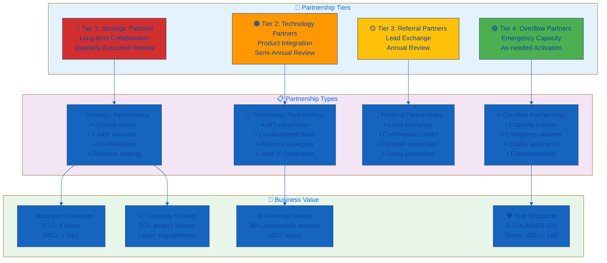
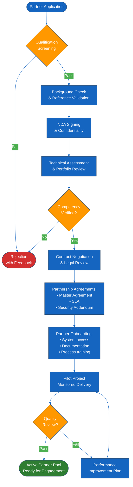
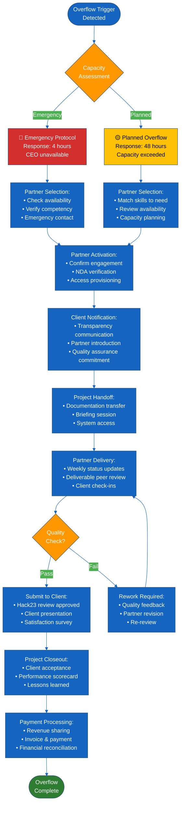

<p align="center">
  
</p>

<h1 align="center">🤝 Hack23 AB — Strategic Partnership Framework</h1>

<p align="center">
  <strong>🛡️ Building Resilient Capacity Through Trusted Collaboration</strong><br>
  <em>🎯 Converting Single-Person Risk Into Scalable Partnership Excellence</em>
</p>

<p align="center">
  <a href="#"></a>
  <a href="#"></a>
  <a href="#"></a>
  <a href="#"></a>
</p>

**📋 Document Owner:** CEO | **📄 Version:** 1.3 | **📅 Last Updated:** 2026-05-10 (UTC)  
**🔄 Review Cycle:** Annual | **⏰ Next Review:** 2027-05-10

---

## 🎯 **Purpose Statement**

**At Hack23 AB, our Strategic Partnership Framework transforms single-person dependency risk into scalable collaborative excellence.** Our systematic partnership approach serves dual purposes: enabling business continuity through trusted capacity sharing while demonstrating to clients our professional approach to risk mitigation through verifiable partnerships.

Every partner qualification documented in this framework, every service level agreement negotiated, and every capacity overflow successfully managed showcases our cybersecurity consulting methodology in practice. Our transparency in partnership management creates unprecedented collaborative visibility that differentiates us in the cybersecurity consulting market.

This evidence-based approach demonstrates that comprehensive partnership risk management enables rather than constrains business innovation and growth, transforming what is typically hidden single-person vulnerability into visible competitive advantage through documented collaborative excellence. By transparently addressing our [🎯 SWOT Weakness: Single-Person Dependency](./SWOT.md) (Risk Score: 480 - Critical), we show clients how strategic thinking strengthens business resilience.

*— James Pether Sörling, CEO/Founder*

---

## 🔍 **Purpose & Scope**

### Purpose
This framework establishes the systematic approach for identifying, qualifying, onboarding, managing, and monitoring strategic partnerships to:
- Mitigate **R-FOUNDER-001** (Single-Person Dependency) identified in [📉 Risk Register](./Risk_Register.md)
- Enable capacity scaling beyond current single-person operational limits
- Ensure business continuity during founder unavailability (vacation, illness, other commitments)
- Support larger project acquisition beyond 40 hours/week individual capacity
- Maintain quality standards and client satisfaction through trusted partner network

### Scope
This framework applies to:
- **Strategic Partners**: Long-term collaboration for ongoing capacity sharing and joint ventures
- **Technology Partners**: Product integration and co-developed solutions
- **Referral Partners**: Lead exchange and commission-based business development
- **Overflow Partners**: Emergency capacity support for client project delivery

This framework integrates with:
- [🤝 Third Party Management Policy](./Third_Party_Management.md) - Supplier governance and assessment procedures
- [🔄 Business Continuity Plan](./Business_Continuity_Plan.md) - Business resilience and continuity strategies
- [📉 Risk Register](./Risk_Register.md) - Risk R-FOUNDER-001 treatment plan
- [🎯 SWOT Analysis](./SWOT.md) - Strategic action: "Develop Strategic Partnership Program" (Q3 2026)

### Framework Compliance
- **ISO 27001:2022** - A.5.19 (Information security in supplier relationships), A.5.20 (Addressing information security within supplier agreements)
- **NIST CSF 2.0** - GV.SC-01 (Cybersecurity supply chain risk management processes are identified), GV.SC-03 (Contracts with suppliers include security requirements)
- **CIS Controls v8.1** - Control 15 (Service Provider Management)

---

## 🌟 **Partnership Philosophy & Values Alignment**

**Hack23 AB prioritizes partnerships with organizations that share our commitment to transparency, open source excellence, and security innovation.** Our partnership selection philosophy emphasizes:

### 🔓 **Open Source & Transparency Preference**

We strongly prefer partnerships with:
- **Open source companies** in cybersecurity/infosec demonstrating transparent development practices
- Organizations with **high standards for security transparency** and public accountability
- Contributors to **open security standards and frameworks** (OWASP, OpenSSF, CNCF Security TAG, CIS)
- Companies aligned with **"security through transparency"** principles vs. security through obscurity

### 🤝 **Cultural Values Alignment**

Essential partnership values:
- **Radical Transparency**: Openly documenting security practices and methodologies
- **Community Contribution**: Active participation in open source security communities
- **Continuous Improvement**: Commitment to evolving security practices based on evidence
- **Client-First Mindset**: Prioritizing client outcomes over vendor interests
- **Ethical Practices**: High ethical standards in security consulting and service delivery

### 🎯 **Strategic Preference Matrix**

| Partner Type | Open Source Alignment | Transparency Standards | Community Contribution | Priority |
|--------------|----------------------|------------------------|------------------------|----------|
| **Open Source Security Companies** | Required | Required | Required | 🔴 Highest |
| **Transparent SaaS/Cloud Security** | Preferred | Required | Preferred | 🟠 High |
| **Traditional Security Vendors** | Optional | Preferred | Optional | 🟡 Medium |
| **Management Consultancies** | Optional | Preferred | Optional | 🟢 Standard |

**Why Open Source Partners?**
- **Aligned Values**: Shared commitment to transparency and community-driven innovation
- **Quality Assurance**: Public code review and security validation
- **Trust Building**: Clients benefit from independently verifiable security practices
- **Market Differentiation**: Combined offering demonstrates authentic security excellence
- **Long-term Sustainability**: Open standards prevent vendor lock-in

---

## 🏗️ **Partnership Types & Strategic Tiers**

Our partnership model follows a tiered approach aligned with [🏷️ Classification Framework](./CLASSIFICATION.md) business impact analysis:



### 🔴 Tier 1: Strategic Partners

**Definition:** Trusted cybersecurity professionals for long-term collaboration, capacity sharing, and joint client delivery.

**Strategic Objectives:**
- Mitigate single-person dependency risk (R-FOUNDER-001)
- Enable project delivery beyond 40 hours/week individual capacity
- Support vacation/illness business continuity (RTO: 4 hours)
- Deliver larger enterprise engagements (€50K+ projects)

**Commitment Level:**
- **Availability**: Minimum 10 hours/week on-call capacity
- **Response Time**: 4-hour availability commitment for overflow situations
- **Relationship Duration**: 2+ year partnership agreement
- **Revenue Sharing**: 60% partner / 40% Hack23 for partner-delivered work
- **Review Frequency**: Quarterly performance reviews

**Success Metrics:**
- 2-3 active strategic partners by Q4 2026
- 30% of 2027 revenue from partnership delivery
- R-FOUNDER-001 risk score reduction: 480 → 180
- Zero client escalations due to capacity constraints

**Preferred Partner Profile:**
- **Open source security consultants** with public GitHub profiles and community contributions
- Cybersecurity professionals with transparent methodology documentation
- Partners demonstrating "security through transparency" in their own practices
- Consultants aligned with ethical, client-first service delivery

### 🟠 Tier 2: Technology Partners

**Definition:** Software vendors, platform providers, and technology companies for product integration and co-developed solutions.

**Strategic Objectives:**
- Integrate [📊 CIA Compliance Manager](https://github.com/Hack23/cia-compliance-manager) with partner platforms
- Leverage [🇪🇺 European Parliament MCP Server](https://github.com/Hack23/European-Parliament-MCP-Server) for AI-powered parliamentary analysis partnerships
- Provide [🗳️ Riksdagsmonitor](https://github.com/Hack23/riksdagsmonitor) data integration for Nordic political transparency partners
- Co-develop security automation tools and frameworks
- Joint go-to-market for combined offerings
- Share technical expertise and platform capabilities

**Commitment Level:**
- **Integration Scope**: API integration, data exchange, or platform embedding
- **Technical Support**: Joint technical support for integrated offerings
- **Relationship Duration**: 1-3 year technology partnership agreement
- **Revenue Model**: Revenue share or referral fees (15-25%)
- **Review Frequency**: Semi-annual technical and business reviews

**Examples:**
- AWS Advanced Technology Partner (APN)
- **Open source security companies** (preferred: OpenSSF, CNCF security projects, OSS vulnerability management)
- Security tool vendors (SIEM, SOAR, vulnerability management)
- Compliance platform providers (GRC, audit management)

**Preferred Partner Profile:**
- **Open source companies** in cybersecurity/infosec with transparent development practices
- Organizations with high standards for security transparency and public accountability
- Companies contributing to open security standards and frameworks (OWASP, OpenSSF, CIS)
- Technology partners aligned with "security through transparency" principles

### 🟡 Tier 3: Referral Partners

**Definition:** Complementary service providers, consultancies, and professional networks for lead exchange and business development.

**Strategic Objectives:**
- Expand customer acquisition beyond direct sales (reduce CAC)
- Access enterprise client networks through trusted introductions
- Create mutually beneficial lead exchange relationships
- Build professional network across Nordic cybersecurity community

**Commitment Level:**
- **Lead Sharing**: Active referral of qualified opportunities
- **Relationship Duration**: Ongoing, no fixed term
- **Commission Model**: 10-15% of first-year contract value
- **Review Frequency**: Annual relationship review

**Examples:**
- Management consulting firms (McKinsey, Deloitte, Accenture)
- Legal firms specializing in data protection and cybersecurity
- IT infrastructure and managed service providers
- Business associations and professional networks

### 🟢 Tier 4: Overflow Partners

**Definition:** Pre-vetted cybersecurity consultants available for emergency capacity support and specialized skill requirements.

**Strategic Objectives:**
- Maintain registered pool of qualified consultants for ad-hoc needs
- Ensure business continuity during peak demand or founder unavailability
- Access specialized skills outside core competencies (e.g., OT security, industrial control systems)
- Rapid response capability for urgent client requests

**Commitment Level:**
- **Availability**: No ongoing commitment, on-demand basis
- **Response Time**: 48-hour response to partnership activation
- **Relationship Duration**: Pre-qualification valid 12 months
- **Payment Model**: Hourly/daily rate based on scope (70% partner / 30% Hack23 markup)
- **Review Frequency**: Annual re-qualification

**Activation Triggers:**
- Client project exceeding 40 hours/week capacity
- Founder vacation or unavailability (>3 days)
- Specialized technical skill requirement
- Multiple simultaneous client requests

---

## 🤝 **Partner Qualification Criteria**

All partners must meet minimum qualification standards to ensure quality, security, and cultural alignment. The qualification process follows [🤝 Third Party Management Policy](./Third_Party_Management.md) assessment procedures.

### 📊 Qualification Criteria Matrix

| Criteria | Minimum Requirement | Assessment Method | Weight | Tier 1 | Tier 2 | Tier 3 | Tier 4 |
|----------|---------------------|-------------------|--------|--------|--------|--------|--------|
| **🔐 Security Certifications** | CISSP, CISM, ISO 27001 LA, or equivalent | Certificate verification + registry check | High | ✅ Required | ⚠️ Preferred | ⚠️ Preferred | ✅ Required |
| **📚 Years of Experience** | 5+ years cybersecurity or related field | CV review, references, LinkedIn verification | High | ✅ 7+ years | ⚠️ 5+ years | ⚠️ 3+ years | ✅ 5+ years |
| **🛡️ ISO 27001 Knowledge** | Lead Auditor or Practitioner certification | Certification check, practical assessment | Medium | ✅ LA or equiv | ⚠️ Practitioner | ➖ Not required | ⚠️ Practitioner |
| **☁️ Cloud Security Skills** | AWS/Azure/GCP security implementation | Technical interview, project portfolio | High | ✅ AWS preferred | ✅ Multi-cloud | ➖ Not required | ⚠️ AWS familiar |
| **🎯 ISMS Implementation** | Demonstrated ISMS project delivery | Case studies, client references | High | ✅ 3+ projects | ⚠️ 1+ project | ➖ Not required | ⚠️ 1+ project |
| **🤝 Cultural Alignment** | Transparency, open source values, client-first mindset, security through transparency principles | Values assessment, behavioral interview, open source contribution review | Medium | ✅ Required | ✅ Required | ⚠️ Preferred | ✅ Required |
| **🔓 Open Source Contributions** | Active participation in open source security projects (GitHub, OWASP, OpenSSF) | GitHub profile review, contribution history, community reputation | Medium | ⚠️ Strongly preferred | ⚠️ Strongly preferred | ➖ Not required | ➖ Optional |
| **⏱️ Availability Commitment** | Minimum weekly capacity commitment | Capacity declaration, availability tracking | High | ✅ 10+ hrs/wk | ⚠️ 5+ hrs/wk | ➖ Ad-hoc | ⚠️ On-demand |
| **🗣️ Language Skills** | English fluent + Swedish proficient | Language test, client interaction simulation | Medium | ✅ Both required | ⚠️ English req | ⚠️ English req | ✅ Both required |
| **🌍 Geographic Location** | EU-based for GDPR compliance | Location verification, business registration | Low | ⚠️ Nordic pref | ⚠️ EU preferred | ➖ Global OK | ⚠️ Nordic pref |
| **💼 Professional Insurance** | Professional liability €1M+ coverage | Insurance certificate verification | Medium | ✅ €2M+ | ✅ €1M+ | ➖ Not required | ✅ €1M+ |
| **🚫 Conflict of Interest** | No competing consulting clients | Disclosure form, client list review | High | ✅ Mandatory | ✅ Mandatory | ⚠️ Disclosure | ✅ Mandatory |
| **🏢 Business Stability** | 2+ years in business or employment | Company records, financial statements | Medium | ✅ 3+ years | ⚠️ 2+ years | ➖ Not required | ⚠️ 2+ years |
| **📊 Technical Writing** | Technical documentation capability | Writing sample, documentation review | Medium | ✅ Required | ⚠️ Preferred | ➖ Not required | ⚠️ Preferred |
| **🔒 Security Clearance** | Background check passed | Criminal record check, reference validation | High | ✅ Required | ✅ Required | ⚠️ Preferred | ✅ Required |
| **💻 Tool Proficiency** | Familiar with Hack23 technology stack | Technical assessment, hands-on exercise | Medium | ✅ AWS, Java | ⚠️ Cloud native | ➖ Not required | ⚠️ Adaptable |

**Legend:**
- ✅ **Required** - Must meet criteria for partnership consideration
- ⚠️ **Preferred** - Evaluated positively but not mandatory
- ➖ **Not Required** - Not evaluated for this partnership tier

### 🎯 Qualification Scoring System

**Tier 1 Strategic Partners:**
- **Minimum Score**: 85/100 points
- **Critical Criteria**: Security certifications, experience, availability, cultural alignment
- **Disqualifiers**: Conflict of interest, failed background check, <5 years experience

**Tier 2 Technology Partners:**
- **Minimum Score**: 75/100 points
- **Critical Criteria**: Technical competency, product integration capability, business stability
- **Disqualifiers**: Conflict of interest, failed security assessment

**Tier 3 Referral Partners:**
- **Minimum Score**: 60/100 points
- **Critical Criteria**: Network strength, cultural alignment, business ethics
- **Disqualifiers**: Reputation issues, ethical violations

**Tier 4 Overflow Partners:**
- **Minimum Score**: 80/100 points
- **Critical Criteria**: Security certifications, experience, availability, responsiveness
- **Disqualifiers**: Conflict of interest, failed background check, unavailability

---

## 📋 **Partner Onboarding Process**

Systematic onboarding ensures quality, compliance, and readiness before partner activation. The process integrates with [🤝 Third Party Management Policy](./Third_Party_Management.md) supplier onboarding procedures.



### ✅ Partner Onboarding Checklist

**Phase 1: Pre-Qualification (Week 1-2)**
- [ ] Partner application received with required documentation
- [ ] Initial screening against qualification criteria matrix
- [ ] Preliminary fit assessment (15-minute discovery call)
- [ ] Conflict of interest disclosure reviewed and approved
- [ ] Professional references contacted (minimum 3 references)

**Phase 2: Due Diligence (Week 3-4)**
- [ ] Background check initiated (criminal records, credit, professional history)
- [ ] Security certifications verified through issuing bodies
- [ ] Professional insurance coverage confirmed (€1M+ liability)
- [ ] Business registration and legal entity verification
- [ ] Non-Disclosure Agreement (NDA) executed

**Phase 3: Technical Assessment (Week 5-6)**
- [ ] Technical skills evaluation (written assessment or practical exercise)
- [ ] Portfolio review and case study presentation
- [ ] Cultural fit interview with CEO/technical lead
- [ ] Language proficiency assessment (English + Swedish)
- [ ] Tool proficiency demonstration (AWS, security tools, documentation)

**Phase 4: Contract Negotiation (Week 7-8)**
- [ ] Master Partnership Agreement negotiated and executed
- [ ] Service Level Agreement (SLA) defined and signed
- [ ] Security and confidentiality addendum completed
- [ ] Revenue sharing or commission model agreed
- [ ] Intellectual property ownership terms clarified

**Phase 5: Partner Onboarding (Week 9-10)**
- [ ] Hack23 ISMS documentation access granted (ISMS-PUBLIC repository)
- [ ] Security policies and procedures training completed
- [ ] Client communication guidelines reviewed
- [ ] Quality assurance standards walkthrough
- [ ] Project handoff protocol training
- [ ] **Founder Knowledge Transfer document reviewed** (Business Continuity)
  - [ ] Partner has read and understands [Founder_Knowledge_Transfer_Template.md](./templates/Founder_Knowledge_Transfer_Template.md)
  - [ ] Partner can identify top 3 business priorities and strategic context
  - [ ] Partner knows location of emergency access procedures (1Password Emergency Kit)
  - [ ] Partner can execute First 24 Hours checklist from Section 8
  - [ ] Partner understands client communication protocols during emergency handoff
  - [ ] Partner familiar with critical system access procedures (AWS, GitHub, Email)

**Phase 6: Pilot Project (Week 11-14)**
- [ ] Small pilot project assigned (€5K-€10K engagement)
- [ ] Quality assurance monitoring during delivery
- [ ] Client satisfaction measured post-delivery
- [ ] Performance scorecard completed
- [ ] Final approval for active partner pool

**Phase 7: Active Partner Status (Week 15+)**
- [ ] Partner added to active directory with specializations
- [ ] Emergency contact information documented
- [ ] Availability calendar established
- [ ] Quarterly review schedule set
- [ ] Partner welcome package sent and CEO-led client-introduction call scheduled (no separate client-facing team — the CEO is the sole client-facing role, supported by the business-development and marketing specialist agents for collateral)

### 📊 Onboarding Success Metrics

| Metric | Target | Measurement Method |
|--------|--------|-------------------|
| **Onboarding Completion Time** | ≤ 14 weeks from application to active status | Process tracking |
| **Background Check Pass Rate** | 90%+ of candidates pass initial screening | Screening results |
| **Technical Assessment Pass Rate** | 75%+ of screened candidates pass assessment | Assessment scores |
| **Pilot Project Success Rate** | 85%+ of pilot projects meet quality standards | Client satisfaction + QA |
| **Time to First Billable Project** | ≤ 4 weeks after active status | Project assignment tracking |

---

## 📄 **Partnership Agreement Templates**

All partnerships require formal agreements aligned with [🤝 Third Party Management Policy](./Third_Party_Management.md) supplier contract requirements and [🔐 Information Security Policy](./Information_Security_Policy.md) third-party security standards.

### 📜 Template 1: Master Partnership Agreement (MPA)

**Purpose:** Legal framework for long-term partnership relationship, rights, obligations, and governance.

**Key Sections:**

1. **Parties and Definitions**
   - Legal entities, roles, and relationship structure
   - Definitions of key terms (Partner, Client, Services, Deliverables)

2. **Scope of Collaboration**
   - Partnership tier designation (Tier 1-4)
   - Services covered under agreement
   - Geographic scope and market territories
   - Exclusivity or non-exclusivity terms

3. **Responsibilities and Obligations**
   - Hack23 obligations (client introductions, ISMS access, support)
   - Partner obligations (service delivery, quality standards, availability)
   - Joint obligations (client satisfaction, regulatory compliance)

4. **Confidentiality and Data Protection**
   - Non-disclosure of proprietary information
   - GDPR compliance requirements per [🔒 Privacy Policy](./Privacy_Policy.md)
   - Client data handling procedures
   - Security incident notification (24-hour requirement)

5. **Intellectual Property Ownership**
   - Pre-existing IP remains with original owner
   - Joint IP created during collaboration (50/50 ownership default)
   - Client IP ownership (client retains all rights to deliverables)
   - ISMS templates and methodologies (Hack23 retains ownership, license to partner)

6. **Revenue and Cost Sharing Model**
   - **Tier 1 Strategic**: 60% partner / 40% Hack23 for partner-delivered work
   - **Tier 2 Technology**: Revenue share or 15-25% referral fee based on arrangement
   - **Tier 3 Referral**: 10-15% of first-year contract value
   - **Tier 4 Overflow**: 70% partner / 30% Hack23 markup on hourly/daily rates
   - Payment terms (Net 30 days from client payment receipt)
   - Expense reimbursement policy (pre-approved only)

7. **Liability and Indemnification**
   - Professional liability insurance requirements (€1M+ coverage)
   - Limitation of liability (capped at contract value)
   - Indemnification for partner negligence or misconduct
   - Client claims handling procedures

8. **Term and Termination**
   - **Tier 1**: 2-year initial term, auto-renewal unless terminated
   - **Tier 2**: 1-3 year term based on technology roadmap
   - **Tier 3**: Ongoing, terminable with 30-day notice
   - **Tier 4**: 12-month pre-qualification, renewable annually
   - Termination for cause (breach, insolvency, quality issues)
   - Transition procedures upon termination (client handoff, deliverables, data return)

9. **Dispute Resolution**
   - Good faith negotiation (30 days)
   - Mediation (if negotiation fails)
   - Arbitration under Swedish arbitration rules (if mediation fails)
   - Governing law: Swedish law

10. **General Provisions**
    - Amendment procedures (written agreement required)
    - Assignment restrictions (no assignment without consent)
    - Force majeure provisions
    - Entire agreement clause

**Template Location:** `templates/Master_Partnership_Agreement_Template.md`

### 📊 Template 2: Service Level Agreement (SLA)

**Purpose:** Define quality standards, performance metrics, and accountability for partner-delivered services.

**Key Sections:**

1. **Service Scope Definition**
   - Services covered under SLA
   - Excluded services (out of scope)
   - Service hours and availability commitments

2. **Performance Metrics and Targets**

| Metric | Target | Measurement | Reporting |
|--------|--------|-------------|-----------|
| **Availability** | 95% during agreed service hours | Availability tracking | Weekly |
| **Response Time** | Tier 1: 4 hours, Tier 4: 48 hours | Support ticket system | Monthly |
| **Client Satisfaction** | 4.0/5.0 average rating | Post-project surveys | Quarterly |
| **Deliverable Quality** | 90% accepted without revisions | Quality review results | Per project |
| **On-Time Delivery** | 85% of milestones met | Project tracking | Monthly |
| **Security Compliance** | 100% adherence to security policies | Audit results | Quarterly |

3. **Quality Assurance Procedures**
   - Peer review for all deliverables (Hack23 technical review)
   - Client satisfaction surveys (mandatory for projects >€10K)
   - Adherence to [🛠️ Secure Development Policy](./Secure_Development_Policy.md) standards
   - Documentation completeness checks

4. **Escalation Procedures**
   - **Level 1**: Partner technical lead (within 4 hours)
   - **Level 2**: Hack23 CEO review (within 24 hours)
   - **Level 3**: Joint partner/Hack23 executive meeting (within 72 hours)
   - Client communication protocol during escalation

5. **Performance Review Process**
   - **Tier 1**: Quarterly business review (QBR)
   - **Tier 2**: Semi-annual technical and business review
   - **Tier 3**: Annual relationship review
   - **Tier 4**: Annual re-qualification assessment
   - Performance scorecard review and improvement planning

6. **Service Credits and Remediation**
   - SLA breach: 5% service credit per occurrence
   - Persistent quality issues: Performance improvement plan (30 days)
   - Failure to improve: Partnership suspension or termination

**Template Location:** `templates/Service_Level_Agreement_Template.md`

### 🔒 Template 3: Non-Disclosure Agreement (NDA)

**Purpose:** Protect confidential information exchanged during partnership discussions, onboarding, and collaboration.

**Key Sections:**

1. **Definitions**
   - Confidential Information scope (business data, client information, methodologies, ISMS details)
   - Exclusions (publicly available, independently developed, legally disclosed)

2. **Obligations**
   - Non-disclosure of confidential information to third parties
   - Use restrictions (only for partnership purposes)
   - Protection standards (same care as own confidential information, minimum reasonable care)

3. **Permitted Disclosures**
   - Employees/contractors with need-to-know (subject to confidentiality obligations)
   - Legal or regulatory requirements (with advance notice if possible)

4. **Data Protection Compliance**
   - GDPR compliance per [🔒 Privacy Policy](./Privacy_Policy.md)
   - Client personal data handling restrictions
   - Data retention and destruction requirements

5. **Security Requirements**
   - Encryption for data at rest and in transit (AES-256, TLS 1.3)
   - Access controls (multi-factor authentication required)
   - Security incident notification (24-hour requirement per [🚨 Incident Response Plan](./Incident_Response_Plan.md))

6. **Term and Survival**
   - Effective immediately upon signing
   - Obligations survive agreement termination (3 years post-termination)
   - Return or destruction of confidential materials upon termination

7. **Remedies**
   - Acknowledgment that breach causes irreparable harm
   - Injunctive relief available
   - Damages for breach

**Template Location:** `templates/Non_Disclosure_Agreement_Template.md`

---

## 🔄 **Capacity Sharing Procedures**

Systematic procedures ensure seamless client service delivery when engaging partners for capacity support or specialized skills.

### 📊 Overflow Trigger Conditions

Partnership capacity activation occurs when any of the following conditions are met:

| Trigger Condition | Threshold | Response Time | Priority |
|-------------------|-----------|---------------|----------|
| **🔴 Founder Unavailability** | Vacation, illness, or absence >3 days | 4 hours (emergency contact) | Critical |
| **🟠 Project Capacity Exceeded** | Client engagement requiring >40 hrs/week | 48 hours (planned overflow) | High |
| **🟡 Multiple Simultaneous Clients** | 3+ active client projects concurrently | 1 week (capacity planning) | Medium |
| **🟢 Specialized Skill Requirement** | Technical skill outside core competency | 2 weeks (partner identification) | Standard |
| **⚡ Emergency Client Request** | Urgent need with <1 week deadline | 24 hours (emergency activation) | Critical |

### 🔄 Project Handoff Protocol

**Phase 1: Partner Selection (Day 1-2)**
1. Assess project requirements (scope, skills, timeline, budget)
2. Review active partner directory for best fit match
3. Check partner availability and current capacity
4. Confirm partner interest and capacity commitment
5. Notify client of partner engagement (transparency commitment)

**Phase 2: Knowledge Transfer (Day 3-5)**
1. Provide partner with project documentation:
   - Client background and business context
   - Project scope, objectives, and success criteria
   - Deliverables, milestones, and timeline
   - Client contacts and communication preferences
   - Relevant ISMS policies and security requirements
2. Conduct partner briefing session (60-90 minutes)
3. Grant partner access to necessary systems/documentation
4. Introduce partner to client (joint call, Hack23-led)

**Phase 3: Monitored Delivery (Project Duration)**
1. Partner executes project under Hack23 oversight
2. Weekly status updates to Hack23 CEO (minimum)
3. Peer review of deliverables before client submission
4. Client satisfaction check-ins (bi-weekly minimum)
5. Quality assurance monitoring per SLA

**Phase 4: Project Closeout (Final Week)**
1. Final deliverable review and approval
2. Client acceptance and satisfaction survey
3. Partner performance scorecard completion
4. Lessons learned documentation
5. Invoice processing and payment

### 🤝 Client Communication Guidelines

**Transparency Commitment:**
- Always disclose partner engagement to clients upfront
- Position as "extended team" and "trusted collaborator"
- Emphasize Hack23 quality oversight and accountability
- Provide partner credentials and background

**Communication Ownership:**
- Hack23 remains primary client contact and relationship owner
- Partner communicates through Hack23 (cc: CEO on all client emails)
- Client escalations directed to Hack23 first
- Hack23 participates in major client meetings and reviews

**Quality Control:**
- All partner deliverables reviewed by Hack23 before client submission
- Client-facing documentation uses Hack23 branding and templates
- Partner identified in project team roster but Hack23-led presentation

### 💰 Revenue Sharing Model

**Tier 1 Strategic Partners (Capacity Sharing):**
- **Partner Share**: 60% of client billable amount
- **Hack23 Share**: 40% (covers overhead, QA, client relationship management)
- **Example**: €100K project → Partner €60K, Hack23 €40K
- **Payment Terms**: Net 30 days from client payment receipt

**Tier 2 Technology Partners (Product Integration):**
- **Revenue Share**: 15-25% of joint solution sales (negotiated)
- **OR Referral Fee**: Flat percentage per [🤝 Third Party Management](./Third_Party_Management.md)
- **Example**: €50K joint sale → Partner €10K (20%), Hack23 €40K

**Tier 3 Referral Partners (Lead Exchange):**
- **Referral Fee**: 10-15% of first-year contract value
- **Payment**: Upon contract signature and initial payment receipt
- **Example**: €100K annual contract → €10K-€15K referral fee

**Tier 4 Overflow Partners (Emergency Capacity):**
- **Partner Rate**: Agreed hourly/daily rate (e.g., €150/hour)
- **Client Rate**: Partner rate + 30% Hack23 markup (e.g., €195/hour)
- **Example**: 40 hours delivered → Partner €6K, Hack23 €1.8K markup

### 🔒 Security and Quality Requirements

All partners must adhere to:
- [🔐 Information Security Policy](./Information_Security_Policy.md) requirements
- [🛠️ Secure Development Policy](./Secure_Development_Policy.md) standards (for technical delivery)
- [🔒 Privacy Policy](./Privacy_Policy.md) and GDPR compliance
- [🔑 Access Control Policy](./Access_Control_Policy.md) for system access
- [🚨 Incident Response Plan](./Incident_Response_Plan.md) notification requirements (24 hours)

**Quality Assurance Checkpoints:**
1. **Pre-Delivery Review**: Hack23 technical review of all deliverables (100% coverage)
2. **Client Acceptance**: Formal client sign-off required (per project milestones)
3. **Satisfaction Survey**: Post-project client satisfaction measurement (target: 4.0/5.0)
4. **Performance Scorecard**: Quarterly assessment against SLA metrics

---

## ⚡ **Overflow Management Workflow**

Detailed workflow for activating overflow partners during capacity constraints or emergency situations.



### 🚨 Emergency Overflow Protocol (RTO: 4 hours)

**Activation Scenarios:**
- Founder illness or incapacitation
- Family emergency requiring immediate absence
- Unexpected client escalation requiring urgent response
- Critical system failure during founder unavailability

**Response Steps:**
1. **Hour 1**: Emergency contact notification (Tier 1 strategic partner)
   - CEO family member or designated emergency contact initiates
   - Pre-defined emergency contact list (3 partners, priority order)
   - Phone call + SMS + email notification

2. **Hour 2-3**: Partner assessment and activation
   - Partner reviews situation and client urgency
   - Confirms capacity availability (minimum 10 hours immediate)
   - Accesses emergency documentation (Hack23 ISMS repository)
   - Contacts client for direct engagement authorization

3. **Hour 4**: Client notification and service continuity
   - Partner introduces self to client (pre-authorized)
   - Establishes communication channel and expectations
   - Begins urgent work to maintain service continuity
   - Provides status update to emergency contact

**Quality Safeguards:**
- Partner pre-authorized for emergency client contact (signed emergency protocol)
- Client informed of emergency procedures during onboarding
- Post-incident review within 7 days of founder return
- Client satisfaction check mandatory post-emergency

### 🚨 Emergency Activation Runbook

**Operational Procedures:** For detailed step-by-step emergency activation procedures executable by non-technical emergency contacts:

📋 **[Partnership Emergency Activation Runbook](./templates/Partnership_Emergency_Activation_Runbook.md)**

**Key Features:**
- **5-Phase Activation Process**: Detection → Partner Contact → Access Handoff → Client Notification → Continuity Verification
- **4-Hour RTO Timeline**: Complete activation procedures within target recovery time objective
- **Decision Tree Diagrams**: Visual flowcharts for situation assessment and partner selection
- **Communication Templates**: Pre-written client notification and partner contact scripts
- **Testing Materials**: Semi-annual tabletop exercise scenarios and training checklists

**Emergency Contact Training:**
- Annual training for designated emergency contacts (family members, insurance provider)
- Semi-annual tabletop exercises validating activation procedures
- Emergency contact quick reference card (printed wallet card)

**Partner Directory Reference:**
- Partner contact information: `partners/Partner_Directory.md` (to be created)
- Backup contact list: 1Password Emergency Kit
- Tier 1-4 partner escalation matrix

**Testing Requirement:**
- **Frequency**: Semi-annual emergency activation drill (tabletop exercise)
- **Participants**: Founder, Primary Strategic Partner, Emergency Contact, Insurance Provider
- **Success Criteria**: Complete activation procedures within 4-hour RTO
- **Documentation**: Exercise results logged in Risk_Register.md R-FOUNDER-001 monitoring

---

## 📊 **Partner Performance Review Process**

Systematic quarterly reviews ensure partner quality, alignment, and continuous improvement.

### 📈 Partner Performance Scorecard

**Review Frequency:**
- **Tier 1**: Quarterly Business Review (QBR)
- **Tier 2**: Semi-Annual Review
- **Tier 3**: Annual Review
- **Tier 4**: Annual Re-Qualification

**Performance Dimensions:**

| Dimension | Weight | Measurement Method | Target | Tier 1 | Tier 2 | Tier 3 | Tier 4 |
|-----------|--------|-------------------|--------|--------|--------|--------|--------|
| **🎯 Deliverable Quality** | 25% | Peer review scores, client acceptance rate | 90% accepted without major revisions | ✅ | ✅ | ➖ | ✅ |
| **⏱️ On-Time Delivery** | 20% | Milestone tracking, deadline adherence | 85% of milestones on-time | ✅ | ✅ | ➖ | ✅ |
| **🤝 Client Satisfaction** | 25% | Post-project surveys (1-5 scale) | 4.0/5.0 average rating | ✅ | ✅ | ✅ | ✅ |
| **🔒 Security Compliance** | 15% | Security audit results, incident count | 100% policy adherence, 0 incidents | ✅ | ✅ | ⚠️ | ✅ |
| **📢 Communication Quality** | 10% | Response time, clarity, proactiveness | 4-hour response, clear updates | ✅ | ⚠️ | ⚠️ | ✅ |
| **💰 Commercial Performance** | 5% | Revenue generated, profitability | Meets revenue targets | ✅ | ✅ | ✅ | ⚠️ |

**Scoring System:**
- **Excellent** (90-100%): Exceeds expectations, eligible for increased engagement
- **Good** (75-89%): Meets expectations, maintain current partnership level
- **Acceptable** (60-74%): Performance improvement plan initiated
- **Unsatisfactory** (<60%): Partnership review, possible suspension/termination

### 🔄 Quarterly Business Review (QBR) Agenda

**Tier 1 Strategic Partners - 90-minute session**

1. **Performance Review** (30 minutes)
   - Scorecard results and trend analysis
   - Client feedback summary
   - Deliverable quality metrics
   - Revenue and project volume

2. **Strategic Alignment** (20 minutes)
   - Business development opportunities
   - Market trends and client needs
   - Partnership expansion possibilities
   - New service offerings collaboration

3. **Operational Improvements** (20 minutes)
   - Process optimization opportunities
   - Communication and handoff effectiveness
   - Tool and technology enhancements
   - Training and development needs

4. **Action Items and Planning** (20 minutes)
   - Q1 learnings and adjustments
   - Next quarter priorities and commitments
   - Resource planning and availability
   - Contract or SLA amendments if needed

### 📋 Performance Improvement Plan (PIP)

**Triggered When:**
- Performance scorecard <75% for single quarter
- Client satisfaction <3.5/5.0 average
- Security policy violation or incident
- Persistent quality issues (3+ rework cycles)

**PIP Process:**
1. **Week 1**: Issue identification and root cause analysis
2. **Week 2**: Improvement plan development (joint partner/Hack23)
3. **Week 3-6**: Implementation and monitoring (weekly check-ins)
4. **Week 7**: Progress assessment and scorecard re-evaluation
5. **Week 8**: Final review - continue, extend PIP, or terminate partnership

**Improvement Support:**
- Hack23 provides additional training resources
- Increased oversight and mentoring during PIP period
- Reduced project complexity during improvement phase
- Access to Hack23 quality assurance processes

---

## 📂 **Partner Directory Structure**

Centralized partner information management for efficient capacity planning and partner selection.

### 📊 Partner Directory Schema

**File Location:** `partners/Partner_Directory.md` (confidential, internal use only)

**Partner Record Template:**

```markdown
## Partner ID: P-[YYYY]-[###]

### 📋 Basic Information
- **Partner Name**: [Full legal name]
- **Partnership Tier**: [Tier 1/2/3/4]
- **Status**: [Active / Inactive / Suspended]
- **Partnership Start Date**: YYYY-MM-DD
- **Last Review Date**: YYYY-MM-DD
- **Next Review Date**: YYYY-MM-DD

### 👤 Contact Information
- **Primary Contact**: [Name, Title]
- **Email**: [primary@email.com]
- **Phone**: [+46 XXX XXX XXX]
- **Emergency Contact**: [Name, Phone]
- **Address**: [Business address]
- **Website**: [https://partner-website.com]

### 🎯 Specializations & Skills
- **Primary Expertise**: [ISO 27001, Cloud Security, NIS2, etc.]
- **Industry Experience**: [Finance, Healthcare, Public Sector, etc.]
- **Technical Skills**: [AWS, Azure, Security tools, etc.]
- **Languages**: [Swedish, English, etc.]
- **Certifications**: [CISSP, ISO 27001 LA, AWS SAA, etc.]

### 📊 Availability & Capacity
- **Weekly Availability**: [X hours/week]
- **Geographic Coverage**: [Nordic, EU, Global]
- **Time Zone**: [CET/CEST]
- **Blackout Periods**: [Vacation, other commitments]
- **Response Time Commitment**: [4 hours, 48 hours, etc.]

### 💼 Commercial Terms
- **Revenue Sharing**: [60/40, referral %, etc.]
- **Hourly/Daily Rate**: [€XXX/hour or €XXX/day]
- **Payment Terms**: [Net 30 days]
- **Currency**: [EUR, SEK]

### 📈 Performance Metrics
- **Overall Score**: [XX/100]
- **Client Satisfaction**: [X.X/5.0]
- **Projects Delivered**: [Count]
- **Total Revenue Generated**: [€XXX,XXX]
- **Last Scorecard Date**: YYYY-MM-DD

### 📄 Documentation
- **Master Agreement**: [Document link/reference]
- **NDA**: [Document link/reference]
- **SLA**: [Document link/reference]
- **Insurance Certificate**: [Document link/reference]
- **Background Check**: [Completed YYYY-MM-DD]

### 🔒 Security & Compliance
- **Background Check Status**: [Passed/Failed]
- **Security Clearance**: [Level]
- **Last Security Audit**: YYYY-MM-DD
- **Security Incidents**: [Count: 0]
- **GDPR Training**: [Completed YYYY-MM-DD]

### 📝 Notes
[Additional context, history, preferences, lessons learned]
```

### 🔍 Partner Selection Quick Reference

**By Skill Requirement:**
- **ISO 27001 ISMS Implementation**: P-2026-001, P-2026-003
- **Cloud Security (AWS)**: P-2026-001, P-2026-005
- **NIS2 Compliance Assessment**: P-2026-002, P-2026-004
- **GDPR Data Protection**: P-2026-003, P-2026-006
- **Secure Development (DevSecOps)**: P-2026-005
- **Incident Response**: P-2026-001, P-2026-002

**By Availability (Hours/Week):**
- **High Availability (20+ hrs/wk)**: P-2026-001, P-2026-003
- **Medium Availability (10-20 hrs/wk)**: P-2026-002, P-2026-004
- **On-Demand**: P-2026-005, P-2026-006

**By Geographic Coverage:**
- **Nordic (Sweden, Norway, Denmark, Finland)**: All partners
- **EU-wide**: P-2026-001, P-2026-003, P-2026-005
- **Remote (Global)**: P-2026-005

---

## ⚠️ **Risk Assessment for Partner Dependencies**

While partnerships mitigate single-person dependency (R-FOUNDER-001), they introduce new risks requiring proactive management.

### 📊 Partnership Risk Register

| Risk ID | Risk Description | Likelihood | Impact | Risk Score | Mitigation Strategy | Owner |
|---------|-----------------|------------|--------|------------|-------------------|-------|
| **R-PARTNER-001** | Partner quality inconsistency damages client relationships | Medium | High | 300 | Mandatory peer review, client satisfaction tracking, PIP process | CEO |
| **R-PARTNER-002** | Partner confidentiality breach exposes client data | Low | Critical | 240 | NDA enforcement, security audits, incident response plan | CEO |
| **R-PARTNER-003** | Partner unavailability during critical client need | Medium | Medium | 225 | Multi-partner pool (3+ active), availability tracking, SLA enforcement | CEO |
| **R-PARTNER-004** | Partner IP claims on Hack23 methodologies | Low | High | 200 | Clear IP ownership in MPA, ISMS licensing terms, legal review | CEO |
| **R-PARTNER-005** | Dependency on single strategic partner | Medium | Medium | 225 | Diversify partner portfolio (2-3 active Tier 1), cross-training | CEO |
| **R-PARTNER-006** | Partner cost structure reduces profitability | Medium | Medium | 225 | Regular commercial reviews, efficiency optimization, pricing strategy | CEO |
| **R-PARTNER-007** | Partner conflict of interest with clients | Low | High | 200 | Conflict disclosure requirements, client list review, non-compete | CEO |
| **R-PARTNER-008** | Cultural misalignment impacts client experience | Medium | Medium | 225 | Values assessment in onboarding, client feedback loops, coaching | CEO |

### 🛡️ Risk Mitigation Controls

**R-PARTNER-001: Quality Inconsistency**
- **Preventive Controls**:
  - Rigorous onboarding and qualification process (14-week minimum)
  - Mandatory pilot project before full activation
  - Comprehensive partner training on Hack23 standards
- **Detective Controls**:
  - 100% peer review of partner deliverables
  - Client satisfaction surveys (4.0/5.0 minimum target)
  - Quarterly performance scorecard review
- **Corrective Controls**:
  - Performance Improvement Plan (PIP) for scores <75%
  - Partnership suspension for persistent quality issues
  - Client remediation at Hack23 expense if quality failure

**R-PARTNER-002: Confidentiality Breach**
- **Preventive Controls**:
  - NDA execution before any confidential information sharing
  - Security training and GDPR compliance requirements
  - Access controls and least-privilege principle
- **Detective Controls**:
  - Annual security audits of partner practices
  - Incident monitoring and logging
  - Client data access tracking
- **Corrective Controls**:
  - 24-hour breach notification requirement per [🚨 Incident Response Plan](./Incident_Response_Plan.md)
  - Immediate partnership suspension upon breach
  - Legal action and damages recovery

**R-PARTNER-003: Partner Unavailability**
- **Preventive Controls**:
  - Multi-partner portfolio strategy (3+ active Tier 1 partners)
  - Availability commitment in SLA (minimum hours/week)
  - Blackout period notification requirements (30-day advance)
- **Detective Controls**:
  - Availability calendar tracking
  - Response time monitoring (4-hour commitment)
  - Utilization rate analysis
- **Corrective Controls**:
  - Secondary partner activation within 24 hours
  - SLA credits for availability breaches
  - Partnership review for persistent unavailability

**R-PARTNER-005: Single Partner Dependency**
- **Preventive Controls**:
  - Target: 2-3 active Tier 1 strategic partners minimum
  - Diversification across specializations and geographies
  - No single partner >40% of partnership revenue
- **Detective Controls**:
  - Quarterly concentration risk analysis
  - Partnership revenue distribution monitoring
  - Dependency metric tracking
- **Corrective Controls**:
  - Active recruitment if concentration >40%
  - Cross-training partners on each other's specializations
  - Client redistribution if single-partner risk emerges

### 📊 Risk Monitoring Metrics

> **Note:** Partnership program in development phase. Metrics below reflect pre-partnership baseline state (Q1 2026). Values will be updated as partnerships are established.

| Metric | Target | Current | Trend | Review Frequency |
|--------|--------|---------|-------|------------------|
| **Active Partner Count (Tier 1)** | 2-3 partners | 0 | 🔴 Pre-launch | Quarterly |
| **Partner Concentration (% revenue)** | <40% per partner | N/A (0 partners) | ➖ N/A | Quarterly |
| **Average Partner Performance Score** | >85/100 | N/A (0 partners) | ➖ N/A | Quarterly |
| **Client Satisfaction (Partner Projects)** | >4.0/5.0 | N/A (0 partner projects) | ➖ N/A | Monthly |
| **Partnership Security Incidents** | 0 incidents | 0 | ✅ Green | Monthly |
| **Partner Availability Breaches** | <5% of requests | N/A (0 partners) | ➖ N/A | Monthly |
| **R-FOUNDER-001 Residual Risk Score** | <200 (down from 480) | 480 | 🔴 High | Quarterly |

**Risk Score Impact:**
- **Current State**: R-FOUNDER-001 = 480 (Likelihood: High × Impact: Critical = 480)
- **Target State** (2-3 active partnerships): R-FOUNDER-001 = 180 (Likelihood: Medium × Impact: Medium-High)
- **Risk Reduction**: 62.5% reduction in single-person dependency risk

---

## 📋 **Implementation Roadmap**

Forward-looking partnership program implementation aligned with [🎯 SWOT Analysis](./SWOT.md) strategic action timeline.

### 🟢 Current State

The Partnership Framework, agreement templates (MPA, SLA, NDA in `/templates/`), partner directory schema, and AI-augmented candidate-identification pipeline are all operational. Partnership operations are integrated into the broader [AI-augmented single-CEO operating model](./Information_Security_Strategy.md). The CEO is the sole signatory; due diligence, contract drafting, and partner-evidence collection are agent-assisted (business-development-specialist, compliance-reviewer, security-documentation-specialist) under CEO sign-off.

### 🚀 Active Phase: Pilot Partnerships

**Objective:** Onboard 1–2 strategic partners and validate that the AI-augmented single-CEO operating model materially reduces partnership coordination overhead.

| Activity | Owner | Deliverable |
|----------|-------|-------------|
| Complete first partner onboarding | CEO + Agents | Partner P-2026-001 active with full onboarding evidence |
| Execute pilot project with first partner | CEO + Agents | Pilot delivered, QA passed, retrospective documented |
| Initiate second partner qualification | CEO + Agents | Partner P-2026-002 in screening |
| Conduct first agent-prepared QBR | CEO + Agents | Performance scorecard auto-generated, CEO-validated |
| Onboard second strategic partner | CEO + Agents | Partner P-2026-002 active |

**Success Criteria:**
- 1–2 strategic partners (Tier 1) fully onboarded
- 1+ pilot project successfully delivered with measurable client satisfaction
- Demonstrated agent contribution to partnership lifecycle (target: ≥40% time reduction on due-diligence and QBR prep)

### ⏭️ Next Phase: Scale and Optimize

**Objective:** Expand partner portfolio to 2–3 active partners and achieve risk-reduction targets, while keeping operational footprint within the AI-augmented single-CEO model.

| Activity | Owner | Deliverable |
|----------|-------|-------------|
| Achieve 2–3 active Tier 1 partners | CEO + Agents | 2–3 partners in active status |
| Diversify into Tier 2 (Technology) | CEO + Agents | 1 technology partner active |
| Establish Tier 3 (Referral) network | CEO + Agents | 3–5 referral partners active |
| Build Tier 4 overflow pool | CEO + Agents | 5–7 pre-qualified overflow partners |
| Reach partnership revenue threshold | CEO | Partnership-sourced revenue ≥30% of total |

**Success Criteria:**
- 2–3 active Tier 1 strategic partners
- Partnership revenue: ≥30% of total
- R-FOUNDER-001 risk score reduced toward target (current trajectory captured in [Risk_Register.md](./Risk_Register.md))
- Client satisfaction ≥4.0/5.0 average on partner projects
- Annual decision point: continue agent-augmented operations vs. hire (revisited per [Information_Security_Strategy.md](./Information_Security_Strategy.md))

### 📊 Implementation Metrics

| Metric | Active Phase Target | Scale Phase Target | Measurement Method |
|--------|--------------------|--------------------|--------------------|
| **Active Partnerships** | 1 Tier 1 in onboarding → 2 Tier 1 active | 3 Tier 1 + 2 Tier 2 active | Partner directory count |
| **Partnership Revenue (% of total)** | 10–20% | 25–30% | Financial reporting |
| **Partner-Delivered Projects** | 1 pilot → 3–5 projects | 8–12 projects | Project tracking |
| **R-FOUNDER-001 Risk Score** | 240 | 180 | Risk register assessment |
| **Client Satisfaction (Partners)** | ≥4.0/5.0 | ≥4.2/5.0 | Post-project surveys |
| **Emergency Coverage** | 80% | 95% | Availability tracking |
| **Agent-assisted partnership ops time-saved** | ≥50% across lifecycle | ≥60% across lifecycle | Time-tracking comparison |

---

## 📚 **Related Documents**

### 🎯 Strategic & Governance
- [🎯 Information Security Strategy](./Information_Security_Strategy.md) - AI-first operations, Pentagon framework, and strategic partnership direction
- [🔐 Information Security Policy](./Information_Security_Policy.md) - Overarching security governance framework with AI-First Operations Governance
- [🤖 AI Policy](./AI_Policy.md) - AI-assisted partner assessment and collaboration automation

### 🔐 Security Policies & Controls
- [🛠️ Secure Development Policy](./Secure_Development_Policy.md) - Security architecture and testing requirements for technical partners
- [🔒 Privacy Policy](./Privacy_Policy.md) - GDPR compliance and data protection standards
- [🔑 Access Control Policy](./Access_Control_Policy.md) - Identity and access management requirements
- [🌐 Network Security Policy](./Network_Security_Policy.md) - Network protection and zero-trust architecture

### 📋 Business Continuity & Risk
- [🔄 Business Continuity Plan](./Business_Continuity_Plan.md) - Business resilience and recovery strategies
- [📉 Risk Register](./Risk_Register.md) - R-FOUNDER-001 (Single-Person Dependency) treatment plan
- [📊 Risk Assessment Methodology](./Risk_Assessment_Methodology.md) - Risk calculation and prioritization framework
- [🚨 Incident Response Plan](./Incident_Response_Plan.md) - Security incident management and notification

### 🤝 Supplier & Partner Management
- [🤝 Third Party Management Policy](./Third_Party_Management.md) - Supplier governance, assessment, and monitoring
- [🔗 SUPPLIER.md](./SUPPLIER.md) - Active supplier relationships and strategic assessments
- [💻 Asset Register](./Asset_Register.md) - IT assets and third-party service integrations
- [🤝 External Stakeholder Registry](./External_Stakeholder_Registry.md) - Authority and partner relationships

### 🎯 Strategic Planning
- [🎯 SWOT Analysis](./SWOT.md) - Strategic action: "Develop Strategic Partnership Program" (Q3 2026)
- [📈 Business Strategy](./Hack23AB/Business_Strategy.md) - Multi-line business strategy and portfolio architecture
- [📣 Marketing Strategy](./Hack23AB/Marketing_Strategy.md) - Market positioning and customer segmentation
- [📊 Security Metrics](./Security_Metrics.md) - Security KPIs and measurement framework

### 📏 Standards & Compliance
- [🏷️ Classification Framework](./CLASSIFICATION.md) - CIA triad and business impact analysis methodology
- [✅ Compliance Checklist](./Compliance_Checklist.md) - ISO 27001, NIST CSF, CIS Controls, GDPR, NIS2 mapping
- [🔐 Information Security Strategy](./Information_Security_Strategy.md) - Security excellence and transparency principles
- [🌐 ISMS Transparency Plan](./ISMS_Transparency_Plan.md) - Public disclosure and transparency strategy

---

**📋 Document Control:**  
**✅ Approved by:** James Pether Sörling, CEO  
**📤 Distribution:** All Personnel, Strategic Partners, Key Stakeholders  
**🏷️ Classification:** [](./CLASSIFICATION.md#confidentiality-levels)  
**📅 Effective Date:** 2026-05-10  
**⏰ Next Review:** 2027-05-10  
**🎯 Framework Compliance:** [](./CLASSIFICATION.md) [](./CLASSIFICATION.md) [](./CLASSIFICATION.md) [](./CLASSIFICATION.md)