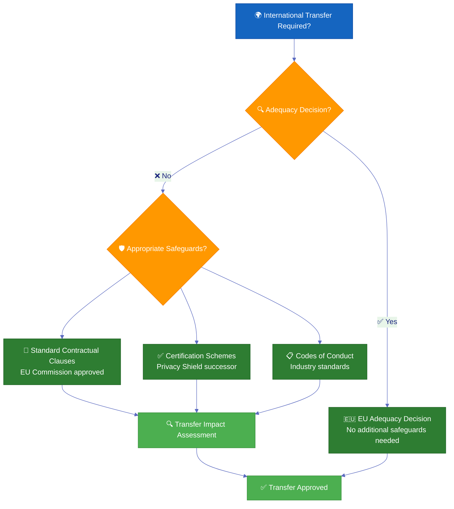
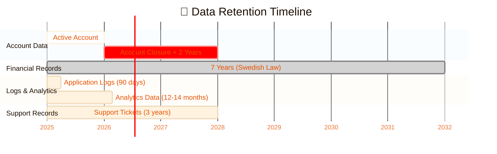
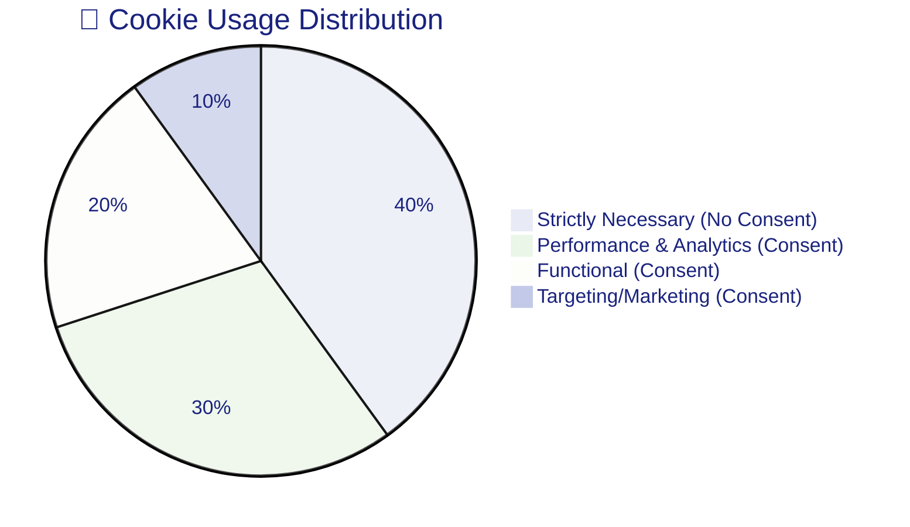
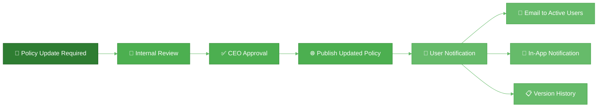

<p align="center">
  
</p>

<h1 align="center">🔐 Hack23 AB — Privacy Policy</h1>

<p align="center">
  <strong>🛡️ Privacy Through Transparency and GDPR Compliance</strong><br>
  <em>🎯 User-Centric Privacy for Gaming and Transparency Platforms</em>
</p>

<p align="center">
  <a href="#"></a>
  <a href="#"></a>
  <a href="#"></a>
  <a href="#"></a>
</p>

**📋 Document Owner:** CEO | **📄 Version:** 1.0 | **📅 Last Updated:** 2025-11-05 (UTC)  
**🔄 Review Cycle:** Annual | **⏰ Next Review:** 2026-11-05

---

## 🎯 **Purpose Statement**

**Hack23 AB's** Privacy Policy demonstrates how **privacy-by-design principles directly enable both user trust and regulatory compliance.** Our comprehensive approach to personal data protection serves as both operational necessity and client demonstration of our cybersecurity consulting expertise.

This policy establishes transparent practices for collecting, using, protecting, and managing personal data across all Hack23 AB products and services, ensuring full compliance with GDPR, Swedish data protection laws, and industry best practices. Our commitment to privacy transparency showcases how methodical data protection creates **competitive advantage** through user trust and **operational excellence** via demonstrable compliance.

*— James Pether Sörling, CEO/Founder*

---

## 📋 **Table of Contents**

- [🏢 Data Controller Information](#-data-controller-information)
- [🎯 Scope & Application](#-scope--application)
- [📊 Data We Collect](#-data-we-collect)
- [🎯 Purpose & Legal Basis](#-purpose--legal-basis)
- [🔒 How We Protect Your Data](#-how-we-protect-your-data)
- [🤝 Data Sharing & Transfers](#-data-sharing--transfers)
- [⏱️ Data Retention](#%EF%B8%8F-data-retention)
- [✅ Your Rights Under GDPR](#-your-rights-under-gdpr)
- [🍪 Cookies & Tracking](#-cookies--tracking)
- [👶 Children's Privacy](#-childrens-privacy)
- [📢 Changes to This Policy](#-changes-to-this-policy)
- [📞 Contact Information](#-contact-information)

---

## 🏢 **Data Controller Information**

**Hack23 AB** is the data controller responsible for your personal data.

| Information | Details |
|-------------|---------|
| **Legal Name** | Hack23 AB |
| **Organization Number** | 559534-7807 |
| **Registered Address** | Carl Grimbergsgatan 25, 413 13 Göteborg, Sweden |
| **Data Protection Contact** | privacy@hack23.com |
| **CEO/Data Protection Officer** | James Pether Sörling |
| **Website** | https://www.hack23.com |

---

## 🎯 **Scope & Application**

This Privacy Policy applies to all products, services, and platforms operated by Hack23 AB:

### 🏛️ **Citizen Intelligence Agency (CIA)**
[](https://github.com/Hack23/cia)

Democratic transparency platform providing access to Swedish parliamentary data, politician activities, and political analysis.

**Data Scope:**
- User account information
- Activity tracking for personalized dashboards
- Analytics on platform usage
- Public political data (not personal data of users)

### 🎮 **Black Trigram**
[](https://github.com/Hack23/blacktrigram)

Educational gaming platform teaching Korean martial arts history and techniques.

**Data Scope:**
- Player profiles and progress
- Game statistics and achievements
- Device and session information
- In-app purchases (if applicable)

### 📊 **CIA Compliance Manager**
[](https://github.com/Hack23/cia-compliance-manager)

Security compliance and assessment tool for enterprise customers.

**Data Scope:**
- Organization and user accounts
- Security assessment data
- Compliance reports and metrics
- System configuration information

### 🤝 **Consulting Services**
Professional cybersecurity consulting and advisory services.

**Data Scope:**
- Client contact information
- Project and engagement data
- Communication records
- Consulting deliverables

---

## 📊 **Data We Collect**

We implement data minimization principles, collecting only data necessary for legitimate purposes. All data is classified per our [🏷️ Classification Framework](https://github.com/Hack23/ISMS-PUBLIC/blob/main/CLASSIFICATION.md#privacy-levels).

### 👤 **Personal Identifiers**
[](https://github.com/Hack23/ISMS-PUBLIC/blob/main/CLASSIFICATION.md#privacy-levels)

| Data Type | Purpose | Legal Basis | Retention |
|-----------|---------|-------------|-----------|
| **Name** | Account identification, communication | Contract / Legitimate Interest | Account lifetime + 2 years |
| **Email Address** | Authentication, notifications, support | Contract | Account lifetime + 2 years |
| **IP Address** | Security, fraud prevention, analytics | Legitimate Interest | 90 days (logs) |
| **Device ID** | Session management, security | Legitimate Interest | Session duration |

### 🎮 **Activity & Usage Data**
[](https://github.com/Hack23/ISMS-PUBLIC/blob/main/CLASSIFICATION.md#privacy-levels)

| Data Type | Purpose | Legal Basis | Retention |
|-----------|---------|-------------|-----------|
| **Application Events** | Feature usage analytics, UX improvement | Legitimate Interest | 12 months |
| **Session Information** | Performance monitoring, error tracking | Legitimate Interest | 90 days |
| **Game Progress** | Save game state, achievements | Contract | Account lifetime |
| **Preferences** | Personalization, settings | Contract | Account lifetime |

### 📊 **Analytics Data**
[](https://github.com/Hack23/ISMS-PUBLIC/blob/main/CLASSIFICATION.md#privacy-levels)

| Data Type | Purpose | Legal Basis | Retention |
|-----------|---------|-------------|-----------|
| **Page Views** | Traffic analysis, content optimization | Legitimate Interest | 14 months |
| **User Flow** | UX optimization, feature development | Legitimate Interest | 12 months |
| **Error Reports** | Bug fixing, stability improvement | Legitimate Interest | 6 months |
| **Performance Metrics** | System optimization | Legitimate Interest | 6 months |

### 🌐 **Technical & System Data**
[](https://github.com/Hack23/ISMS-PUBLIC/blob/main/CLASSIFICATION.md#privacy-levels)

| Data Type | Purpose | Legal Basis | Retention |
|-----------|---------|-------------|-----------|
| **Browser Type** | Compatibility testing | Legitimate Interest | 90 days |
| **Operating System** | Platform optimization | Legitimate Interest | 90 days |
| **Screen Resolution** | UI/UX design | Legitimate Interest | 90 days |
| **Time Zone** | Time localization | Legitimate Interest | Session duration |
| **Language Preference** | Localization | Contract | Account lifetime |

### 💳 **Financial Data** (If Applicable)
[](https://github.com/Hack23/ISMS-PUBLIC/blob/main/CLASSIFICATION.md#privacy-levels)

| Data Type | Purpose | Legal Basis | Retention |
|-----------|---------|-------------|-----------|
| **Payment Information** | Transaction processing | Contract | Via payment processor (Stripe) - not stored by Hack23 |
| **Transaction History** | Purchase records, support | Contract / Legal Obligation | 7 years (Swedish accounting law) |
| **Invoice Data** | Billing, accounting | Contract / Legal Obligation | 7 years (Swedish accounting law) |

### 📧 **Communication Data**
[](https://github.com/Hack23/ISMS-PUBLIC/blob/main/CLASSIFICATION.md#privacy-levels)

| Data Type | Purpose | Legal Basis | Retention |
|-----------|---------|-------------|-----------|
| **Support Tickets** | Customer support, issue resolution | Contract | 3 years |
| **Email Correspondence** | Communication records | Legitimate Interest | 3 years |
| **Feedback & Surveys** | Product improvement | Consent | Until purpose fulfilled or consent withdrawn |

---

## 🎯 **Purpose & Legal Basis**

We process personal data only for specified, explicit, and legitimate purposes under GDPR Article 6:

### 📋 **Processing Purposes Matrix**

```mermaid
%%{
  init: {
    'theme': 'base',
    'themeVariables': {
      'primaryColor': '#e3f2fd',
      'primaryTextColor': '#0d47a1',
      'lineColor': '#42a5f5',
      'secondaryColor': '#c8e6c9',
      'tertiaryColor': '#fff3e0'
    }
  }
}%%
flowchart TD
    PURPOSE[📊 Data Processing Purpose]
    
    PURPOSE --> CONTRACT[📝 Contract Performance]
    PURPOSE --> CONSENT[✅ User Consent]
    PURPOSE --> LEGAL[⚖️ Legal Obligation]
    PURPOSE --> LEGIT[🎯 Legitimate Interest]
    
    CONTRACT --> C1[Account Management]
    CONTRACT --> C2[Service Delivery]
    CONTRACT --> C3[Payment Processing]
    
    CONSENT --> CO1[Marketing Communications]
    CONSENT --> CO2[Optional Features]
    CONSENT --> CO3[Third-party Integrations]
    
    LEGAL --> L1[Tax & Accounting]
    LEGAL --> L2[Regulatory Compliance]
    LEGAL --> L3[Legal Claims]
    
    LEGIT --> LI1[Security & Fraud Prevention]
    LEGIT --> LI2[Analytics & Improvement]
    LEGIT --> LI3[System Operations]
    
    classDef purposeStyle fill:#1565C0,stroke:#0D47A1,color:#fff
    classDef basisStyle fill:#2E7D32,stroke:#1B5E20,color:#fff
    classDef itemStyle fill:#0288D1,stroke:#01579B,color:#fff
    
    class PURPOSE purposeStyle
    class CONTRACT,CONSENT,LEGAL,LEGIT basisStyle
    class C1,C2,C3,CO1,CO2,CO3,L1,L2,L3,LI1,LI2,LI3 itemStyle
```



### ⚖️ **Legal Basis Detailed**

| Legal Basis (GDPR Art. 6) | Processing Activities | Lawfulness Justification |
|--------------------------|----------------------|-------------------------|
| **6(1)(b) Contract Performance** | Account creation, service delivery, support, feature access | Necessary to provide services you've requested |
| **6(1)(a) Consent** | Marketing emails, optional analytics, third-party features | Explicit opt-in with easy withdrawal |
| **6(1)(c) Legal Obligation** | Tax records, compliance reporting, breach notifications | Swedish law, GDPR, financial regulations |
| **6(1)(f) Legitimate Interest** | Security monitoring, fraud prevention, system analytics, error logging | Balanced against user rights with safeguards |

---

## 🔒 **How We Protect Your Data**

We implement comprehensive technical and organizational measures aligned with our [🔒 Cryptography Policy](./Cryptography_Policy.md) and [🔐 Information Security Policy](./Information_Security_Policy.md).

### 🛡️ **Technical Security Measures**

```mermaid
%%{
  init: {
    'theme': 'base',
    'themeVariables': {
      'primaryColor': '#ffebee',
      'primaryTextColor': '#c62828',
      'lineColor': '#ef5350',
      'secondaryColor': '#e8f5e9',
      'tertiaryColor': '#e3f2fd'
    }
  }
}%%
flowchart LR
    subgraph DATA["📊 Data Protection Layers"]
        TRANSIT[🌐 Data in Transit<br/>TLS 1.3]
        REST[💾 Data at Rest<br/>AES-256]
        PROCESS[⚙️ Data in Processing<br/>Secure Memory]
    end
    
    subgraph ACCESS["🔑 Access Controls"]
        MFA[🔐 Multi-Factor Auth]
        RBAC[👥 Role-Based Access]
        AUDIT[📋 Audit Logging]
    end
    
    subgraph MONITORING["📊 Security Monitoring"]
        IDS[🚨 Intrusion Detection]
        SIEM[📈 Log Analysis]
        ALERT[⚠️ Real-time Alerts]
    end
    
    DATA --> ACCESS
    ACCESS --> MONITORING
    
    classDef dataStyle fill:#D32F2F,stroke:#B71C1C,color:#fff
    classDef accessStyle fill:#FF9800,stroke:#F57C00,color:#fff
    classDef monitorStyle fill:#2196F3,stroke:#1976D2,color:#fff
    
    class DATA dataStyle
    class ACCESS accessStyle
    class MONITORING monitorStyle
```



### 🔐 **Security Controls by Data Classification**

| Privacy Level | Encryption | Access Control | Monitoring | Backup |
|---------------|-----------|---------------|------------|--------|
| [](https://github.com/Hack23/ISMS-PUBLIC/blob/main/CLASSIFICATION.md#privacy-levels) | AES-256-GCM + AWS KMS | MFA required, break-glass only | Real-time alerting | Encrypted, immutable, tested monthly |
| [](https://github.com/Hack23/ISMS-PUBLIC/blob/main/CLASSIFICATION.md#privacy-levels) | AES-256 + TLS 1.3 | MFA for admin, RBAC | Audit all access | Encrypted, daily, tested quarterly |
| [](https://github.com/Hack23/ISMS-PUBLIC/blob/main/CLASSIFICATION.md#privacy-levels) | AES-256 + TLS 1.3 | RBAC, least privilege | Audit changes | Encrypted, daily |
| [](https://github.com/Hack23/ISMS-PUBLIC/blob/main/CLASSIFICATION.md#privacy-levels) | AES-256 + TLS 1.2+ | Standard RBAC | Sampled audit | Standard backup |
| [](https://github.com/Hack23/ISMS-PUBLIC/blob/main/CLASSIFICATION.md#privacy-levels) | TLS 1.2+ | Standard access | Aggregate monitoring | Standard backup |

### 🏢 **Organizational Security Measures**

- ✅ **Privacy by Design**: Privacy considerations in all system design
- ✅ **Data Minimization**: Collect only necessary data
- ✅ **Access Limitation**: Need-to-know principle enforced
- ✅ **Staff Training**: Regular privacy and security training
- ✅ **Vendor Management**: GDPR-compliant [🤝 Third Party Management](./Third_Party_Management.md)
- ✅ **Incident Response**: Documented [🚨 Incident Response Plan](./Incident_Response_Plan.md)
- ✅ **Regular Audits**: Internal and external security assessments
- ✅ **Continuous Improvement**: Ongoing security monitoring per [📊 Security Metrics](./Security_Metrics.md)

---

## 🤝 **Data Sharing & Transfers**

We do not sell personal data. We share data only when necessary for service delivery or legal compliance.

### 🌐 **Third-Party Service Providers**

All third parties are vetted per our [🤝 Third Party Management](./Third_Party_Management.md) policy and bound by GDPR-compliant data processing agreements (DPAs).

| Service Provider | Purpose | Data Shared | Location | Safeguards |
|-----------------|---------|-------------|----------|------------|
| **Amazon Web Services (AWS)** | Cloud hosting, infrastructure | Application data, logs, backups | EU (Stockholm, Ireland) | AWS GDPR DPA, ISO 27001, SOC 2 |
| **GitHub** | Code repository, CI/CD | Development data, logs | USA (adequate safeguards) | GitHub DPA, Privacy Shield successor |
| **Stripe** | Payment processing | Payment data, transaction records | EU & USA | PCI DSS, Stripe DPA, GDPR compliance |
| **SEB (Skandinaviska Enskilda Banken)** | Banking services | Financial records | Sweden | Swedish bank regulations, GDPR |
| **Bokio** | Accounting software | Invoice data, financial records | Sweden | GDPR-compliant, Swedish data protection |

### 🇪🇺 **International Data Transfers**

We prioritize EU/EEA data residency. When transfers outside EU/EEA are necessary:



**Transfer Safeguards:**
- 📝 Standard Contractual Clauses (SCCs) for non-adequate countries
- 🔍 Transfer Impact Assessments (TIAs) for all transfers
- 🛡️ Additional technical safeguards (encryption, access controls)
- 📊 Regular monitoring and compliance verification

---

## ⏱️ **Data Retention**

We retain personal data only as long as necessary for the purposes collected or as required by law.

### 📅 **Retention Schedule**



| Data Category | Active Retention | Post-Deletion | Legal Basis | Secure Deletion Method |
|--------------|------------------|---------------|-------------|----------------------|
| **Account Information** | Account lifetime | 2 years | Contract / Legitimate Interest | Cryptographic erasure |
| **Activity Logs** | 90 days | None | Legitimate Interest | Automated purge |
| **Analytics Data** | 12-14 months | None | Legitimate Interest | Automated anonymization |
| **Financial Records** | 7 years | None | Legal Obligation (Swedish Bokföringslagen) | Secure archival deletion |
| **Support Tickets** | 3 years | None | Legitimate Interest | Secure deletion |
| **Game Progress** | Account lifetime | None (deleted with account) | Contract | Full deletion |
| **Marketing Consent** | Until withdrawn | None | Consent | Immediate removal |

### 🗑️ **Data Deletion Process**

Per [🏷️ Data Classification Policy](./Data_Classification_Policy.md), we implement:

1. **Automated Retention Enforcement**: Scheduled deletion jobs
2. **Cryptographic Erasure**: Encryption key deletion for encrypted data
3. **Physical Deletion**: Secure wipe of storage media
4. **Backup Purge**: Deletion from all backup systems
5. **Audit Trail**: Documented deletion verification

---

## ✅ **Your Rights Under GDPR**

As a data subject under GDPR, you have comprehensive rights regarding your personal data.

### 👤 **Individual Rights Matrix**

| Right (GDPR Article) | Description | How to Exercise | Response Time |
|---------------------|-------------|-----------------|---------------|
| **🔍 Right to Access (Art. 15)** | Obtain confirmation of processing and a copy of your data | Email privacy@hack23.com or use in-app export | 30 days (max) |
| **✏️ Right to Rectification (Art. 16)** | Correct inaccurate or incomplete data | Update in account settings or contact support | 30 days (max) |
| **🗑️ Right to Erasure (Art. 17)** | Request deletion of your personal data | Account deletion or email privacy@hack23.com | 30 days (max) |
| **⏸️ Right to Restriction (Art. 18)** | Limit processing of your data | Email privacy@hack23.com with justification | 30 days (max) |
| **📤 Right to Data Portability (Art. 20)** | Receive your data in machine-readable format | Use in-app export (JSON/CSV) or email request | 30 days (max) |
| **❌ Right to Object (Art. 21)** | Object to processing based on legitimate interest | Email privacy@hack23.com or opt-out mechanisms | Immediate for marketing |
| **🤖 Rights re Automated Decision-Making (Art. 22)** | Not subject to solely automated decisions with legal effect | We do not perform automated profiling decisions | N/A |
| **📞 Right to Lodge Complaint** | Complain to supervisory authority | Contact Swedish IMY (see below) | N/A |

### 📧 **How to Exercise Your Rights**

**Primary Contact Method:**
```
Email: privacy@hack23.com
Subject: GDPR Data Subject Request - [Your Right]
```

**Include in Your Request:**
- Full name and email address associated with account
- Specific right you wish to exercise
- Any additional details to help us locate your data
- Proof of identity (if request involves sensitive data)

**Response Process:**
1. ✅ Acknowledgment within 3 business days
2. 🔍 Identity verification (if necessary)
3. 📋 Request processing
4. 📤 Response delivery within 30 days (extendable to 60 days for complex requests)

---

## 🍪 **Cookies & Tracking**

We use cookies and similar technologies to improve user experience, analyze usage, and ensure security.

### 📊 **Cookie Categories**



| Cookie Type | Purpose | Duration | Consent Required | Legal Basis |
|-------------|---------|----------|------------------|-------------|
| **🔐 Strictly Necessary** | Session management, security, authentication | Session / 1 year | ❌ No | Legitimate Interest (security) |
| **📊 Performance & Analytics** | Usage statistics, error tracking, performance monitoring | 12-14 months | ✅ Yes | Consent |
| **⚙️ Functional** | User preferences, language, customization | 12 months | ✅ Yes | Consent |
| **🎯 Targeting/Marketing** | Advertising, retargeting (if used) | Varies | ✅ Yes | Consent |

### 🍪 **Cookie List**

#### Strictly Necessary Cookies
- `session_id`: Session authentication (HttpOnly, Secure, SameSite=Strict)
- `csrf_token`: CSRF protection (HttpOnly, Secure, SameSite=Strict)
- `security_token`: Security validation (HttpOnly, Secure, SameSite=Lax)

#### Analytics Cookies (Opt-in)
- `_ga`: Google Analytics visitor ID (14 months)
- `_gid`: Google Analytics session ID (24 hours)
- `_gat`: Google Analytics throttling (1 minute)

#### Functional Cookies (Opt-in)
- `user_prefs`: User preferences (12 months)
- `lang`: Language preference (12 months)
- `theme`: UI theme selection (12 months)

### 🛠️ **Cookie Management**

**User Controls:**
- 🎛️ Cookie consent banner on first visit
- ⚙️ Cookie preferences in account settings
- 🗑️ Clear cookies via browser settings
- ❌ Opt-out anytime without impact on essential services

**Browser Controls:**
- Most browsers allow cookie blocking/deletion
- Private/Incognito mode prevents cookie storage
- Do Not Track (DNT) signal respected where possible

---

## 👶 **Children's Privacy**

We are committed to protecting children's privacy in accordance with GDPR and Swedish law.

### 🛡️ **Age Restrictions & Parental Consent**

| Product | Minimum Age | Parental Consent Required | Verification Method |
|---------|-------------|-------------------------|-------------------|
| **🏛️ CIA (Citizen Intelligence Agency)** | 13 years | No (educational, public data) | Age declaration |
| **🎮 Black Trigram** | 13 years | Required for ages 13-15 | Parent email verification |
| **📊 CIA Compliance Manager** | 18 years (B2B) | N/A | Organization verification |
| **🤝 Consulting Services** | 18 years (B2B) | N/A | Contract signatory |

### 👨‍👩‍👧 **Parental Rights**

Parents/guardians have enhanced rights for children under 16:
- 👀 **Access**: View all data collected about their child
- ✏️ **Rectification**: Correct any inaccurate information
- 🗑️ **Erasure**: Request deletion of child's account and data
- ⏸️ **Objection**: Object to any data processing
- 🚫 **Marketing Opt-Out**: Prevent marketing communications

**Contact for Parental Requests:**
```
Email: privacy@hack23.com
Subject: Parental Data Request - [Child's Name/Account]
```

### 🔒 **Additional Protections for Children**

- ✅ Enhanced data minimization
- ✅ No behavioral advertising to children
- ✅ No sale or sharing of children's data
- ✅ Limited data retention periods
- ✅ Age-appropriate privacy notices
- ✅ Regular privacy reviews for child-facing services

---

## 📢 **Changes to This Policy**

We may update this Privacy Policy to reflect changes in our practices, legal requirements, or service offerings.

### 🔄 **Notification Process**



**Notification Methods:**
- 📧 **Material Changes**: Email notification 30 days before effective date
- 🔔 **Minor Changes**: In-app notification banner
- 📋 **All Changes**: Documented in version history below
- 📅 **Effective Date**: Clearly stated at top of policy

**Your Options:**
- ✅ **Accept**: Continue using services under new policy
- ⏸️ **Object**: Contact us to discuss concerns
- 🗑️ **Opt-Out**: Close account before effective date if you disagree

### 📋 **Version History**

| Version | Date | Changes | Author |
|---------|------|---------|--------|
| 1.0 | 2025-11-05 | Initial Privacy Policy creation aligned with GDPR and ISMS framework | James Pether Sörling, CEO |

---

## 📞 **Contact Information**

### 🏢 **Data Protection Contact**

**Primary Contact:**
```
Email: privacy@hack23.com
Response Time: 3 business days
```

**Data Controller:**
```
Hack23 AB
Attn: James Pether Sörling, CEO/DPO
Carl Grimbergsgatan 25
413 13 Göteborg, Sweden

Phone: [Contact via email for callback]
```

### 🇸🇪 **Swedish Supervisory Authority**

If you are not satisfied with our response to your privacy concerns, you have the right to lodge a complaint with the Swedish Data Protection Authority:

**Integritetsskyddsmyndigheten (IMY)**
```
Website: https://www.imy.se
Email: imy@imy.se
Phone: +46 8 657 61 00

Postal Address:
Integritetsskyddsmyndigheten
Box 8114
104 20 Stockholm
Sweden
```

**Filing a Complaint:**
- 📝 Submit online via IMY website
- ✉️ Send written complaint by post
- 📞 Contact by phone for guidance
- ⏱️ IMY typically responds within 3 months

### 🇪🇺 **Other EU Supervisory Authorities**

If you reside in another EU/EEA country, you may also contact your local data protection authority:
- 🌐 Full list: https://edpb.europa.eu/about-edpb/about-edpb/members_en

---

## 📚 **Related Documents**

- [🏷️ Classification Framework](https://github.com/Hack23/ISMS-PUBLIC/blob/main/CLASSIFICATION.md#privacy-levels) — Privacy data classification levels
- [🏷️ Data Classification Policy](./Data_Classification_Policy.md) — Comprehensive data handling procedures
- [🔐 Information Security Policy](./Information_Security_Policy.md) — Overall security governance framework
- [🔒 Cryptography Policy](./Cryptography_Policy.md) — Encryption standards protecting personal data
- [🔑 Access Control Policy](./Access_Control_Policy.md) — Access management for personal data systems
- [🤝 Third Party Management](./Third_Party_Management.md) — Vendor GDPR compliance verification
- [🚨 Incident Response Plan](./Incident_Response_Plan.md) — Data breach notification procedures
- [✅ Compliance Checklist](./Compliance_Checklist.md) — ISO 27001 A.5.34 & GDPR compliance tracking
- [💻 Asset Register](./Asset_Register.md) — Systems processing personal data inventory
- [🛠️ Secure Development Policy](./Secure_Development_Policy.md) — Privacy by design requirements

---

**📋 Document Control:**  
**✅ Approved by:** James Pether Sörling, CEO  
**📤 Distribution:** Public  
**🏷️ Classification:** [](https://github.com/Hack23/ISMS-PUBLIC/blob/main/CLASSIFICATION.md#confidentiality-levels)  
**📅 Effective Date:** 2025-11-05  
**⏰ Next Review:** 2026-11-05  
**🎯 Framework Compliance:** [](https://github.com/Hack23/ISMS-PUBLIC/blob/main/CLASSIFICATION.md) [](https://gdpr.eu/) [](https://github.com/Hack23/ISMS-PUBLIC/blob/main/CLASSIFICATION.md)
