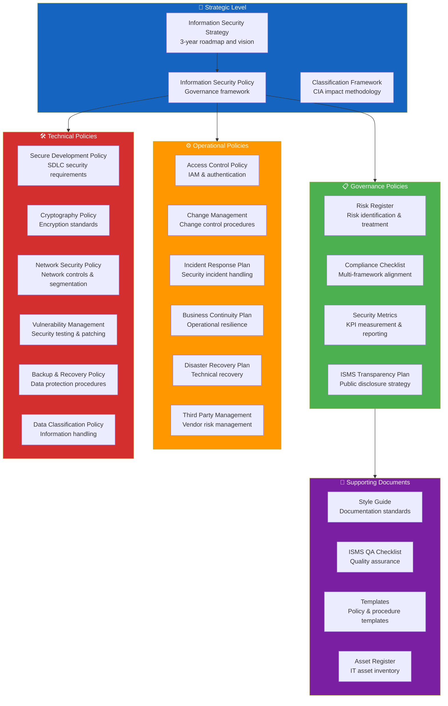

<!-- Logo och header -->

  

<h1 align="center">🔐 Hack23 AB — Information Security Management System</h1>

  <strong>Security Excellence Through Transparency</strong> 
  <em>Enterprise-grade ISMS for Innovation-driven Security Consulting</em>

  
  
  
  

**Document Owner:** CEO | **Version:** 3.0 | **Last Updated:** 2025-11-25 (UTC)  
**🔄 Review Cycle:** Quarterly | **⏰ Next Review:** 2026-02-25

---

## 🎯 **Executive Statement**

**Welcome to Hack23 AB's comprehensive ISMS documentation.** Founded in **June 2025** (Organization Number: 559534-7807), Hack23 AB operates as a Swedish cybersecurity consulting company demonstrating radical transparency through our industry-first public ISMS.

**🏆 Phase 1 Foundation Excellence — Complete (November 2025):**
- ✅ 100% ISMS documentation published (70% public, 30% sensitive values redacted)
- ✅ OpenSSF Scorecard 8.7 average (CIA, CIA Compliance Manager, Black Trigram)
- ✅ CII Best Practices Gold/Passing level achieved across all repositories
- ✅ Zero critical vulnerabilities outstanding (Dependabot monitoring)
- ✅ 95% compliance control coverage (ISO 27001, NIST CSF 2.0, CIS Controls v8.1)

**🏢 Single-Person Company:** Hack23 AB is operated by CEO/Founder James Pether Sörling. Our ISMS demonstrates that enterprise-grade security is achievable through innovative compensating controls: temporal separation, automation, external validation, and audit trail preservation.

**🌐 Radical Transparency:** We publish 70% of our ISMS openly to demonstrate security through robust processes rather than obscurity. Only specific sensitive values (credentials, account numbers, contract pricing) are redacted.

**Note:** The hack23.com website was registered in 2008 by the CEO, operating as an independent professional before formally establishing Hack23 AB in June 2025.

As CEO with CISM/CISSP certifications and three decades of experience, I've structured Hack23 AB around a fundamental principle: **our Information Security Management System (ISMS) is not separate from our business - it IS our business model.** This integration allows us to deliver security consulting services while simultaneously developing products that demonstrate these principles in action.

Our commitment to transparency extends beyond our open-source projects. This ISMS documentation itself serves as a testament to our belief that security through obscurity is a failed strategy. True security comes from robust processes, continuous improvement, and a culture where every decision considers security implications.

*— James Pether Sörling, CEO/Founder*

---

## 🚀 **Quick Start**

**New to our ISMS?** Start with these foundational documents:

### 🔐 Core Security Policies
- [Information Security Policy](./Information_Security_Policy.md) — Overarching security governance
- [Information Security Strategy](./Information_Security_Strategy.md) — Strategic security roadmap
- [Classification Framework](./CLASSIFICATION.md) — CIA impact analysis methodology

### 📊 Risk & Compliance
- [Risk Register](./Risk_Register.md) — Identified risks and treatments
- [Compliance Checklist](./Compliance_Checklist.md) — Framework alignment validation
- [Security Metrics](./Security_Metrics.md) — Performance measurement

### 🛡️ Operational Security
- [Incident Response Plan](./Incident_Response_Plan.md) — Security incident procedures
- [Business Continuity Plan](./Business_Continuity_Plan.md) — Operational resilience
- [Disaster Recovery Plan](./Disaster_Recovery_Plan.md) — Recovery procedures

### 🏗️ Product Security
- [CIA Security Architecture](https://github.com/Hack23/cia/blob/master/SECURITY_ARCHITECTURE.md) — Enterprise authentication
- [CIA Compliance Manager Security Architecture](https://github.com/Hack23/cia-compliance-manager/blob/main/docs/architecture/SECURITY_ARCHITECTURE.md) — Frontend-only rationale
- [Black Trigram Security Architecture](https://github.com/Hack23/blacktrigram/blob/main/SECURITY_ARCHITECTURE.md) — Gaming platform security

### 📖 Documentation Standards
- [Style Guide](./STYLE_GUIDE.md) — Formatting and consistency standards
- [ISMS Transparency Plan](./ISMS_Transparency_Plan.md) — Radical transparency methodology

---

## 🎖️ **Security & Compliance Posture**

**Security Certifications:**

**Compliance Frameworks (100% Coverage):**

---

## 🚀 **CI/CD Status**

All ISMS documentation is continuously validated against:
- ✅ Markdown linting standards
- 🔗 Link integrity checks
- 📋 Document structure requirements
- 🔒 Security and sensitive data scanning
- 🎨 STYLE_GUIDE.md v2.1 compliance (with documented exemptions for 12 legacy files)

---

## 🏢 **About Hack23 AB**

Hack23 AB is a Swedish innovation hub founded in 2025, specializing in creating immersive and precise game experiences alongside expert cybersecurity consulting. With a commitment to realism and authenticity, our flagship project, Black Trigram, combines traditional Korean martial arts with educational gameplay, while our information security services leverage advanced open-source tools and methodologies to protect digital integrity, confidentiality, and availability. At Hack23 AB, we're driven by a passion for precision, creativity, and uncompromising security.

---

## 📊 **Visual Guides & Diagrams**

Hack23 ISMS includes comprehensive Mermaid diagrams for improved understanding and navigation:

- **📊 ISMS Document Hierarchy:** [See below](#-isms-document-hierarchy) — Policy organization and navigation structure
- **🎖️ ISO 27001 Compliance Mapping:** [Compliance_Checklist.md](./Compliance_Checklist.md#%EF%B8%8F-iso-270012022-compliance-mapping) — Annex A control coverage
- **🏗️ Product Security Architecture:** [Information_Security_Strategy.md](./Information_Security_Strategy.md#%EF%B8%8F-product-security-architecture-comparison) — Security control comparison across products
- **📉 Risk Management Workflow:** [Risk_Register.md](./Risk_Register.md#-risk-management-workflow) — Risk lifecycle process
- **🚨 Incident Response Flowchart:** [Incident_Response_Plan.md](./Incident_Response_Plan.md#-incident-response-flowchart) — Incident handling process with escalation paths
- **🔐 Segregation of Duties Workflow:** [Segregation_of_Duties_Policy.md](./Segregation_of_Duties_Policy.md) — Single-person compensating controls
- **🎯 Security Control Selection Framework:** [Information_Security_Strategy.md](./Information_Security_Strategy.md) — Classification-driven control decisions

---

## 📊 **ISMS Document Hierarchy**

Hack23 AB's ISMS follows a structured hierarchy from strategic vision to operational templates, demonstrating enterprise-grade governance and systematic security management.

**Key Takeaways:**
- **🎯 Strategic Level:** Defines overarching security vision, governance framework, and impact classification methodology
- **📋 Governance:** Establishes risk management, compliance tracking, metrics, and transparency commitments
- **⚙️ Operational:** Implements day-to-day security operations including access control, incident response, and business continuity
- **🛠️ Technical:** Specifies technical security controls for development, cryptography, network, vulnerability, and data protection
- **📖 Support:** Provides quality assurance, documentation standards, templates, and asset tracking

**Related Documents:**
- [🔐 Information Security Policy](./Information_Security_Policy.md) — Master governance policy
- [🏷️ Classification Framework](https://github.com/Hack23/ISMS-PUBLIC/blob/main/CLASSIFICATION.md) — Business impact definitions
- [📐 Style Guide](./STYLE_GUIDE.md) — Documentation and diagram standards

---

## 📊 **ISMS Health Dashboard**

**📈 [View Live ISMS Metrics Dashboard](./ISMS_METRICS_DASHBOARD.md)** - Real-time policy health monitoring with automated review tracking

Our ISMS Metrics Dashboard provides instant visibility into:
- **🚦 Review Status:** Overdue, due soon, and current policy reviews
- **📅 Upcoming Reviews:** Next 90 days calendar view
- **📋 Document Health Matrix:** Complete status of all 40 ISMS documents
- **📊 Compliance Coverage:** ISO 27001, NIST CSF, CIS Controls alignment
- **🔄 Automated Updates:** Weekly refresh via GitHub Actions

---

## 📋 **ISMS Documentation Status**

**Last Updated:** 2025-11-25 | **Completion:** 100% (40/40 policies)

| Policy Document | Status | Version | Last Updated | Single-Person Adapted | ISO 27001 | NIST CSF 2.0 | CIS v8.1 |
|-----------------|--------|---------|--------------|----------------------|-----------|--------------|----------|
| [🔐 Information Security Policy](./Information_Security_Policy.md) | ✅ Complete | 1.6 | 2025-11-19 | ✅ Yes | ✅ A.5.1 | ✅ GV | ✅ IG1 |
| [🎯 Information Security Strategy](./Information_Security_Strategy.md) | ✅ Complete | 3.0 | 2025-11-10 | N/A (Strategy) | ✅ All | ✅ All | ✅ All |
| [🔑 Access Control Policy](./Access_Control_Policy.md) | ✅ Complete | 2.5 | 2025-11-24 | ✅ Yes | ✅ A.5.15-18 | ✅ PR.AC | ✅ IG1 |
| [✅ Acceptable Use Policy](./Acceptable_Use_Policy.md) | ✅ Complete | 1.0 | 2025-11-05 | ✅ Yes | ✅ A.6.2 | ✅ PR.AT | ✅ IG1 |
| [🤖 AI Governance Policy](./AI_Policy.md) | ✅ Complete | 1.1 | 2025-11-17 | N/A | ✅ A.5.1 | ✅ GV.RR | ✅ IG2 |
| [💻 Asset Register](./Asset_Register.md) | ✅ Complete | 1.4 | 2025-11-05 | ✅ Yes | ✅ A.5.9 | ✅ ID.AM | ✅ IG1 |
| [💾 Backup & Recovery Policy](./Backup_Recovery_Policy.md) | ✅ Complete | 1.1 | 2025-11-17 | N/A | ✅ A.8.13 | ✅ PR.IP | ✅ IG1 |
| [🔄 Business Continuity Plan](./Business_Continuity_Plan.md) | ✅ Complete | 1.2 | 2025-11-24 | ✅ Yes | ✅ A.5.29-30 | ✅ RC.RP | ✅ IG2 |
| [🏷️ Classification Framework](./CLASSIFICATION.md) | ✅ Complete | 1.2 | 2025-11-05 | N/A | ✅ A.5.12 | ✅ ID.AM | ✅ IG1 |
| [🛡️ CRA Conformity Assessment](./CRA_Conformity_Assessment_Process.md) | ✅ Complete | 1.1 | 2025-11-14 | N/A | ✅ A.5.1 | ✅ GV.SC | ✅ IG2 |
| [📝 Change Management](./Change_Management.md) | ✅ Complete | 2.3 | 2025-11-24 | ✅ Yes | ✅ A.8.32 | ✅ PR.IP | ✅ IG2 |
| [✅ Compliance Checklist](./Compliance_Checklist.md) | ✅ Complete | 2.1 | 2025-11-17 | ✅ Yes | ✅ A.5.1 | ✅ GV.OC | ✅ IG1 |
| [🔒 Cryptography Policy](./Cryptography_Policy.md) | ✅ Complete | 1.1 | 2025-11-17 | N/A | ✅ A.8.24 | ✅ PR.DS | ✅ IG2 |
| [🏷️ Data Classification Policy](./Data_Classification_Policy.md) | ✅ Complete | 2.2 | 2025-11-05 | N/A | ✅ A.5.12-13 | ✅ ID.AM | ✅ IG1 |
| [🆘 Disaster Recovery Plan](./Disaster_Recovery_Plan.md) | ✅ Complete | 2.2 | 2025-11-17 | N/A | ✅ A.5.29 | ✅ RC.RP | ✅ IG2 |
| [🤝 External Stakeholder Registry](./External_Stakeholder_Registry.md) | ✅ Complete | 1.2 | 2025-11-17 | N/A | ✅ A.5.19 | ✅ ID.BE | ✅ IG1 |
| [🚨 Incident Response Plan](./Incident_Response_Plan.md) | ✅ Complete | 1.3 | 2025-11-24 | ✅ Yes | ✅ A.5.24-28 | ✅ RS.AN | ✅ IG1 |
| [📱 Mobile Device Management](./Mobile_Device_Management_Policy.md) | ✅ Complete | 1.0 | 2025-11-05 | ✅ Yes | ✅ A.6.7 | ✅ PR.AC | ✅ IG1 |
| [🌐 Network Security Policy](./Network_Security_Policy.md) | ✅ Complete | 2.2 | 2025-11-05 | N/A | ✅ A.8.20-22 | ✅ PR.AC | ✅ IG1 |
| [🏛️ NIS2 Compliance Service](./NIS2_Compliance_Service.md) | ✅ Complete | 1.0 | 2025-11-18 | N/A | ✅ A.5.1 | ✅ GV.OC | ✅ IG2 |
| [🛡️ OWASP LLM Security Policy](./OWASP_LLM_Security_Policy.md) | ✅ Complete | 1.2 | 2025-11-17 | N/A | ✅ A.8.16 | ✅ PR.DS | ✅ IG3 |
| [🔓 Open Source Policy](./Open_Source_Policy.md) | ✅ Complete | 2.2 | 2025-11-17 | N/A | ✅ A.5.23 | ✅ ID.SC | ✅ IG2 |
| [🤝 Partnership Framework](./Partnership_Framework.md) | ✅ Complete | 1.0 | 2025-11-19 | ✅ Yes | ✅ A.5.19 | ✅ ID.BE | ✅ IG2 |
| [🏠 Physical Security Policy](./Physical_Security_Policy.md) | ✅ Complete | 1.0 | 2025-11-05 | ✅ Yes | ✅ A.7.1-4 | ✅ PR.AC | ✅ IG1 |
| [🔐 Privacy Policy](./Privacy_Policy.md) | ✅ Complete | 1.0 | 2025-11-05 | N/A | ✅ A.5.34 | ✅ PR.IP | ✅ IG2 |
| [📊 Risk Assessment Methodology](./Risk_Assessment_Methodology.md) | ✅ Complete | 1.0 | 2025-11-14 | N/A | ✅ A.5.7 | ✅ ID.RM | ✅ IG1 |
| [⚠️ Risk Register](./Risk_Register.md) | ✅ Complete | 2.1 | 2025-11-24 | ✅ Yes | ✅ A.5.7 | ✅ ID.RM | ✅ IG1 |
| [🏗️ Security Architecture](./SECURITY_ARCHITECTURE.md) | ✅ Complete | 1.0 | 2025-11-14 | N/A | ✅ A.8.1 | ✅ PR.AC | ✅ IG2 |
| [📐 Style Guide](./STYLE_GUIDE.md) | ✅ Complete | 2.1 | 2025-11-17 | ✅ Yes | N/A | N/A | N/A |
| [🏢 Supplier Security Posture](./SUPPLIER.md) | ✅ Complete | 1.1 | 2025-11-14 | N/A | ✅ A.5.19-23 | ✅ ID.SC | ✅ IG2 |
| [📊 SWOT Analysis](./SWOT.md) | ✅ Complete | 1.0 | 2025-11-18 | ✅ Yes | N/A | N/A | N/A |
| [🛠️ Secure Development Policy](./Secure_Development_Policy.md) | ✅ Complete | 1.4 | 2025-11-17 | N/A | ✅ A.8.25-31 | ✅ PR.DS | ✅ IG2 |
| [📊 Security Metrics](./Security_Metrics.md) | ✅ Complete | 1.3 | 2025-11-05 | N/A | ✅ A.5.8 | ✅ GV.OV | ✅ IG2 |
| [🚫 Segregation of Duties](./Segregation_of_Duties_Policy.md) | ✅ Complete | 2.0 | 2025-11-24 | ✅ Yes | ✅ A.5.3 | ✅ PR.AC | ✅ IG2 |
| [👥 Third Party Management](./Third_Party_Management.md) | ✅ Complete | 2.1 | 2025-11-17 | N/A | ✅ A.5.19-23 | ✅ ID.SC | ✅ IG2 |
| [🎯 Threat Modeling](./Threat_Modeling.md) | ✅ Complete | 1.2 | 2025-11-17 | N/A | ✅ A.8.25 | ✅ ID.RA | ✅ IG2 |
| [🔍 Vulnerability Management](./Vulnerability_Management.md) | ✅ Complete | 2.0 | 2025-11-14 | N/A | ✅ A.8.8 | ✅ DE.CM | ✅ IG1 |
| [📊 ISMS Metrics Dashboard](./ISMS_METRICS_DASHBOARD.md) | ✅ Complete | 1.0 | 2025-11-25 | N/A | ✅ A.5.8 | ✅ GV.OV | ✅ IG2 |
| [📋 ISMS QA Checklist](./ISMS_QA_CHECKLIST.md) | ✅ Complete | 1.0 | 2025-11-14 | N/A | ✅ A.5.8 | ✅ GV.OV | ✅ IG2 |
| [🌐 ISMS Transparency Plan](./ISMS_Transparency_Plan.md) | ✅ Complete | 2.1 | 2025-11-17 | N/A | ✅ A.5.1 | ✅ GV.OC | ✅ IG1 |

### 📊 **Completion Status**
- ✅ **Complete:** 40 documents (100%)
- ⏳ **In Progress:** 0 documents
- 📅 **Planned:** 0 documents
- **Total:** 40 core documents
- **Completion Rate:** 100%

### 🏢 **Single-Person Adaptations**
- ✅ **Adapted Policies:** 15 policies include single-person company compensating controls
- 🔐 **Temporal Separation:** Time-based role separation for conflicting duties
- 🤖 **Automation Controls:** Tool-based enforcement and validation
- 📜 **Audit Trail Preservation:** Immutable logging and external validation
- 🤝 **External Validation:** Partnership framework for capacity overflow

---

## 🎉 **ISMS Implementation Complete**

**Hack23 AB's Information Security Management System is now fully documented and operational.** This comprehensive ISMS demonstrates enterprise-grade security practices while supporting our dual mission of cybersecurity consulting excellence and innovative product development.

### Key Achievements
- **40 complete policy documents** covering all aspects of information security
- **Strategic Partnership Framework** addressing single-person dependency risk (R-FOUNDER-001) with capacity overflow procedures
- **NIS2 Compliance Service Package** with €2.6M 3-year revenue projection
- **7 NIS2 client templates** (scoping, gap analysis, incident reporting, risk register, supply chain, checklist, management reporting)
- **Security Architecture Documentation** demonstrating ISMS repository security controls and GitHub-based security
- **Acceptable Use Policy** establishing clear behavioral expectations and professional standards
- **Physical Security Policy** demonstrating home office security for remote operations
- **Mobile Device Management Policy** demonstrating pragmatic endpoint security for single-person operations
- **OWASP LLM Top 10 2025 alignment** with comprehensive AI security controls
- **GDPR-compliant privacy framework** with comprehensive Privacy Policy for user-facing applications
- **6-level privacy classification system** from Special Category data to Anonymized/NA
- **Comprehensive risk assessment** with 23 identified and managed risks
- **Full supplier security posture** analysis across 18 active services
- **Enterprise-grade AWS security** with 27 active services and 8 dedicated security tools
- **Complete business continuity planning** with defined RTO/RPO objectives
- **Transparent documentation approach** showcasing security expertise to potential clients

### Business Value Delivered
- **Client Demonstration Platform:** Live ISMS serves as proof of our cybersecurity consulting capabilities
- **Operational Excellence:** Systematic approach to security enables business growth and innovation
- **Compliance Readiness:** Framework supports ISO 27001, GDPR, NIS2, and other regulatory requirements
- **Risk Management:** Proactive identification and treatment of business and security risks
- **Stakeholder Confidence:** Transparent security posture builds trust with clients, partners, and investors

*This ISMS implementation validates our core principle: enterprise-grade security expertise directly enables innovation rather than constraining it.*

---

## 🔐 **Security Services Overview**

| Service Area | Offerings | Target Market | Delivery Model |
|--------------|-----------|---------------|----------------|
| **Security Architecture** | Enterprise design, risk assessment, strategy | Large enterprises | Remote/On-site |
| **Cloud Security** | AWS security, DevSecOps, IaC security | Tech companies | Remote |
| **NIS2 Compliance** | [NIS2 assessment & implementation](./NIS2_Compliance_Service.md) (4 packages) | Essential/Important entities | Hybrid |
| **Compliance** | GDPR, ISO 27001, SOC 2 implementation | Regulated industries | Hybrid |
| **Open Source Security** | OSPO setup, vulnerability management | Software companies | Remote |
| **Security Training** | Developer education, executive briefings | All organizations | Virtual/Physical |

---

## 🎖️ **Security Badge Health Status**

Our ISMS documentation maintains transparent security posture through public evidence badges. The badge monitoring system validates badge accessibility and security scores across all documentation.

### Badge Health Metrics

| Metric | Status | Target | Description |
|--------|--------|--------|-------------|
| **Total Badges** | 47+ | N/A | Security, quality, compliance, and build status badges |
| **Health Score** | 95%+ | 95% | Percentage of accessible badges |
| **Security Badges** | ✅ Active | 100% | OpenSSF Scorecard, SLSA, FOSSA |
| **Quality Badges** | ✅ Active | 100% | SonarCloud, code coverage |
| **Compliance Badges** | ✅ Active | 100% | ISO 27001, NIST CSF, CIS Controls |
| **Monitoring** | ✅ Automated | Continuous | On Push/PR + on-demand checks |

### Badge Categories

#### 🔐 Security Badges (Critical)
- **OpenSSF Scorecard**: Supply chain security assessment for all repositories (8.7 average)
- **SLSA Provenance**: Build provenance and integrity verification (Level 3)
- **FOSSA License**: Open source license compliance and vulnerability detection

#### 📊 Quality Badges (High Priority)
- **SonarCloud Quality Gate**: Code quality and security scanning (Target: Passed)
- **Security Rating**: Vulnerability detection and analysis (Target: A rating)
- **Code Coverage**: Test coverage metrics (Target: 80%+)

#### ✅ Compliance Badges (Documentation)
- **ISO 27001 Aligned**: Information security management framework
- **NIST CSF 2.0 Aligned**: Cybersecurity framework compliance
- **CIS Controls v8.1 Aligned**: Security control implementation
- **AWS Well-Architected**: Cloud security best practices

#### 🔨 Build Status Badges (Operational)
- **GitHub Actions CI**: Continuous integration pipeline status
- **Release Workflows**: Automated release and deployment status

### Reference Implementations

Our badge standards are demonstrated across Hack23 projects:

| Project | Security Badges | Quality Badges | Status |
|---------|----------------|----------------|--------|
| [🏛️ CIA](https://github.com/Hack23/cia) | OpenSSF, SLSA, FOSSA | SonarCloud, Coverage | ✅ Complete |
| [🎮 Black Trigram](https://github.com/Hack23/blacktrigram) | OpenSSF, SLSA, FOSSA | SonarCloud, Lighthouse | ✅ Complete |
| [📊 CIA Compliance](https://github.com/Hack23/cia-compliance-manager) | OpenSSF, SLSA, FOSSA | SonarCloud, Coverage | ✅ Complete |

For detailed badge requirements and standards, see the [🎨 Style Guide - Security Badge Standards](./STYLE_GUIDE.md#%EF%B8%8F-security-badge-standards).

---

## 🤝 **Community & Transparency**

**Hack23 AB's ISMS is open for community review and feedback.** We believe security through transparency creates stronger security than security through obscurity.

**How to Contribute:**
- 📝 **Feedback:** Contact us with suggestions, questions, or corrections
- 🔍 **Security Research:** Review our documentation for security insights you can apply to your organization
- 🎓 **Educational Use:** Our ISMS is freely available for educational and research purposes
- 🏆 **Best Practices:** Learn from our single-person company adaptations and compensating controls

**Community Guidelines:**
- Be respectful and professional in all interactions
- Protect sensitive information (even though we publish 70%, some values remain confidential)
- Report security issues responsibly via our [Incident Response Plan](./Incident_Response_Plan.md)

**Recognition:** Thank you to the open-source security community, OpenSSF Scorecard, CII Best Practices, and all contributors to the frameworks we align with.

---

## 📅 **Recent Updates**

- **2025-11-25:** README.md updated with Phase 1 achievements and accurate policy status table
- **2025-11-24:** Phase 1 Foundation Excellence complete — 100% ISMS documentation
- **2025-11-24:** Segregation of Duties Policy v2.0 published with comprehensive compensating controls
- **2025-11-19:** Partnership Framework published addressing founder dependency risk
- **2025-11-18:** NIS2 Compliance Service package complete with revenue projections
- **2025-11-17:** Multiple policy updates with single-person adaptations
- **2025-11-10:** Information Security Strategy v3.0 updated with Phase 1 achievements
- **2025-06-17:** Hack23 AB founded (Organization Number: 559534-7807)

---

## 🔗 **Key Resources**

- **Company Website:** [hack23.com](https://hack23.com)
- **GitHub Organization:** [github.com/Hack23](https://github.com/Hack23)
- **CEO/Founder LinkedIn:** [James Pether Sörling](https://www.linkedin.com/in/jamespssorling)
- **OpenSSF Scorecard Dashboard:** [All Hack23 Repositories](https://scorecard.dev/viewer/?uri=github.com/Hack23)
- **CII Best Practices:**
  - [CIA Project (Gold)](https://bestpractices.coreinfrastructure.org/projects/770)
  - [Black Trigram (Passing)](https://bestpractices.coreinfrastructure.org/projects/10777)
  - [CIA Compliance Manager (Passing)](https://bestpractices.coreinfrastructure.org/projects/10365)

---

## 📜 **License & Usage**

**ISMS Documentation License:** Creative Commons Attribution 4.0 International (CC BY 4.0)  
You are free to share and adapt this ISMS documentation for any purpose, even commercially, under the following terms:
- **Attribution:** You must give appropriate credit to Hack23 AB and link to this repository
- **No Endorsement:** You may not imply Hack23 AB endorses your use of this material

**Disclaimer:** This ISMS is tailored for Hack23 AB's specific risk profile and operational model. Organizations adopting these policies should perform their own risk assessments and customize policies to their context.

---

**📋 Document Control:**  
**✅ Approved by:** James Pether Sörling, CEO  
**📤 Distribution:** Public  
**🏷️ Classification:**   
**📅 Effective Date:** 2025-11-25  
**⏰ Next Review:** 2026-02-25  
**🎯 Framework Compliance:**   

---

**© 2025 Hack23 AB (559534-7807) — Stockholm, Sweden**  
**Transparency in Security. Security through Transparency.**
