<p align="center">
  
</p>

<h1 align="center">📊 Hack23 AB — Risk Assessment Methodology</h1>

<p align="center">
  <strong>Quantitative Risk Analysis Through Systematic Assessment</strong><br>
  <em>Enterprise-grade Risk Methodology Demonstrating Cybersecurity Excellence</em>
</p>

<p align="center">
  <a href="#"></a>
  <a href="#"></a>
  <a href="#"></a>
  <a href="#"></a>
</p>

**Document Owner:** CEO | **Version:** 1.0 | **Last Updated:** 2025-08-20 (UTC)  
**Review Cycle:** Quarterly | **Next Review:** 2025-11-20

---

## 🎯 **Purpose Statement**

**Hack23 AB's** risk assessment methodology demonstrates how **quantitative risk analysis directly enables both security excellence and informed business decision-making.** Our systematic assessment framework serves as both operational necessity and client demonstration of our cybersecurity consulting methodologies.

This methodology provides the quantitative foundation for all risk management activities, ensuring consistent, defensible, and statistically sound risk assessments across all business functions. Our approach showcases how proper risk quantification creates competitive advantages through data-driven decision-making and systematic security investment optimization.

Our commitment to transparency means our risk assessment practices become a showcase of analytical excellence, demonstrating to potential clients how methodical approaches to risk quantification create measurable business value.

*— James Pether Sörling, CEO/Founder*

---

## 🔍 **Purpose & Scope**

This methodology establishes the quantitative framework for assessing all risks within Hack23 AB's enterprise risk management program, ensuring consistent evaluation, prioritization, and treatment of risks across all business functions.

**Scope:** All risk assessments supporting the [Risk Register](./Risk_Register.md), integrated with [Classification Framework](./CLASSIFICATION.md) impact levels, and applied to assets in the [Asset Register](./Asset_Register.md).

---

## 📊 **Quantitative Risk Scoring Framework**

Risk assessment combines **probability (likelihood)** with **impact severity** using statistical methods aligned with our [Classification Framework](./CLASSIFICATION.md):

### **📈 Likelihood Assessment Framework**

All risks are evaluated using descriptive probability categories with defined numerical ranges for quantitative analysis:

| Likelihood Category | Badge | Probability Range | Annual Frequency Range | ARO Range | Statistical Definition | Business Examples |
|-------------------|-------|------------------|----------------------|-----------|----------------------|-------------------|
| **🔥 Almost Certain** | [](./CLASSIFICATION.md) | 80-99% | 292-361 events/year | 0.8-0.99 | >3 standard deviations above mean | Daily operational issues, routine maintenance |
| **🯠Likely** | [](./CLASSIFICATION.md) | 60-79% | 219-291 events/year | 0.6-0.79 | 1-3 standard deviations above mean | Weekly service disruptions, staff availability |
| **⚖️ Possible** | [](./CLASSIFICATION.md) | 40-59% | 146-218 events/year | 0.4-0.59 | Within 1 standard deviation of mean | Monthly supplier issues, seasonal variations |
| **🛡️ Unlikely** | [](./CLASSIFICATION.md) | 20-39% | 73-145 events/year | 0.2-0.39 | 1-2 standard deviations below mean | Quarterly security incidents, annual changes |
| **💠Rare** | [](./CLASSIFICATION.md) | 5-19% | 18-72 events/year | 0.05-0.19 | 2-3 standard deviations below mean | Multi-year events, rare external factors |
| **🌟 Exceptional** | [](./CLASSIFICATION.md) | <5% | <18 events/year | <0.05 | >3 standard deviations below mean | Once-in-decade events, extreme scenarios |

### **📊 Impact Assessment Framework**

Building on our existing [Classification Framework](./CLASSIFICATION.md) impact levels:

| Impact Category | Badge | Financial Range | Operational Description | Reputational Scope | Regulatory Consequences | Business Value Impact |
|----------------|-------|----------------|------------------------|-------------------|----------------------|---------------------|
| **🔥 Catastrophic** | [](./CLASSIFICATION.md) | >€50K/event | Complete business shutdown | International media coverage | Criminal charges, license revocation | **💰 Revenue protection** failure |
| **🚨 Critical** | [](./CLASSIFICATION.md) | €10K-50K/event | Major service disruption | National media attention | Significant regulatory fines | **🔄 Operational excellence** compromise |
| **⚠️ High** | [](./CLASSIFICATION.md) | €1K-10K/event | Significant degradation | Industry-wide attention | Moderate penalties | **🤠Trust enhancement** challenges |
| **🟡 Moderate** | [](./CLASSIFICATION.md) | €500-1K/event | Partial service impact | Regional visibility | Minor warnings | **⚙️ Operational efficiency** reduction |
| **🟢 Low** | [](./CLASSIFICATION.md) | €100-500/event | Minor inconvenience | Limited local impact | Verbal guidance | **💰 Cost efficiency** minor impact |
| **⚪ Minimal** | [](./CLASSIFICATION.md) | <€100/event | No significant impact | No external visibility | No regulatory implications | Negligible business impact |

---

## 📊 **Risk Score Calculation Framework**

### **🔢 Quantitative Risk Assessment Process**

**Risk Score = Likelihood Probability (midpoint) × Impact Score (1-6) × 100**

```mermaid
graph TD
    A[Risk Identification] --> B[Likelihood Assessment]
    A --> C[Impact Assessment]
    
    B --> B1[🔥 Almost Certain: 90%<br/>Score: 0.9]
    B --> B2[🎯 Likely: 70%<br/>Score: 0.7]
    B --> B3[⚖️ Possible: 50%<br/>Score: 0.5]
    B --> B4[🛡️ Unlikely: 30%<br/>Score: 0.3]
    B --> B5[💎 Rare: 12%<br/>Score: 0.12]
    B --> B6[🌟 Exceptional: 2%<br/>Score: 0.02]
    
    C --> C1[🔥 Catastrophic: 6<br/>€50K+ impact]
    C --> C2[🚨 Critical: 5<br/>€10K-50K impact]
    C --> C3[⚠️ High: 4<br/>€1K-10K impact]
    C --> C4[🟡 Moderate: 3<br/>€500-1K impact]
    C --> C5[🟢 Low: 2<br/>€100-500 impact]
    C --> C6[⚪ Minimal: 1<br/><€100 impact]
    
    B1 --> D[Risk Score Calculation<br/>Probability × Impact × 100]
    B2 --> D
    B3 --> D
    B4 --> D
    B5 --> D
    B6 --> D
    C1 --> D
    C2 --> D
    C3 --> D
    C4 --> D
    C5 --> D
    C6 --> D
    
    D --> E{Risk Level Assignment}
    
    E -->|Score 400-600| F[🔴 Critical Risk<br/>Immediate action required]
    E -->|Score 200-399| G[🟠 High Risk<br/>Priority mitigation needed]
    E -->|Score 100-199| H[🟡 Medium Risk<br/>Planned controls required]
    E -->|Score 50-99| I[🟢 Low Risk<br/>Monitor and accept]
    E -->|Score 1-49| J[⚪ Minimal Risk<br/>Accept risk]
    
    style F fill:#ffebee,stroke:#c62828,stroke-width:3px
    style G fill:#fff3e0,stroke:#ef6c00,stroke-width:2px
    style H fill:#fffde7,stroke:#f9a825,stroke-width:2px
    style I fill:#e8f5e9,stroke:#2e7d32,stroke-width:1px
    style J fill:#fafafa,stroke:#616161,stroke-width:1px
```



### **📈 Risk Level Categories with Descriptive Scoring**

| Risk Level | Badge | Score Range | Likelihood Examples | Impact Examples | Management Response |
|------------|-------|-------------|-------------------|-----------------|-------------------|
| **🔴 Critical** | [](./Risk_Register.md) | 400-600 | Almost Certain + Critical/Catastrophic | €10K-50K+ per event | CEO immediate action, daily monitoring |
| **🟠 High** | [](./Risk_Register.md) | 200-399 | Likely + High/Critical OR Possible + Catastrophic | €1K-50K+ per event | Weekly executive review |
| **🟡 Medium** | [](./Risk_Register.md) | 100-199 | Possible + Moderate/High OR Unlikely + Critical | €500-10K+ per event | Monthly assessment |
| **🟢 Low** | [](./Risk_Register.md) | 50-99 | Unlikely + Low/Moderate OR Rare + High | €100-1K per event | Quarterly monitoring |
| **⚪ Minimal** | [](./Risk_Register.md) | 1-49 | Rare/Exceptional + Minimal/Low | <€500 per event | Acceptance, periodic review |

---

## 💰 **Financial Risk Analysis Framework**

### **📊 Single Loss Expectancy (SLE) Calculation Framework**

**SLE = Asset Value × Exposure Factor (EF)**

Where:
- **Asset Value:** Total value of affected business assets (revenue, data, systems)
- **Exposure Factor:** Percentage of asset value lost in a single incident (0.1-1.0)

#### **💼 Asset Value Categories**

| Asset Category | Badge | Value Range | Typical Assets | Valuation Method |
|----------------|-------|-------------|----------------|------------------|
| **Mission Critical** | [](./CLASSIFICATION.md) | €100K-500K | Core infrastructure, customer data | Revenue impact + replacement cost |
| **High Value** | [](./CLASSIFICATION.md) | €50K-100K | Business applications, IP | Development cost + competitive value |
| **Standard** | [](./CLASSIFICATION.md) | €10K-50K | Supporting systems, processes | Replacement cost + downtime |
| **Low Value** | [](./CLASSIFICATION.md) | €1K-10K | Documentation, utilities | Direct replacement cost |

#### **⚠️ Exposure Factor Guidelines**

| Exposure Level | Badge | Factor Range | Description | Example Scenarios |
|----------------|-------|--------------|-------------|-------------------|
| **Complete Loss** | [](./CLASSIFICATION.md) | 0.8-1.0 | Total asset destruction/compromise | Ransomware, physical destruction, theft |
| **Major Loss** | [](./CLASSIFICATION.md) | 0.5-0.8 | Significant damage requiring rebuild | Data corruption, system compromise |
| **Moderate Loss** | [](./CLASSIFICATION.md) | 0.2-0.5 | Partial damage with recovery possible | Service disruption, minor breaches |
| **Minor Loss** | [](./CLASSIFICATION.md) | 0.1-0.2 | Limited impact with quick recovery | Performance degradation, brief outages |

### **📈 Annual Rate of Occurrence (ARO) Mapping**

| Likelihood Category | ARO Range | Statistical Basis | Calculation Method | Confidence Level |
|--------------------|-----------|------------------|-------------------|------------------|
| **🔥 Almost Certain** | 0.8-0.99 | Historical frequency + trend analysis | (Events last 3 years ÷ 3) adjusted for trends | 95% confidence |
| **🎯 Likely** | 0.6-0.79 | Industry benchmarks + internal data | Weighted average of sector data (70%) + internal (30%) | 90% confidence |
| **⚖️ Possible** | 0.4-0.59 | Expert judgment + external data | Monte Carlo simulation with confidence intervals | 80% confidence |
| **🛡️ Unlikely** | 0.2-0.39 | Statistical modeling + peer comparison | Bayesian analysis with prior industry data | 70% confidence |
| **💎 Rare** | 0.05-0.19 | Extreme value theory + stress testing | Tail risk modeling with 95% confidence | 95% confidence |
| **🌟 Exceptional** | <0.05 | Black swan analysis + scenario planning | Monte Carlo with fat-tail distributions | 99% confidence |

### **💰 Annual Loss Expectancy (ALE) with Confidence Ranges**

**ALE = SLE × ARO** with statistical confidence intervals

```mermaid
graph LR
    A[📊 Historical Data<br/>3-5 years] --> B[📈 Probability Distribution<br/>Modeling]
    
    C[🏢 Industry Benchmarks<br/>Sector Analysis] --> B
    
    D[👨‍💼 Expert Assessment<br/>Scenario Analysis] --> B
    
    B --> E[🎲 Monte Carlo<br/>Simulation<br/>10,000 iterations]
    
    E --> F[💰 ALE Calculation<br/>with Confidence Bands]
    
    F --> G[💹 Expected ALE<br/>50th percentile]
    F --> H[🛡️ Conservative ALE<br/>95th percentile]
    F --> I[🚨 Worst Case ALE<br/>99th percentile]
    
    style E fill:#e3f2fd,stroke:#1976d2,stroke-width:2px
    style F fill:#e8f5e9,stroke:#388e3c,stroke-width:2px
    style G fill:#fff3e0,stroke:#f57c00,stroke-width:1px
    style H fill:#ffecb3,stroke:#ffa000,stroke-width:1px
    style I fill:#ffebee,stroke:#d32f2f,stroke-width:1px
```



#### **📊 Risk-Adjusted ALE Calculations**

Each risk includes comprehensive statistical analysis:

| ALE Category | Badge | Percentile | Purpose | Business Use |
|--------------|-------|------------|---------|--------------|
| **Expected ALE** | [](./CLASSIFICATION.md) | 50th percentile | Most likely annual loss | Budget planning, KPI tracking |
| **Conservative ALE** | [](./CLASSIFICATION.md) | 95th percentile | Risk management planning figure | Control investment decisions |
| **Worst Case ALE** | [](./CLASSIFICATION.md) | 99th percentile | Stress testing and insurance planning | Crisis planning, insurance coverage |
| **Confidence Interval** | [](./CLASSIFICATION.md) | 10th-90th percentile | Range of potential outcomes | Uncertainty quantification |

---

## 💹 **Value at Risk (VaR) Framework**

### **🔢 VaR Calculation Methodology**

VaR represents the maximum expected loss over a specified time period at a given confidence level:

**VaR = Impact (€) × Probability (decimal) × Confidence Factor × Time Horizon Factor**

### **📊 VaR Parameters and Configuration**

| Parameter | Badge | Value | Rationale | Application |
|-----------|-------|-------|-----------|-------------|
| **Time Horizon** | [](./CLASSIFICATION.md) | 12 months | Annual assessment cycle | Budget and planning alignment |
| **Confidence Levels** | [](./CLASSIFICATION.md) | 90%, 95%, 99% | Enterprise risk management standards | Risk tolerance matching |
| **Currency** | [-gold?style=flat-square&logo=euro-sign&logoColor=black)](./CLASSIFICATION.md) | Euros (€) | Aligned with business operations | Financial reporting consistency |
| **Simulation Method** | [](./CLASSIFICATION.md) | Monte Carlo (10,000+ iterations) | Statistical robustness | Correlation analysis inclusion |

#### **📈 VaR Risk Categories**

| Risk Category | VaR Range (€) | Likelihood + Impact Combination | Management Response | Executive Attention |
|---------------|---------------|--------------------------------|-------------------|-------------------|
| **🔴 Critical** | >€200K | [](./CLASSIFICATION.md) | CEO immediate action, board escalation | Daily monitoring |
| **🟠 High** | €50K-200K | [](./CLASSIFICATION.md) | Executive committee, quarterly review | Weekly review |
| **🟡 Medium** | €10K-50K | [](./CLASSIFICATION.md) | Risk committee, semi-annual review | Monthly assessment |
| **🟢 Low** | €1K-10K | [](./CLASSIFICATION.md) | Management monitoring, annual review | Quarterly monitoring |
| **⚪ Minimal** | <€1K | [](./CLASSIFICATION.md) | Acceptance, periodic review | Annual review |

---

## 📊 **Classification-Based Risk Assessment Framework**

All risks undergo systematic evaluation using our [Classification Framework](./CLASSIFICATION.md) methodology:

### 🎯 **Risk Category Classifications** {#risk-category-classifications}

Risk categories provide systematic classification enabling consistent assessment and treatment strategies across the organization:

| Risk Category | Badge | Description | Typical Controls | Assessment Focus |
|---------------|-------|-------------|------------------|------------------|
| **Business Continuity** | [](./Risk_Assessment_Methodology.md#risk-category-classifications) | Threats to operational continuity and survival | DR plans, backup systems, succession planning | RTO/RPO impact, single points of failure |
| **Strategic Business** | [](./Risk_Assessment_Methodology.md#risk-category-classifications) | Market positioning and strategic direction risks | Market research, strategic planning, pivoting capabilities | Porter's Five Forces, competitive analysis |
| **Financial** | [](./Risk_Assessment_Methodology.md#risk-category-classifications) | Revenue, cash flow, and financial stability | Financial monitoring, diversification, reserves | Cash flow analysis, revenue projections |
| **Infrastructure** | [](./Risk_Assessment_Methodology.md#risk-category-classifications) | IT infrastructure and cloud services | Multi-region deployments, monitoring, SLAs | Service dependencies, failover capabilities |
| **Cybersecurity** | [](./Risk_Assessment_Methodology.md#risk-category-classifications) | Information security and cyber threats | Security tools, MFA, monitoring, training | Threat landscape, attack vectors, controls |
| **Supply Chain** | [](./Risk_Assessment_Methodology.md#risk-category-classifications) | Third-party dependencies and supplier risks | Supplier diversification, SLAs, alternatives | Supplier concentration, switching costs |
| **Human Resources** | [](./Risk_Assessment_Methodology.md#risk-category-classifications) | People-related risks and talent management | Training, documentation, succession planning | Key person dependencies, skill gaps |
| **Regulatory Compliance** | [](./Risk_Assessment_Methodology.md#risk-category-classifications) | Legal and regulatory compliance | Compliance monitoring, legal counsel, training | Regulatory changes, audit findings |
| **Legal** | [](./Risk_Assessment_Methodology.md#risk-category-classifications) | Intellectual property and legal disputes | IP protection, contracts, insurance | Patent risks, contract disputes, litigation |
| **Technology** | [](./Risk_Assessment_Methodology.md#risk-category-classifications) | Technology obsolescence and innovation | Technology roadmaps, R&D, modernization | Technology lifecycle, innovation pace |
| **Strategic** | [](./Risk_Assessment_Methodology.md#risk-category-classifications) | Long-term strategic positioning | Strategic planning, competitive analysis | Market trends, competitive threats |
| **Physical** | [](./Risk_Assessment_Methodology.md#risk-category-classifications) | Physical security and environmental | Physical controls, insurance, monitoring | Access controls, environmental threats |

### 💰 **Business Impact Analysis Integration**

| Impact Category | Assessment Criteria | Measurement Scale | Strategic Implications | Badge |
|-----------------|-------------------|------------------|----------------------|-------|
| **💸 Financial** | Revenue loss, recovery costs, fines, penalties | €0-€50K+ per incident | **💰 Cost avoidance** and **💰 revenue protection** | [](./CLASSIFICATION.md#financial-impact-levels) |
| **🢠Operational** | Service disruption, efficiency loss, process impact | Complete outage to minor inconvenience | **🔄 Operational excellence** and **⚙️ operational efficiency** | [](./CLASSIFICATION.md#operational-impact-levels) |
| **🤠Reputational** | Brand damage, customer trust, market position | International media to no impact | **🤠Trust enhancement** and **🆠service reliability** | [](./CLASSIFICATION.md#reputational-impact-levels) |
| **📜 Regulatory** | Compliance violations, legal consequences | Criminal charges to no implications | **📋 Compliance posture** and **🛡️ risk reduction** | [](./CLASSIFICATION.md#regulatory-impact-levels) |

### **🔒 Security Classification Alignment**

#### **CIA Triad Risk Impact Assessment**

| Security Dimension | Risk Assessment Criteria | Impact Range | Badge |
|--------------------|-------------------------|---------------|-------|
| **🔠Confidentiality Risks** | Public disclosure to extreme data exposure requiring quantum encryption | [](./CLASSIFICATION.md#confidentiality-levels) to [](./CLASSIFICATION.md#confidentiality-levels) | [](./CLASSIFICATION.md) |
| **✅ Integrity Risks** | Minor data inconsistencies to critical system compromise requiring immutable validation | [](./CLASSIFICATION.md#integrity-levels) to [](./CLASSIFICATION.md#integrity-levels) | [](./CLASSIFICATION.md) |
| **⏱️ Availability Risks** | Best effort service to mission-critical 99.99% uptime requirements | [](./CLASSIFICATION.md#availability-levels) to [](./CLASSIFICATION.md#availability-levels) | [](./CLASSIFICATION.md) |

#### **⏱️ Business Continuity Risk Assessment**

| Continuity Dimension | Risk Assessment Focus | Time Range | Badge |
|----------------------|----------------------|-------------|-------|
| **🚨 RTO Impact** | Service restoration time objectives | [](./CLASSIFICATION.md#rto-classifications) to [](./CLASSIFICATION.md#rto-classifications) | [](./CLASSIFICATION.md) |
| **🔄 RPO Impact** | Data loss tolerance levels | [](./CLASSIFICATION.md#rpo-classifications) to [](./CLASSIFICATION.md#rpo-classifications) | [](./CLASSIFICATION.md) |

### **🎯 Porter's Five Forces Risk Analysis**

Risk assessment incorporates strategic market positioning analysis:

#### **Strategic Positioning Risk Categories**

| Force | Risk Assessment Focus | Impact Range | Badge |
|-------|----------------------|---------------|-------|
| **👥 Buyer Power Shifts** | Market changes affecting customer leverage and pricing power | [](./CLASSIFICATION.md#porters-five-forces) to [](./CLASSIFICATION.md#porters-five-forces) | [](./CLASSIFICATION.md) |
| **🪠Supplier Power Dependencies** | Critical supplier concentration and switching cost risks | [](./CLASSIFICATION.md#porters-five-forces) to [](./CLASSIFICATION.md#porters-five-forces) | [](./CLASSIFICATION.md) |
| **🚪 New Market Entrants** | Competitive threats and barrier erosion analysis | [](./CLASSIFICATION.md#porters-five-forces) to [](./CLASSIFICATION.md#porters-five-forces) | [](./CLASSIFICATION.md) |
| **🔄 Substitute Technologies** | Disruptive innovation and technology replacement risks | [](./CLASSIFICATION.md#porters-five-forces) to [](./CLASSIFICATION.md#porters-five-forces) | [](./CLASSIFICATION.md) |
| **🆠Competitive Position** | Market share threats and competitive response capabilities | [](./CLASSIFICATION.md#porters-five-forces) to [](./CLASSIFICATION.md#porters-five-forces) | [](./CLASSIFICATION.md) |

---

## 🛠️ **Risk Assessment Application Framework**

### **📝 Risk Assessment Template**

Use this standardized template for all risk assessments:

#### **Risk Identification Template**
```markdown
#### **RISK-XXX: [Risk Title]**
- **📝 Description:** [Comprehensive risk description]
- **🎯 Risk Category:** [Select appropriate category badge from table below]

**Available Risk Categories:**
- [](./Risk_Assessment_Methodology.md#risk-category-classifications) - Operational continuity threats
- [](./Risk_Assessment_Methodology.md#risk-category-classifications) - Market positioning risks
- [](./Risk_Assessment_Methodology.md#risk-category-classifications) - Revenue and cash flow risks
- [](./Risk_Assessment_Methodology.md#risk-category-classifications) - IT and cloud service risks
- [](./Risk_Assessment_Methodology.md#risk-category-classifications) - Information security threats
- [](./Risk_Assessment_Methodology.md#risk-category-classifications) - Third-party supplier risks
- [](./Risk_Assessment_Methodology.md#risk-category-classifications) - People and talent risks
- [](./Risk_Assessment_Methodology.md#risk-category-classifications) - Legal compliance risks
- [](./Risk_Assessment_Methodology.md#risk-category-classifications) - IP and legal disputes
- [](./Risk_Assessment_Methodology.md#risk-category-classifications) - Technology obsolescence
- [](./Risk_Assessment_Methodology.md#risk-category-classifications) - Strategic positioning risks
- [](./Risk_Assessment_Methodology.md#risk-category-classifications) - Physical security risks

- **📈 Quantitative Risk Assessment:**
  - **Probability Score:** X/5 ([Likelihood Level] - [Supporting rationale])
  - **Impact Score:** X/5 ([Impact Level] - [Supporting rationale])
  - **Total Risk Score:** XX ([Risk Level] with trend direction)

- **💰 Financial Risk Analysis:**
  - **Single Loss Expectancy (SLE):** €XXK ([breakdown of costs])
  - **Annual Rate of Occurrence (ARO):** X.X ([frequency reasoning])
  - **Annual Loss Expectancy (ALE):** €XXK annually
  - **Value at Risk (95% confidence):** €XXK over 12 months

- **📊 Business Impact Analysis:**
  - **Financial:** [](./CLASSIFICATION.md#financial-impact-levels)
  - **Operational:** [](./CLASSIFICATION.md#operational-impact-levels)
  - **Reputational:** [](./CLASSIFICATION.md#reputational-impact-levels)
  - **Regulatory:** [](./CLASSIFICATION.md#regulatory-impact-levels)

- **🔒 Security Classification Impact:**
  - **Confidentiality:** [](./CLASSIFICATION.md#confidentiality-levels) - [Impact description]
  - **Integrity:** [](./CLASSIFICATION.md#integrity-levels) - [Impact description]
  - **Availability:** [](./CLASSIFICATION.md#availability-levels) - [Impact description]

- **⏱️ Business Continuity Impact:**
  - **RTO:** [](./CLASSIFICATION.md#rto-classifications) - [Recovery requirement]
  - **RPO:** [](./CLASSIFICATION.md#rpo-classifications) - [Data loss tolerance]

- **🎯 Strategic Impact (Porter's Five Forces):**
  - **[Force] Risk:** [](./CLASSIFICATION.md#porters-five-forces) - [Strategic impact]
  - **[Additional forces as relevant]**

- **🛡️ Current Controls:** 
  - [List of existing risk controls]

- **📈 Treatment Strategy:** 
  - **Priority 1:** [Immediate actions]
  - **Priority 2:** [Medium-term improvements]
  - **Priority 3:** [Long-term enhancements]

- **🔍 Monitoring:** [Monitoring approach and frequency]
- **👤 Risk Owner:** [Responsible party]
- **📅 Next Review:** [Review date]
```

### **📊 Risk Assessment Quality Checklist**

Ensure each risk assessment meets these quality criteria:

#### **🎯 Assessment Completeness**
- [ ] **Risk identification** complete with clear description and category
- [ ] **Quantitative scoring** includes probability, impact, and total risk score
- [ ] **Financial analysis** includes SLE, ARO, ALE, and VaR calculations
- [ ] **Business impact** covers all four dimensions (Financial, Operational, Reputational, Regulatory)
- [ ] **Security classification** addresses CIA triad impacts
- [ ] **Business continuity** includes RTO and RPO assessments
- [ ] **Strategic analysis** incorporates relevant Porter's Five Forces

#### **📈 Calculation Accuracy**
- [ ] **Probability assignment** aligns with likelihood framework definitions
- [ ] **Impact scoring** matches classification framework criteria
- [ ] **Risk score calculation** follows formula: Probability × Impact × 100
- [ ] **Financial calculations** use appropriate asset values and exposure factors
- [ ] **Statistical analysis** includes confidence intervals and methodology notes
- [ ] **VaR calculations** use correct time horizon and confidence levels

#### **🏷️ Badge Implementation**
- [ ] **All impact badges** properly formatted and linked to classification framework
- [ ] **Security classification badges** use correct levels and colors
- [ ] **Business continuity badges** accurately reflect time windows
- [ ] **Strategic impact badges** align with Porter's Five Forces definitions
- [ ] **All badge links** point to correct framework anchor sections

#### **📋 Documentation Standards**
- [ ] **Risk description** provides sufficient detail for understanding
- [ ] **Supporting rationale** included for all scoring decisions
- [ ] **Current controls** accurately reflect implemented measures
- [ ] **Treatment strategy** prioritized with clear action items
- [ ] **Monitoring approach** specified with appropriate frequency
- [ ] **Review dates** established and realistic

---

## 📚 **Related Documents**

- [📉 Risk Register](./Risk_Register.md) - Application of this methodology
- [🏷️ Classification Framework](./CLASSIFICATION.md) - Impact level definitions and business analysis matrix
- [💻 Asset Register](./Asset_Register.md) - Asset valuations for SLE calculations
- [🔐 Information Security Policy](./Information_Security_Policy.md) - Security risk management context
- [🔄 Business Continuity Plan](./Business_Continuity_Plan.md) - RTO/RPO requirements
- [🤝 Third Party Management](./Third_Party_Management.md) - Supplier risk assessment
- [📊 Security Metrics](./Security_Metrics.md) - Risk monitoring and measurement

---

**Document Control:**  
**Approved by:** James Pether Sörling, CEO  
**Distribution:** Public  
**Classification:** [](./CLASSIFICATION.md#confidentiality-levels)  
**Effective Date:** 2025-08-20  
**Next Review:** 2025-11-20
