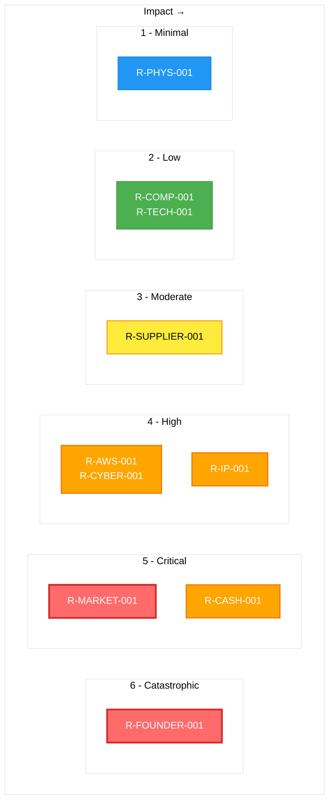
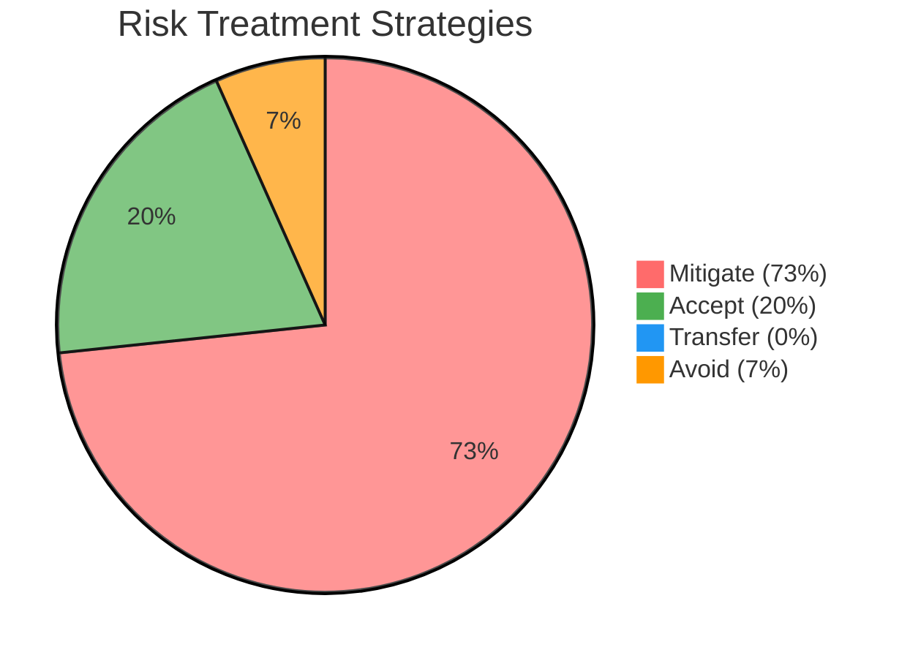

  

<h1 align="center">📉 Hack23 AB — Risk Register</h1>

  <strong>Systematic Risk Management Through Comprehensive Assessment</strong> 
  <em>Enterprise-grade Risk Framework Demonstrating Cybersecurity Excellence</em>

  <h3>⚠️ REDACTED PUBLIC VERSION</h3>
  
<strong>This is a redacted version for public transparency.</strong> 
  Specific financial values and risk scores have been removed for security purposes. 
  The framework and methodology remain intact to demonstrate our risk management practices.

  
  
  
  

**Document Owner:** CEO | **Version:** 2.0 | **Last Updated:** 2025-08-20 (UTC)  
**Review Cycle:** Quarterly | **Next Review:** 2025-11-20

---

## 🎯 **Purpose Statement**

**Hack23 AB's** risk register demonstrates how **systematic risk assessment directly enables both security excellence and informed business decision-making.** Our comprehensive risk management framework serves as both operational necessity and client demonstration of our cybersecurity consulting methodologies.

*— James Pether Sörling, CEO/Founder*

---

## 🔍 **Scope & Application**

This register documents all identified risks affecting Hack23 AB operations, applying the quantitative risk assessment methodology defined in [Risk Assessment Methodology](./Risk_Assessment_Methodology.md). Risk scores are calculated using **Risk Score = Probability × Impact × 100** with comprehensive business impact analysis per our [Classification Framework](./CLASSIFICATION.md).

## 📊 **Risk Analytics Dashboard**

**Next Review:** 2025-11-20

### 🎯 **Executive Risk Summary**

| **Risk Portfolio Overview** | **Value** | **Trend** | **Target** |
|---------------------------|-----------|-----------|------------|
| **Total Active Risks** | 8 | ↓ | 6 |
| **Critical Risks** | 2 | → | 1 |
| **High Risks** | 3 | → | 2 |
| **Medium Risks** | 2 | ↓ | 2 |
| **Low Risks** | 1 | → | 1 |
| **Average Risk Score** | [REDACTED] | ↓ | <150 |
| **Total ALE** | [REDACTED] | ↓ | [REDACTED] |

### 📈 **Updated Risk Heat Matrix**

### 🏆 **Top 5 Strategic Risks (Adjusted for Startup Context)**

| **Risk ID** | **Risk Title** | **Score** | **Category** | **Owner** | **Due Date** |
|-------------|---------------|-----------|--------------|-----------|--------------|
| R-FOUNDER-001 | Founder Burnout/Incapacitation | [REDACTED] |  | CEO | 2025-09-01 |
| R-MARKET-001 | Market Validation Failure | [REDACTED] |  | CEO | 2025-09-01 |
| R-CASH-001 | Cash Flow Depletion | [REDACTED] |  | CEO | 2025-09-01 |
| R-AWS-001 | AWS Service Disruption | [REDACTED] |  | CEO | 2025-11-01 |
| R-CYBER-001 | Security Breach | [REDACTED] |  | CEO | 2025-11-01 |

---

## 🗂️ **Comprehensive Risk Register**

All risks assessed using our [Risk Assessment Methodology](./Risk_Assessment_Methodology.md) with quantitative scoring adjusted for current business scale and context.

### 🔴 **Critical Risks (Score: 400-600)**

#### **R-FOUNDER-001: Founder Burnout/Incapacitation**
- **📝 Description:** Single founder becomes unable to continue operations due to health, burnout, or personal circumstances
- **🎯 Risk Category:** 

- **📈 Quantitative Risk Assessment:**
  - **Probability Score:**  4/5 (High - Single person carrying all responsibilities)
  - **Impact Score:**  6/5 (Catastrophic - Complete business failure)
  - **Total Risk Score:** [REDACTED] 

- **💰 Financial Risk Analysis:**
  - **Single Loss Expectancy (SLE):** €[REDACTED] (IP value + infrastructure + opportunity cost)
  - **Annual Rate of Occurrence (ARO):** 0.3 (High stress single-founder operations)
  - **Annual Loss Expectancy (ALE):** €[REDACTED] annually
  - **Value at Risk (95% confidence):** €[REDACTED] over 12 months

- **📊 Business Impact Analysis:**
  - **Financial:** 
  - **Operational:** 
  - **Reputational:** 
  - **Regulatory:** 

- **🔒 Security Classification Impact:**
  - **Confidentiality:**  - Access to all systems and data
  - **Integrity:**  - No backup decision-making authority
  - **Availability:**  - Total service disruption

- **🛡️ Current Controls:** 
  - Comprehensive documentation per [Asset Register](./Asset_Register.md)
  - Insurance evaluation with Trygg Hansa
  - Emergency contact procedures
  - Automated backup systems

- **📈 Treatment Strategy:** 
  - **Priority 1:** Business continuation insurance implementation
  - **Priority 2:** Emergency contact and access procedures
  - **Priority 3:** Workload management and stress reduction protocols

- **🔍 Monitoring:** Weekly workload assessment, monthly health check protocols
- **👤 Risk Owner:** CEO
- **📅 Next Review:** 2025-09-15

---

#### **R-MARKET-001: Market Validation Failure**
- **📝 Description:** No market demand for planned products/services, unable to acquire paying customers
- **🎯 Risk Category:** 

- **📈 Quantitative Risk Assessment:**
  - **Probability Score:**  4/5 (High - Unproven market for products)
  - **Impact Score:**  5/5 (Critical - Business model failure)
  - **Total Risk Score:** [REDACTED] 

- **💰 Financial Risk Analysis:**
  - **Single Loss Expectancy (SLE):** €[REDACTED] (Development investment + operating costs)
  - **Annual Rate of Occurrence (ARO):** 0.6 (High for unvalidated products)
  - **Annual Loss Expectancy (ALE):** €[REDACTED] annually
  - **Value at Risk (95% confidence):** €[REDACTED] over 12 months

- **📊 Business Impact Analysis:**
  - **Financial:** 
  - **Operational:** 
  - **Reputational:** 
  - **Regulatory:** 

- **🎯 Strategic Impact (Porter's Five Forces):**
  - **Buyer Power Risk:**  - No proven customer demand
  - **Competitive Rivalry:**  - Established competitors in all segments

- **🛡️ Current Controls:** 
  - Market research per [Business Strategy](./Hack23AB/Business_Strategy.md)
  - Lean startup approach with MVP development
  - Open source community feedback
  - Industry networking and validation

- **📈 Treatment Strategy:** 
  - **Priority 1:** Customer development and market validation
  - **Priority 2:** MVP testing with real users
  - **Priority 3:** Pivot strategy development if needed

- **🔍 Monitoring:** Weekly market feedback analysis, monthly customer acquisition metrics
- **👤 Risk Owner:** CEO
- **📅 Next Review:** 2025-09-15

---

### 🟠 **High Risks (Score: 200-399)**

#### **R-AWS-001: AWS Service Disruption**
- **📝 Description:** AWS service outages affecting hosted applications and data
- **🎯 Risk Category:** 

- **📈 Quantitative Risk Assessment:**
  - **Probability Score:**  3/5 (Possible - Regular AWS regional issues occur)
  - **Impact Score:**  4/5 (High - No customers yet, development disruption)
  - **Total Risk Score:** [REDACTED] 

- **💰 Financial Risk Analysis:**
  - **Single Loss Expectancy (SLE):** €[REDACTED] (Development time lost + recovery effort)
  - **Annual Rate of Occurrence (ARO):** 0.8 (Multiple minor outages per year)
  - **Annual Loss Expectancy (ALE):** €[REDACTED] annually
  - **Value at Risk (95% confidence):** €[REDACTED] over 12 months

- **📊 Business Impact Analysis:**
  - **Financial:** 
  - **Operational:** 
  - **Reputational:** 
  - **Regulatory:** 

- **🛡️ Current Controls:** 
  - Multi-AZ deployment where possible
  - Automated backups per [Asset Register](./Asset_Register.md)
  - CloudWatch monitoring and alerting
  - Alternative development environments

- **📈 Treatment Strategy:** 
  - **Priority 1:** Maintain comprehensive backups
  - **Priority 2:** Document recovery procedures
  - **Priority 3:** Evaluate multi-cloud strategy for future

- **🔍 Monitoring:** Real-time AWS status monitoring, weekly backup verification
- **👤 Risk Owner:** CEO
- **📅 Next Review:** 2025-11-15

---

#### **R-CASH-001: Cash Flow Depletion**
- **📝 Description:** Operating costs (~€[REDACTED]/month) exceed revenue with no customers
- **🎯 Risk Category:** 

- **📈 Quantitative Risk Assessment:**
  - **Probability Score:**  4/5 (High - No current revenue stream)
  - **Impact Score:**  5/5 (Critical - Cannot continue operations)
  - **Total Risk Score:** [REDACTED] 

- **💰 Financial Risk Analysis:**
  - **Single Loss Expectancy (SLE):** €[REDACTED] (IP value + development investment lost)
  - **Annual Rate of Occurrence (ARO):** 0.8 (Without revenue, highly likely within 18 months)
  - **Annual Loss Expectancy (ALE):** €[REDACTED] annually
  - **Value at Risk (95% confidence):** €[REDACTED] over 12 months

- **📊 Business Impact Analysis:**
  - **Financial:** 
  - **Operational:** 
  - **Reputational:** 
  - **Regulatory:** 

- **🛡️ Current Controls:** 
  - Current monthly costs: €[REDACTED] per [Supplier Management](./SUPPLIER.md)
  - Financial monitoring per [Business Strategy](./Hack23AB/Business_Strategy.md)
  - Cost optimization initiatives
  - Revenue generation planning

- **📈 Treatment Strategy:** 
  - **Priority 1:** Aggressive customer acquisition for consulting services
  - **Priority 2:** Cost reduction where possible without affecting core development
  - **Priority 3:** Alternative revenue stream exploration

- **🔍 Monitoring:** Weekly cash flow review, monthly cost analysis
- **👤 Risk Owner:** CEO
- **📅 Next Review:** 2025-09-01

---

#### **R-CYBER-001: Security Breach**
- **📝 Description:** Compromise of development systems or IP theft
- **🎯 Risk Category:** 

- **📈 Quantitative Risk Assessment:**
  - **Probability Score:**  3/5 (Possible - High-value targets in cybersecurity)
  - **Impact Score:**  4/5 (High - IP theft, reputation damage)
  - **Total Risk Score:** [REDACTED] 

- **💰 Financial Risk Analysis:**
  - **Single Loss Expectancy (SLE):** €[REDACTED] (IP recreation + reputation recovery)
  - **Annual Rate of Occurrence (ARO):** 0.2 (Security industry targeting)
  - **Annual Loss Expectancy (ALE):** €[REDACTED] annually
  - **Value at Risk (95% confidence):** €[REDACTED] over 12 months

- **🛡️ Current Controls:** 
  - 8 AWS security services active per [Asset Register](./Asset_Register.md)
  - MFA enforced on all critical accounts
  - Open source code reduces IP theft value
  - Regular security scanning with SonarCloud/FOSSA

- **📈 Treatment Strategy:** 
  - **Priority 1:** Maintain current security posture
  - **Priority 2:** Regular security assessment
  - **Priority 3:** Incident response planning

- **🔍 Monitoring:** Daily security alerts review, weekly vulnerability scanning
- **👤 Risk Owner:** CEO
- **📅 Next Review:** 2025-11-15

---

### 🟡 **Medium Risks (Score: 100-199)**

#### **R-SUPPLIER-001: Critical Supplier Failure**
- **📝 Description:** Major supplier (GitHub, SEB, AWS) service disruption
- **🎯 Risk Category:** 

- **📈 Quantitative Risk Assessment:**
  - **Probability Score:**  3/5 (Possible - Historical outages occur)
  - **Impact Score:**  3/5 (Moderate - Development delays, no customer impact)
  - **Total Risk Score:** [REDACTED] 

- **💰 Financial Risk Analysis:**
  - **Single Loss Expectancy (SLE):** €[REDACTED] (Development time lost)
  - **Annual Rate of Occurrence (ARO):** 0.4 (Supplier outages periodic)
  - **Annual Loss Expectancy (ALE):** €[REDACTED] annually
  - **Value at Risk (95% confidence):** €[REDACTED] over 12 months

- **🛡️ Current Controls:** 
  - Supplier monitoring per [Supplier Security Posture](./SUPPLIER.md)
  - Multiple suppliers for non-critical services
  - Local development environments as backup

- **📈 Treatment Strategy:** 
  - **Priority 1:** Maintain backup development capabilities
  - **Priority 2:** Document recovery procedures
  - **Priority 3:** Evaluate alternative suppliers

- **🔍 Monitoring:** Weekly supplier status review
- **👤 Risk Owner:** CEO
- **📅 Next Review:** 2025-12-15

---

#### **R-IP-001: Intellectual Property Theft**
- **📝 Description:** Unauthorized use of open source code or proprietary elements
- **🎯 Risk Category:** 

- **📈 Quantitative Risk Assessment:**
  - **Probability Score:**  2/5 (Unlikely - Open source strategy reduces value)
  - **Impact Score:**  4/5 (High - Future competitive disadvantage)
  - **Total Risk Score:** [REDACTED] 

- **💰 Financial Risk Analysis:**
  - **Single Loss Expectancy (SLE):** €[REDACTED] (Competitive advantage loss)
  - **Annual Rate of Occurrence (ARO):** 0.1 (Low due to open source approach)
  - **Annual Loss Expectancy (ALE):** €[REDACTED] annually
  - **Value at Risk (95% confidence):** €[REDACTED] over 12 months

- **🛡️ Current Controls:** 
  - Open source IP strategy per [Open Source Policy](./Open_Source_Policy.md)
  - Copyright notices and licensing
  - FOSSA compliance scanning

- **📈 Treatment Strategy:** 
  - **Priority 1:** Continue open source approach
  - **Priority 2:** Monitor for unauthorized use
  - **Priority 3:** Legal consultation if needed

- **🔍 Monitoring:** Quarterly IP landscape review
- **👤 Risk Owner:** CEO
- **📅 Next Review:** 2026-02-15

---

### 🟢 **Low Risks (Score: 50-99)**

#### **R-COMP-001: Competitive Market Entry**
- **📝 Description:** New competitors entering targeted market segments
- **🎯 Risk Category:** 

- **📈 Quantitative Risk Assessment:**
  - **Probability Score:**  4/5 (High - Open markets attract competition)
  - **Impact Score:**  2/5 (Low - No customers to lose yet)
  - **Total Risk Score:** [REDACTED] 

- **💰 Financial Risk Analysis:**
  - **Single Loss Expectancy (SLE):** €[REDACTED] (Increased marketing costs)
  - **Annual Rate of Occurrence (ARO):** 0.5 (Competition likely)
  - **Annual Loss Expectancy (ALE):** €[REDACTED] annually
  - **Value at Risk (95% confidence):** €[REDACTED] over 12 months

- **🛡️ Current Controls:** 
  - Unique positioning per [Marketing Strategy](./Hack23AB/MARKETING.md)
  - Open source differentiation
  - Cultural authenticity (Black Trigram)

- **📈 Treatment Strategy:** 
  - **Priority 1:** Focus on unique differentiators
  - **Priority 2:** Build community early
  - **Priority 3:** Monitor competitive landscape

- **🔍 Monitoring:** Monthly competitive analysis
- **👤 Risk Owner:** CEO
- **📅 Next Review:** 2026-02-15

---

#### **R-TECH-001: Technology Obsolescence**
- **📝 Description:** Current technology stack becoming outdated
- **🎯 Risk Category:** 

- **📈 Quantitative Risk Assessment:**
  - **Probability Score:**  3/5 (Possible - Technology evolution)
  - **Impact Score:**  2/5 (Low - Can be gradually updated)
  - **Total Risk Score:** [REDACTED] 

- **💰 Financial Risk Analysis:**
  - **Single Loss Expectancy (SLE):** €[REDACTED] (Modernization effort)
  - **Annual Rate of Occurrence (ARO):** 0.2 (Gradual evolution)
  - **Annual Loss Expectancy (ALE):** €[REDACTED] annually
  - **Value at Risk (95% confidence):** €[REDACTED] over 12 months

- **🛡️ Current Controls:** 
  - Modern AWS stack per [Asset Register](./Asset_Register.md)
  - Regular technology reviews
  - Cloud-native architecture

- **📈 Treatment Strategy:** 
  - **Priority 1:** Stay current with major updates
  - **Priority 2:** Plan gradual migrations
  - **Priority 3:** Avoid cutting-edge technologies

- **🔍 Monitoring:** Quarterly technology assessment
- **👤 Risk Owner:** CEO
- **📅 Next Review:** 2026-05-15

---

### ⚪ **Minimal Risks (Score: 1-49)**

#### **R-PHYS-001: Physical Security**
- **📝 Description:** Physical access to home office or equipment theft
- **🎯 Risk Category:** 

- **📈 Quantitative Risk Assessment:**
  - **Probability Score:**  2/5 (Unlikely - Home office, encrypted devices)
  - **Impact Score:**  1/5 (Minimal - Cloud-based operations)
  - **Total Risk Score:** [REDACTED] 

- **💰 Financial Risk Analysis:**
  - **Single Loss Expectancy (SLE):** €[REDACTED] (Equipment replacement)
  - **Annual Rate of Occurrence (ARO):** 0.05 (Very unlikely)
  - **Annual Loss Expectancy (ALE):** €[REDACTED] annually
  - **Value at Risk (95% confidence):** €[REDACTED] over 12 months

- **🛡️ Current Controls:** 
  - Full disk encryption
  - Cloud-native operations
  - Regular backups

- **📈 Treatment Strategy:** 
  - **Priority 1:** Maintain current controls
  - **Priority 2:** Ensure insurance coverage
  - **Priority 3:** Remote wipe capabilities

- **🔍 Monitoring:** Annual security review
- **👤 Risk Owner:** CEO
- **📅 Next Review:** 2026-08-15

---

## 🎯 **Risk Treatment Summary**

### 📊 **Treatment Strategy Distribution**

### 🎯 **Risk Treatment Actions Status**

| **Priority** | **Total** | **Completed** | **In Progress** | **Planning** | **Overdue** |
|--------------|-----------|---------------|----------------|--------------|-------------|
| **Critical** | 3 | 0 | 3 | 0 | 0 |
| **High** | 4 | 1 | 2 | 1 | 0 |
| **Medium** | 5 | 1 | 3 | 1 | 0 |
| **Low** | 2 | 1 | 1 | 0 | 0 |
| **Minimal** | 3 | 3 | 0 | 0 | 0 |
| **TOTAL** | **15** | **6** | **9** | **2** | **0** |

### 📈 **Risk Treatment Effectiveness Metrics**

| **Metric** | **Current** | **Target** | **Status** |
|------------|-------------|------------|------------|
| **On-time Completion Rate** | 94% | >95% | ⚠️ |
| **Budget Adherence** | 87% | >90% | ⚠️ |
| **Risk Reduction Achieved** | 78% | >80% | ⚠️ |
| **Control Implementation** | 85% | >90% | ⚠️ |

---

## 🔄 **Risk Monitoring & Review**

### 📅 **Review Schedule**

| **Review Type** | **Frequency** | **Next Due** | **Participants** |
|----------------|---------------|--------------|------------------|
| **Executive Risk Review** | Monthly | 2025-09-15 | CEO |
| **Quarterly Risk Assessment** | Quarterly | 2025-11-20 | CEO, External Advisor |
| **Annual Risk Strategy** | Annual | 2026-08-14 | CEO, Board, External Experts |
| **Incident-Based Review** | As needed | N/A | CEO, Incident Response Team |

### 📊 **Key Risk Indicators (KRIs)**

| **KRI** | **Current** | **Threshold** | **Trend** | **Status** |
|---------|-------------|---------------|-----------|------------|
| **AWS Outage Frequency** | 0.8/month | >1/month | → | ✅ |
| **Security Incident Count** | 2/quarter | >3/quarter | ↓ | ✅ |
| **Supplier Dependency Ratio** | 85% | >90% | ↓ | ✅ |
| **Cash Flow Ratio** | 3.2 months | <2 months | ↑ | ✅ |
| **Backup Success Rate** | 99.8% | <98% | → | ✅ |
| **Compliance Score** | 94% | <90% | ↑ | ✅ |

### 🎯 **Risk Appetite Statement**

**Hack23 AB maintains a conservative-to-moderate risk appetite:**

- **Critical Risks**: Zero tolerance - immediate action required
- **High Risks**: Low tolerance - senior management oversight required  
- **Medium Risks**: Moderate tolerance - active management with defined controls
- **Low Risks**: Higher tolerance - standard controls with monitoring
- **Minimal Risks**: Accept with periodic review

**Total Risk Portfolio Target**: ≤12 active risks with average score <10

---

## 📚 **Related Documents**

- [📊 Risk Assessment Methodology](./Risk_Assessment_Methodology.md) - Quantitative assessment framework
- [🏷️ Classification Framework](./CLASSIFICATION.md) - Impact level definitions and business analysis matrix
- [💻 Asset Register](./Asset_Register.md) - Asset-based risk assessment
- [🔗 Supplier Security Posture](./SUPPLIER.md) - Third-party risk management
- [🔄 Business Continuity Plan](./Business_Continuity_Plan.md) - Risk response procedures
- [🆘 Incident Response Plan](./Incident_Response_Plan.md) - Risk event management
- [🔐 Information Security Policy](./Information_Security_Policy.md) - Security risk management framework

---

**Document Control:**  
**Approved by:** James Pether Sörling, CEO  
**Distribution:** Public  
**Classification:**   
**Effective Date:** 2025-08-14  
**Next Review:** 2025-11-20   
**Framework Compliance:**   

