  

<h1 align="center">📉 Hack23 AB — Risk Register</h1>

  <strong>Systematic Risk Management Through Comprehensive Assessment</strong> 
  <em>Enterprise-grade Risk Framework Demonstrating Cybersecurity Excellence</em>

  
  
  
  

  
  

> ⚠️ **PUBLIC REDACTED VERSION:** This document has been redacted per our [ISMS Transparency Plan](https://github.com/Hack23/ISMS/blob/main/ISMS_Transparency_Plan.md). Sensitive values (financial impact amounts, ALE/SLE/VaR figures) are replaced with `[REDACTED]`. Complete unredacted version maintained in private ISMS repository.

**📋 Document Owner:** CEO | **📄 Version:** 3.7 | **📅 Last Updated:** 2026-01-25 (UTC)  
**🔄 Review Cycle:** Quarterly | **⏰ Next Review:** 2026-04-25

---

## 🎯 **Purpose Statement**

**Hack23 AB's** risk register demonstrates how **systematic risk assessment directly enables both security excellence and informed business decision-making.** Our comprehensive risk management framework serves as both operational necessity and client demonstration of our cybersecurity consulting methodologies.

*— James Pether Sörling, CEO/Founder*

---

## 🔍 **Scope & Application**

This register documents all identified risks affecting Hack23 AB operations, applying the quantitative risk assessment methodology defined in [Risk Assessment Methodology](./Risk_Assessment_Methodology.md). Risk scores are calculated using **Risk Score = Probability × Impact × 100** with comprehensive business impact analysis per our [Classification Framework](./CLASSIFICATION.md).

## 📊 **Risk Analytics Dashboard**

**Next Review:** 2026-04-25

### 🎯 **Executive Risk Summary**

| **Risk Portfolio Overview** | **Value** | **Trend** | **Target** |
|---------------------------|-----------|-----------|------------|
| **Total Active Risks** | 22 | ↑ | 18 |
| **Critical Risks** | 2 | → | 1 |
| **High Risks** | 6 | → | 4 |
| **Medium Risks** | 9 | ↑ | 6 |
| **Low Risks** | 4 | ↑ | 4 |
| **Minimal Risks** | 1 | → | 0 |
| **Average Risk Score** | 187 | ↑ | <150 |
| **Total ALE** | [REDACTED] | ↑ | <[REDACTED] |

### 📈 **Updated Risk Heat Matrix**

### 🏆 **Top 7 Strategic Risks (Q1 2026 Review)**

| **Risk ID** | **Risk Title** | **Score** | **Category** | **Owner** | **Due Date** |
|-------------|---------------|-----------|--------------|-----------|--------------|
| R-FOUNDER-001 | Founder Burnout/Incapacitation | 480 |  | CEO | 2026-02-27 |
| R-MARKET-001 | Market Validation Failure | 400 |  | CEO | 2026-02-27 |
| R-CASH-001 | Cash Flow Depletion | 320 |  | CEO | 2026-02-14 |
| R-CONCENTRATION-001 | Client Concentration Risk | 320 |  | CEO | 2026-02-27 |
| R-AWS-001 | AWS Service Disruption | 240 |  | CEO | 2026-02-27 |
| R-CYBER-001 | Security Breach | 240 |  | CEO | 2026-02-27 |
| R-AI-LIABILITY-001 | AI-Generated Content Liability | 240 |  | CEO | 2026-02-27 |

### 🏆 **Pentagon Dimension Distribution**

Risk portfolio organized by Pentagon of Continuous Improvement dimensions:

| Pentagon Dimension | Risk Count | Example Risks | Avg Score | Priority Multiplier |
|--------------------|-----------|---------------|-----------|-------------------|
| **🔒 Security** | 6 | R-CYBER-001, R-AWS-001, R-AI-LIABILITY-001, R-SUPPLIER-001, R-INCIDENT-001, R-PHYS-001 | 183 | 2.0× |
| **📋 ISMS Controls** | 6 | R-FOUNDER-001, R-GDPR-001, R-ACCESS-001, R-AGENT-001, R-AGENT-002, R-TAX-001 | 163 | 2.0× |
| **🚀 Functionality** | 4 | R-MARKET-001, R-CASH-001, R-CREDIT-001, R-CONCENTRATION-001 | 320 | 1.8× |
| **✨ Quality** | 5 | R-TECH-001, R-PROCESS-001, R-IP-001, R-LEGAL-001, R-PROF-LIABILITY-001 | 136 | 1.5× |
| **🧪 QA** | 1 | R-COMP-001 | 80 | 1.3× |

**Key Insights:**
- **Highest Priority:** Security and ISMS Controls dimensions (2.0× multiplier) contain majority of risks
- **Business Critical:** Functionality dimension contains all revenue-impacting risks (avg score 320)
- **Balanced Coverage:** All 5 Pentagon dimensions represented, ensuring holistic risk management
- **Strategic Alignment:** Risk prioritization directly supports [Information Security Strategy](./Information_Security_Strategy.md) Pentagon framework

### 🤖 **Agent Monitoring Coverage**

Automated risk monitoring through curated agent ecosystem:

| Metric | Current Status | Target | Status |
|--------|---------------|--------|--------|
| **Total Risks Monitored** | 22/22 (100%) | 100% | ✅ Complete |
| **Continuous Monitoring (Weekly)** | 8 Critical/High risks | All Critical/High | ✅ Achieved |
| **Periodic Monitoring (Bi-weekly/Monthly)** | 14 Medium/Low/Minimal risks | All Medium/Low | ✅ Achieved |
| **Automated Evidence Links** | 18/22 (82%) | >80% | ✅ Achieved |
| **Agent Triage Accuracy** | 94% (validated vs human) | >85% | ✅ Exceeded |
| **Pentagon Coverage** | 22/22 (100%) | 100% | ✅ Complete |

**Agent Assignments by Risk Level:**
- **Critical Risks (2):** ISMS Ninja + Security Architect + Business Dev Specialist (weekly)
- **High Risks (6):** Specialist agents per Pentagon dimension (weekly)
- **Medium Risks (9):** Specialist agents per Pentagon dimension (bi-weekly/monthly)
- **Low/Minimal Risks (5):** Test Specialist + periodic monitoring (quarterly)

**Evidence Automation Sources:**
- **OpenSSF Scorecard:** Real-time supply chain security metrics
- **GitHub Actions:** Automated evidence generation and CI/CD workflows
- **SonarCloud:** Code quality and security vulnerability scanning
- **FOSSA:** License compliance and dependency vulnerability tracking
- **GitHub Security:** Dependabot alerts and secret scanning findings

---

## 📉 **Risk Management Workflow**

Hack23's risk management process from identification to continuous monitoring, demonstrating systematic risk lifecycle management aligned with ISO 27001 and NIST CSF 2.0.

```mermaid
flowchart TD
    START[🔍 Risk Identified<br/>Internal/External Source] --> ASSESS{📊 Risk Assessment<br/>Likelihood × Impact × 100}
    
    ASSESS -->|Critical/High<br/>Score > 240| EXTERNAL[🤝 External Consultant<br/>Review Required<br/>Independent Validation]
    ASSESS -->|Medium/Low<br/>Score ≤ 240| CEO_ASSESS[👨‍💼 CEO Risk Assessment<br/>Standardized Template<br/>Risk Methodology]
    
    EXTERNAL --> TREATMENT{🎯 Risk Treatment<br/>Decision Point}
    CEO_ASSESS --> TREATMENT
    
    TREATMENT -->|Mitigate| CONTROL[✅ Implement Controls<br/>Reduce Likelihood/Impact<br/>Technical & Procedural]
    TREATMENT -->|Accept| ACCEPT[⚠️ Risk Acceptance<br/>Document Justification<br/>CEO Approval Required]
    TREATMENT -->|Transfer| INSURANCE[💼 Insurance/Partnership<br/>Transfer Risk<br/>Third Party Agreement]
    TREATMENT -->|Avoid| AVOID[🚫 Avoid Activity<br/>Eliminate Risk Source<br/>Discontinue Operation]
    
    CONTROL --> REGISTER[📋 Risk Register<br/>Document & Track<br/>ALE Calculation]
    ACCEPT --> REGISTER
    INSURANCE --> REGISTER
    AVOID --> REGISTER
    
    REGISTER --> MONITOR[📊 Quarterly Review<br/>Monitor Effectiveness<br/>Recalculate Risk Score]
    
    MONITOR -->|Risk Changed<br/>Score ±20%| ASSESS
    MONITOR -->|Control Effective<br/>Score Stable| MAINTAIN[✅ Maintain Controls<br/>Annual Deep Review<br/>Documentation Update]
    
    MAINTAIN --> ANNUAL{🔄 Annual<br/>Review Cycle}
    ANNUAL --> ASSESS
    
    style START fill:#2196F3,stroke:#1565C0,stroke-width:3px,color:#fff
    style ASSESS fill:#FF9800,stroke:#F57C00,stroke-width:3px,color:#fff
    style EXTERNAL fill:#7B1FA2,stroke:#4A148C,stroke-width:2px,color:#fff
    style CEO_ASSESS fill:#1565C0,stroke:#0D47A1,stroke-width:2px,color:#fff
    style TREATMENT fill:#FF9800,stroke:#F57C00,stroke-width:3px,color:#fff
    style CONTROL fill:#4CAF50,stroke:#2E7D32,stroke-width:2px,color:#fff
    style ACCEPT fill:#FFC107,stroke:#F9A825,stroke-width:2px,color:#000
    style INSURANCE fill:#2196F3,stroke:#1565C0,stroke-width:2px,color:#fff
    style AVOID fill:#D32F2F,stroke:#B71C1C,stroke-width:2px,color:#fff
    style REGISTER fill:#1565C0,stroke:#0D47A1,stroke-width:2px,color:#fff
    style MONITOR fill:#7B1FA2,stroke:#4A148C,stroke-width:2px,color:#fff
    style MAINTAIN fill:#4CAF50,stroke:#2E7D32,stroke-width:2px,color:#fff
    style ANNUAL fill:#FF9800,stroke:#F57C00,stroke-width:2px,color:#fff
```

**Key Takeaways:**
- **🔍 Risk Identification:** Risks identified from internal assessments, external sources, threat intelligence, and incident reviews
- **📊 Assessment Threshold:** Critical/High risks (Score > 240) require external consultant review for independent validation
- **🎯 Treatment Options:** Four systematic approaches - Mitigate (reduce), Accept (document), Transfer (insurance/partnership), Avoid (eliminate)
- **📋 Risk Register:** All risks documented with quantitative scoring using **Risk Score = Probability × Impact × 100**
- **📊 Quarterly Monitoring:** Continuous effectiveness review with recalculation and re-assessment trigger when score changes ±20%
- **🔄 Annual Deep Review:** Comprehensive risk reassessment cycle ensures risks remain relevant and controls effective

**Related Documents:**
- [📊 Risk Assessment Methodology](./Risk_Assessment_Methodology.md) — Quantitative risk scoring framework
- [🏷️ Classification Framework](./CLASSIFICATION.md) — Business impact definitions
- [🔐 Information Security Policy](./Information_Security_Policy.md) — Risk management governance
- [🤝 Third Party Management](./Third_Party_Management.md) — Supplier risk assessment
- [🚨 Incident Response Plan](./Incident_Response_Plan.md) — Risk event handling
- [🔄 Business Continuity Plan](./Business_Continuity_Plan.md) — Risk mitigation strategies

---

## 🤖 **AI Agent Risk Monitoring Framework**

Hack23 AB's curated agent ecosystem (per [Information Security Strategy](./Information_Security_Strategy.md)) provides continuous risk monitoring aligned with the Pentagon of Continuous Improvement framework.

### 📋 **Continuous Risk Monitoring Architecture**

```mermaid
flowchart TD
    TASK[📋 Task Agent<br/>Weekly Analysis] --> MONITOR[📊 Risk KPI Monitoring]
    MONITOR --> CHANGE{🚨 Risk Score<br/>Change > ±20%?}
    CHANGE -->|Yes| RECALC[📊 Automated<br/>Score Recalculation]
    CHANGE -->|No| CONTINUE[✅ Continue Monitoring]
    
    RECALC --> CRITICAL{🔴 Critical Risk?<br/>Score > 400}
    CRITICAL -->|Yes| CEO[👨‍💼 CEO Immediate<br/>Notification]
    CRITICAL -->|No| UPDATE[📝 Register<br/>Auto-Update]
    
    CEO --> REVIEW[🔍 Human Risk<br/>Assessment]
    UPDATE --> EVIDENCE[📊 Evidence Update<br/>Automated Sources]
    REVIEW --> EVIDENCE
    
    EVIDENCE --> REGISTER[📋 Risk Register<br/>Synchronized]
    
    style TASK fill:#2196F3,stroke:#1565C0,stroke-width:2px,color:#fff
    style MONITOR fill:#4CAF50,stroke:#2E7D32,stroke-width:2px,color:#fff
    style CHANGE fill:#FF9800,stroke:#F57C00,stroke-width:3px,color:#fff
    style RECALC fill:#7B1FA2,stroke:#4A148C,stroke-width:2px,color:#fff
    style CONTINUE fill:#4CAF50,stroke:#2E7D32,stroke-width:2px,color:#fff
    style CRITICAL fill:#FF9800,stroke:#F57C00,stroke-width:3px,color:#fff
    style CEO fill:#FFD700,stroke:#F57F17,stroke-width:3px,color:#000
    style UPDATE fill:#4CAF50,stroke:#2E7D32,stroke-width:2px,color:#fff
    style REVIEW fill:#7B1FA2,stroke:#4A148C,stroke-width:2px,color:#fff
    style EVIDENCE fill:#2196F3,stroke:#1565C0,stroke-width:2px,color:#fff
    style REGISTER fill:#1565C0,stroke:#0D47A1,stroke-width:2px,color:#fff
```

### 📊 **Agent Risk Monitoring Metrics**

**Continuous Monitoring KPIs:**
- **Risk Discovery Rate:** Agent-identified risks per analysis cycle (target: >60% automation)
- **Monitoring Frequency:** Weekly automated KPI checks for all Critical/High risks
- **Score Recalculation Accuracy:** Agent-calculated vs human-validated scores (target: >95% agreement)
- **Evidence Automation Rate:** Automated evidence links (GitHub Actions, OpenSSF Scorecard, SonarCloud) per risk (target: >80%)
- **Pentagon Prioritization Coverage:** Risks mapped to Pentagon dimensions (target: 100%)

### 🏆 **Pentagon-Driven Risk Prioritization**

Risk scores adjusted by Pentagon dimension priority multipliers per [Information Security Strategy](./Information_Security_Strategy.md#pentagon-of-continuous-improvement):

| Pentagon Dimension | Risk Categories | Priority Multiplier | Agent Monitoring |
|--------------------|-----------------|-------------------|------------------|
| **🔒 Security** | R-CYBER-001, R-AWS-001, R-AI-LIABILITY-001, R-SUPPLIER-001, R-INCIDENT-001, R-PHYS-001 | 2.0× | Security Architect (weekly) |
| **📋 ISMS Controls** | R-FOUNDER-001, R-GDPR-001, R-ACCESS-001, R-AGENT-001, R-AGENT-002, R-TAX-001 | 2.0× | ISMS Ninja (weekly) |
| **🚀 Functionality** | R-MARKET-001, R-CASH-001, R-CREDIT-001, R-CONCENTRATION-001 | 1.8× | Business Dev Specialist (weekly) |
| **✨ Quality** | R-TECH-001, R-PROCESS-001, R-IP-001, R-LEGAL-001, R-PROF-LIABILITY-001 | 1.5× | Code Quality Engineer (bi-weekly) |
| **🧪 QA** | R-COMP-001 | 1.3× | Test Specialist (monthly) |

**Key Takeaways:**
- **🤖 Automated Monitoring:** Task agents perform weekly KPI analysis for all risks in this register
- **🚨 Critical Risk Escalation:** Risks >400 score trigger immediate CEO notification
- **📊 Evidence Automation:** Agents integrate OpenSSF Scorecard, GitHub Actions, and SonarCloud data
- **🏆 Pentagon Prioritization:** Risk treatment resources allocated by Pentagon dimension multipliers
- **🔄 Continuous Improvement:** Agent-identified gaps drive quarterly risk register evolution

**Related Documents:**
- [🎯 Information Security Strategy](./Information_Security_Strategy.md) — Pentagon framework and AI agent ecosystem
- [📊 Risk Assessment Methodology](./Risk_Assessment_Methodology.md) — Agent risk scoring integration
- [🤖 AI Policy](./AI_Policy.md) — Agent governance and least-privilege requirements

---

## 🗂️ **Comprehensive Risk Register**

All risks assessed using our [Risk Assessment Methodology](./Risk_Assessment_Methodology.md) with quantitative scoring adjusted for current business scale and context.

### 📋 **Common Risk Controls**

Controls implemented across multiple risks (referenced in individual risk entries to reduce repetition):

| Control ID | Control Name | Applies To Risks | Description |
|------------|--------------|------------------|-------------|
| **C-SEC-001** | AWS Security Services | R-AWS-001, R-CYBER-001, R-INCIDENT-001 | 8 active AWS security services: GuardDuty, Security Hub, CloudTrail, Config, Inspector, WAF, Macie, Detective |
| **C-SEC-002** | MFA Enforcement | R-CYBER-001, R-ACCESS-001, R-AWS-001 | Multi-factor authentication on all critical accounts |
| **C-SEC-003** | Security Scanning | R-CYBER-001, R-TECH-001, R-AGENT-001 | SonarCloud SAST, FOSSA SCA, Dependabot, OpenSSF Scorecard |
| **C-DOC-001** | Comprehensive Documentation | R-FOUNDER-001, R-ACCESS-001, R-INCIDENT-001 | All processes documented per Asset Register, quarterly updates |
| **C-PARTNER-001** | Partnership Framework | R-FOUNDER-001, R-SUPPLIER-001 | Strategic partner network per Partnership_Framework.md |
| **C-BACKUP-001** | Automated Backups | R-AWS-001, R-FOUNDER-001, R-INCIDENT-001 | Multi-region backup systems, 30-day retention |
| **C-MONITOR-001** | Security Monitoring | R-CYBER-001, R-AWS-001, R-ACCESS-001, R-INCIDENT-001 | Daily alerts review, weekly vulnerability scanning |
| **C-COMP-001** | Compliance Framework | R-GDPR-001, R-TAX-001, R-LEGAL-001 | Privacy Policy, Data Classification, Access Control policies |
| **C-INS-001** | Insurance Coverage | R-FOUNDER-001, R-PROF-LIABILITY-001, R-IP-001 | Professional indemnity, cyber insurance evaluation |

### 🎯 **Risk Treatment Summary**

| Treatment Strategy | Risk Count | Risk IDs | Implementation Status |
|--------------------|-----------|----------|---------------------|
| **Mitigate with Controls** | 22 | R-AWS-001, R-CYBER-001, R-GDPR-001, R-SUPPLIER-001, R-IP-001, R-PROCESS-001, R-INCIDENT-001, R-TAX-001, R-TECH-001, R-ACCESS-001, R-AGENT-001, R-AGENT-002, R-PHYS-001, R-CASH-001, R-CREDIT-001, R-CONCENTRATION-001, R-AI-LIABILITY-001, R-COMP-001, R-FOUNDER-001, R-MARKET-001, R-LEGAL-001, R-PROF-LIABILITY-001 | Technical + procedural controls active |
| **Accept with Mitigation** | 7 | R-FOUNDER-001, R-MARKET-001, R-LEGAL-001, R-PROCESS-001, R-INCIDENT-001, R-ACCESS-001, R-AGENT-001 | Risk accepted with compensating controls |
| **Transfer (Insurance)** | 1 | R-PROF-LIABILITY-001 | Professional indemnity coverage active |

### 📊 **Classification Impact Summary**

Common classification patterns across risks (reduces repetition in individual entries):

| Classification Type | High Impact Risks | Moderate Impact Risks | Low Impact Risks |
|--------------------|------------------|---------------------|------------------|
| **Confidentiality** | R-FOUNDER-001 (Extreme), R-CYBER-001 (High), R-IP-001 (High) | R-AWS-001 (Moderate), R-ACCESS-001 (Moderate) | R-PHYS-001 (Low), R-TECH-001 (Low) |
| **Integrity** | R-FOUNDER-001 (Critical), R-CYBER-001 (High), R-GDPR-001 (High) | R-AWS-001 (Moderate), R-AGENT-002 (Moderate) | R-COMP-001 (Low), R-PHYS-001 (Minimal) |
| **Availability** | R-FOUNDER-001 (Mission Critical), R-AWS-001 (High), R-CASH-001 (High) | R-CYBER-001 (Moderate), R-SUPPLIER-001 (Moderate) | R-TECH-001 (Low), R-PHYS-001 (Best Effort) |

### 🔴 **Critical Risks (Score: 400-600)**

#### **R-FOUNDER-001: Founder Burnout/Incapacitation**
**Risk:** Single founder unable to continue operations | **Category:**  | **Pentagon:**  

**📊 Risk Metrics:** Probability 4/5  | Impact 6/5  | **Score: 480**  | Target: 360 (25% reduction via knowledge transfer)

**💰 Financial:** SLE [REDACTED] | ARO 0.3 | ALE [REDACTED] | VaR [REDACTED] (95% CI, 12mo)

**🔒 CIA Impact:** Confidentiality  | Integrity  | Availability 

**🛡️ Controls:** C-DOC-001, C-PARTNER-001, C-BACKUP-001, C-INS-001 | [Partnership_Framework.md](./Partnership_Framework.md) | [Founder_Knowledge_Transfer_Template.md](./templates/Founder_Knowledge_Transfer_Template.md) | [Partnership_Emergency_Activation_Runbook.md](./templates/Partnership_Emergency_Activation_Runbook.md) 4-hour RTO

**📈 Treatment:** Priority 1: Maintain knowledge transfer (quarterly) | Priority 2: Onboard 2-3 Tier 1 partners | Priority 3: Business continuation insurance | Priority 4: Semi-annual drills

**🤖 Monitoring:** ISMS Ninja + Security Architect (weekly) | Next Review: 2026-02-14 | Owner: CEO

---

#### **R-MARKET-001: Market Validation Failure**
**Risk:** No market demand for products/services, unable to acquire customers | **Category:**  | **Pentagon:** 

**📊 Risk Metrics:** Probability 4/5  | Impact 5/5  | **Score: 400** 

**💰 Financial:** SLE [REDACTED] | ARO 0.6 | ALE [REDACTED] | VaR [REDACTED] (95% CI, 12mo)

**🯠Strategic Impact:** Buyer Power  | Competitive Rivalry 

**🛡️ Controls:** Market research per [Business_Strategy.md](./Hack23AB/Business_Strategy.md) | Lean startup MVP | Open source community feedback | Industry networking

**📈 Treatment:** Priority 1: Customer development and validation | Priority 2: MVP testing with users | Priority 3: Pivot strategy if needed

**🤖 Monitoring:** Business Dev Specialist (weekly market analysis) | Next Review: 2026-02-14 | Owner: CEO

---

### 🟠 **High Risks (Score: 200-399)**

#### **R-AWS-001: AWS Service Disruption**
**Risk:** AWS service outages affecting applications/data | **Category:**  | **Pentagon:** 

**📊 Risk Metrics:** Probability 3/5  | Impact 4/5  | **Score: 240** 

**💰 Financial:** SLE [REDACTED] | ARO 0.8 | ALE [REDACTED] | VaR [REDACTED] (95% CI, 12mo)

**🛡️ Controls:** C-SEC-001, C-BACKUP-001, C-MONITOR-001 | Multi-AZ deployment | Health check integration

**📈 Treatment:** Priority 1: Maintain multi-region architecture | Priority 2: Regular disaster recovery testing | Priority 3: Monitor AWS service health

**🤖 Monitoring:** Security Architect (weekly) | Next Review: 2026-02-27 | Owner: CEO

---

#### **R-CASH-001: Cash Flow Depletion**
**Risk:** Operating costs (~€400/month) exceed revenue with no customers | **Category:**  | **Pentagon:** 

**📊 Risk Metrics:** Probability 4/5  | Impact 5/5  | **Score: 320** 

**💰 Financial:** SLE [REDACTED] | ARO 0.8 | ALE [REDACTED] | VaR [REDACTED] (95% CI, 12mo)

**🛡️ Controls:** Monthly costs €395 per [SUPPLIER.md](./SUPPLIER.md) | Financial monitoring per [Business_Strategy.md](./Hack23AB/Business_Strategy.md) | Cost optimization

**📈 Treatment:** Priority 1: Aggressive customer acquisition | Priority 2: Cost reduction | Priority 3: Alternative revenue streams

**🤖 Monitoring:** Business Dev Specialist (weekly financial analysis) | Next Review: 2026-02-14 | Owner: CEO

---

#### **R-CYBER-001: Security Breach**
**Risk:** Compromise of development systems or IP theft | **Category:**  | **Pentagon:** 

**📊 Risk Metrics:** Probability 3/5  | Impact 4/5  | **Score: 240** 

**💰 Financial:** SLE [REDACTED] | ARO 0.2 | ALE [REDACTED] | VaR [REDACTED] (95% CI, 12mo)

**🛡️ Controls:** C-SEC-001, C-SEC-002, C-SEC-003, C-MONITOR-001 | OpenSSF Scorecard | Open source code reduces IP theft value

**📈 Treatment:** Priority 1: Maintain security posture | Priority 2: Regular security assessment | Priority 3: Incident response planning

**🤖 Monitoring:** Security Architect (daily alerts, weekly scans) | Next Review: 2026-02-27 | Owner: CEO

---

#### **R-AI-LIABILITY-001: AI-Generated Content Liability**
**Risk:** AI-generated content liability (code, policies, advice) - professional negligence, copyright, misinformation | **Category:**  | **Pentagon:** 

**📊 Risk Metrics:** Probability 3/5  | Impact 4/5  | **Score: 240** 

**💰 Financial:** SLE [REDACTED] | ARO 0.2 | ALE [REDACTED] | VaR [REDACTED] (95% CI, 12mo) | **EU AI Act:** General Purpose AI, Limited Risk

**🛡️ Controls:** [AI_Policy.md](./AI_Policy.md) | Human review mandatory per [OWASP_LLM_Security_Policy.md](./OWASP_LLM_Security_Policy.md) | Professional indemnity insurance (evaluating) | Disclaimers, version control, EU AI Act compliance

**📈 Treatment:** Priority 1: Secure AI liability insurance | Priority 2: AI output validation procedures | Priority 3: EU AI Act compliance

**🤖 Monitoring:** Security Architect (weekly AI governance) | Next Review: 2026-02-27 | Owner: CEO

---

#### **R-CREDIT-001: Client Payment Default**
**Risk:** Client non-payment or payment delays affecting cash flow | **Category:**  | **Pentagon:** 

**📊 Risk Metrics:** Probability 3/5  | Impact 4/5  | **Score: 240** 

**💰 Financial:** SLE [REDACTED] | ARO 0.3 | ALE [REDACTED] | VaR [REDACTED] (95% CI, 12mo)

**🛡️ Controls:** Payment terms 50% upfront per [Business_Plan.md](./Hack23AB/Business_Plan.md) | Milestone invoicing | Credit checks >100K SEK | Escalation (30/60 days) | Legal consultation threshold 60 days/>50K SEK

**📈 Treatment:** Priority 1: Enforce upfront payment strictly | Priority 2: Factoring/invoice financing for large projects | Priority 3: Client diversification

**🤖 Monitoring:** Business Dev Specialist (weekly payment tracking) | Next Review: 2026-02-27 | Owner: CEO

---

#### **R-CONCENTRATION-001: Client Concentration Risk**
- **📝 Description:** Revenue concentration in 1-2 major clients creating dependency and vulnerability to client loss
- **🯠Risk Category:** 

- **📈 Quantitative Risk Assessment:**
  - **Probability Score:**  4/5 (Likely - Solo founder likely to have 1-2 major clients initially)
  - **Impact Score:**  4/5 (High - Severe revenue impact if key client lost)
  - **Total Risk Score:** 320 

- **💰 Financial Risk Analysis:**
  - **Single Loss Expectancy (SLE):** [REDACTED] (60% of annual revenue target lost)
  - **Annual Rate of Occurrence (ARO):** 0.2 (Client churn realistic in consulting)
  - **Annual Loss Expectancy (ALE):** [REDACTED] annually
  - **Value at Risk (95% confidence):** [REDACTED] over 12 months

- **📊 Business Impact Analysis:**
  - **Financial:** 
  - **Operational:** 
  - **Reputational:** 
  - **Regulatory:** 

- **🎯 Strategic Impact:**
  - Identified in [Business Plan](./Hack23AB/Business_Plan.md) Risk Matrix as high priority
  - Directly affects business continuity and sustainability
  - Limits negotiating leverage and pricing power

- **🆠Pentagon Dimension:** 
  - **Pentagon Priority:** 1.8× multiplier (high priority - revenue diversification critical)
  - **Strategic Rationale:** Client concentration threatens business functionality through revenue volatility

- **🤖 Agent Monitoring:**
  - **Primary Agent:** Business Development Specialist (weekly client concentration monitoring)
  - **Monitoring Frequency:** Weekly revenue distribution analysis and client relationship assessment
  - **Last Agent Check:** 2026-01-25
  - **Next Scheduled Check:** 2026-02-01

- **📊 Automated Evidence:**
  - **Business Strategy:** [Business_Strategy.md](./Hack23AB/Business_Strategy.md) - Client diversification strategy
  - **Business Plan:** [Business_Plan.md](./Hack23AB/Business_Plan.md) - Revenue concentration targets
  - **ISMS Policy Review:** Strategic risk control validation (quarterly assessment)

- **🛡️ Current Controls:** 
  - Active client diversification strategy per [Business Strategy](./Hack23AB/Business_Strategy.md)
  - Target: No client >40% of revenue by Q4 2026
  - Portfolio of 4 business lines reducing dependency
  - Strong client relationships and proactive communication
  - Continuous pipeline development

- **📈 Treatment Strategy:** 
  - **Priority 1:** Aggressive new client acquisition (target 5+ clients by Q4 2026)
  - **Priority 2:** Long-term contracts with staggered renewal dates
  - **Priority 3:** Product revenue diversification (Black Trigram, CIA Compliance Manager)

- **🔍 Monitoring:** **Agent-Driven Continuous Monitoring:** Business Development Specialist weekly concentration analysis | Monthly revenue concentration analysis, quarterly client relationship health checks (agent-tracked)
- **👤 Risk Owner:** CEO
- **📅 Next Review:** 2026-02-27

---

### 🟡 **Medium Risks (Score: 100-199)**

#### **R-GDPR-001: GDPR Compliance Breach (Future Risk)**
**Risk:** Future GDPR non-compliance when processing customer data (activates upon first customer) | **Category:**   | **Pentagon:** 

**📊 Risk Metrics:** Probability 1/5  | Impact 5/5  | **Score: 100** 

**💰 Financial:** SLE [REDACTED] | ARO 0.01 (current), 0.05 (post-revenue) | ALE [REDACTED] (current), [REDACTED] (post-revenue) | VaR [REDACTED] (95% CI, 12mo)

**🛡️ Controls:** C-COMP-001 | [Privacy_Policy.md](./Privacy_Policy.md) | [Data_Classification_Policy.md](./Data_Classification_Policy.md) | [Access_Control_Policy.md](./Access_Control_Policy.md) | DPO: CEO

**📈 Treatment:** Priority 1: Activate GDPR program upon first customer | Priority 2: DPIA before onboarding | Priority 3: Annual audit post-revenue

**🤖 Monitoring:** ISMS Ninja (weekly readiness, daily post-customer) | Activation: First customer (target Q1 2026) | Next Review: 2026-02-27 | Owner: CEO

---

#### **R-SUPPLIER-001: Critical Supplier Failure**
- **📝 Description:** Major supplier (GitHub, SEB, AWS) service disruption
- **🯠Risk Category:** 

- **📈 Quantitative Risk Assessment:**
  - **Probability Score:**  3/5 (Possible - Historical outages occur)
  - **Impact Score:**  3/5 (Moderate - Development delays, no customer impact)
  - **Total Risk Score:** 180 

- **💰 Financial Risk Analysis:**
  - **Single Loss Expectancy (SLE):** [REDACTED] (Development time lost)
  - **Annual Rate of Occurrence (ARO):** 0.4 (Supplier outages periodic)
  - **Annual Loss Expectancy (ALE):** €400 annually
  - **Value at Risk (95% confidence):** [REDACTED] over 12 months

- **🆠Pentagon Dimension:** 
  - **Pentagon Priority:** 2.0× multiplier (highest priority - supplier security critical)
  - **Strategic Rationale:** Critical supplier failure impacts security posture and operational continuity

- **🤖 Agent Monitoring:**
  - **Primary Agent:** Security Architect (bi-weekly supplier monitoring)
  - **Monitoring Frequency:** Bi-weekly supplier status and security posture review
  - **Last Agent Check:** 2026-01-25
  - **Next Scheduled Check:** 2026-02-08

- **📊 Automated Evidence:**
  - **Supplier Management:** [SUPPLIER.md](./SUPPLIER.md) - Supplier security posture tracking
  - **ISMS Policy Review:** Supplier risk control validation (quarterly assessment)

- **🛡️ Current Controls:** 
  - Supplier monitoring per [Supplier Security Posture](./SUPPLIER.md)
  - Multiple suppliers for non-critical services
  - Local development environments as backup

- **📈 Treatment Strategy:** 
  - **Priority 1:** Maintain backup development capabilities
  - **Priority 2:** Document recovery procedures
  - **Priority 3:** Evaluate alternative suppliers

- **🔍 Monitoring:** **Agent-Driven Continuous Monitoring:** Security Architect bi-weekly supplier analysis | Weekly supplier status review (agent-tracked)
- **👤 Risk Owner:** CEO
- **📅 Next Review:** 2026-02-14

---

#### **R-IP-001: Intellectual Property Theft**
- **📝 Description:** Unauthorized use of open source code or proprietary elements
- **🯠Risk Category:** 

- **📈 Quantitative Risk Assessment:**
  - **Probability Score:**  2/5 (Unlikely - Open source strategy reduces value)
  - **Impact Score:**  4/5 (High - Future competitive disadvantage)
  - **Total Risk Score:** 160 

- **💰 Financial Risk Analysis:**
  - **Single Loss Expectancy (SLE):** [REDACTED] (Competitive advantage loss)
  - **Annual Rate of Occurrence (ARO):** 0.1 (Low due to open source approach)
  - **Annual Loss Expectancy (ALE):** [REDACTED] annually
  - **Value at Risk (95% confidence):** [REDACTED] over 12 months

- **🆠Pentagon Dimension:** 
  - **Pentagon Priority:** 1.5× multiplier (moderate priority - IP protection supporting quality)
  - **Strategic Rationale:** IP protection ensures code quality and competitive advantage

- **🤖 Agent Monitoring:**
  - **Primary Agent:** Code Quality Engineer (bi-weekly IP monitoring)
  - **Monitoring Frequency:** Bi-weekly IP landscape and license compliance review
  - **Last Agent Check:** 2026-01-25
  - **Next Scheduled Check:** 2026-02-08

- **📊 Automated Evidence:**
  - **Open Source Policy:** [Open_Source_Policy.md](./Open_Source_Policy.md) - IP strategy validation
  - **FOSSA:** Automated license compliance scanning
  - **ISMS Policy Review:** IP control validation (quarterly assessment)

- **🛡️ Current Controls:** 
  - Open source IP strategy per [Open Source Policy](./Open_Source_Policy.md)
  - Copyright notices and licensing
  - FOSSA compliance scanning

- **📈 Treatment Strategy:** 
  - **Priority 1:** Continue open source approach
  - **Priority 2:** Monitor for unauthorized use
  - **Priority 3:** Legal consultation if needed

- **🔍 Monitoring:** **Agent-Driven Continuous Monitoring:** Code Quality Engineer bi-weekly IP analysis | Quarterly IP landscape review (agent-tracked)
- **👤 Risk Owner:** CEO
- **📅 Next Review:** 2026-02-14

---

#### **R-PROCESS-001: Simplified Change Management Process**
- **📝 Description:** Self-approval bias in change management due to single-person operations. CEO may approve changes without sufficient critical analysis compared to multi-person Change Advisory Board (CAB).
- **🯠Risk Category:** 

- **📈 Quantitative Risk Assessment:**
  - **Probability Score:**  2/5 (Unlikely - CEO expertise + temporal separation + automation)
  - **Impact Score:**  3/5 (Moderate - Potential for undetected errors in change decisions)
  - **Total Risk Score:** 120 

- **💰 Financial Risk Analysis:**
  - **Single Loss Expectancy (SLE):** [REDACTED] (Change rollback + recovery effort + reputation impact)
  - **Annual Rate of Occurrence (ARO):** 0.2 (Low due to compensating controls)
  - **Annual Loss Expectancy (ALE):** €400 annually
  - **Value at Risk (95% confidence):** [REDACTED] over 12 months

- **📊 Business Impact Analysis:**
  - **Financial:** 
  - **Operational:** 
  - **Reputational:** 
  - **Regulatory:** 

- **🛡️ Current Controls:**
  - **Temporal Separation**: 48-hour mandatory reflection period for high-risk changes prevents impulsive decisions
  - **Automated Security Gates**: SAST, SCA, DAST, secret scanning prevent technical errors before deployment
  - **Enhanced Documentation**: Detailed change rationale enables retrospective review and audit
  - **Quarterly Retrospective**: CEO reviews all changes for patterns, errors, or improvement opportunities
  - **External Audit**: Annual validation of change management controls by external auditor

- **📈 Treatment Strategy:**
  - **Accept with Compensating Controls**: Risk accepted due to operational sustainability of single-person company
  - **Monitoring**: Quarterly retrospective review tracks change success rate, rollback frequency, security incidents
  - **Continuous Improvement**: Process updates based on lessons learned from change outcomes

- **🎯 Risk Acceptance Rationale:**
  - CEO technical expertise (15+ years cybersecurity, CISM/CISSP) provides strong decision-making foundation
  - Temporal separation provides reflection opportunity and prevents impulsive changes
  - Automated testing catches technical errors that manual review might miss
  - Quarterly retrospective enables pattern detection across all changes
  - **Business velocity benefit outweighs marginal risk increase**
  - Heavy multi-person CAB processes would be **operationally unsustainable** and create compliance theater

- **🆠Pentagon Dimension:** 
  - **Pentagon Priority:** 1.5× multiplier (moderate priority - process quality supporting excellence)
  - **Strategic Rationale:** Change management quality ensures reliable system evolution

- **🤖 Agent Monitoring:**
  - **Primary Agent:** Code Quality Engineer (bi-weekly change process monitoring)
  - **Monitoring Frequency:** Bi-weekly change management effectiveness review
  - **Last Agent Check:** 2026-01-25
  - **Next Scheduled Check:** 2026-02-08

- **📊 Automated Evidence:**
  - **Change Management:** [Change_Management.md](./Change_Management.md) - Process validation and single-person adaptation
  - **ISMS Policy Review:** Change control validation (quarterly assessment)

- **🔗 Related Policy:** [Change_Management.md](./Change_Management.md) - Single-Person Company Adaptation section
- **🔍 Monitoring:** **Agent-Driven Continuous Monitoring:** Code Quality Engineer bi-weekly change process analysis | Quarterly change management retrospective, external audit validation (agent-coordinated)
- **👤 Risk Owner:** CEO
- **📅 Next Review:** 2026-02-24

---

#### **R-INCIDENT-001: Single-Person Incident Response**
- **📝 Description:** Delayed response or inadequate expertise in complex security incidents due to single-person operations. CEO may be unavailable, overwhelmed, or lack specialized skills compared to dedicated Incident Response Team (IRT).
- **🯠Risk Category:** 

- **📈 Quantitative Risk Assessment:**
  - **Probability Score:**  3/5 (Possible - CEO highly available but single point of failure)
  - **Impact Score:**  3/5 (Moderate - Potential for extended incident duration or incomplete remediation)
  - **Total Risk Score:** 180 

- **💰 Financial Risk Analysis:**
  - **Single Loss Expectancy (SLE):** [REDACTED] (Extended downtime + forensics + recovery + reputation)
  - **Annual Rate of Occurrence (ARO):** 0.3 (Moderate likelihood for cybersecurity company)
  - **Annual Loss Expectancy (ALE):** €900 annually
  - **Value at Risk (95% confidence):** [REDACTED] over 12 months

- **📊 Business Impact Analysis:**
  - **Financial:**  (No customers yet, limited revenue impact)
  - **Operational:** 
  - **Reputational:**  (Cybersecurity company must demonstrate strong response)
  - **Regulatory:** 

- **🛡️ Current Controls:**
  - **Automated 24/7 Detection**: AWS GuardDuty + Security Hub provide continuous threat monitoring
  - **ML-Powered Investigation**: AWS Detective automates timeline reconstruction and root cause analysis
  - **Pre-Written Runbooks**: Documented response procedures for common incident types (AWS compromise, GitHub breach, supplier failure)
  - **External Consultant Network**: Pre-arranged relationships with IR firms (<4hr response), AWS Enterprise Support (<15min), legal counsel
  - **Clear Escalation Criteria**: Documented triggers for external engagement (>4hr duration, specialized expertise needed, CEO unavailability)

- **📈 Treatment Strategy:**
  - **Accept with Compensating Controls**: Risk accepted as cost of dedicated security team would be disproportionate to current risk exposure
  - **External Expert Engagement**: Pre-arranged incident response consultant relationships for complex incidents
  - **Continuous Monitoring**: Track MTTD (Mean Time to Detection), MTTR (Mean Time to Resolution), external consultant engagement frequency

- **🎯 Risk Acceptance Rationale:**
  - CEO cybersecurity expertise (CISM/CISSP, 15+ years) covers most incident types effectively
  - AWS automated tools (GuardDuty, Detective, Security Hub) compensate for single-person limitations
  - External consultant relationships provide specialized expertise on-demand when needed
  - Pre-written runbooks accelerate response without requiring team consultation
  - Incident complexity for current Hack23 scope (no customers, limited infrastructure) is manageable
  - **Cost-benefit analysis**: Maintaining dedicated security team = [REDACTED]+/year vs risk exposure <[REDACTED]/incident

- **🆠Pentagon Dimension:** 
  - **Pentagon Priority:** 2.0× multiplier (highest priority - incident response capability critical)
  - **Strategic Rationale:** Effective incident response directly impacts security posture and recovery capability

- **🤖 Agent Monitoring:**
  - **Primary Agent:** Security Architect (bi-weekly incident response readiness monitoring)
  - **Monitoring Frequency:** Bi-weekly incident response capability and plan review
  - **Last Agent Check:** 2026-01-25
  - **Next Scheduled Check:** 2026-02-08

- **📊 Automated Evidence:**
  - **Incident Response Plan:** [Incident_Response_Plan.md](./Incident_Response_Plan.md) - Response procedures and single-person adaptation
  - **ISMS Policy Review:** Incident response control validation (quarterly assessment)

- **🔗 Related Policy:** [Incident_Response_Plan.md](./Incident_Response_Plan.md) - Single-Person Company Adaptation section
- **🔍 Monitoring:** **Agent-Driven Continuous Monitoring:** Security Architect bi-weekly incident readiness analysis | Monthly KPI review (MTTD, MTTR), quarterly incident analysis, annual tabletop exercise (agent-coordinated)
- **👤 Risk Owner:** CEO
- **📅 Next Review:** 2026-02-24

---
#### **R-LEGAL-001: Contract Disputes/Enforcement**
- **📝 Description:** Legal disputes arising from contract terms, unclear scope, or unenforceable clauses
- **🯠Risk Category:** 

- **📈 Quantitative Risk Assessment:**
  - **Probability Score:**  3/5 (Possible - Startup without dedicated legal team, using templates)
  - **Impact Score:**  3/5 (Moderate - Legal costs manageable, but disruptive)
  - **Total Risk Score:** 180 

- **💰 Financial Risk Analysis:**
  - **Single Loss Expectancy (SLE):** [REDACTED] (Legal defense + settlement)
  - **Annual Rate of Occurrence (ARO):** 0.2 (Disputes possible in consulting)
  - **Annual Loss Expectancy (ALE):** [REDACTED] annually
  - **Value at Risk (95% confidence):** [REDACTED] over 12 months

- **📊 Business Impact Analysis:**
  - **Financial:** 
  - **Operational:** 
  - **Reputational:** 
  - **Regulatory:** 

- **🆠Pentagon Dimension:** 
  - **Pentagon Priority:** 1.5× multiplier (moderate priority - contract quality supporting business operations)
  - **Strategic Rationale:** Contract quality ensures clear business relationships and dispute prevention

- **🤖 Agent Monitoring:**
  - **Primary Agent:** Business Development Specialist (monthly contract review)
  - **Monitoring Frequency:** Monthly contract quality and compliance review
  - **Last Agent Check:** 2026-01-25
  - **Next Scheduled Check:** 2026-02-25

- **📊 Automated Evidence:**
  - **Business Plan:** [Business_Plan.md](./Hack23AB/Business_Plan.md) - Contract templates and legal budget
  - **ISMS Policy Review:** Contract management control validation (quarterly assessment)

- **🛡️ Current Controls:** 
  - Standard contract templates per [Business Plan](./Hack23AB/Business_Plan.md)
  - Budget allocated (5K SEK) for legal review
  - Clear scope documentation practices
  - Change order procedures
  - Företagarna/Almega template usage

- **📈 Treatment Strategy:** 
  - **Priority 1:** Legal review of contract templates (budgeted 5K SEK)
  - **Priority 2:** Detailed SOW templates with clear acceptance criteria
  - **Priority 3:** Insurance coverage evaluation

- **🔍 Monitoring:** **Agent-Driven Continuous Monitoring:** Business Dev Specialist monthly contract analysis | Quarterly contract review, legal consultation as needed (agent-tracked)
- **👤 Risk Owner:** CEO
- **📅 Next Review:** 2026-02-27

---

#### **R-PROF-LIABILITY-001: Professional Indemnity Claims**
- **📝 Description:** Professional liability claims arising from consulting advice or implementation errors
- **🯠Risk Category:** 

- **📈 Quantitative Risk Assessment:**
  - **Probability Score:**  2/5 (Unlikely - Experienced consultant, but consulting inherently risky)
  - **Impact Score:**  4/5 (High - Defense costs, settlements, reputation damage)
  - **Total Risk Score:** 160 

- **💰 Financial Risk Analysis:**
  - **Single Loss Expectancy (SLE):** [REDACTED] (Legal defense + settlement + reputation recovery)
  - **Annual Rate of Occurrence (ARO):** 0.05 (Low with experience and controls)
  - **Annual Loss Expectancy (ALE):** [REDACTED] annually
  - **Value at Risk (95% confidence):** [REDACTED] over 12 months

- **📊 Business Impact Analysis:**
  - **Financial:** 
  - **Operational:** 
  - **Reputational:** 
  - **Regulatory:** 

- **🆠Pentagon Dimension:** 
  - **Pentagon Priority:** 1.5× multiplier (moderate priority - professional quality critical for reputation)
  - **Strategic Rationale:** Professional indemnity management ensures service quality and client trust

- **🤖 Agent Monitoring:**
  - **Primary Agent:** Business Development Specialist (monthly professional standards monitoring)
  - **Monitoring Frequency:** Monthly professional liability and insurance status review
  - **Last Agent Check:** 2026-01-25
  - **Next Scheduled Check:** 2026-02-25

- **📊 Automated Evidence:**
  - **Information Security Policy:** [Information_Security_Policy.md](./Information_Security_Policy.md) - Professional standards adherence
  - **ISMS Policy Review:** Professional liability control validation (quarterly assessment)

- **🛡️ Current Controls:** 
  - 30+ years professional experience
  - Comprehensive ISMS implementation demonstrating expertise
  - Professional standards adherence per [Information Security Policy](./Information_Security_Policy.md)
  - Documented methodologies and best practices
  - Clear limitation of liability clauses in contracts
  - Professional indemnity insurance under evaluation

- **📈 Treatment Strategy:** 
  - **Priority 1:** Secure professional indemnity insurance (target: Q1 2026)
  - **Priority 2:** Peer review for high-risk recommendations
  - **Priority 3:** Comprehensive engagement documentation

- **🔍 Monitoring:** **Agent-Driven Continuous Monitoring:** Business Dev Specialist monthly professional standards analysis | Quarterly insurance coverage review, annual policy renewal (agent-tracked)
- **👤 Risk Owner:** CEO
- **📅 Next Review:** 2026-02-27

---

#### **R-TAX-001: Tax Compliance Failures**
- **📝 Description:** Errors in VAT, payroll tax, or corporate tax filings leading to penalties and interest
- **🯠Risk Category:** 

- **📈 Quantitative Risk Assessment:**
  - **Probability Score:**  2/5 (Unlikely - External accountant support, but complexity exists)
  - **Impact Score:**  3/5 (Moderate - Penalties and interest, not business-ending)
  - **Total Risk Score:** 120 

- **💰 Financial Risk Analysis:**
  - **Single Loss Expectancy (SLE):** [REDACTED] (Penalties + interest + correction costs)
  - **Annual Rate of Occurrence (ARO):** 0.15 (Tax errors possible despite support)
  - **Annual Loss Expectancy (ALE):** [REDACTED] annually
  - **Value at Risk (95% confidence):** [REDACTED] over 12 months

- **📊 Business Impact Analysis:**
  - **Financial:** 
  - **Operational:** 
  - **Reputational:** 
  - **Regulatory:** 

- **🆠Pentagon Dimension:** 
  - **Pentagon Priority:** 2.0× multiplier (highest priority - tax compliance critical ISMS control)
  - **Strategic Rationale:** Tax compliance ensures regulatory adherence and organizational sustainability

- **🤖 Agent Monitoring:**
  - **Primary Agent:** ISMS Ninja (monthly tax compliance monitoring)
  - **Monitoring Frequency:** Monthly tax compliance and filing status review
  - **Last Agent Check:** 2026-01-25
  - **Next Scheduled Check:** 2026-02-25

- **📊 Automated Evidence:**
  - **Accounting System:** Fortnox digital accounting and tax tracking
  - **ISMS Policy Review:** Tax compliance control validation (quarterly assessment)

- **🛡️ Current Controls:** 
  - External accountant/bookkeeper engaged
  - Quarterly tax review meetings
  - Skatteverket guidance consultation
  - Digital accounting system (Fortnox)
  - Regular reconciliation processes

- **📈 Treatment Strategy:** 
  - **Priority 1:** Maintain quarterly accountant reviews
  - **Priority 2:** Skatteverket proactive guidance requests
  - **Priority 3:** Tax compliance training/updates

- **🔍 Monitoring:** **Agent-Driven Continuous Monitoring:** ISMS Ninja monthly tax compliance analysis | Quarterly tax compliance review, annual external audit (agent-tracked)
- **👤 Risk Owner:** CEO
- **📅 Next Review:** 2026-02-27

---

### 🟢 **Low Risks (Score: 50-99)**

#### **R-COMP-001: Competitive Market Entry**
- **📝 Description:** New competitors entering targeted market segments
- **🯠Risk Category:** 

- **📈 Quantitative Risk Assessment:**
  - **Probability Score:**  4/5 (High - Open markets attract competition)
  - **Impact Score:**  2/5 (Low - No customers to lose yet)
  - **Total Risk Score:** 80 

- **💰 Financial Risk Analysis:**
  - **Single Loss Expectancy (SLE):** [REDACTED] (Increased marketing costs)
  - **Annual Rate of Occurrence (ARO):** 0.5 (Competition likely)
  - **Annual Loss Expectancy (ALE):** [REDACTED] annually
  - **Value at Risk (95% confidence):** [REDACTED] over 12 months

- **🆠Pentagon Dimension:** 
  - **Pentagon Priority:** 1.3× multiplier (standard priority - competitive analysis supporting market validation)
  - **Strategic Rationale:** Competitive monitoring ensures market positioning and quality assurance

- **🤖 Agent Monitoring:**
  - **Primary Agent:** Test Specialist (monthly competitive analysis)
  - **Monitoring Frequency:** Monthly competitive landscape and market position review
  - **Last Agent Check:** 2026-01-25
  - **Next Scheduled Check:** 2026-02-25

- **📊 Automated Evidence:**
  - **Marketing Strategy:** [Marketing_Strategy.md](./Hack23AB/Marketing_Strategy.md) - Unique positioning validation
  - **ISMS Policy Review:** Competitive analysis control validation (quarterly assessment)

- **🛡️ Current Controls:** 
  - Unique positioning per [Marketing Strategy](./Hack23AB/Marketing_Strategy.md)
  - Open source differentiation
  - Cultural authenticity (Black Trigram)

- **📈 Treatment Strategy:** 
  - **Priority 1:** Focus on unique differentiators
  - **Priority 2:** Build community early
  - **Priority 3:** Monitor competitive landscape

- **🔍 Monitoring:** **Agent-Driven Continuous Monitoring:** Test Specialist monthly competitive analysis | Monthly competitive landscape review (agent-tracked)
- **👤 Risk Owner:** CEO
- **📅 Next Review:** 2026-02-14

---

#### **R-TECH-001: Technology Obsolescence**
- **📝 Description:** Current technology stack becoming outdated
- **🯠Risk Category:** 

- **📈 Quantitative Risk Assessment:**
  - **Probability Score:**  3/5 (Possible - Technology evolution)
  - **Impact Score:**  2/5 (Low - Can be gradually updated)
  - **Total Risk Score:** 60 

- **💰 Financial Risk Analysis:**
  - **Single Loss Expectancy (SLE):** [REDACTED] (Modernization effort)
  - **Annual Rate of Occurrence (ARO):** 0.2 (Gradual evolution)
  - **Annual Loss Expectancy (ALE):** €600 annually
  - **Value at Risk (95% confidence):** [REDACTED] over 12 months

- **🆠Pentagon Dimension:** 
  - **Pentagon Priority:** 1.5× multiplier (moderate priority - technology quality supporting long-term excellence)
  - **Strategic Rationale:** Technology currency ensures code quality and maintainability

- **🤖 Agent Monitoring:**
  - **Primary Agent:** Code Quality Engineer (bi-weekly technology stack monitoring)
  - **Monitoring Frequency:** Bi-weekly technology stack and dependency review
  - **Last Agent Check:** 2026-01-25
  - **Next Scheduled Check:** 2026-02-08

- **📊 Automated Evidence:**
  - **Asset Register:** [Asset_Register.md](./Asset_Register.md) - Modern AWS stack validation
  - **Dependabot:** Automated dependency updates and security patches
  - **ISMS Policy Review:** Technology stack control validation (quarterly assessment)

- **🛡️ Current Controls:** 
  - Modern AWS stack per [Asset Register](./Asset_Register.md)
  - Regular technology reviews
  - Cloud-native architecture

- **📈 Treatment Strategy:** 
  - **Priority 1:** Stay current with major updates
  - **Priority 2:** Plan gradual migrations
  - **Priority 3:** Avoid cutting-edge technologies

- **🔍 Monitoring:** **Agent-Driven Continuous Monitoring:** Code Quality Engineer bi-weekly technology analysis | Quarterly technology assessment (agent-tracked)
- **👤 Risk Owner:** CEO
- **📅 Next Review:** 2026-02-14

---

#### **R-ACCESS-001: Single-Person Access Administration**
- **📝 Description:** Self-review bias and excessive permissions in access administration due to single-person operations. CEO acts as access provisioner, reviewer, and primary user without independent validation.
- **🯠Risk Category:** 

- **📈 Quantitative Risk Assessment:**
  - **Probability Score:**  2/5 (Unlikely - Automated IAM Access Analyzer provides independent machine validation)
  - **Impact Score:**  2/5 (Low - Limited users, no customer data access risks currently)
  - **Total Risk Score:** 80 

- **💰 Financial Risk Analysis:**
  - **Single Loss Expectancy (SLE):** [REDACTED] (Unauthorized access incident + remediation + reputation)
  - **Annual Rate of Occurrence (ARO):** 0.15 (Low due to automated monitoring)
  - **Annual Loss Expectancy (ALE):** €225 annually
  - **Value at Risk (95% confidence):** €675 over 12 months

- **📊 Business Impact Analysis:**
  - **Financial:** 
  - **Operational:** 
  - **Reputational:** 
  - **Regulatory:** 

- **🛡️ Current Controls:**
  - **AWS IAM Access Analyzer**: Continuous automated analysis of access permissions, unused access detection, external access monitoring
  - **Quarterly CEO Self-Review**: Systematic review using IAM Access Analyzer findings dashboard
  - **External Annual Audit**: Independent auditor validates access control effectiveness and least privilege compliance
  - **Complete Audit Trail**: AWS CloudTrail + GitHub Audit Log provide tamper-evident access change history
  - **Automated Alerts**: Real-time notifications for suspicious access patterns, policy changes, external sharing

- **📈 Treatment Strategy:**
  - **Accept with Automated Compensating Controls**: Risk accepted due to automated tool superiority over manual review
  - **Continuous Monitoring**: AWS IAM Access Analyzer provides real-time analysis exceeding quarterly human review
  - **External Validation**: Annual auditor review provides independent human oversight

- **🎯 Risk Acceptance Rationale:**
  - **Automated superiority**: AWS IAM Access Analyzer continuous monitoring exceeds quarterly human review effectiveness
  - **Machine independence**: Automated tool provides independent validation without human bias
  - **Limited scope**: Single-user environment (CEO only) has minimal access control complexity
  - **External validation**: Annual auditor review provides independent human oversight
  - **Complete audit trail**: CloudTrail + GitHub logs enable retrospective forensic review
  - **Cost-benefit**: Dedicated security team ([REDACTED]+/year) disproportionate to risk for single-person company

- **🆠Pentagon Dimension:** 
  - **Pentagon Priority:** 2.0× multiplier (highest priority - access control critical ISMS requirement)
  - **Strategic Rationale:** Access administration ensures least privilege and security posture integrity

- **🤖 Agent Monitoring:**
  - **Primary Agent:** ISMS Ninja (weekly access control monitoring)
  - **Monitoring Frequency:** Weekly IAM Access Analyzer findings review and access validation
  - **Last Agent Check:** 2026-01-25
  - **Next Scheduled Check:** 2026-02-01

- **📊 Automated Evidence:**
  - **Access Control Policy:** [Access_Control_Policy.md](./Access_Control_Policy.md) - Single-person adaptation and automated controls
  - **AWS IAM Access Analyzer:** Real-time permission analysis and compliance validation
  - **ISMS Policy Review:** Access control validation (quarterly assessment)

- **🔗 Related Policy:** [Access_Control_Policy.md](./Access_Control_Policy.md) - Single-Person Company Adaptation section
- **🔍 Monitoring:** **Agent-Driven Continuous Monitoring:** ISMS Ninja weekly access control analysis | Real-time IAM Access Analyzer findings, quarterly CEO review, annual external audit (agent-coordinated)
- **👤 Risk Owner:** CEO
- **📅 Next Review:** 2026-02-24

---

#### **R-AGENT-001: Misconfigured Curator-Agent Permissions**
- **📝 Description:** Curator-agent misconfiguration could widen agent permissions or bypass security checks, allowing agents to modify security controls or access sensitive data inappropriately.
- **🯠Risk Category:** 

- **📈 Quantitative Risk Assessment:**
  - **Probability Score:**  2/5 (Unlikely - CEO approval + automated validation gates)
  - **Impact Score:**  2/5 (Low - Limited scope, PR review, CI gates prevent deployment)
  - **Total Risk Score:** 80 

- **💰 Financial Risk Analysis:**
  - **Single Loss Expectancy (SLE):** [REDACTED] (Incident response + configuration remediation + audit)
  - **Annual Rate of Occurrence (ARO):** 0.10 (Unlikely due to multiple control layers)
  - **Annual Loss Expectancy (ALE):** €200 annually
  - **Value at Risk (95% confidence):** €600 over 12 months

- **📊 Business Impact Analysis:**
  - **Financial:** 
  - **Operational:** 
  - **Reputational:** 
  - **Regulatory:** 

- **🛡️ Current Controls:**
  - **CEO Approval Requirement**: All curator-agent changes require CEO or security owner review and approval via PR
  - **Automated YAML Validation**: CI checks validate agent configuration syntax and structure
  - **Security Pattern Detection**: Automated scanning forbids overly permissive patterns (e.g., `tools: ["*"]`)
  - **PR Review Workflow**: All agent configuration changes subject to pull request review before merge
  - **Change Control Integration**: Agent configs treated as configuration items per [Change Management](./Change_Management.md)

- **📈 Treatment Strategy:**
  - **Mitigate via Layered Controls**: Multiple control layers reduce probability and impact
  - **Continuous Monitoring**: Quarterly agent ecosystem review per `.github/agents/README.md` maintenance schedule
  - **Policy Alignment Validation**: Agent profiles verified to load ISMS-PUBLIC context

- **🎯 Risk Acceptance Rationale:**
  - **Multiple control layers**: CEO approval + automated validation + PR review + CI gates
  - **Limited scope**: Agents generate proposals, not authoritative changes; CI/CD gates enforce security
  - **Audit trail**: Complete git history and PR review records enable forensic analysis
  - **Quarterly review**: Regular ecosystem assessment identifies configuration drift

- **🆠Pentagon Dimension:** 
  - **Pentagon Priority:** 2.0× multiplier (highest priority - AI agent governance critical ISMS control)
  - **Strategic Rationale:** Curator-agent permission management ensures AI governance and security posture

- **🤖 Agent Monitoring:**
  - **Primary Agent:** ISMS Ninja (weekly agent configuration monitoring)
  - **Monitoring Frequency:** Weekly agent permission and configuration validation
  - **Last Agent Check:** 2026-01-25
  - **Next Scheduled Check:** 2026-02-01

- **📊 Automated Evidence:**
  - **AI Policy:** [AI_Policy.md](./AI_Policy.md) - AI agent ecosystem and curator governance
  - **CI Validation:** Automated YAML and security pattern validation
  - **ISMS Policy Review:** AI governance control validation (quarterly assessment)

- **🔗 Related Policy:** [AI_Policy.md](./AI_Policy.md) - AI Agent Ecosystem & Curator Governance section
- **🔍 Monitoring:** **Agent-Driven Continuous Monitoring:** ISMS Ninja weekly agent configuration analysis | Automated CI validation, CEO approval tracking, quarterly agent review, PR metrics (agent-coordinated)
- **👤 Risk Owner:** CEO
- **📅 Next Review:** 2026-02-24

---

#### **R-AGENT-002: AI-Generated Policy Contradictions**
- **📝 Description:** Agents could generate policies, procedures, or configurations that contradict ISMS requirements or introduce security gaps, creating compliance violations or weakening security posture.
- **🯠Risk Category:** 

- **📈 Quantitative Risk Assessment:**
  - **Probability Score:**  2/5 (Unlikely - Human review + ISMS as authoritative)
  - **Impact Score:**  3/5 (Moderate - Could introduce compliance gaps if undetected)
  - **Total Risk Score:** 120 

- **💰 Financial Risk Analysis:**
  - **Single Loss Expectancy (SLE):** [REDACTED] (Compliance remediation + audit findings + policy correction)
  - **Annual Rate of Occurrence (ARO):** 0.15 (Unlikely due to human review gates)
  - **Annual Loss Expectancy (ALE):** €450 annually
  - **Value at Risk (95% confidence):** [REDACTED] over 12 months

- **📊 Business Impact Analysis:**
  - **Financial:** 
  - **Operational:** 
  - **Reputational:** 
  - **Regulatory:** 

- **🛡️ Current Controls:**
  - **ISMS Authoritative Principle**: Policy clearly states ISMS documents are authoritative; agents draft only
  - **CEO Review Requirement**: All policy file changes require CEO review and explicit approval
  - **Version Control**: Explicit versioning and approval workflows for all ISMS documents
  - **Agent Context Loading**: Agents required to load ISMS-PUBLIC as mandatory context before generating proposals
  - **PR-Based Workflow**: All agent outputs subject to human review before merge

- **📈 Treatment Strategy:**
  - **Mitigate via Human Oversight**: Human review as final gate for all policy changes
  - **ISMS as Single Source of Truth**: Clear hierarchy with ISMS documents authoritative over agent outputs
  - **Continuous Validation**: Quarterly compliance checklist verification per [Compliance_Checklist.md](./Compliance_Checklist.md)

- **🎯 Risk Acceptance Rationale:**
  - **Human final authority**: CEO reviews all policy changes; agents cannot bypass approval
  - **Clear hierarchy**: ISMS explicitly defined as authoritative over agent proposals
  - **PR workflow**: Standard pull request review catches contradictions before merge
  - **Agent training**: Agents explicitly instructed to load ISMS context and follow established policies

- **🔗 Related Policy:** [AI_Policy.md](./AI_Policy.md) - AI Agent Ecosystem & Curator Governance section, [Change_Management.md](./Change_Management.md) - AI Agent Configuration Governance
- **🔍 Monitoring:** Policy change review, quarterly compliance validation, agent output quality assessment
- **👤 Risk Owner:** CEO
- **📅 Next Review:** 2026-02-24

---

### ⚪ **Minimal Risks (Score: 1-49)**

#### **R-PHYS-001: Physical Security**
- **📝 Description:** Physical access to home office or equipment theft
- **🯠Risk Category:** 

- **📈 Quantitative Risk Assessment:**
  - **Probability Score:**  2/5 (Unlikely - Home office, encrypted devices)
  - **Impact Score:**  1/5 (Minimal - Cloud-based operations)
  - **Total Risk Score:** 20 

- **💰 Financial Risk Analysis:**
  - **Single Loss Expectancy (SLE):** [REDACTED] (Equipment replacement)
  - **Annual Rate of Occurrence (ARO):** 0.05 (Very unlikely)
  - **Annual Loss Expectancy (ALE):** €100 annually
  - **Value at Risk (95% confidence):** €300 over 12 months

- **🆠Pentagon Dimension:** 
  - **Pentagon Priority:** 2.0× multiplier (highest priority - physical security supporting overall security posture)
  - **Strategic Rationale:** Physical security ensures equipment and data protection

- **🤖 Agent Monitoring:**
  - **Primary Agent:** Security Architect (quarterly physical security monitoring)
  - **Monitoring Frequency:** Quarterly physical security and equipment status review
  - **Last Agent Check:** 2026-01-25
  - **Next Scheduled Check:** 2026-04-25

- **📊 Automated Evidence:**
  - **Device Encryption:** Full disk encryption status validation
  - **Backup Status:** Cloud backup verification
  - **ISMS Policy Review:** Physical security control validation (annual assessment)

- **🛡️ Current Controls:** 
  - Full disk encryption
  - Cloud-native operations
  - Regular backups

- **📈 Treatment Strategy:** 
  - **Priority 1:** Maintain current controls
  - **Priority 2:** Ensure insurance coverage
  - **Priority 3:** Remote wipe capabilities

- **🔍 Monitoring:** **Agent-Driven Continuous Monitoring:** Security Architect quarterly physical security analysis | Annual security review (agent-tracked)
- **👤 Risk Owner:** CEO
- **📅 Next Review:** 2026-02-14

---

## 🎯 **Risk Treatment Summary**

### 📊 **Treatment Strategy Distribution**

### 🎯 **Risk Treatment Actions Status**

| **Priority** | **Total** | **Completed** | **In Progress** | **Planning** | **Overdue** |
|--------------|-----------|---------------|----------------|--------------|-------------|
| **Critical** | 2 | 0 | 2 | 0 | 0 |
| **High** | 6 | 1 | 4 | 1 | 0 |
| **Medium** | 9 | 2 | 5 | 2 | 0 |
| **Low** | 4 | 2 | 2 | 0 | 0 |
| **Minimal** | 1 | 1 | 0 | 0 | 0 |
| **TOTAL** | **22** | **6** | **13** | **3** | **0** |

### 📈 **Risk Treatment Effectiveness Metrics**

| **Metric** | **Current** | **Target** | **Status** |
|------------|-------------|------------|------------|
| **On-time Completion Rate** | 94% | >95% | ⚠️ |
| **Budget Adherence** | 87% | >90% | ⚠️ |
| **Risk Reduction Achieved** | 78% | >80% | ⚠️ |
| **Control Implementation** | 85% | >90% | ⚠️ |

---

## 🔄 **Risk Monitoring & Review**

### 📅 **Review Schedule**

| **Review Type** | **Frequency** | **Next Due** | **Participants** |
|----------------|---------------|--------------|------------------|
| **Executive Risk Review** | Monthly | 2026-02-25 | CEO |
| **Quarterly Risk Assessment** | Quarterly | 2026-04-25 | CEO |
| **Annual Risk Strategy** | Annual | 2027-01-25 | CEO |
| **Incident-Based Review** | As needed | N/A | CEO |

### 📊 **Key Risk Indicators (KRIs)**

| **KRI** | **Current** | **Threshold** | **Trend** | **Status** |
|---------|-------------|---------------|-----------|------------|
| **AWS Outage Frequency** | 0.8/month | >1/month | → | ✅ |
| **Security Incident Count** | 0 | >3/quarter | → | ✅ |
| **Supplier Dependency Ratio** | 85% | >90% | ↓ | ✅ |
| **Cash Flow Ratio** | 3.2 months | <2 months | ↑ | ✅ |
| **Backup Success Rate** | 99.8% | <98% | → | ✅ |
| **Compliance Score** | 94% | <90% | ↑ | ✅ |

### 🎯 **Risk Appetite Statement**

**Hack23 AB maintains a conservative-to-moderate risk appetite:**

- **Critical Risks**: Zero tolerance - immediate action required
- **High Risks**: Low tolerance - senior management oversight required  
- **Medium Risks**: Moderate tolerance - active management with defined controls
- **Low Risks**: Higher tolerance - standard controls with monitoring
- **Minimal Risks**: Accept with periodic review

**Total Risk Portfolio Target**: ≤18 active risks with average score <150

---

## 📚 **Related Documents**

### 🎯 Strategic & Governance
- [🎯 Information Security Strategy](./Information_Security_Strategy.md) - Pentagon of Continuous Improvement framework, AI-first operations, and strategic roadmap
- [🔐 Information Security Policy](./Information_Security_Policy.md) - Security governance, AI-First Operations Governance, and risk management framework
- [🏷️ Classification Framework](./CLASSIFICATION.md) - Impact level definitions and business analysis matrix
- [📊 Risk Assessment Methodology](./Risk_Assessment_Methodology.md) - Quantitative assessment framework

### 💻 Asset & Supplier Management
- [💻 Asset Register](./Asset_Register.md) - Asset-based risk assessment and inventory
- [🔗 Supplier Security Posture](./SUPPLIER.md) - Third-party risk management and SLA tracking
- [🤝 Third Party Management](./Third_Party_Management.md) - Supplier governance framework
- [🤝 Partnership Framework](./Partnership_Framework.md) - Strategic partner risk mitigation

### 🔄 Business Continuity & Response
- [🔄 Business Continuity Plan](./Business_Continuity_Plan.md) - Risk response and continuity procedures
- [🆘 Disaster Recovery Plan](./Disaster_Recovery_Plan.md) - Technical recovery procedures
- [🚨 Incident Response Plan](./Incident_Response_Plan.md) - Risk event management and escalation
- [💾 Backup Recovery Policy](./Backup_Recovery_Policy.md) - Data protection and recovery

### 📊 Metrics & Compliance
- [📊 Security Metrics](./Security_Metrics.md) - Risk-related KPI tracking
- [📈 ISMS Metrics Dashboard](./ISMS_METRICS_DASHBOARD.md) - Policy health and review tracking
- [✅ Compliance Checklist](./Compliance_Checklist.md) - Regulatory compliance status
- [🤖 AI Policy](./AI_Policy.md) - AI agent risk governance

---

**📋 Document Control:**  
**✅ Approved by:** James Pether Sörling, CEO  
**📤 Distribution:** CEO, External Risk Advisor, Insurance Company  
**🏷️ Classification:**   
**📅 Effective Date:** 2026-01-25  
**⏰ Next Review:** 2026-04-25  
**🯠Framework Compliance:**   