<p align="center">
  
</p>

<h1 align="center">🎨 Hack23 AB — ISMS Style Guide</h1>

<p align="center">
  <strong>Consistency and Clarity in Security Documentation</strong><br>
  <em>Ensuring Professional and Transparent ISMS Documentation</em>
</p>

<p align="center">
  <a href="#"></a>
  <a href="#"></a>
  <a href="#"></a>
  <a href="#"></a>
</p>

**Document Owner:** CEO | **Version:** 2.0 | **Last Updated:** 2025-08-28 (UTC)  
**Review Cycle:** Annual | **Next Review:** 2026-08-28

---

## 🎯 **Purpose**

This style guide establishes the standard format and structure for all Information Security Management System (ISMS) documents at Hack23 AB. Its purpose is to ensure consistency, clarity, and professionalism across all policies, procedures, and records.

---

## 📄 **Standard Document Structure**

All ISMS documents MUST follow this structure to maintain uniformity.

### 1. **Header Section**

The header provides an at-a-glance overview of the document.

```markdown
<p align="center">
  
</p>

<h1 align="center">🔄 Hack23 AB — [Document Title]</h1>

<p align="center">
  <strong>🛡️ Tagline for the document</strong><br>
  <em>🎯 Sub-tagline emphasizing security and transparency</em>
</p>

<p align="center">
  <a href="#"></a>
  <a href="#"></a>
  <a href="#"></a>
  <a href="#"></a>
</p>

**📋 Document Owner:** CEO | **📄 Version:** 1.0 | **📅 Last Updated:** YYYY-MM-DD (UTC)  
**🔄 Review Cycle:** [Cycle] | **⏰ Next Review:** YYYY-MM-DD
```

### 2. **Purpose Statement**

A section quoting the CEO that connects the document's purpose to Hack23's core principles of transparency and security excellence.

### 3. **Main Content**

The body of the document, organized with clear headings, tables, and diagrams (MermaidJS).

### 4. **Related Documents**

A section linking to other relevant ISMS documents.

### 5. **Document Control Footer**

Every ISMS document MUST end with this standardized footer. This section is critical for version control, accountability, and compliance.

```markdown
---

**📋 Document Control:**  
**✅ Approved by:** James Pether Sörling, CEO  
**📤 Distribution:** [Audience - e.g., All Personnel, Key Suppliers]  
**🏷️ Classification:** [](https://github.com/Hack23/ISMS-PUBLIC/blob/main/CLASSIFICATION.md#confidentiality-levels)  
**📅 Effective Date:** YYYY-MM-DD  
**⏰ Next Review:** YYYY-MM-DD  
**🎯 Framework Compliance:** [](https://github.com/Hack23/ISMS-PUBLIC/blob/main/CLASSIFICATION.md) [](https://github.com/Hack23/ISMS-PUBLIC/blob/main/CLASSIFICATION.md) [](https://github.com/Hack23/ISMS-PUBLIC/blob/main/CLASSIFICATION.md) [](https://github.com/Hack23/ISMS-PUBLIC/blob/main/CLASSIFICATION.md)
```

---

## 📘 ISMS Markdown Style Essentials

### 1) Header and Badges (required, in this order)
- Centered logo img (192x192), then H1 with leading emoji.
- Subtitle line (bold + italic) with icons.
- Shields badges (centered): Owner • Version • Effective • Review.
- Document Owner/Version line below badges with icons.

Example:
```markdown
<p align="center">
  
</p>

<h1 align="center">🔐 Hack23 AB — Information Security Policy</h1>

<p align="center">
  <strong>🛡️ Security Through Transparency and Excellence</strong><br>
  <em>🎯 Enterprise-grade Security for Innovation-driven Consulting</em>
</p>

<p align="center">
  <a href="#"></a>
  <a href="#"></a>
  <a href="#"></a>
  <a href="#"></a>
</p>

**📋 Document Owner:** CEO | **📄 Version:** 1.0 | **📅 Last Updated:** 2025-08-14 (UTC)  
**🔄 Review Cycle:** Annual | **⏰ Next Review:** 2026-08-14
```

### 2) Related Documents section (mandatory)
- Title: “## 📚 Related Documents” (or “## 📚 **Related Documents**” retaining bold if used).
- Each item must use an icon + linked filename + optional short descriptor.
- Use relative links. Do not include self-references.

Canonical list (pick items relevant to the document):
```markdown
## 📚 Related Documents
- [🔐 Information Security Policy](./Information_Security_Policy.md)
- [🔑 Access Control Policy](./Access_Control_Policy.md)
- [🌐 Network Security Policy](./Network_Security_Policy.md)
- [📝 Change Management Policy](./Change_Management.md)
- [💾 Backup & Recovery Policy](./Backup_Recovery_Policy.md)
- [🆘 Disaster Recovery Plan](./Disaster_Recovery_Plan.md)
- [🔄 Business Continuity Plan](./Business_Continuity_Plan.md)
- [💻 Asset Register](./Asset_Register.md)
- [📉 Risk Register](./Risk_Register.md)
- [🤝 Third-Party Management](./Third_Party_Management.md)
- [🏷️ Data Classification Policy](./Data_Classification_Policy.md)
- [🔒 Cryptography Policy](./Cryptography_Policy.md)
- [🛠️ Secure Development Policy](./Secure_Development_Policy.md)
- [📊 Security Metrics](./Security_Metrics.md)
- [🌐 ISMS Transparency Plan](./ISMS_Transparency_Plan.md)
```

### 3) Document Control footer (required)
- Always include Approval/Distribution/Classification/Effective/Next Review with icons.
- Classification badge must link to the anchor in CLASSIFICATION.md.

Example:
```markdown
**📋 Document Control:**  
**✅ Approved by:** James Pether Sörling, CEO  
**📤 Distribution:** All Personnel  
**🏷️ Classification:** [](https://github.com/Hack23/ISMS-PUBLIC/blob/main/CLASSIFICATION.md#confidentiality-levels)  
**📅 Effective Date:** 2025-08-14  
**⏰ Next Review:** 2026-08-14  
**🎯 Framework Compliance:** [](https://github.com/Hack23/ISMS-PUBLIC/blob/main/CLASSIFICATION.md) [](https://github.com/Hack23/ISMS-PUBLIC/blob/main/CLASSIFICATION.md) [](https://github.com/Hack23/ISMS-PUBLIC/blob/main/CLASSIFICATION.md)
```

### 4) Icon and link conventions
- Use consistent icons:
  - 🔐 InfoSec • 🔑 Access • 🌐 Network • 📝 Change • 💾 Backup • 🆘 DRP • 🔄 BCP
  - 💻 Asset • 📉 Risk • 🤝 Third-Party • 🏷️ Data Class • 🔒 Crypto • 🛠️ SDLC • 📊 Metrics • 🌐 Transparency
- Avoid linking to the current document in Related Documents.
- Keep short descriptors after a hyphen where helpful.

---

## 🎨 **Icon Reference Guide**

### 📋 Document Type Icons
Based on analysis of all ISMS documentation:

| Document Type | Primary Icon | Alternative Icons | Usage Examples |
|---------------|--------------|-------------------|-----------------|
| **Policies** | 🔐 | 🛡️ 📜 | Information Security Policy, Access Control Policy |
| **Plans** | 📋 | 🗓️ 📅 | Business Continuity Plan, Disaster Recovery Plan |
| **Procedures** | ⚙️ | 🔧 🛠️ | Change Management, Vulnerability Management |
| **Registers** | 📊 | 💻 📉 | Asset Register, Risk Register |
| **Frameworks** | 🏷️ | 📊 🎯 | Classification Framework, Security Metrics |
| **Assessments** | 📝 | 🔍 📋 | Risk Assessment Methodology, CRA Conformity |
| **Business Docs** | 📈 | 💼 🏢 | Business Strategy, Marketing Strategy |
| **Legal Docs** | 📑 | ⚖️ 📜 | Articles of Association, Annual Accounts |

### 🔐 Security Domain Icons

| Security Domain | Icon | Usage Context | Examples |
|-----------------|------|---------------|----------|
| **Information Security** | 🔐 | Overall security policies | Information Security Policy |
| **Access Control** | 🔑 | Identity and access management | Access Control Policy |
| **Network Security** | 🌐 | Network protection and monitoring | Network Security Policy |
| **Cryptography** | 🔒 | Encryption and key management | Cryptography Policy |
| **Data Protection** | 🏷️ | Data classification and handling | Data Classification Policy |
| **Application Security** | 🛠️ | Secure development practices | Secure Development Policy |
| **Physical Security** | 🏢 | Physical access and protection | Office security references |
| **Incident Response** | 🚨 | Security incident management | Incident Response Plan |
| **Vulnerability Management** | 🔍 | Vulnerability assessment | Vulnerability Management |
| **Backup & Recovery** | 💾 | Data protection and recovery | Backup Recovery Policy |

### 🏢 Business Process Icons

| Process Type | Icon | Badge Reference | Usage |
|--------------|------|-----------------|-------|
| **Finance** | 💰 | [] | Financial operations |
| **Operations** | ⚙️ | [] | Business operations |
| **Legal** | ⚖️ | [] | Legal compliance |
| **Sales** | 🤝 | [] | Customer relations |
| **Marketing** | 📢 | [] | Brand management |
| **Human Resources** | 👥 | [] | Employee management |
| **Executive** | 🏛️ | [] | Strategic planning |

### 🏗️ Technical Project Icons

| Project Type | Icon | Badge Reference | Usage |
|--------------|------|-----------------|-------|
| **Core Infrastructure** | 🏗️ | [] | Critical systems |
| **Security Tools** | 🛡️ | [] | Security assessment |
| **Compliance Platform** | 📋 | [] | Regulatory systems |
| **Data Analytics** | 📊 | [] | Data processing |
| **API Services** | 🔌 | [] | Backend services |
| **Frontend Apps** | 🖥️ | [] | User interfaces |
| **Development Tools** | 🛠️ | [] | Development utilities |

### 📊 Operational Icons

| Function | Icon | Usage Context | Examples |
|----------|------|---------------|----------|
| **Monitoring** | 📈 | Performance tracking | Security Metrics, KPIs |
| **Reporting** | 📋 | Status and compliance reporting | Compliance Checklist |
| **Assessment** | 🔍 | Evaluation and analysis | Risk Assessment |
| **Documentation** | 📚 | Knowledge management | Related Documents |
| **Communication** | 📢 | Notifications and alerts | Incident communications |
| **Training** | 🎓 | Education and awareness | Security training |
| **Testing** | 🧪 | Validation and verification | Recovery testing |
| **Automation** | 🤖 | Process automation | CI/CD, automated controls |

### ⏱️ Time and Priority Icons

| Concept | Icon | Usage | Examples |
|---------|------|-------|----------|
| **Immediate** | ⚡ | Urgent actions | Incident response |
| **Critical** | 🔴 | High priority | Critical vulnerabilities |
| **High** | 🟠 | Important | High-priority risks |
| **Medium** | 🟡 | Standard | Medium-priority tasks |
| **Low** | 🟢 | Lower priority | Low-impact issues |
| **Scheduled** | 📅 | Planned activities | Review schedules |
| **Continuous** | 🔄 | Ongoing processes | Monitoring activities |
| **Deadline** | ⏰ | Time-sensitive | Compliance deadlines |

### 🎯 Status and Quality Icons

| Status | Icon | Usage | Context |
|--------|------|-------|---------|
| **Approved** | ✅ | Completed/approved items | Document approval |
| **In Progress** | 🚀 | Active work | Project status |
| **Planned** | ⏭️ | Future activities | Roadmap items |
| **Warning** | ⚠️ | Caution needed | Risk warnings |
| **Error** | ❌ | Problems/failures | Failed tests |
| **Success** | 🏆 | Achievements | Successful implementations |
| **Review** | 🔍 | Needs review | Pending reviews |
| **Update** | 🔄 | Needs updating | Document updates |

### 🌍 Geographic and Scope Icons

| Scope | Icon | Usage | Examples |
|-------|------|-------|----------|
| **Global** | 🌍 | Worldwide scope | Global policies |
| **Regional** | 🌐 | Regional implementation | EU regulations |
| **National** | 🇸🇪 | Country-specific | Swedish compliance |
| **Local** | 🏢 | Organization-specific | Internal policies |
| **Personal** | 👤 | Individual level | Personal data |
| **Public** | 🌟 | Public information | Open source |
| **Internal** | 🔒 | Internal use | Confidential docs |
| **External** | 🔓 | External sharing | Public policies |

### 💼 Business Value Icons

| Value Type | Icon | Usage | Context |
|------------|------|-------|---------|
| **Revenue** | 💰 | Financial benefits | Revenue impact |
| **Cost Savings** | 💸 | Efficiency gains | Cost optimization |
| **Risk Reduction** | 🛡️ | Security benefits | Risk mitigation |
| **Competitive Advantage** | 🏆 | Market position | Differentiation |
| **Trust Enhancement** | 🤝 | Stakeholder confidence | Trust building |
| **Innovation** | 💡 | New capabilities | Innovation enablement |
| **Efficiency** | ⚙️ | Process improvement | Operational efficiency |
| **Quality** | 📊 | Decision support | Data quality |

### 🎨 Product and Service Icons

| Product/Service | Icon | Usage | Examples |
|-----------------|------|-------|----------|
| **Consulting** | 🤝 | Advisory services | Cybersecurity consulting |
| **Gaming** | 🎮 | Gaming products | Black Trigram |
| **Government** | 🏛️ | Public sector | Citizen Intelligence Agency |
| **Compliance** | 📋 | Compliance tools | CIA Compliance Manager |
| **Open Source** | 🔓 | OSS projects | GitHub repositories |
| **Education** | 🎓 | Training/learning | Educational content |
| **Security** | 🛡️ | Security products | Security tools |
| **Analytics** | 📊 | Data analysis | Business intelligence |

---

## 📝 **Icon Usage Guidelines**

### ✅ Do's
- Use consistent icons across related documents
- Match icons to the primary function or purpose
- Combine icons logically (e.g., 🔐📋 for security policies)
- Use established badge patterns for classifications
- Include icons in headings for better navigation
- Use status icons to show progress and priorities

### ❌ Don'ts
- Mix similar icons for the same concept
- Overuse icons that reduce readability
- Use ambiguous icons without context
- Change established icon meanings mid-document
- Use conflicting color schemes with classification badges
- Forget icons in document control sections

### 🎯 Icon Selection Priority
1. **Document Type** - Primary classification icon
2. **Security Domain** - Specific security area
3. **Business Process** - Related business function
4. **Status/Priority** - Current state indication
5. **Value/Benefit** - Business impact representation

### 📊 Badge Integration
When using classification badges, ensure icons complement rather than compete:
- Use small icons (emoji) alongside badges
- Position icons before text, badges after
- Maintain color harmony between icons and badges
- Use consistent sizing across similar elements

---

## 🎨 **Mermaid Diagram Guidelines**

### 🎯 Diagram Standards

All ISMS documents MUST use consistent Mermaid diagrams with standardized color coding and styling for professional presentation and accessibility.

#### 📋 Diagram Types & Usage

| Diagram Type | Use Case | Color Theme | Examples |
|--------------|----------|-------------|----------|
| **Flowchart** | Processes, decision trees | Blue-green gradient | Risk assessment, incident response |
| **Graph** | Relationships, dependencies | Multi-color categorical | Stakeholder mapping, architecture |
| **Pie** | Distributions, allocations | Categorical colors | Budget allocation, risk distribution |
| **Gantt** | Timelines, project planning | Status-based colors | Implementation roadmaps |
| **Mindmap** | Concepts, frameworks | Hierarchical colors | Strategic planning, classification |
| **Sequence** | Interactions, workflows | Actor-based colors | Communication flows |

#### 🎨 Color Palette Standards

#### Primary Color Scheme (Classification-Aligned)
```yaml
Critical/Extreme:  #D32F2F  # Red
High/Very High:    #FF9800  # Orange  
Medium/Moderate:   #FFC107  # Amber
Low/Standard:      #4CAF50  # Green
Public/Minimal:    #9E9E9E  # Grey
```

#### Secondary Color Scheme (Process Types)
```yaml
Finance:     #1565C0  # Dark Blue
Operations:  #8D6E63  # Brown
Legal:       #C62828  # Dark Red
Sales:       #2E7D32  # Dark Green
Marketing:   #7B1FA2  # Purple
Security:    #D32F2F  # Red
Technical:   #455A64  # Blue Grey
```

#### Status Color Scheme
```yaml
Active/Success:    #4CAF50  # Green
Warning/Pending:   #FF9800  # Orange
Error/Critical:    #D32F2F  # Red
Info/Neutral:      #2196F3  # Blue
Disabled/N/A:      #9E9E9E  # Grey
```

### 📊 Diagram Examples

#### Stakeholder Mapping (Quadrant Format)
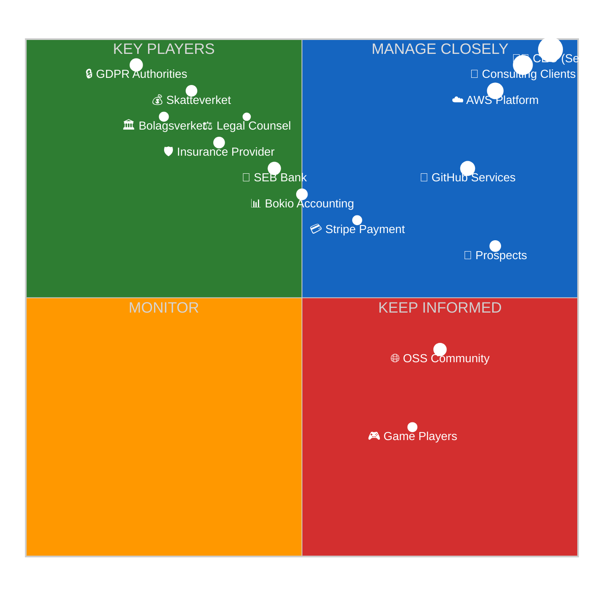

#### Strategic SWOT Analysis (Quadrant Format)
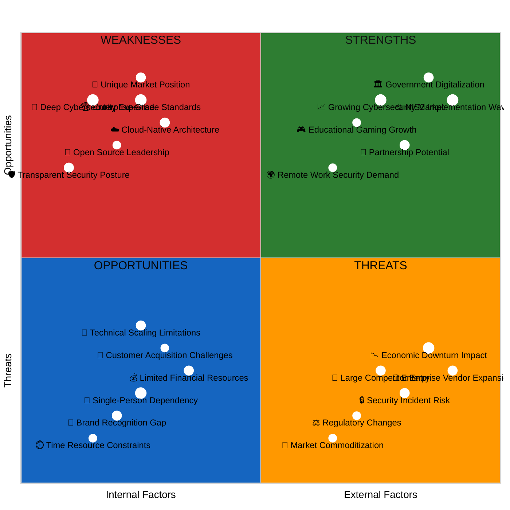

#### Process Flow (Risk Assessment Pattern)
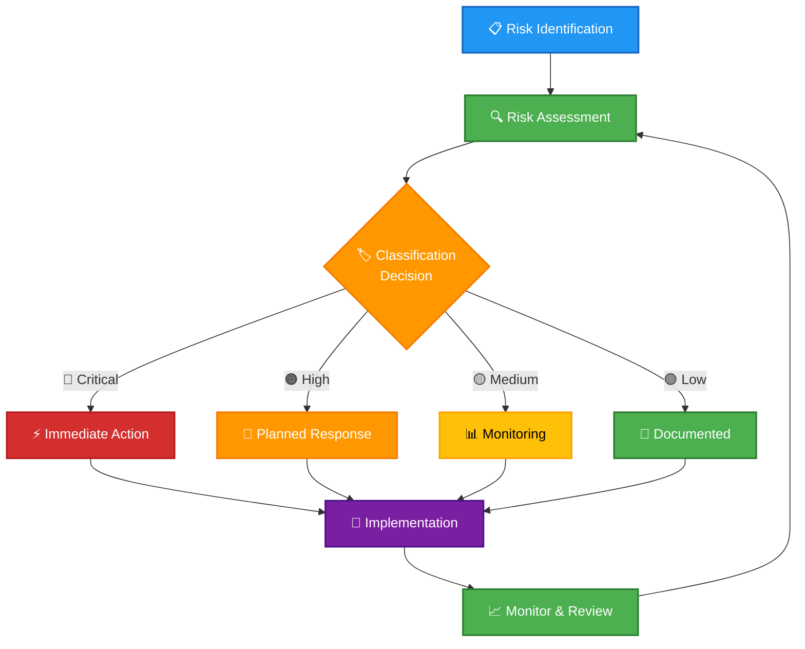

#### Sequence Diagram (Incident Response Communications)
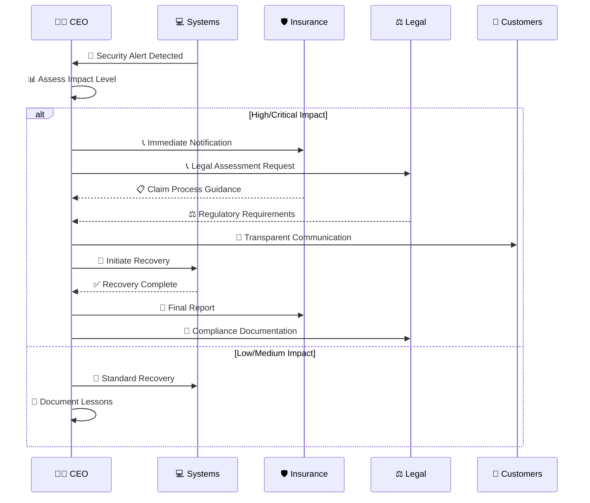

#### Timeline/Gantt (Implementation Pattern)
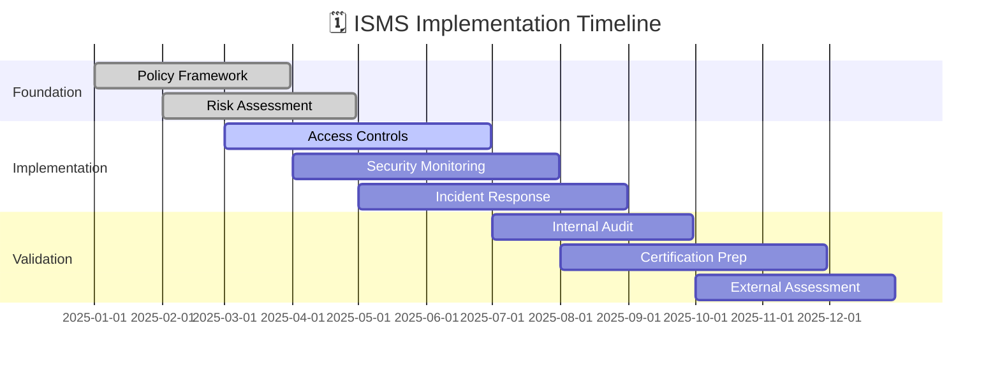

#### Mindmap (Security Framework)
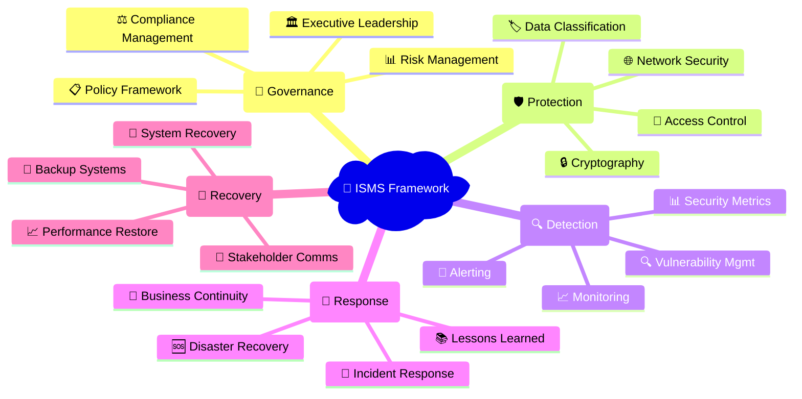

#### Entity Relationship (Asset Management)
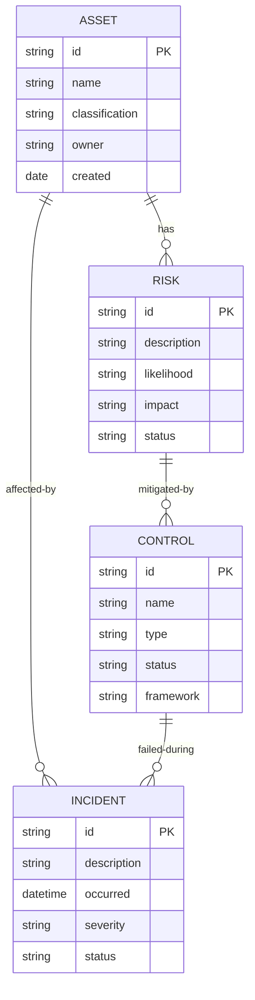

#### Pie Chart (Budget Allocation)
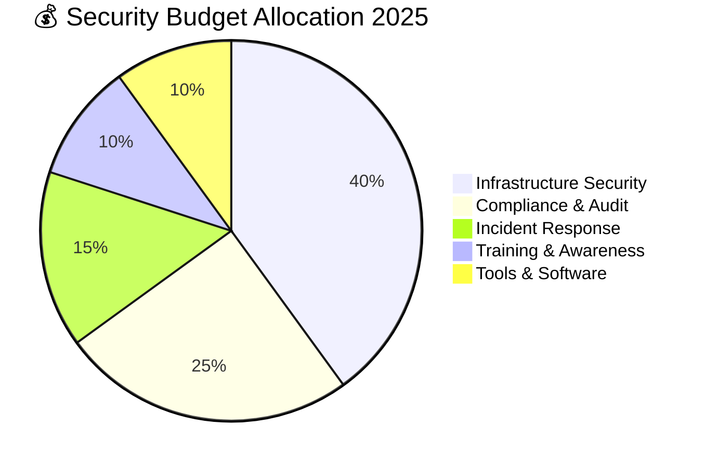

#### User Journey (Customer Onboarding)
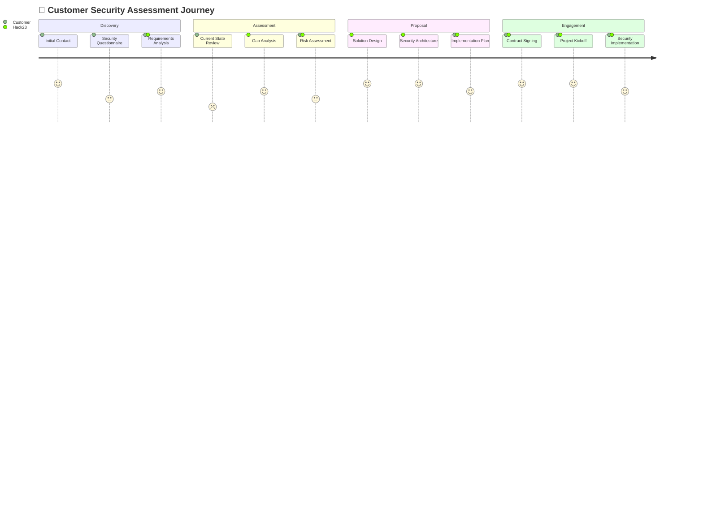

---

## 🎨 **Template Library**

#### Basic Process Flow Template
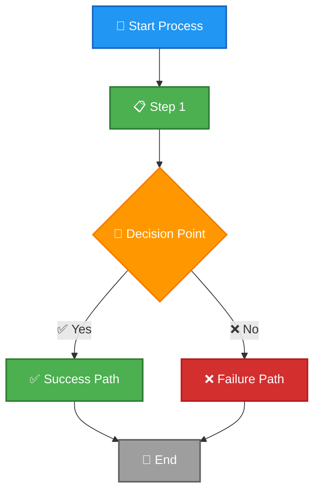

#### Stakeholder Relationship Template
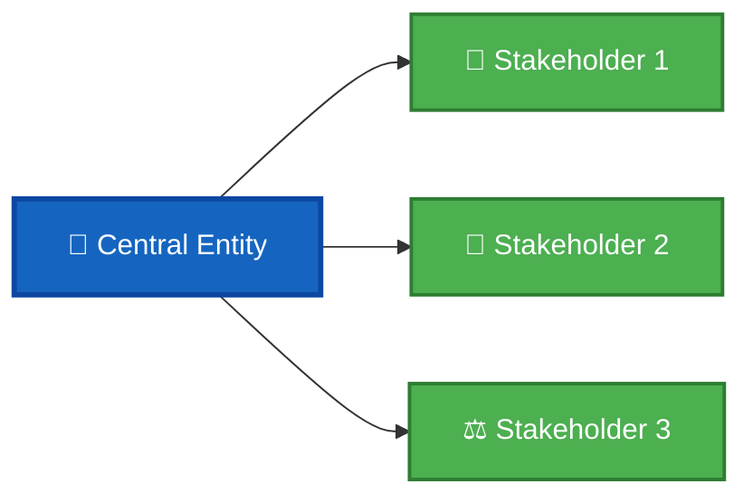

### 📋 Quality Checklist

Before publishing any Mermaid diagram, verify:

- [ ] **Color Consistency:** Matches ISMS color standards
- [ ] **Icon Usage:** Relevant and consistent emoji/symbols
- [ ] **Accessibility:** Sufficient contrast and alt text
- [ ] **Semantic Flow:** Logical information progression
- [ ] **Professional Appearance:** Clean, organized layout
- [ ] **Classification Alignment:** Colors match data classification
- [ ] **Documentation Link:** References to related policies
- [ ] **Mobile Responsive:** Readable on smaller screens

---

**📋 Document Control:**  
**✅ Approved by:** James Pether Sörling, CEO  
**📤 Distribution:** Public  
**🏷️ Classification:** [](https://github.com/Hack23/ISMS-PUBLIC/blob/main/CLASSIFICATION.md#confidentiality-levels)  
**📅 Effective Date:** 2025-08-28  
**⏰ Next Review:** 2026-08-28  
**🎯 Framework Compliance:** [](https://github.com/Hack23/ISMS-PUBLIC/blob/main/CLASSIFICATION.md) [](https://github.com/Hack23/ISMS-PUBLIC/blob/main/CLASSIFICATION.md) [](https://github.com/Hack23/ISMS-PUBLIC/blob/main/CLASSIFICATION.md)
