<p align="center">
  
</p>

<h1 align="center">🎨 Hack23 AB — ISMS Style Guide</h1>

<p align="center">
  <strong>Consistency and Clarity in Security Documentation</strong><br>
  <em>Ensuring Professional and Transparent ISMS Documentation</em>
</p>

<p align="center">
  <a href="#"></a>
  <a href="#"></a>
  <a href="#"></a>
  <a href="#"></a>
</p>

**📋 Document Owner:** CEO | **📄 Version:** 2.3 | **📅 Last Updated:** 2026-01-25 (UTC)  
**🔄 Review Cycle:** Annual | **⏰ Next Review:** 2027-01-25

---

## 🎯 **Purpose**

This style guide establishes the standard format and structure for all Information Security Management System (ISMS) documents at Hack23 AB. Its purpose is to ensure consistency, clarity, and professionalism across all policies, procedures, and records.

---

## 📄 **Standard Document Structure**

All ISMS documents MUST follow this structure to maintain uniformity.

### 1. **Header Section**

The header provides an at-a-glance overview of the document.

```markdown
<p align="center">
  
</p>

<h1 align="center">🔄 Hack23 AB — [Document Title]</h1>

<p align="center">
  <strong>🛡️ Tagline for the document</strong><br>
  <em>🎯 Sub-tagline emphasizing security and transparency</em>
</p>

<p align="center">
  <a href="#"></a>
  <a href="#"></a>
  <a href="#"></a>
  <a href="#"></a>
</p>

**📋 Document Owner:** CEO | **📄 Version:** 1.0 | **📅 Last Updated:** 2025-11-17 (UTC)  
**🔄 Review Cycle:** Annual | **⏰ Next Review:** 2026-11-17
```

### 2. **Purpose Statement**

A section quoting the CEO that connects the document's purpose to Hack23's core principles of transparency and security excellence.

### 3. **Main Content**

The body of the document, organized with clear headings, tables, and diagrams (MermaidJS).

### 4. **Related Documents**

A section linking to other relevant ISMS documents.

### 5. **Document Control Footer**

Every ISMS document MUST end with this standardized footer. This section is critical for version control, accountability, and compliance.

```markdown
---

**📋 Document Control:**  
**✅ Approved by:** James Pether Sörling, CEO  
**📤 Distribution:** [Audience - e.g., All Personnel, Key Suppliers]  
**🏷️ Classification:** [](./CLASSIFICATION.md#confidentiality-levels)  
**📅 Effective Date:** 2025-11-17  
**⏰ Next Review:** 2026-11-17  
**🯠Framework Compliance:** [](./CLASSIFICATION.md) [](./CLASSIFICATION.md) [](./CLASSIFICATION.md) [](./CLASSIFICATION.md)
```

---

## 📘 ISMS Markdown Style Essentials

### 1) Header and Badges (required, in this order)
- Centered logo img (192x192), then H1 with leading emoji.
- Subtitle line (bold + italic) with icons.
- Shields badges (centered): Owner • Version • Effective • Review.
- Document Owner/Version line below badges with icons.

Example:
```markdown
<p align="center">
  
</p>

<h1 align="center">🔐 Hack23 AB — Information Security Policy</h1>

<p align="center">
  <strong>🛡️ Security Through Transparency and Excellence</strong><br>
  <em>🎯 Enterprise-grade Security for Innovation-driven Consulting</em>
</p>

<p align="center">
  <a href="#"></a>
  <a href="#"></a>
  <a href="#"></a>
  <a href="#"></a>
</p>

**📋 Document Owner:** CEO | **📄 Version:** 1.0 | **📅 Last Updated:** 2025-11-17 (UTC)  
**🔄 Review Cycle:** Annual | **⏰ Next Review:** 2026-11-17
```

### 2) Related Documents section (mandatory)
- Title: “## 📚 Related Documents” (or “## 📚 **Related Documents**” retaining bold if used).
- Each item must use an icon + linked filename + optional short descriptor.
- Use relative links. Do not include self-references.


**IMPORTANT:** Since all ISMS policy documents are in the root directory, use `./` prefix for relative links (e.g., `./Information_Security_Policy.md`), NOT `../` which would go to the parent directory.

**Cross-Reference Validation:**
All internal markdown links are automatically validated by CI/CD to ensure:
- ✅ Target files exist in the repository
- ✅ Relative paths are correctly formed
- ✅ No self-references in Related Documents sections
- ✅ Links point to actual markdown files

Canonical list (pick items relevant to the document):
```markdown
## 📚 Related Documents
- [🔐 Information Security Policy](./Information_Security_Policy.md)
- [🔑 Access Control Policy](./Access_Control_Policy.md)
- [🌐 Network Security Policy](./Network_Security_Policy.md)
- [📝 Change Management Policy](./Change_Management.md)
- [💾 Backup & Recovery Policy](./Backup_Recovery_Policy.md)
- [🆘 Disaster Recovery Plan](./Disaster_Recovery_Plan.md)
- [🔄 Business Continuity Plan](./Business_Continuity_Plan.md)
- [💻 Asset Register](./Asset_Register.md)
- [📉 Risk Register](./Risk_Register.md)
- [🤝 Third-Party Management](./Third_Party_Management.md)
- [🏷️ Data Classification Policy](./Data_Classification_Policy.md)
- [🔒 Cryptography Policy](./Cryptography_Policy.md)
- [🛠️ Secure Development Policy](./Secure_Development_Policy.md)
- [📊 Security Metrics](./Security_Metrics.md)
- [🌐 ISMS Transparency Plan](./ISMS_Transparency_Plan.md)
```

### 3) Document Control footer (required)
- Always include Approval/Distribution/Classification/Effective/Next Review with icons.
- Classification badge must link to the anchor in CLASSIFICATION.md.

Example:
```markdown
**📋 Document Control:**  
**✅ Approved by:** James Pether Sörling, CEO  
**📤 Distribution:** All Personnel  
**🏷️ Classification:** [](./CLASSIFICATION.md#confidentiality-levels)  
**📅 Effective Date:** 2025-11-17  
**⏰ Next Review:** 2026-11-17  
**🯠Framework Compliance:** [](./CLASSIFICATION.md) [](./CLASSIFICATION.md) [](./CLASSIFICATION.md)
```

### 4) Icon and link conventions
- Use consistent icons:
  - 🔐 InfoSec • 🔑 Access • 🌐 Network • 📝 Change • 💾 Backup • 🆘 DRP • 🔄 BCP
  - 💻 Asset • 📉 Risk • 🤝 Third-Party • 🏷️ Data Class • 🔒 Crypto • 🛠️ SDLC • 📊 Metrics • 🌐 Transparency
- Avoid linking to the current document in Related Documents.
- Keep short descriptors after a hyphen where helpful.

---

## 🎨 **Icon Reference Guide**

### 📋 Document Type Icons
Based on analysis of all ISMS documentation:

| Document Type | Primary Icon | Alternative Icons | Usage Examples |
|---------------|--------------|-------------------|-----------------|
| **Policies** | 🔐 | 🛡️ 📜 | Information Security Policy, Access Control Policy |
| **Plans** | 📋 | 🗓️ 📅 | Business Continuity Plan, Disaster Recovery Plan |
| **Procedures** | ⚙️ | 🔧 🛠️ | Change Management, Vulnerability Management |
| **Registers** | 📊 | 💻 📉 | Asset Register, Risk Register |
| **Frameworks** | 🏷️ | 📊 🎯 | Classification Framework, Security Metrics |
| **Assessments** | 📝 | 🔍 📋 | Risk Assessment Methodology, CRA Conformity |
| **Business Docs** | 📈 | 💼 🏢 | Business Strategy, Marketing Strategy |
| **Legal Docs** | 📑 | ⚖️ 📜 | Articles of Association, Annual Accounts |

### 🔐 Security Domain Icons

| Security Domain | Icon | Usage Context | Examples |
|-----------------|------|---------------|----------|
| **Information Security** | 🔐 | Overall security policies | Information Security Policy |
| **Access Control** | 🔑 | Identity and access management | Access Control Policy |
| **Network Security** | 🌐 | Network protection and monitoring | Network Security Policy |
| **Cryptography** | 🔒 | Encryption and key management | Cryptography Policy |
| **Data Protection** | 🏷️ | Data classification and handling | Data Classification Policy |
| **Application Security** | 🛠️ | Secure development practices | Secure Development Policy |
| **Physical Security** | 🏢 | Physical access and protection | Office security references |
| **Incident Response** | 🚨 | Security incident management | Incident Response Plan |
| **Vulnerability Management** | 🔍 | Vulnerability assessment | Vulnerability Management |
| **Backup & Recovery** | 💾 | Data protection and recovery | Backup Recovery Policy |

### 🏢 Business Process Icons

| Process Type | Icon | Badge Reference | Usage |
|--------------|------|-----------------|-------|
| **Finance** | 💰 | [] | Financial operations |
| **Operations** | ⚙️ | [] | Business operations |
| **Legal** | ⚖️ | [] | Legal compliance |
| **Sales** | 🤠| [] | Customer relations |
| **Marketing** | 📢 | [] | Brand management |
| **Human Resources** | 👥 | [] | Employee management |
| **Executive** | 🏛️ | [] | Strategic planning |

### 🏗️ Technical Project Icons

| Project Type | Icon | Badge Reference | Usage |
|--------------|------|-----------------|-------|
| **Core Infrastructure** | 🏗️ | [] | Critical systems |
| **Security Tools** | 🛡️ | [] | Security assessment |
| **Compliance Platform** | 📋 | [] | Regulatory systems |
| **Data Analytics** | 📊 | [] | Data processing |
| **API Services** | 🔌 | [] | Backend services |
| **Frontend Apps** | 🖥️ | [] | User interfaces |
| **Development Tools** | 🛠️ | [] | Development utilities |

### 📊 Operational Icons

| Function | Icon | Usage Context | Examples |
|----------|------|---------------|----------|
| **Monitoring** | 📈 | Performance tracking | Security Metrics, KPIs |
| **Reporting** | 📋 | Status and compliance reporting | Compliance Checklist |
| **Assessment** | 🔍 | Evaluation and analysis | Risk Assessment |
| **Documentation** | 📚 | Knowledge management | Related Documents |
| **Communication** | 📢 | Notifications and alerts | Incident communications |
| **Training** | 🎓 | Education and awareness | Security training |
| **Testing** | 🧪 | Validation and verification | Recovery testing |
| **Automation** | 🤖 | Process automation | CI/CD, automated controls |

### ⏱️ Time and Priority Icons

| Concept | Icon | Usage | Examples |
|---------|------|-------|----------|
| **Immediate** | ⚡ | Urgent actions | Incident response |
| **Critical** | 🔴 | High priority | Critical vulnerabilities |
| **High** | 🟠 | Important | High-priority risks |
| **Medium** | 🟡 | Standard | Medium-priority tasks |
| **Low** | 🟢 | Lower priority | Low-impact issues |
| **Scheduled** | 📅 | Planned activities | Review schedules |
| **Continuous** | 🔄 | Ongoing processes | Monitoring activities |
| **Deadline** | ⏰ | Time-sensitive | Compliance deadlines |

### 🎯 Status and Quality Icons

| Status | Icon | Usage | Context |
|--------|------|-------|---------|
| **Approved** | ✅ | Completed/approved items | Document approval |
| **In Progress** | 🚀 | Active work | Project status |
| **Planned** | ⏭️ | Future activities | Roadmap items |
| **Warning** | ⚠️ | Caution needed | Risk warnings |
| **Error** | ❌ | Problems/failures | Failed tests |
| **Success** | 🏆 | Achievements | Successful implementations |
| **Review** | 🔍 | Needs review | Pending reviews |
| **Update** | 🔄 | Needs updating | Document updates |

### 🌍 Geographic and Scope Icons

| Scope | Icon | Usage | Examples |
|-------|------|-------|----------|
| **Global** | 🌍 | Worldwide scope | Global policies |
| **Regional** | 🌐 | Regional implementation | EU regulations |
| **National** | 🇸🇪 | Country-specific | Swedish compliance |
| **Local** | 🏢 | Organization-specific | Internal policies |
| **Personal** | 👤 | Individual level | Personal data |
| **Public** | 🌟 | Public information | Open source |
| **Internal** | 🔒 | Internal use | Confidential docs |
| **External** | 🔓 | External sharing | Public policies |

### 💼 Business Value Icons

| Value Type | Icon | Usage | Context |
|------------|------|-------|---------|
| **Revenue** | 💰 | Financial benefits | Revenue impact |
| **Cost Savings** | 💸 | Efficiency gains | Cost optimization |
| **Risk Reduction** | 🛡️ | Security benefits | Risk mitigation |
| **Competitive Advantage** | 🏆 | Market position | Differentiation |
| **Trust Enhancement** | 🤝 | Stakeholder confidence | Trust building |
| **Innovation** | 💡 | New capabilities | Innovation enablement |
| **Efficiency** | ⚙️ | Process improvement | Operational efficiency |
| **Quality** | 📊 | Decision support | Data quality |

### 🎨 Product and Service Icons

| Product/Service | Icon | Usage | Examples |
|-----------------|------|-------|----------|
| **Consulting** | 🤝 | Advisory services | Cybersecurity consulting |
| **Gaming** | 🎮 | Gaming products | Black Trigram |
| **Government** | 🏛️ | Public sector | Citizen Intelligence Agency |
| **Compliance** | 📋 | Compliance tools | CIA Compliance Manager |
| **Open Source** | 🔓 | OSS projects | GitHub repositories |
| **Education** | 🎓 | Training/learning | Educational content |
| **Security** | 🛡️ | Security products | Security tools |
| **Analytics** | 📊 | Data analysis | Business intelligence |

---

## 📝 **Icon Usage Guidelines**

### ✅ Do's
- Use consistent icons across related documents
- Match icons to the primary function or purpose
- Combine icons logically (e.g., 🔐📋 for security policies)
- Use established badge patterns for classifications
- Include icons in headings for better navigation
- Use status icons to show progress and priorities

### ❌ Don'ts
- Mix similar icons for the same concept
- Overuse icons that reduce readability
- Use ambiguous icons without context
- Change established icon meanings mid-document
- Use conflicting color schemes with classification badges
- Forget icons in document control sections

### 🎯 Icon Selection Priority
1. **Document Type** - Primary classification icon
2. **Security Domain** - Specific security area
3. **Business Process** - Related business function
4. **Status/Priority** - Current state indication
5. **Value/Benefit** - Business impact representation

### 📊 Badge Integration
When using classification badges, ensure icons complement rather than compete:
- Use small icons (emoji) alongside badges
- Position icons before text, badges after
- Maintain color harmony between icons and badges
- Use consistent sizing across similar elements

---

## 🎨 **Mermaid Diagram Guidelines**

### 🎯 Diagram Standards

All ISMS documents MUST use consistent Mermaid diagrams with standardized color coding and styling for professional presentation and accessibility.

#### 📋 Diagram Types & Usage

| Diagram Type | Use Case | Color Theme | Examples |
|--------------|----------|-------------|----------|
| **Flowchart** | Processes, decision trees | Blue-green gradient | Risk assessment, incident response |
| **Graph** | Relationships, dependencies | Multi-color categorical | Stakeholder mapping, architecture |
| **Pie** | Distributions, allocations | Categorical colors | Budget allocation, risk distribution |
| **Gantt** | Timelines, project planning | Status-based colors | Implementation roadmaps |
| **Mindmap** | Concepts, frameworks | Hierarchical colors | Strategic planning, classification |
| **Sequence** | Interactions, workflows | Actor-based colors | Communication flows |

#### 🎨 Color Palette Standards

#### Primary Color Scheme (Classification-Aligned)
```yaml
Critical/Extreme:  #D32F2F  # Red
High/Very High:    #FF9800  # Orange  
Medium/Moderate:   #FFC107  # Amber
Low/Standard:      #4CAF50  # Green
Public/Minimal:    #9E9E9E  # Grey
```

#### Secondary Color Scheme (Process Types)
```yaml
Finance:     #1565C0  # Dark Blue
Operations:  #8D6E63  # Brown
Legal:       #C62828  # Dark Red
Sales:       #2E7D32  # Dark Green
Marketing:   #7B1FA2  # Purple
Security:    #D32F2F  # Red
Technical:   #455A64  # Blue Grey
```

#### Status Color Scheme
```yaml
Active/Success:    #4CAF50  # Green
Warning/Pending:   #FF9800  # Orange
Error/Critical:    #D32F2F  # Red
Info/Neutral:      #2196F3  # Blue
Disabled/N/A:      #9E9E9E  # Grey
```

### 📊 Diagram Examples

#### Stakeholder Mapping (Quadrant Format)

```mermaid
%%{init: {
  "theme": "dark",
  "themeVariables": {
    "quadrant1Fill": "#1565C0",
    "quadrant2Fill": "#2E7D32",
    "quadrant3Fill": "#FF9800", 
    "quadrant4Fill": "#D32F2F",
    "quadrantTitleFill": "#ffffff",
    "quadrantPointFill": "#ffffff",
    "quadrantPointTextFill": "#ffffff",
    "quadrantXAxisTextFill": "#ffffff",
    "quadrantYAxisTextFill": "#ffffff"
  },
  "quadrantChart": {
    "chartWidth": 700,
    "chartHeight": 700,
    "pointLabelFontSize": 14,
    "titleFontSize": 22,
    "quadrantLabelFontSize": 18,
    "xAxisLabelFontSize": 16,
    "yAxisLabelFontSize": 16
  }
}}%%
quadrantChart
    title 🤝 HACK23 AB STAKEHOLDER INFLUENCE-INVOLVEMENT MATRIX
    x-axis Low Involvement --> High Involvement
    y-axis Low Influence --> High Influence
    quadrant-1 MANAGE CLOSELY
    quadrant-2 KEY PLAYERS
    quadrant-3 MONITOR
    quadrant-4 KEEP INFORMED
    "🏦 SEB Bank": [0.45, 0.75] radius: 8
    "📊 Bokio Accounting": [0.50, 0.70] radius: 7
    "🛡️ Insurance Provider": [0.35, 0.80] radius: 7
    "☁️ AWS Platform": [0.85, 0.90] radius: 10
    "📝 GitHub Services": [0.80, 0.75] radius: 9
    "💳 Stripe Payment": [0.60, 0.65] radius: 6
    "🤝 Consulting Clients": [0.90, 0.95] radius: 12
    "🌐 OSS Community": [0.75, 0.40] radius: 8
    "🎯 Prospects": [0.85, 0.60] radius: 7
    "🏛️ Bolagsverket": [0.25, 0.85] radius: 6
    "💰 Skatteverket": [0.30, 0.90] radius: 7
    "🔒 GDPR Authorities": [0.20, 0.95] radius: 8
    "⚖️ Legal Counsel": [0.40, 0.85] radius: 5
    "🎮 Game Players": [0.70, 0.25] radius: 6
    "👨‍💼 CEO (Self)": [0.95, 0.98] radius: 15
```


#### Strategic SWOT Analysis (Quadrant Format)

```mermaid
%%{init: {
  "theme": "neutral",
  "themeVariables": {
    "quadrant1Fill": "#2E7D32",
    "quadrant2Fill": "#D32F2F", 
    "quadrant3Fill": "#1565C0",
    "quadrant4Fill": "#FF9800",
    "quadrantTitleFill": "#ffffff",
    "quadrantPointFill": "#ffffff",
    "quadrantPointTextFill": "#000000",
    "quadrantXAxisTextFill": "#000000",
    "quadrantYAxisTextFill": "#000000"
  },
  "quadrantChart": {
    "chartWidth": 700,
    "chartHeight": 700,
    "pointLabelFontSize": 12,
    "titleFontSize": 20,
    "quadrantLabelFontSize": 16,
    "xAxisLabelFontSize": 14,
    "yAxisLabelFontSize": 14
  }
}}%%
quadrantChart
    title 🎯 HACK23 AB STRATEGIC SWOT ANALYSIS
    x-axis Internal Factors --> External Factors
    y-axis Threats --> Opportunities
    quadrant-1 STRENGTHS
    quadrant-2 WEAKNESSES
    quadrant-3 OPPORTUNITIES
    quadrant-4 THREATS
    "🔐 Deep Cybersecurity Expertise": [0.15, 0.85] radius: 8
    "🎯 Unique Market Position": [0.25, 0.90] radius: 7
    "☁️ Cloud-Native Architecture": [0.30, 0.80] radius: 7
    "🌟 Open Source Leadership": [0.20, 0.75] radius: 6
    "🛡️ Transparent Security Posture": [0.10, 0.70] radius: 7
    "🏆 Enterprise-Grade Standards": [0.25, 0.85] radius: 8
    "👤 Single-Person Dependency": [0.25, 0.20] radius: 8
    "💰 Limited Financial Resources": [0.35, 0.25] radius: 7
    "📢 Brand Recognition Gap": [0.20, 0.15] radius: 7
    "🤝 Customer Acquisition Challenges": [0.30, 0.30] radius: 6
    "⏱️ Time Resource Constraints": [0.15, 0.10] radius: 6
    "🔧 Technical Scaling Limitations": [0.25, 0.35] radius: 7
    "📈 Growing Cybersecurity Market": [0.75, 0.85] radius: 8
    "🏛️ Government Digitalization": [0.85, 0.90] radius: 7
    "🎮 Educational Gaming Growth": [0.70, 0.80] radius: 6
    "🤝 Partnership Potential": [0.80, 0.75] radius: 7
    "⚖️ NIS2 Implementation Wave": [0.90, 0.85] radius: 8
    "🌍 Remote Work Security Demand": [0.65, 0.70] radius: 6
    "🏢 Large Competitor Entry": [0.75, 0.25] radius: 7
    "📉 Economic Downturn Impact": [0.85, 0.30] radius: 8
    "⚖️ Regulatory Changes": [0.70, 0.15] radius: 6
    "🔒 Security Incident Risk": [0.80, 0.20] radius: 7
    "💼 Enterprise Vendor Expansion": [0.90, 0.25] radius: 7
    "🎯 Market Commoditization": [0.65, 0.10] radius: 6
```


#### Process Flow (Risk Assessment Pattern)

```mermaid
flowchart TD
    START[📋 Risk Identification] --> ASSESS[🔍 Risk Assessment]
    ASSESS --> CLASSIFY{🏷️ Classification<br/>Decision}
    
    CLASSIFY -->|🔴 Critical| CRITICAL[⚡ Immediate Action]
    CLASSIFY -->|🟠 High| HIGH[📅 Planned Response]
    CLASSIFY -->|🟡 Medium| MEDIUM[📊 Monitoring]
    CLASSIFY -->|🟢 Low| LOW[📝 Documented]
    
    CRITICAL --> IMPLEMENT[🚀 Implementation]
    HIGH --> IMPLEMENT
    MEDIUM --> IMPLEMENT
    LOW --> IMPLEMENT
    
    IMPLEMENT --> MONITOR[📈 Monitor & Review]
    MONITOR --> ASSESS
    
    classDef start fill:#2196F3,stroke:#1565C0,stroke-width:2px,color:#ffffff
    classDef process fill:#4CAF50,stroke:#2E7D32,stroke-width:2px,color:#ffffff
    classDef decision fill:#FF9800,stroke:#F57C00,stroke-width:2px,color:#ffffff
    classDef critical fill:#D32F2F,stroke:#B71C1C,stroke-width:2px,color:#ffffff
    classDef high fill:#FF9800,stroke:#F57C00,stroke-width:2px,color:#ffffff
    classDef medium fill:#FFC107,stroke:#FFA000,stroke-width:2px,color:#000000
    classDef low fill:#4CAF50,stroke:#2E7D32,stroke-width:2px,color:#ffffff
    classDef action fill:#7B1FA2,stroke:#4A148C,stroke-width:2px,color:#ffffff
    
    class START start
    class ASSESS,MONITOR process
    class CLASSIFY decision
    class CRITICAL critical
    class HIGH high
    class MEDIUM medium
    class LOW low
    class IMPLEMENT action
```


#### Sequence Diagram (Incident Response Communications)

```mermaid
sequenceDiagram
    participant CEO as 👨‍💼 CEO
    participant Systems as 💻 Systems
    participant Insurance as 🛡️ Insurance
    participant Legal as ⚖️ Legal
    participant Customers as 🤝 Customers
    
    Systems->>CEO: 🚨 Security Alert Detected
    CEO->>CEO: 📊 Assess Impact Level
    
    alt High/Critical Impact
        CEO->>Insurance: 📞 Immediate Notification
        CEO->>Legal: 📞 Legal Assessment Request
        
        Insurance-->>CEO: 📋 Claim Process Guidance
        Legal-->>CEO: ⚖️ Regulatory Requirements
        
        CEO->>Customers: 📧 Transparent Communication
        CEO->>Systems: 🔧 Initiate Recovery
        
        Systems-->>CEO: ✅ Recovery Complete
        CEO->>Insurance: 📄 Final Report
        CEO->>Legal: 📑 Compliance Documentation
    else Low/Medium Impact
        CEO->>Systems: 🔧 Standard Recovery
        CEO->>CEO: 📝 Document Lessons
    end
```


#### Timeline/Gantt (Implementation Pattern)


#### Mindmap (Security Framework)

```mermaid
mindmap
  root)🔐 ISMS Framework(
    (🎯 Governance)
      🏛️ Executive Leadership
      📋 Policy Framework
      ⚖️ Compliance Management
      📊 Risk Management
    (🛡️ Protection)
      🔑 Access Control
      🔒 Cryptography
      🌐 Network Security
      🏷️ Data Classification
    (🔍 Detection)
      📈 Monitoring
      🚨 Alerting
      🔍 Vulnerability Mgmt
      📊 Security Metrics
    (🚀 Response)
      🚨 Incident Response
      🔄 Business Continuity
      🆘 Disaster Recovery
      📚 Lessons Learned
    (🔄 Recovery)
      💾 Backup Systems
      🔧 System Recovery
      📈 Performance Restore
      🤝 Stakeholder Comms
```


#### Entity Relationship (Asset Management)


#### Pie Chart (Budget Allocation)


#### User Journey (Customer Onboarding)

```mermaid
journey
    title 🤝 Customer Security Assessment Journey
    section Discovery
      Initial Contact: 5: Customer
      Security Questionnaire: 3: Customer
      Requirements Analysis: 4: Customer, Hack23
    section Assessment
      Current State Review: 2: Customer
      Gap Analysis: 4: Hack23
      Risk Assessment: 3: Customer, Hack23
    section Proposal
      Solution Design: 5: Hack23
      Security Architecture: 5: Hack23
      Implementation Plan: 4: Customer, Hack23
    section Engagement
      Contract Signing: 5: Customer, Hack23
      Project Kickoff: 5: Customer, Hack23
      Security Implementation: 4: Customer, Hack23
```


---

## 🎨 **Template Library**

#### Basic Process Flow Template

```mermaid
flowchart TD
    START[🚀 Start Process] --> STEP1[📋 Step 1]
    STEP1 --> DECISION{🤔 Decision Point}
    DECISION -->|✅ Yes| SUCCESS[✅ Success Path]
    DECISION -->|❌ No| FAILURE[❌ Failure Path]
    SUCCESS --> FINISH[🏁 End]
    FAILURE --> FINISH
    
    classDef start fill:#2196F3,stroke:#1565C0,stroke-width:2px,color:#ffffff
    classDef process fill:#4CAF50,stroke:#2E7D32,stroke-width:2px,color:#ffffff
    classDef decision fill:#FF9800,stroke:#F57C00,stroke-width:2px,color:#ffffff
    classDef success fill:#4CAF50,stroke:#2E7D32,stroke-width:2px,color:#ffffff
    classDef failure fill:#D32F2F,stroke:#B71C1C,stroke-width:2px,color:#ffffff
    classDef finish fill:#9E9E9E,stroke:#616161,stroke-width:2px,color:#ffffff
    
    class START start
    class STEP1 process
    class DECISION decision
    class SUCCESS success
    class FAILURE failure
    class FINISH finish
```


#### Stakeholder Relationship Template

```mermaid
graph LR
    CENTER[🎯 Central Entity] --> STAKE1[👤 Stakeholder 1]
    CENTER --> STAKE2[🏢 Stakeholder 2]
    CENTER --> STAKE3[⚖️ Stakeholder 3]
    
    classDef center fill:#1565C0,stroke:#0D47A1,stroke-width:3px,color:#ffffff
    classDef stakeholder fill:#4CAF50,stroke:#2E7D32,stroke-width:2px,color:#ffffff
    
    class CENTER center
    class STAKE1,STAKE2,STAKE3 stakeholder
```


### 📋 Quality Checklist

Before publishing any Mermaid diagram, verify:

- [ ] **Color Consistency:** Matches ISMS color standards
- [ ] **Icon Usage:** Relevant and consistent emoji/symbols
- [ ] **Accessibility:** Sufficient contrast and alt text
- [ ] **Semantic Flow:** Logical information progression
- [ ] **Professional Appearance:** Clean, organized layout
- [ ] **Classification Alignment:** Colors match data classification
- [ ] **Documentation Link:** References to related policies
- [ ] **Mobile Responsive:** Readable on smaller screens

For comprehensive quality assurance across all document aspects (header, content, footer, links, etc.), use the [📋 ISMS QA Checklist](./ISMS_QA_CHECKLIST.md).

---

## 📊 **Diagram Type Selection Guide**

Choose the right diagram type based on what you're communicating:

| Information Type | Recommended Diagram | Use When | Example Documents |
|------------------|-------------------|----------|-------------------|
| **Process Flow / Decision Logic** | `flowchart TD` | Showing sequential steps, decision points, branching logic | Incident_Response_Plan.md, Risk_Assessment_Methodology.md |
| **Strategic Positioning** | `quadrantChart` | Comparing items across two dimensions (e.g., impact vs likelihood, internal vs external) | SWOT.md, Risk_Register.md |
| **System Interactions** | `sequenceDiagram` | Showing communication between actors/systems over time | Incident_Response_Plan.md, Information_Security_Strategy.md |
| **Project Timeline** | `gantt` | Displaying schedules, milestones, and dependencies | Information_Security_Strategy.md (roadmap) |
| **Concept Hierarchy** | `mindmap` | Organizing related concepts, frameworks, or taxonomies | Asset_Register.md, SECURITY_ARCHITECTURE.md |
| **Data Relationships** | `erDiagram` | Showing entity relationships and data models | Asset_Register.md, Risk_Register.md |
| **Distribution / Proportions** | `pie` | Showing percentage breakdown or allocation | Budget, resource allocation sections |
| **User Experience** | `journey` | Mapping user/stakeholder experience through a process | Customer onboarding, compliance assessment |

**Selection Principles:**

- **Simplicity First:** Choose the simplest diagram type that conveys your message
- **Audience Alignment:** Match diagram complexity to stakeholder technical level
- **Cross-Reference Consistency:** Use same diagram type for similar concepts across documents
- **Accessibility:** Ensure diagrams are understandable without color (use labels, shapes, patterns)


---

## 📏 **Diagram Complexity Guidelines**

**Maximum Complexity Targets:**

| Diagram Type | Max Nodes/Elements | Max Nesting Levels | Max Width (chars) | When to Split |
|--------------|-------------------|-------------------|-------------------|---------------|
| **Flowchart** | 15-20 nodes | 3 levels | 100 chars | >20 nodes or >3 decision branches |
| **Sequence** | 6-8 participants | 15-20 interactions | 80 chars | >8 actors or >20 messages |
| **Quadrant** | 25-30 points | N/A | Chart-specific | >30 points becomes unreadable |
| **Mindmap** | 20-25 nodes | 4 levels | 60 chars per node | >4 levels deep |
| **Gantt** | 15-20 tasks | 3 levels | 100 chars | >20 tasks |

**Splitting Strategies:**

- **Hierarchical:** Create overview diagram linking to detailed sub-diagrams
- **Sequential:** Split into phases (e.g., "Incident Detection" → "Incident Response" → "Incident Recovery")
- **Categorical:** Group by domain (e.g., separate diagrams for "Network Security" vs "Application Security")


**Example: Splitting an Overloaded Flowchart**

Instead of one 30-node diagram, create:

```markdown
## Overview: Risk Management Workflow (High-Level)
[Simple 10-node diagram showing: Identify → Assess → Treat → Monitor]

## Detail: Risk Assessment Process
[15-node flowchart showing detailed assessment steps]

## Detail: Risk Treatment Options
[12-node flowchart showing treatment selection logic]
```

---

## 🔗 **Cross-Document Diagram References**

**Linking Strategy:**

When diagrams span multiple documents, use consistent linking patterns:

#### 1. Anchor Links for Same-Document Navigation

```markdown
See [Risk Management Workflow](#-risk-management-workflow) below for detailed process.
```

#### 2. Cross-Document Mermaid References

```markdown
For risk scoring methodology, see the [Risk Assessment Process in Risk_Assessment_Methodology.md](./Risk_Assessment_Methodology.md#-risk-assessment-process).
```

#### 3. Narrative Transitions Between Diagrams

```markdown
This strategic framework (diagram above) is implemented through the [Product Security Architecture in Information_Security_Strategy.md](./Information_Security_Strategy.md#️-product-security-architecture-comparison).
```

**Consistency Rules:**

- Use same node IDs for same concepts across documents (e.g., `RISK_ASSESS`, `INCIDENT`, `CEO`)
- Maintain consistent color schemes per STYLE_GUIDE.md standards
- Reference diagrams by section header, not "above" or "below" (for portability)

---

## ♿ **Diagram Accessibility**

**Color-Blind Considerations:**

- **Don't rely solely on color** to convey information (use shapes, labels, patterns)
- **Test with color-blind simulators** (e.g., Coblis Color Blindness Simulator)
- **Provide text alternatives** in surrounding paragraphs

### Example: Accessible Status Indicators

```markdown
<!-- ❌ Bad: Color-only status -->
node1[Task] --> node2[Complete]:::green
node2 --> node3[Failed]:::red

<!-- ✅ Good: Color + Symbol + Label -->
node1[📋 Task] --> node2[✅ Complete: Task A]:::green
node2 --> node3[❌ Failed: Task B]:::red
```

**Alt-Text Best Practices:**

- **Always provide** narrative description of diagram content after the diagram
- **Format:** "**Key Takeaways:** - [Bullet list of main points]"
- **Recommended format example:**

```markdown
\```mermaid
[Quadrant diagram showing SWOT analysis]
\```

**Key Takeaways:**

- **Strengths:** Deep cybersecurity expertise, transparent ISMS, cloud-native architecture
- **Weaknesses:** Single-person dependency, limited financial resources
- **Opportunities:** NIS2 implementation wave, EU CRA compliance demand
- **Threats:** Large competitor entry, economic downturn
```

---

## 🔄 **Diagram Versioning and Evolution**

**When to Update Diagrams:**

- Process changes (add/remove steps)
- New framework integration (add compliance mappings)
- Stakeholder feedback (clarity improvements)
- Quarterly/annual policy reviews

**Update Strategy:**

1. **Preserve Anchors:** Don't change diagram section header anchors (breaks external links)
2. **Document Changes:** Add version note in surrounding text
3. **Maintain Backward Compatibility:** If removing nodes, add "deprecated" note

### Example: Evolving a Diagram

```markdown
<!-- Version 1.0 (2025-01-01) -->

## 🔄 Risk Management Workflow

\```mermaid
flowchart TD
    IDENTIFY --> ASSESS
    ASSESS --> TREAT
    TREAT --> MONITOR
\```

<!-- Version 1.1 (2025-06-01) - Added AI agent triage -->

## 🔄 Risk Management Workflow

**Updated 2025-06-01:** Added AI agent triage step between Identify and Assess phases.

\```mermaid
flowchart TD
    IDENTIFY --> AI_TRIAGE[🤖 AI Agent Triage]
    AI_TRIAGE --> ASSESS
    ASSESS --> TREAT
    TREAT --> MONITOR
\```
```

**Diagram Naming Conventions:**

- **Node IDs:** Use UPPERCASE_UNDERSCORE format (e.g., `RISK_ASSESS`, `CEO_APPROVAL`)
- **Class Names:** Use lowercase hyphen format (e.g., `high-priority`, `approved-status`)
- **Section Anchors:** Keep stable over time; use descriptive names (e.g., `#-risk-management-workflow`)

---

## ❌ **Diagram Anti-Patterns (What NOT to Do)**

| Anti-Pattern | Problem | Solution |
|--------------|---------|----------|
| **Color-Only Differentiation** | Inaccessible to color-blind users | Add icons, labels, patterns |
| **Too Many Decision Branches** | Analysis paralysis | Consolidate similar branches, split diagram |
| **Inconsistent Node IDs** | Confusion across documents | Use standard IDs (e.g., `CEO`, `RISK_ASSESS`) |
| **Overly Abstract Labels** | Unclear meaning | Use descriptive, action-oriented labels |
| **Missing Context** | Diagram stands alone | Provide narrative introduction and key takeaways |
| **Unlinked References** | Dead ends | Every referenced diagram should be linkable |
| **Diagram-in-Diagram** | Mermaid limitations | Split into separate diagrams with cross-links |
| **Temporal References** | "Above" or "below" breaks portability | Reference by section header or anchor |
| **Excessive Nesting** | Readability issues | Flatten structure or split into multiple diagrams |
| **Generic Node Names** | Lacks specificity | Use domain-specific, meaningful names |

### Example: Avoiding Over-Complexity

```markdown
<!-- ❌ Bad: 40-node monolithic flowchart -->
\```mermaid
flowchart TD
    [... 40 nodes in single diagram ...]
\```

<!-- ✅ Good: Split into focused diagrams -->

## Overview: Risk Management

\```mermaid
flowchart TD
    [... 10-node high-level view ...]
\```

## Detail: Risk Assessment

\```mermaid
flowchart TD
    [... 15-node assessment detail ...]
\```
```

---

## 📱 **Mobile Responsiveness Guidelines**

**Diagram Sizing for Small Screens:**

- **Max Width:** Keep diagrams under 800px width for mobile readability
- **Orientation:** Prefer vertical (`TD`) over horizontal (`LR`) layouts for mobile
- **Font Size:** Use minimum 12px font size in Mermaid config
- **Touch Targets:** Ensure clickable elements are at least 44x44px

**Responsive Diagram Patterns:**

| Device Type | Recommended Approach | Example |
|-------------|---------------------|---------|
| **Desktop (>1024px)** | Full complexity allowed | Quadrant chart with 25+ points |
| **Tablet (768-1024px)** | Moderate complexity | Flowchart with 15 nodes |
| **Mobile (<768px)** | Minimal complexity | Simplified 5-8 node flowchart |

### Mobile-Friendly Example

```markdown
<!-- Desktop: Full detail -->

## Risk Assessment Workflow (Full)

\```mermaid
flowchart TD
    [... 20-node detailed diagram ...]
\```

<!-- Mobile: Simplified -->

## Risk Assessment Workflow (Simplified)

\```mermaid
flowchart TD
    START[📋 Identify] --> ASSESS[🔍 Assess]
    ASSESS --> TREAT[🛡️ Treat]
    TREAT --> MONITOR[📈 Monitor]
\```
```

**Configuration for Mobile:**

```yaml
%%{init: {
  "theme": "default",
  "themeVariables": {
    "fontSize": "14px"
  },
  "flowchart": {
    "nodeSpacing": 50,
    "rankSpacing": 50,
    "curve": "basis"
  }
}}%%
```

---

## 🎖️ **Security Badge Standards**

### Overview

Per the **Secure Development Policy**, all project documentation MUST include public evidence badges demonstrating continuous security validation. These badges provide transparent, verifiable proof of security posture and compliance.

### Required Security Badges

#### 🔐 Core Security Badges (Required for All Projects)

| Badge Type | Service | Purpose | URL Pattern | Status Check |
|------------|---------|---------|-------------|--------------|
| **OpenSSF Scorecard** | securityscorecards.dev | Supply chain security assessment | `https://api.securityscorecards.dev/projects/github.com/{owner}/{repo}/badge` | Score 7.0+ recommended |
| **SLSA Provenance** | slsa.dev | Build provenance and integrity | `https://slsa.dev/images/gh-badge-level3.svg` | Level 3 recommended |
| **FOSSA License** | app.fossa.io | Open source license compliance | `https://app.fossa.io/api/projects/git%2Bgithub.com%2F{owner}%2F{repo}.svg?type=shield` | No violations |

#### 📊 Quality Badges (Recommended for Code Projects)

| Badge Type | Service | Purpose | URL Pattern | Target |
|------------|---------|---------|-------------|--------|
| **SonarCloud Quality Gate** | sonarcloud.io | Code quality and security | `https://sonarcloud.io/api/project_badges/measure?project={key}&metric=alert_status` | Passed |
| **SonarCloud Security Rating** | sonarcloud.io | Security vulnerability detection | `https://sonarcloud.io/api/project_badges/measure?project={key}&metric=security_rating` | A rating |
| **Code Coverage** | codecov.io / coveralls.io | Test coverage metrics | Varies by service | 80%+ recommended |

#### ✅ Compliance Badges (Required for ISMS Documentation)

| Badge Type | Purpose | URL Pattern | Usage |
|------------|---------|-------------|-------|
| **ISO 27001 Aligned** | Framework compliance | `https://img.shields.io/badge/ISO_27001-2022_Aligned-blue?style=flat-square` | Policy documents |
| **NIST CSF Aligned** | Framework compliance | `https://img.shields.io/badge/NIST_CSF-2.0_Aligned-green?style=flat-square` | Security controls |
| **CIS Controls Aligned** | Framework compliance | `https://img.shields.io/badge/CIS_Controls-v8.1_Aligned-orange?style=flat-square` | Control implementation |
| **AWS Well-Architected** | Cloud security | `https://img.shields.io/badge/AWS-Well_Architected-orange?style=flat-square` | AWS projects |

#### 🔨 Build Status Badges (Recommended)

| Badge Type | Service | Purpose | URL Pattern |
|------------|---------|---------|-------------|
| **GitHub Actions** | github.com | CI/CD pipeline status | `https://github.com/{owner}/{repo}/workflows/{workflow}/badge.svg` |
| **Release Status** | github.com | Latest release workflow | `https://github.com/{owner}/{repo}/actions/workflows/release.yml/badge.svg` |

### Badge Validation Requirements

#### Automated Monitoring

The badge monitoring system (`.github/scripts/monitor-security-badges.sh`) performs:

1. **URL Accessibility Check**: Validates all badge URLs return HTTP 200/301/302
2. **Badge Categorization**: Classifies badges by type (security, quality, compliance, build)
3. **Health Reporting**: Generates comprehensive badge health reports
4. **Broken Badge Detection**: Identifies and alerts on inaccessible badges
5. **Trend Analysis**: Tracks badge health over time

#### Health Metrics

Badge health is measured by:

- **Total Badges**: Count of all badges across documentation
- **Accessible Rate**: Percentage of badges returning successful HTTP responses
- **Category Distribution**: Breakdown by badge type
- **Health Score**: Overall accessibility percentage (Target: 95%+)

#### Monitoring Schedule

Badge monitoring runs:

- **On Documentation Changes**: Automatically validates badges in modified files
- **On Demand**: Manual workflow dispatch available

### Badge Placement Guidelines

#### In Project README.md

Place badges prominently at the top of README.md files:

```markdown
# 🎮 Project Name

[](https://scorecard.dev/viewer/?uri=github.com/Hack23/repo)
[](https://github.com/Hack23/repo/attestations)
[](https://sonarcloud.io/summary/new_code?id=key)
[](https://app.fossa.io/projects/git%2Bgithub.com%2FHack23%2Frepo)
```

#### In Policy Documents

Include compliance badges in the document control footer:

```markdown
**🎯 Framework Compliance:** 
[](./CLASSIFICATION.md) 
[](./CLASSIFICATION.md)
```

#### In Architecture Documentation

Embed security badges in technical documentation:

```markdown
### Security Posture

**Security Scanning:**
[](https://sonarcloud.io/project/overview?id=key)
[](https://github.com/owner/repo/security/code-scanning)
```

### Reference Implementations

Examples of proper badge usage across Hack23 projects:

- **🏛️ Citizen Intelligence Agency**: [README.md](https://github.com/Hack23/cia)
- **🎮 Black Trigram**: [README.md](https://github.com/Hack23/blacktrigram)
- **📊 CIA Compliance Manager**: [README.md](https://github.com/Hack23/cia-compliance-manager)

### Badge Troubleshooting

#### Common Issues

| Problem | Cause | Solution |
|---------|-------|----------|
| Badge returns 404 | Incorrect project key or URL | Verify project ID in service console |
| Badge shows "unknown" | Project not configured | Complete service setup and initial scan |
| Badge not updating | Cache issue | Clear browser cache or add cache-busting parameter |
| Connection timeout | Service unavailable | Check service status page, retry later |

#### Support Resources

- **OpenSSF Scorecard**: [scorecard.dev/docs](https://scorecard.dev/docs)
- **SLSA Framework**: [slsa.dev](https://slsa.dev)
- **SonarCloud**: [docs.sonarcloud.io](https://docs.sonarcloud.io)
- **FOSSA**: [docs.fossa.com](https://docs.fossa.com)

---

## 📚 Related Documents

### 🎯 Strategic & Governance
- [🎯 Information Security Strategy](./Information_Security_Strategy.md) - AI-first operations, Pentagon framework, and strategic documentation direction
- [🔐 Information Security Policy](./Information_Security_Policy.md) - Master security policy framework with AI-First Operations Governance
- [🤖 AI Policy](./AI_Policy.md) - AI-assisted documentation generation and quality assurance
- [🏷️ Classification Framework](./CLASSIFICATION.md) - Information classification standards
- [📋 ISMS QA Checklist](./ISMS_QA_CHECKLIST.md) - Documentation quality assurance procedures
- [✅ Compliance Checklist](./Compliance_Checklist.md) - Regulatory compliance tracking

### 🔐 Security Policies & Controls
- [🛠️ Secure Development Policy](./Secure_Development_Policy.md) - Security architecture documentation requirements
- [🔐 SECURITY_ARCHITECTURE.md](./SECURITY_ARCHITECTURE.md) - Reference implementation of documentation standards

### ⚙️ Operational Integration
- [🌐 ISMS Transparency Plan](./ISMS_Transparency_Plan.md) - Public disclosure and transparency strategy
- [📊 Security Metrics](./Security_Metrics.md) - Security monitoring and measurement

---

**📋 Document Control:**  
**✅ Approved by:** James Pether Sörling, CEO  
**📤 Distribution:** Public  
**🏷️ Classification:** [](./CLASSIFICATION.md#confidentiality-levels)  
**📅 Effective Date:** 2025-11-17  
**⏰ Next Review:** 2026-11-17  
**🯠Framework Compliance:** [](./CLASSIFICATION.md) [](./CLASSIFICATION.md) [](./CLASSIFICATION.md)
