  

<h1 align="center">🔗 Hack23 AB — Supplier Security Posture</h1>

  <strong>Third-Party Risk Management Through Comprehensive Assessment</strong> 
  <em>Demonstrating Supply Chain Security Excellence</em>

  <h3>⚠️ REDACTED PUBLIC VERSION</h3>
  
<strong>Radical Transparency with Minimal Redaction</strong> 
  This document is published in full. Only specific contract pricing and sensitive commercial terms replaced with [REDACTED]. 
  All supplier details, assessments, and security postures are public to demonstrate our supply chain security.

  
  
  
  

**Document Owner:** CEO | **Version:** 1.1 | **Last Updated:** 2025-09-09 (UTC)  
**Review Cycle:** Quarterly | **Next Review:** 2025-12-09

---

## 🎯 Purpose Statement

This document provides comprehensive security posture assessment of all critical suppliers to Hack23 AB, demonstrating our commitment to supply chain security excellence. All active suppliers from our [Asset Register](./Asset_Register.md) are assessed and monitored.

---

# 🏢 Hack23 Supplier Management & Strategic Assessment
_See governance process: [Third Party Management](./Third_Party_Management.md)_

## 📊 **Supplier Classification Matrix 
**Document Owner:** @pethers | **Last Updated:** 2025-08-14 09:00:00 UTC | **Total Monthly Spend:** [REDACTED] | **Active Suppliers:** 7 | **Planned:** 2

---

| **Supplier** | **Services & Processes** | **Status & Cost** | **Porter's Five Forces** | **Security Classification** | **Business Continuity** | **Business Impact** | **Strategic Value** |
|-------------|-------------------------|-------------------|-------------------------|---------------------------|------------------------|-------------------|-------------------|
| **🔴 AWS** |          **Processes:**    |     |      |        |        |     |      |
| **🟠 GitHub** |          **Processes:**   |     |      |       |        | [![Financial: [REDACTED]-5K/day](https://img.shields.io/badge/Financial-REDACTED_per_day-orange?style=flat-square&logo=dollar-sign&logoColor=white)](https://github.com/Hack23/ISMS-PUBLIC/blob/main/CLASSIFICATION.md#financial-impact-levels)    |      |
| **🟠 SEB** |        **Processes:**    |     |      |       |      [![Switch Cost: [REDACTED]K](https://img.shields.io/badge/Switch_Cost-REDACTEDK-yellow?style=flat-square)](https://github.com/Hack23/homepage)  | [![Financial: [REDACTED]-10K/day](https://img.shields.io/badge/Financial-REDACTED_per_day-darkred?style=flat-square&logo=dollar-sign&logoColor=white)](https://github.com/Hack23/ISMS-PUBLIC/blob/main/CLASSIFICATION.md#financial-impact-levels)    |      |
| **🟡 Bokio** |        **Processes:**   |     |      |       |      [![Switch Cost: [REDACTED]K](https://img.shields.io/badge/Switch_Cost-REDACTEDK-green?style=flat-square)](https://github.com/Hack23/homepage)  | [![Financial: [REDACTED]-5K/day](https://img.shields.io/badge/Financial-REDACTED_per_day-orange?style=flat-square&logo=dollar-sign&logoColor=white)](https://github.com/Hack23/ISMS-PUBLIC/blob/main/CLASSIFICATION.md#financial-impact-levels)    |      |
| **🟠 Google** |      **Processes:**   |     |      |      |      [![Switch Cost: [REDACTED]K](https://img.shields.io/badge/Switch_Cost-REDACTEDK-yellow?style=flat-square)](https://github.com/Hack23/homepage)  | [![Financial: [REDACTED]-5K/day](https://img.shields.io/badge/Financial-REDACTED_per_day-orange?style=flat-square&logo=dollar-sign&logoColor=white)](https://github.com/Hack23/ISMS-PUBLIC/blob/main/CLASSIFICATION.md#financial-impact-levels)    |      |
| **🟡 SonarSource** |      **Processes:**  |     |      |     |        | [![Financial: <[REDACTED]/day](https://img.shields.io/badge/Financial-REDACTED_per_day-lightgreen?style=flat-square&logo=dollar-sign&logoColor=white)](https://github.com/Hack23/ISMS-PUBLIC/blob/main/CLASSIFICATION.md#financial-impact-levels)    |      |
| **🟢 StepSecurity** |    |    |    |    |    |   |   |
| **🟡 FOSSA** |      **Processes:**  |     |      |     |        | [![Financial: <[REDACTED]/day](https://img.shields.io/badge/Financial-REDACTED_per_day-lightgreen?style=flat-square&logo=dollar-sign&logoColor=white)](https://github.com/Hack23/ISMS-PUBLIC/blob/main/CLASSIFICATION.md#financial-impact-levels)    |      |
| **⏳ OpenAI** |       **Processes:**   |     |      |     |      [![Switch Cost: [REDACTED]K](https://img.shields.io/badge/Switch_Cost-REDACTEDK-green?style=flat-square)](https://github.com/Hack23/homepage)  | [![Financial: [REDACTED]-1K/day](https://img.shields.io/badge/Financial-REDACTED_per_day-yellow?style=flat-square&logo=dollar-sign&logoColor=black)](https://github.com/Hack23/ISMS-PUBLIC/blob/main/CLASSIFICATION.md#financial-impact-levels)    |      |
| **🟢 Suno** |       **Processes:**  |     |      |     |        |     |      |
| **🟢 ElevenLabs** |       **Processes:**  |     |      |     |        |     |      |
| **🟡 Ludo.ai (Jet Play, Inc.)** |     **Processes:**   |     |      |    |      | [![Financial: <[REDACTED]k/month](https://img.shields.io/badge/Financial-REDACTED_per_month-lightgreen?style=flat-square&logo=dollar-sign&logoColor=white)](https://github.com/Hack23/ISMS-PUBLIC/blob/main/CLASSIFICATION.md#financial-impact-levels)    |      |
| **⏳ Stripe** |        **Processes:**    |     |      |       |      [![Switch Cost: [REDACTED]K](https://img.shields.io/badge/Switch_Cost-REDACTEDK-orange?style=flat-square)](https://github.com/Hack23/homepage)  |     |      |
| **⏳ Trygg Hansa** | Insurance: Cyber liability • Key person • Business interruption  **Processes:**   |     |      |     |      | [![Financial: [REDACTED]-5K/day](https://img.shields.io/badge/Financial-REDACTED_per_day-orange?style=flat-square)](#)    |     |

---

## 📈 Supplier Comparative Analysis Table

| Criteria | AWS | GitHub | OpenAI | SEB | Google | Trygg Hansa | Suno | ElevenLabs | Stripe | Bokio | SonarSource | FOSSA | StepSecurity | Social Media | Analytics |
|----------|-----|--------|--------|-----|--------|-------------|------|------------|--------|-------|-------------|--------|--------------|--------------|-----------|
| **Criticality** | 🔴 Critical | 🟠 High | 🟡 Medium | 🟠 High | 🟠 High | 🟠 High | 🟢 Low | 🟢 Low | 🔴 Critical | 🟡 Medium | 🟡 Medium | 🟡 Medium | 🟡 Medium | 🟢 Low | 🟢 Low |
| **Monthly Cost** | [REDACTED],000 | [REDACTED],000 | [REDACTED] | [REDACTED] | Free | [REDACTED] | [REDACTED] | [REDACTED] | Usage | [REDACTED] | Free | Free | Free | Free | Free |
| **Contract Type** | Pay-as-go | Annual | Usage | Ongoing | Free Tier | Annual | Monthly | Monthly | Usage | Annual | OSS Free | OSS Free | OSS Free | Free | Free |
| **Lock-in Risk** | ⚠️ Very High | ⚠️ High | ✅ Low | ⚠️ High | ⚠️ Medium | ⚠️ Annual | ✅ Very Low | ✅ Very Low | ⚠️ High | ✅ Low | ✅ None | ✅ None | ✅ None | ✅ None | ✅ None |
| **Alternative Options** | 2-3 viable | 3-4 viable | 5+ viable | 3-4 viable | 3-4 viable | 3-4 viable | 10+ viable | 10+ viable | 2-3 viable | 5+ viable | 5+ viable | 3-4 viable | 3-4 viable | Unlimited | Many |
| **Switching Cost** | [REDACTED] | [REDACTED] | [REDACTED]K | [REDACTED]K | [REDACTED]K | [REDACTED]K | [REDACTED] | [REDACTED] | [REDACTED]K | [REDACTED]K | [REDACTED] | [REDACTED] | [REDACTED] | [REDACTED] | [REDACTED] |
| **Switching Time** | 3-6 months | 1-2 months | 1 week | 1 month | 2 weeks | 2 weeks | 1 day | 1 day | 2-4 weeks | 1 week | Instant | Instant | Instant | Instant | 1 day |
| **SLA Guarantee** | 99.99% | 99.9% | Best effort | 99.5% | 99.9% | Policy terms | None | None | 99.99% | 99% | Best effort | Best effort | Best effort | None | Best effort |
| **Compliance Level** | ✅ Full | ✅ Full | ⚠️ Partial | ✅ Full | ✅ Full | ✅ Full | ❌ Basic | ❌ Basic | ✅ Full | ✅ Full | ⚠️ Partial | ⚠️ Partial | ⚠️ Partial | ❌ Basic | ❌ Basic |
| **Support Level** | 24/7 | Business | Self-service | 24/7 | Community | Business | Community | Community | 24/7 | Business | Community | Community | Community | Community | Community |
| **Strategic Value** | Exceptional | High | Moderate | High | High | Moderate | Minimal | Minimal | Exceptional | Moderate | High | High | High | Minimal | Minimal |

---

## 🎯 Strategic Classification

```mermaid
mindmap
  root((🎯 Supplier Tiers))
    Tier 1: Mission Critical
      AWS
        RTO < 5 minutes
        RPO < 1 minute
        99.99% SLA
        No viable alternative
        REDACTED daily impact
      Stripe
        RTO < 5 minutes
        RPO < 1 minute
        99.99% SLA
        Payment critical
        REDACTED daily impact
    Tier 2: Business Essential
      GitHub
        RTO < 60 minutes
        RPO < 15 minutes
        99.9% SLA
        High switching cost
        REDACTED daily impact
      SEB
        RTO < 4 hours
        RPO < 60 minutes
        Payment processing
        Payroll critical
        REDACTED daily impact
    Tier 3: Operational Support
      Bokio
        RTO < 24 hours
        RPO < 4 hours
        Tax compliance critical
        Swedish regulations
        REDACTED daily impact
      OpenAI
        RTO < 24 hours
        RPO < 4 hours
        Innovation driver
        Competitive advantage
        REDACTED daily impact
      SonarSource
        RTO < 24 hours
        RPO < 4 hours
        Code quality assurance
        Security compliance
        REDACTED daily impact
      FOSSA
        RTO < 24 hours
        RPO < 4 hours
        License compliance
        Legal risk mitigation
        REDACTED daily impact
      StepSecurity
        RTO < 24 hours
        RPO < 12 hours
        Supply chain security
        CI/CD hardening
        REDACTED daily impact
    Tier 4: Supporting Services
      Suno
        RTO 24-72 hours
        RPO 24 hours
        Content generation
        Easy replacement
        Minimal impact
      ElevenLabs
        RTO 24-72 hours
        RPO 24 hours
        Audio production
        Multiple alternatives
        Minimal impact
```

---

## 🔒 Security & Compliance

```mermaid
mindmap
  root((🔒 Security Posture))
    Enterprise Grade
      AWS
        ISO 27001/27017/27018
        SOC 1/2/3
        PCI DSS Level 1
        HIPAA/HITECH
        FedRAMP High
        GDPR/CCPA
        Multi-region DR
        99.99% SLA
      GitHub
        SOC 2 Type II
        ISO 27001
        SLSA Level 3
        2FA/SSO/SAML
        IP allowlisting
        Audit logging
        Secret scanning
        SAST/DAST tools
    Financial Compliance
      SEB Banking
        PSD2 compliant
        Swedish FSA
        SWIFT network
        AML/KYC verified
        FATCA reporting
        Strong Customer Auth
      Stripe
        PCI DSS Level 1
        SOC 2 Type II
        3D Secure 2.0
        SCA ready
        Token vault
        Fraud detection
    Regulatory Compliance
      Bokio Accounting
        Swedish GAAP
        K2/K3 regelverket
        Skatteverket integration
        GDPR compliant
        Data residency Sweden
        Audit trail complete
    Security Tooling
      SonarSource
        SOC 2 Type II
        GDPR compliant
        SAST/DAST tools
        Code quality gates
        Security hotspots
      FOSSA
        SOC 2 Type II
        GDPR compliant
        License compliance
        Vulnerability scanning
        Supply chain analysis
      StepSecurity
        GitHub native security
        SLSA compliance
        Workflow hardening
        Supply chain protection
        Open source transparency
    Basic Security
      Suno/ElevenLabs
        Terms of service
        IP protection
        Commercial license
        API security
      OpenAI
        SOC 2 Type II
        Data policies
        API security
        Rate limiting
```

---

## 📊 Porter's Five Forces Analysis

```mermaid
mindmap
  root((📊 Market Forces))
    🔴 Extreme Supplier Power
      AWS
        Market dominance (33%)
        Massive infrastructure
        High switching costs
        Technical lock-in
        Proprietary services
        Network effects
      GitHub
        90% market share
        Microsoft backing
        Developer ecosystem
        Integration depth
        Community network
    🟠 High Supplier Power
      SEB Banking
        Swedish oligopoly
        Regulatory barriers
        Relationship banking
        Limited alternatives
        High switching friction
      Stripe
        Market leadership
        Developer friendly
        Global coverage
        Feature richness
        API excellence
      Google Identity
        Market dominance
        SSO integration
        Free tier strategy
        Data network effects
    🟡 Moderate Power Balance
      Bokio Accounting
        Competitive market
        Multiple alternatives
        Standard features
        Price competition
        Easy data export
      OpenAI
        First mover advantage
        But growing competition
        API standardization
        Price pressure
      Trygg Hansa
        Limited Swedish insurers
        Regulatory requirements
        Risk assessment
        Claims history
    🟢 Buyer Advantage
      SonarSource
        Free for OSS projects
        Competitive market
        Open source alternatives
        Multiple providers
        Easy switching
      FOSSA
        Free for OSS projects
        Growing competition
        Standard APIs
        Alternative tools
        Low lock-in
      StepSecurity
        Free for OSS projects
        Emerging market
        GitHub native
        Easy replacement
        No lock-in
      Suno Music
        Commoditized service
        Many competitors
        Low switching costs
        Standard outputs
        Monthly contracts
      ElevenLabs Voice
        Growing competition
        Improving alternatives
        API compatibility
        Price wars starting
        Feature parity
      Social Media Platforms
        Multiple free options
        Easy multi-platform
        No lock-in
        Content portability
      Analytics Tools
        Free alternatives
        Data exportability
        Standard metrics
        Multiple providers
```

---

---

## 📈 Risk & Dependency Matrix

```mermaid
mindmap
  root((⚠️ Risk Assessment))
    🔴 Critical Risks
      AWS Outage
        Full service stop
        Data unavailable
        Recovery: Multi-region
      GitHub Breach
        Code exposure
        CI/CD failure
        Recovery: Local backup
    🟠 High Risks
      Bokio Failure
        Tax non-compliance
        Financial penalties
        Recovery: Manual backup
      SEB Issues
        Payment delays
        Cash flow impact
        Recovery: Alt account
    🟡 Medium Risks
      Cost Overrun
        AWS usage spike
        GitHub seats
        Mitigation: Alerts
      Security Tool Outage
        SonarSource down
        FOSSA unavailable
        StepSecurity issues
        Recovery: Alternative tools
    🟢 Low Risks
      Suno/ElevenLabs
        Content delays
        Quality issues
        Recovery: Alternatives
```

---

---

## 📋 Supplier Contract & Commercial Details

| Supplier | Contract Type | Term | Annual Value | Payment Terms | Renewal Date | Account Manager |
|----------|--------------|------|--------------|---------------|--------------|-----------------|
| **AWS** | Enterprise Agreement | 12 months | [REDACTED],000-50,000 | Monthly invoice | 2025-06-01 | AWS Enterprise Support | 
| **GitHub** | Enterprise Cloud | 12 months | [REDACTED],000 | Annual prepaid | 2025-05-15 | GitHub Sales Team |
| **OpenAI** | API Usage Based | Pay-as-you-go | [REDACTED],000-10,000 | Monthly usage | N/A | Self-service |
| **SEB** | Corporate Banking | Ongoing | [REDACTED] fees | Monthly | Annual review | Johan Andersson |
| **Suno** | Pro Subscription | Monthly | [REDACTED],200 | Monthly card | Monthly auto-renew | Self-service |
| **ElevenLabs** | Creator Plan | Monthly | [REDACTED],320 | Monthly card | Monthly auto-renew | Self-service |
| **Stripe** | Platform Agreement | Ongoing | [REDACTED]% + [REDACTED].25/txn | Per transaction | N/A | Partner Team |
| **Bokio** | Business Plan | 12 months | [REDACTED] | Annual | 2026-01-01 | Customer Success |
| **SonarSource** | Open Source Plan | Ongoing | Free | N/A | N/A | Community Support |
| **FOSSA** | Open Source Plan | Ongoing | Free | N/A | N/A | Community Support |
| **StepSecurity** | Open Source Plan | Ongoing | Free | N/A | N/A | Community Support |

---

## 📈 Supplier Relationship Matrix

---

## 🔍 Supplier Alternative Analysis

| Primary Supplier | Alternative Options | Switching Cost | Switching Time | Feasibility |
|------------------|-------------------|----------------|----------------|-------------|
| **AWS** | • Google Cloud • Azure • Digital Ocean | Very High ([REDACTED]k+) | 3-6 months | Low - Major refactoring |
| **GitHub** | • GitLab • Bitbucket • Azure DevOps | High ([REDACTED]k+) | 1-2 months | Medium - CI/CD migration |
| **OpenAI** | • Anthropic Claude • Google Gemini • Open source (Llama) | Low ([REDACTED]k) | 1 week | High - API compatible |
| **SEB** | • Swedbank • Handelsbanken • Nordea | Medium ([REDACTED]k) | 1 month | Medium - Swedish market |
| **Suno** | • Mubert • AIVA • Soundraw | Low ([REDACTED]) | 1 day | High - Simple switch |
| **ElevenLabs** | • Play.ht • Murf AI • Resemble AI | Low ([REDACTED]) | 1 day | High - Simple switch |
| **Stripe** | • Klarna Checkout • PayPal • Adyen | Medium ([REDACTED]k) | 2-4 weeks | Medium - Integration work |
| **Bokio** | • Fortnox • Visma • Björn Lundén | Low ([REDACTED]k) | 1 week | High - Data export |
| **SonarSource** | • CodeClimate • Veracode • Checkmarx | None ([REDACTED]) | Instant | High - Multiple options |
| **FOSSA** | • WhiteSource • Snyk • Black Duck | None ([REDACTED]) | Instant | High - Standard APIs |
| **StepSecurity** | • Socket Security • Dependabot • GitHub Advanced Security | None ([REDACTED]) | Instant | High - GitHub native |

## 🔐 Supplier Data Handling Matrix

| Supplier | Data Types | Location | Retention | Deletion | Audit Rights |
|----------|------------|----------|-----------|----------|--------------|
| **AWS** | All company data | EU (Ireland/Frankfurt) | Per service config | On termination | Yes - Annual |
| **GitHub** | Source code, secrets | US/EU | Indefinite | 90 days after deletion | Yes - SOC2 |
| **OpenAI** | Prompts, outputs | US | 30 days | On request | Limited |
| **SEB** | Financial records | Sweden | 7 years | Per law | Yes - FSA |
| **Suno** | Generated music | US | Account lifetime | On deletion | No |
| **ElevenLabs** | Voice samples | US/EU | Account lifetime | On deletion | No |
| **Stripe** | Payment data | EU | 7 years | Per PCI | Yes - PCI DSS |
| **Bokio** | Accounting data | Sweden | 7 years | Per law | Yes |
| **SonarSource** | Code analysis data | EU/US | Project lifetime | On deletion | Limited |
| **FOSSA** | License scan data | US | Project lifetime | On deletion | Limited |
| **StepSecurity** | Workflow metadata | US | 90 days | On request | Limited |

---

## 📄 Supplier Documentation Links

| Supplier | Documentation | Status Page | API Docs | Support Portal |
|----------|--------------|-------------|----------|----------------|
| **AWS** | [docs.aws.amazon.com](https://docs.aws.amazon.com) | [status.aws.amazon.com](https://status.aws.amazon.com) | [API Reference](https://docs.aws.amazon.com/apiref/) | [Console](https://console.aws.amazon.com/support) |
| **GitHub** | [docs.github.com](https://docs.github.com) | [githubstatus.com](https://www.githubstatus.com) | [API v4](https://docs.github.com/graphql) | [Support](https://support.github.com) |
| **OpenAI** | [platform.openai.com/docs](https://platform.openai.com/docs) | [status.openai.com](https://status.openai.com) | [API Reference](https://platform.openai.com/docs/api-reference) | [Help](https://help.openai.com) |
| **SEB** | [seb.se/foretag](https://seb.se/foretag) | N/A | [Open Banking](https://developer.seb.se) | [Business Support](https://seb.se/foretag/support) |
| **Stripe** | [stripe.com/docs](https://stripe.com/docs) | [status.stripe.com](https://status.stripe.com) | [API Docs](https://stripe.com/docs/api) | [Support](https://support.stripe.com) |
| **SonarSource** | [docs.sonarcloud.io](https://docs.sonarcloud.io) | [status.sonarcloud.io](https://status.sonarcloud.io) | [Web API](https://sonarcloud.io/web_api) | [Community](https://community.sonarsource.com) |
| **FOSSA** | [docs.fossa.com](https://docs.fossa.com) | [status.fossa.com](https://status.fossa.com) | [API Docs](https://docs.fossa.com/docs/api-reference) | [Support](https://support.fossa.com) |
| **StepSecurity** | [docs.stepsecurity.io](https://docs.stepsecurity.io) | [status.stepsecurity.io](https://status.stepsecurity.io) | [API Reference](https://docs.stepsecurity.io/api) | [Support](https://stepsecurity.io/support) |

---

## 📈 Porter's Five Forces Analysis Summary

### 🏪 Supplier Power Assessment

| Supplier | Power Level | Risk Mitigation Strategy | Hack23-Specific Actions |
|----------|-------------|-------------------------|------------------------|
| **AWS** | High | Multi-cloud strategy consideration, regular contract negotiations, maintain exit plan | Leverage AWS credits for startups, implement CloudFormation IaC for portability |
| **GitHub** | Moderate | Maintain local backups, consider GitLab as secondary option | Utilize GitHub Enterprise features, maintain self-hosted runners |
| **Suno** | Reduced | Multiple alternative AI music platforms available | Create proprietary music library as backup, explore Mubert/AIVA alternatives |
| **ElevenLabs** | Reduced | Multiple alternative voice synthesis providers available | Build sound effect library, consider PlayHT/Resemble AI as alternatives |
| **SEB** | High | Limited banking alternatives in Swedish market, maintain good relationship | Explore Swedbank/Handelsbanken for backup accounts |
| **Bokio** | Moderate | Alternative accounting solutions available (Fortnox, Visma) | Maintain export capabilities, document accounting processes |
| **Stripe** | High | Limited payment processor alternatives with same features, plan for redundancy | Consider Klarna Checkout for Swedish market, PayPal as backup |
| **SonarSource** | Very Low | Free for open source, multiple alternatives available | Leverage free tier for public repos, maintain alternative scanning tools |
| **FOSSA** | Very Low | Free for open source, competitive market with alternatives | Use free tier for public repos, consider WhiteSource/Snyk as alternatives |
| **StepSecurity** | Very Low | Free for open source, emerging market with growing alternatives | Leverage free security hardening, monitor for alternative solutions |

### 🚪 Entry Barriers Impact

Critical suppliers (AWS, SEB, Stripe) have very high entry barriers, providing stability but also creating dependency risks. Lower barrier suppliers (Suno, ElevenLabs, security tools) offer more flexibility for switching.

### 🔄 Substitute Threat Analysis

| Service Category | Substitute Risk | Mitigation | Hack23 Strategy |
|-----------------|-----------------|------------|-----------------|
| Cloud Infrastructure | Low | Few viable alternatives to AWS at scale | Maintain infrastructure as code for potential migration |
| Version Control | Moderate | GitLab, Bitbucket available as alternatives | Regular repository backups, maintain platform-agnostic CI/CD |
| Music Generation | High | Many AI music platforms emerging | Diversify audio content sources, build proprietary library |
| Voice Synthesis | High | Rapidly evolving market with new entrants | Create voice presets library, maintain multiple provider accounts |
| Banking | Low | Limited options in Swedish market | Maintain strong relationship with SEB |
| Accounting | Moderate | Several established competitors | Ensure data portability, maintain accounting documentation |
| Payment Processing | Low | Few processors with Stripe's global reach | Plan for multi-provider payment strategy |
| Code Quality | High | Multiple SAST/DAST tools available | Leverage free OSS tools, maintain multiple scanning approaches |
| License Compliance | High | Growing market with multiple providers | Use multiple scanning tools, maintain internal license database |
| Workflow Security | High | Emerging market with rapid innovation | Monitor security tool landscape, adopt best practices |

---

## 💰 Business Impact Analysis

### Critical Suppliers (RTO < 1 hour)
- **AWS**: Complete service outage affecting Black Trigram game servers and Citizen Intelligence Agency
- **Stripe** (planned): Payment processing halt, direct revenue impact

### High Priority Suppliers (RTO 1-4 hours)
- **GitHub**: Development and deployment delays, affecting all projects
- **SEB**: Financial transaction delays, payroll impact

### Medium Priority Suppliers (RTO 4-24 hours)
- **Bokio** (planned): Accounting process delays, compliance reporting delays
- **SonarSource**: Code quality analysis delays, potential security vulnerabilities undetected
- **FOSSA**: License compliance delays, legal risk exposure
- **StepSecurity**: CI/CD security gaps, supply chain vulnerability exposure

### Low Priority Suppliers (RTO > 24 hours)
- **Suno**: Marketing content delays, game soundtrack updates
- **ElevenLabs**: Content production delays, voice asset generation

---

## 🚨 Incident Response Contacts

| Supplier | Support Level | Contact | Response Time | Escalation |
|----------|--------------|---------|---------------|------------|
| AWS | Enterprise | AWS Support Portal | 15 minutes |  |
| GitHub | Enterprise | GitHub Support | 1 hour |  |
| SEB | Business | Dedicated Account Manager | 4 hours |  |
| Stripe | Standard | Support Portal | 24 hours |  |
| Bokio | Standard | Support Email | 24 hours |  |
| SonarSource | Community | Community Forum | 48 hours |  |
| FOSSA | Community | Support Email | 48 hours |  |
| StepSecurity | Community | GitHub Issues | 48 hours |  |
| Suno | Basic | Support Email | 48 hours |  |
| ElevenLabs | Basic | Support Email | 48 hours |  |

---

**📋 Document Control:**  
**✅ Approved by:** James Pether Sörling, CEO  
**📤 Distribution:** Public  
**🏷️ Classification:**   
**📅 Effective Date:** 2025-09-08  
**⏰ Next Review:** 2025-12-08   
**🎯 Framework Compliance:**   
