  

<h1 align="center">🔗 Hack23 AB — Supplier Security Posture</h1>

  <strong>Third-Party Risk Management Through Comprehensive Assessment</strong> 
  <em>Demonstrating Supply Chain Security Excellence</em>

  <h3>⚠️ REDACTED PUBLIC VERSION</h3>
  
<strong>This is a redacted version for public transparency.</strong> 
  Specific costs, contract details, and sensitive supplier information have been removed. 
  The framework and methodology remain intact to demonstrate our supplier management practices.

  
  

**Document Owner:** CEO | **Version:** 1.0 | **Last Updated:** 2025-08-14 (UTC)  
**Review Cycle:** Quarterly | **Next Review:** 2025-11-14

---

## 🎯 Purpose Statement

This document provides comprehensive security posture assessment of all critical suppliers to Hack23 AB, demonstrating our commitment to supply chain security excellence. All active suppliers from our [Asset Register](./Asset_Register.md) are assessed and monitored.

---

# 🏢 Hack23 Supplier Management & Strategic Assessment
_See governance process: [Third Party Management](./Third_Party_Management.md)_

## 📊 **Supplier Classification Matrix** 
**Document Owner:** @pethers | **Last Updated:** 2025-08-14 09:00:00 UTC | **Total Monthly Spend:** €[REDACTED] | **Active Suppliers:** 7 | **Planned:** 2

---

| **Supplier** | **Services & Processes** | **Status & Cost** | **Porter's Five Forces** | **Security Classification** | **Business Continuity** | **Business Impact** | **Strategic Value** |
|-------------|-------------------------|-------------------|-------------------------|---------------------------|------------------------|-------------------|-------------------|
| **🔴 Cloud Provider** |          **Processes:**    |  [![Cost: [REDACTED]](https://img.shields.io/badge/Cost-REDACTED-grey?style=flat-square&logo=dollar-sign&logoColor=white)](#)   |      |        |        |     |      |
| **🟠 Development Platform** |          **Processes:**   |  [![Cost: [REDACTED]](https://img.shields.io/badge/Cost-REDACTED-grey?style=flat-square&logo=dollar-sign&logoColor=white)](#)   |      |       |        |     |      |
| **🟠 Banking Services** |        **Processes:**    |  [![Cost: [REDACTED]](https://img.shields.io/badge/Cost-REDACTED-grey?style=flat-square&logo=dollar-sign&logoColor=white)](#)   |      |       |        |     |      |
| **🟡 Accounting Platform** |        **Processes:**   |  [![Cost: [REDACTED]](https://img.shields.io/badge/Cost-REDACTED-grey?style=flat-square&logo=dollar-sign&logoColor=white)](#)   |      |       |        |     |      |
| **🟡 Compliance Scanner** |      **Processes:**  |     |      |     |        |     |      |
| **⏳ AI Platform** |       **Processes:**   |  [![Cost: [REDACTED]](https://img.shields.io/badge/Cost-REDACTED-grey?style=flat-square&logo=dollar-sign&logoColor=white)](#)   |      |     |        |     |      |
| **⏳ Payment Processor** |        **Processes:**    |  [![Cost: [REDACTED]](https://img.shields.io/badge/Cost-REDACTED-grey?style=flat-square&logo=dollar-sign&logoColor=white)](#)   |      |       |        |     |      |
| **⏳ Insurance Provider** | Insurance: Cyber liability • Key person • Business interruption  **Processes:**   |  [![Cost: [REDACTED]](https://img.shields.io/badge/Cost-REDACTED-grey?style=flat-square&logo=dollar-sign&logoColor=white)](#)   |      |     |        |     |      |

---

## 📈 Supplier Comparative Analysis Table

| Criteria | Cloud Provider | Dev Platform | AI Platform | Banking | Identity Provider | Insurance | Music Gen | Voice Gen | Payment | Accounting | Code Analysis | Compliance | Social | Analytics |
|----------|----------------|--------------|-------------|---------|-------------------|-----------|-----------|-----------|---------|------------|---------------|------------|--------|-----------|
| **Criticality** | 🔴 Critical | 🟠 High | 🟡 Medium | 🟠 High | 🟠 High | 🟠 High | 🟢 Low | 🟢 Low | 🔴 Critical | 🟡 Medium | 🟡 Medium | 🟡 Medium | 🟢 Low | 🟢 Low |
| **Monthly Cost** | [REDACTED] | [REDACTED] | [REDACTED] | [REDACTED] | Free | [REDACTED] | [REDACTED] | [REDACTED] | Usage | [REDACTED] | Free | Free | Free | Free |
| **Contract Type** | Pay-as-go | Annual | Usage | Ongoing | Free Tier | Annual | Monthly | Monthly | Usage | Annual | Free | Free | Free | Free |
| **Lock-in Risk** | ⚠️ Very High | ⚠️ High | ✅ Low | ⚠️ High | ⚠️ Medium | ⚠️ Annual | ✅ Very Low | ✅ Very Low | ⚠️ High | ✅ Low | ✅ Very Low | ✅ Very Low | ✅ None | ✅ None |
| **Alternative Options** | 2-3 viable | 3-4 viable | 5+ viable | 3-4 viable | 3-4 viable | 3-4 viable | 10+ viable | 10+ viable | 2-3 viable | 5+ viable | 5+ viable | 3-4 viable | Unlimited | Many |
| **Switching Cost** | Very High | High | Low | Medium | Medium | Low | Minimal | Minimal | High | Low | Minimal | Minimal | None | None |
| **Switching Time** | 3-6 months | 1-2 months | 1 week | 1 month | 2 weeks | 2 weeks | 1 day | 1 day | 2-4 weeks | 1 week | 1 day | 1 day | Instant | 1 day |
| **SLA Guarantee** | 99.99% | 99.9% | Best effort | 99.5% | 99.9% | Policy terms | None | None | 99.99% | 99% | Best effort | Best effort | None | Best effort |
| **Compliance Level** | ✅ Full | ✅ Full | ⚠️ Partial | ✅ Full | ✅ Full | ✅ Full | ❌ Basic | ❌ Basic | ✅ Full | ✅ Full | ⚠️ Partial | ⚠️ Partial | ❌ Basic | ❌ Basic |
| **Support Level** | 24/7 | Business | Self-service | 24/7 | Community | Business | Community | Community | 24/7 | Business | Community | Community | Community | Community |
| **Strategic Value** | Exceptional | High | Moderate | High | High | Moderate | Minimal | Minimal | Exceptional | Moderate | Moderate | Moderate | Minimal | Minimal |

---

## 🎯 Strategic Classification

```mermaid
mindmap
  root((🎯 Supplier Tiers))
    Tier 1: Mission Critical
      Cloud Provider
        RTO < 5 minutes
        RPO < 1 minute
        99.99% SLA
        No viable alternative
        $10K+ daily impact
      Payment Processor
        RTO < 5 minutes
        RPO < 1 minute
        99.99% SLA
        Payment critical
        $10K+ daily impact
    Tier 2: Business Essential
      Dev Platform
        RTO < 60 minutes
        RPO < 15 minutes
        99.9% SLA
        High switching cost
        $5K daily impact
      Banking Services
        RTO < 4 hours
        RPO < 60 minutes
        Payment processing
        Payroll critical
        $5-10K daily impact
    Tier 3: Operational Support
      Accounting Platform
        RTO < 24 hours
        RPO < 4 hours
        Tax compliance critical
        Swedish regulations
        $1-5K daily impact
      AI Platform
        RTO < 24 hours
        RPO < 4 hours
        Innovation driver
        Competitive advantage
        $500-1K daily impact
    Tier 4: Supporting Services
      Music Gen
        RTO 24-72 hours
        RPO 24 hours
        Content generation
        Easy replacement
        Minimal impact
      Voice Gen
        RTO 24-72 hours
        RPO 24 hours
        Audio production
        Multiple alternatives
        Minimal impact
```

---

## 🔒 Security & Compliance

```mermaid
mindmap
  root((🔒 Security Posture))
    Enterprise Grade
      Cloud Provider
        ISO 27001/27017/27018
        SOC 1/2/3
        PCI DSS Level 1
        HIPAA/HITECH
        FedRAMP High
        GDPR/CCPA
        Multi-region DR
        99.99% SLA
      Dev Platform
        SOC 2 Type II
        ISO 27001
        SLSA Level 3
        2FA/SSO/SAML
        IP allowlisting
        Audit logging
        Secret scanning
        SAST/DAST tools
    Financial Compliance
      Banking Services
        PSD2 compliant
        Swedish FSA
        SWIFT network
        AML/KYC verified
        FATCA reporting
        Strong Customer Auth
      Payment Processor
        PCI DSS Level 1
        SOC 2 Type II
        3D Secure 2.0
        SCA ready
        Token vault
        Fraud detection
    Regulatory Compliance
      Accounting Platform
        Swedish GAAP
        K2/K3 regelverket
        Skatteverket integration
        GDPR compliant
        Data residency Sweden
        Audit trail complete
    Basic Security
      Music Gen/Voice Gen
        Terms of service
        IP protection
        Commercial license
        API security
      AI Platform
        SOC 2 Type II
        Data policies
        API security
        Rate limiting
```

---

## 📊 Porter's Five Forces Analysis

```mermaid
mindmap
  root((📊 Market Forces))
    🔴 Extreme Supplier Power
      Cloud Provider
        Market dominance (33%)
        Massive infrastructure
        High switching costs
        Technical lock-in
        Proprietary services
        Network effects
      Dev Platform
        90% market share
        Microsoft backing
        Developer ecosystem
        Integration depth
        Community network
    🟠 High Supplier Power
      Banking Services
        Swedish oligopoly
        Regulatory barriers
        Relationship banking
        Limited alternatives
        High switching friction
      Payment Processor
        Market leadership
        Developer friendly
        Global coverage
        Feature richness
        API excellence
      Identity Provider
        Market dominance
        SSO integration
        Free tier strategy
        Data network effects
    🟡 Moderate Power Balance
      Accounting Platform
        Competitive market
        Multiple alternatives
        Standard features
        Price competition
        Easy data export
      AI Platform
        First mover advantage
        But growing competition
        API standardization
        Price pressure
      Insurance Provider
        Limited Swedish insurers
        Regulatory requirements
        Risk assessment
        Claims history
      Compliance Scanner
        Developer tool market
        Open source alternatives
        Free tier sufficient
    🟢 Buyer Advantage
      Music Gen
        Commoditized service
        Many competitors
        Low switching costs
        Standard outputs
        Monthly contracts
      Voice Gen
        Growing competition
        Improving alternatives
        API compatibility
        Price wars starting
        Feature parity
      Social Media Platforms
        Multiple free options
        Easy multi-platform
        No lock-in
        Content portability
      Analytics Tools
        Free alternatives
        Data exportability
        Standard metrics
        Multiple providers
```

---

---

## 📈 Risk & Dependency Matrix

```mermaid
mindmap
  root((⚠️ Risk Assessment))
    🔴 Critical Risks
      Cloud Provider Outage
        Full service stop
        Data unavailable
        Recovery: Multi-region
      Dev Platform Breach
        Code exposure
        CI/CD failure
        Recovery: Local backup
    🟠 High Risks
      Accounting Platform Failure
        Tax non-compliance
        Financial penalties
        Recovery: Manual backup
      Banking Services Issues
        Payment delays
        Cash flow impact
        Recovery: Alt account
    🟡 Medium Risks
      Cost Overrun
        AWS usage spike
        GitHub seats
        Mitigation: Alerts
    🟢 Low Risks
      Music Gen/Voice Gen
        Content delays
        Quality issues
        Recovery: Alternatives
```

---

---

## 📋 Supplier Contract & Commercial Details

| Supplier | Contract Type | Term | Annual Value | Payment Terms | Renewal Date | Account Manager |
|----------|--------------|------|--------------|---------------|--------------|-----------------|
| **Cloud Provider** | Enterprise Agreement | Pay-as-you-go  | [REDACTED] | Monthly invoice | 2025-06-01 | Enterprise Support | 
| **Development Platform** | Enterprise Cloud | Pay-as-you-go | [REDACTED] | Monthly usage | 2025-05-15 | Sales Team |
| **AI Platform** | API Usage Based | Pay-as-you-go | [REDACTED] | Monthly usage | N/A | Self-service |
| **Banking Services** | Corporate Banking | Ongoing | [REDACTED] | Monthly | Annual review | Account Manager |
| **Music Generator** | Pro Subscription | Monthly | [REDACTED] | Monthly card | Monthly auto-renew | Self-service |
| **Voice Generator** | Creator Plan | Monthly | [REDACTED] | Monthly card | Monthly auto-renew | Self-service |
| **Payment Processor** | Platform Agreement | Ongoing | Transaction-based | Per transaction | N/A | Partner Team |
| **Accounting Platform** | Business Plan | 12 months | [REDACTED] | Annual | 2026-01-01 | Customer Success |
| **Insurance Provider** | Business Insurance | 12 months | [REDACTED] | Annual prepaid | 2025-09-01 | Account Manager |

---

## 📈 Supplier Relationship Matrix

---

## 🔍 Supplier Alternative Analysis

| Primary Supplier | Alternative Options | Switching Cost | Switching Time | Feasibility |
|------------------|-------------------|----------------|----------------|-------------|
| **Cloud Provider** | • Alternative Cloud A • Alternative Cloud B • Alternative Cloud C | Very High | 3-6 months | Low - Major refactoring |
| **Dev Platform** | • Alternative Dev A • Alternative Dev B • Alternative Dev C | High | 1-2 months | Medium - CI/CD migration |
| **AI Platform** | • Alternative AI A • Alternative AI B • Open source models | Low | 1 week | High - API compatible |
| **Banking Services** | • Alternative Bank A • Alternative Bank B • Alternative Bank C | Medium | 1 month | Medium - Regional market |
| **Music Gen** | • Alternative Music A • Alternative Music B • Alternative Music C | Low | 1 day | High - Simple switch |
| **Voice Gen** | • Alternative Voice A • Alternative Voice B • Alternative Voice C | Low | 1 day | High - Simple switch |
| **Payment Processor** | • Alternative Payment A • Alternative Payment B • Alternative Payment C | Medium | 2-4 weeks | Medium - Integration work |
| **Accounting Platform** | • Alternative Accounting A • Alternative Accounting B • Alternative Accounting C | Low | 1 week | High - Data export |

---

## 📄 Supplier Documentation Links

| Supplier | Documentation | Status Page | API Docs | Support Portal |
|----------|--------------|-------------|----------|----------------|
| **Cloud Provider** | [Documentation](#) | [Status Page](#) | [API Reference](#) | [Support Console](#) |
| **Dev Platform** | [Documentation](#) | [Status Page](#) | [API Reference](#) | [Support Portal](#) |
| **AI Platform** | [Documentation](#) | [Status Page](#) | [API Reference](#) | [Help Center](#) |
| **Banking Services** | [Business Portal](#) | N/A | [Open Banking API](#) | [Business Support](#) |
| **Payment Processor** | [Documentation](#) | [Status Page](#) | [API Docs](#) | [Support Portal](#) |

---

## 🚨 Incident Response Contacts

| Supplier | Support Level | Contact | Response Time | Escalation |
|----------|--------------|---------|---------------|------------|
| Cloud Provider | Enterprise | Support Portal | 15 minutes |  |
| Dev Platform | Enterprise | Support Portal | 1 hour |  |
| Banking Services | Business | Account Manager | 4 hours |  |
| Payment Processor | Standard | Support Portal | 24 hours |  |
| Accounting Platform | Standard | Support Email | 24 hours |  |
| Music Gen | Basic | Support Email | 48 hours |  |
| Voice Gen | Basic | Support Email | 48 hours |  |

---

## 🔐 Supplier Data Handling Matrix

| Supplier | Data Types | Location | Retention | Deletion | Audit Rights |
|----------|------------|----------|-----------|----------|--------------|
| **Cloud Provider** | All company data | EU Region | Per service config | On termination | Yes - Annual |
| **Development Platform** | Source code, secrets | US/EU | Indefinite | 90 days after deletion | Yes - SOC2 |
| **AI Platform** | Prompts, outputs | US | 30 days | On request | Limited |
| **Banking Services** | Financial records | Regional | 7 years | Per law | Yes - Regulatory |
| **Music Generator** | Generated music | US | Account lifetime | On deletion | No |
| **Voice Generator** | Voice samples | US/EU | Account lifetime | On deletion | No |
| **Payment Processor** | Payment data | EU | 7 years | Per PCI | Yes - PCI DSS |
| **Accounting Platform** | Accounting data | Regional | 7 years | Per law | Yes |
| **Insurance Provider** | Policy and claims data | Regional | 10 years | Per law | Yes - Regulatory |

---

**Document Control:**  
**Approved by:** James Pether Sörling, CEO  
**Distribution:** Public  
**Classification:**   
**Effective Date:** 2025-08-14  
**Next Review:** 2025-11-14   
**Framework Compliance:**   

