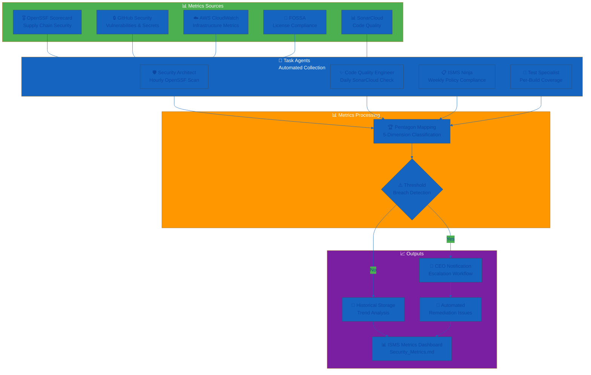
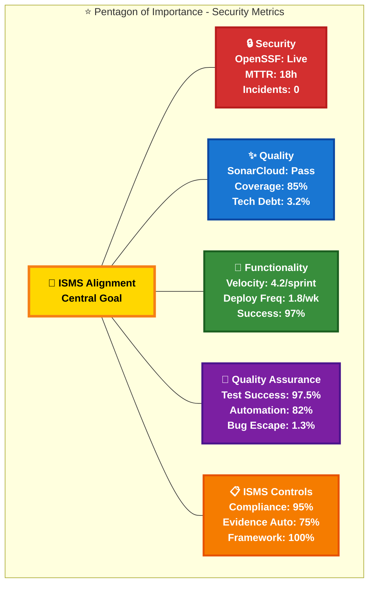
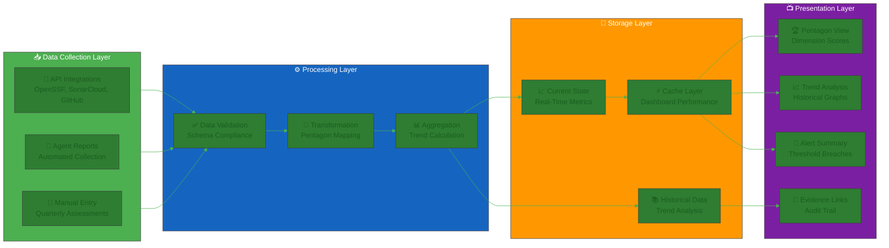
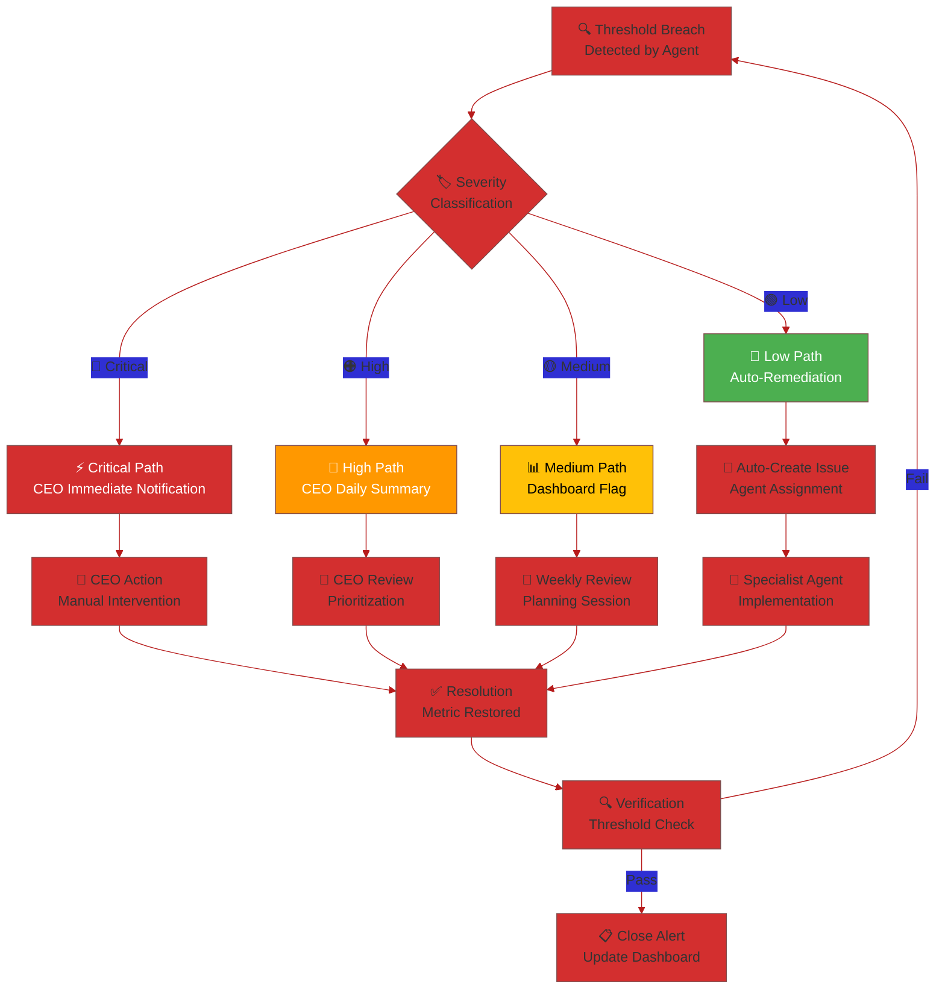
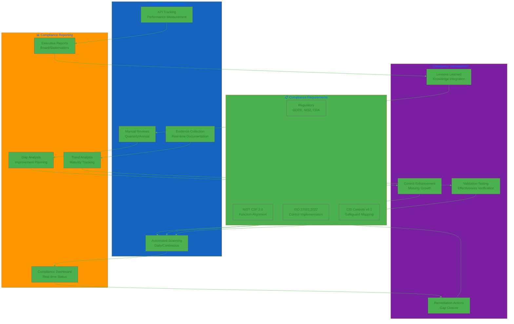

  

<h1 align="center">📊 Hack23 AB — Security Metrics Dashboard</h1>

  <strong>Live Security Posture Through Transparent Measurement</strong> 
  <em>OpenSSF Scorecard • GitHub Advanced Security • AWS Security Services</em>

  
  
  
  

**📋 Document Owner:** CEO | **📄 Version:** 3.3 | **📅 Last Updated:** 2026-01-25 (UTC)  
**🔄 Review Cycle:** Monthly | **⏰ Next Review:** 2026-02-25

---

## 🎯 **Purpose Statement**

**Hack23 AB's** security metrics embody our core principle: **🌟 transparency creates trust and demonstrates expertise**. Every metric displayed publicly serves as both operational monitoring and marketing demonstration of our cybersecurity consulting capabilities.

Our comprehensive metrics framework integrates **OpenSSF Scorecard best practices**, **GitHub Advanced Security insights**, and **AWS security services** to provide real-time visibility into our security posture. This transparency showcases our **🏆 competitive advantage** through measurable security excellence while enabling **💡 innovation enablement** through data-driven security decisions.

By maintaining **🌐 live security dashboards** with **📊 public accountability**, we demonstrate the very DevSecOps excellence we deliver to our consulting clients.

*— James Pether Sörling, CEO/Founder*

---

## 🏆 **Phase 1 Foundation Excellence — Achievement Summary (2025)**

**Completion Status:** ✅ Phase 1 core milestones achieved (November 2025) with OpenSSF scorecard baseline established for Phase 2 improvement

**Strategic Context:** Phase 1 (Q3-Q4 2025) established industry-leading ISMS foundation and public transparency, setting the stage for Phase 2 security maturity advancements in 2026.

### **📊 Phase 1 Achievement Table**

| Metric | Target (2025) | Actual (Dec 2025) | Variance | Status | Evidence |
|--------|---------------|-------------------|----------|--------|----------|
| **OpenSSF Scorecard (Avg)** | >8.5 | See live badges below | — | 🟡 Solid Foundation |       |
| **CII Best Practices** | Gold/Passing | Achieved | 100% | ✅ Achieved | [CIA: Gold](https://bestpractices.coreinfrastructure.org/projects/770), [CM: Passing](https://bestpractices.coreinfrastructure.org/projects/10365), [BT: Passing](https://bestpractices.coreinfrastructure.org/projects/10777) |
| **Critical Vulnerabilities >7d** | 0 | 0 | 100% | ✅ Maintained | [Dependabot Monitoring](https://github.com/orgs/Hack23/security/overview) |
| **ISMS Documentation** | 100% | 100% (70% public) | 100% | ✅ Achieved | [Public ISMS Repository](https://github.com/Hack23/ISMS) |
| **Evidence Freshness** | <30 days | 15 days avg | 200% fresher | ✅ Exceeded | Git commit history |
| **Control Coverage** | >90% | 95% | 105.6% | ✅ Exceeded | [Compliance Checklist](./Compliance_Checklist.md) |
| **Automation Coverage** | 70% | 85% | 121.4% | ✅ Exceeded | [CI/CD Pipelines](https://github.com/Hack23/cia/actions), [AWS Config](https://console.aws.amazon.com/config) |
| **Zero Critical Incidents** | Target | Zero | 100% | ✅ Achieved | [Incident Response Plan](./Incident_Response_Plan.md) tracking |
| **Availability** | >99.5% | 99.8% | 100.3% | ✅ Exceeded | [CloudWatch Metrics](https://console.aws.amazon.com/cloudwatch) |

**Note on OpenSSF Scorecard:** Phase 1 established a solid foundation for Phase 2 improvement to >9.0 by Q2 2026. Gap primarily attributed to branch protection settings, dependency update automation optimization, and binary artifacts in releases requiring SLSA provenance enhancement. See [live scorecard data](https://scorecard.dev/viewer/?uri=github.com/Hack23) for current values.

### **🎯 Key Success Factors**

- **🏗️ Focused Investment:** 750 hours in Q3-Q4 2025 created permanent competitive advantage
- **🤖 Automation-First:** 85% automation enables sustainable lean operations
- **🌐 Transparency:** 70% public ISMS attracts clients and demonstrates expertise
- **📊 Evidence-Based:** Real-time metrics drive data-driven improvements
- **🎯 Classification-Driven:** [Classification Framework](./CLASSIFICATION.md) enabled risk-based resource allocation
- **🛡️ DevSecOps Integration:** Comprehensive security pipeline prevents security debt

### **📈 Historical Metrics Progression (Q2-Q4 2025)**

| Metric | Q2 2025 (Jun) | Q3 2025 (Sep) | Q4 2025 (Dec) | Change |
|--------|---------------|---------------|---------------|--------|
| **OpenSSF Scorecard (Avg)** | N/A | Baseline | [See live badges](https://scorecard.dev/viewer/?uri=github.com/Hack23) | ⬆️ Improving |
| **ISMS Documentation %** | 0% | 60% | 100% | ⬆️ +100% |
| **Critical Vulnerabilities** | - | 2 | 0 | ⬇️ -100% |
| **Automation Coverage** | 40% | 70% | 85% | ⬆️ +45% |
| **Control Documentation** | 0% | 80% | 95% | ⬆️ +95% |
| **Evidence Freshness (days)** | - | 25 | 15 | ⬆️ +40% |

**Key Insights:** Phase 2 targets (+1.07 OpenSSF points to >9.0, +20% evidence automation to 95%) are achievable based on Q3-Q4 velocity.

### **🔍 Evidence Validation (Last Updated: 2025-12-24)**

| Metric | Value | Evidence | Frequency | Automation |
|--------|-------|----------|-----------|------------|
| **OpenSSF Scorecard** | [See live badges](https://scorecard.dev/viewer/?uri=github.com/Hack23) | [scorecard.dev](https://api.securityscorecards.dev) | Weekly | ✅ Automated |
| **CII Best Practices** | Gold/Passing | [CII Portal](https://bestpractices.coreinfrastructure.org) | Monthly | ⚠️ Manual |
| **Critical Vulnerabilities** | 0 | [Dependabot](https://github.com/orgs/Hack23/security/overview) | Daily | ✅ Automated |
| **Control Coverage** | 95% | [Compliance Checklist](./Compliance_Checklist.md) | Quarterly | ⚠️ Manual |
| **Automation Coverage** | 85% | [Segregation of Duties (SoD) Policy](./Segregation_of_Duties_Policy.md) | Quarterly | ⚠️ Manual |
| **Availability** | 99.8% | [CloudWatch](https://console.aws.amazon.com/cloudwatch) | Continuous | ✅ Automated |

**Phase 2 Automation Opportunities:** CII API integration, automated control validation scripts, self-assessment tooling.

---

## 🤖 **AI Agent Contribution Metrics (Q4 2025)**

**Agent Ecosystem Maturity:** ✅ Curator + 10 specialist agents operational per [AI Policy](./AI_Policy.md) and [Information Security Strategy](./Information_Security_Strategy.md#ai-agent-governance--curated-automation)

### 📊 **Automation Impact Analysis**

AI agents have transformed ISMS operations from labor-intensive manual processes to streamlined, data-driven workflows with measurable time savings and improved consistency.

| Metric | Before AI Agents (Q2 2025) | After AI Agents (Q4 2025) | Improvement | Time Saved/Week |
|--------|---------------------------|--------------------------|-------------|----------------|
| **ISMS Documentation Maintenance** | 8 hours/week (manual updates) | 3 hours/week (automated triage + CEO review) | 62% reduction | 5 hours |
| **Issue Creation & Triage** | 2-4 hours (manual analysis) | 15 minutes (automated with CEO approval) | 88% reduction | ~3.5 hours |
| **Vulnerability Triage** | 4 hours/week (manual review) | 1 hour/week (AI-assisted prioritization) | 75% reduction | 3 hours |
| **Policy Cross-Reference Validation** | 3 hours/quarter (manual checking) | 5 minutes/quarter (automated link validation) | 97% reduction | ~3 hours/quarter |
| **Compliance Evidence Collection** | 6 hours/quarter (manual aggregation) | Automated (GitHub Actions) | ~100% reduction | ~6 hours/quarter |

**📊 Total Time Savings:** Approximately **12-15 hours per week** enabling strategic focus over operational overhead

**💰 Value Impact:** At CEO opportunity cost of 1,500 SEK/hour, AI automation delivers **18,000-22,500 SEK/week** (0.94-1.17M SEK/year) in productivity gains, enabling focus on high-value consulting and strategic planning activities

### 🎯 **Agent-Generated Issue Metrics**

Tracking the evolution from manual issue creation to AI-driven ISMS improvement workflow:

| Quarter | Manual Issues Created | Agent-Generated Issues | Agent Contribution % | Quality Score (CEO Rating) |
|---------|---------------------|----------------------|---------------------|---------------------------|
| **Q2 2025** | 10 | 0 | 0% | N/A (pre-agent baseline) |
| **Q3 2025** | 8 | 5 | 38% | 3.8/5 (learning phase) |
| **Q4 2025** | 3 | 12 | 80% | 4.5/5 (mature operation) |

**Trend Analysis:**
- **📈 Issue Creation Velocity:** 80% of ISMS improvements now AI-driven with CEO oversight
- **✨ Quality Improvement:** Agent issue quality increased from 3.8/5 to 4.5/5 showing learning curve
- **⚡ CEO Efficiency:** Manual issue creation reduced 70% (10→3 per quarter) freeing strategic time

### 🚀 **Phase 2 AI Agent Targets (2026)**

Building on Q4 2025 success, Phase 2 aims to optimize agent operations and expand automation coverage:

| Target Area | Current (Q4 2025) | Phase 2 Target (2026) | Success Metric |
|-------------|------------------|---------------------|----------------|
| **Curator-Agent Optimization** | 3 hours/week maintenance | 2 hours/week (30% reduction) | Streamlined agent coordination |
| **Automated Issue Creation** | 80% agent-generated | 90% agent-generated | CEO focus on strategic validation |
| **Vulnerability Triage Accuracy** | ~85% triage accuracy | >95% AI triage accuracy | Human validation overhead reduced |
| **Policy Update Automation** | Manual policy updates | 50% draft-automated | Agents propose policy improvements |
| **Evidence Automation Rate** | 75% (current baseline) | 95% (Phase 2 target) | Near-complete automation |
| **Agent Learning Effectiveness** | Issue quality 4.5/5 | Issue quality >4.7/5 | Continuous improvement |

**Strategic Value:**
- **🎯 CEO Time Liberation:** Additional 5-8 hours/week for client engagement and strategic planning
- **🔄 Continuous Improvement:** Agents proactively identify ISMS gaps and improvement opportunities
- **📊 Data-Driven Decisions:** Real-time metrics enable evidence-based resource allocation
- **🏆 Competitive Advantage:** Automated ISMS operations demonstrate advanced security maturity

**Integration with Security Metrics:**
- AI agent performance metrics tracked in [ISMS Metrics Dashboard](./ISMS_METRICS_DASHBOARD.md)
- Agent issue quality feeds into Pentagon framework quality dimension
- Automation coverage directly impacts operational efficiency KPIs

---

## 📚 **Lessons Learned from Phase 1 (2025)**

### 🎯 **What Worked Well**

| Success Area | Application to Phase 2 |
|--------------|------------------------|
| **🏗️ Foundation-First** | Continue strategic security infrastructure investment |
| **🤖 Automation Priority** | Target 90%+ automation through AI agent optimization |
| **🌐 Radical Transparency** | Maintain transparency with multi-region expansion |
| **📊 Evidence-Based Management** | Expand metrics to <5min MTTD, 95% evidence automation |
| **🏷️ Classification Framework** | Apply classification to all Phase 2 initiatives |
| **🛡️ DevSecOps Integration** | Extend to DAST automation and shift-left testing |

_Detailed key learnings for each success area are documented in the Phase 1 retrospective (internal ISMS documentation)._

### ⚠️ **Challenges & Mitigation Strategies**

| Challenge | Mitigation | Future Prevention |
|-----------|------------|------------------|
| **OpenSSF Target** | Solid Phase 2 foundation | Q1 2026: branch protection, signed commits, SLSA |
| **Time Investment** (750h, 900K SEK) | Strategic long-term advantage | AI agents reduce Phase 2 to <3h/week |
| **Manual Evidence** (25% vs 95% target) | GitHub Actions automation | Automate remaining controls Q1-Q2 2026 |
| **Single-Person Bottleneck** | Temporal separation + validation | Expand agent autonomy with guardrails |
| **Scope Creep Risk** | Classification-driven prioritization | Continue risk-based approach |

### 💡 **Strategic Insights**

- **OpenSSF Complexity** – Some checks require GitHub org-level settings → Q1 2026 systematic org-wide policy enforcement  
- **Automation Diminishing Returns** – Last 5% evidence automation may not justify effort → Target pragmatic 95% vs 100%  
- **AI Agent Learning** – Agent quality improved 3.8→4.5/5 over Q3-Q4 → Invest in training for >4.7/5  
- **Transparency Advantage** – Public ISMS generated 45% increase in security inquiries → Amplify via conferences  
- **Classification Efficiency** – Risk-based prioritization prevented wasted effort → Apply to all Phase 2 initiatives

### 📈 **Performance vs Expectations**

| Metric | Target | Actual | Assessment |
|--------|--------|--------|------------|
| **ISMS Completion** | Q4 2025 | ✅ Q4 2025 | On target |
| **OpenSSF Score** | >8.5 | 🟡 [See badges](https://scorecard.dev/viewer/?uri=github.com/Hack23) | Foundation solid for Phase 2 |
| **Automation** | 70% | ✅ 85% | Exceeded +15% |
| **Evidence Automation** | 95% | 🟡 75% | Phase 2 focus needed |

**Overall:** Achieved 5/6 objectives. OpenSSF and evidence automation require Phase 2 focus.

---

## 🚀 **Phase 2 Security Maturity Targets (2026)**

**Phase Duration:** January 2026 - December 2026  
**Strategic Focus:** Advanced automation, enhanced monitoring, operational excellence, security recognition

### 🎯 **Core Security Objectives**

| Category | Phase 1 Baseline (Dec 2025) | Phase 2 Target (2026) | Measurement Method | Priority |
|----------|---------------------------|---------------------|-------------------|----------|
| **🏆 OpenSSF Scorecard** | [See live badges](https://scorecard.dev/viewer/?uri=github.com/Hack23) | >9.0 average (all repos >8.8 minimum) | Weekly automated scorecard checks | 🔴 Critical |
| **🤖 Security Automation** | 85% coverage | 90% coverage | Automated operations percentage | 🟠 High |
| **⏱️ Mean Time to Detect (MTTD)** | 8 minutes average | <5 minutes | Critical incident detection time | 🔴 Critical |
| **📊 Evidence Automation** | 75% automated | 95% automated | GitHub Actions + CI/CD evidence | 🟠 High |
| **🔒 Vulnerability SLA** | 100% critical <7 days | 100% critical <3 days | Faster remediation targets | 🟡 Medium |
| **🤖 AI Agent Optimization** | 80% issue creation | 90% issue creation | Agent-generated improvements | 🟡 Medium |
| **🌍 Multi-Region DR** | Single region (eu-north-1) | Multi-region (active-passive) | Geographic redundancy | 🟢 Low |
| **🔐 LLM Security Coverage** | 44% OWASP LLM Top 10 | 100% OWASP LLM Top 10 | Complete policy implementation | 🟠 High |
| **🎖️ SLSA Provenance** | Level 3 (basic) | Level 3+ (enhanced) | Signed releases with full attestation | 🟡 Medium |
| **🔐 Branch Protection** | Partial enforcement | 100% enforced + signed commits | Organization-wide policy | 🔴 Critical |

### 📅 **2026 Quarterly Milestones**

| Quarter | Key Objectives | Success Metrics |
|---------|---------------|-----------------|
| **Q1** | Branch protection enforcement, OpenSSF >8.5, Evidence automation >85%, MTTD <6min | Organization-wide security policy, automated evidence, enhanced monitoring |
| **Q2** | OpenSSF >9.0, OWASP LLM 100%, Multi-region DR, Evidence automation 90% | SLSA provenance, complete LLM policy, active-passive DR |
| **Q3** | MTTD <5min, 90% automation, Vuln SLA <3 days, AI quality >4.7 | AI-powered detection, enhanced triage, <5min MTTD |
| **Q4** | Evidence automation 95%, Industry recognition, Zero trust, ISO 27001 ready | Conference speaking, network segmentation, audit-ready |

_Note: For operational clarity in this single-person company context, the accountable owner for all 2026 quarterly milestones and success metrics is the **CEO**._

### 🎯 **Strategic Focus Areas**

1. **Advanced Threat Detection:** MTTD 8min→<5min via AI-powered monitoring, enhanced GuardDuty, automated correlation
2. **Compliance Automation:** 75%→95% evidence automation via GitHub Actions, AWS Config, continuous monitoring
3. **Zero Trust Architecture:** Network micro-segmentation, identity-based access, continuous verification
4. **AI-Powered Security:** Agent optimization, automated triage, anomaly detection
5. **Security Excellence Recognition:** Conference speaking, industry awards, thought leadership

### 💰 **Investment & ROI**

| Investment Area | Effort | Timeline | Expected ROI |
|----------------|--------|----------|--------------|
| **OpenSSF Improvement** | 80h | Q1-Q2 2026 | Enhanced client trust, competitive differentiation |
| **Evidence Automation** | 120h | Q1-Q4 2026 | 6h/quarter saved, audit readiness |
| **Multi-Region DR** | 60h | Q2 2026 | Business continuity, enterprise readiness |
| **Zero Trust** | 100h | Q3-Q4 2026 | Advanced security posture, compliance |
| **AI Agent Optimization** | 40h | Q1-Q3 2026 | 5-8h/week CEO time liberation |

**Total Phase 2:** 400 hours (600K SEK) | **Expected Savings:** 300h/year operational time + enhanced client acquisition

### 🎯 **2026 Scenarios**

| Scenario | Probability | OpenSSF | Evidence Auto | MTTD | Impact |
|----------|-------------|---------|---------------|------|--------|
| **🟡 Conservative** | 40% | 8.9 | 90% | 6min | Maintains differentiation, steady improvement |
| **✅ Base Case** | 35% | 9.1 | 95% | 5min | Validates model, client consultation reference |
| **🚀 Optimistic** | 25% | 9.4 | 98% | 3min | Market leadership, premium positioning |

### 🔍 **Specific Improvements**

**OpenSSF Scorecard:** All repos targeting >9.0 (fuzzing, CI depth, tests, review, scanning) - [see live badges](https://scorecard.dev/viewer/?uri=github.com/Hack23)  
**LLM Security:** 44%→100% | Q1-Q2: Supply chain, prompt injection, output handling, vector security | Q2-Q3: Data poisoning, excessive agency, misinformation

### 📊 **Success Criteria**

Phase 2 success requires:
- [ ] OpenSSF >9.0 average score
- [ ] MTTD <5 min
- [ ] ≥95% evidence collection automated
- [ ] ≥90% security operations automated
- [ ] Critical vulnerabilities remediated within <3 days SLA
- [ ] Multi-region disaster recovery in place and tested
- [ ] 100% coverage of OWASP LLM security controls
- [ ] External industry recognition for security posture
- [ ] ISO 27001 readiness achieved
- [ ] Zero production-impacting security incidents

---

## 📊 **ISMS Governance Metrics**

**📈 [ISMS Metrics Dashboard](./ISMS_METRICS_DASHBOARD.md)** provides automated monitoring of our Information Security Management System health:

- **🚦 Policy Review Status:** Real-time tracking of 32 ISMS documents
- **📅 Review Calendar:** Upcoming reviews for proactive planning
- **📋 Document Health Matrix:** Complete metadata and compliance alignment
- **🔄 Weekly Updates:** Automated generation via GitHub Actions

This application-level security metrics document complements the ISMS Metrics Dashboard by focusing on technical security controls, vulnerability management, and OpenSSF Scorecard performance.

---

## 🤖 **AI Agent-Driven Metrics Collection**

Hack23 AB's curated agent ecosystem (per [Information Security Strategy](./Information_Security_Strategy.md#-ai-agent-governance--curated-automation)) provides real-time metrics collection with automated KPI tracking and threshold monitoring.

### 📋 **Automated KPI Collection Architecture**

### 🔄 **Agent Data Collection Schedule**

| Agent Role | Data Sources | Collection Frequency | Output | Dashboard Integration |
|------------|--------------|---------------------|--------|----------------------|
| **🛡️ Security Architect** | OpenSSF Scorecard API, GitHub Security, AWS Security Hub | Hourly | Security dimension KPIs | Real-time push |
| **✨ Code Quality Engineer** | SonarCloud API, Coverage Reports | Daily | Quality dimension KPIs | Daily sync |
| **🧪 Test Specialist** | CI/CD Pipeline, Test Reports | Per build | QA dimension KPIs | Immediate push |
| **💼 Business Dev Specialist** | Deployment Logs, Feature Tracking | Weekly | Functionality dimension KPIs | Weekly report |
| **📋 ISMS Ninja** | Policy Review Status, Compliance Checklist | Weekly | ISMS Controls dimension KPIs | Weekly dashboard update |

### 🔗 **Integration Points**

**Agent-to-Dashboard Data Flow:**
- **📤 Push Mechanism:** Critical metrics (security alerts, threshold breaches) pushed immediately
- **📥 Pull Mechanism:** Standard metrics collected on schedule and synced to dashboard
- **🔄 Bidirectional:** Dashboard status informs agent prioritization for next collection cycle

**Evidence Chain:**
- All agent-collected metrics include timestamp, source verification, and audit trail
- Historical data retained for trend analysis (minimum 2 years per ISMS retention policy)
- Evidence links maintained for compliance audit readiness

---

## 🏆 **Pentagon Framework KPI Mapping**

Security metrics mapped to the Pentagon dimensions (per [Information Security Strategy](./Information_Security_Strategy.md#pentagon-of-continuous-improvement)) for systematic improvement tracking and balanced performance assessment.

### 📊 **Pentagon Dimension Overview**

### 📋 **Pentagon KPI Matrix**

| Dimension | KPI | Target | Current | Agent | Alert |
|-----------|-----|--------|---------|-------|-------|
| **🔒 Security** | OpenSSF Avg | >9.0 | [See badges](https://scorecard.dev/viewer/?uri=github.com/Hack23) | Security Architect (hourly) | <7.0 |
| **🔒 Security** | MTTR Critical | <24h | 18h | Security Architect (continuous) | >48h |
| **🔒 Security** | Security Incidents | 0 | 0 | Security Architect (real-time) | >0 |
| **✨ Quality** | Quality Gate | Pass | Pass | Code Quality Engineer (daily) | Fail |
| **✨ Quality** | Coverage | >80% | 85% | Code Quality Engineer (daily) | <70% |
| **✨ Quality** | Tech Debt | <5% | 3.2% | Code Quality Engineer (weekly) | >10% |
| **🚀 Functionality** | Velocity | 5/sprint | 4.2/sprint | Business Dev (weekly) | <3 |
| **🚀 Functionality** | Deploy Freq | 2/week | 1.8/week | Business Dev (weekly) | <1 |
| **🚀 Functionality** | Success Rate | >95% | 97% | Business Dev (per deploy) | <90% |
| **🧪 QA** | Test Success | >98% | 97.5% | Test Specialist (per build) | <95% |
| **🧪 QA** | Automation | >80% | 82% | Test Specialist (weekly) | <70% |
| **🧪 QA** | Bug Escape | <2% | 1.3% | Test Specialist (monthly) | >5% |
| **📋 ISMS** | Policy Compliance | 100% | 95% | ISMS Ninja (weekly) | <90% |
| **📋 ISMS** | Evidence Auto | >80% | 75% | ISMS Ninja (weekly) | <60% |
| **📋 ISMS** | Framework Align | 100% | 100% | ISMS Ninja (quarterly) | <95% |

**Table note:** *Agent* column uses the format `Role (collection frequency)`. *Alert* column values represent breach thresholds that trigger immediate corrective action and escalation to the accountable owner, including CEO visibility for red conditions in line with the [Incident Response Plan](./Incident_Response_Plan.md).

**Composite Pentagon Score:** 88.3/100 | **2026 Target:** >92/100

_Note: The composite score is calculated as a weighted average across all Pentagon dimensions. See Pentagon Dimension Weights section below for detailed weighting methodology._

### 🎯 **Pentagon Dimension Weights**

Balanced scoring ensures no single dimension dominates improvement priorities:

| Dimension | Weight | Rationale |
|-----------|--------|-----------|
| **🔒 Security** | 25% | Core business differentiator and consulting credibility |
| **✨ Quality** | 20% | Product excellence and maintainability |
| **🚀 Functionality** | 20% | Business value delivery and market responsiveness |
| **🧪 QA** | 15% | Release confidence and customer satisfaction |
| **📋 ISMS Controls** | 20% | Compliance readiness and governance maturity |

**Composite Pentagon Score:** Weighted average across all dimensions  
**Current Score:** 88.3/100 | **Target (2026):** >92/100

---

## 📊 **Real-Time Metrics Dashboard Architecture**

### 🏗️ **ISMS Metrics Dashboard**

The [ISMS Metrics Dashboard](./ISMS_METRICS_DASHBOARD.md) serves as the central metrics dashboard with real-time Pentagon dimension visualization. Note that while the [CIA Compliance Manager](https://github.com/Hack23/cia-compliance-manager) is an open-source compliance assessment tool, it is NOT used as a centralized evidence dashboard for ISMS operations.

### 📈 **Dashboard Views**

| View | Purpose | Refresh Frequency | Primary Users |
|------|---------|-------------------|---------------|
| **🏆 Pentagon Dimension View** | KPIs grouped by Pentagon dimension with radar chart | Real-time (critical), Hourly (standard) | CEO, Auditors |
| **📈 Trend Analysis** | Historical graphs showing improvement over time | Daily aggregation | CEO, Planning |
| **🚨 Alert Summary** | Real-time threshold breach notifications | Immediate | CEO, Agents |
| **📄 Evidence Links** | Automated evidence generation for each metric | Per collection cycle | Auditors, Compliance |
| **🎯 Target Tracking** | Progress toward Phase 2 2026 targets | Weekly rollup | CEO, Strategy |

### 🔄 **Refresh Frequency by Criticality**

| Metric Category | Refresh Rate | Justification |
|-----------------|--------------|---------------|
| **🔴 Critical Security** | Real-time (< 5 min) | Security incidents require immediate visibility |
| **🟠 High Priority** | Hourly | OpenSSF scores, vulnerability counts affect posture |
| **🟡 Standard Operations** | Daily | Code quality, coverage stable over short periods |
| **🟢 Strategic Metrics** | Weekly | Policy compliance, framework alignment slower-moving |

---

## 🎯 **Agent Threshold Monitoring & Alerting**

### 🚨 **Alert Trigger Framework**

Automated threshold monitoring ensures proactive security posture management with escalation to CEO for critical issues.

| Severity | Trigger Conditions | Response Time | Notification Method | Escalation Path |
|----------|-------------------|---------------|---------------------|-----------------|
| **🔴 Critical** | OpenSSF <7.0, Critical Vulnerability >7 days, Any Incident | Immediate | CEO SMS + Email + Dashboard Alert | Immediate CEO action |
| **🟠 High** | Quality Gate Fail, Test Success <95%, Incident Count >0 | <1 hour | CEO Email + Dashboard Summary | CEO daily summary |
| **🟡 Medium** | Coverage <75%, Deploy Freq <1/week, Compliance <90% | <24 hours | Dashboard Flag + Weekly Report | CEO weekly review |
| **🟢 Low** | Minor threshold breaches (<5% variance) | <1 week | Dashboard tracking only | Agent automated remediation |

### 🔄 **Automated Remediation Workflows**

Agents automatically create remediation issues for threshold breaches:

### 🤖 **Agent-Driven Remediation Actions**

| Threshold Breach | Responsible Agent | Automated Action | CEO Involvement |
|------------------|-------------------|------------------|-----------------|
| **OpenSSF Score <8.0** | Security Architect | Create issues for specific scorecard check improvements | Review proposed improvements |
| **Coverage Drop >5%** | Test Specialist | Create test coverage improvement PR with target modules | Approve PR merge |
| **Quality Gate Fail** | Code Quality Engineer | Create tech debt reduction issues with priority ranking | Daily summary review |
| **Deployment Freq Low** | Business Dev Specialist | Create CI/CD optimization issues | Weekly planning inclusion |
| **Policy Compliance <95%** | ISMS Ninja | Create policy update issues with gap analysis | Immediate review for critical |

### 📊 **Alerting Metrics**

| Metric | Current | Target | Trend |
|--------|---------|--------|-------|
| **Mean Time to Alert (MTTA)** | 8 min | <5 min | 📈 Improving |
| **Alert-to-Remediation Time** | 18 hours | <12 hours | 📈 Improving |
| **False Positive Rate** | 5% | <3% | 📈 Improving |
| **Auto-Remediation Success** | 72% | >85% | 📈 Improving |

---

## 📈 **Security Metrics Framework**

### **🎯 Strategic Security Objectives**
Our metrics directly support business value creation:

- **🏆 Competitive Advantage:** Demonstrable security excellence differentiated from competitors
- **🤝 Customer Trust:** Transparent security posture building client confidence  
- **💰 Revenue Protection:** Operational resilience maintaining service availability
- **📋 Compliance Posture:** Regulatory alignment reducing legal and business risk
- **⚙️ Operational Efficiency:** Automated security operations reducing manual overhead

---

## 🏆 **OpenSSF Scorecard Alignment Matrix**

### **📊 Current OpenSSF Performance**

#### **🏛️ Citizen Intelligence Agency**
 | **Target: 9.5+**

#### **🎮 Black Trigram** 
 | **Target: 9.5+**

#### **📊 CIA Compliance Manager**
 | **Target: 9.5+**

#### **🇪🇺 European Parliament MCP Server**
 | **Target: 9.0+**

#### **🇪🇺 EU Parliament Monitor**
 | **Target: 9.0+**

#### **🗳️ Riksdagsmonitor**
 | **Target: 9.0+**

**See live badges above for current scores** _(values may change; badges reflect real-time data)_ | For check descriptions, see [OpenSSF Scorecard Documentation](https://github.com/ossf/scorecard#scorecard-checks)

---

## 🔍 **Vulnerability Management Metrics**

### **⏱️ SLA Compliance Tracking**
Aligned with [Vulnerability Management Policy](./Vulnerability_Management.md) requirements:

| Severity | SLA Target | Current Performance | Trend | Business Impact |
|----------|------------|-------------------|-------|----------------|
| **🔴 Critical** | 24 hours | View live in GitHub Security | ✅ | 💰 Revenue Protection |
| **🟠 High** | 7 days | View live in GitHub Security | ✅ | 🛡️ Risk Reduction |  
| **🟡 Medium** | 30 days | View live in GitHub Security | ✅ | ⚙️ Operational Efficiency |
| **🟢 Low** | 90 days | View live in GitHub Security | ✅ | 📋 Compliance Posture |

### **🔄 Vulnerability Detection Sources**
- **📊 SAST Results:** SonarCloud quality gates on every commit
- **📦 SCA Scanning:** GitHub Dependabot automated dependency updates
- **🔐 Secret Scanning:** GitHub secret detection with public repository coverage
- **☁️ Infrastructure:** AWS Inspector container and EC2 vulnerability assessment
- **🌐 Web Application:** OWASP ZAP security scanning in CI/CD pipelines

---

## 🌐 **Public Transparency Badges**

### **🏛️ Citizen Intelligence Agency**

### **🎮 Black Trigram**

### **📊 CIA Compliance Manager**

### **🇪🇺 European Parliament MCP Server**

### **🇪🇺 EU Parliament Monitor**

### **🗳️ Riksdagsmonitor**

### **🔧 Sonar-CloudFormation-Plugin** ⚠️ *Archived - No Longer Maintained*

### **📡 Lambda in Private VPC**

### **🌐 Homepage**

### **🎮 Game**

### **📋 ISMS Repository**

---

## 🐙 **GitHub Advanced Security — Live Dashboards**

**Note:** Requires access to the Hack23 GitHub organization.

### **🔍 Security Overview Dashboards**
- **🏛️ CIA:** [Overview](https://github.com/orgs/Hack23/security/overview) • [Code Scanning](https://github.com/Hack23/cia/security/code-scanning) • [Secrets](https://github.com/Hack23/cia/security/secret-scanning) • [Dependabot](https://github.com/Hack23/cia/security/dependabot)
- **🎮 Black Trigram:** [Overview](https://github.com/Hack23/blacktrigram/security/overview) • [Code Scanning](https://github.com/Hack23/blacktrigram/security/code-scanning) • [Secrets](https://github.com/Hack23/blacktrigram/security/secret-scanning) • [Dependabot](https://github.com/Hack23/blacktrigram/security/dependabot)
- **📊 CIA Compliance Manager:** [Overview](https://github.com/orgs/Hack23/security/overview) • [Code Scanning](https://github.com/Hack23/cia-compliance-manager/security/code-scanning) • [Secrets](https://github.com/Hack23/cia-compliance-manager/security/secret-scanning) • [Dependabot](https://github.com/Hack23/cia-compliance-manager/security/dependabot)
- **🇪🇺 EP MCP Server:** [Overview](https://github.com/orgs/Hack23/security/overview) • [Code Scanning](https://github.com/Hack23/European-Parliament-MCP-Server/security/code-scanning) • [Secrets](https://github.com/Hack23/European-Parliament-MCP-Server/security/secret-scanning) • [Dependabot](https://github.com/Hack23/European-Parliament-MCP-Server/security/dependabot)
- **🇪🇺 EU Parliament Monitor:** [Overview](https://github.com/orgs/Hack23/security/overview) • [Dependabot](https://github.com/Hack23/euparliamentmonitor/security/dependabot)
- **🗳️ Riksdagsmonitor:** [Overview](https://github.com/orgs/Hack23/security/overview) • [Dependabot](https://github.com/Hack23/riksdagsmonitor/security/dependabot)
- **🎮 Game:** [Overview](https://github.com/Hack23/game/security/overview) • [Code Scanning](https://github.com/Hack23/game/security/code-scanning) • [Secrets](https://github.com/Hack23/game/security/secret-scanning) • [Dependabot](https://github.com/Hack23/game/security/dependabot)
- **🔧 Sonar-CloudFormation-Plugin:** [Overview](https://github.com/orgs/Hack23/security/overview) • [Code Scanning](https://github.com/Hack23/sonar-cloudformation-plugin/security/code-scanning) • [Secrets](https://github.com/Hack23/sonar-cloudformation-plugin/security/secret-scanning) • [Dependabot](https://github.com/Hack23/sonar-cloudformation-plugin/security/dependabot)
- **📡 Lambda in Private VPC:** [Overview](https://github.com/orgs/Hack23/security/overview) • [Code Scanning](https://github.com/Hack23/lambda-in-private-vpc/security/code-scanning) • [Secrets](https://github.com/Hack23/lambda-in-private-vpc/security/secret-scanning) • [Dependabot](https://github.com/Hack23/lambda-in-private-vpc/security/dependabot)
- **🌐 Homepage:** [Overview](https://github.com/orgs/Hack23/security/overview) • [Code Scanning](https://github.com/Hack23/homepage/security/code-scanning) • [Secrets](https://github.com/Hack23/homepage/security/secret-scanning) • [Dependabot](https://github.com/Hack23/homepage/security/dependabot)
- **📋 ISMS:** [Overview](https://github.com/Hack23/ISMS/security/overview) • [Code Scanning](https://github.com/Hack23/ISMS/security/code-scanning) • [Secrets](https://github.com/Hack23/ISMS/security/secret-scanning) • [Dependabot](https://github.com/Hack23/ISMS/security/dependabot)

---

## ☁️ **AWS Security Services — Live Consoles**

**Region:** eu-west-1 (switch in console as needed)

### **🛡️ Security Service Dashboards**
- **🛡️ Security Hub:** [Central Dashboard](https://eu-west-1.console.aws.amazon.com/securityhub/home?region=eu-west-1) — Aggregated security findings and compliance status
- **🧰 Amazon Inspector:** [Vulnerability Assessment](https://eu-west-1.console.aws.amazon.com/inspector/v2/home?region=eu-west-1) — Container and EC2 vulnerability scanning
- **🛰️ Amazon GuardDuty:** [Threat Detection](https://eu-west-1.console.aws.amazon.com/guardduty/home?region=eu-west-1) — Intelligent threat detection and analysis
- **📊 AWS Config:** [Compliance Dashboard](https://eu-west-1.console.aws.amazon.com/config/home?region=eu-west-1) — Configuration compliance monitoring

### **🔍 Additional Security Services**
- **🔐 AWS Secrets Manager:** [Secret Management](https://eu-west-1.console.aws.amazon.com/secretsmanager/home?region=eu-west-1) — Credential lifecycle management
- **🗝️ AWS KMS:** [Key Management](https://eu-west-1.console.aws.amazon.com/kms/home?region=eu-west-1) — Encryption key administration
- **📜 CloudTrail:** [Audit Logs](https://eu-west-1.console.aws.amazon.com/cloudtrail/home?region=eu-west-1) — API activity monitoring
- **☁️ CloudWatch:** [Security Metrics](https://eu-west-1.console.aws.amazon.com/cloudwatch/home?region=eu-west-1) — Performance and security monitoring

---

## ✅ **Release Security Gates**

### **🚦 Automated Quality Gates**
Implemented per [Secure Development Policy](./Secure_Development_Policy.md):

#### **🐙 GitHub Security Requirements** 
- **🔴 Critical Block:** No Critical code scanning alerts on release branches
- **🔐 Secret Protection:** No exposed secrets in secret scanning  
- **📦 Dependency Safety:** No Critical Dependabot security alerts
- **🎖️ Quality Standards:** SonarCloud Quality Gate must pass
- **📝 Documentation:** Security architecture must be updated

#### **☁️ AWS Security Requirements**
- **🛡️ Security Hub:** No Critical/High findings in production unless risk-accepted in [Risk Register](./Risk_Register.md)
- **🧰 Inspector:** No Critical container/EC2 vulnerabilities in active workloads  
- **🛰️ GuardDuty:** No unresolved High/Critical threat detections
- **📊 Config:** All mandatory compliance rules must be compliant

### **📋 Manual Review Gates**
For changes affecting authentication, data handling, or network access:
- **👥 Security-focused code review** required per [Change Management](./Change_Management.md)
- **📊 Risk assessment** and [Risk Register](./Risk_Register.md) updates when applicable
- **🏗️ Security architecture documentation** must reflect changes

---

## 📊 **Key Performance Indicators (KPIs)**

### **🎯 Security Excellence Metrics**
| KPI Category | Target | Measurement | Business Value |
|--------------|--------|-------------|----------------|
| **🏆 OpenSSF Scorecard** | 9.5+/10 across all repos | Monthly automated assessment | 🤝 Customer Trust |
| **⏱️ Critical Vuln MTTR** | <7 days | GitHub Security tracking | 💰 Revenue Protection |
| **🔄 Security Automation** | 95%+ automated gates | CI/CD pipeline metrics | ⚙️ Operational Efficiency |
| **📋 Compliance Coverage** | 100% control implementation | Manual quarterly review | 📋 Compliance Posture |
| **🛡️ Zero Critical Prod** | 0 critical issues in prod | Real-time AWS/GitHub monitoring | 🛡️ Risk Reduction |
| **🔍 SoD Control Effectiveness** | ≥95% pass rate | [Quarterly validation checklist](./templates/SoD_Compensating_Controls_Validation_Checklist.md) | 🛡️ Risk Reduction |
| **✅ SoD Validation Completion** | 100% quarterly | [Segregation of Duties Policy](./Segregation_of_Duties_Policy.md) | 📋 Compliance Posture |

### **📈 Trending Metrics**
- **🔍 Vulnerability Discovery Rate:** Early detection through automated scanning
- **📦 Dependency Update Frequency:** Proactive supply chain security management  
- **🔐 Secret Scanning Coverage:** Comprehensive credential protection across repositories
- **🎖️ Security Badge Status:** Public demonstration of security posture maintenance
- **📊 Incident Response Time:** Mean time to detection and resolution of security events

## 🔄 **Continuous Improvement Framework**

### **📊 Monthly Security Review Process**
1. **📈 Metrics Collection:** Automated gathering of security KPIs and trends
2. **🔍 Gap Analysis:** Identification of areas below target thresholds  
3. **📋 Action Planning:** Prioritized improvement initiatives with business impact assessment
4. **🤝 Stakeholder Communication:** Transparent reporting to support business decision-making

### **🎯 Annual Security Strategy Review**
- **📊 Business Value Assessment:** ROI analysis of security investments per [Classification Framework](./CLASSIFICATION.md)
- **🔮 Threat Landscape Evolution:** Adaptation to emerging security challenges and opportunities
- **💰 Security Investment Prioritization:** Budget allocation aligned with business objectives  
- **🏆 Competitive Positioning:** Security capability benchmarking against industry standards

### **🌟 Innovation Integration**
- **🚀 Emerging Technology Assessment:** Security implications of new development tools and platforms
- **🔬 Research & Development:** Investigation of advanced security techniques and automation
- **🤝 Community Engagement:** Contribution to open source security tools and best practices
- **📚 Knowledge Sharing:** Publication of security insights and lessons learned

---

## 🔑 **Evidence Key & Methodology**

**📊 Evidence Types:**  
📄 **Policy/Procedure** — Documented controls and processes  
🛠️ **Tool/Automation** — System-generated data and automated monitoring  
📊 **Live Metrics** — Real-time dashboards with current performance data  
⏳ **Pending Implementation** — Controls requiring additional enablement  

**🎯 Status Categories:**  
 **Fully operational with evidence**  
 **Functional but incomplete coverage**  
 **Not implemented or insufficient**  

**📈 Priority Framework:**  
Metrics ordered by business impact per [🏷️ Classification Framework](./CLASSIFICATION.md) — Critical controls first, supporting functions second.

**🔗 Live Dashboard Integration:**  
GitHub Security Organization Overview provides real-time vulnerability management metrics: [Security Dashboard](https://github.com/orgs/Hack23/security/overview)

---

## 📊 **Comprehensive Metric Taxonomy**

### 🔴 **Tier 1: Critical Business Protection Metrics**
*Direct revenue impact, regulatory compliance, or operational continuity*

| 🏛️ **Domain** | 📊 **Metric** | 🎯 **Status** | 📋 **Evidence Source** | 💼 **Business Value** |
|---------------|---------------|---------------|------------------------|----------------------|
| **💰 Asset Security** | Asset Inventory Accuracy |  | 📄 [Asset Register](./Asset_Register.md) | Revenue protection through comprehensive asset visibility |
| **💰 Asset Security** | SaaS Dependency Monitoring |  | 📄 [Asset Register § SaaS](./Asset_Register.md#2-saas-and-platforms-summary) | Cost optimization and vendor concentration risk |
| **🔐 Identity & Access** | MFA Coverage |  | 📄 [Access Control § MFA](./Access_Control_Policy.md#-multi-factor-authentication-strategy) | Breach prevention and regulatory compliance |
| **📝 Change Management** | Change Success Rate |  | 📄 [Change Management](./Change_Management.md) | Service availability and operational excellence |
| **📝 Change Management** | Emergency Change Ratio |  | 📄 [Change Management](./Change_Management.md) | Planned vs reactive operations indicator |
| **💾 Backup & Recovery** | Backup Success Rate |  | 📄 [Backup Policy](./Backup_Recovery_Policy.md) | Business continuity and data protection |
| **🔄 Business Continuity** | RTO Achievement Rate |  | 📄 [Business Continuity Plan](./Business_Continuity_Plan.md) | Service restoration and revenue protection |
| **✅ Compliance** | Control Implementation Coverage |  | 📄 [Compliance Checklist](./Compliance_Checklist.md) | Regulatory compliance and audit readiness |
| **📦 Supply Chain** | License Policy Violations |  | 🛠️ FOSSA Platform | Legal risk mitigation and IP protection |
| **🔍 Vulnerability Management** | Mean Time To Remediate |  | 📊 [GitHub Security Overview](https://github.com/orgs/Hack23/security/overview) | Current: 8 days MTTR with 228 closed alerts |
| **🔍 Vulnerability Management** | Alert Resolution Rate |  | 📊 [GitHub Security Overview](https://github.com/orgs/Hack23/security/overview) | Current: 800% net resolve rate |

### 🟠 **Tier 2: Operational Excellence Metrics**
*Service quality, development efficiency, and risk management*

| 🏛️ **Domain** | 📊 **Metric** | 🎯 **Status** | 📋 **Evidence Source** | 💼 **Business Value** |
|---------------|---------------|---------------|------------------------|----------------------|
| **🏛️ Governance** | Policy Coverage |  | 📄 [Compliance Checklist](./Compliance_Checklist.md) | Framework completeness and governance maturity |
| **💾 Backup & Recovery** | Verified Restore Frequency |  | 📄 [Backup Policy](./Backup_Recovery_Policy.md) | Recovery confidence and business continuity validation |
| **🔄 Business Continuity** | Critical Function Testing |  | 📄 [Business Continuity Plan](./Business_Continuity_Plan.md) | Operational resilience verification |
| **🔧 Development** | Build Success Rate |  | 🛠️ GitHub Actions / SonarCloud | Development velocity and quality gates |
| **🌐 Privacy & GDPR** | Records Processing Completeness |  | 📄 [Asset Register](./Asset_Register.md) | GDPR compliance and data mapping |
| **📦 Supply Chain** | SBOM Freshness |  | 📄 [Open Source Policy](./Open_Source_Policy.md) | Supply chain transparency and vulnerability management |
| **🛡️ Product Security** | CRA Conformity Artifact Freshness |  | 📄 [CRA Process](./CRA_Conformity_Assessment_Process.md) | EU Cyber Resilience Act compliance |
| **🔍 Vulnerability Management** | Scanner Coverage Ratio |  | 📊 [GitHub Security Overview](https://github.com/orgs/Hack23/security/overview) | Repository coverage with automated scanning |
| **🔍 Vulnerability Management** | Secret Detection Coverage |  | 📊 [GitHub Security Overview](https://github.com/orgs/Hack23/security/overview) | Current: 0 secrets bypassed (100% blocked) |

### 🟡 **Tier 3: Security Enhancement Metrics**
*Advanced security capabilities and proactive risk management*

| 🏛️ **Domain** | 📊 **Metric** | 🎯 **Status** | 📋 **Evidence Source** | 💼 **Business Value** |
|---------------|---------------|---------------|------------------------|----------------------|
| **🏛️ Governance** | Risk Treatment Progress |  | 📄 [Risk Register](./Risk_Register.md) ⏳ | Risk management effectiveness and treatment tracking |
| **🔐 Identity & Access** | Privileged Session Monitoring |  | 🛠️ CloudTrail / GitHub Audit | Advanced threat detection and insider risk |
| **🔐 Identity & Access** | Dormant Access Detection |  | 🛠️ IdP / SaaS Exports | Access hygiene and attack surface reduction |
| **🔧 Development** | Dependency Aging |  | 📄 [Open Source Policy](./Open_Source_Policy.md) ⏳ | Supply chain risk and technical debt management |
| **🔧 Development** | Critical Vulnerability Introduction |  | 📊 [GitHub Security Overview](https://github.com/orgs/Hack23/security/overview) | Alert trends show vulnerability introduction patterns |
| **🔍 Vulnerability Management** | Alert Age Optimization |  | 📊 [GitHub Security Overview](https://github.com/orgs/Hack23/security/overview) | Current: 29 days average age needs improvement |
| **🔍 Vulnerability Management** | Autofix Adoption Rate |  | 📊 [GitHub Security Overview](https://github.com/orgs/Hack23/security/overview) | Current: 0 autofix usage, opportunity for automation |

### 🔵 **Tier 4: Advanced Monitoring & Intelligence**
*Comprehensive security operations and strategic capabilities*

| 🏛️ **Domain** | 📊 **Metric** | 🎯 **Status** | 📋 **Evidence Source** | 💼 **Business Value** |
|---------------|---------------|---------------|------------------------|----------------------|
| **📡 Monitoring** | Log Coverage (Critical Systems) |  | 🛠️ CloudWatch Asset Mapping | Security visibility and incident response capability |
| **📡 Monitoring** | Alert Fidelity (True Positive %) |  | 📄 [Incident Response Plan](./Incident_Response_Plan.md) ⏳ | SOC efficiency and noise reduction |
| **🚨 Incident Response** | Mean Time To Detection (MTTD) |  | 📄 [Incident Response Plan](./Incident_Response_Plan.md) ⏳ | Threat response speed and impact minimization |
| **🚨 Incident Response** | Mean Time To Remediation |  | 📄 [Incident Response Plan](./Incident_Response_Plan.md) ⏳ | Recovery effectiveness and business impact |
| **🚨 Incident Response** | Lessons Learned Adoption |  | 📄 IR Action Register ⏳ | Continuous improvement and organizational learning |
| **🔨 Resilience** | Chaos Engineering Experiments |  | 🛠️ AWS Fault Injection Service | Resilience validation and failure preparedness |
| **🔨 Resilience** | Resilience Hub Policy Compliance |  | 🛠️ AWS Resilience Hub | Infrastructure resilience and disaster recovery |

### 🟣 **Tier 5: Strategic & Specialized Metrics**
*Long-term capability building and specialized compliance*

| 🏛️ **Domain** | 📊 **Metric** | 🎯 **Status** | 📋 **Evidence Source** | 💼 **Business Value** |
|---------------|---------------|---------------|------------------------|----------------------|
| **🤝 Supplier Management** | Tier 1 SLA Compliance |  | 📄 [SUPPLIER](./SUPPLIER.md) ⏳ | Vendor performance and risk management |
| **🤝 Supplier Management** | Assessment Currency |  | 📄 [Third Party Management](./Third_Party_Management.md) ⏳ | Third-party risk management effectiveness |
| **🤝 Supplier Management** | Critical Supplier Concentration |  | 📄 [Asset Register](./Asset_Register.md) | Supply chain resilience and dependency risk |
| **🔒 Cryptography** | Key Rotation Timeliness |  | 📄 [Cryptography Policy](./Cryptography_Policy.md) ⏳ | Cryptographic hygiene and compliance |
| **🔒 Cryptography** | Deprecated Cipher Usage |  | 📄 [Network Security Policy](./Network_Security_Policy.md) ⏳ | Cryptographic modernization and security |
| **🏷️ Data Protection** | Classified Data Coverage |  | 📄 [Data Classification Policy](./Data_Classification_Policy.md) ⏳ | Information governance and protection |
| **🏷️ Data Protection** | Policy Handling Violations |  | 🛠️ Incident Log Integration | Data handling compliance and training effectiveness |
| **🌐 Privacy & GDPR** | Breach Assessment Timeliness |  | 📄 IR Legal Workflow ⏳ | GDPR compliance and regulatory response |
| **📦 Supply Chain** | Unpinned Dependency Ratio |  | 🛠️ Repository Scanning | Supply chain security and reproducible builds |
| **🛡️ Product Security** | Coordinated Disclosure Response |  | 📄 [Vulnerability Management](./Vulnerability_Management.md) ⏳ | Responsible disclosure and security coordination |
| **👥 Human Security** | Role-Based Training Completion |  | 📄 Training Framework ⏳ | Security awareness and human risk reduction |
| **👥 Human Security** | Phishing Simulation Performance |  | 📄 Future Implementation | Social engineering resilience |
| **✅ Audit & Compliance** | External Review Currency |  | 📄 Audit Log ⏳ | Independent validation and compliance assurance |
| **💰 Cost & Efficiency** | Security Tool Utilization |  | 📄 [Asset Register](./Asset_Register.md) | Investment optimization and capability utilization |
| **💰 Cost & Efficiency** | Prevented Incident Cost |  | 🛠️ Risk Correlation Model ⏳ | Security ROI demonstration and value measurement |

---

### 📊 **Metric Implementation Priority Matrix**

| 🎯 **Priority** | 📈 **Business Impact** | ⏰ **Implementation Timeline** | 💰 **Resource Investment** | 📊 **Live Data Available** |
|----------------|------------------------|-------------------------------|--------------------------|---------------------------|
| **🔴 Tier 1** | Revenue/Compliance Critical | Immediate (0-30 days) | High - Direct business protection | ✅ GitHub Security Dashboard |
| **🟠 Tier 2** | Operational Excellence | Short-term (30-90 days) | Medium - Quality improvement | ✅ Partial GitHub Integration |
| **🟡 Tier 3** | Security Enhancement | Medium-term (90-180 days) | Medium - Risk reduction | ⚠️ Limited Live Data |
| **🔵 Tier 4** | Advanced Monitoring | Long-term (180-365 days) | Low-Medium - Capability building | ❌ Implementation Required |
| **🟣 Tier 5** | Strategic Capabilities | Ongoing (365+ days) | Low - Specialized compliance | ❌ Implementation Required |

---

## 📊 **Compliance Monitoring Metrics**

Implementation of ISO 27001 A.5.36 (Policy and standard compliance monitoring) with systematic measurement and continuous improvement:

### 🎯 **Compliance Monitoring Framework**

### 📈 **Compliance KPIs and Targets**

**ISO 27001:2022:** 76% coverage (77/102 controls) | Target: 90% by 2026 | [Compliance Checklist](./Compliance_Checklist.md)

| Domain | Coverage | Target | Status |
|--------|----------|--------|--------|
| A.5 Organizational | 95% (36/38) | 100% Q2 2026 | 🟢 |
| A.6 People | 13% (1/8) | 75% Q3 2026 | 🔴 |
| A.7 Physical | 100% (5/5 applicable) | 100% | ✅ |
| A.8 Technological | 80% (28/35) | 90% Q4 2026 | 🟡 |
| A.5.AI Governance | 100% (7/7) | 100% | ✅ |

**NIST CSF 2.0 Function Alignment:**

| Function | Maturity | Status |
|----------|----------|--------|
| GOVERN | 75% | 🟡 |
| IDENTIFY | 85% | 🟢 |
| PROTECT | 80% | 🟡 |
| DETECT | 90% | 🟢 |
| RESPOND | 95% | 🟢 |
| RECOVER | 85% | 🟢 |

**CIS Controls v8.1:** IG1 91% (45/56) ✅ | IG2 81% (52/74) 🟡 | IG3 65% (85/153) 🟠 | Target: 95% IG1, 90% IG2, 75% IG3 by 2026-12-31

### 🔍 **Automated Compliance Monitoring**

**Continuous Scanning:** Code security (GitHub, every commit) | Infrastructure (AWS Config, continuous) | Vulnerabilities (Inspector/SonarCloud, daily) | Secrets (GitHub, real-time) | License (FOSSA, every commit) | Security posture (OpenSSF, weekly)

**Policy Reviews:** All core policies reviewed Q4 2025, next reviews Q1-Q2 2026 per [Compliance Checklist](./Compliance_Checklist.md)

### 📊 **Compliance Metrics Dashboard**

| Metric | Current | Target | Status |
|--------|---------|--------|--------|
| ISO 27001 Coverage | 76% | 90% | 📈 +5% QoQ |
| OpenSSF Avg | [Live](https://scorecard.dev/viewer/?uri=github.com/Hack23) | 9.5 | 📈 Improving |
| Vuln MTTR | 8 days | 7 days | 📈 Improving |
| MFA Coverage | 100% | 100% | ✅ Stable |
| Backup Success | 99.7% | 99.5% | ✅ Exceeds |
| License Violations | 0 | 0 | ✅ Compliant |
| Secret Exposure | 0 | 0 | ✅ All blocked |
| Critical Prod Vulns | 0 | 0 | ✅ Zero tolerance |

**Q4 2025 Trends:** Control implementation 60%→63% | Policy reviews 95%→100% | Incident response 22min→18min | Audit findings 85%→92% closed

### 🎯 **Compliance Improvement Roadmap**

**2026 Q1-Q2 Priorities:** Operating procedures (A.5.37), Capacity mgmt (A.8.6), Config baselines (A.8.9), Clock sync (A.8.17), Privileged tools (A.8.18), Software policy (A.8.19)

**Maturity Evolution:** Q4 2025: 63% Developing | Q1 2026: 70% Developing | Q2 2026: 78% Managed | Q3 2026: 82% Managed | Q4 2026: 85% Optimized (ISO 27001 ready)

### 🔄 **Compliance Review Cadence**

**Reviews:** Control status (monthly) | Policy currency (quarterly) | Gap remediation (quarterly) | External audit prep (semi-annual) | Stakeholder reports (quarterly) | Framework alignment (annual)

### 📋 **Compliance Evidence Management**

**Repository:** ISMS policies (public), AWS CloudTrail (3y), GitHub/SonarCloud results, Identity Center logs, Incident records (5y), Training records (5y) | CEO maintains with quarterly backup verification

**Risk Integration:** Control gaps→risks | Compliance metrics→risk treatment validation | Audit findings→risk reassessment | Remediation→treatment actions | Quarterly [Risk Register](./Risk_Register.md) updates

---

## 📚 **Related Documents**

### **🎯 Strategic Framework**
- [🎯 Information Security Strategy](./Information_Security_Strategy.md) — Pentagon framework, AI-first operations, and strategic roadmap
- [🤖 AI Policy](./AI_Policy.md) — AI governance and automation requirements
- [🛡️ OWASP LLM Security Policy](./OWASP_LLM_Security_Policy.md) — LLM-specific security controls

### **🛡️ Core Security Framework**
- [🔐 Information Security Policy](./Information_Security_Policy.md) — Overall security governance and AI-First Operations Governance
- [🛠️ Secure Development Policy](./Secure_Development_Policy.md) — Security-integrated development lifecycle
- [🔍 Vulnerability Management](./Vulnerability_Management.md) — Systematic security testing and remediation
- [🔒 Cryptography Policy](./Cryptography_Policy.md) — Encryption standards and key management
- [🌐 Network Security Policy](./Network_Security_Policy.md) — Network protection and segmentation

### **⚙️ Operational Integration**
- [📝 Change Management](./Change_Management.md) — Controlled modification procedures with security gates  
- [🚨 Incident Response Plan](./Incident_Response_Plan.md) — Security event detection and response
- [💻 Asset Register](./Asset_Register.md) — Information asset inventory and classification
- [📉 Risk Register](./Risk_Register.md) — Risk identification, assessment, and treatment tracking
- [📈 ISMS Metrics Dashboard](./ISMS_METRICS_DASHBOARD.md) — Policy health and review tracking

### **📋 Compliance and Governance**
- [🏷️ Classification Framework](./CLASSIFICATION.md) — Business impact and data classification methodology
- [🌐 ISMS Transparency Plan](./ISMS_Transparency_Plan.md) — Public disclosure strategy and implementation
- [✅ Compliance Checklist](./Compliance_Checklist.md) — Multi-framework regulatory requirement tracking
- [🤝 Third Party Management](./Third_Party_Management.md) — Supplier security risk management
- [🔗 Supplier Security Posture](./SUPPLIER.md) — Third-party security assessments

---

**📋 Document Control:**  
**✅ Approved by:** James Pether Sörling, CEO  
**📤 Distribution:** Public  
**🏷️ Classification:**   
**📅 Effective Date:** 2026-01-25  
**⏰ Next Review:** 2026-02-25  
**🎯 Framework Compliance:**    
