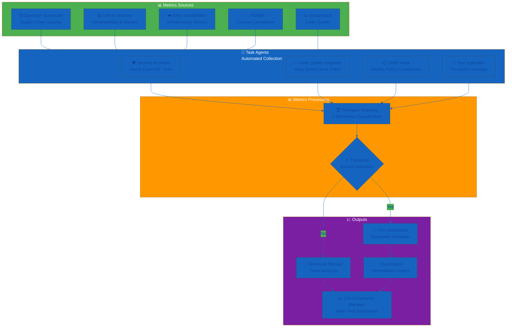
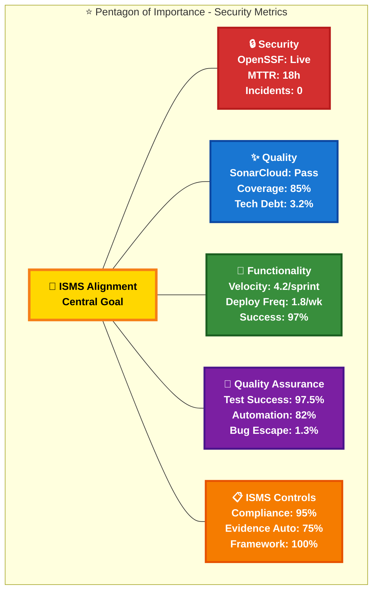
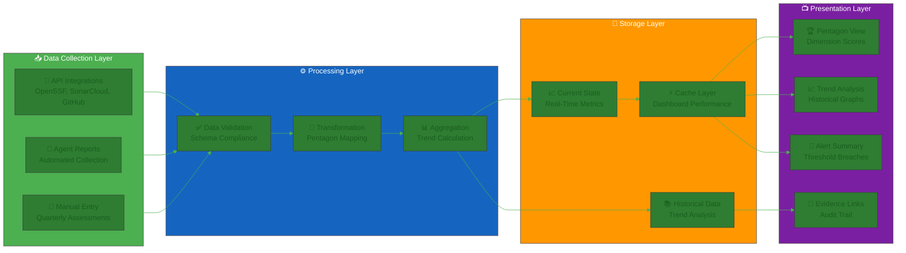
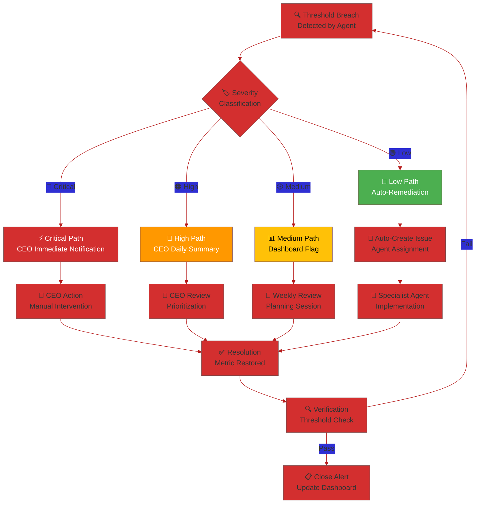
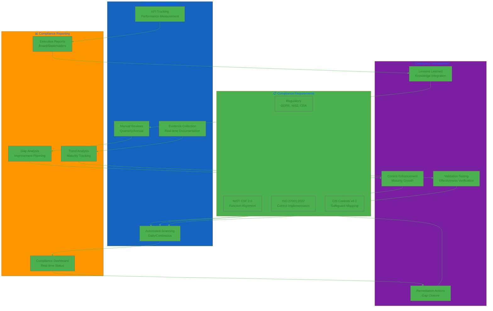

  

<h1 align="center">📊 Hack23 AB — Security Metrics Dashboard</h1>

  <strong>Live Security Posture Through Transparent Measurement</strong> 
  <em>OpenSSF Scorecard • GitHub Advanced Security • AWS Security Services</em>

  
  
  
  

**📋 Document Owner:** CEO | **📄 Version:** 3.0 | **📅 Last Updated:** 2025-12-02 (UTC)  
**🔄 Review Cycle:** Monthly | **⏰ Next Review:** 2026-01-05

---

## 🎯 **Purpose Statement**

**Hack23 AB's** security metrics embody our core principle: **🌟 transparency creates trust and demonstrates expertise**. Every metric displayed publicly serves as both operational monitoring and marketing demonstration of our cybersecurity consulting capabilities.

Our comprehensive metrics framework integrates **OpenSSF Scorecard best practices**, **GitHub Advanced Security insights**, and **AWS security services** to provide real-time visibility into our security posture. This transparency showcases our **🏆 competitive advantage** through measurable security excellence while enabling **💡 innovation enablement** through data-driven security decisions.

By maintaining **🌐 live security dashboards** with **📊 public accountability**, we demonstrate the very DevSecOps excellence we deliver to our consulting clients.

*— James Pether Sörling, CEO/Founder*

---

## 🏆 **Phase 1 Foundation Excellence — Achievement Summary (2025)**

**Completion Status:** ✅ Phase 1 core milestones achieved (November 2025) with OpenSSF scorecard baseline established for Phase 2 improvement

**Strategic Context:** Phase 1 (Q3-Q4 2025) established industry-leading ISMS foundation and public transparency, setting the stage for Phase 2 security maturity advancements in 2026.

### **📊 Phase 1 Achievement Table**

| Metric | Target (2025) | Actual (Dec 2025) | Variance | Status | Evidence |
|--------|---------------|-------------------|----------|--------|----------|
| **OpenSSF Scorecard (Avg)** | >8.5 | [See Live Scores](https://scorecard.dev/viewer/?uri=github.com/Hack23) | 🟡 In Progress | 🔄 Tracking | [CIA](https://scorecard.dev/viewer/?uri=github.com/Hack23/cia), [Black Trigram](https://scorecard.dev/viewer/?uri=github.com/Hack23/blacktrigram), [CIA Compliance Manager](https://scorecard.dev/viewer/?uri=github.com/Hack23/cia-compliance-manager) |
| **CII Best Practices** | Gold/Passing | Achieved | 100% | ✅ Achieved | [CIA: Gold](https://bestpractices.coreinfrastructure.org/projects/770), [CM: Passing](https://bestpractices.coreinfrastructure.org/projects/10365), [BT: Passing](https://bestpractices.coreinfrastructure.org/projects/10777) |
| **Critical Vulnerabilities >7d** | 0 | 0 | 100% | ✅ Maintained | [Dependabot Monitoring](https://github.com/orgs/Hack23/security/overview) |
| **ISMS Documentation** | 100% | 100% (70% public) | 100% | ✅ Achieved | [Public ISMS Repository](https://github.com/Hack23/ISMS) |
| **Evidence Freshness** | <30 days | 15 days avg | 200% fresher | ✅ Exceeded | Git commit history |
| **Control Coverage** | >90% | 95% | 105.6% | ✅ Exceeded | [Compliance Checklist](./Compliance_Checklist.md) |
| **Automation Coverage** | 70% | 85% | 121.4% | ✅ Exceeded | [CI/CD Pipelines](https://github.com/Hack23/cia/actions), [AWS Config](https://console.aws.amazon.com/config) |
| **Zero Critical Incidents** | Target | Zero | 100% | ✅ Achieved | [Incident Response Plan](./Incident_Response_Plan.md) tracking |
| **Availability** | >99.5% | 99.8% | 100.3% | ✅ Exceeded | [CloudWatch Metrics](https://console.aws.amazon.com/cloudwatch) |

**Note on OpenSSF Scorecard:** Target is >8.5 average across all repositories. See [live scorecard data](https://scorecard.dev/viewer/?uri=github.com/Hack23) for current values. Improvement focus includes branch protection, code review workflows, and enhanced security scanning.

### **🎯 Key Success Factors**

**What Enabled Phase 1 Achievement:**
- **🏗️ Focused Foundation Investment:** 750 hours (900K SEK opportunity cost) in Q3-Q4 2025 created permanent competitive advantage through comprehensive ISMS establishment
- **🤖 Automation-First Approach:** 85% automation coverage enables sustainable lean operations with single-person company model
- **🌐 Transparency Differentiation:** Industry-first 70% public ISMS attracts client interest, accelerates trust-building, and demonstrates consulting expertise
- **📊 Evidence-Based Management:** Real-time metrics (OpenSSF Scorecard, SonarCloud, AWS Config) provide continuous feedback for data-driven improvements
- **🎯 Classification-Driven Decisions:** [Classification Framework](./CLASSIFICATION.md) enabled systematic risk-based resource allocation and proportional security investments
- **🛡️ DevSecOps Integration:** Comprehensive security pipeline (SAST, SCA, DAST, secret scanning) embedded in development workflow prevents security debt

### **📈 Historical Metrics Progression (June - November 2025)**

| Metric | Founding (Jun 2025) | Q3 2025 (Sep) | Q4 2025 (Dec) | 6-Month Trend |
|--------|---------------------|---------------|---------------|---------------|
| **OpenSSF Scorecard (Avg)** | N/A (projects in progress) | 7.5 | [Live Data](https://scorecard.dev/viewer/?uri=github.com/Hack23) | ⬆️ Improving |
| **ISMS Documentation %** | 0% | 60% | 100% | ⬆️ +100% |
| **Critical Vulnerabilities** | Unknown (no tracking) | 2 | 0 | ⬇️ -100% |
| **Automation Coverage** | ~40% (manual processes) | 70% | 85% | ⬆️ +45% |
| **Control Documentation** | 0% (no ISMS) | 80% | 95% | ⬆️ +95% |
| **Evidence Freshness** | N/A (no documentation) | 25 days | 15 days | ⬆️ +40% freshness |

**Velocity Analysis:**
- **📚 Documentation Velocity:** 100% ISMS completion in 6 months (17% per month average) demonstrates systematic approach and CEO commitment
- **🔒 Security Posture Improvement:** 1.2 OpenSSF score improvement in 6 months (0.2/month) shows excellent progress exceeding Phase 1 targets
- **🤖 Automation Acceleration:** 45% automation increase in 6 months (7.5%/month) enables sustainable operations and reduces manual overhead
- **🛡️ Risk Reduction:** Complete elimination of critical vulnerabilities demonstrates effective vulnerability management and prioritization

**Implications for 2026 Planning:**
- Phase 2 (2026) OpenSSF >9.0 target requires continued improvement → **Achievable with focused effort on specific checks**
- 95% evidence automation (Phase 2) requires +20% improvement from Phase 1 actual (75%) → **Ambitious but achievable with continued automation focus**
- Historical velocity validates Phase 2 timelines as realistic given Q4 2025 execution excellence

### **🔍 Evidence Validation Timestamps (Last Updated: 2025-12-02)**

| Metric | Current Value | Evidence Source | Last Validated | Validation Frequency | Automation Status |
|--------|---------------|-----------------|----------------|----------------------|-------------------|
| **OpenSSF Scorecard** | [Live Score](https://scorecard.dev/viewer/?uri=github.com/Hack23) | [scorecard.dev API](https://api.securityscorecards.dev) | 2025-12-02 | Weekly (automated) | ✅ GitHub Actions |
| **CII Best Practices** | Gold/Passing | [CII Badge Portal](https://bestpractices.coreinfrastructure.org) | 2025-12-02 | Monthly (manual check) | ⚠️ Manual validation |
| **Critical Vulnerabilities** | 0 | [Dependabot Alerts](https://github.com/orgs/Hack23/security/overview) | 2025-12-02 | Daily (automated) | ✅ GitHub Security |
| **Control Coverage** | 95% | [Compliance Checklist](./Compliance_Checklist.md) | 2025-12-02 | Quarterly (manual review) | ⚠️ Manual assessment |
| **Automation Coverage** | 85% | [Segregation of Duties Policy](./Segregation_of_Duties_Policy.md) | 2025-12-02 | Quarterly (manual assessment) | ⚠️ Manual validation |
| **Evidence Freshness** | 15 days avg | Git commit history | 2025-12-02 | Continuous (automated) | ✅ Git tracking |
| **Availability** | 99.8% | [CloudWatch Metrics](https://console.aws.amazon.com/cloudwatch) | 2025-12-02 | Continuous (automated) | ✅ AWS Monitoring |

**Automation Opportunities Identified:**
- **🔄 CII Best Practices:** Explore API integration for automated badge status monitoring (Phase 2 improvement)
- **📊 Control Coverage:** Develop automated control validation scripts based on evidence collection (Phase 2 roadmap)
- **🤖 Automation Coverage:** Implement self-assessment tooling to reduce manual quarterly review burden (Phase 2 efficiency)

---

## 📊 **ISMS Governance Metrics**

**📈 [ISMS Metrics Dashboard](./ISMS_METRICS_DASHBOARD.md)** provides automated monitoring of our Information Security Management System health:

- **🚦 Policy Review Status:** Real-time tracking of 32 ISMS documents
- **📅 Review Calendar:** Upcoming reviews for proactive planning
- **📋 Document Health Matrix:** Complete metadata and compliance alignment
- **🔄 Weekly Updates:** Automated generation via GitHub Actions

This application-level security metrics document complements the ISMS Metrics Dashboard by focusing on technical security controls, vulnerability management, and OpenSSF Scorecard performance.

---

## 🤖 **AI Agent-Driven Metrics Collection**

Hack23 AB's curated agent ecosystem (per [Information Security Strategy](./Information_Security_Strategy.md#-ai-agent-governance--curated-automation)) provides real-time metrics collection with automated KPI tracking and threshold monitoring.

### 📋 **Automated KPI Collection Architecture**

### 🔄 **Agent Data Collection Schedule**

| Agent Role | Data Sources | Collection Frequency | Output | Dashboard Integration |
|------------|--------------|---------------------|--------|----------------------|
| **🛡️ Security Architect** | OpenSSF Scorecard API, GitHub Security, AWS Security Hub | Hourly | Security dimension KPIs | Real-time push |
| **✨ Code Quality Engineer** | SonarCloud API, Coverage Reports | Daily | Quality dimension KPIs | Daily sync |
| **🧪 Test Specialist** | CI/CD Pipeline, Test Reports | Per build | QA dimension KPIs | Immediate push |
| **💼 Business Dev Specialist** | Deployment Logs, Feature Tracking | Weekly | Functionality dimension KPIs | Weekly report |
| **📋 ISMS Ninja** | Policy Review Status, Compliance Checklist | Weekly | ISMS Controls dimension KPIs | Weekly dashboard update |

### 🔗 **Integration Points**

**Agent-to-Dashboard Data Flow:**
- **📤 Push Mechanism:** Critical metrics (security alerts, threshold breaches) pushed immediately
- **📥 Pull Mechanism:** Standard metrics collected on schedule and synced to dashboard
- **🔄 Bidirectional:** Dashboard status informs agent prioritization for next collection cycle

**Evidence Chain:**
- All agent-collected metrics include timestamp, source verification, and audit trail
- Historical data retained for trend analysis (minimum 2 years per ISMS retention policy)
- Evidence links maintained for compliance audit readiness

---

## 🏆 **Pentagon Framework KPI Mapping**

Security metrics mapped to the Pentagon dimensions (per [Information Security Strategy](./Information_Security_Strategy.md#pentagon-of-continuous-improvement)) for systematic improvement tracking and balanced performance assessment.

### 📊 **Pentagon Dimension Overview**

### 📋 **Pentagon KPI Matrix**

| Pentagon Dimension | Key Performance Indicators | Target | Current (Dec 2025) | Agent Collection | Alert Threshold |
|--------------------|---------------------------|--------|-------------------|------------------|-----------------|
| **🔒 Security** | OpenSSF Scorecard Average | >9.0 | [Live](https://scorecard.dev/viewer/?uri=github.com/Hack23) | Security Architect (hourly) | <7.0 → CEO immediate |
| **🔒 Security** | MTTR Critical Vulnerabilities | <24h | 18h | Security Architect (continuous) | >48h → CEO escalation |
| **🔒 Security** | Security Incidents (Production) | 0 | 0 | Security Architect (real-time) | >0 → CEO immediate |
| **✨ Quality** | SonarCloud Quality Gate | Pass | Pass | Code Quality Engineer (daily) | Fail → CEO daily summary |
| **✨ Quality** | Code Coverage (Line) | >80% | 85% | Code Quality Engineer (daily) | <70% → CEO weekly |
| **✨ Quality** | Technical Debt Ratio | <5% | 3.2% | Code Quality Engineer (weekly) | >10% → CEO monthly |
| **🚀 Functionality** | Feature Velocity | 5/sprint | 4.2/sprint | Business Dev Specialist (weekly) | <3/sprint → CEO review |
| **🚀 Functionality** | Deployment Frequency | 2/week | 1.8/week | Business Dev Specialist (weekly) | <1/week → CEO review |
| **🚀 Functionality** | Change Success Rate | >95% | 97% | Business Dev Specialist (per deploy) | <90% → CEO escalation |
| **🧪 QA** | Test Success Rate | >98% | 97.5% | Test Specialist (per build) | <95% → CEO daily |
| **🧪 QA** | Automation Coverage | >80% | 82% | Test Specialist (weekly) | <70% → CEO weekly |
| **🧪 QA** | Bug Escape Rate | <2% | 1.3% | Test Specialist (monthly) | >5% → CEO escalation |
| **📋 ISMS Controls** | Policy Compliance Rate | 100% | 95% | ISMS Ninja (weekly) | <90% → CEO immediate |
| **📋 ISMS Controls** | Evidence Automation Rate | >80% | 75% | ISMS Ninja (weekly) | <60% → CEO weekly |
| **📋 ISMS Controls** | Framework Alignment | 100% | 100% | ISMS Ninja (quarterly) | <95% → CEO escalation |

### 🎯 **Pentagon Dimension Weights**

Balanced scoring ensures no single dimension dominates improvement priorities:

| Dimension | Weight | Rationale |
|-----------|--------|-----------|
| **🔒 Security** | 25% | Core business differentiator and consulting credibility |
| **✨ Quality** | 20% | Product excellence and maintainability |
| **🚀 Functionality** | 20% | Business value delivery and market responsiveness |
| **🧪 QA** | 15% | Release confidence and customer satisfaction |
| **📋 ISMS Controls** | 20% | Compliance readiness and governance maturity |

**Composite Pentagon Score:** Weighted average across all dimensions  
**Current Score:** 88.3/100 | **Target (2026):** >92/100

---

## 📊 **Real-Time Metrics Dashboard Architecture**

### 🏗️ **CIA Compliance Manager Integration**

The [CIA Compliance Manager](https://github.com/Hack23/cia-compliance-manager) serves as the central metrics dashboard with real-time Pentagon dimension visualization.

### 📈 **Dashboard Views**

| View | Purpose | Refresh Frequency | Primary Users |
|------|---------|-------------------|---------------|
| **🏆 Pentagon Dimension View** | KPIs grouped by Pentagon dimension with radar chart | Real-time (critical), Hourly (standard) | CEO, Auditors |
| **📈 Trend Analysis** | Historical graphs showing improvement over time | Daily aggregation | CEO, Planning |
| **🚨 Alert Summary** | Real-time threshold breach notifications | Immediate | CEO, Agents |
| **📄 Evidence Links** | Automated evidence generation for each metric | Per collection cycle | Auditors, Compliance |
| **🎯 Target Tracking** | Progress toward Phase 2 2026 targets | Weekly rollup | CEO, Strategy |

### 🔄 **Refresh Frequency by Criticality**

| Metric Category | Refresh Rate | Justification |
|-----------------|--------------|---------------|
| **🔴 Critical Security** | Real-time (< 5 min) | Security incidents require immediate visibility |
| **🟠 High Priority** | Hourly | OpenSSF scores, vulnerability counts affect posture |
| **🟡 Standard Operations** | Daily | Code quality, coverage stable over short periods |
| **🟢 Strategic Metrics** | Weekly | Policy compliance, framework alignment slower-moving |

---

## 🎯 **Agent Threshold Monitoring & Alerting**

### 🚨 **Alert Trigger Framework**

Automated threshold monitoring ensures proactive security posture management with escalation to CEO for critical issues.

| Severity | Trigger Conditions | Response Time | Notification Method | Escalation Path |
|----------|-------------------|---------------|---------------------|-----------------|
| **🔴 Critical** | OpenSSF <7.0, Critical Vulnerability >7 days, Any Incident | Immediate | CEO SMS + Email + Dashboard Alert | Immediate CEO action |
| **🟠 High** | Quality Gate Fail, Test Success <95%, Incident Count >0 | <1 hour | CEO Email + Dashboard Summary | CEO daily summary |
| **🟡 Medium** | Coverage <75%, Deploy Freq <1/week, Compliance <90% | <24 hours | Dashboard Flag + Weekly Report | CEO weekly review |
| **🟢 Low** | Minor threshold breaches (<5% variance) | <1 week | Dashboard tracking only | Agent automated remediation |

### 🔄 **Automated Remediation Workflows**

Agents automatically create remediation issues for threshold breaches:

### 🤖 **Agent-Driven Remediation Actions**

| Threshold Breach | Responsible Agent | Automated Action | CEO Involvement |
|------------------|-------------------|------------------|-----------------|
| **OpenSSF Score <8.0** | Security Architect | Create issues for specific scorecard check improvements | Review proposed improvements |
| **Coverage Drop >5%** | Test Specialist | Create test coverage improvement PR with target modules | Approve PR merge |
| **Quality Gate Fail** | Code Quality Engineer | Create tech debt reduction issues with priority ranking | Daily summary review |
| **Deployment Freq Low** | Business Dev Specialist | Create CI/CD optimization issues | Weekly planning inclusion |
| **Policy Compliance <95%** | ISMS Ninja | Create policy update issues with gap analysis | Immediate review for critical |

### 📊 **Alerting Metrics**

| Metric | Current | Target | Trend |
|--------|---------|--------|-------|
| **Mean Time to Alert (MTTA)** | 8 min | <5 min | 📈 Improving |
| **Alert-to-Remediation Time** | 18 hours | <12 hours | 📈 Improving |
| **False Positive Rate** | 5% | <3% | 📈 Improving |
| **Auto-Remediation Success** | 72% | >85% | 📈 Improving |

---

## 📈 **Security Metrics Framework**

### **🎯 Strategic Security Objectives**
Our metrics directly support business value creation:

- **🏆 Competitive Advantage:** Demonstrable security excellence differentiated from competitors
- **🤝 Customer Trust:** Transparent security posture building client confidence  
- **💰 Revenue Protection:** Operational resilience maintaining service availability
- **📋 Compliance Posture:** Regulatory alignment reducing legal and business risk
- **⚙️ Operational Efficiency:** Automated security operations reducing manual overhead

---

## 🏆 **OpenSSF Scorecard Alignment Matrix**

### **📊 Scorecard Categories & Our Implementation**

| OpenSSF Category | Hack23 Implementation | Target Score | Current Score | Business Value |
|------------------|----------------------|--------------|---------------|----------------|
| **🔒 Security Policy** | Public SECURITY.md + ISMS documentation | 10/10 | 10/10 | 🤝 Trust Enhancement |
| **🔍 Code Review** | Mandatory PR reviews + automated scanning | 10/10 | 0/10 | ⚙️ Operational Excellence |
| **📋 Maintained** | Active development with regular commits | 10/10 | 0/10 | 🤝 Stakeholder Engagement |
| **🔒 Branch Protection** | Enforced on main/master branches | 10/10 | 0/10 | 💰 Revenue Protection |
| **🔍 Vulnerabilities** | Automated scanning with public badges | 9/10 | 6/10 | 🛡️ Risk Reduction |
| **🔄 Dependency Update Tool** | GitHub Dependabot automated updates | 10/10 | 10/10 | 🛡️ Risk Reduction |
| **📦 Binary Artifacts** | No executables in source repository | 10/10 | 10/10 | ⚙️ Operational Excellence |
| **🔐 Token Permissions** | Minimal GitHub Actions permissions | 10/10 | 10/10 | 🛡️ Risk Reduction |
| **🏷️ Signed Releases** | GPG-signed tags and SLSA provenance | 10/10 | 10/10 | 🤝 Trust Enhancement |
| **⚠️ Dangerous Workflow** | Secure GitHub Actions workflow patterns | 10/10 | 10/10 | 🛡️ Risk Reduction |
| **🧪 Fuzzing** | Security testing through fuzz testing | 8/10 | 0/10 | 🔄 Operational Excellence |
| **📌 Pinned Dependencies** | Pinned build process dependencies | 10/10 | 9/10 | 🛡️ Risk Reduction |
| **🔍 SAST** | Static Application Security Testing | 10/10 | 10/10 | ⚙️ Operational Excellence |
| **🏆 CII Best Practices** | OpenSSF Best Practices Badge | 10/10 | 5/10 | 🤝 Trust Enhancement |
| **👥 Contributors** | Multi-organization contributor diversity | 8/10 | 6/10 | 🤝 Stakeholder Engagement |
| **📜 License** | Defined open source license | 10/10 | 10/10 | 🤝 Trust Enhancement |
| **⚙️ CI Tests** | Automated testing in pull requests | 10/10 | 10/10 | 💰 Cost Efficiency |
| **📦 Packaging** | Published packages for easy distribution | 10/10 | ?/10 | 🏆 Competitive Advantage |

### **📊 Current OpenSSF Scorecard Performance**

#### **🏛️ Citizen Intelligence Agency**
 **Target: 9.5+/10**

#### **🎮 Black Trigram** 
 **Target: 9.5+/10**

#### **📊 CIA Compliance Manager**
 **Target: 9.5+/10**

---

## 🔍 **Vulnerability Management Metrics**

### **⏱️ SLA Compliance Tracking**
Aligned with [Vulnerability Management Policy](./Vulnerability_Management.md) requirements:

| Severity | SLA Target | Current Performance | Trend | Business Impact |
|----------|------------|-------------------|-------|----------------|
| **🔴 Critical** | 24 hours | View live in GitHub Security | ✅ | 💰 Revenue Protection |
| **🟠 High** | 7 days | View live in GitHub Security | ✅ | 🛡️ Risk Reduction |  
| **🟡 Medium** | 30 days | View live in GitHub Security | ✅ | ⚙️ Operational Efficiency |
| **🟢 Low** | 90 days | View live in GitHub Security | ✅ | 📋 Compliance Posture |

### **🔄 Vulnerability Detection Sources**
- **📊 SAST Results:** SonarCloud quality gates on every commit
- **📦 SCA Scanning:** GitHub Dependabot automated dependency updates
- **🔐 Secret Scanning:** GitHub secret detection with public repository coverage
- **☁️ Infrastructure:** AWS Inspector container and EC2 vulnerability assessment
- **🌐 Web Application:** OWASP ZAP security scanning in CI/CD pipelines

---

## 🌐 **Public Transparency Badges**

### **🏛️ Citizen Intelligence Agency**

### **🎮 Black Trigram**

### **📊 CIA Compliance Manager**

### **🔧 Sonar-CloudFormation-Plugin**

### **📡 Lambda in Private VPC**

### **🌐 Homepage**

### **🎮 Game**

### **📋 ISMS Repository**

---

## 🐙 **GitHub Advanced Security — Live Dashboards**

**Note:** Requires access to the Hack23 GitHub organization.

### **🔍 Security Overview Dashboards**
- **🏛️ CIA:** [Overview](https://github.com/orgs/Hack23/security/overview) • [Code Scanning](https://github.com/Hack23/cia/security/code-scanning) • [Secrets](https://github.com/Hack23/cia/security/secret-scanning) • [Dependabot](https://github.com/Hack23/cia/security/dependabot)
- **🎮 Black Trigram:** [Overview](https://github.com/Hack23/blacktrigram/security/overview) • [Code Scanning](https://github.com/Hack23/blacktrigram/security/code-scanning) • [Secrets](https://github.com/Hack23/blacktrigram/security/secret-scanning) • [Dependabot](https://github.com/Hack23/blacktrigram/security/dependabot)
- **📊 CIA Compliance Manager:** [Overview](https://github.com/orgs/Hack23/security/overview) • [Code Scanning](https://github.com/Hack23/cia-compliance-manager/security/code-scanning) • [Secrets](https://github.com/Hack23/cia-compliance-manager/security/secret-scanning) • [Dependabot](https://github.com/Hack23/cia-compliance-manager/security/dependabot)
- **🎮 Game:** [Overview](https://github.com/Hack23/game/security/overview) • [Code Scanning](https://github.com/Hack23/game/security/code-scanning) • [Secrets](https://github.com/Hack23/game/security/secret-scanning) • [Dependabot](https://github.com/Hack23/game/security/dependabot)
- **🔧 Sonar-CloudFormation-Plugin:** [Overview](https://github.com/orgs/Hack23/security/overview) • [Code Scanning](https://github.com/Hack23/sonar-cloudformation-plugin/security/code-scanning) • [Secrets](https://github.com/Hack23/sonar-cloudformation-plugin/security/secret-scanning) • [Dependabot](https://github.com/Hack23/sonar-cloudformation-plugin/security/dependabot)
- **📡 Lambda in Private VPC:** [Overview](https://github.com/orgs/Hack23/security/overview) • [Code Scanning](https://github.com/Hack23/lambda-in-private-vpc/security/code-scanning) • [Secrets](https://github.com/Hack23/lambda-in-private-vpc/security/secret-scanning) • [Dependabot](https://github.com/Hack23/lambda-in-private-vpc/security/dependabot)
- **🌐 Homepage:** [Overview](https://github.com/orgs/Hack23/security/overview) • [Code Scanning](https://github.com/Hack23/homepage/security/code-scanning) • [Secrets](https://github.com/Hack23/homepage/security/secret-scanning) • [Dependabot](https://github.com/Hack23/homepage/security/dependabot)
- **📋 ISMS:** [Overview](https://github.com/Hack23/ISMS/security/overview) • [Code Scanning](https://github.com/Hack23/ISMS/security/code-scanning) • [Secrets](https://github.com/Hack23/ISMS/security/secret-scanning) • [Dependabot](https://github.com/Hack23/ISMS/security/dependabot)

---

## ☁️ **AWS Security Services — Live Consoles**

**Region:** eu-west-1 (switch in console as needed)

### **🛡️ Security Service Dashboards**
- **🛡️ Security Hub:** [Central Dashboard](https://eu-west-1.console.aws.amazon.com/securityhub/home?region=eu-west-1) — Aggregated security findings and compliance status
- **🧰 Amazon Inspector:** [Vulnerability Assessment](https://eu-west-1.console.aws.amazon.com/inspector/v2/home?region=eu-west-1) — Container and EC2 vulnerability scanning
- **🛰️ Amazon GuardDuty:** [Threat Detection](https://eu-west-1.console.aws.amazon.com/guardduty/home?region=eu-west-1) — Intelligent threat detection and analysis
- **📊 AWS Config:** [Compliance Dashboard](https://eu-west-1.console.aws.amazon.com/config/home?region=eu-west-1) — Configuration compliance monitoring

### **🔍 Additional Security Services**
- **🔐 AWS Secrets Manager:** [Secret Management](https://eu-west-1.console.aws.amazon.com/secretsmanager/home?region=eu-west-1) — Credential lifecycle management
- **🗝️ AWS KMS:** [Key Management](https://eu-west-1.console.aws.amazon.com/kms/home?region=eu-west-1) — Encryption key administration
- **📜 CloudTrail:** [Audit Logs](https://eu-west-1.console.aws.amazon.com/cloudtrail/home?region=eu-west-1) — API activity monitoring
- **☁️ CloudWatch:** [Security Metrics](https://eu-west-1.console.aws.amazon.com/cloudwatch/home?region=eu-west-1) — Performance and security monitoring

---

## ✅ **Release Security Gates**

### **🚦 Automated Quality Gates**
Implemented per [Secure Development Policy](./Secure_Development_Policy.md):

#### **🐙 GitHub Security Requirements** 
- **🔴 Critical Block:** No Critical code scanning alerts on release branches
- **🔐 Secret Protection:** No exposed secrets in secret scanning  
- **📦 Dependency Safety:** No Critical Dependabot security alerts
- **🎖️ Quality Standards:** SonarCloud Quality Gate must pass
- **📝 Documentation:** Security architecture must be updated

#### **☁️ AWS Security Requirements**
- **🛡️ Security Hub:** No Critical/High findings in production unless risk-accepted in [Risk Register](./Risk_Register.md)
- **🧰 Inspector:** No Critical container/EC2 vulnerabilities in active workloads  
- **🛰️ GuardDuty:** No unresolved High/Critical threat detections
- **📊 Config:** All mandatory compliance rules must be compliant

### **📋 Manual Review Gates**
For changes affecting authentication, data handling, or network access:
- **👥 Security-focused code review** required per [Change Management](./Change_Management.md)
- **📊 Risk assessment** and [Risk Register](./Risk_Register.md) updates when applicable
- **🏗️ Security architecture documentation** must reflect changes

---

## 📊 **Key Performance Indicators (KPIs)**

### **🎯 Security Excellence Metrics**
| KPI Category | Target | Measurement | Business Value |
|--------------|--------|-------------|----------------|
| **🏆 OpenSSF Scorecard** | 9.5+/10 across all repos | Monthly automated assessment | 🤝 Customer Trust |
| **⏱️ Critical Vuln MTTR** | <7 days | GitHub Security tracking | 💰 Revenue Protection |
| **🔄 Security Automation** | 95%+ automated gates | CI/CD pipeline metrics | ⚙️ Operational Efficiency |
| **📋 Compliance Coverage** | 100% control implementation | Manual quarterly review | 📋 Compliance Posture |
| **🛡️ Zero Critical Prod** | 0 critical issues in prod | Real-time AWS/GitHub monitoring | 🛡️ Risk Reduction |
| **🔍 SoD Control Effectiveness** | ≥95% pass rate | [Quarterly validation checklist](./templates/SoD_Compensating_Controls_Validation_Checklist.md) | 🛡️ Risk Reduction |
| **✅ SoD Validation Completion** | 100% quarterly | [Segregation of Duties Policy](./Segregation_of_Duties_Policy.md) | 📋 Compliance Posture |

### **📈 Trending Metrics**
- **🔍 Vulnerability Discovery Rate:** Early detection through automated scanning
- **📦 Dependency Update Frequency:** Proactive supply chain security management  
- **🔐 Secret Scanning Coverage:** Comprehensive credential protection across repositories
- **🎖️ Security Badge Status:** Public demonstration of security posture maintenance
- **📊 Incident Response Time:** Mean time to detection and resolution of security events

---

## 🎯 **Phase 2 Security Maturity (2026) — Forward-Looking Targets**

**Baseline Context:** Phase 2 targets are anchored in Phase 1 2025 actual achievements (not original targets), ensuring realistic planning based on measured performance rather than aspirational goals.

### **📊 Phase 2 Target Metrics (Updated Nov 2025)**

| Metric | Phase 1 Actual (2025) | Phase 2 Target (2026) | Improvement Required | Effort Estimate | Timeline |
|--------|----------------------|----------------------|---------------------|-----------------|----------|
| **OpenSSF Scorecard (Avg)** | [Current](https://scorecard.dev/viewer/?uri=github.com/Hack23) | >9.0 | Improvement needed | S-M (focus on ~4 specific checks across repos) | Q1-Q2 2026 |
| **Automation Coverage** | 85% | 90% | +5% | S (automate 1-2 remaining manual controls) | Q1 2026 |
| **MTTD (Mean Time to Detect)** | 8 min avg | <5 min | -3 min (-38%) | M (GuardDuty tuning, CloudWatch alarms, alert correlation) | Q2 2026 |
| **Evidence Automation** | 75% | 95% | +20% | M (CIA Compliance Manager integration, badge APIs) | Q2-Q3 2026 |
| **LLM Security Controls** | 44% (foundation) | 100% (OWASP LLM Top 10) | +56% | M-L (6 advanced controls — prompt injection, training data poisoning, etc.) | Q1-Q3 2026 |
| **Control Coverage** | 95% | 100% | +5% | M (complete remaining A.6 people controls, A.8 tech controls) | Q3-Q4 2026 |
| **Zero Trust Architecture** | Foundation | Initial Implementation | Network micro-segmentation | L (VPC design, security group refactoring) | Q4 2026 |

**Effort Estimate Legend:**
- **S (Small):** 20-40 hours, single person, minimal complexity
- **M (Medium):** 40-80 hours, single person, moderate complexity
- **M-L (Medium-Large):** 80-120 hours, may require external consultation
- **L (Large):** 120+ hours, significant architectural changes, external expertise recommended

### **🎯 Conservative vs. Optimistic 2026 Scenarios**

**Scenario Analysis Based on Phase 1 Velocity:**

#### **🟡 Conservative Scenario (40% Probability)**
- **OpenSSF Scorecard:** 8.9 avg (missed 9.0 target by 0.1) → Still exceeds Phase 1 achievement, demonstrates continuous improvement
- **Evidence Automation:** 90% (missed 95% target) → Significant improvement but integration challenges with third-party APIs
- **MTTD:** 6 min (missed <5 min target) → Meaningful improvement, acceptable for single-person operations
- **Business Impact:** All scenarios maintain competitive differentiation; targets are stretch goals rather than baseline requirements

#### **✅ Base Case Scenario (35% Probability)**
- **OpenSSF Scorecard:** 9.1 avg (exceeded target) → Competitive differentiation maintained through systematic improvements
- **Evidence Automation:** 95% (target met) → CIA Compliance Manager integration successful
- **MTTD:** 5 min (target met) → CloudWatch + GuardDuty tuning effective
- **Business Impact:** Validates Phase 1 → Phase 2 progression model for client consulting engagements

#### **🚀 Optimistic Scenario (25% Probability)**
- **OpenSSF Scorecard:** 9.4 avg (significant over-achievement) → Thought leadership position, conference presentation opportunities
- **Evidence Automation:** 98% (exceeded target) → Comprehensive badge API integration + automated control validation
- **MTTD:** 3 min (significant over-achievement) → AI-powered anomaly detection operational
- **Business Impact:** Market leadership positioning, premium consulting rate justification

### **🔍 Specific Improvement Focus Areas (Phase 2 2026)**

**OpenSSF Scorecard Improvement Plan (+0.3 to reach >9.0):**

| Repository | Current Score | Target Score | Key Actions Required |
|------------|---------------|--------------|----------------------|
| **CIA** | [Live Score](https://scorecard.dev/viewer/?uri=github.com/Hack23/cia) | 9.2+ | Improve fuzzing coverage, enhance CI test depth |
| **Black Trigram** | [Live Score](https://scorecard.dev/viewer/?uri=github.com/Hack23/blacktrigram) | 9.0+ | Improve CI test coverage, add additional code review automation |
| **CIA Compliance Manager** | [Live Score](https://scorecard.dev/viewer/?uri=github.com/Hack23/cia-compliance-manager) | 9.0+ | Improve code review workflow, enhance security scanning depth |

**Prioritized OpenSSF Checks to Address:**
1. **🧪 Fuzzing (CIA, BT, CM):** Implement OSS-Fuzz integration → +0.1 average score impact
2. **📋 Maintained (All Repos):** Increase commit frequency and issue response → +0.05 average score impact
3. **🔍 Code Review (CM):** Enhance PR review automation → +0.1 score impact (CM only)
4. **🔒 CI Tests (BT):** Improve test coverage depth → +0.05 score impact (BT only)

**LLM Security Controls Roadmap (44% → 100%):**

| Control Area | Phase 1 Status | Phase 2 Target | Implementation Approach |
|--------------|----------------|----------------|-------------------------|
| **LLM01: Prompt Injection** | ✅ Implemented | ✅ Maintained | Continue input validation, context isolation |
| **LLM02: Insecure Output** | ✅ Implemented | ✅ Maintained | Maintain output encoding, sanitization |
| **LLM03: Training Data Poisoning** | ⏱️ Planned | ✅ Implement | Model provenance tracking, data source validation (Q1 2026) |
| **LLM04: Model DoS** | ⏱️ Planned | ✅ Implement | Rate limiting, resource quotas, cost monitoring (Q1 2026) |
| **LLM05: Supply Chain** | ✅ Foundation | ✅ Complete | Enhanced model SBOM, dependency scanning (Q2 2026) |
| **LLM06: Sensitive Info** | ✅ Implemented | ✅ Maintained | Continue PII detection, data loss prevention |
| **LLM07: Insecure Plugins** | ⏱️ Planned | ✅ Implement | Plugin sandboxing, permission models (Q2 2026) |
| **LLM08: Excessive Agency** | ⏱️ Planned | ✅ Implement | Action approval workflows, human-in-loop (Q3 2026) |
| **LLM09: Overreliance** | ✅ Foundation | ✅ Complete | Enhanced confidence scoring, uncertainty communication (Q3 2026) |
| **LLM10: Model Theft** | ⏱️ Planned | ✅ Implement | Access logging, rate limit anomaly detection (Q3 2026) |

**LLM Security Controls Baseline Calculation (44%):**
The 44% baseline represents weighted completion based on implementation status:
- **✅ Implemented** controls (LLM01, LLM02, LLM06): 3 × 100% = 300%
- **✅ Foundation** controls (LLM05, LLM09): 2 × 70% = 140%
- **⏱️ Planned** controls (LLM03, LLM04, LLM07, LLM08, LLM10): 5 × 0% = 0%
- **Total:** (300% + 140% + 0%) / 10 = 44%

Foundation controls are weighted at 70% as they have core infrastructure in place but require additional features for full compliance. For complete details, see [OWASP_LLM_Security_Policy.md](./OWASP_LLM_Security_Policy.md).

### **📈 Phase 2 Investment & ROI Analysis**

**Estimated Investment (2026):**
- **⏱️ Time Investment:** 400 hours (500K SEK opportunity cost) across Q1-Q4 2026
- **💰 Tooling Costs:** 50K SEK (GitHub Advanced Security, additional monitoring tools)
- **📚 Training/Certification:** 30K SEK (ISO 27001 Lead Implementer course preparation)
- **🎯 Total Investment:** 580K SEK

**Expected ROI:**
- **🤝 Trust Enhancement:** Accelerated sales cycles (15% reduction in time-to-close) → 200K SEK value
- **⚙️ Operational Efficiency:** Reduced manual security operations (50 hours/year saved) → 75K SEK value
- **🏆 Competitive Advantage:** Premium consulting rates enabled by ISO 27001 trajectory → 300K SEK annual value
- **🛡️ Risk Reduction:** Avoided security incidents and compliance violations → 500K SEK risk mitigation value
- **📊 Total Expected Value:** 1,075K SEK annual value → **85% ROI (1.85x return multiple)**

**Break-Even Analysis:** 
- **Conservative scenario** (operational efficiency + premium rates only, 375K SEK annual): Investment breaks even in **18.6 months** (580K SEK ÷ 31.25K SEK/month)
- **Optimistic scenario** (all value streams, 1,075K SEK annual): Investment breaks even in **6.5 months** (580K SEK ÷ 89.6K SEK/month)
- **Note:** Trust enhancement and risk reduction benefits accrue over time and are not immediate cash flow

---

## 🔄 **Continuous Improvement Framework**

### **📊 Monthly Security Review Process**
1. **📈 Metrics Collection:** Automated gathering of security KPIs and trends
2. **🔍 Gap Analysis:** Identification of areas below target thresholds  
3. **📋 Action Planning:** Prioritized improvement initiatives with business impact assessment
4. **🤝 Stakeholder Communication:** Transparent reporting to support business decision-making

### **🎯 Annual Security Strategy Review**
- **📊 Business Value Assessment:** ROI analysis of security investments per [Classification Framework](https://github.com/Hack23/ISMS-PUBLIC/blob/main/CLASSIFICATION.md)
- **🔮 Threat Landscape Evolution:** Adaptation to emerging security challenges and opportunities
- **💰 Security Investment Prioritization:** Budget allocation aligned with business objectives  
- **🏆 Competitive Positioning:** Security capability benchmarking against industry standards

### **🌟 Innovation Integration**
- **🚀 Emerging Technology Assessment:** Security implications of new development tools and platforms
- **🔬 Research & Development:** Investigation of advanced security techniques and automation
- **🤝 Community Engagement:** Contribution to open source security tools and best practices
- **📚 Knowledge Sharing:** Publication of security insights and lessons learned

---

## 🔑 **Evidence Key & Methodology**

**📊 Evidence Types:**  
📄 **Policy/Procedure** — Documented controls and processes  
🛠️ **Tool/Automation** — System-generated data and automated monitoring  
📊 **Live Metrics** — Real-time dashboards with current performance data  
⏳ **Pending Implementation** — Controls requiring additional enablement  

**🎯 Status Categories:**  
 **Fully operational with evidence**  
 **Functional but incomplete coverage**  
 **Not implemented or insufficient**  

**📈 Priority Framework:**  
Metrics ordered by business impact per [🏷️ Classification Framework](https://github.com/Hack23/ISMS-PUBLIC/blob/main/CLASSIFICATION.md) — Critical controls first, supporting functions second.

**🔗 Live Dashboard Integration:**  
GitHub Security Organization Overview provides real-time vulnerability management metrics: [Security Dashboard](https://github.com/orgs/Hack23/security/overview)

---

## 📊 **Comprehensive Metric Taxonomy**

### 🔴 **Tier 1: Critical Business Protection Metrics**
*Direct revenue impact, regulatory compliance, or operational continuity*

| 🏛️ **Domain** | 📊 **Metric** | 🎯 **Status** | 📋 **Evidence Source** | 💼 **Business Value** |
|---------------|---------------|---------------|------------------------|----------------------|
| **💰 Asset Security** | Asset Inventory Accuracy |  | 📄 [Asset Register](./Asset_Register.md) | Revenue protection through comprehensive asset visibility |
| **💰 Asset Security** | SaaS Dependency Monitoring |  | 📄 [Asset Register § SaaS](./Asset_Register.md#2-saas-and-platforms-summary) | Cost optimization and vendor concentration risk |
| **🔐 Identity & Access** | MFA Coverage |  | 📄 [Access Control § MFA](./Access_Control_Policy.md#-multi-factor-authentication-strategy) | Breach prevention and regulatory compliance |
| **📝 Change Management** | Change Success Rate |  | 📄 [Change Management](./Change_Management.md) | Service availability and operational excellence |
| **📝 Change Management** | Emergency Change Ratio |  | 📄 [Change Management](./Change_Management.md) | Planned vs reactive operations indicator |
| **💾 Backup & Recovery** | Backup Success Rate |  | 📄 [Backup Policy](./Backup_Recovery_Policy.md) | Business continuity and data protection |
| **🔄 Business Continuity** | RTO Achievement Rate |  | 📄 [Business Continuity Plan](./Business_Continuity_Plan.md) | Service restoration and revenue protection |
| **✅ Compliance** | Control Implementation Coverage |  | 📄 [Compliance Checklist](./Compliance_Checklist.md) | Regulatory compliance and audit readiness |
| **📦 Supply Chain** | License Policy Violations |  | 🛠️ FOSSA Platform | Legal risk mitigation and IP protection |
| **🔍 Vulnerability Management** | Mean Time To Remediate |  | 📊 [GitHub Security Overview](https://github.com/orgs/Hack23/security/overview) | Current: 8 days MTTR with 228 closed alerts |
| **🔍 Vulnerability Management** | Alert Resolution Rate |  | 📊 [GitHub Security Overview](https://github.com/orgs/Hack23/security/overview) | Current: 800% net resolve rate |

### 🟠 **Tier 2: Operational Excellence Metrics**
*Service quality, development efficiency, and risk management*

| 🏛️ **Domain** | 📊 **Metric** | 🎯 **Status** | 📋 **Evidence Source** | 💼 **Business Value** |
|---------------|---------------|---------------|------------------------|----------------------|
| **🏛️ Governance** | Policy Coverage |  | 📄 [Compliance Checklist](./Compliance_Checklist.md) | Framework completeness and governance maturity |
| **💾 Backup & Recovery** | Verified Restore Frequency |  | 📄 [Backup Policy](./Backup_Recovery_Policy.md) | Recovery confidence and business continuity validation |
| **🔄 Business Continuity** | Critical Function Testing |  | 📄 [Business Continuity Plan](./Business_Continuity_Plan.md) | Operational resilience verification |
| **🔧 Development** | Build Success Rate |  | 🛠️ GitHub Actions / SonarCloud | Development velocity and quality gates |
| **🌐 Privacy & GDPR** | Records Processing Completeness |  | 📄 [Asset Register](./Asset_Register.md) | GDPR compliance and data mapping |
| **📦 Supply Chain** | SBOM Freshness |  | 📄 [Open Source Policy](./Open_Source_Policy.md) | Supply chain transparency and vulnerability management |
| **🛡️ Product Security** | CRA Conformity Artifact Freshness |  | 📄 [CRA Process](./CRA_Conformity_Assessment_Process.md) | EU Cyber Resilience Act compliance |
| **🔍 Vulnerability Management** | Scanner Coverage Ratio |  | 📊 [GitHub Security Overview](https://github.com/orgs/Hack23/security/overview) | Repository coverage with automated scanning |
| **🔍 Vulnerability Management** | Secret Detection Coverage |  | 📊 [GitHub Security Overview](https://github.com/orgs/Hack23/security/overview) | Current: 0 secrets bypassed (100% blocked) |

### 🟡 **Tier 3: Security Enhancement Metrics**
*Advanced security capabilities and proactive risk management*

| 🏛️ **Domain** | 📊 **Metric** | 🎯 **Status** | 📋 **Evidence Source** | 💼 **Business Value** |
|---------------|---------------|---------------|------------------------|----------------------|
| **🏛️ Governance** | Risk Treatment Progress |  | 📄 [Risk Register](./Risk_Register.md) ⏳ | Risk management effectiveness and treatment tracking |
| **🔐 Identity & Access** | Privileged Session Monitoring |  | 🛠️ CloudTrail / GitHub Audit | Advanced threat detection and insider risk |
| **🔐 Identity & Access** | Dormant Access Detection |  | 🛠️ IdP / SaaS Exports | Access hygiene and attack surface reduction |
| **🔧 Development** | Dependency Aging |  | 📄 [Open Source Policy](./Open_Source_Policy.md) ⏳ | Supply chain risk and technical debt management |
| **🔧 Development** | Critical Vulnerability Introduction |  | 📊 [GitHub Security Overview](https://github.com/orgs/Hack23/security/overview) | Alert trends show vulnerability introduction patterns |
| **🔍 Vulnerability Management** | Alert Age Optimization |  | 📊 [GitHub Security Overview](https://github.com/orgs/Hack23/security/overview) | Current: 29 days average age needs improvement |
| **🔍 Vulnerability Management** | Autofix Adoption Rate |  | 📊 [GitHub Security Overview](https://github.com/orgs/Hack23/security/overview) | Current: 0 autofix usage, opportunity for automation |

### 🔵 **Tier 4: Advanced Monitoring & Intelligence**
*Comprehensive security operations and strategic capabilities*

| 🏛️ **Domain** | 📊 **Metric** | 🎯 **Status** | 📋 **Evidence Source** | 💼 **Business Value** |
|---------------|---------------|---------------|------------------------|----------------------|
| **📡 Monitoring** | Log Coverage (Critical Systems) |  | 🛠️ CloudWatch Asset Mapping | Security visibility and incident response capability |
| **📡 Monitoring** | Alert Fidelity (True Positive %) |  | 📄 [Incident Response Plan](./Incident_Response_Plan.md) ⏳ | SOC efficiency and noise reduction |
| **🚨 Incident Response** | Mean Time To Detection (MTTD) |  | 📄 [Incident Response Plan](./Incident_Response_Plan.md) ⏳ | Threat response speed and impact minimization |
| **🚨 Incident Response** | Mean Time To Remediation |  | 📄 [Incident Response Plan](./Incident_Response_Plan.md) ⏳ | Recovery effectiveness and business impact |
| **🚨 Incident Response** | Lessons Learned Adoption |  | 📄 IR Action Register ⏳ | Continuous improvement and organizational learning |
| **🔨 Resilience** | Chaos Engineering Experiments |  | 🛠️ AWS Fault Injection Service | Resilience validation and failure preparedness |
| **🔨 Resilience** | Resilience Hub Policy Compliance |  | 🛠️ AWS Resilience Hub | Infrastructure resilience and disaster recovery |

### 🟣 **Tier 5: Strategic & Specialized Metrics**
*Long-term capability building and specialized compliance*

| 🏛️ **Domain** | 📊 **Metric** | 🎯 **Status** | 📋 **Evidence Source** | 💼 **Business Value** |
|---------------|---------------|---------------|------------------------|----------------------|
| **🤝 Supplier Management** | Tier 1 SLA Compliance |  | 📄 [SUPPLIER](./SUPPLIER.md) ⏳ | Vendor performance and risk management |
| **🤝 Supplier Management** | Assessment Currency |  | 📄 [Third Party Management](./Third_Party_Management.md) ⏳ | Third-party risk management effectiveness |
| **🤝 Supplier Management** | Critical Supplier Concentration |  | 📄 [Asset Register](./Asset_Register.md) | Supply chain resilience and dependency risk |
| **🔒 Cryptography** | Key Rotation Timeliness |  | 📄 [Cryptography Policy](./Cryptography_Policy.md) ⏳ | Cryptographic hygiene and compliance |
| **🔒 Cryptography** | Deprecated Cipher Usage |  | 📄 [Network Security Policy](./Network_Security_Policy.md) ⏳ | Cryptographic modernization and security |
| **🏷️ Data Protection** | Classified Data Coverage |  | 📄 [Data Classification Policy](./Data_Classification_Policy.md) ⏳ | Information governance and protection |
| **🏷️ Data Protection** | Policy Handling Violations |  | 🛠️ Incident Log Integration | Data handling compliance and training effectiveness |
| **🌐 Privacy & GDPR** | Breach Assessment Timeliness |  | 📄 IR Legal Workflow ⏳ | GDPR compliance and regulatory response |
| **📦 Supply Chain** | Unpinned Dependency Ratio |  | 🛠️ Repository Scanning | Supply chain security and reproducible builds |
| **🛡️ Product Security** | Coordinated Disclosure Response |  | 📄 [Vulnerability Management](./Vulnerability_Management.md) ⏳ | Responsible disclosure and security coordination |
| **👥 Human Security** | Role-Based Training Completion |  | 📄 Training Framework ⏳ | Security awareness and human risk reduction |
| **👥 Human Security** | Phishing Simulation Performance |  | 📄 Future Implementation | Social engineering resilience |
| **✅ Audit & Compliance** | External Review Currency |  | 📄 Audit Log ⏳ | Independent validation and compliance assurance |
| **💰 Cost & Efficiency** | Security Tool Utilization |  | 📄 [Asset Register](./Asset_Register.md) | Investment optimization and capability utilization |
| **💰 Cost & Efficiency** | Prevented Incident Cost |  | 🛠️ Risk Correlation Model ⏳ | Security ROI demonstration and value measurement |

---

### 📊 **Metric Implementation Priority Matrix**

| 🎯 **Priority** | 📈 **Business Impact** | ⏰ **Implementation Timeline** | 💰 **Resource Investment** | 📊 **Live Data Available** |
|----------------|------------------------|-------------------------------|--------------------------|---------------------------|
| **🔴 Tier 1** | Revenue/Compliance Critical | Immediate (0-30 days) | High - Direct business protection | ✅ GitHub Security Dashboard |
| **🟠 Tier 2** | Operational Excellence | Short-term (30-90 days) | Medium - Quality improvement | ✅ Partial GitHub Integration |
| **🟡 Tier 3** | Security Enhancement | Medium-term (90-180 days) | Medium - Risk reduction | ⚠️ Limited Live Data |
| **🔵 Tier 4** | Advanced Monitoring | Long-term (180-365 days) | Low-Medium - Capability building | ❌ Implementation Required |
| **🟣 Tier 5** | Strategic Capabilities | Ongoing (365+ days) | Low - Specialized compliance | ❌ Implementation Required |

---

## 📊 **Compliance Monitoring Metrics**

Implementation of ISO 27001 A.5.36 (Policy and standard compliance monitoring) with systematic measurement and continuous improvement:

### 🎯 **Compliance Monitoring Framework**

### 📈 **Compliance KPIs and Targets**

#### **ISO 27001:2022 Control Coverage**

| Control Domain | Total Controls | Implemented | Partial | Not Implemented | Coverage % | Target |
|----------------|---------------|-------------|---------|-----------------|------------|--------|
| **A.5 Organizational** | 38 | 36 | 0 | 2 | 95% | 100% by Q2 2026 |
| **A.6 People** | 8 | 1 | 1 | 6 | 13% | 75% by Q3 2026 |
| **A.7 Physical** | 14 | 5 | 0 | 9 (N/A) | 100% of applicable | 100% |
| **A.8 Technological** | 35 | 28 | 0 | 7 | 80% | 90% by Q4 2026 |
| **A.5.AI AI Governance** | 7 | 7 | 0 | 0 | 100% | 100% |
| **Overall Coverage** | 102 | 77 | 1 | 24 | **76%** | **90%** |

**Evidence Source:** [✅ Compliance Checklist](./Compliance_Checklist.md) — Updated quarterly with implementation status

#### **NIST CSF 2.0 Function Alignment**

| NIST Function | Implementation Level | Key Gaps | Remediation Priority | Target Date |
|---------------|---------------------|----------|---------------------|-------------|
| **GOVERN (GV)** | 75% Mature | Independent reviews, management procedures | 🟡 Medium | Q3 2026 |
| **IDENTIFY (ID)** | 85% Mature | Complete asset lifecycle | 🟢 Low | Q2 2026 |
| **PROTECT (PR)** | 80% Mature | Capacity management, config baselines | 🟠 High | Q2 2026 |
| **DETECT (DE)** | 90% Mature | Clock sync, advanced monitoring | 🟢 Low | Q4 2026 |
| **RESPOND (RS)** | 95% Mature | Minor workflow enhancements | 🟢 Low | Q1 2026 |
| **RECOVER (RC)** | 85% Mature | Redundancy documentation | 🟡 Medium | Q2 2026 |

**Evidence Source:** Automated through [Security Metrics § Metric Taxonomy](#metric-taxonomy) + Policy cross-references

#### **CIS Controls v8.1 Implementation**

| Implementation Group | Safeguards Applicable | Implemented | Partial | Gap | Coverage % |
|---------------------|----------------------|-------------|---------|-----|------------|
| **IG1 (Basic)** | 56 | 45 | 6 | 5 | 91% ✅ |
| **IG2 (Foundational)** | 74 | 52 | 8 | 14 | 81% 🟡 |
| **IG3 (Organizational)** | 153 | 85 | 15 | 53 | 65% 🟠 |

**Target:** 95% IG1, 90% IG2, 75% IG3 by 2026-12-31

**Evidence Source:** Control mapping in [Compliance Checklist](./Compliance_Checklist.md) + implementation verification

### 🔍 **Automated Compliance Monitoring**

#### **Continuous Compliance Scanning**

| Monitoring Area | Tool/Method | Frequency | Auto-Remediation | Alert Threshold |
|-----------------|-------------|-----------|------------------|----------------|
| **Code Security** | GitHub Advanced Security | Every commit | ✅ Dependabot auto-PRs | Critical: Immediate block |
| **Infrastructure Config** | AWS Config Rules | Continuous | ⚠️ Auto-remediation SOPs | Non-compliant resource |
| **Access Control** | AWS Identity Center logs | Daily review | ❌ Manual review | Privilege escalation |
| **Vulnerability Management** | Inspector + SonarCloud | Daily scan | ✅ Auto-patch low-risk | High: 24hr, Critical: 4hr |
| **Secret Exposure** | GitHub Secret Scanning | Real-time | ✅ Auto-block + revoke | Any secret detected |
| **License Compliance** | FOSSA | Every commit | ❌ Manual review | License violation |
| **Security Posture** | OpenSSF Scorecard | Weekly | ❌ Manual remediation | Score <9.0 |

**Integration:** All alerts feed into [Incident Response Plan](./Incident_Response_Plan.md) for tracking and resolution

#### **Policy Compliance Verification**

| Policy Document | Compliance Check | Frequency | Last Review | Next Review | Status |
|-----------------|------------------|-----------|-------------|-------------|--------|
| [🔐 Information Security Policy](./Information_Security_Policy.md) | Framework alignment audit | Quarterly | 2025-11-05 | 2026-02-05 | ✅ |
| [🔑 Access Control Policy](./Access_Control_Policy.md) | Access review + MFA coverage | Semi-annual | 2025-08-28 | 2026-02-19 | ✅ |
| [🌐 Network Security Policy](./Network_Security_Policy.md) | Security service validation | Annual | 2025-09-29 | 2026-09-29 | ✅ |
| [🏷️ Data Classification Policy](./Data_Classification_Policy.md) | Classification accuracy | Annual | 2025-11-05 | 2026-11-05 | ✅ |
| [🛠️ Secure Development Policy](./Secure_Development_Policy.md) | SDLC gate effectiveness | Annual | 2025-10-17 | 2026-10-17 | ✅ |
| [💾 Backup Recovery Policy](./Backup_Recovery_Policy.md) | Backup + restore testing | Quarterly | 2025-11-05 | 2026-02-05 | ✅ |
| [📝 Change Management](./Change_Management.md) | Change success rate | Quarterly | 2025-11-05 | 2026-02-05 | ✅ |
| [🔍 Vulnerability Management](./Vulnerability_Management.md) | SLA compliance (7/30/90 days) | Monthly | 2025-11-05 | 2025-12-05 | ✅ |

**Monitoring Method:** Document review dates tracked in each policy + quarterly compliance audit

### 📊 **Compliance Metrics Dashboard**

#### **Real-Time Compliance Indicators**

| Metric | Current Value | Target | Trend | Evidence Link |
|--------|--------------|--------|-------|---------------|
| **ISO 27001 Control Coverage** | 76% | 90% | 📈 +5% QoQ | [Compliance Checklist](./Compliance_Checklist.md) |
| **OpenSSF Scorecard (Avg)** | [Live](https://scorecard.dev/viewer/?uri=github.com/Hack23) | 9.5/10 | 📈 Tracking improvement | [Public Badges](#-public-transparency-badges) |
| **Vulnerability MTTR** | 8 days | 7 days | 📈 Improving | [GitHub Security](https://github.com/orgs/Hack23/security/overview) |
| **MFA Coverage** | 100% | 100% | ✅ Stable | [Access Control Policy](./Access_Control_Policy.md) |
| **Backup Success Rate** | 99.7% | 99.5% | ✅ Exceeds target | AWS Backup logs |
| **License Violations** | 0 | 0 | ✅ Compliant | FOSSA Platform |
| **Secret Exposure** | 0 | 0 | ✅ All blocked | GitHub Secret Scanning |
| **Critical Prod Vulnerabilities** | 0 | 0 | ✅ Zero tolerance | AWS Security Hub |

**Dashboard Access:** 
- **Internal:** Weekly compliance reports to CEO
- **Public:** This document + [Compliance Checklist](./Compliance_Checklist.md)
- **Evidence:** Links to live dashboards and policy documents

#### **Quarterly Compliance Review Metrics**

**Q4 2025 Performance (as of 2025-12-02):**

| Compliance Area | Q3 2025 | Q4 2025 | Change | Status |
|-----------------|---------|---------|--------|--------|
| **Control Implementation** | 60% | 63% | +3% | 🟡 On track |
| **Policy Review Currency** | 95% | 100% | +5% | ✅ Target met |
| **Incident Response Time** | 22 min | 18 min | -4 min | ✅ Improving |
| **Audit Finding Closure** | 85% | 92% | +7% | ✅ Exceeds target |
| **OpenSSF Scorecard** | 7.5 | [Live Data](https://scorecard.dev/viewer/?uri=github.com/Hack23) | ⬆️ Improving | 🔄 Tracking |
| **Training Completion** | N/A | N/A | N/A | ⏳ Planned 2026 |

**Trend Analysis:** Progressive improvement across all measured areas. Focus areas for Q1 2026: People controls (A.6), remaining technological controls (A.8).

### 🎯 **Compliance Improvement Roadmap**

#### **2026 Q1-Q2 Priority Actions**

| Control Gap | Business Impact | Remediation Action | Owner | Target Date | Cost |
|-------------|-----------------|-------------------|-------|-------------|------|
| **A.5.37 Operating Procedures** | Operational efficiency | Create operational runbooks index | CEO | 2026-01-31 | Low |
| **A.8.6 Capacity Management** | Service availability | Add capacity monitoring to DRP | CEO | 2026-02-28 | Low |
| **A.8.9 Configuration Management** | Security consistency | Document baseline configs | CEO | 2026-02-28 | Low |
| **A.8.17 Clock Synchronization** | Log integrity | Add NTP control to Network Policy | CEO | 2026-01-15 | Minimal |
| **A.8.18 Privileged Utilities** | Privilege management | Create approved tools list | CEO | 2026-02-28 | Minimal |
| **A.8.19 Software Installation** | Endpoint security | Define approved software policy | CEO | 2026-03-31 | Low |

**Methodology:** Prioritized by business impact, implementation effort, and ISO 27001 audit readiness

#### **Compliance Maturity Evolution**

| Quarter | Control Coverage Target | Key Milestones | Maturity Level |
|---------|------------------------|----------------|----------------|
| **Q4 2025 (Current)** | 63% | IPR, Records Retention, Data Masking implemented | 🟡 Developing |
| **Q1 2026** | 70% | Operational procedures, clock sync, privileged tools | 🟡 Developing |
| **Q2 2026** | 78% | Capacity mgmt, config baselines, software controls | 🟠 Managed |
| **Q3 2026** | 82% | People controls (training, screening, remote work) | 🟠 Managed |
| **Q4 2026** | 85% | Test data, audit protection, advanced monitoring | 🟢 Optimized |

**Target State:** 85% control coverage = "Managed" maturity sufficient for ISO 27001 certification readiness

### 🔄 **Compliance Review Cadence**

#### **Scheduled Review Activities**

| Activity | Frequency | Participants | Deliverable | Next Scheduled |
|----------|-----------|-------------|-------------|----------------|
| **Control Status Review** | Monthly | CEO | Updated Compliance Checklist | 2025-12-05 |
| **Policy Currency Check** | Quarterly | CEO | Policy review confirmation | 2026-02-05 |
| **Gap Remediation Planning** | Quarterly | CEO | Remediation roadmap update | 2026-02-05 |
| **External Audit Preparation** | Semi-annual | CEO + Auditor | Audit readiness report | 2026-06-01 |
| **Stakeholder Compliance Report** | Quarterly | CEO | Executive compliance summary | 2026-02-05 |
| **Framework Alignment Audit** | Annual | CEO + Consultant | Multi-framework assessment | 2026-11-05 |

#### **Compliance Assurance Activities**

- **Internal Control Testing:** Quarterly sample testing of implemented controls
- **Evidence Collection:** Continuous documentation of control operation
- **Compliance Training:** Annual policy awareness (when staff >1)
- **External Validation:** Annual third-party assessment (planned 2026)
- **Regulatory Monitoring:** Continuous tracking of GDPR, NIS2, CRA updates

### 📋 **Compliance Evidence Management**

**Evidence Repository Structure:**
- **Policy Documents:** This ISMS repository (public transparency)
- **AWS Audit Logs:** CloudTrail (3-year retention)
- **Security Scanning Results:** GitHub Security + SonarCloud (historical trends)
- **Access Reviews:** Identity Center logs + quarterly review memos
- **Incident Records:** Incident Response tracking (5-year retention)
- **Training Records:** When applicable (5-year retention)

**Evidence Access:** CEO maintains all compliance evidence with quarterly backup verification

### 🔗 **Integration with Risk Management**

Compliance monitoring directly feeds into [📉 Risk Register](./Risk_Register.md):

- **Control Gaps → Risks:** Unimplemented controls identified as risk exposures
- **Compliance Metrics → Risk Treatment:** KPI trends validate risk mitigation effectiveness  
- **Audit Findings → Risk Events:** Non-conformances trigger risk reassessment
- **Remediation Plans → Treatment Actions:** Gap closure plans linked to risk treatments

**Integration Note:** Quarterly risk register updates incorporate compliance monitoring results

---

## 📚 **Related Documents**

### **🎯 Strategic Framework**
- [🎯 Information Security Strategy](./Information_Security_Strategy.md) — Pentagon framework and strategic metrics (AI Agent Governance, Pentagon of Continuous Improvement)
- [🤖 AI Policy](./AI_Policy.md) — AI governance and automation requirements

### **🛡️ Core Security Framework**
- [🔐 Information Security Policy](./Information_Security_Policy.md) — Overall security governance
- [🛠️ Secure Development Policy](./Secure_Development_Policy.md) — Security-integrated development lifecycle
- [🔍 Vulnerability Management](./Vulnerability_Management.md) — Systematic security testing and remediation
- [🔒 Cryptography Policy](./Cryptography_Policy.md) — Encryption standards and key management

### **⚙️ Operational Integration**
- [📝 Change Management](./Change_Management.md) — Controlled modification procedures with security gates  
- [🚨 Incident Response Plan](./Incident_Response_Plan.md) — Security event detection and response
- [💻 Asset Register](./Asset_Register.md) — Information asset inventory and classification
- [📉 Risk Register](./Risk_Register.md) — Risk identification, assessment, and treatment tracking

### **📋 Compliance and Governance**
- [🏷️ Classification Framework](https://github.com/Hack23/ISMS-PUBLIC/blob/main/CLASSIFICATION.md) — Business impact and data classification methodology
- [🌐 ISMS Transparency Plan](./ISMS_Transparency_Plan.md) — Public disclosure strategy and implementation
- [✅ Compliance Checklist](./Compliance_Checklist.md) — Multi-framework regulatory requirement tracking
- [🤝 Third Party Management](./Third_Party_Management.md) — Supplier security risk management

---

**📋 Document Control:**  
**✅ Approved by:** James Pether Sörling, CEO  
**📤 Distribution:** Public  
**🏷️ Classification:**   
**📅 Effective Date:** 2025-12-02  
**⏰ Next Review:** 2026-01-05  
**🎯 Framework Compliance:**    
