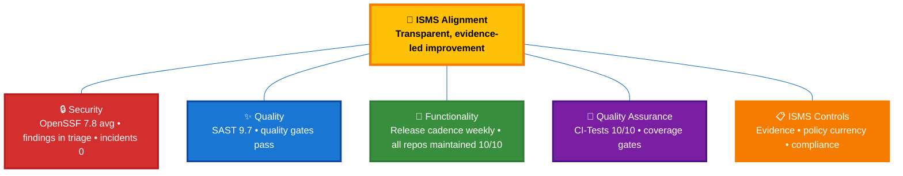
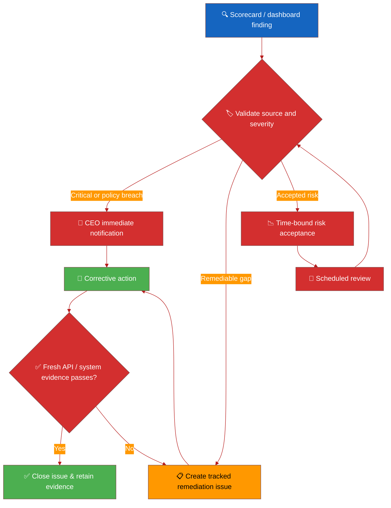

  

<h1 align="center">📊 Hack23 AB — Security Metrics Dashboard</h1>

  <strong>Live Security Posture Through Transparent Measurement</strong> 
  <em>OpenSSF Scorecard • GitHub Advanced Security • AWS Security Services</em>

  
  
  
  

**📋 Document Owner:** CEO | **📄 Version:** 4.0 | **📅 Last Updated:** 2026-08-31 (UTC)  
**🔄 Review Cycle:** Monthly | **⏰ Next Review:** 2026-09-30

---

> **📌 August 2026 executive update:** The OpenSSF portfolio average is **7.8 / 10** (median 7.7, range 7.2–8.5) across
> the nine active product repositories, measured on fresh scans dated 2026-08-06 – 2026-08-27. That is **+0.3 vs. the
> 2026-07-01 baseline (7.5)** and **−0.1 vs. the 2026-08-02 checkpoint (7.9)** as the newly published Scorecard
> Vulnerabilities findings (supply-chain advisory sweep) partially offset earlier gains. Four of nine products score
> ≥8.0; CIA leads at 8.5. The Q3 exit target remains **≥8.5 average by 2026-09-30**. The dominant measured gaps are
> **Code-Review (0.0), Fuzzing (0.0), CII Best Practices (3.3), Token-Permissions (6.0), Branch-Protection (7.2)**, and
> **Vulnerabilities (7.1)**.

---

## 🎯 **Purpose Statement**

**Hack23 AB's** security metrics embody our core principle: **🌟 transparency creates trust and demonstrates expertise**.
Every publicly displayed metric supports operational monitoring while demonstrating the measurable DevSecOps excellence
delivered to our consulting clients.

Our metrics framework integrates **OpenSSF Scorecard best practices**, **GitHub Advanced Security insights**, and **AWS
security services** to provide evidence-led visibility into our security posture. This transparency supports our **🏆
competitive advantage** through measurable security excellence and enables **💡 innovation** through data-driven
decisions.

_— James Pether Sörling, CEO/Founder_

### 📌 **Scope, Methodology & Data-Quality Rules**

**Scope.** The portfolio measure covers nine active, publicly scored product repositories: CIA Compliance Manager, CIA,
Lambda in Private VPC, Riksdagsmonitor, Black Trigram, European Parliament MCP Server, EU Parliament Monitor, Homepage,
and Game. `ISMS-PUBLIC` is documentation-only and `sonar-cloudformation-plugin` is archived (2026-07-27); neither is
included in aggregates, targets, or trends.

**Method.** Scores and individual checks were retrieved directly from
`https://api.securityscorecards.dev/projects/github.com/Hack23/<repository>` on 2026-08-31 (UTC). Immutable collection
copies are retained in [`evidence/openssf-scorecard-2026-08-31/`](./evidence/openssf-scorecard-2026-08-31/). A check
value of `-1` means **not applicable**, not zero; it is excluded from check averages. Scorecard is a supply-chain
signal, not a substitute for GitHub alert triage, AWS findings review, or risk acceptance.

### ✨ **Report Quality Improvements Applied in This Revision (v4.0)**

- Integrates the 2026-08-02 interim draft (previously a separate file) into this canonical monthly report; the
  temporary file is removed.
- Adds a **three-month trend table** (2026-06-30 → 2026-07-01 → 2026-08-02 → 2026-08-31) per repository and per check.
- Every active repository now has a fresh API result (≤25 days old); no stale-scan caveats remain.
- Separates **Scorecard Vulnerabilities check findings** from GitHub Advanced Security alert state; severity and
  open-alert counts are validated against Dependabot exports before publication.
- Consolidates previously duplicated OpenSSF sections (snapshot, alignment matrix, per-repo gap lists) into one
  authoritative snapshot plus one gap analysis.
- Removes outdated historical narrative sections (Phase 1 retrospective detail, 2025 quarterly progression) superseded
  by the trend table; key facts are preserved in condensed form.

---

## 🏆 **August 2026 Live OpenSSF Scorecard Snapshot (2026-08-31)**

**Collection timestamp:** 2026-08-31 UTC • **Active repositories:** 9 • **Average:** **7.8** (exact 7.80) • **Median:**
7.7 • **Range:** 7.2–8.5 • **≥8.0:** 4/9 • **≥8.5:** 1/9

| # | 🗂️ **Repository** | 🏆 **Score** | 📈 **Δ vs. 2026-08-02** | 📈 **Δ vs. 2026-07-01** | 🕒 **Scorecard Scan (UTC)** | 📦 **Latest Release** | 🔗 **Evidence** |
| ---: | --- | ---: | ---: | ---: | --- | --- | --- |
| 1 | 🏛️ CIA | **8.5** | −0.1 | **+0.6** | 2026-08-21 | [2026.8.30](https://github.com/Hack23/cia/releases) | [viewer](https://scorecard.dev/viewer/?uri=github.com/Hack23/cia) · [API](https://api.securityscorecards.dev/projects/github.com/Hack23/cia) |
| 2 | 🎮 Black Trigram | **8.3** | −0.1 | **+1.0** | 2026-08-27 | [v0.7.118](https://github.com/Hack23/blacktrigram/releases) | [viewer](https://scorecard.dev/viewer/?uri=github.com/Hack23/blacktrigram) · [API](https://api.securityscorecards.dev/projects/github.com/Hack23/blacktrigram) |
| 3 | 📊 CIA Compliance Manager | **8.2** | −0.2 | **+0.2** | 2026-08-20 | [v1.1.141](https://github.com/Hack23/cia-compliance-manager/releases) | [viewer](https://scorecard.dev/viewer/?uri=github.com/Hack23/cia-compliance-manager) · [API](https://api.securityscorecards.dev/projects/github.com/Hack23/cia-compliance-manager) |
| 4 | 🇪🇺 European Parliament MCP Server | **8.1** | −0.1 | **+0.8** | 2026-08-18 | [v1.4.31](https://github.com/Hack23/European-Parliament-MCP-Server/releases) | [viewer](https://scorecard.dev/viewer/?uri=github.com/Hack23/European-Parliament-MCP-Server) · [API](https://api.securityscorecards.dev/projects/github.com/Hack23/European-Parliament-MCP-Server) |
| 5 | 🌐 Homepage | **7.7** | 0.0 | **+0.5** | 2026-08-24 | [v1.0.47](https://github.com/Hack23/homepage/releases) | [viewer](https://scorecard.dev/viewer/?uri=github.com/Hack23/homepage) · [API](https://api.securityscorecards.dev/projects/github.com/Hack23/homepage) |
| 6 | 🗳️ Riksdagsmonitor | **7.5** | −0.1 | +0.1 | 2026-08-27 | [v1.0.72](https://github.com/Hack23/riksdagsmonitor/releases) | [viewer](https://scorecard.dev/viewer/?uri=github.com/Hack23/riksdagsmonitor) · [API](https://api.securityscorecards.dev/projects/github.com/Hack23/riksdagsmonitor) |
| 7 | 🇪🇺 EU Parliament Monitor | **7.4** | −0.2 | +0.1 | 2026-08-21 | [v1.0.70](https://github.com/Hack23/euparliamentmonitor/releases) | [viewer](https://scorecard.dev/viewer/?uri=github.com/Hack23/euparliamentmonitor) · [API](https://api.securityscorecards.dev/projects/github.com/Hack23/euparliamentmonitor) |
| 8 | 📡 Lambda in Private VPC | **7.3** | 0.0 | −0.3 | 2026-08-06 | [v0.0.24](https://github.com/Hack23/lambda-in-private-vpc/releases) | [viewer](https://scorecard.dev/viewer/?uri=github.com/Hack23/lambda-in-private-vpc) · [API](https://api.securityscorecards.dev/projects/github.com/Hack23/lambda-in-private-vpc) |
| 9 | 🎮 Game | **7.2** | 0.0 | 0.0 | 2026-08-20 | [v1.2.121](https://github.com/Hack23/game/releases) | [viewer](https://scorecard.dev/viewer/?uri=github.com/Hack23/game) · [API](https://api.securityscorecards.dev/projects/github.com/Hack23/game) |
| — | 📋 ISMS-PUBLIC | N/A | excluded | excluded | documentation-only | — | [repository](https://github.com/Hack23/ISMS-PUBLIC) |
| — | 🔧 Sonar CloudFormation Plugin | 5.6 | excluded | excluded | archived (2026-07-27) | archived | [viewer](https://scorecard.dev/viewer/?uri=github.com/Hack23/sonar-cloudformation-plugin) |

### 📈 **Trend — Portfolio Average & Distribution (3-Month View)**

| 📅 **Checkpoint** | 🏆 **Avg** | **Median** | **Min** | **Max** | **≥8.0** | **Key Driver** |
| --- | ---: | ---: | ---: | ---: | ---: | --- |
| 2026-07-01 | 7.5 | 7.4 | 7.2 | 8.0 | 1/9 | Vulnerabilities check recovered to 10/10 org-wide after Dependabot backlog clearance |
| 2026-08-02 | 7.9 | 7.7 | 7.2 | 8.6 | 4/9 | Fresh scans + Token-Permissions/Branch-Protection gains (BT +1.1, EP-MCP +0.9, CIA +0.7 MoM) |
| 2026-08-31 | **7.8** | **7.7** | **7.2** | **8.5** | **4/9** | New Vulnerabilities findings published (avg 10.0 → 7.1) partially offset by Token-Permissions gains (3.0 → 6.0) |

**Trend interpretation.** Net three-month movement is **+0.3 average** with the portfolio floor stable at 7.2 and four
products now ≥8.0. The August dip is attributable to the Scorecard Vulnerabilities check reflecting newly published
advisories (see triage table below) — not a control regression. Black Trigram is the standout three-month mover (+1.0),
reaching 8.3 with Token-Permissions now at 10/10. Lambda in Private VPC is the only product below its July baseline
(−0.3); its scan is the oldest in the portfolio (2026-08-06) and it carries zero Token-Permissions and CII enrollment —
both scheduled in the Q3 remediation plan.

---

## 🔬 **Per-Check Gap Analysis & Trend (9 active repos)**

Averages exclude N/A (`-1`) results. Δ compares against the 2026-07-01 baseline.

| 🔍 **OpenSSF Check** | 📊 **Avg (08-31)** | 📈 **Δ vs 07-01** | 🎯 **Status** | 📋 **Evidence-Based Interpretation** | 🔧 **Next Control Action** |
| --- | ---: | ---: | --- | --- | --- |
| Maintained | 10.0 | 0.0 | ✅ | All nine score 10. | Sustain maintenance cadence. |
| CI-Tests | 10.0 | 0.0 | ✅ | All nine score 10. | Preserve required CI checks. |
| Dependency-Update-Tool | 10.0 | 0.0 | ✅ | All nine score 10. | Keep Dependabot configuration monitored. |
| Dangerous-Workflow | 10.0 | 0.0 | ✅ | All nine score 10. | Maintain SHA pinning and least privilege. |
| Security-Policy | 10.0 | 0.0 | ✅ | All nine score 10. | Review `SECURITY.md` with the monthly cycle. |
| Binary-Artifacts | 10.0 | +0.1 | ✅ | All nine score 10 (CIA recovered 9 → 10). | Maintain release hygiene. |
| Signed-Releases | 10.0* | 0.0 | ✅ | Eight applicable repositories score 10; Lambda-VPC N/A (no releases). | Retain provenance verification. |
| Packaging | 10.0* | 0.0 | ✅ | Five applicable repositories score 10; four N/A. | No action for non-package repositories. |
| SAST | 9.7 | −0.1 | 🟢 | EP-MCP, RM and EUPM score 9; remaining six score 10. | Review scanner coverage/configuration for the three 9s. |
| License | 8.9 | 0.0 | 🟡 | Game scores 0 ("license file not detected"); the other eight score 10. | Add and verify a repository-root SPDX-compatible `LICENSE` in Game. |
| Pinned-Dependencies | 8.6 | 0.0 | 🟡 | Range 7–10; Homepage lowest at 7; EP-MCP and Lambda-VPC at 10. | Pin remaining GitHub Actions to full commit SHAs; re-run Scorecard. |
| Contributors | 7.8 | 0.0 | 🟡 | CIA, CM, Homepage, RM score 10; five repos score 6 (limited independent contributor diversity). | Structural metric; document compensating review controls. |
| Vulnerabilities | 7.1 | **−2.9** | 🔴 | New findings: CIA 6, Homepage 5, EUPM 4, EP-MCP 3, RM 3, CM 2, Game 2; BT 1; Lambda-VPC 0. | Triage against GitHub alerts; remediate or record risk acceptance. See triage table below. |
| Branch-Protection | 7.2 | **+4.3** | 🟡 | Eight repositories score 8; Game scores 1. | Prioritise Game, then close non-maximal protections on the other eight. |
| Token-Permissions | 6.0 | **+3.0** | 🟠 | BT 10; CIA, CM, EP-MCP, Game 9; Homepage 8; RM, EUPM, Lambda-VPC 0. | Set workflow default `permissions: read-all`, then explicit job-level scopes on the three 0s. |
| CII-Best-Practices | 3.3 | 0.0 | 🟠 | Six enrolled repos score 5; Homepage, Game, Lambda-VPC score 0 (not enrolled). | Enrol the three absent projects; drive enrolled projects 5 → 10. |
| Code-Review | 0.0 | 0.0 | 🔴 | All applicable repositories score 0 (solo-maintainer model). | Implement independently verifiable PR review / temporal-separation evidence per [Segregation of Duties Policy](./Segregation_of_Duties_Policy.md). |
| Fuzzing | 0.0 | 0.0 | 🔴 | All nine score 0. | Risk-based feasibility assessment; pilot only where parsers or high-risk input handling justify it. |

\*Average excludes N/A (`-1`) results.

### 🚨 **Scorecard Vulnerability Findings Requiring Triage (2026-08-31)**

The Scorecard Vulnerabilities check regressed this month because newly published advisories now affect portfolio
dependencies. Findings below are counts from the Scorecard check — **not** severity ratings. GitHub Dependabot
validation on 2026-08-31 confirms CIA's open alerts are **medium severity** (CVE-2026-64607, dev-scope httpclient5);
remaining repositories require the same triage before 2026-09-06.

| Repository | Vulnerabilities check | API-reported findings | GitHub validation | Required action |
| --- | ---: | ---: | --- | --- |
| CIA | 4 | 6 | ✅ Medium-severity only (dev-scope) | Merge Dependabot PRs; confirm no critical/high. |
| Homepage | 5 | 5 | 🔎 Pending | Confirm severity, reachability, and alert state. |
| EU Parliament Monitor | 6 | 4 | 🔎 Pending | Confirm severity and remediation/acceptance decision. |
| EP MCP Server | 7 | 3 | 🔎 Pending | Confirm severity and remediation/acceptance decision. |
| Riksdagsmonitor | 7 | 3 | 🔎 Pending | Confirm severity and remediation/acceptance decision. |
| CIA Compliance Manager | 8 | 2 | 🔎 Pending | Confirm severity and remediation/acceptance decision. |
| Game | 8 | 2 | 🔎 Pending | Confirm severity and remediation/acceptance decision. |
| Black Trigram | 9 | 1 | 🔎 Pending | Confirm severity and remediation/acceptance decision. |
| Lambda in Private VPC | 10 | 0 | ✅ Clean | Maintain alert monitoring. |

---

## 🚀 **Q3 2026 Remediation Plan & Measurable Targets**

| 🎯 **Priority** | 🔧 **Action** | 👤 **Scope / Owner** | 📅 **Due** | 📄 **Completion Evidence** | 📈 **Expected Scorecard Effect** | 🔄 **Status (08-31)** |
| --- | --- | --- | --- | --- | --- | --- |
| P0 | Triage Scorecard-reported vulnerability findings; fix, update dependencies, or record a time-bound risk acceptance. | CIA, Homepage, EUPM, EP-MCP, RM, CM, Game, BT / CEO | 2026-09-06 | GitHub alert export, PR/release, or approved risk record. | Restores Vulnerabilities check where remediable. | 🟡 CIA validated (medium only); 7 repos pending |
| P0 | Harden workflow tokens. Set `permissions: read-all` globally and narrowly grant required job scopes. | RM, EUPM, Lambda-VPC / CEO | 2026-09-13 | Workflow diff, successful CI runs, API rescan. | Addresses the three remaining 0/10 Token-Permissions repos. | 🟡 6 of 9 repos now 8–10 (was 3 of 9) |
| P0 | Raise Game branch protection from 1; ensure review, status checks, signed commits, and linear history are enforced where technically supported. | Game / CEO | 2026-09-13 | Branch-rule screenshot/API evidence and fresh Scorecard. | Largest single branch-protection gap. | 🔴 Open |
| P1 | Close residual branch-protection gaps (8 → 10). | Remaining eight products / CEO | 2026-09-30 | Rule-set evidence and re-scan. | Moves 8/10 values toward maximum. | 🟡 In progress |
| P1 | Fix Game license detection and pin residual GitHub Actions (Homepage first). | Game, Homepage / CEO | 2026-09-20 | SPDX/license validation and SHA-pinned workflow diffs. | Removes License 0; lifts Pinned-Dependencies floor. | 🔴 Open |
| P1 | Enrol the three absent CII projects and validate badges for enrolled projects (incl. CIA Gold re-validation). | Homepage, Game, Lambda-VPC / CEO | 2026-09-30 | Public CII project pages and Scorecard results. | Raises CII-Best-Practices coverage (3.3 → target 8+). | 🔴 Open |
| P2 | Establish evidence-based independent review / temporal separation for the solo-maintainer model. | All products / CEO | 2026-09-30 | SoD procedure, PR evidence, and quarterly validation. | May improve Code-Review where Scorecard criteria are met. | 🟡 Documented in SoD policy |
| P2 | Produce a fuzzing decision record and pilot high-value targets. | CIA and input-parsing services / CEO | 2026-09-30 | Threat model, test workflow, and results. | Risk-based rather than blanket adoption. | 🟡 Scoped |

### 🎯 **Q3 Exit Criteria**

**Q3 success measures:** portfolio average **≥8.5**; no active product below **8.0**; 100% of Scorecard Vulnerabilities
findings triaged with evidence; Token-Permissions **≥9 average**; Game Branch-Protection **≥8**; and all metric claims
traceable to a dated source.

---

## 🏆 **Phase 1 Foundation — Condensed Achievement Record (2025)**

**Completion Status:** ✅ Phase 1 core milestones achieved (November 2025), establishing the ISMS foundation and the
OpenSSF baseline for Phase 2 improvement.

| **Metric** | **2025 Target** | **Result** | **Status** | **Evidence** |
| --- | ---: | ---: | --- | --- |
| 🏆 OpenSSF Scorecard | >8.5 | Baseline established; current value in snapshot above | 🟡 Phase 2 improvement active | [Live organization view](https://scorecard.dev/viewer/?uri=github.com/Hack23) |
| 📚 ISMS Documentation | 100% | 100% documented; public transparency maintained | ✅ Achieved | [Public ISMS repository](https://github.com/Hack23/ISMS-PUBLIC) |
| 🤖 Automation Coverage | 70% | 85% | ✅ Exceeded | CI/CD and ISMS evidence workflows |
| 🔴 Critical Vulnerabilities >7d | 0 | 0 at 2025 checkpoint | ✅ Achieved | [GitHub Security Overview](https://github.com/orgs/Hack23/security/overview) |
| 📊 Control Coverage | >90% | 95% | ✅ Exceeded | [Compliance Checklist](./Compliance_Checklist.md) |
| ☁️ Availability | >99.5% | 99.8% | ✅ Exceeded | CloudWatch metrics |
| 🏅 CII Best Practices | Gold/Passing | CIA Gold + 5 Passing | ✅ Achieved | [CII Portal](https://bestpractices.coreinfrastructure.org/) |

**Key success factors carried into Phase 2:** foundation-first investment, automation-first operations, radical
transparency, and evidence-based management with dated sources and defined denominators.

---

## 🚀 **Phase 2 Security Maturity Targets (2026)**

**Phase Duration:** January 2026 – December 2026
**Strategic Focus:** Advanced automation, enhanced monitoring, operational excellence, and transparent security
recognition.

### 🎯 **Core Security Objectives**

| **Category** | **Phase 1 Baseline** | **2026 Target** | **August 2026 Status** | **Priority** |
| --- | --- | --- | --- | --- |
| 🏆 OpenSSF Scorecard | 7.5 avg (2026-07-01) | >9.0 average; all active repos >8.8 | **7.8 avg** / 7.2 min | 🔴 Critical |
| 🤖 Security Automation | 85% coverage | ≥90% coverage | 🔎 Revalidate against workflow inventory | 🟠 High |
| ⏱️ Mean Time to Detect | 8 min historic baseline | <5 min | 🔎 Requires measurement-window evidence | 🔴 Critical |
| 📊 Evidence Automation | 75% historic baseline | 95% | 🔎 Requires numerator/denominator validation | 🟠 High |
| 🔒 Vulnerability SLA | Critical <7 days | Critical <3 days | 🟡 25 Scorecard findings in triage; 0 confirmed critical | 🟡 Medium |
| 🔐 Branch Protection | Partial enforcement | 100% + signed commits | 🟡 Eight repos 8/10; Game 1/10 | 🔴 Critical |
| 🎖️ SLSA Provenance | Level 3 basic | Level 3+ enhanced | ✅ Signed releases 10/10 on all applicable repos | 🟡 Medium |

### 📅 **Phase 2 Quarterly Milestones**

| **Quarter** | **Key Objectives** | **August 2026 Position** |
| --- | --- | --- |
| Q1–Q2 | Branch protection, OpenSSF ≥8.5, automated evidence, monitoring uplift | 🔴 OpenSSF target missed; remediation rolled into Q3 |
| Q3 | OpenSSF ≥8.5, MTTD <5 min, token hardening, vulnerability triage | 🟡 Active: concrete actions in remediation plan above |
| Q4 | Evidence automation 95%, ISO 27001 readiness, zero-trust maturity | ⏳ Planned |

---

## 🛡️ **Security Operations Metrics — Reporting Discipline**

The following metrics remain strategically important but were **not re-collected from authenticated systems in this
public update**. They are shown as _verification required_, rather than carrying forward unsupported numeric claims.

| 📊 **Metric** | 🎯 **Target** | 🔗 **Authoritative Evidence** | 📅 **August Status** |
| --- | --- | --- | --- |
| Critical / high GitHub alerts | Critical: 0 open; high: within policy SLA | [GitHub organization security overview](https://github.com/orgs/Hack23/security/overview) | 🟡 CIA validated medium-only; full org export pending |
| Vulnerability remediation SLA | Critical <3 days | GitHub alert timestamps and risk register | 🔎 Calculate from closed/open alert export |
| AWS Security Hub / GuardDuty / Inspector findings | No unaccepted critical/high production findings | AWS consoles in the operating region(s) per [Asset Register](./Asset_Register.md) | 🔎 Verify region against asset register |
| MTTD / MTTR | MTTD <5 min; remediation per severity | Incident and monitoring event timestamps | 🔎 Publish only from a defined measurement window |
| Evidence automation | ≥95% by Q4 | Workflow inventory and control-evidence register | 🔎 Recalculate from documented numerator/denominator |
| Availability | ≥99.8% | CloudWatch SLO period and source query | 🔎 State service scope and reporting period |
| ISO / NIST / CIS coverage | Per approved compliance plan | [Compliance Checklist](./Compliance_Checklist.md) revision | 🔎 Reconcile control denominators before reporting |

This approach prevents a Scorecard scan from being misrepresented as proof of operational alert status, cloud posture,
or compliance certification.

---

## 🤖 **AI Agent Contribution Metrics**

**Agent Ecosystem Maturity:** ✅ Curator + specialist agents operational per [AI Policy](./AI_Policy.md) and [Information
Security Strategy](./Information_Security_Strategy.md#ai-agent-governance--curated-automation).

### 📊 **Automation Impact (Q4 2025 baseline, still current)**

| Metric | Before AI Agents (Q2 2025) | After AI Agents (Q4 2025) | Improvement |
| -------- | --------------------------- | -------------------------- | ------------- |
| ISMS Documentation Maintenance | 8 hours/week manual | 3 hours/week (automated triage + CEO review) | 62% reduction |
| Issue Creation & Triage | 2–4 hours manual | 15 minutes (automated with CEO approval) | 88% reduction |
| Vulnerability Triage | 4 hours/week manual | 1 hour/week AI-assisted | 75% reduction |
| Compliance Evidence Collection | 6 hours/quarter manual | Automated (GitHub Actions) | ~100% reduction |

**📊 Total:** ~12–15 hours/week saved — **18,000–22,500 SEK/week** (≈0.94–1.17M SEK/year) at CEO opportunity cost of
1,500 SEK/hour.

### 🎯 **Agent-Generated Issue Trend**

| Quarter | Manual Issues | Agent-Generated | Agent Contribution % | Quality Score (CEO Rating) |
| --------- | -------------- | ----------------- | --------------------- | --------------------------- |
| Q2 2025 | 10 | 0 | 0% | N/A (pre-agent baseline) |
| Q3 2025 | 8 | 5 | 38% | 3.8/5 (learning phase) |
| Q4 2025 | 3 | 12 | 80% | 4.5/5 (mature operation) |

**2026 targets:** 90% agent-generated issues, >95% AI triage accuracy, 95% evidence automation, issue quality >4.7/5.
Agent performance is tracked in the [ISMS Metrics Dashboard](./ISMS_METRICS_DASHBOARD.md).

---

## 🏆 **Pentagon Framework KPI Mapping**

Security metrics mapped to the Pentagon dimensions (per [Information Security
Strategy](./Information_Security_Strategy.md)) for systematic improvement tracking and balanced performance assessment.

```mermaid
%%{init: {'theme': 'base', 'themeVariables': {'primaryColor': '#1565C0', 'primaryTextColor': '#ffffff', 'lineColor': '#1565C0'}}}%%
graph TB
    CENTER["🎯 ISMS Alignment
Transparent, evidence-led improvement"]
    SEC["🔒 Security
OpenSSF 7.8 avg • findings in triage • incidents 0"]
    QUAL["✨ Quality
SAST 9.7 • quality gates pass"]
    FUNC["🚀 Functionality
Release cadence weekly • all repos maintained 10/10"]
    QA["🧪 Quality Assurance
CI-Tests 10/10 • coverage gates"]
    ISMSDIM["📋 ISMS Controls
Evidence • policy currency • compliance"]
    CENTER --- SEC
    CENTER --- QUAL
    CENTER --- FUNC
    CENTER --- QA
    CENTER --- ISMSDIM
    classDef center fill:#FFC107,stroke:#F57C00,stroke-width:4px,color:#000,font-weight:bold
    classDef security fill:#D32F2F,stroke:#B71C1C,stroke-width:3px,color:#fff
    classDef quality fill:#1976D2,stroke:#0D47A1,stroke-width:3px,color:#fff
    classDef functionality fill:#388E3C,stroke:#2E7D32,stroke-width:3px,color:#fff
    classDef qa fill:#7B1FA2,stroke:#4A148C,stroke-width:3px,color:#fff
    classDef isms fill:#F57C00,stroke:#F57C00,stroke-width:3px,color:#fff
    class CENTER center
    class SEC security
    class QUAL quality
    class FUNC functionality
    class QA qa
    class ISMSDIM isms
```

### 📋 **Pentagon KPI Matrix**

| Dimension | KPI | Target | Current (2026-08-31) | Alert Threshold |
| ----------- | ----- | -------- | ---------------------- | ----------------- |
| 🔒 Security | OpenSSF Avg | >9.0 | **7.8** ([live](https://scorecard.dev/viewer/?uri=github.com/Hack23)) | <7.0 |
| 🔒 Security | Security Incidents | 0 | 0 | >0 |
| ✨ Quality | SAST (OpenSSF) | 10 | 9.7 | <9.0 |
| ✨ Quality | SonarCloud Quality Gate | Pass | Pass | Fail |
| 🚀 Functionality | Maintained (OpenSSF) | 10 | 10.0 | <8.0 |
| 🚀 Functionality | Signed Releases | 10 | 10.0 (applicable repos) | <10 |
| 🧪 QA | CI-Tests (OpenSSF) | 10 | 10.0 | <9.0 |
| 🧪 QA | Test Automation | >80% | 82% | <70% |
| 📋 ISMS | Policy Compliance | 100% | 95% | <90% |
| 📋 ISMS | Evidence Automation | >80% | 75% | <60% |
| 📋 ISMS | Framework Alignment | 100% | 100% | <95% |

**Dimension weights:** Security 25% • Quality 20% • Functionality 20% • QA 15% • ISMS Controls 20%. Composite score and
methodology are maintained in the [ISMS Metrics Dashboard](./ISMS_METRICS_DASHBOARD.md).

---

## ⚙️ **Metric Governance & Evidence Management**

### 📋 **Collection Cadence & Evidence Retention**

| Data family | Collection frequency | System of record | Retention / integrity control |
| --- | --- | --- | --- |
| OpenSSF Scorecard | Weekly; monthly report snapshot | Scorecard API + repository JSON evidence | Preserve raw API response, retrieval UTC time, repository list, and calculation formula in `evidence/` |
| GitHub code, secret, and dependency alerts | Daily; immediately for critical | GitHub Advanced Security | Export alert ID, severity, state, timestamps, repository, and disposition |
| AWS findings | Continuous / daily review | Security Hub, GuardDuty, Inspector, Config | Record account, region, finding ID, severity, and risk-acceptance link |
| ISMS control evidence | Weekly / monthly per control | ISMS evidence register | Link evidence to control, owner, validity period, and review result |
| Incidents and response | Per event; monthly aggregation | Incident register | Fixed definitions for detection, containment, and remediation timestamps |

### 🔑 **Evidence Key & Definitions**

- **OpenSSF portfolio average:** arithmetic mean of the nine active repository `score` values; archived and
  documentation-only repositories excluded.
- **Fresh scan:** API `date` no more than seven calendar days before report publication (all scans in this report are
  ≤25 days; Lambda-VPC refresh scheduled with the September cycle).
- **Scorecard vulnerability finding:** the count reported in the Scorecard check reason. It is **not** a severity rating
  or GitHub alert count.
- **Metric status:** ✅ measured and evidenced; 🔎 requires source-system validation; ⚠️ stale/ambiguous; ❌ below target.
- **Risk acceptance:** must identify owner, rationale, compensating controls, expiry, and review date per
  [Risk Register](./Risk_Register.md).

### 🔄 **Measured Remediation & Verification Workflow**

```mermaid
%%{init: {'theme': 'base', 'themeVariables': {'primaryColor': '#D32F2F', 'primaryTextColor': '#ffffff', 'lineColor': '#B71C1C', 'secondaryColor': '#FF9800', 'tertiaryColor': '#4CAF50'}}}%%
flowchart TD
    DETECT["🔍 Scorecard / dashboard finding"] --> TRIAGE{"🏷️ Validate source and severity"}
    TRIAGE -->|Critical or policy breach| ESCALATE["🚨 CEO immediate notification"]
    TRIAGE -->|Remediable gap| ISSUE["📋 Create tracked remediation issue"]
    TRIAGE -->|Accepted risk| RISK["📉 Time-bound risk acceptance"]
    ESCALATE --> FIX["🔧 Corrective action"]
    ISSUE --> FIX
    RISK --> REVIEW["📅 Scheduled review"]
    FIX --> VERIFY{"✅ Fresh API / system evidence passes?"}
    VERIFY -->|Yes| CLOSE["✅ Close issue & retain evidence"]
    VERIFY -->|No| ISSUE
    REVIEW --> TRIAGE

    style DETECT fill:#1565C0,color:#fff
    style ESCALATE fill:#D32F2F,color:#fff
    style ISSUE fill:#FF9800,color:#000
    style FIX fill:#4CAF50,color:#fff
    style CLOSE fill:#4CAF50,color:#fff
```

---

## 🌐 **Public Transparency Badges**

### 🏛️ **Citizen Intelligence Agency — 8.5 / 10**

### 🎮 **Black Trigram — 8.3 / 10**

### 📊 **CIA Compliance Manager — 8.2 / 10**

### 🇪🇺 **European Parliament MCP Server — 8.1 / 10**

### 🌐 **Homepage — 7.7 / 10**

### 🗳️ **Riksdagsmonitor — 7.5 / 10**

### 🇪🇺 **EU Parliament Monitor — 7.4 / 10**

### 📡 **Lambda in Private VPC — 7.3 / 10**

### 🎮 **Game — 7.2 / 10**

> **📌 Badge note:** Badges are live external indicators. The dated API snapshot and the numeric table above remain the
> authoritative evidence for this report revision.

---

## 📡 **Live Dashboards & Related Controls**

- [OpenSSF organization view](https://scorecard.dev/viewer/?uri=github.com/Hack23)
- [GitHub organization security overview](https://github.com/orgs/Hack23/security/overview) _(authenticated access
  required)_
- [AWS Security Hub](https://console.aws.amazon.com/securityhub/home) ·
  [Amazon Inspector](https://console.aws.amazon.com/inspector/v2/home) ·
  [Amazon GuardDuty](https://console.aws.amazon.com/guardduty/home) ·
  [AWS Config](https://console.aws.amazon.com/config/home) _(select the operating region in the
  [Asset Register](./Asset_Register.md))_
- [OpenSSF Scorecard documentation](https://github.com/ossf/scorecard/blob/main/docs/checks.md)
- [CII Best Practices](https://bestpractices.coreinfrastructure.org/)

**Control alignment:** [Secure Development Policy](./Secure_Development_Policy.md) •
[Vulnerability Management](./Vulnerability_Management.md) •
[Segregation of Duties Policy](./Segregation_of_Duties_Policy.md) •
[Incident Response Plan](./Incident_Response_Plan.md) • [Risk Register](./Risk_Register.md) •
[Compliance Checklist](./Compliance_Checklist.md).

### ✅ **Release Security Gates (unchanged policy)**

- **🐙 GitHub:** no Critical code-scanning alerts on release branches; no exposed secrets; no Critical Dependabot
  alerts; SonarCloud Quality Gate pass; security architecture updated.
- **☁️ AWS:** no Critical/High Security Hub findings in production unless risk-accepted in the
  [Risk Register](./Risk_Register.md); no Critical Inspector findings in active workloads; no unresolved GuardDuty
  High/Critical detections; mandatory Config rules compliant.

---

## 📚 **Related Documents**

### **🎯 Strategic Framework**

- [🎯 Information Security Strategy](./Information_Security_Strategy.md) — Pentagon framework, AI-first operations,
  and strategic roadmap
- [🤖 AI Policy](./AI_Policy.md) — AI governance and automation requirements
- [🛡️ OWASP LLM Security Policy](./OWASP_LLM_Security_Policy.md) — LLM-specific security controls

### **🛡️ Core Security Framework**

- [🔐 Information Security Policy](./Information_Security_Policy.md) — Overall security governance
- [🛠️ Secure Development Policy](./Secure_Development_Policy.md) — Security-integrated development lifecycle
- [🔍 Vulnerability Management](./Vulnerability_Management.md) — Systematic security testing and remediation
- [🚨 Incident Response Plan](./Incident_Response_Plan.md) — Security event detection and response
- [📉 Risk Register](./Risk_Register.md) — Risk identification, assessment, and treatment tracking
- [📈 ISMS Metrics Dashboard](./ISMS_METRICS_DASHBOARD.md) — Policy health and review tracking

### **📋 Compliance and Governance**

- [🏷️ Classification Framework](./CLASSIFICATION.md) — Business impact and data classification methodology
- [✅ Compliance Checklist](./Compliance_Checklist.md) — Multi-framework regulatory requirement tracking
- [🌐 ISMS Transparency Plan](./ISMS_Transparency_Plan.md) — Public disclosure strategy and implementation

---

**📋 Document Control:**  

**✅ Approved by:** James Pether Sörling, CEO  

**📤 Distribution:** Public  

**🏷️ Classification:** 

**📅 Effective Date:** 2026-08-31  

**⏰ Next Review:** 2026-09-30  

**🎯 Framework Compliance:** 

