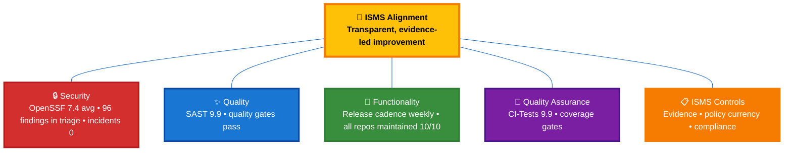
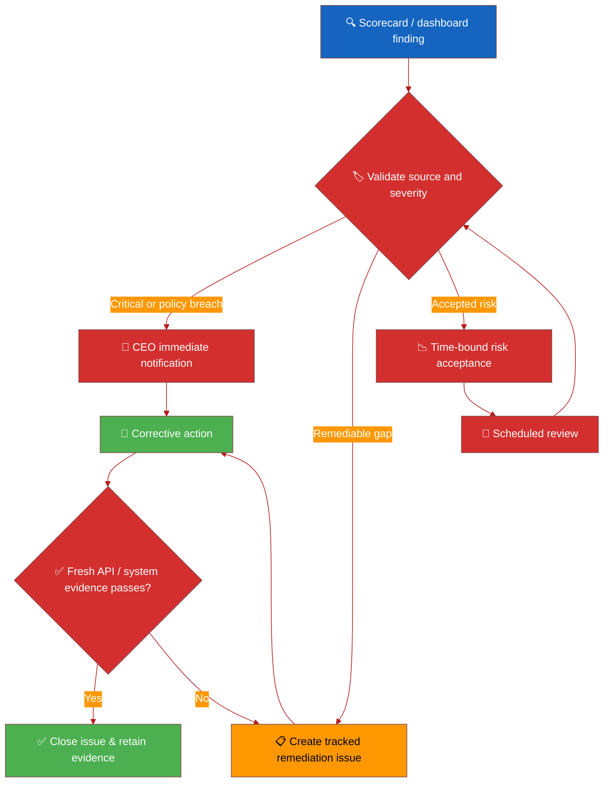

  

<h1 align="center">📊 Hack23 AB — Security Metrics Dashboard</h1>

  <strong>Live Security Posture Through Transparent Measurement</strong> 
  <em>OpenSSF Scorecard • GitHub Advanced Security • AWS Security Services</em>

  
  
  
  

**📋 Document Owner:** CEO | **📄 Version:** 4.1 | **📅 Last Updated:** 2026-10-01 (UTC)  
**🔄 Review Cycle:** Monthly | **⏰ Next Review:** 2026-10-31

---

> **📌 October 2026 executive update (Q3 close):** The OpenSSF portfolio average is **7.4 / 10** (median 7.45, range
> 6.5–8.5) across the **eight** active product repositories, measured on fresh scans dated 2026-09-30 – 2026-10-01.
> On a like-for-like eight-repository basis this is **−0.45 vs. 2026-08-31 (7.86)** and **−0.05 vs. the 2026-07-01
> baseline (7.45)**. The decline is driven by a **single check**: Scorecard **Vulnerabilities** fell from 6.8 to
> **0.5** as newly published npm advisories (`brace-expansion`, `qs`, `joi`, `js-yaml`, `axios`, `ip-address`) were
> matched in seven of eight products — 96 repository-level findings, 43 unique advisories. **No other check
> regressed materially**; SAST improved (9.6 → 9.9). Modelling with Scorecard's published weights shows that clearing
> the Vulnerabilities findings alone restores an **≈8.1 average**, and also closing Token-Permissions,
> Branch-Protection, CII, License and Pinned-Dependencies gaps yields **≈8.8**. The **Q3 exit target (≥8.5) was not
> met**; the remediation plan is re-baselined for Q4 below. `lambda-in-private-vpc` was archived after the
> 2026-08-31 report and leaves the active scope.

---

## 🎯 **Purpose Statement**

**Hack23 AB's** security metrics embody our core principle: **🌟 transparency creates trust and demonstrates expertise**.
Every publicly displayed metric supports operational monitoring while demonstrating the measurable DevSecOps excellence
delivered to our consulting clients.

Our metrics framework integrates **OpenSSF Scorecard best practices**, **GitHub Advanced Security insights**, and **AWS
security services** to provide evidence-led visibility into our security posture. This transparency supports our **🏆
competitive advantage** through measurable security excellence and enables **💡 innovation** through data-driven
decisions.

_— James Pether Sörling, CEO/Founder_

### 📌 **Scope, Methodology & Data-Quality Rules**

**Scope.** All **18** public repositories in the `Hack23` GitHub organization were enumerated via
`https://api.github.com/orgs/Hack23/repos?type=public` on 2026-10-01. The **portfolio measure** covers the eight
active, publicly scored product repositories: CIA, CIA Compliance Manager, Black Trigram, European Parliament MCP
Server, Homepage, Riksdagsmonitor, EU Parliament Monitor, and Game. Archived, template, documentation-only, and
non-indexed repositories are reported in the **All Public Repositories — Scorecard Inventory** table below
but excluded from aggregates, targets, and trends.

**Scope change.** `lambda-in-private-vpc` is now **archived** (last push 2026-08-05; last Scorecard scan 2026-08-06)
and is removed from the active portfolio. To keep the trend honest, earlier checkpoints are **re-stated on the same
eight-repository basis**; the originally published nine-repository values are shown alongside for traceability.

**Method.** Scores and individual checks were retrieved directly from
`https://api.securityscorecards.dev/projects/github.com/Hack23/<repository>` on 2026-10-01 (UTC). Scorecard
Vulnerabilities finding IDs were resolved to package and severity via `https://api.osv.dev/v1/vulns/<GHSA-ID>`.
Immutable collection copies are retained in
[`evidence/openssf-scorecard-2026-10-01/`](./evidence/openssf-scorecard-2026-10-01/) (13 Scorecard JSON responses plus
`osv-advisory-severity.json`). A check value of `-1` means **not applicable**, not zero; it is excluded from check
averages. Scorecard is a supply-chain signal, not a substitute for GitHub alert triage, AWS findings review, or risk
acceptance.

### ✨ **Report Quality Improvements Applied in This Revision (v4.1)**

- Extends coverage from nine scored product repositories to an **inventory of all 18 public repositories**, with
  scan date and status for each (13 scored, 5 not indexed by the Scorecard API).
- Re-states the trend on a **consistent eight-repository denominator** after the `lambda-in-private-vpc` archival.
- Resolves every Scorecard Vulnerabilities finding to **advisory ID, package, and OSV/GHSA severity**, replacing
  count-only reporting; shared root causes are grouped so that one dependency fix can be traced across products.
- Adds a **Scorecard-weighted what-if model** (reproduces published scores to ±0.05) so that remediation priorities are
  ranked by measurable score effect.
- Records a formal **Q3 exit-criteria assessment** and a re-baselined **Q4 remediation plan**.

---

## 🏆 **October 2026 Live OpenSSF Scorecard Snapshot (2026-10-01)**

**Collection timestamp:** 2026-10-01 UTC • **Active repositories:** 8 • **Average:** **7.4** (exact 7.41) •
**Median:** 7.45 • **Range:** 6.5–8.5 • **≥8.0:** 1/8 • **≥8.5:** 1/8

| # | 🗂️ **Repository** | 🏆 **Score** | 📈 **Δ vs. 2026-08-31** | 📈 **Δ vs. 2026-07-01** | 🕒 **Scorecard Scan (UTC)** | 📦 **Latest Release** | 🔗 **Evidence** |
| ---: | --- | ---: | ---: | ---: | --- | --- | --- |
| 1 | 🏛️ CIA | **8.5** | 0.0 | **+0.6** | 2026-10-01 | [2026.9.30](https://github.com/Hack23/cia/releases) | [viewer](https://scorecard.dev/viewer/?uri=github.com/Hack23/cia) · [API](https://api.securityscorecards.dev/projects/github.com/Hack23/cia) |
| 2 | 📊 CIA Compliance Manager | **7.7** | −0.5 | −0.3 | 2026-10-01 | [v1.1.155](https://github.com/Hack23/cia-compliance-manager/releases) | [viewer](https://scorecard.dev/viewer/?uri=github.com/Hack23/cia-compliance-manager) · [API](https://api.securityscorecards.dev/projects/github.com/Hack23/cia-compliance-manager) |
| 3 | 🎮 Black Trigram | **7.6** | −0.7 | +0.3 | 2026-10-01 | [v0.7.132](https://github.com/Hack23/blacktrigram/releases) | [viewer](https://scorecard.dev/viewer/?uri=github.com/Hack23/blacktrigram) · [API](https://api.securityscorecards.dev/projects/github.com/Hack23/blacktrigram) |
| 4 | 🇪🇺 European Parliament MCP Server | **7.6** | −0.5 | +0.3 | 2026-10-01 | [v1.4.53](https://github.com/Hack23/European-Parliament-MCP-Server/releases) | [viewer](https://scorecard.dev/viewer/?uri=github.com/Hack23/European-Parliament-MCP-Server) · [API](https://api.securityscorecards.dev/projects/github.com/Hack23/European-Parliament-MCP-Server) |
| 5 | 🌐 Homepage | **7.3** | −0.4 | +0.1 | 2026-09-30 | [v1.0.56](https://github.com/Hack23/homepage/releases) | [viewer](https://scorecard.dev/viewer/?uri=github.com/Hack23/homepage) · [API](https://api.securityscorecards.dev/projects/github.com/Hack23/homepage) |
| 6 | 🗳️ Riksdagsmonitor | **7.1** | −0.4 | −0.3 | 2026-10-01 | [v1.0.87](https://github.com/Hack23/riksdagsmonitor/releases) | [viewer](https://scorecard.dev/viewer/?uri=github.com/Hack23/riksdagsmonitor) · [API](https://api.securityscorecards.dev/projects/github.com/Hack23/riksdagsmonitor) |
| 7 | 🇪🇺 EU Parliament Monitor | **7.0** | −0.4 | −0.3 | 2026-09-30 | [v1.0.85](https://github.com/Hack23/euparliamentmonitor/releases) | [viewer](https://scorecard.dev/viewer/?uri=github.com/Hack23/euparliamentmonitor) · [API](https://api.securityscorecards.dev/projects/github.com/Hack23/euparliamentmonitor) |
| 8 | 🎮 Game | **6.5** | −0.7 | −0.7 | 2026-10-01 | [v1.2.134](https://github.com/Hack23/game/releases) | [viewer](https://scorecard.dev/viewer/?uri=github.com/Hack23/game) · [API](https://api.securityscorecards.dev/projects/github.com/Hack23/game) |

**Every per-repository decline equals that repository's Vulnerabilities-check loss** (e.g. Black Trigram 9 → 0,
Game 8 → 0, Homepage 5 → 0). CIA is unchanged because its six findings (score 4) were already present on 2026-08-31.
All eight products shipped a release on 2026-09-29/30, so release cadence (Maintained 10/10) is not the constraint.

### 🗂️ **All Public Repositories — Scorecard Inventory (2026-10-01)**

| 🗂️ **Repository** | 🏷️ **Status** | 🏆 **Score** | 🕒 **Scan (UTC)** | 📋 **Treatment** |
| --- | --- | ---: | --- | --- |
| 8 active products (table above) | Active | 6.5–8.5 | 2026-09-30 – 10-01 | Portfolio measure |
| 📡 lambda-in-private-vpc | Archived (after 2026-08-31) | 7.3 | 2026-08-06 | Excluded from 2026-10-01; restated history |
| 🔧 sonar-cloudformation-plugin | Archived (2026-07-27) | 5.6 | 2026-09-28 | Excluded |
| 🤖 securityfixerbot | Archived | 3.7 | 2026-09-28 | Excluded |
| 🔧 sonar-quality-gates-maven-plugin | Archived fork | 2.0 | 2026-09-28 | Excluded |
| 📄 templateopensource | Active template (last push 2023-01-30) | 4.8 | ⚠️ 2023-04-06 (stale) | Excluded; archive or add Scorecard workflow (decision due 2026-10-31) |
| 📋 ISMS-PUBLIC | Documentation-only | N/A | not indexed | Excluded |
| ⚙️ .github | Org configuration | N/A | not indexed | Excluded |
| 🎤 talks | Presentation material | N/A | not indexed | Excluded |
| 📦 ciamavenrepo | Maven artifact host | N/A | not indexed | Excluded |
| 🧪 RefactorAIOperationsIDE | Experimental | N/A | not indexed | Excluded |

**All-public-repository context (informational only):** the unweighted mean of all 13 scored public repositories is
**6.4**, pulled down by archived legacy projects and a stale template scan. It is not a target metric.

### 📈 **Trend — Portfolio Average & Distribution (8 Active Repositories, Restated)**

| 📅 **Checkpoint** | 🏆 **Avg (8 repos)** | **Published Avg (9 repos)** | **Median** | **Min** | **Max** | **≥8.0** | **Key Driver** |
| --- | ---: | ---: | ---: | ---: | ---: | ---: | --- |
| 2026-07-01 | 7.45 | 7.5 | 7.3 | 7.2 | 8.0 | 1/8 | Vulnerabilities recovered to 10/10 after Dependabot backlog clearance |
| 2026-08-02 | 7.96 | 7.9 | 7.95 | 7.2 | 8.6 | 4/8 | Token-Permissions / Branch-Protection gains |
| 2026-08-31 | 7.86 | 7.8 | 7.9 | 7.2 | 8.5 | 4/8 | First wave of new advisories (Vulnerabilities avg 10.0 → 6.8) |
| 2026-10-01 | **7.41** | — (7.40 incl. archived Lambda-VPC) | **7.45** | **6.5** | **8.5** | **1/8** | Second advisory wave (Vulnerabilities 6.8 → 0.5); SAST +0.3 |

**Trend interpretation.** The control baseline (branch protection, token permissions, signed releases, SAST, CI) is
**stable or improving**; the score movement since August is almost entirely **external advisory publication**
against shared npm transitive dependencies. Hack23 cannot control advisory timing, but it does control time-to-patch:
the September cycle did not merge the dependency updates that would have prevented the second wave. Game has fallen
below its 2026-07-01 floor for the first time (6.5) because it combines the Vulnerabilities loss with the two largest
structural gaps (Branch-Protection 1, License 0).

---

## 🔬 **Per-Check Gap Analysis & Trend (8 active repos)**

Averages exclude N/A (`-1`) results. Δ compares against 2026-08-31 restated on the same eight repositories.
**Weight** is the Scorecard risk weight (Critical 10, High 7.5, Medium 5, Low 2.5).

| 🔍 **OpenSSF Check** | ⚖️ **Weight** | 📊 **Avg (10-01)** | 📈 **Δ vs 08-31** | 🎯 **Status** | 📋 **Evidence-Based Interpretation** | 🔧 **Next Control Action** |
| --- | ---: | ---: | ---: | --- | --- | --- |
| Dangerous-Workflow | 10 | 10.0 | 0.0 | ✅ | All eight score 10. | Maintain SHA pinning and least privilege. |
| Maintained | 7.5 | 10.0 | 0.0 | ✅ | All eight score 10; all released 2026-09-29/30. | Sustain cadence. |
| Dependency-Update-Tool | 7.5 | 10.0 | 0.0 | ✅ | Dependabot detected in all eight. | Shift focus from detection to **merge latency**. |
| Binary-Artifacts | 7.5 | 10.0 | 0.0 | ✅ | All eight score 10. | Maintain release hygiene. |
| Signed-Releases | 7.5 | 10.0 | 0.0 | ✅ | All eight score 10. | Retain provenance verification. |
| Security-Policy | 5 | 10.0 | 0.0 | ✅ | All eight score 10. | Review `SECURITY.md` with the monthly cycle. |
| Packaging | 5 | 10.0* | 0.0 | ✅ | Five applicable score 10; CIA, Homepage, Game N/A. | No action. |
| SAST | 5 | 9.9 | **+0.3** | 🟢 | RM and EUPM improved 9 → 10; only EP-MCP at 9 ("not run on all commits"). | Run CodeQL on every commit/PR path in EP-MCP. |
| CI-Tests | 2.5 | 9.9 | −0.1 | 🟢 | EP-MCP 15/16 merged PRs CI-checked (score 9). | Enforce required status checks for every PR. |
| License | 2.5 | 8.8 | 0.0 | 🟡 | Game still 0 (GitHub API also reports no license). | Add root `LICENSE` (Apache-2.0) to Game. |
| Pinned-Dependencies | 5 | 8.4 | 0.0 | 🟡 | Range 7–10; Homepage 7; EP-MCP 10. | Hash-pin remaining actions/containers; Homepage first. |
| Contributors | 2.5 | 8.0 | 0.0 | 🟡 | CIA, CM, Homepage, RM 10; BT, EP-MCP, EUPM, Game 6. | Structural; document compensating controls. |
| Branch-Protection | 7.5 | 7.1 | 0.0 | 🟠 | Seven score 8 ("not maximal"); Game 1. | Game rule-set first; then raise all to 10. |
| Token-Permissions | 7.5 | 6.8 | 0.0 | 🟠 | BT 10; CIA, CM, EP-MCP, Game 9; Homepage 8; **RM, EUPM 0**. | `permissions: read-all` default + job scopes in RM and EUPM. |
| CII-Best-Practices | 2.5 | 3.8 | 0.0 | 🟠 | Six enrolled at 5 (Passing); Homepage, Game 0. | Enrol Homepage and Game; progress enrolled projects to Silver. |
| Vulnerabilities | 7.5 | **0.5** | **−6.3** | 🔴 | CIA 4 (6 findings); all other seven score 0 (10–24 findings each). | See triage below — highest score-effect action. |
| Code-Review | 7.5 | 0.0 | 0.0 | 🔴 | Seven applicable score 0; CIA N/A ("no human activity in last 30 changesets"). | Evidence-based review per [Segregation of Duties Policy](./Segregation_of_Duties_Policy.md). |
| Fuzzing | 5 | 0.0 | 0.0 | 🔴 | All eight score 0. | Risk-based pilot (decision record pending). |

\*Average excludes N/A (`-1`) results.

### 📐 **Score-Effect Model (Scorecard Weights, 2026-10-01 Data)**

| 🗂️ **Repository** | 🏆 **Now** | ➕ **Vulnerabilities → 10** | ➕ **+ Token, Branch, CII, License, Pinned → 10** |
| --- | ---: | ---: | ---: |
| CIA | 8.5 | 9.0 | 9.5 |
| CIA Compliance Manager | 7.7 | 8.4 | 8.8 |
| Black Trigram | 7.6 | 8.4 | 8.7 |
| EP MCP Server | 7.6 | 8.3 | 8.6 |
| Homepage | 7.3 | 8.1 | 8.8 |
| Riksdagsmonitor | 7.1 | 7.8 | 8.8 |
| EU Parliament Monitor | 7.0 | 7.7 | 8.7 |
| Game | 6.5 | 7.3 | 8.7 |
| **Portfolio average** | **7.4** | **8.1** | **8.8** |

Code-Review, Fuzzing and Contributors are held at current values; the model therefore represents what is achievable
with Hack23-controllable configuration and dependency work alone.

### 🚨 **Scorecard Vulnerability Findings Requiring Triage (2026-10-01)**

Scorecard reports **96 repository-level findings** (was 25 on 2026-08-31) mapping to **43 unique advisories**:
**2 Critical, 17 High, 20 Moderate, 4 Low** (OSV/GHSA database severity). Severity is the advisory's database rating,
**not** a reachability assessment; most npm findings are denial-of-service classes in build/test tool chains.

| Repository | Vuln. check | Findings | Critical | High | Moderate | Low | Affected packages | GitHub validation |
| --- | ---: | ---: | ---: | ---: | ---: | ---: | --- | --- |
| CIA | 4 | 6 | 2 | 1 | 3 | 0 | `spring-web`, `spring-security-web`, `spring-context`, `ion-java` (Maven) | 🔎 Reconcile — 08-31 Dependabot review recorded medium-only open alerts |
| EU Parliament Monitor | 0 | 24 | 0 | 10 | 13 | 1 | `axios` (12), `ip-address` (4), `brace-expansion`, `qs`, `lodash`, `dompurify` | 🔎 Pending |
| Black Trigram | 0 | 13 | 0 | 5 | 6 | 2 | `brace-expansion`, `qs`, `joi`, `js-yaml`, `lodash`, `fflate` | 🔎 Pending |
| Riksdagsmonitor | 0 | 12 | 0 | 7 | 5 | 0 | `brace-expansion`, `qs`, `js-yaml`, `lodash`, `fast-uri` | 🔎 Pending |
| Homepage | 0 | 11 | 0 | 5 | 5 | 1 | `brace-expansion`, `qs`, `fast-uri`, `body-parser` | 🔎 Pending |
| CIA Compliance Manager | 0 | 10 | 0 | 4 | 4 | 2 | `brace-expansion`, `qs`, `joi`, `js-yaml` | 🔎 Pending |
| EP MCP Server | 0 | 10 | 0 | 4 | 4 | 2 | `brace-expansion`, `qs`, `joi`, `js-yaml`, `fast-uri` | 🔎 Pending |
| Game | 0 | 10 | 0 | 5 | 3 | 2 | `brace-expansion`, `qs`, `joi` | 🔎 Pending |

**Shared root causes (fix once, close across the portfolio):**

| 📦 **Package (npm unless noted)** | 🔖 **Advisories** | 🏷️ **Highest Severity** | 🗂️ **Repos Affected** | 🔧 **Treatment** |
| --- | --- | --- | ---: | --- |
| `brace-expansion` | GHSA-6j4f-fj2g-mc7p, GHSA-qhr7-859c-m2p7, GHSA-rgw5-rvv9-x895, GHSA-mh99-v99m-4gvg, GHSA-3jxr-9vmj-r5cp, GHSA-q2hr-2g5m-vwhr, GHSA-jxxr-4gwj-5jf2 | High | 7 | `npm overrides` / lock-file refresh to patched release |
| `qs` | GHSA-4mjr-xmp4-gh2g, GHSA-x5fp-wj9c-mxmx | Moderate | 7 | Upgrade transitive via `express`/`body-parser` or override |
| `joi` / `@hapi/joi` | GHSA-6h2x-m376-mqjq, GHSA-6w3j-5fw6-r9vr, GHSA-gg4h-3hg2-grpc | High | 4 | Upgrade or remove legacy dev-tool consumer |
| `js-yaml` | GHSA-2883-xcg3-v3hh, GHSA-5p4m-2wfm-xmqj, GHSA-r3ph-w7gj-g6xm | High | 4 | Override to patched 4.x |
| `lodash` | GHSA-r5fr-rjxr-66jc, GHSA-f23m-r3pf-42rh | High | 3 | Upgrade to patched 4.17.x |
| `fast-uri` | GHSA-hrr3-gc8f-f4qj | Moderate | 3 | Upgrade (via `ajv`) |
| `axios` | 12 advisories (GHSA-3pq3-5fj3-cg6v … GHSA-x97p-jq2g-jp4f) | High | 1 (EUPM) | Upgrade direct dependency to latest patched release |
| `ip-address` | GHSA-2vr4-cq9g-pvrc, GHSA-h3mg-xc3c-68pw, GHSA-j6r3-76f7-8jcv, GHSA-rpw4-54j3-4h4q | Moderate | 1 (EUPM) | Upgrade transitive |
| `spring-web` / `spring-security-web` / `spring-context` (Maven) | GHSA-4wrc-f8pq-fpqp (CVE-2016-1000027), GHSA-mf92-479x-3373 (CVE-2026-22732), GHSA-293q-567p-wmwq, GHSA-x2r2-rvhq-2mqv, GHSA-4gc7-5j7h-4qph | Critical | 1 (CIA) | Upgrade Spring line or record risk acceptance with reachability analysis (CVE-2016-1000027 requires `HttpInvoker` exposure) |
| `ion-java` (Maven) | GHSA-264p-99wq-f4j6 | High | 1 (CIA) | Upgrade transitive AWS SDK dependency |
| `fflate`, `body-parser`, `dompurify` | GHSA-px8p-9vwx-vf98, GHSA-v422-hmwv-36x6, GHSA-p98j-92pf-mc4p | Moderate/Low | 1 each | Routine Dependabot merge |

> **⚠️ Critical-severity flag (CIA):** two Critical advisories have been present since at least 2026-08-31. Per the
> [Vulnerability Management](./Vulnerability_Management.md) SLA they must either be remediated or carry a documented,
> time-bound risk acceptance in the [Risk Register](./Risk_Register.md) with reachability evidence. The 2026-08-31
> statement that CIA's open alerts were medium-only must be reconciled against GitHub Dependabot state by 2026-10-07.

---

## 🏁 **Q3 2026 Exit-Criteria Assessment (closed 2026-09-30)**

| 🎯 **Q3 Exit Criterion** | 🎯 **Target** | 📊 **Measured 2026-10-01** | ✅ **Result** |
| --- | --- | --- | --- |
| Portfolio average | ≥8.5 | 7.4 | ❌ Missed (−1.1) |
| No active product below 8.0 | 0 products <8.0 | 7 of 8 below 8.0 | ❌ Missed |
| Scorecard Vulnerabilities findings triaged with evidence | 100% | CIA partially (1 of 8 repos); 96 findings open | ❌ Missed |
| Token-Permissions average | ≥9 | 6.8 (RM, EUPM still 0) | ❌ Missed |
| Game Branch-Protection | ≥8 | 1 | ❌ Missed |
| All metric claims traceable to a dated source | 100% | 100% (evidence folder, API URLs) | ✅ Met |

**Root-cause summary.** (1) Dependency-update **merge latency**: Dependabot is configured everywhere (10/10) but
patched versions were not merged before the next Scorecard scan. (2) Configuration items (Token-Permissions in RM and
EUPM, Game branch protection, Game license, CII enrolment) were planned but **not executed** in September. Neither is a
detection failure; both are execution-capacity issues for a solo-maintainer model and are addressed by the Q4 plan's
automation-first actions.

---

## 🚀 **Q4 2026 Remediation Plan & Measurable Targets**

| 🎯 **Priority** | 🔧 **Action** | 👤 **Scope / Owner** | 📅 **Due** | 📄 **Completion Evidence** | 📈 **Modelled Effect** | 🔄 **Status (10-01)** |
| --- | --- | --- | --- | --- | --- | --- |
| P0 | Reconcile CIA Critical advisories (CVE-2016-1000027, CVE-2026-22732) with Dependabot state; upgrade or record risk acceptance. | CIA / CEO | 2026-10-07 | Dependabot export, PR/release, or Risk Register entry | Removes Critical exposure; CIA → ≈9.0 when all six cleared | 🔴 Open |
| P0 | Shared npm remediation: `overrides`/lock refresh for `brace-expansion`, `qs`, `js-yaml`, `joi`, `lodash`, `fast-uri`. | 7 npm products / CEO + Copilot agent | 2026-10-14 | Merged PRs, `npm audit` clean, Scorecard rescan | Portfolio ≈7.4 → ≈8.1 | 🔴 Open |
| P0 | EUPM: upgrade `axios` and `ip-address` (16 of 24 findings). | EUPM / CEO | 2026-10-14 | PR, release, rescan | With shared npm fix: EUPM ≈7.0 → ≈7.7 | 🔴 Open |
| P1 | Token-Permissions: `permissions: read-all` + job-level scopes. | RM, EUPM / CEO | 2026-10-21 | Workflow diff, CI green, rescan | RM, EUPM +≈0.7 each | 🔴 Carried from Q3 |
| P1 | Game: branch rule-set (1 → ≥8) and root `LICENSE` (0 → 10). | Game / CEO | 2026-10-21 | Rule-set API evidence, license detection, rescan | Game +≈0.8 | 🔴 Carried from Q3 |
| P1 | Enforce Dependabot auto-merge for patch/minor security updates where CI passes. | All products / CEO | 2026-10-31 | Workflow config, merge-latency metric | Prevents recurrence of advisory waves | 🟡 New |
| P2 | Close residual Branch-Protection (8 → 10), Pinned-Dependencies (Homepage 7), EP-MCP SAST/CI-Tests 9 → 10. | All products / CEO | 2026-11-30 | Rule-set evidence, SHA-pinned diffs, rescan | Portfolio → ≈8.8 with P0/P1 | 🟡 Planned |
| P2 | CII enrolment (Homepage, Game); Silver criteria for enrolled projects. | Homepage, Game, others / CEO | 2026-11-30 | CII project pages | CII 3.8 → ≥6 | 🔴 Carried from Q3 |
| P2 | Decide `templateopensource` (archive or add Scorecard workflow). | templateopensource / CEO | 2026-10-31 | Archive flag or fresh scan | Inventory hygiene | 🟡 New |
| P3 | Independent review evidence (SoD) and fuzzing decision record. | All products / CEO | 2026-12-31 | SoD procedure evidence; fuzzing decision record | May lift Code-Review / Fuzzing | 🟡 Carried from Q3 |

### 🎯 **Q4 Exit Criteria (2026-12-31)**

**Q4 success measures:** portfolio average **≥8.5**; no active product below **8.0**; **zero** unreviewed Critical or
High Scorecard advisories older than the [Vulnerability Management](./Vulnerability_Management.md) SLA;
Vulnerabilities check **≥8 average**; Token-Permissions **≥9 average** (no repository at 0); Game Branch-Protection
**≥8** and License **10**; median Dependabot security-update merge latency **≤7 days**.

---

## 🏆 **Phase 1 Foundation — Condensed Achievement Record (2025)**

**Completion Status:** ✅ Phase 1 core milestones achieved (November 2025), establishing the ISMS foundation and the
OpenSSF baseline for Phase 2 improvement.

| **Metric** | **2025 Target** | **Result** | **Status** | **Evidence** |
| --- | ---: | ---: | --- | --- |
| 🏆 OpenSSF Scorecard | >8.5 | Baseline established; current value in snapshot above | 🟡 Phase 2 improvement active | [Live organization view](https://scorecard.dev/viewer/?uri=github.com/Hack23) |
| 📚 ISMS Documentation | 100% | 100% documented; public transparency maintained | ✅ Achieved | [Public ISMS repository](https://github.com/Hack23/ISMS-PUBLIC) |
| 🤖 Automation Coverage | 70% | 85% | ✅ Exceeded | CI/CD and ISMS evidence workflows |
| 🔴 Critical Vulnerabilities >7d | 0 | 0 at 2025 checkpoint | ✅ Achieved | [GitHub Security Overview](https://github.com/orgs/Hack23/security/overview) |
| 📊 Control Coverage | >90% | 95% | ✅ Exceeded | [Compliance Checklist](./Compliance_Checklist.md) |
| ☁️ Availability | >99.5% | 99.8% | ✅ Exceeded | CloudWatch metrics |
| 🏅 CII Best Practices | Gold/Passing | CIA Gold + 5 Passing | ✅ Achieved | [CII Portal](https://bestpractices.coreinfrastructure.org/) |

**Key success factors carried into Phase 2:** foundation-first investment, automation-first operations, radical
transparency, and evidence-based management with dated sources and defined denominators.

---

## 🚀 **Phase 2 Security Maturity Targets (2026)**

**Phase Duration:** January 2026 – December 2026
**Strategic Focus:** Advanced automation, enhanced monitoring, operational excellence, and transparent security
recognition.

### 🎯 **Core Security Objectives**

| **Category** | **Phase 1 Baseline** | **2026 Target** | **October 2026 Status** | **Priority** |
| --- | --- | --- | --- | --- |
| 🏆 OpenSSF Scorecard | 7.45 avg (2026-07-01, 8 repos) | >9.0 average; all active repos >8.8 | **7.4 avg** / 6.5 min | 🔴 Critical |
| 🤖 Security Automation | 85% coverage | ≥90% coverage | 🔎 Revalidate against workflow inventory | 🟠 High |
| ⏱️ Mean Time to Detect | 8 min historic baseline | <5 min | 🔎 Requires measurement-window evidence | 🔴 Critical |
| 📊 Evidence Automation | 75% historic baseline | 95% | 🔎 Requires numerator/denominator validation | 🟠 High |
| 🔒 Vulnerability SLA | Critical <7 days | Critical <3 days | 🔴 96 Scorecard findings open (43 unique; 2 Critical in CIA) | 🔴 Critical |
| 🔐 Branch Protection | Partial enforcement | 100% + signed commits | 🟡 Seven repos 8/10; Game 1/10 | 🔴 Critical |
| 🎖️ SLSA Provenance | Level 3 basic | Level 3+ enhanced | ✅ Signed releases 10/10 on all eight products | 🟡 Medium |

### 📅 **Phase 2 Quarterly Milestones**

| **Quarter** | **Key Objectives** | **October 2026 Position** |
| --- | --- | --- |
| Q1–Q2 | Branch protection, OpenSSF ≥8.5, automated evidence, monitoring uplift | 🔴 OpenSSF target missed; rolled into Q3 |
| Q3 | OpenSSF ≥8.5, MTTD <5 min, token hardening, vulnerability triage | 🔴 Closed — 1 of 6 exit criteria met (see assessment above) |
| Q4 | OpenSSF ≥8.5, advisory triage SLA, evidence automation 95%, ISO 27001 readiness, zero-trust maturity | 🟡 Active: Q4 remediation plan above |

---

## 🛡️ **Security Operations Metrics — Reporting Discipline**

The following metrics remain strategically important but were **not re-collected from authenticated systems in this
public update**. They are shown as _verification required_, rather than carrying forward unsupported numeric claims.

| 📊 **Metric** | 🎯 **Target** | 🔗 **Authoritative Evidence** | 📅 **October Status** |
| --- | --- | --- | --- |
| Critical / high GitHub alerts | Critical: 0 open; high: within policy SLA | [GitHub organization security overview](https://github.com/orgs/Hack23/security/overview) | 🔴 Scorecard/OSV: 2 Critical (CIA) + 17 High advisories across 8 products; authenticated Dependabot export pending |
| Vulnerability remediation SLA | Critical <3 days | GitHub alert timestamps and risk register | 🔎 Calculate from closed/open alert export |
| AWS Security Hub / GuardDuty / Inspector findings | No unaccepted critical/high production findings | AWS consoles in the operating region(s) per [Asset Register](./Asset_Register.md) | 🔎 Verify region against asset register |
| MTTD / MTTR | MTTD <5 min; remediation per severity | Incident and monitoring event timestamps | 🔎 Publish only from a defined measurement window |
| Evidence automation | ≥95% by Q4 | Workflow inventory and control-evidence register | 🔎 Recalculate from documented numerator/denominator |
| Availability | ≥99.8% | CloudWatch SLO period and source query | 🔎 State service scope and reporting period |
| ISO / NIST / CIS coverage | Per approved compliance plan | [Compliance Checklist](./Compliance_Checklist.md) revision | 🔎 Reconcile control denominators before reporting |

This approach prevents a Scorecard scan from being misrepresented as proof of operational alert status, cloud posture,
or compliance certification.

---

## 🤖 **AI Agent Contribution Metrics**

**Agent Ecosystem Maturity:** ✅ Curator + specialist agents operational per [AI Policy](./AI_Policy.md) and [Information
Security Strategy](./Information_Security_Strategy.md#ai-agent-governance--curated-automation).

### 📊 **Automation Impact (Q4 2025 baseline, still current)**

| Metric | Before AI Agents (Q2 2025) | After AI Agents (Q4 2025) | Improvement |
| -------- | --------------------------- | -------------------------- | ------------- |
| ISMS Documentation Maintenance | 8 hours/week manual | 3 hours/week (automated triage + CEO review) | 62% reduction |
| Issue Creation & Triage | 2–4 hours manual | 15 minutes (automated with CEO approval) | 88% reduction |
| Vulnerability Triage | 4 hours/week manual | 1 hour/week AI-assisted | 75% reduction |
| Compliance Evidence Collection | 6 hours/quarter manual | Automated (GitHub Actions) | ~100% reduction |

**📊 Total:** ~12–15 hours/week saved — **18,000–22,500 SEK/week** (≈0.94–1.17M SEK/year) at CEO opportunity cost of
1,500 SEK/hour.

### 🎯 **Agent-Generated Issue Trend**

| Quarter | Manual Issues | Agent-Generated | Agent Contribution % | Quality Score (CEO Rating) |
| --------- | -------------- | ----------------- | --------------------- | --------------------------- |
| Q2 2025 | 10 | 0 | 0% | N/A (pre-agent baseline) |
| Q3 2025 | 8 | 5 | 38% | 3.8/5 (learning phase) |
| Q4 2025 | 3 | 12 | 80% | 4.5/5 (mature operation) |

**2026 targets:** 90% agent-generated issues, >95% AI triage accuracy, 95% evidence automation, issue quality >4.7/5.
Agent performance is tracked in the [ISMS Metrics Dashboard](./ISMS_METRICS_DASHBOARD.md).

---

## 🏆 **Pentagon Framework KPI Mapping**

Security metrics mapped to the Pentagon dimensions (per [Information Security
Strategy](./Information_Security_Strategy.md)) for systematic improvement tracking and balanced performance assessment.

```mermaid
%%{init: {'theme': 'base', 'themeVariables': {'primaryColor': '#1565C0', 'primaryTextColor': '#ffffff', 'lineColor': '#1565C0'}}}%%
graph TB
    CENTER["🎯 ISMS Alignment
Transparent, evidence-led improvement"]
    SEC["🔒 Security
OpenSSF 7.4 avg • 96 findings in triage • incidents 0"]
    QUAL["✨ Quality
SAST 9.9 • quality gates pass"]
    FUNC["🚀 Functionality
Release cadence weekly • all repos maintained 10/10"]
    QA["🧪 Quality Assurance
CI-Tests 9.9 • coverage gates"]
    ISMSDIM["📋 ISMS Controls
Evidence • policy currency • compliance"]
    CENTER --- SEC
    CENTER --- QUAL
    CENTER --- FUNC
    CENTER --- QA
    CENTER --- ISMSDIM
    classDef center fill:#FFC107,stroke:#F57C00,stroke-width:4px,color:#000,font-weight:bold
    classDef security fill:#D32F2F,stroke:#B71C1C,stroke-width:3px,color:#fff
    classDef quality fill:#1976D2,stroke:#0D47A1,stroke-width:3px,color:#fff
    classDef functionality fill:#388E3C,stroke:#2E7D32,stroke-width:3px,color:#fff
    classDef qa fill:#7B1FA2,stroke:#4A148C,stroke-width:3px,color:#fff
    classDef isms fill:#F57C00,stroke:#F57C00,stroke-width:3px,color:#fff
    class CENTER center
    class SEC security
    class QUAL quality
    class FUNC functionality
    class QA qa
    class ISMSDIM isms
```

### 📋 **Pentagon KPI Matrix**

| Dimension | KPI | Target | Current (2026-10-01) | Alert Threshold |
| ----------- | ----- | -------- | ---------------------- | ----------------- |
| 🔒 Security | OpenSSF Avg | >9.0 | **7.4** ([live](https://scorecard.dev/viewer/?uri=github.com/Hack23)) | <7.0 |
| 🔒 Security | Security Incidents | 0 | 0 | >0 |
| ✨ Quality | SAST (OpenSSF) | 10 | 9.9 | <9.0 |
| ✨ Quality | SonarCloud Quality Gate | Pass | Pass | Fail |
| 🚀 Functionality | Maintained (OpenSSF) | 10 | 10.0 | <8.0 |
| 🚀 Functionality | Signed Releases | 10 | 10.0 (all eight products) | <10 |
| 🧪 QA | CI-Tests (OpenSSF) | 10 | 9.9 | <9.0 |
| 🧪 QA | Test Automation | >80% | 82% | <70% |
| 📋 ISMS | Policy Compliance | 100% | 95% | <90% |
| 📋 ISMS | Evidence Automation | >80% | 75% | <60% |
| 📋 ISMS | Framework Alignment | 100% | 100% | <95% |

**Dimension weights:** Security 25% • Quality 20% • Functionality 20% • QA 15% • ISMS Controls 20%. Composite score and
methodology are maintained in the [ISMS Metrics Dashboard](./ISMS_METRICS_DASHBOARD.md).

---

## ⚙️ **Metric Governance & Evidence Management**

### 📋 **Collection Cadence & Evidence Retention**

| Data family | Collection frequency | System of record | Retention / integrity control |
| --- | --- | --- | --- |
| OpenSSF Scorecard | Weekly; monthly report snapshot | Scorecard API + repository JSON evidence | Preserve raw API response, retrieval UTC time, repository list, and calculation formula in `evidence/` |
| GitHub code, secret, and dependency alerts | Daily; immediately for critical | GitHub Advanced Security | Export alert ID, severity, state, timestamps, repository, and disposition |
| AWS findings | Continuous / daily review | Security Hub, GuardDuty, Inspector, Config | Record account, region, finding ID, severity, and risk-acceptance link |
| ISMS control evidence | Weekly / monthly per control | ISMS evidence register | Link evidence to control, owner, validity period, and review result |
| Incidents and response | Per event; monthly aggregation | Incident register | Fixed definitions for detection, containment, and remediation timestamps |

### 🔑 **Evidence Key & Definitions**

- **OpenSSF portfolio average:** arithmetic mean of the eight active product repository `score` values; archived,
  template, documentation-only, and non-indexed repositories excluded. Historic checkpoints are restated when the
  active set changes.
- **Fresh scan:** API `date` no more than seven calendar days before report publication (all eight active scans in
  this report are ≤2 days old).
- **Scorecard vulnerability finding:** an advisory ID reported in the Scorecard check details. Severity shown in this
  report is the OSV/GHSA database rating; it is **not** a reachability assessment or GitHub alert count.
- **Metric status:** ✅ measured and evidenced; 🔎 requires source-system validation; ⚠️ stale/ambiguous; ❌ below target.
- **Risk acceptance:** must identify owner, rationale, compensating controls, expiry, and review date per
  [Risk Register](./Risk_Register.md).

### 🔄 **Measured Remediation & Verification Workflow**

```mermaid
%%{init: {'theme': 'base', 'themeVariables': {'primaryColor': '#D32F2F', 'primaryTextColor': '#ffffff', 'lineColor': '#B71C1C', 'secondaryColor': '#FF9800', 'tertiaryColor': '#4CAF50'}}}%%
flowchart TD
    DETECT["🔍 Scorecard / dashboard finding"] --> TRIAGE{"🏷️ Validate source and severity"}
    TRIAGE -->|Critical or policy breach| ESCALATE["🚨 CEO immediate notification"]
    TRIAGE -->|Remediable gap| ISSUE["📋 Create tracked remediation issue"]
    TRIAGE -->|Accepted risk| RISK["📉 Time-bound risk acceptance"]
    ESCALATE --> FIX["🔧 Corrective action"]
    ISSUE --> FIX
    RISK --> REVIEW["📅 Scheduled review"]
    FIX --> VERIFY{"✅ Fresh API / system evidence passes?"}
    VERIFY -->|Yes| CLOSE["✅ Close issue & retain evidence"]
    VERIFY -->|No| ISSUE
    REVIEW --> TRIAGE

    style DETECT fill:#1565C0,color:#fff
    style ESCALATE fill:#D32F2F,color:#fff
    style ISSUE fill:#FF9800,color:#000
    style FIX fill:#4CAF50,color:#fff
    style CLOSE fill:#4CAF50,color:#fff
```

---

## 🌐 **Public Transparency Badges**

### 🏛️ **Citizen Intelligence Agency — 8.5 / 10**

### 📊 **CIA Compliance Manager — 7.7 / 10**

### 🎮 **Black Trigram — 7.6 / 10**

### 🇪🇺 **European Parliament MCP Server — 7.6 / 10**

### 🌐 **Homepage — 7.3 / 10**

### 🗳️ **Riksdagsmonitor — 7.1 / 10**

### 🇪🇺 **EU Parliament Monitor — 7.0 / 10**

### 🎮 **Game — 6.5 / 10**

> **📌 Badge note:** Badges are live external indicators. The dated API snapshot and the numeric table above remain the
> authoritative evidence for this report revision.

---

## 📡 **Live Dashboards & Related Controls**

- [OpenSSF organization view](https://scorecard.dev/viewer/?uri=github.com/Hack23)
- [GitHub organization security overview](https://github.com/orgs/Hack23/security/overview) _(authenticated access
  required)_
- [AWS Security Hub](https://console.aws.amazon.com/securityhub/home) ·
  [Amazon Inspector](https://console.aws.amazon.com/inspector/v2/home) ·
  [Amazon GuardDuty](https://console.aws.amazon.com/guardduty/home) ·
  [AWS Config](https://console.aws.amazon.com/config/home) _(select the operating region in the
  [Asset Register](./Asset_Register.md))_
- [OpenSSF Scorecard documentation](https://github.com/ossf/scorecard/blob/main/docs/checks.md)
- [CII Best Practices](https://bestpractices.coreinfrastructure.org/)

**Control alignment:** [Secure Development Policy](./Secure_Development_Policy.md) •
[Vulnerability Management](./Vulnerability_Management.md) •
[Segregation of Duties Policy](./Segregation_of_Duties_Policy.md) •
[Incident Response Plan](./Incident_Response_Plan.md) • [Risk Register](./Risk_Register.md) •
[Compliance Checklist](./Compliance_Checklist.md).

### ✅ **Release Security Gates (unchanged policy)**

- **🐙 GitHub:** no Critical code-scanning alerts on release branches; no exposed secrets; no Critical Dependabot
  alerts; SonarCloud Quality Gate pass; security architecture updated.
- **☁️ AWS:** no Critical/High Security Hub findings in production unless risk-accepted in the
  [Risk Register](./Risk_Register.md); no Critical Inspector findings in active workloads; no unresolved GuardDuty
  High/Critical detections; mandatory Config rules compliant.

---

## 📚 **Related Documents**

### **🎯 Strategic Framework**

- [🎯 Information Security Strategy](./Information_Security_Strategy.md) — Pentagon framework, AI-first operations,
  and strategic roadmap
- [🤖 AI Policy](./AI_Policy.md) — AI governance and automation requirements
- [🛡️ OWASP LLM Security Policy](./OWASP_LLM_Security_Policy.md) — LLM-specific security controls

### **🛡️ Core Security Framework**

- [🔐 Information Security Policy](./Information_Security_Policy.md) — Overall security governance
- [🛠️ Secure Development Policy](./Secure_Development_Policy.md) — Security-integrated development lifecycle
- [🔍 Vulnerability Management](./Vulnerability_Management.md) — Systematic security testing and remediation
- [🚨 Incident Response Plan](./Incident_Response_Plan.md) — Security event detection and response
- [📉 Risk Register](./Risk_Register.md) — Risk identification, assessment, and treatment tracking
- [📈 ISMS Metrics Dashboard](./ISMS_METRICS_DASHBOARD.md) — Policy health and review tracking

### **📋 Compliance and Governance**

- [🏷️ Classification Framework](./CLASSIFICATION.md) — Business impact and data classification methodology
- [✅ Compliance Checklist](./Compliance_Checklist.md) — Multi-framework regulatory requirement tracking
- [🌐 ISMS Transparency Plan](./ISMS_Transparency_Plan.md) — Public disclosure strategy and implementation

---

**📋 Document Control:**  

**✅ Approved by:** James Pether Sörling, CEO  

**📤 Distribution:** Public  

**🏷️ Classification:** 

**📅 Effective Date:** 2026-10-01  

**⏰ Next Review:** 2026-10-31  

**🎯 Framework Compliance:** 

