  

<h1 align="center">🚫 Hack23 AB — Segregation of Duties Policy</h1>

  <strong>🛡️ Preventing Conflicts Through Compensating Controls</strong> 
  <em>🎯 Single-Person Organization Security Excellence via Temporal, Tool-Based, and External Separation</em>

  
  
  
  

**📋 Document Owner:** CEO | **📄 Version:** 2.0 | **📅 Last Updated:** 2025-11-24 (UTC)  
**🔄 Review Cycle:** Annual | **⏰ Next Review:** 2026-11-24

---

## 🎯 **Purpose Statement**

In traditional multi-person organizations, segregation of duties prevents fraud and error by ensuring no single individual controls all aspects of a critical process. **Hack23 AB**, as a single-person company, demonstrates that the **security objectives** of segregation of duties can be achieved through innovative compensating controls: temporal separation, tool-based automation, immutable audit trails, and external validation.

This policy embodies our principle that **security through transparency** extends to acknowledging operational constraints while implementing rigorous controls that often exceed traditional multi-person separation. By documenting incompatible role combinations and their mitigations, we provide a template for other small organizations and demonstrate to clients our deep understanding of security principles.

*— James Pether Sörling, CEO/Founder*

---

## 🔍 **Purpose & Scope**

### Purpose
This policy implements **ISO 27001:2022 Control A.5.3 (Segregation of Duties)** by defining incompatible role combinations and establishing compensating controls that reduce opportunities for unauthorized or unintentional modification or misuse of organizational assets.

### Scope
This policy applies to:
- All business processes where conflicting duties could introduce risk
- All information systems documented in the [Asset Register](./Asset_Register.md)
- Financial, technical, governance, and operational activities
- CEO/Founder performing multiple roles with temporal and tool-based separation

---

## 🚫 **Segregation of Duties Matrix**

### 🎯 Principles

**ISO 27001:2022 Control A.5.3** requires segregation of duties to reduce opportunities for unauthorized or unintentional modification or misuse of the organization's assets. In a single-person organization like Hack23 AB, traditional role-based segregation is not possible. Instead, we implement **logical separation**, **temporal separation**, **tool-based controls**, and **compensating controls** to achieve the security objectives of this control.

This matrix documents:
- Incompatible role combinations that present security risks
- Compensating controls for single-person operations
- Automated and procedural safeguards
- External validation requirements

### 🔐 Incompatible Role Pairs

The following table identifies critical role combinations that must be separated through compensating controls:

| Role A | Role B | Conflict Type | Risk if Combined | Mitigation / Compensating Control |
|--------|--------|---------------|------------------|-----------------------------------|
| **System Administrator** | **Security Auditor** | 🔍 Audit | Admin could hide unauthorized changes from security reviews | • CloudTrail immutable logs with external backup • AWS Config continuous monitoring • GuardDuty automated threat detection • Quarterly external security reviews |
| **Developer** | **Production Deployer** | ⚙️ Operational | Untested/malicious code could bypass quality gates | • GitHub PR approval workflow required • CI/CD automated testing gates (unit, E2E, security) • Risk-based temporal separation: 24-hour minimum for deployments • Protected branch policies prevent direct pushes |
| **Code Author** | **Code Reviewer** (same change) | ⚙️ Operational | Code defects and vulnerabilities could be missed | • GitHub enforces different author/reviewer • Required approvals from external contributors or automated tools • SonarCloud automated code review • Dependabot security analysis |
| **Financial Approver** | **Payment Processor** (same transaction) | 💰 Financial | Fraud risk: unauthorized payments to self or vendors | • Risk-based temporal separation: High-risk (>50K SEK) = 48h; Medium-risk (<50K SEK) = 24h • Bokio accounting audit trail • Bank (SEB) provides transaction review • Monthly bank reconciliation review |
| **Backup Administrator** | **Backup Restore Validator** | 💾 Operational | Invalid backups could go undetected; ransomware resilience compromised | • AWS Backup automated validation • Quarterly restore testing to isolated environment • S3 Object Lock prevents backup tampering • External documentation of restore procedures |
| **Access Provisioner** | **Access Reviewer** | 🔑 Access Control | Excessive privileges could be granted without oversight | • Quarterly access review documented in access control logs • AWS IAM Access Analyzer automated analysis • Principle of least privilege with time-limited escalation • CloudTrail audit of all IAM changes |
| **Risk Assessor** | **Risk Owner** (same risk) | ⚖️ Governance | Risk ratings could be manipulated; residual risk hidden | • Risk Register version control in GitHub • External consultant reviews for risk score ≥8/10 • Insurance provider validates cyber liability risk assessment • Risk decisions documented with rationale |
| **Policy Author** | **Policy Approver** | 📋 Governance | Inadequate policies could be self-approved | • Risk-based temporal separation: Major changes (7 days) vs. Minor updates (24 hours) • External legal counsel reviews critical policies (privacy, compliance) • Public GitHub transparency enables external feedback • Version control tracks all changes with timestamps |
| **Incident Responder** | **Incident Investigator** (self-incidents) | 🚨 Incident Management | Conflict of interest in investigating own actions | • Automated logging cannot be disabled by responder • External incident response consultant for CEO-involved incidents • Insurance provider reviews significant incidents • Regulatory reporting obligations ensure external oversight |
| **Vulnerability Scanner** | **Remediation Validator** | 🔍 Vulnerability Management | False validation of incomplete fixes | • Automated re-scanning by multiple tools (Dependabot, SonarCloud, OWASP ZAP) • OpenSSF Scorecard provides independent validation • Risk-based temporal separation: High-risk vulnerabilities = 48h validation period • Public security scorecards enable external validation |
| **Cryptographic Key Creator** | **Key Usage Logger Reviewer** | 🔒 Cryptography | Key misuse could be hidden from audit trails | • AWS KMS automated key usage logging to CloudTrail • Key rotation enforced automatically (90-day max) • AWS Config monitors key policy changes • External backup of CloudTrail logs to immutable S3 bucket |
| **Data Classifier** | **Data Access Grantor** (same dataset) | 🏷️ Data Protection | Data could be under-classified to justify inappropriate access | • Data Classification Policy defines objective criteria • Automated classification tools where possible • Quarterly review of data classifications • External legal counsel validates sensitive data handling |
| **Change Requester** | **Change Approver** (same change) | 📝 Change Management | Risky changes could be self-approved without adequate review | • GitHub PR workflow enforces separation • Risk-based temporal separation: High (48h), Medium (24h), Low (0h with logging) • Automated approval for low-risk changes only • CI/CD gates prevent deployment of unapproved changes |
| **Supplier Assessor** | **Supplier Contract Approver** (same supplier) | 🤝 Third-Party Management | Inadequate supplier security could be overlooked | • Supplier risk assessment documented before contract • Legal counsel reviews contracts >100K SEK/year • Risk-based temporal separation: Critical suppliers = 7 days review • External stakeholder feedback (e.g., AWS Trust & Safety) |
| **Monitoring Administrator** | **Alert Reviewer** | 📊 Security Monitoring | Security alerts could be dismissed or hidden | • GuardDuty and Security Hub cannot be disabled without CloudTrail record • SNS notifications provide external alert record • Quarterly external review of security findings • Public OpenSSF Scorecard shows unresolved issues |

---

## 📋 **Policy Update Classification**

Hack23 AB differentiates between major and minor policy updates to balance governance rigor with operational efficiency.

### **Major Policy Changes (7-Day Reflection Period Maintained)**

Major changes affect organizational risk profile and warrant extended reflection:

**Criteria (any of the following):**
- **New Policies or Procedures**: Creating entirely new governance documents
- **Scope Expansion**: Adding new systems, controls, or organizational requirements
- **Control Modifications**: Changes affecting security posture or compliance obligations
- **Framework Alignment Changes**: Modifications to ISO 27001, NIST CSF, or CIS Controls mappings
- **Regulatory Impact**: Changes affecting GDPR, NIS2, or other regulatory compliance

**Approval Process:**
1. **Draft**: CEO creates initial policy draft with rationale
2. **7-Day Reflection**: Minimum waiting period to consider implications and alternatives
3. **External Review** (if applicable): Legal counsel or domain expert feedback for critical policies
4. **Final Approval**: CEO approves after reflection period with documented decision rationale
5. **Version Control**: GitHub commit with clear change description and version increment

**Example Major Changes:**
- Creating new Incident Response Plan procedures
- Adding mandatory security controls to Secure Development Policy
- Expanding scope of Data Classification Policy to cover new data types
- Modifying access control requirements in Access Control Policy

### **Minor Policy Updates (24-Hour Review Sufficient)**

Minor updates improve documentation quality without affecting security or business operations:

**Criteria (all of the following):**
- **No Security Impact**: Changes do not affect security controls or risk posture
- **No Scope Change**: Existing policy scope and requirements unchanged
- **Clarification Only**: Improves readability, corrects errors, or updates formatting
- **Easily Reversible**: Changes can be reverted with minimal impact

**Approval Process:**
1. **Draft**: CEO creates update with clear change description
2. **24-Hour Review**: Brief reflection period to identify unintended consequences
3. **Final Approval**: CEO approves after review period
4. **Version Control**: GitHub commit with change description (minor version increment)

**Example Minor Updates:**
- Correcting typos, grammar, or formatting inconsistencies
- Updating cross-references to other ISMS documents
- Clarifying existing requirements without changing intent
- Adjusting document metadata (review dates, version numbers)
- Fixing broken links or updating URLs
- Improving table formatting or diagram readability

### **Decision Tree for Policy Classification**

```mermaid
flowchart TD
    START[📝 Policy Update Needed] --> Q1{Does change affect<br/>security controls<br/>or compliance?}
    
    Q1 -->|Yes| MAJOR[🔴 Major Change<br/>7-Day Reflection]
    Q1 -->|No| Q2{Does change expand<br/>policy scope or<br/>add requirements?}
    
    Q2 -->|Yes| MAJOR
    Q2 -->|No| Q3{Is change purely<br/>clarification,<br/>formatting, or typos?}
    
    Q3 -->|Yes| MINOR[🟢 Minor Update<br/>24-Hour Review]
    Q3 -->|No| MAJOR
    
    MAJOR --> MAJOR_PROCESS[📋 Major Process:<br/>• Draft with rationale<br/>• 7-day waiting period<br/>• External review if critical<br/>• CEO approval<br/>• Version increment]
    
    MINOR --> MINOR_PROCESS[✅ Minor Process:<br/>• Draft with description<br/>• 24-hour review<br/>• CEO approval<br/>• Minor version increment]
    
    MAJOR_PROCESS --> COMPLETE[✅ Update Complete]
    MINOR_PROCESS --> COMPLETE
    
    classDef major fill:#D32F2F,stroke:#B71C1C,stroke-width:2px,color:#fff
    classDef minor fill:#4CAF50,stroke:#2E7D32,stroke-width:2px,color:#fff
    classDef decision fill:#FF9800,stroke:#F57C00,stroke-width:2px,color:#fff
    classDef process fill:#1565C0,stroke:#0D47A1,stroke-width:2px,color:#fff
    classDef complete fill:#7B1FA2,stroke:#4A148C,stroke-width:2px,color:#fff
    
    class START,Q1,Q2,Q3 decision
    class MAJOR major
    class MINOR minor
    class MAJOR_PROCESS,MINOR_PROCESS process
    class COMPLETE complete
```

**Rationale:** Major changes affect organizational risk profile and benefit from reflection; minor updates improve documentation quality without security impact. This differentiation enables rapid correction of documentation issues while maintaining governance for substantive changes.

---

## 🛡️ **Single-Person Organization Compensating Controls**

Given Hack23 AB's single-person structure, the following compensating controls ensure segregation of duties objectives are met:

### 1️⃣ **Risk-Based Temporal Separation**

Hack23 AB implements temporal separation based on change risk level rather than fixed waiting periods, enabling business agility while maintaining security rigor for high-risk activities.

#### **Temporal Separation Matrix**

| Risk Level | Minimum Separation | Examples | Justification |
|------------|-------------------|----------|---------------|
| **🔴 High Risk** | 48 hours | • Security configuration changes • Financial approvals >50K SEK • Critical infrastructure modifications • Production database schema changes • Access control policy modifications | Fraud/error potential justifies delay; irreversible consequences require reflection period |
| **🟡 Medium Risk** | 24 hours | • Code deployments to production • Policy updates (non-security) • Access grants to sensitive systems • Supplier contracts <100K SEK/year • Medium-impact infrastructure changes | Balance risk mitigation with business velocity; reversible if issues detected |
| **🟢 Low Risk** | Same-day (0 hours) | • Bug fixes and patches • Documentation updates • Typo corrections and formatting • Routine operational tasks • Financial transactions <5K SEK | Minimal risk; enhanced logging sufficient; delays harm business more than protect |

#### **Risk Classification Guidelines**

**High-Risk Change Criteria (any of the following):**
- Affects authentication, authorization, or encryption systems
- Modifies security monitoring or audit logging
- Changes critical business processes (financial, legal, regulatory)
- Impacts data classified as High/Very High confidentiality
- Financial value >50K SEK or contractual commitment >100K SEK/year
- Affects business-critical systems with RTO ≤4 hours

**Medium-Risk Change Criteria (any of the following):**
- Modifies production application code or infrastructure
- Updates policies affecting multiple stakeholders
- Grants access to systems containing sensitive data
- Changes with moderate financial impact (5K-50K SEK)
- Affects systems with RTO 4-24 hours

**Low-Risk Change Criteria (all of the following):**
- Does not affect security controls or sensitive data
- Easily reversible with minimal impact
- Financial value <5K SEK
- Affects non-critical systems or documentation only
- Well-tested with automated validation passing

### 2️⃣ **Tool-Based Separation**
- **GitHub**: Enforces different author/reviewer for pull requests via branch protection
- **CI/CD Pipelines**: Automated gates prevent deployment without passing tests (unit 80%+, E2E, SAST, SCA)
- **AWS Services**: 
  - CloudTrail provides immutable audit logs
  - AWS Config monitors configuration changes
  - GuardDuty detects anomalous activity
  - IAM Access Analyzer identifies excessive permissions
  - AWS Backup automates validation

### 3️⃣ **Audit Trail Preservation**

All critical business activities maintain immutable audit trails through automated systems that prevent tampering or deletion:

#### **Comprehensive Audit Trail Controls**

| Audit Category | Implementation | Retention | Immutability Mechanism |
|----------------|----------------|-----------|------------------------|
| **Code & Policies** | GitHub version control with branch protection | Permanent | No force-push allowed; full commit history preserved |
| **Infrastructure Changes** | AWS CloudTrail + S3 Object Lock | 90 days minimum | Object Lock prevents deletion; encrypted backup to separate account |
| **Financial Transactions** | Bokio accounting + SEB bank statements | 7 years (regulatory) | Independent third-party records; cannot be modified by CEO |
| **CI/CD Execution** | GitHub Actions logs + workflow history | 90 days | Automated logging; captured before deployment authorization |

**Previous Separate Controls (Now Consolidated):**
- ~~CloudTrail immutable logs~~ → Included in Infrastructure Changes above
- ~~S3 Object Lock backup~~ → Included in Infrastructure Changes above  
- ~~GitHub commit history~~ → Included in Code & Policies above
- ~~Bokio financial records~~ → Included in Financial Transactions above

**Result:** 4 audit trail controls organized into comprehensive control category for clarity (no security reduction, improved documentation structure)

### 4️⃣ **External Validation**

External validation provides independent oversight for high-risk decisions while maintaining pragmatic thresholds for routine business activities.

#### **Mandatory External Validation (Cannot Skip)**
- **GDPR Compliance Changes**: Legal counsel review for privacy policy modifications, data processing agreements
- **Cyber Liability Risk Assessments**: Insurance provider validation for significant risk changes
- **Critical Financial Transactions**: Bank reconciliation review for transactions >50K SEK
- **Major Supplier Contracts**: Legal counsel review for contracts >100K SEK/year or critical services
- **High-Severity Security Incidents**: External incident response consultant for CEO-involved incidents

#### **Optional External Validation (Recommended but Not Required)**
- **Strategic Partner Feedback**: Business decisions and partnership opportunities
- **Open Source Community Review**: Public GitHub repositories enable peer review of security practices
- **Risk Assessment Consultation**: Informal peer consultation on risk ratings for medium-severity risks
- **Quarterly Security Audits**: Planned external audits (aspirational, not mandatory for all quarters)

#### **Risk-Based Threshold**
External validation is required when a decision meets **both** of the following criteria:
- **Risk Score ≥8/10** (using CVSS-style likelihood × impact scale)
- **High/Critical Impact** on confidentiality, integrity, or availability (per [CLASSIFICATION.md](./CLASSIFICATION.md))

#### **Automated External Validation Tools**
The following tools provide continuous external validation without manual overhead:
- **OpenSSF Scorecard**: Independent security posture assessment (target: ≥9.0/10)
- **SonarCloud**: Automated code quality and security analysis
- **Dependabot**: Vulnerability scanning and dependency analysis
- **FOSSA**: License compliance and supply chain security
- **AWS Security Hub**: Aggregated security findings from multiple AWS services

### 5️⃣ **Knowledge Documentation & Transfer**
- **Founder Knowledge Transfer**: Comprehensive business continuity documentation per [Founder_Knowledge_Transfer_Template.md](./templates/Founder_Knowledge_Transfer_Template.md)
- **Quarterly Knowledge Review**: Systematic update of critical business knowledge for strategic partner emergency handoff
- **Break-Glass Procedures**: Documented emergency access procedures for business continuity scenarios
- **Partner Knowledge Validation**: Semi-annual testing of strategic partner ability to execute emergency procedures (see [Business_Continuity_Plan.md](./Business_Continuity_Plan.md))
- **Risk Mitigation**: Addresses R-FOUNDER-001 (Single-Person Dependency) in [Risk_Register.md](./Risk_Register.md)

### 6️⃣ **Automated Anomaly Detection**
- **AWS GuardDuty**: Continuous threat detection across AWS accounts
- **AWS Security Hub**: Aggregates findings from multiple security tools
- **CloudWatch Alarms**: Alerts on unusual activity patterns (failed logins, IAM changes, large data transfers)
- **GitHub Advanced Security**: Secret scanning, dependency vulnerability alerts

---

## 🔄 **Segregation of Duties Workflow**

The following diagram illustrates the simplified risk-based segregation of duties workflow for a single-person organization:

```mermaid
flowchart TD
    A[🎯 Change Request<br/>CEO submits request] --> B{🏷️ Risk Level<br/>Classification}
    
    B -->|🔴 High Risk| C[⏱️ 48-Hour<br/>Reflection Period]
    B -->|🟡 Medium Risk| D[⏱️ 24-Hour<br/>Review Period]
    B -->|🟢 Low Risk| E[✅ Same-Day<br/>with Enhanced Logging]
    
    C --> F[📋 Document<br/>Rationale & Controls]
    F --> G[🔍 External Review<br/>if Risk ≥8/10]
    G --> H[🛠️ Implementation<br/>with Audit Trail]
    
    D --> I[🤖 Automated<br/>Validation Gates]
    I -->|✅ Pass| J[👤 CEO Approval<br/>Next Business Day]
    I -->|❌ Fail| A
    
    E --> K[📊 Enhanced Logging<br/>Immutable Record]
    K --> L[🚀 Immediate<br/>Implementation]
    
    J --> M[🚀 Production<br/>Deployment]
    H --> M
    L --> M
    
    M --> N[🔎 Post-Implementation<br/>Validation]
    N -->|✅ Success| O[📈 Continuous<br/>Monitoring]
    N -->|❌ Issues| P[🔄 Rollback<br/>& Review]
    
    P --> A
    
    O --> Q[📅 Quarterly<br/>Control Validation]
    
    style A fill:#2196F3,stroke:#1565C0,stroke-width:2px,color:#fff
    style B fill:#FF9800,stroke:#E65100,stroke-width:2px,color:#fff
    style C fill:#D32F2F,stroke:#B71C1C,stroke-width:3px,color:#fff
    style D fill:#FFC107,stroke:#F57C00,stroke-width:2px,color:#000
    style E fill:#4CAF50,stroke:#2E7D32,stroke-width:2px,color:#fff
    style F fill:#7B1FA2,stroke:#4A148C,stroke-width:2px,color:#fff
    style G fill:#7B1FA2,stroke:#4A148C,stroke-width:2px,color:#fff
    style H fill:#1565C0,stroke:#0D47A1,stroke-width:2px,color:#fff
    style I fill:#1565C0,stroke:#0D47A1,stroke-width:2px,color:#fff
    style J fill:#2196F3,stroke:#1565C0,stroke-width:2px,color:#fff
    style K fill:#4CAF50,stroke:#2E7D32,stroke-width:2px,color:#fff
    style L fill:#4CAF50,stroke:#2E7D32,stroke-width:2px,color:#fff
    style M fill:#2E7D32,stroke:#1B5E20,stroke-width:3px,color:#fff
    style N fill:#1565C0,stroke:#0D47A1,stroke-width:2px,color:#fff
    style O fill:#4CAF50,stroke:#2E7D32,stroke-width:2px,color:#fff
    style P fill:#D32F2F,stroke:#B71C1C,stroke-width:2px,color:#fff
    style Q fill:#7B1FA2,stroke:#4A148C,stroke-width:2px,color:#fff
```

**Key Workflow Improvements:**
- **Risk-Based Temporal Separation**: High (48h) → Medium (24h) → Low (0h) based on change risk classification
- **Automated Validation**: Medium-risk changes leverage automated gates before CEO approval
- **Enhanced Logging for Low-Risk**: Same-day implementation allowed with comprehensive audit trail
- **External Review Threshold**: Only required for high-risk changes with risk score ≥8/10
- **Simplified Path**: Low-risk changes follow streamlined process without artificial delays

---

## 📊 **Monitoring and Audit Procedures**

To ensure ongoing compliance with segregation of duties principles:

### Continuous Monitoring
- **CloudTrail Analysis**: Daily review of high-privilege actions (IAM changes, security configuration)
- **GuardDuty Findings**: Real-time alerts for suspicious activity
- **GitHub Actions**: Automated checks on every commit and PR
- **OpenSSF Scorecard**: Weekly updates on security posture

### Quarterly Reviews
- **Access Control Review**: Validate principle of least privilege, review all IAM policies
- **Risk Register Review**: Ensure risk assessments have documented rationale and external input for high/critical risks
- **Policy Review**: Verify temporal separation was observed for policy updates
- **Change Log Review**: Audit change approval and implementation patterns

### Annual Reviews
- **External Security Audit**: Independent assessment of ISMS effectiveness including SoD controls
- **ISO 27001 Readiness**: Pre-certification audit validates compensating controls
- **Insurance Review**: Cyber liability provider validates risk management practices
- **Legal Compliance Review**: Legal counsel reviews privacy and regulatory compliance

### Audit Evidence
The following evidence demonstrates SoD compliance:
- **GitHub**: PR approval history, commit timestamps, CI/CD execution logs
- **AWS CloudTrail**: IAM changes, security configuration modifications, API activity
- **Bokio**: Financial transaction approval dates vs. execution dates
- **Risk Register**: Version control history showing risk assessment and approval separation
- **OpenSSF Scorecard**: Public security posture validation

---

## 🚨 **Break-Glass Procedures**

In emergency situations where normal segregation controls might delay critical response, Hack23 AB provides pragmatic break-glass procedures that balance urgency with accountability.

### **Break-Glass Criteria (Emergency Actions Without Normal Separations)**

**Authorized emergency scenarios:**
1. **🚨 Active Security Incidents**: Active threats requiring immediate response to prevent or contain damage
2. **⏰ Critical System Failures**: RTO breach imminent; customer-impacting outages requiring emergency fix
3. **🤝 Customer Escalations**: Customer demands immediate fix for critical issue affecting their operations or contract commitments
4. **💼 Time-Sensitive Business Opportunities**: Proposal deadlines, partnership negotiations, competitive responses requiring rapid deployment
5. **⚖️ Regulatory Deadlines**: Legal/regulatory filing deadlines that cannot be met with normal procedures
6. **👤 Founder Unavailability Emergency**: Strategic partner emergency activation per [Partnership Framework](./Partnership_Framework.md)

### **Compensating Controls for Break-Glass Actions**

**Enhanced Logging Requirements:**
- **Detailed Justification**: Document specific business impact that justified bypassing normal controls
- **Timestamp Recording**: Capture exact time of decision and action execution
- **Risk Assessment**: Brief assessment of decision risk vs. delay risk
- **Alternative Analysis**: Document why normal procedures were insufficient

**Post-Action Review Process:**
- **Review Timeline**: Within **7 days** of break-glass activation (relaxed from 72 hours for operational pragmatism)
- **External Review**: Engage external party (insurance provider, legal counsel, security consultant) if available and appropriate
- **Lessons Learned**: Document what worked, what could improve, and process updates needed
- **Control Validation**: Verify break-glass did not compromise other security controls

### **Key Principle**
Break-glass procedures exist to prevent process from harming business competitiveness or customer relationships. CEO judgment is trusted with accountability through comprehensive logging and post-action review.

### **Partnership Emergency Activation**

For founder unavailability emergencies (illness, incapacitation, burnout), break-glass procedures are integrated with strategic partnership activation:

- **Emergency Runbook**: [Partnership Emergency Activation Runbook](./templates/Partnership_Emergency_Activation_Runbook.md) provides 4-hour RTO procedures
- **Access Delegation**: Strategic partners receive emergency access via 1Password Emergency Kit
- **System Access**: Partner break-glass access includes GitHub (Owner), AWS (Administrator), Email (Full), Bokio (Read)
- **Logging Requirement**: All partnership activations logged in `emergency-activation-[DATE].md` file
- **Post-Activation Review**: Within 7 days of founder return, review activation with partner and emergency contact

**Cross-References:**
- [🤝 Strategic Partnership Framework](./Partnership_Framework.md) - Emergency Overflow Protocol
- [🔄 Business Continuity Plan](./Business_Continuity_Plan.md) - Founder Unavailability Scenario
- [📉 Risk Register](./Risk_Register.md) - R-FOUNDER-001 (Single-Person Dependency)

---

## 📈 **Continuous Improvement**

Segregation of duties controls are continuously improved through:
- **Automation Expansion**: Identify manual steps that can be automated to reduce human error
- **Tool Enhancement**: Evaluate new AWS services and GitHub features that provide additional separation
- **External Feedback**: Incorporate findings from audits, peer reviews, and regulatory guidance
- **Industry Best Practices**: Monitor NIST, ISO, CIS guidance on compensating controls for small organizations

---

## 📊 **Compensating Controls Validation**

All compensating controls undergo systematic validation to ensure operational effectiveness and prevent control degradation over time. This validation process transforms documented controls from paper procedures into verified, functioning security measures.

### **Validation Frequency**

- **Quarterly Comprehensive**: All controls validated against detailed checklist (focus on manual controls)
- **Monthly Spot-Check**: Random sample of **3 controls** validated for continuous monitoring (reduced from 5 for efficiency)
- **Post-Incident**: Relevant controls validated after any SoD-related security incident
- **Annual External Audit**: Independent assessment by external auditor validates all controls

### **Validation Process**

- **Checklist**: [SoD Compensating Controls Validation Checklist](./templates/SoD_Compensating_Controls_Validation_Checklist.md)
- **Owner**: CEO (quarterly/monthly validations), External Auditor (annual validation)
- **Target Pass Rate**: ≥95% of controls passing validation
- **Remediation**: Failed controls must be remediated within 30 days (critical) or 60 days (non-critical)
- **Documentation**: Validation results documented in checklist with evidence attachments

### **Control Categories Validated**

#### **1️⃣ Temporal Separation (3 controls - Risk-Based)**
- **High-Risk Change Separation**: 48-hour minimum for security/financial/infrastructure changes
- **Medium-Risk Change Separation**: 24-hour minimum for deployments/policies/access
- **Major Policy Approval**: 7-day minimum reflection period for substantive policy changes

**Validation Method**: Review Git commit timestamps and change logs for compliance with risk-based thresholds

#### **2️⃣ Tool-Based Separation (7 controls - Automated)**
These controls are **self-validating** through tool enforcement and require minimal manual validation effort:

- ✅ **GitHub PR Approval**: Different author/reviewer enforcement (automated via branch protection)
- ✅ **CI/CD Testing Gates**: Prevent deployment without passing tests (automated via GitHub Actions)
- ✅ **AWS CloudTrail**: Immutable logging with S3 Object Lock (automated via AWS Config)
- ✅ **AWS Config**: Configuration monitoring and compliance rules (automated)
- ✅ **GuardDuty**: Threat detection and alert generation (automated)
- ✅ **IAM Access Analyzer**: Excessive permissions detection (automated)
- ✅ **Dependabot**: Vulnerability scanning and SLA compliance (automated)

**Validation Method**: Verify tool configurations remain enabled; spot-check tool reports for active monitoring

#### **3️⃣ Audit Trail Preservation (4 controls - Consolidated)**
- **Code & Policy Version Control**: GitHub full history with no force-push
- **Infrastructure Audit Logging**: CloudTrail + S3 Object Lock (90-day retention)
- **Financial Record Independence**: Bokio + bank statements (third-party immutability)
- **CI/CD Execution Logging**: GitHub Actions logs (automated capture)

**Validation Method**: Verify log retention periods; test sample queries for historical data availability

#### **4️⃣ External Validation (4 controls - Mandatory vs. Optional)**
- **Legal Counsel**: GDPR compliance reviews for privacy/data protection changes
- **Insurance Provider**: Risk assessment validation for cyber liability coverage
- **Automated Security Tools**: OpenSSF Scorecard (target ≥9.0/10), SonarCloud, FOSSA
- **Risk-Based Threshold**: External validation for decisions with risk score ≥8/10

**Validation Method**: Review documentation of external reviews; verify automated tool reports are current

#### **5️⃣ Automated Anomaly Detection (4 controls)**
- **GuardDuty Findings**: Alert generation and investigation
- **Security Hub**: Aggregated security findings review
- **CloudWatch Alarms**: Unusual activity detection and alerting
- **GitHub Advanced Security**: Secret scanning and push protection

**Validation Method**: Verify alert configurations; review recent findings for appropriate response

### **Validation Efficiency Improvements**

**Before Simplification:**
- 23 individual controls requiring detailed quarterly validation
- Estimated effort: 4-6 hours per quarter
- All controls validated regardless of automation level

**After Simplification:**
- **Total Controls**: 22 (reduced from 23 through elimination of 1 redundant control)
- **11 Automated Controls** (Tool-Based: 7 + Anomaly Detection: 4): Self-validating via configuration checks (~30 min)
- **11 Manual Controls** (Temporal: 3 + Audit Trails: 4 + External Validation: 4): Focused validation effort (~2 hours)
- **Total Quarterly Effort**: ~2.5-3 hours (40% reduction)
- **Monthly Spot-Check**: 3 random controls (from 5) for continuous monitoring

### **Key Performance Indicators**

- **Validation Completion Rate**: 100% quarterly comprehensive validations completed on schedule
- **Control Pass Rate**: ≥95% of controls passing validation (target: 21/22 controls, allowing 1 control to fail while maintaining 95% threshold)
- **Remediation Timeliness**: <30 days for critical controls, <60 days for non-critical
- **Monthly Spot-Check Compliance**: 100% monthly spot-checks completed
- **Automated Control Uptime**: 99%+ availability for tool-based controls

### **Validation Reporting**

Validation results are reported in:
- **Risk Register**: R-FOUNDER-001 monitoring section tracks validation completion rate as Key Risk Indicator (KRI)
- **Security Metrics**: SoD control effectiveness KPIs track pass rate and validation completion
- **Compliance Checklist**: ISO 27001:2022 A.5.3 compliance status updated based on validation results

### **Escalation Process**

- **Control Failure**: CEO investigates and creates remediation plan within 5 business days
- **Critical Control Failure (Tool-based, Audit trails)**: External consultant engaged if unresolved after 14 days
- **Repeated Failures**: Controls failing 2+ consecutive validations escalated to external auditor review
- **Systemic Issues**: Pass rate <85% triggers immediate external security audit

---

## 📚 **Related Documents**

- [🔐 Information Security Policy](./Information_Security_Policy.md) - Overall ISMS framework
- [🔑 Access Control Policy](./Access_Control_Policy.md) - Least privilege and access reviews
- [📝 Change Management](./Change_Management.md) - Change approval workflows
- [🚨 Incident Response Plan](./Incident_Response_Plan.md) - Incident handling separation
- [📉 Risk Register](./Risk_Register.md) - Risk assessment and acceptance documentation
- [📊 Security Metrics](./Security_Metrics.md) - SoD compliance monitoring metrics
- [🔍 Vulnerability Management](./Vulnerability_Management.md) - Vulnerability and remediation separation
- [💾 Backup Recovery Policy](./Backup_Recovery_Policy.md) - Backup and restore validation separation
- [✅ Compliance Checklist](./Compliance_Checklist.md) - ISO 27001:2022 A.5.3, SOC 2 CC6.8 compliance
- [🔍 SoD Compensating Controls Validation Checklist](./templates/SoD_Compensating_Controls_Validation_Checklist.md) - Quarterly validation checklist

---

**📋 Document Control:**  
**✅ Approved by:** James Pether Sörling, CEO  
**📤 Distribution:** All Personnel, External Auditors  
**🏷️ Classification:**   
**📅 Effective Date:** 2025-11-24  
**⏰ Next Review:** 2026-11-24  
**🎯 Framework Compliance:**    
