

  

<h1 align="center">🤝 Hack23 AB — Third Party Management Policy</h1>

  <strong>Evidence-Based Supplier Risk Management Through Systematic Governance</strong> 
  <em>Converting Supply Chain Transparency Into Demonstrable Business Intelligence</em>

  
  
  
  

**📋 Document Owner:** CEO | **📄 Version:** 2.1 | **📅 Last Updated:** 2025-11-17 (UTC)  
**🔄 Review Cycle:** Quarterly | **⏰ Next Review:** 2026-02-16

---

## 🎯 **Purpose Statement**

**At Hack23 AB, our Third Party Management Policy transforms traditional vendor oversight into evidence-based competitive intelligence.** Our systematic supplier governance framework serves a dual purpose: protecting our operations while demonstrating to clients our professional approach to supply chain security through verifiable documentation.

Every supplier assessment documented in [🔗 SUPPLIER.md](./SUPPLIER.md), every service cataloged in [💻 Asset Register](./Asset_Register.md), and every risk treatment decision showcases our cybersecurity consulting methodology in practice. Our transparency in third-party management creates unprecedented supply chain visibility that differentiates us in the cybersecurity consulting market.

This evidence-based approach demonstrates that comprehensive third-party risk management enables rather than constrains business innovation and growth, transforming what is typically hidden compliance overhead into visible competitive advantage through documented excellence.

*— James Pether Sörling, CEO/Founder*

---

## 🔍 **Purpose & Scope**

### Purpose
This policy establishes the systematic framework for identifying, assessing, managing, and monitoring third-party risks across all supplier relationships, with all evidence documented in supporting registers to ensure business continuity while enabling strategic partnerships.

### Scope
This policy applies to:
- All suppliers requiring comprehensive assessment per strategic classification tiers
- All third-party services integrated during onboarding and operational phases  
- All business relationships involving data sharing, system integration, or process dependencies
- All outsourced functions supporting our four business lines: cybersecurity consulting, compliance management, civic engagement, and educational gaming

### Evidence Documentation Framework
- **[🔗 SUPPLIER.md](./SUPPLIER.md)** — Authoritative evidence of detailed supplier assessments, Porter's Five Forces analysis, and strategic classification implementation
- **[💻 Asset Register](./Asset_Register.md)** — Evidence of supplier onboarding, service integration, and comprehensive classification badge application
- **[📉 Risk Register](./Risk_Register.md)** — Evidence of third-party risk identification, assessment, and treatment effectiveness
- **[🏷️ Classification Framework](https://github.com/Hack23/ISMS-PUBLIC/blob/main/CLASSIFICATION.md)** — Methodology for business impact analysis driving all supplier management decisions

---

## 🏗️ **Evidence-Based Management Framework**

### 📊 **Strategic Classification Approach**

Our third-party management operationalizes the [🏷️ Classification Framework](https://github.com/Hack23/ISMS-PUBLIC/blob/main/CLASSIFICATION.md) through systematic evidence collection documented in [🔗 SUPPLIER.md](./SUPPLIER.md):

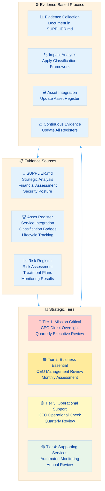

### 🔗 **Evidence Collection Requirements**

This policy mandates comprehensive evidence collection across three primary documentation sources:

#### **📋 Strategic Analysis Evidence (SUPPLIER.md)**
SHALL contain verified evidence of:
- **💰 Financial and Commercial Analysis:** Contract terms, costs, payment structures with documented justification
- **🏆 Porter's Five Forces Assessment:** Market position analysis with switching cost calculations and alternatives evaluation
- **🔒 Security and Compliance Posture:** Current certifications, compliance status, incident history with validation evidence
- **📞 Contact and Support Framework:** Escalation procedures, response capabilities, account management structure

#### **💻 Operational Integration Evidence (Asset Register)**  
SHALL document verified evidence of:
- **🏷️ Service Classification:** Business process assignments using standardized classification badges
- **🔐 Applied Security Controls:** Implemented security measures aligned with classification requirements
- **📊 Performance Integration:** SLA tracking, availability monitoring, and operational metrics
- **🔄 Lifecycle Documentation:** Onboarding evidence, renewal tracking, change history with business impact analysis

#### **📉 Risk Management Evidence (Risk Register)**
SHALL maintain verified evidence of:
- **🔍 Risk Identification:** Systematic supplier risk assessment using classification framework
- **📊 Impact Assessment:** Quantified business impact analysis with supporting calculations
- **🎯 Treatment Implementation:** Risk mitigation strategies with effectiveness measurement
- **📈 Monitoring Results:** Ongoing risk monitoring outcomes with trend analysis

---

## 📝 **Supplier Management Process Framework**

### 🔍 **Phase 1: Supplier Identification & Assessment**

Organizations SHALL execute systematic assessment with evidence documentation:

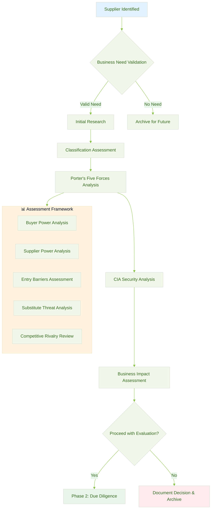

**Evidence Collection Requirements:**
1. **🔍 Business Need Documentation:** Justify supplier requirement with measurable business case
2. **📊 Classification Application:** Apply [🏷️ Classification Framework](https://github.com/Hack23/ISMS-PUBLIC/blob/main/CLASSIFICATION.md) with documented impact analysis
3. **🏆 Porter's Five Forces Analysis:** Systematic market power assessment with scoring methodology
4. **🔒 Security Assessment:** Evaluate publicly available supplier security information and certifications
5. **📉 Risk Analysis:** Document comprehensive risk assessment in [📉 Risk Register](./Risk_Register.md)
6. **📄 Contract Acceptance:** Accept available standard terms or negotiate when supplier power allows

### 🏆 **Porter's Five Forces Assessment Framework**

Organizations SHALL conduct systematic market analysis for all suppliers:

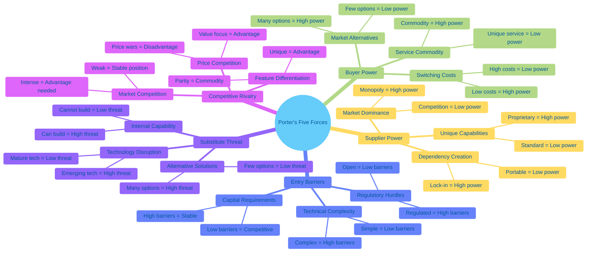

#### Buyer Power Assessment
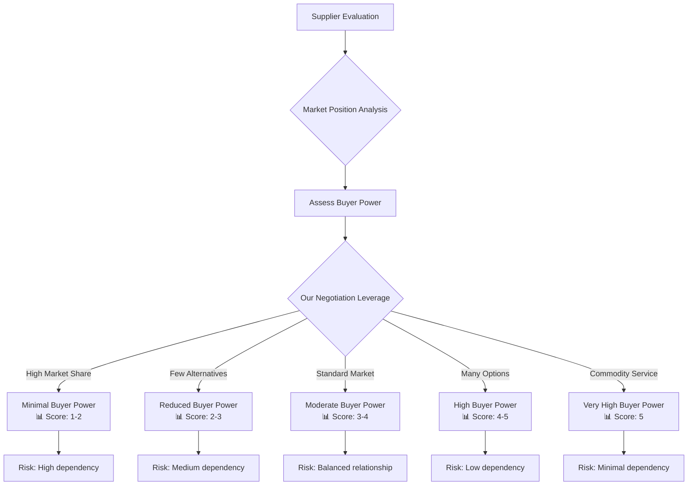

#### **🔍 Assessment Scoring Methodology**

| Force | Evaluation Questions | Risk Indicators | Score Range |
|-------|---------------------|-----------------|-------------|
| **👥 Buyer Power** | • Market alternatives available? • Switching costs feasible? • Service commoditization level? | High switching costs Proprietary formats No viable alternatives | 1-5 |
| **🏪 Supplier Power** | • Market dominance level? • Unique capabilities? • Dependency creation? | Market monopoly Technical lock-in Data hostage scenarios | 1-5 |
| **🚪 Entry Barriers** | • Capital requirements? • Technical complexity? • Regulatory hurdles? | High barriers = stable but dependent Low barriers = competitive options | 1-5 |
| **🔄 Substitute Threat** | • Alternative solutions exist? • Technology disruption risk? • Internal capability building? | Superior alternatives emerging Disruptive technologies In-house options | 1-5 |
| **🏆 Competitive Rivalry** | • Market competition level? • Feature differentiation? • Price competition intensity? | Weak competitive position Feature gaps Price disadvantage | 1-5 |

### 🔒 **CIA Security Classification Assessment**

Organizations SHALL apply systematic security classification using documented methodology:

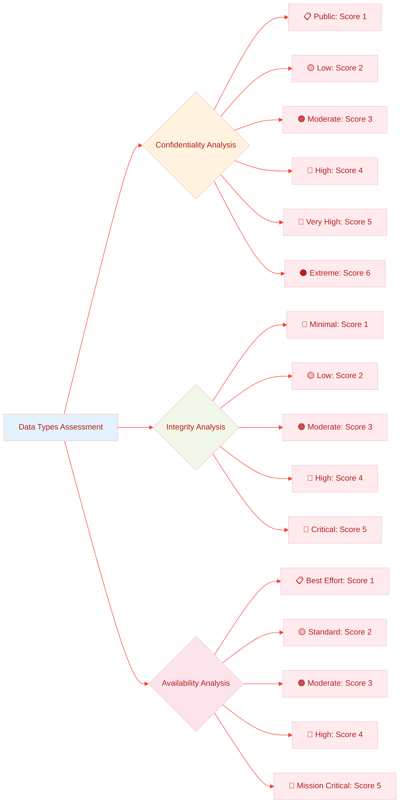

#### **📊 Data Classification Matrix**

| Data Category | Examples | Confidentiality | Integrity | Availability | Business Justification |
|---------------|----------|-----------------|-----------|--------------|------------------------|
| **🤝 Customer Data** | Client information, project details | Very High (5) | Critical (5) | High (4) | GDPR compliance, business reputation |
| **💰 Financial Data** | Banking, payments, accounting | Very High (5) | Critical (5) | High (4) | Regulatory compliance, business operations |
| **💻 Source Code** | Proprietary algorithms, IP | High (4) | Critical (5) | Moderate (3) | Competitive advantage, IP protection |
| **⚙️ Operational Data** | Logs, metrics, configurations | Moderate (3) | High (4) | High (4) | Security monitoring, troubleshooting |
| **📢 Marketing Data** | Public content, analytics | Low (2) | Low (2) | Standard (2) | Public information, minimal impact |

### ⏱️ **Business Continuity Classification Framework**

Organizations SHALL define recovery requirements based on business impact analysis:

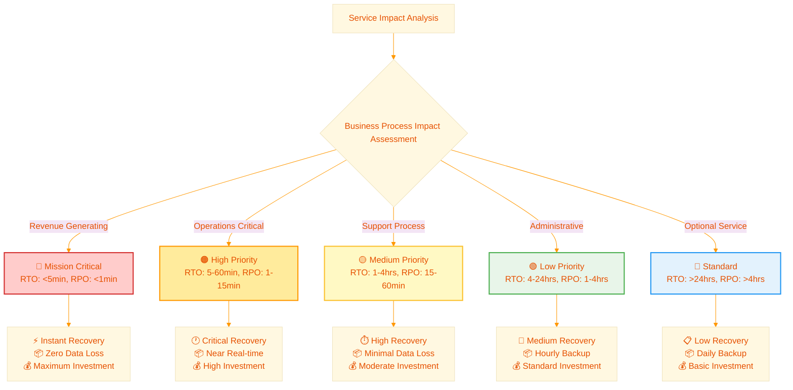

### 💰 **Business Impact Analysis Framework**

Organizations SHALL conduct multi-dimensional impact assessment:

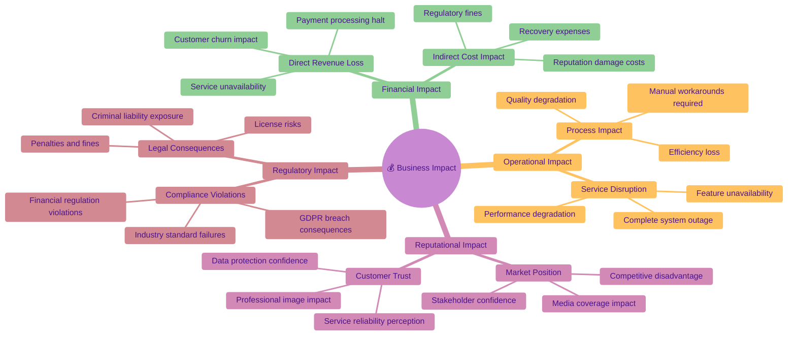

#### **📊 Impact Scoring Matrix**

| Impact Category | Score 1 (Negligible) | Score 2 (Low) | Score 3 (Moderate) | Score 4 (High) | Score 5 (Critical) |
|-----------------|---------------------|---------------|-------------------|----------------|-------------------|
| **💸 Financial** | <€500/day | €500-1K/day | €1-5K/day | €5-10K/day | >€10K/day |
| **🏢 Operational** | No impact | Minor inconvenience | Reduced productivity | Major degradation | Complete outage |
| **🤝 Reputational** | No impact | Limited visibility | Industry attention | National coverage | International media |
| **⚖️ Regulatory** | No implications | Warnings | Minor penalties | Significant fines | Criminal charges |

### 🚀 **Phase 2: Onboarding & Integration**

Organizations SHALL execute systematic onboarding recognizing power dynamics with comprehensive evidence creation:

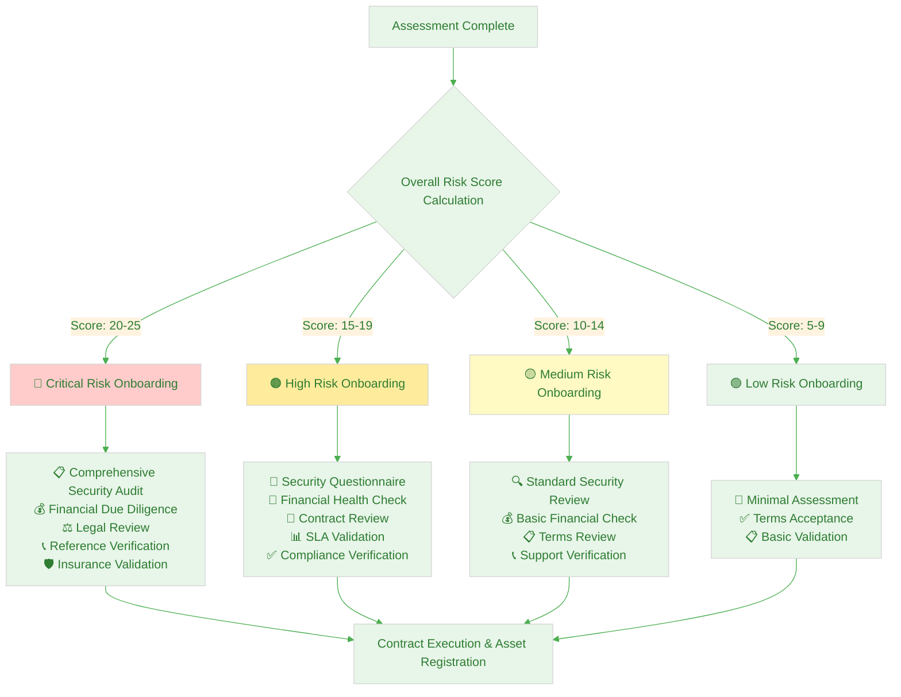

**Evidence Generation Requirements:**
1. **📋 Security Documentation:** Collect available security information, terms of service, and compliance certifications
2. **📝 Contract Documentation:** Document accepted terms, SLAs, and available security provisions
3. **💻 Asset Registration:** Create comprehensive [💻 Asset Register](./Asset_Register.md) entries with classification badges
4. **🔗 Supplier Documentation:** Complete [🔗 SUPPLIER.md](./SUPPLIER.md) profile with strategic analysis and Porter's Five Forces assessment
5. **📊 Baseline Monitoring:** Establish performance baselines and monitoring approach
6. **🧪 Continuity Planning:** Identify alternatives and document backup procedures where feasible

### 🎯 **Streamlined CEO Management Process**

As the sole decision-maker, supplier management workflow is optimized for efficiency:

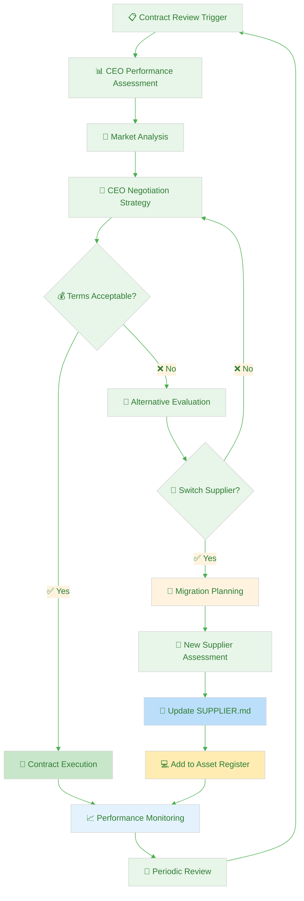

**CEO Management Evidence Requirements:**
1. **📊 Performance Assessment Evidence:** Documented evaluation of supplier performance against strategic objectives
2. **📈 Market Analysis Evidence:** Documented market position analysis and competitor benchmarking
3. **🤝 Negotiation Evidence:** Documented negotiation strategies, outcomes, and contract terms acceptance
4. **🔄 Alternative Evaluation Evidence:** Documented evaluation of alternative suppliers and services
5. **🚚 Transition Evidence:** Documented migration planning and execution for new suppliers
6. **📅 Review Evidence:** Documented periodic reviews and strategic assessments

### 📊 **Generic Supplier Assessment Templates**

Organizations SHALL utilize standardized templates for consistent supplier assessment documentation:

#### **🔴 Critical Supplier Assessment Template**
- **📋 Comprehensive Security Audit**
- **💰 Financial Due Diligence**
- **⚖️ Legal Review**
- **📞 Reference Verification**
- **🛡️ Insurance Validation**

#### **🟠 High Risk Supplier Assessment Template**
- **📝 Security Questionnaire**
- **💼 Financial Health Check**
- **📄 Contract Review**
- **📊 SLA Validation**
- **✅ Compliance Verification**

#### **🟡 Medium Risk Supplier Assessment Template**
- **🔍 Standard Security Review**
- **💰 Basic Financial Check**
- **📋 Terms Review**
- **📞 Support Verification**

#### **🟢 Low Risk Supplier Assessment Template**
- **📝 Minimal Assessment**
- **✅ Terms Acceptance**
- **📋 Basic Validation**

### 📋 **Supplier Onboarding Checklist**

Organizations SHALL follow a standardized checklist to ensure comprehensive supplier onboarding:

1. **📋 Security Documentation Collection**
2. **📝 Contract Documentation Completion**
3. **💻 Asset Registration Creation**
4. **🔗 Supplier Documentation Finalization**
5. **📊 Baseline Monitoring Establishment**
6. **🧪 Continuity Planning Documentation**

---

## 📈 **Phase 3: Ongoing Management & Monitoring**

Organizations SHALL maintain continuous evidence collection through systematic monitoring:

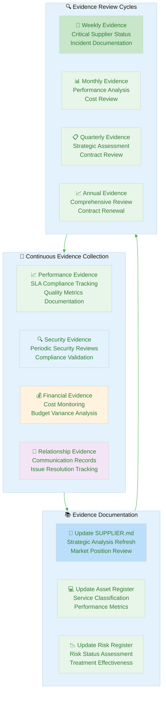

**Continuous Evidence Requirements:**
1. **📈 Performance Evidence:** Track and document SLA compliance, service quality metrics, availability data
2. **🔍 Security Evidence:** Conduct and document periodic security reviews per classification requirements
3. **💰 Financial Evidence:** Monitor and document spending, budget variance, cost optimization opportunities
4. **🤝 Relationship Evidence:** Document regular communications, issue resolutions, strategic discussions
5. **📋 Documentation Maintenance:** Keep [🔗 SUPPLIER.md](./SUPPLIER.md) and [💻 Asset Register](./Asset_Register.md) current with verified evidence

### 🔄 **Phase 4: Strategic Review & Optimization**

Organizations SHALL conduct systematic strategic assessment and optimization:

**Strategic Evidence Requirements:**
1. **📅 Regular Review Evidence:** Document weekly, monthly, quarterly, and annual assessments per tier requirements
2. **💰 Optimization Evidence:** Document contract renewal evaluations and alternative supplier assessments  
3. **📊 Performance Evidence:** Document metrics analysis against targets with industry benchmark comparisons
4. **🔄 Classification Evidence:** Document reassessment of business impact and adjustment justifications

---

## 🛡️ **Security Assessment & Evidence Framework**

Organizations SHALL maintain comprehensive security assessment evidence documented in [🔗 SUPPLIER.md](./SUPPLIER.md):

### 📋 **Security Evidence Categories**

| Evidence Category | Required Documentation | Validation Method | Evidence Location | Review Frequency |
|------------------|----------------------|-------------------|-------------------|------------------|
| **🎖️ Certifications** | Current certificates, expiry tracking | Independent validation | [🔗 SUPPLIER.md](./SUPPLIER.md) compliance matrix | Annual |
| **🔒 Data Protection** | DPAs, encryption evidence, residency proof | Audit reports, attestations | [🔗 SUPPLIER.md](./SUPPLIER.md) security section | Quarterly |
| **🚨 Incident Response** | Response procedures, communication protocols | Historical incident analysis | [🔗 SUPPLIER.md](./SUPPLIER.md) contact matrix | Semi-annual |
| **💾 Business Continuity** | BCP documentation, RTO/RPO evidence | Recovery testing results | [🔗 SUPPLIER.md](./SUPPLIER.md) continuity analysis | Annual |
| **👥 Access Management** | Access procedures, privilege documentation | Control testing evidence | [🔗 SUPPLIER.md](./SUPPLIER.md) security controls | Quarterly |
| **🔍 Vulnerability Management** | Patch procedures, scanning evidence | Vulnerability reports, remediation tracking | [🔗 SUPPLIER.md](./SUPPLIER.md) security posture | Monthly |

### 🎯 **Classification-Based Evidence Requirements**

Evidence depth SHALL align with [🏷️ Classification Framework](https://github.com/Hack23/ISMS-PUBLIC/blob/main/CLASSIFICATION.md) business impact analysis:

**🔴 Mission Critical Supplier Evidence Requirements:**
- **📋 Comprehensive Documentation:** Full supplier research, enterprise certifications review, service validation
- **📊 Enhanced Monitoring:** Priority monitoring with immediate alerting for service degradation
- **🔄 Strategic Reviews:** Quarterly strategic assessment and relationship optimization
- **💰 Market Analysis:** Regular alternatives research and switching cost analysis  
- **⚖️ Contract Optimization:** Annual contract review and optimization within available options

**🟠 High Priority Supplier Evidence Requirements:**
- **📝 Standard Documentation:** Security certification verification, service level documentation
- **📈 Regular Monitoring:** Weekly metrics collection with monthly performance reporting
- **📅 Periodic Reviews:** Quarterly operational assessment and relationship management
- **💼 Alternative Research:** Annual alternatives evaluation and market assessment
- **📄 Contract Management:** Standard terms documentation and renewal planning

**🟡 Medium Priority Supplier Evidence Requirements:**
- **📋 Basic Documentation:** Service validation, compliance confirmation where available
- **📊 Standard Monitoring:** Monthly metrics collection with quarterly reporting
- **📅 Regular Reviews:** Semi-annual operational assessment
- **🔍 Market Monitoring:** Annual alternatives review and cost-benefit analysis
- **📝 Standard Management:** Standard contract terms and basic renewal tracking

**🟢 Low Risk Supplier Evidence Requirements:**
- **✅ Minimal Documentation:** Basic service confirmation and standard terms acceptance
- **📈 Basic Monitoring:** Quarterly performance assessment and service quality review
- **📅 Annual Reviews:** Annual cost-benefit analysis and service evaluation
- **🔄 Simplified Management:** Self-service management and community support utilization

---

## 📊 **Performance Metrics & KPI Framework**

Organizations SHALL maintain performance evidence through metrics documented in [🔗 SUPPLIER.md](./SUPPLIER.md):

### 🛡️ **Security Performance Evidence**

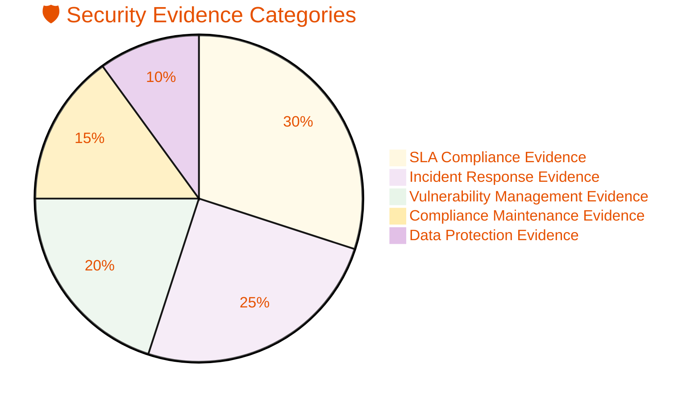

### 💰 **Business Performance Metrics Framework**

| Evidence Category | Documentation Requirements | Evidence Standards | Measurement System | Review Frequency |
|------------------|---------------------------|-------------------|-------------------|------------------|
| **⏱️ Availability** | SLA compliance documentation | Monitoring system records | Per classification levels | Per documented schedules |
| **🚨 Incident Response** | Response documentation | Incident tracking systems | Per-incident records | Per incident occurrence |
| **💰 Cost Efficiency** | Budget tracking records | Financial reporting systems | Monthly reporting | Per documented cycles |
| **🔒 Security Posture** | Assessment documentation | Third-party validation records | Assessment cycles | Per review schedules |
| **🤝 Relationship Quality** | Communication records | Systematic feedback collection | Regular assessment cycles | Per documented frequency |

### 📈 **Performance Dashboard Requirements**

Organizations SHALL maintain comprehensive performance visibility through documented tracking:

**🔴 Critical Evidence Thresholds:**
- SLA breaches exceeding documented classification-based tolerances with immediate documentation
- Security incidents affecting business operations with comprehensive incident reports per [🚨 Incident Response Plan](./Incident_Response_Plan.md)
- Compliance failures requiring immediate attention with regulatory notification evidence per [✅ Compliance Checklist](./Compliance_Checklist.md)

**🟡 Warning Evidence Indicators:**
- Performance trends approaching documented threshold limits with trend analysis documentation
- Cost variances requiring investigation with financial impact analysis per documented thresholds
- Relationship issues requiring management attention with stakeholder communication records

**🟢 Success Evidence Tracking:**
- Performance improvements with quantified benefit documentation
- Cost savings and efficiency gains with documented ROI calculations  
- Enhanced security posture achievements with compliance validation evidence

---

## 🚨 **Incident Management & Communication Framework**

Integration with [🚨 Incident Response Plan](./Incident_Response_Plan.md) SHALL produce comprehensive incident evidence:

### 🔄 **Evidence-Based Incident Response**

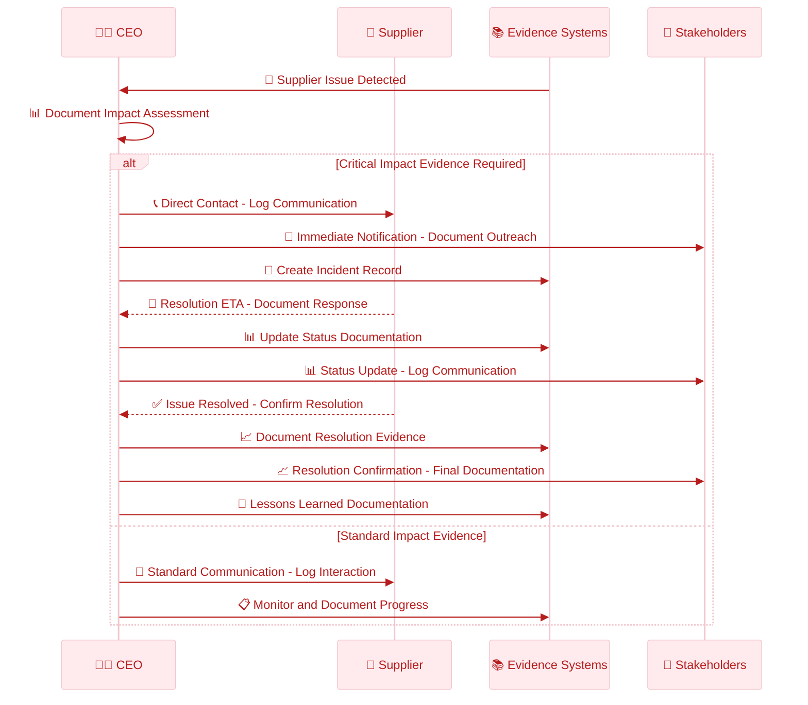

### 📞 **Supplier Communication Evidence Framework**

Organizations SHALL maintain practical supplier communication evidence recognizing operational constraints:

| Supplier Tier | Evidence Requirements | Documentation Approach | Communication Strategy | Escalation Reality |
|---------------|--------------------|------------------------|----------------------|-------------------|
| **🔴 Mission Critical** | Service availability logs, response documentation | Automated monitoring alerts per documented systems | Professional relationship management per documented processes | Standard support channels per documented agreements |
| **🟠 High Priority** | Performance metrics, communication records | Regular status documentation per documented cycles | Standard engagement within available channels per documented processes | Account management where available per documented relationships |
| **🟡 Moderate Priority** | Basic service logs, issue tracking | Status summaries per documented schedules | Standard support utilization per documented processes | Community and support channels per documented options |
| **🟢 Low Risk** | Minimal service logs, cost tracking | Annual service evaluation per documented requirements | Self-service and community support per documented processes | Standard channels only per documented limitations |

### 🎯 **Escalation Evidence & Response Framework**

Organizations SHALL implement documented escalation with comprehensive evidence collection:

**🔴 Critical Escalation Evidence Requirements:**
- **⏱️ Response Evidence:** Immediate response logs within classification-based SLA requirements
- **📞 Communication Evidence:** Direct communication channel usage logs with executive contact records
- **👥 Stakeholder Evidence:** Comprehensive stakeholder notification logs and acknowledgment records
- **📊 Impact Evidence:** Real-time updates with quantified business impact documentation

**🟠 High Priority Escalation Evidence Requirements:**
- **⏱️ Response Evidence:** Response time logs meeting contract terms with escalation timestamps
- **📧 Communication Evidence:** Priority support channel usage with urgent flag documentation
- **👥 Stakeholder Evidence:** Management and supplier account team engagement records
- **📊 Communication Evidence:** Regular update logs maintained until complete resolution

**🟡 Standard Escalation Evidence Requirements:**
- **⏱️ Response Evidence:** Standard business hours response with timestamp documentation
- **📝 Communication Evidence:** Standard support channel usage logs with ticket tracking
- **👥 Stakeholder Evidence:** Operational contact engagement with service manager involvement
- **📊 Status Evidence:** Daily update logs maintained during resolution process

### 📋 **Comprehensive Incident Documentation**

All supplier-related incidents SHALL produce comprehensive evidence documentation:
1. **🕐 Timeline Evidence:** Complete incident detection, escalation, and resolution timestamps with supporting logs
2. **📊 Impact Evidence:** Quantified business impact using [🏷️ Classification Framework](https://github.com/Hack23/ISMS-PUBLIC/blob/main/CLASSIFICATION.md) with supporting calculations
3. **🔄 Response Evidence:** Documented supplier actions, internal responses, and coordination activities
4. **📈 Improvement Evidence:** Process improvements and relationship adjustments with implementation tracking
5. **📉 Risk Evidence:** Risk register updates based on incident findings with treatment effectiveness analysis

---

## 📋 **Compliance & Contract Management Framework**

### ⚖️ **Regulatory Compliance Management**

Organizations SHALL ensure supplier compliance through systematic validation documented in [🔗 SUPPLIER.md](./SUPPLIER.md):

#### **🇪🇺 GDPR Compliance Requirements**

All data processing suppliers SHALL meet:
- **📄 Data Processing Agreements (DPA):** Comprehensive DPAs meeting GDPR Article 28 requirements
- **🌍 Data Residency:** EU data residency for personal data processing where required
- **🔒 Data Protection Impact Assessments:** DPIA completion for high-risk processing activities
- **📊 Regular Audits:** Annual compliance audits with documented results

#### **🇸🇪 Swedish Regulatory Requirements**

Suppliers operating in regulated sectors SHALL comply with:
- **💰 Financial Services:** Swedish FSA regulations and PSD2 compliance for payment services  
- **📊 Accounting Standards:** Swedish GAAP and K2/K3 compliance for accounting services
- **⚖️ Data Protection:** Compliance with Swedish data protection authority requirements

#### **🌐 Industry Standards Requirements**

Organizations SHALL prioritize suppliers with relevant certifications:
- **🎖️ ISO 27001:** Preferred certification for security-critical services
- **🔒 SOC 2:** Required certification for data processing suppliers  
- **💳 PCI DSS:** Mandatory for payment processing suppliers

### 📄 **Contract Lifecycle Management Framework**

Organizations SHALL manage supplier contracts through systematic processes documented in [🔗 SUPPLIER.md](./SUPPLIER.md):

#### **📋 Contract Categories**

**🔴 Strategic Partnerships:**
- **📝 Enterprise Agreements:** Custom terms, premium SLAs, dedicated support arrangements
- **⏱️ Multi-year Terms:** Long-term commitments with volume discounts and strategic alignment
- **⚖️ Enhanced Liability:** Comprehensive liability coverage and insurance requirements
- **🔒 Advanced Security:** Detailed security specifications and compliance obligations

**🟠 Operational Suppliers:**
- **📄 Standard Agreements:** Industry-standard terms with security addendums
- **📅 Annual Terms:** Flexible renewal cycles with performance reviews
- **💰 Performance Incentives:** SLA credits and performance bonuses
- **🔐 Standard Security:** Essential security requirements and audit rights

**🟡 Supporting Suppliers:**
- **📝 Standard Terms:** Vendor standard agreements with minimal customization
- **🔄 Flexible Terms:** Monthly or quarterly renewal options
- **💼 Basic Requirements:** Essential security and compliance clauses
- **📊 Standard Monitoring:** Standard KPIs and service levels

#### **🎯 Contract Optimization Process**

### 💰 **Contract & Compliance Management Requirements**

Organizations SHALL maintain comprehensive contract and compliance oversight:

1. **📊 Contract Repository:** Centralized storage of all supplier contracts with compliance tracking
2. **📅 Renewal Tracking:** Automated alerts for contract renewal dates and compliance reassessment schedules
3. **💰 Cost Management:** Budget tracking and variance analysis with compliance cost allocation
4. **📋 Performance Tracking:** SLA monitoring and penalty management with regulatory compliance validation
5. **⚖️ Legal Review:** Regular legal assessment of contract terms and regulatory alignment
6. **🇪🇺 GDPR Monitoring:** DPA validation and audit reports tracking in compliance matrix
7. **🎖️ Certification Management:** Certificate validation and expiry tracking in certification database
8. **⚖️ Regulatory Monitoring:** Ongoing regulatory change monitoring and impact assessment

### 📊 **Compliance Monitoring Framework**

| Compliance Area | Monitoring Method | Documentation Location | Review Frequency | Integration Point |
|-----------------|-------------------|----------------------|------------------|-------------------|
| **🇪🇺 GDPR** | DPA validation, audit reports | [🔗 SUPPLIER.md](./SUPPLIER.md) compliance matrix | Annual | Contract renewal |
| **🎖️ Certifications** | Certificate validation, expiry tracking | Certification database | Quarterly | Risk assessment |
| **📋 Contract Compliance** | SLA monitoring, penalty tracking | Contract management system | Monthly | Performance review |
| **⚖️ Regulatory Changes** | Regulatory monitoring, impact assessment | Compliance register | Ongoing | Strategic planning |
| **💰 Financial Compliance** | Payment terms, service level validation | Financial reporting systems | Monthly | Budget management |
| **🔒 Security Standards** | Control effectiveness, audit requirements | Security control matrix | Quarterly | Risk register updates |

### ✅ **Comprehensive Validation Process**

Organizations SHALL execute compliance and contract validation:
1. **📋 Initial Validation:** Verify certifications, compliance status, and contract terms during onboarding
2. **🔄 Ongoing Monitoring:** Track compliance status and contract performance through assessments
3. **📊 Audit Coordination:** Coordinate with supplier audits, assessments, and contract reviews
4. **📈 Gap Remediation:** Work with suppliers to address compliance gaps and contract performance issues
5. **📉 Risk Assessment:** Document compliance and contract risks in [📉 Risk Register](./Risk_Register.md)
6. **💰 Cost Optimization:** Regular contract review for cost-effectiveness and compliance efficiency
7. **⚖️ Legal Alignment:** Ensure all contract terms support regulatory compliance requirements

---

## 📚 **Related Documents**

Our Third Party Management Policy integrates with the complete ISMS framework through evidence-based documentation:

### 🏛️ **Core ISMS Framework**
- **[🔐 Information Security Policy](./Information_Security_Policy.md)** — Overall security governance framework defining third-party security requirements and standards
- **[🏷️ Classification Framework](https://github.com/Hack23/ISMS-PUBLIC/blob/main/CLASSIFICATION.md)** — Business impact analysis methodology for systematic supplier classification and evidence-based decision making
- **[📊 Security Metrics](./Security_Metrics.md)** — Third-party performance measurement framework providing quantified evidence of supplier management effectiveness

### 📊 **Evidence Documentation Sources**
- **[💻 Asset Register](./Asset_Register.md)** — Primary evidence source for supplier service integration, asset dependencies, and classification badge application during onboarding
- **[📉 Risk Register](./Risk_Register.md)** — Primary evidence source for third-party risk identification, assessment methodology, and systematic treatment tracking
- **[🔗 Supplier Security Posture](./SUPPLIER.md)** — Authoritative evidence source for detailed supplier assessments, Porter's Five Forces analysis, and comprehensive strategic classification matrix

### 🚨 **Operational Integration Framework**  
- **[🚨 Incident Response Plan](./Incident_Response_Plan.md)** — Incident management framework for supplier-related incidents with comprehensive communication protocols and evidence collection
- **[🔄 Business Continuity Plan](./Business_Continuity_Plan.md)** — Business resilience framework documenting supplier dependencies and comprehensive alternative arrangements
- **[📝 Change Management](./Change_Management.md)** — Change control framework for supplier modifications with systematic approval processes and impact documentation

### ✅ **Compliance & Governance Framework**
- **[✅ Compliance Checklist](./Compliance_Checklist.md)** — Multi-framework compliance tracking system for third-party validation and systematic compliance evidence
- **[🔑 Access Control Policy](./Access_Control_Policy.md)** — Identity and access management framework for supplier access controls and systematic privilege management
- **[🏷️ Data Classification Policy](./Data_Classification_Policy.md)** — Data protection framework defining third-party data handling requirements and comprehensive protection standards

---

**📋 Document Control:**  
**✅ Approved by:** James Pether Sörling, CEO  
**📤 Distribution:** Public  
**🏷️ Classification:**   
**📅 Effective Date:** 2025-11-17  
**⏰ Next Review:** 2026-02-16  
**🎯 Framework Compliance:**   
