<p align="center">
  
</p>

<h1 align="center">🤝 Hack23 AB — Third-Party Management Policy</h1>

<p align="center">
  <strong>Extending Security Excellence to Our Supply Chain</strong><br>
  <em>Demonstrating Rigorous Supplier Governance and Risk Management</em>
</p>

<p align="center">
  <a href="#"></a>
  <a href="#"></a>
  <a href="#"></a>
  <a href="#"></a>
</p>

**Document Owner:** CEO | **Version:** 1.0 | **Last Updated:** 2025-08-18 (UTC)  
**Review Cycle:** Annual | **Next Review:** 2026-08-18

---

## 🎯 **Purpose Statement**

**Hack23 AB's** third-party management policy demonstrates how **rigorous supply chain security directly enables business resilience and protects our assets.** This framework serves as both an operational necessity and a client demonstration of our comprehensive approach to cybersecurity.

This policy outlines the systematic process for evaluating, classifying, onboarding, and managing third-party suppliers using our comprehensive [Classification Framework](./CLASSIFICATION.md). All suppliers undergo multi-dimensional assessment covering Porter's Five Forces analysis, CIA security classification, business continuity requirements, business impact analysis, and strategic value assessment before being documented in our [Asset Register](./Asset_Register.md).

Our transparent classification approach showcases how methodical risk assessment and impact analysis create competitive advantages through informed decision-making and systematic security implementation.

*— James Pether Sörling, CEO/Founder*

---

## 🔍 **Purpose & Scope**

This policy establishes the framework for systematically evaluating, classifying, and managing risks associated with third-party suppliers who provide services, access information, or support business operations.

**Scope:** This policy applies to all potential and existing suppliers, requiring comprehensive assessment using our [Classification Framework](./CLASSIFICATION.md) before onboarding and regular reassessment thereafter.

---

## 📊 **Supplier Classification Assessment Framework**

All suppliers undergo systematic evaluation across five key dimensions before engagement:

### 🏗️ **1. Porter's Five Forces Strategic Analysis**

#### Buyer Power Assessment

```mermaid
graph TD
    A[Supplier Evaluation] --> B{Market Position Analysis}
    B --> C[Assess Buyer Power]
    C --> D{Our Negotiation Leverage}
    
    D -->|High Market Share| E[Minimal Buyer Power<br/>📊 Score: 1-2]
    D -->|Few Alternatives| F[Reduced Buyer Power<br/>📊 Score: 2-3]
    D -->|Standard Market| G[Moderate Buyer Power<br/>📊 Score: 3-4]
    D -->|Many Options| H[High Buyer Power<br/>📊 Score: 4-5]
    D -->|Commodity Service| I[Very High Buyer Power<br/>📊 Score: 5]
    
    E --> J[Risk: High dependency]
    F --> K[Risk: Medium dependency]
    G --> L[Risk: Balanced relationship]
    H --> M[Risk: Low dependency]
    I --> N[Risk: Minimal dependency]
```


#### Assessment Criteria by Force
| Force | Evaluation Questions | Risk Indicators | Score Range |
|-------|---------------------|-----------------|-------------|
| **👥 Buyer Power** | • Market alternatives available?<br/>• Switching costs feasible?<br/>• Service commoditization level? | High switching costs<br/>Proprietary formats<br/>No viable alternatives | 1-5 |
| **🏪 Supplier Power** | • Market dominance level?<br/>• Unique capabilities?<br/>• Dependency creation? | Market monopoly<br/>Technical lock-in<br/>Data hostage scenarios | 1-5 |
| **🚪 Entry Barriers** | • Capital requirements?<br/>• Technical complexity?<br/>• Regulatory hurdles? | High barriers = stable but dependent<br/>Low barriers = competitive options | 1-5 |
| **🔄 Substitute Threat** | • Alternative solutions exist?<br/>• Technology disruption risk?<br/>• Internal capability building? | Superior alternatives emerging<br/>Disruptive technologies<br/>In-house options | 1-5 |
| **🏆 Competitive Rivalry** | • Market competition level?<br/>• Feature differentiation?<br/>• Price competition intensity? | Weak competitive position<br/>Feature gaps<br/>Price disadvantage | 1-5 |

### 🔒 **2. CIA Security Classification**

#### Security Requirements Assessment


#### Data Classification Matrix
| Data Category | Examples | Confidentiality | Integrity | Availability | Justification |
|---------------|----------|-----------------|-----------|--------------|---------------|
| **Customer Data** | Client information, project details | Very High (5) | Critical (5) | High (4) | GDPR compliance, business reputation |
| **Financial Data** | Banking, payments, accounting | Very High (5) | Critical (5) | High (4) | Regulatory compliance, business operations |
| **Source Code** | Proprietary algorithms, IP | High (4) | Critical (5) | Moderate (3) | Competitive advantage, IP protection |
| **Operational Data** | Logs, metrics, configurations | Moderate (3) | High (4) | High (4) | Security monitoring, troubleshooting |
| **Marketing Data** | Public content, analytics | Low (2) | Low (2) | Standard (2) | Public information, minimal impact |

### ⏱️ **3. Business Continuity Classification**

#### RTO/RPO Requirements Assessment


#### RTO/RPO Classification Badges
- **Mission Critical:** [](./CLASSIFICATION.md#rto-classifications) [](./CLASSIFICATION.md#rpo-classifications)
- **High Priority:** [](./CLASSIFICATION.md#rto-classifications) [](./CLASSIFICATION.md#rpo-classifications)
- **Medium Priority:** [](./CLASSIFICATION.md#rto-classifications) [](./CLASSIFICATION.md#rpo-classifications)
- **Low Priority:** [](./CLASSIFICATION.md#rto-classifications) [](./CLASSIFICATION.md#rpo-classifications)
- **Standard:** [](./CLASSIFICATION.md#rto-classifications) [](./CLASSIFICATION.md#rpo-classifications)

### 💰 **4. Business Impact Analysis**

#### Multi-Dimensional Impact Assessment


#### Impact Scoring Matrix
| Impact Category | Score 1 (Negligible) | Score 2 (Low) | Score 3 (Moderate) | Score 4 (High) | Score 5 (Critical) |
|-----------------|---------------------|---------------|-------------------|----------------|-------------------|
| **💸 Financial** | <€100/day | €100-500/day | €500-1K/day | €1-5K/day | >€5K/day |
| **🏢 Operational** | No impact | Minor inconvenience | Reduced productivity | Major degradation | Complete outage |
| **🤝 Reputational** | No impact | Limited visibility | Industry attention | National coverage | International media |
| **📜 Regulatory** | No implications | Warnings | Minor penalties | Significant fines | Criminal charges |

### 🎯 **5. Strategic Value Assessment**

#### ROI and Competitive Analysis


#### Strategic Value Scoring
| Dimension | Assessment Questions | Scoring Criteria | Weight |
|-----------|---------------------|------------------|---------|
| **📈 ROI Analysis** | • Cost vs. value delivered?<br/>• Risk mitigation value?<br/>• Revenue enablement? | 1=Negative ROI, 5=Exceptional ROI | 40% |
| **🏆 Market Position** | • Competitive advantage?<br/>• Market leadership?<br/>• Differentiation value? | 1=Laggard, 5=Market Leader | 30% |
| **🚀 Innovation Value** | • Enables innovation?<br/>• Competitive differentiation?<br/>• Strategic alignment? | 1=Commodity, 5=Strategic enabler | 20% |
| **🔄 Alternative Options** | • Switching feasibility?<br/>• Market alternatives?<br/>• Vendor lock-in risk? | 1=No alternatives, 5=Many options | 10% |

---

## 🔄 **Supplier Onboarding Workflow**

### **Phase 1: Initial Assessment & Classification**

#### 1.1 Supplier Discovery & Qualification


#### 1.2 Classification Assessment Checklist
- [ ] **Porter's Five Forces Analysis**
  - [ ] Buyer power assessment (1-5 score)
  - [ ] Supplier power evaluation (1-5 score)
  - [ ] Entry barriers analysis (1-5 score)
  - [ ] Substitute threat evaluation (1-5 score)
  - [ ] Competitive rivalry assessment (1-5 score)

- [ ] **CIA Security Classification**
  - [ ] Data types and sensitivity analysis
  - [ ] Confidentiality requirements (1-6 score)
  - [ ] Integrity requirements (1-5 score) 
  - [ ] Availability requirements (1-5 score)

- [ ] **Business Continuity Requirements**
  - [ ] Business process mapping
  - [ ] RTO requirements definition
  - [ ] RPO requirements definition
  - [ ] SLA expectations

- [ ] **Business Impact Analysis**
  - [ ] Financial impact assessment (1-5 score)
  - [ ] Operational impact assessment (1-5 score)
  - [ ] Reputational impact assessment (1-5 score)
  - [ ] Regulatory impact assessment (1-5 score)

- [ ] **Strategic Value Assessment**
  - [ ] ROI analysis and scoring (1-5 score)
  - [ ] Competitive positioning (1-5 score)
  - [ ] Innovation value assessment (1-5 score)
  - [ ] Alternative options evaluation (1-5 score)

### **Phase 2: Detailed Due Diligence**

#### 2.1 Risk-Based Assessment Depth

```mermaid
graph TD
    A[Classification Results] --> B{Overall Risk Score}
    
    B -->|Score: 20-25| C[🔴 Critical Risk Assessment]
    B -->|Score: 15-19| D[🟠 High Risk Assessment]
    B -->|Score: 10-14| E[🟡 Medium Risk Assessment]
    B -->|Score: 5-9| F[🟢 Low Risk Assessment]
    
    C --> C1[Comprehensive Security Audit<br/>Financial Due Diligence<br/>Legal Review<br/>Reference Verification<br/>Insurance Validation]
    
    D --> D1[Security Questionnaire<br/>Financial Health Check<br/>Contract Review<br/>SLA Validation<br/>Compliance Verification]
    
    E --> E1[Standard Security Review<br/>Basic Financial Check<br/>Terms Review<br/>Support Verification]
    
    F --> F1[Minimal Assessment<br/>Terms Acceptance<br/>Basic Validation]
```


#### 2.2 Assessment Documentation Requirements
| Risk Level | Required Documentation | Assessment Depth | Review Frequency |
|------------|----------------------|------------------|------------------|
| **🔴 Critical** | Full security audit, financial statements, insurance proof, legal review, reference checks (3+) | Comprehensive on-site/virtual audit | Quarterly |
| **🟠 High** | Security questionnaire, financial overview, compliance certificates, reference checks (2+) | Detailed document review + interviews | Semi-annual |
| **🟡 Medium** | Standard security form, basic financial info, compliance alignment, reference check (1+) | Document review + validation calls | Annual |
| **🟢 Low** | Basic information form, terms acceptance, support verification | Self-assessment + spot checks | Bi-annual |

### **Phase 3: Contract Negotiation & SLA Definition**

#### 3.1 Classification-Driven Contract Requirements

```mermaid
graph LR
    A[Classification Results] --> B[Contract Template Selection]
    
    B --> C[🔴 Critical Supplier Contract]
    B --> D[🟠 High Risk Contract]
    B --> E[🟡 Standard Contract]
    B --> F[🟢 Basic Agreement]
    
    C --> C1[Custom terms, strict SLAs,<br/>liability coverage, audit rights,<br/>termination clauses]
    D --> D1[Enhanced terms, defined SLAs,<br/>insurance requirements,<br/>performance metrics]
    E --> E1[Standard terms, basic SLAs,<br/>standard protections]
    F --> F1[Simple agreement,<br/>basic terms]
```


#### 3.2 SLA Requirements by Classification
| Classification | Uptime SLA | Response Time | Resolution Time | Support Level | Penalties |
|----------------|------------|---------------|-----------------|---------------|-----------|
| **Mission Critical (RTO <5min)** | 99.99% | <15 minutes | <1 hour | 24/7 Premium | Service credits + penalties |
| **High Priority (RTO <60min)** | 99.9% | <60 minutes | <4 hours | 24/7 Standard | Service credits |
| **Medium Priority (RTO <4hrs)** | 99.5% | <4 hours | <24 hours | Business hours | Credit adjustments |
| **Low Priority (RTO <24hrs)** | 99% | <24 hours | <72 hours | Business hours | Best effort |
| **Standard (RTO >24hrs)** | Best effort | <72 hours | <1 week | Email support | None |

### **Phase 4: Asset Register Integration**

#### 4.1 Supplier Asset Registration Workflow


#### 4.2 Simplified CEO Process

As the sole decision-maker, the supplier management workflow is streamlined:

1. **Assess Supplier** - Use classification framework for systematic evaluation
2. **Document Assessment** - Update SUPPLIER.md with findings and rationale
3. **Register Asset** - Add service details to Asset_Register.md
4. **Set Review Schedule** - Based on risk tier (quarterly for critical, annual for others)
5. **Monitor Performance** - Track key metrics and contract compliance

#### 4.3 Generic Asset Register Entry Template
```markdown
## [Cloud Provider] - [Infrastructure Services]

### Classification & Risk Profile
- **Risk Tier:** 🔴 Critical [Justification: Core infrastructure dependency]
- **Security Classification:** 
  - [](./CLASSIFICATION.md#confidentiality-levels)
  - [](./CLASSIFICATION.md#integrity-levels)
  - [](./CLASSIFICATION.md#availability-levels)
- **Business Continuity:** 
  - [](./CLASSIFICATION.md#rto-classifications)
  - [](./CLASSIFICATION.md#rpo-classifications)

### Porter's Five Forces Assessment
- **Buyer Power:** 2/5 - Limited leverage due to company size
- **Supplier Power:** 5/5 - Market dominance with proprietary services
- **Entry Barriers:** 5/5 - Massive infrastructure investment required
- **Substitute Threat:** 2/5 - Few viable alternatives at required scale
- **Competitive Rivalry:** 5/5 - Clear market leadership position

### Business Impact Analysis
- **Financial Impact:** [](./CLASSIFICATION.md#financial-impact-levels)
- **Operational Impact:** [](./CLASSIFICATION.md#operational-impact-levels)
- **Reputational Impact:** [](./CLASSIFICATION.md#reputational-impact-levels)
- **Regulatory Impact:** [](./CLASSIFICATION.md#regulatory-impact-levels)

### Strategic Value
- **ROI Assessment:** [](./CLASSIFICATION.md#security-investment-returns)
- **Market Position:** [](./CLASSIFICATION.md#competitive-differentiation)
- **Project Type:** [](./CLASSIFICATION.md#project-type-classifications)

### Service Level Agreement
- **Uptime SLA:** 99.99%
- **Support Level:** 24/7 Enterprise
- **Response Time:** <15 minutes
- **Resolution Time:** <1 hour

### Contract Details
- **Contract Type:** Pay-as-you-go
- **Annual Value:** $30-50K estimated
- **Renewal Date:** Ongoing
- **Termination Notice:** 30 days

### Monitoring & Review
- **Review Frequency:** Quarterly
- **Key Metrics:** Uptime, cost trends, security incidents
- **Last Review:** [Date]
- **Next Review:** [Date]
```

---

## 📊 **Simplified Ongoing Management**

### **Single-Person Oversight Model**

As CEO/Founder, supplier management focuses on essential activities:

#### 🔴 Critical Suppliers
- **Monthly Check:** Cost trends, security alerts, performance issues
- **Quarterly Review:** Complete risk reassessment and alternative evaluation
- **Immediate Response:** Security incidents or major service failures

#### 🟠🟡 Medium/High Risk Suppliers
- **Quarterly Check:** Performance and cost optimization opportunities
- **Annual Review:** Strategic value assessment and contract evaluation
- **Event Response:** Contract changes or significant issues

#### 🟢 Low Risk Suppliers
- **Annual Review:** Basic functionality and cost verification
- **As-Needed:** Only when service issues occur or contracts change

### **Streamlined Documentation Process**


### **Essential Risk Monitoring**

| Risk Level | Monitoring Actions | Response Time | Documentation |
|------------|-------------------|---------------|---------------|
| **Critical Service Outage** | Check status pages, assess customer impact | <30 minutes | Update Risk Register |
| **Security Incident** | Follow incident response plan | <1 hour | Incident documentation |
| **Cost Overrun** | Review usage, optimize configuration | <24 hours | Budget adjustment notes |
| **Contract Change** | Assess terms, update documentation | <1 week | Asset Register update |

---

## 🎯 **Generic Supplier Examples**

### Cloud Infrastructure Provider
- **Risk Profile:** Critical - Complete dependency, high switching costs
- **Assessment Focus:** Data sovereignty, disaster recovery, vendor lock-in
- **Key Metrics:** Monthly spend, uptime, security incidents

### Development Platform  
- **Risk Profile:** High - Operations impact, switching complexity
- **Assessment Focus:** Code security, data portability, platform stability
- **Key Metrics:** Service availability, feature changes, pricing

### Financial Services
- **Risk Profile:** High - Regulatory requirements, operational necessity
- **Assessment Focus:** Compliance alignment, service continuity, data protection
- **Key Metrics:** Transaction success, regulatory changes, service fees

### Business Applications
- **Risk Profile:** Medium - Process impact, moderate switching effort
- **Assessment Focus:** Data export capabilities, integration complexity
- **Key Metrics:** Feature utilization, support quality, alternative costs

### Content/Marketing Services
- **Risk Profile:** Low - Minimal impact, easily replaceable
- **Assessment Focus:** Output quality, cost effectiveness
- **Key Metrics:** Usage patterns, cost per output, service reliability

---

## 📋 **Essential Processes Only**

### New Supplier Evaluation
1. **Business Need** - Validate requirement and explore alternatives
2. **Classification** - Complete five-force assessment framework
3. **Documentation** - Update SUPPLIER.md with evaluation results
4. **Registration** - Add to Asset_Register.md with monitoring schedule

### Ongoing Supplier Management
1. **Periodic Reviews** - Based on risk tier (quarterly/annual)
2. **Issue Response** - When problems arise, update documentation
3. **Contract Management** - Annual review of terms and alternatives
4. **Cost Optimization** - Regular usage and pricing analysis

### Supplier Transition
1. **Data Export** - Secure all data and configurations
2. **Service Migration** - Activate alternative or new provider
3. **Documentation** - Remove from active registers, archive assessment
4. **Process Improvement** - Update evaluation criteria based on experience

---

## 🔗 **Key Integration Points**

### With Risk Management
- New suppliers trigger risk assessment updates
- Service changes require risk impact analysis
- Major incidents result in risk treatment adjustments

### With Asset Management
- All suppliers documented as managed services
- Service changes update asset classifications
- Decommissioned services properly archived

### With Business Continuity
- Supplier RTO/RPO requirements drive BCP planning
- Alternative suppliers identified for critical services
- Recovery procedures include supplier contact information

### With Compliance
- Supplier assessments support regulatory requirements
- Data processing agreements maintained for GDPR compliance
- Security standards verified for critical suppliers

---

## 📚 **Related Documents**
- [🏷️ Classification Framework](./CLASSIFICATION.md) - Assessment methodology and scoring
- [💻 Asset Register](./Asset_Register.md) - Supplier inventory and tracking  
- [🔗 Supplier Security Posture](./SUPPLIER.md) - Detailed supplier assessments
- [📉 Risk Register](./Risk_Register.md) - Supplier-related risks
- [🔐 Information Security Policy](./Information_Security_Policy.md) - Security governance framework- [🌐 ISMS Transparency Plan](./ISMS_Transparency_Plan.md) - Transparency commitments
- [🔄 Business Continuity Plan](./Business_Continuity_Plan.md) - Continuity requirements

- [🌐 ISMS Transparency Plan](./ISMS_Transparency_Plan.md) - Transparency commitments
- [🔄 Business Continuity Plan](./Business_Continuity_Plan.md) - Continuity requirements
- [🚨 Incident Response Plan](./Incident_Response_Plan.md) - Supplier incident procedures

---

**Document Control:**  
**Approved by:** James Pether Sörling, CEO  
**Distribution:** Public  
**Classification:** [](./CLASSIFICATION.md#confidentiality-levels)  
**Effective Date:** 2025-08-18  
**Next Review:** 2026-08-18

