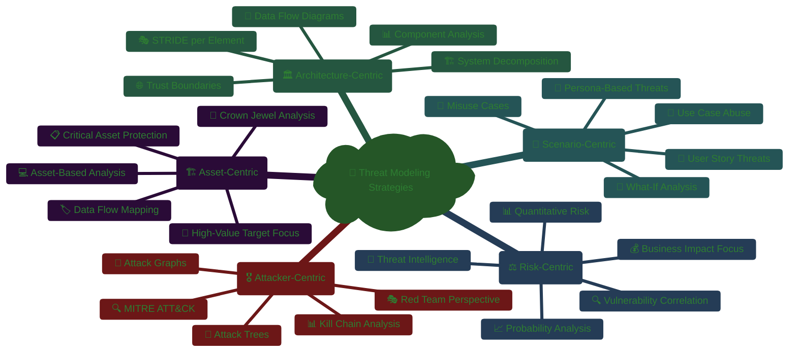
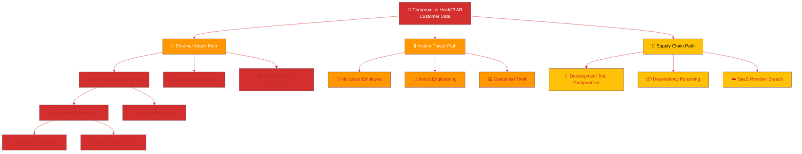
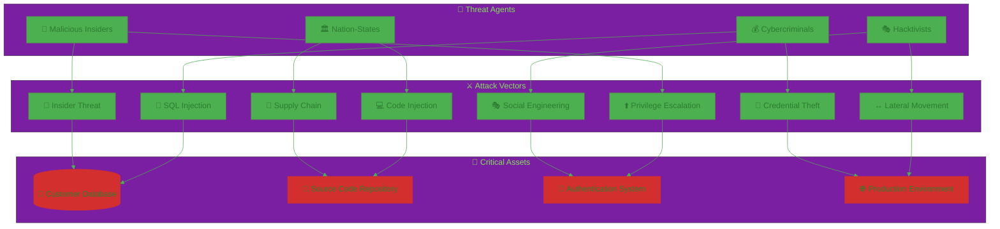
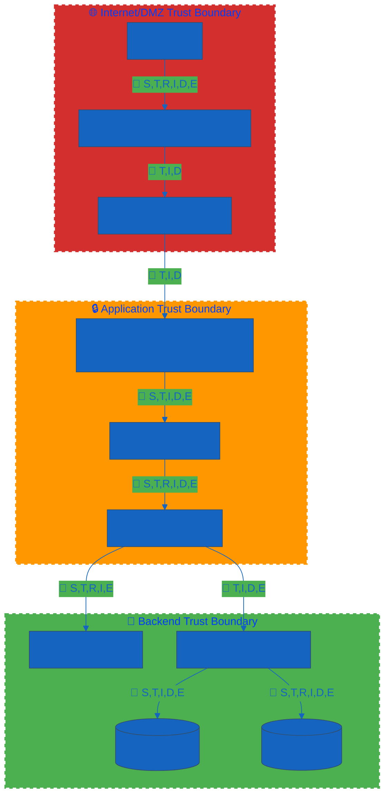
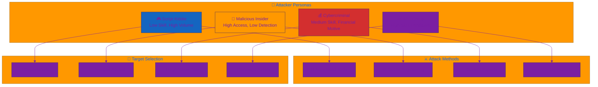
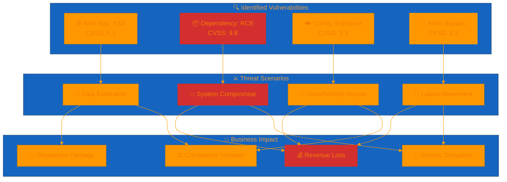
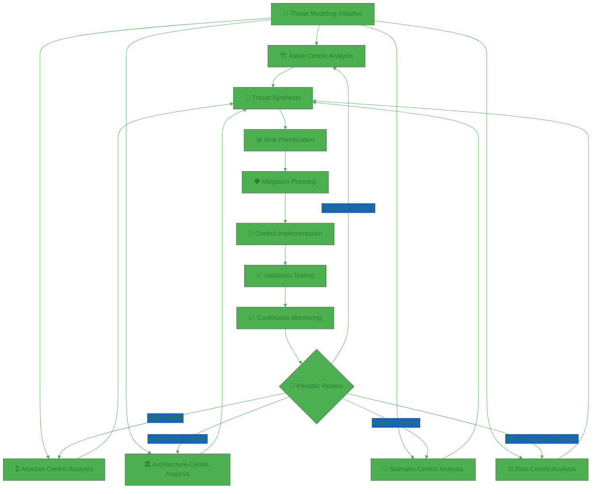
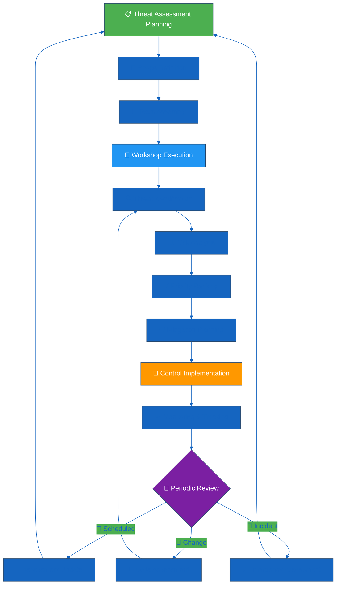

  

<h1 align="center">🎯 Hack23 AB — Threat Modeling Policy</h1>

  <strong>🛡️ Proactive Security Through Systematic Threat Analysis</strong> 
  <em>🔍 STRIDE Framework • MITRE ATT&CK Integration • Transparent Risk Assessment</em>

  
  
  
  

**📋 Document Owner:** CEO | **📄 Version:** 1.3 | **📅 Last Updated:** 2026-01-25 (UTC)  
**🔄 Review Cycle:** Annual | **⏰ Next Review:** 2027-01-25

---

## 🎯 **Purpose Statement**

**Hack23 AB's** threat modeling policy establishes systematic procedures for proactive threat identification, risk analysis, and security control validation across all systems, applications, and services. Our approach demonstrates cybersecurity consulting expertise through structured threat assessment methodologies while ensuring **🔄 operational excellence** and **💡 innovation enablement**.

This policy embodies our **🌟 transparency principle** - making threat assessment practices publicly verifiable while showcasing our **🏆 competitive advantage** through demonstrable security architecture analysis and **🤝 customer trust** via systematic risk management.

### 📢 **Transparency Commitments**
- **🏗️ Public Architecture Analysis:** Every project maintains detailed threat models with STRIDE framework application
- **🎖️ MITRE ATT&CK Integration:** Public demonstration of advanced threat intelligence and attack vector analysis
- **📊 Risk Assessment Documentation:** Transparent threat prioritization and mitigation strategies
- **🔍 Security Architecture Validation:** Evidence-based security control effectiveness through structured threat analysis

*— James Pether Sörling, CEO/Founder*

---

## 🔍 **Purpose & Scope**

This policy establishes comprehensive threat modeling framework for identifying, analyzing, and mitigating security threats throughout the development lifecycle and operational phases, ensuring **🛡️ risk reduction** and **⚙️ operational efficiency**.

**Scope:** All information assets and systems documented in [💻 Asset Register](./Asset_Register.md), including:
- **🎮 Gaming Applications:** Black Trigram threat landscape analysis
- **🏛️ Civic Platforms:** CIA democratic engagement security assessment
- **📊 Compliance Tools:** CIA Compliance Manager threat evaluation
- **☁️ Cloud Infrastructure:** AWS security architecture threat modeling
- **🔓 Open Source Projects:** Public repository security analysis

**Policy Integration:**
- **🛠️ Secure Development:** Aligned with [🛠️ Secure Development Policy](./Secure_Development_Policy.md) security architecture requirements
- **🔍 Vulnerability Management:** Integrated with [🔍 Vulnerability Management](./Vulnerability_Management.md) systematic risk assessment
- **📉 Risk Management:** Supporting [📉 Risk Register](./Risk_Register.md) comprehensive risk treatment framework

---

## 🧭 **Core Threat Modeling Principles**

### **🔐 Security by Design Through Threat Analysis**
- **🏷️ Classification-Driven Assessment:** Threat analysis aligned with [🏷️ Classification Framework](./CLASSIFICATION.md) business impact levels
- **🎯 STRIDE Framework Application:** Systematic threat categorization ensuring **🏆 competitive advantage** through comprehensive security coverage
- **🛡️ Defense-in-Depth Validation:** Multi-layer security control verification supporting **💰 revenue protection** objectives

### **🌟 Transparency Through Structured Analysis**
- **📊 MITRE ATT&CK Integration:** Advanced threat intelligence demonstrating **💼 partnership value** through industry-standard frameworks
- **🔍 Public Security Architecture:** Open threat model documentation enabling **🤝 trust enhancement** via transparent security practices
- **📈 Continuous Assessment:** Regular threat landscape evaluation ensuring **📋 compliance posture** maintenance

### **🔄 Continuous Improvement Through Intelligence**
- **⚡ Proactive Threat Hunting:** Early threat identification driving **⚙️ operational efficiency** through preventive controls
- **📊 Risk-Based Prioritization:** Business impact-driven threat ranking ensuring **💰 cost efficiency** through focused remediation
- **🤝 Stakeholder Integration:** Cross-functional threat assessment promoting **🤝 stakeholder engagement** and **📊 decision quality**

---

## 🏗️ **Threat Modeling Framework**

### **📋 CIA Triad Foundation**
The **CIA Triad** provides foundational security principles for threat impact assessment:

| Security Principle | Definition | Key Controls | Threat Categories |
|-------------------|------------|--------------|------------------|
| **🔐 Confidentiality** | Information accessible only to authorized entities | Encryption, access control, authentication | Information disclosure, credential theft |
| **🔒 Integrity** | Data protection from unauthorized modification | Checksums, digital signatures, version control | Tampering, data corruption, unauthorized changes |
| **⚡ Availability** | Reliable and timely access to information and systems | Redundancy, disaster recovery, DDoS mitigation | Denial of service, system outages, resource exhaustion |

**📚 Reference:** [CIA Triad Information Security](https://en.wikipedia.org/wiki/Information_security#Core_concepts:_Confidentiality,_Integrity,_availability)

### **🔑 AAA Framework Integration**
The **AAA Framework** secures resource access through systematic identity and access management:

| AAA Component | Definition | Key Mechanisms | Integration Points |
|---------------|------------|----------------|-------------------|
| **🔐 Authentication** | Identity verification for users and systems | Passwords, biometrics, 2FA, certificates | [🔑 Access Control Policy](./Access_Control_Policy.md) |
| **📋 Authorization** | Permitted action determination for verified entities | RBAC, ABAC, policy enforcement | [🔑 Access Control Policy](./Access_Control_Policy.md) |
| **📊 Accounting** | Activity tracking and monitoring for compliance | Logs, audits, monitoring tools | [📊 Security Metrics](./Security_Metrics.md) |

**📚 Reference:** [OWASP Authentication Cheat Sheet](https://cheatsheetseries.owasp.org/cheatsheets/Authentication_Cheat_Sheet.html)

---

## 🎯 **STRIDE Threat Modeling Framework**

### **📊 STRIDE Methodology Application**
[STRIDE](https://en.wikipedia.org/wiki/STRIDE_(security)) provides systematic threat categorization aligned with security controls:

| STRIDE Category | Description | Security Control | DFD Elements | Business Impact |
|-----------------|-------------|------------------|--------------|----------------|
| **🎭 Spoofing** | Attacker gains access using false identity | Authentication | Process, External entities |  |
| **🔧 Tampering** | Data modification during application flow | Integrity | Process, Data store, Data flow |  |
| **❌ Repudiation** | Attacker denies actions without proof capability | Non-repudiation (Auditing) | Process, External entities |  |
| **📤 Information Disclosure** | Unauthorized access to private or sensitive data | Confidentiality | Process, Data store, Data flow |  |
| **⚡ Denial of Service** | System availability reduction or service crash | Availability | Process, Data store, Data flow |  |
| **⬆️ Elevation of Privilege** | Attacker assumes privileged user identity | Authorization | Process |  |

---

## 🕵️ **MITRE ATT&CK Framework Integration**

### **🎯 Tactics and Techniques for Modern Applications**
Comprehensive threat analysis using [MITRE ATT&CK Framework](https://attack.mitre.org/) for web, API, mobile, and cloud applications:

| Tactic | Description | Common Techniques | Application Context |
|--------|-------------|-------------------|-------------------|
| **🔍 [Reconnaissance](https://attack.mitre.org/tactics/TA0043/)** | Information gathering for future operations | [Active Scanning](https://attack.mitre.org/techniques/T1595/), [Phishing for Information](https://attack.mitre.org/techniques/T1598/) | External threat intelligence gathering |
| **🏗️ [Resource Development](https://attack.mitre.org/tactics/TA0042/)** | Establishing operational resources | [Compromise Accounts](https://attack.mitre.org/techniques/T1586/001/), [Infrastructure as Code Abuse](https://attack.mitre.org/techniques/T1608/) | Cloud infrastructure targeting |
| **🚪 [Initial Access](https://attack.mitre.org/tactics/TA0001/)** | Network entry point establishment | [Phishing](https://attack.mitre.org/techniques/T1566/), [Drive-by Compromise](https://attack.mitre.org/techniques/T1189/) | Application and service exploitation |
| **⚡ [Execution](https://attack.mitre.org/tactics/TA0002/)** | Malicious code execution | [Command and Scripting Interpreter](https://attack.mitre.org/techniques/T1059/), [Malicious Input Handling](https://attack.mitre.org/techniques/T1221/) | Application runtime threats |
| **🔄 [Persistence](https://attack.mitre.org/tactics/TA0003/)** | Foothold maintenance | [Account Manipulation](https://attack.mitre.org/techniques/T1098/), [Cloud Account Abuse](https://attack.mitre.org/techniques/T1078/004/) | Long-term access establishment |
| **⬆️ [Privilege Escalation](https://attack.mitre.org/tactics/TA0004/)** | Higher-level permission acquisition | [Cloud Instance Metadata API Exploitation](https://attack.mitre.org/techniques/T1552/005/), [Process Injection](https://attack.mitre.org/techniques/T1055/) | Authorization bypass |
| **🎭 [Defense Evasion](https://attack.mitre.org/tactics/TA0005/)** | Detection avoidance | [Obfuscated Files or Information](https://attack.mitre.org/techniques/T1027/), [Bypass Application Control](https://attack.mitre.org/techniques/T1622/) | Security control circumvention |
| **🔑 [Credential Access](https://attack.mitre.org/tactics/TA0006/)** | Account credential theft | [Brute Force](https://attack.mitre.org/techniques/T1110/), [Steal Application Access Tokens](https://attack.mitre.org/techniques/T1528/) | Authentication system targeting |
| **🔍 [Discovery](https://attack.mitre.org/tactics/TA0007/)** | Environment reconnaissance | [Cloud Service Discovery](https://attack.mitre.org/techniques/T1526/), [System Information Discovery](https://attack.mitre.org/techniques/T1082/) | Infrastructure enumeration |
| **↔️ [Lateral Movement](https://attack.mitre.org/tactics/TA0008/)** | Environment traversal | [Remote Services](https://attack.mitre.org/techniques/T1021/), [Cloud Service Account Abuse](https://attack.mitre.org/techniques/T1078/004/) | Network and cloud propagation |
| **📦 [Collection](https://attack.mitre.org/tactics/TA0009/)** | Data gathering | [Data from Local System](https://attack.mitre.org/techniques/T1005/), [Cloud Storage Enumeration](https://attack.mitre.org/techniques/T1530/) | Information asset targeting |
| **📡 [Command and Control](https://attack.mitre.org/tactics/TA0011/)** | Compromised system communication | [Application Layer Protocol](https://attack.mitre.org/techniques/T1071/), [Domain Fronting](https://attack.mitre.org/techniques/T1090/004/) | Remote command execution |
| **📤 [Exfiltration](https://attack.mitre.org/tactics/TA0010/)** | Data theft | [Exfiltration Over C2 Channel](https://attack.mitre.org/techniques/T1041/), [Exfiltration to Cloud Storage](https://attack.mitre.org/techniques/T1567/002/) | Information disclosure |
| **💥 [Impact](https://attack.mitre.org/tactics/TA0040/)** | System and data manipulation/destruction | [Data Destruction](https://attack.mitre.org/techniques/T1485/), [Resource Hijacking](https://attack.mitre.org/techniques/T1496/) | Business operation disruption |

---

## 👥 **Threat Agent Classification**

### **🔍 Comprehensive Threat Actor Analysis**
Systematic threat agent categorization for risk assessment and mitigation planning:

| Threat Agent | Category | Description | MITRE Techniques | MITRE Tactics | Risk Level |
|--------------|----------|-------------|------------------|---------------|------------|
| **🔒 Accidental Insider Threats** | Internal | Employees/contractors causing unintentional risk | [Misconfigurations](https://attack.mitre.org/techniques/T1611), [Permission Errors](https://attack.mitre.org/techniques/T1068) | [Execution](https://attack.mitre.org/tactics/TA0002), [Privilege Escalation](https://attack.mitre.org/tactics/TA0004) |  |
| **🎯 Malicious Insider Threats** | Internal | Employees/contractors causing intentional harm | [Data Exfiltration](https://attack.mitre.org/techniques/T1041), [Account Manipulation](https://attack.mitre.org/techniques/T1098) | [Initial Access](https://attack.mitre.org/tactics/TA0001), [Impact](https://attack.mitre.org/tactics/TA0040) |  |
| **💰 Cybercriminals (Organized Crime)** | External | Financial motivation through phishing and malware | [Phishing](https://attack.mitre.org/techniques/T1566), [Brute Force](https://attack.mitre.org/techniques/T1110) | [Reconnaissance](https://attack.mitre.org/tactics/TA0043), [Collection](https://attack.mitre.org/tactics/TA0009) |  |
| **🏛️ Nation-State Actors (APTs)** | External | State-sponsored long-term infiltration and espionage | [Spearphishing](https://attack.mitre.org/techniques/T1566/001), [Command and Control](https://attack.mitre.org/tactics/TA0011) | [Persistence](https://attack.mitre.org/tactics/TA0003), [Defense Evasion](https://attack.mitre.org/tactics/TA0005) |  |
| **🎭 Hacktivists (Ideological Attackers)** | External | Political/ideological motivation for service disruption | [DDoS](https://attack.mitre.org/techniques/T1499), [Defacement](https://attack.mitre.org/techniques/T1491) | [Impact](https://attack.mitre.org/tactics/TA0040), [Privilege Escalation](https://attack.mitre.org/tactics/TA0004) |  |
| **🤝 External Service Providers** | External | Third-party access to sensitive data and systems | [Misconfigurations](https://attack.mitre.org/techniques/T1611), [Supply Chain Compromise](https://attack.mitre.org/techniques/T1195) | [Initial Access](https://attack.mitre.org/tactics/TA0001), [Defense Evasion](https://attack.mitre.org/tactics/TA0005) |  |
| **🎨 Cyber Vandals** | External | Fame/amusement through website defacement and disruption | [Defacement](https://attack.mitre.org/techniques/T1491), [Service Disruption](https://attack.mitre.org/techniques/T1499) | [Impact](https://attack.mitre.org/tactics/TA0040), [Execution](https://attack.mitre.org/tactics/TA0002) |  |

---

## 🌐 **Current Threat Landscape Analysis**

### **📊 ENISA Threat Landscape 2024 Integration**
Based on [ENISA Threat Landscape 2024](https://www.enisa.europa.eu/publications/enisa-threat-landscape-2024) priority threat categories:

| Priority Rank | Threat Category | Description | Business Impact | Mitigation Priority |
|---------------|-----------------|-------------|----------------|-------------------|
| **1️⃣** | **⚡ Threats Against Availability** | DoS attacks making systems unavailable |  | Critical |
| **2️⃣** | **🔐 Ransomware** | Data encryption with ransom demands |  | Critical |
| **3️⃣** | **📊 Threats Against Data** | Unauthorized access, theft, or manipulation |  | High |
| **4️⃣** | **🦠 Malware** | Malicious software for system disruption |  | High |
| **5️⃣** | **🎭 Social Engineering** | Human manipulation for information disclosure |  | High |
| **6️⃣** | **📰 Information Manipulation** | False information spreading and interference |  | Medium |
| **7️⃣** | **🔗 Supply Chain Attacks** | Third-party targeting for primary access |  | High |

---

## 🎯 **Comprehensive Threat Modeling Strategies & Models**

### **🔍 Strategic Approach Selection Framework**

Hack23 AB employs multiple complementary threat modeling strategies to ensure comprehensive security analysis. Each strategy provides unique perspectives on potential attack vectors and defensive requirements.

---

## 🎖️ **Attacker-Centric Threat Modeling**

### **🔍 MITRE ATT&CK-Driven Analysis**

Our primary attacker-centric approach leverages the MITRE ATT&CK framework to think like adversaries and map realistic attack paths.

#### **📊 Tactics-First Methodology**

| Attack Phase | MITRE Tactic | Hack23 Focus Areas | Implementation Questions |
|--------------|--------------|-------------------|-------------------------|
| **🔍 Pre-Attack** | [Reconnaissance](https://attack.mitre.org/tactics/TA0043/) | Open source intelligence gathering | What information is publicly available about our systems? |
| **🏗️ Resource Development** | [Resource Development](https://attack.mitre.org/tactics/TA0042/) | Infrastructure compromise preparation | How would attackers acquire capabilities to target us? |
| **🚪 Initial Compromise** | [Initial Access](https://attack.mitre.org/tactics/TA0001/) | Entry point identification | What are all possible ways attackers could gain initial access? |
| **⚡ Code Execution** | [Execution](https://attack.mitre.org/tactics/TA0002/) | Payload deployment mechanisms | How would attackers execute malicious code in our environment? |
| **🔄 Maintain Presence** | [Persistence](https://attack.mitre.org/tactics/TA0003/) | Long-term access mechanisms | How would attackers maintain access across system restarts? |
| **⬆️ Expand Access** | [Privilege Escalation](https://attack.mitre.org/tactics/TA0004/) | Rights elevation pathways | How could attackers gain higher privileges? |
| **🎭 Avoid Detection** | [Defense Evasion](https://attack.mitre.org/tactics/TA0005/) | Security control bypass | How would attackers avoid our security monitoring? |
| **🔑 Steal Credentials** | [Credential Access](https://attack.mitre.org/tactics/TA0006/) | Authentication bypass methods | How could attackers obtain valid credentials? |
| **🔍 Map Environment** | [Discovery](https://attack.mitre.org/tactics/TA0007/) | System reconnaissance techniques | What would attackers learn about our internal systems? |
| **↔️ Move Laterally** | [Lateral Movement](https://attack.mitre.org/tactics/TA0008/) | Network traversal methods | How would attackers move between systems? |
| **📦 Gather Intelligence** | [Collection](https://attack.mitre.org/tactics/TA0009/) | Data harvesting techniques | How would attackers identify and collect valuable data? |
| **📡 Establish C2** | [Command and Control](https://attack.mitre.org/tactics/TA0011/) | Remote control mechanisms | How would attackers maintain command over compromised systems? |
| **📤 Extract Data** | [Exfiltration](https://attack.mitre.org/tactics/TA0010/) | Data theft methods | How would attackers steal our data? |
| **💥 Cause Damage** | [Impact](https://attack.mitre.org/tactics/TA0040/) | System disruption techniques | How would attackers disrupt our operations? |

#### **🌳 Attack Tree Construction**

Systematic decomposition of attack goals into achievable sub-goals using AND/OR logic:

#### **🔗 Attack Graph Modeling**

Network-based attack path analysis showing how attackers could traverse our infrastructure:

```mermaid
%%{
  init: {
    'theme': 'base',
    'themeVariables': {
      'primaryColor': '#1565C0',
      'primaryTextColor': '#1565C0',
      'lineColor': '#2196F3',
      'secondaryColor': '#7B1FA2',
      'tertiaryColor': '#4CAF50'
    }
  }
}%%
graph LR
    INTERNET[🌐 Internet]
    WAF[🛡️ WAF/CloudFront]
    ALB[⚖️ Application Load Balancer]
    WEB[🌐 Web Servers<br/>Public Subnet]
    APP[📱 Application Servers<br/>Private Subnet]
    DB[(🗄️ Database<br/>Private Subnet)]
    ADMIN[👨‍💼 Admin Interface<br/>VPN Only]
    
    INTERNET -->|"🎯 Attack Vector 1<br/>Web Exploit"| WAF
    WAF -->|"Bypass WAF"| ALB
    ALB --> WEB
    WEB -->|"🎯 Attack Vector 2<br/>SSRF/RCE"| APP
    APP -->|"🎯 Attack Vector 3<br/>SQL Injection"| DB
    
    INTERNET -.->|"🎯 Attack Vector 4<br/>VPN Exploit"| ADMIN
    ADMIN -.->|"Privilege Escalation"| APP
    
    WEB -->|"🎯 Attack Vector 5<br/>Container Escape"| APP
    APP -->|"Lateral Movement"| DB
    
    classDef internet fill:#D32F2F,stroke:#D32F2F,color:#fff
    classDef public fill:#FF9800,stroke:#F57C00,color:#fff
    classDef private fill:#4CAF50,stroke:#388E3C,color:#fff
    classDef database fill:#1565C0,stroke:#1565C0,color:#fff
    classDef admin fill:#7B1FA2,stroke:#7B1FA2,color:#fff
    
    class INTERNET internet
    class WAF,ALB,WEB public
    class APP private
    class DB,BACKUP database
    class ADMIN admin
```

#### **📊 Kill Chain Disruption Analysis**

Mapping defensive controls to specific attack chain phases:

| Kill Chain Phase | Attacker Actions | Our Defensive Controls | Detection Capabilities |
|------------------|------------------|----------------------|----------------------|
| **🔍 Reconnaissance** | Open source intelligence gathering | [🌐 ISMS Transparency Plan](./ISMS_Transparency_Plan.md) controlled disclosure | DNS monitoring, web analytics |
| **🎯 Weaponization** | Exploit development and tool creation | [🔓 Open Source Policy](./Open_Source_Policy.md) supply chain security | Threat intelligence feeds |
| **📤 Delivery** | Payload transmission to target | Email security, web filtering, network segmentation | Email security gateways, WAF |
| **⚡ Exploitation** | Vulnerability exploitation for initial access | [🔍 Vulnerability Management](./Vulnerability_Management.md) systematic patching | SAST/DAST scanning, WAF logs |
| **🔧 Installation** | Malware installation and persistence | Endpoint protection, application control | EDR solutions, file integrity monitoring |
| **📡 Command & Control** | Remote access establishment | Network monitoring, DNS filtering | Network traffic analysis, DNS logs |
| **🎯 Actions on Objectives** | Data theft or system disruption | [🏷️ Data Classification Policy](./Data_Classification_Policy.md) protection | Data loss prevention, activity monitoring |

#### **🎭 Red Team Perspective Integration**

Adopting adversarial mindset for realistic threat assessment:

**🎯 Attacker Motivation Analysis:**
- **💰 Financial Gain:** Customer data theft for sale, ransomware deployment, business disruption
- **🕵️ Espionage:** Proprietary algorithm theft, customer intelligence gathering, competitive advantage
- **🎨 Vandalism:** Website defacement, service disruption, reputation damage
- **⚖️ Ideological:** Anti-corporate activism, privacy advocacy, political statement

**🔍 Attacker Capability Assessment:**
- **🟢 Script Kiddie:** Basic tools, known exploits, limited persistence
- **🟡 Skilled Individual:** Custom tools, novel techniques, moderate sophistication
- **🟠 Organized Crime:** Professional tools, targeted attacks, financial motivation
- **🔴 Nation-State APT:** Advanced tools, zero-day exploits, unlimited resources

---

## 🏗️ **Asset-Centric Threat Modeling**

### **💻 Asset-Based Analysis Framework**

Focus on protecting high-value assets by understanding what attackers would target and why.

#### **💎 Crown Jewel Identification**

Critical asset analysis aligned with [🏷️ Classification Framework](./CLASSIFICATION.md):

| Asset Category | Examples | Attack Value | Protection Priority | Threat Focus |
|----------------|----------|--------------|-------------------|--------------|
| **🔐 Customer Data** | Personal information, payment data, usage analytics |  | Critical | Data exfiltration, privacy violation |
| **🧠 Intellectual Property** | Source code, algorithms, business logic |  | High | Corporate espionage, competitive theft |
| **🔑 Authentication Systems** | Identity providers, credential stores, session management |  | Critical | Unauthorized access, privilege escalation |
| **🌐 Service Availability** | Production systems, databases, network infrastructure |  | High | Service disruption, ransomware |
| **📊 Business Intelligence** | Analytics, reports, strategic data |  | Medium | Competitive intelligence |
| **🏢 Corporate Systems** | Email, collaboration tools, administrative systems |  | Medium | Lateral movement, social engineering |

#### **🗺️ Asset Attack Surface Mapping**

Systematic analysis of how attackers could target each critical asset:

#### **🔍 Data Flow Threat Analysis**

Tracking how sensitive data moves through systems and where it could be compromised:

```mermaid
%%{
  init: {
    'theme': 'base',
    'themeVariables': {
      'primaryColor': '#4CAF50',
      'primaryTextColor': '#2E7D32',
      'lineColor': '#4CAF50',
      'secondaryColor': '#FF9800',
      'tertiaryColor': '#1565C0'
    }
  }
}%%
flowchart LR
    USER[👤 User Input]
    CLIENT[💻 Client Application]
    API[🔌 API Gateway]
    AUTH[🔑 Authentication Service]
    APP[📱 Application Logic]
    DB[(🗄️ Database)]
    ANALYTICS[📊 Analytics Service]
    BACKUP[💾 Backup Storage]
    
    USER -->|🎯 T1: Input Injection| CLIENT
    CLIENT -->|🎯 T2: Man-in-Middle| API
    API -->|🎯 T3: Token Theft| AUTH
    AUTH -->|🎯 T4: Session Hijack| APP
    APP -->|🎯 T5: SQL Injection| DB
    APP -->|🎯 T6: Data Leakage| ANALYTICS
    DB -->|🎯 T7: Backup Theft| BACKUP
    
    classDef user fill:#2196F3,stroke:#1565C0,color:#fff
    classDef system fill:#4CAF50,stroke:#388E3C,color:#fff
    classDef storage fill:#FF9800,stroke:#F57C00,color:#fff
    classDef threat fill:#D32F2F,stroke:#D32F2F,color:#fff
    
    class USER user
    class CLIENT,API,AUTH,APP,ANALYTICS system
    class DB,BACKUP storage
```

#### **🏷️ Asset Protection Strategy Matrix**

Mapping protection strategies to asset criticality and attack likelihood:

| Asset Type | Criticality | Attack Likelihood | Protection Strategy | Monitoring Level |
|------------|-------------|------------------|-------------------|-----------------|
| **🔐 Customer PII** |  | High | Encryption + Access Control + DLP | Real-time |
| **🧠 Source Code** |  | Medium | Version Control + Code Signing + Repository Security | Continuous |
| **🔑 Authentication Tokens** |  | High | Short Expiry + Secure Storage + Rotation | Real-time |
| **📊 Business Data** |  | Medium | Classification + Access Control + Auditing | Daily |
| **🌐 Service Endpoints** |  | High | WAF + Rate Limiting + Input Validation | Real-time |

---

## 🏛️ **Architecture-Centric Threat Modeling**

### **🎭 STRIDE-per-Element Analysis**

Systematic application of STRIDE methodology to each architectural component:

#### **🔄 Data Flow Diagram (DFD) Threat Analysis**

#### **🏗️ Component-Level STRIDE Analysis**

| Component | Spoofing (S) | Tampering (T) | Repudiation (R) | Info Disclosure (I) | DoS (D) | Elevation (E) |
|-----------|--------------|---------------|-----------------|-------------------|---------|---------------|
| **👤 User** | ❌ | ❌ | ✅ User claims | ❌ | ❌ | ❌ |
| **🛡️ WAF** | ✅ IP spoofing | ✅ Rule bypass | ❌ | ✅ Log exposure | ✅ Resource exhaustion | ❌ |
| **🔌 API Gateway** | ✅ Token forgery | ✅ Request modification | ✅ Action denial | ✅ Data leakage | ✅ Rate limit bypass | ✅ Permission escalation |
| **📱 Application** | ✅ User impersonation | ✅ Code injection | ✅ Audit bypass | ✅ Memory dumps | ✅ Resource consumption | ✅ Privilege abuse |
| **🗄️ Database** | ✅ Connection spoofing | ✅ Data modification | ✅ Transaction denial | ✅ Data dumping | ✅ Connection flooding | ✅ Permission escalation |

#### **🌐 Trust Boundary Analysis**

Systematic evaluation of security controls at each trust boundary:

| Trust Boundary | Security Controls | Threat Scenarios | Validation Methods |
|----------------|-------------------|------------------|-------------------|
| **🌐 Internet ↔ DMZ** | WAF, DDoS protection, TLS termination | Web attacks, volumetric attacks | Penetration testing, load testing |
| **🔒 DMZ ↔ Application** | Network segmentation, authenticated connections | Lateral movement, session hijacking | Network scans, traffic analysis |
| **🔐 Application ↔ Backend** | Service authentication, encrypted connections | Privilege escalation, data access | API testing, access review |
| **💾 Backend ↔ Data** | Database authentication, query validation | SQL injection, data exfiltration | Database security audit |

---

## 🎯 **Scenario-Centric Threat Modeling**

### **📝 Use Case Abuse Analysis**

Transforming legitimate use cases into potential attack scenarios:

#### **🚨 Misuse Case Development**

| Legitimate Use Case | Misuse Case | Attack Method | Impact | Mitigation |
|-------------------|-------------|---------------|--------|------------|
| **👤 User Login** | **🎭 Account Takeover** | Credential stuffing, phishing | Unauthorized access | MFA, account lockout, monitoring |
| **📊 Data Analytics** | **🕵️ Data Mining** | Excessive queries, pattern analysis | Privacy violation | Query limiting, data anonymization |
| **🔄 System Backup** | **💾 Data Exfiltration** | Backup theft, insider access | Data breach | Encryption, access control, monitoring |
| **🤝 API Integration** | **🔌 API Abuse** | Rate limit bypass, injection | Service disruption | Rate limiting, input validation |
| **📈 Performance Monitoring** | **🔍 Reconnaissance** | System enumeration, vulnerability discovery | Information disclosure | Log sanitization, access restriction |

#### **👤 Persona-Based Threat Analysis**

Analyzing threats from different attacker personas:

#### **🎲 What-If Scenario Planning**

Structured analysis of hypothetical attack scenarios:

**🔍 Scenario 1: Supply Chain Compromise**
- **What if:** A widely-used dependency in our application contains malicious code?
- **Attack Path:** Dependency → Build Process → Production Deployment → Data Access
- **Impact:** Code injection, data exfiltration, service disruption
- **Detection:** SBOM analysis, dependency scanning, behavioral monitoring
- **Response:** Dependency isolation, rollback procedures, forensic analysis

**🔍 Scenario 2: Cloud Provider Incident**
- **What if:** Our cloud provider experiences a major security incident?
- **Attack Path:** Cloud Provider → Shared Infrastructure → Customer Data
- **Impact:** Data exposure, service disruption, compliance violation
- **Detection:** Provider notifications, anomaly detection, access monitoring
- **Response:** Data encryption verification, incident coordination, customer communication

**🔍 Scenario 3: Insider Threat Escalation**
- **What if:** A trusted employee becomes malicious or is compromised?
- **Attack Path:** Legitimate Access → Privilege Abuse → Data Theft
- **Impact:** Data exfiltration, system sabotage, competitive intelligence theft
- **Detection:** Behavioral analytics, access monitoring, data classification
- **Response:** Access revocation, forensic investigation, legal coordination

---

## ⚖️ **Risk-Centric Threat Modeling**

### **📊 Quantitative Risk Assessment**

Integrating threat modeling with business impact quantification:

#### **💰 Business Impact Analysis Matrix**

| Threat Scenario | Probability | Financial Impact | Operational Impact | Reputation Impact | Total Risk Score |
|----------------|-------------|------------------|-------------------|------------------|------------------|
| **🔐 Customer Data Breach** | 15% | €500K-2M |  |  | 9.2/10 |
| **🎮 Gaming Platform Disruption** | 25% | €50K-200K |  |  | 6.8/10 |
| **🧠 Source Code Theft** | 10% | €200K-1M |  |  | 7.5/10 |
| **☁️ Cloud Infrastructure Compromise** | 20% | €100K-500K |  |  | 7.1/10 |
| **🤝 Third-Party Service Disruption** | 30% | €20K-100K |  |  | 5.4/10 |

#### **📈 Threat Intelligence Integration**

Incorporating external threat intelligence into risk calculations:

| Intelligence Source | Update Frequency | Relevance Score | Integration Method |
|-------------------|------------------|-----------------|-------------------|
| **🏛️ ENISA Threat Landscape** | Annual | 9/10 | Strategic planning, annual review |
| **🎯 MITRE ATT&CK Updates** | Quarterly | 8/10 | Technique mapping, control validation |
| **☁️ AWS Security Bulletins** | As published | 7/10 | Infrastructure hardening, patch management |
| **🔍 CVE Database** | Daily | 9/10 | Vulnerability management, dependency updates |
| **🌐 Sector-Specific Intelligence** | Monthly | 6/10 | Comparative analysis, peer benchmarking |

#### **🔍 Vulnerability Correlation Analysis**

Mapping vulnerabilities to threat scenarios for prioritized remediation:

---

## 🛠️ **Threat Model Integration & Implementation**

### **📋 Comprehensive Threat Modeling Process**

Combining multiple modeling approaches for complete threat coverage:

#### **🔄 Multi-Strategy Integration Workflow**

## 🎪 **Threat Modeling Workshop Framework**

### **📋 Pre-Workshop Preparation Requirements**

#### **🎯 Workshop Scope Definition**
- **📊 Objective Clarity:** Specific system, application, or SDLC phase threat identification
- **🔍 Component Scope:** Software, hardware, third-party integrations, network infrastructure inclusion
- **🏷️ Classification Integration:** Risk assessment aligned with [🏷️ Classification Framework](./CLASSIFICATION.md)

#### **👥 Team Assembly Standards**
- **💻 Developer/Security Champion:** Code architecture, deployment, and monitoring insights
- **🏗️ Architect:** System component and dependency overview
- **🛡️ Security Expert:** Threat identification and mitigation technique expertise
- **📊 Product/Service Owner:** Business goal and data sensitivity understanding
- **🎯 Application Security Officer:** Workshop facilitation and documentation management

#### **📚 Mandatory Documentation Preparation**
- **🏛️ System/Security Architecture Diagrams:** Component, data flow, and dependency visualization
- **📝 Application Technical Details:** Stack, libraries, APIs, and storage documentation
- **🎭 Threat Agent Profiles:** Current threat landscape and attack vector analysis
- **📊 STRIDE Framework Reference:** Systematic threat categorization methodology

### **📅 Workshop Agenda Framework**

#### **🚀 Introduction (10-15 minutes)**
- **🎯 Purpose and Scope Overview:** Workshop goals and expected outcomes
- **📋 Methodology Introduction:** STRIDE framework and MITRE ATT&CK integration
- **👥 Participant Role Clarification:** Team member responsibilities and expertise areas

#### **🏗️ System Walkthrough (10-15 minutes)**
Comprehensive system understanding development through structured questioning:

**🔍 System Description Analysis:**
- What business processes does the system handle and support?
- Are these processes clearly defined and documented?
- How will the system be used in normal operations?
- What are the explicit non-use cases and boundaries?

**☁️ Environment and Architecture Assessment:**
- Cloud, on-premise, or hybrid deployment model?
- Operating system and virtualization technology usage?
- Container orchestration and infrastructure as code implementation?
- Application type: service, API, frontend, or integrated solution?

**🔐 Security and Access Control Evaluation:**
- Script execution, data access, and hardware requirement permissions?
- Cloud provider security configuration options and defaults?
- Operating system security features and hardening capabilities?
- First-party and third-party service integrations and trust boundaries?

**🔑 Identity and Session Management Review:**
- Account types: user, admin, service, and their access requirements?
- Local versus cloud-enabled account management strategies?
- Identity provider integration: Azure AD, RBAC, MFA implementation?
- Session handling for APIs, tokens, and request processing?

**📊 Monitoring and Data Protection Analysis:**
- Security event logging, anomaly monitoring, and backup mechanisms?
- Data types, classification levels, and protection requirements?
- Input validation, output encoding, and data source trust verification?
- Encryption implementation: at rest, in transit, and in use?

**🔒 Secrets and Network Security Assessment:**
- Key, certificate, and credential management strategies?
- Intrusion detection/protection systems and communication encryption?
- Network segmentation, firewall rules, and access control implementation?

#### **🔍 Threat Identification and Analysis (45-60 minutes)**
Systematic threat discovery using structured frameworks:

**📊 Threat Documentation Attributes:**
- **🎯 MITRE ATT&CK Tactic:** Adversary tactical goal (e.g., Initial Access, Credential Access)
- **🔧 Technique ID/Name:** Specific MITRE ATT&CK technique reference
- **🏗️ Threat Component:** Targeted system, process, or infrastructure element
- **📝 Threat Description:** Concise adversary action and impact summary
- **👥 Threat Agent:** External, internal, or combined threat source classification
- **🔐 CIA Risk Assessment:** Confidentiality, Integrity, Availability impact analysis
- **🔑 AAA Control Mapping:** Authentication, Authorization, Accounting requirement identification
- **🎭 STRIDE Category:** Spoofing, Tampering, Repudiation, Information Disclosure, DoS, Elevation classification
- **🛡️ Security Measures:** Current and planned mitigation controls
- **⚡ Priority Level:** Critical, High, Medium risk classification
- **❓ Assessment Questions:** System-specific vulnerability evaluation

#### **🛡️ Mitigation Strategy Development (30-60 minutes)**
Comprehensive security control planning:

**🔧 Mitigation Framework Development:**
- **📚 MITRE ATT&CK Mitigation Reference:** [Standard mitigation techniques](https://attack.mitre.org/mitigations/) application
- **🎭 STRIDE Category Coverage:** Comprehensive threat category mitigation ensuring complete coverage
- **🏷️ Classification-Based Controls:** Risk-appropriate security control implementation per business impact
- **💰 Cost-Benefit Analysis:** Resource allocation optimization for maximum security ROI

#### **📊 Risk Prioritization (10-15 minutes)**
Business-driven threat ranking and action planning:

**⚖️ Prioritization Criteria:**
- **📈 Likelihood Assessment:** Threat occurrence probability based on current threat landscape
- **💥 Business Impact Analysis:** Revenue, operational, regulatory, and reputational consequences
- **⏱️ Critical Loss Timeline:** Business disruption duration and recovery requirements
- **👥 Action Item Assignment:** Owner identification and implementation timeline definition

#### **📋 Review and Next Steps (10 minutes)**
Outcome documentation and follow-up planning:

**📊 Workshop Summary:**
- **🔍 Key Finding Highlights:** Critical threat identification and risk assessment results
- **⚡ High-Priority Threat Focus:** Immediate attention requirement and mitigation urgency
- **🔄 Implementation Planning:** Action item tracking and progress monitoring methodology

---

## 📊 **Threat Catalog Framework**

### **🏷️ Comprehensive Threat Documentation Standards**

Each threat model entry **MUST** include complete attribute documentation aligned with business impact classification:

| Attribute Category | Required Elements | Integration Points | Business Value |
|-------------------|-------------------|-------------------|----------------|
| **🎯 MITRE ATT&CK Integration** | Tactic, Technique ID/Name | [MITRE ATT&CK Framework](https://attack.mitre.org/) |  |
| **🏗️ System Context** | Threat Component, Description | [💻 Asset Register](./Asset_Register.md) |  |
| **👥 Actor Classification** | Threat Agent, Motivation, Capability | [🤝 Third Party Management](./Third_Party_Management.md) |  |
| **🔐 Security Impact** | CIA Risk, AAA Controls, STRIDE Attribute | [🏷️ Classification Framework](./CLASSIFICATION.md) |  |
| **🛡️ Control Framework** | Security Measures, Mitigation Strategy | [🔍 Vulnerability Management](./Vulnerability_Management.md) |  |
| **⚡ Risk Assessment** | Priority Level, Business Impact | [📉 Risk Register](./Risk_Register.md) |  |

### **🔴 Critical Threat Examples**

#### **🚪 Initial Access: Public-Facing Application Exploitation**
- **🎯 Tactic:** [Initial Access (TA0001)](https://attack.mitre.org/tactics/TA0001/)
- **🔧 Technique ID/Name:** [Exploit Public-Facing Applications (T1190)](https://attack.mitre.org/techniques/T1190/)
- **🏗️ Threat Component:** Public-facing web applications and APIs
- **📝 Threat Description:** Exploiting application vulnerabilities to gain unauthorized system access
- **👥 Threat Agent:** External cybercriminals, nation-state actors
- **🔐 CIA at Risk:** Confidentiality, Integrity
- **🔑 AAA Controls:** Authentication for admin portals, Authorization for sensitive functions
- **🎭 STRIDE Attribute:** Spoofing, Tampering
- **🛡️ Security Measures:** WAF deployment, regular patching, traffic monitoring
- **⚡ Priority:** **Critical**
- **❓ Questions:** Are all public applications current and vulnerability-tested? Are third-party libraries secured?

#### **⬆️ Privilege Escalation: Kernel Exploitation**
- **🎯 Tactic:** [Privilege Escalation (TA0004)](https://attack.mitre.org/tactics/TA0004/)
- **🔧 Technique ID/Name:** [Exploitation for Privilege Escalation (T1068)](https://attack.mitre.org/techniques/T1068/)
- **🏗️ Threat Component:** Operating system kernel and core services
- **📝 Threat Description:** Kernel vulnerability exploitation for elevated privilege code execution
- **👥 Threat Agent:** External or Internal advanced attackers
- **🔐 CIA at Risk:** Confidentiality, Integrity
- **🔑 AAA Controls:** Authorization for privileged actions, Accounting for escalation attempts
- **🎭 STRIDE Attribute:** Elevation of Privilege
- **🛡️ Security Measures:** Least privilege enforcement, OS patching, endpoint detection systems
- **⚡ Priority:** **Critical**
- **❓ Questions:** Are kernel updates promptly applied? Are admin accounts limited to essential users?

### **🟠 High Threat Examples**

#### **🔄 Persistence: Startup Script Backdoors**
- **🎯 Tactic:** [Persistence (TA0003)](https://attack.mitre.org/tactics/TA0003/)
- **🔧 Technique ID/Name:** [Startup Items (T1037)](https://attack.mitre.org/techniques/T1037/)
- **🏗️ Threat Component:** System startup scripts and configuration files
- **📝 Threat Description:** Malicious script injection into startup processes for persistent access
- **👥 Threat Agent:** Internal or External with system access
- **🔐 CIA at Risk:** Availability, Integrity
- **🔑 AAA Controls:** Authentication for configuration access, Accounting for changes
- **🎭 STRIDE Attribute:** Tampering
- **🛡️ Security Measures:** Startup script auditing, endpoint protection, audit trail maintenance
- **⚡ Priority:** **High**
- **❓ Questions:** Are startup configurations monitored? Are configuration changes audited?

#### **🔑 Credential Access: Administrative Account Brute-Force**
- **🎯 Tactic:** [Credential Access (TA0006)](https://attack.mitre.org/tactics/TA0006/)
- **🔧 Technique ID/Name:** [Brute Force (T1110)](https://attack.mitre.org/techniques/T1110/)
- **🏗️ Threat Component:** Administrative user accounts and authentication systems
- **📝 Threat Description:** Repeated login attempts to guess administrative account passwords
- **👥 Threat Agent:** External cybercriminals or Internal malicious actors
- **🔐 CIA at Risk:** Confidentiality
- **🔑 AAA Controls:** Authentication for accounts, Accounting for failed attempts
- **🎭 STRIDE Attribute:** Spoofing
- **🛡️ Security Measures:** Account lockout policies, MFA for admin accounts, password complexity
- **⚡ Priority:** **High**
- **❓ Questions:** Are default credentials changed? Are login failures monitored?

---

## 🔄 **Continuous Threat Assessment Process**

### **📅 Assessment Lifecycle Management**

### **⏱️ Assessment Frequency Framework**

| Assessment Type | Trigger | Frequency | Scope | Integration Point |
|----------------|---------|-----------|-------|-------------------|
| **📅 Comprehensive Assessment** | Annual review cycle | Annual | All systems and applications | [📊 Security Metrics](./Security_Metrics.md) review |
| **🔄 Delta Assessment** | System changes | Per [📝 Change Management](./Change_Management.md) | Changed components | [🛠️ Secure Development Policy](./Secure_Development_Policy.md) |
| **🚨 Emergency Assessment** | Security incidents | Per [🚨 Incident Response Plan](./Incident_Response_Plan.md) | Affected systems | [📉 Risk Register](./Risk_Register.md) update |
| **🎯 Targeted Assessment** | Threat landscape changes | Quarterly | High-risk systems | [🔍 Vulnerability Management](./Vulnerability_Management.md) |

---

## 🎯 **Threat Modeling Maturity Levels**

### **📈 Progressive Implementation Framework**
Structured approach to threat modeling capability development:

#### **🟢 Level 1: Initial (Foundation)**
- **🏗️ High-Level Architecture Creation:** Basic security architecture documentation per [🛠️ Secure_Development_Policy](./Secure_Development_Policy.md)
- **🎯 Workshop Objectives Definition:** Clear scope and stakeholder engagement
- **👥 Cross-Functional Team Assembly:** Developer, architect, security expert, product owner participation
- **📋 Key Input Preparation:** Architecture diagrams, application details, threat agent identification
- **🛠️ Tools and Templates Setup:** Documentation templates and assessment frameworks

#### **🟡 Level 2: Repeatable (Process)**
- **📅 Regular Workshop Scheduling:** Consistent threat assessment cadence
- **📝 Enhanced Documentation:** Detailed threat and mitigation templates
- **🔧 Tool Integration:** Automated threat identification and vulnerability scanning
- **🔄 Repository Maintenance:** Centralized threat model and assessment storage

#### **🟠 Level 3: Defined (Analysis)**
- **🔍 Comprehensive STRIDE Analysis:** Systematic threat categorization for all components
- **⚖️ Risk Assessment Criteria:** Likelihood, impact, and potential loss definition
- **🛡️ Mitigation Strategy Specification:** Control implementation for identified threats
- **🎓 Training and Awareness:** Team education on methodologies and tools

#### **🔴 Level 4: Managed (Advanced)**
- **🌐 Advanced Threat Modeling:** Attack trees, misuse cases, and continuous updates
- **📊 Continuous Monitoring Integration:** Real-time threat landscape assessment
- **📈 Metrics and Feedback:** Effectiveness tracking and process refinement
- **🔄 Follow-up Session Scheduling:** Progress monitoring and mitigation validation

#### **🟣 Level 5: Optimized (Intelligence)**
- **🔮 Proactive Threat Management:** Emerging threat anticipation and planning
- **🤖 Automated Threat Modeling:** AI and machine learning integration
- **📊 Comprehensive Metrics:** Advanced dashboards and performance tracking
- **🔬 Predictive Analytics:** Risk identification through data analysis

---

## 📊 **Evidence-Based Threat Model Implementation**

### 🌟 **Public Threat Model Portfolio**

Demonstrating our **🌟 transparency principle** and **🏆 competitive advantage** through comprehensive, publicly accessible threat analysis:

#### **📋 Reference Implementation Evidence**

**🏛️ Citizen Intelligence Agency (CIA) - Democratic Transparency Platform:**
  

**📊 CIA Compliance Manager - Security Assessment Platform:**
  

**🎮 Black Trigram - Educational Gaming Platform:**
  

### 📈 **Threat Modeling Maturity Evidence**

| Application | STRIDE Coverage | Attack Trees | Risk Quantification | Control Mapping | Public Documentation |
|-------------|-----------------|--------------|-------------------|-----------------|-------------------|
| **🏛️ CIA** |  |  |  |  |  |
| **📊 CIA Compliance** |  |  |  |  |  |
| **🎮 Black Trigram** |  |  |  |  |  |

---

## 📚 Related Documents

### 🎯 Strategic & Governance
- [🎯 Information Security Strategy](./Information_Security_Strategy.md) - AI-first operations, Pentagon framework, and strategic threat modeling direction
- [🔐 Information Security Policy](./Information_Security_Policy.md) - Overall security governance framework with AI-First Operations Governance
- [🤖 AI Policy](./AI_Policy.md) - AI-assisted threat analysis and modeling automation
- [📉 Risk Register](./Risk_Register.md) - Risk identification, assessment, and treatment
- [📊 Risk Assessment Methodology](./Risk_Assessment_Methodology.md) - Risk evaluation framework
- [🏷️ Classification Framework](./CLASSIFICATION.md) - Business impact and threat prioritization

### 🔐 Security Policies & Controls
- [🛠️ Secure Development Policy](./Secure_Development_Policy.md) - Security architecture and SDLC requirements
- [🔍 Vulnerability Management](./Vulnerability_Management.md) - Vulnerability identification and remediation
- [🔑 Access Control Policy](./Access_Control_Policy.md) - Authentication and authorization threat mitigation

### ⚙️ Operational Integration
- [💻 Asset Register](./Asset_Register.md) - Asset inventory and threat surface identification
- [🚨 Incident Response Plan](./Incident_Response_Plan.md) - Security incident management procedures

---

**📋 Document Control:**  
**✅ Approved by:** James Pether Sörling, CEO  
**📤 Distribution:** Public  
**🏷️ Classification:**   
**📅 Effective Date:** 2026-01-25  
**⏰ Next Review:** 2027-01-25   
**🎯 Framework Compliance:**   
