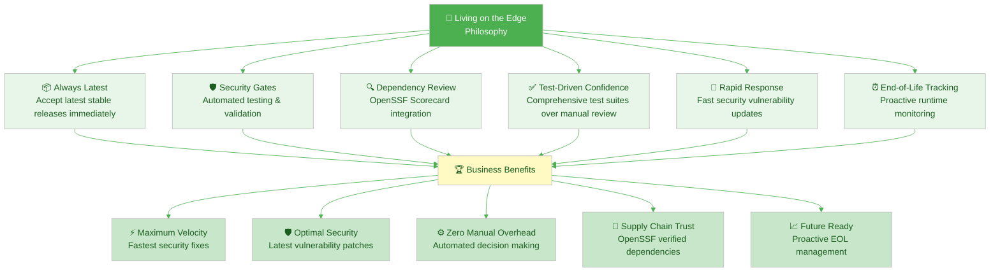
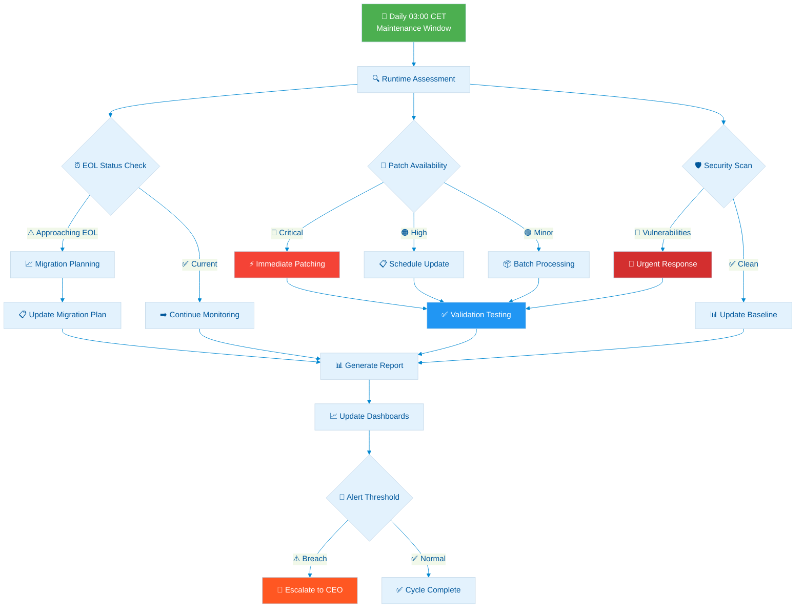
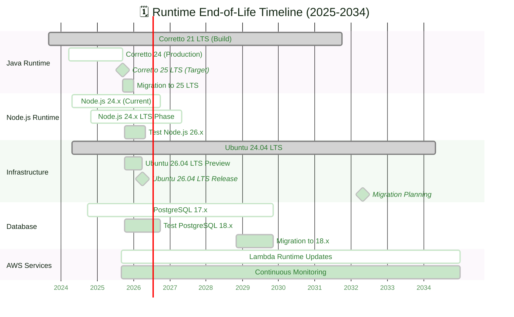
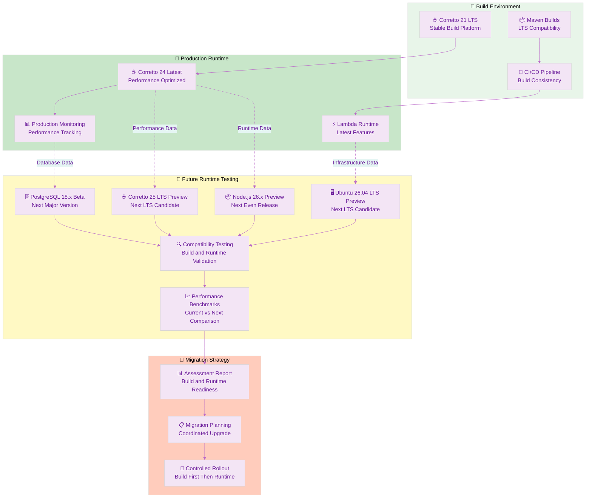

  

<h1 align="center">🔍 Hack23 AB — Vulnerability Management Policy</h1>

  <strong>Proactive Security Through Intelligent Dependency Management</strong> 
  <em>Optimal Version Selection • Daily Monitoring • Weekly Releases • Downstream Transparency</em>

  
  
  
  

**📋 Document Owner:** CEO | **📄 Version:** 2.0 | **📅 Last Updated:** 2025-11-14 (UTC)  
**🔄 Review Cycle:** Monthly | **⏰ Next Review:** 2025-12-14

---

## 🎯 **Purpose Statement**

**Hack23 AB's** vulnerability management establishes systematic procedures for proactive vulnerability discovery, intelligent remediation, and transparent security communication across all information systems and dependencies. Our approach demonstrates cybersecurity consulting expertise through measurable security outcomes while ensuring operational resilience.

This policy implements our **bleeding-edge dependency management strategy** - adopting latest stable releases with comprehensive automated testing, security validation, and proactive end-of-life management. This approach enables **operational excellence** through immediate security patches, **cost efficiency** through reduced technical debt, and **competitive advantage** through demonstrable security expertise.

Our systematic vulnerability management integrates cutting-edge automation with enterprise-grade security controls, providing transparent vulnerability disclosure and measurable risk reduction aligned with our [🏷️ Classification Framework](https://github.com/Hack23/ISMS-PUBLIC/blob/main/CLASSIFICATION.md) business impact analysis.

*— James Pether Sörling, CEO/Founder*

---

## 🔍 **Purpose & Scope**

This policy establishes a comprehensive framework for proactive vulnerability discovery, intelligent remediation, and transparent security communication across all Hack23 AB systems and dependencies.

**Scope:** All information assets in [💻 Asset Register](./Asset_Register.md), including:
- **🏗️ Source Code:** Application vulnerabilities via SAST/DAST scanning
- **📦 Dependencies:** Third-party libraries and frameworks via SCA analysis  
- **☁️ Cloud Infrastructure:** AWS services via Inspector, Security Hub, and Config
- **🌐 SaaS Services:** Third-party platforms via security posture monitoring
- **🔐 Secrets Management:** Credential exposure via secret scanning

**Policy Integration:**
- **🛠️ Secure Development:** Aligned with [🛠️ Secure Development Policy](./Secure_Development_Policy.md) security gates
- **🔓 Open Source:** Integrated with [🔓 Open Source Policy](./Open_Source_Policy.md) contribution workflows
- **🔐 Information Security:** Supporting [🔐 Information Security Policy](./Information_Security_Policy.md) risk framework

---

## 🚀 **Proactive Dependency Management Strategy**

### 📊 **"Living on the Bleeding Edge" Philosophy** 

Our security-first approach prioritizes latest stable releases with comprehensive automated testing, demonstrating how bleeding-edge dependency management creates competitive advantages:

### ⚡ **Bleeding-Edge with Safety Controls**

#### **🚀 Latest Release Strategy**
Our approach combines bleeding-edge dependency updates with comprehensive security controls and proactive end-of-life management:

1. **📦 Always Latest:** Accept Dependabot PRs for latest stable releases immediately
2. **🛡️ Security Gates:** Automated testing and security validation before merge
3. **🔍 Dependency Review:** GitHub's Dependency Review Action with OpenSSF Scorecard integration
4. **✅ Test-Driven Confidence:** Trust comprehensive test suites over manual review
5. **🚨 Rapid Response:** Fast updates for security vulnerabilities
6. **⏰ EOL Tracking:** Proactive monitoring of runtime and dependency lifecycles

#### **📊 Living on the Edge Principles**

| Principle | Implementation | Business Value | Integration Point |
|-----------|----------------|----------------|------------------|
| **🚀 Speed First** | <4 hours for critical patches |  | [🚨 Incident Response Plan](./Incident_Response_Plan.md) |
| **🛡️ Safety Always** | Comprehensive automated testing |  | [🛠️ Secure Development Policy](./Secure_Development_Policy.md) |
| **🤖 Automation Over Manual** | Zero-touch dependency decisions |  | [📝 Change Management](./Change_Management.md) |
| **🔍 Intelligence Driven** | OpenSSF scorecard integration |  | [📊 Security Metrics](./Security_Metrics.md) |
| **🌟 Transparency First** | Public vulnerability status |  | [🌐 ISMS Transparency Plan](./ISMS_Transparency_Plan.md) |
| **📈 Future Ready** | Proactive EOL management |  | [💻 Asset Register](./Asset_Register.md) |

#### **📊 Dependency Update Classification**

| Update Type | Response Time | Security Gate | Merge Strategy | Risk Level | EOL Consideration |
|-------------|---------------|---------------|----------------|------------|------------------|
| **🔴 Security Patches** | <4 hours | Dependency Review + Tests | Auto-merge on green |  | Immediate regardless of EOL |
| **🟠 Major Releases** | <24 hours | Full test suite + review | Auto-merge on green |  | Check EOL timeline alignment |
| **🟡 Minor Releases** | <8 hours | Standard testing | Auto-merge on green |  | Prefer LTS versions |
| **🟢 Patch Releases** | <2 hours | Basic validation | Immediate auto-merge |  | Always apply within support window |

---

#### **⚡ Rapid Security Response Protocol**

| Vulnerability Severity | Detection Method | Response Time | Automated Actions |
|------------------------|------------------|---------------|-------------------|
| **🔴 Critical (CVSS >9.0)** | GitHub Security Advisories | <4 hours | Immediate PR creation + auto-merge |
| **🟠 High (CVSS 7.0-8.9)** | Dependabot alerts | <8 hours | Priority PR + enhanced testing |
| **🟡 Medium (CVSS 4.0-6.9)** | Scheduled scans | <24 hours | Standard PR workflow |
| **🟢 Low (CVSS <4.0)** | Weekly reviews | <72 hours | Batch with other updates |

---

## 📊 **Risk-Based Remediation Matrix**

### ⏱️ **Enhanced SLA Framework**

Based on [🏷️ Classification Framework](https://github.com/Hack23/ISMS-PUBLIC/blob/main/CLASSIFICATION.md) business impact analysis:

| Severity | Business Impact | Technical Impact | Remediation SLA | Exception Process | Escalation |
|----------|-----------------|------------------|-----------------|-------------------|------------|
| **🔴 Critical** |   | Exploited in wild, CVSS ≥9.0 | **24 hours** | CEO approval required | Same day |
| **🟠 High** |   | Active exploits, CVSS 7.0-8.9 | **7 days** | [📉 Risk Register](./Risk_Register.md) entry | Daily status |
| **🟡 Medium** |   | Proof of concept, CVSS 4.0-6.9 | **30 days** | Business justification | Weekly review |
| **🟢 Low** |   | Theoretical risk, CVSS <4.0 | **90 days** | Documented rationale | Monthly review |

### 🎯 **Contextual Risk Assessment**

Beyond CVSS scoring, comprehensive risk evaluation considering:

#### **🏗️ Environmental Factors**
- **🌐 Network Exposure:** Public-facing vs. internal services per [🌐 Network Security Policy](./Network_Security_Policy.md)
- **🏷️ Data Classification:** Per [🏷️ Data Classification Policy](./Data_Classification_Policy.md) impact levels
- **🔑 Authentication Requirements:** MFA protected vs. unauthenticated access per [🔑 Access Control Policy](./Access_Control_Policy.md)
- **🛡️ Compensating Controls:** WAF, network segmentation, monitoring effectiveness

#### **📊 Business Context Integration**
- **💰 Revenue Impact:** Service criticality per [💻 Asset Register](./Asset_Register.md) business classification
- **⚖️ Compliance Requirements:** Regulatory implications per [✅ Compliance Checklist](./Compliance_Checklist.md)
- **🤝 Customer Impact:** Downstream effects on consulting clients
- **🌟 Reputation Risk:** Public disclosure implications per [🌐 ISMS Transparency Plan](./ISMS_Transparency_Plan.md)

---

## 📅 **Daily Operations & Weekly Release Cycle**

### 🔄 **Continuous Dependency Monitoring**

#### **📊 GitHub Dependency Review Integration**
Comprehensive dependency security validation integrated with [🛠️ Secure Development Policy](./Secure_Development_Policy.md) security gates:

**🛡️ Security Gate Configuration:**
- **📊 Dependency Review Action:** Automated vulnerability and license compliance checking
- **🔍 OpenSSF Scorecard:** Supply chain security assessment integration  
- **⚖️ License Compliance:** Automated approval/denial based on acceptable license list per [🔓 Open Source Policy](./Open_Source_Policy.md)
- **🚨 Severity Thresholds:** Configurable blocking levels per [📉 Risk Register](./Risk_Register.md)

**📋 Implementation Reference:** 
- **Configuration Standards:** [📝 Change Management](./Change_Management.md) procedures
- **Quality Gates:** [🛠️ Secure Development Policy](./Secure_Development_Policy.md) enforcement
- **Service Details:** [💻 Asset Register](./Asset_Register.md) GitHub configuration
- **Dependency SLAs:** [🤝 Third Party Management](./Third_Party_Management.md) requirements

#### **🤖 Automated Dependabot Configuration**
Daily dependency monitoring aligned with [📊 Security Metrics](./Security_Metrics.md) performance tracking:

**🔄 Automated Update Strategy:**
- **📅 Daily Schedule:** 09:00 CET dependency scanning cadence
- **📋 Pull Request Management:** Maximum 10 concurrent updates per repository
- **👥 Review Assignment:** Automated approval workflow per [🔑 Access Control Policy](./Access_Control_Policy.md)
- **🏷️ Labeling Strategy:** Automated categorization for tracking and metrics
- **📦 Dependency Types:** All dependency categories with version-specific rules

**🔗 Policy Integration:** 
- **Configuration Management:** [📝 Change Management](./Change_Management.md) standards
- **Security Enforcement:** [🛠️ Secure Development Policy](./Secure_Development_Policy.md) gates
- **Performance Tracking:** [📊 Security Metrics](./Security_Metrics.md) KPI framework

### ⚡ **Automated Merge Strategy**

#### **🔍 Security Gate Validation**
All Dependabot PRs automatically merge when ALL conditions met:

1. **✅ Dependency Review Passes:**
   - No known high/critical vulnerabilities
   - OpenSSF Scorecard > 5.0 (where available - relaxed threshold)
   - License compliance verified per [🔓 Open Source Policy](./Open_Source_Policy.md)
   - Supply chain risk assessment passed

2. **✅ Comprehensive Test Suite:**
   - Unit tests: 100% pass rate
   - Integration tests: 100% pass rate
   - Security tests: SAST + secret scanning pass per [🛠️ Secure Development Policy](./Secure_Development_Policy.md)
   - Build verification: Successful deployment

3. **✅ Security Scanning Clear:**
   - SonarCloud quality gate: Passed
   - GitHub secret scanning: No new secrets
   - CodeQL analysis: No new vulnerabilities
   - FOSSA license scan: Compliant per [🔓 Open Source Policy](./Open_Source_Policy.md)

4. **✅ Automated Validation:**
   - PR title follows conventional commits
   - Dependency version is latest stable
   - No breaking changes in patch/minor updates
   - Changelog automatically generated

---

## 🧪 **Advanced Security Controls**

### 🔍 **Supply Chain Security Framework**

#### **📊 OpenSSF Scorecard Integration**
Automated evaluation of dependency security posture per [🔓 Open Source Policy](./Open_Source_Policy.md):

| Scorecard Check | Weight | Action Threshold | Automated Response |
|-----------------|--------|------------------|-------------------|
| **📝 Code Review** | High | Score < 6.0 | Manual review required |
| **🔄 Maintained** | High | Score < 5.0 | Flag for assessment |
| **🧪 CI Tests** | Medium | Score < 4.0 | Enhanced testing |
| **🛡️ SAST** | High | Score < 5.0 | Additional security scan |
| **📦 Dependency Update** | Medium | Score < 3.0 | Monitor closely |
| **🚨 Vulnerabilities** | Critical | Score < 7.0 | Block unless patched |
| **📦 Binary Artifacts** | Medium | Score < 6.0 | Review build process |
| **🔒 Branch Protection** | High | Score < 5.0 | Verify upstream security |
| **🔑 Token Permissions** | High | Score < 6.0 | Check CI/CD security |
| **📌 Pinned Dependencies** | Low | Score < 2.0 | Document as acceptable |

**🔗 Integration Points:**
- **📊 Scoring Thresholds:** Risk tolerance levels defined in [📉 Risk Register](./Risk_Register.md)
- **🔄 Process Integration:** Review workflows specified in [🤝 Third Party Management](./Third_Party_Management.md)
- **📈 Performance Tracking:** Scorecard trends monitored via [📊 Security Metrics](./Security_Metrics.md)

## 📅 **End-of-Life Strategy Requirements**

### 🎯 **Mandatory EOL Documentation**
Aligned with [🛠️ Secure Development Policy](./Secure_Development_Policy.md), all Hack23 AB projects **MUST** maintain comprehensive End-of-Life strategies.

#### **📋 Required EOL Documentation**
Every project repository **MUST** include:
- **📄 End-of-Life-Strategy.md** - Comprehensive EOL planning and technology stack analysis
- **📊 Technology Stack Matrix** - Current dependencies with EOL dates and migration paths
- **⚡ EOL Trigger Conditions** - Clear criteria for project retirement or major migration
- **🔄 Maintenance Strategy** - Ongoing support approach until EOL condition met

#### **⚡ Living on the Edge EOL Principles**
- **🚀 Latest Until Blocked:** Continue latest versions until architectural barriers
- **🔄 Proactive Migration Planning:** Identify migration triggers before EOL dates
- **📊 Cost-Benefit Analysis:** Balance migration cost against security/support benefits
- **🛡️ Security-First Decisions:** Prioritize security support over feature compatibility
- **📈 Transparency Requirements:** Public EOL documentation demonstrating expertise

#### **📋 EOL Compliance Checklist**
- [ ] **📄 EOL Strategy Document** - Complete strategy with technology matrix
- [ ] **📊 Dependency Tracking** - Automated EOL date monitoring
- [ ] **⚡ Clear Trigger Conditions** - Specific retirement criteria
- [ ] **🔄 Migration Planning** - Documented paths for major transitions
- [ ] **🌟 Public Transparency** - EOL status visible to stakeholders
- [ ] **🤖 Automated Monitoring** - Dependency and EOL tracking integration

---

## 🔧 **Tool Integration & Automation**

### 📦 **Software Composition Analysis (SCA)**

#### 🎯 **GitHub Advanced Security Integration**

| Tool Category | Primary Tool | Coverage | Integration Point | Automation Level |
|---------------|--------------|----------|-------------------|------------------|
| **📦 Dependency Analysis** | GitHub Dependabot | All repositories | Pull request automation |  |
| **🔍 License Compliance** | FOSSA | Open source projects | CI/CD pipeline |  |
| **🔐 Secret Scanning** | GitHub Native | All code commits | Real-time scanning |  |
| **🔬 Code Analysis** | SonarCloud | All repositories | Quality gate enforcement |  |

#### ☁️ AWS Runtime Monitoring
Integration with AWS security services for operational vulnerability management:

| Monitoring Layer | Service | Detection Capability | Response Action | Metrics Integration |
|------------------|---------|---------------------|------------------|-------------------|
| **🌐 Network** | GuardDuty | Malicious traffic, crypto-mining | Automated blocking | Real-time dashboards |
| **🏗️ Infrastructure** | Inspector | Runtime vulnerabilities | Patch orchestration | Weekly compliance |
| **📊 Configuration** | Config | Security misconfigurations | Auto-remediation | Drift detection |
| **🔍 Application** | Security Hub | Code vulnerabilities in production | Alert + manual review | Performance tracking |

**🔗 Monitoring Integration Framework:**
- **💻 Service Configuration:** AWS security service setup detailed in [💻 Asset Register](./Asset_Register.md) infrastructure section
- **📊 Dashboard Integration:** Real-time monitoring integrated with [📊 Security Metrics](./Security_Metrics.md) KPI framework
- **🚨 Alert Response:** Detection and response procedures aligned with [🚨 Incident Response Plan](./Incident_Response_Plan.md)
- **🔄 Process Improvement:** Monitoring effectiveness reviewed through [📝 Change Management](./Change_Management.md)

## ⏰ **Proactive Runtime & Operations Management**

### **📋 Daily Proactive Maintenance Framework**

### **🏗️ Systems Manager Automation**

| Component | Service | Frequency | Action | Integration |
|-----------|---------|-----------|--------|-------------|
| **🖥️ Lambda Runtime** | Systems Manager | Daily | Version compliance check | [💻 Asset Register](./Asset_Register.md) runtime inventory |
| **💾 RDS PostgreSQL** | RDS Automated Patching | Weekly | Minor version updates during maintenance | [💾 Backup Recovery Policy](./Backup_Recovery_Policy.md) |
| **📦 Container Images** | Inspector v2 | Continuous | Base image vulnerability scanning | [🛠️ Secure Development Policy](./Secure_Development_Policy.md) |
| **⚙️ Node.js Dependencies** | Dependabot | Daily | Package security updates | [🔓 Open Source Policy](./Open_Source_Policy.md) |
| **☁️ AWS Service EOL** | Config Rules | Weekly | Service deprecation monitoring | [📊 Security Metrics](./Security_Metrics.md) |

### 📈 **End-of-Life Tracking Matrix**

Proactive monitoring using [endoflife.date](https://endoflife.date/) references for all critical runtimes:

#### **🔄 Runtime EOL Management**

| Runtime | Build/Compile Version | Production Version | EOL Date | Proactive Action | Reference |
|---------|----------------------|-------------------|----------|-----------------|-----------|
| **☕ Amazon Corretto JDK** | 21.0.4 (LTS Build) | 24.x (Latest Prod) | Sep 2031 (21 LTS) |  | [Amazon Corretto EOL](https://endoflife.date/amazon-corretto) |
| **📦 Node.js** | 24.x (Latest) | 24.x (Latest) | Oct 2026 |  | [Node.js EOL](https://endoflife.date/nodejs) |
| **🖥️ Ubuntu (Lambda base)** | 24.04 LTS | 24.04 LTS | Apr 2034 |  | [Ubuntu EOL](https://endoflife.date/ubuntu) |
| **⚡ AWS Lambda Runtime** | Java 21 / Node.js 24 | Java 24 / Node.js 24 | Runtime Dependent |  | [AWS Lambda EOL](https://endoflife.date/aws-lambda) |
| **🗄️ Amazon RDS PostgreSQL** | 17.x (Latest) | 17.x (Latest) | Nov 2029 |  | [RDS PostgreSQL EOL](https://endoflife.date/amazon-rds-postgresql) |

#### **📅 EOL Timeline Visualization**

#### **🧪 Future Runtime Testing Strategy**

#### **📈 LTS vs Latest Strategy Matrix**

| Component | Production Strategy | Testing Strategy | Migration Trigger | Benefits |
|-----------|-------------------|------------------|------------------|----------|
| **☕ Java Build** | LTS (Corretto 21) | Next LTS Preview (25) | Java 25 LTS release + 6 months | Build stability + Runtime performance |
| **📦 Node.js** | Latest (24.x ahead of LTS) | Next Even Release (26.x) | Node.js 24 becomes unsupported | Latest features + future readiness |
| **🗄️ PostgreSQL** | Latest Major (17.x) | Next Major Beta (18.x) | 12 months before EOL | Latest features + security |
| **🖥️ Ubuntu Base** | Current LTS (24.04) | Next LTS Preview (26.04) | 18 months before EOL | LTS stability + migration readiness |
| **☁️ AWS Services** | Latest Supported | Preview/Beta features | Feature-driven adoption | Latest capabilities + early access |

---

## 📊 **Performance Measurement & Metrics**

Aligned with [📊 Security Metrics](./Security_Metrics.md) framework and proactive runtime management:

### **🎯 Proactive Management Metrics**

| KPI Category | Metric | Target | Current | Trend | Business Impact |
|--------------|--------|--------|---------|-------|----------------|
| **📦 Dependency Health** | % Components in Optimal Zone | >80% | TBD | 📈 | 💰 Cost Efficiency |
| **⚡ Response Efficiency** | Critical Vuln MTTR | <24 hours | TBD | 📈 | 💰 Revenue Protection |
| **🔄 Update Success Rate** | Optimal Version Selection | >90% | TBD | 📈 | ⚙️ Operational Excellence |
| **📊 Discovery Effectiveness** | Proactive vs. Reactive Ratio | >70% proactive | TBD | 📈 | 🛡️ Risk Reduction |
| **🌐 Transparency Score** | Downstream Notification Rate | 100% | TBD | 📈 | 🤝 Customer Trust |
| **⏰ EOL Preparedness** | Components >12mo from EOL | >95% | TBD | 📈 | 🏆 Competitive Advantage |
| **🔧 Maintenance Success** | Daily Maintenance Window Success | >98% | TBD | 📈 | ⚙️ Operational Excellence |
| **🧪 Future Readiness** | Pre-production Runtime Testing | 100% coverage | TBD | 📈 | 💡 Innovation Enablement |

---

## 📝 **Communication & Notification Framework**

### 📢 **Stakeholder Communication Matrix**

| Stakeholder Group | Communication Trigger | Method | Timeline | Content |
|------------------|----------------------|--------|----------|---------|
| **👨‍💼 CEO** | All vulnerabilities | 📱 Mobile alert + 📧 Email | Immediate | Executive summary + business impact |
| **🤝 Clients** | High/Critical affecting services | 📧 Email notification | <2 hours | Impact assessment + timeline |
| **🏦 Insurance Provider** | Critical vulnerabilities | 📞 Phone + 📧 Email | <4 hours | Incident details + remediation plan |
| **⚖️ Legal Counsel** | Regulatory implications | 📧 Secure email | <8 hours | Legal assessment + compliance impact |
| **🌐 Public/Community** | Public-facing services | 🌐 Status page update | <1 hour | Transparent status + progress |

### 📋 **Disclosure Framework**

#### **🌟 Transparency-First Approach**

| Vulnerability Type | Disclosure Level | Timeline | Channel |
|-------------------|-----------------|----------|---------|
| **🔴 Critical** | Full transparency post-fix | <24 hours after remediation | GitHub Security Advisory + Blog |
| **🟠 High** | Detailed disclosure | <48 hours after remediation | GitHub Security Advisory |
| **🟡 Medium** | Standard disclosure | <1 week after remediation | Security metrics update |
| **🟢 Low** | Metrics only | Monthly summary | Security dashboard |

---

## 📚 **Related Documents**

### **🛠️ Core Security Framework Integration**
- **[🛠️ Secure Development Policy](./Secure_Development_Policy.md)** — Security-integrated development lifecycle and vulnerability prevention
- **[🔓 Open Source Policy](./Open_Source_Policy.md)** — Open source contribution strategy and community engagement
- **[🔐 Information Security Policy](./Information_Security_Policy.md)** — Overall security governance and risk management framework
- **[🏷️ Classification Framework](https://github.com/Hack23/ISMS-PUBLIC/blob/main/CLASSIFICATION.md)** — Business impact analysis and risk prioritization methodology

### **🔄 Operational Process Integration**  
- **[📊 Security Metrics](./Security_Metrics.md)** — Performance measurement, KPI tracking, and continuous improvement
- **[🚨 Incident Response Plan](./Incident_Response_Plan.md)** — Security incident coordination and vulnerability-related emergency response
- **[📝 Change Management](./Change_Management.md)** — Controlled modification procedures with security impact assessment
- **[💻 Asset Register](./Asset_Register.md)** — Information asset inventory and security control mapping

### **📋 Risk and Compliance Framework**
- **[📉 Risk Register](./Risk_Register.md)** — Risk identification, assessment, and treatment tracking
- **[🤝 Third Party Management](./Third_Party_Management.md)** — Supplier security risk management and vulnerability coordination
- **[✅ Compliance Checklist](./Compliance_Checklist.md)** — Regulatory requirement tracking and vulnerability management obligations
- **[🌐 ISMS Transparency Plan](./ISMS_Transparency_Plan.md)** — Public disclosure strategy and transparency commitments

### **🛡️ Security Policy Alignment**
- **[🏷️ Data Classification Policy](./Data_Classification_Policy.md)** — Information protection requirements and handling procedures
- **[🔒 Cryptography Policy](./Cryptography_Policy.md)** — Encryption standards and cryptographic vulnerability management
- **[🔑 Access Control Policy](./Access_Control_Policy.md)** — Identity management and authentication security
- **[🌐 Network Security Policy](./Network_Security_Policy.md)** — Network protection and infrastructure vulnerability management

### **🔄 Business Continuity Integration**
- **[🔄 Business Continuity Plan](./Business_Continuity_Plan.md)** — Business recovery procedures and continuity strategies
- **[🆘 Disaster Recovery Plan](./Disaster_Recovery_Plan.md)** — Emergency recovery workflows and procedures
- **[💾 Backup Recovery Policy](./Backup_Recovery_Policy.md)** — Data protection and recovery procedures

### **📚 External References**
- **[☕ Amazon Corretto EOL](https://endoflife.date/amazon-corretto)** — Java runtime end-of-life tracking
- **[📦 Node.js EOL](https://endoflife.date/nodejs)** — Node.js runtime lifecycle management
- **[🖥️ Ubuntu EOL](https://endoflife.date/ubuntu)** — Ubuntu LTS release lifecycle
- **[⚡ AWS Lambda EOL](https://endoflife.date/aws-lambda)** — Lambda runtime deprecation timeline
- **[🗄️ RDS PostgreSQL EOL](https://endoflife.date/amazon-rds-postgresql)** — PostgreSQL version support lifecycle

---

**📋 Document Control:**  
**✅ Approved by:** James Pether Sörling, CEO  
**📤 Distribution:** Public  
**🏷️ Classification:**   
**📅 Effective Date:** 2025-11-14  
**⏰ Next Review:** 2025-12-14   
**🎯 Framework Compliance:**    
